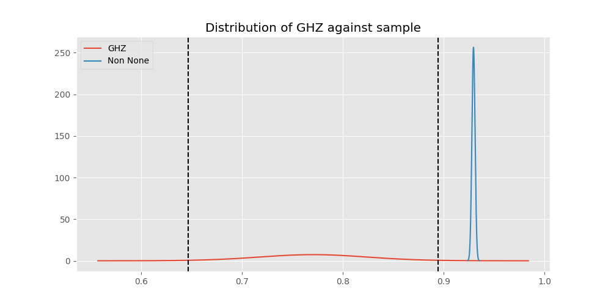

# Testing Results For GHZ 
$H_{0}$: There is not a difference in collection success against GHZ 
$H_{A}$: There is a difference in collection success against GHZ
An $\alpha$ of 0.025 was used 
Out of 2 tests, there were 2 rejections from 2 independent-t test.
Out of 2 tests, there were 2 rejections from 2 Man Whitney u-tests.
## Testing Results for GHZ against VHF 
GHZ has a success rate of 0.7704918032786885
VHF has a success rate of 0.9246835443037975
$H_{0}$: There is not a difference between GHZ and VHF
$H_{A}$: There is a difference between GHZ and VHF
An $/alpha$ of 0.025 was used in this test.
__independent t-testing__: With a t-statistic of -4.507740658439398 and a p-value of 6.669229215489962e-06, _we **reject** the null hypothssis_
__Man-Whitney testing__: With a u-statistic of 163038.0 and a p-value of 6.768057015334312e-06, _we **reject** the null hypothssis_
 
## Testing Results for GHZ against UHF 
GHZ has a success rate of 0.7704918032786885
UHF has a success rate of 0.9308569503921474
$H_{0}$: There is not a difference between GHZ and UHF
$H_{A}$: There is a difference between GHZ and UHF
An $/alpha$ of 0.025 was used in this test.
__independent t-testing__: With a t-statistic of -4.91693258516397 and a p-value of 8.85793698098116e-07, _we **reject** the null hypothssis_
__Man-Whitney testing__: With a u-statistic of 532229.0 and a p-value of 8.915616954552981e-07, _we **reject** the null hypothssis_
 
