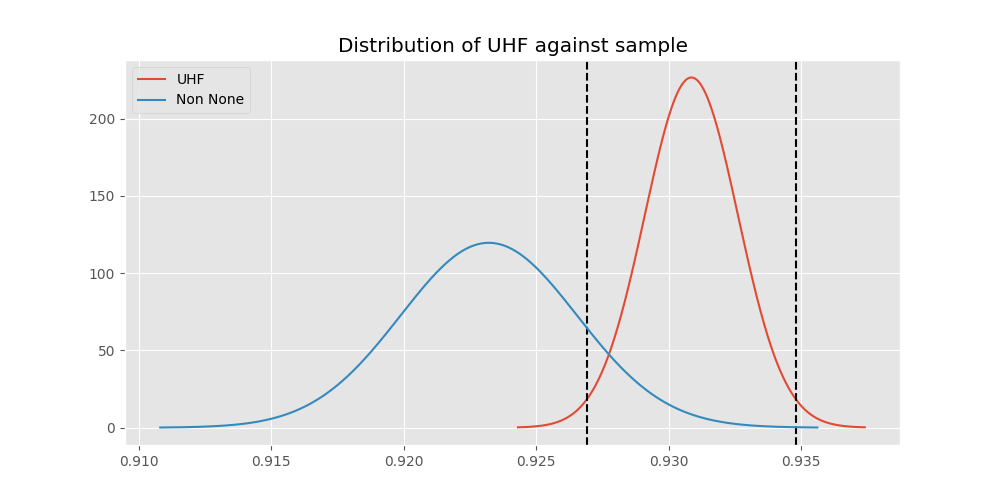
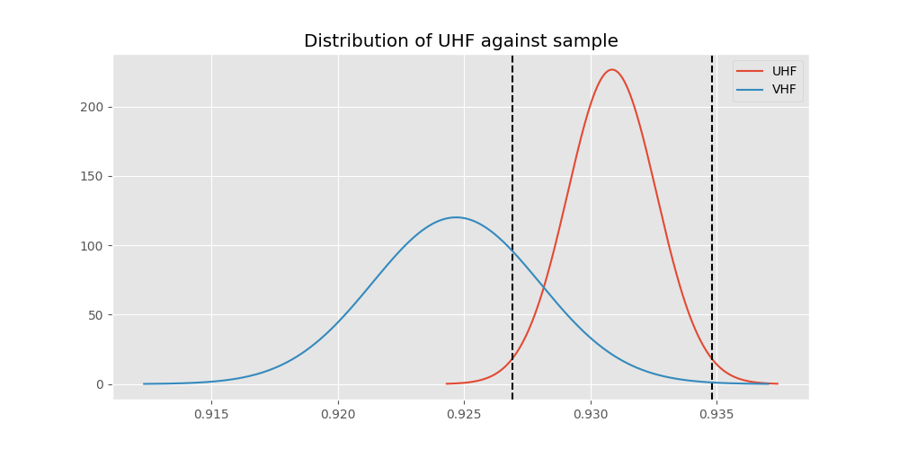
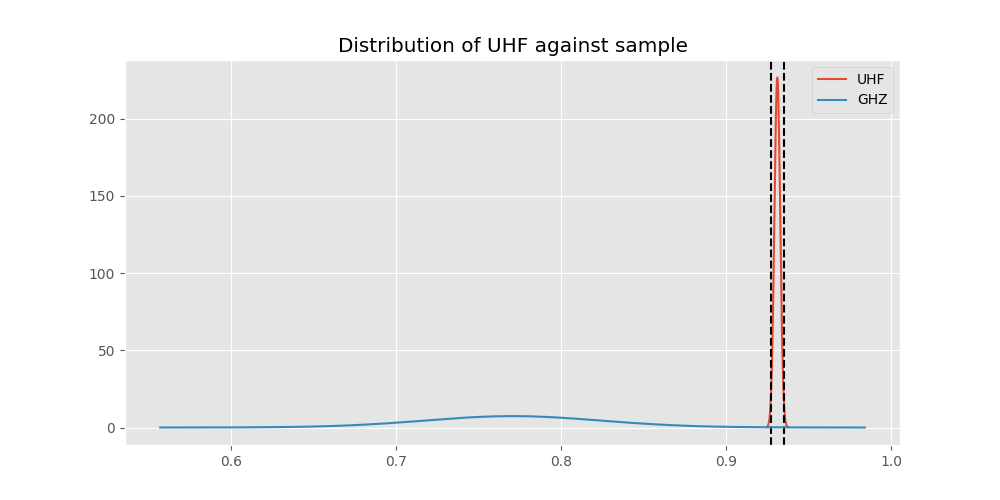

# Testing Results For UHF 
$H_{0}$: There is not a difference in collection success against UHF 
$H_{A}$: There is a difference in collection success against UHF
An $\alpha$ of 0.025 was used 
Out of 2 tests, there were 1 rejections from 2 independent-t test.
Out of 2 tests, there were 1 rejections from 2 Man Whitney u-tests.
## Testing Results for UHF against VHF 
UHF has a success rate of 0.9308569503921474
VHF has a success rate of 0.9246835443037975
$H_{0}$: There is not a difference between UHF and VHF
$H_{A}$: There is a difference between UHF and VHF
An $/alpha$ of 0.025 was used in this test.
__independent t-testing__: With a t-statistic of 1.6779582533512585 and a p-value of 0.09336677942264118, _we failed to reject the null hypothssis_
__Man-Whitney testing__: With a u-statistic of 66079714.0 and a p-value of 0.09336662561869703, _we failed to reject the null hypothssis_
 
## Testing Results for UHF against GHZ 
UHF has a success rate of 0.9308569503921474
GHZ has a success rate of 0.7704918032786885
$H_{0}$: There is not a difference between UHF and GHZ
$H_{A}$: There is a difference between UHF and GHZ
An $/alpha$ of 0.025 was used in this test.
__independent t-testing__: With a t-statistic of 4.91693258516397 and a p-value of 8.85793698098116e-07, _we **reject** the null hypothssis_
__Man-Whitney testing__: With a u-statistic of 735534.0 and a p-value of 8.915616954552981e-07, _we **reject** the null hypothssis_
 
