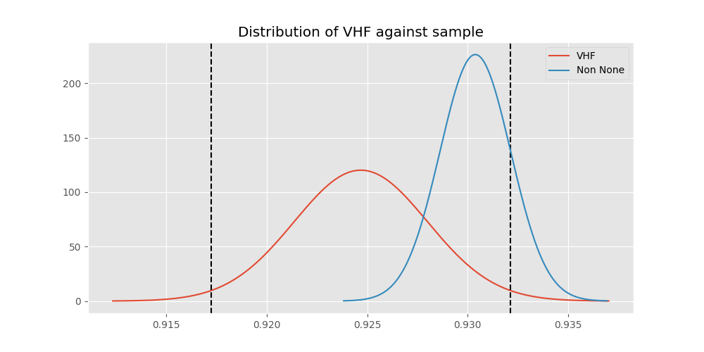
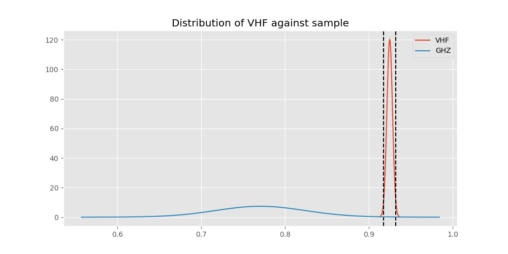

# Testing Results For VHF 
$H_{0}$: There is not a difference in collection success against VHF 
$H_{A}$: There is a difference in collection success against VHF
An $\alpha$ of 0.025 was used 
Out of 2 tests, there were 1 rejections from 2 independent-t test.
Out of 2 tests, there were 1 rejections from 2 Man Whitney u-tests.
## Testing Results for VHF against UHF 
VHF has a success rate of 0.9246835443037975
UHF has a success rate of 0.9308569503921474
$H_{0}$: There is not a difference between VHF and UHF
$H_{A}$: There is a difference between VHF and UHF
An $/alpha$ of 0.025 was used in this test.
__independent t-testing__: With a t-statistic of -1.6779582533512585 and a p-value of 0.09336677942264118, _we failed to reject the null hypothssis_
__Man-Whitney testing__: With a u-statistic of 65268846.0 and a p-value of 0.09336662561869703, _we failed to reject the null hypothssis_
 
## Testing Results for VHF against GHZ 
VHF has a success rate of 0.9246835443037975
GHZ has a success rate of 0.7704918032786885
$H_{0}$: There is not a difference between VHF and GHZ
$H_{A}$: There is a difference between VHF and GHZ
An $/alpha$ of 0.025 was used in this test.
__independent t-testing__: With a t-statistic of 4.507740658439398 and a p-value of 6.669229215489962e-06, _we **reject** the null hypothssis_
__Man-Whitney testing__: With a u-statistic of 222482.0 and a p-value of 6.768057015334312e-06, _we **reject** the null hypothssis_
 
