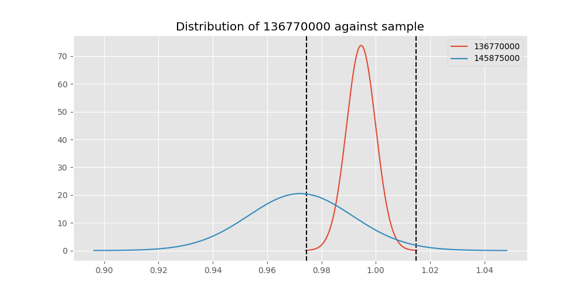

# Testing Results For 136770000 
$H_{0}$: There is not a difference in collection success against 136770000 
$H_{A}$: There is a difference in collection success against 136770000
An $\alpha$ of 0.00025 was used 
Out of 44 tests, there were 16 rejections from 44 independent-t test.
Out of 44 tests, there were 16 rejections from 44 Man Whitney u-tests.
## Testing Results for 136770000 against 436501000 
136770000 has a success rate of 0.9945945945945946
436501000 has a success rate of 0.9854014598540146
$H_{0}$: There is not a difference between 136770000 and 436501000
$H_{A}$: There is a difference between 136770000 and 436501000
An $/alpha$ of 0.00025 was used in this test.
__independent t-testing__: With a t-statistic of 0.8472573927529043 and a p-value of 0.3974848857328105, _we failed to reject the null hypothssis_
__Man-Whitney testing__: With a u-statistic of 12789.0 and a p-value of 0.39867381701156734, _we failed to reject the null hypothssis_
 
## Testing Results for 136770000 against 437375000 
136770000 has a success rate of 0.9945945945945946
437375000 has a success rate of 0.9982014388489209
$H_{0}$: There is not a difference between 136770000 and 437375000
$H_{A}$: There is a difference between 136770000 and 437375000
An $/alpha$ of 0.00025 was used in this test.
__independent t-testing__: With a t-statistic of -0.8183372866544613 and a p-value of 0.41342840922316304, _we failed to reject the null hypothssis_
__Man-Whitney testing__: With a u-statistic of 51244.5 and a p-value of 0.41432071746042065, _we failed to reject the null hypothssis_
 
## Testing Results for 136770000 against 436500000 
136770000 has a success rate of 0.9945945945945946
436500000 has a success rate of 0.9056603773584906
$H_{0}$: There is not a difference between 136770000 and 436500000
$H_{A}$: There is a difference between 136770000 and 436500000
An $/alpha$ of 0.00025 was used in this test.
__independent t-testing__: With a t-statistic of 3.983050622693875 and a p-value of 8.31557922410646e-05, _we **reject** the null hypothssis_
__Man-Whitney testing__: With a u-statistic of 16015.5 and a p-value of 9.7006306952566e-05, _we **reject** the null hypothssis_
 
## Testing Results for 136770000 against 436990000 
136770000 has a success rate of 0.9945945945945946
436990000 has a success rate of 0.9572649572649573
$H_{0}$: There is not a difference between 136770000 and 436990000
$H_{A}$: There is a difference between 136770000 and 436990000
An $/alpha$ of 0.00025 was used in this test.
__independent t-testing__: With a t-statistic of 2.383568889513208 and a p-value of 0.017592384814776894, _we failed to reject the null hypothssis_
__Man-Whitney testing__: With a u-statistic of 22453.0 and a p-value of 0.01784272827348384, _we failed to reject the null hypothssis_
 
## Testing Results for 136770000 against 145875000 
136770000 has a success rate of 0.9945945945945946
145875000 has a success rate of 0.9722222222222222
$H_{0}$: There is not a difference between 136770000 and 145875000
$H_{A}$: There is a difference between 136770000 and 145875000
An $/alpha$ of 0.00025 was used in this test.
__independent t-testing__: With a t-statistic of 1.500254723509561 and a p-value of 0.1347855283316712, _we failed to reject the null hypothssis_
__Man-Whitney testing__: With a u-statistic of 6809.0 and a p-value of 0.13580903004129463, _we failed to reject the null hypothssis_
 
## Testing Results for 136770000 against 437800000 
136770000 has a success rate of 0.9945945945945946
437800000 has a success rate of 0.9533678756476683
$H_{0}$: There is not a difference between 136770000 and 437800000
$H_{A}$: There is a difference between 136770000 and 437800000
An $/alpha$ of 0.00025 was used in this test.
__independent t-testing__: With a t-statistic of 2.5108690660812774 and a p-value of 0.012462204683445686, _we failed to reject the null hypothssis_
__Man-Whitney testing__: With a u-statistic of 18588.5 and a p-value of 0.012713507776454901, _we failed to reject the null hypothssis_
 
## Testing Results for 136770000 against 145810000 
136770000 has a success rate of 0.9945945945945946
145810000 has a success rate of 0.12179487179487179
$H_{0}$: There is not a difference between 136770000 and 145810000
$H_{A}$: There is a difference between 136770000 and 145810000
An $/alpha$ of 0.00025 was used in this test.
__independent t-testing__: With a t-statistic of 35.15914045513414 and a p-value of 4.081987046934638e-115, _we **reject** the null hypothssis_
__Man-Whitney testing__: With a u-statistic of 27024.5 and a p-value of 5.63824617974617e-60, _we **reject** the null hypothssis_
 
## Testing Results for 136770000 against 437095000 
136770000 has a success rate of 0.9945945945945946
437095000 has a success rate of 0.9361702127659575
$H_{0}$: There is not a difference between 136770000 and 437095000
$H_{A}$: There is a difference between 136770000 and 437095000
An $/alpha$ of 0.00025 was used in this test.
__independent t-testing__: With a t-statistic of 2.7815039010215252 and a p-value of 0.005859514744835827, _we failed to reject the null hypothssis_
__Man-Whitney testing__: With a u-statistic of 4601.5 and a p-value of 0.006211290729429337, _we failed to reject the null hypothssis_
 
## Testing Results for 136770000 against 437265000 
136770000 has a success rate of 0.9945945945945946
437265000 has a success rate of 0.9795454545454545
$H_{0}$: There is not a difference between 136770000 and 437265000
$H_{A}$: There is a difference between 136770000 and 437265000
An $/alpha$ of 0.00025 was used in this test.
__independent t-testing__: With a t-statistic of 1.3686180024079284 and a p-value of 0.17161201402597331, _we failed to reject the null hypothssis_
__Man-Whitney testing__: With a u-statistic of 41312.5 and a p-value of 0.17176795205694062, _we failed to reject the null hypothssis_
 
## Testing Results for 136770000 against 437350000 
136770000 has a success rate of 0.9945945945945946
437350000 has a success rate of 0.9488372093023256
$H_{0}$: There is not a difference between 136770000 and 437350000
$H_{A}$: There is a difference between 136770000 and 437350000
An $/alpha$ of 0.00025 was used in this test.
__independent t-testing__: With a t-statistic of 2.6922814026562367 and a p-value of 0.0073961022851138335, _we failed to reject the null hypothssis_
__Man-Whitney testing__: With a u-statistic of 20797.5 and a p-value of 0.0075856377997757275, _we failed to reject the null hypothssis_
 
## Testing Results for 136770000 against 437200000 
136770000 has a success rate of 0.9945945945945946
437200000 has a success rate of 0.8620689655172413
$H_{0}$: There is not a difference between 136770000 and 437200000
$H_{A}$: There is a difference between 136770000 and 437200000
An $/alpha$ of 0.00025 was used in this test.
__independent t-testing__: With a t-statistic of 5.109677379992193 and a p-value of 5.085321370020274e-07, _we **reject** the null hypothssis_
__Man-Whitney testing__: With a u-statistic of 21266.0 and a p-value of 7.399408588091401e-07, _we **reject** the null hypothssis_
 
## Testing Results for 136770000 against 435600000 
136770000 has a success rate of 0.9945945945945946
435600000 has a success rate of 0.9819341126461212
$H_{0}$: There is not a difference between 136770000 and 435600000
$H_{A}$: There is a difference between 136770000 and 435600000
An $/alpha$ of 0.00025 was used in this test.
__independent t-testing__: With a t-statistic of 1.254908211540188 and a p-value of 0.20977293984089707, _we failed to reject the null hypothssis_
__Man-Whitney testing__: With a u-statistic of 88144.5 and a p-value of 0.2098352747393285, _we failed to reject the null hypothssis_
 
## Testing Results for 136770000 against 450000000 
136770000 has a success rate of 0.9945945945945946
450000000 has a success rate of 0.8235294117647058
$H_{0}$: There is not a difference between 136770000 and 450000000
$H_{A}$: There is a difference between 136770000 and 450000000
An $/alpha$ of 0.00025 was used in this test.
__independent t-testing__: With a t-statistic of 5.849812163251076 and a p-value of 1.4301584421198422e-08, _we **reject** the null hypothssis_
__Man-Whitney testing__: With a u-statistic of 9207.5 and a p-value of 3.4504026519345696e-08, _we **reject** the null hypothssis_
 
## Testing Results for 136770000 against 145978500 
136770000 has a success rate of 0.9945945945945946
145978500 has a success rate of 0.9963636363636363
$H_{0}$: There is not a difference between 136770000 and 145978500
$H_{A}$: There is a difference between 136770000 and 145978500
An $/alpha$ of 0.00025 was used in this test.
__independent t-testing__: With a t-statistic of -0.2821714351493531 and a p-value of 0.7779395228929177, _we failed to reject the null hypothssis_
__Man-Whitney testing__: With a u-statistic of 25392.5 and a p-value of 0.7800020385887213, _we failed to reject the null hypothssis_
 
## Testing Results for 136770000 against 437050000 
136770000 has a success rate of 0.9945945945945946
437050000 has a success rate of 0.5346534653465347
$H_{0}$: There is not a difference between 136770000 and 437050000
$H_{A}$: There is a difference between 136770000 and 437050000
An $/alpha$ of 0.00025 was used in this test.
__independent t-testing__: With a t-statistic of 12.257753137234095 and a p-value of 5.179959393526377e-28, _we **reject** the null hypothssis_
__Man-Whitney testing__: With a u-statistic of 13639.5 and a p-value of 3.1092845496451546e-23, _we **reject** the null hypothssis_
 
## Testing Results for 136770000 against 435300000 
136770000 has a success rate of 0.9945945945945946
435300000 has a success rate of 0.1232876712328767
$H_{0}$: There is not a difference between 136770000 and 435300000
$H_{A}$: There is a difference between 136770000 and 435300000
An $/alpha$ of 0.00025 was used in this test.
__independent t-testing__: With a t-statistic of 34.8562573273957 and a p-value of 1.7492495955580206e-112, _we **reject** the null hypothssis_
__Man-Whitney testing__: With a u-statistic of 25272.0 and a p-value of 2.036635234326636e-58, _we **reject** the null hypothssis_
 
## Testing Results for 136770000 against 437475000 
136770000 has a success rate of 0.9945945945945946
437475000 has a success rate of 0.5045045045045045
$H_{0}$: There is not a difference between 136770000 and 437475000
$H_{A}$: There is a difference between 136770000 and 437475000
An $/alpha$ of 0.00025 was used in this test.
__independent t-testing__: With a t-statistic of 13.266934594633048 and a p-value of 3.504843739914857e-36, _we **reject** the null hypothssis_
__Man-Whitney testing__: With a u-statistic of 76497.5 and a p-value of 8.345301476155568e-33, _we **reject** the null hypothssis_
 
## Testing Results for 136770000 against 435448000 
136770000 has a success rate of 0.9945945945945946
435448000 has a success rate of 0.975
$H_{0}$: There is not a difference between 136770000 and 435448000
$H_{A}$: There is a difference between 136770000 and 435448000
An $/alpha$ of 0.00025 was used in this test.
__independent t-testing__: With a t-statistic of 1.1957073338432802 and a p-value of 0.23308069619659363, _we failed to reject the null hypothssis_
__Man-Whitney testing__: With a u-statistic of 3772.5 and a p-value of 0.23549448489320712, _we failed to reject the null hypothssis_
 
## Testing Results for 136770000 against 437644000 
136770000 has a success rate of 0.9945945945945946
437644000 has a success rate of 0.9743589743589743
$H_{0}$: There is not a difference between 136770000 and 437644000
$H_{A}$: There is a difference between 136770000 and 437644000
An $/alpha$ of 0.00025 was used in this test.
__independent t-testing__: With a t-statistic of 1.4991271229862695 and a p-value of 0.1348922024070109, _we failed to reject the null hypothssis_
__Man-Whitney testing__: With a u-statistic of 11041.5 and a p-value of 0.13553803039418272, _we failed to reject the null hypothssis_
 
## Testing Results for 136770000 against 145825000 
136770000 has a success rate of 0.9945945945945946
145825000 has a success rate of 0.8687448728465955
$H_{0}$: There is not a difference between 136770000 and 145825000
$H_{A}$: There is a difference between 136770000 and 145825000
An $/alpha$ of 0.00025 was used in this test.
__independent t-testing__: With a t-statistic of 5.058161855119489 and a p-value of 4.525689299660448e-07, _we **reject** the null hypothssis_
__Man-Whitney testing__: With a u-statistic of 253896.0 and a p-value of 4.79035469590012e-07, _we **reject** the null hypothssis_
 
## Testing Results for 136770000 against 437345000 
136770000 has a success rate of 0.9945945945945946
437345000 has a success rate of 0.7603092783505154
$H_{0}$: There is not a difference between 136770000 and 437345000
$H_{A}$: There is a difference between 136770000 and 437345000
An $/alpha$ of 0.00025 was used in this test.
__independent t-testing__: With a t-statistic of 7.399762728578999 and a p-value of 4.905925889692105e-13, _we **reject** the null hypothssis_
__Man-Whitney testing__: With a u-statistic of 44298.5 and a p-value of 1.5013747730853394e-12, _we **reject** the null hypothssis_
 
## Testing Results for 136770000 against 435275000 
136770000 has a success rate of 0.9945945945945946
435275000 has a success rate of 0.9152542372881356
$H_{0}$: There is not a difference between 136770000 and 435275000
$H_{A}$: There is a difference between 136770000 and 435275000
An $/alpha$ of 0.00025 was used in this test.
__independent t-testing__: With a t-statistic of 3.6678468378317723 and a p-value of 0.00028915614946933296, _we failed to reject the null hypothssis_
__Man-Whitney testing__: With a u-statistic of 11781.0 and a p-value of 0.0003276337579795535, _we failed to reject the null hypothssis_
 
## Testing Results for 136770000 against 437322500 
136770000 has a success rate of 0.9945945945945946
437322500 has a success rate of 0.9961685823754789
$H_{0}$: There is not a difference between 136770000 and 437322500
$H_{A}$: There is a difference between 136770000 and 437322500
An $/alpha$ of 0.00025 was used in this test.
__independent t-testing__: With a t-statistic of -0.24458044486618913 and a p-value of 0.8068942951641471, _we failed to reject the null hypothssis_
__Man-Whitney testing__: With a u-statistic of 24104.5 and a p-value of 0.8090764393000262, _we failed to reject the null hypothssis_
 
## Testing Results for 136770000 against 437450000 
136770000 has a success rate of 0.9945945945945946
437450000 has a success rate of 0.6947791164658634
$H_{0}$: There is not a difference between 136770000 and 437450000
$H_{A}$: There is a difference between 136770000 and 437450000
An $/alpha$ of 0.00025 was used in this test.
__independent t-testing__: With a t-statistic of 8.752947187666681 and a p-value of 4.7218764947764965e-17, _we **reject** the null hypothssis_
__Man-Whitney testing__: With a u-statistic of 29938.0 and a p-value of 6.7167975359052e-16, _we **reject** the null hypothssis_
 
## Testing Results for 136770000 against 436703000 
136770000 has a success rate of 0.9945945945945946
436703000 has a success rate of 0.9859154929577465
$H_{0}$: There is not a difference between 136770000 and 436703000
$H_{A}$: There is a difference between 136770000 and 436703000
An $/alpha$ of 0.00025 was used in this test.
__independent t-testing__: With a t-statistic of 0.8644289223697799 and a p-value of 0.3878756211100619, _we failed to reject the null hypothssis_
__Man-Whitney testing__: With a u-statistic of 19873.5 and a p-value of 0.3885907504478271, _we failed to reject the null hypothssis_
 
## Testing Results for 136770000 against 400500000 
136770000 has a success rate of 0.9945945945945946
400500000 has a success rate of 0.3508771929824561
$H_{0}$: There is not a difference between 136770000 and 400500000
$H_{A}$: There is a difference between 136770000 and 400500000
An $/alpha$ of 0.00025 was used in this test.
__independent t-testing__: With a t-statistic of 17.60794644665329 and a p-value of 4.0977858359308564e-45, _we **reject** the null hypothssis_
__Man-Whitney testing__: With a u-statistic of 8666.5 and a p-value of 2.20237020339051e-31, _we **reject** the null hypothssis_
 
## Testing Results for 136770000 against 437150000 
136770000 has a success rate of 0.9945945945945946
437150000 has a success rate of 0.9859550561797753
$H_{0}$: There is not a difference between 136770000 and 437150000
$H_{A}$: There is a difference between 136770000 and 437150000
An $/alpha$ of 0.00025 was used in this test.
__independent t-testing__: With a t-statistic of 0.9092348444640649 and a p-value of 0.36363255388159055, _we failed to reject the null hypothssis_
__Man-Whitney testing__: With a u-statistic of 33214.5 and a p-value of 0.3639931129259598, _we failed to reject the null hypothssis_
 
## Testing Results for 136770000 against 435635000 
136770000 has a success rate of 0.9945945945945946
435635000 has a success rate of 0.9849624060150376
$H_{0}$: There is not a difference between 136770000 and 435635000
$H_{A}$: There is a difference between 136770000 and 435635000
An $/alpha$ of 0.00025 was used in this test.
__independent t-testing__: With a t-statistic of 0.8747611639639488 and a p-value of 0.3823682336784333, _we failed to reject the null hypothssis_
__Man-Whitney testing__: With a u-statistic of 12421.0 and a p-value of 0.3835396303772367, _we failed to reject the null hypothssis_
 
## Testing Results for 136770000 against 437384000 
136770000 has a success rate of 0.9945945945945946
437384000 has a success rate of 0.968421052631579
$H_{0}$: There is not a difference between 136770000 and 437384000
$H_{A}$: There is a difference between 136770000 and 437384000
An $/alpha$ of 0.00025 was used in this test.
__independent t-testing__: With a t-statistic of 1.8760569670427802 and a p-value of 0.06142817844044281, _we failed to reject the null hypothssis_
__Man-Whitney testing__: With a u-statistic of 18035.0 and a p-value of 0.06179874091569562, _we failed to reject the null hypothssis_
 
## Testing Results for 136770000 against 437405000 
136770000 has a success rate of 0.9945945945945946
437405000 has a success rate of 0.9953917050691244
$H_{0}$: There is not a difference between 136770000 and 437405000
$H_{A}$: There is a difference between 136770000 and 437405000
An $/alpha$ of 0.00025 was used in this test.
__independent t-testing__: With a t-statistic of -0.11293438029188343 and a p-value of 0.9101392348253106, _we failed to reject the null hypothssis_
__Man-Whitney testing__: With a u-statistic of 20056.5 and a p-value of 0.9127741134172462, _we failed to reject the null hypothssis_
 
## Testing Results for 136770000 against 435612500 
136770000 has a success rate of 0.9945945945945946
435612500 has a success rate of 0.9770114942528736
$H_{0}$: There is not a difference between 136770000 and 435612500
$H_{A}$: There is a difference between 136770000 and 435612500
An $/alpha$ of 0.00025 was used in this test.
__independent t-testing__: With a t-statistic of 1.2942827100177945 and a p-value of 0.19667368211216832, _we failed to reject the null hypothssis_
__Man-Whitney testing__: With a u-statistic of 8189.0 and a p-value of 0.19770917778481656, _we failed to reject the null hypothssis_
 
## Testing Results for 136770000 against 435975000 
136770000 has a success rate of 0.9945945945945946
435975000 has a success rate of 0.92
$H_{0}$: There is not a difference between 136770000 and 435975000
$H_{A}$: There is a difference between 136770000 and 435975000
An $/alpha$ of 0.00025 was used in this test.
__independent t-testing__: With a t-statistic of 3.304077895251632 and a p-value of 0.001103022843883852, _we failed to reject the null hypothssis_
__Man-Whitney testing__: With a u-statistic of 4970.0 and a p-value of 0.0012313205249889789, _we failed to reject the null hypothssis_
 
## Testing Results for 136770000 against 437425000 
136770000 has a success rate of 0.9945945945945946
437425000 has a success rate of 0.6987654320987654
$H_{0}$: There is not a difference between 136770000 and 437425000
$H_{A}$: There is a difference between 136770000 and 437425000
An $/alpha$ of 0.00025 was used in this test.
__independent t-testing__: With a t-statistic of 8.704676360823694 and a p-value of 3.208287691127008e-17, _we **reject** the null hypothssis_
__Man-Whitney testing__: With a u-statistic of 48545.0 and a p-value of 2.416147015020128e-16, _we **reject** the null hypothssis_
 
## Testing Results for 136770000 against 437275000 
136770000 has a success rate of 0.9945945945945946
437275000 has a success rate of 0.3643724696356275
$H_{0}$: There is not a difference between 136770000 and 437275000
$H_{A}$: There is a difference between 136770000 and 437275000
An $/alpha$ of 0.00025 was used in this test.
__independent t-testing__: With a t-statistic of 17.617928686546144 and a p-value of 1.081111139046436e-52, _we **reject** the null hypothssis_
__Man-Whitney testing__: With a u-statistic of 37246.5 and a p-value of 3.4536711485415287e-41, _we **reject** the null hypothssis_
 
## Testing Results for 136770000 against 145840000 
136770000 has a success rate of 0.9945945945945946
145840000 has a success rate of 0.9649122807017544
$H_{0}$: There is not a difference between 136770000 and 145840000
$H_{A}$: There is a difference between 136770000 and 145840000
An $/alpha$ of 0.00025 was used in this test.
__independent t-testing__: With a t-statistic of 1.7750033349437413 and a p-value of 0.0771647737509439, _we failed to reject the null hypothssis_
__Man-Whitney testing__: With a u-statistic of 5429.0 and a p-value of 0.0781554605857952, _we failed to reject the null hypothssis_
 
## Testing Results for 136770000 against 435525000 
136770000 has a success rate of 0.9945945945945946
435525000 has a success rate of 0.6923076923076923
$H_{0}$: There is not a difference between 136770000 and 435525000
$H_{A}$: There is a difference between 136770000 and 435525000
An $/alpha$ of 0.00025 was used in this test.
__independent t-testing__: With a t-statistic of 8.73961748087872 and a p-value of 1.255805064921068e-16, _we **reject** the null hypothssis_
__Man-Whitney testing__: With a u-statistic of 17226.0 and a p-value of 3.337591357222225e-15, _we **reject** the null hypothssis_
 
## Testing Results for 136770000 against 436250000 
136770000 has a success rate of 0.9945945945945946
436250000 has a success rate of 0.17857142857142858
$H_{0}$: There is not a difference between 136770000 and 436250000
$H_{A}$: There is a difference between 136770000 and 436250000
An $/alpha$ of 0.00025 was used in this test.
__independent t-testing__: With a t-statistic of 27.25645565187881 and a p-value of 2.7417525281385634e-75, _we **reject** the null hypothssis_
__Man-Whitney testing__: With a u-statistic of 9407.0 and a p-value of 2.2339037151299386e-41, _we **reject** the null hypothssis_
 
## Testing Results for 136770000 against 435950000 
136770000 has a success rate of 0.9945945945945946
435950000 has a success rate of 0.9850187265917603
$H_{0}$: There is not a difference between 136770000 and 435950000
$H_{A}$: There is a difference between 136770000 and 435950000
An $/alpha$ of 0.00025 was used in this test.
__independent t-testing__: With a t-statistic of 1.0089086585717677 and a p-value of 0.31335879236462905, _we failed to reject the null hypothssis_
__Man-Whitney testing__: With a u-statistic of 49868.0 and a p-value of 0.3135362738761164, _we failed to reject the null hypothssis_
 
## Testing Results for 136770000 against 435800000 
136770000 has a success rate of 0.9945945945945946
435800000 has a success rate of 0.5390070921985816
$H_{0}$: There is not a difference between 136770000 and 435800000
$H_{A}$: There is a difference between 136770000 and 435800000
An $/alpha$ of 0.00025 was used in this test.
__independent t-testing__: With a t-statistic of 12.220766933404821 and a p-value of 1.6716690560938906e-28, _we **reject** the null hypothssis_
__Man-Whitney testing__: With a u-statistic of 18984.5 and a p-value of 4.260773302575425e-24, _we **reject** the null hypothssis_
 
## Testing Results for 136770000 against 437485000 
136770000 has a success rate of 0.9945945945945946
437485000 has a success rate of 0.9375
$H_{0}$: There is not a difference between 136770000 and 437485000
$H_{A}$: There is a difference between 136770000 and 437485000
An $/alpha$ of 0.00025 was used in this test.
__independent t-testing__: With a t-statistic of 2.5812789342525457 and a p-value of 0.010508261844021902, _we failed to reject the null hypothssis_
__Man-Whitney testing__: With a u-statistic of 3129.0 and a p-value of 0.01106770406396699, _we failed to reject the null hypothssis_
 
## Testing Results for 136770000 against 437250000 
136770000 has a success rate of 0.9945945945945946
437250000 has a success rate of 0.9937106918238994
$H_{0}$: There is not a difference between 136770000 and 437250000
$H_{A}$: There is a difference between 136770000 and 437250000
An $/alpha$ of 0.00025 was used in this test.
__independent t-testing__: With a t-statistic of 0.12390356629137242 and a p-value of 0.9014413226925659, _we failed to reject the null hypothssis_
__Man-Whitney testing__: With a u-statistic of 29441.0 and a p-value of 0.9031840069469202, _we failed to reject the null hypothssis_
 
## Testing Results for 136770000 against 437356000 
136770000 has a success rate of 0.9945945945945946
437356000 has a success rate of 0.9328358208955224
$H_{0}$: There is not a difference between 136770000 and 437356000
$H_{A}$: There is a difference between 136770000 and 437356000
An $/alpha$ of 0.00025 was used in this test.
__independent t-testing__: With a t-statistic of 3.1632660153299548 and a p-value of 0.0017112119902059283, _we failed to reject the null hypothssis_
__Man-Whitney testing__: With a u-statistic of 13160.5 and a p-value of 0.0018247624174729288, _we failed to reject the null hypothssis_
 
## Testing Results for 136770000 against 437676000 
136770000 has a success rate of 0.9945945945945946
437676000 has a success rate of 0.9813432835820896
$H_{0}$: There is not a difference between 136770000 and 437676000
$H_{A}$: There is a difference between 136770000 and 437676000
An $/alpha$ of 0.00025 was used in this test.
__independent t-testing__: With a t-statistic of 1.2119285779557696 and a p-value of 0.22617426688106818, _we failed to reject the null hypothssis_
__Man-Whitney testing__: With a u-statistic of 25118.5 and a p-value of 0.22648734673815607, _we failed to reject the null hypothssis_
 
## Testing Results for 136770000 against 145826800 
136770000 has a success rate of 0.9945945945945946
145826800 has a success rate of 0.966183574879227
$H_{0}$: There is not a difference between 136770000 and 145826800
$H_{A}$: There is a difference between 136770000 and 145826800
An $/alpha$ of 0.00025 was used in this test.
__independent t-testing__: With a t-statistic of 1.9910199437545963 and a p-value of 0.04717601233464265, _we failed to reject the null hypothssis_
__Man-Whitney testing__: With a u-statistic of 19691.5 and a p-value of 0.047513659763314814, _we failed to reject the null hypothssis_
 
