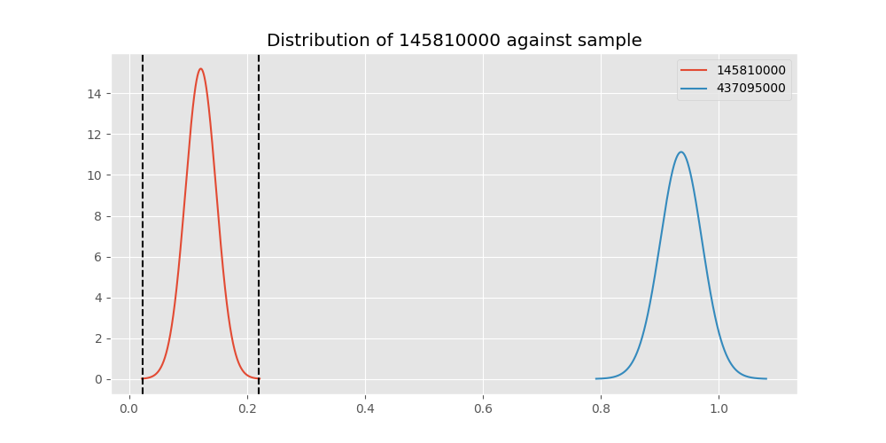

# Testing Results For 145810000 
$H_{0}$: There is not a difference in collection success against 145810000 
$H_{A}$: There is a difference in collection success against 145810000
An $\alpha$ of 0.00025 was used 
Out of 44 tests, there were 42 rejections from 44 independent-t test.
Out of 44 tests, there were 42 rejections from 44 Man Whitney u-tests.
## Testing Results for 145810000 against 436501000 
145810000 has a success rate of 0.12179487179487179
436501000 has a success rate of 0.9854014598540146
$H_{0}$: There is not a difference between 145810000 and 436501000
$H_{A}$: There is a difference between 145810000 and 436501000
An $/alpha$ of 0.00025 was used in this test.
__independent t-testing__: With a t-statistic of -30.612697526439863 and a p-value of 1.4400277361130386e-77, _we **reject** the null hypothssis_
__Man-Whitney testing__: With a u-statistic of 1457.5 and a p-value of 3.323398954562209e-49, _we **reject** the null hypothssis_
 
## Testing Results for 145810000 against 437375000 
145810000 has a success rate of 0.12179487179487179
437375000 has a success rate of 0.9982014388489209
$H_{0}$: There is not a difference between 145810000 and 437375000
$H_{A}$: There is a difference between 145810000 and 437375000
An $/alpha$ of 0.00025 was used in this test.
__independent t-testing__: With a t-statistic of -33.28460826897032 and a p-value of 6.970477175739406e-73, _we **reject** the null hypothssis_
__Man-Whitney testing__: With a u-statistic of 5360.0 and a p-value of 4.632441450904681e-132, _we **reject** the null hypothssis_
 
## Testing Results for 145810000 against 436500000 
145810000 has a success rate of 0.12179487179487179
436500000 has a success rate of 0.9056603773584906
$H_{0}$: There is not a difference between 145810000 and 436500000
$H_{A}$: There is a difference between 145810000 and 436500000
An $/alpha$ of 0.00025 was used in this test.
__independent t-testing__: With a t-statistic of -22.36697926582846 and a p-value of 7.218433814690903e-67, _we **reject** the null hypothssis_
__Man-Whitney testing__: With a u-statistic of 2680.5 and a p-value of 6.580930093158756e-44, _we **reject** the null hypothssis_
 
## Testing Results for 145810000 against 436990000 
145810000 has a success rate of 0.12179487179487179
436990000 has a success rate of 0.9572649572649573
$H_{0}$: There is not a difference between 145810000 and 436990000
$H_{A}$: There is a difference between 145810000 and 436990000
An $/alpha$ of 0.00025 was used in this test.
__independent t-testing__: With a t-statistic of -31.07057896479013 and a p-value of 2.6183424571554848e-107, _we **reject** the null hypothssis_
__Man-Whitney testing__: With a u-statistic of 3003.0 and a p-value of 2.6865768361764555e-62, _we **reject** the null hypothssis_
 
## Testing Results for 145810000 against 145875000 
145810000 has a success rate of 0.12179487179487179
145875000 has a success rate of 0.9722222222222222
$H_{0}$: There is not a difference between 145810000 and 145875000
$H_{A}$: There is a difference between 145810000 and 145875000
An $/alpha$ of 0.00025 was used in this test.
__independent t-testing__: With a t-statistic of -20.78940932360773 and a p-value of 2.2625559794104194e-54, _we **reject** the null hypothssis_
__Man-Whitney testing__: With a u-statistic of 840.0 and a p-value of 2.830657775558394e-34, _we **reject** the null hypothssis_
 
## Testing Results for 145810000 against 437800000 
145810000 has a success rate of 0.12179487179487179
437800000 has a success rate of 0.9533678756476683
$H_{0}$: There is not a difference between 145810000 and 437800000
$H_{A}$: There is a difference between 145810000 and 437800000
An $/alpha$ of 0.00025 was used in this test.
__independent t-testing__: With a t-statistic of -28.623538644948944 and a p-value of 2.305426006447346e-93, _we **reject** the null hypothssis_
__Man-Whitney testing__: With a u-statistic of 2535.5 and a p-value of 4.225524167952947e-55, _we **reject** the null hypothssis_
 
## Testing Results for 145810000 against 437095000 
145810000 has a success rate of 0.12179487179487179
437095000 has a success rate of 0.9361702127659575
$H_{0}$: There is not a difference between 145810000 and 437095000
$H_{A}$: There is a difference between 145810000 and 437095000
An $/alpha$ of 0.00025 was used in this test.
__independent t-testing__: With a t-statistic of -15.71559493113911 and a p-value of 7.890335309368709e-37, _we **reject** the null hypothssis_
__Man-Whitney testing__: With a u-statistic of 680.5 and a p-value of 5.011818779526691e-26, _we **reject** the null hypothssis_
 
## Testing Results for 145810000 against 437265000 
145810000 has a success rate of 0.12179487179487179
437265000 has a success rate of 0.9795454545454545
$H_{0}$: There is not a difference between 145810000 and 437265000
$H_{A}$: There is a difference between 145810000 and 437265000
An $/alpha$ of 0.00025 was used in this test.
__independent t-testing__: With a t-statistic of -31.623322764523195 and a p-value of 1.7467510315529703e-74, _we **reject** the null hypothssis_
__Man-Whitney testing__: With a u-statistic of 4882.0 and a p-value of 1.8257875308135684e-101, _we **reject** the null hypothssis_
 
## Testing Results for 145810000 against 437350000 
145810000 has a success rate of 0.12179487179487179
437350000 has a success rate of 0.9488372093023256
$H_{0}$: There is not a difference between 145810000 and 437350000
$H_{A}$: There is a difference between 145810000 and 437350000
An $/alpha$ of 0.00025 was used in this test.
__independent t-testing__: With a t-statistic of -29.004526712585694 and a p-value of 3.3240894356187624e-97, _we **reject** the null hypothssis_
__Man-Whitney testing__: With a u-statistic of 2900.5 and a p-value of 7.097969080792088e-58, _we **reject** the null hypothssis_
 
## Testing Results for 145810000 against 437200000 
145810000 has a success rate of 0.12179487179487179
437200000 has a success rate of 0.8620689655172413
$H_{0}$: There is not a difference between 145810000 and 437200000
$H_{A}$: There is a difference between 145810000 and 437200000
An $/alpha$ of 0.00025 was used in this test.
__independent t-testing__: With a t-statistic of -20.56046288747958 and a p-value of 1.571061578115103e-62, _we **reject** the null hypothssis_
__Man-Whitney testing__: With a u-statistic of 4112.5 and a p-value of 4.1043235872361885e-44, _we **reject** the null hypothssis_
 
## Testing Results for 145810000 against 435600000 
145810000 has a success rate of 0.12179487179487179
435600000 has a success rate of 0.9819341126461212
$H_{0}$: There is not a difference between 145810000 and 435600000
$H_{A}$: There is a difference between 145810000 and 435600000
An $/alpha$ of 0.00025 was used in this test.
__independent t-testing__: With a t-statistic of -32.30452815279073 and a p-value of 6.770074972160366e-73, _we **reject** the null hypothssis_
__Man-Whitney testing__: With a u-statistic of 10265.5 and a p-value of 2.8979616212329984e-180, _we **reject** the null hypothssis_
 
## Testing Results for 145810000 against 450000000 
145810000 has a success rate of 0.12179487179487179
450000000 has a success rate of 0.8235294117647058
$H_{0}$: There is not a difference between 145810000 and 450000000
$H_{A}$: There is a difference between 145810000 and 450000000
An $/alpha$ of 0.00025 was used in this test.
__independent t-testing__: With a t-statistic of -14.932943540178105 and a p-value of 4.604579768899793e-36, _we **reject** the null hypothssis_
__Man-Whitney testing__: With a u-statistic of 1977.5 and a p-value of 5.211572557890151e-27, _we **reject** the null hypothssis_
 
## Testing Results for 145810000 against 145978500 
145810000 has a success rate of 0.12179487179487179
145978500 has a success rate of 0.9963636363636363
$H_{0}$: There is not a difference between 145810000 and 145978500
$H_{A}$: There is a difference between 145810000 and 145978500
An $/alpha$ of 0.00025 was used in this test.
__independent t-testing__: With a t-statistic of -32.97810601578947 and a p-value of 1.6803917480118518e-73, _we **reject** the null hypothssis_
__Man-Whitney testing__: With a u-statistic of 2690.5 and a p-value of 7.230781104330319e-78, _we **reject** the null hypothssis_
 
## Testing Results for 145810000 against 437050000 
145810000 has a success rate of 0.12179487179487179
437050000 has a success rate of 0.5346534653465347
$H_{0}$: There is not a difference between 145810000 and 437050000
$H_{A}$: There is a difference between 145810000 and 437050000
An $/alpha$ of 0.00025 was used in this test.
__independent t-testing__: With a t-statistic of -7.982957488237555 and a p-value of 4.8880352154190054e-14, _we **reject** the null hypothssis_
__Man-Whitney testing__: With a u-statistic of 4625.5 and a p-value of 8.470856861444484e-13, _we **reject** the null hypothssis_
 
## Testing Results for 145810000 against 435300000 
145810000 has a success rate of 0.12179487179487179
435300000 has a success rate of 0.1232876712328767
$H_{0}$: There is not a difference between 145810000 and 435300000
$H_{A}$: There is a difference between 145810000 and 435300000
An $/alpha$ of 0.00025 was used in this test.
__independent t-testing__: With a t-statistic of -0.03940743268613223 and a p-value of 0.9685917655780801, _we failed to reject the null hypothssis_
__Man-Whitney testing__: With a u-statistic of 11371.0 and a p-value of 0.9694389346196277, _we failed to reject the null hypothssis_
 
## Testing Results for 145810000 against 437475000 
145810000 has a success rate of 0.12179487179487179
437475000 has a success rate of 0.5045045045045045
$H_{0}$: There is not a difference between 145810000 and 437475000
$H_{A}$: There is a difference between 145810000 and 437475000
An $/alpha$ of 0.00025 was used in this test.
__independent t-testing__: With a t-statistic of -9.020000709503384 and a p-value of 1.7380599765297594e-18, _we **reject** the null hypothssis_
__Man-Whitney testing__: With a u-statistic of 26722.5 and a p-value of 1.2427109866741356e-17, _we **reject** the null hypothssis_
 
## Testing Results for 145810000 against 435448000 
145810000 has a success rate of 0.12179487179487179
435448000 has a success rate of 0.975
$H_{0}$: There is not a difference between 145810000 and 435448000
$H_{A}$: There is a difference between 145810000 and 435448000
An $/alpha$ of 0.00025 was used in this test.
__independent t-testing__: With a t-statistic of -23.52767372242578 and a p-value of 4.375825175846996e-49, _we **reject** the null hypothssis_
__Man-Whitney testing__: With a u-statistic of 458.0 and a p-value of 7.146847423778124e-26, _we **reject** the null hypothssis_
 
## Testing Results for 145810000 against 437644000 
145810000 has a success rate of 0.12179487179487179
437644000 has a success rate of 0.9743589743589743
$H_{0}$: There is not a difference between 145810000 and 437644000
$H_{A}$: There is a difference between 145810000 and 437644000
An $/alpha$ of 0.00025 was used in this test.
__independent t-testing__: With a t-statistic of -28.33321297033446 and a p-value of 6.403578486120088e-78, _we **reject** the null hypothssis_
__Man-Whitney testing__: With a u-statistic of 1345.5 and a p-value of 4.768166215108753e-44, _we **reject** the null hypothssis_
 
## Testing Results for 145810000 against 145825000 
145810000 has a success rate of 0.12179487179487179
145825000 has a success rate of 0.8687448728465955
$H_{0}$: There is not a difference between 145810000 and 145825000
$H_{A}$: There is a difference between 145810000 and 145825000
An $/alpha$ of 0.00025 was used in this test.
__independent t-testing__: With a t-statistic of -26.824073314881964 and a p-value of 4.360979117334236e-140, _we **reject** the null hypothssis_
__Man-Whitney testing__: With a u-statistic of 48121.0 and a p-value of 1.5278794853634385e-124, _we **reject** the null hypothssis_
 
## Testing Results for 145810000 against 437345000 
145810000 has a success rate of 0.12179487179487179
437345000 has a success rate of 0.7603092783505154
$H_{0}$: There is not a difference between 145810000 and 437345000
$H_{A}$: There is a difference between 145810000 and 437345000
An $/alpha$ of 0.00025 was used in this test.
__independent t-testing__: With a t-statistic of -16.772840092576576 and a p-value of 3.630165604041787e-51, _we **reject** the null hypothssis_
__Man-Whitney testing__: With a u-statistic of 10940.0 and a p-value of 3.0045083237265394e-42, _we **reject** the null hypothssis_
 
## Testing Results for 145810000 against 435275000 
145810000 has a success rate of 0.12179487179487179
435275000 has a success rate of 0.9152542372881356
$H_{0}$: There is not a difference between 145810000 and 435275000
$H_{A}$: There is a difference between 145810000 and 435275000
An $/alpha$ of 0.00025 was used in this test.
__independent t-testing__: With a t-statistic of -21.1010477825375 and a p-value of 3.285896719840908e-59, _we **reject** the null hypothssis_
__Man-Whitney testing__: With a u-statistic of 1901.0 and a p-value of 9.763113983963914e-39, _we **reject** the null hypothssis_
 
## Testing Results for 145810000 against 437322500 
145810000 has a success rate of 0.12179487179487179
437322500 has a success rate of 0.9961685823754789
$H_{0}$: There is not a difference between 145810000 and 437322500
$H_{A}$: There is a difference between 145810000 and 437322500
An $/alpha$ of 0.00025 was used in this test.
__independent t-testing__: With a t-statistic of -32.93666033854906 and a p-value of 1.3604396222385493e-73, _we **reject** the null hypothssis_
__Man-Whitney testing__: With a u-statistic of 2557.5 and a p-value of 4.051642168008007e-75, _we **reject** the null hypothssis_
 
## Testing Results for 145810000 against 437450000 
145810000 has a success rate of 0.12179487179487179
437450000 has a success rate of 0.6947791164658634
$H_{0}$: There is not a difference between 145810000 and 437450000
$H_{A}$: There is a difference between 145810000 and 437450000
An $/alpha$ of 0.00025 was used in this test.
__independent t-testing__: With a t-statistic of -13.51360713211299 and a p-value of 1.3945803940869063e-34, _we **reject** the null hypothssis_
__Man-Whitney testing__: With a u-statistic of 8293.5 and a p-value of 3.1199886783360546e-29, _we **reject** the null hypothssis_
 
## Testing Results for 145810000 against 436703000 
145810000 has a success rate of 0.12179487179487179
436703000 has a success rate of 0.9859154929577465
$H_{0}$: There is not a difference between 145810000 and 436703000
$H_{A}$: There is a difference between 145810000 and 436703000
An $/alpha$ of 0.00025 was used in this test.
__independent t-testing__: With a t-statistic of -31.436687466867422 and a p-value of 4.846323681293528e-76, _we **reject** the null hypothssis_
__Man-Whitney testing__: With a u-statistic of 2257.5 and a p-value of 6.828712882568154e-64, _we **reject** the null hypothssis_
 
## Testing Results for 145810000 against 400500000 
145810000 has a success rate of 0.12179487179487179
400500000 has a success rate of 0.3508771929824561
$H_{0}$: There is not a difference between 145810000 and 400500000
$H_{A}$: There is a difference between 145810000 and 400500000
An $/alpha$ of 0.00025 was used in this test.
__independent t-testing__: With a t-statistic of -3.9472624648988943 and a p-value of 0.00010767756595483362, _we **reject** the null hypothssis_
__Man-Whitney testing__: With a u-statistic of 3427.5 and a p-value of 0.00013548445884440364, _we **reject** the null hypothssis_
 
## Testing Results for 145810000 against 437150000 
145810000 has a success rate of 0.12179487179487179
437150000 has a success rate of 0.9859550561797753
$H_{0}$: There is not a difference between 145810000 and 437150000
$H_{A}$: There is a difference between 145810000 and 437150000
An $/alpha$ of 0.00025 was used in this test.
__independent t-testing__: With a t-statistic of -32.00422593493646 and a p-value of 1.5685261396032967e-74, _we **reject** the null hypothssis_
__Man-Whitney testing__: With a u-statistic of 3772.0 and a p-value of 1.0302631374522189e-89, _we **reject** the null hypothssis_
 
## Testing Results for 145810000 against 435635000 
145810000 has a success rate of 0.12179487179487179
435635000 has a success rate of 0.9849624060150376
$H_{0}$: There is not a difference between 145810000 and 435635000
$H_{A}$: There is a difference between 145810000 and 435635000
An $/alpha$ of 0.00025 was used in this test.
__independent t-testing__: With a t-statistic of -30.474218945994863 and a p-value of 1.0223318333527266e-77, _we **reject** the null hypothssis_
__Man-Whitney testing__: With a u-statistic of 1419.5 and a p-value of 2.3637373406315628e-48, _we **reject** the null hypothssis_
 
## Testing Results for 145810000 against 437384000 
145810000 has a success rate of 0.12179487179487179
437384000 has a success rate of 0.968421052631579
$H_{0}$: There is not a difference between 145810000 and 437384000
$H_{A}$: There is a difference between 145810000 and 437384000
An $/alpha$ of 0.00025 was used in this test.
__independent t-testing__: With a t-statistic of -30.641867050011374 and a p-value of 2.3887079984110884e-100, _we **reject** the null hypothssis_
__Man-Whitney testing__: With a u-statistic of 2273.0 and a p-value of 7.506435973118875e-57, _we **reject** the null hypothssis_
 
## Testing Results for 145810000 against 437405000 
145810000 has a success rate of 0.12179487179487179
437405000 has a success rate of 0.9953917050691244
$H_{0}$: There is not a difference between 145810000 and 437405000
$H_{A}$: There is a difference between 145810000 and 437405000
An $/alpha$ of 0.00025 was used in this test.
__independent t-testing__: With a t-statistic of -32.75537963856745 and a p-value of 5.311495695373578e-74, _we **reject** the null hypothssis_
__Man-Whitney testing__: With a u-statistic of 2139.5 and a p-value of 2.0784449874696256e-66, _we **reject** the null hypothssis_
 
## Testing Results for 145810000 against 435612500 
145810000 has a success rate of 0.12179487179487179
435612500 has a success rate of 0.9770114942528736
$H_{0}$: There is not a difference between 145810000 and 435612500
$H_{A}$: There is a difference between 145810000 and 435612500
An $/alpha$ of 0.00025 was used in this test.
__independent t-testing__: With a t-statistic of -27.728896724612337 and a p-value of 6.481335578017536e-76, _we **reject** the null hypothssis_
__Man-Whitney testing__: With a u-statistic of 982.5 and a p-value of 5.141494765377078e-38, _we **reject** the null hypothssis_
 
## Testing Results for 145810000 against 435975000 
145810000 has a success rate of 0.12179487179487179
435975000 has a success rate of 0.92
$H_{0}$: There is not a difference between 145810000 and 435975000
$H_{A}$: There is a difference between 145810000 and 435975000
An $/alpha$ of 0.00025 was used in this test.
__independent t-testing__: With a t-statistic of -15.545028133889765 and a p-value of 1.8316480375980905e-36, _we **reject** the null hypothssis_
__Man-Whitney testing__: With a u-statistic of 787.0 and a p-value of 5.55999957204892e-26, _we **reject** the null hypothssis_
 
## Testing Results for 145810000 against 437425000 
145810000 has a success rate of 0.12179487179487179
437425000 has a success rate of 0.6987654320987654
$H_{0}$: There is not a difference between 145810000 and 437425000
$H_{A}$: There is a difference between 145810000 and 437425000
An $/alpha$ of 0.00025 was used in this test.
__independent t-testing__: With a t-statistic of -14.338564612765714 and a p-value of 6.2196859383993286e-40, _we **reject** the null hypothssis_
__Man-Whitney testing__: With a u-statistic of 13363.5 and a p-value of 1.2999310864090854e-34, _we **reject** the null hypothssis_
 
## Testing Results for 145810000 against 437275000 
145810000 has a success rate of 0.12179487179487179
437275000 has a success rate of 0.3643724696356275
$H_{0}$: There is not a difference between 145810000 and 437275000
$H_{A}$: There is a difference between 145810000 and 437275000
An $/alpha$ of 0.00025 was used in this test.
__independent t-testing__: With a t-statistic of -5.525623841141036 and a p-value of 5.919705491592138e-08, _we **reject** the null hypothssis_
__Man-Whitney testing__: With a u-statistic of 14592.5 and a p-value of 9.680263740677365e-08, _we **reject** the null hypothssis_
 
## Testing Results for 145810000 against 145840000 
145810000 has a success rate of 0.12179487179487179
145840000 has a success rate of 0.9649122807017544
$H_{0}$: There is not a difference between 145810000 and 145840000
$H_{A}$: There is a difference between 145810000 and 145840000
An $/alpha$ of 0.00025 was used in this test.
__independent t-testing__: With a t-statistic of -18.339997301078228 and a p-value of 1.472712632397067e-45, _we **reject** the null hypothssis_
__Man-Whitney testing__: With a u-statistic of 697.5 and a p-value of 3.62854828636881e-30, _we **reject** the null hypothssis_
 
## Testing Results for 145810000 against 435525000 
145810000 has a success rate of 0.12179487179487179
435525000 has a success rate of 0.6923076923076923
$H_{0}$: There is not a difference between 145810000 and 435525000
$H_{A}$: There is a difference between 145810000 and 435525000
An $/alpha$ of 0.00025 was used in this test.
__independent t-testing__: With a t-statistic of -12.368280252225853 and a p-value of 1.266643985846531e-28, _we **reject** the null hypothssis_
__Man-Whitney testing__: With a u-statistic of 4790.5 and a p-value of 7.934078311986573e-24, _we **reject** the null hypothssis_
 
## Testing Results for 145810000 against 436250000 
145810000 has a success rate of 0.12179487179487179
436250000 has a success rate of 0.17857142857142858
$H_{0}$: There is not a difference between 145810000 and 436250000
$H_{A}$: There is a difference between 145810000 and 436250000
An $/alpha$ of 0.00025 was used in this test.
__independent t-testing__: With a t-statistic of -1.0584389418987799 and a p-value of 0.29107133021945275, _we failed to reject the null hypothssis_
__Man-Whitney testing__: With a u-statistic of 4120.0 and a p-value of 0.2909663797957417, _we failed to reject the null hypothssis_
 
## Testing Results for 145810000 against 435950000 
145810000 has a success rate of 0.12179487179487179
435950000 has a success rate of 0.9850187265917603
$H_{0}$: There is not a difference between 145810000 and 435950000
$H_{A}$: There is a difference between 145810000 and 435950000
An $/alpha$ of 0.00025 was used in this test.
__independent t-testing__: With a t-statistic of -32.220690652913035 and a p-value of 1.0075579700165404e-73, _we **reject** the null hypothssis_
__Man-Whitney testing__: With a u-statistic of 5697.0 and a p-value of 1.0352222877353312e-119, _we **reject** the null hypothssis_
 
## Testing Results for 145810000 against 435800000 
145810000 has a success rate of 0.12179487179487179
435800000 has a success rate of 0.5390070921985816
$H_{0}$: There is not a difference between 145810000 and 435800000
$H_{A}$: There is a difference between 145810000 and 435800000
An $/alpha$ of 0.00025 was used in this test.
__independent t-testing__: With a t-statistic of -8.57485328654912 and a p-value of 5.692705626493164e-16, _we **reject** the null hypothssis_
__Man-Whitney testing__: With a u-statistic of 6409.5 and a p-value of 1.541420975367552e-14, _we **reject** the null hypothssis_
 
## Testing Results for 145810000 against 437485000 
145810000 has a success rate of 0.12179487179487179
437485000 has a success rate of 0.9375
$H_{0}$: There is not a difference between 145810000 and 437485000
$H_{A}$: There is a difference between 145810000 and 437485000
An $/alpha$ of 0.00025 was used in this test.
__independent t-testing__: With a t-statistic of -13.306031370522094 and a p-value of 8.08933819383389e-29, _we **reject** the null hypothssis_
__Man-Whitney testing__: With a u-statistic of 460.0 and a p-value of 1.331596856183778e-21, _we **reject** the null hypothssis_
 
## Testing Results for 145810000 against 136770000 
145810000 has a success rate of 0.12179487179487179
136770000 has a success rate of 0.9945945945945946
$H_{0}$: There is not a difference between 145810000 and 136770000
$H_{A}$: There is a difference between 145810000 and 136770000
An $/alpha$ of 0.00025 was used in this test.
__independent t-testing__: With a t-statistic of -32.54340633038117 and a p-value of 1.7551914254197467e-74, _we **reject** the null hypothssis_
__Man-Whitney testing__: With a u-statistic of 1835.5 and a p-value of 5.63824617974617e-60, _we **reject** the null hypothssis_
 
## Testing Results for 145810000 against 437250000 
145810000 has a success rate of 0.12179487179487179
437250000 has a success rate of 0.9937106918238994
$H_{0}$: There is not a difference between 145810000 and 437250000
$H_{A}$: There is a difference between 145810000 and 437250000
An $/alpha$ of 0.00025 was used in this test.
__independent t-testing__: With a t-statistic of -32.72736148789541 and a p-value of 8.774915700908102e-74, _we **reject** the null hypothssis_
__Man-Whitney testing__: With a u-statistic of 3177.0 and a p-value of 2.665540102532227e-85, _we **reject** the null hypothssis_
 
## Testing Results for 145810000 against 437356000 
145810000 has a success rate of 0.12179487179487179
437356000 has a success rate of 0.9328358208955224
$H_{0}$: There is not a difference between 145810000 and 437356000
$H_{A}$: There is a difference between 145810000 and 437356000
An $/alpha$ of 0.00025 was used in this test.
__independent t-testing__: With a t-statistic of -23.33343440849271 and a p-value of 2.4226180073361335e-68, _we **reject** the null hypothssis_
__Man-Whitney testing__: With a u-statistic of 1975.0 and a p-value of 5.273422607403288e-43, _we **reject** the null hypothssis_
 
## Testing Results for 145810000 against 437676000 
145810000 has a success rate of 0.12179487179487179
437676000 has a success rate of 0.9813432835820896
$H_{0}$: There is not a difference between 145810000 and 437676000
$H_{A}$: There is a difference between 145810000 and 437676000
An $/alpha$ of 0.00025 was used in this test.
__independent t-testing__: With a t-statistic of -31.206993476714924 and a p-value of 6.619267562764085e-76, _we **reject** the null hypothssis_
__Man-Whitney testing__: With a u-statistic of 2936.0 and a p-value of 6.236280103601562e-73, _we **reject** the null hypothssis_
 
## Testing Results for 145810000 against 145826800 
145810000 has a success rate of 0.12179487179487179
145826800 has a success rate of 0.966183574879227
$H_{0}$: There is not a difference between 145810000 and 145826800
$H_{A}$: There is a difference between 145810000 and 145826800
An $/alpha$ of 0.00025 was used in this test.
__independent t-testing__: With a t-statistic of -31.248294696347777 and a p-value of 1.06503064813875e-104, _we **reject** the null hypothssis_
__Man-Whitney testing__: With a u-statistic of 2512.5 and a p-value of 2.0114965390632982e-59, _we **reject** the null hypothssis_
 
