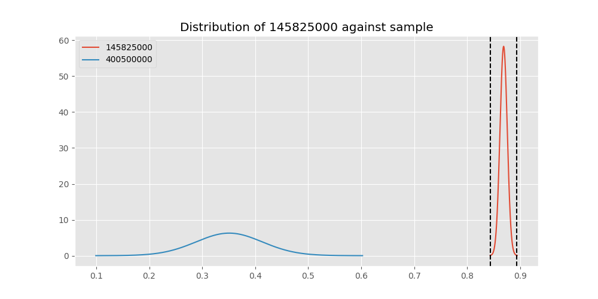

# Testing Results For 145825000 
$H_{0}$: There is not a difference in collection success against 145825000 
$H_{A}$: There is a difference in collection success against 145825000
An $\alpha$ of 0.00025 was used 
Out of 44 tests, there were 33 rejections from 44 independent-t test.
Out of 44 tests, there were 29 rejections from 44 Man Whitney u-tests.
## Testing Results for 145825000 against 436501000 
145825000 has a success rate of 0.8687448728465955
436501000 has a success rate of 0.9854014598540146
$H_{0}$: There is not a difference between 145825000 and 436501000
$H_{A}$: There is a difference between 145825000 and 436501000
An $/alpha$ of 0.00025 was used in this test.
__independent t-testing__: With a t-statistic of -9.444556691041804 and a p-value of 1.4730760794904755e-18, _we **reject** the null hypothssis_
__Man-Whitney testing__: With a u-statistic of 147521.0 and a p-value of 5.924699508883269e-05, _we **reject** the null hypothssis_
 
## Testing Results for 145825000 against 437375000 
145825000 has a success rate of 0.8687448728465955
437375000 has a success rate of 0.9982014388489209
$H_{0}$: There is not a difference between 145825000 and 437375000
$H_{A}$: There is a difference between 145825000 and 437375000
An $/alpha$ of 0.00025 was used in this test.
__independent t-testing__: With a t-statistic of -18.30338124189975 and a p-value of 1.1150391060307598e-70, _we **reject** the null hypothssis_
__Man-Whitney testing__: With a u-statistic of 590023.0 and a p-value of 5.495446199417163e-19, _we **reject** the null hypothssis_
 
## Testing Results for 145825000 against 436500000 
145825000 has a success rate of 0.8687448728465955
436500000 has a success rate of 0.9056603773584906
$H_{0}$: There is not a difference between 145825000 and 436500000
$H_{A}$: There is a difference between 145825000 and 436500000
An $/alpha$ of 0.00025 was used in this test.
__independent t-testing__: With a t-statistic of -1.3454749916113586 and a p-value of 0.17858944314176908, _we failed to reject the null hypothssis_
__Man-Whitney testing__: With a u-statistic of 186666.0 and a p-value of 0.1785700038486685, _we failed to reject the null hypothssis_
 
## Testing Results for 145825000 against 436990000 
145825000 has a success rate of 0.8687448728465955
436990000 has a success rate of 0.9572649572649573
$H_{0}$: There is not a difference between 145825000 and 436990000
$H_{A}$: There is a difference between 145825000 and 436990000
An $/alpha$ of 0.00025 was used in this test.
__independent t-testing__: With a t-statistic of -3.9412270244503116 and a p-value of 8.314665629714569e-05, _we **reject** the null hypothssis_
__Man-Whitney testing__: With a u-statistic of 259996.0 and a p-value of 8.477983877152188e-05, _we **reject** the null hypothssis_
 
## Testing Results for 145825000 against 145875000 
145825000 has a success rate of 0.8687448728465955
145875000 has a success rate of 0.9722222222222222
$H_{0}$: There is not a difference between 145825000 and 145875000
$H_{A}$: There is a difference between 145825000 and 145875000
An $/alpha$ of 0.00025 was used in this test.
__independent t-testing__: With a t-statistic of -5.006690030525419 and a p-value of 2.7566367530693443e-06, _we **reject** the null hypothssis_
__Man-Whitney testing__: With a u-statistic of 78686.0 and a p-value of 0.009680422595427642, _we failed to reject the null hypothssis_
 
## Testing Results for 145825000 against 437800000 
145825000 has a success rate of 0.8687448728465955
437800000 has a success rate of 0.9533678756476683
$H_{0}$: There is not a difference between 145825000 and 437800000
$H_{A}$: There is a difference between 145825000 and 437800000
An $/alpha$ of 0.00025 was used in this test.
__independent t-testing__: With a t-statistic of -3.427653198116196 and a p-value of 0.0006181854330810669, _we failed to reject the null hypothssis_
__Man-Whitney testing__: With a u-statistic of 215358.0 and a p-value of 0.0006248677049287, _we failed to reject the null hypothssis_
 
## Testing Results for 145825000 against 145810000 
145825000 has a success rate of 0.8687448728465955
145810000 has a success rate of 0.12179487179487179
$H_{0}$: There is not a difference between 145825000 and 145810000
$H_{A}$: There is a difference between 145825000 and 145810000
An $/alpha$ of 0.00025 was used in this test.
__independent t-testing__: With a t-statistic of 26.824073314881964 and a p-value of 4.360979117334236e-140, _we **reject** the null hypothssis_
__Man-Whitney testing__: With a u-statistic of 332207.0 and a p-value of 1.5278794853634385e-124, _we **reject** the null hypothssis_
 
## Testing Results for 145825000 against 437095000 
145825000 has a success rate of 0.8687448728465955
437095000 has a success rate of 0.9361702127659575
$H_{0}$: There is not a difference between 145825000 and 437095000
$H_{A}$: There is a difference between 145825000 and 437095000
An $/alpha$ of 0.00025 was used in this test.
__independent t-testing__: With a t-statistic of -1.3614767307559221 and a p-value of 0.17348660789164216, _we failed to reject the null hypothssis_
__Man-Whitney testing__: With a u-statistic of 53430.0 and a p-value of 0.17349262217602968, _we failed to reject the null hypothssis_
 
## Testing Results for 145825000 against 437265000 
145825000 has a success rate of 0.8687448728465955
437265000 has a success rate of 0.9795454545454545
$H_{0}$: There is not a difference between 145825000 and 437265000
$H_{A}$: There is a difference between 145825000 and 437265000
An $/alpha$ of 0.00025 was used in this test.
__independent t-testing__: With a t-statistic of -11.52482979941701 and a p-value of 1.6188246935072105e-29, _we **reject** the null hypothssis_
__Man-Whitney testing__: With a u-statistic of 476931.0 and a p-value of 1.7981668188511304e-11, _we **reject** the null hypothssis_
 
## Testing Results for 145825000 against 437350000 
145825000 has a success rate of 0.8687448728465955
437350000 has a success rate of 0.9488372093023256
$H_{0}$: There is not a difference between 145825000 and 437350000
$H_{A}$: There is a difference between 145825000 and 437350000
An $/alpha$ of 0.00025 was used in this test.
__independent t-testing__: With a t-statistic of -3.413020330343414 and a p-value of 0.0006521138009697137, _we failed to reject the null hypothssis_
__Man-Whitney testing__: With a u-statistic of 241094.0 and a p-value of 0.0006589622008545149, _we failed to reject the null hypothssis_
 
## Testing Results for 145825000 against 437200000 
145825000 has a success rate of 0.8687448728465955
437200000 has a success rate of 0.8620689655172413
$H_{0}$: There is not a difference between 145825000 and 437200000
$H_{A}$: There is a difference between 145825000 and 437200000
An $/alpha$ of 0.00025 was used in this test.
__independent t-testing__: With a t-statistic of 0.27009044304043855 and a p-value of 0.7871117930006595, _we failed to reject the null hypothssis_
__Man-Whitney testing__: With a u-statistic of 249109.0 and a p-value of 0.7871170820255239, _we failed to reject the null hypothssis_
 
## Testing Results for 145825000 against 435600000 
145825000 has a success rate of 0.8687448728465955
435600000 has a success rate of 0.9819341126461212
$H_{0}$: There is not a difference between 145825000 and 435600000
$H_{A}$: There is a difference between 145825000 and 435600000
An $/alpha$ of 0.00025 was used in this test.
__independent t-testing__: With a t-statistic of -13.96846549475074 and a p-value of 3.773205734508894e-43, _we **reject** the null hypothssis_
__Man-Whitney testing__: With a u-statistic of 1017242.0 and a p-value of 7.477363832379826e-23, _we **reject** the null hypothssis_
 
## Testing Results for 145825000 against 450000000 
145825000 has a success rate of 0.8687448728465955
450000000 has a success rate of 0.8235294117647058
$H_{0}$: There is not a difference between 145825000 and 450000000
$H_{A}$: There is a difference between 145825000 and 450000000
An $/alpha$ of 0.00025 was used in this test.
__independent t-testing__: With a t-statistic of 1.20747789000171 and a p-value of 0.2273614265400124, _we failed to reject the null hypothssis_
__Man-Whitney testing__: With a u-statistic of 108300.0 and a p-value of 0.22733995736431212, _we failed to reject the null hypothssis_
 
## Testing Results for 145825000 against 145978500 
145825000 has a success rate of 0.8687448728465955
145978500 has a success rate of 0.9963636363636363
$H_{0}$: There is not a difference between 145825000 and 145978500
$H_{A}$: There is a difference between 145825000 and 145978500
An $/alpha$ of 0.00025 was used in this test.
__independent t-testing__: With a t-statistic of -16.47370831882873 and a p-value of 8.835543879199729e-58, _we **reject** the null hypothssis_
__Man-Whitney testing__: With a u-statistic of 292444.0 and a p-value of 5.292295831413553e-10, _we **reject** the null hypothssis_
 
## Testing Results for 145825000 against 437050000 
145825000 has a success rate of 0.8687448728465955
437050000 has a success rate of 0.5346534653465347
$H_{0}$: There is not a difference between 145825000 and 437050000
$H_{A}$: There is a difference between 145825000 and 437050000
An $/alpha$ of 0.00025 was used in this test.
__independent t-testing__: With a t-statistic of 9.518299465025532 and a p-value of 3.9473595660506886e-21, _we **reject** the null hypothssis_
__Man-Whitney testing__: With a u-statistic of 164252.0 and a p-value of 8.399859360685264e-21, _we **reject** the null hypothssis_
 
## Testing Results for 145825000 against 435300000 
145825000 has a success rate of 0.8687448728465955
435300000 has a success rate of 0.1232876712328767
$H_{0}$: There is not a difference between 145825000 and 435300000
$H_{A}$: There is a difference between 145825000 and 435300000
An $/alpha$ of 0.00025 was used in this test.
__independent t-testing__: With a t-statistic of 25.938051574660903 and a p-value of 5.096059759813725e-132, _we **reject** the null hypothssis_
__Man-Whitney testing__: With a u-statistic of 310646.0 and a p-value of 3.969732985646189e-118, _we **reject** the null hypothssis_
 
## Testing Results for 145825000 against 437475000 
145825000 has a success rate of 0.8687448728465955
437475000 has a success rate of 0.5045045045045045
$H_{0}$: There is not a difference between 145825000 and 437475000
$H_{A}$: There is a difference between 145825000 and 437475000
An $/alpha$ of 0.00025 was used in this test.
__independent t-testing__: With a t-statistic of 20.7479496398508 and a p-value of 1.905530023455512e-89, _we **reject** the null hypothssis_
__Man-Whitney testing__: With a u-statistic of 922970.0 and a p-value of 7.411330794548732e-84, _we **reject** the null hypothssis_
 
## Testing Results for 145825000 against 435448000 
145825000 has a success rate of 0.8687448728465955
435448000 has a success rate of 0.975
$H_{0}$: There is not a difference between 145825000 and 435448000
$H_{A}$: There is a difference between 145825000 and 435448000
An $/alpha$ of 0.00025 was used in this test.
__independent t-testing__: With a t-statistic of -4.099521131916183 and a p-value of 0.00017066717107413798, _we **reject** the null hypothssis_
__Man-Whitney testing__: With a u-statistic of 43579.0 and a p-value of 0.047205655564573894, _we failed to reject the null hypothssis_
 
## Testing Results for 145825000 against 437644000 
145825000 has a success rate of 0.8687448728465955
437644000 has a success rate of 0.9743589743589743
$H_{0}$: There is not a difference between 145825000 and 437644000
$H_{A}$: There is a difference between 145825000 and 437644000
An $/alpha$ of 0.00025 was used in this test.
__independent t-testing__: With a t-statistic of -6.522800621091829 and a p-value of 7.45547658224709e-10, _we **reject** the null hypothssis_
__Man-Whitney testing__: With a u-statistic of 127560.0 and a p-value of 0.0007873140371429864, _we failed to reject the null hypothssis_
 
## Testing Results for 145825000 against 437345000 
145825000 has a success rate of 0.8687448728465955
437345000 has a success rate of 0.7603092783505154
$H_{0}$: There is not a difference between 145825000 and 437345000
$H_{A}$: There is a difference between 145825000 and 437345000
An $/alpha$ of 0.00025 was used in this test.
__independent t-testing__: With a t-statistic of 5.645734317251672 and a p-value of 1.808351620346337e-08, _we **reject** the null hypothssis_
__Man-Whitney testing__: With a u-statistic of 524259.0 and a p-value of 1.964722731839446e-08, _we **reject** the null hypothssis_
 
## Testing Results for 145825000 against 435275000 
145825000 has a success rate of 0.8687448728465955
435275000 has a success rate of 0.9152542372881356
$H_{0}$: There is not a difference between 145825000 and 435275000
$H_{A}$: There is a difference between 145825000 and 435275000
An $/alpha$ of 0.00025 was used in this test.
__independent t-testing__: With a t-statistic of -1.4715437845086987 and a p-value of 0.1412673156284435, _we failed to reject the null hypothssis_
__Man-Whitney testing__: With a u-statistic of 137152.0 and a p-value of 0.1412645272793089, _we failed to reject the null hypothssis_
 
## Testing Results for 145825000 against 437322500 
145825000 has a success rate of 0.8687448728465955
437322500 has a success rate of 0.9961685823754789
$H_{0}$: There is not a difference between 145825000 and 437322500
$H_{A}$: There is a difference between 145825000 and 437322500
An $/alpha$ of 0.00025 was used in this test.
__independent t-testing__: With a t-statistic of -16.252474675425105 and a p-value of 3.657763583295343e-56, _we **reject** the null hypothssis_
__Man-Whitney testing__: With a u-statistic of 277618.0 and a p-value of 1.513800254385338e-09, _we **reject** the null hypothssis_
 
## Testing Results for 145825000 against 437450000 
145825000 has a success rate of 0.8687448728465955
437450000 has a success rate of 0.6947791164658634
$H_{0}$: There is not a difference between 145825000 and 437450000
$H_{A}$: There is a difference between 145825000 and 437450000
An $/alpha$ of 0.00025 was used in this test.
__independent t-testing__: With a t-statistic of 7.449632058111423 and a p-value of 1.254701104140648e-13, _we **reject** the null hypothssis_
__Man-Whitney testing__: With a u-statistic of 356335.0 and a p-value of 1.6419798757566175e-13, _we **reject** the null hypothssis_
 
## Testing Results for 145825000 against 436703000 
145825000 has a success rate of 0.8687448728465955
436703000 has a success rate of 0.9859154929577465
$H_{0}$: There is not a difference between 145825000 and 436703000
$H_{A}$: There is a difference between 145825000 and 436703000
An $/alpha$ of 0.00025 was used in this test.
__independent t-testing__: With a t-statistic of -11.05724612636509 and a p-value of 5.54652542258527e-26, _we **reject** the null hypothssis_
__Man-Whitney testing__: With a u-statistic of 229224.0 and a p-value of 5.374657479431775e-07, _we **reject** the null hypothssis_
 
## Testing Results for 145825000 against 400500000 
145825000 has a success rate of 0.8687448728465955
400500000 has a success rate of 0.3508771929824561
$H_{0}$: There is not a difference between 145825000 and 400500000
$H_{A}$: There is a difference between 145825000 and 400500000
An $/alpha$ of 0.00025 was used in this test.
__independent t-testing__: With a t-statistic of 11.312713068328716 and a p-value of 5.69775384064938e-29, _we **reject** the null hypothssis_
__Man-Whitney testing__: With a u-statistic of 105466.0 and a p-value of 2.5868712692996277e-28, _we **reject** the null hypothssis_
 
## Testing Results for 145825000 against 437150000 
145825000 has a success rate of 0.8687448728465955
437150000 has a success rate of 0.9859550561797753
$H_{0}$: There is not a difference between 145825000 and 437150000
$H_{A}$: There is a difference between 145825000 and 437150000
An $/alpha$ of 0.00025 was used in this test.
__independent t-testing__: With a t-statistic of -12.654001785858805 and a p-value of 7.488582958702569e-35, _we **reject** the null hypothssis_
__Man-Whitney testing__: With a u-statistic of 383099.0 and a p-value of 1.1773134901542962e-10, _we **reject** the null hypothssis_
 
## Testing Results for 145825000 against 435635000 
145825000 has a success rate of 0.8687448728465955
435635000 has a success rate of 0.9849624060150376
$H_{0}$: There is not a difference between 145825000 and 435635000
$H_{A}$: There is a difference between 145825000 and 435635000
An $/alpha$ of 0.00025 was used in this test.
__independent t-testing__: With a t-statistic of -9.216706075721682 and a p-value of 1.02649621236616e-17, _we **reject** the null hypothssis_
__Man-Whitney testing__: With a u-statistic of 143285.0 and a p-value of 8.071302412328553e-05, _we **reject** the null hypothssis_
 
## Testing Results for 145825000 against 437384000 
145825000 has a success rate of 0.8687448728465955
437384000 has a success rate of 0.968421052631579
$H_{0}$: There is not a difference between 145825000 and 437384000
$H_{A}$: There is a difference between 145825000 and 437384000
An $/alpha$ of 0.00025 was used in this test.
__independent t-testing__: With a t-statistic of -4.025378494748276 and a p-value of 5.849352952756932e-05, _we **reject** the null hypothssis_
__Man-Whitney testing__: With a u-statistic of 208524.0 and a p-value of 5.97759532653351e-05, _we **reject** the null hypothssis_
 
## Testing Results for 145825000 against 437405000 
145825000 has a success rate of 0.8687448728465955
437405000 has a success rate of 0.9953917050691244
$H_{0}$: There is not a difference between 145825000 and 437405000
$H_{A}$: There is a difference between 145825000 and 437405000
An $/alpha$ of 0.00025 was used in this test.
__independent t-testing__: With a t-statistic of -15.355206412561138 and a p-value of 1.2169378790488793e-49, _we **reject** the null hypothssis_
__Man-Whitney testing__: With a u-statistic of 231022.0 and a p-value of 4.192539213212757e-08, _we **reject** the null hypothssis_
 
## Testing Results for 145825000 against 435612500 
145825000 has a success rate of 0.8687448728465955
435612500 has a success rate of 0.9770114942528736
$H_{0}$: There is not a difference between 145825000 and 435612500
$H_{A}$: There is a difference between 145825000 and 435612500
An $/alpha$ of 0.00025 was used in this test.
__independent t-testing__: With a t-statistic of -6.169532180567322 and a p-value of 9.672371787673194e-09, _we **reject** the null hypothssis_
__Man-Whitney testing__: With a u-statistic of 94571.0 and a p-value of 0.002938094701979798, _we failed to reject the null hypothssis_
 
## Testing Results for 145825000 against 435975000 
145825000 has a success rate of 0.8687448728465955
435975000 has a success rate of 0.92
$H_{0}$: There is not a difference between 145825000 and 435975000
$H_{A}$: There is a difference between 145825000 and 435975000
An $/alpha$ of 0.00025 was used in this test.
__independent t-testing__: With a t-statistic of -1.065829658347343 and a p-value of 0.2866041520512514, _we failed to reject the null hypothssis_
__Man-Whitney testing__: With a u-statistic of 57826.0 and a p-value of 0.2865909610513019, _we failed to reject the null hypothssis_
 
## Testing Results for 145825000 against 437425000 
145825000 has a success rate of 0.8687448728465955
437425000 has a success rate of 0.6987654320987654
$H_{0}$: There is not a difference between 145825000 and 437425000
$H_{A}$: There is a difference between 145825000 and 437425000
An $/alpha$ of 0.00025 was used in this test.
__independent t-testing__: With a t-statistic of 8.859036348750452 and a p-value of 1.3930077923537975e-18, _we **reject** the null hypothssis_
__Man-Whitney testing__: With a u-statistic of 577613.0 and a p-value of 2.3180347439571755e-18, _we **reject** the null hypothssis_
 
## Testing Results for 145825000 against 437275000 
145825000 has a success rate of 0.8687448728465955
437275000 has a success rate of 0.3643724696356275
$H_{0}$: There is not a difference between 145825000 and 437275000
$H_{A}$: There is a difference between 145825000 and 437275000
An $/alpha$ of 0.00025 was used in this test.
__independent t-testing__: With a t-statistic of 21.369762534303973 and a p-value of 1.0730775946464846e-93, _we **reject** the null hypothssis_
__Man-Whitney testing__: With a u-statistic of 452956.0 and a p-value of 6.8170891192819145e-87, _we **reject** the null hypothssis_
 
## Testing Results for 145825000 against 145840000 
145825000 has a success rate of 0.8687448728465955
145840000 has a success rate of 0.9649122807017544
$H_{0}$: There is not a difference between 145825000 and 145840000
$H_{A}$: There is a difference between 145825000 and 145840000
An $/alpha$ of 0.00025 was used in this test.
__independent t-testing__: With a t-statistic of -2.141828728526015 and a p-value of 0.03230390693353522, _we failed to reject the null hypothssis_
__Man-Whitney testing__: With a u-statistic of 62801.0 and a p-value of 0.03234427793970323, _we failed to reject the null hypothssis_
 
## Testing Results for 145825000 against 435525000 
145825000 has a success rate of 0.8687448728465955
435525000 has a success rate of 0.6923076923076923
$H_{0}$: There is not a difference between 145825000 and 435525000
$H_{A}$: There is a difference between 145825000 and 435525000
An $/alpha$ of 0.00025 was used in this test.
__independent t-testing__: With a t-statistic of 5.9293528036423115 and a p-value of 3.447738373950385e-09, _we **reject** the null hypothssis_
__Man-Whitney testing__: With a u-statistic of 205073.0 and a p-value of 3.852794876218065e-09, _we **reject** the null hypothssis_
 
## Testing Results for 145825000 against 436250000 
145825000 has a success rate of 0.8687448728465955
436250000 has a success rate of 0.17857142857142858
$H_{0}$: There is not a difference between 145825000 and 436250000
$H_{A}$: There is a difference between 145825000 and 436250000
An $/alpha$ of 0.00025 was used in this test.
__independent t-testing__: With a t-statistic of 15.067822479152309 and a p-value of 3.614559638462688e-49, _we **reject** the null hypothssis_
__Man-Whitney testing__: With a u-statistic of 115378.0 and a p-value of 3.4607874137757287e-47, _we **reject** the null hypothssis_
 
## Testing Results for 145825000 against 435950000 
145825000 has a success rate of 0.8687448728465955
435950000 has a success rate of 0.9850187265917603
$H_{0}$: There is not a difference between 145825000 and 435950000
$H_{A}$: There is a difference between 145825000 and 435950000
An $/alpha$ of 0.00025 was used in this test.
__independent t-testing__: With a t-statistic of -13.473264378963583 and a p-value of 6.338884066264745e-40, _we **reject** the null hypothssis_
__Man-Whitney testing__: With a u-statistic of 575258.0 and a p-value of 8.15428321373426e-15, _we **reject** the null hypothssis_
 
## Testing Results for 145825000 against 435800000 
145825000 has a success rate of 0.8687448728465955
435800000 has a success rate of 0.5390070921985816
$H_{0}$: There is not a difference between 145825000 and 435800000
$H_{A}$: There is a difference between 145825000 and 435800000
An $/alpha$ of 0.00025 was used in this test.
__independent t-testing__: With a t-statistic of 10.922725637938898 and a p-value of 3.504981614384698e-27, _we **reject** the null hypothssis_
__Man-Whitney testing__: With a u-statistic of 228554.0 and a p-value of 1.2584376759552596e-26, _we **reject** the null hypothssis_
 
## Testing Results for 145825000 against 437485000 
145825000 has a success rate of 0.8687448728465955
437485000 has a success rate of 0.9375
$H_{0}$: There is not a difference between 145825000 and 437485000
$H_{A}$: There is a difference between 145825000 and 437485000
An $/alpha$ of 0.00025 was used in this test.
__independent t-testing__: With a t-statistic of -1.147467120453324 and a p-value of 0.2512998339522166, _we failed to reject the null hypothssis_
__Man-Whitney testing__: With a u-statistic of 36326.0 and a p-value of 0.25130738750036796, _we failed to reject the null hypothssis_
 
## Testing Results for 145825000 against 136770000 
145825000 has a success rate of 0.8687448728465955
136770000 has a success rate of 0.9945945945945946
$H_{0}$: There is not a difference between 145825000 and 136770000
$H_{A}$: There is a difference between 145825000 and 136770000
An $/alpha$ of 0.00025 was used in this test.
__independent t-testing__: With a t-statistic of -14.435155142887975 and a p-value of 3.3667569865718597e-43, _we **reject** the null hypothssis_
__Man-Whitney testing__: With a u-statistic of 197134.0 and a p-value of 4.79035469590012e-07, _we **reject** the null hypothssis_
 
## Testing Results for 145825000 against 437250000 
145825000 has a success rate of 0.8687448728465955
437250000 has a success rate of 0.9937106918238994
$H_{0}$: There is not a difference between 145825000 and 437250000
$H_{A}$: There is a difference between 145825000 and 437250000
An $/alpha$ of 0.00025 was used in this test.
__independent t-testing__: With a t-statistic of -15.323680868740443 and a p-value of 2.658073174192322e-50, _we **reject** the null hypothssis_
__Man-Whitney testing__: With a u-statistic of 339200.0 and a p-value of 6.862295336466044e-11, _we **reject** the null hypothssis_
 
## Testing Results for 145825000 against 437356000 
145825000 has a success rate of 0.8687448728465955
437356000 has a success rate of 0.9328358208955224
$H_{0}$: There is not a difference between 145825000 and 437356000
$H_{A}$: There is a difference between 145825000 and 437356000
An $/alpha$ of 0.00025 was used in this test.
__independent t-testing__: With a t-statistic of -2.163790238774204 and a p-value of 0.030572314512847767, _we failed to reject the null hypothssis_
__Man-Whitney testing__: With a u-statistic of 152877.0 and a p-value of 0.030607446340977784, _we failed to reject the null hypothssis_
 
## Testing Results for 145825000 against 437676000 
145825000 has a success rate of 0.8687448728465955
437676000 has a success rate of 0.9813432835820896
$H_{0}$: There is not a difference between 145825000 and 437676000
$H_{A}$: There is a difference between 145825000 and 437676000
An $/alpha$ of 0.00025 was used in this test.
__independent t-testing__: With a t-statistic of -10.483382928592203 and a p-value of 5.0183286878613505e-24, _we **reject** the null hypothssis_
__Man-Whitney testing__: With a u-statistic of 289907.0 and a p-value of 7.402288501926053e-08, _we **reject** the null hypothssis_
 
## Testing Results for 145825000 against 145826800 
145825000 has a success rate of 0.8687448728465955
145826800 has a success rate of 0.966183574879227
$H_{0}$: There is not a difference between 145825000 and 145826800
$H_{A}$: There is a difference between 145825000 and 145826800
An $/alpha$ of 0.00025 was used in this test.
__independent t-testing__: With a t-statistic of -4.100421583539238 and a p-value of 4.2484457962134315e-05, _we **reject** the null hypothssis_
__Man-Whitney testing__: With a u-statistic of 227746.0 and a p-value of 4.348623828993763e-05, _we **reject** the null hypothssis_
 
