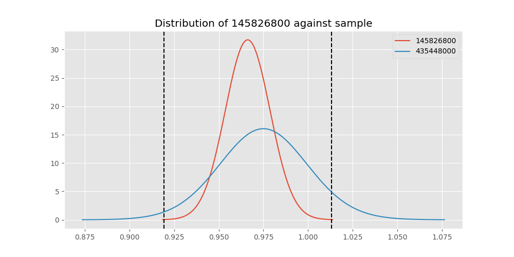
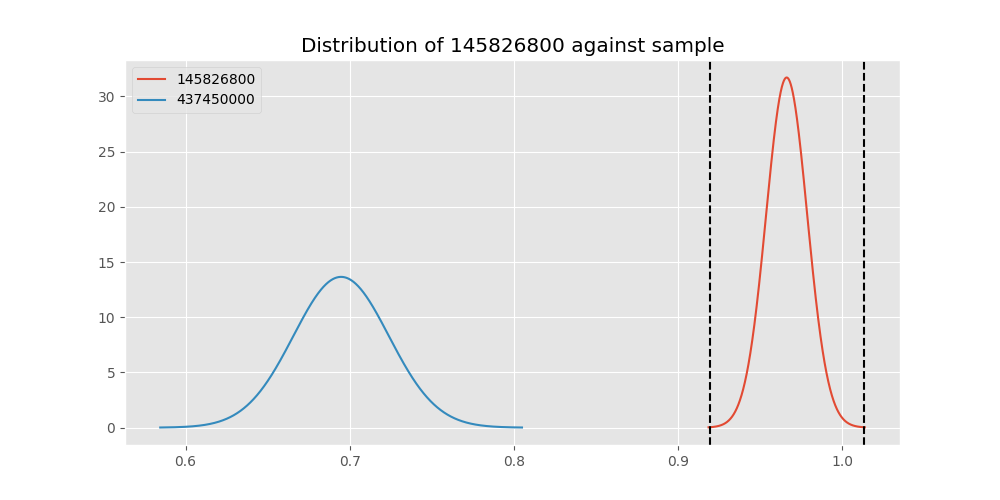
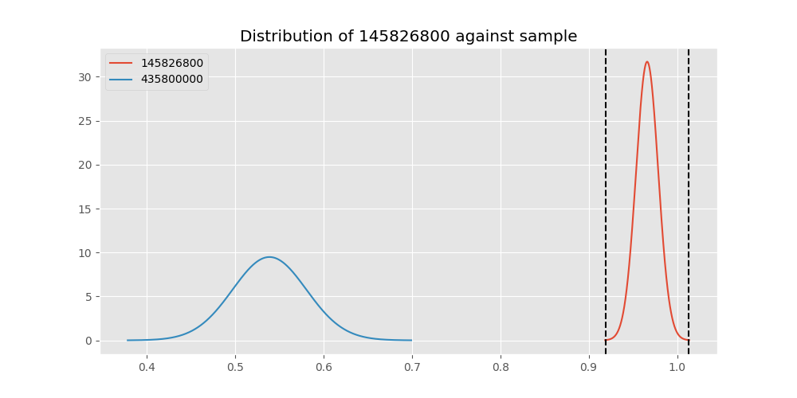

# Testing Results For 145826800 
$H_{0}$: There is not a difference in collection success against 145826800 
$H_{A}$: There is a difference in collection success against 145826800
An $\alpha$ of 0.00025 was used 
Out of 44 tests, there were 15 rejections from 44 independent-t test.
Out of 44 tests, there were 16 rejections from 44 Man Whitney u-tests.
## Testing Results for 145826800 against 436501000 
145826800 has a success rate of 0.966183574879227
436501000 has a success rate of 0.9854014598540146
$H_{0}$: There is not a difference between 145826800 and 436501000
$H_{A}$: There is a difference between 145826800 and 436501000
An $/alpha$ of 0.00025 was used in this test.
__independent t-testing__: With a t-statistic of -1.0918829827043037 and a p-value of 0.27565312565434014, _we failed to reject the null hypothssis_
__Man-Whitney testing__: With a u-statistic of 13907.0 and a p-value of 0.27590071540583305, _we failed to reject the null hypothssis_
 
## Testing Results for 145826800 against 437375000 
145826800 has a success rate of 0.966183574879227
437375000 has a success rate of 0.9982014388489209
$H_{0}$: There is not a difference between 145826800 and 437375000
$H_{A}$: There is a difference between 145826800 and 437375000
An $/alpha$ of 0.00025 was used in this test.
__independent t-testing__: With a t-statistic of -2.5167962966506723 and a p-value of 0.012574442365622936, _we failed to reject the null hypothssis_
__Man-Whitney testing__: With a u-statistic of 55703.5 and a p-value of 0.00011476035675950058, _we **reject** the null hypothssis_
 
## Testing Results for 145826800 against 436500000 
145826800 has a success rate of 0.966183574879227
436500000 has a success rate of 0.9056603773584906
$H_{0}$: There is not a difference between 145826800 and 436500000
$H_{A}$: There is a difference between 145826800 and 436500000
An $/alpha$ of 0.00025 was used in this test.
__independent t-testing__: With a t-statistic of 2.42746428516806 and a p-value of 0.015689149390379138, _we failed to reject the null hypothssis_
__Man-Whitney testing__: With a u-statistic of 17452.5 and a p-value of 0.015946127175914163, _we failed to reject the null hypothssis_
 
## Testing Results for 145826800 against 436990000 
145826800 has a success rate of 0.966183574879227
436990000 has a success rate of 0.9572649572649573
$H_{0}$: There is not a difference between 145826800 and 436990000
$H_{A}$: There is a difference between 145826800 and 436990000
An $/alpha$ of 0.00025 was used in this test.
__independent t-testing__: With a t-statistic of 0.48454221220683624 and a p-value of 0.6282427735796527, _we failed to reject the null hypothssis_
__Man-Whitney testing__: With a u-statistic of 24435.0 and a p-value of 0.6284983585008501, _we failed to reject the null hypothssis_
 
## Testing Results for 145826800 against 145875000 
145826800 has a success rate of 0.966183574879227
145875000 has a success rate of 0.9722222222222222
$H_{0}$: There is not a difference between 145826800 and 145875000
$H_{A}$: There is a difference between 145826800 and 145875000
An $/alpha$ of 0.00025 was used in this test.
__independent t-testing__: With a t-statistic of -0.24892952329054424 and a p-value of 0.8035997675601622, _we failed to reject the null hypothssis_
__Man-Whitney testing__: With a u-statistic of 7407.0 and a p-value of 0.80523328498113, _we failed to reject the null hypothssis_
 
## Testing Results for 145826800 against 437800000 
145826800 has a success rate of 0.966183574879227
437800000 has a success rate of 0.9533678756476683
$H_{0}$: There is not a difference between 145826800 and 437800000
$H_{A}$: There is a difference between 145826800 and 437800000
An $/alpha$ of 0.00025 was used in this test.
__independent t-testing__: With a t-statistic of 0.652310092578945 and a p-value of 0.5145777034669898, _we failed to reject the null hypothssis_
__Man-Whitney testing__: With a u-statistic of 20231.5 and a p-value of 0.5147203916020225, _we failed to reject the null hypothssis_
 
## Testing Results for 145826800 against 145810000 
145826800 has a success rate of 0.966183574879227
145810000 has a success rate of 0.12179487179487179
$H_{0}$: There is not a difference between 145826800 and 145810000
$H_{A}$: There is a difference between 145826800 and 145810000
An $/alpha$ of 0.00025 was used in this test.
__independent t-testing__: With a t-statistic of 31.248294696347777 and a p-value of 1.06503064813875e-104, _we **reject** the null hypothssis_
__Man-Whitney testing__: With a u-statistic of 29779.5 and a p-value of 2.0114965390632982e-59, _we **reject** the null hypothssis_
 
## Testing Results for 145826800 against 437095000 
145826800 has a success rate of 0.966183574879227
437095000 has a success rate of 0.9361702127659575
$H_{0}$: There is not a difference between 145826800 and 437095000
$H_{A}$: There is a difference between 145826800 and 437095000
An $/alpha$ of 0.00025 was used in this test.
__independent t-testing__: With a t-statistic of 0.9530933787121523 and a p-value of 0.3414560547230301, _we failed to reject the null hypothssis_
__Man-Whitney testing__: With a u-statistic of 5010.5 and a p-value of 0.342111553026232, _we failed to reject the null hypothssis_
 
## Testing Results for 145826800 against 437265000 
145826800 has a success rate of 0.966183574879227
437265000 has a success rate of 0.9795454545454545
$H_{0}$: There is not a difference between 145826800 and 437265000
$H_{A}$: There is a difference between 145826800 and 437265000
An $/alpha$ of 0.00025 was used in this test.
__independent t-testing__: With a t-statistic of -1.0200801343480297 and a p-value of 0.3080729110045039, _we failed to reject the null hypothssis_
__Man-Whitney testing__: With a u-statistic of 44931.5 and a p-value of 0.30810330701785116, _we failed to reject the null hypothssis_
 
## Testing Results for 145826800 against 437350000 
145826800 has a success rate of 0.966183574879227
437350000 has a success rate of 0.9488372093023256
$H_{0}$: There is not a difference between 145826800 and 437350000
$H_{A}$: There is a difference between 145826800 and 437350000
An $/alpha$ of 0.00025 was used in this test.
__independent t-testing__: With a t-statistic of 0.8802597683969831 and a p-value of 0.37922200009848617, _we failed to reject the null hypothssis_
__Man-Whitney testing__: With a u-statistic of 22638.5 and a p-value of 0.37920898692498173, _we failed to reject the null hypothssis_
 
## Testing Results for 145826800 against 437200000 
145826800 has a success rate of 0.966183574879227
437200000 has a success rate of 0.8620689655172413
$H_{0}$: There is not a difference between 145826800 and 437200000
$H_{A}$: There is a difference between 145826800 and 437200000
An $/alpha$ of 0.00025 was used in this test.
__independent t-testing__: With a t-statistic of 3.82996877762101 and a p-value of 0.00014831107355755304, _we **reject** the null hypothssis_
__Man-Whitney testing__: With a u-statistic of 23198.0 and a p-value of 0.00016543937746847268, _we **reject** the null hypothssis_
 
## Testing Results for 145826800 against 435600000 
145826800 has a success rate of 0.966183574879227
435600000 has a success rate of 0.9819341126461212
$H_{0}$: There is not a difference between 145826800 and 435600000
$H_{A}$: There is a difference between 145826800 and 435600000
An $/alpha$ of 0.00025 was used in this test.
__independent t-testing__: With a t-statistic of -1.4340630046268965 and a p-value of 0.15182707829884273, _we failed to reject the null hypothssis_
__Man-Whitney testing__: With a u-statistic of 95859.5 and a p-value of 0.15187619373888356, _we failed to reject the null hypothssis_
 
## Testing Results for 145826800 against 450000000 
145826800 has a success rate of 0.966183574879227
450000000 has a success rate of 0.8235294117647058
$H_{0}$: There is not a difference between 145826800 and 450000000
$H_{A}$: There is a difference between 145826800 and 450000000
An $/alpha$ of 0.00025 was used in this test.
__independent t-testing__: With a t-statistic of 4.3130607839227535 and a p-value of 2.2098629672980082e-05, _we **reject** the null hypothssis_
__Man-Whitney testing__: With a u-statistic of 10052.5 and a p-value of 2.8319031088263228e-05, _we **reject** the null hypothssis_
 
## Testing Results for 145826800 against 145978500 
145826800 has a success rate of 0.966183574879227
145978500 has a success rate of 0.9963636363636363
$H_{0}$: There is not a difference between 145826800 and 145978500
$H_{A}$: There is a difference between 145826800 and 145978500
An $/alpha$ of 0.00025 was used in this test.
__independent t-testing__: With a t-statistic of -2.3023506888428056 and a p-value of 0.02217013771437463, _we failed to reject the null hypothssis_
__Man-Whitney testing__: With a u-statistic of 27603.5 and a p-value of 0.010375698011453471, _we failed to reject the null hypothssis_
 
## Testing Results for 145826800 against 437050000 
145826800 has a success rate of 0.966183574879227
437050000 has a success rate of 0.5346534653465347
$H_{0}$: There is not a difference between 145826800 and 437050000
$H_{A}$: There is a difference between 145826800 and 437050000
An $/alpha$ of 0.00025 was used in this test.
__independent t-testing__: With a t-statistic of 11.012893889117246 and a p-value of 5.5520483275076364e-24, _we **reject** the null hypothssis_
__Man-Whitney testing__: With a u-statistic of 14964.5 and a p-value of 1.0202195500263296e-20, _we **reject** the null hypothssis_
 
## Testing Results for 145826800 against 435300000 
145826800 has a success rate of 0.966183574879227
435300000 has a success rate of 0.1232876712328767
$H_{0}$: There is not a difference between 145826800 and 435300000
$H_{A}$: There is a difference between 145826800 and 435300000
An $/alpha$ of 0.00025 was used in this test.
__independent t-testing__: With a t-statistic of 30.774090841031786 and a p-value of 1.0376468407023852e-101, _we **reject** the null hypothssis_
__Man-Whitney testing__: With a u-statistic of 27848.0 and a p-value of 8.566067342144296e-58, _we **reject** the null hypothssis_
 
## Testing Results for 145826800 against 437475000 
145826800 has a success rate of 0.966183574879227
437475000 has a success rate of 0.5045045045045045
$H_{0}$: There is not a difference between 145826800 and 437475000
$H_{A}$: There is a difference between 145826800 and 437475000
An $/alpha$ of 0.00025 was used in this test.
__independent t-testing__: With a t-statistic of 12.955871879689512 and a p-value of 7.886984009719807e-35, _we **reject** the null hypothssis_
__Man-Whitney testing__: With a u-statistic of 83962.5 and a p-value of 8.629504226409816e-32, _we **reject** the null hypothssis_
 
## Testing Results for 145826800 against 435448000 
145826800 has a success rate of 0.966183574879227
435448000 has a success rate of 0.975
$H_{0}$: There is not a difference between 145826800 and 435448000
$H_{A}$: There is a difference between 145826800 and 435448000
An $/alpha$ of 0.00025 was used in this test.
__independent t-testing__: With a t-statistic of -0.28722345119730447 and a p-value of 0.7741840091493074, _we failed to reject the null hypothssis_
__Man-Whitney testing__: With a u-statistic of 4103.5 and a p-value of 0.7765493575379565, _we failed to reject the null hypothssis_
 
## Testing Results for 145826800 against 437644000 
145826800 has a success rate of 0.966183574879227
437644000 has a success rate of 0.9743589743589743
$H_{0}$: There is not a difference between 145826800 and 437644000
$H_{A}$: There is a difference between 145826800 and 437644000
An $/alpha$ of 0.00025 was used in this test.
__independent t-testing__: With a t-statistic of -0.4075324269446534 and a p-value of 0.6838877882514636, _we failed to reject the null hypothssis_
__Man-Whitney testing__: With a u-statistic of 12010.5 and a p-value of 0.6847436128131736, _we failed to reject the null hypothssis_
 
## Testing Results for 145826800 against 145825000 
145826800 has a success rate of 0.966183574879227
145825000 has a success rate of 0.8687448728465955
$H_{0}$: There is not a difference between 145826800 and 145825000
$H_{A}$: There is a difference between 145826800 and 145825000
An $/alpha$ of 0.00025 was used in this test.
__independent t-testing__: With a t-statistic of 4.100421583539238 and a p-value of 4.2484457962134315e-05, _we **reject** the null hypothssis_
__Man-Whitney testing__: With a u-statistic of 276920.0 and a p-value of 4.348623828993763e-05, _we **reject** the null hypothssis_
 
## Testing Results for 145826800 against 437345000 
145826800 has a success rate of 0.966183574879227
437345000 has a success rate of 0.7603092783505154
$H_{0}$: There is not a difference between 145826800 and 437345000
$H_{A}$: There is a difference between 145826800 and 437345000
An $/alpha$ of 0.00025 was used in this test.
__independent t-testing__: With a t-statistic of 6.617584711076491 and a p-value of 8.175107115912714e-11, _we **reject** the null hypothssis_
__Man-Whitney testing__: With a u-statistic of 48425.5 and a p-value of 1.6482495341317658e-10, _we **reject** the null hypothssis_
 
## Testing Results for 145826800 against 435275000 
145826800 has a success rate of 0.966183574879227
435275000 has a success rate of 0.9152542372881356
$H_{0}$: There is not a difference between 145826800 and 435275000
$H_{A}$: There is a difference between 145826800 and 435275000
An $/alpha$ of 0.00025 was used in this test.
__independent t-testing__: With a t-statistic of 1.9890201110100463 and a p-value of 0.047542287004406124, _we failed to reject the null hypothssis_
__Man-Whitney testing__: With a u-statistic of 12835.0 and a p-value of 0.04788178450223125, _we failed to reject the null hypothssis_
 
## Testing Results for 145826800 against 437322500 
145826800 has a success rate of 0.966183574879227
437322500 has a success rate of 0.9961685823754789
$H_{0}$: There is not a difference between 145826800 and 437322500
$H_{A}$: There is a difference between 145826800 and 437322500
An $/alpha$ of 0.00025 was used in this test.
__independent t-testing__: With a t-statistic of -2.2778361889420062 and a p-value of 0.023601067780270178, _we failed to reject the null hypothssis_
__Man-Whitney testing__: With a u-statistic of 26203.5 and a p-value of 0.01309111196910395, _we failed to reject the null hypothssis_
 
## Testing Results for 145826800 against 437450000 
145826800 has a success rate of 0.966183574879227
437450000 has a success rate of 0.6947791164658634
$H_{0}$: There is not a difference between 145826800 and 437450000
$H_{A}$: There is a difference between 145826800 and 437450000
An $/alpha$ of 0.00025 was used in this test.
__independent t-testing__: With a t-statistic of 7.966109933103728 and a p-value of 1.330929708477863e-14, _we **reject** the null hypothssis_
__Man-Whitney testing__: With a u-statistic of 32766.0 and a p-value of 8.058977527372711e-14, _we **reject** the null hypothssis_
 
## Testing Results for 145826800 against 436703000 
145826800 has a success rate of 0.966183574879227
436703000 has a success rate of 0.9859154929577465
$H_{0}$: There is not a difference between 145826800 and 436703000
$H_{A}$: There is a difference between 145826800 and 436703000
An $/alpha$ of 0.00025 was used in this test.
__independent t-testing__: With a t-statistic of -1.325719360247869 and a p-value of 0.18565671407964157, _we failed to reject the null hypothssis_
__Man-Whitney testing__: With a u-statistic of 21610.5 and a p-value of 0.18583533635990113, _we failed to reject the null hypothssis_
 
## Testing Results for 145826800 against 400500000 
145826800 has a success rate of 0.966183574879227
400500000 has a success rate of 0.3508771929824561
$H_{0}$: There is not a difference between 145826800 and 400500000
$H_{A}$: There is a difference between 145826800 and 400500000
An $/alpha$ of 0.00025 was used in this test.
__independent t-testing__: With a t-statistic of 14.983938520887417 and a p-value of 4.424485737890438e-37, _we **reject** the null hypothssis_
__Man-Whitney testing__: With a u-statistic of 9529.5 and a p-value of 3.226366692816089e-28, _we **reject** the null hypothssis_
 
## Testing Results for 145826800 against 437150000 
145826800 has a success rate of 0.966183574879227
437150000 has a success rate of 0.9859550561797753
$H_{0}$: There is not a difference between 145826800 and 437150000
$H_{A}$: There is a difference between 145826800 and 437150000
An $/alpha$ of 0.00025 was used in this test.
__independent t-testing__: With a t-statistic of -1.5667962322644677 and a p-value of 0.11772618993694114, _we failed to reject the null hypothssis_
__Man-Whitney testing__: With a u-statistic of 36117.5 and a p-value of 0.11788845868214606, _we failed to reject the null hypothssis_
 
## Testing Results for 145826800 against 435635000 
145826800 has a success rate of 0.966183574879227
435635000 has a success rate of 0.9849624060150376
$H_{0}$: There is not a difference between 145826800 and 435635000
$H_{A}$: There is a difference between 145826800 and 435635000
An $/alpha$ of 0.00025 was used in this test.
__independent t-testing__: With a t-statistic of -1.0512632772075796 and a p-value of 0.29388869879739793, _we failed to reject the null hypothssis_
__Man-Whitney testing__: With a u-statistic of 13507.0 and a p-value of 0.29414719394731015, _we failed to reject the null hypothssis_
 
## Testing Results for 145826800 against 437384000 
145826800 has a success rate of 0.966183574879227
437384000 has a success rate of 0.968421052631579
$H_{0}$: There is not a difference between 145826800 and 437384000
$H_{A}$: There is a difference between 145826800 and 437384000
An $/alpha$ of 0.00025 was used in this test.
__independent t-testing__: With a t-statistic of -0.12482182368529869 and a p-value of 0.9007281084665371, _we failed to reject the null hypothssis_
__Man-Whitney testing__: With a u-statistic of 19621.0 and a p-value of 0.9016659889379544, _we failed to reject the null hypothssis_
 
## Testing Results for 145826800 against 437405000 
145826800 has a success rate of 0.966183574879227
437405000 has a success rate of 0.9953917050691244
$H_{0}$: There is not a difference between 145826800 and 437405000
$H_{A}$: There is a difference between 145826800 and 437405000
An $/alpha$ of 0.00025 was used in this test.
__independent t-testing__: With a t-statistic of -2.177998151008053 and a p-value of 0.030303657475675896, _we failed to reject the null hypothssis_
__Man-Whitney testing__: With a u-statistic of 21803.5 and a p-value of 0.027433584188045677, _we failed to reject the null hypothssis_
 
## Testing Results for 145826800 against 435612500 
145826800 has a success rate of 0.966183574879227
435612500 has a success rate of 0.9770114942528736
$H_{0}$: There is not a difference between 145826800 and 435612500
$H_{A}$: There is a difference between 145826800 and 435612500
An $/alpha$ of 0.00025 was used in this test.
__independent t-testing__: With a t-statistic of -0.4904744367813165 and a p-value of 0.6241665694422054, _we failed to reject the null hypothssis_
__Man-Whitney testing__: With a u-statistic of 8907.0 and a p-value of 0.6251300165959087, _we failed to reject the null hypothssis_
 
## Testing Results for 145826800 against 435975000 
145826800 has a success rate of 0.966183574879227
435975000 has a success rate of 0.92
$H_{0}$: There is not a difference between 145826800 and 435975000
$H_{A}$: There is a difference between 145826800 and 435975000
An $/alpha$ of 0.00025 was used in this test.
__independent t-testing__: With a t-statistic of 1.4482471571728552 and a p-value of 0.14877637595781798, _we failed to reject the null hypothssis_
__Man-Whitney testing__: With a u-statistic of 5414.0 and a p-value of 0.14926581636219718, _we failed to reject the null hypothssis_
 
## Testing Results for 145826800 against 437425000 
145826800 has a success rate of 0.966183574879227
437425000 has a success rate of 0.6987654320987654
$H_{0}$: There is not a difference between 145826800 and 437425000
$H_{A}$: There is a difference between 145826800 and 437425000
An $/alpha$ of 0.00025 was used in this test.
__independent t-testing__: With a t-statistic of 8.058773466292092 and a p-value of 4.073860516601202e-15, _we **reject** the null hypothssis_
__Man-Whitney testing__: With a u-statistic of 53127.0 and a p-value of 1.7580188840003588e-14, _we **reject** the null hypothssis_
 
## Testing Results for 145826800 against 437275000 
145826800 has a success rate of 0.966183574879227
437275000 has a success rate of 0.3643724696356275
$H_{0}$: There is not a difference between 145826800 and 437275000
$H_{A}$: There is a difference between 145826800 and 437275000
An $/alpha$ of 0.00025 was used in this test.
__independent t-testing__: With a t-statistic of 16.976484756536642 and a p-value of 2.3212767895239063e-50, _we **reject** the null hypothssis_
__Man-Whitney testing__: With a u-statistic of 40949.5 and a p-value of 3.0118204701903224e-40, _we **reject** the null hypothssis_
 
## Testing Results for 145826800 against 145840000 
145826800 has a success rate of 0.966183574879227
145840000 has a success rate of 0.9649122807017544
$H_{0}$: There is not a difference between 145826800 and 145840000
$H_{A}$: There is a difference between 145826800 and 145840000
An $/alpha$ of 0.00025 was used in this test.
__independent t-testing__: With a t-statistic of 0.04665839157109428 and a p-value of 0.9628210373633626, _we failed to reject the null hypothssis_
__Man-Whitney testing__: With a u-statistic of 5907.0 and a p-value of 0.9651987972548435, _we failed to reject the null hypothssis_
 
## Testing Results for 145826800 against 435525000 
145826800 has a success rate of 0.966183574879227
435525000 has a success rate of 0.6923076923076923
$H_{0}$: There is not a difference between 145826800 and 435525000
$H_{A}$: There is a difference between 145826800 and 435525000
An $/alpha$ of 0.00025 was used in this test.
__independent t-testing__: With a t-statistic of 7.700984651497354 and a p-value of 1.4157114127621692e-13, _we **reject** the null hypothssis_
__Man-Whitney testing__: With a u-statistic of 18854.0 and a p-value of 1.0210826189900724e-12, _we **reject** the null hypothssis_
 
## Testing Results for 145826800 against 436250000 
145826800 has a success rate of 0.966183574879227
436250000 has a success rate of 0.17857142857142858
$H_{0}$: There is not a difference between 145826800 and 436250000
$H_{A}$: There is a difference between 145826800 and 436250000
An $/alpha$ of 0.00025 was used in this test.
__independent t-testing__: With a t-statistic of 21.82796662205787 and a p-value of 8.295949620040443e-61, _we **reject** the null hypothssis_
__Man-Whitney testing__: With a u-statistic of 10361.0 and a p-value of 1.086208699890794e-38, _we **reject** the null hypothssis_
 
## Testing Results for 145826800 against 435950000 
145826800 has a success rate of 0.966183574879227
435950000 has a success rate of 0.9850187265917603
$H_{0}$: There is not a difference between 145826800 and 435950000
$H_{A}$: There is a difference between 145826800 and 435950000
An $/alpha$ of 0.00025 was used in this test.
__independent t-testing__: With a t-statistic of -1.6342427224841898 and a p-value of 0.10263378752560695, _we failed to reject the null hypothssis_
__Man-Whitney testing__: With a u-statistic of 54228.0 and a p-value of 0.10276021266762209, _we failed to reject the null hypothssis_
 
## Testing Results for 145826800 against 435800000 
145826800 has a success rate of 0.966183574879227
435800000 has a success rate of 0.5390070921985816
$H_{0}$: There is not a difference between 145826800 and 435800000
$H_{A}$: There is a difference between 145826800 and 435800000
An $/alpha$ of 0.00025 was used in this test.
__independent t-testing__: With a t-statistic of 11.255605564597628 and a p-value of 2.9738665771415343e-25, _we **reject** the null hypothssis_
__Man-Whitney testing__: With a u-statistic of 20827.5 and a p-value of 5.26382772748039e-22, _we **reject** the null hypothssis_
 
## Testing Results for 145826800 against 437485000 
145826800 has a success rate of 0.966183574879227
437485000 has a success rate of 0.9375
$H_{0}$: There is not a difference between 145826800 and 437485000
$H_{A}$: There is a difference between 145826800 and 437485000
An $/alpha$ of 0.00025 was used in this test.
__independent t-testing__: With a t-statistic of 0.7909606840648236 and a p-value of 0.42975774264972955, _we failed to reject the null hypothssis_
__Man-Whitney testing__: With a u-statistic of 3407.0 and a p-value of 0.4310376271737184, _we failed to reject the null hypothssis_
 
## Testing Results for 145826800 against 136770000 
145826800 has a success rate of 0.966183574879227
136770000 has a success rate of 0.9945945945945946
$H_{0}$: There is not a difference between 145826800 and 136770000
$H_{A}$: There is a difference between 145826800 and 136770000
An $/alpha$ of 0.00025 was used in this test.
__independent t-testing__: With a t-statistic of -2.073053887915487 and a p-value of 0.0390873954150792, _we failed to reject the null hypothssis_
__Man-Whitney testing__: With a u-statistic of 18603.5 and a p-value of 0.047513659763314814, _we failed to reject the null hypothssis_
 
## Testing Results for 145826800 against 437250000 
145826800 has a success rate of 0.966183574879227
437250000 has a success rate of 0.9937106918238994
$H_{0}$: There is not a difference between 145826800 and 437250000
$H_{A}$: There is a difference between 145826800 and 437250000
An $/alpha$ of 0.00025 was used in this test.
__independent t-testing__: With a t-statistic of -2.0613838971433074 and a p-value of 0.04026912648643564, _we failed to reject the null hypothssis_
__Man-Whitney testing__: With a u-statistic of 32007.0 and a p-value of 0.017738013068391515, _we failed to reject the null hypothssis_
 
## Testing Results for 145826800 against 437356000 
145826800 has a success rate of 0.966183574879227
437356000 has a success rate of 0.9328358208955224
$H_{0}$: There is not a difference between 145826800 and 437356000
$H_{A}$: There is a difference between 145826800 and 437356000
An $/alpha$ of 0.00025 was used in this test.
__independent t-testing__: With a t-statistic of 1.4223101284747717 and a p-value of 0.15585568765380642, _we failed to reject the null hypothssis_
__Man-Whitney testing__: With a u-statistic of 14331.5 and a p-value of 0.15600401226265032, _we failed to reject the null hypothssis_
 
## Testing Results for 145826800 against 437676000 
145826800 has a success rate of 0.966183574879227
437676000 has a success rate of 0.9813432835820896
$H_{0}$: There is not a difference between 145826800 and 437676000
$H_{A}$: There is a difference between 145826800 and 437676000
An $/alpha$ of 0.00025 was used in this test.
__independent t-testing__: With a t-statistic of -1.043017840000557 and a p-value of 0.29747281314990137, _we failed to reject the null hypothssis_
__Man-Whitney testing__: With a u-statistic of 27317.5 and a p-value of 0.297559572060782, _we failed to reject the null hypothssis_
 
