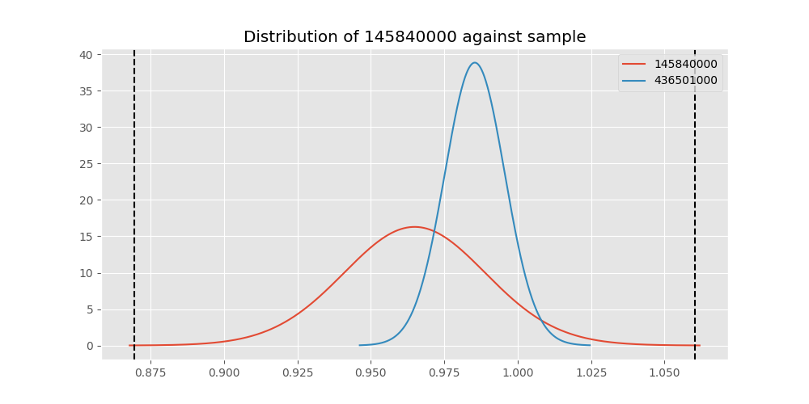
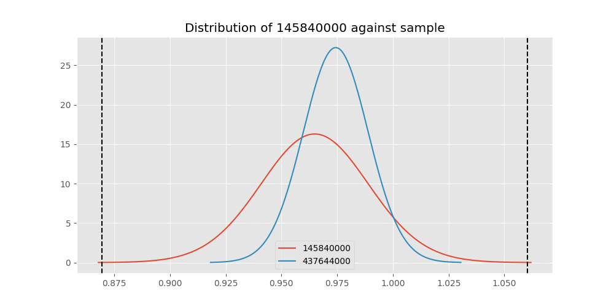
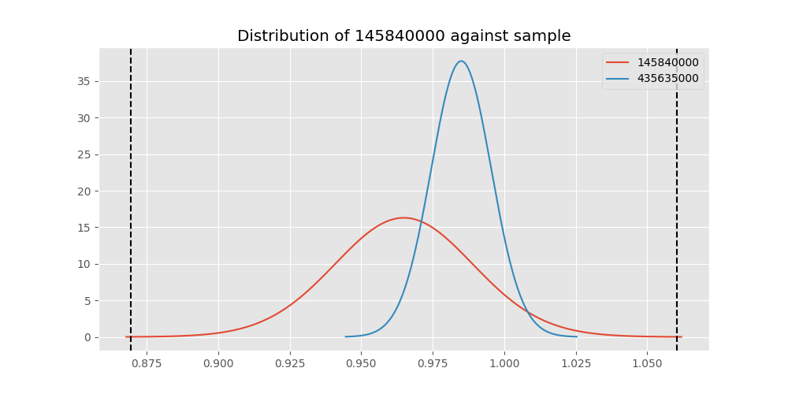
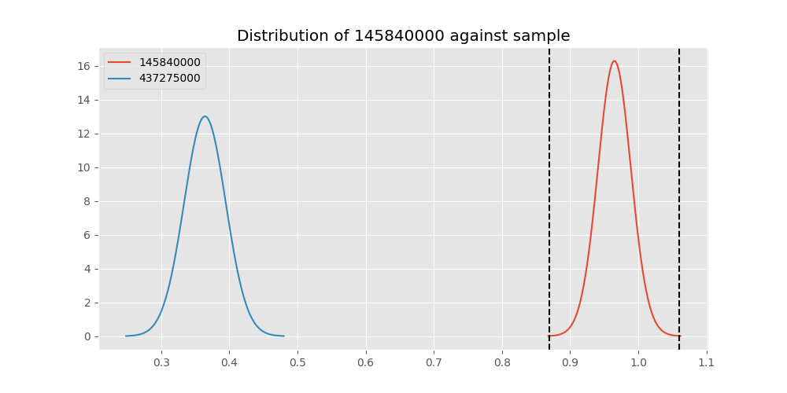

# Testing Results For 145840000 
$H_{0}$: There is not a difference in collection success against 145840000 
$H_{A}$: There is a difference in collection success against 145840000
An $\alpha$ of 0.00025 was used 
Out of 44 tests, there were 11 rejections from 44 independent-t test.
Out of 44 tests, there were 11 rejections from 44 Man Whitney u-tests.
## Testing Results for 145840000 against 436501000 
145840000 has a success rate of 0.9649122807017544
436501000 has a success rate of 0.9854014598540146
$H_{0}$: There is not a difference between 145840000 and 436501000
$H_{A}$: There is a difference between 145840000 and 436501000
An $/alpha$ of 0.00025 was used in this test.
__independent t-testing__: With a t-statistic of -0.9120208826672251 and a p-value of 0.3629014152995319, _we failed to reject the null hypothssis_
__Man-Whitney testing__: With a u-statistic of 3824.5 and a p-value of 0.3645570091279712, _we failed to reject the null hypothssis_
 
## Testing Results for 145840000 against 437375000 
145840000 has a success rate of 0.9649122807017544
437375000 has a success rate of 0.9982014388489209
$H_{0}$: There is not a difference between 145840000 and 437375000
$H_{A}$: There is a difference between 145840000 and 437375000
An $/alpha$ of 0.00025 was used in this test.
__independent t-testing__: With a t-statistic of -1.350257464777597 and a p-value of 0.1823080965784989, _we failed to reject the null hypothssis_
__Man-Whitney testing__: With a u-statistic of 15318.5 and a p-value of 0.0006173849825041961, _we failed to reject the null hypothssis_
 
## Testing Results for 145840000 against 436500000 
145840000 has a success rate of 0.9649122807017544
436500000 has a success rate of 0.9056603773584906
$H_{0}$: There is not a difference between 145840000 and 436500000
$H_{A}$: There is a difference between 145840000 and 436500000
An $/alpha$ of 0.00025 was used in this test.
__independent t-testing__: With a t-statistic of 1.4254309775565177 and a p-value of 0.1554895828018041, _we failed to reject the null hypothssis_
__Man-Whitney testing__: With a u-statistic of 4800.0 and a p-value of 0.15578983201398353, _we failed to reject the null hypothssis_
 
## Testing Results for 145840000 against 436990000 
145840000 has a success rate of 0.9649122807017544
436990000 has a success rate of 0.9572649572649573
$H_{0}$: There is not a difference between 145840000 and 436990000
$H_{A}$: There is a difference between 145840000 and 436990000
An $/alpha$ of 0.00025 was used in this test.
__independent t-testing__: With a t-statistic of 0.25951448864608395 and a p-value of 0.7954230726468364, _we failed to reject the null hypothssis_
__Man-Whitney testing__: With a u-statistic of 6720.0 and a p-value of 0.7968820120136357, _we failed to reject the null hypothssis_
 
## Testing Results for 145840000 against 145875000 
145840000 has a success rate of 0.9649122807017544
145875000 has a success rate of 0.9722222222222222
$H_{0}$: There is not a difference between 145840000 and 145875000
$H_{A}$: There is a difference between 145840000 and 145875000
An $/alpha$ of 0.00025 was used in this test.
__independent t-testing__: With a t-statistic of -0.2360639652718478 and a p-value of 0.8137633183454825, _we failed to reject the null hypothssis_
__Man-Whitney testing__: With a u-statistic of 2037.0 and a p-value of 0.8188366096554609, _we failed to reject the null hypothssis_
 
## Testing Results for 145840000 against 437800000 
145840000 has a success rate of 0.9649122807017544
437800000 has a success rate of 0.9533678756476683
$H_{0}$: There is not a difference between 145840000 and 437800000
$H_{A}$: There is a difference between 145840000 and 437800000
An $/alpha$ of 0.00025 was used in this test.
__independent t-testing__: With a t-statistic of 0.3719968979245999 and a p-value of 0.7102128175938434, _we failed to reject the null hypothssis_
__Man-Whitney testing__: With a u-statistic of 5564.0 and a p-value of 0.7116000735205827, _we failed to reject the null hypothssis_
 
## Testing Results for 145840000 against 145810000 
145840000 has a success rate of 0.9649122807017544
145810000 has a success rate of 0.12179487179487179
$H_{0}$: There is not a difference between 145840000 and 145810000
$H_{A}$: There is a difference between 145840000 and 145810000
An $/alpha$ of 0.00025 was used in this test.
__independent t-testing__: With a t-statistic of 18.339997301078228 and a p-value of 1.472712632397067e-45, _we **reject** the null hypothssis_
__Man-Whitney testing__: With a u-statistic of 8194.5 and a p-value of 3.62854828636881e-30, _we **reject** the null hypothssis_
 
## Testing Results for 145840000 against 437095000 
145840000 has a success rate of 0.9649122807017544
437095000 has a success rate of 0.9361702127659575
$H_{0}$: There is not a difference between 145840000 and 437095000
$H_{A}$: There is a difference between 145840000 and 437095000
An $/alpha$ of 0.00025 was used in this test.
__independent t-testing__: With a t-statistic of 0.67682266619635 and a p-value of 0.500050528096051, _we failed to reject the null hypothssis_
__Man-Whitney testing__: With a u-statistic of 1378.0 and a p-value of 0.5029871567642792, _we failed to reject the null hypothssis_
 
## Testing Results for 145840000 against 437265000 
145840000 has a success rate of 0.9649122807017544
437265000 has a success rate of 0.9795454545454545
$H_{0}$: There is not a difference between 145840000 and 437265000
$H_{A}$: There is a difference between 145840000 and 437265000
An $/alpha$ of 0.00025 was used in this test.
__independent t-testing__: With a t-statistic of -0.7055189242207386 and a p-value of 0.48081923148069505, _we failed to reject the null hypothssis_
__Man-Whitney testing__: With a u-statistic of 12356.5 and a p-value of 0.4814620272368877, _we failed to reject the null hypothssis_
 
## Testing Results for 145840000 against 437350000 
145840000 has a success rate of 0.9649122807017544
437350000 has a success rate of 0.9488372093023256
$H_{0}$: There is not a difference between 145840000 and 437350000
$H_{A}$: There is a difference between 145840000 and 437350000
An $/alpha$ of 0.00025 was used in this test.
__independent t-testing__: With a t-statistic of 0.5041667767558411 and a p-value of 0.6145553401223525, _we failed to reject the null hypothssis_
__Man-Whitney testing__: With a u-statistic of 6226.0 and a p-value of 0.6154570602255192, _we failed to reject the null hypothssis_
 
## Testing Results for 145840000 against 437200000 
145840000 has a success rate of 0.9649122807017544
437200000 has a success rate of 0.8620689655172413
$H_{0}$: There is not a difference between 145840000 and 437200000
$H_{A}$: There is a difference between 145840000 and 437200000
An $/alpha$ of 0.00025 was used in this test.
__independent t-testing__: With a t-statistic of 2.1584046767283414 and a p-value of 0.0318189858611384, _we failed to reject the null hypothssis_
__Man-Whitney testing__: With a u-statistic of 6380.5 and a p-value of 0.0322322823868781, _we failed to reject the null hypothssis_
 
## Testing Results for 145840000 against 435600000 
145840000 has a success rate of 0.9649122807017544
435600000 has a success rate of 0.9819341126461212
$H_{0}$: There is not a difference between 145840000 and 435600000
$H_{A}$: There is a difference between 145840000 and 435600000
An $/alpha$ of 0.00025 was used in this test.
__independent t-testing__: With a t-statistic of -0.9126023038346752 and a p-value of 0.36167258133354285, _we failed to reject the null hypothssis_
__Man-Whitney testing__: With a u-statistic of 26362.0 and a p-value of 0.36193763302169757, _we failed to reject the null hypothssis_
 
## Testing Results for 145840000 against 450000000 
145840000 has a success rate of 0.9649122807017544
450000000 has a success rate of 0.8235294117647058
$H_{0}$: There is not a difference between 145840000 and 450000000
$H_{A}$: There is a difference between 145840000 and 450000000
An $/alpha$ of 0.00025 was used in this test.
__independent t-testing__: With a t-statistic of 2.5855763693237668 and a p-value of 0.010743213812685424, _we failed to reject the null hypothssis_
__Man-Whitney testing__: With a u-statistic of 2765.0 and a p-value of 0.01136487621862277, _we failed to reject the null hypothssis_
 
## Testing Results for 145840000 against 145978500 
145840000 has a success rate of 0.9649122807017544
145978500 has a success rate of 0.9963636363636363
$H_{0}$: There is not a difference between 145840000 and 145978500
$H_{A}$: There is a difference between 145840000 and 145978500
An $/alpha$ of 0.00025 was used in this test.
__independent t-testing__: With a t-statistic of -1.2653589499337885 and a p-value of 0.2107620414545444, _we failed to reject the null hypothssis_
__Man-Whitney testing__: With a u-statistic of 7591.0 and a p-value of 0.022863425585725888, _we failed to reject the null hypothssis_
 
## Testing Results for 145840000 against 437050000 
145840000 has a success rate of 0.9649122807017544
437050000 has a success rate of 0.5346534653465347
$H_{0}$: There is not a difference between 145840000 and 437050000
$H_{A}$: There is a difference between 145840000 and 437050000
An $/alpha$ of 0.00025 was used in this test.
__independent t-testing__: With a t-statistic of 6.236048559618884 and a p-value of 4.024248542724264e-09, _we **reject** the null hypothssis_
__Man-Whitney testing__: With a u-statistic of 4117.0 and a p-value of 2.2076971540654758e-08, _we **reject** the null hypothssis_
 
## Testing Results for 145840000 against 435300000 
145840000 has a success rate of 0.9649122807017544
435300000 has a success rate of 0.1232876712328767
$H_{0}$: There is not a difference between 145840000 and 435300000
$H_{A}$: There is a difference between 145840000 and 435300000
An $/alpha$ of 0.00025 was used in this test.
__independent t-testing__: With a t-statistic of 18.153697078736226 and a p-value of 3.073006655718894e-44, _we **reject** the null hypothssis_
__Man-Whitney testing__: With a u-statistic of 7663.0 and a p-value of 4.083480174193733e-29, _we **reject** the null hypothssis_
 
## Testing Results for 145840000 against 437475000 
145840000 has a success rate of 0.9649122807017544
437475000 has a success rate of 0.5045045045045045
$H_{0}$: There is not a difference between 145840000 and 437475000
$H_{A}$: There is a difference between 145840000 and 437475000
An $/alpha$ of 0.00025 was used in this test.
__independent t-testing__: With a t-statistic of 6.893142395688652 and a p-value of 1.3653520890407784e-11, _we **reject** the null hypothssis_
__Man-Whitney testing__: With a u-statistic of 23100.0 and a p-value of 3.0447691401159495e-11, _we **reject** the null hypothssis_
 
## Testing Results for 145840000 against 435448000 
145840000 has a success rate of 0.9649122807017544
435448000 has a success rate of 0.975
$H_{0}$: There is not a difference between 145840000 and 435448000
$H_{A}$: There is a difference between 145840000 and 435448000
An $/alpha$ of 0.00025 was used in this test.
__independent t-testing__: With a t-statistic of -0.2796896490565809 and a p-value of 0.7803236745721778, _we failed to reject the null hypothssis_
__Man-Whitney testing__: With a u-statistic of 1128.5 and a p-value of 0.7880659426029093, _we failed to reject the null hypothssis_
 
## Testing Results for 145840000 against 437644000 
145840000 has a success rate of 0.9649122807017544
437644000 has a success rate of 0.9743589743589743
$H_{0}$: There is not a difference between 145840000 and 437644000
$H_{A}$: There is a difference between 145840000 and 437644000
An $/alpha$ of 0.00025 was used in this test.
__independent t-testing__: With a t-statistic of -0.34817617710162235 and a p-value of 0.7281336430684846, _we failed to reject the null hypothssis_
__Man-Whitney testing__: With a u-statistic of 3303.0 and a p-value of 0.731204917104963, _we failed to reject the null hypothssis_
 
## Testing Results for 145840000 against 145825000 
145840000 has a success rate of 0.9649122807017544
145825000 has a success rate of 0.8687448728465955
$H_{0}$: There is not a difference between 145840000 and 145825000
$H_{A}$: There is a difference between 145840000 and 145825000
An $/alpha$ of 0.00025 was used in this test.
__independent t-testing__: With a t-statistic of 2.141828728526015 and a p-value of 0.03230390693353522, _we failed to reject the null hypothssis_
__Man-Whitney testing__: With a u-statistic of 76165.0 and a p-value of 0.03234427793970323, _we failed to reject the null hypothssis_
 
## Testing Results for 145840000 against 437345000 
145840000 has a success rate of 0.9649122807017544
437345000 has a success rate of 0.7603092783505154
$H_{0}$: There is not a difference between 145840000 and 437345000
$H_{A}$: There is a difference between 145840000 and 437345000
An $/alpha$ of 0.00025 was used in this test.
__independent t-testing__: With a t-statistic of 3.562078248694288 and a p-value of 0.00040782226032144605, _we failed to reject the null hypothssis_
__Man-Whitney testing__: With a u-statistic of 13320.5 and a p-value of 0.00043922304472726733, _we failed to reject the null hypothssis_
 
## Testing Results for 145840000 against 435275000 
145840000 has a success rate of 0.9649122807017544
435275000 has a success rate of 0.9152542372881356
$H_{0}$: There is not a difference between 145840000 and 435275000
$H_{A}$: There is a difference between 145840000 and 435275000
An $/alpha$ of 0.00025 was used in this test.
__independent t-testing__: With a t-statistic of 1.216342270936075 and a p-value of 0.225511513453446, _we failed to reject the null hypothssis_
__Man-Whitney testing__: With a u-statistic of 3530.0 and a p-value of 0.2258827325621935, _we failed to reject the null hypothssis_
 
## Testing Results for 145840000 against 437322500 
145840000 has a success rate of 0.9649122807017544
437322500 has a success rate of 0.9961685823754789
$H_{0}$: There is not a difference between 145840000 and 437322500
$H_{A}$: There is a difference between 145840000 and 437322500
An $/alpha$ of 0.00025 was used in this test.
__independent t-testing__: With a t-statistic of -1.256031664451391 and a p-value of 0.21407692139360376, _we failed to reject the null hypothssis_
__Man-Whitney testing__: With a u-statistic of 7206.0 and a p-value of 0.027573471103002543, _we failed to reject the null hypothssis_
 
## Testing Results for 145840000 against 437450000 
145840000 has a success rate of 0.9649122807017544
437450000 has a success rate of 0.6947791164658634
$H_{0}$: There is not a difference between 145840000 and 437450000
$H_{A}$: There is a difference between 145840000 and 437450000
An $/alpha$ of 0.00025 was used in this test.
__independent t-testing__: With a t-statistic of 4.335770745139151 and a p-value of 1.977608407973023e-05, _we **reject** the null hypothssis_
__Man-Whitney testing__: With a u-statistic of 9013.5 and a p-value of 2.5150935436987427e-05, _we **reject** the null hypothssis_
 
## Testing Results for 145840000 against 436703000 
145840000 has a success rate of 0.9649122807017544
436703000 has a success rate of 0.9859154929577465
$H_{0}$: There is not a difference between 145840000 and 436703000
$H_{A}$: There is a difference between 145840000 and 436703000
An $/alpha$ of 0.00025 was used in this test.
__independent t-testing__: With a t-statistic of -1.0429222294910863 and a p-value of 0.2979241621222165, _we failed to reject the null hypothssis_
__Man-Whitney testing__: With a u-statistic of 5943.0 and a p-value of 0.2989614649237654, _we failed to reject the null hypothssis_
 
## Testing Results for 145840000 against 400500000 
145840000 has a success rate of 0.9649122807017544
400500000 has a success rate of 0.3508771929824561
$H_{0}$: There is not a difference between 145840000 and 400500000
$H_{A}$: There is a difference between 145840000 and 400500000
An $/alpha$ of 0.00025 was used in this test.
__independent t-testing__: With a t-statistic of 8.983645270876472 and a p-value of 7.282990531912342e-15, _we **reject** the null hypothssis_
__Man-Whitney testing__: With a u-statistic of 2622.0 and a p-value of 6.162000630537062e-12, _we **reject** the null hypothssis_
 
## Testing Results for 145840000 against 437150000 
145840000 has a success rate of 0.9649122807017544
437150000 has a success rate of 0.9859550561797753
$H_{0}$: There is not a difference between 145840000 and 437150000
$H_{A}$: There is a difference between 145840000 and 437150000
An $/alpha$ of 0.00025 was used in this test.
__independent t-testing__: With a t-statistic of -1.1417261348939198 and a p-value of 0.2542326164144855, _we failed to reject the null hypothssis_
__Man-Whitney testing__: With a u-statistic of 9932.5 and a p-value of 0.2548562835236535, _we failed to reject the null hypothssis_
 
## Testing Results for 145840000 against 435635000 
145840000 has a success rate of 0.9649122807017544
435635000 has a success rate of 0.9849624060150376
$H_{0}$: There is not a difference between 145840000 and 435635000
$H_{A}$: There is a difference between 145840000 and 435635000
An $/alpha$ of 0.00025 was used in this test.
__independent t-testing__: With a t-statistic of -0.8793547529245537 and a p-value of 0.3803315490457545, _we failed to reject the null hypothssis_
__Man-Whitney testing__: With a u-statistic of 3714.5 and a p-value of 0.38206707115974914, _we failed to reject the null hypothssis_
 
## Testing Results for 145840000 against 437384000 
145840000 has a success rate of 0.9649122807017544
437384000 has a success rate of 0.968421052631579
$H_{0}$: There is not a difference between 145840000 and 437384000
$H_{A}$: There is a difference between 145840000 and 437384000
An $/alpha$ of 0.00025 was used in this test.
__independent t-testing__: With a t-statistic of -0.13071445298642848 and a p-value of 0.8961084640457384, _we failed to reject the null hypothssis_
__Man-Whitney testing__: With a u-statistic of 5396.0 and a p-value of 0.8985212219723205, _we failed to reject the null hypothssis_
 
## Testing Results for 145840000 against 437405000 
145840000 has a success rate of 0.9649122807017544
437405000 has a success rate of 0.9953917050691244
$H_{0}$: There is not a difference between 145840000 and 437405000
$H_{A}$: There is a difference between 145840000 and 437405000
An $/alpha$ of 0.00025 was used in this test.
__independent t-testing__: With a t-statistic of -1.2183799162068243 and a p-value of 0.2278500780887123, _we failed to reject the null hypothssis_
__Man-Whitney testing__: With a u-statistic of 5996.0 and a p-value of 0.05010107878808514, _we failed to reject the null hypothssis_
 
## Testing Results for 145840000 against 435612500 
145840000 has a success rate of 0.9649122807017544
435612500 has a success rate of 0.9770114942528736
$H_{0}$: There is not a difference between 145840000 and 435612500
$H_{A}$: There is a difference between 145840000 and 435612500
An $/alpha$ of 0.00025 was used in this test.
__independent t-testing__: With a t-statistic of -0.4293248581814765 and a p-value of 0.668337518123109, _we failed to reject the null hypothssis_
__Man-Whitney testing__: With a u-statistic of 2449.5 and a p-value of 0.6720190129576114, _we failed to reject the null hypothssis_
 
## Testing Results for 145840000 against 435975000 
145840000 has a success rate of 0.9649122807017544
435975000 has a success rate of 0.92
$H_{0}$: There is not a difference between 145840000 and 435975000
$H_{A}$: There is a difference between 145840000 and 435975000
An $/alpha$ of 0.00025 was used in this test.
__independent t-testing__: With a t-statistic of 1.0028030831632957 and a p-value of 0.31826129354745725, _we failed to reject the null hypothssis_
__Man-Whitney testing__: With a u-statistic of 1489.0 and a p-value of 0.31976431014191464, _we failed to reject the null hypothssis_
 
## Testing Results for 145840000 against 437425000 
145840000 has a success rate of 0.9649122807017544
437425000 has a success rate of 0.6987654320987654
$H_{0}$: There is not a difference between 145840000 and 437425000
$H_{A}$: There is a difference between 145840000 and 437425000
An $/alpha$ of 0.00025 was used in this test.
__independent t-testing__: With a t-statistic of 4.3215320459119795 and a p-value of 1.900324746513153e-05, _we **reject** the null hypothssis_
__Man-Whitney testing__: With a u-statistic of 14614.5 and a p-value of 2.2321870553893637e-05, _we **reject** the null hypothssis_
 
## Testing Results for 145840000 against 437275000 
145840000 has a success rate of 0.9649122807017544
437275000 has a success rate of 0.3643724696356275
$H_{0}$: There is not a difference between 145840000 and 437275000
$H_{A}$: There is a difference between 145840000 and 437275000
An $/alpha$ of 0.00025 was used in this test.
__independent t-testing__: With a t-statistic of 9.235646560437443 and a p-value of 4.694272578433811e-18, _we **reject** the null hypothssis_
__Man-Whitney testing__: With a u-statistic of 11267.0 and a p-value of 3.1357515006573247e-16, _we **reject** the null hypothssis_
 
## Testing Results for 145840000 against 435525000 
145840000 has a success rate of 0.9649122807017544
435525000 has a success rate of 0.6923076923076923
$H_{0}$: There is not a difference between 145840000 and 435525000
$H_{A}$: There is a difference between 145840000 and 435525000
An $/alpha$ of 0.00025 was used in this test.
__independent t-testing__: With a t-statistic of 4.302705221987023 and a p-value of 2.649726329545512e-05, _we **reject** the null hypothssis_
__Man-Whitney testing__: With a u-statistic of 5186.5 and a p-value of 3.7370705534312e-05, _we **reject** the null hypothssis_
 
## Testing Results for 145840000 against 436250000 
145840000 has a success rate of 0.9649122807017544
436250000 has a success rate of 0.17857142857142858
$H_{0}$: There is not a difference between 145840000 and 436250000
$H_{A}$: There is a difference between 145840000 and 436250000
An $/alpha$ of 0.00025 was used in this test.
__independent t-testing__: With a t-statistic of 13.824758927304195 and a p-value of 6.929139460508595e-26, _we **reject** the null hypothssis_
__Man-Whitney testing__: With a u-statistic of 2851.0 and a p-value of 3.9636376357471576e-17, _we **reject** the null hypothssis_
 
## Testing Results for 145840000 against 435950000 
145840000 has a success rate of 0.9649122807017544
435950000 has a success rate of 0.9850187265917603
$H_{0}$: There is not a difference between 145840000 and 435950000
$H_{A}$: There is a difference between 145840000 and 435950000
An $/alpha$ of 0.00025 was used in this test.
__independent t-testing__: With a t-statistic of -1.1180811773796264 and a p-value of 0.26398813932440274, _we failed to reject the null hypothssis_
__Man-Whitney testing__: With a u-statistic of 14913.0 and a p-value of 0.26441454616380056, _we failed to reject the null hypothssis_
 
## Testing Results for 145840000 against 435800000 
145840000 has a success rate of 0.9649122807017544
435800000 has a success rate of 0.5390070921985816
$H_{0}$: There is not a difference between 145840000 and 435800000
$H_{A}$: There is a difference between 145840000 and 435800000
An $/alpha$ of 0.00025 was used in this test.
__independent t-testing__: With a t-statistic of 6.2482489200866524 and a p-value of 2.533764739573104e-09, _we **reject** the null hypothssis_
__Man-Whitney testing__: With a u-statistic of 5730.0 and a p-value of 1.073773011475056e-08, _we **reject** the null hypothssis_
 
## Testing Results for 145840000 against 437485000 
145840000 has a success rate of 0.9649122807017544
437485000 has a success rate of 0.9375
$H_{0}$: There is not a difference between 145840000 and 437485000
$H_{A}$: There is a difference between 145840000 and 437485000
An $/alpha$ of 0.00025 was used in this test.
__independent t-testing__: With a t-statistic of 0.5934100429434549 and a p-value of 0.5544464037542287, _we failed to reject the null hypothssis_
__Man-Whitney testing__: With a u-statistic of 937.0 and a p-value of 0.5594259229841968, _we failed to reject the null hypothssis_
 
## Testing Results for 145840000 against 136770000 
145840000 has a success rate of 0.9649122807017544
136770000 has a success rate of 0.9945945945945946
$H_{0}$: There is not a difference between 145840000 and 136770000
$H_{A}$: There is a difference between 145840000 and 136770000
An $/alpha$ of 0.00025 was used in this test.
__independent t-testing__: With a t-statistic of -1.1790212247266458 and a p-value of 0.24293104778788305, _we failed to reject the null hypothssis_
__Man-Whitney testing__: With a u-statistic of 5116.0 and a p-value of 0.0781554605857952, _we failed to reject the null hypothssis_
 
## Testing Results for 145840000 against 437250000 
145840000 has a success rate of 0.9649122807017544
437250000 has a success rate of 0.9937106918238994
$H_{0}$: There is not a difference between 145840000 and 437250000
$H_{A}$: There is a difference between 145840000 and 437250000
An $/alpha$ of 0.00025 was used in this test.
__independent t-testing__: With a t-statistic of -1.152584898247626 and a p-value of 0.2536750736001686, _we failed to reject the null hypothssis_
__Man-Whitney testing__: With a u-statistic of 8802.0 and a p-value of 0.05205249956761518, _we failed to reject the null hypothssis_
 
## Testing Results for 145840000 against 437356000 
145840000 has a success rate of 0.9649122807017544
437356000 has a success rate of 0.9328358208955224
$H_{0}$: There is not a difference between 145840000 and 437356000
$H_{A}$: There is a difference between 145840000 and 437356000
An $/alpha$ of 0.00025 was used in this test.
__independent t-testing__: With a t-statistic of 0.8678369735874186 and a p-value of 0.38658414500987426, _we failed to reject the null hypothssis_
__Man-Whitney testing__: With a u-statistic of 3941.5 and a p-value of 0.38711739078864205, _we failed to reject the null hypothssis_
 
## Testing Results for 145840000 against 437676000 
145840000 has a success rate of 0.9649122807017544
437676000 has a success rate of 0.9813432835820896
$H_{0}$: There is not a difference between 145840000 and 437676000
$H_{A}$: There is a difference between 145840000 and 437676000
An $/alpha$ of 0.00025 was used in this test.
__independent t-testing__: With a t-statistic of -0.774301796008737 and a p-value of 0.4393187358510573, _we failed to reject the null hypothssis_
__Man-Whitney testing__: With a u-statistic of 7512.5 and a p-value of 0.44029570063747836, _we failed to reject the null hypothssis_
 
## Testing Results for 145840000 against 145826800 
145840000 has a success rate of 0.9649122807017544
145826800 has a success rate of 0.966183574879227
$H_{0}$: There is not a difference between 145840000 and 145826800
$H_{A}$: There is a difference between 145840000 and 145826800
An $/alpha$ of 0.00025 was used in this test.
__independent t-testing__: With a t-statistic of -0.04665839157109428 and a p-value of 0.9628210373633626, _we failed to reject the null hypothssis_
__Man-Whitney testing__: With a u-statistic of 5892.0 and a p-value of 0.9651987972548435, _we failed to reject the null hypothssis_
 
