# Testing Results For 145875000 
$H_{0}$: There is not a difference in collection success against 145875000 
$H_{A}$: There is a difference in collection success against 145875000
An $\alpha$ of 0.00025 was used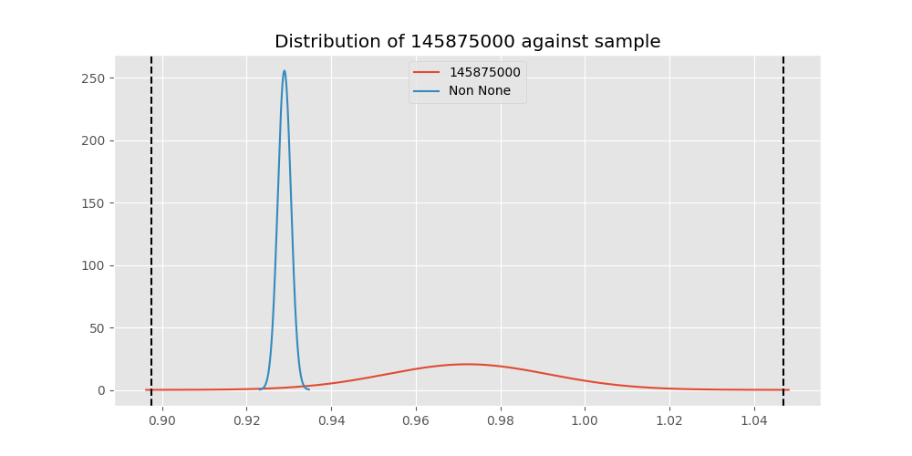 
Out of 44 tests, there were 12 rejections from 44 independent-t test.
Out of 44 tests, there were 12 rejections from 44 Man Whitney u-tests.
## Testing Results for 145875000 against 436501000 
145875000 has a success rate of 0.9722222222222222
436501000 has a success rate of 0.9854014598540146
$H_{0}$: There is not a difference between 145875000 and 436501000
$H_{A}$: There is a difference between 145875000 and 436501000
An $/alpha$ of 0.00025 was used in this test.
__independent t-testing__: With a t-statistic of -0.6583384903613754 and a p-value of 0.5110521833110152, _we failed to reject the null hypothssis_
__Man-Whitney testing__: With a u-statistic of 4867.0 and a p-value of 0.5130049107558076, _we failed to reject the null hypothssis_
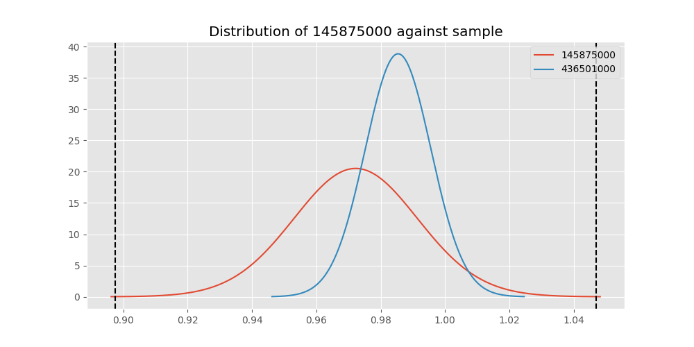 
## Testing Results for 145875000 against 437375000 
145875000 has a success rate of 0.9722222222222222
437375000 has a success rate of 0.9982014388489209
$H_{0}$: There is not a difference between 145875000 and 437375000
$H_{A}$: There is a difference between 145875000 and 437375000
An $/alpha$ of 0.00025 was used in this test.
__independent t-testing__: With a t-statistic of -1.3264314084621007 and a p-value of 0.18887665561712924, _we failed to reject the null hypothssis_
__Man-Whitney testing__: With a u-statistic of 19496.0 and a p-value of 0.002673949647966999, _we failed to reject the null hypothssis_
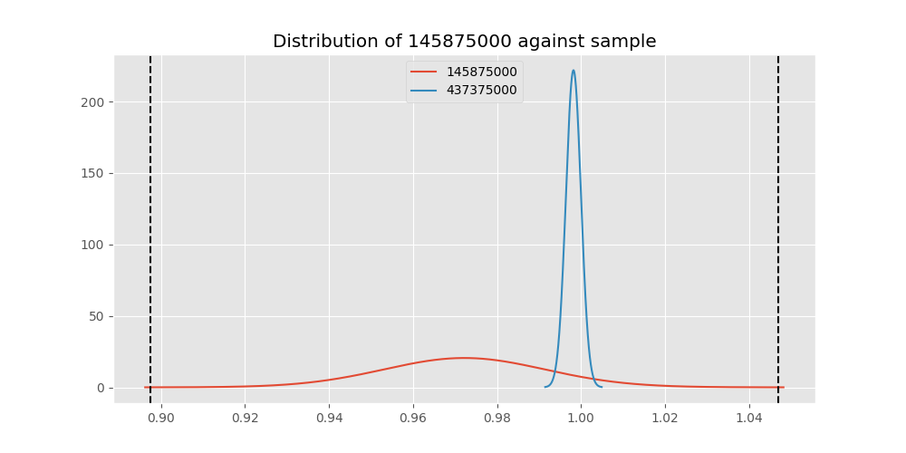 
## Testing Results for 145875000 against 436500000 
145875000 has a success rate of 0.9722222222222222
436500000 has a success rate of 0.9056603773584906
$H_{0}$: There is not a difference between 145875000 and 436500000
$H_{A}$: There is a difference between 145875000 and 436500000
An $/alpha$ of 0.00025 was used in this test.
__independent t-testing__: With a t-statistic of 1.7993898717532002 and a p-value of 0.0732734559571099, _we failed to reject the null hypothssis_
__Man-Whitney testing__: With a u-statistic of 6105.0 and a p-value of 0.07371962546060323, _we failed to reject the null hypothssis_
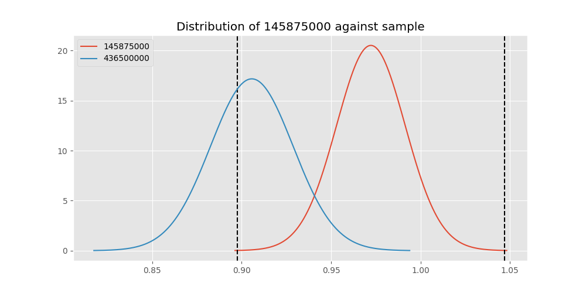 
## Testing Results for 145875000 against 436990000 
145875000 has a success rate of 0.9722222222222222
436990000 has a success rate of 0.9572649572649573
$H_{0}$: There is not a difference between 145875000 and 436990000
$H_{A}$: There is a difference between 145875000 and 436990000
An $/alpha$ of 0.00025 was used in this test.
__independent t-testing__: With a t-statistic of 0.5702049542397628 and a p-value of 0.5689598671012438, _we failed to reject the null hypothssis_
__Man-Whitney testing__: With a u-statistic of 8550.0 and a p-value of 0.5696468910509103, _we failed to reject the null hypothssis_
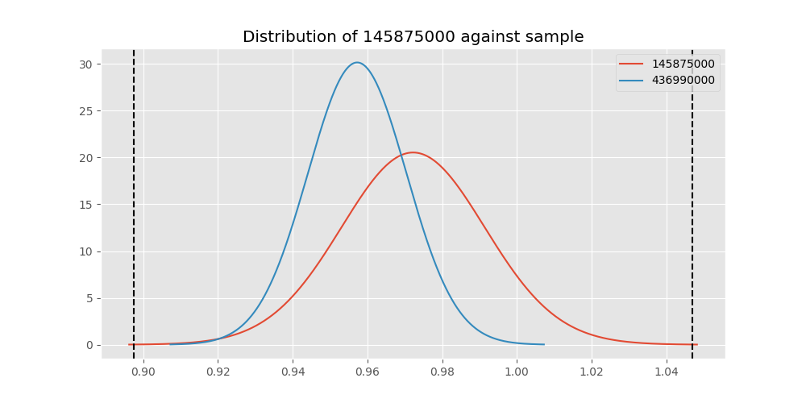 
## Testing Results for 145875000 against 437800000 
145875000 has a success rate of 0.9722222222222222
437800000 has a success rate of 0.9533678756476683
$H_{0}$: There is not a difference between 145875000 and 437800000
$H_{A}$: There is a difference between 145875000 and 437800000
An $/alpha$ of 0.00025 was used in this test.
__independent t-testing__: With a t-statistic of 0.6825041896570153 and a p-value of 0.4955208841476869, _we failed to reject the null hypothssis_
__Man-Whitney testing__: With a u-statistic of 7079.0 and a p-value of 0.49613214300366404, _we failed to reject the null hypothssis_
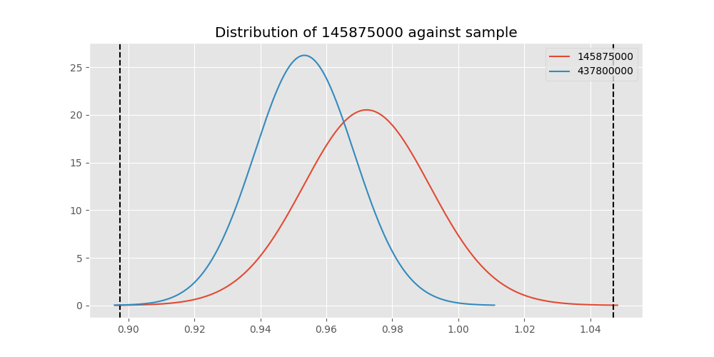 
## Testing Results for 145875000 against 145810000 
145875000 has a success rate of 0.9722222222222222
145810000 has a success rate of 0.12179487179487179
$H_{0}$: There is not a difference between 145875000 and 145810000
$H_{A}$: There is a difference between 145875000 and 145810000
An $/alpha$ of 0.00025 was used in this test.
__independent t-testing__: With a t-statistic of 20.78940932360773 and a p-value of 2.2625559794104194e-54, _we **reject** the null hypothssis_
__Man-Whitney testing__: With a u-statistic of 10392.0 and a p-value of 2.830657775558394e-34, _we **reject** the null hypothssis_
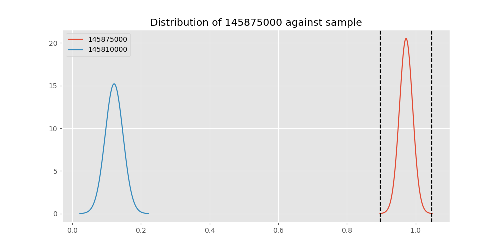 
## Testing Results for 145875000 against 437095000 
145875000 has a success rate of 0.9722222222222222
437095000 has a success rate of 0.9361702127659575
$H_{0}$: There is not a difference between 145875000 and 437095000
$H_{A}$: There is a difference between 145875000 and 437095000
An $/alpha$ of 0.00025 was used in this test.
__independent t-testing__: With a t-statistic of 0.9538547541608735 and a p-value of 0.34212371470316916, _we failed to reject the null hypothssis_
__Man-Whitney testing__: With a u-statistic of 1753.0 and a p-value of 0.3439456749905787, _we failed to reject the null hypothssis_
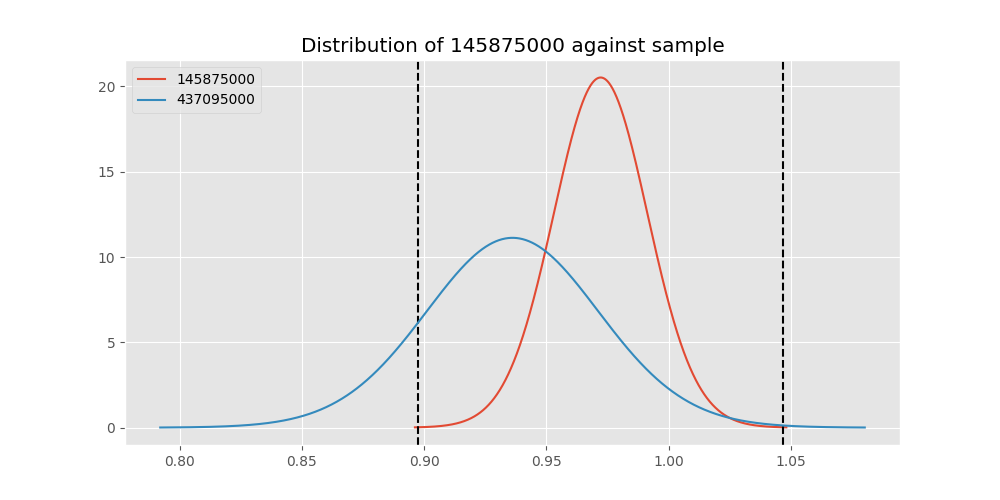 
## Testing Results for 145875000 against 437265000 
145875000 has a success rate of 0.9722222222222222
437265000 has a success rate of 0.9795454545454545
$H_{0}$: There is not a difference between 145875000 and 437265000
$H_{A}$: There is a difference between 145875000 and 437265000
An $/alpha$ of 0.00025 was used in this test.
__independent t-testing__: With a t-statistic of -0.39658130337553654 and a p-value of 0.6918421266049797, _we failed to reject the null hypothssis_
__Man-Whitney testing__: With a u-statistic of 15724.0 and a p-value of 0.6926968357790142, _we failed to reject the null hypothssis_
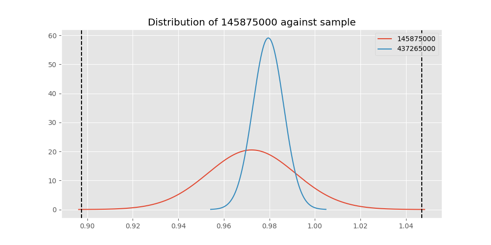 
## Testing Results for 145875000 against 437350000 
145875000 has a success rate of 0.9722222222222222
437350000 has a success rate of 0.9488372093023256
$H_{0}$: There is not a difference between 145875000 and 437350000
$H_{A}$: There is a difference between 145875000 and 437350000
An $/alpha$ of 0.00025 was used in this test.
__independent t-testing__: With a t-statistic of 0.8239772985758755 and a p-value of 0.4106414690065989, _we failed to reject the null hypothssis_
__Man-Whitney testing__: With a u-statistic of 7921.0 and a p-value of 0.41098429045641494, _we failed to reject the null hypothssis_
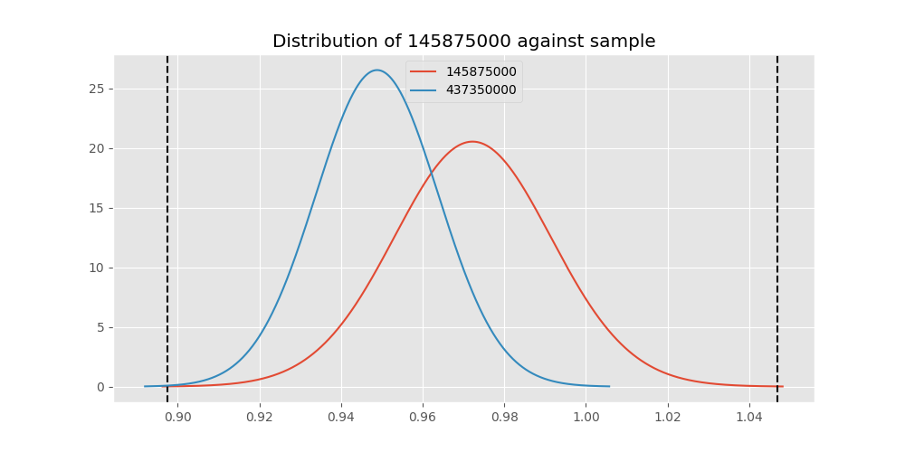 
## Testing Results for 145875000 against 437200000 
145875000 has a success rate of 0.9722222222222222
437200000 has a success rate of 0.8620689655172413
$H_{0}$: There is not a difference between 145875000 and 437200000
$H_{A}$: There is a difference between 145875000 and 437200000
An $/alpha$ of 0.00025 was used in this test.
__independent t-testing__: With a t-statistic of 2.598082957666937 and a p-value of 0.009883577235527196, _we failed to reject the null hypothssis_
__Man-Whitney testing__: With a u-statistic of 8113.0 and a p-value of 0.010180232659663528, _we failed to reject the null hypothssis_
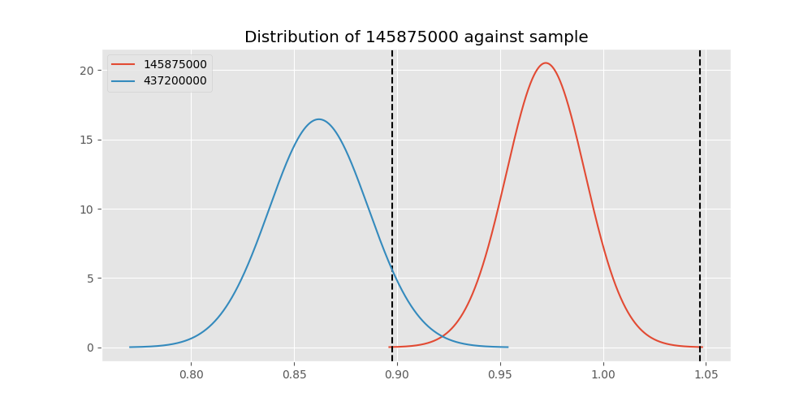 
## Testing Results for 145875000 against 435600000 
145875000 has a success rate of 0.9722222222222222
435600000 has a success rate of 0.9819341126461212
$H_{0}$: There is not a difference between 145875000 and 435600000
$H_{A}$: There is a difference between 145875000 and 435600000
An $/alpha$ of 0.00025 was used in this test.
__independent t-testing__: With a t-statistic of -0.5849838911693713 and a p-value of 0.5586890784857165, _we failed to reject the null hypothssis_
__Man-Whitney testing__: With a u-statistic of 33547.0 and a p-value of 0.5590287306295486, _we failed to reject the null hypothssis_
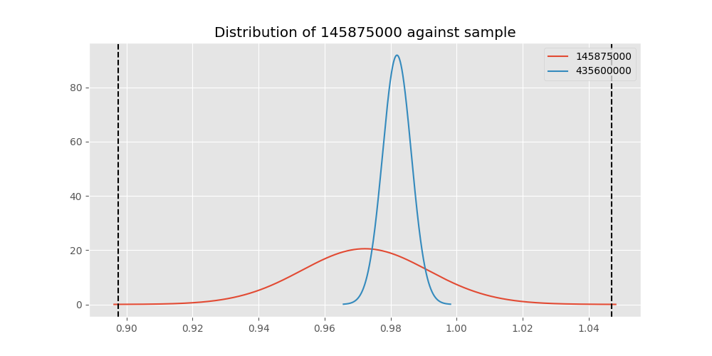 
## Testing Results for 145875000 against 450000000 
145875000 has a success rate of 0.9722222222222222
450000000 has a success rate of 0.8235294117647058
$H_{0}$: There is not a difference between 145875000 and 450000000
$H_{A}$: There is a difference between 145875000 and 450000000
An $/alpha$ of 0.00025 was used in this test.
__independent t-testing__: With a t-statistic of 3.056704024017677 and a p-value of 0.0026361898322247355, _we failed to reject the null hypothssis_
__Man-Whitney testing__: With a u-statistic of 3515.0 and a p-value of 0.002931520023415427, _we failed to reject the null hypothssis_
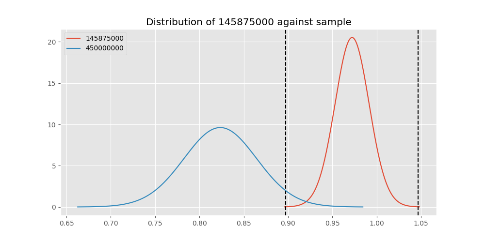 
## Testing Results for 145875000 against 145978500 
145875000 has a success rate of 0.9722222222222222
145978500 has a success rate of 0.9963636363636363
$H_{0}$: There is not a difference between 145875000 and 145978500
$H_{A}$: There is a difference between 145875000 and 145978500
An $/alpha$ of 0.00025 was used in this test.
__independent t-testing__: With a t-statistic of -1.2168574374007277 and a p-value of 0.22742390161655227, _we failed to reject the null hypothssis_
__Man-Whitney testing__: With a u-statistic of 9661.0 and a p-value of 0.04966524904322981, _we failed to reject the null hypothssis_
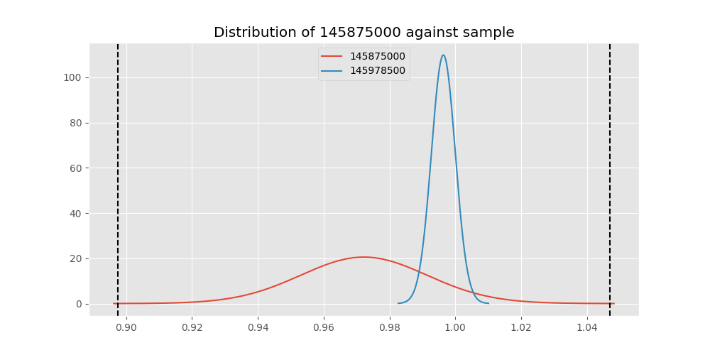 
## Testing Results for 145875000 against 437050000 
145875000 has a success rate of 0.9722222222222222
437050000 has a success rate of 0.5346534653465347
$H_{0}$: There is not a difference between 145875000 and 437050000
$H_{A}$: There is a difference between 145875000 and 437050000
An $/alpha$ of 0.00025 was used in this test.
__independent t-testing__: With a t-statistic of 7.1298236880951915 and a p-value of 2.7062564467212278e-11, _we **reject** the null hypothssis_
__Man-Whitney testing__: With a u-statistic of 5227.0 and a p-value of 3.470993501781522e-10, _we **reject** the null hypothssis_
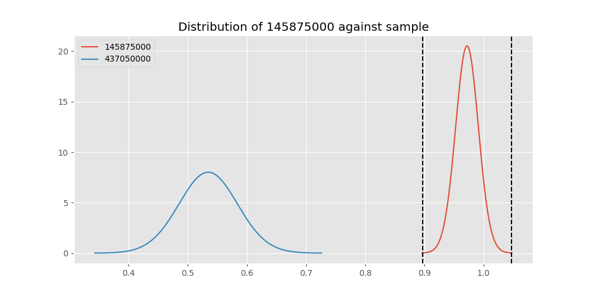 
## Testing Results for 145875000 against 435300000 
145875000 has a success rate of 0.9722222222222222
435300000 has a success rate of 0.1232876712328767
$H_{0}$: There is not a difference between 145875000 and 435300000
$H_{A}$: There is a difference between 145875000 and 435300000
An $/alpha$ of 0.00025 was used in this test.
__independent t-testing__: With a t-statistic of 20.578756539109683 and a p-value of 8.203632583617668e-53, _we **reject** the null hypothssis_
__Man-Whitney testing__: With a u-statistic of 9718.0 and a p-value of 4.192256964464913e-33, _we **reject** the null hypothssis_
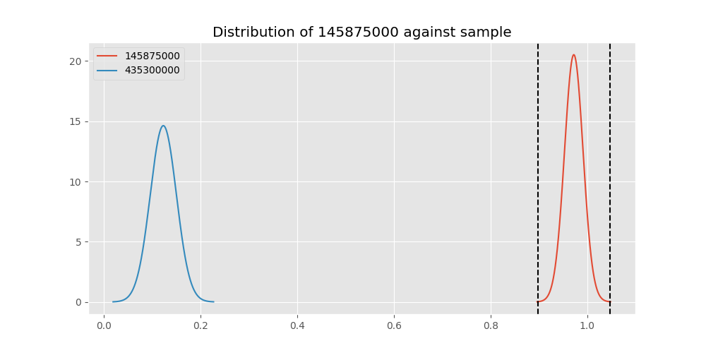 
## Testing Results for 145875000 against 437475000 
145875000 has a success rate of 0.9722222222222222
437475000 has a success rate of 0.5045045045045045
$H_{0}$: There is not a difference between 145875000 and 437475000
$H_{A}$: There is a difference between 145875000 and 437475000
An $/alpha$ of 0.00025 was used in this test.
__independent t-testing__: With a t-statistic of 7.87012638499934 and a p-value of 1.5673741914718724e-14, _we **reject** the null hypothssis_
__Man-Whitney testing__: With a u-statistic of 29325.0 and a p-value of 5.799264897318107e-14, _we **reject** the null hypothssis_
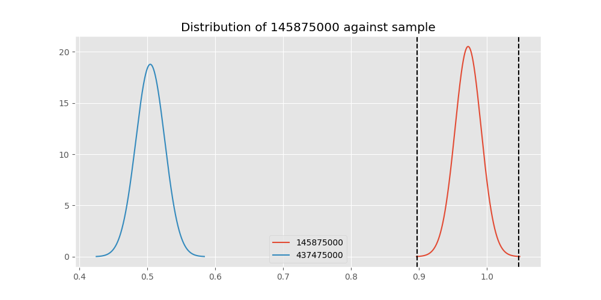 
## Testing Results for 145875000 against 435448000 
145875000 has a success rate of 0.9722222222222222
435448000 has a success rate of 0.975
$H_{0}$: There is not a difference between 145875000 and 435448000
$H_{A}$: There is a difference between 145875000 and 435448000
An $/alpha$ of 0.00025 was used in this test.
__independent t-testing__: With a t-statistic of -0.0864631327094297 and a p-value of 0.9312554531522628, _we failed to reject the null hypothssis_
__Man-Whitney testing__: With a u-statistic of 1436.0 and a p-value of 0.9394224649795295, _we failed to reject the null hypothssis_
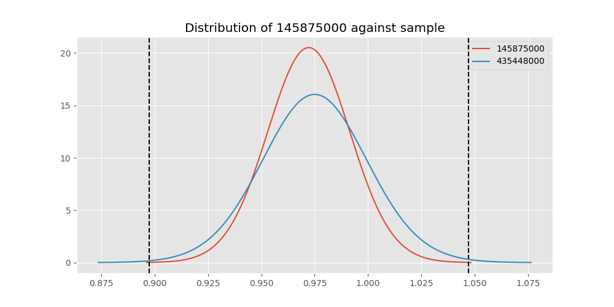 
## Testing Results for 145875000 against 437644000 
145875000 has a success rate of 0.9722222222222222
437644000 has a success rate of 0.9743589743589743
$H_{0}$: There is not a difference between 145875000 and 437644000
$H_{A}$: There is a difference between 145875000 and 437644000
An $/alpha$ of 0.00025 was used in this test.
__independent t-testing__: With a t-statistic of -0.0884197522851763 and a p-value of 0.9296376817258634, _we failed to reject the null hypothssis_
__Man-Whitney testing__: With a u-statistic of 4203.0 and a p-value of 0.9332720758794938, _we failed to reject the null hypothssis_
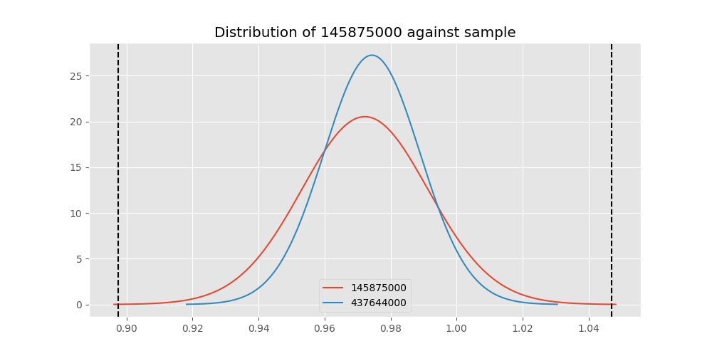 
## Testing Results for 145875000 against 145825000 
145875000 has a success rate of 0.9722222222222222
145825000 has a success rate of 0.8687448728465955
$H_{0}$: There is not a difference between 145875000 and 145825000
$H_{A}$: There is a difference between 145875000 and 145825000
An $/alpha$ of 0.00025 was used in this test.
__independent t-testing__: With a t-statistic of 2.590124534832573 and a p-value of 0.009649659603618587, _we failed to reject the null hypothssis_
__Man-Whitney testing__: With a u-statistic of 96850.0 and a p-value of 0.009680422595427642, _we failed to reject the null hypothssis_
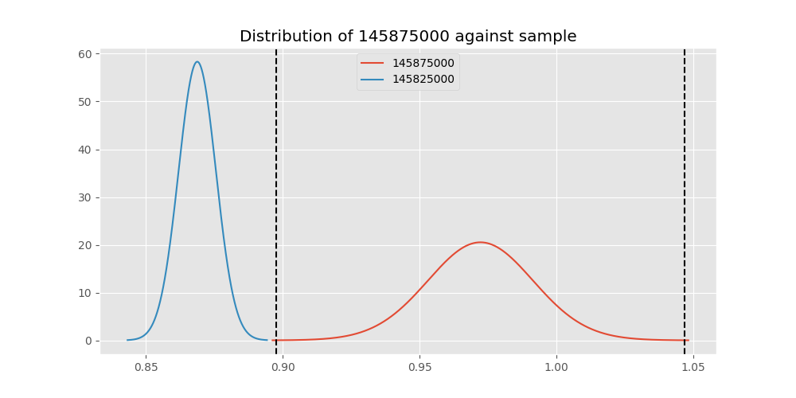 
## Testing Results for 145875000 against 437345000 
145875000 has a success rate of 0.9722222222222222
437345000 has a success rate of 0.7603092783505154
$H_{0}$: There is not a difference between 145875000 and 437345000
$H_{A}$: There is a difference between 145875000 and 437345000
An $/alpha$ of 0.00025 was used in this test.
__independent t-testing__: With a t-statistic of 4.146350615033338 and a p-value of 4.0261066851264134e-05, _we **reject** the null hypothssis_
__Man-Whitney testing__: With a u-statistic of 16928.0 and a p-value of 4.61318779453991e-05, _we **reject** the null hypothssis_
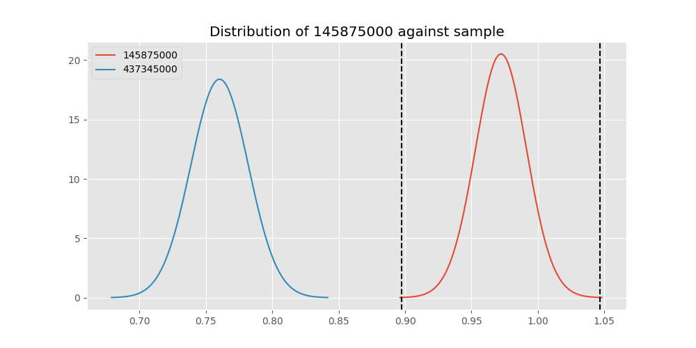 
## Testing Results for 145875000 against 435275000 
145875000 has a success rate of 0.9722222222222222
435275000 has a success rate of 0.9152542372881356
$H_{0}$: There is not a difference between 145875000 and 435275000
$H_{A}$: There is a difference between 145875000 and 435275000
An $/alpha$ of 0.00025 was used in this test.
__independent t-testing__: With a t-statistic of 1.5679698187963123 and a p-value of 0.11856977584526589, _we failed to reject the null hypothssis_
__Man-Whitney testing__: With a u-statistic of 4490.0 and a p-value of 0.11906092473508245, _we failed to reject the null hypothssis_
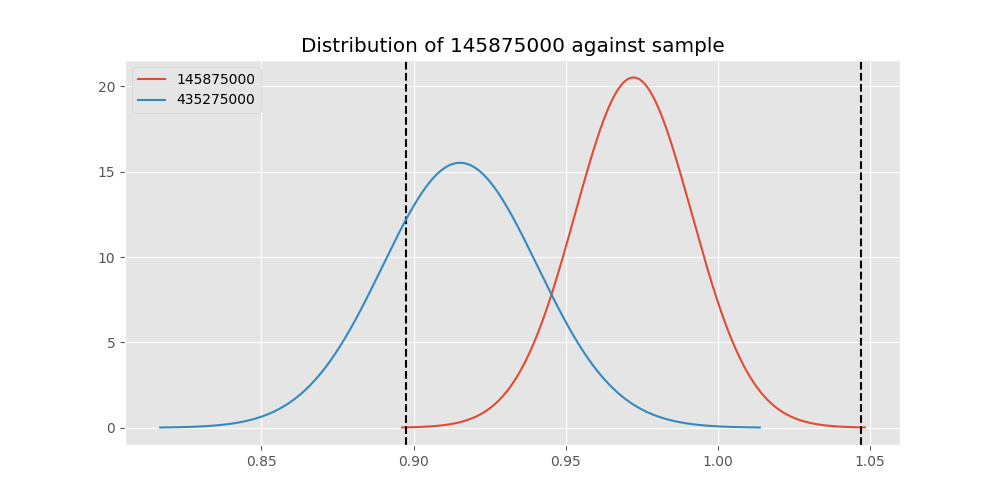 
## Testing Results for 145875000 against 437322500 
145875000 has a success rate of 0.9722222222222222
437322500 has a success rate of 0.9961685823754789
$H_{0}$: There is not a difference between 145875000 and 437322500
$H_{A}$: There is a difference between 145875000 and 437322500
An $/alpha$ of 0.00025 was used in this test.
__independent t-testing__: With a t-statistic of -1.2047983400830686 and a p-value of 0.23199250731245852, _we failed to reject the null hypothssis_
__Man-Whitney testing__: With a u-statistic of 9171.0 and a p-value of 0.057860254415371876, _we failed to reject the null hypothssis_
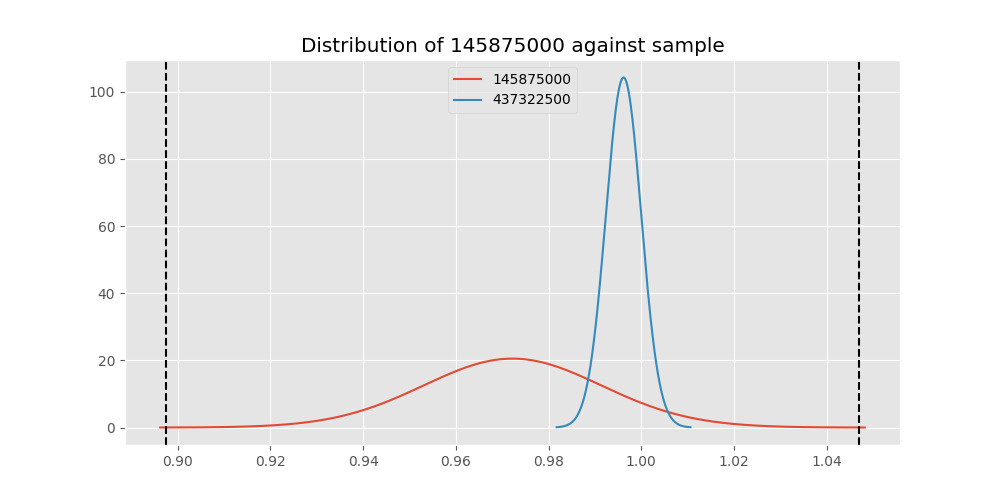 
## Testing Results for 145875000 against 437450000 
145875000 has a success rate of 0.9722222222222222
437450000 has a success rate of 0.6947791164658634
$H_{0}$: There is not a difference between 145875000 and 437450000
$H_{A}$: There is a difference between 145875000 and 437450000
An $/alpha$ of 0.00025 was used in this test.
__independent t-testing__: With a t-statistic of 5.0049519740075805 and a p-value of 9.255264225245204e-07, _we **reject** the null hypothssis_
__Man-Whitney testing__: With a u-statistic of 11451.0 and a p-value of 1.393819908254478e-06, _we **reject** the null hypothssis_
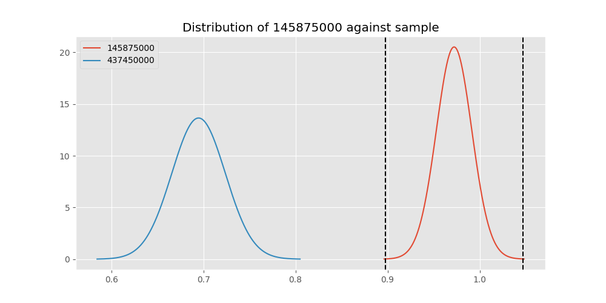 
## Testing Results for 145875000 against 436703000 
145875000 has a success rate of 0.9722222222222222
436703000 has a success rate of 0.9859154929577465
$H_{0}$: There is not a difference between 145875000 and 436703000
$H_{A}$: There is a difference between 145875000 and 436703000
An $/alpha$ of 0.00025 was used in this test.
__independent t-testing__: With a t-statistic of -0.7632009842948974 and a p-value of 0.44597927542343807, _we failed to reject the null hypothssis_
__Man-Whitney testing__: With a u-statistic of 7563.0 and a p-value of 0.4471794812348895, _we failed to reject the null hypothssis_
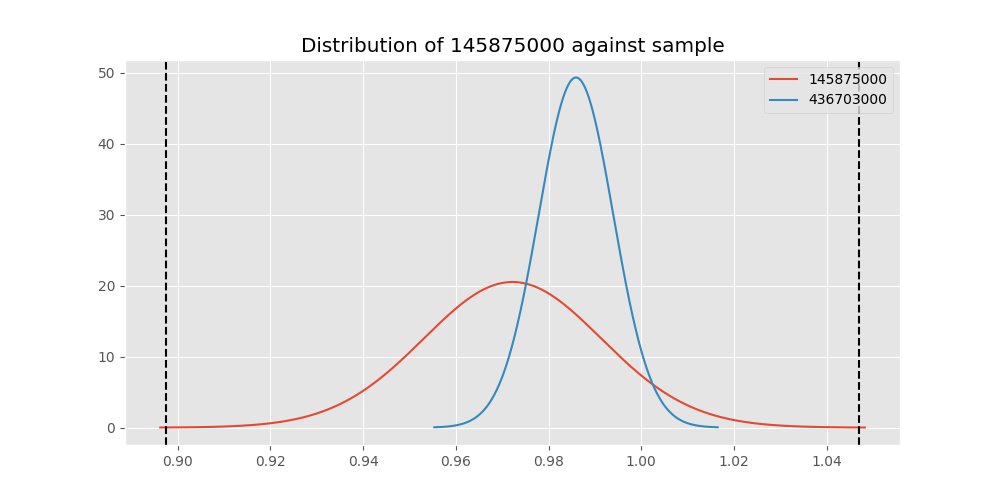 
## Testing Results for 145875000 against 400500000 
145875000 has a success rate of 0.9722222222222222
400500000 has a success rate of 0.3508771929824561
$H_{0}$: There is not a difference between 145875000 and 400500000
$H_{A}$: There is a difference between 145875000 and 400500000
An $/alpha$ of 0.00025 was used in this test.
__independent t-testing__: With a t-statistic of 10.222536962080275 and a p-value of 2.8867976377096043e-18, _we **reject** the null hypothssis_
__Man-Whitney testing__: With a u-statistic of 3327.0 and a p-value of 2.999995064250698e-14, _we **reject** the null hypothssis_
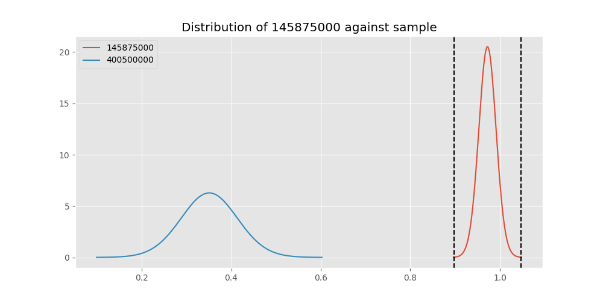 
## Testing Results for 145875000 against 437150000 
145875000 has a success rate of 0.9722222222222222
437150000 has a success rate of 0.9859550561797753
$H_{0}$: There is not a difference between 145875000 and 437150000
$H_{A}$: There is a difference between 145875000 and 437150000
An $/alpha$ of 0.00025 was used in this test.
__independent t-testing__: With a t-statistic of -0.8366091814624972 and a p-value of 0.4032813264253796, _we failed to reject the null hypothssis_
__Man-Whitney testing__: With a u-statistic of 12640.0 and a p-value of 0.40398478630425305, _we failed to reject the null hypothssis_
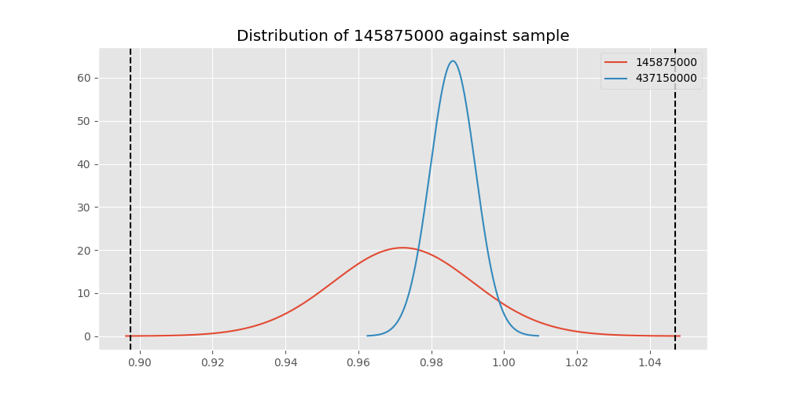 
## Testing Results for 145875000 against 435635000 
145875000 has a success rate of 0.9722222222222222
435635000 has a success rate of 0.9849624060150376
$H_{0}$: There is not a difference between 145875000 and 435635000
$H_{A}$: There is a difference between 145875000 and 435635000
An $/alpha$ of 0.00025 was used in this test.
__independent t-testing__: With a t-statistic of -0.6270583487718232 and a p-value of 0.5313255948342366, _we failed to reject the null hypothssis_
__Man-Whitney testing__: With a u-statistic of 4727.0 and a p-value of 0.5333860269148838, _we failed to reject the null hypothssis_
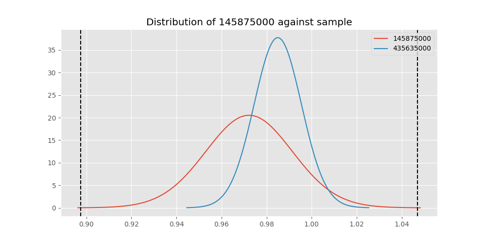 
## Testing Results for 145875000 against 437384000 
145875000 has a success rate of 0.9722222222222222
437384000 has a success rate of 0.968421052631579
$H_{0}$: There is not a difference between 145875000 and 437384000
$H_{A}$: There is a difference between 145875000 and 437384000
An $/alpha$ of 0.00025 was used in this test.
__independent t-testing__: With a t-statistic of 0.15903995381539376 and a p-value of 0.8737608640557359, _we failed to reject the null hypothssis_
__Man-Whitney testing__: With a u-statistic of 6866.0 and a p-value of 0.8758173896584835, _we failed to reject the null hypothssis_
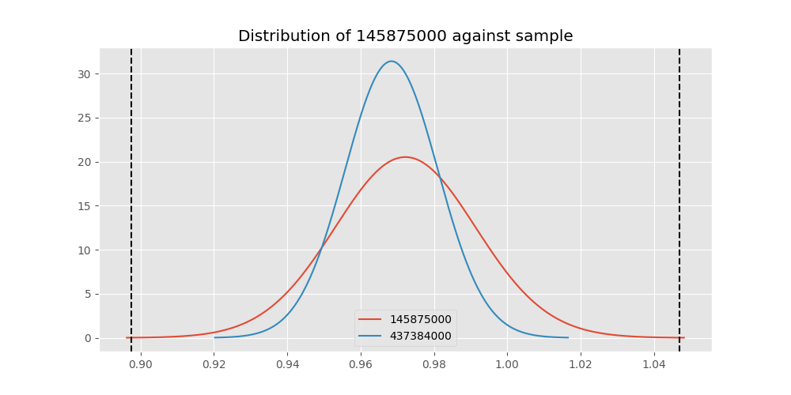 
## Testing Results for 145875000 against 437405000 
145875000 has a success rate of 0.9722222222222222
437405000 has a success rate of 0.9953917050691244
$H_{0}$: There is not a difference between 145875000 and 437405000
$H_{A}$: There is a difference between 145875000 and 437405000
An $/alpha$ of 0.00025 was used in this test.
__independent t-testing__: With a t-statistic of -1.1561569049092582 and a p-value of 0.25109843824557304, _we failed to reject the null hypothssis_
__Man-Whitney testing__: With a u-statistic of 7631.0 and a p-value of 0.09427592798024104, _we failed to reject the null hypothssis_
 
## Testing Results for 145875000 against 435612500 
145875000 has a success rate of 0.9722222222222222
435612500 has a success rate of 0.9770114942528736
$H_{0}$: There is not a difference between 145875000 and 435612500
$H_{A}$: There is a difference between 145875000 and 435612500
An $/alpha$ of 0.00025 was used in this test.
__independent t-testing__: With a t-statistic of -0.19076543577333846 and a p-value of 0.8489558281591224, _we failed to reject the null hypothssis_
__Man-Whitney testing__: With a u-statistic of 3117.0 and a p-value of 0.8532513882905657, _we failed to reject the null hypothssis_
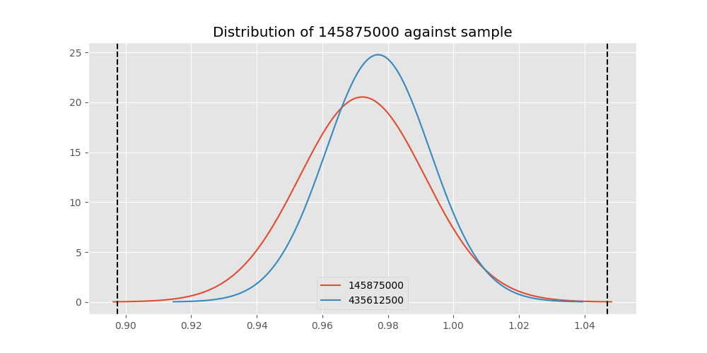 
## Testing Results for 145875000 against 435975000 
145875000 has a success rate of 0.9722222222222222
435975000 has a success rate of 0.92
$H_{0}$: There is not a difference between 145875000 and 435975000
$H_{A}$: There is a difference between 145875000 and 435975000
An $/alpha$ of 0.00025 was used in this test.
__independent t-testing__: With a t-statistic of 1.3103203649895243 and a p-value of 0.19259001291214936, _we failed to reject the null hypothssis_
__Man-Whitney testing__: With a u-statistic of 1894.0 and a p-value of 0.19377019977372167, _we failed to reject the null hypothssis_
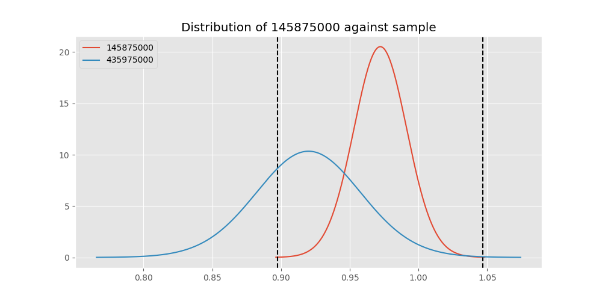 
## Testing Results for 145875000 against 437425000 
145875000 has a success rate of 0.9722222222222222
437425000 has a success rate of 0.6987654320987654
$H_{0}$: There is not a difference between 145875000 and 437425000
$H_{A}$: There is a difference between 145875000 and 437425000
An $/alpha$ of 0.00025 was used in this test.
__independent t-testing__: With a t-statistic of 4.99030645632313 and a p-value of 8.474429222674229e-07, _we **reject** the null hypothssis_
__Man-Whitney testing__: With a u-statistic of 18567.0 and a p-value of 1.1220570446363378e-06, _we **reject** the null hypothssis_
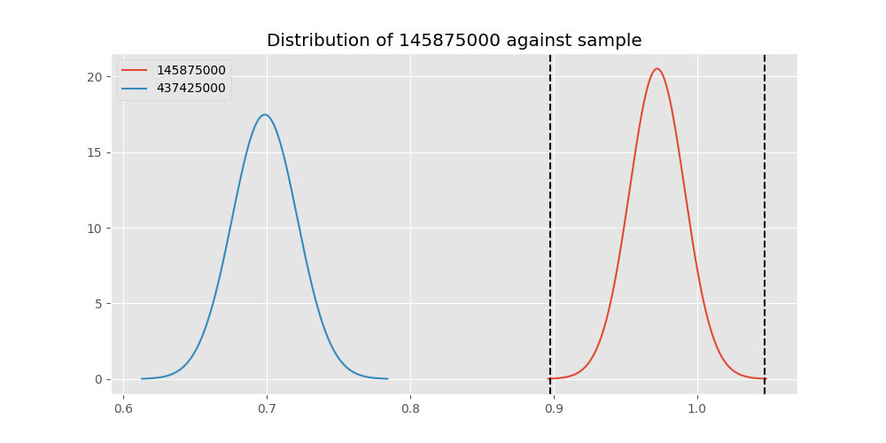 
## Testing Results for 145875000 against 437275000 
145875000 has a success rate of 0.9722222222222222
437275000 has a success rate of 0.3643724696356275
$H_{0}$: There is not a difference between 145875000 and 437275000
$H_{A}$: There is a difference between 145875000 and 437275000
An $/alpha$ of 0.00025 was used in this test.
__independent t-testing__: With a t-statistic of 10.506655651919449 and a p-value of 2.36293842814344e-22, _we **reject** the null hypothssis_
__Man-Whitney testing__: With a u-statistic of 14297.0 and a p-value of 1.280375486817926e-19, _we **reject** the null hypothssis_
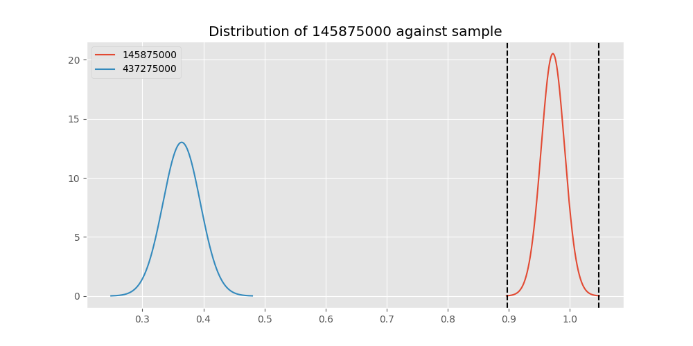 
## Testing Results for 145875000 against 145840000 
145875000 has a success rate of 0.9722222222222222
145840000 has a success rate of 0.9649122807017544
$H_{0}$: There is not a difference between 145875000 and 145840000
$H_{A}$: There is a difference between 145875000 and 145840000
An $/alpha$ of 0.00025 was used in this test.
__independent t-testing__: With a t-statistic of 0.2360639652718478 and a p-value of 0.8137633183454825, _we failed to reject the null hypothssis_
__Man-Whitney testing__: With a u-statistic of 2067.0 and a p-value of 0.8188366096554609, _we failed to reject the null hypothssis_
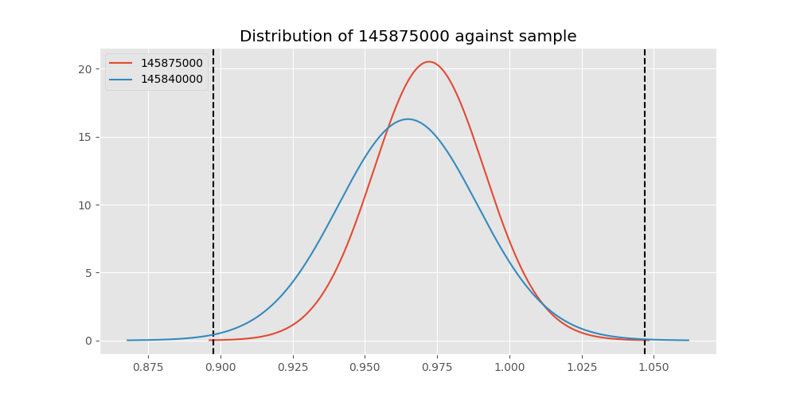 
## Testing Results for 145875000 against 435525000 
145875000 has a success rate of 0.9722222222222222
435525000 has a success rate of 0.6923076923076923
$H_{0}$: There is not a difference between 145875000 and 435525000
$H_{A}$: There is a difference between 145875000 and 435525000
An $/alpha$ of 0.00025 was used in this test.
__independent t-testing__: With a t-statistic of 4.96612540279074 and a p-value of 1.3991367030016194e-06, _we **reject** the null hypothssis_
__Man-Whitney testing__: With a u-statistic of 6589.0 and a p-value of 2.467601673282207e-06, _we **reject** the null hypothssis_
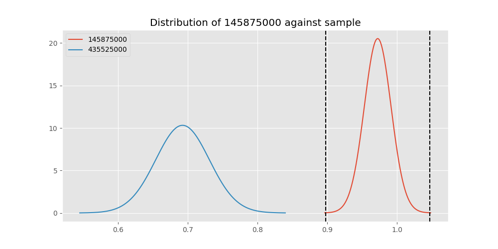 
## Testing Results for 145875000 against 436250000 
145875000 has a success rate of 0.9722222222222222
436250000 has a success rate of 0.17857142857142858
$H_{0}$: There is not a difference between 145875000 and 436250000
$H_{A}$: There is a difference between 145875000 and 436250000
An $/alpha$ of 0.00025 was used in this test.
__independent t-testing__: With a t-statistic of 15.687375497513916 and a p-value of 2.047355467941623e-31, _we **reject** the null hypothssis_
__Man-Whitney testing__: With a u-statistic of 3616.0 and a p-value of 5.0944845435392346e-20, _we **reject** the null hypothssis_
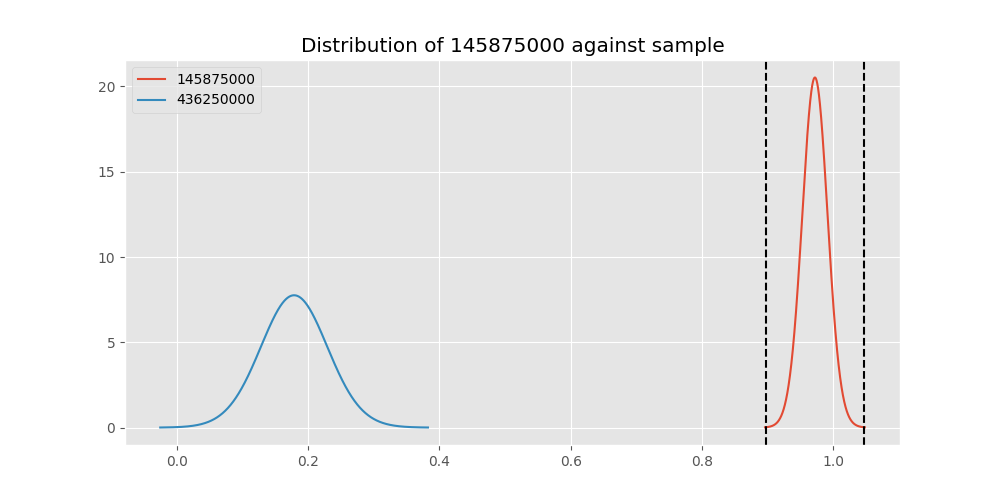 
## Testing Results for 145875000 against 435950000 
145875000 has a success rate of 0.9722222222222222
435950000 has a success rate of 0.9850187265917603
$H_{0}$: There is not a difference between 145875000 and 435950000
$H_{A}$: There is a difference between 145875000 and 435950000
An $/alpha$ of 0.00025 was used in this test.
__independent t-testing__: With a t-statistic of -0.7991955765386044 and a p-value of 0.4244911780726428, _we failed to reject the null hypothssis_
__Man-Whitney testing__: With a u-statistic of 18978.0 and a p-value of 0.424981080098085, _we failed to reject the null hypothssis_
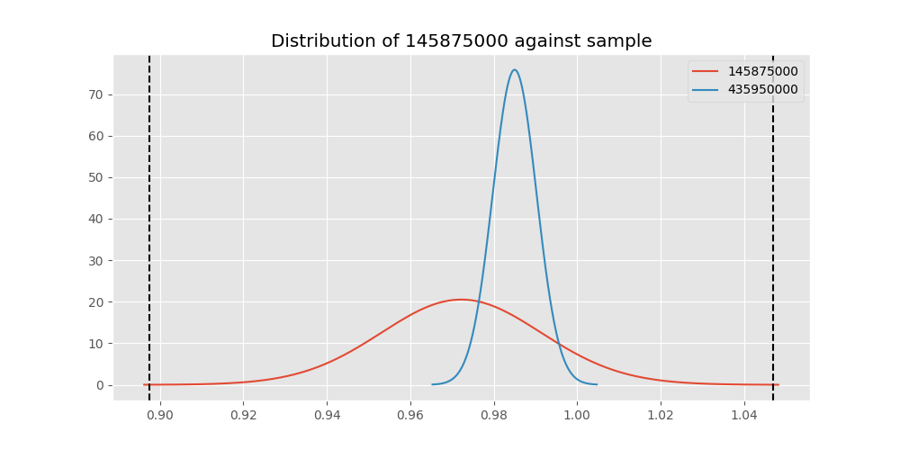 
## Testing Results for 145875000 against 435800000 
145875000 has a success rate of 0.9722222222222222
435800000 has a success rate of 0.5390070921985816
$H_{0}$: There is not a difference between 145875000 and 435800000
$H_{A}$: There is a difference between 145875000 and 435800000
An $/alpha$ of 0.00025 was used in this test.
__independent t-testing__: With a t-statistic of 7.144106963009077 and a p-value of 1.4480447142167722e-11, _we **reject** the null hypothssis_
__Man-Whitney testing__: With a u-statistic of 7275.0 and a p-value of 1.323624826816399e-10, _we **reject** the null hypothssis_
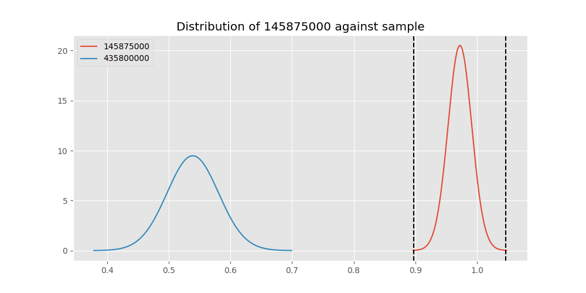 
## Testing Results for 145875000 against 437485000 
145875000 has a success rate of 0.9722222222222222
437485000 has a success rate of 0.9375
$H_{0}$: There is not a difference between 145875000 and 437485000
$H_{A}$: There is a difference between 145875000 and 437485000
An $/alpha$ of 0.00025 was used in this test.
__independent t-testing__: With a t-statistic of 0.844563030973244 and a p-value of 0.4003314346470126, _we failed to reject the null hypothssis_
__Man-Whitney testing__: With a u-statistic of 1192.0 and a p-value of 0.4036224477093635, _we failed to reject the null hypothssis_
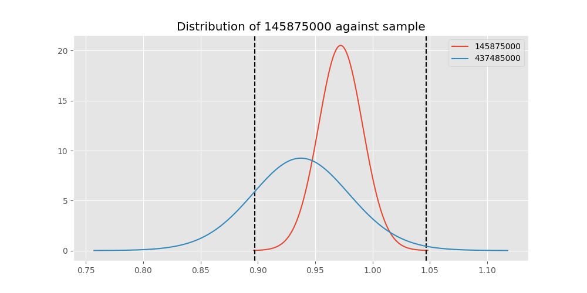 
## Testing Results for 145875000 against 136770000 
145875000 has a success rate of 0.9722222222222222
136770000 has a success rate of 0.9945945945945946
$H_{0}$: There is not a difference between 145875000 and 136770000
$H_{A}$: There is a difference between 145875000 and 136770000
An $/alpha$ of 0.00025 was used in this test.
__independent t-testing__: With a t-statistic of -1.1054495735784002 and a p-value of 0.27219224353484933, _we failed to reject the null hypothssis_
__Man-Whitney testing__: With a u-statistic of 6511.0 and a p-value of 0.13580903004129463, _we failed to reject the null hypothssis_
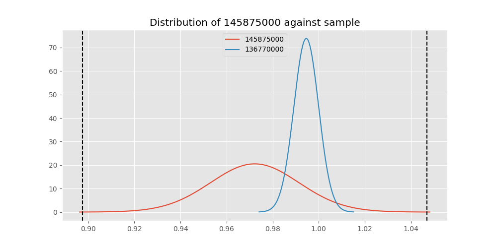 
## Testing Results for 145875000 against 437250000 
145875000 has a success rate of 0.9722222222222222
437250000 has a success rate of 0.9937106918238994
$H_{0}$: There is not a difference between 145875000 and 437250000
$H_{A}$: There is a difference between 145875000 and 437250000
An $/alpha$ of 0.00025 was used in this test.
__independent t-testing__: With a t-statistic of -1.074310763949802 and a p-value of 0.2859744250969234, _we failed to reject the null hypothssis_
__Man-Whitney testing__: With a u-statistic of 11202.0 and a p-value of 0.10336721787194927, _we failed to reject the null hypothssis_
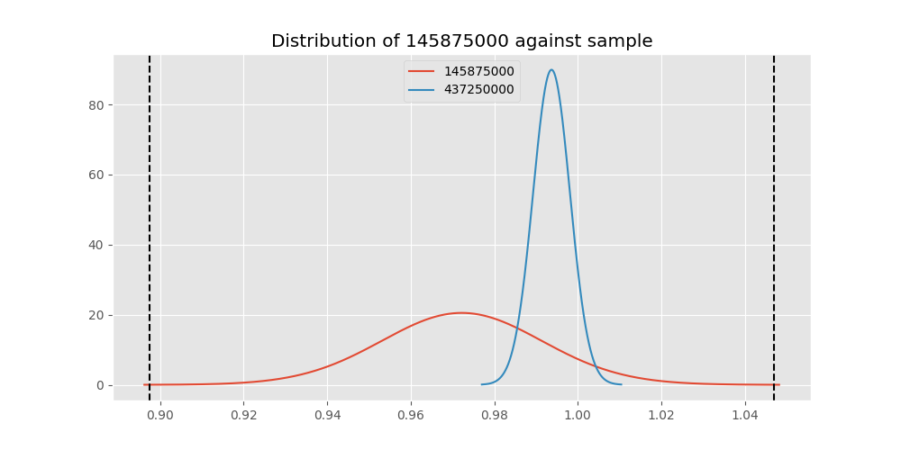 
## Testing Results for 145875000 against 437356000 
145875000 has a success rate of 0.9722222222222222
437356000 has a success rate of 0.9328358208955224
$H_{0}$: There is not a difference between 145875000 and 437356000
$H_{A}$: There is a difference between 145875000 and 437356000
An $/alpha$ of 0.00025 was used in this test.
__independent t-testing__: With a t-statistic of 1.1972555251182146 and a p-value of 0.23259634115821765, _we failed to reject the null hypothssis_
__Man-Whitney testing__: With a u-statistic of 5014.0 and a p-value of 0.23293026516284943, _we failed to reject the null hypothssis_
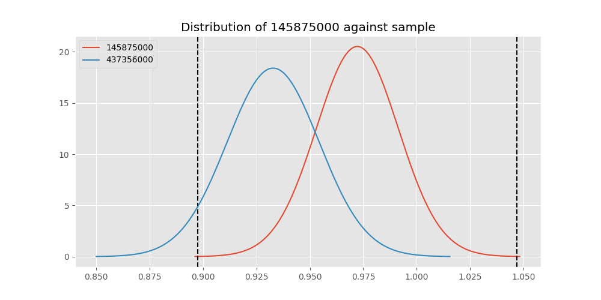 
## Testing Results for 145875000 against 437676000 
145875000 has a success rate of 0.9722222222222222
437676000 has a success rate of 0.9813432835820896
$H_{0}$: There is not a difference between 145875000 and 437676000
$H_{A}$: There is a difference between 145875000 and 437676000
An $/alpha$ of 0.00025 was used in this test.
__independent t-testing__: With a t-statistic of -0.4826316868989201 and a p-value of 0.6296696981205456, _we failed to reject the null hypothssis_
__Man-Whitney testing__: With a u-statistic of 9560.0 and a p-value of 0.6309193095674537, _we failed to reject the null hypothssis_
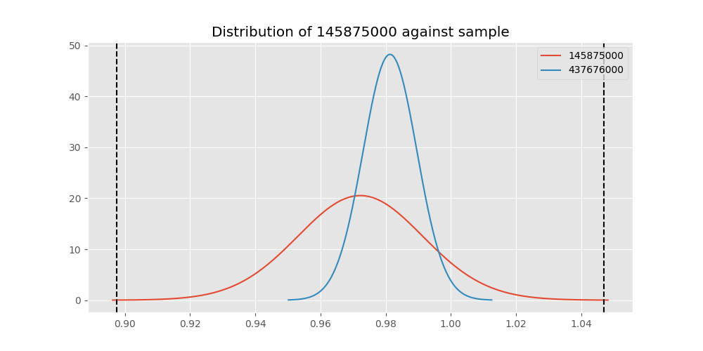 
## Testing Results for 145875000 against 145826800 
145875000 has a success rate of 0.9722222222222222
145826800 has a success rate of 0.966183574879227
$H_{0}$: There is not a difference between 145875000 and 145826800
$H_{A}$: There is a difference between 145875000 and 145826800
An $/alpha$ of 0.00025 was used in this test.
__independent t-testing__: With a t-statistic of 0.24892952329054424 and a p-value of 0.8035997675601622, _we failed to reject the null hypothssis_
__Man-Whitney testing__: With a u-statistic of 7497.0 and a p-value of 0.80523328498113, _we failed to reject the null hypothssis_
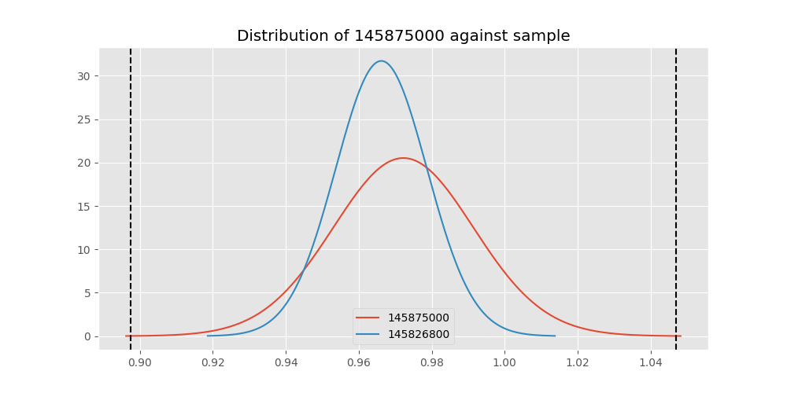 
