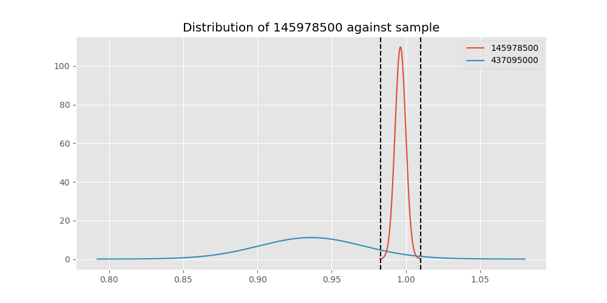
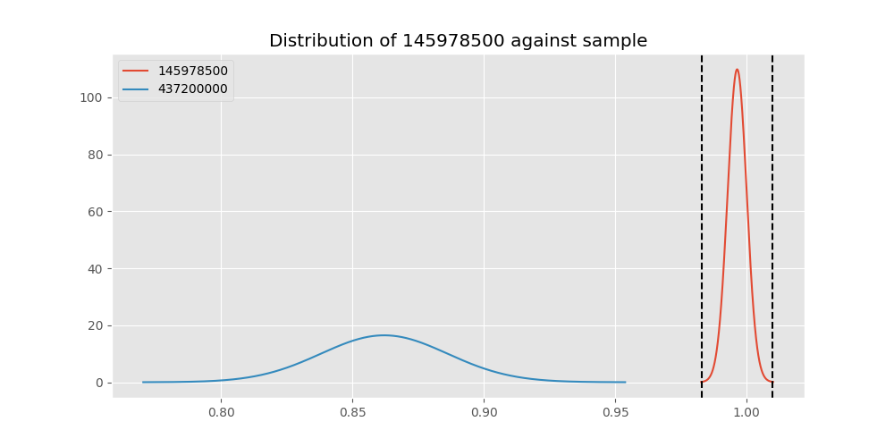
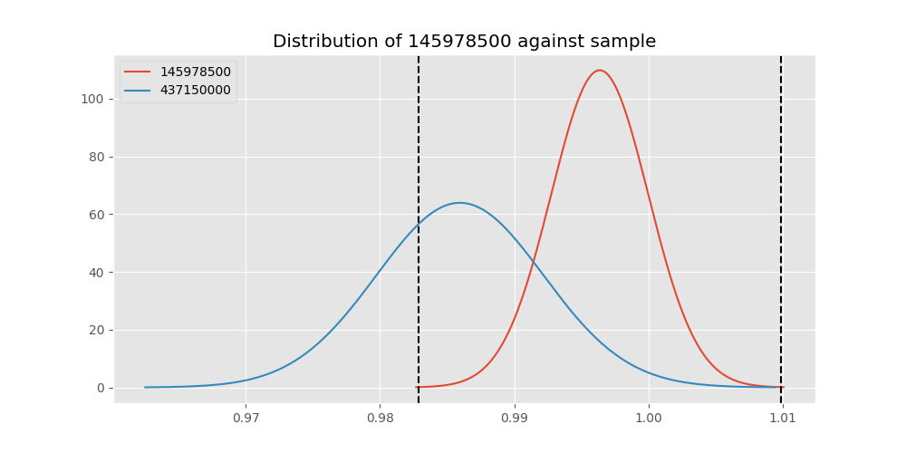
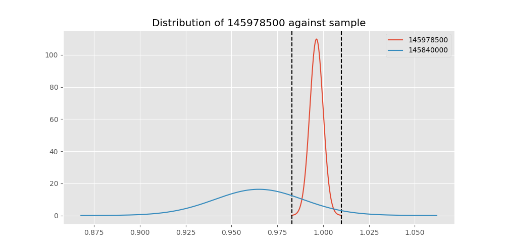

# Testing Results For 145978500 
$H_{0}$: There is not a difference in collection success against 145978500 
$H_{A}$: There is a difference in collection success against 145978500
An $\alpha$ of 0.00025 was used 
Out of 44 tests, there were 19 rejections from 44 independent-t test.
Out of 44 tests, there were 19 rejections from 44 Man Whitney u-tests.
## Testing Results for 145978500 against 436501000 
145978500 has a success rate of 0.9963636363636363
436501000 has a success rate of 0.9854014598540146
$H_{0}$: There is not a difference between 145978500 and 436501000
$H_{A}$: There is a difference between 145978500 and 436501000
An $/alpha$ of 0.00025 was used in this test.
__independent t-testing__: With a t-statistic of 1.232241351882817 and a p-value of 0.21856511971225046, _we failed to reject the null hypothssis_
__Man-Whitney testing__: With a u-statistic of 19044.0 and a p-value of 0.21926563916857833, _we failed to reject the null hypothssis_
 
## Testing Results for 145978500 against 437375000 
145978500 has a success rate of 0.9963636363636363
437375000 has a success rate of 0.9982014388489209
$H_{0}$: There is not a difference between 145978500 and 437375000
$H_{A}$: There is a difference between 145978500 and 437375000
An $/alpha$ of 0.00025 was used in this test.
__independent t-testing__: With a t-statistic of -0.5082240648713673 and a p-value of 0.6114314211505691, _we failed to reject the null hypothssis_
__Man-Whitney testing__: With a u-statistic of 76309.5 and a p-value of 0.6124061296162413, _we failed to reject the null hypothssis_
 
## Testing Results for 145978500 against 436500000 
145978500 has a success rate of 0.9963636363636363
436500000 has a success rate of 0.9056603773584906
$H_{0}$: There is not a difference between 145978500 and 436500000
$H_{A}$: There is a difference between 145978500 and 436500000
An $/alpha$ of 0.00025 was used in this test.
__independent t-testing__: With a t-statistic of 4.955496160743352 and a p-value of 1.0377213445808494e-06, _we **reject** the null hypothssis_
__Man-Whitney testing__: With a u-statistic of 23845.5 and a p-value of 1.4018458281115577e-06, _we **reject** the null hypothssis_
 
## Testing Results for 145978500 against 436990000 
145978500 has a success rate of 0.9963636363636363
436990000 has a success rate of 0.9572649572649573
$H_{0}$: There is not a difference between 145978500 and 436990000
$H_{A}$: There is a difference between 145978500 and 436990000
An $/alpha$ of 0.00025 was used in this test.
__independent t-testing__: With a t-statistic of 3.0448382683872124 and a p-value of 0.0024490785498217705, _we failed to reject the null hypothssis_
__Man-Whitney testing__: With a u-statistic of 33433.0 and a p-value of 0.002534857765643439, _we failed to reject the null hypothssis_
 
## Testing Results for 145978500 against 145875000 
145978500 has a success rate of 0.9963636363636363
145875000 has a success rate of 0.9722222222222222
$H_{0}$: There is not a difference between 145978500 and 145875000
$H_{A}$: There is a difference between 145978500 and 145875000
An $/alpha$ of 0.00025 was used in this test.
__independent t-testing__: With a t-statistic of 1.9751804123203827 and a p-value of 0.04904445518129359, _we failed to reject the null hypothssis_
__Man-Whitney testing__: With a u-statistic of 10139.0 and a p-value of 0.04966524904322981, _we failed to reject the null hypothssis_
 
## Testing Results for 145978500 against 437800000 
145978500 has a success rate of 0.9963636363636363
437800000 has a success rate of 0.9533678756476683
$H_{0}$: There is not a difference between 145978500 and 437800000
$H_{A}$: There is a difference between 145978500 and 437800000
An $/alpha$ of 0.00025 was used in this test.
__independent t-testing__: With a t-statistic of 3.1939881963019316 and a p-value of 0.0014983068707510323, _we failed to reject the null hypothssis_
__Man-Whitney testing__: With a u-statistic of 27678.5 and a p-value of 0.0015690861163121543, _we failed to reject the null hypothssis_
 
## Testing Results for 145978500 against 145810000 
145978500 has a success rate of 0.9963636363636363
145810000 has a success rate of 0.12179487179487179
$H_{0}$: There is not a difference between 145978500 and 145810000
$H_{A}$: There is a difference between 145978500 and 145810000
An $/alpha$ of 0.00025 was used in this test.
__independent t-testing__: With a t-statistic of 42.97775444758201 and a p-value of 1.4984386973335744e-157, _we **reject** the null hypothssis_
__Man-Whitney testing__: With a u-statistic of 40209.5 and a p-value of 7.230781104330319e-78, _we **reject** the null hypothssis_
 
## Testing Results for 145978500 against 437095000 
145978500 has a success rate of 0.9963636363636363
437095000 has a success rate of 0.9361702127659575
$H_{0}$: There is not a difference between 145978500 and 437095000
$H_{A}$: There is a difference between 145978500 and 437095000
An $/alpha$ of 0.00025 was used in this test.
__independent t-testing__: With a t-statistic of 3.4973670896310205 and a p-value of 0.0005363286376293846, _we failed to reject the null hypothssis_
__Man-Whitney testing__: With a u-statistic of 6851.5 and a p-value of 0.0005962306448499548, _we failed to reject the null hypothssis_
 
## Testing Results for 145978500 against 437265000 
145978500 has a success rate of 0.9963636363636363
437265000 has a success rate of 0.9795454545454545
$H_{0}$: There is not a difference between 145978500 and 437265000
$H_{A}$: There is a difference between 145978500 and 437265000
An $/alpha$ of 0.00025 was used in this test.
__independent t-testing__: With a t-statistic of 1.8649992739694201 and a p-value of 0.06259209513014208, _we failed to reject the null hypothssis_
__Man-Whitney testing__: With a u-statistic of 61517.5 and a p-value of 0.06276448832021356, _we failed to reject the null hypothssis_
 
## Testing Results for 145978500 against 437350000 
145978500 has a success rate of 0.9963636363636363
437350000 has a success rate of 0.9488372093023256
$H_{0}$: There is not a difference between 145978500 and 437350000
$H_{A}$: There is a difference between 145978500 and 437350000
An $/alpha$ of 0.00025 was used in this test.
__independent t-testing__: With a t-statistic of 3.4106851531646476 and a p-value of 0.0007017752676749312, _we failed to reject the null hypothssis_
__Man-Whitney testing__: With a u-statistic of 30967.5 and a p-value of 0.0007435462509196483, _we failed to reject the null hypothssis_
 
## Testing Results for 145978500 against 437200000 
145978500 has a success rate of 0.9963636363636363
437200000 has a success rate of 0.8620689655172413
$H_{0}$: There is not a difference between 145978500 and 437200000
$H_{A}$: There is a difference between 145978500 and 437200000
An $/alpha$ of 0.00025 was used in this test.
__independent t-testing__: With a t-statistic of 6.3158138580124605 and a p-value of 6.172776161139855e-10, _we **reject** the null hypothssis_
__Man-Whitney testing__: With a u-statistic of 31661.0 and a p-value of 1.2610193452534125e-09, _we **reject** the null hypothssis_
 
## Testing Results for 145978500 against 435600000 
145978500 has a success rate of 0.9963636363636363
435600000 has a success rate of 0.9819341126461212
$H_{0}$: There is not a difference between 145978500 and 435600000
$H_{A}$: There is a difference between 145978500 and 435600000
An $/alpha$ of 0.00025 was used in this test.
__independent t-testing__: With a t-statistic of 1.7438176945461794 and a p-value of 0.08144400174526428, _we failed to reject the null hypothssis_
__Man-Whitney testing__: With a u-statistic of 131254.5 and a p-value of 0.08152798699064004, _we failed to reject the null hypothssis_
 
## Testing Results for 145978500 against 450000000 
145978500 has a success rate of 0.9963636363636363
450000000 has a success rate of 0.8235294117647058
$H_{0}$: There is not a difference between 145978500 and 450000000
$H_{A}$: There is a difference between 145978500 and 450000000
An $/alpha$ of 0.00025 was used in this test.
__independent t-testing__: With a t-statistic of 7.212178940870284 and a p-value of 3.3029006832882447e-12, _we **reject** the null hypothssis_
__Man-Whitney testing__: With a u-statistic of 13707.5 and a p-value of 1.510084928950984e-11, _we **reject** the null hypothssis_
 
## Testing Results for 145978500 against 437050000 
145978500 has a success rate of 0.9963636363636363
437050000 has a success rate of 0.5346534653465347
$H_{0}$: There is not a difference between 145978500 and 437050000
$H_{A}$: There is a difference between 145978500 and 437050000
An $/alpha$ of 0.00025 was used in this test.
__independent t-testing__: With a t-statistic of 15.014454863457747 and a p-value of 3.2737985989446786e-40, _we **reject** the null hypothssis_
__Man-Whitney testing__: With a u-statistic of 20299.5 and a p-value of 1.6030965458046248e-32, _we **reject** the null hypothssis_
 
## Testing Results for 145978500 against 435300000 
145978500 has a success rate of 0.9963636363636363
435300000 has a success rate of 0.1232876712328767
$H_{0}$: There is not a difference between 145978500 and 435300000
$H_{A}$: There is a difference between 145978500 and 435300000
An $/alpha$ of 0.00025 was used in this test.
__independent t-testing__: With a t-statistic of 42.60898777626568 and a p-value of 2.1623606284284052e-154, _we **reject** the null hypothssis_
__Man-Whitney testing__: With a u-statistic of 37602.0 and a p-value of 3.4511608092960006e-76, _we **reject** the null hypothssis_
 
## Testing Results for 145978500 against 437475000 
145978500 has a success rate of 0.9963636363636363
437475000 has a success rate of 0.5045045045045045
$H_{0}$: There is not a difference between 145978500 and 437475000
$H_{A}$: There is a difference between 145978500 and 437475000
An $/alpha$ of 0.00025 was used in this test.
__independent t-testing__: With a t-statistic of 16.235921425878626 and a p-value of 1.1353589295976425e-51, _we **reject** the null hypothssis_
__Man-Whitney testing__: With a u-statistic of 113847.5 and a p-value of 1.9032131685921105e-45, _we **reject** the null hypothssis_
 
## Testing Results for 145978500 against 435448000 
145978500 has a success rate of 0.9963636363636363
435448000 has a success rate of 0.975
$H_{0}$: There is not a difference between 145978500 and 435448000
$H_{A}$: There is a difference between 145978500 and 435448000
An $/alpha$ of 0.00025 was used in this test.
__independent t-testing__: With a t-statistic of 1.5907613877999276 and a p-value of 0.11267274345048624, _we failed to reject the null hypothssis_
__Man-Whitney testing__: With a u-statistic of 5617.5 and a p-value of 0.1140734714564871, _we failed to reject the null hypothssis_
 
## Testing Results for 145978500 against 437644000 
145978500 has a success rate of 0.9963636363636363
437644000 has a success rate of 0.9743589743589743
$H_{0}$: There is not a difference between 145978500 and 437644000
$H_{A}$: There is a difference between 145978500 and 437644000
An $/alpha$ of 0.00025 was used in this test.
__independent t-testing__: With a t-statistic of 1.9886172789602132 and a p-value of 0.04744191866974814, _we failed to reject the null hypothssis_
__Man-Whitney testing__: With a u-statistic of 16441.5 and a p-value of 0.04788947806666095, _we failed to reject the null hypothssis_
 
## Testing Results for 145978500 against 145825000 
145978500 has a success rate of 0.9963636363636363
145825000 has a success rate of 0.8687448728465955
$H_{0}$: There is not a difference between 145978500 and 145825000
$H_{A}$: There is a difference between 145978500 and 145825000
An $/alpha$ of 0.00025 was used in this test.
__independent t-testing__: With a t-statistic of 6.253736775461503 and a p-value of 4.6410929785005517e-10, _we **reject** the null hypothssis_
__Man-Whitney testing__: With a u-statistic of 378006.0 and a p-value of 5.292295831413553e-10, _we **reject** the null hypothssis_
 
## Testing Results for 145978500 against 437345000 
145978500 has a success rate of 0.9963636363636363
437345000 has a success rate of 0.7603092783505154
$H_{0}$: There is not a difference between 145978500 and 437345000
$H_{A}$: There is a difference between 145978500 and 437345000
An $/alpha$ of 0.00025 was used in this test.
__independent t-testing__: With a t-statistic of 9.092076784417431 and a p-value of 1.1215447827524702e-18, _we **reject** the null hypothssis_
__Man-Whitney testing__: With a u-statistic of 65943.5 and a p-value of 9.653890237297466e-18, _we **reject** the null hypothssis_
 
## Testing Results for 145978500 against 435275000 
145978500 has a success rate of 0.9963636363636363
435275000 has a success rate of 0.9152542372881356
$H_{0}$: There is not a difference between 145978500 and 435275000
$H_{A}$: There is a difference between 145978500 and 435275000
An $/alpha$ of 0.00025 was used in this test.
__independent t-testing__: With a t-statistic of 4.574683183255153 and a p-value of 6.412550629004239e-06, _we **reject** the null hypothssis_
__Man-Whitney testing__: With a u-statistic of 17541.0 and a p-value of 8.159262430278872e-06, _we **reject** the null hypothssis_
 
## Testing Results for 145978500 against 437322500 
145978500 has a success rate of 0.9963636363636363
437322500 has a success rate of 0.9961685823754789
$H_{0}$: There is not a difference between 145978500 and 437322500
$H_{A}$: There is a difference between 145978500 and 437322500
An $/alpha$ of 0.00025 was used in this test.
__independent t-testing__: With a t-statistic of 0.03695106775492171 and a p-value of 0.9705378302701377, _we failed to reject the null hypothssis_
__Man-Whitney testing__: With a u-statistic of 35894.5 and a p-value of 0.9726030189139698, _we failed to reject the null hypothssis_
 
## Testing Results for 145978500 against 437450000 
145978500 has a success rate of 0.9963636363636363
437450000 has a success rate of 0.6947791164658634
$H_{0}$: There is not a difference between 145978500 and 437450000
$H_{A}$: There is a difference between 145978500 and 437450000
An $/alpha$ of 0.00025 was used in this test.
__independent t-testing__: With a t-statistic of 10.738787430308236 and a p-value of 1.9268658589405893e-24, _we **reject** the null hypothssis_
__Man-Whitney testing__: With a u-statistic of 44563.0 and a p-value of 2.2995166904369195e-22, _we **reject** the null hypothssis_
 
## Testing Results for 145978500 against 436703000 
145978500 has a success rate of 0.9963636363636363
436703000 has a success rate of 0.9859154929577465
$H_{0}$: There is not a difference between 145978500 and 436703000
$H_{A}$: There is a difference between 145978500 and 436703000
An $/alpha$ of 0.00025 was used in this test.
__independent t-testing__: With a t-statistic of 1.269051121931576 and a p-value of 0.20503025760370394, _we failed to reject the null hypothssis_
__Man-Whitney testing__: With a u-statistic of 29593.5 and a p-value of 0.2054471680789075, _we failed to reject the null hypothssis_
 
## Testing Results for 145978500 against 400500000 
145978500 has a success rate of 0.9963636363636363
400500000 has a success rate of 0.3508771929824561
$H_{0}$: There is not a difference between 145978500 and 400500000
$H_{A}$: There is a difference between 145978500 and 400500000
An $/alpha$ of 0.00025 was used in this test.
__independent t-testing__: With a t-statistic of 21.54981645589472 and a p-value of 6.409413330573183e-65, _we **reject** the null hypothssis_
__Man-Whitney testing__: With a u-statistic of 12896.5 and a p-value of 5.583986507932684e-44, _we **reject** the null hypothssis_
 
## Testing Results for 145978500 against 437150000 
145978500 has a success rate of 0.9963636363636363
437150000 has a success rate of 0.9859550561797753
$H_{0}$: There is not a difference between 145978500 and 437150000
$H_{A}$: There is a difference between 145978500 and 437150000
An $/alpha$ of 0.00025 was used in this test.
__independent t-testing__: With a t-statistic of 1.3356958214110597 and a p-value of 0.1821318112130448, _we failed to reject the null hypothssis_
__Man-Whitney testing__: With a u-statistic of 49459.5 and a p-value of 0.1823495971897544, _we failed to reject the null hypothssis_
 
## Testing Results for 145978500 against 435635000 
145978500 has a success rate of 0.9963636363636363
435635000 has a success rate of 0.9849624060150376
$H_{0}$: There is not a difference between 145978500 and 435635000
$H_{A}$: There is a difference between 145978500 and 435635000
An $/alpha$ of 0.00025 was used in this test.
__independent t-testing__: With a t-statistic of 1.2629034003185178 and a p-value of 0.20734871742132202, _we failed to reject the null hypothssis_
__Man-Whitney testing__: With a u-statistic of 18496.0 and a p-value of 0.20804656328512194, _we failed to reject the null hypothssis_
 
## Testing Results for 145978500 against 437384000 
145978500 has a success rate of 0.9963636363636363
437384000 has a success rate of 0.968421052631579
$H_{0}$: There is not a difference between 145978500 and 437384000
$H_{A}$: There is a difference between 145978500 and 437384000
An $/alpha$ of 0.00025 was used in this test.
__independent t-testing__: With a t-statistic of 2.442864412443638 and a p-value of 0.014943958510306995, _we failed to reject the null hypothssis_
__Man-Whitney testing__: With a u-statistic of 26855.0 and a p-value of 0.015172821772120534, _we failed to reject the null hypothssis_
 
## Testing Results for 145978500 against 437405000 
145978500 has a success rate of 0.9963636363636363
437405000 has a success rate of 0.9953917050691244
$H_{0}$: There is not a difference between 145978500 and 437405000
$H_{A}$: There is a difference between 145978500 and 437405000
An $/alpha$ of 0.00025 was used in this test.
__independent t-testing__: With a t-statistic of 0.1678917179694293 and a p-value of 0.8667377367500679, _we failed to reject the null hypothssis_
__Man-Whitney testing__: With a u-statistic of 29866.5 and a p-value of 0.8688176064550162, _we failed to reject the null hypothssis_
 
## Testing Results for 145978500 against 435612500 
145978500 has a success rate of 0.9963636363636363
435612500 has a success rate of 0.9770114942528736
$H_{0}$: There is not a difference between 145978500 and 435612500
$H_{A}$: There is a difference between 145978500 and 435612500
An $/alpha$ of 0.00025 was used in this test.
__independent t-testing__: With a t-statistic of 1.7378509179277661 and a p-value of 0.08309220050771408, _we failed to reject the null hypothssis_
__Man-Whitney testing__: With a u-statistic of 12194.0 and a p-value of 0.08376153515697272, _we failed to reject the null hypothssis_
 
## Testing Results for 145978500 against 435975000 
145978500 has a success rate of 0.9963636363636363
435975000 has a success rate of 0.92
$H_{0}$: There is not a difference between 145978500 and 435975000
$H_{A}$: There is a difference between 145978500 and 435975000
An $/alpha$ of 0.00025 was used in this test.
__independent t-testing__: With a t-statistic of 4.128035213252989 and a p-value of 4.662070765228086e-05, _we **reject** the null hypothssis_
__Man-Whitney testing__: With a u-statistic of 7400.0 and a p-value of 5.681671633627052e-05, _we **reject** the null hypothssis_
 
## Testing Results for 145978500 against 437425000 
145978500 has a success rate of 0.9963636363636363
437425000 has a success rate of 0.6987654320987654
$H_{0}$: There is not a difference between 145978500 and 437425000
$H_{A}$: There is a difference between 145978500 and 437425000
An $/alpha$ of 0.00025 was used in this test.
__independent t-testing__: With a t-statistic of 10.678634276821214 and a p-value of 1.0379006196286769e-24, _we **reject** the null hypothssis_
__Man-Whitney testing__: With a u-statistic of 72260.0 and a p-value of 4.7388437024409304e-23, _we **reject** the null hypothssis_
 
## Testing Results for 145978500 against 437275000 
145978500 has a success rate of 0.9963636363636363
437275000 has a success rate of 0.3643724696356275
$H_{0}$: There is not a difference between 145978500 and 437275000
$H_{A}$: There is a difference between 145978500 and 437275000
An $/alpha$ of 0.00025 was used in this test.
__independent t-testing__: With a t-statistic of 21.548654538746874 and a p-value of 4.4521848902973655e-74, _we **reject** the null hypothssis_
__Man-Whitney testing__: With a u-statistic of 55426.5 and a p-value of 2.182190488544957e-55, _we **reject** the null hypothssis_
 
## Testing Results for 145978500 against 145840000 
145978500 has a success rate of 0.9963636363636363
145840000 has a success rate of 0.9649122807017544
$H_{0}$: There is not a difference between 145978500 and 145840000
$H_{A}$: There is a difference between 145978500 and 145840000
An $/alpha$ of 0.00025 was used in this test.
__independent t-testing__: With a t-statistic of 2.2949854973053427 and a p-value of 0.02236108641101015, _we failed to reject the null hypothssis_
__Man-Whitney testing__: With a u-statistic of 8084.0 and a p-value of 0.022863425585725888, _we failed to reject the null hypothssis_
 
## Testing Results for 145978500 against 435525000 
145978500 has a success rate of 0.9963636363636363
435525000 has a success rate of 0.6923076923076923
$H_{0}$: There is not a difference between 145978500 and 435525000
$H_{A}$: There is a difference between 145978500 and 435525000
An $/alpha$ of 0.00025 was used in this test.
__independent t-testing__: With a t-statistic of 10.724610042657872 and a p-value of 7.403567756277991e-24, _we **reject** the null hypothssis_
__Man-Whitney testing__: With a u-statistic of 25641.0 and a p-value of 2.0400752477167463e-21, _we **reject** the null hypothssis_
 
## Testing Results for 145978500 against 436250000 
145978500 has a success rate of 0.9963636363636363
436250000 has a success rate of 0.17857142857142858
$H_{0}$: There is not a difference between 145978500 and 436250000
$H_{A}$: There is a difference between 145978500 and 436250000
An $/alpha$ of 0.00025 was used in this test.
__independent t-testing__: With a t-statistic of 33.33820065042113 and a p-value of 1.6047807807151134e-107, _we **reject** the null hypothssis_
__Man-Whitney testing__: With a u-statistic of 13997.0 and a p-value of 2.597583727676454e-57, _we **reject** the null hypothssis_
 
## Testing Results for 145978500 against 435950000 
145978500 has a success rate of 0.9963636363636363
435950000 has a success rate of 0.9850187265917603
$H_{0}$: There is not a difference between 145978500 and 435950000
$H_{A}$: There is a difference between 145978500 and 435950000
An $/alpha$ of 0.00025 was used in this test.
__independent t-testing__: With a t-statistic of 1.457401863455712 and a p-value of 0.1453944890638365, _we failed to reject the null hypothssis_
__Man-Whitney testing__: With a u-statistic of 74258.0 and a p-value of 0.14552673219537016, _we failed to reject the null hypothssis_
 
## Testing Results for 145978500 against 435800000 
145978500 has a success rate of 0.9963636363636363
435800000 has a success rate of 0.5390070921985816
$H_{0}$: There is not a difference between 145978500 and 435800000
$H_{A}$: There is a difference between 145978500 and 435800000
An $/alpha$ of 0.00025 was used in this test.
__independent t-testing__: With a t-statistic of 14.967221250434587 and a p-value of 8.654435487728435e-41, _we **reject** the null hypothssis_
__Man-Whitney testing__: With a u-statistic of 28254.5 and a p-value of 1.5125826055073941e-33, _we **reject** the null hypothssis_
 
## Testing Results for 145978500 against 437485000 
145978500 has a success rate of 0.9963636363636363
437485000 has a success rate of 0.9375
$H_{0}$: There is not a difference between 145978500 and 437485000
$H_{A}$: There is a difference between 145978500 and 437485000
An $/alpha$ of 0.00025 was used in this test.
__independent t-testing__: With a t-statistic of 3.2480675865840665 and a p-value of 0.0012914945466866719, _we failed to reject the null hypothssis_
__Man-Whitney testing__: With a u-statistic of 4659.0 and a p-value of 0.0014111303329273279, _we failed to reject the null hypothssis_
 
## Testing Results for 145978500 against 136770000 
145978500 has a success rate of 0.9963636363636363
136770000 has a success rate of 0.9945945945945946
$H_{0}$: There is not a difference between 145978500 and 136770000
$H_{A}$: There is a difference between 145978500 and 136770000
An $/alpha$ of 0.00025 was used in this test.
__independent t-testing__: With a t-statistic of 0.2821714351493531 and a p-value of 0.7779395228929177, _we failed to reject the null hypothssis_
__Man-Whitney testing__: With a u-statistic of 25482.5 and a p-value of 0.7800020385887213, _we failed to reject the null hypothssis_
 
## Testing Results for 145978500 against 437250000 
145978500 has a success rate of 0.9963636363636363
437250000 has a success rate of 0.9937106918238994
$H_{0}$: There is not a difference between 145978500 and 437250000
$H_{A}$: There is a difference between 145978500 and 437250000
An $/alpha$ of 0.00025 was used in this test.
__independent t-testing__: With a t-statistic of 0.4534095957679015 and a p-value of 0.6504202569856419, _we failed to reject the null hypothssis_
__Man-Whitney testing__: With a u-statistic of 43841.0 and a p-value of 0.6514429991020876, _we failed to reject the null hypothssis_
 
## Testing Results for 145978500 against 437356000 
145978500 has a success rate of 0.9963636363636363
437356000 has a success rate of 0.9328358208955224
$H_{0}$: There is not a difference between 145978500 and 437356000
$H_{A}$: There is a difference between 145978500 and 437356000
An $/alpha$ of 0.00025 was used in this test.
__independent t-testing__: With a t-statistic of 3.9695548881947564 and a p-value of 8.511835254739394e-05, _we **reject** the null hypothssis_
__Man-Whitney testing__: With a u-statistic of 19595.5 and a p-value of 9.699433314975554e-05, _we **reject** the null hypothssis_
 
## Testing Results for 145978500 against 437676000 
145978500 has a success rate of 0.9963636363636363
437676000 has a success rate of 0.9813432835820896
$H_{0}$: There is not a difference between 145978500 and 437676000
$H_{A}$: There is a difference between 145978500 and 437676000
An $/alpha$ of 0.00025 was used in this test.
__independent t-testing__: With a t-statistic of 1.6752254348319437 and a p-value of 0.09446786324247876, _we failed to reject the null hypothssis_
__Man-Whitney testing__: With a u-statistic of 37403.5 and a p-value of 0.09473550368533654, _we failed to reject the null hypothssis_
 
## Testing Results for 145978500 against 145826800 
145978500 has a success rate of 0.9963636363636363
145826800 has a success rate of 0.966183574879227
$H_{0}$: There is not a difference between 145978500 and 145826800
$H_{A}$: There is a difference between 145978500 and 145826800
An $/alpha$ of 0.00025 was used in this test.
__independent t-testing__: With a t-statistic of 2.5795723342426085 and a p-value of 0.010188604047944088, _we failed to reject the null hypothssis_
__Man-Whitney testing__: With a u-statistic of 29321.5 and a p-value of 0.010375698011453471, _we failed to reject the null hypothssis_
 
