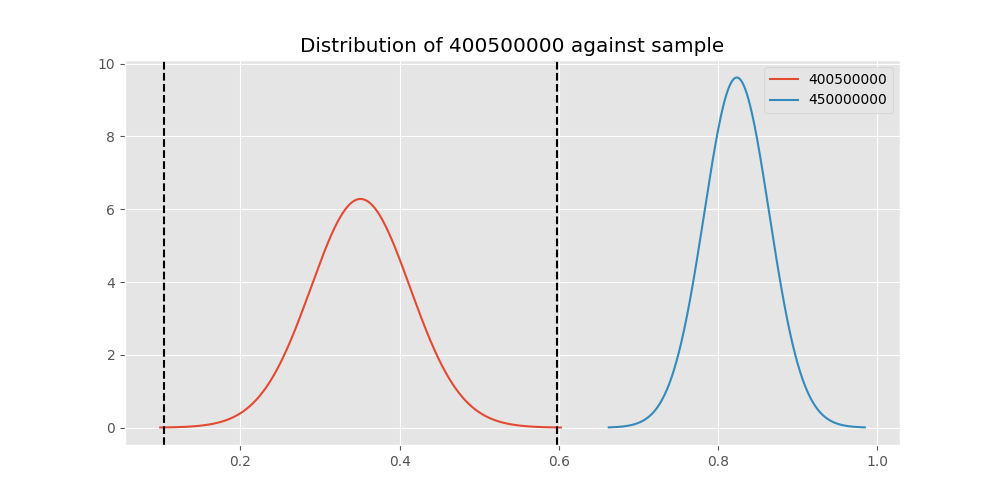

# Testing Results For 400500000 
$H_{0}$: There is not a difference in collection success against 400500000 
$H_{A}$: There is a difference in collection success against 400500000
An $\alpha$ of 0.00025 was used 
Out of 44 tests, there were 39 rejections from 44 independent-t test.
Out of 44 tests, there were 39 rejections from 44 Man Whitney u-tests.
## Testing Results for 400500000 against 436501000 
400500000 has a success rate of 0.3508771929824561
436501000 has a success rate of 0.9854014598540146
$H_{0}$: There is not a difference between 400500000 and 436501000
$H_{A}$: There is a difference between 400500000 and 436501000
An $/alpha$ of 0.00025 was used in this test.
__independent t-testing__: With a t-statistic of -9.822591656036385 and a p-value of 5.065551371043536e-14, _we **reject** the null hypothssis_
__Man-Whitney testing__: With a u-statistic of 1427.0 and a p-value of 1.2830594108039925e-23, _we **reject** the null hypothssis_
 
## Testing Results for 400500000 against 437375000 
400500000 has a success rate of 0.3508771929824561
437375000 has a success rate of 0.9982014388489209
$H_{0}$: There is not a difference between 400500000 and 437375000
$H_{A}$: There is a difference between 400500000 and 437375000
An $/alpha$ of 0.00025 was used in this test.
__independent t-testing__: With a t-statistic of -10.146172569748051 and a p-value of 2.6469244870458178e-14, _we **reject** the null hypothssis_
__Man-Whitney testing__: With a u-statistic of 5588.5 and a p-value of 7.142878696480838e-83, _we **reject** the null hypothssis_
 
## Testing Results for 400500000 against 436500000 
400500000 has a success rate of 0.3508771929824561
436500000 has a success rate of 0.9056603773584906
$H_{0}$: There is not a difference between 400500000 and 436500000
$H_{A}$: There is a difference between 400500000 and 436500000
An $/alpha$ of 0.00025 was used in this test.
__independent t-testing__: With a t-statistic of -10.199175739117333 and a p-value of 3.6815516616669883e-20, _we **reject** the null hypothssis_
__Man-Whitney testing__: With a u-statistic of 2017.5 and a p-value of 5.1014100391563144e-17, _we **reject** the null hypothssis_
 
## Testing Results for 400500000 against 436990000 
400500000 has a success rate of 0.3508771929824561
436990000 has a success rate of 0.9572649572649573
$H_{0}$: There is not a difference between 400500000 and 436990000
$H_{A}$: There is a difference between 400500000 and 436990000
An $/alpha$ of 0.00025 was used in this test.
__independent t-testing__: With a t-statistic of -9.309497038738044 and a p-value of 2.592926567437052e-13, _we **reject** the null hypothssis_
__Man-Whitney testing__: With a u-statistic of 2625.0 and a p-value of 8.457393863562127e-29, _we **reject** the null hypothssis_
 
## Testing Results for 400500000 against 145875000 
400500000 has a success rate of 0.3508771929824561
145875000 has a success rate of 0.9722222222222222
$H_{0}$: There is not a difference between 400500000 and 145875000
$H_{A}$: There is a difference between 400500000 and 145875000
An $/alpha$ of 0.00025 was used in this test.
__independent t-testing__: With a t-statistic of -9.316916572326278 and a p-value of 1.1128164138679449e-13, _we **reject** the null hypothssis_
__Man-Whitney testing__: With a u-statistic of 777.0 and a p-value of 2.999995064250698e-14, _we **reject** the null hypothssis_
 
## Testing Results for 400500000 against 437800000 
400500000 has a success rate of 0.3508771929824561
437800000 has a success rate of 0.9533678756476683
$H_{0}$: There is not a difference between 400500000 and 437800000
$H_{A}$: There is a difference between 400500000 and 437800000
An $/alpha$ of 0.00025 was used in this test.
__independent t-testing__: With a t-statistic of -9.189248176453034 and a p-value of 3.278671072123627e-13, _we **reject** the null hypothssis_
__Man-Whitney testing__: With a u-statistic of 2186.5 and a p-value of 7.644140231454996e-25, _we **reject** the null hypothssis_
 
## Testing Results for 400500000 against 145810000 
400500000 has a success rate of 0.3508771929824561
145810000 has a success rate of 0.12179487179487179
$H_{0}$: There is not a difference between 400500000 and 145810000
$H_{A}$: There is a difference between 400500000 and 145810000
An $/alpha$ of 0.00025 was used in this test.
__independent t-testing__: With a t-statistic of 3.9472624648988943 and a p-value of 0.00010767756595483362, _we **reject** the null hypothssis_
__Man-Whitney testing__: With a u-statistic of 5464.5 and a p-value of 0.00013548445884440364, _we **reject** the null hypothssis_
 
## Testing Results for 400500000 against 437095000 
400500000 has a success rate of 0.3508771929824561
437095000 has a success rate of 0.9361702127659575
$H_{0}$: There is not a difference between 400500000 and 437095000
$H_{A}$: There is a difference between 400500000 and 437095000
An $/alpha$ of 0.00025 was used in this test.
__independent t-testing__: With a t-statistic of -7.549857556363423 and a p-value of 1.9030980353881477e-11, _we **reject** the null hypothssis_
__Man-Whitney testing__: With a u-statistic of 555.5 and a p-value of 1.2578340702279039e-09, _we **reject** the null hypothssis_
 
## Testing Results for 400500000 against 437265000 
400500000 has a success rate of 0.3508771929824561
437265000 has a success rate of 0.9795454545454545
$H_{0}$: There is not a difference between 400500000 and 437265000
$H_{A}$: There is a difference between 400500000 and 437265000
An $/alpha$ of 0.00025 was used in this test.
__independent t-testing__: With a t-statistic of -9.802827706588106 and a p-value of 7.393168584404896e-14, _we **reject** the null hypothssis_
__Man-Whitney testing__: With a u-statistic of 4656.5 and a p-value of 1.815653903756627e-53, _we **reject** the null hypothssis_
 
## Testing Results for 400500000 against 437350000 
400500000 has a success rate of 0.3508771929824561
437350000 has a success rate of 0.9488372093023256
$H_{0}$: There is not a difference between 400500000 and 437350000
$H_{A}$: There is a difference between 400500000 and 437350000
An $/alpha$ of 0.00025 was used in this test.
__independent t-testing__: With a t-statistic of -9.12513933098285 and a p-value of 4.3028738864946746e-13, _we **reject** the null hypothssis_
__Man-Whitney testing__: With a u-statistic of 2463.5 and a p-value of 7.957291735704314e-26, _we **reject** the null hypothssis_
 
## Testing Results for 400500000 against 437200000 
400500000 has a success rate of 0.3508771929824561
437200000 has a success rate of 0.8620689655172413
$H_{0}$: There is not a difference between 400500000 and 437200000
$H_{A}$: There is a difference between 400500000 and 437200000
An $/alpha$ of 0.00025 was used in this test.
__independent t-testing__: With a t-statistic of -8.990549416668555 and a p-value of 5.4078153997723033e-17, _we **reject** the null hypothssis_
__Man-Whitney testing__: With a u-statistic of 2828.0 and a p-value of 3.8696158753650256e-15, _we **reject** the null hypothssis_
 
## Testing Results for 400500000 against 435600000 
400500000 has a success rate of 0.3508771929824561
435600000 has a success rate of 0.9819341126461212
$H_{0}$: There is not a difference between 400500000 and 435600000
$H_{A}$: There is a difference between 400500000 and 435600000
An $/alpha$ of 0.00025 was used in this test.
__independent t-testing__: With a t-statistic of -9.872253654390043 and a p-value of 6.581776893985987e-14, _we **reject** the null hypothssis_
__Man-Whitney testing__: With a u-statistic of 9894.5 and a p-value of 7.5775231396050876e-93, _we **reject** the null hypothssis_
 
## Testing Results for 400500000 against 450000000 
400500000 has a success rate of 0.3508771929824561
450000000 has a success rate of 0.8235294117647058
$H_{0}$: There is not a difference between 400500000 and 450000000
$H_{A}$: There is a difference between 400500000 and 450000000
An $/alpha$ of 0.00025 was used in this test.
__independent t-testing__: With a t-statistic of -6.489998218546677 and a p-value of 1.3813768928644099e-09, _we **reject** the null hypothssis_
__Man-Whitney testing__: With a u-statistic of 1277.5 and a p-value of 1.1429758976373617e-08, _we **reject** the null hypothssis_
 
## Testing Results for 400500000 against 145978500 
400500000 has a success rate of 0.3508771929824561
145978500 has a success rate of 0.9963636363636363
$H_{0}$: There is not a difference between 400500000 and 145978500
$H_{A}$: There is a difference between 400500000 and 145978500
An $/alpha$ of 0.00025 was used in this test.
__independent t-testing__: With a t-statistic of -10.104976221537743 and a p-value of 2.906437503646624e-14, _we **reject** the null hypothssis_
__Man-Whitney testing__: With a u-statistic of 2778.5 and a p-value of 5.583986507932684e-44, _we **reject** the null hypothssis_
 
## Testing Results for 400500000 against 437050000 
400500000 has a success rate of 0.3508771929824561
437050000 has a success rate of 0.5346534653465347
$H_{0}$: There is not a difference between 400500000 and 437050000
$H_{A}$: There is a difference between 400500000 and 437050000
An $/alpha$ of 0.00025 was used in this test.
__independent t-testing__: With a t-statistic of -2.2443737131907184 and a p-value of 0.026215099291396766, _we failed to reject the null hypothssis_
__Man-Whitney testing__: With a u-statistic of 2349.5 and a p-value of 0.026831030650733407, _we failed to reject the null hypothssis_
 
## Testing Results for 400500000 against 435300000 
400500000 has a success rate of 0.3508771929824561
435300000 has a success rate of 0.1232876712328767
$H_{0}$: There is not a difference between 400500000 and 435300000
$H_{A}$: There is a difference between 400500000 and 435300000
An $/alpha$ of 0.00025 was used in this test.
__independent t-testing__: With a t-statistic of 3.852094554216759 and a p-value of 0.0001574378816849751, _we **reject** the null hypothssis_
__Man-Whitney testing__: With a u-statistic of 5108.0 and a p-value of 0.00019563158317739406, _we **reject** the null hypothssis_
 
## Testing Results for 400500000 against 437475000 
400500000 has a success rate of 0.3508771929824561
437475000 has a success rate of 0.5045045045045045
$H_{0}$: There is not a difference between 400500000 and 437475000
$H_{A}$: There is a difference between 400500000 and 437475000
An $/alpha$ of 0.00025 was used in this test.
__independent t-testing__: With a t-statistic of -2.214717968190752 and a p-value of 0.02714821499328681, _we failed to reject the null hypothssis_
__Man-Whitney testing__: With a u-statistic of 13387.5 and a p-value of 0.027298679779584258, _we failed to reject the null hypothssis_
 
## Testing Results for 400500000 against 435448000 
400500000 has a success rate of 0.3508771929824561
435448000 has a success rate of 0.975
$H_{0}$: There is not a difference between 400500000 and 435448000
$H_{A}$: There is a difference between 400500000 and 435448000
An $/alpha$ of 0.00025 was used in this test.
__independent t-testing__: With a t-statistic of -9.111344469671588 and a p-value of 1.2828245356467662e-13, _we **reject** the null hypothssis_
__Man-Whitney testing__: With a u-statistic of 428.5 and a p-value of 7.164993429543672e-10, _we **reject** the null hypothssis_
 
## Testing Results for 400500000 against 437644000 
400500000 has a success rate of 0.3508771929824561
437644000 has a success rate of 0.9743589743589743
$H_{0}$: There is not a difference between 400500000 and 437644000
$H_{A}$: There is a difference between 400500000 and 437644000
An $/alpha$ of 0.00025 was used in this test.
__independent t-testing__: With a t-statistic of -9.527347061740922 and a p-value of 9.35784982738101e-14, _we **reject** the null hypothssis_
__Man-Whitney testing__: With a u-statistic of 1255.5 and a p-value of 5.955309241059873e-20, _we **reject** the null hypothssis_
 
## Testing Results for 400500000 against 145825000 
400500000 has a success rate of 0.3508771929824561
145825000 has a success rate of 0.8687448728465955
$H_{0}$: There is not a difference between 400500000 and 145825000
$H_{A}$: There is a difference between 400500000 and 145825000
An $/alpha$ of 0.00025 was used in this test.
__independent t-testing__: With a t-statistic of -11.312713068328716 and a p-value of 5.69775384064938e-29, _we **reject** the null hypothssis_
__Man-Whitney testing__: With a u-statistic of 33500.0 and a p-value of 2.5868712692996277e-28, _we **reject** the null hypothssis_
 
## Testing Results for 400500000 against 437345000 
400500000 has a success rate of 0.3508771929824561
437345000 has a success rate of 0.7603092783505154
$H_{0}$: There is not a difference between 400500000 and 437345000
$H_{A}$: There is a difference between 400500000 and 437345000
An $/alpha$ of 0.00025 was used in this test.
__independent t-testing__: With a t-statistic of -6.640749141027078 and a p-value of 9.159620916862264e-11, _we **reject** the null hypothssis_
__Man-Whitney testing__: With a u-statistic of 6530.5 and a p-value of 2.30583539009799e-10, _we **reject** the null hypothssis_
 
## Testing Results for 400500000 against 435275000 
400500000 has a success rate of 0.3508771929824561
435275000 has a success rate of 0.9152542372881356
$H_{0}$: There is not a difference between 400500000 and 435275000
$H_{A}$: There is a difference between 400500000 and 435275000
An $/alpha$ of 0.00025 was used in this test.
__independent t-testing__: With a t-statistic of -9.78164846316526 and a p-value of 2.911776811237011e-18, _we **reject** the null hypothssis_
__Man-Whitney testing__: With a u-statistic of 1465.0 and a p-value of 3.5570476442969854e-15, _we **reject** the null hypothssis_
 
## Testing Results for 400500000 against 437322500 
400500000 has a success rate of 0.3508771929824561
437322500 has a success rate of 0.9961685823754789
$H_{0}$: There is not a difference between 400500000 and 437322500
$H_{A}$: There is a difference between 400500000 and 437322500
An $/alpha$ of 0.00025 was used in this test.
__independent t-testing__: With a t-statistic of -10.100120080897742 and a p-value of 2.934388433103673e-14, _we **reject** the null hypothssis_
__Man-Whitney testing__: With a u-statistic of 2638.5 and a p-value of 4.984071850942692e-42, _we **reject** the null hypothssis_
 
## Testing Results for 400500000 against 437450000 
400500000 has a success rate of 0.3508771929824561
437450000 has a success rate of 0.6947791164658634
$H_{0}$: There is not a difference between 400500000 and 437450000
$H_{A}$: There is a difference between 400500000 and 437450000
An $/alpha$ of 0.00025 was used in this test.
__independent t-testing__: With a t-statistic of -5.034798997888973 and a p-value of 8.210230434874575e-07, _we **reject** the null hypothssis_
__Man-Whitney testing__: With a u-statistic of 4656.0 and a p-value of 1.2717497948115838e-06, _we **reject** the null hypothssis_
 
## Testing Results for 400500000 against 436703000 
400500000 has a success rate of 0.3508771929824561
436703000 has a success rate of 0.9859154929577465
$H_{0}$: There is not a difference between 400500000 and 436703000
$H_{A}$: There is a difference between 400500000 and 436703000
An $/alpha$ of 0.00025 was used in this test.
__independent t-testing__: With a t-statistic of -9.87833402296231 and a p-value of 5.046999862975329e-14, _we **reject** the null hypothssis_
__Man-Whitney testing__: With a u-statistic of 2215.5 and a p-value of 5.528136046843954e-33, _we **reject** the null hypothssis_
 
## Testing Results for 400500000 against 437150000 
400500000 has a success rate of 0.3508771929824561
437150000 has a success rate of 0.9859550561797753
$H_{0}$: There is not a difference between 400500000 and 437150000
$H_{A}$: There is a difference between 400500000 and 437150000
An $/alpha$ of 0.00025 was used in this test.
__independent t-testing__: With a t-statistic of -9.910767596135248 and a p-value of 5.140230746968771e-14, _we **reject** the null hypothssis_
__Man-Whitney testing__: With a u-statistic of 3702.5 and a p-value of 5.616584580950748e-49, _we **reject** the null hypothssis_
 
## Testing Results for 400500000 against 435635000 
400500000 has a success rate of 0.3508771929824561
435635000 has a success rate of 0.9849624060150376
$H_{0}$: There is not a difference between 400500000 and 435635000
$H_{A}$: There is a difference between 400500000 and 435635000
An $/alpha$ of 0.00025 was used in this test.
__independent t-testing__: With a t-statistic of -9.808237877605603 and a p-value of 5.178024007170693e-14, _we **reject** the null hypothssis_
__Man-Whitney testing__: With a u-statistic of 1387.0 and a p-value of 4.669482986158438e-23, _we **reject** the null hypothssis_
 
## Testing Results for 400500000 against 437384000 
400500000 has a success rate of 0.3508771929824561
437384000 has a success rate of 0.968421052631579
$H_{0}$: There is not a difference between 400500000 and 437384000
$H_{A}$: There is a difference between 400500000 and 437384000
An $/alpha$ of 0.00025 was used in this test.
__independent t-testing__: With a t-statistic of -9.496187850776456 and a p-value of 1.3402843290747947e-13, _we **reject** the null hypothssis_
__Man-Whitney testing__: With a u-statistic of 2071.0 and a p-value of 5.284144864958601e-27, _we **reject** the null hypothssis_
 
## Testing Results for 400500000 against 437405000 
400500000 has a success rate of 0.3508771929824561
437405000 has a success rate of 0.9953917050691244
$H_{0}$: There is not a difference between 400500000 and 437405000
$H_{A}$: There is a difference between 400500000 and 437405000
An $/alpha$ of 0.00025 was used in this test.
__independent t-testing__: With a t-statistic of -10.079868073969783 and a p-value of 3.0465852472692394e-14, _we **reject** the null hypothssis_
__Man-Whitney testing__: With a u-statistic of 2198.5 and a p-value of 7.021823575976178e-36, _we **reject** the null hypothssis_
 
## Testing Results for 400500000 against 435612500 
400500000 has a success rate of 0.3508771929824561
435612500 has a success rate of 0.9770114942528736
$H_{0}$: There is not a difference between 400500000 and 435612500
$H_{A}$: There is a difference between 400500000 and 435612500
An $/alpha$ of 0.00025 was used in this test.
__independent t-testing__: With a t-statistic of -9.51713819920332 and a p-value of 8.011388655242025e-14, _we **reject** the null hypothssis_
__Man-Whitney testing__: With a u-statistic of 927.0 and a p-value of 1.7667602053423378e-16, _we **reject** the null hypothssis_
 
## Testing Results for 400500000 against 435975000 
400500000 has a success rate of 0.3508771929824561
435975000 has a success rate of 0.92
$H_{0}$: There is not a difference between 400500000 and 435975000
$H_{A}$: There is a difference between 400500000 and 435975000
An $/alpha$ of 0.00025 was used in this test.
__independent t-testing__: With a t-statistic of -7.373296033751809 and a p-value of 4.0092673392078194e-11, _we **reject** the null hypothssis_
__Man-Whitney testing__: With a u-statistic of 614.0 and a p-value of 1.8591726182668252e-09, _we **reject** the null hypothssis_
 
## Testing Results for 400500000 against 437425000 
400500000 has a success rate of 0.3508771929824561
437425000 has a success rate of 0.6987654320987654
$H_{0}$: There is not a difference between 400500000 and 437425000
$H_{A}$: There is a difference between 400500000 and 437425000
An $/alpha$ of 0.00025 was used in this test.
__independent t-testing__: With a t-statistic of -5.321529543510512 and a p-value of 1.6108475490194164e-07, _we **reject** the null hypothssis_
__Man-Whitney testing__: With a u-statistic of 7527.0 and a p-value of 2.3423347624803103e-07, _we **reject** the null hypothssis_
 
## Testing Results for 400500000 against 437275000 
400500000 has a success rate of 0.3508771929824561
437275000 has a success rate of 0.3643724696356275
$H_{0}$: There is not a difference between 400500000 and 437275000
$H_{A}$: There is a difference between 400500000 and 437275000
An $/alpha$ of 0.00025 was used in this test.
__independent t-testing__: With a t-statistic of -0.19050222535654313 and a p-value of 0.8490435934133276, _we failed to reject the null hypothssis_
__Man-Whitney testing__: With a u-statistic of 6944.5 and a p-value of 0.8494645550578228, _we failed to reject the null hypothssis_
 
## Testing Results for 400500000 against 145840000 
400500000 has a success rate of 0.3508771929824561
145840000 has a success rate of 0.9649122807017544
$H_{0}$: There is not a difference between 400500000 and 145840000
$H_{A}$: There is a difference between 400500000 and 145840000
An $/alpha$ of 0.00025 was used in this test.
__independent t-testing__: With a t-statistic of -8.983645270876472 and a p-value of 2.1671628201871532e-13, _we **reject** the null hypothssis_
__Man-Whitney testing__: With a u-statistic of 627.0 and a p-value of 6.162000630537062e-12, _we **reject** the null hypothssis_
 
## Testing Results for 400500000 against 435525000 
400500000 has a success rate of 0.3508771929824561
435525000 has a success rate of 0.6923076923076923
$H_{0}$: There is not a difference between 400500000 and 435525000
$H_{A}$: There is a difference between 400500000 and 435525000
An $/alpha$ of 0.00025 was used in this test.
__independent t-testing__: With a t-statistic of -4.653293881629137 and a p-value of 5.970643028889809e-06, _we **reject** the null hypothssis_
__Man-Whitney testing__: With a u-statistic of 2684.0 and a p-value of 9.531510017577813e-06, _we **reject** the null hypothssis_
 
## Testing Results for 400500000 against 436250000 
400500000 has a success rate of 0.3508771929824561
436250000 has a success rate of 0.17857142857142858
$H_{0}$: There is not a difference between 400500000 and 436250000
$H_{A}$: There is a difference between 400500000 and 436250000
An $/alpha$ of 0.00025 was used in this test.
__independent t-testing__: With a t-statistic of 2.0956510071207926 and a p-value of 0.03838672633039036, _we failed to reject the null hypothssis_
__Man-Whitney testing__: With a u-statistic of 1871.0 and a p-value of 0.039315605437253834, _we failed to reject the null hypothssis_
 
## Testing Results for 400500000 against 435950000 
400500000 has a success rate of 0.3508771929824561
435950000 has a success rate of 0.9850187265917603
$H_{0}$: There is not a difference between 400500000 and 435950000
$H_{A}$: There is a difference between 400500000 and 435950000
An $/alpha$ of 0.00025 was used in this test.
__independent t-testing__: With a t-statistic of -9.909826242082195 and a p-value of 5.475316647819103e-14, _we **reject** the null hypothssis_
__Man-Whitney testing__: With a u-statistic of 5568.0 and a p-value of 7.049536814165346e-66, _we **reject** the null hypothssis_
 
## Testing Results for 400500000 against 435800000 
400500000 has a success rate of 0.3508771929824561
435800000 has a success rate of 0.5390070921985816
$H_{0}$: There is not a difference between 400500000 and 435800000
$H_{A}$: There is a difference between 400500000 and 435800000
An $/alpha$ of 0.00025 was used in this test.
__independent t-testing__: With a t-statistic of -2.4215787039176115 and a p-value of 0.01636386233365671, _we failed to reject the null hypothssis_
__Man-Whitney testing__: With a u-statistic of 3262.5 and a p-value of 0.016818856654251275, _we failed to reject the null hypothssis_
 
## Testing Results for 400500000 against 437485000 
400500000 has a success rate of 0.3508771929824561
437485000 has a success rate of 0.9375
$H_{0}$: There is not a difference between 400500000 and 437485000
$H_{A}$: There is a difference between 400500000 and 437485000
An $/alpha$ of 0.00025 was used in this test.
__independent t-testing__: With a t-statistic of -6.426340829874393 and a p-value of 6.743374570271405e-09, _we **reject** the null hypothssis_
__Man-Whitney testing__: With a u-statistic of 377.0 and a p-value of 1.0533141796260334e-07, _we **reject** the null hypothssis_
 
## Testing Results for 400500000 against 136770000 
400500000 has a success rate of 0.3508771929824561
136770000 has a success rate of 0.9945945945945946
$H_{0}$: There is not a difference between 400500000 and 136770000
$H_{A}$: There is a difference between 400500000 and 136770000
An $/alpha$ of 0.00025 was used in this test.
__independent t-testing__: With a t-statistic of -10.057588512373968 and a p-value of 3.163337271427117e-14, _we **reject** the null hypothssis_
__Man-Whitney testing__: With a u-statistic of 1878.5 and a p-value of 2.20237020339051e-31, _we **reject** the null hypothssis_
 
## Testing Results for 400500000 against 437250000 
400500000 has a success rate of 0.3508771929824561
437250000 has a success rate of 0.9937106918238994
$H_{0}$: There is not a difference between 400500000 and 437250000
$H_{A}$: There is a difference between 400500000 and 437250000
An $/alpha$ of 0.00025 was used in this test.
__independent t-testing__: With a t-statistic of -10.05544862048128 and a p-value of 3.35753887464415e-14, _we **reject** the null hypothssis_
__Man-Whitney testing__: With a u-statistic of 3237.0 and a p-value of 2.0953489476443876e-48, _we **reject** the null hypothssis_
 
## Testing Results for 400500000 against 437356000 
400500000 has a success rate of 0.3508771929824561
437356000 has a success rate of 0.9328358208955224
$H_{0}$: There is not a difference between 400500000 and 437356000
$H_{A}$: There is a difference between 400500000 and 437356000
An $/alpha$ of 0.00025 was used in this test.
__independent t-testing__: With a t-statistic of -10.942406351664335 and a p-value of 6.681994073103493e-22, _we **reject** the null hypothssis_
__Man-Whitney testing__: With a u-statistic of 1596.5 and a p-value of 9.308401598103758e-18, _we **reject** the null hypothssis_
 
## Testing Results for 400500000 against 437676000 
400500000 has a success rate of 0.3508771929824561
437676000 has a success rate of 0.9813432835820896
$H_{0}$: There is not a difference between 400500000 and 437676000
$H_{A}$: There is a difference between 400500000 and 437676000
An $/alpha$ of 0.00025 was used in this test.
__independent t-testing__: With a t-statistic of -9.803569130106412 and a p-value of 6.558353394851213e-14, _we **reject** the null hypothssis_
__Man-Whitney testing__: With a u-statistic of 2822.5 and a p-value of 7.176266270160042e-38, _we **reject** the null hypothssis_
 
## Testing Results for 400500000 against 145826800 
400500000 has a success rate of 0.3508771929824561
145826800 has a success rate of 0.966183574879227
$H_{0}$: There is not a difference between 400500000 and 145826800
$H_{A}$: There is a difference between 400500000 and 145826800
An $/alpha$ of 0.00025 was used in this test.
__independent t-testing__: With a t-statistic of -9.465365244874949 and a p-value of 1.5309571113861109e-13, _we **reject** the null hypothssis_
__Man-Whitney testing__: With a u-statistic of 2269.5 and a p-value of 3.226366692816089e-28, _we **reject** the null hypothssis_
 
