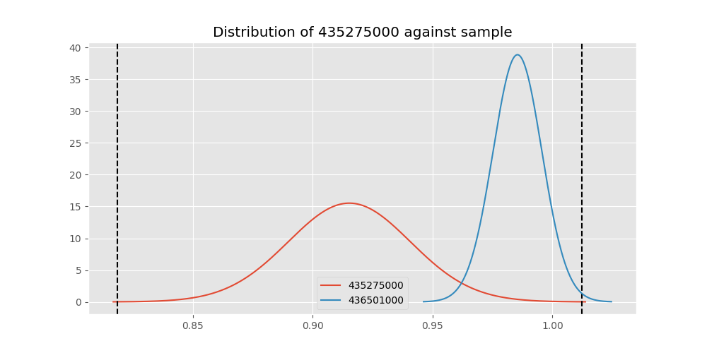
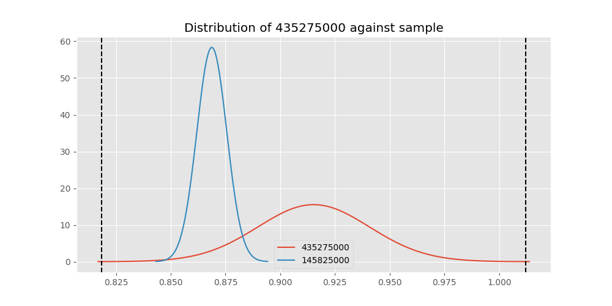
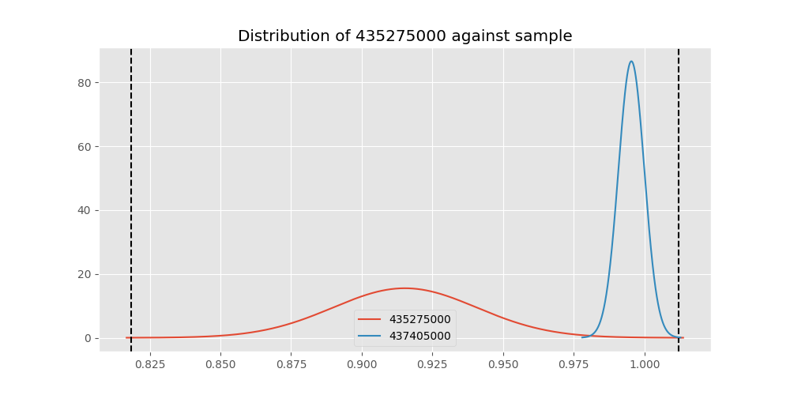

# Testing Results For 435275000 
$H_{0}$: There is not a difference in collection success against 435275000 
$H_{A}$: There is a difference in collection success against 435275000
An $\alpha$ of 0.00025 was used 
Out of 44 tests, there were 12 rejections from 44 independent-t test.
Out of 44 tests, there were 19 rejections from 44 Man Whitney u-tests.
## Testing Results for 435275000 against 436501000 
435275000 has a success rate of 0.9152542372881356
436501000 has a success rate of 0.9854014598540146
$H_{0}$: There is not a difference between 435275000 and 436501000
$H_{A}$: There is a difference between 435275000 and 436501000
An $/alpha$ of 0.00025 was used in this test.
__independent t-testing__: With a t-statistic of -2.530043007549556 and a p-value of 0.012409904251499248, _we failed to reject the null hypothssis_
__Man-Whitney testing__: With a u-statistic of 7516.0 and a p-value of 0.008539099393167401, _we failed to reject the null hypothssis_
 
## Testing Results for 435275000 against 437375000 
435275000 has a success rate of 0.9152542372881356
437375000 has a success rate of 0.9982014388489209
$H_{0}$: There is not a difference between 435275000 and 437375000
$H_{A}$: There is a difference between 435275000 and 437375000
An $/alpha$ of 0.00025 was used in this test.
__independent t-testing__: With a t-statistic of -3.213718277639974 and a p-value of 0.001689358222536296, _we failed to reject the null hypothssis_
__Man-Whitney testing__: With a u-statistic of 30083.0 and a p-value of 1.0973174141098883e-10, _we **reject** the null hypothssis_
 
## Testing Results for 435275000 against 436500000 
435275000 has a success rate of 0.9152542372881356
436500000 has a success rate of 0.9056603773584906
$H_{0}$: There is not a difference between 435275000 and 436500000
$H_{A}$: There is a difference between 435275000 and 436500000
An $/alpha$ of 0.00025 was used in this test.
__independent t-testing__: With a t-statistic of 0.27459241833506826 and a p-value of 0.783835560798326, _we failed to reject the null hypothssis_
__Man-Whitney testing__: With a u-statistic of 9471.0 and a p-value of 0.7844493364008812, _we failed to reject the null hypothssis_
 
## Testing Results for 435275000 against 436990000 
435275000 has a success rate of 0.9152542372881356
436990000 has a success rate of 0.9572649572649573
$H_{0}$: There is not a difference between 435275000 and 436990000
$H_{A}$: There is a difference between 435275000 and 436990000
An $/alpha$ of 0.00025 was used in this test.
__independent t-testing__: With a t-statistic of -1.6086390542046214 and a p-value of 0.10859689307533135, _we failed to reject the null hypothssis_
__Man-Whitney testing__: With a u-statistic of 13226.0 and a p-value of 0.10879575616021224, _we failed to reject the null hypothssis_
 
## Testing Results for 435275000 against 145875000 
435275000 has a success rate of 0.9152542372881356
145875000 has a success rate of 0.9722222222222222
$H_{0}$: There is not a difference between 435275000 and 145875000
$H_{A}$: There is a difference between 435275000 and 145875000
An $/alpha$ of 0.00025 was used in this test.
__independent t-testing__: With a t-statistic of -1.5679698187963123 and a p-value of 0.11856977584526589, _we failed to reject the null hypothssis_
__Man-Whitney testing__: With a u-statistic of 4006.0 and a p-value of 0.11906092473508245, _we failed to reject the null hypothssis_
 
## Testing Results for 435275000 against 437800000 
435275000 has a success rate of 0.9152542372881356
437800000 has a success rate of 0.9533678756476683
$H_{0}$: There is not a difference between 435275000 and 437800000
$H_{A}$: There is a difference between 435275000 and 437800000
An $/alpha$ of 0.00025 was used in this test.
__independent t-testing__: With a t-statistic of -1.3614754110224763 and a p-value of 0.17435539391309715, _we failed to reject the null hypothssis_
__Man-Whitney testing__: With a u-statistic of 10953.0 and a p-value of 0.1744514900408004, _we failed to reject the null hypothssis_
 
## Testing Results for 435275000 against 145810000 
435275000 has a success rate of 0.9152542372881356
145810000 has a success rate of 0.12179487179487179
$H_{0}$: There is not a difference between 435275000 and 145810000
$H_{A}$: There is a difference between 435275000 and 145810000
An $/alpha$ of 0.00025 was used in this test.
__independent t-testing__: With a t-statistic of 21.1010477825375 and a p-value of 3.285896719840908e-59, _we **reject** the null hypothssis_
__Man-Whitney testing__: With a u-statistic of 16507.0 and a p-value of 9.763113983963914e-39, _we **reject** the null hypothssis_
 
## Testing Results for 435275000 against 437095000 
435275000 has a success rate of 0.9152542372881356
437095000 has a success rate of 0.9361702127659575
$H_{0}$: There is not a difference between 435275000 and 437095000
$H_{A}$: There is a difference between 435275000 and 437095000
An $/alpha$ of 0.00025 was used in this test.
__independent t-testing__: With a t-statistic of -0.44764648544366786 and a p-value of 0.6550026947827486, _we failed to reject the null hypothssis_
__Man-Whitney testing__: With a u-statistic of 2715.0 and a p-value of 0.6564113039323517, _we failed to reject the null hypothssis_
 
## Testing Results for 435275000 against 437265000 
435275000 has a success rate of 0.9152542372881356
437265000 has a success rate of 0.9795454545454545
$H_{0}$: There is not a difference between 435275000 and 437265000
$H_{A}$: There is a difference between 435275000 and 437265000
An $/alpha$ of 0.00025 was used in this test.
__independent t-testing__: With a t-statistic of -3.449720911770701 and a p-value of 0.0006037310725494434, _we failed to reject the null hypothssis_
__Man-Whitney testing__: With a u-statistic of 24291.0 and a p-value of 0.0006368159632982903, _we failed to reject the null hypothssis_
 
## Testing Results for 435275000 against 437350000 
435275000 has a success rate of 0.9152542372881356
437350000 has a success rate of 0.9488372093023256
$H_{0}$: There is not a difference between 435275000 and 437350000
$H_{A}$: There is a difference between 435275000 and 437350000
An $/alpha$ of 0.00025 was used in this test.
__independent t-testing__: With a t-statistic of -1.2049160124992335 and a p-value of 0.22909649286484762, _we failed to reject the null hypothssis_
__Man-Whitney testing__: With a u-statistic of 12259.0 and a p-value of 0.22909874508418626, _we failed to reject the null hypothssis_
 
## Testing Results for 435275000 against 437200000 
435275000 has a success rate of 0.9152542372881356
437200000 has a success rate of 0.8620689655172413
$H_{0}$: There is not a difference between 435275000 and 437200000
$H_{A}$: There is a difference between 435275000 and 437200000
An $/alpha$ of 0.00025 was used in this test.
__independent t-testing__: With a t-statistic of 1.4222084189393236 and a p-value of 0.1559427844245209, _we failed to reject the null hypothssis_
__Man-Whitney testing__: With a u-statistic of 12614.0 and a p-value of 0.15594954500068345, _we failed to reject the null hypothssis_
 
## Testing Results for 435275000 against 435600000 
435275000 has a success rate of 0.9152542372881356
435600000 has a success rate of 0.9819341126461212
$H_{0}$: There is not a difference between 435275000 and 435600000
$H_{A}$: There is a difference between 435275000 and 435600000
An $/alpha$ of 0.00025 was used in this test.
__independent t-testing__: With a t-statistic of -2.55365770727624 and a p-value of 0.011873713920781738, _we failed to reject the null hypothssis_
__Man-Whitney testing__: With a u-statistic of 51817.0 and a p-value of 1.4975098447920951e-05, _we **reject** the null hypothssis_
 
## Testing Results for 435275000 against 450000000 
435275000 has a success rate of 0.9152542372881356
450000000 has a success rate of 0.8235294117647058
$H_{0}$: There is not a difference between 435275000 and 450000000
$H_{A}$: There is a difference between 435275000 and 450000000
An $/alpha$ of 0.00025 was used in this test.
__independent t-testing__: With a t-statistic of 1.9711186384398633 and a p-value of 0.050082670563870585, _we failed to reject the null hypothssis_
__Man-Whitney testing__: With a u-statistic of 5475.0 and a p-value of 0.050575652045782106, _we failed to reject the null hypothssis_
 
## Testing Results for 435275000 against 145978500 
435275000 has a success rate of 0.9152542372881356
145978500 has a success rate of 0.9963636363636363
$H_{0}$: There is not a difference between 435275000 and 145978500
$H_{A}$: There is a difference between 435275000 and 145978500
An $/alpha$ of 0.00025 was used in this test.
__independent t-testing__: With a t-statistic of -3.1192171254972756 and a p-value of 0.0022641835663516066, _we failed to reject the null hypothssis_
__Man-Whitney testing__: With a u-statistic of 14909.0 and a p-value of 8.159262430278872e-06, _we **reject** the null hypothssis_
 
## Testing Results for 435275000 against 437050000 
435275000 has a success rate of 0.9152542372881356
437050000 has a success rate of 0.5346534653465347
$H_{0}$: There is not a difference between 435275000 and 437050000
$H_{A}$: There is a difference between 435275000 and 437050000
An $/alpha$ of 0.00025 was used in this test.
__independent t-testing__: With a t-statistic of 7.064001893782956 and a p-value of 2.1683851609450235e-11, _we **reject** the null hypothssis_
__Man-Whitney testing__: With a u-statistic of 8227.0 and a p-value of 1.73917734993613e-10, _we **reject** the null hypothssis_
 
## Testing Results for 435275000 against 435300000 
435275000 has a success rate of 0.9152542372881356
435300000 has a success rate of 0.1232876712328767
$H_{0}$: There is not a difference between 435275000 and 435300000
$H_{A}$: There is a difference between 435275000 and 435300000
An $/alpha$ of 0.00025 was used in this test.
__independent t-testing__: With a t-statistic of 20.738747321074715 and a p-value of 3.391465347308763e-57, _we **reject** the null hypothssis_
__Man-Whitney testing__: With a u-statistic of 15436.0 and a p-value of 2.0306453080541635e-37, _we **reject** the null hypothssis_
 
## Testing Results for 435275000 against 437475000 
435275000 has a success rate of 0.9152542372881356
437475000 has a success rate of 0.5045045045045045
$H_{0}$: There is not a difference between 435275000 and 437475000
$H_{A}$: There is a difference between 435275000 and 437475000
An $/alpha$ of 0.00025 was used in this test.
__independent t-testing__: With a t-statistic of 8.630723972434822 and a p-value of 4.40810457141373e-17, _we **reject** the null hypothssis_
__Man-Whitney testing__: With a u-statistic of 46195.0 and a p-value of 2.5272375289730906e-16, _we **reject** the null hypothssis_
 
## Testing Results for 435275000 against 435448000 
435275000 has a success rate of 0.9152542372881356
435448000 has a success rate of 0.975
$H_{0}$: There is not a difference between 435275000 and 435448000
$H_{A}$: There is a difference between 435275000 and 435448000
An $/alpha$ of 0.00025 was used in this test.
__independent t-testing__: With a t-statistic of -1.281621635401813 and a p-value of 0.20187702869159244, _we failed to reject the null hypothssis_
__Man-Whitney testing__: With a u-statistic of 2219.0 and a p-value of 0.2024963577509301, _we failed to reject the null hypothssis_
 
## Testing Results for 435275000 against 437644000 
435275000 has a success rate of 0.9152542372881356
437644000 has a success rate of 0.9743589743589743
$H_{0}$: There is not a difference between 435275000 and 437644000
$H_{A}$: There is a difference between 435275000 and 437644000
An $/alpha$ of 0.00025 was used in this test.
__independent t-testing__: With a t-statistic of -1.989965500604441 and a p-value of 0.04776364394390163, _we failed to reject the null hypothssis_
__Man-Whitney testing__: With a u-statistic of 6495.0 and a p-value of 0.04825971602061249, _we failed to reject the null hypothssis_
 
## Testing Results for 435275000 against 145825000 
435275000 has a success rate of 0.9152542372881356
145825000 has a success rate of 0.8687448728465955
$H_{0}$: There is not a difference between 435275000 and 145825000
$H_{A}$: There is a difference between 435275000 and 145825000
An $/alpha$ of 0.00025 was used in this test.
__independent t-testing__: With a t-statistic of 1.4715437845086987 and a p-value of 0.1412673156284435, _we failed to reject the null hypothssis_
__Man-Whitney testing__: With a u-statistic of 150532.0 and a p-value of 0.1412645272793089, _we failed to reject the null hypothssis_
 
## Testing Results for 435275000 against 437345000 
435275000 has a success rate of 0.9152542372881356
437345000 has a success rate of 0.7603092783505154
$H_{0}$: There is not a difference between 435275000 and 437345000
$H_{A}$: There is a difference between 435275000 and 437345000
An $/alpha$ of 0.00025 was used in this test.
__independent t-testing__: With a t-statistic of 3.702594276467244 and a p-value of 0.0002369562357395499, _we **reject** the null hypothssis_
__Man-Whitney testing__: With a u-statistic of 26439.0 and a p-value of 0.00025583295865836536, _we failed to reject the null hypothssis_
 
## Testing Results for 435275000 against 437322500 
435275000 has a success rate of 0.9152542372881356
437322500 has a success rate of 0.9961685823754789
$H_{0}$: There is not a difference between 435275000 and 437322500
$H_{A}$: There is a difference between 435275000 and 437322500
An $/alpha$ of 0.00025 was used in this test.
__independent t-testing__: With a t-statistic of -3.1083696561639385 and a p-value of 0.0023404539988465456, _we failed to reject the null hypothssis_
__Man-Whitney testing__: With a u-statistic of 14153.0 and a p-value of 1.4412150063628208e-05, _we **reject** the null hypothssis_
 
## Testing Results for 435275000 against 437450000 
435275000 has a success rate of 0.9152542372881356
437450000 has a success rate of 0.6947791164658634
$H_{0}$: There is not a difference between 435275000 and 437450000
$H_{A}$: There is a difference between 435275000 and 437450000
An $/alpha$ of 0.00025 was used in this test.
__independent t-testing__: With a t-statistic of 4.788206136910763 and a p-value of 2.449870767190124e-06, _we **reject** the null hypothssis_
__Man-Whitney testing__: With a u-statistic of 17930.0 and a p-value of 3.3161767889959093e-06, _we **reject** the null hypothssis_
 
## Testing Results for 435275000 against 436703000 
435275000 has a success rate of 0.9152542372881356
436703000 has a success rate of 0.9859154929577465
$H_{0}$: There is not a difference between 435275000 and 436703000
$H_{A}$: There is a difference between 435275000 and 436703000
An $/alpha$ of 0.00025 was used in this test.
__independent t-testing__: With a t-statistic of -2.6180891252110103 and a p-value of 0.009811709338519117, _we failed to reject the null hypothssis_
__Man-Whitney testing__: With a u-statistic of 11679.0 and a p-value of 0.001559957689871106, _we failed to reject the null hypothssis_
 
## Testing Results for 435275000 against 400500000 
435275000 has a success rate of 0.9152542372881356
400500000 has a success rate of 0.3508771929824561
$H_{0}$: There is not a difference between 435275000 and 400500000
$H_{A}$: There is a difference between 435275000 and 400500000
An $/alpha$ of 0.00025 was used in this test.
__independent t-testing__: With a t-statistic of 9.78164846316526 and a p-value of 2.911776811237011e-18, _we **reject** the null hypothssis_
__Man-Whitney testing__: With a u-statistic of 5261.0 and a p-value of 3.5570476442969854e-15, _we **reject** the null hypothssis_
 
## Testing Results for 435275000 against 437150000 
435275000 has a success rate of 0.9152542372881356
437150000 has a success rate of 0.9859550561797753
$H_{0}$: There is not a difference between 435275000 and 437150000
$H_{A}$: There is a difference between 435275000 and 437150000
An $/alpha$ of 0.00025 was used in this test.
__independent t-testing__: With a t-statistic of -2.6685311262951124 and a p-value of 0.008581142123290808, _we failed to reject the null hypothssis_
__Man-Whitney testing__: With a u-statistic of 19519.0 and a p-value of 0.0001465497451462084, _we **reject** the null hypothssis_
 
## Testing Results for 435275000 against 435635000 
435275000 has a success rate of 0.9152542372881356
435635000 has a success rate of 0.9849624060150376
$H_{0}$: There is not a difference between 435275000 and 435635000
$H_{A}$: There is a difference between 435275000 and 435635000
An $/alpha$ of 0.00025 was used in this test.
__independent t-testing__: With a t-statistic of -2.5037530260590253 and a p-value of 0.013317056050877829, _we failed to reject the null hypothssis_
__Man-Whitney testing__: With a u-statistic of 7300.0 and a p-value of 0.009997137743827506, _we failed to reject the null hypothssis_
 
## Testing Results for 435275000 against 437384000 
435275000 has a success rate of 0.9152542372881356
437384000 has a success rate of 0.968421052631579
$H_{0}$: There is not a difference between 435275000 and 437384000
$H_{A}$: There is a difference between 435275000 and 437384000
An $/alpha$ of 0.00025 was used in this test.
__independent t-testing__: With a t-statistic of -2.0513202698492683 and a p-value of 0.041086840172361125, _we failed to reject the null hypothssis_
__Man-Whitney testing__: With a u-statistic of 10614.0 and a p-value of 0.04145260370445639, _we failed to reject the null hypothssis_
 
## Testing Results for 435275000 against 437405000 
435275000 has a success rate of 0.9152542372881356
437405000 has a success rate of 0.9953917050691244
$H_{0}$: There is not a difference between 435275000 and 437405000
$H_{A}$: There is a difference between 435275000 and 437405000
An $/alpha$ of 0.00025 was used in this test.
__independent t-testing__: With a t-statistic of -3.063738846618871 and a p-value of 0.002679817614989218, _we failed to reject the null hypothssis_
__Man-Whitney testing__: With a u-statistic of 11777.0 and a p-value of 8.718824943296055e-05, _we **reject** the null hypothssis_
 
## Testing Results for 435275000 against 435612500 
435275000 has a success rate of 0.9152542372881356
435612500 has a success rate of 0.9770114942528736
$H_{0}$: There is not a difference between 435275000 and 435612500
$H_{A}$: There is a difference between 435275000 and 435612500
An $/alpha$ of 0.00025 was used in this test.
__independent t-testing__: With a t-statistic of -1.8683998681849705 and a p-value of 0.06314703752244083, _we failed to reject the null hypothssis_
__Man-Whitney testing__: With a u-statistic of 4816.0 and a p-value of 0.06371524792327182, _we failed to reject the null hypothssis_
 
## Testing Results for 435275000 against 435975000 
435275000 has a success rate of 0.9152542372881356
435975000 has a success rate of 0.92
$H_{0}$: There is not a difference between 435275000 and 435975000
$H_{A}$: There is a difference between 435275000 and 435975000
An $/alpha$ of 0.00025 was used in this test.
__independent t-testing__: With a t-statistic of -0.10115213998756166 and a p-value of 0.9195517600644729, _we failed to reject the null hypothssis_
__Man-Whitney testing__: With a u-statistic of 2936.0 and a p-value of 0.9220673634083836, _we failed to reject the null hypothssis_
 
## Testing Results for 435275000 against 437425000 
435275000 has a success rate of 0.9152542372881356
437425000 has a success rate of 0.6987654320987654
$H_{0}$: There is not a difference between 435275000 and 437425000
$H_{A}$: There is a difference between 435275000 and 437425000
An $/alpha$ of 0.00025 was used in this test.
__independent t-testing__: With a t-statistic of 4.8616260527288775 and a p-value of 1.5436097636228126e-06, _we **reject** the null hypothssis_
__Man-Whitney testing__: With a u-statistic of 29068.0 and a p-value of 1.9448915648158563e-06, _we **reject** the null hypothssis_
 
## Testing Results for 435275000 against 437275000 
435275000 has a success rate of 0.9152542372881356
437275000 has a success rate of 0.3643724696356275
$H_{0}$: There is not a difference between 435275000 and 437275000
$H_{A}$: There is a difference between 435275000 and 437275000
An $/alpha$ of 0.00025 was used in this test.
__independent t-testing__: With a t-statistic of 11.513431390318496 and a p-value of 2.3337686803197413e-26, _we **reject** the null hypothssis_
__Man-Whitney testing__: With a u-statistic of 22601.0 and a p-value of 5.792767106116725e-23, _we **reject** the null hypothssis_
 
## Testing Results for 435275000 against 145840000 
435275000 has a success rate of 0.9152542372881356
145840000 has a success rate of 0.9649122807017544
$H_{0}$: There is not a difference between 435275000 and 145840000
$H_{A}$: There is a difference between 435275000 and 145840000
An $/alpha$ of 0.00025 was used in this test.
__independent t-testing__: With a t-statistic of -1.216342270936075 and a p-value of 0.225511513453446, _we failed to reject the null hypothssis_
__Man-Whitney testing__: With a u-statistic of 3196.0 and a p-value of 0.2258827325621935, _we failed to reject the null hypothssis_
 
## Testing Results for 435275000 against 435525000 
435275000 has a success rate of 0.9152542372881356
435525000 has a success rate of 0.6923076923076923
$H_{0}$: There is not a difference between 435275000 and 435525000
$H_{A}$: There is a difference between 435275000 and 435525000
An $/alpha$ of 0.00025 was used in this test.
__independent t-testing__: With a t-statistic of 4.583683322694267 and a p-value of 7.112558419038525e-06, _we **reject** the null hypothssis_
__Man-Whitney testing__: With a u-statistic of 10318.0 and a p-value of 1.006866103987255e-05, _we **reject** the null hypothssis_
 
## Testing Results for 435275000 against 436250000 
435275000 has a success rate of 0.9152542372881356
436250000 has a success rate of 0.17857142857142858
$H_{0}$: There is not a difference between 435275000 and 436250000
$H_{A}$: There is a difference between 435275000 and 436250000
An $/alpha$ of 0.00025 was used in this test.
__independent t-testing__: With a t-statistic of 14.287126797347746 and a p-value of 4.9131644474042215e-31, _we **reject** the null hypothssis_
__Man-Whitney testing__: With a u-statistic of 5738.0 and a p-value of 3.405706441434137e-22, _we **reject** the null hypothssis_
 
## Testing Results for 435275000 against 435950000 
435275000 has a success rate of 0.9152542372881356
435950000 has a success rate of 0.9850187265917603
$H_{0}$: There is not a difference between 435275000 and 435950000
$H_{A}$: There is a difference between 435275000 and 435950000
An $/alpha$ of 0.00025 was used in this test.
__independent t-testing__: With a t-statistic of -2.6546850659730348 and a p-value of 0.008954798279489175, _we failed to reject the null hypothssis_
__Man-Whitney testing__: With a u-statistic of 29308.0 and a p-value of 2.8928871649473375e-05, _we **reject** the null hypothssis_
 
## Testing Results for 435275000 against 435800000 
435275000 has a success rate of 0.9152542372881356
435800000 has a success rate of 0.5390070921985816
$H_{0}$: There is not a difference between 435275000 and 435800000
$H_{A}$: There is a difference between 435275000 and 435800000
An $/alpha$ of 0.00025 was used in this test.
__independent t-testing__: With a t-statistic of 7.272575920154315 and a p-value of 4.254384748979908e-12, _we **reject** the null hypothssis_
__Man-Whitney testing__: With a u-statistic of 11449.0 and a p-value of 3.2504833235170255e-11, _we **reject** the null hypothssis_
 
## Testing Results for 435275000 against 437485000 
435275000 has a success rate of 0.9152542372881356
437485000 has a success rate of 0.9375
$H_{0}$: There is not a difference between 435275000 and 437485000
$H_{A}$: There is a difference between 435275000 and 437485000
An $/alpha$ of 0.00025 was used in this test.
__independent t-testing__: With a t-statistic of -0.4088925085807846 and a p-value of 0.6832096196851323, _we failed to reject the null hypothssis_
__Man-Whitney testing__: With a u-statistic of 1846.0 and a p-value of 0.6853609303074215, _we failed to reject the null hypothssis_
 
## Testing Results for 435275000 against 136770000 
435275000 has a success rate of 0.9152542372881356
136770000 has a success rate of 0.9945945945945946
$H_{0}$: There is not a difference between 435275000 and 136770000
$H_{A}$: There is a difference between 435275000 and 136770000
An $/alpha$ of 0.00025 was used in this test.
__independent t-testing__: With a t-statistic of -3.015723830254223 and a p-value of 0.0030953606198556123, _we failed to reject the null hypothssis_
__Man-Whitney testing__: With a u-statistic of 10049.0 and a p-value of 0.0003276337579795535, _we failed to reject the null hypothssis_
 
## Testing Results for 435275000 against 437250000 
435275000 has a success rate of 0.9152542372881356
437250000 has a success rate of 0.9937106918238994
$H_{0}$: There is not a difference between 435275000 and 437250000
$H_{A}$: There is a difference between 435275000 and 437250000
An $/alpha$ of 0.00025 was used in this test.
__independent t-testing__: With a t-statistic of -3.002811773198166 and a p-value of 0.0032360641266819517, _we failed to reject the null hypothssis_
__Man-Whitney testing__: With a u-statistic of 17290.0 and a p-value of 8.900704107677334e-06, _we **reject** the null hypothssis_
 
## Testing Results for 435275000 against 437356000 
435275000 has a success rate of 0.9152542372881356
437356000 has a success rate of 0.9328358208955224
$H_{0}$: There is not a difference between 435275000 and 437356000
$H_{A}$: There is a difference between 435275000 and 437356000
An $/alpha$ of 0.00025 was used in this test.
__independent t-testing__: With a t-statistic of -0.5256619148954252 and a p-value of 0.5995890676097236, _we failed to reject the null hypothssis_
__Man-Whitney testing__: With a u-statistic of 7767.0 and a p-value of 0.5999115268659668, _we failed to reject the null hypothssis_
 
## Testing Results for 435275000 against 437676000 
435275000 has a success rate of 0.9152542372881356
437676000 has a success rate of 0.9813432835820896
$H_{0}$: There is not a difference between 435275000 and 437676000
$H_{A}$: There is a difference between 435275000 and 437676000
An $/alpha$ of 0.00025 was used in this test.
__independent t-testing__: With a t-statistic of -2.443537471351229 and a p-value of 0.01577248656393706, _we failed to reject the null hypothssis_
__Man-Whitney testing__: With a u-statistic of 14767.0 and a p-value of 0.002003035468374977, _we failed to reject the null hypothssis_
 
## Testing Results for 435275000 against 145826800 
435275000 has a success rate of 0.9152542372881356
145826800 has a success rate of 0.966183574879227
$H_{0}$: There is not a difference between 435275000 and 145826800
$H_{A}$: There is a difference between 435275000 and 145826800
An $/alpha$ of 0.00025 was used in this test.
__independent t-testing__: With a t-statistic of -1.9890201110100463 and a p-value of 0.047542287004406124, _we failed to reject the null hypothssis_
__Man-Whitney testing__: With a u-statistic of 11591.0 and a p-value of 0.04788178450223125, _we failed to reject the null hypothssis_
 
