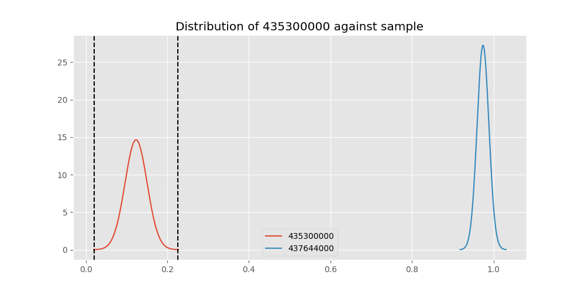

# Testing Results For 435300000 
$H_{0}$: There is not a difference in collection success against 435300000 
$H_{A}$: There is a difference in collection success against 435300000
An $\alpha$ of 0.00025 was used 
Out of 44 tests, there were 42 rejections from 44 independent-t test.
Out of 44 tests, there were 42 rejections from 44 Man Whitney u-tests.
## Testing Results for 435300000 against 436501000 
435300000 has a success rate of 0.1232876712328767
436501000 has a success rate of 0.9854014598540146
$H_{0}$: There is not a difference between 435300000 and 436501000
$H_{A}$: There is a difference between 435300000 and 436501000
An $/alpha$ of 0.00025 was used in this test.
__independent t-testing__: With a t-statistic of -29.549261829912776 and a p-value of 5.396685003903958e-72, _we **reject** the null hypothssis_
__Man-Whitney testing__: With a u-statistic of 1379.0 and a p-value of 9.426422484093478e-48, _we **reject** the null hypothssis_
 
## Testing Results for 435300000 against 437375000 
435300000 has a success rate of 0.1232876712328767
437375000 has a success rate of 0.9982014388489209
$H_{0}$: There is not a difference between 435300000 and 437375000
$H_{A}$: There is a difference between 435300000 and 437375000
An $/alpha$ of 0.00025 was used in this test.
__independent t-testing__: With a t-statistic of -31.975739278303298 and a p-value of 6.940966531632392e-68, _we **reject** the null hypothssis_
__Man-Whitney testing__: With a u-statistic of 5077.0 and a p-value of 3.598637603529853e-130, _we **reject** the null hypothssis_
 
## Testing Results for 435300000 against 436500000 
435300000 has a success rate of 0.1232876712328767
436500000 has a success rate of 0.9056603773584906
$H_{0}$: There is not a difference between 435300000 and 436500000
$H_{A}$: There is a difference between 435300000 and 436500000
An $/alpha$ of 0.00025 was used in this test.
__independent t-testing__: With a t-statistic of -21.92500459586506 and a p-value of 1.739688767889645e-64, _we **reject** the null hypothssis_
__Man-Whitney testing__: With a u-statistic of 2526.0 and a p-value of 1.8976847318366176e-42, _we **reject** the null hypothssis_
 
## Testing Results for 435300000 against 436990000 
435300000 has a success rate of 0.1232876712328767
436990000 has a success rate of 0.9572649572649573
$H_{0}$: There is not a difference between 435300000 and 436990000
$H_{A}$: There is a difference between 435300000 and 436990000
An $/alpha$ of 0.00025 was used in this test.
__independent t-testing__: With a t-statistic of -30.53331542431501 and a p-value of 4.469680672004177e-104, _we **reject** the null hypothssis_
__Man-Whitney testing__: With a u-statistic of 2836.0 and a p-value of 1.3564618400566322e-60, _we **reject** the null hypothssis_
 
## Testing Results for 435300000 against 145875000 
435300000 has a success rate of 0.1232876712328767
145875000 has a success rate of 0.9722222222222222
$H_{0}$: There is not a difference between 435300000 and 145875000
$H_{A}$: There is a difference between 435300000 and 145875000
An $/alpha$ of 0.00025 was used in this test.
__independent t-testing__: With a t-statistic of -25.301322607109924 and a p-value of 1.6338162435718222e-66, _we **reject** the null hypothssis_
__Man-Whitney testing__: With a u-statistic of 794.0 and a p-value of 4.192256964464913e-33, _we **reject** the null hypothssis_
 
## Testing Results for 435300000 against 437800000 
435300000 has a success rate of 0.1232876712328767
437800000 has a success rate of 0.9533678756476683
$H_{0}$: There is not a difference between 435300000 and 437800000
$H_{A}$: There is a difference between 435300000 and 437800000
An $/alpha$ of 0.00025 was used in this test.
__independent t-testing__: With a t-statistic of -28.147608451924608 and a p-value of 1.6682979337795189e-90, _we **reject** the null hypothssis_
__Man-Whitney testing__: With a u-statistic of 2394.0 and a p-value of 1.674608970569168e-53, _we **reject** the null hypothssis_
 
## Testing Results for 435300000 against 145810000 
435300000 has a success rate of 0.1232876712328767
145810000 has a success rate of 0.12179487179487179
$H_{0}$: There is not a difference between 435300000 and 145810000
$H_{A}$: There is a difference between 435300000 and 145810000
An $/alpha$ of 0.00025 was used in this test.
__independent t-testing__: With a t-statistic of 0.03940743268613223 and a p-value of 0.9685917655780801, _we failed to reject the null hypothssis_
__Man-Whitney testing__: With a u-statistic of 11405.0 and a p-value of 0.9694389346196277, _we failed to reject the null hypothssis_
 
## Testing Results for 435300000 against 437095000 
435300000 has a success rate of 0.1232876712328767
437095000 has a success rate of 0.9361702127659575
$H_{0}$: There is not a difference between 435300000 and 437095000
$H_{A}$: There is a difference between 435300000 and 437095000
An $/alpha$ of 0.00025 was used in this test.
__independent t-testing__: With a t-statistic of -15.536718022888902 and a p-value of 9.960266930775825e-36, _we **reject** the null hypothssis_
__Man-Whitney testing__: With a u-statistic of 642.0 and a p-value of 4.128914764539418e-25, _we **reject** the null hypothssis_
 
## Testing Results for 435300000 against 437265000 
435300000 has a success rate of 0.1232876712328767
437265000 has a success rate of 0.9795454545454545
$H_{0}$: There is not a difference between 435300000 and 437265000
$H_{A}$: There is a difference between 435300000 and 437265000
An $/alpha$ of 0.00025 was used in this test.
__independent t-testing__: With a t-statistic of -30.44360365568465 and a p-value of 3.603323844034985e-69, _we **reject** the null hypothssis_
__Man-Whitney testing__: With a u-statistic of 4617.0 and a p-value of 2.0588843270174646e-99, _we **reject** the null hypothssis_
 
## Testing Results for 435300000 against 437350000 
435300000 has a success rate of 0.1232876712328767
437350000 has a success rate of 0.9488372093023256
$H_{0}$: There is not a difference between 435300000 and 437350000
$H_{A}$: There is a difference between 435300000 and 437350000
An $/alpha$ of 0.00025 was used in this test.
__independent t-testing__: With a t-statistic of -28.486059807945974 and a p-value of 3.739777299197268e-94, _we **reject** the null hypothssis_
__Man-Whitney testing__: With a u-statistic of 2738.0 and a p-value of 3.2350797051730267e-56, _we **reject** the null hypothssis_
 
## Testing Results for 435300000 against 437200000 
435300000 has a success rate of 0.1232876712328767
437200000 has a success rate of 0.8620689655172413
$H_{0}$: There is not a difference between 435300000 and 437200000
$H_{A}$: There is a difference between 435300000 and 437200000
An $/alpha$ of 0.00025 was used in this test.
__independent t-testing__: With a t-statistic of -20.072611482941205 and a p-value of 4.993464934766327e-60, _we **reject** the null hypothssis_
__Man-Whitney testing__: With a u-statistic of 3871.0 and a p-value of 1.468582048117903e-42, _we **reject** the null hypothssis_
 
## Testing Results for 435300000 against 435600000 
435300000 has a success rate of 0.1232876712328767
435600000 has a success rate of 0.9819341126461212
$H_{0}$: There is not a difference between 435300000 and 435600000
$H_{A}$: There is a difference between 435300000 and 435600000
An $/alpha$ of 0.00025 was used in this test.
__independent t-testing__: With a t-statistic of -31.058537660361967 and a p-value of 8.262882952368482e-68, _we **reject** the null hypothssis_
__Man-Whitney testing__: With a u-statistic of 9710.0 and a p-value of 3.73991824160661e-177, _we **reject** the null hypothssis_
 
## Testing Results for 435300000 against 450000000 
435300000 has a success rate of 0.1232876712328767
450000000 has a success rate of 0.8235294117647058
$H_{0}$: There is not a difference between 435300000 and 450000000
$H_{A}$: There is a difference between 435300000 and 450000000
An $/alpha$ of 0.00025 was used in this test.
__independent t-testing__: With a t-statistic of -14.643056020757042 and a p-value of 1.0429266461404638e-34, _we **reject** the null hypothssis_
__Man-Whitney testing__: With a u-statistic of 1860.0 and a p-value of 5.368526065070789e-26, _we **reject** the null hypothssis_
 
## Testing Results for 435300000 against 145978500 
435300000 has a success rate of 0.1232876712328767
145978500 has a success rate of 0.9963636363636363
$H_{0}$: There is not a difference between 435300000 and 145978500
$H_{A}$: There is a difference between 435300000 and 145978500
An $/alpha$ of 0.00025 was used in this test.
__independent t-testing__: With a t-statistic of -31.69782564977197 and a p-value of 2.094251286436013e-68, _we **reject** the null hypothssis_
__Man-Whitney testing__: With a u-statistic of 2548.0 and a p-value of 3.4511608092960006e-76, _we **reject** the null hypothssis_
 
## Testing Results for 435300000 against 437050000 
435300000 has a success rate of 0.1232876712328767
437050000 has a success rate of 0.5346534653465347
$H_{0}$: There is not a difference between 435300000 and 437050000
$H_{A}$: There is a difference between 435300000 and 437050000
An $/alpha$ of 0.00025 was used in this test.
__independent t-testing__: With a t-statistic of -7.7783518850290445 and a p-value of 2.0425536150161885e-13, _we **reject** the null hypothssis_
__Man-Whitney testing__: With a u-statistic of 4340.0 and a p-value of 2.9787474913408053e-12, _we **reject** the null hypothssis_
 
## Testing Results for 435300000 against 437475000 
435300000 has a success rate of 0.1232876712328767
437475000 has a success rate of 0.5045045045045045
$H_{0}$: There is not a difference between 435300000 and 437475000
$H_{A}$: There is a difference between 435300000 and 437475000
An $/alpha$ of 0.00025 was used in this test.
__independent t-testing__: With a t-statistic of -8.717316925352742 and a p-value of 2.0594851239582214e-17, _we **reject** the null hypothssis_
__Man-Whitney testing__: With a u-statistic of 25070.0 and a p-value of 1.1854945499915493e-16, _we **reject** the null hypothssis_
 
## Testing Results for 435300000 against 435448000 
435300000 has a success rate of 0.1232876712328767
435448000 has a success rate of 0.975
$H_{0}$: There is not a difference between 435300000 and 435448000
$H_{A}$: There is a difference between 435300000 and 435448000
An $/alpha$ of 0.00025 was used in this test.
__independent t-testing__: With a t-statistic of -23.00721177940474 and a p-value of 1.1569371595459256e-48, _we **reject** the null hypothssis_
__Man-Whitney testing__: With a u-statistic of 433.0 and a p-value of 5.601895312512e-25, _we **reject** the null hypothssis_
 
## Testing Results for 435300000 against 437644000 
435300000 has a success rate of 0.1232876712328767
437644000 has a success rate of 0.9743589743589743
$H_{0}$: There is not a difference between 435300000 and 437644000
$H_{A}$: There is a difference between 435300000 and 437644000
An $/alpha$ of 0.00025 was used in this test.
__independent t-testing__: With a t-statistic of -27.456644552319037 and a p-value of 1.0204013881190422e-72, _we **reject** the null hypothssis_
__Man-Whitney testing__: With a u-statistic of 1272.0 and a p-value of 1.1500187214452838e-42, _we **reject** the null hypothssis_
 
## Testing Results for 435300000 against 145825000 
435300000 has a success rate of 0.1232876712328767
145825000 has a success rate of 0.8687448728465955
$H_{0}$: There is not a difference between 435300000 and 145825000
$H_{A}$: There is a difference between 435300000 and 145825000
An $/alpha$ of 0.00025 was used in this test.
__independent t-testing__: With a t-statistic of -25.938051574660903 and a p-value of 5.096059759813725e-132, _we **reject** the null hypothssis_
__Man-Whitney testing__: With a u-statistic of 45302.0 and a p-value of 3.969732985646189e-118, _we **reject** the null hypothssis_
 
## Testing Results for 435300000 against 437345000 
435300000 has a success rate of 0.1232876712328767
437345000 has a success rate of 0.7603092783505154
$H_{0}$: There is not a difference between 435300000 and 437345000
$H_{A}$: There is a difference between 435300000 and 437345000
An $/alpha$ of 0.00025 was used in this test.
__independent t-testing__: With a t-statistic of -16.272329719386605 and a p-value of 1.2929831693423397e-48, _we **reject** the null hypothssis_
__Man-Whitney testing__: With a u-statistic of 10281.0 and a p-value of 2.0653612413188144e-40, _we **reject** the null hypothssis_
 
## Testing Results for 435300000 against 435275000 
435300000 has a success rate of 0.1232876712328767
435275000 has a success rate of 0.9152542372881356
$H_{0}$: There is not a difference between 435300000 and 435275000
$H_{A}$: There is a difference between 435300000 and 435275000
An $/alpha$ of 0.00025 was used in this test.
__independent t-testing__: With a t-statistic of -20.738747321074715 and a p-value of 3.391465347308763e-57, _we **reject** the null hypothssis_
__Man-Whitney testing__: With a u-statistic of 1792.0 and a p-value of 2.0306453080541635e-37, _we **reject** the null hypothssis_
 
## Testing Results for 435300000 against 437322500 
435300000 has a success rate of 0.1232876712328767
437322500 has a success rate of 0.9961685823754789
$H_{0}$: There is not a difference between 435300000 and 437322500
$H_{A}$: There is a difference between 435300000 and 437322500
An $/alpha$ of 0.00025 was used in this test.
__independent t-testing__: With a t-statistic of -31.660364655292668 and a p-value of 1.7503184065987718e-68, _we **reject** the null hypothssis_
__Man-Whitney testing__: With a u-statistic of 2422.0 and a p-value of 1.866509391966893e-73, _we **reject** the null hypothssis_
 
## Testing Results for 435300000 against 437450000 
435300000 has a success rate of 0.1232876712328767
437450000 has a success rate of 0.6947791164658634
$H_{0}$: There is not a difference between 435300000 and 437450000
$H_{A}$: There is a difference between 435300000 and 437450000
An $/alpha$ of 0.00025 was used in this test.
__independent t-testing__: With a t-statistic of -13.124176039614305 and a p-value of 6.979272481018097e-33, _we **reject** the null hypothssis_
__Man-Whitney testing__: With a u-statistic of 7789.0 and a p-value of 6.168281915586986e-28, _we **reject** the null hypothssis_
 
## Testing Results for 435300000 against 436703000 
435300000 has a success rate of 0.1232876712328767
436703000 has a success rate of 0.9859154929577465
$H_{0}$: There is not a difference between 435300000 and 436703000
$H_{A}$: There is a difference between 435300000 and 436703000
An $/alpha$ of 0.00025 was used in this test.
__independent t-testing__: With a t-statistic of -30.29219459654421 and a p-value of 1.4314788659929904e-70, _we **reject** the null hypothssis_
__Man-Whitney testing__: With a u-statistic of 2136.0 and a p-value of 2.842385169629123e-62, _we **reject** the null hypothssis_
 
## Testing Results for 435300000 against 400500000 
435300000 has a success rate of 0.1232876712328767
400500000 has a success rate of 0.3508771929824561
$H_{0}$: There is not a difference between 435300000 and 400500000
$H_{A}$: There is a difference between 435300000 and 400500000
An $/alpha$ of 0.00025 was used in this test.
__independent t-testing__: With a t-statistic of -3.852094554216759 and a p-value of 0.0001574378816849751, _we **reject** the null hypothssis_
__Man-Whitney testing__: With a u-statistic of 3214.0 and a p-value of 0.00019563158317739406, _we **reject** the null hypothssis_
 
## Testing Results for 435300000 against 437150000 
435300000 has a success rate of 0.1232876712328767
437150000 has a success rate of 0.9859550561797753
$H_{0}$: There is not a difference between 435300000 and 437150000
$H_{A}$: There is a difference between 435300000 and 437150000
An $/alpha$ of 0.00025 was used in this test.
__independent t-testing__: With a t-statistic of -30.80089167006897 and a p-value of 3.05267369400949e-69, _we **reject** the null hypothssis_
__Man-Whitney testing__: With a u-statistic of 3569.0 and a p-value of 7.285764792171833e-88, _we **reject** the null hypothssis_
 
## Testing Results for 435300000 against 435635000 
435300000 has a success rate of 0.1232876712328767
435635000 has a success rate of 0.9849624060150376
$H_{0}$: There is not a difference between 435300000 and 435635000
$H_{A}$: There is a difference between 435300000 and 435635000
An $/alpha$ of 0.00025 was used in this test.
__independent t-testing__: With a t-statistic of -29.423241177254678 and a p-value of 3.831325841577037e-72, _we **reject** the null hypothssis_
__Man-Whitney testing__: With a u-statistic of 1343.0 and a p-value of 6.528997285741701e-47, _we **reject** the null hypothssis_
 
## Testing Results for 435300000 against 437384000 
435300000 has a success rate of 0.1232876712328767
437384000 has a success rate of 0.968421052631579
$H_{0}$: There is not a difference between 435300000 and 437384000
$H_{A}$: There is a difference between 435300000 and 437384000
An $/alpha$ of 0.00025 was used in this test.
__independent t-testing__: With a t-statistic of -30.202451673084102 and a p-value of 1.6226277734936848e-97, _we **reject** the null hypothssis_
__Man-Whitney testing__: With a u-statistic of 2148.0 and a p-value of 2.8999379537858655e-55, _we **reject** the null hypothssis_
 
## Testing Results for 435300000 against 437405000 
435300000 has a success rate of 0.1232876712328767
437405000 has a success rate of 0.9953917050691244
$H_{0}$: There is not a difference between 435300000 and 437405000
$H_{A}$: There is a difference between 435300000 and 437405000
An $/alpha$ of 0.00025 was used in this test.
__independent t-testing__: With a t-statistic of -31.496635497835644 and a p-value of 7.848800306580641e-69, _we **reject** the null hypothssis_
__Man-Whitney testing__: With a u-statistic of 2026.0 and a p-value of 8.426094317944527e-65, _we **reject** the null hypothssis_
 
## Testing Results for 435300000 against 435612500 
435300000 has a success rate of 0.1232876712328767
435612500 has a success rate of 0.9770114942528736
$H_{0}$: There is not a difference between 435300000 and 435612500
$H_{A}$: There is a difference between 435300000 and 435612500
An $/alpha$ of 0.00025 was used in this test.
__independent t-testing__: With a t-statistic of -26.908513404554313 and a p-value of 2.210922027242952e-71, _we **reject** the null hypothssis_
__Man-Whitney testing__: With a u-statistic of 929.0 and a p-value of 9.37376272240919e-37, _we **reject** the null hypothssis_
 
## Testing Results for 435300000 against 435975000 
435300000 has a success rate of 0.1232876712328767
435975000 has a success rate of 0.92
$H_{0}$: There is not a difference between 435300000 and 435975000
$H_{A}$: There is a difference between 435300000 and 435975000
An $/alpha$ of 0.00025 was used in this test.
__independent t-testing__: With a t-statistic of -15.351655210053977 and a p-value of 2.44586526560957e-35, _we **reject** the null hypothssis_
__Man-Whitney testing__: With a u-statistic of 742.0 and a p-value of 4.636032369548233e-25, _we **reject** the null hypothssis_
 
## Testing Results for 435300000 against 437425000 
435300000 has a success rate of 0.1232876712328767
437425000 has a success rate of 0.6987654320987654
$H_{0}$: There is not a difference between 435300000 and 437425000
$H_{A}$: There is a difference between 435300000 and 437425000
An $/alpha$ of 0.00025 was used in this test.
__independent t-testing__: With a t-statistic of -13.896877879333308 and a p-value of 7.744727751260719e-38, _we **reject** the null hypothssis_
__Man-Whitney testing__: With a u-statistic of 12551.0 and a p-value of 5.537734711071198e-33, _we **reject** the null hypothssis_
 
## Testing Results for 435300000 against 437275000 
435300000 has a success rate of 0.1232876712328767
437275000 has a success rate of 0.3643724696356275
$H_{0}$: There is not a difference between 435300000 and 437275000
$H_{A}$: There is a difference between 435300000 and 437275000
An $/alpha$ of 0.00025 was used in this test.
__independent t-testing__: With a t-statistic of -5.345190486632667 and a p-value of 1.538488565836094e-07, _we **reject** the null hypothssis_
__Man-Whitney testing__: With a u-statistic of 13684.0 and a p-value of 2.391704955381239e-07, _we **reject** the null hypothssis_
 
## Testing Results for 435300000 against 145840000 
435300000 has a success rate of 0.1232876712328767
145840000 has a success rate of 0.9649122807017544
$H_{0}$: There is not a difference between 435300000 and 145840000
$H_{A}$: There is a difference between 435300000 and 145840000
An $/alpha$ of 0.00025 was used in this test.
__independent t-testing__: With a t-statistic of -18.153697078736226 and a p-value of 3.073006655718894e-44, _we **reject** the null hypothssis_
__Man-Whitney testing__: With a u-statistic of 659.0 and a p-value of 4.083480174193733e-29, _we **reject** the null hypothssis_
 
## Testing Results for 435300000 against 435525000 
435300000 has a success rate of 0.1232876712328767
435525000 has a success rate of 0.6923076923076923
$H_{0}$: There is not a difference between 435300000 and 435525000
$H_{A}$: There is a difference between 435300000 and 435525000
An $/alpha$ of 0.00025 was used in this test.
__independent t-testing__: With a t-statistic of -12.048806339801658 and a p-value of 2.4869106742381592e-27, _we **reject** the null hypothssis_
__Man-Whitney testing__: With a u-statistic of 4499.0 and a p-value of 7.956472576029732e-23, _we **reject** the null hypothssis_
 
## Testing Results for 435300000 against 436250000 
435300000 has a success rate of 0.1232876712328767
436250000 has a success rate of 0.17857142857142858
$H_{0}$: There is not a difference between 435300000 and 436250000
$H_{A}$: There is a difference between 435300000 and 436250000
An $/alpha$ of 0.00025 was used in this test.
__independent t-testing__: With a t-statistic of -1.0154205663230913 and a p-value of 0.3111322049191721, _we failed to reject the null hypothssis_
__Man-Whitney testing__: With a u-statistic of 3862.0 and a p-value of 0.31101443265786033, _we failed to reject the null hypothssis_
 
## Testing Results for 435300000 against 435950000 
435300000 has a success rate of 0.1232876712328767
435950000 has a success rate of 0.9850187265917603
$H_{0}$: There is not a difference between 435300000 and 435950000
$H_{A}$: There is a difference between 435300000 and 435950000
An $/alpha$ of 0.00025 was used in this test.
__independent t-testing__: With a t-statistic of -30.991913915500685 and a p-value of 1.5447298350495782e-68, _we **reject** the null hypothssis_
__Man-Whitney testing__: With a u-statistic of 5390.0 and a p-value of 1.4576384182606026e-117, _we **reject** the null hypothssis_
 
## Testing Results for 435300000 against 435800000 
435300000 has a success rate of 0.1232876712328767
435800000 has a success rate of 0.5390070921985816
$H_{0}$: There is not a difference between 435300000 and 435800000
$H_{A}$: There is a difference between 435300000 and 435800000
An $/alpha$ of 0.00025 was used in this test.
__independent t-testing__: With a t-statistic of -8.33808527522397 and a p-value of 3.2571862764393507e-15, _we **reject** the null hypothssis_
__Man-Whitney testing__: With a u-statistic of 6014.0 and a p-value of 6.98378916470159e-14, _we **reject** the null hypothssis_
 
## Testing Results for 435300000 against 437485000 
435300000 has a success rate of 0.1232876712328767
437485000 has a success rate of 0.9375
$H_{0}$: There is not a difference between 435300000 and 437485000
$H_{A}$: There is a difference between 435300000 and 437485000
An $/alpha$ of 0.00025 was used in this test.
__independent t-testing__: With a t-statistic of -13.170172221057411 and a p-value of 5.18899511125146e-28, _we **reject** the null hypothssis_
__Man-Whitney testing__: With a u-statistic of 434.0 and a p-value of 7.209413435604265e-21, _we **reject** the null hypothssis_
 
## Testing Results for 435300000 against 136770000 
435300000 has a success rate of 0.1232876712328767
136770000 has a success rate of 0.9945945945945946
$H_{0}$: There is not a difference between 435300000 and 136770000
$H_{A}$: There is a difference between 435300000 and 136770000
An $/alpha$ of 0.00025 was used in this test.
__independent t-testing__: With a t-statistic of -31.30530486318826 and a p-value of 3.032863814553746e-69, _we **reject** the null hypothssis_
__Man-Whitney testing__: With a u-statistic of 1738.0 and a p-value of 2.036635234326636e-58, _we **reject** the null hypothssis_
 
## Testing Results for 435300000 against 437250000 
435300000 has a success rate of 0.1232876712328767
437250000 has a success rate of 0.9937106918238994
$H_{0}$: There is not a difference between 435300000 and 437250000
$H_{A}$: There is a difference between 435300000 and 437250000
An $/alpha$ of 0.00025 was used in this test.
__independent t-testing__: With a t-statistic of -31.467155491672905 and a p-value of 1.2362194843074653e-68, _we **reject** the null hypothssis_
__Man-Whitney testing__: With a u-statistic of 3008.0 and a p-value of 1.4746271490529292e-83, _we **reject** the null hypothssis_
 
## Testing Results for 435300000 against 437356000 
435300000 has a success rate of 0.1232876712328767
437356000 has a success rate of 0.9328358208955224
$H_{0}$: There is not a difference between 435300000 and 437356000
$H_{A}$: There is a difference between 435300000 and 437356000
An $/alpha$ of 0.00025 was used in this test.
__independent t-testing__: With a t-statistic of -22.946665129059717 and a p-value of 4.179891010625155e-66, _we **reject** the null hypothssis_
__Man-Whitney testing__: With a u-statistic of 1863.0 and a p-value of 1.3296047998072206e-41, _we **reject** the null hypothssis_
 
## Testing Results for 435300000 against 437676000 
435300000 has a success rate of 0.1232876712328767
437676000 has a success rate of 0.9813432835820896
$H_{0}$: There is not a difference between 435300000 and 437676000
$H_{A}$: There is a difference between 435300000 and 437676000
An $/alpha$ of 0.00025 was used in this test.
__independent t-testing__: With a t-statistic of -30.074742230450536 and a p-value of 1.99060836872721e-70, _we **reject** the null hypothssis_
__Man-Whitney testing__: With a u-statistic of 2777.0 and a p-value of 3.3382673927793336e-71, _we **reject** the null hypothssis_
 
## Testing Results for 435300000 against 145826800 
435300000 has a success rate of 0.1232876712328767
145826800 has a success rate of 0.966183574879227
$H_{0}$: There is not a difference between 435300000 and 145826800
$H_{A}$: There is a difference between 435300000 and 145826800
An $/alpha$ of 0.00025 was used in this test.
__independent t-testing__: With a t-statistic of -30.774090841031786 and a p-value of 1.0376468407023852e-101, _we **reject** the null hypothssis_
__Man-Whitney testing__: With a u-statistic of 2374.0 and a p-value of 8.566067342144296e-58, _we **reject** the null hypothssis_
 
