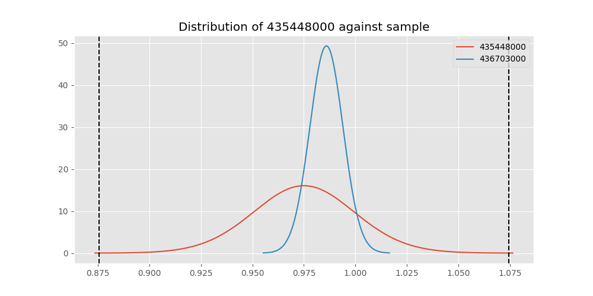

# Testing Results For 435448000 
$H_{0}$: There is not a difference in collection success against 435448000 
$H_{A}$: There is a difference in collection success against 435448000
An $\alpha$ of 0.00025 was used 
Out of 44 tests, there were 11 rejections from 44 independent-t test.
Out of 44 tests, there were 10 rejections from 44 Man Whitney u-tests.
## Testing Results for 435448000 against 436501000 
435448000 has a success rate of 0.975
436501000 has a success rate of 0.9854014598540146
$H_{0}$: There is not a difference between 435448000 and 436501000
$H_{A}$: There is a difference between 435448000 and 436501000
An $/alpha$ of 0.00025 was used in this test.
__independent t-testing__: With a t-statistic of -0.4460824357286487 and a p-value of 0.6560891344840865, _we failed to reject the null hypothssis_
__Man-Whitney testing__: With a u-statistic of 2711.5 and a p-value of 0.660475225800398, _we failed to reject the null hypothssis_
 
## Testing Results for 435448000 against 437375000 
435448000 has a success rate of 0.975
437375000 has a success rate of 0.9982014388489209
$H_{0}$: There is not a difference between 435448000 and 437375000
$H_{A}$: There is a difference between 435448000 and 437375000
An $/alpha$ of 0.00025 was used in this test.
__independent t-testing__: With a t-statistic of -0.9256651557877269 and a p-value of 0.36025473079089776, _we failed to reject the null hypothssis_
__Man-Whitney testing__: With a u-statistic of 10862.0 and a p-value of 0.01452794197874957, _we failed to reject the null hypothssis_
 
## Testing Results for 435448000 against 436500000 
435448000 has a success rate of 0.975
436500000 has a success rate of 0.9056603773584906
$H_{0}$: There is not a difference between 435448000 and 436500000
$H_{A}$: There is a difference between 435448000 and 436500000
An $/alpha$ of 0.00025 was used in this test.
__independent t-testing__: With a t-statistic of 1.4419072517184877 and a p-value of 0.15091637303666253, _we failed to reject the null hypothssis_
__Man-Whitney testing__: With a u-statistic of 3400.5 and a p-value of 0.15136311187863655, _we failed to reject the null hypothssis_
 
## Testing Results for 435448000 against 436990000 
435448000 has a success rate of 0.975
436990000 has a success rate of 0.9572649572649573
$H_{0}$: There is not a difference between 435448000 and 436990000
$H_{A}$: There is a difference between 435448000 and 436990000
An $/alpha$ of 0.00025 was used in this test.
__independent t-testing__: With a t-statistic of 0.5263825552122189 and a p-value of 0.5990513866558963, _we failed to reject the null hypothssis_
__Man-Whitney testing__: With a u-statistic of 4763.0 and a p-value of 0.6003441275441136, _we failed to reject the null hypothssis_
 
## Testing Results for 435448000 against 145875000 
435448000 has a success rate of 0.975
145875000 has a success rate of 0.9722222222222222
$H_{0}$: There is not a difference between 435448000 and 145875000
$H_{A}$: There is a difference between 435448000 and 145875000
An $/alpha$ of 0.00025 was used in this test.
__independent t-testing__: With a t-statistic of 0.0864631327094297 and a p-value of 0.9312554531522628, _we failed to reject the null hypothssis_
__Man-Whitney testing__: With a u-statistic of 1444.0 and a p-value of 0.9394224649795295, _we failed to reject the null hypothssis_
 
## Testing Results for 435448000 against 437800000 
435448000 has a success rate of 0.975
437800000 has a success rate of 0.9533678756476683
$H_{0}$: There is not a difference between 435448000 and 437800000
$H_{A}$: There is a difference between 435448000 and 437800000
An $/alpha$ of 0.00025 was used in this test.
__independent t-testing__: With a t-statistic of 0.6122283548886781 and a p-value of 0.5409888423563309, _we failed to reject the null hypothssis_
__Man-Whitney testing__: With a u-statistic of 3943.5 and a p-value of 0.5422699857031441, _we failed to reject the null hypothssis_
 
## Testing Results for 435448000 against 145810000 
435448000 has a success rate of 0.975
145810000 has a success rate of 0.12179487179487179
$H_{0}$: There is not a difference between 435448000 and 145810000
$H_{A}$: There is a difference between 435448000 and 145810000
An $/alpha$ of 0.00025 was used in this test.
__independent t-testing__: With a t-statistic of 15.955565349271188 and a p-value of 3.6906718281051344e-37, _we **reject** the null hypothssis_
__Man-Whitney testing__: With a u-statistic of 5782.0 and a p-value of 7.146847423778124e-26, _we **reject** the null hypothssis_
 
## Testing Results for 435448000 against 437095000 
435448000 has a success rate of 0.975
437095000 has a success rate of 0.9361702127659575
$H_{0}$: There is not a difference between 435448000 and 437095000
$H_{A}$: There is a difference between 435448000 and 437095000
An $/alpha$ of 0.00025 was used in this test.
__independent t-testing__: With a t-statistic of 0.8555517664590369 and a p-value of 0.39465101836393335, _we failed to reject the null hypothssis_
__Man-Whitney testing__: With a u-statistic of 976.5 and a p-value of 0.39802713845656934, _we failed to reject the null hypothssis_
 
## Testing Results for 435448000 against 437265000 
435448000 has a success rate of 0.975
437265000 has a success rate of 0.9795454545454545
$H_{0}$: There is not a difference between 435448000 and 437265000
$H_{A}$: There is a difference between 435448000 and 437265000
An $/alpha$ of 0.00025 was used in this test.
__independent t-testing__: With a t-statistic of -0.192316024865307 and a p-value of 0.8475763422180193, _we failed to reject the null hypothssis_
__Man-Whitney testing__: With a u-statistic of 8760.0 and a p-value of 0.8492282084680058, _we failed to reject the null hypothssis_
 
## Testing Results for 435448000 against 437350000 
435448000 has a success rate of 0.975
437350000 has a success rate of 0.9488372093023256
$H_{0}$: There is not a difference between 435448000 and 437350000
$H_{A}$: There is a difference between 435448000 and 437350000
An $/alpha$ of 0.00025 was used in this test.
__independent t-testing__: With a t-statistic of 0.7153829723664595 and a p-value of 0.47503209572956595, _we failed to reject the null hypothssis_
__Man-Whitney testing__: With a u-statistic of 4412.5 and a p-value of 0.47591446914946967, _we failed to reject the null hypothssis_
 
## Testing Results for 435448000 against 437200000 
435448000 has a success rate of 0.975
437200000 has a success rate of 0.8620689655172413
$H_{0}$: There is not a difference between 435448000 and 437200000
$H_{A}$: There is a difference between 435448000 and 437200000
An $/alpha$ of 0.00025 was used in this test.
__independent t-testing__: With a t-statistic of 2.022311276661539 and a p-value of 0.044248969657666885, _we failed to reject the null hypothssis_
__Man-Whitney testing__: With a u-statistic of 4518.5 and a p-value of 0.04471430020762128, _we failed to reject the null hypothssis_
 
## Testing Results for 435448000 against 435600000 
435448000 has a success rate of 0.975
435600000 has a success rate of 0.9819341126461212
$H_{0}$: There is not a difference between 435448000 and 435600000
$H_{A}$: There is a difference between 435448000 and 435600000
An $/alpha$ of 0.00025 was used in this test.
__independent t-testing__: With a t-statistic of -0.31972774361638245 and a p-value of 0.7492429431078851, _we failed to reject the null hypothssis_
__Man-Whitney testing__: With a u-statistic of 18689.5 and a p-value of 0.7499929022281241, _we failed to reject the null hypothssis_
 
## Testing Results for 435448000 against 450000000 
435448000 has a success rate of 0.975
450000000 has a success rate of 0.8235294117647058
$H_{0}$: There is not a difference between 435448000 and 450000000
$H_{A}$: There is a difference between 435448000 and 450000000
An $/alpha$ of 0.00025 was used in this test.
__independent t-testing__: With a t-statistic of 2.399848279436942 and a p-value of 0.017901550309158267, _we failed to reject the null hypothssis_
__Man-Whitney testing__: With a u-statistic of 1957.5 and a p-value of 0.018747933037299516, _we failed to reject the null hypothssis_
 
## Testing Results for 435448000 against 145978500 
435448000 has a success rate of 0.975
145978500 has a success rate of 0.9963636363636363
$H_{0}$: There is not a difference between 435448000 and 145978500
$H_{A}$: There is a difference between 435448000 and 145978500
An $/alpha$ of 0.00025 was used in this test.
__independent t-testing__: With a t-statistic of -0.8456465935704006 and a p-value of 0.40269849820894665, _we failed to reject the null hypothssis_
__Man-Whitney testing__: With a u-statistic of 5382.5 and a p-value of 0.1140734714564871, _we failed to reject the null hypothssis_
 
## Testing Results for 435448000 against 437050000 
435448000 has a success rate of 0.975
437050000 has a success rate of 0.5346534653465347
$H_{0}$: There is not a difference between 435448000 and 437050000
$H_{A}$: There is a difference between 435448000 and 437050000
An $/alpha$ of 0.00025 was used in this test.
__independent t-testing__: With a t-statistic of 5.439161666972271 and a p-value of 2.343112013968296e-07, _we **reject** the null hypothssis_
__Man-Whitney testing__: With a u-statistic of 2909.5 and a p-value of 7.275867692461915e-07, _we **reject** the null hypothssis_
 
## Testing Results for 435448000 against 435300000 
435448000 has a success rate of 0.975
435300000 has a success rate of 0.1232876712328767
$H_{0}$: There is not a difference between 435448000 and 435300000
$H_{A}$: There is a difference between 435448000 and 435300000
An $/alpha$ of 0.00025 was used in this test.
__independent t-testing__: With a t-statistic of 15.814990259720737 and a p-value of 3.896469272883989e-36, _we **reject** the null hypothssis_
__Man-Whitney testing__: With a u-statistic of 5407.0 and a p-value of 5.601895312512e-25, _we **reject** the null hypothssis_
 
## Testing Results for 435448000 against 437475000 
435448000 has a success rate of 0.975
437475000 has a success rate of 0.5045045045045045
$H_{0}$: There is not a difference between 435448000 and 437475000
$H_{A}$: There is a difference between 435448000 and 437475000
An $/alpha$ of 0.00025 was used in this test.
__independent t-testing__: With a t-statistic of 5.920811894179416 and a p-value of 5.4258777170276725e-09, _we **reject** the null hypothssis_
__Man-Whitney testing__: With a u-statistic of 16322.5 and a p-value of 8.53703160093022e-09, _we **reject** the null hypothssis_
 
## Testing Results for 435448000 against 437644000 
435448000 has a success rate of 0.975
437644000 has a success rate of 0.9743589743589743
$H_{0}$: There is not a difference between 435448000 and 437644000
$H_{A}$: There is a difference between 435448000 and 437644000
An $/alpha$ of 0.00025 was used in this test.
__independent t-testing__: With a t-statistic of 0.022069329993064504 and a p-value of 0.9824210367016513, _we failed to reject the null hypothssis_
__Man-Whitney testing__: With a u-statistic of 2341.5 and a p-value of 0.9882234535511243, _we failed to reject the null hypothssis_
 
## Testing Results for 435448000 against 145825000 
435448000 has a success rate of 0.975
145825000 has a success rate of 0.8687448728465955
$H_{0}$: There is not a difference between 435448000 and 145825000
$H_{A}$: There is a difference between 435448000 and 145825000
An $/alpha$ of 0.00025 was used in this test.
__independent t-testing__: With a t-statistic of 1.9858207517716155 and a p-value of 0.047163349947077854, _we failed to reject the null hypothssis_
__Man-Whitney testing__: With a u-statistic of 53941.0 and a p-value of 0.047205655564573894, _we failed to reject the null hypothssis_
 
## Testing Results for 435448000 against 437345000 
435448000 has a success rate of 0.975
437345000 has a success rate of 0.7603092783505154
$H_{0}$: There is not a difference between 435448000 and 437345000
$H_{A}$: There is a difference between 435448000 and 437345000
An $/alpha$ of 0.00025 was used in this test.
__independent t-testing__: With a t-statistic of 3.151604065296293 and a p-value of 0.0017384057946239731, _we failed to reject the null hypothssis_
__Man-Whitney testing__: With a u-statistic of 9426.0 and a p-value of 0.001819522579233822, _we failed to reject the null hypothssis_
 
## Testing Results for 435448000 against 435275000 
435448000 has a success rate of 0.975
435275000 has a success rate of 0.9152542372881356
$H_{0}$: There is not a difference between 435448000 and 435275000
$H_{A}$: There is a difference between 435448000 and 435275000
An $/alpha$ of 0.00025 was used in this test.
__independent t-testing__: With a t-statistic of 1.281621635401813 and a p-value of 0.20187702869159244, _we failed to reject the null hypothssis_
__Man-Whitney testing__: With a u-statistic of 2501.0 and a p-value of 0.2024963577509301, _we failed to reject the null hypothssis_
 
## Testing Results for 435448000 against 437322500 
435448000 has a success rate of 0.975
437322500 has a success rate of 0.9961685823754789
$H_{0}$: There is not a difference between 435448000 and 437322500
$H_{A}$: There is a difference between 435448000 and 437322500
An $/alpha$ of 0.00025 was used in this test.
__independent t-testing__: With a t-statistic of -0.8369711145416375 and a p-value of 0.4074786752588818, _we failed to reject the null hypothssis_
__Man-Whitney testing__: With a u-statistic of 5109.5 and a p-value of 0.12724804204905535, _we failed to reject the null hypothssis_
 
## Testing Results for 435448000 against 437450000 
435448000 has a success rate of 0.975
437450000 has a success rate of 0.6947791164658634
$H_{0}$: There is not a difference between 435448000 and 437450000
$H_{A}$: There is a difference between 435448000 and 437450000
An $/alpha$ of 0.00025 was used in this test.
__independent t-testing__: With a t-statistic of 3.800309885756527 and a p-value of 0.000176478147211619, _we **reject** the null hypothssis_
__Man-Whitney testing__: With a u-statistic of 6375.5 and a p-value of 0.0002045917949434687, _we **reject** the null hypothssis_
 
## Testing Results for 435448000 against 436703000 
435448000 has a success rate of 0.975
436703000 has a success rate of 0.9859154929577465
$H_{0}$: There is not a difference between 435448000 and 436703000
$H_{A}$: There is a difference between 435448000 and 436703000
An $/alpha$ of 0.00025 was used in this test.
__independent t-testing__: With a t-statistic of -0.5060480735209859 and a p-value of 0.6132670614569353, _we failed to reject the null hypothssis_
__Man-Whitney testing__: With a u-statistic of 4213.5 and a p-value of 0.616126761984603, _we failed to reject the null hypothssis_
 
## Testing Results for 435448000 against 400500000 
435448000 has a success rate of 0.975
400500000 has a success rate of 0.3508771929824561
$H_{0}$: There is not a difference between 435448000 and 400500000
$H_{A}$: There is a difference between 435448000 and 400500000
An $/alpha$ of 0.00025 was used in this test.
__independent t-testing__: With a t-statistic of 7.894239101123059 and a p-value of 5.025722266503209e-12, _we **reject** the null hypothssis_
__Man-Whitney testing__: With a u-statistic of 1851.5 and a p-value of 7.164993429543672e-10, _we **reject** the null hypothssis_
 
## Testing Results for 435448000 against 437150000 
435448000 has a success rate of 0.975
437150000 has a success rate of 0.9859550561797753
$H_{0}$: There is not a difference between 435448000 and 437150000
$H_{A}$: There is a difference between 435448000 and 437150000
An $/alpha$ of 0.00025 was used in this test.
__independent t-testing__: With a t-statistic of -0.5366219517797912 and a p-value of 0.5918316423157335, _we failed to reject the null hypothssis_
__Man-Whitney testing__: With a u-statistic of 7042.0 and a p-value of 0.5935745173835463, _we failed to reject the null hypothssis_
 
## Testing Results for 435448000 against 435635000 
435448000 has a success rate of 0.975
435635000 has a success rate of 0.9849624060150376
$H_{0}$: There is not a difference between 435448000 and 435635000
$H_{A}$: There is a difference between 435448000 and 435635000
An $/alpha$ of 0.00025 was used in this test.
__independent t-testing__: With a t-statistic of -0.42097659543242666 and a p-value of 0.6743007967256383, _we failed to reject the null hypothssis_
__Man-Whitney testing__: With a u-statistic of 2633.5 and a p-value of 0.6788557302849307, _we failed to reject the null hypothssis_
 
## Testing Results for 435448000 against 437384000 
435448000 has a success rate of 0.975
437384000 has a success rate of 0.968421052631579
$H_{0}$: There is not a difference between 435448000 and 437384000
$H_{A}$: There is a difference between 435448000 and 437384000
An $/alpha$ of 0.00025 was used in this test.
__independent t-testing__: With a t-statistic of 0.21921736041326173 and a p-value of 0.826676852572505, _we failed to reject the null hypothssis_
__Man-Whitney testing__: With a u-statistic of 3825.0 and a p-value of 0.8295482918313858, _we failed to reject the null hypothssis_
 
## Testing Results for 435448000 against 437405000 
435448000 has a success rate of 0.975
437405000 has a success rate of 0.9953917050691244
$H_{0}$: There is not a difference between 435448000 and 437405000
$H_{A}$: There is a difference between 435448000 and 437405000
An $/alpha$ of 0.00025 was used in this test.
__independent t-testing__: With a t-statistic of -0.8021541578149654 and a p-value of 0.4270131718515051, _we failed to reject the null hypothssis_
__Man-Whitney testing__: With a u-statistic of 4251.5 and a p-value of 0.18076429982916364, _we failed to reject the null hypothssis_
 
## Testing Results for 435448000 against 435612500 
435448000 has a success rate of 0.975
435612500 has a success rate of 0.9770114942528736
$H_{0}$: There is not a difference between 435448000 and 435612500
$H_{A}$: There is a difference between 435448000 and 435612500
An $/alpha$ of 0.00025 was used in this test.
__independent t-testing__: With a t-statistic of -0.06878601877957705 and a p-value of 0.9452698610196946, _we failed to reject the null hypothssis_
__Man-Whitney testing__: With a u-statistic of 1736.5 and a p-value of 0.9527978336059696, _we failed to reject the null hypothssis_
 
## Testing Results for 435448000 against 435975000 
435448000 has a success rate of 0.975
435975000 has a success rate of 0.92
$H_{0}$: There is not a difference between 435448000 and 435975000
$H_{A}$: There is a difference between 435448000 and 435975000
An $/alpha$ of 0.00025 was used in this test.
__independent t-testing__: With a t-statistic of 1.1272958962549842 and a p-value of 0.2626818072368071, _we failed to reject the null hypothssis_
__Man-Whitney testing__: With a u-statistic of 1055.0 and a p-value of 0.26469951332667463, _we failed to reject the null hypothssis_
 
## Testing Results for 435448000 against 437425000 
435448000 has a success rate of 0.975
437425000 has a success rate of 0.6987654320987654
$H_{0}$: There is not a difference between 435448000 and 437425000
$H_{A}$: There is a difference between 435448000 and 437425000
An $/alpha$ of 0.00025 was used in this test.
__independent t-testing__: With a t-statistic of 3.777829408470962 and a p-value of 0.0001798105283028228, _we **reject** the null hypothssis_
__Man-Whitney testing__: With a u-statistic of 10337.5 and a p-value of 0.00019783161584870592, _we **reject** the null hypothssis_
 
## Testing Results for 435448000 against 437275000 
435448000 has a success rate of 0.975
437275000 has a success rate of 0.3643724696356275
$H_{0}$: There is not a difference between 435448000 and 437275000
$H_{A}$: There is a difference between 435448000 and 437275000
An $/alpha$ of 0.00025 was used in this test.
__independent t-testing__: With a t-statistic of 7.929466357839373 and a p-value of 5.0271796388474927e-14, _we **reject** the null hypothssis_
__Man-Whitney testing__: With a u-statistic of 7956.5 and a p-value of 6.54736365861145e-13, _we **reject** the null hypothssis_
 
## Testing Results for 435448000 against 145840000 
435448000 has a success rate of 0.975
145840000 has a success rate of 0.9649122807017544
$H_{0}$: There is not a difference between 435448000 and 145840000
$H_{A}$: There is a difference between 435448000 and 145840000
An $/alpha$ of 0.00025 was used in this test.
__independent t-testing__: With a t-statistic of 0.2796896490565809 and a p-value of 0.7803236745721778, _we failed to reject the null hypothssis_
__Man-Whitney testing__: With a u-statistic of 1151.5 and a p-value of 0.7880659426029093, _we failed to reject the null hypothssis_
 
## Testing Results for 435448000 against 435525000 
435448000 has a success rate of 0.975
435525000 has a success rate of 0.6923076923076923
$H_{0}$: There is not a difference between 435448000 and 435525000
$H_{A}$: There is a difference between 435448000 and 435525000
An $/alpha$ of 0.00025 was used in this test.
__independent t-testing__: With a t-statistic of 3.792349795414212 and a p-value of 0.00020320910613451566, _we **reject** the null hypothssis_
__Man-Whitney testing__: With a u-statistic of 3668.5 and a p-value of 0.0002542784590900053, _we failed to reject the null hypothssis_
 
## Testing Results for 435448000 against 436250000 
435448000 has a success rate of 0.975
436250000 has a success rate of 0.17857142857142858
$H_{0}$: There is not a difference between 435448000 and 436250000
$H_{A}$: There is a difference between 435448000 and 436250000
An $/alpha$ of 0.00025 was used in this test.
__independent t-testing__: With a t-statistic of 12.304338595936656 and a p-value of 2.6884798019510634e-21, _we **reject** the null hypothssis_
__Man-Whitney testing__: With a u-statistic of 2012.0 and a p-value of 1.9876853032474988e-14, _we **reject** the null hypothssis_
 
## Testing Results for 435448000 against 435950000 
435448000 has a success rate of 0.975
435950000 has a success rate of 0.9850187265917603
$H_{0}$: There is not a difference between 435448000 and 435950000
$H_{A}$: There is a difference between 435448000 and 435950000
An $/alpha$ of 0.00025 was used in this test.
__independent t-testing__: With a t-statistic of -0.4911987589362405 and a p-value of 0.6234742851749792, _we failed to reject the null hypothssis_
__Man-Whitney testing__: With a u-statistic of 10573.0 and a p-value of 0.624680681910617, _we failed to reject the null hypothssis_
 
## Testing Results for 435448000 against 435800000 
435448000 has a success rate of 0.975
435800000 has a success rate of 0.5390070921985816
$H_{0}$: There is not a difference between 435448000 and 435800000
$H_{A}$: There is a difference between 435448000 and 435800000
An $/alpha$ of 0.00025 was used in this test.
__independent t-testing__: With a t-statistic of 5.426150862966885 and a p-value of 1.8506775091460947e-07, _we **reject** the null hypothssis_
__Man-Whitney testing__: With a u-statistic of 4049.5 and a p-value of 4.6476587402935034e-07, _we **reject** the null hypothssis_
 
## Testing Results for 435448000 against 437485000 
435448000 has a success rate of 0.975
437485000 has a success rate of 0.9375
$H_{0}$: There is not a difference between 435448000 and 437485000
$H_{A}$: There is a difference between 435448000 and 437485000
An $/alpha$ of 0.00025 was used in this test.
__independent t-testing__: With a t-statistic of 0.7836039099693783 and a p-value of 0.43591595950529194, _we failed to reject the null hypothssis_
__Man-Whitney testing__: With a u-statistic of 664.0 and a p-value of 0.4416719822773002, _we failed to reject the null hypothssis_
 
## Testing Results for 435448000 against 136770000 
435448000 has a success rate of 0.975
136770000 has a success rate of 0.9945945945945946
$H_{0}$: There is not a difference between 435448000 and 136770000
$H_{A}$: There is a difference between 435448000 and 136770000
An $/alpha$ of 0.00025 was used in this test.
__independent t-testing__: With a t-statistic of -0.7660813729123315 and a p-value of 0.44784115566070604, _we failed to reject the null hypothssis_
__Man-Whitney testing__: With a u-statistic of 3627.5 and a p-value of 0.23549448489320712, _we failed to reject the null hypothssis_
 
## Testing Results for 435448000 against 437250000 
435448000 has a success rate of 0.975
437250000 has a success rate of 0.9937106918238994
$H_{0}$: There is not a difference between 435448000 and 437250000
$H_{A}$: There is a difference between 435448000 and 437250000
An $/alpha$ of 0.00025 was used in this test.
__independent t-testing__: With a t-statistic of -1.2226255579446161 and a p-value of 0.22227995108724846, _we failed to reject the null hypothssis_
__Man-Whitney testing__: With a u-statistic of 6241.0 and a p-value of 0.2237390801371536, _we failed to reject the null hypothssis_
 
## Testing Results for 435448000 against 437356000 
435448000 has a success rate of 0.975
437356000 has a success rate of 0.9328358208955224
$H_{0}$: There is not a difference between 435448000 and 437356000
$H_{A}$: There is a difference between 435448000 and 437356000
An $/alpha$ of 0.00025 was used in this test.
__independent t-testing__: With a t-statistic of 1.002613948549382 and a p-value of 0.3174555865306647, _we failed to reject the null hypothssis_
__Man-Whitney testing__: With a u-statistic of 2793.0 and a p-value of 0.3182005661603432, _we failed to reject the null hypothssis_
 
## Testing Results for 435448000 against 437676000 
435448000 has a success rate of 0.975
437676000 has a success rate of 0.9813432835820896
$H_{0}$: There is not a difference between 435448000 and 437676000
$H_{A}$: There is a difference between 435448000 and 437676000
An $/alpha$ of 0.00025 was used in this test.
__independent t-testing__: With a t-statistic of -0.2699260716424988 and a p-value of 0.7873990728411352, _we failed to reject the null hypothssis_
__Man-Whitney testing__: With a u-statistic of 5326.0 and a p-value of 0.7899626790026407, _we failed to reject the null hypothssis_
 
## Testing Results for 435448000 against 145826800 
435448000 has a success rate of 0.975
145826800 has a success rate of 0.966183574879227
$H_{0}$: There is not a difference between 435448000 and 145826800
$H_{A}$: There is a difference between 435448000 and 145826800
An $/alpha$ of 0.00025 was used in this test.
__independent t-testing__: With a t-statistic of 0.28722345119730447 and a p-value of 0.7741840091493074, _we failed to reject the null hypothssis_
__Man-Whitney testing__: With a u-statistic of 4176.5 and a p-value of 0.7765493575379565, _we failed to reject the null hypothssis_
 
