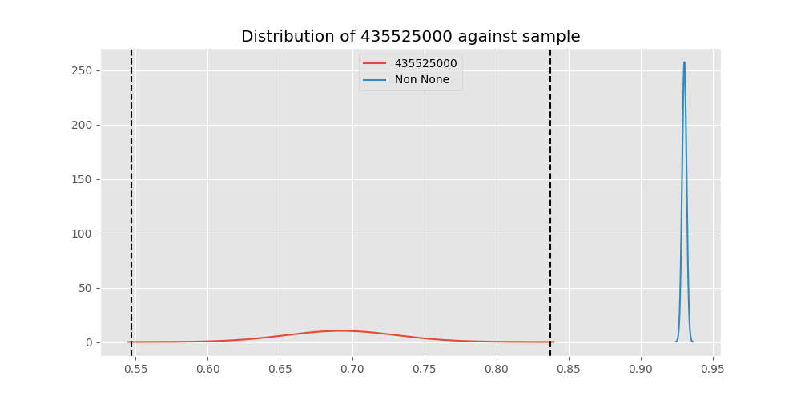
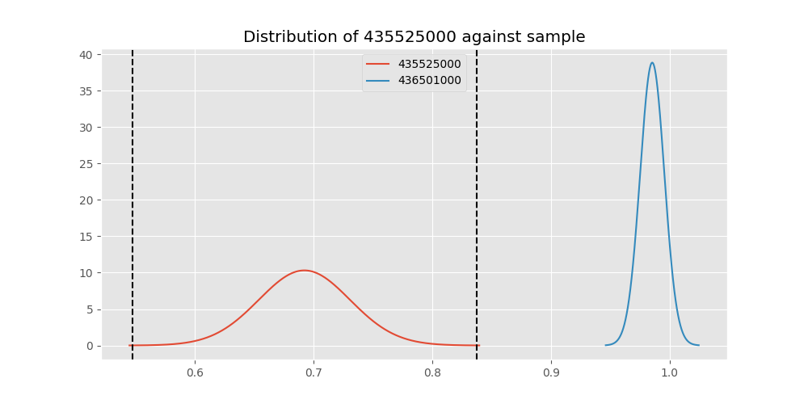
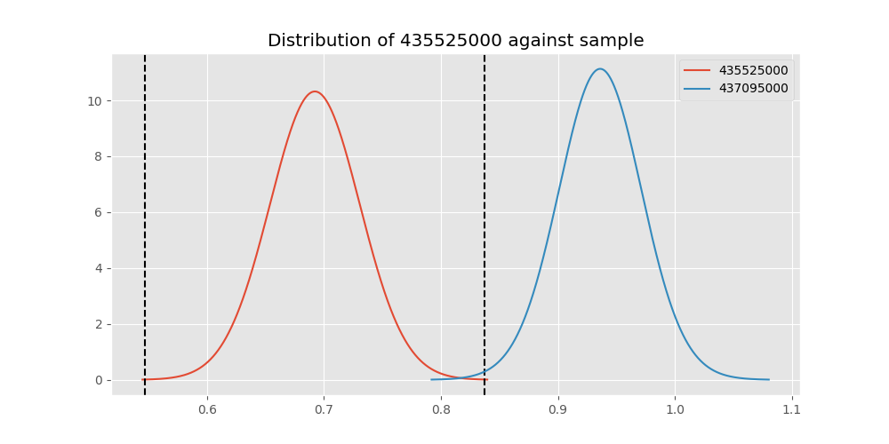
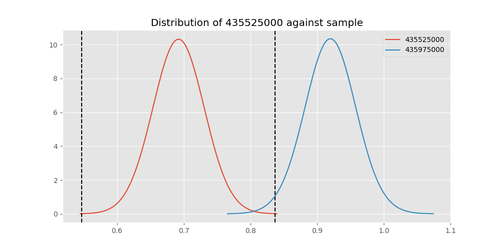

# Testing Results For 435525000 
$H_{0}$: There is not a difference in collection success against 435525000 
$H_{A}$: There is a difference in collection success against 435525000
An $\alpha$ of 0.00025 was used 
Out of 44 tests, there were 35 rejections from 44 independent-t test.
Out of 44 tests, there were 34 rejections from 44 Man Whitney u-tests.
## Testing Results for 435525000 against 436501000 
435525000 has a success rate of 0.6923076923076923
436501000 has a success rate of 0.9854014598540146
$H_{0}$: There is not a difference between 435525000 and 436501000
$H_{A}$: There is a difference between 435525000 and 436501000
An $/alpha$ of 0.00025 was used in this test.
__independent t-testing__: With a t-statistic of -7.3138712413705225 and a p-value of 1.1349878173596646e-11, _we **reject** the null hypothssis_
__Man-Whitney testing__: With a u-statistic of 6924.5 and a p-value of 4.015491322275257e-11, _we **reject** the null hypothssis_
 
## Testing Results for 435525000 against 437375000 
435525000 has a success rate of 0.6923076923076923
437375000 has a success rate of 0.9982014388489209
$H_{0}$: There is not a difference between 435525000 and 437375000
$H_{A}$: There is a difference between 435525000 and 437375000
An $/alpha$ of 0.00025 was used in this test.
__independent t-testing__: With a t-statistic of -7.889311926686921 and a p-value of 7.255197262055678e-13, _we **reject** the null hypothssis_
__Man-Whitney testing__: With a u-statistic of 27593.5 and a p-value of 2.9116333398858255e-40, _we **reject** the null hypothssis_
 
## Testing Results for 435525000 against 436500000 
435525000 has a success rate of 0.6923076923076923
436500000 has a success rate of 0.9056603773584906
$H_{0}$: There is not a difference between 435525000 and 436500000
$H_{A}$: There is a difference between 435525000 and 436500000
An $/alpha$ of 0.00025 was used in this test.
__independent t-testing__: With a t-statistic of -4.831326887878442 and a p-value of 2.1670132642201278e-06, _we **reject** the null hypothssis_
__Man-Whitney testing__: With a u-statistic of 8943.0 and a p-value of 3.1549560916255067e-06, _we **reject** the null hypothssis_
 
## Testing Results for 435525000 against 436990000 
435525000 has a success rate of 0.6923076923076923
436990000 has a success rate of 0.9572649572649573
$H_{0}$: There is not a difference between 435525000 and 436990000
$H_{A}$: There is a difference between 435525000 and 436990000
An $/alpha$ of 0.00025 was used in this test.
__independent t-testing__: With a t-statistic of -6.472585800087974 and a p-value of 9.284082420322217e-10, _we **reject** the null hypothssis_
__Man-Whitney testing__: With a u-statistic of 12298.0 and a p-value of 1.115986128548094e-12, _we **reject** the null hypothssis_
 
## Testing Results for 435525000 against 145875000 
435525000 has a success rate of 0.6923076923076923
145875000 has a success rate of 0.9722222222222222
$H_{0}$: There is not a difference between 435525000 and 145875000
$H_{A}$: There is a difference between 435525000 and 145875000
An $/alpha$ of 0.00025 was used in this test.
__independent t-testing__: With a t-statistic of -6.454899841983926 and a p-value of 8.187907429724134e-10, _we **reject** the null hypothssis_
__Man-Whitney testing__: With a u-statistic of 3707.0 and a p-value of 2.467601673282207e-06, _we **reject** the null hypothssis_
 
## Testing Results for 435525000 against 437800000 
435525000 has a success rate of 0.6923076923076923
437800000 has a success rate of 0.9533678756476683
$H_{0}$: There is not a difference between 435525000 and 437800000
$H_{A}$: There is a difference between 435525000 and 437800000
An $/alpha$ of 0.00025 was used in this test.
__independent t-testing__: With a t-statistic of -6.273464775403893 and a p-value of 2.4168650451643462e-09, _we **reject** the null hypothssis_
__Man-Whitney testing__: With a u-statistic of 10197.0 and a p-value of 9.133088403819401e-11, _we **reject** the null hypothssis_
 
## Testing Results for 435525000 against 145810000 
435525000 has a success rate of 0.6923076923076923
145810000 has a success rate of 0.12179487179487179
$H_{0}$: There is not a difference between 435525000 and 145810000
$H_{A}$: There is a difference between 435525000 and 145810000
An $/alpha$ of 0.00025 was used in this test.
__independent t-testing__: With a t-statistic of 12.368280252225853 and a p-value of 1.266643985846531e-28, _we **reject** the null hypothssis_
__Man-Whitney testing__: With a u-statistic of 17517.5 and a p-value of 7.934078311986573e-24, _we **reject** the null hypothssis_
 
## Testing Results for 435525000 against 437095000 
435525000 has a success rate of 0.6923076923076923
437095000 has a success rate of 0.9361702127659575
$H_{0}$: There is not a difference between 435525000 and 437095000
$H_{A}$: There is a difference between 435525000 and 437095000
An $/alpha$ of 0.00025 was used in this test.
__independent t-testing__: With a t-statistic of -3.447763035302205 and a p-value of 0.0006974860581619776, _we failed to reject the null hypothssis_
__Man-Whitney testing__: With a u-statistic of 2541.0 and a p-value of 0.0008066292915244, _we failed to reject the null hypothssis_
 
## Testing Results for 435525000 against 437265000 
435525000 has a success rate of 0.6923076923076923
437265000 has a success rate of 0.9795454545454545
$H_{0}$: There is not a difference between 435525000 and 437265000
$H_{A}$: There is a difference between 435525000 and 437265000
An $/alpha$ of 0.00025 was used in this test.
__independent t-testing__: With a t-statistic of -7.30583291019404 and a p-value of 1.491360419213893e-11, _we **reject** the null hypothssis_
__Man-Whitney testing__: With a u-statistic of 22423.5 and a p-value of 3.379396098481173e-25, _we **reject** the null hypothssis_
 
## Testing Results for 435525000 against 437350000 
435525000 has a success rate of 0.6923076923076923
437350000 has a success rate of 0.9488372093023256
$H_{0}$: There is not a difference between 435525000 and 437350000
$H_{A}$: There is a difference between 435525000 and 437350000
An $/alpha$ of 0.00025 was used in this test.
__independent t-testing__: With a t-statistic of -6.1729783223178725 and a p-value of 4.1268499068032715e-09, _we **reject** the null hypothssis_
__Man-Whitney testing__: With a u-statistic of 11429.0 and a p-value of 4.6212632570660546e-11, _we **reject** the null hypothssis_
 
## Testing Results for 435525000 against 437200000 
435525000 has a success rate of 0.6923076923076923
437200000 has a success rate of 0.8620689655172413
$H_{0}$: There is not a difference between 435525000 and 437200000
$H_{A}$: There is a difference between 435525000 and 437200000
An $/alpha$ of 0.00025 was used in this test.
__independent t-testing__: With a t-statistic of -3.9030275953421714 and a p-value of 0.00011430495287710721, _we **reject** the null hypothssis_
__Man-Whitney testing__: With a u-statistic of 12050.5 and a p-value of 0.00013122577531107774, _we **reject** the null hypothssis_
 
## Testing Results for 435525000 against 435600000 
435525000 has a success rate of 0.6923076923076923
435600000 has a success rate of 0.9819341126461212
$H_{0}$: There is not a difference between 435525000 and 435600000
$H_{A}$: There is a difference between 435525000 and 435600000
An $/alpha$ of 0.00025 was used in this test.
__independent t-testing__: With a t-statistic of -7.431213566642037 and a p-value of 8.432248828577915e-12, _we **reject** the null hypothssis_
__Man-Whitney testing__: With a u-statistic of 47795.0 and a p-value of 1.650865566824321e-44, _we **reject** the null hypothssis_
 
## Testing Results for 435525000 against 450000000 
435525000 has a success rate of 0.6923076923076923
450000000 has a success rate of 0.8235294117647058
$H_{0}$: There is not a difference between 435525000 and 450000000
$H_{A}$: There is a difference between 435525000 and 450000000
An $/alpha$ of 0.00025 was used in this test.
__independent t-testing__: With a t-statistic of -2.201276852855508 and a p-value of 0.0287282074967874, _we failed to reject the null hypothssis_
__Man-Whitney testing__: With a u-statistic of 5280.0 and a p-value of 0.029146755583976454, _we failed to reject the null hypothssis_
 
## Testing Results for 435525000 against 145978500 
435525000 has a success rate of 0.6923076923076923
145978500 has a success rate of 0.9963636363636363
$H_{0}$: There is not a difference between 435525000 and 145978500
$H_{A}$: There is a difference between 435525000 and 145978500
An $/alpha$ of 0.00025 was used in this test.
__independent t-testing__: With a t-statistic of -7.8159913977061315 and a p-value of 1.0327901337387495e-12, _we **reject** the null hypothssis_
__Man-Whitney testing__: With a u-statistic of 13684.0 and a p-value of 2.0400752477167463e-21, _we **reject** the null hypothssis_
 
## Testing Results for 435525000 against 437050000 
435525000 has a success rate of 0.6923076923076923
437050000 has a success rate of 0.5346534653465347
$H_{0}$: There is not a difference between 435525000 and 437050000
$H_{A}$: There is a difference between 435525000 and 437050000
An $/alpha$ of 0.00025 was used in this test.
__independent t-testing__: With a t-statistic of 2.5307414369099046 and a p-value of 0.012017072236844223, _we failed to reject the null hypothssis_
__Man-Whitney testing__: With a u-statistic of 8360.0 and a p-value of 0.012350804870275877, _we failed to reject the null hypothssis_
 
## Testing Results for 435525000 against 435300000 
435525000 has a success rate of 0.6923076923076923
435300000 has a success rate of 0.1232876712328767
$H_{0}$: There is not a difference between 435525000 and 435300000
$H_{A}$: There is a difference between 435525000 and 435300000
An $/alpha$ of 0.00025 was used in this test.
__independent t-testing__: With a t-statistic of 12.048806339801658 and a p-value of 2.4869106742381592e-27, _we **reject** the null hypothssis_
__Man-Whitney testing__: With a u-statistic of 16379.0 and a p-value of 7.956472576029732e-23, _we **reject** the null hypothssis_
 
## Testing Results for 435525000 against 437475000 
435525000 has a success rate of 0.6923076923076923
437475000 has a success rate of 0.5045045045045045
$H_{0}$: There is not a difference between 435525000 and 437475000
$H_{A}$: There is a difference between 435525000 and 437475000
An $/alpha$ of 0.00025 was used in this test.
__independent t-testing__: With a t-statistic of 4.061569073100417 and a p-value of 5.428701773475658e-05, _we **reject** the null hypothssis_
__Man-Whitney testing__: With a u-statistic of 47135.0 and a p-value of 5.897161479627467e-05, _we **reject** the null hypothssis_
 
## Testing Results for 435525000 against 435448000 
435525000 has a success rate of 0.6923076923076923
435448000 has a success rate of 0.975
$H_{0}$: There is not a difference between 435525000 and 435448000
$H_{A}$: There is a difference between 435525000 and 435448000
An $/alpha$ of 0.00025 was used in this test.
__independent t-testing__: With a t-statistic of -6.132276799489525 and a p-value of 5.623011334609063e-09, _we **reject** the null hypothssis_
__Man-Whitney testing__: With a u-statistic of 2051.5 and a p-value of 0.0002542784590900053, _we failed to reject the null hypothssis_
 
## Testing Results for 435525000 against 437644000 
435525000 has a success rate of 0.6923076923076923
437644000 has a success rate of 0.9743589743589743
$H_{0}$: There is not a difference between 435525000 and 437644000
$H_{A}$: There is a difference between 435525000 and 437644000
An $/alpha$ of 0.00025 was used in this test.
__independent t-testing__: With a t-statistic of -6.809773175565572 and a p-value of 1.3907220301834092e-10, _we **reject** the null hypothssis_
__Man-Whitney testing__: With a u-statistic of 6006.0 and a p-value of 4.440380795410864e-09, _we **reject** the null hypothssis_
 
## Testing Results for 435525000 against 145825000 
435525000 has a success rate of 0.6923076923076923
145825000 has a success rate of 0.8687448728465955
$H_{0}$: There is not a difference between 435525000 and 145825000
$H_{A}$: There is a difference between 435525000 and 145825000
An $/alpha$ of 0.00025 was used in this test.
__independent t-testing__: With a t-statistic of -5.9293528036423115 and a p-value of 3.447738373950385e-09, _we **reject** the null hypothssis_
__Man-Whitney testing__: With a u-statistic of 143561.0 and a p-value of 3.852794876218065e-09, _we **reject** the null hypothssis_
 
## Testing Results for 435525000 against 437345000 
435525000 has a success rate of 0.6923076923076923
437345000 has a success rate of 0.7603092783505154
$H_{0}$: There is not a difference between 435525000 and 437345000
$H_{A}$: There is a difference between 435525000 and 437345000
An $/alpha$ of 0.00025 was used in this test.
__independent t-testing__: With a t-statistic of -1.5894869892642773 and a p-value of 0.11254792245420644, _we failed to reject the null hypothssis_
__Man-Whitney testing__: With a u-statistic of 25855.5 and a p-value of 0.11256196275489871, _we failed to reject the null hypothssis_
 
## Testing Results for 435525000 against 435275000 
435525000 has a success rate of 0.6923076923076923
435275000 has a success rate of 0.9152542372881356
$H_{0}$: There is not a difference between 435525000 and 435275000
$H_{A}$: There is a difference between 435525000 and 435275000
An $/alpha$ of 0.00025 was used in this test.
__independent t-testing__: With a t-statistic of -4.583683322694267 and a p-value of 7.112558419038525e-06, _we **reject** the null hypothssis_
__Man-Whitney testing__: With a u-statistic of 6556.0 and a p-value of 1.006866103987255e-05, _we **reject** the null hypothssis_
 
## Testing Results for 435525000 against 437322500 
435525000 has a success rate of 0.6923076923076923
437322500 has a success rate of 0.9961685823754789
$H_{0}$: There is not a difference between 435525000 and 437322500
$H_{A}$: There is a difference between 435525000 and 437322500
An $/alpha$ of 0.00025 was used in this test.
__independent t-testing__: With a t-statistic of -7.80722100468144 and a p-value of 1.0760315608249178e-12, _we **reject** the null hypothssis_
__Man-Whitney testing__: With a u-statistic of 12991.0 and a p-value of 1.8451057155844808e-20, _we **reject** the null hypothssis_
 
## Testing Results for 435525000 against 437450000 
435525000 has a success rate of 0.6923076923076923
437450000 has a success rate of 0.6947791164658634
$H_{0}$: There is not a difference between 435525000 and 437450000
$H_{A}$: There is a difference between 435525000 and 437450000
An $/alpha$ of 0.00025 was used in this test.
__independent t-testing__: With a t-statistic of -0.05097692741383586 and a p-value of 0.9593700041841787, _we failed to reject the null hypothssis_
__Man-Whitney testing__: With a u-statistic of 17759.5 and a p-value of 0.959754192936897, _we failed to reject the null hypothssis_
 
## Testing Results for 435525000 against 436703000 
435525000 has a success rate of 0.6923076923076923
436703000 has a success rate of 0.9859154929577465
$H_{0}$: There is not a difference between 435525000 and 436703000
$H_{A}$: There is a difference between 435525000 and 436703000
An $/alpha$ of 0.00025 was used in this test.
__independent t-testing__: With a t-statistic of -7.42033695951311 and a p-value of 7.298137539490905e-12, _we **reject** the null hypothssis_
__Man-Whitney testing__: With a u-statistic of 10758.0 and a p-value of 1.1418771405191782e-15, _we **reject** the null hypothssis_
 
## Testing Results for 435525000 against 400500000 
435525000 has a success rate of 0.6923076923076923
400500000 has a success rate of 0.3508771929824561
$H_{0}$: There is not a difference between 435525000 and 400500000
$H_{A}$: There is a difference between 435525000 and 400500000
An $/alpha$ of 0.00025 was used in this test.
__independent t-testing__: With a t-statistic of 4.653293881629137 and a p-value of 5.970643028889809e-06, _we **reject** the null hypothssis_
__Man-Whitney testing__: With a u-statistic of 5467.0 and a p-value of 9.531510017577813e-06, _we **reject** the null hypothssis_
 
## Testing Results for 435525000 against 437150000 
435525000 has a success rate of 0.6923076923076923
437150000 has a success rate of 0.9859550561797753
$H_{0}$: There is not a difference between 435525000 and 437150000
$H_{A}$: There is a difference between 435525000 and 437150000
An $/alpha$ of 0.00025 was used in this test.
__independent t-testing__: With a t-statistic of -7.484936018216498 and a p-value of 5.718998870385191e-12, _we **reject** the null hypothssis_
__Man-Whitney testing__: With a u-statistic of 17979.5 and a p-value of 2.3657385850444112e-23, _we **reject** the null hypothssis_
 
## Testing Results for 435525000 against 435635000 
435525000 has a success rate of 0.6923076923076923
435635000 has a success rate of 0.9849624060150376
$H_{0}$: There is not a difference between 435525000 and 435635000
$H_{A}$: There is a difference between 435525000 and 435635000
An $/alpha$ of 0.00025 was used in this test.
__independent t-testing__: With a t-statistic of -7.288331904017948 and a p-value of 1.2805306865430292e-11, _we **reject** the null hypothssis_
__Man-Whitney testing__: With a u-statistic of 6726.5 and a p-value of 7.732617865466767e-11, _we **reject** the null hypothssis_
 
## Testing Results for 435525000 against 437384000 
435525000 has a success rate of 0.6923076923076923
437384000 has a success rate of 0.968421052631579
$H_{0}$: There is not a difference between 435525000 and 437384000
$H_{A}$: There is a difference between 435525000 and 437384000
An $/alpha$ of 0.00025 was used in this test.
__independent t-testing__: With a t-statistic of -6.772993527015917 and a p-value of 1.8980079383869212e-10, _we **reject** the null hypothssis_
__Man-Whitney testing__: With a u-statistic of 9834.0 and a p-value of 3.157719661120464e-12, _we **reject** the null hypothssis_
 
## Testing Results for 435525000 against 437405000 
435525000 has a success rate of 0.6923076923076923
437405000 has a success rate of 0.9953917050691244
$H_{0}$: There is not a difference between 435525000 and 437405000
$H_{A}$: There is a difference between 435525000 and 437405000
An $/alpha$ of 0.00025 was used in this test.
__independent t-testing__: With a t-statistic of -7.770461858929185 and a p-value of 1.2756468689246053e-12, _we **reject** the null hypothssis_
__Man-Whitney testing__: With a u-statistic of 10813.0 and a p-value of 1.967019053266541e-17, _we **reject** the null hypothssis_
 
## Testing Results for 435525000 against 435612500 
435525000 has a success rate of 0.6923076923076923
435612500 has a success rate of 0.9770114942528736
$H_{0}$: There is not a difference between 435525000 and 435612500
$H_{A}$: There is a difference between 435525000 and 435612500
An $/alpha$ of 0.00025 was used in this test.
__independent t-testing__: With a t-statistic of -6.7838783891231085 and a p-value of 1.5049154994738758e-10, _we **reject** the null hypothssis_
__Man-Whitney testing__: With a u-statistic of 4449.5 and a p-value of 1.7710068730843217e-07, _we **reject** the null hypothssis_
 
## Testing Results for 435525000 against 435975000 
435525000 has a success rate of 0.6923076923076923
435975000 has a success rate of 0.92
$H_{0}$: There is not a difference between 435525000 and 435975000
$H_{A}$: There is a difference between 435525000 and 435975000
An $/alpha$ of 0.00025 was used in this test.
__independent t-testing__: With a t-statistic of -3.2779163403948575 and a p-value of 0.0012424113473787969, _we failed to reject the null hypothssis_
__Man-Whitney testing__: With a u-statistic of 2761.0 and a p-value of 0.001394404119060941, _we failed to reject the null hypothssis_
 
## Testing Results for 435525000 against 437425000 
435525000 has a success rate of 0.6923076923076923
437425000 has a success rate of 0.6987654320987654
$H_{0}$: There is not a difference between 435525000 and 437425000
$H_{A}$: There is a difference between 435525000 and 437425000
An $/alpha$ of 0.00025 was used in this test.
__independent t-testing__: With a t-statistic of -0.14420985442948378 and a p-value of 0.8853879709575785, _we failed to reject the null hypothssis_
__Man-Whitney testing__: With a u-statistic of 28770.5 and a p-value of 0.8855374476688884, _we failed to reject the null hypothssis_
 
## Testing Results for 435525000 against 437275000 
435525000 has a success rate of 0.6923076923076923
437275000 has a success rate of 0.3643724696356275
$H_{0}$: There is not a difference between 435525000 and 437275000
$H_{A}$: There is a difference between 435525000 and 437275000
An $/alpha$ of 0.00025 was used in this test.
__independent t-testing__: With a t-statistic of 6.565495842725658 and a p-value of 1.6667157052209486e-10, _we **reject** the null hypothssis_
__Man-Whitney testing__: With a u-statistic of 23452.0 and a p-value of 4.486199680072779e-10, _we **reject** the null hypothssis_
 
## Testing Results for 435525000 against 145840000 
435525000 has a success rate of 0.6923076923076923
145840000 has a success rate of 0.9649122807017544
$H_{0}$: There is not a difference between 435525000 and 145840000
$H_{A}$: There is a difference between 435525000 and 145840000
An $/alpha$ of 0.00025 was used in this test.
__independent t-testing__: With a t-statistic of -5.942064694301762 and a p-value of 1.2488455156380189e-08, _we **reject** the null hypothssis_
__Man-Whitney testing__: With a u-statistic of 2964.5 and a p-value of 3.7370705534312e-05, _we **reject** the null hypothssis_
 
## Testing Results for 435525000 against 436250000 
435525000 has a success rate of 0.6923076923076923
436250000 has a success rate of 0.17857142857142858
$H_{0}$: There is not a difference between 435525000 and 436250000
$H_{A}$: There is a difference between 435525000 and 436250000
An $/alpha$ of 0.00025 was used in this test.
__independent t-testing__: With a t-statistic of 7.35510778392421 and a p-value of 5.015346108277235e-12, _we **reject** the null hypothssis_
__Man-Whitney testing__: With a u-statistic of 6061.0 and a p-value of 6.589136954895015e-11, _we **reject** the null hypothssis_
 
## Testing Results for 435525000 against 435950000 
435525000 has a success rate of 0.6923076923076923
435950000 has a success rate of 0.9850187265917603
$H_{0}$: There is not a difference between 435525000 and 435950000
$H_{A}$: There is a difference between 435525000 and 435950000
An $/alpha$ of 0.00025 was used in this test.
__independent t-testing__: With a t-statistic of -7.488661910911219 and a p-value of 5.901827464596247e-12, _we **reject** the null hypothssis_
__Man-Whitney testing__: With a u-statistic of 27005.0 and a p-value of 1.9208544701241487e-31, _we **reject** the null hypothssis_
 
## Testing Results for 435525000 against 435800000 
435525000 has a success rate of 0.6923076923076923
435800000 has a success rate of 0.5390070921985816
$H_{0}$: There is not a difference between 435525000 and 435800000
$H_{A}$: There is a difference between 435525000 and 435800000
An $/alpha$ of 0.00025 was used in this test.
__independent t-testing__: With a t-statistic of 2.6802549814616903 and a p-value of 0.007789462761903234, _we failed to reject the null hypothssis_
__Man-Whitney testing__: With a u-statistic of 11627.0 and a p-value of 0.008035234167796664, _we failed to reject the null hypothssis_
 
## Testing Results for 435525000 against 437485000 
435525000 has a success rate of 0.6923076923076923
437485000 has a success rate of 0.9375
$H_{0}$: There is not a difference between 435525000 and 437485000
$H_{A}$: There is a difference between 435525000 and 437485000
An $/alpha$ of 0.00025 was used in this test.
__independent t-testing__: With a t-statistic of -2.900060861628069 and a p-value of 0.004215198477039225, _we failed to reject the null hypothssis_
__Man-Whitney testing__: With a u-statistic of 1727.0 and a p-value of 0.004544268019582329, _we failed to reject the null hypothssis_
 
## Testing Results for 435525000 against 136770000 
435525000 has a success rate of 0.6923076923076923
136770000 has a success rate of 0.9945945945945946
$H_{0}$: There is not a difference between 435525000 and 136770000
$H_{A}$: There is a difference between 435525000 and 136770000
An $/alpha$ of 0.00025 was used in this test.
__independent t-testing__: With a t-statistic of -7.729774438124499 and a p-value of 1.5364710106360551e-12, _we **reject** the null hypothssis_
__Man-Whitney testing__: With a u-statistic of 9229.0 and a p-value of 3.337591357222225e-15, _we **reject** the null hypothssis_
 
## Testing Results for 435525000 against 437250000 
435525000 has a success rate of 0.6923076923076923
437250000 has a success rate of 0.9937106918238994
$H_{0}$: There is not a difference between 435525000 and 437250000
$H_{A}$: There is a difference between 435525000 and 437250000
An $/alpha$ of 0.00025 was used in this test.
__independent t-testing__: With a t-statistic of -7.731229925498634 and a p-value of 1.6001559096404176e-12, _we **reject** the null hypothssis_
__Man-Whitney testing__: With a u-statistic of 15884.0 and a p-value of 1.93374852701727e-23, _we **reject** the null hypothssis_
 
## Testing Results for 435525000 against 437356000 
435525000 has a success rate of 0.6923076923076923
437356000 has a success rate of 0.9328358208955224
$H_{0}$: There is not a difference between 435525000 and 437356000
$H_{A}$: There is a difference between 435525000 and 437356000
An $/alpha$ of 0.00025 was used in this test.
__independent t-testing__: With a t-statistic of -5.322035643810586 and a p-value of 2.1316869484675578e-07, _we **reject** the null hypothssis_
__Man-Whitney testing__: With a u-statistic of 7276.5 and a p-value of 3.863401813494167e-07, _we **reject** the null hypothssis_
 
## Testing Results for 435525000 against 437676000 
435525000 has a success rate of 0.6923076923076923
437676000 has a success rate of 0.9813432835820896
$H_{0}$: There is not a difference between 435525000 and 437676000
$H_{A}$: There is a difference between 435525000 and 437676000
An $/alpha$ of 0.00025 was used in this test.
__independent t-testing__: With a t-statistic of -7.297629854433252 and a p-value of 1.4224017893539944e-11, _we **reject** the null hypothssis_
__Man-Whitney testing__: With a u-statistic of 13623.5 and a p-value of 7.850535103348588e-18, _we **reject** the null hypothssis_
 
## Testing Results for 435525000 against 145826800 
435525000 has a success rate of 0.6923076923076923
145826800 has a success rate of 0.966183574879227
$H_{0}$: There is not a difference between 435525000 and 145826800
$H_{A}$: There is a difference between 435525000 and 145826800
An $/alpha$ of 0.00025 was used in this test.
__independent t-testing__: With a t-statistic of -6.724589584935384 and a p-value of 2.4871454443029367e-10, _we **reject** the null hypothssis_
__Man-Whitney testing__: With a u-statistic of 10747.0 and a p-value of 1.0210826189900724e-12, _we **reject** the null hypothssis_
 
