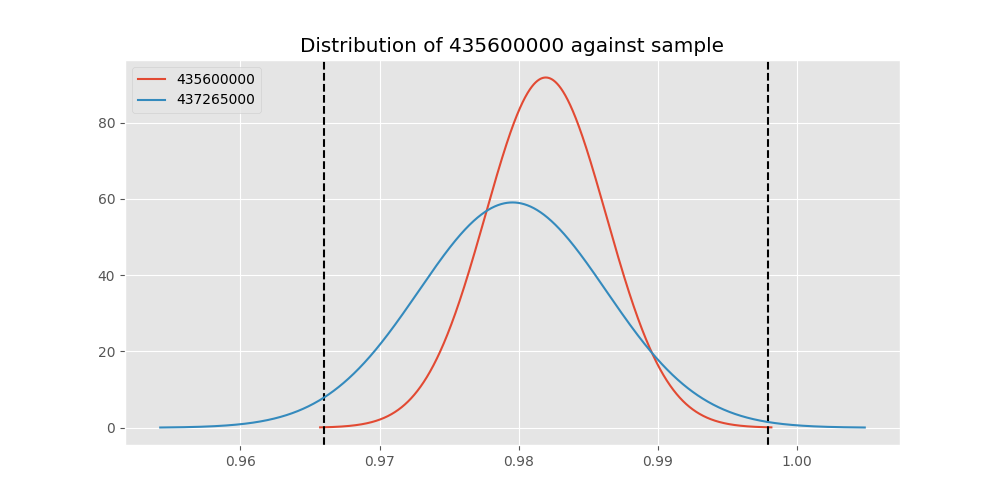
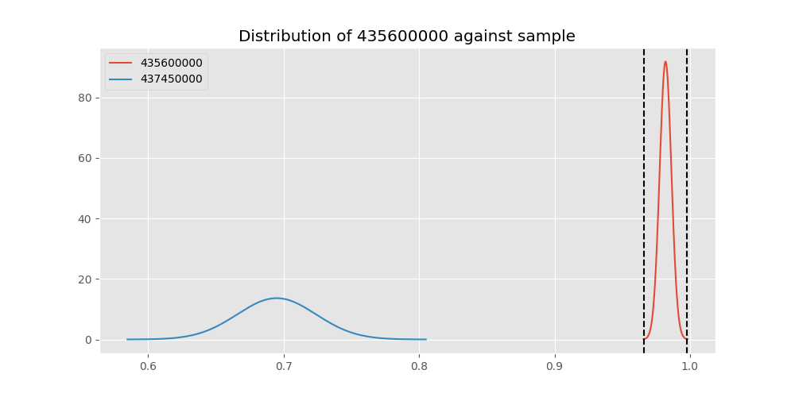

# Testing Results For 435600000 
$H_{0}$: There is not a difference in collection success against 435600000 
$H_{A}$: There is a difference in collection success against 435600000
An $\alpha$ of 0.00025 was used 
Out of 44 tests, there were 17 rejections from 44 independent-t test.
Out of 44 tests, there were 17 rejections from 44 Man Whitney u-tests.
## Testing Results for 435600000 against 436501000 
435600000 has a success rate of 0.9819341126461212
436501000 has a success rate of 0.9854014598540146
$H_{0}$: There is not a difference between 435600000 and 436501000
$H_{A}$: There is a difference between 435600000 and 436501000
An $/alpha$ of 0.00025 was used in this test.
__independent t-testing__: With a t-statistic of -0.28790586381200023 and a p-value of 0.7734742415598961, _we failed to reject the null hypothssis_
__Man-Whitney testing__: With a u-statistic of 64235.0 and a p-value of 0.7738181846047785, _we failed to reject the null hypothssis_
 
## Testing Results for 435600000 against 437375000 
435600000 has a success rate of 0.9819341126461212
437375000 has a success rate of 0.9982014388489209
$H_{0}$: There is not a difference between 435600000 and 437375000
$H_{A}$: There is a difference between 435600000 and 437375000
An $/alpha$ of 0.00025 was used in this test.
__independent t-testing__: With a t-statistic of -3.4598301703554504 and a p-value of 0.0005590390281163981, _we failed to reject the null hypothssis_
__Man-Whitney testing__: With a u-statistic of 257342.5 and a p-value of 0.005287704576450585, _we failed to reject the null hypothssis_
 
## Testing Results for 435600000 against 436500000 
435600000 has a success rate of 0.9819341126461212
436500000 has a success rate of 0.9056603773584906
$H_{0}$: There is not a difference between 435600000 and 436500000
$H_{A}$: There is a difference between 435600000 and 436500000
An $/alpha$ of 0.00025 was used in this test.
__independent t-testing__: With a t-statistic of 5.356870678343494 and a p-value of 1.0311431728623152e-07, _we **reject** the null hypothssis_
__Man-Whitney testing__: With a u-statistic of 80515.5 and a p-value of 1.222113994394098e-07, _we **reject** the null hypothssis_
 
## Testing Results for 435600000 against 436990000 
435600000 has a success rate of 0.9819341126461212
436990000 has a success rate of 0.9572649572649573
$H_{0}$: There is not a difference between 435600000 and 436990000
$H_{A}$: There is a difference between 435600000 and 436990000
An $/alpha$ of 0.00025 was used in this test.
__independent t-testing__: With a t-statistic of 2.2568048866062385 and a p-value of 0.024203678913684946, _we failed to reject the null hypothssis_
__Man-Whitney testing__: With a u-statistic of 112813.0 and a p-value of 0.024292825721962005, _we failed to reject the null hypothssis_
 
## Testing Results for 435600000 against 145875000 
435600000 has a success rate of 0.9819341126461212
145875000 has a success rate of 0.9722222222222222
$H_{0}$: There is not a difference between 435600000 and 145875000
$H_{A}$: There is a difference between 435600000 and 145875000
An $/alpha$ of 0.00025 was used in this test.
__independent t-testing__: With a t-statistic of 0.5849838911693713 and a p-value of 0.5586890784857165, _we failed to reject the null hypothssis_
__Man-Whitney testing__: With a u-statistic of 34205.0 and a p-value of 0.5590287306295486, _we failed to reject the null hypothssis_
 
## Testing Results for 435600000 against 437800000 
435600000 has a success rate of 0.9819341126461212
437800000 has a success rate of 0.9533678756476683
$H_{0}$: There is not a difference between 435600000 and 437800000
$H_{A}$: There is a difference between 435600000 and 437800000
An $/alpha$ of 0.00025 was used in this test.
__independent t-testing__: With a t-statistic of 2.4194304897189287 and a p-value of 0.015701626377131815, _we failed to reject the null hypothssis_
__Man-Whitney testing__: With a u-statistic of 93400.5 and a p-value of 0.015787149616796562, _we failed to reject the null hypothssis_
 
## Testing Results for 435600000 against 145810000 
435600000 has a success rate of 0.9819341126461212
145810000 has a success rate of 0.12179487179487179
$H_{0}$: There is not a difference between 435600000 and 145810000
$H_{A}$: There is a difference between 435600000 and 145810000
An $/alpha$ of 0.00025 was used in this test.
__independent t-testing__: With a t-statistic of 56.989442127629204 and a p-value of 0.0, _we **reject** the null hypothssis_
__Man-Whitney testing__: With a u-statistic of 136530.5 and a p-value of 2.8979616212329984e-180, _we **reject** the null hypothssis_
 
## Testing Results for 435600000 against 437095000 
435600000 has a success rate of 0.9819341126461212
437095000 has a success rate of 0.9361702127659575
$H_{0}$: There is not a difference between 435600000 and 437095000
$H_{A}$: There is a difference between 435600000 and 437095000
An $/alpha$ of 0.00025 was used in this test.
__independent t-testing__: With a t-statistic of 2.177178127704237 and a p-value of 0.029703843292978992, _we failed to reject the null hypothssis_
__Man-Whitney testing__: With a u-statistic of 23125.5 and a p-value of 0.029856334004650733, _we failed to reject the null hypothssis_
 
## Testing Results for 435600000 against 437265000 
435600000 has a success rate of 0.9819341126461212
437265000 has a success rate of 0.9795454545454545
$H_{0}$: There is not a difference between 435600000 and 437265000
$H_{A}$: There is a difference between 435600000 and 437265000
An $/alpha$ of 0.00025 was used in this test.
__independent t-testing__: With a t-statistic of 0.30409936595996 and a p-value of 0.7610980695193612, _we failed to reject the null hypothssis_
__Man-Whitney testing__: With a u-statistic of 207514.5 and a p-value of 0.7612103066998355, _we failed to reject the null hypothssis_
 
## Testing Results for 435600000 against 437350000 
435600000 has a success rate of 0.9819341126461212
437350000 has a success rate of 0.9488372093023256
$H_{0}$: There is not a difference between 435600000 and 437350000
$H_{A}$: There is a difference between 435600000 and 437350000
An $/alpha$ of 0.00025 was used in this test.
__independent t-testing__: With a t-statistic of 2.8556158229124473 and a p-value of 0.004372290680740214, _we failed to reject the null hypothssis_
__Man-Whitney testing__: With a u-statistic of 104505.5 and a p-value of 0.004421840247414322, _we failed to reject the null hypothssis_
 
## Testing Results for 435600000 against 437200000 
435600000 has a success rate of 0.9819341126461212
437200000 has a success rate of 0.8620689655172413
$H_{0}$: There is not a difference between 435600000 and 437200000
$H_{A}$: There is a difference between 435600000 and 437200000
An $/alpha$ of 0.00025 was used in this test.
__independent t-testing__: With a t-statistic of 8.191468968762639 and a p-value of 6.855318096641594e-16, _we **reject** the null hypothssis_
__Man-Whitney testing__: With a u-statistic of 106960.0 and a p-value of 1.6647768792484853e-15, _we **reject** the null hypothssis_
 
## Testing Results for 435600000 against 450000000 
435600000 has a success rate of 0.9819341126461212
450000000 has a success rate of 0.8235294117647058
$H_{0}$: There is not a difference between 435600000 and 450000000
$H_{A}$: There is a difference between 435600000 and 450000000
An $/alpha$ of 0.00025 was used in this test.
__independent t-testing__: With a t-statistic of 8.304372263791343 and a p-value of 3.1497112705717413e-16, _we **reject** the null hypothssis_
__Man-Whitney testing__: With a u-statistic of 46327.5 and a p-value of 8.881583472716339e-16, _we **reject** the null hypothssis_
 
## Testing Results for 435600000 against 145978500 
435600000 has a success rate of 0.9819341126461212
145978500 has a success rate of 0.9963636363636363
$H_{0}$: There is not a difference between 435600000 and 145978500
$H_{A}$: There is a difference between 435600000 and 145978500
An $/alpha$ of 0.00025 was used in this test.
__independent t-testing__: With a t-statistic of -2.547027134447364 and a p-value of 0.01101144249747224, _we failed to reject the null hypothssis_
__Man-Whitney testing__: With a u-statistic of 127520.5 and a p-value of 0.08152798699064004, _we failed to reject the null hypothssis_
 
## Testing Results for 435600000 against 437050000 
435600000 has a success rate of 0.9819341126461212
437050000 has a success rate of 0.5346534653465347
$H_{0}$: There is not a difference between 435600000 and 437050000
$H_{A}$: There is a difference between 435600000 and 437050000
An $/alpha$ of 0.00025 was used in this test.
__independent t-testing__: With a t-statistic of 21.301889720604432 and a p-value of 7.599963950360942e-84, _we **reject** the null hypothssis_
__Man-Whitney testing__: With a u-statistic of 68775.5 and a p-value of 9.668018493627955e-71, _we **reject** the null hypothssis_
 
## Testing Results for 435600000 against 435300000 
435600000 has a success rate of 0.9819341126461212
435300000 has a success rate of 0.1232876712328767
$H_{0}$: There is not a difference between 435600000 and 435300000
$H_{A}$: There is a difference between 435600000 and 435300000
An $/alpha$ of 0.00025 was used in this test.
__independent t-testing__: With a t-statistic of 55.79815148973731 and a p-value of 4.407e-321, _we **reject** the null hypothssis_
__Man-Whitney testing__: With a u-statistic of 127676.0 and a p-value of 3.73991824160661e-177, _we **reject** the null hypothssis_
 
## Testing Results for 435600000 against 437475000 
435600000 has a success rate of 0.9819341126461212
437475000 has a success rate of 0.5045045045045045
$H_{0}$: There is not a difference between 435600000 and 437475000
$H_{A}$: There is a difference between 435600000 and 437475000
An $/alpha$ of 0.00025 was used in this test.
__independent t-testing__: With a t-statistic of 27.65607020358039 and a p-value of 2.7171567445071812e-136, _we **reject** the null hypothssis_
__Man-Whitney testing__: With a u-statistic of 385797.5 and a p-value of 4.237223128360202e-112, _we **reject** the null hypothssis_
 
## Testing Results for 435600000 against 435448000 
435600000 has a success rate of 0.9819341126461212
435448000 has a success rate of 0.975
$H_{0}$: There is not a difference between 435600000 and 435448000
$H_{A}$: There is a difference between 435600000 and 435448000
An $/alpha$ of 0.00025 was used in this test.
__independent t-testing__: With a t-statistic of 0.31972774361638245 and a p-value of 0.7492429431078851, _we failed to reject the null hypothssis_
__Man-Whitney testing__: With a u-statistic of 18950.5 and a p-value of 0.7499929022281241, _we failed to reject the null hypothssis_
 
## Testing Results for 435600000 against 437644000 
435600000 has a success rate of 0.9819341126461212
437644000 has a success rate of 0.9743589743589743
$H_{0}$: There is not a difference between 435600000 and 437644000
$H_{A}$: There is a difference between 435600000 and 437644000
An $/alpha$ of 0.00025 was used in this test.
__independent t-testing__: With a t-statistic of 0.5669734007497423 and a p-value of 0.5708527461397854, _we failed to reject the null hypothssis_
__Man-Whitney testing__: With a u-statistic of 55465.5 and a p-value of 0.5710706306864171, _we failed to reject the null hypothssis_
 
## Testing Results for 435600000 against 145825000 
435600000 has a success rate of 0.9819341126461212
145825000 has a success rate of 0.8687448728465955
$H_{0}$: There is not a difference between 435600000 and 145825000
$H_{A}$: There is a difference between 435600000 and 145825000
An $/alpha$ of 0.00025 was used in this test.
__independent t-testing__: With a t-statistic of 9.984001265481185 and a p-value of 3.738332679328505e-23, _we **reject** the null hypothssis_
__Man-Whitney testing__: With a u-statistic of 1276916.0 and a p-value of 7.477363832379826e-23, _we **reject** the null hypothssis_
 
## Testing Results for 435600000 against 437345000 
435600000 has a success rate of 0.9819341126461212
437345000 has a success rate of 0.7603092783505154
$H_{0}$: There is not a difference between 435600000 and 437345000
$H_{A}$: There is a difference between 435600000 and 437345000
An $/alpha$ of 0.00025 was used in this test.
__independent t-testing__: With a t-statistic of 14.313382312831793 and a p-value of 2.539637441836819e-43, _we **reject** the null hypothssis_
__Man-Whitney testing__: With a u-statistic of 223012.5 and a p-value of 1.617723992758405e-40, _we **reject** the null hypothssis_
 
## Testing Results for 435600000 against 435275000 
435600000 has a success rate of 0.9819341126461212
435275000 has a success rate of 0.9152542372881356
$H_{0}$: There is not a difference between 435600000 and 435275000
$H_{A}$: There is a difference between 435600000 and 435275000
An $/alpha$ of 0.00025 was used in this test.
__independent t-testing__: With a t-statistic of 4.366447995510198 and a p-value of 1.386922281145779e-05, _we **reject** the null hypothssis_
__Man-Whitney testing__: With a u-statistic of 59221.0 and a p-value of 1.4975098447920951e-05, _we **reject** the null hypothssis_
 
## Testing Results for 435600000 against 437322500 
435600000 has a success rate of 0.9819341126461212
437322500 has a success rate of 0.9961685823754789
$H_{0}$: There is not a difference between 435600000 and 437322500
$H_{A}$: There is a difference between 435600000 and 437322500
An $/alpha$ of 0.00025 was used in this test.
__independent t-testing__: With a t-statistic of -2.457450600713393 and a p-value of 0.014173869508400445, _we failed to reject the null hypothssis_
__Man-Whitney testing__: With a u-statistic of 121052.5 and a p-value of 0.09410328380275414, _we failed to reject the null hypothssis_
 
## Testing Results for 435600000 against 437450000 
435600000 has a success rate of 0.9819341126461212
437450000 has a success rate of 0.6947791164658634
$H_{0}$: There is not a difference between 435600000 and 437450000
$H_{A}$: There is a difference between 435600000 and 437450000
An $/alpha$ of 0.00025 was used in this test.
__independent t-testing__: With a t-statistic of 16.659632145775145 and a p-value of 3.6474004846744656e-56, _we **reject** the null hypothssis_
__Man-Whitney testing__: With a u-statistic of 150796.0 and a p-value of 6.757711130906588e-51, _we **reject** the null hypothssis_
 
## Testing Results for 435600000 against 436703000 
435600000 has a success rate of 0.9819341126461212
436703000 has a success rate of 0.9859154929577465
$H_{0}$: There is not a difference between 435600000 and 436703000
$H_{A}$: There is a difference between 435600000 and 436703000
An $/alpha$ of 0.00025 was used in this test.
__independent t-testing__: With a t-statistic of -0.4017477134794147 and a p-value of 0.6879442239795133, _we failed to reject the null hypothssis_
__Man-Whitney testing__: With a u-statistic of 99817.5 and a p-value of 0.688132814752676, _we failed to reject the null hypothssis_
 
## Testing Results for 435600000 against 400500000 
435600000 has a success rate of 0.9819341126461212
400500000 has a success rate of 0.3508771929824561
$H_{0}$: There is not a difference between 435600000 and 400500000
$H_{A}$: There is a difference between 435600000 and 400500000
An $/alpha$ of 0.00025 was used in this test.
__independent t-testing__: With a t-statistic of 26.802008985351314 and a p-value of 1.3895616100409287e-119, _we **reject** the null hypothssis_
__Man-Whitney testing__: With a u-statistic of 43742.5 and a p-value of 7.5775231396050876e-93, _we **reject** the null hypothssis_
 
## Testing Results for 435600000 against 437150000 
435600000 has a success rate of 0.9819341126461212
437150000 has a success rate of 0.9859550561797753
$H_{0}$: There is not a difference between 435600000 and 437150000
$H_{A}$: There is a difference between 435600000 and 437150000
An $/alpha$ of 0.00025 was used in this test.
__independent t-testing__: With a t-statistic of -0.5001015144611975 and a p-value of 0.6170885673501931, _we failed to reject the null hypothssis_
__Man-Whitney testing__: With a u-statistic of 166824.5 and a p-value of 0.6171631775706394, _we failed to reject the null hypothssis_
 
## Testing Results for 435600000 against 435635000 
435600000 has a success rate of 0.9819341126461212
435635000 has a success rate of 0.9849624060150376
$H_{0}$: There is not a difference between 435600000 and 435635000
$H_{A}$: There is a difference between 435600000 and 435635000
An $/alpha$ of 0.00025 was used in this test.
__independent t-testing__: With a t-statistic of -0.24775668059765704 and a p-value of 0.8043701200357951, _we failed to reject the null hypothssis_
__Man-Whitney testing__: With a u-statistic of 62387.0 and a p-value of 0.8047448415342465, _we failed to reject the null hypothssis_
 
## Testing Results for 435600000 against 437384000 
435600000 has a success rate of 0.9819341126461212
437384000 has a success rate of 0.968421052631579
$H_{0}$: There is not a difference between 435600000 and 437384000
$H_{A}$: There is a difference between 435600000 and 437384000
An $/alpha$ of 0.00025 was used in this test.
__independent t-testing__: With a t-statistic of 1.2034189783706244 and a p-value of 0.22906650167457135, _we failed to reject the null hypothssis_
__Man-Whitney testing__: With a u-statistic of 90603.0 and a p-value of 0.229099257004568, _we failed to reject the null hypothssis_
 
## Testing Results for 435600000 against 437405000 
435600000 has a success rate of 0.9819341126461212
437405000 has a success rate of 0.9953917050691244
$H_{0}$: There is not a difference between 435600000 and 437405000
$H_{A}$: There is a difference between 435600000 and 437405000
An $/alpha$ of 0.00025 was used in this test.
__independent t-testing__: With a t-statistic of -1.444687741727503 and a p-value of 0.14881660426779952, _we failed to reject the null hypothssis_
__Man-Whitney testing__: With a u-statistic of 100724.5 and a p-value of 0.14888416932828502, _we failed to reject the null hypothssis_
 
## Testing Results for 435600000 against 435612500 
435600000 has a success rate of 0.9819341126461212
435612500 has a success rate of 0.9770114942528736
$H_{0}$: There is not a difference between 435600000 and 435612500
$H_{A}$: There is a difference between 435600000 and 435612500
An $/alpha$ of 0.00025 was used in this test.
__independent t-testing__: With a t-statistic of 0.32585499037115373 and a p-value of 0.7446005170505515, _we failed to reject the null hypothssis_
__Man-Whitney testing__: With a u-statistic of 41135.0 and a p-value of 0.7450388229003602, _we failed to reject the null hypothssis_
 
## Testing Results for 435600000 against 435975000 
435600000 has a success rate of 0.9819341126461212
435975000 has a success rate of 0.92
$H_{0}$: There is not a difference between 435600000 and 435975000
$H_{A}$: There is a difference between 435600000 and 435975000
An $/alpha$ of 0.00025 was used in this test.
__independent t-testing__: With a t-statistic of 2.9733418214408136 and a p-value of 0.0030172032657829646, _we failed to reject the null hypothssis_
__Man-Whitney testing__: With a u-statistic of 24982.0 and a p-value of 0.0030701991359055937, _we failed to reject the null hypothssis_
 
## Testing Results for 435600000 against 437425000 
435600000 has a success rate of 0.9819341126461212
437425000 has a success rate of 0.6987654320987654
$H_{0}$: There is not a difference between 435600000 and 437425000
$H_{A}$: There is a difference between 435600000 and 437425000
An $/alpha$ of 0.00025 was used in this test.
__independent t-testing__: With a t-statistic of 17.300852781718863 and a p-value of 1.0595798834937149e-60, _we **reject** the null hypothssis_
__Man-Whitney testing__: With a u-statistic of 244511.0 and a p-value of 3.230760820665773e-55, _we **reject** the null hypothssis_
 
## Testing Results for 435600000 against 437275000 
435600000 has a success rate of 0.9819341126461212
437275000 has a success rate of 0.3643724696356275
$H_{0}$: There is not a difference between 435600000 and 437275000
$H_{A}$: There is a difference between 435600000 and 437275000
An $/alpha$ of 0.00025 was used in this test.
__independent t-testing__: With a t-statistic of 34.60488376332548 and a p-value of 5.724875196809278e-182, _we **reject** the null hypothssis_
__Man-Whitney testing__: With a u-statistic of 187982.5 and a p-value of 1.0391494848296879e-131, _we **reject** the null hypothssis_
 
## Testing Results for 435600000 against 145840000 
435600000 has a success rate of 0.9819341126461212
145840000 has a success rate of 0.9649122807017544
$H_{0}$: There is not a difference between 435600000 and 145840000
$H_{A}$: There is a difference between 435600000 and 145840000
An $/alpha$ of 0.00025 was used in this test.
__independent t-testing__: With a t-statistic of 0.9126023038346752 and a p-value of 0.36167258133354285, _we failed to reject the null hypothssis_
__Man-Whitney testing__: With a u-statistic of 27275.0 and a p-value of 0.36193763302169757, _we failed to reject the null hypothssis_
 
## Testing Results for 435600000 against 435525000 
435600000 has a success rate of 0.9819341126461212
435525000 has a success rate of 0.6923076923076923
$H_{0}$: There is not a difference between 435600000 and 435525000
$H_{A}$: There is a difference between 435600000 and 435525000
An $/alpha$ of 0.00025 was used in this test.
__independent t-testing__: With a t-statistic of 15.457483803322877 and a p-value of 7.490821777266503e-49, _we **reject** the null hypothssis_
__Man-Whitney testing__: With a u-statistic of 86768.0 and a p-value of 1.650865566824321e-44, _we **reject** the null hypothssis_
 
## Testing Results for 435600000 against 436250000 
435600000 has a success rate of 0.9819341126461212
436250000 has a success rate of 0.17857142857142858
$H_{0}$: There is not a difference between 435600000 and 436250000
$H_{A}$: There is a difference between 435600000 and 436250000
An $/alpha$ of 0.00025 was used in this test.
__independent t-testing__: With a t-statistic of 36.91495021770663 and a p-value of 1.33148337219807e-188, _we **reject** the null hypothssis_
__Man-Whitney testing__: With a u-statistic of 47515.0 and a p-value of 3.3271666417793074e-127, _we **reject** the null hypothssis_
 
## Testing Results for 435600000 against 435950000 
435600000 has a success rate of 0.9819341126461212
435950000 has a success rate of 0.9850187265917603
$H_{0}$: There is not a difference between 435600000 and 435950000
$H_{A}$: There is a difference between 435600000 and 435950000
An $/alpha$ of 0.00025 was used in this test.
__independent t-testing__: With a t-statistic of -0.4408006925599533 and a p-value of 0.6594219763873346, _we failed to reject the null hypothssis_
__Man-Whitney testing__: With a u-statistic of 250472.0 and a p-value of 0.6594759943002709, _we failed to reject the null hypothssis_
 
## Testing Results for 435600000 against 435800000 
435600000 has a success rate of 0.9819341126461212
435800000 has a success rate of 0.5390070921985816
$H_{0}$: There is not a difference between 435600000 and 435800000
$H_{A}$: There is a difference between 435600000 and 435800000
An $/alpha$ of 0.00025 was used in this test.
__independent t-testing__: With a t-statistic of 22.411478883421502 and a p-value of 1.1751584732675784e-91, _we **reject** the null hypothssis_
__Man-Whitney testing__: With a u-statistic of 95724.5 and a p-value of 1.3220563626321015e-76, _we **reject** the null hypothssis_
 
## Testing Results for 435600000 against 437485000 
435600000 has a success rate of 0.9819341126461212
437485000 has a success rate of 0.9375
$H_{0}$: There is not a difference between 435600000 and 437485000
$H_{A}$: There is a difference between 435600000 and 437485000
An $/alpha$ of 0.00025 was used in this test.
__independent t-testing__: With a t-statistic of 1.787550615819994 and a p-value of 0.07416032746216518, _we failed to reject the null hypothssis_
__Man-Whitney testing__: With a u-statistic of 15725.0 and a p-value of 0.07439102818819883, _we failed to reject the null hypothssis_
 
## Testing Results for 435600000 against 136770000 
435600000 has a success rate of 0.9819341126461212
136770000 has a success rate of 0.9945945945945946
$H_{0}$: There is not a difference between 435600000 and 136770000
$H_{A}$: There is a difference between 435600000 and 136770000
An $/alpha$ of 0.00025 was used in this test.
__independent t-testing__: With a t-statistic of -1.254908211540188 and a p-value of 0.20977293984089707, _we failed to reject the null hypothssis_
__Man-Whitney testing__: With a u-statistic of 85940.5 and a p-value of 0.2098352747393285, _we failed to reject the null hypothssis_
 
## Testing Results for 435600000 against 437250000 
435600000 has a success rate of 0.9819341126461212
437250000 has a success rate of 0.9937106918238994
$H_{0}$: There is not a difference between 435600000 and 437250000
$H_{A}$: There is a difference between 435600000 and 437250000
An $/alpha$ of 0.00025 was used in this test.
__independent t-testing__: With a t-statistic of -1.4893280306214005 and a p-value of 0.13665185747271472, _we failed to reject the null hypothssis_
__Man-Whitney testing__: With a u-statistic of 147857.0 and a p-value of 0.1367020883065933, _we failed to reject the null hypothssis_
 
## Testing Results for 435600000 against 437356000 
435600000 has a success rate of 0.9819341126461212
437356000 has a success rate of 0.9328358208955224
$H_{0}$: There is not a difference between 435600000 and 437356000
$H_{A}$: There is a difference between 435600000 and 437356000
An $/alpha$ of 0.00025 was used in this test.
__independent t-testing__: With a t-statistic of 3.477544686552618 and a p-value of 0.0005263049041680764, _we failed to reject the null hypothssis_
__Man-Whitney testing__: With a u-statistic of 66142.5 and a p-value of 0.0005418547359339271, _we failed to reject the null hypothssis_
 
## Testing Results for 435600000 against 437676000 
435600000 has a success rate of 0.9819341126461212
437676000 has a success rate of 0.9813432835820896
$H_{0}$: There is not a difference between 435600000 and 437676000
$H_{A}$: There is a difference between 435600000 and 437676000
An $/alpha$ of 0.00025 was used in this test.
__independent t-testing__: With a t-statistic of 0.0637884026389977 and a p-value of 0.9491492748835104, _we failed to reject the null hypothssis_
__Man-Whitney testing__: With a u-statistic of 126168.5 and a p-value of 0.9494587949684973, _we failed to reject the null hypothssis_
 
## Testing Results for 435600000 against 145826800 
435600000 has a success rate of 0.9819341126461212
145826800 has a success rate of 0.966183574879227
$H_{0}$: There is not a difference between 435600000 and 145826800
$H_{A}$: There is a difference between 435600000 and 145826800
An $/alpha$ of 0.00025 was used in this test.
__independent t-testing__: With a t-statistic of 1.4340630046268965 and a p-value of 0.15182707829884273, _we failed to reject the null hypothssis_
__Man-Whitney testing__: With a u-statistic of 98927.5 and a p-value of 0.15187619373888356, _we failed to reject the null hypothssis_
 
