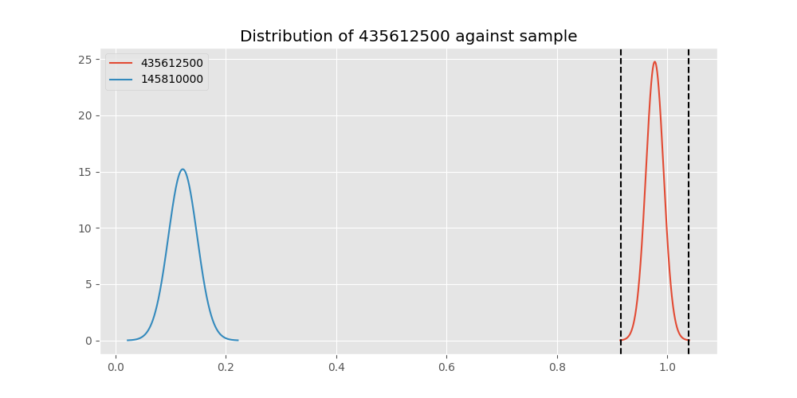
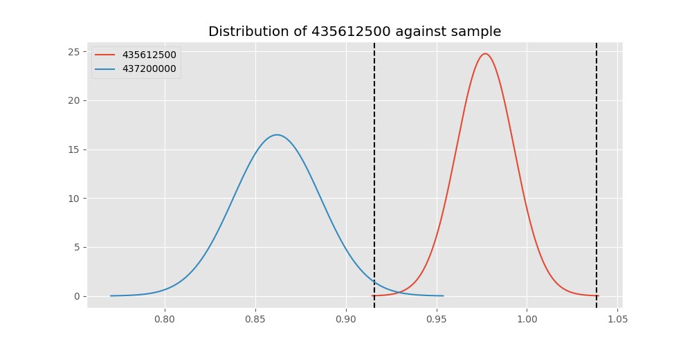

# Testing Results For 435612500 
$H_{0}$: There is not a difference in collection success against 435612500 
$H_{A}$: There is a difference in collection success against 435612500
An $\alpha$ of 0.00025 was used 
Out of 44 tests, there were 12 rejections from 44 independent-t test.
Out of 44 tests, there were 12 rejections from 44 Man Whitney u-tests.
## Testing Results for 435612500 against 436501000 
435612500 has a success rate of 0.9770114942528736
436501000 has a success rate of 0.9854014598540146
$H_{0}$: There is not a difference between 435612500 and 436501000
$H_{A}$: There is a difference between 435612500 and 436501000
An $/alpha$ of 0.00025 was used in this test.
__independent t-testing__: With a t-statistic of -0.4602802807499447 and a p-value of 0.6457655622223835, _we failed to reject the null hypothssis_
__Man-Whitney testing__: With a u-statistic of 5909.5 and a p-value of 0.6480413539479394, _we failed to reject the null hypothssis_
 
## Testing Results for 435612500 against 437375000 
435612500 has a success rate of 0.9770114942528736
437375000 has a success rate of 0.9982014388489209
$H_{0}$: There is not a difference between 435612500 and 437375000
$H_{A}$: There is a difference between 435612500 and 437375000
An $/alpha$ of 0.00025 was used in this test.
__independent t-testing__: With a t-statistic of -1.3031689636001471 and a p-value of 0.19591111068809045, _we failed to reject the null hypothssis_
__Man-Whitney testing__: With a u-statistic of 23673.5 and a p-value of 0.007096585370649722, _we failed to reject the null hypothssis_
 
## Testing Results for 435612500 against 436500000 
435612500 has a success rate of 0.9770114942528736
436500000 has a success rate of 0.9056603773584906
$H_{0}$: There is not a difference between 435612500 and 436500000
$H_{A}$: There is a difference between 435612500 and 436500000
An $/alpha$ of 0.00025 was used in this test.
__independent t-testing__: With a t-statistic of 2.1201949100310022 and a p-value of 0.03499916768339604, _we failed to reject the null hypothssis_
__Man-Whitney testing__: With a u-statistic of 7410.0 and a p-value of 0.035457179890953615, _we failed to reject the null hypothssis_
 
## Testing Results for 435612500 against 436990000 
435612500 has a success rate of 0.9770114942528736
436990000 has a success rate of 0.9572649572649573
$H_{0}$: There is not a difference between 435612500 and 436990000
$H_{A}$: There is a difference between 435612500 and 436990000
An $/alpha$ of 0.00025 was used in this test.
__independent t-testing__: With a t-statistic of 0.8272739427301712 and a p-value of 0.40870021436304116, _we failed to reject the null hypothssis_
__Man-Whitney testing__: With a u-statistic of 10380.0 and a p-value of 0.40901781007522275, _we failed to reject the null hypothssis_
 
## Testing Results for 435612500 against 145875000 
435612500 has a success rate of 0.9770114942528736
145875000 has a success rate of 0.9722222222222222
$H_{0}$: There is not a difference between 435612500 and 145875000
$H_{A}$: There is a difference between 435612500 and 145875000
An $/alpha$ of 0.00025 was used in this test.
__independent t-testing__: With a t-statistic of 0.19076543577333846 and a p-value of 0.8489558281591224, _we failed to reject the null hypothssis_
__Man-Whitney testing__: With a u-statistic of 3147.0 and a p-value of 0.8532513882905657, _we failed to reject the null hypothssis_
 
## Testing Results for 435612500 against 437800000 
435612500 has a success rate of 0.9770114942528736
437800000 has a success rate of 0.9533678756476683
$H_{0}$: There is not a difference between 435612500 and 437800000
$H_{A}$: There is a difference between 435612500 and 437800000
An $/alpha$ of 0.00025 was used in this test.
__independent t-testing__: With a t-statistic of 0.9405720496726161 and a p-value of 0.3477407646713968, _we failed to reject the null hypothssis_
__Man-Whitney testing__: With a u-statistic of 8594.0 and a p-value of 0.34804052314037637, _we failed to reject the null hypothssis_
 
## Testing Results for 435612500 against 145810000 
435612500 has a success rate of 0.9770114942528736
145810000 has a success rate of 0.12179487179487179
$H_{0}$: There is not a difference between 435612500 and 145810000
$H_{A}$: There is a difference between 435612500 and 145810000
An $/alpha$ of 0.00025 was used in this test.
__independent t-testing__: With a t-statistic of 22.9816611230388 and a p-value of 1.14698816686622e-62, _we **reject** the null hypothssis_
__Man-Whitney testing__: With a u-statistic of 12589.5 and a p-value of 5.141494765377078e-38, _we **reject** the null hypothssis_
 
## Testing Results for 435612500 against 437095000 
435612500 has a success rate of 0.9770114942528736
437095000 has a success rate of 0.9361702127659575
$H_{0}$: There is not a difference between 435612500 and 437095000
$H_{A}$: There is a difference between 435612500 and 437095000
An $/alpha$ of 0.00025 was used in this test.
__independent t-testing__: With a t-statistic of 1.1877456669536595 and a p-value of 0.23706645096329715, _we failed to reject the null hypothssis_
__Man-Whitney testing__: With a u-statistic of 2128.0 and a p-value of 0.23847202035654091, _we failed to reject the null hypothssis_
 
## Testing Results for 435612500 against 437265000 
435612500 has a success rate of 0.9770114942528736
437265000 has a success rate of 0.9795454545454545
$H_{0}$: There is not a difference between 435612500 and 437265000
$H_{A}$: There is a difference between 435612500 and 437265000
An $/alpha$ of 0.00025 was used in this test.
__independent t-testing__: With a t-statistic of -0.1507834345964138 and a p-value of 0.8802044697200395, _we failed to reject the null hypothssis_
__Man-Whitney testing__: With a u-statistic of 19091.5 and a p-value of 0.8812634286537704, _we failed to reject the null hypothssis_
 
## Testing Results for 435612500 against 437350000 
435612500 has a success rate of 0.9770114942528736
437350000 has a success rate of 0.9488372093023256
$H_{0}$: There is not a difference between 435612500 and 437350000
$H_{A}$: There is a difference between 435612500 and 437350000
An $/alpha$ of 0.00025 was used in this test.
__independent t-testing__: With a t-statistic of 1.0910173714130043 and a p-value of 0.2761407118480974, _we failed to reject the null hypothssis_
__Man-Whitney testing__: With a u-statistic of 9616.0 and a p-value of 0.2763289807445418, _we failed to reject the null hypothssis_
 
## Testing Results for 435612500 against 437200000 
435612500 has a success rate of 0.9770114942528736
437200000 has a success rate of 0.8620689655172413
$H_{0}$: There is not a difference between 435612500 and 437200000
$H_{A}$: There is a difference between 435612500 and 437200000
An $/alpha$ of 0.00025 was used in this test.
__independent t-testing__: With a t-statistic of 2.980110277946519 and a p-value of 0.0031271753654646376, _we failed to reject the null hypothssis_
__Man-Whitney testing__: With a u-statistic of 9845.5 and a p-value of 0.003294425242739426, _we failed to reject the null hypothssis_
 
## Testing Results for 435612500 against 435600000 
435612500 has a success rate of 0.9770114942528736
435600000 has a success rate of 0.9819341126461212
$H_{0}$: There is not a difference between 435612500 and 435600000
$H_{A}$: There is a difference between 435612500 and 435600000
An $/alpha$ of 0.00025 was used in this test.
__independent t-testing__: With a t-statistic of -0.32585499037115373 and a p-value of 0.7446005170505515, _we failed to reject the null hypothssis_
__Man-Whitney testing__: With a u-statistic of 40732.0 and a p-value of 0.7450388229003602, _we failed to reject the null hypothssis_
 
## Testing Results for 435612500 against 450000000 
435612500 has a success rate of 0.9770114942528736
450000000 has a success rate of 0.8235294117647058
$H_{0}$: There is not a difference between 435612500 and 450000000
$H_{A}$: There is a difference between 435612500 and 450000000
An $/alpha$ of 0.00025 was used in this test.
__independent t-testing__: With a t-statistic of 3.46907161076193 and a p-value of 0.0006617804020320682, _we failed to reject the null hypothssis_
__Man-Whitney testing__: With a u-statistic of 4265.0 and a p-value of 0.0007813380047444576, _we failed to reject the null hypothssis_
 
## Testing Results for 435612500 against 145978500 
435612500 has a success rate of 0.9770114942528736
145978500 has a success rate of 0.9963636363636363
$H_{0}$: There is not a difference between 435612500 and 145978500
$H_{A}$: There is a difference between 435612500 and 145978500
An $/alpha$ of 0.00025 was used in this test.
__independent t-testing__: With a t-statistic of -1.1682823313064086 and a p-value of 0.2456209240996654, _we failed to reject the null hypothssis_
__Man-Whitney testing__: With a u-statistic of 11731.0 and a p-value of 0.08376153515697272, _we failed to reject the null hypothssis_
 
## Testing Results for 435612500 against 437050000 
435612500 has a success rate of 0.9770114942528736
437050000 has a success rate of 0.5346534653465347
$H_{0}$: There is not a difference between 435612500 and 437050000
$H_{A}$: There is a difference between 435612500 and 437050000
An $/alpha$ of 0.00025 was used in this test.
__independent t-testing__: With a t-statistic of 7.925478786806791 and a p-value of 2.029514003693413e-13, _we **reject** the null hypothssis_
__Man-Whitney testing__: With a u-statistic of 6337.0 and a p-value of 6.462248046064212e-12, _we **reject** the null hypothssis_
 
## Testing Results for 435612500 against 435300000 
435612500 has a success rate of 0.9770114942528736
435300000 has a success rate of 0.1232876712328767
$H_{0}$: There is not a difference between 435612500 and 435300000
$H_{A}$: There is a difference between 435612500 and 435300000
An $/alpha$ of 0.00025 was used in this test.
__independent t-testing__: With a t-statistic of 22.749286843173294 and a p-value of 6.68327257571446e-61, _we **reject** the null hypothssis_
__Man-Whitney testing__: With a u-statistic of 11773.0 and a p-value of 9.37376272240919e-37, _we **reject** the null hypothssis_
 
## Testing Results for 435612500 against 437475000 
435612500 has a success rate of 0.9770114942528736
437475000 has a success rate of 0.5045045045045045
$H_{0}$: There is not a difference between 435612500 and 437475000
$H_{A}$: There is a difference between 435612500 and 437475000
An $/alpha$ of 0.00025 was used in this test.
__independent t-testing__: With a t-statistic of 8.73978906080345 and a p-value of 2.0426107727903343e-17, _we **reject** the null hypothssis_
__Man-Whitney testing__: With a u-statistic of 35550.0 and a p-value of 1.3758963538830093e-16, _we **reject** the null hypothssis_
 
## Testing Results for 435612500 against 435448000 
435612500 has a success rate of 0.9770114942528736
435448000 has a success rate of 0.975
$H_{0}$: There is not a difference between 435612500 and 435448000
$H_{A}$: There is a difference between 435612500 and 435448000
An $/alpha$ of 0.00025 was used in this test.
__independent t-testing__: With a t-statistic of 0.06878601877957705 and a p-value of 0.9452698610196946, _we failed to reject the null hypothssis_
__Man-Whitney testing__: With a u-statistic of 1743.5 and a p-value of 0.9527978336059696, _we failed to reject the null hypothssis_
 
## Testing Results for 435612500 against 437644000 
435612500 has a success rate of 0.9770114942528736
437644000 has a success rate of 0.9743589743589743
$H_{0}$: There is not a difference between 435612500 and 437644000
$H_{A}$: There is a difference between 435612500 and 437644000
An $/alpha$ of 0.00025 was used in this test.
__independent t-testing__: With a t-statistic of 0.12058435971853096 and a p-value of 0.9041401132164576, _we failed to reject the null hypothssis_
__Man-Whitney testing__: With a u-statistic of 5103.0 and a p-value of 0.9073346243687793, _we failed to reject the null hypothssis_
 
## Testing Results for 435612500 against 145825000 
435612500 has a success rate of 0.9770114942528736
145825000 has a success rate of 0.8687448728465955
$H_{0}$: There is not a difference between 435612500 and 145825000
$H_{A}$: There is a difference between 435612500 and 145825000
An $/alpha$ of 0.00025 was used in this test.
__independent t-testing__: With a t-statistic of 2.978906770463465 and a p-value of 0.0029203716261506163, _we failed to reject the null hypothssis_
__Man-Whitney testing__: With a u-statistic of 117535.0 and a p-value of 0.002938094701979798, _we failed to reject the null hypothssis_
 
## Testing Results for 435612500 against 437345000 
435612500 has a success rate of 0.9770114942528736
437345000 has a success rate of 0.7603092783505154
$H_{0}$: There is not a difference between 435612500 and 437345000
$H_{A}$: There is a difference between 435612500 and 437345000
An $/alpha$ of 0.00025 was used in this test.
__independent t-testing__: With a t-statistic of 4.660865650942475 and a p-value of 4.100630287121832e-06, _we **reject** the null hypothssis_
__Man-Whitney testing__: With a u-statistic of 20535.5 and a p-value of 5.077078309815796e-06, _we **reject** the null hypothssis_
 
## Testing Results for 435612500 against 435275000 
435612500 has a success rate of 0.9770114942528736
435275000 has a success rate of 0.9152542372881356
$H_{0}$: There is not a difference between 435612500 and 435275000
$H_{A}$: There is a difference between 435612500 and 435275000
An $/alpha$ of 0.00025 was used in this test.
__independent t-testing__: With a t-statistic of 1.8683998681849705 and a p-value of 0.06314703752244083, _we failed to reject the null hypothssis_
__Man-Whitney testing__: With a u-statistic of 5450.0 and a p-value of 0.06371524792327182, _we failed to reject the null hypothssis_
 
## Testing Results for 435612500 against 437322500 
435612500 has a success rate of 0.9770114942528736
437322500 has a success rate of 0.9961685823754789
$H_{0}$: There is not a difference between 435612500 and 437322500
$H_{A}$: There is a difference between 435612500 and 437322500
An $/alpha$ of 0.00025 was used in this test.
__independent t-testing__: With a t-statistic of -1.153449411354675 and a p-value of 0.2515944642864861, _we failed to reject the null hypothssis_
__Man-Whitney testing__: With a u-statistic of 11136.0 and a p-value of 0.09538560456145335, _we failed to reject the null hypothssis_
 
## Testing Results for 435612500 against 437450000 
435612500 has a success rate of 0.9770114942528736
437450000 has a success rate of 0.6947791164658634
$H_{0}$: There is not a difference between 435612500 and 437450000
$H_{A}$: There is a difference between 435612500 and 437450000
An $/alpha$ of 0.00025 was used in this test.
__independent t-testing__: With a t-statistic of 5.596918344713668 and a p-value of 4.554089885421845e-08, _we **reject** the null hypothssis_
__Man-Whitney testing__: With a u-statistic of 13888.5 and a p-value of 8.381775353857493e-08, _we **reject** the null hypothssis_
 
## Testing Results for 435612500 against 436703000 
435612500 has a success rate of 0.9770114942528736
436703000 has a success rate of 0.9859154929577465
$H_{0}$: There is not a difference between 435612500 and 436703000
$H_{A}$: There is a difference between 435612500 and 436703000
An $/alpha$ of 0.00025 was used in this test.
__independent t-testing__: With a t-statistic of -0.5450834967759355 and a p-value of 0.5861038029714412, _we failed to reject the null hypothssis_
__Man-Whitney testing__: With a u-statistic of 9183.0 and a p-value of 0.5875306589742859, _we failed to reject the null hypothssis_
 
## Testing Results for 435612500 against 400500000 
435612500 has a success rate of 0.9770114942528736
400500000 has a success rate of 0.3508771929824561
$H_{0}$: There is not a difference between 435612500 and 400500000
$H_{A}$: There is a difference between 435612500 and 400500000
An $/alpha$ of 0.00025 was used in this test.
__independent t-testing__: With a t-statistic of 11.32930733711292 and a p-value of 1.3454027692882281e-21, _we **reject** the null hypothssis_
__Man-Whitney testing__: With a u-statistic of 4032.0 and a p-value of 1.7667602053423378e-16, _we **reject** the null hypothssis_
 
## Testing Results for 435612500 against 437150000 
435612500 has a success rate of 0.9770114942528736
437150000 has a success rate of 0.9859550561797753
$H_{0}$: There is not a difference between 435612500 and 437150000
$H_{A}$: There is a difference between 435612500 and 437150000
An $/alpha$ of 0.00025 was used in this test.
__independent t-testing__: With a t-statistic of -0.5985473439969728 and a p-value of 0.549782076539813, _we failed to reject the null hypothssis_
__Man-Whitney testing__: With a u-statistic of 15347.5 and a p-value of 0.5506276016055447, _we failed to reject the null hypothssis_
 
## Testing Results for 435612500 against 435635000 
435612500 has a success rate of 0.9770114942528736
435635000 has a success rate of 0.9849624060150376
$H_{0}$: There is not a difference between 435612500 and 435635000
$H_{A}$: There is a difference between 435612500 and 435635000
An $/alpha$ of 0.00025 was used in this test.
__independent t-testing__: With a t-statistic of -0.4297913555640223 and a p-value of 0.6677719375596671, _we failed to reject the null hypothssis_
__Man-Whitney testing__: With a u-statistic of 5739.5 and a p-value of 0.6701710734153736, _we failed to reject the null hypothssis_
 
## Testing Results for 435612500 against 437384000 
435612500 has a success rate of 0.9770114942528736
437384000 has a success rate of 0.968421052631579
$H_{0}$: There is not a difference between 435612500 and 437384000
$H_{A}$: There is a difference between 435612500 and 437384000
An $/alpha$ of 0.00025 was used in this test.
__independent t-testing__: With a t-statistic of 0.3949301170664488 and a p-value of 0.6932006030844247, _we failed to reject the null hypothssis_
__Man-Whitney testing__: With a u-statistic of 8336.0 and a p-value of 0.6945042043072818, _we failed to reject the null hypothssis_
 
## Testing Results for 435612500 against 437405000 
435612500 has a success rate of 0.9770114942528736
437405000 has a success rate of 0.9953917050691244
$H_{0}$: There is not a difference between 435612500 and 437405000
$H_{A}$: There is a difference between 435612500 and 437405000
An $/alpha$ of 0.00025 was used in this test.
__independent t-testing__: With a t-statistic of -1.093751019928608 and a p-value of 0.2766842720783458, _we failed to reject the null hypothssis_
__Man-Whitney testing__: With a u-statistic of 9266.0 and a p-value of 0.14464948876538986, _we failed to reject the null hypothssis_
 
## Testing Results for 435612500 against 435975000 
435612500 has a success rate of 0.9770114942528736
435975000 has a success rate of 0.92
$H_{0}$: There is not a difference between 435612500 and 435975000
$H_{A}$: There is a difference between 435612500 and 435975000
An $/alpha$ of 0.00025 was used in this test.
__independent t-testing__: With a t-statistic of 1.5725495753455359 and a p-value of 0.11816391392500666, _we failed to reject the null hypothssis_
__Man-Whitney testing__: With a u-statistic of 2299.0 and a p-value of 0.11928168122212511, _we failed to reject the null hypothssis_
 
## Testing Results for 435612500 against 437425000 
435612500 has a success rate of 0.9770114942528736
437425000 has a success rate of 0.6987654320987654
$H_{0}$: There is not a difference between 435612500 and 437425000
$H_{A}$: There is a difference between 435612500 and 437425000
An $/alpha$ of 0.00025 was used in this test.
__independent t-testing__: With a t-statistic of 5.581679941543471 and a p-value of 3.949427401998386e-08, _we **reject** the null hypothssis_
__Man-Whitney testing__: With a u-statistic of 22519.5 and a p-value of 6.052699073535433e-08, _we **reject** the null hypothssis_
 
## Testing Results for 435612500 against 437275000 
435612500 has a success rate of 0.9770114942528736
437275000 has a success rate of 0.3643724696356275
$H_{0}$: There is not a difference between 435612500 and 437275000
$H_{A}$: There is a difference between 435612500 and 437275000
An $/alpha$ of 0.00025 was used in this test.
__independent t-testing__: With a t-statistic of 11.641063236005603 and a p-value of 1.697382209752187e-26, _we **reject** the null hypothssis_
__Man-Whitney testing__: With a u-statistic of 17327.0 and a p-value of 8.883124006577399e-23, _we **reject** the null hypothssis_
 
## Testing Results for 435612500 against 145840000 
435612500 has a success rate of 0.9770114942528736
145840000 has a success rate of 0.9649122807017544
$H_{0}$: There is not a difference between 435612500 and 145840000
$H_{A}$: There is a difference between 435612500 and 145840000
An $/alpha$ of 0.00025 was used in this test.
__independent t-testing__: With a t-statistic of 0.4293248581814765 and a p-value of 0.668337518123109, _we failed to reject the null hypothssis_
__Man-Whitney testing__: With a u-statistic of 2509.5 and a p-value of 0.6720190129576114, _we failed to reject the null hypothssis_
 
## Testing Results for 435612500 against 435525000 
435612500 has a success rate of 0.9770114942528736
435525000 has a success rate of 0.6923076923076923
$H_{0}$: There is not a difference between 435612500 and 435525000
$H_{A}$: There is a difference between 435612500 and 435525000
An $/alpha$ of 0.00025 was used in this test.
__independent t-testing__: With a t-statistic of 5.55325534425027 and a p-value of 7.7754233577251e-08, _we **reject** the null hypothssis_
__Man-Whitney testing__: With a u-statistic of 7991.5 and a p-value of 1.7710068730843217e-07, _we **reject** the null hypothssis_
 
## Testing Results for 435612500 against 436250000 
435612500 has a success rate of 0.9770114942528736
436250000 has a success rate of 0.17857142857142858
$H_{0}$: There is not a difference between 435612500 and 436250000
$H_{A}$: There is a difference between 435612500 and 436250000
An $/alpha$ of 0.00025 was used in this test.
__independent t-testing__: With a t-statistic of 17.354541241150688 and a p-value of 8.198616734513857e-37, _we **reject** the null hypothssis_
__Man-Whitney testing__: With a u-statistic of 4381.0 and a p-value of 8.189728329698995e-23, _we **reject** the null hypothssis_
 
## Testing Results for 435612500 against 435950000 
435612500 has a success rate of 0.9770114942528736
435950000 has a success rate of 0.9850187265917603
$H_{0}$: There is not a difference between 435612500 and 435950000
$H_{A}$: There is a difference between 435612500 and 435950000
An $/alpha$ of 0.00025 was used in this test.
__independent t-testing__: With a t-statistic of -0.5494691220744752 and a p-value of 0.5828817210537003, _we failed to reject the null hypothssis_
__Man-Whitney testing__: With a u-statistic of 23043.0 and a p-value of 0.583485365284091, _we failed to reject the null hypothssis_
 
## Testing Results for 435612500 against 435800000 
435612500 has a success rate of 0.9770114942528736
435800000 has a success rate of 0.5390070921985816
$H_{0}$: There is not a difference between 435612500 and 435800000
$H_{A}$: There is a difference between 435612500 and 435800000
An $/alpha$ of 0.00025 was used in this test.
__independent t-testing__: With a t-statistic of 7.9413679285059295 and a p-value of 9.335446773967703e-14, _we **reject** the null hypothssis_
__Man-Whitney testing__: With a u-statistic of 8820.0 and a p-value of 1.977546525766715e-12, _we **reject** the null hypothssis_
 
## Testing Results for 435612500 against 437485000 
435612500 has a success rate of 0.9770114942528736
437485000 has a success rate of 0.9375
$H_{0}$: There is not a difference between 435612500 and 437485000
$H_{A}$: There is a difference between 435612500 and 437485000
An $/alpha$ of 0.00025 was used in this test.
__independent t-testing__: With a t-statistic of 1.0564125039780539 and a p-value of 0.2929562287275426, _we failed to reject the null hypothssis_
__Man-Whitney testing__: With a u-statistic of 1447.0 and a p-value of 0.29542505294742416, _we failed to reject the null hypothssis_
 
## Testing Results for 435612500 against 136770000 
435612500 has a success rate of 0.9770114942528736
136770000 has a success rate of 0.9945945945945946
$H_{0}$: There is not a difference between 435612500 and 136770000
$H_{A}$: There is a difference between 435612500 and 136770000
An $/alpha$ of 0.00025 was used in this test.
__independent t-testing__: With a t-statistic of -1.0318365541829468 and a p-value of 0.304503857208098, _we failed to reject the null hypothssis_
__Man-Whitney testing__: With a u-statistic of 7906.0 and a p-value of 0.19770917778481656, _we failed to reject the null hypothssis_
 
## Testing Results for 435612500 against 437250000 
435612500 has a success rate of 0.9770114942528736
437250000 has a success rate of 0.9937106918238994
$H_{0}$: There is not a difference between 435612500 and 437250000
$H_{A}$: There is a difference between 435612500 and 437250000
An $/alpha$ of 0.00025 was used in this test.
__independent t-testing__: With a t-statistic of -1.3956165148321376 and a p-value of 0.1635984684590736, _we failed to reject the null hypothssis_
__Man-Whitney testing__: With a u-statistic of 13602.0 and a p-value of 0.16423600404786198, _we failed to reject the null hypothssis_
 
## Testing Results for 435612500 against 437356000 
435612500 has a success rate of 0.9770114942528736
437356000 has a success rate of 0.9328358208955224
$H_{0}$: There is not a difference between 435612500 and 437356000
$H_{A}$: There is a difference between 435612500 and 437356000
An $/alpha$ of 0.00025 was used in this test.
__independent t-testing__: With a t-statistic of 1.4759120809052222 and a p-value of 0.1414038385933043, _we failed to reject the null hypothssis_
__Man-Whitney testing__: With a u-statistic of 6086.5 and a p-value of 0.1418010027306433, _we failed to reject the null hypothssis_
 
## Testing Results for 435612500 against 437676000 
435612500 has a success rate of 0.9770114942528736
437676000 has a success rate of 0.9813432835820896
$H_{0}$: There is not a difference between 435612500 and 437676000
$H_{A}$: There is a difference between 435612500 and 437676000
An $/alpha$ of 0.00025 was used in this test.
__independent t-testing__: With a t-statistic of -0.25181527157881123 and a p-value of 0.8013303929756416, _we failed to reject the null hypothssis_
__Man-Whitney testing__: With a u-statistic of 11607.5 and a p-value of 0.8028560740563389, _we failed to reject the null hypothssis_
 
## Testing Results for 435612500 against 145826800 
435612500 has a success rate of 0.9770114942528736
145826800 has a success rate of 0.966183574879227
$H_{0}$: There is not a difference between 435612500 and 145826800
$H_{A}$: There is a difference between 435612500 and 145826800
An $/alpha$ of 0.00025 was used in this test.
__independent t-testing__: With a t-statistic of 0.4904744367813165 and a p-value of 0.6241665694422054, _we failed to reject the null hypothssis_
__Man-Whitney testing__: With a u-statistic of 9102.0 and a p-value of 0.6251300165959087, _we failed to reject the null hypothssis_
 
