# Testing Results For 435635000 
$H_{0}$: There is not a difference in collection success against 435635000 
$H_{A}$: There is a difference in collection success against 435635000
An $\alpha$ of 0.00025 was used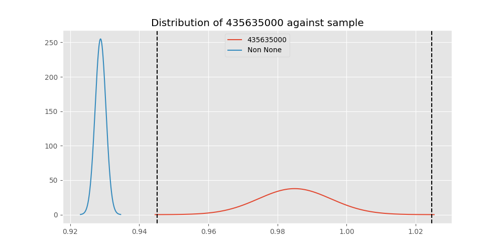 
Out of 44 tests, there were 15 rejections from 44 independent-t test.
Out of 44 tests, there were 15 rejections from 44 Man Whitney u-tests.
## Testing Results for 435635000 against 436501000 
435635000 has a success rate of 0.9849624060150376
436501000 has a success rate of 0.9854014598540146
$H_{0}$: There is not a difference between 435635000 and 436501000
$H_{A}$: There is a difference between 435635000 and 436501000
An $/alpha$ of 0.00025 was used in this test.
__independent t-testing__: With a t-statistic of -0.029744123989421768 and a p-value of 0.9762932594337108, _we failed to reject the null hypothssis_
__Man-Whitney testing__: With a u-statistic of 9106.5 and a p-value of 0.9791978552487722, _we failed to reject the null hypothssis_
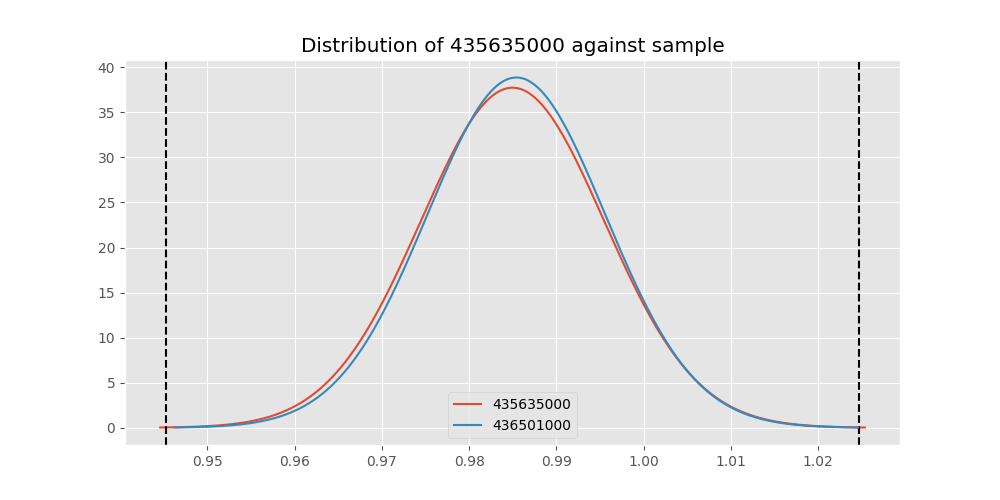 
## Testing Results for 435635000 against 437375000 
435635000 has a success rate of 0.9849624060150376
437375000 has a success rate of 0.9982014388489209
$H_{0}$: There is not a difference between 435635000 and 437375000
$H_{A}$: There is a difference between 435635000 and 437375000
An $/alpha$ of 0.00025 was used in this test.
__independent t-testing__: With a t-statistic of -1.2321757769845891 and a p-value of 0.21995336586063777, _we failed to reject the null hypothssis_
__Man-Whitney testing__: With a u-statistic of 36484.5 and a p-value of 0.03757658484536289, _we failed to reject the null hypothssis_
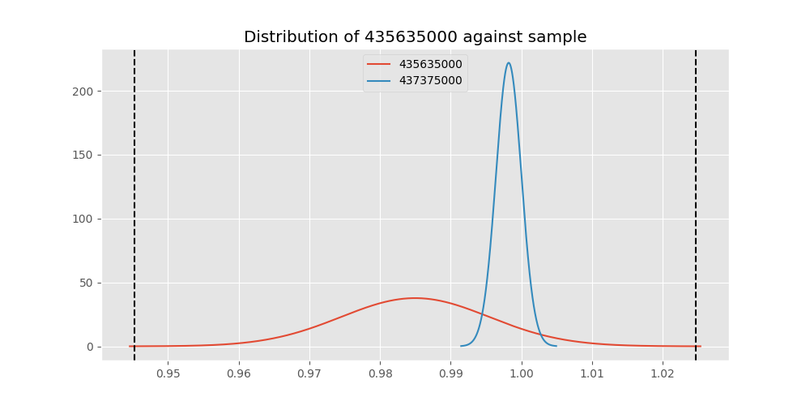 
## Testing Results for 435635000 against 436500000 
435635000 has a success rate of 0.9849624060150376
436500000 has a success rate of 0.9056603773584906
$H_{0}$: There is not a difference between 435635000 and 436500000
$H_{A}$: There is a difference between 435635000 and 436500000
An $/alpha$ of 0.00025 was used in this test.
__independent t-testing__: With a t-statistic of 2.913960175613308 and a p-value of 0.0038466012869166235, _we failed to reject the null hypothssis_
__Man-Whitney testing__: With a u-statistic of 11412.0 and a p-value of 0.004034562845659784, _we failed to reject the null hypothssis_
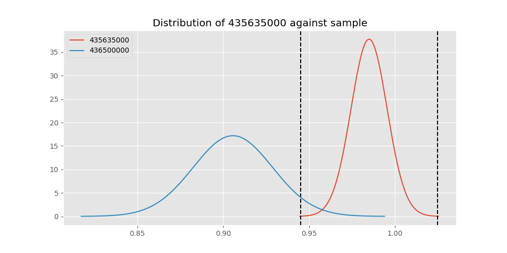 
## Testing Results for 435635000 against 436990000 
435635000 has a success rate of 0.9849624060150376
436990000 has a success rate of 0.9572649572649573
$H_{0}$: There is not a difference between 435635000 and 436990000
$H_{A}$: There is a difference between 435635000 and 436990000
An $/alpha$ of 0.00025 was used in this test.
__independent t-testing__: With a t-statistic of 1.4342853937690612 and a p-value of 0.15234700765302092, _we failed to reject the null hypothssis_
__Man-Whitney testing__: With a u-statistic of 15992.0 and a p-value of 0.15255723885287809, _we failed to reject the null hypothssis_
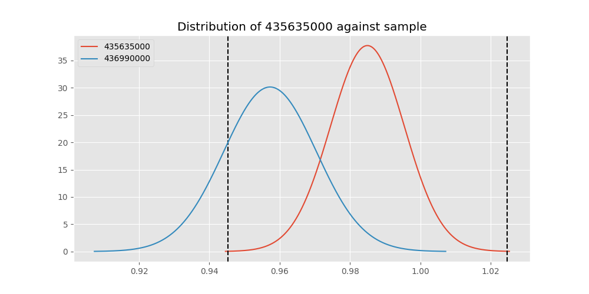 
## Testing Results for 435635000 against 145875000 
435635000 has a success rate of 0.9849624060150376
145875000 has a success rate of 0.9722222222222222
$H_{0}$: There is not a difference between 435635000 and 145875000
$H_{A}$: There is a difference between 435635000 and 145875000
An $/alpha$ of 0.00025 was used in this test.
__independent t-testing__: With a t-statistic of 0.6270583487718232 and a p-value of 0.5313255948342366, _we failed to reject the null hypothssis_
__Man-Whitney testing__: With a u-statistic of 4849.0 and a p-value of 0.5333860269148838, _we failed to reject the null hypothssis_
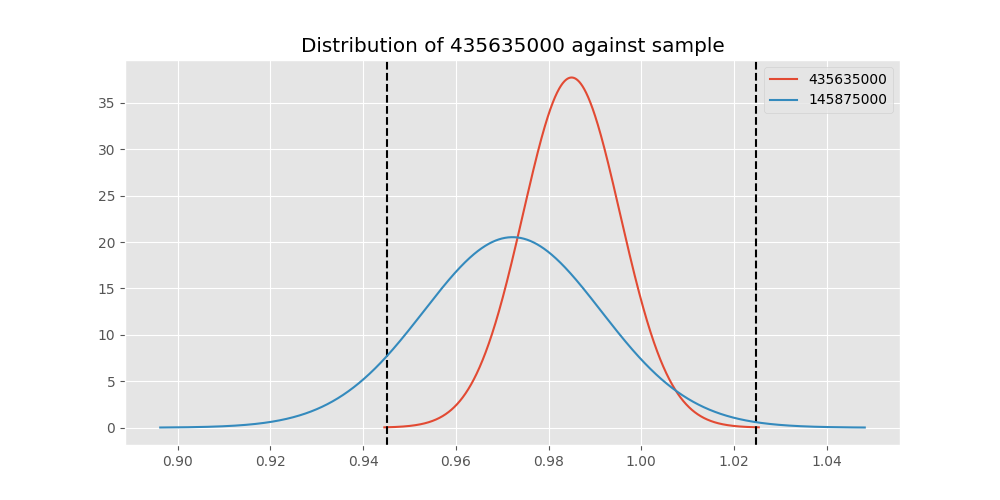 
## Testing Results for 435635000 against 437800000 
435635000 has a success rate of 0.9849624060150376
437800000 has a success rate of 0.9533678756476683
$H_{0}$: There is not a difference between 435635000 and 437800000
$H_{A}$: There is a difference between 435635000 and 437800000
An $/alpha$ of 0.00025 was used in this test.
__independent t-testing__: With a t-statistic of 1.5536350249024022 and a p-value of 0.12124772303332707, _we failed to reject the null hypothssis_
__Man-Whitney testing__: With a u-statistic of 13240.0 and a p-value of 0.12153679430048642, _we failed to reject the null hypothssis_
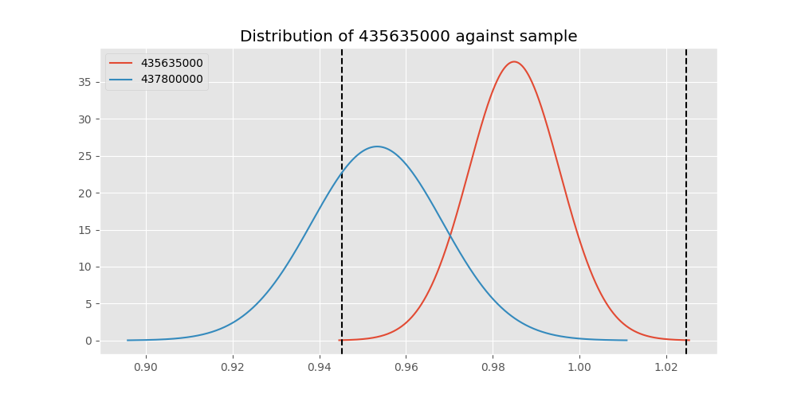 
## Testing Results for 435635000 against 145810000 
435635000 has a success rate of 0.9849624060150376
145810000 has a success rate of 0.12179487179487179
$H_{0}$: There is not a difference between 435635000 and 145810000
$H_{A}$: There is a difference between 435635000 and 145810000
An $/alpha$ of 0.00025 was used in this test.
__independent t-testing__: With a t-statistic of 28.68587133955674 and a p-value of 2.7928955115103345e-86, _we **reject** the null hypothssis_
__Man-Whitney testing__: With a u-statistic of 19328.5 and a p-value of 2.3637373406315628e-48, _we **reject** the null hypothssis_
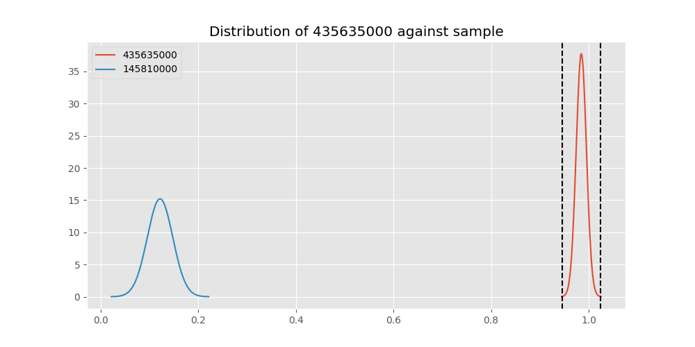 
## Testing Results for 435635000 against 437095000 
435635000 has a success rate of 0.9849624060150376
437095000 has a success rate of 0.9361702127659575
$H_{0}$: There is not a difference between 435635000 and 437095000
$H_{A}$: There is a difference between 435635000 and 437095000
An $/alpha$ of 0.00025 was used in this test.
__independent t-testing__: With a t-statistic of 1.7549145577733964 and a p-value of 0.08099442297017222, _we failed to reject the null hypothssis_
__Man-Whitney testing__: With a u-statistic of 3278.0 and a p-value of 0.08201945078028351, _we failed to reject the null hypothssis_
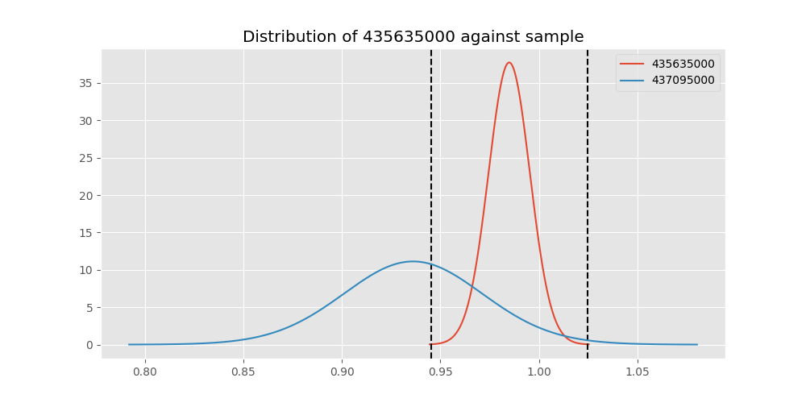 
## Testing Results for 435635000 against 437265000 
435635000 has a success rate of 0.9849624060150376
437265000 has a success rate of 0.9795454545454545
$H_{0}$: There is not a difference between 435635000 and 437265000
$H_{A}$: There is a difference between 435635000 and 437265000
An $/alpha$ of 0.00025 was used in this test.
__independent t-testing__: With a t-statistic of 0.39830979146432116 and a p-value of 0.690550731360253, _we failed to reject the null hypothssis_
__Man-Whitney testing__: With a u-statistic of 29418.5 and a p-value of 0.6911126052449023, _we failed to reject the null hypothssis_
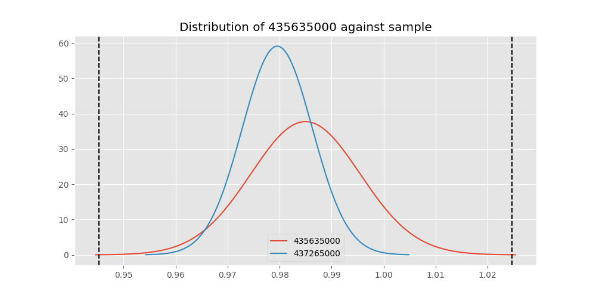 
## Testing Results for 435635000 against 437350000 
435635000 has a success rate of 0.9849624060150376
437350000 has a success rate of 0.9488372093023256
$H_{0}$: There is not a difference between 435635000 and 437350000
$H_{A}$: There is a difference between 435635000 and 437350000
An $/alpha$ of 0.00025 was used in this test.
__independent t-testing__: With a t-statistic of 1.7292905178414708 and a p-value of 0.08464902040227054, _we failed to reject the null hypothssis_
__Man-Whitney testing__: With a u-statistic of 14814.0 and a p-value of 0.08494591172138202, _we failed to reject the null hypothssis_
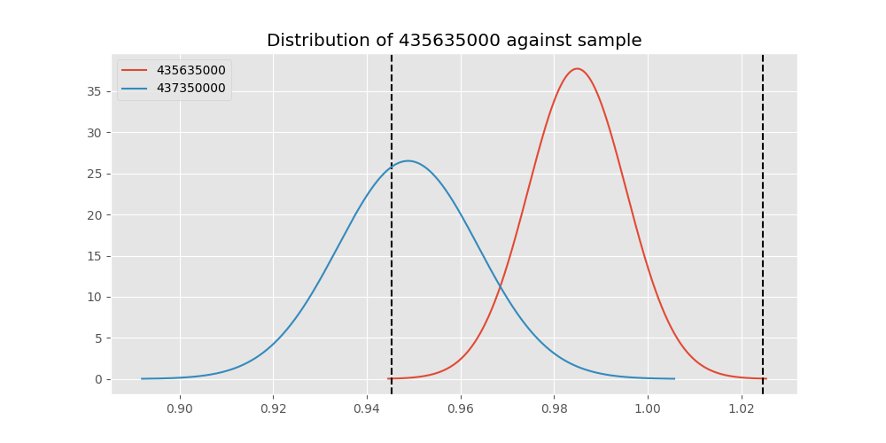 
## Testing Results for 435635000 against 437200000 
435635000 has a success rate of 0.9849624060150376
437200000 has a success rate of 0.8620689655172413
$H_{0}$: There is not a difference between 435635000 and 437200000
$H_{A}$: There is a difference between 435635000 and 437200000
An $/alpha$ of 0.00025 was used in this test.
__independent t-testing__: With a t-statistic of 3.9402205699407635 and a p-value of 9.915657315524773e-05, _we **reject** the null hypothssis_
__Man-Whitney testing__: With a u-statistic of 15158.5 and a p-value of 0.00011510833123504666, _we **reject** the null hypothssis_
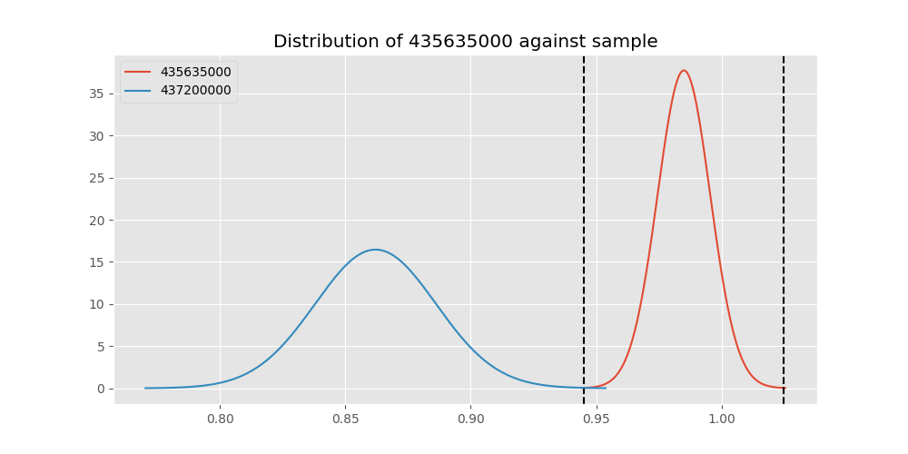 
## Testing Results for 435635000 against 435600000 
435635000 has a success rate of 0.9849624060150376
435600000 has a success rate of 0.9819341126461212
$H_{0}$: There is not a difference between 435635000 and 435600000
$H_{A}$: There is a difference between 435635000 and 435600000
An $/alpha$ of 0.00025 was used in this test.
__independent t-testing__: With a t-statistic of 0.24775668059765704 and a p-value of 0.8043701200357951, _we failed to reject the null hypothssis_
__Man-Whitney testing__: With a u-statistic of 62766.0 and a p-value of 0.8047448415342465, _we failed to reject the null hypothssis_
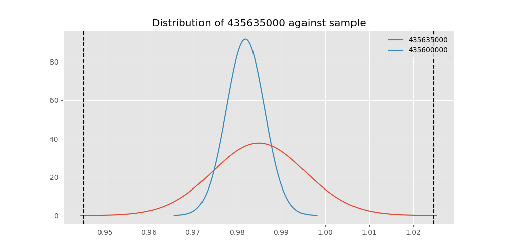 
## Testing Results for 435635000 against 450000000 
435635000 has a success rate of 0.9849624060150376
450000000 has a success rate of 0.8235294117647058
$H_{0}$: There is not a difference between 435635000 and 450000000
$H_{A}$: There is a difference between 435635000 and 450000000
An $/alpha$ of 0.00025 was used in this test.
__independent t-testing__: With a t-statistic of 4.514516555415662 and a p-value of 1.042923851056537e-05, _we **reject** the null hypothssis_
__Man-Whitney testing__: With a u-statistic of 6565.0 and a p-value of 1.538405195852003e-05, _we **reject** the null hypothssis_
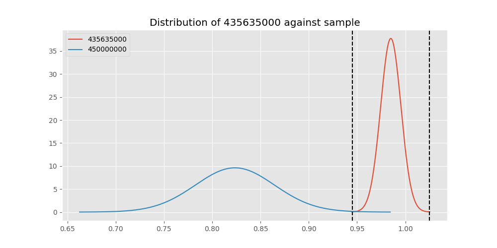 
## Testing Results for 435635000 against 145978500 
435635000 has a success rate of 0.9849624060150376
145978500 has a success rate of 0.9963636363636363
$H_{0}$: There is not a difference between 435635000 and 145978500
$H_{A}$: There is a difference between 435635000 and 145978500
An $/alpha$ of 0.00025 was used in this test.
__independent t-testing__: With a t-statistic of -1.0180026764466281 and a p-value of 0.3101775031759261, _we failed to reject the null hypothssis_
__Man-Whitney testing__: With a u-statistic of 18079.0 and a p-value of 0.20804656328512194, _we failed to reject the null hypothssis_
 
## Testing Results for 435635000 against 437050000 
435635000 has a success rate of 0.9849624060150376
437050000 has a success rate of 0.5346534653465347
$H_{0}$: There is not a difference between 435635000 and 437050000
$H_{A}$: There is a difference between 435635000 and 437050000
An $/alpha$ of 0.00025 was used in this test.
__independent t-testing__: With a t-statistic of 9.982961855614207 and a p-value of 9.372917365331926e-20, _we **reject** the null hypothssis_
__Man-Whitney testing__: With a u-statistic of 9741.0 and a p-value of 5.95928696936252e-17, _we **reject** the null hypothssis_
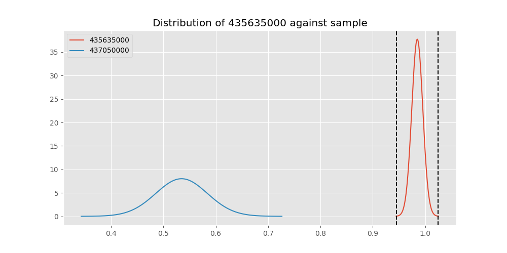 
## Testing Results for 435635000 against 435300000 
435635000 has a success rate of 0.9849624060150376
435300000 has a success rate of 0.1232876712328767
$H_{0}$: There is not a difference between 435635000 and 435300000
$H_{A}$: There is a difference between 435635000 and 435300000
An $/alpha$ of 0.00025 was used in this test.
__independent t-testing__: With a t-statistic of 28.397171002527283 and a p-value of 5.118314034677171e-84, _we **reject** the null hypothssis_
__Man-Whitney testing__: With a u-statistic of 18075.0 and a p-value of 6.528997285741701e-47, _we **reject** the null hypothssis_
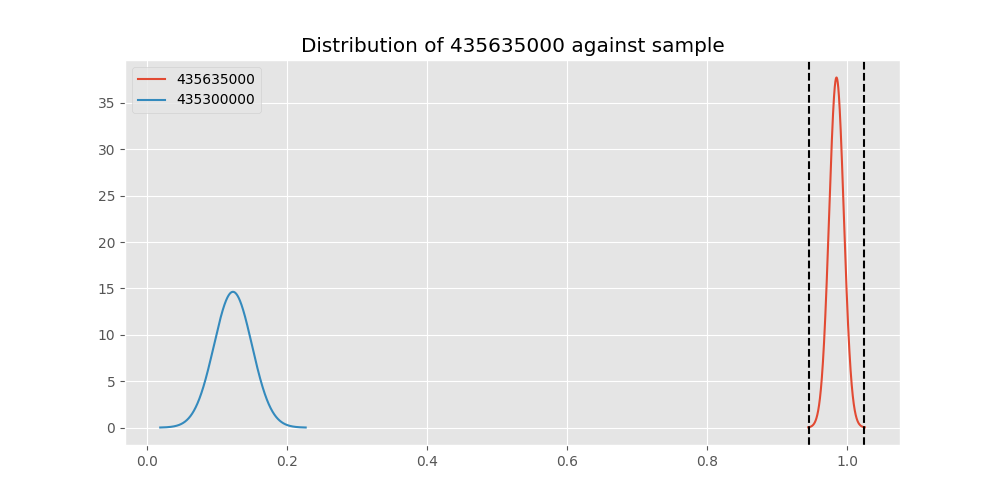 
## Testing Results for 435635000 against 437475000 
435635000 has a success rate of 0.9849624060150376
437475000 has a success rate of 0.5045045045045045
$H_{0}$: There is not a difference between 435635000 and 437475000
$H_{A}$: There is a difference between 435635000 and 437475000
An $/alpha$ of 0.00025 was used in this test.
__independent t-testing__: With a t-statistic of 10.988415473879042 and a p-value of 5.509518033235254e-26, _we **reject** the null hypothssis_
__Man-Whitney testing__: With a u-statistic of 54640.0 and a p-value of 3.675364071347768e-24, _we **reject** the null hypothssis_
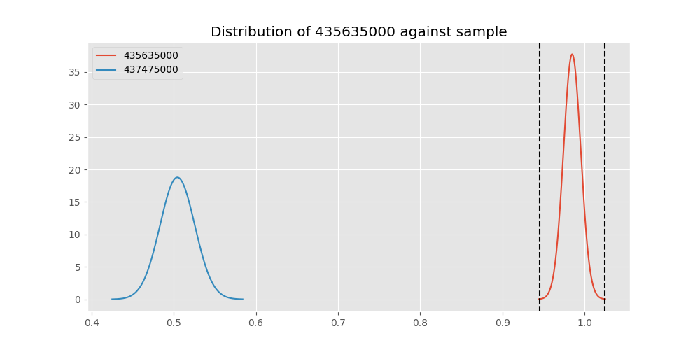 
## Testing Results for 435635000 against 435448000 
435635000 has a success rate of 0.9849624060150376
435448000 has a success rate of 0.975
$H_{0}$: There is not a difference between 435635000 and 435448000
$H_{A}$: There is a difference between 435635000 and 435448000
An $/alpha$ of 0.00025 was used in this test.
__independent t-testing__: With a t-statistic of 0.42097659543242666 and a p-value of 0.6743007967256383, _we failed to reject the null hypothssis_
__Man-Whitney testing__: With a u-statistic of 2686.5 and a p-value of 0.6788557302849307, _we failed to reject the null hypothssis_
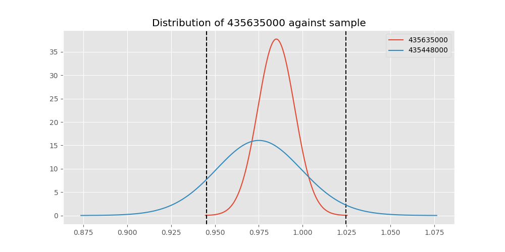 
## Testing Results for 435635000 against 437644000 
435635000 has a success rate of 0.9849624060150376
437644000 has a success rate of 0.9743589743589743
$H_{0}$: There is not a difference between 435635000 and 437644000
$H_{A}$: There is a difference between 435635000 and 437644000
An $/alpha$ of 0.00025 was used in this test.
__independent t-testing__: With a t-statistic of 0.5955707277274209 and a p-value of 0.5520051431562649, _we failed to reject the null hypothssis_
__Man-Whitney testing__: With a u-statistic of 7863.0 and a p-value of 0.5533620280671107, _we failed to reject the null hypothssis_
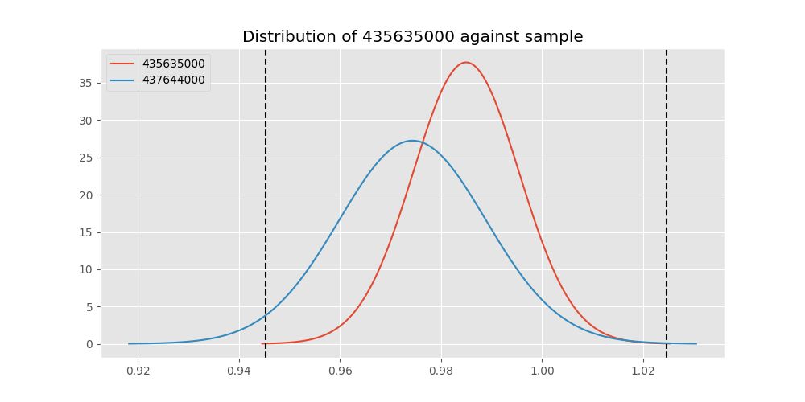 
## Testing Results for 435635000 against 145825000 
435635000 has a success rate of 0.9849624060150376
145825000 has a success rate of 0.8687448728465955
$H_{0}$: There is not a difference between 435635000 and 145825000
$H_{A}$: There is a difference between 435635000 and 145825000
An $/alpha$ of 0.00025 was used in this test.
__independent t-testing__: With a t-statistic of 3.953583540504821 and a p-value of 7.906867315119459e-05, _we **reject** the null hypothssis_
__Man-Whitney testing__: With a u-statistic of 180969.0 and a p-value of 8.071302412328553e-05, _we **reject** the null hypothssis_
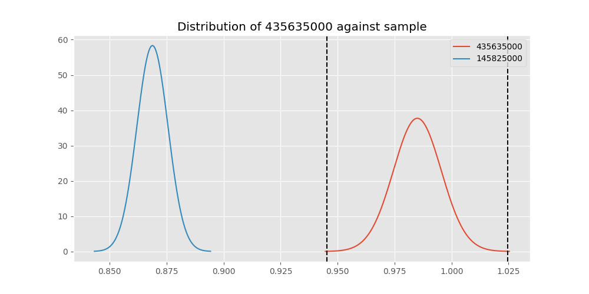 
## Testing Results for 435635000 against 437345000 
435635000 has a success rate of 0.9849624060150376
437345000 has a success rate of 0.7603092783505154
$H_{0}$: There is not a difference between 435635000 and 437345000
$H_{A}$: There is a difference between 435635000 and 437345000
An $/alpha$ of 0.00025 was used in this test.
__independent t-testing__: With a t-statistic of 5.974690753320851 and a p-value of 4.2849354509962515e-09, _we **reject** the null hypothssis_
__Man-Whitney testing__: With a u-statistic of 31598.5 and a p-value of 7.280941865604109e-09, _we **reject** the null hypothssis_
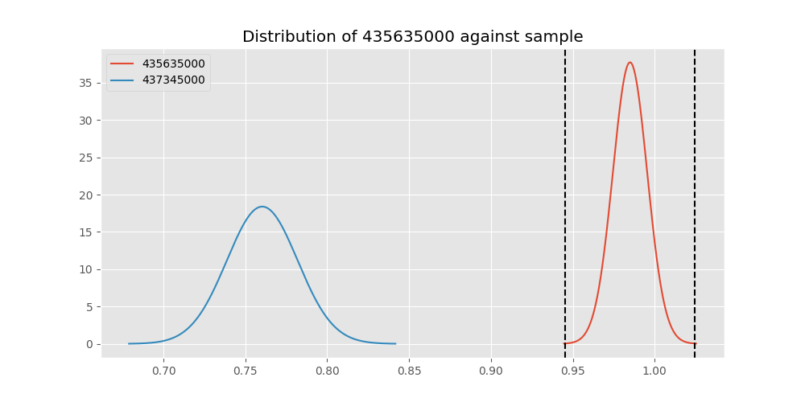 
## Testing Results for 435635000 against 435275000 
435635000 has a success rate of 0.9849624060150376
435275000 has a success rate of 0.9152542372881356
$H_{0}$: There is not a difference between 435635000 and 435275000
$H_{A}$: There is a difference between 435635000 and 435275000
An $/alpha$ of 0.00025 was used in this test.
__independent t-testing__: With a t-statistic of 2.6080309690372863 and a p-value of 0.009656709715151536, _we failed to reject the null hypothssis_
__Man-Whitney testing__: With a u-statistic of 8394.0 and a p-value of 0.009997137743827506, _we failed to reject the null hypothssis_
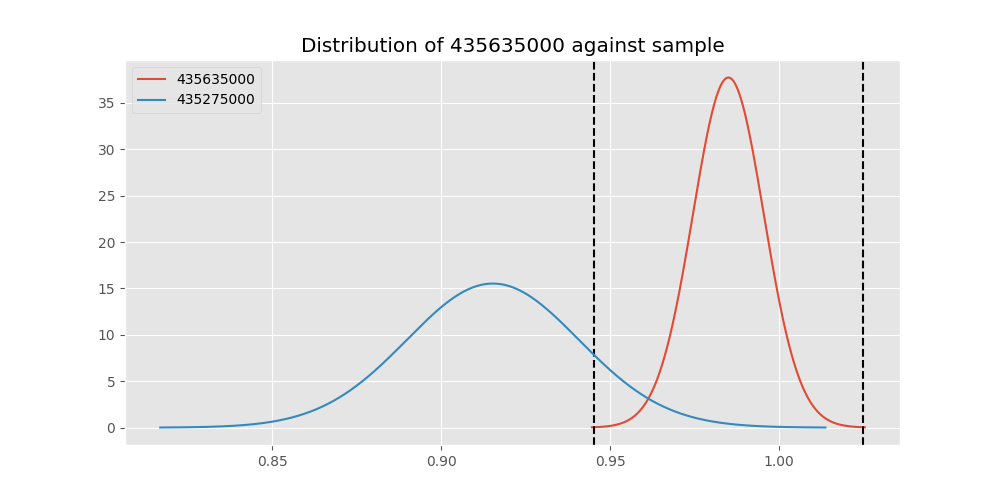 
## Testing Results for 435635000 against 437322500 
435635000 has a success rate of 0.9849624060150376
437322500 has a success rate of 0.9961685823754789
$H_{0}$: There is not a difference between 435635000 and 437322500
$H_{A}$: There is a difference between 435635000 and 437322500
An $/alpha$ of 0.00025 was used in this test.
__independent t-testing__: With a t-statistic of -1.2092219972302665 and a p-value of 0.22730637447517205, _we failed to reject the null hypothssis_
__Man-Whitney testing__: With a u-statistic of 17162.0 and a p-value of 0.22804706505018024, _we failed to reject the null hypothssis_
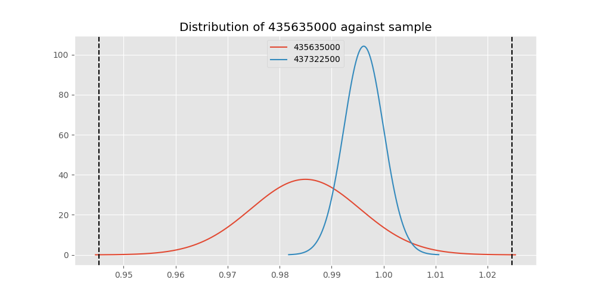 
## Testing Results for 435635000 against 437450000 
435635000 has a success rate of 0.9849624060150376
437450000 has a success rate of 0.6947791164658634
$H_{0}$: There is not a difference between 435635000 and 437450000
$H_{A}$: There is a difference between 435635000 and 437450000
An $/alpha$ of 0.00025 was used in this test.
__independent t-testing__: With a t-statistic of 7.116626942235264 and a p-value of 5.550486432476018e-12, _we **reject** the null hypothssis_
__Man-Whitney testing__: With a u-statistic of 21363.5 and a p-value of 2.1840471124813844e-11, _we **reject** the null hypothssis_
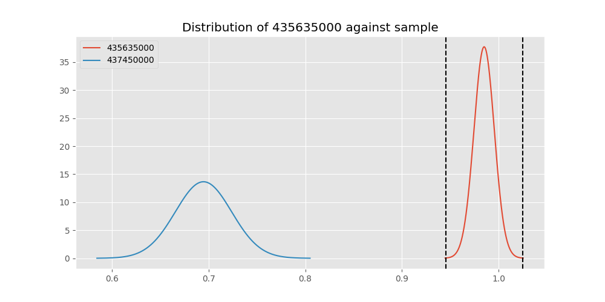 
## Testing Results for 435635000 against 436703000 
435635000 has a success rate of 0.9849624060150376
436703000 has a success rate of 0.9859154929577465
$H_{0}$: There is not a difference between 435635000 and 436703000
$H_{A}$: There is a difference between 435635000 and 436703000
An $/alpha$ of 0.00025 was used in this test.
__independent t-testing__: With a t-statistic of -0.07205571781920452 and a p-value of 0.9425994414326604, _we failed to reject the null hypothssis_
__Man-Whitney testing__: With a u-statistic of 14151.0 and a p-value of 0.9446017866132109, _we failed to reject the null hypothssis_
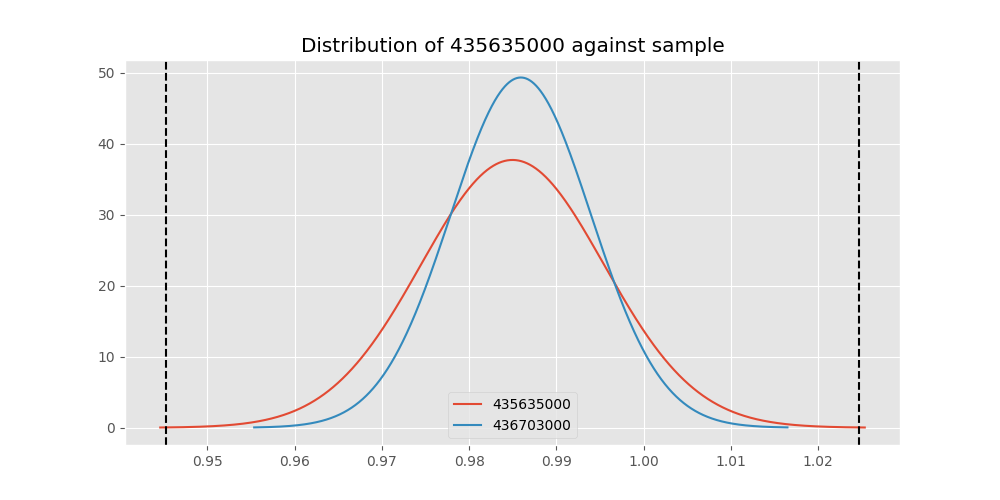 
## Testing Results for 435635000 against 400500000 
435635000 has a success rate of 0.9849624060150376
400500000 has a success rate of 0.3508771929824561
$H_{0}$: There is not a difference between 435635000 and 400500000
$H_{A}$: There is a difference between 435635000 and 400500000
An $/alpha$ of 0.00025 was used in this test.
__independent t-testing__: With a t-statistic of 14.202271848029229 and a p-value of 1.4024709495864407e-31, _we **reject** the null hypothssis_
__Man-Whitney testing__: With a u-statistic of 6194.0 and a p-value of 4.669482986158438e-23, _we **reject** the null hypothssis_
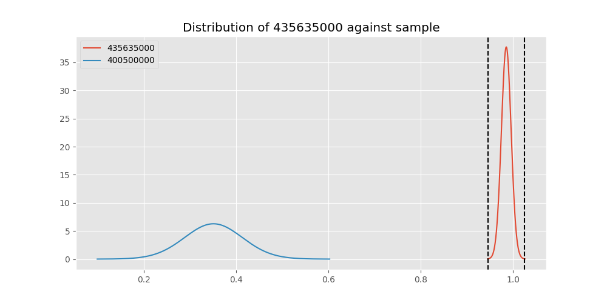 
## Testing Results for 435635000 against 437150000 
435635000 has a success rate of 0.9849624060150376
437150000 has a success rate of 0.9859550561797753
$H_{0}$: There is not a difference between 435635000 and 437150000
$H_{A}$: There is a difference between 435635000 and 437150000
An $/alpha$ of 0.00025 was used in this test.
__independent t-testing__: With a t-statistic of -0.08206197832733599 and a p-value of 0.9346311437969264, _we failed to reject the null hypothssis_
__Man-Whitney testing__: With a u-statistic of 23650.5 and a p-value of 0.9359208443181829, _we failed to reject the null hypothssis_
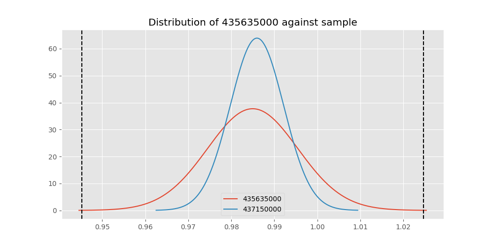 
## Testing Results for 435635000 against 437384000 
435635000 has a success rate of 0.9849624060150376
437384000 has a success rate of 0.968421052631579
$H_{0}$: There is not a difference between 435635000 and 437384000
$H_{A}$: There is a difference between 435635000 and 437384000
An $/alpha$ of 0.00025 was used in this test.
__independent t-testing__: With a t-statistic of 0.9397720541051331 and a p-value of 0.34804111529213677, _we failed to reject the null hypothssis_
__Man-Whitney testing__: With a u-statistic of 12844.0 and a p-value of 0.348401729928398, _we failed to reject the null hypothssis_
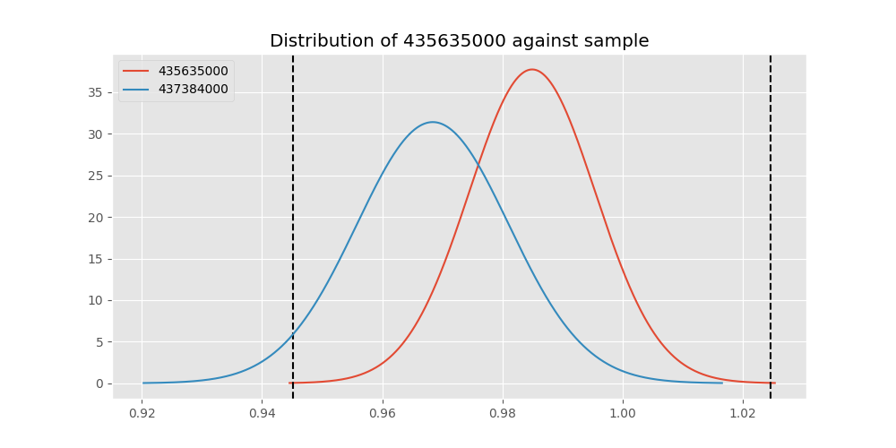 
## Testing Results for 435635000 against 437405000 
435635000 has a success rate of 0.9849624060150376
437405000 has a success rate of 0.9953917050691244
$H_{0}$: There is not a difference between 435635000 and 437405000
$H_{A}$: There is a difference between 435635000 and 437405000
An $/alpha$ of 0.00025 was used in this test.
__independent t-testing__: With a t-statistic of -1.025961064884017 and a p-value of 0.3056225429079574, _we failed to reject the null hypothssis_
__Man-Whitney testing__: With a u-statistic of 14280.0 and a p-value of 0.30655589644087966, _we failed to reject the null hypothssis_
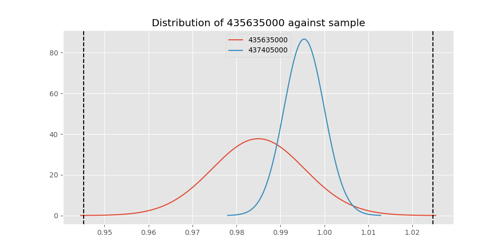 
## Testing Results for 435635000 against 435612500 
435635000 has a success rate of 0.9849624060150376
435612500 has a success rate of 0.9770114942528736
$H_{0}$: There is not a difference between 435635000 and 435612500
$H_{A}$: There is a difference between 435635000 and 435612500
An $/alpha$ of 0.00025 was used in this test.
__independent t-testing__: With a t-statistic of 0.4297913555640223 and a p-value of 0.6677719375596671, _we failed to reject the null hypothssis_
__Man-Whitney testing__: With a u-statistic of 5831.5 and a p-value of 0.6701710734153736, _we failed to reject the null hypothssis_
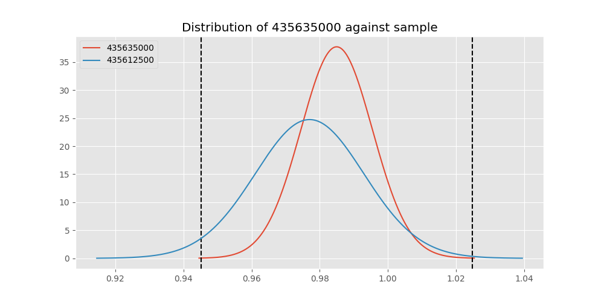 
## Testing Results for 435635000 against 435975000 
435635000 has a success rate of 0.9849624060150376
435975000 has a success rate of 0.92
$H_{0}$: There is not a difference between 435635000 and 435975000
$H_{A}$: There is a difference between 435635000 and 435975000
An $/alpha$ of 0.00025 was used in this test.
__independent t-testing__: With a t-statistic of 2.216487735465922 and a p-value of 0.027904063552818197, _we failed to reject the null hypothssis_
__Man-Whitney testing__: With a u-statistic of 3541.0 and a p-value of 0.028672330744725562, _we failed to reject the null hypothssis_
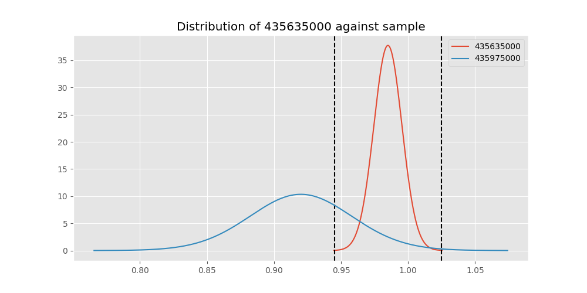 
## Testing Results for 435635000 against 437425000 
435635000 has a success rate of 0.9849624060150376
437425000 has a success rate of 0.6987654320987654
$H_{0}$: There is not a difference between 435635000 and 437425000
$H_{A}$: There is a difference between 435635000 and 437425000
An $/alpha$ of 0.00025 was used in this test.
__independent t-testing__: With a t-statistic of 7.099100255065835 and a p-value of 4.004807090969337e-12, _we **reject** the null hypothssis_
__Man-Whitney testing__: With a u-statistic of 34640.5 and a p-value of 1.097692628270351e-11, _we **reject** the null hypothssis_
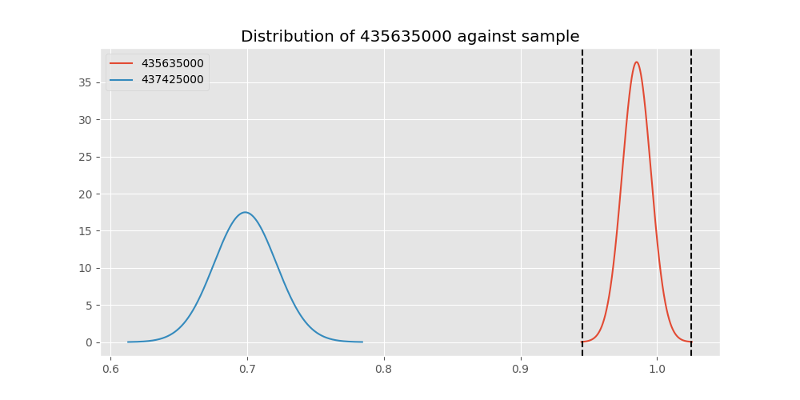 
## Testing Results for 435635000 against 437275000 
435635000 has a success rate of 0.9849624060150376
437275000 has a success rate of 0.3643724696356275
$H_{0}$: There is not a difference between 435635000 and 437275000
$H_{A}$: There is a difference between 435635000 and 437275000
An $/alpha$ of 0.00025 was used in this test.
__independent t-testing__: With a t-statistic of 14.583401996267725 and a p-value of 1.5620529588288244e-38, _we **reject** the null hypothssis_
__Man-Whitney testing__: With a u-statistic of 26619.0 and a p-value of 1.5927767777276635e-31, _we **reject** the null hypothssis_
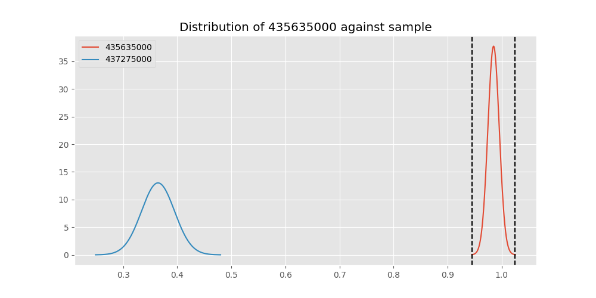 
## Testing Results for 435635000 against 145840000 
435635000 has a success rate of 0.9849624060150376
145840000 has a success rate of 0.9649122807017544
$H_{0}$: There is not a difference between 435635000 and 145840000
$H_{A}$: There is a difference between 435635000 and 145840000
An $/alpha$ of 0.00025 was used in this test.
__independent t-testing__: With a t-statistic of 0.8793547529245537 and a p-value of 0.3803315490457545, _we failed to reject the null hypothssis_
__Man-Whitney testing__: With a u-statistic of 3866.5 and a p-value of 0.38206707115974914, _we failed to reject the null hypothssis_
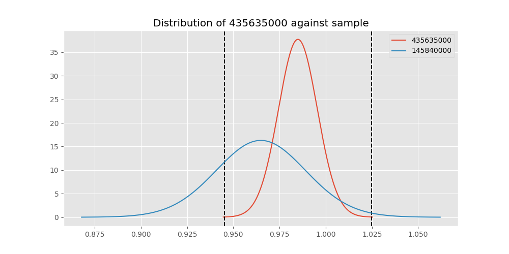 
## Testing Results for 435635000 against 435525000 
435635000 has a success rate of 0.9849624060150376
435525000 has a success rate of 0.6923076923076923
$H_{0}$: There is not a difference between 435635000 and 435525000
$H_{A}$: There is a difference between 435635000 and 435525000
An $/alpha$ of 0.00025 was used in this test.
__independent t-testing__: With a t-statistic of 7.061335253666301 and a p-value of 1.3587197332421423e-11, _we **reject** the null hypothssis_
__Man-Whitney testing__: With a u-statistic of 12292.5 and a p-value of 7.732617865466767e-11, _we **reject** the null hypothssis_
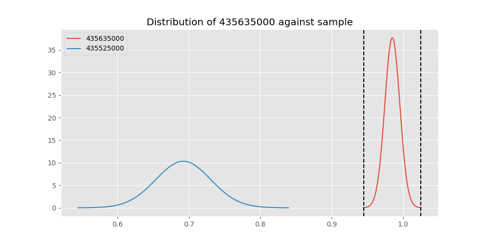 
## Testing Results for 435635000 against 436250000 
435635000 has a success rate of 0.9849624060150376
436250000 has a success rate of 0.17857142857142858
$H_{0}$: There is not a difference between 435635000 and 436250000
$H_{A}$: There is a difference between 435635000 and 436250000
An $/alpha$ of 0.00025 was used in this test.
__independent t-testing__: With a t-statistic of 21.691606170820187 and a p-value of 6.019212897943258e-53, _we **reject** the null hypothssis_
__Man-Whitney testing__: With a u-statistic of 6727.0 and a p-value of 4.272747193457987e-31, _we **reject** the null hypothssis_
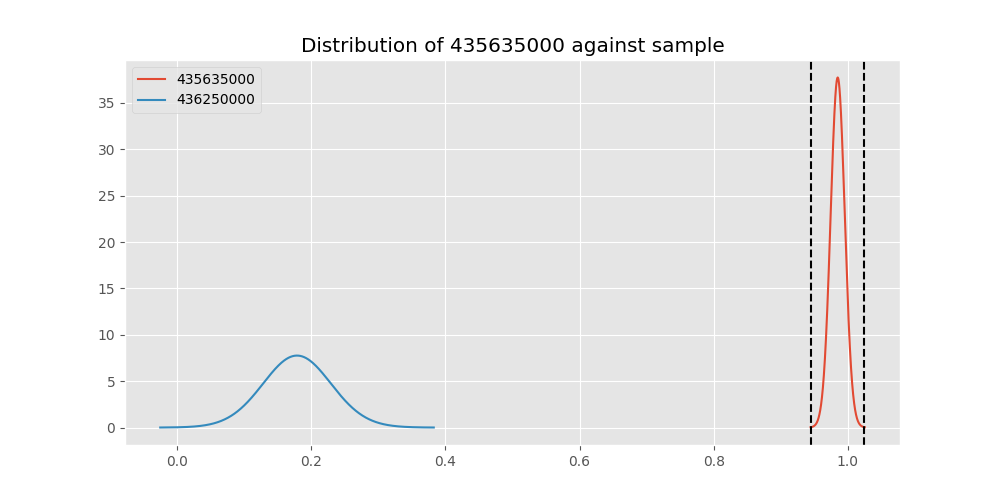 
## Testing Results for 435635000 against 435950000 
435635000 has a success rate of 0.9849624060150376
435950000 has a success rate of 0.9850187265917603
$H_{0}$: There is not a difference between 435635000 and 435950000
$H_{A}$: There is a difference between 435635000 and 435950000
An $/alpha$ of 0.00025 was used in this test.
__independent t-testing__: With a t-statistic of -0.004775201338829971 and a p-value of 0.9961913871565611, _we failed to reject the null hypothssis_
__Man-Whitney testing__: With a u-statistic of 35509.0 and a p-value of 0.9971403138816112, _we failed to reject the null hypothssis_
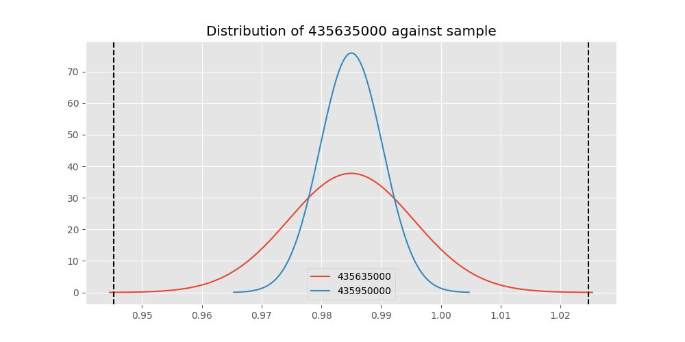 
## Testing Results for 435635000 against 435800000 
435635000 has a success rate of 0.9849624060150376
435800000 has a success rate of 0.5390070921985816
$H_{0}$: There is not a difference between 435635000 and 435800000
$H_{A}$: There is a difference between 435635000 and 435800000
An $/alpha$ of 0.00025 was used in this test.
__independent t-testing__: With a t-statistic of 10.00238167225454 and a p-value of 2.918851695902456e-20, _we **reject** the null hypothssis_
__Man-Whitney testing__: With a u-statistic of 13558.0 and a p-value of 1.0612918778640803e-17, _we **reject** the null hypothssis_
 
## Testing Results for 435635000 against 437485000 
435635000 has a success rate of 0.9849624060150376
437485000 has a success rate of 0.9375
$H_{0}$: There is not a difference between 435635000 and 437485000
$H_{A}$: There is a difference between 435635000 and 437485000
An $/alpha$ of 0.00025 was used in this test.
__independent t-testing__: With a t-statistic of 1.569489679048675 and a p-value of 0.11847308280570149, _we failed to reject the null hypothssis_
__Man-Whitney testing__: With a u-statistic of 2229.0 and a p-value of 0.1199939597639613, _we failed to reject the null hypothssis_
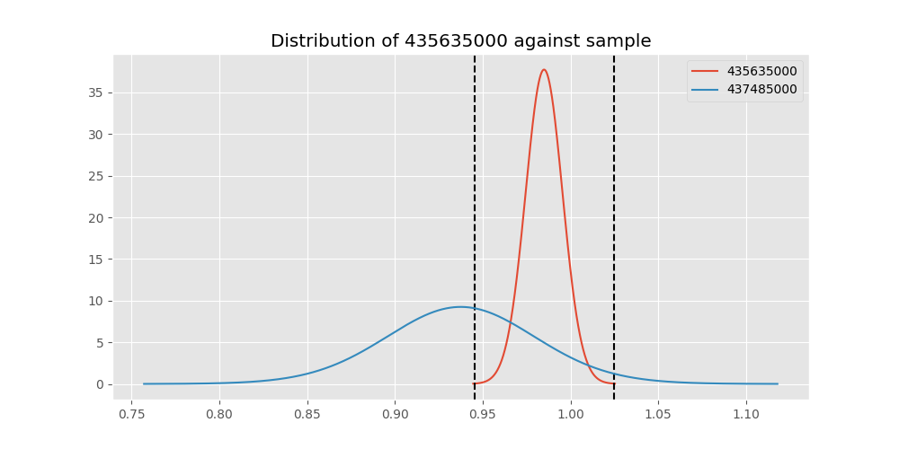 
## Testing Results for 435635000 against 136770000 
435635000 has a success rate of 0.9849624060150376
136770000 has a success rate of 0.9945945945945946
$H_{0}$: There is not a difference between 435635000 and 136770000
$H_{A}$: There is a difference between 435635000 and 136770000
An $/alpha$ of 0.00025 was used in this test.
__independent t-testing__: With a t-statistic of -0.8747611639639488 and a p-value of 0.3823682336784333, _we failed to reject the null hypothssis_
__Man-Whitney testing__: With a u-statistic of 12184.0 and a p-value of 0.3835396303772367, _we failed to reject the null hypothssis_
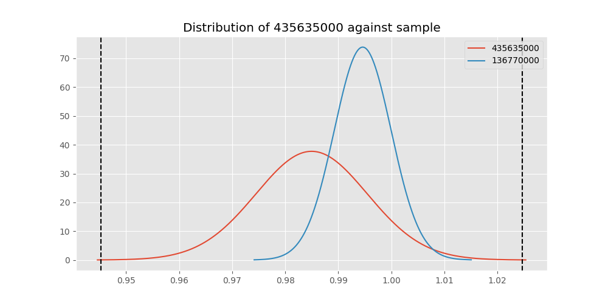 
## Testing Results for 435635000 against 437250000 
435635000 has a success rate of 0.9849624060150376
437250000 has a success rate of 0.9937106918238994
$H_{0}$: There is not a difference between 435635000 and 437250000
$H_{A}$: There is a difference between 435635000 and 437250000
An $/alpha$ of 0.00025 was used in this test.
__independent t-testing__: With a t-statistic of -0.902391967314802 and a p-value of 0.36733251454923366, _we failed to reject the null hypothssis_
__Man-Whitney testing__: With a u-statistic of 20962.0 and a p-value of 0.36804638650625, _we failed to reject the null hypothssis_
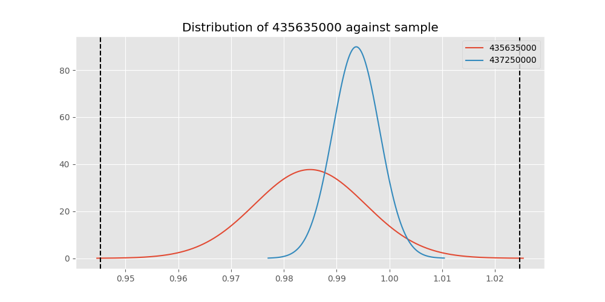 
## Testing Results for 435635000 against 437356000 
435635000 has a success rate of 0.9849624060150376
437356000 has a success rate of 0.9328358208955224
$H_{0}$: There is not a difference between 435635000 and 437356000
$H_{A}$: There is a difference between 435635000 and 437356000
An $/alpha$ of 0.00025 was used in this test.
__independent t-testing__: With a t-statistic of 2.1533309308846964 and a p-value of 0.0321950156029822, _we failed to reject the null hypothssis_
__Man-Whitney testing__: With a u-statistic of 9375.5 and a p-value of 0.032642144898483015, _we failed to reject the null hypothssis_
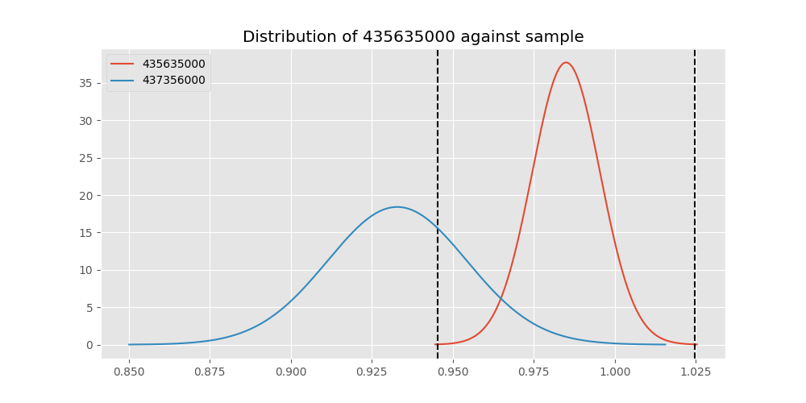 
## Testing Results for 435635000 against 437676000 
435635000 has a success rate of 0.9849624060150376
437676000 has a success rate of 0.9813432835820896
$H_{0}$: There is not a difference between 435635000 and 437676000
$H_{A}$: There is a difference between 435635000 and 437676000
An $/alpha$ of 0.00025 was used in this test.
__independent t-testing__: With a t-statistic of 0.25990974965899344 and a p-value of 0.7950674528398175, _we failed to reject the null hypothssis_
__Man-Whitney testing__: With a u-statistic of 17886.5 and a p-value of 0.7962555957195271, _we failed to reject the null hypothssis_
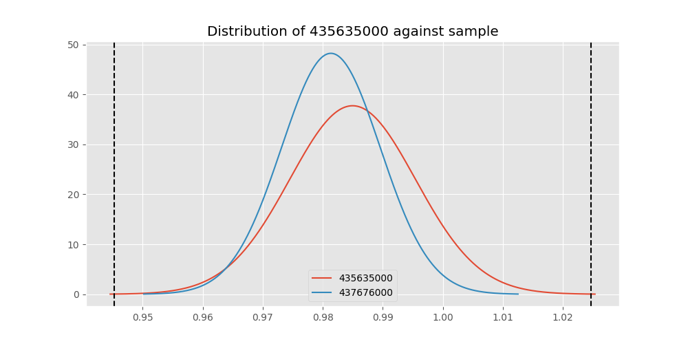 
## Testing Results for 435635000 against 145826800 
435635000 has a success rate of 0.9849624060150376
145826800 has a success rate of 0.966183574879227
$H_{0}$: There is not a difference between 435635000 and 145826800
$H_{A}$: There is a difference between 435635000 and 145826800
An $/alpha$ of 0.00025 was used in this test.
__independent t-testing__: With a t-statistic of 1.0512632772075796 and a p-value of 0.29388869879739793, _we failed to reject the null hypothssis_
__Man-Whitney testing__: With a u-statistic of 14024.0 and a p-value of 0.29414719394731015, _we failed to reject the null hypothssis_
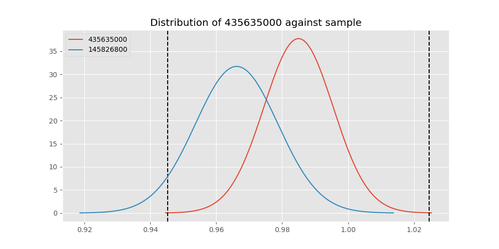 
