# Testing Results For 435800000 
$H_{0}$: There is not a difference in collection success against 435800000 
$H_{A}$: There is a difference in collection success against 435800000
An $\alpha$ of 0.00025 was used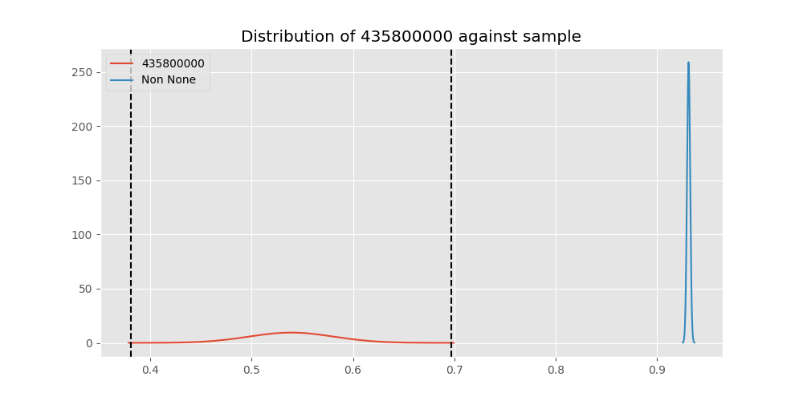 
Out of 44 tests, there were 37 rejections from 44 independent-t test.
Out of 44 tests, there were 37 rejections from 44 Man Whitney u-tests.
## Testing Results for 435800000 against 436501000 
435800000 has a success rate of 0.5390070921985816
436501000 has a success rate of 0.9854014598540146
$H_{0}$: There is not a difference between 435800000 and 436501000
$H_{A}$: There is a difference between 435800000 and 436501000
An $/alpha$ of 0.00025 was used in this test.
__independent t-testing__: With a t-statistic of -10.293617841641725 and a p-value of 2.651099925317233e-19, _we **reject** the null hypothssis_
__Man-Whitney testing__: With a u-statistic of 5347.0 and a p-value of 3.834608594871388e-18, _we **reject** the null hypothssis_
 
## Testing Results for 435800000 against 437375000 
435800000 has a success rate of 0.5390070921985816
437375000 has a success rate of 0.9982014388489209
$H_{0}$: There is not a difference between 435800000 and 437375000
$H_{A}$: There is a difference between 435800000 and 437375000
An $/alpha$ of 0.00025 was used in this test.
__independent t-testing__: With a t-statistic of -10.889821919264584 and a p-value of 2.1022793353837613e-20, _we **reject** the null hypothssis_
__Man-Whitney testing__: With a u-statistic of 21198.5 and a p-value of 4.935041050728076e-62, _we **reject** the null hypothssis_
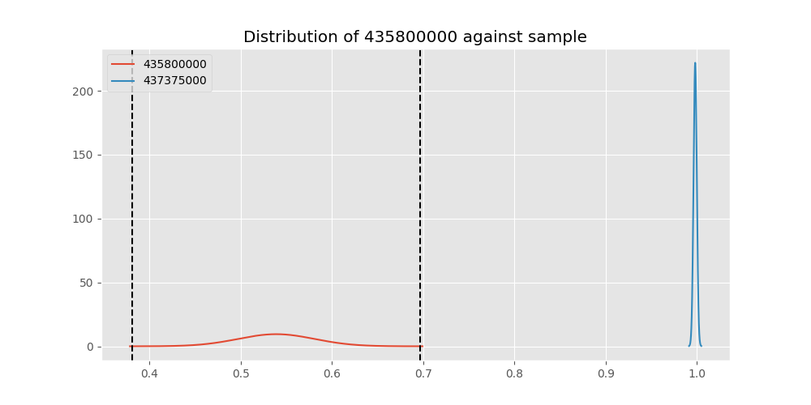 
## Testing Results for 435800000 against 436500000 
435800000 has a success rate of 0.5390070921985816
436500000 has a success rate of 0.9056603773584906
$H_{0}$: There is not a difference between 435800000 and 436500000
$H_{A}$: There is a difference between 435800000 and 436500000
An $/alpha$ of 0.00025 was used in this test.
__independent t-testing__: With a t-statistic of -7.846971746920051 and a p-value of 7.700347174356877e-14, _we **reject** the null hypothssis_
__Man-Whitney testing__: With a u-statistic of 7099.5 and a p-value of 8.386925930368394e-13, _we **reject** the null hypothssis_
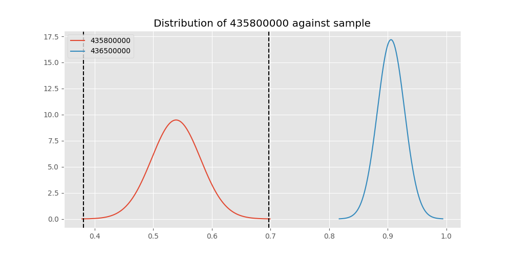 
## Testing Results for 435800000 against 436990000 
435800000 has a success rate of 0.5390070921985816
436990000 has a success rate of 0.9572649572649573
$H_{0}$: There is not a difference between 435800000 and 436990000
$H_{A}$: There is a difference between 435800000 and 436990000
An $/alpha$ of 0.00025 was used in this test.
__independent t-testing__: With a t-statistic of -9.47065534459819 and a p-value of 2.5411968695183513e-17, _we **reject** the null hypothssis_
__Man-Whitney testing__: With a u-statistic of 9597.0 and a p-value of 1.1908589258428207e-22, _we **reject** the null hypothssis_
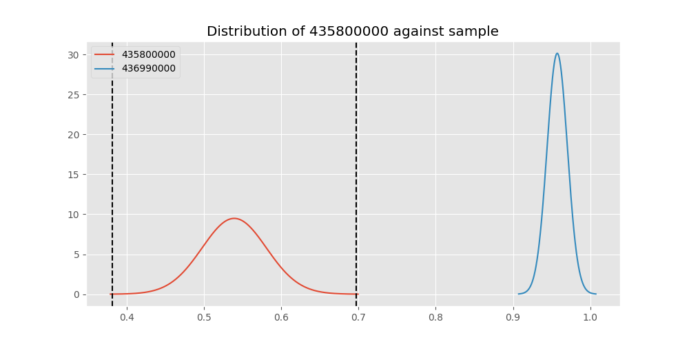 
## Testing Results for 435800000 against 145875000 
435800000 has a success rate of 0.5390070921985816
145875000 has a success rate of 0.9722222222222222
$H_{0}$: There is not a difference between 435800000 and 145875000
$H_{A}$: There is a difference between 435800000 and 145875000
An $/alpha$ of 0.00025 was used in this test.
__independent t-testing__: With a t-statistic of -9.331647985434017 and a p-value of 2.835474733461681e-17, _we **reject** the null hypothssis_
__Man-Whitney testing__: With a u-statistic of 2877.0 and a p-value of 1.323624826816399e-10, _we **reject** the null hypothssis_
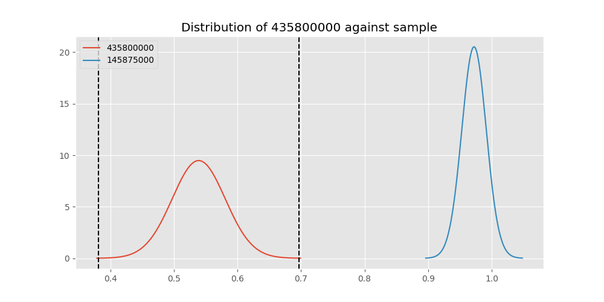 
## Testing Results for 435800000 against 437800000 
435800000 has a success rate of 0.5390070921985816
437800000 has a success rate of 0.9533678756476683
$H_{0}$: There is not a difference between 435800000 and 437800000
$H_{A}$: There is a difference between 435800000 and 437800000
An $/alpha$ of 0.00025 was used in this test.
__independent t-testing__: With a t-statistic of -9.250609130497635 and a p-value of 7.279451490031523e-17, _we **reject** the null hypothssis_
__Man-Whitney testing__: With a u-statistic of 7968.5 and a p-value of 2.431551536827379e-19, _we **reject** the null hypothssis_
 
## Testing Results for 435800000 against 145810000 
435800000 has a success rate of 0.5390070921985816
145810000 has a success rate of 0.12179487179487179
$H_{0}$: There is not a difference between 435800000 and 145810000
$H_{A}$: There is a difference between 435800000 and 145810000
An $/alpha$ of 0.00025 was used in this test.
__independent t-testing__: With a t-statistic of 8.57485328654912 and a p-value of 5.692705626493164e-16, _we **reject** the null hypothssis_
__Man-Whitney testing__: With a u-statistic of 15586.5 and a p-value of 1.541420975367552e-14, _we **reject** the null hypothssis_
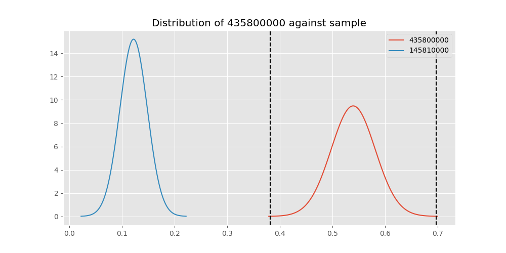 
## Testing Results for 435800000 against 437095000 
435800000 has a success rate of 0.5390070921985816
437095000 has a success rate of 0.9361702127659575
$H_{0}$: There is not a difference between 435800000 and 437095000
$H_{A}$: There is a difference between 435800000 and 437095000
An $/alpha$ of 0.00025 was used in this test.
__independent t-testing__: With a t-statistic of -7.1635036207433345 and a p-value of 2.7316056857277095e-11, _we **reject** the null hypothssis_
__Man-Whitney testing__: With a u-statistic of 1997.5 and a p-value of 9.95217804675033e-07, _we **reject** the null hypothssis_
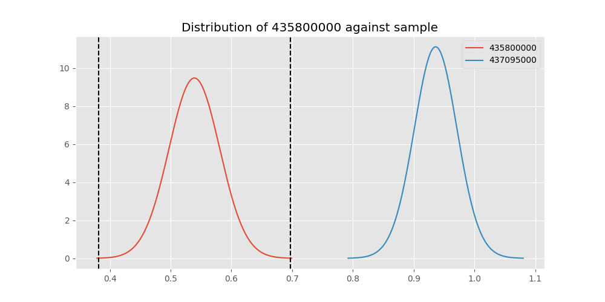 
## Testing Results for 435800000 against 437265000 
435800000 has a success rate of 0.5390070921985816
437265000 has a success rate of 0.9795454545454545
$H_{0}$: There is not a difference between 435800000 and 437265000
$H_{A}$: There is a difference between 435800000 and 437265000
An $/alpha$ of 0.00025 was used in this test.
__independent t-testing__: With a t-statistic of -10.324998613423164 and a p-value of 3.8609475203093277e-19, _we **reject** the null hypothssis_
__Man-Whitney testing__: With a u-statistic of 17354.5 and a p-value of 2.2337748013777113e-42, _we **reject** the null hypothssis_
 
## Testing Results for 435800000 against 437350000 
435800000 has a success rate of 0.5390070921985816
437350000 has a success rate of 0.9488372093023256
$H_{0}$: There is not a difference between 435800000 and 437350000
$H_{A}$: There is a difference between 435800000 and 437350000
An $/alpha$ of 0.00025 was used in this test.
__independent t-testing__: With a t-statistic of -9.16020471682557 and a p-value of 1.3092568258127474e-16, _we **reject** the null hypothssis_
__Man-Whitney testing__: With a u-statistic of 8945.5 and a p-value of 3.093924096127474e-20, _we **reject** the null hypothssis_
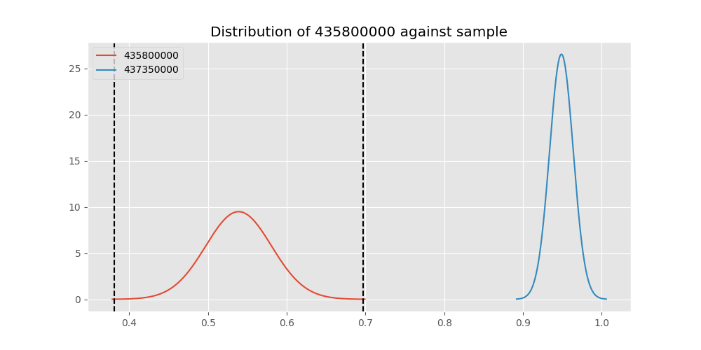 
## Testing Results for 435800000 against 437200000 
435800000 has a success rate of 0.5390070921985816
437200000 has a success rate of 0.8620689655172413
$H_{0}$: There is not a difference between 435800000 and 437200000
$H_{A}$: There is a difference between 435800000 and 437200000
An $/alpha$ of 0.00025 was used in this test.
__independent t-testing__: With a t-statistic of -7.0845762917052815 and a p-value of 8.001249931495964e-12, _we **reject** the null hypothssis_
__Man-Whitney testing__: With a u-statistic of 9688.0 and a p-value of 3.479964126663044e-11, _we **reject** the null hypothssis_
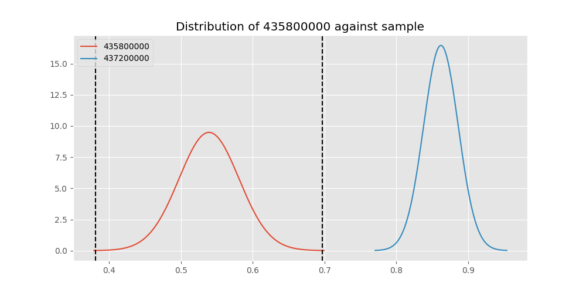 
## Testing Results for 435800000 against 435600000 
435800000 has a success rate of 0.5390070921985816
435600000 has a success rate of 0.9819341126461212
$H_{0}$: There is not a difference between 435800000 and 435600000
$H_{A}$: There is a difference between 435800000 and 435600000
An $/alpha$ of 0.00025 was used in this test.
__independent t-testing__: With a t-statistic of -10.458155805886284 and a p-value of 2.301354285656171e-19, _we **reject** the null hypothssis_
__Man-Whitney testing__: With a u-statistic of 36956.5 and a p-value of 1.3220563626321015e-76, _we **reject** the null hypothssis_
 
## Testing Results for 435800000 against 450000000 
435800000 has a success rate of 0.5390070921985816
450000000 has a success rate of 0.8235294117647058
$H_{0}$: There is not a difference between 435800000 and 450000000
$H_{A}$: There is a difference between 435800000 and 450000000
An $/alpha$ of 0.00025 was used in this test.
__independent t-testing__: With a t-statistic of -4.504733639292913 and a p-value of 1.0698590428794646e-05, _we **reject** the null hypothssis_
__Man-Whitney testing__: With a u-statistic of 4287.5 and a p-value of 1.5466962814918332e-05, _we **reject** the null hypothssis_
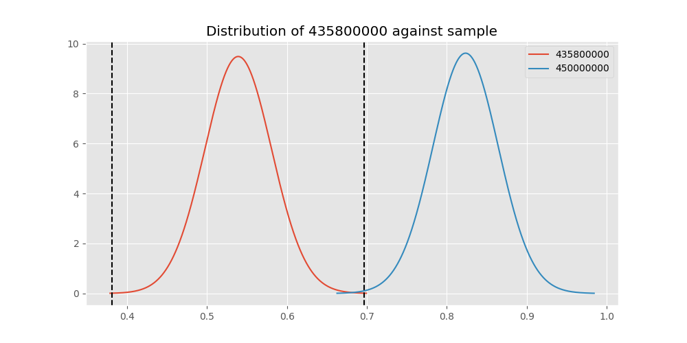 
## Testing Results for 435800000 against 145978500 
435800000 has a success rate of 0.5390070921985816
145978500 has a success rate of 0.9963636363636363
$H_{0}$: There is not a difference between 435800000 and 145978500
$H_{A}$: There is a difference between 435800000 and 145978500
An $/alpha$ of 0.00025 was used in this test.
__independent t-testing__: With a t-statistic of -10.815901856003304 and a p-value of 2.8918223976615415e-20, _we **reject** the null hypothssis_
__Man-Whitney testing__: With a u-statistic of 10520.5 and a p-value of 1.5125826055073941e-33, _we **reject** the null hypothssis_
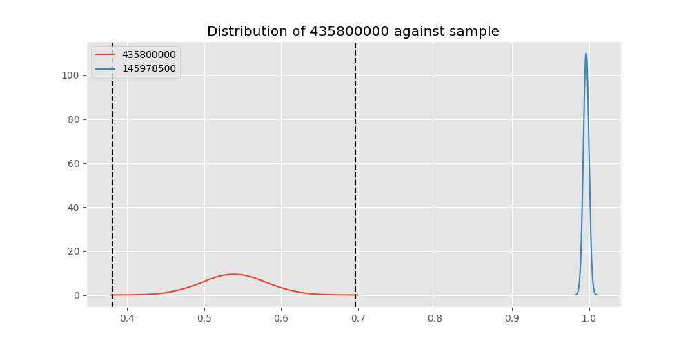 
## Testing Results for 435800000 against 437050000 
435800000 has a success rate of 0.5390070921985816
437050000 has a success rate of 0.5346534653465347
$H_{0}$: There is not a difference between 435800000 and 437050000
$H_{A}$: There is a difference between 435800000 and 437050000
An $/alpha$ of 0.00025 was used in this test.
__independent t-testing__: With a t-statistic of 0.06670377384437205 and a p-value of 0.94687306315281, _we failed to reject the null hypothssis_
__Man-Whitney testing__: With a u-statistic of 7151.5 and a p-value of 0.9475658138560821, _we failed to reject the null hypothssis_
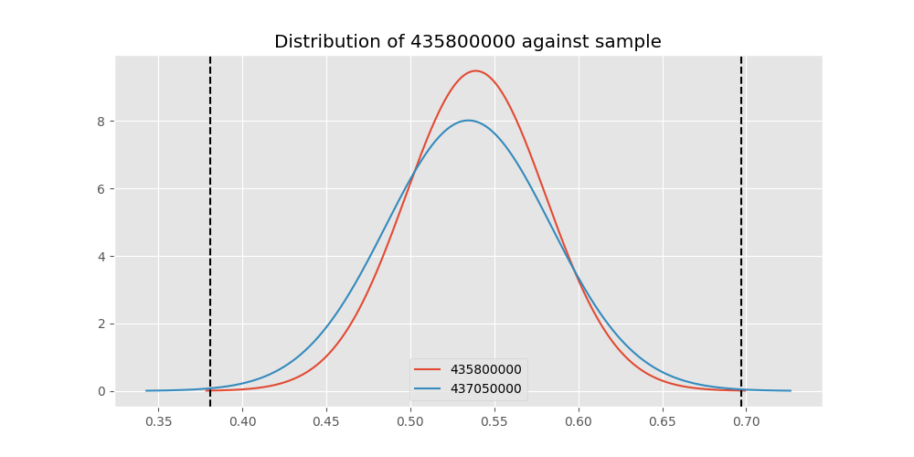 
## Testing Results for 435800000 against 435300000 
435800000 has a success rate of 0.5390070921985816
435300000 has a success rate of 0.1232876712328767
$H_{0}$: There is not a difference between 435800000 and 435300000
$H_{A}$: There is a difference between 435800000 and 435300000
An $/alpha$ of 0.00025 was used in this test.
__independent t-testing__: With a t-statistic of 8.33808527522397 and a p-value of 3.2571862764393507e-15, _we **reject** the null hypothssis_
__Man-Whitney testing__: With a u-statistic of 14572.0 and a p-value of 6.98378916470159e-14, _we **reject** the null hypothssis_
 
## Testing Results for 435800000 against 437475000 
435800000 has a success rate of 0.5390070921985816
437475000 has a success rate of 0.5045045045045045
$H_{0}$: There is not a difference between 435800000 and 437475000
$H_{A}$: There is a difference between 435800000 and 437475000
An $/alpha$ of 0.00025 was used in this test.
__independent t-testing__: With a t-statistic of 0.7311225568376606 and a p-value of 0.4649510675785429, _we failed to reject the null hypothssis_
__Man-Whitney testing__: With a u-statistic of 40477.5 and a p-value of 0.46472013318387007, _we failed to reject the null hypothssis_
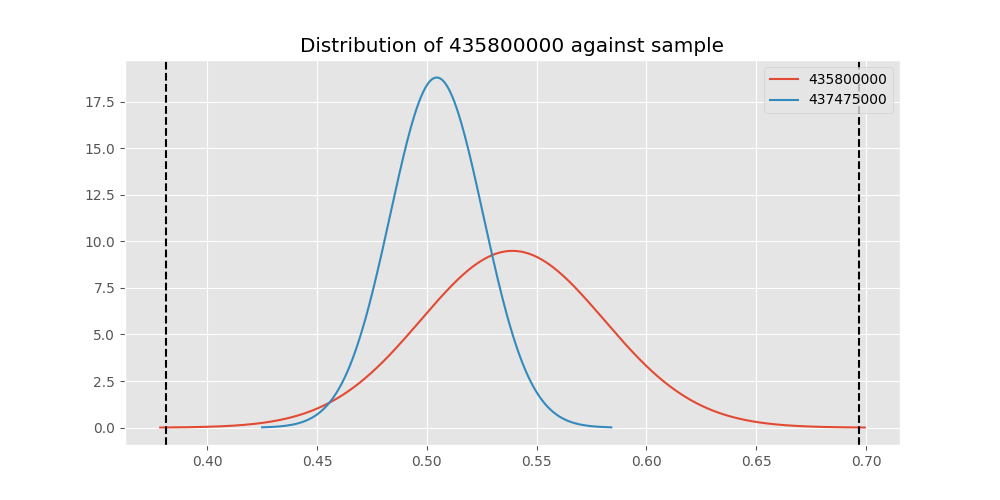 
## Testing Results for 435800000 against 435448000 
435800000 has a success rate of 0.5390070921985816
435448000 has a success rate of 0.975
$H_{0}$: There is not a difference between 435800000 and 435448000
$H_{A}$: There is a difference between 435800000 and 435448000
An $/alpha$ of 0.00025 was used in this test.
__independent t-testing__: With a t-statistic of -8.899953418459273 and a p-value of 6.462458047365253e-16, _we **reject** the null hypothssis_
__Man-Whitney testing__: With a u-statistic of 1590.5 and a p-value of 4.6476587402935034e-07, _we **reject** the null hypothssis_
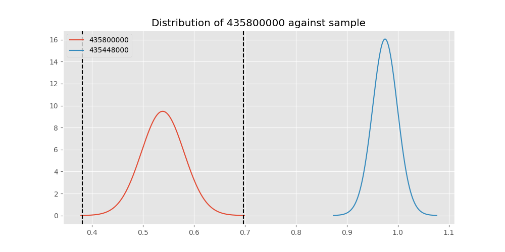 
## Testing Results for 435800000 against 437644000 
435800000 has a success rate of 0.5390070921985816
437644000 has a success rate of 0.9743589743589743
$H_{0}$: There is not a difference between 435800000 and 437644000
$H_{A}$: There is a difference between 435800000 and 437644000
An $/alpha$ of 0.00025 was used in this test.
__independent t-testing__: With a t-statistic of -9.758649262807742 and a p-value of 3.3754400103032598e-18, _we **reject** the null hypothssis_
__Man-Whitney testing__: With a u-statistic of 4657.5 and a p-value of 3.1380250967049157e-15, _we **reject** the null hypothssis_
 
## Testing Results for 435800000 against 145825000 
435800000 has a success rate of 0.5390070921985816
145825000 has a success rate of 0.8687448728465955
$H_{0}$: There is not a difference between 435800000 and 145825000
$H_{A}$: There is a difference between 435800000 and 145825000
An $/alpha$ of 0.00025 was used in this test.
__independent t-testing__: With a t-statistic of -10.922725637938898 and a p-value of 3.504981614384698e-27, _we **reject** the null hypothssis_
__Man-Whitney testing__: With a u-statistic of 115204.0 and a p-value of 1.2584376759552596e-26, _we **reject** the null hypothssis_
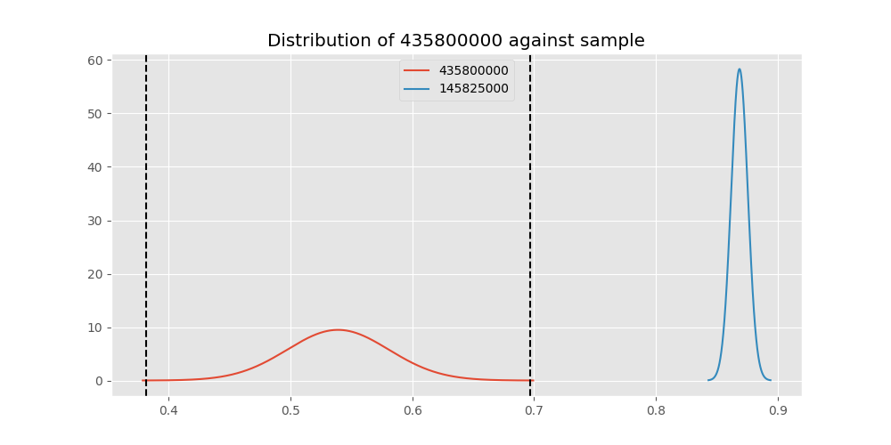 
## Testing Results for 435800000 against 437345000 
435800000 has a success rate of 0.5390070921985816
437345000 has a success rate of 0.7603092783505154
$H_{0}$: There is not a difference between 435800000 and 437345000
$H_{A}$: There is a difference between 435800000 and 437345000
An $/alpha$ of 0.00025 was used in this test.
__independent t-testing__: With a t-statistic of -5.024123053975842 and a p-value of 6.936641608777574e-07, _we **reject** the null hypothssis_
__Man-Whitney testing__: With a u-statistic of 21300.5 and a p-value of 9.005662182198052e-07, _we **reject** the null hypothssis_
 
## Testing Results for 435800000 against 435275000 
435800000 has a success rate of 0.5390070921985816
435275000 has a success rate of 0.9152542372881356
$H_{0}$: There is not a difference between 435800000 and 435275000
$H_{A}$: There is a difference between 435800000 and 435275000
An $/alpha$ of 0.00025 was used in this test.
__independent t-testing__: With a t-statistic of -7.272575920154315 and a p-value of 4.254384748979908e-12, _we **reject** the null hypothssis_
__Man-Whitney testing__: With a u-statistic of 5189.0 and a p-value of 3.2504833235170255e-11, _we **reject** the null hypothssis_
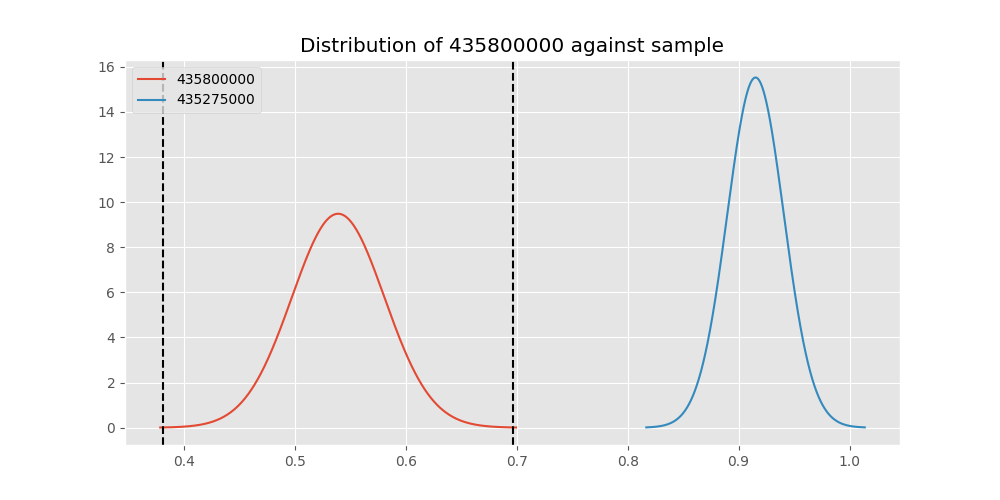 
## Testing Results for 435800000 against 437322500 
435800000 has a success rate of 0.5390070921985816
437322500 has a success rate of 0.9961685823754789
$H_{0}$: There is not a difference between 435800000 and 437322500
$H_{A}$: There is a difference between 435800000 and 437322500
An $/alpha$ of 0.00025 was used in this test.
__independent t-testing__: With a t-statistic of -10.80688814790758 and a p-value of 2.999115224542853e-20, _we **reject** the null hypothssis_
__Man-Whitney testing__: With a u-statistic of 9988.5 and a p-value of 4.2691394300716523e-32, _we **reject** the null hypothssis_
 
## Testing Results for 435800000 against 437450000 
435800000 has a success rate of 0.5390070921985816
437450000 has a success rate of 0.6947791164658634
$H_{0}$: There is not a difference between 435800000 and 437450000
$H_{A}$: There is a difference between 435800000 and 437450000
An $/alpha$ of 0.00025 was used in this test.
__independent t-testing__: With a t-statistic of -3.1062711821783595 and a p-value of 0.0020339437823236506, _we failed to reject the null hypothssis_
__Man-Whitney testing__: With a u-statistic of 14820.0 and a p-value of 0.0021281301997696732, _we failed to reject the null hypothssis_
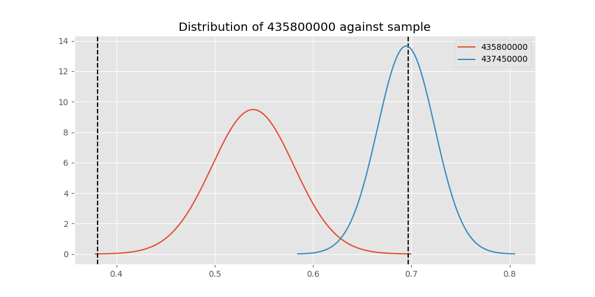 
## Testing Results for 435800000 against 436703000 
435800000 has a success rate of 0.5390070921985816
436703000 has a success rate of 0.9859154929577465
$H_{0}$: There is not a difference between 435800000 and 436703000
$H_{A}$: There is a difference between 435800000 and 436703000
An $/alpha$ of 0.00025 was used in this test.
__independent t-testing__: With a t-statistic of -10.417624454802155 and a p-value of 1.80290233611888e-19, _we **reject** the null hypothssis_
__Man-Whitney testing__: With a u-statistic of 8305.5 and a p-value of 1.7410852707633198e-25, _we **reject** the null hypothssis_
 
## Testing Results for 435800000 against 400500000 
435800000 has a success rate of 0.5390070921985816
400500000 has a success rate of 0.3508771929824561
$H_{0}$: There is not a difference between 435800000 and 400500000
$H_{A}$: There is a difference between 435800000 and 400500000
An $/alpha$ of 0.00025 was used in this test.
__independent t-testing__: With a t-statistic of 2.4215787039176115 and a p-value of 0.01636386233365671, _we failed to reject the null hypothssis_
__Man-Whitney testing__: With a u-statistic of 4774.5 and a p-value of 0.016818856654251275, _we failed to reject the null hypothssis_
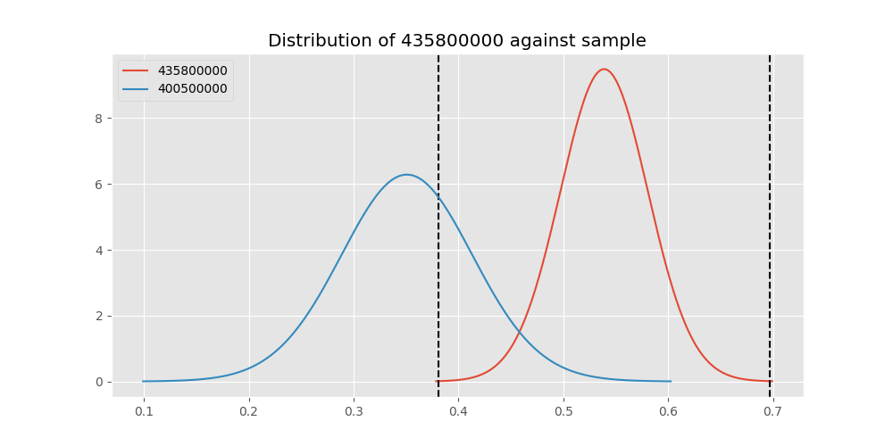 
## Testing Results for 435800000 against 437150000 
435800000 has a success rate of 0.5390070921985816
437150000 has a success rate of 0.9859550561797753
$H_{0}$: There is not a difference between 435800000 and 437150000
$H_{A}$: There is a difference between 435800000 and 437150000
An $/alpha$ of 0.00025 was used in this test.
__independent t-testing__: With a t-statistic of -10.4943573063268 and a p-value of 1.4885785367404964e-19, _we **reject** the null hypothssis_
__Man-Whitney testing__: With a u-statistic of 13880.5 and a p-value of 4.570316436977647e-38, _we **reject** the null hypothssis_
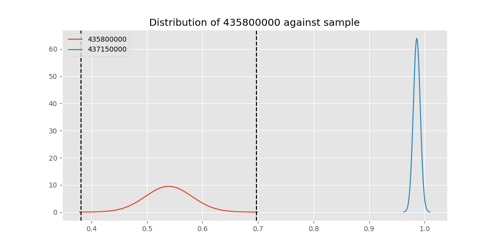 
## Testing Results for 435800000 against 435635000 
435800000 has a success rate of 0.5390070921985816
435635000 has a success rate of 0.9849624060150376
$H_{0}$: There is not a difference between 435800000 and 435635000
$H_{A}$: There is a difference between 435800000 and 435635000
An $/alpha$ of 0.00025 was used in this test.
__independent t-testing__: With a t-statistic of -10.26595050117719 and a p-value of 2.9749333396125626e-19, _we **reject** the null hypothssis_
__Man-Whitney testing__: With a u-statistic of 5195.0 and a p-value of 1.0612918778640803e-17, _we **reject** the null hypothssis_
 
## Testing Results for 435800000 against 437384000 
435800000 has a success rate of 0.5390070921985816
437384000 has a success rate of 0.968421052631579
$H_{0}$: There is not a difference between 435800000 and 437384000
$H_{A}$: There is a difference between 435800000 and 437384000
An $/alpha$ of 0.00025 was used in this test.
__independent t-testing__: With a t-statistic of -9.75776000246619 and a p-value of 4.6858473381257916e-18, _we **reject** the null hypothssis_
__Man-Whitney testing__: With a u-statistic of 7643.0 and a p-value of 5.641096759716007e-21, _we **reject** the null hypothssis_
 
## Testing Results for 435800000 against 437405000 
435800000 has a success rate of 0.5390070921985816
437405000 has a success rate of 0.9953917050691244
$H_{0}$: There is not a difference between 435800000 and 437405000
$H_{A}$: There is a difference between 435800000 and 437405000
An $/alpha$ of 0.00025 was used in this test.
__independent t-testing__: With a t-statistic of -10.768813640790208 and a p-value of 3.4858918462404964e-20, _we **reject** the null hypothssis_
__Man-Whitney testing__: With a u-statistic of 8316.5 and a p-value of 1.701393761952699e-27, _we **reject** the null hypothssis_
 
## Testing Results for 435800000 against 435612500 
435800000 has a success rate of 0.5390070921985816
435612500 has a success rate of 0.9770114942528736
$H_{0}$: There is not a difference between 435800000 and 435612500
$H_{A}$: There is a difference between 435800000 and 435612500
An $/alpha$ of 0.00025 was used in this test.
__independent t-testing__: With a t-statistic of -9.707079872986098 and a p-value of 3.812445877806332e-18, _we **reject** the null hypothssis_
__Man-Whitney testing__: With a u-statistic of 3447.0 and a p-value of 1.977546525766715e-12, _we **reject** the null hypothssis_
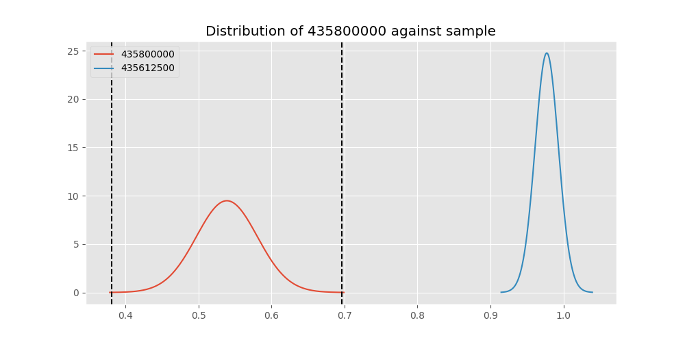 
## Testing Results for 435800000 against 435975000 
435800000 has a success rate of 0.5390070921985816
435975000 has a success rate of 0.92
$H_{0}$: There is not a difference between 435800000 and 435975000
$H_{A}$: There is a difference between 435800000 and 435975000
An $/alpha$ of 0.00025 was used in this test.
__independent t-testing__: With a t-statistic of -5.114267629069043 and a p-value of 7.693021490093769e-07, _we **reject** the null hypothssis_
__Man-Whitney testing__: With a u-statistic of 2182.0 and a p-value of 1.5536294191493708e-06, _we **reject** the null hypothssis_
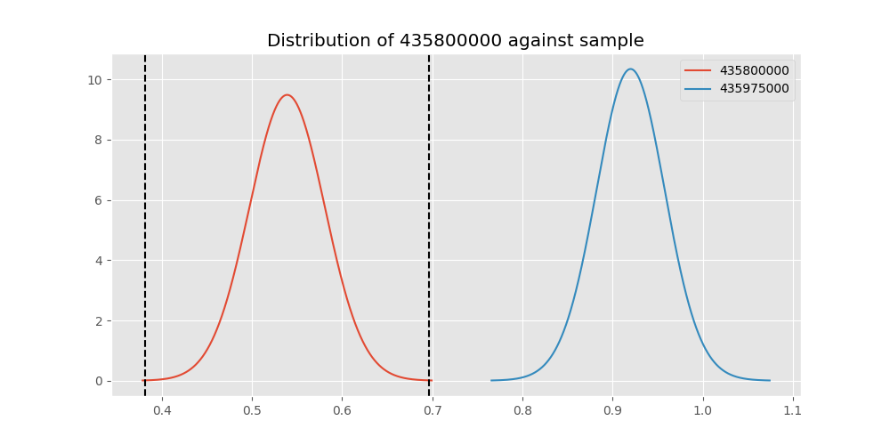 
## Testing Results for 435800000 against 437425000 
435800000 has a success rate of 0.5390070921985816
437425000 has a success rate of 0.6987654320987654
$H_{0}$: There is not a difference between 435800000 and 437425000
$H_{A}$: There is a difference between 435800000 and 437425000
An $/alpha$ of 0.00025 was used in this test.
__independent t-testing__: With a t-statistic of -3.474547724645566 and a p-value of 0.0005525125894281338, _we failed to reject the null hypothssis_
__Man-Whitney testing__: With a u-statistic of 23991.0 and a p-value of 0.0005829959732076736, _we failed to reject the null hypothssis_
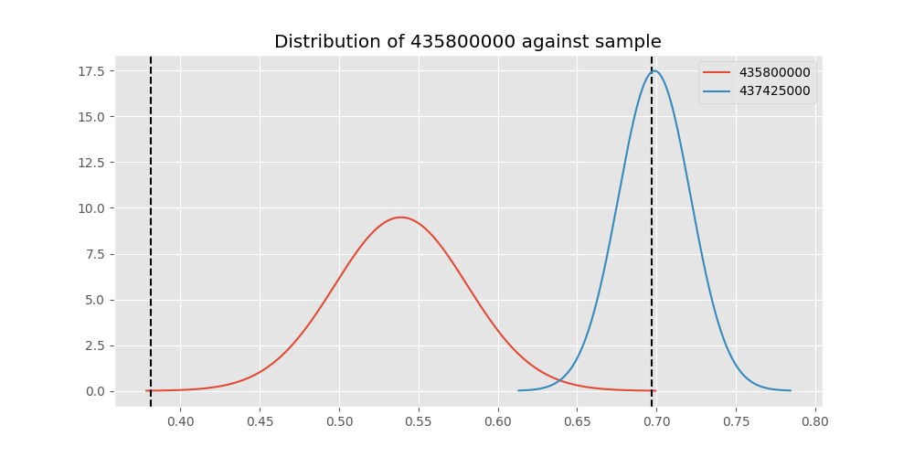 
## Testing Results for 435800000 against 437275000 
435800000 has a success rate of 0.5390070921985816
437275000 has a success rate of 0.3643724696356275
$H_{0}$: There is not a difference between 435800000 and 437275000
$H_{A}$: There is a difference between 435800000 and 437275000
An $/alpha$ of 0.00025 was used in this test.
__independent t-testing__: With a t-statistic of 3.3845580029781797 and a p-value of 0.0007860153095809917, _we failed to reject the null hypothssis_
__Man-Whitney testing__: With a u-statistic of 20454.5 and a p-value of 0.0008402123478592319, _we failed to reject the null hypothssis_
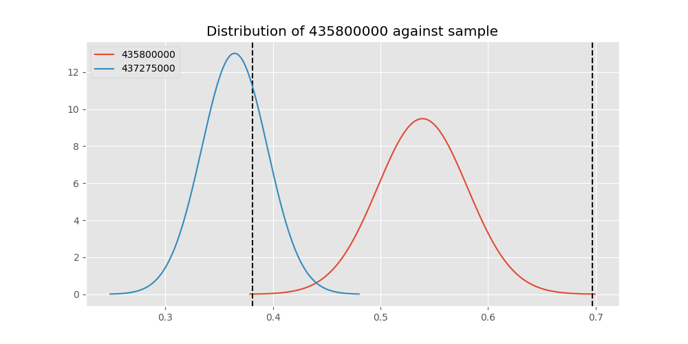 
## Testing Results for 435800000 against 145840000 
435800000 has a success rate of 0.5390070921985816
145840000 has a success rate of 0.9649122807017544
$H_{0}$: There is not a difference between 435800000 and 145840000
$H_{A}$: There is a difference between 435800000 and 145840000
An $/alpha$ of 0.00025 was used in this test.
__independent t-testing__: With a t-statistic of -8.731255083003898 and a p-value of 1.1303349220589757e-15, _we **reject** the null hypothssis_
__Man-Whitney testing__: With a u-statistic of 2307.0 and a p-value of 1.073773011475056e-08, _we **reject** the null hypothssis_
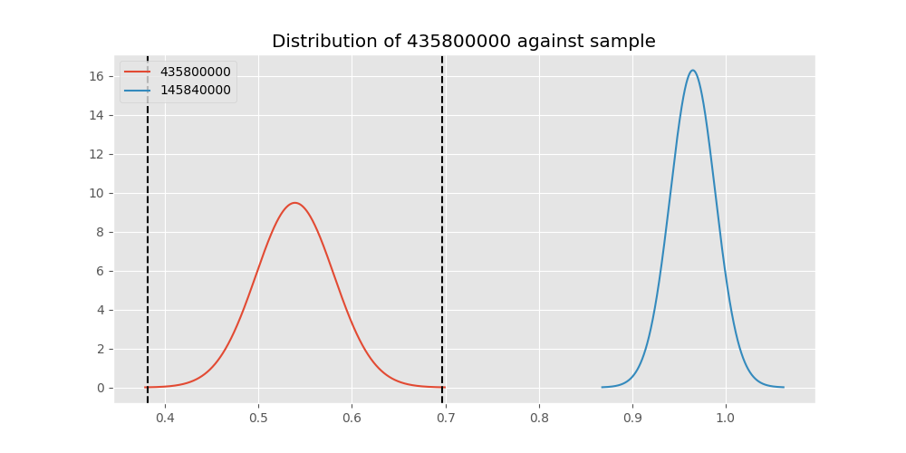 
## Testing Results for 435800000 against 435525000 
435800000 has a success rate of 0.5390070921985816
435525000 has a success rate of 0.6923076923076923
$H_{0}$: There is not a difference between 435800000 and 435525000
$H_{A}$: There is a difference between 435800000 and 435525000
An $/alpha$ of 0.00025 was used in this test.
__independent t-testing__: With a t-statistic of -2.6802549814616903 and a p-value of 0.007789462761903234, _we failed to reject the null hypothssis_
__Man-Whitney testing__: With a u-statistic of 8536.0 and a p-value of 0.008035234167796664, _we failed to reject the null hypothssis_
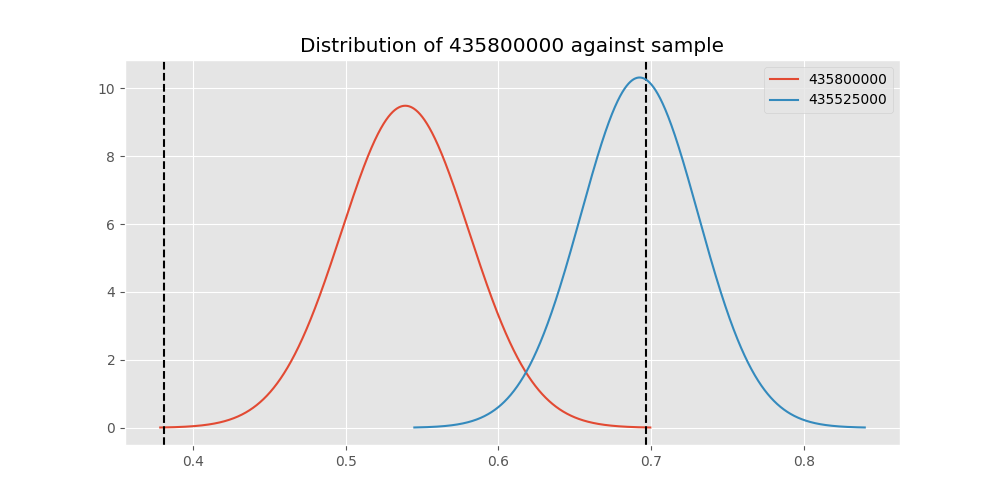 
## Testing Results for 435800000 against 436250000 
435800000 has a success rate of 0.5390070921985816
436250000 has a success rate of 0.17857142857142858
$H_{0}$: There is not a difference between 435800000 and 436250000
$H_{A}$: There is a difference between 435800000 and 436250000
An $/alpha$ of 0.00025 was used in this test.
__independent t-testing__: With a t-statistic of 4.8453341674111465 and a p-value of 2.5721882598051226e-06, _we **reject** the null hypothssis_
__Man-Whitney testing__: With a u-statistic of 5371.0 and a p-value of 4.481331005918142e-06, _we **reject** the null hypothssis_
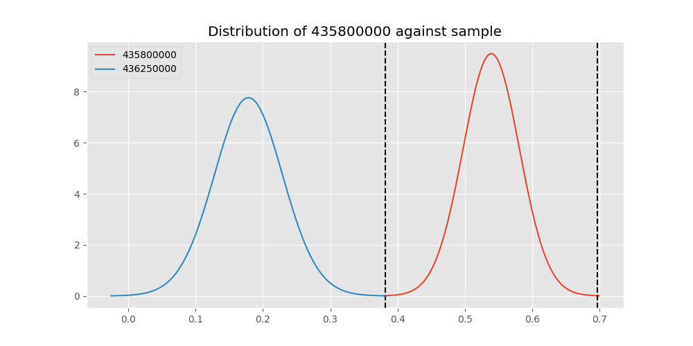 
## Testing Results for 435800000 against 435950000 
435800000 has a success rate of 0.5390070921985816
435950000 has a success rate of 0.9850187265917603
$H_{0}$: There is not a difference between 435800000 and 435950000
$H_{A}$: There is a difference between 435800000 and 435950000
An $/alpha$ of 0.00025 was used in this test.
__independent t-testing__: With a t-statistic of -10.505207754880335 and a p-value of 1.5762893718618184e-19, _we **reject** the null hypothssis_
__Man-Whitney testing__: With a u-statistic of 20856.0 and a p-value of 6.918725704148081e-52, _we **reject** the null hypothssis_
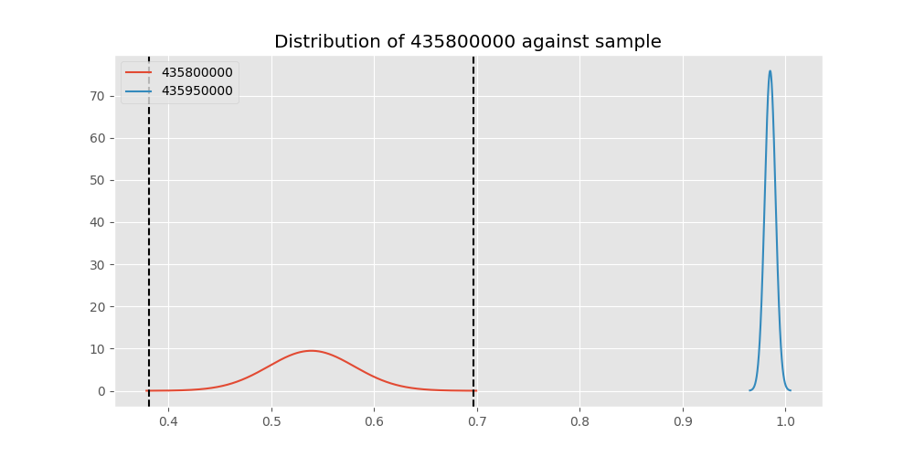 
## Testing Results for 435800000 against 437485000 
435800000 has a success rate of 0.5390070921985816
437485000 has a success rate of 0.9375
$H_{0}$: There is not a difference between 435800000 and 437485000
$H_{A}$: There is a difference between 435800000 and 437485000
An $/alpha$ of 0.00025 was used in this test.
__independent t-testing__: With a t-statistic of -6.582419570035656 and a p-value of 2.3340588522716226e-09, _we **reject** the null hypothssis_
__Man-Whitney testing__: With a u-statistic of 1357.0 and a p-value of 3.136845512084048e-05, _we **reject** the null hypothssis_
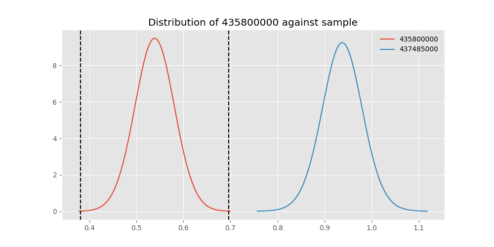 
## Testing Results for 435800000 against 136770000 
435800000 has a success rate of 0.5390070921985816
136770000 has a success rate of 0.9945945945945946
$H_{0}$: There is not a difference between 435800000 and 136770000
$H_{A}$: There is a difference between 435800000 and 136770000
An $/alpha$ of 0.00025 was used in this test.
__independent t-testing__: With a t-statistic of -10.726197197674786 and a p-value of 4.1056725215095017e-20, _we **reject** the null hypothssis_
__Man-Whitney testing__: With a u-statistic of 7100.5 and a p-value of 4.260773302575425e-24, _we **reject** the null hypothssis_
 
## Testing Results for 435800000 against 437250000 
435800000 has a success rate of 0.5390070921985816
437250000 has a success rate of 0.9937106918238994
$H_{0}$: There is not a difference between 435800000 and 437250000
$H_{A}$: There is a difference between 435800000 and 437250000
An $/alpha$ of 0.00025 was used in this test.
__independent t-testing__: With a t-statistic of -10.73369465162806 and a p-value of 4.3798105216925856e-20, _we **reject** the null hypothssis_
__Man-Whitney testing__: With a u-statistic of 12225.0 and a p-value of 4.943374253583162e-37, _we **reject** the null hypothssis_
 
## Testing Results for 435800000 against 437356000 
435800000 has a success rate of 0.5390070921985816
437356000 has a success rate of 0.9328358208955224
$H_{0}$: There is not a difference between 435800000 and 437356000
$H_{A}$: There is a difference between 435800000 and 437356000
An $/alpha$ of 0.00025 was used in this test.
__independent t-testing__: With a t-statistic of -8.184355665949784 and a p-value of 1.0523621426210117e-14, _we **reject** the null hypothssis_
__Man-Whitney testing__: With a u-statistic of 5726.5 and a p-value of 2.0367306145731534e-13, _we **reject** the null hypothssis_
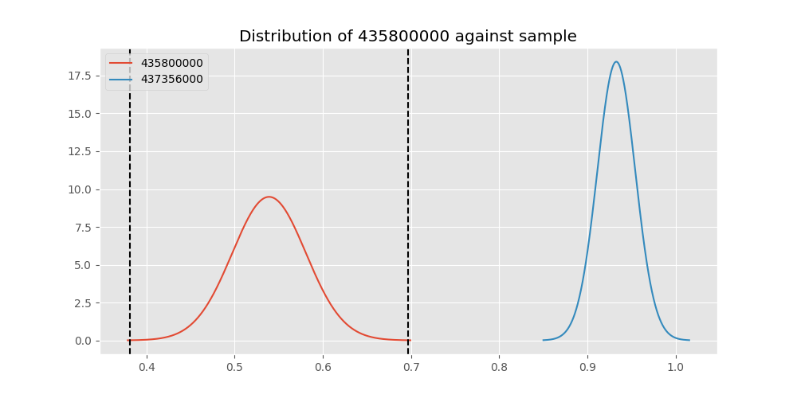 
## Testing Results for 435800000 against 437676000 
435800000 has a success rate of 0.5390070921985816
437676000 has a success rate of 0.9813432835820896
$H_{0}$: There is not a difference between 435800000 and 437676000
$H_{A}$: There is a difference between 435800000 and 437676000
An $/alpha$ of 0.00025 was used in this test.
__independent t-testing__: With a t-statistic of -10.302451820609075 and a p-value of 3.5256403514753437e-19, _we **reject** the null hypothssis_
__Man-Whitney testing__: With a u-statistic of 10536.5 and a p-value of 1.7602682186216295e-29, _we **reject** the null hypothssis_
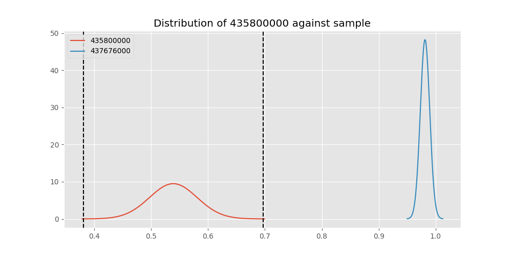 
## Testing Results for 435800000 against 145826800 
435800000 has a success rate of 0.5390070921985816
145826800 has a success rate of 0.966183574879227
$H_{0}$: There is not a difference between 435800000 and 145826800
$H_{A}$: There is a difference between 435800000 and 145826800
An $/alpha$ of 0.00025 was used in this test.
__independent t-testing__: With a t-statistic of -9.71495093858381 and a p-value of 6.2442924712879866e-18, _we **reject** the null hypothssis_
__Man-Whitney testing__: With a u-statistic of 8359.5 and a p-value of 5.26382772748039e-22, _we **reject** the null hypothssis_
 
