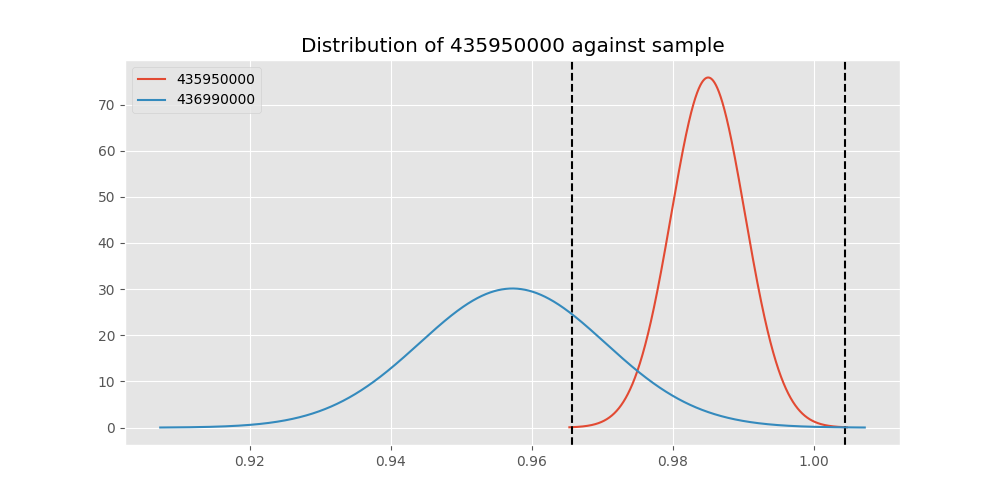
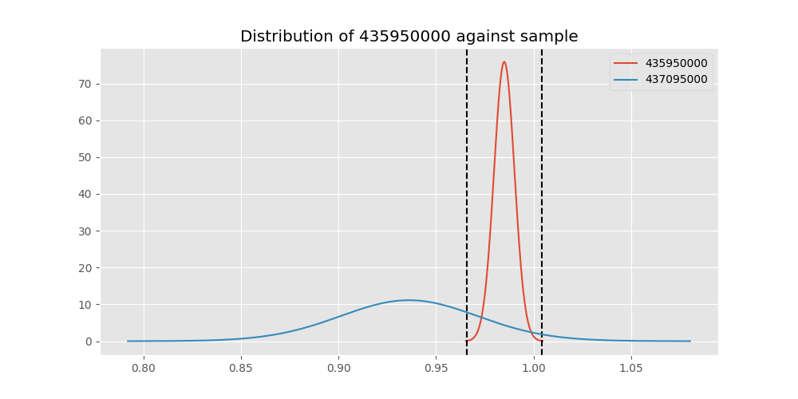
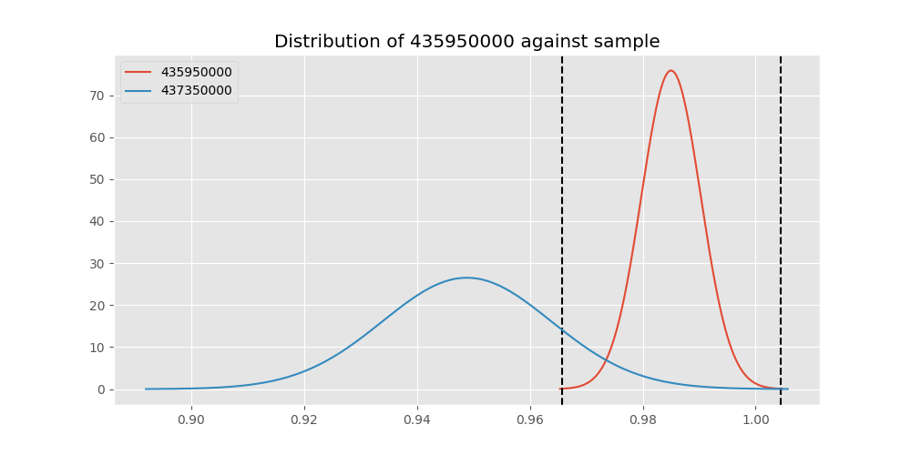
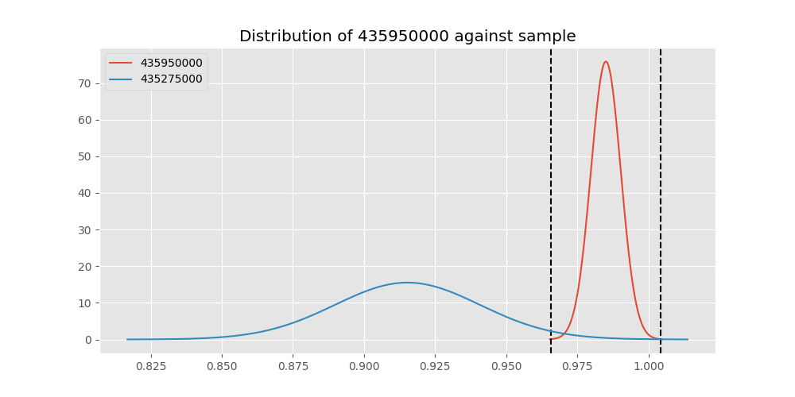
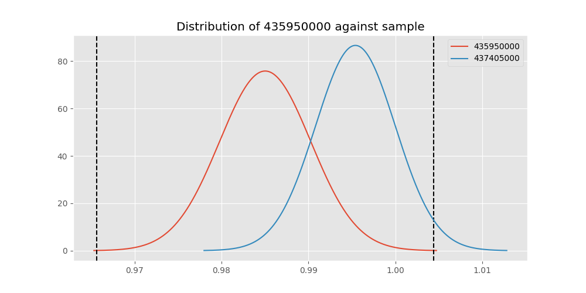

# Testing Results For 435950000 
$H_{0}$: There is not a difference in collection success against 435950000 
$H_{A}$: There is a difference in collection success against 435950000
An $\alpha$ of 0.00025 was used 
Out of 44 tests, there were 17 rejections from 44 independent-t test.
Out of 44 tests, there were 17 rejections from 44 Man Whitney u-tests.
## Testing Results for 435950000 against 436501000 
435950000 has a success rate of 0.9850187265917603
436501000 has a success rate of 0.9854014598540146
$H_{0}$: There is not a difference between 435950000 and 436501000
$H_{A}$: There is a difference between 435950000 and 436501000
An $/alpha$ of 0.00025 was used in this test.
__independent t-testing__: With a t-statistic of -0.032933645047152744 and a p-value of 0.973737325552364, _we failed to reject the null hypothssis_
__Man-Whitney testing__: With a u-statistic of 36565.0 and a p-value of 0.9746465840898016, _we failed to reject the null hypothssis_
 
## Testing Results for 435950000 against 437375000 
435950000 has a success rate of 0.9850187265917603
437375000 has a success rate of 0.9982014388489209
$H_{0}$: There is not a difference between 435950000 and 437375000
$H_{A}$: There is a difference between 435950000 and 437375000
An $/alpha$ of 0.00025 was used in this test.
__independent t-testing__: With a t-statistic of -2.3707003409065375 and a p-value of 0.018042374117623956, _we failed to reject the null hypothssis_
__Man-Whitney testing__: With a u-statistic of 146495.0 and a p-value of 0.016278936447719952, _we failed to reject the null hypothssis_
 
## Testing Results for 435950000 against 436500000 
435950000 has a success rate of 0.9850187265917603
436500000 has a success rate of 0.9056603773584906
$H_{0}$: There is not a difference between 435950000 and 436500000
$H_{A}$: There is a difference between 435950000 and 436500000
An $/alpha$ of 0.00025 was used in this test.
__independent t-testing__: With a t-statistic of 4.983887318852729 and a p-value of 7.885961829381825e-07, _we **reject** the null hypothssis_
__Man-Whitney testing__: With a u-statistic of 45822.0 and a p-value of 9.609562172430606e-07, _we **reject** the null hypothssis_
 
## Testing Results for 435950000 against 436990000 
435950000 has a success rate of 0.9850187265917603
436990000 has a success rate of 0.9572649572649573
$H_{0}$: There is not a difference between 435950000 and 436990000
$H_{A}$: There is a difference between 435950000 and 436990000
An $/alpha$ of 0.00025 was used in this test.
__independent t-testing__: With a t-statistic of 2.3453181152749663 and a p-value of 0.019265129569416763, _we failed to reject the null hypothssis_
__Man-Whitney testing__: With a u-statistic of 64212.0 and a p-value of 0.019397981024993464, _we failed to reject the null hypothssis_
 
## Testing Results for 435950000 against 145875000 
435950000 has a success rate of 0.9850187265917603
145875000 has a success rate of 0.9722222222222222
$H_{0}$: There is not a difference between 435950000 and 145875000
$H_{A}$: There is a difference between 435950000 and 145875000
An $/alpha$ of 0.00025 was used in this test.
__independent t-testing__: With a t-statistic of 0.7991955765386044 and a p-value of 0.4244911780726428, _we failed to reject the null hypothssis_
__Man-Whitney testing__: With a u-statistic of 19470.0 and a p-value of 0.424981080098085, _we failed to reject the null hypothssis_
 
## Testing Results for 435950000 against 437800000 
435950000 has a success rate of 0.9850187265917603
437800000 has a success rate of 0.9533678756476683
$H_{0}$: There is not a difference between 435950000 and 437800000
$H_{A}$: There is a difference between 435950000 and 437800000
An $/alpha$ of 0.00025 was used in this test.
__independent t-testing__: With a t-statistic of 2.5010102897559743 and a p-value of 0.012603485894618337, _we failed to reject the null hypothssis_
__Man-Whitney testing__: With a u-statistic of 53162.0 and a p-value of 0.012729681883990249, _we failed to reject the null hypothssis_
 
## Testing Results for 435950000 against 145810000 
435950000 has a success rate of 0.9850187265917603
145810000 has a success rate of 0.12179487179487179
$H_{0}$: There is not a difference between 435950000 and 145810000
$H_{A}$: There is a difference between 435950000 and 145810000
An $/alpha$ of 0.00025 was used in this test.
__independent t-testing__: With a t-statistic of 50.19476131302765 and a p-value of 3.496851309402167e-232, _we **reject** the null hypothssis_
__Man-Whitney testing__: With a u-statistic of 77607.0 and a p-value of 1.0352222877353312e-119, _we **reject** the null hypothssis_
 
## Testing Results for 435950000 against 437095000 
435950000 has a success rate of 0.9850187265917603
437095000 has a success rate of 0.9361702127659575
$H_{0}$: There is not a difference between 435950000 and 437095000
$H_{A}$: There is a difference between 435950000 and 437095000
An $/alpha$ of 0.00025 was used in this test.
__independent t-testing__: With a t-statistic of 2.3629824052284825 and a p-value of 0.018458093032923704, _we failed to reject the null hypothssis_
__Man-Whitney testing__: With a u-statistic of 13162.0 and a p-value of 0.018683804119115223, _we failed to reject the null hypothssis_
 
## Testing Results for 435950000 against 437265000 
435950000 has a success rate of 0.9850187265917603
437265000 has a success rate of 0.9795454545454545
$H_{0}$: There is not a difference between 435950000 and 437265000
$H_{A}$: There is a difference between 435950000 and 437265000
An $/alpha$ of 0.00025 was used in this test.
__independent t-testing__: With a t-statistic of 0.6486205015907557 and a p-value of 0.5167369058734894, _we failed to reject the null hypothssis_
__Man-Whitney testing__: With a u-statistic of 118123.0 and a p-value of 0.516785016795927, _we failed to reject the null hypothssis_
 
## Testing Results for 435950000 against 437350000 
435950000 has a success rate of 0.9850187265917603
437350000 has a success rate of 0.9488372093023256
$H_{0}$: There is not a difference between 435950000 and 437350000
$H_{A}$: There is a difference between 435950000 and 437350000
An $/alpha$ of 0.00025 was used in this test.
__independent t-testing__: With a t-statistic of 2.860649147783916 and a p-value of 0.004345781061257176, _we failed to reject the null hypothssis_
__Man-Whitney testing__: With a u-statistic of 59482.0 and a p-value of 0.004422689104142137, _we failed to reject the null hypothssis_
 
## Testing Results for 435950000 against 437200000 
435950000 has a success rate of 0.9850187265917603
437200000 has a success rate of 0.8620689655172413
$H_{0}$: There is not a difference between 435950000 and 437200000
$H_{A}$: There is a difference between 435950000 and 437200000
An $/alpha$ of 0.00025 was used in this test.
__independent t-testing__: With a t-statistic of 7.144282411396997 and a p-value of 2.1819154763747773e-12, _we **reject** the null hypothssis_
__Man-Whitney testing__: With a u-statistic of 60865.0 and a p-value of 4.7579846591046e-12, _we **reject** the null hypothssis_
 
## Testing Results for 435950000 against 435600000 
435950000 has a success rate of 0.9850187265917603
435600000 has a success rate of 0.9819341126461212
$H_{0}$: There is not a difference between 435950000 and 435600000
$H_{A}$: There is a difference between 435950000 and 435600000
An $/alpha$ of 0.00025 was used in this test.
__independent t-testing__: With a t-statistic of 0.4408006925599533 and a p-value of 0.6594219763873346, _we failed to reject the null hypothssis_
__Man-Whitney testing__: With a u-statistic of 252022.0 and a p-value of 0.6594759943002709, _we failed to reject the null hypothssis_
 
## Testing Results for 435950000 against 450000000 
435950000 has a success rate of 0.9850187265917603
450000000 has a success rate of 0.8235294117647058
$H_{0}$: There is not a difference between 435950000 and 450000000
$H_{A}$: There is a difference between 435950000 and 450000000
An $/alpha$ of 0.00025 was used in this test.
__independent t-testing__: With a t-statistic of 7.636423817199829 and a p-value of 8.542986198125031e-14, _we **reject** the null hypothssis_
__Man-Whitney testing__: With a u-statistic of 26360.0 and a p-value of 2.7895041642745504e-13, _we **reject** the null hypothssis_
 
## Testing Results for 435950000 against 145978500 
435950000 has a success rate of 0.9850187265917603
145978500 has a success rate of 0.9963636363636363
$H_{0}$: There is not a difference between 435950000 and 145978500
$H_{A}$: There is a difference between 435950000 and 145978500
An $/alpha$ of 0.00025 was used in this test.
__independent t-testing__: With a t-statistic of -1.773735704490913 and a p-value of 0.07648436896124948, _we failed to reject the null hypothssis_
__Man-Whitney testing__: With a u-statistic of 72592.0 and a p-value of 0.14552673219537016, _we failed to reject the null hypothssis_
 
## Testing Results for 435950000 against 437050000 
435950000 has a success rate of 0.9850187265917603
437050000 has a success rate of 0.5346534653465347
$H_{0}$: There is not a difference between 435950000 and 437050000
$H_{A}$: There is a difference between 435950000 and 437050000
An $/alpha$ of 0.00025 was used in this test.
__independent t-testing__: With a t-statistic of 18.175899439499617 and a p-value of 1.015945729542113e-59, _we **reject** the null hypothssis_
__Man-Whitney testing__: With a u-statistic of 39112.0 and a p-value of 3.3419294447185654e-49, _we **reject** the null hypothssis_
 
## Testing Results for 435950000 against 435300000 
435950000 has a success rate of 0.9850187265917603
435300000 has a success rate of 0.1232876712328767
$H_{0}$: There is not a difference between 435950000 and 435300000
$H_{A}$: There is a difference between 435950000 and 435300000
An $/alpha$ of 0.00025 was used in this test.
__independent t-testing__: With a t-statistic of 49.392715475887556 and a p-value of 8.300147857434821e-227, _we **reject** the null hypothssis_
__Man-Whitney testing__: With a u-statistic of 72574.0 and a p-value of 1.4576384182606026e-117, _we **reject** the null hypothssis_
 
## Testing Results for 435950000 against 437475000 
435950000 has a success rate of 0.9850187265917603
437475000 has a success rate of 0.5045045045045045
$H_{0}$: There is not a difference between 435950000 and 437475000
$H_{A}$: There is a difference between 435950000 and 437475000
An $/alpha$ of 0.00025 was used in this test.
__independent t-testing__: With a t-statistic of 21.583866046670806 and a p-value of 2.845050934776106e-86, _we **reject** the null hypothssis_
__Man-Whitney testing__: With a u-statistic of 219390.0 and a p-value of 5.850979117842329e-73, _we **reject** the null hypothssis_
 
## Testing Results for 435950000 against 435448000 
435950000 has a success rate of 0.9850187265917603
435448000 has a success rate of 0.975
$H_{0}$: There is not a difference between 435950000 and 435448000
$H_{A}$: There is a difference between 435950000 and 435448000
An $/alpha$ of 0.00025 was used in this test.
__independent t-testing__: With a t-statistic of 0.4911987589362405 and a p-value of 0.6234742851749792, _we failed to reject the null hypothssis_
__Man-Whitney testing__: With a u-statistic of 10787.0 and a p-value of 0.624680681910617, _we failed to reject the null hypothssis_
 
## Testing Results for 435950000 against 437644000 
435950000 has a success rate of 0.9850187265917603
437644000 has a success rate of 0.9743589743589743
$H_{0}$: There is not a difference between 435950000 and 437644000
$H_{A}$: There is a difference between 435950000 and 437644000
An $/alpha$ of 0.00025 was used in this test.
__independent t-testing__: With a t-statistic of 0.8094048052431779 and a p-value of 0.4185789804365364, _we failed to reject the null hypothssis_
__Man-Whitney testing__: With a u-statistic of 31572.0 and a p-value of 0.4188580704800636, _we failed to reject the null hypothssis_
 
## Testing Results for 435950000 against 145825000 
435950000 has a success rate of 0.9850187265917603
145825000 has a success rate of 0.8687448728465955
$H_{0}$: There is not a difference between 435950000 and 145825000
$H_{A}$: There is a difference between 435950000 and 145825000
An $/alpha$ of 0.00025 was used in this test.
__independent t-testing__: With a t-statistic of 7.843910213706154 and a p-value of 6.041413088872282e-15, _we **reject** the null hypothssis_
__Man-Whitney testing__: With a u-statistic of 726634.0 and a p-value of 8.15428321373426e-15, _we **reject** the null hypothssis_
 
## Testing Results for 435950000 against 437345000 
435950000 has a success rate of 0.9850187265917603
437345000 has a success rate of 0.7603092783505154
$H_{0}$: There is not a difference between 435950000 and 437345000
$H_{A}$: There is a difference between 435950000 and 437345000
An $/alpha$ of 0.00025 was used in this test.
__independent t-testing__: With a t-statistic of 11.52539020144105 and a p-value of 8.374860198639543e-29, _we **reject** the null hypothssis_
__Man-Whitney testing__: With a u-statistic of 126875.0 and a p-value of 4.305163785596945e-27, _we **reject** the null hypothssis_
 
## Testing Results for 435950000 against 435275000 
435950000 has a success rate of 0.9850187265917603
435275000 has a success rate of 0.9152542372881356
$H_{0}$: There is not a difference between 435950000 and 435275000
$H_{A}$: There is a difference between 435950000 and 435275000
An $/alpha$ of 0.00025 was used in this test.
__independent t-testing__: With a t-statistic of 4.2367933627959475 and a p-value of 2.59519439283071e-05, _we **reject** the null hypothssis_
__Man-Whitney testing__: With a u-statistic of 33704.0 and a p-value of 2.8928871649473375e-05, _we **reject** the null hypothssis_
 
## Testing Results for 435950000 against 437322500 
435950000 has a success rate of 0.9850187265917603
437322500 has a success rate of 0.9961685823754789
$H_{0}$: There is not a difference between 435950000 and 437322500
$H_{A}$: There is a difference between 435950000 and 437322500
An $/alpha$ of 0.00025 was used in this test.
__independent t-testing__: With a t-statistic of -1.3953935962564472 and a p-value of 0.16328780339785814, _we failed to reject the null hypothssis_
__Man-Whitney testing__: With a u-statistic of 68910.0 and a p-value of 0.16341888356686074, _we failed to reject the null hypothssis_
 
## Testing Results for 435950000 against 437450000 
435950000 has a success rate of 0.9850187265917603
437450000 has a success rate of 0.6947791164658634
$H_{0}$: There is not a difference between 435950000 and 437450000
$H_{A}$: There is a difference between 435950000 and 437450000
An $/alpha$ of 0.00025 was used in this test.
__independent t-testing__: With a t-statistic of 13.568655019174056 and a p-value of 8.24457772035301e-38, _we **reject** the null hypothssis_
__Man-Whitney testing__: With a u-statistic of 85779.0 and a p-value of 2.6324584832791578e-34, _we **reject** the null hypothssis_
 
## Testing Results for 435950000 against 436703000 
435950000 has a success rate of 0.9850187265917603
436703000 has a success rate of 0.9859154929577465
$H_{0}$: There is not a difference between 435950000 and 436703000
$H_{A}$: There is a difference between 435950000 and 436703000
An $/alpha$ of 0.00025 was used in this test.
__independent t-testing__: With a t-statistic of -0.09174556542152018 and a p-value of 0.9269248571743182, _we failed to reject the null hypothssis_
__Man-Whitney testing__: With a u-statistic of 56820.0 and a p-value of 0.9275668570088886, _we failed to reject the null hypothssis_
 
## Testing Results for 435950000 against 400500000 
435950000 has a success rate of 0.9850187265917603
400500000 has a success rate of 0.3508771929824561
$H_{0}$: There is not a difference between 435950000 and 400500000
$H_{A}$: There is a difference between 435950000 and 400500000
An $/alpha$ of 0.00025 was used in this test.
__independent t-testing__: With a t-statistic of 24.18097924210687 and a p-value of 3.016500247116158e-90, _we **reject** the null hypothssis_
__Man-Whitney testing__: With a u-statistic of 24870.0 and a p-value of 7.049536814165346e-66, _we **reject** the null hypothssis_
 
## Testing Results for 435950000 against 437150000 
435950000 has a success rate of 0.9850187265917603
437150000 has a success rate of 0.9859550561797753
$H_{0}$: There is not a difference between 435950000 and 437150000
$H_{A}$: There is a difference between 435950000 and 437150000
An $/alpha$ of 0.00025 was used in this test.
__independent t-testing__: With a t-statistic of -0.11393641735532893 and a p-value of 0.909313950997686, _we failed to reject the null hypothssis_
__Man-Whitney testing__: With a u-statistic of 94963.0 and a p-value of 0.9097457281020767, _we failed to reject the null hypothssis_
 
## Testing Results for 435950000 against 435635000 
435950000 has a success rate of 0.9850187265917603
435635000 has a success rate of 0.9849624060150376
$H_{0}$: There is not a difference between 435950000 and 435635000
$H_{A}$: There is a difference between 435950000 and 435635000
An $/alpha$ of 0.00025 was used in this test.
__independent t-testing__: With a t-statistic of 0.004775201338829971 and a p-value of 0.9961913871565611, _we failed to reject the null hypothssis_
__Man-Whitney testing__: With a u-statistic of 35513.0 and a p-value of 0.9971403138816112, _we failed to reject the null hypothssis_
 
## Testing Results for 435950000 against 437384000 
435950000 has a success rate of 0.9850187265917603
437384000 has a success rate of 0.968421052631579
$H_{0}$: There is not a difference between 435950000 and 437384000
$H_{A}$: There is a difference between 435950000 and 437384000
An $/alpha$ of 0.00025 was used in this test.
__independent t-testing__: With a t-statistic of 1.426860532851709 and a p-value of 0.1540523937151724, _we failed to reject the null hypothssis_
__Man-Whitney testing__: With a u-statistic of 51572.0 and a p-value of 0.1541593075885901, _we failed to reject the null hypothssis_
 
## Testing Results for 435950000 against 437405000 
435950000 has a success rate of 0.9850187265917603
437405000 has a success rate of 0.9953917050691244
$H_{0}$: There is not a difference between 435950000 and 437405000
$H_{A}$: There is a difference between 435950000 and 437405000
An $/alpha$ of 0.00025 was used in this test.
__independent t-testing__: With a t-statistic of -1.1836613930092987 and a p-value of 0.2369226504597337, _we failed to reject the null hypothssis_
__Man-Whitney testing__: With a u-statistic of 57338.0 and a p-value of 0.23706266358084482, _we failed to reject the null hypothssis_
 
## Testing Results for 435950000 against 435612500 
435950000 has a success rate of 0.9850187265917603
435612500 has a success rate of 0.9770114942528736
$H_{0}$: There is not a difference between 435950000 and 435612500
$H_{A}$: There is a difference between 435950000 and 435612500
An $/alpha$ of 0.00025 was used in this test.
__independent t-testing__: With a t-statistic of 0.5494691220744752 and a p-value of 0.5828817210537003, _we failed to reject the null hypothssis_
__Man-Whitney testing__: With a u-statistic of 23415.0 and a p-value of 0.583485365284091, _we failed to reject the null hypothssis_
 
## Testing Results for 435950000 against 435975000 
435950000 has a success rate of 0.9850187265917603
435975000 has a success rate of 0.92
$H_{0}$: There is not a difference between 435950000 and 435975000
$H_{A}$: There is a difference between 435950000 and 435975000
An $/alpha$ of 0.00025 was used in this test.
__independent t-testing__: With a t-statistic of 3.1193738547726113 and a p-value of 0.0019020176900474, _we failed to reject the null hypothssis_
__Man-Whitney testing__: With a u-statistic of 14218.0 and a p-value of 0.001971496636675015, _we failed to reject the null hypothssis_
 
## Testing Results for 435950000 against 437425000 
435950000 has a success rate of 0.9850187265917603
437425000 has a success rate of 0.6987654320987654
$H_{0}$: There is not a difference between 435950000 and 437425000
$H_{A}$: There is a difference between 435950000 and 437425000
An $/alpha$ of 0.00025 was used in this test.
__independent t-testing__: With a t-statistic of 13.77976850409295 and a p-value of 1.8002932965486243e-39, _we **reject** the null hypothssis_
__Man-Whitney testing__: With a u-statistic of 139089.0 and a p-value of 3.018140516582175e-36, _we **reject** the null hypothssis_
 
## Testing Results for 435950000 against 437275000 
435950000 has a success rate of 0.9850187265917603
437275000 has a success rate of 0.3643724696356275
$H_{0}$: There is not a difference between 435950000 and 437275000
$H_{A}$: There is a difference between 435950000 and 437275000
An $/alpha$ of 0.00025 was used in this test.
__independent t-testing__: With a t-statistic of 27.903621545255675 and a p-value of 2.494506263983369e-119, _we **reject** the null hypothssis_
__Man-Whitney testing__: With a u-statistic of 106880.0 and a p-value of 8.73162832228198e-87, _we **reject** the null hypothssis_
 
## Testing Results for 435950000 against 145840000 
435950000 has a success rate of 0.9850187265917603
145840000 has a success rate of 0.9649122807017544
$H_{0}$: There is not a difference between 435950000 and 145840000
$H_{A}$: There is a difference between 435950000 and 145840000
An $/alpha$ of 0.00025 was used in this test.
__independent t-testing__: With a t-statistic of 1.1180811773796264 and a p-value of 0.26398813932440274, _we failed to reject the null hypothssis_
__Man-Whitney testing__: With a u-statistic of 15525.0 and a p-value of 0.26441454616380056, _we failed to reject the null hypothssis_
 
## Testing Results for 435950000 against 435525000 
435950000 has a success rate of 0.9850187265917603
435525000 has a success rate of 0.6923076923076923
$H_{0}$: There is not a difference between 435950000 and 435525000
$H_{A}$: There is a difference between 435950000 and 435525000
An $/alpha$ of 0.00025 was used in this test.
__independent t-testing__: With a t-statistic of 13.043666240607433 and a p-value of 7.669454257700406e-35, _we **reject** the null hypothssis_
__Man-Whitney testing__: With a u-statistic of 49357.0 and a p-value of 1.9208544701241487e-31, _we **reject** the null hypothssis_
 
## Testing Results for 435950000 against 436250000 
435950000 has a success rate of 0.9850187265917603
436250000 has a success rate of 0.17857142857142858
$H_{0}$: There is not a difference between 435950000 and 436250000
$H_{A}$: There is a difference between 435950000 and 436250000
An $/alpha$ of 0.00025 was used in this test.
__independent t-testing__: With a t-statistic of 34.702871783362305 and a p-value of 1.986071767496053e-144, _we **reject** the null hypothssis_
__Man-Whitney testing__: With a u-statistic of 27010.0 and a p-value of 4.6759893268394893e-88, _we **reject** the null hypothssis_
 
## Testing Results for 435950000 against 435800000 
435950000 has a success rate of 0.9850187265917603
435800000 has a success rate of 0.5390070921985816
$H_{0}$: There is not a difference between 435950000 and 435800000
$H_{A}$: There is a difference between 435950000 and 435800000
An $/alpha$ of 0.00025 was used in this test.
__independent t-testing__: With a t-statistic of 18.65410294310326 and a p-value of 6.51140231752014e-63, _we **reject** the null hypothssis_
__Man-Whitney testing__: With a u-statistic of 54438.0 and a p-value of 6.918725704148081e-52, _we **reject** the null hypothssis_
 
## Testing Results for 435950000 against 437485000 
435950000 has a success rate of 0.9850187265917603
437485000 has a success rate of 0.9375
$H_{0}$: There is not a difference between 435950000 and 437485000
$H_{A}$: There is a difference between 435950000 and 437485000
An $/alpha$ of 0.00025 was used in this test.
__independent t-testing__: With a t-statistic of 1.9852937541829678 and a p-value of 0.047595691752563625, _we failed to reject the null hypothssis_
__Man-Whitney testing__: With a u-statistic of 8950.0 and a p-value of 0.047961711554696564, _we failed to reject the null hypothssis_
 
## Testing Results for 435950000 against 136770000 
435950000 has a success rate of 0.9850187265917603
136770000 has a success rate of 0.9945945945945946
$H_{0}$: There is not a difference between 435950000 and 136770000
$H_{A}$: There is a difference between 435950000 and 136770000
An $/alpha$ of 0.00025 was used in this test.
__independent t-testing__: With a t-statistic of -1.0089086585717677 and a p-value of 0.31335879236462905, _we failed to reject the null hypothssis_
__Man-Whitney testing__: With a u-statistic of 48922.0 and a p-value of 0.3135362738761164, _we failed to reject the null hypothssis_
 
## Testing Results for 435950000 against 437250000 
435950000 has a success rate of 0.9850187265917603
437250000 has a success rate of 0.9937106918238994
$H_{0}$: There is not a difference between 435950000 and 437250000
$H_{A}$: There is a difference between 435950000 and 437250000
An $/alpha$ of 0.00025 was used in this test.
__independent t-testing__: With a t-statistic of -1.1389029035553522 and a p-value of 0.25506452484235137, _we failed to reject the null hypothssis_
__Man-Whitney testing__: With a u-statistic of 84168.0 and a p-value of 0.2551485981969772, _we failed to reject the null hypothssis_
 
## Testing Results for 435950000 against 437356000 
435950000 has a success rate of 0.9850187265917603
437356000 has a success rate of 0.9328358208955224
$H_{0}$: There is not a difference between 435950000 and 437356000
$H_{A}$: There is a difference between 435950000 and 437356000
An $/alpha$ of 0.00025 was used in this test.
__independent t-testing__: With a t-statistic of 3.4548619788839474 and a p-value of 0.0005855042556436921, _we failed to reject the null hypothssis_
__Man-Whitney testing__: With a u-statistic of 37645.0 and a p-value of 0.0006126192759504028, _we failed to reject the null hypothssis_
 
## Testing Results for 435950000 against 437676000 
435950000 has a success rate of 0.9850187265917603
437676000 has a success rate of 0.9813432835820896
$H_{0}$: There is not a difference between 435950000 and 437676000
$H_{A}$: There is a difference between 435950000 and 437676000
An $/alpha$ of 0.00025 was used in this test.
__independent t-testing__: With a t-statistic of 0.3883501408973127 and a p-value of 0.6978602582524045, _we failed to reject the null hypothssis_
__Man-Whitney testing__: With a u-statistic of 71819.0 and a p-value of 0.6981511232756401, _we failed to reject the null hypothssis_
 
## Testing Results for 435950000 against 145826800 
435950000 has a success rate of 0.9850187265917603
145826800 has a success rate of 0.966183574879227
$H_{0}$: There is not a difference between 435950000 and 145826800
$H_{A}$: There is a difference between 435950000 and 145826800
An $/alpha$ of 0.00025 was used in this test.
__independent t-testing__: With a t-statistic of 1.6342427224841898 and a p-value of 0.10263378752560695, _we failed to reject the null hypothssis_
__Man-Whitney testing__: With a u-statistic of 56310.0 and a p-value of 0.10276021266762209, _we failed to reject the null hypothssis_
 
