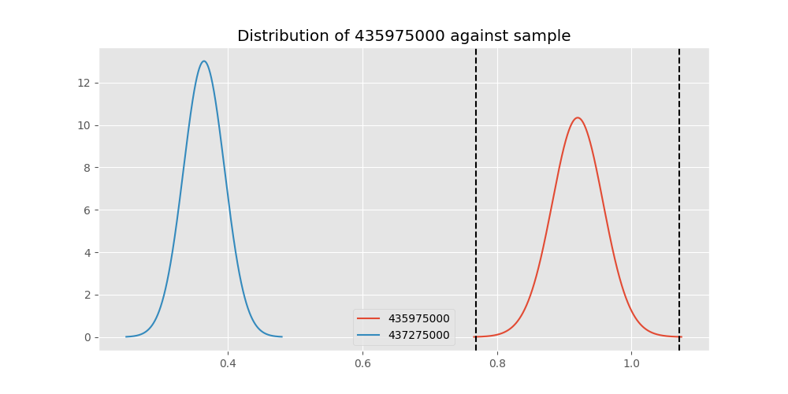
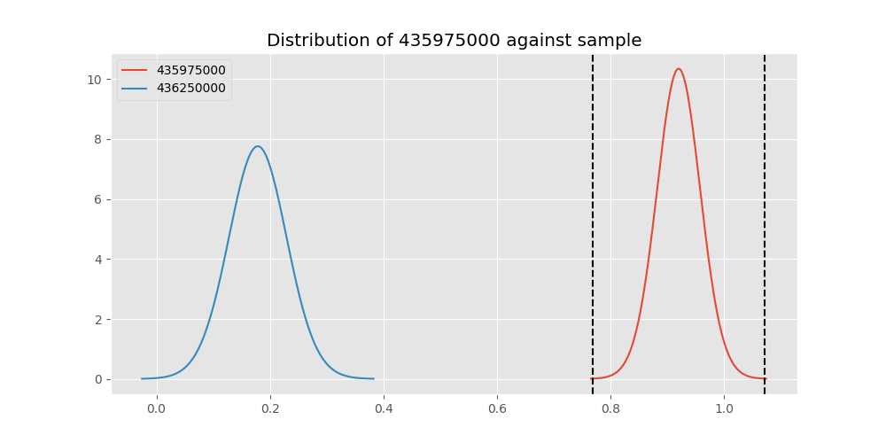
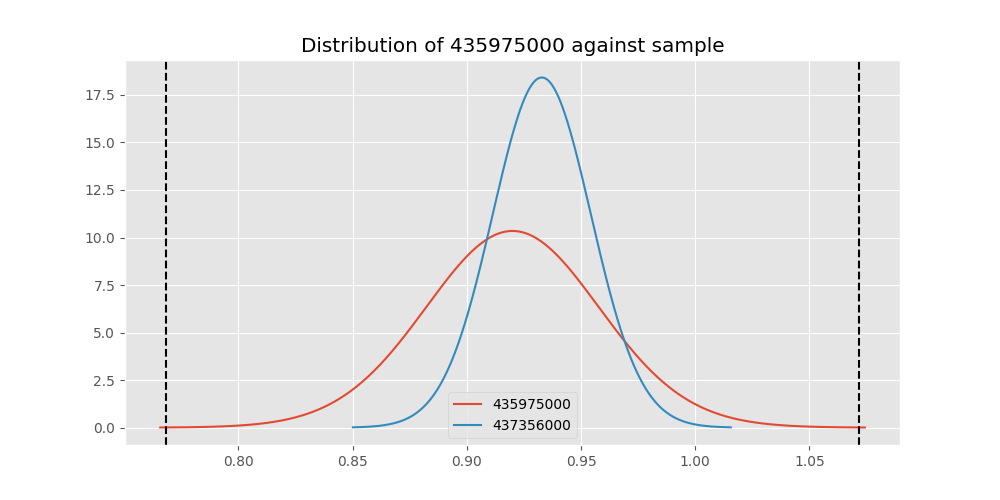

# Testing Results For 435975000 
$H_{0}$: There is not a difference in collection success against 435975000 
$H_{A}$: There is a difference in collection success against 435975000
An $\alpha$ of 0.00025 was used 
Out of 44 tests, there were 8 rejections from 44 independent-t test.
Out of 44 tests, there were 12 rejections from 44 Man Whitney u-tests.
## Testing Results for 435975000 against 436501000 
435975000 has a success rate of 0.92
436501000 has a success rate of 0.9854014598540146
$H_{0}$: There is not a difference between 435975000 and 436501000
$H_{A}$: There is a difference between 435975000 and 436501000
An $/alpha$ of 0.00025 was used in this test.
__independent t-testing__: With a t-statistic of -1.6310575001006598 and a p-value of 0.10848578161515503, _we failed to reject the null hypothssis_
__Man-Whitney testing__: With a u-statistic of 3201.0 and a p-value of 0.02540847449524933, _we failed to reject the null hypothssis_
 
## Testing Results for 435975000 against 437375000 
435975000 has a success rate of 0.92
437375000 has a success rate of 0.9982014388489209
$H_{0}$: There is not a difference between 435975000 and 437375000
$H_{A}$: There is a difference between 435975000 and 437375000
An $/alpha$ of 0.00025 was used in this test.
__independent t-testing__: With a t-statistic of -2.0156110348104876 and a p-value of 0.04931833274640718, _we failed to reject the null hypothssis_
__Man-Whitney testing__: With a u-statistic of 12813.0 and a p-value of 4.981061963932269e-09, _we **reject** the null hypothssis_
 
## Testing Results for 435975000 against 436500000 
435975000 has a success rate of 0.92
436500000 has a success rate of 0.9056603773584906
$H_{0}$: There is not a difference between 435975000 and 436500000
$H_{A}$: There is a difference between 435975000 and 436500000
An $/alpha$ of 0.00025 was used in this test.
__independent t-testing__: With a t-statistic of 0.30623245208264177 and a p-value of 0.7597354472012349, _we failed to reject the null hypothssis_
__Man-Whitney testing__: With a u-statistic of 4032.0 and a p-value of 0.7609681951401281, _we failed to reject the null hypothssis_
 
## Testing Results for 435975000 against 436990000 
435975000 has a success rate of 0.92
436990000 has a success rate of 0.9572649572649573
$H_{0}$: There is not a difference between 435975000 and 436990000
$H_{A}$: There is a difference between 435975000 and 436990000
An $/alpha$ of 0.00025 was used in this test.
__independent t-testing__: With a t-statistic of -1.103335483212933 and a p-value of 0.27082213912661124, _we failed to reject the null hypothssis_
__Man-Whitney testing__: With a u-statistic of 5632.0 and a p-value of 0.271165534265848, _we failed to reject the null hypothssis_
 
## Testing Results for 435975000 against 145875000 
435975000 has a success rate of 0.92
145875000 has a success rate of 0.9722222222222222
$H_{0}$: There is not a difference between 435975000 and 145875000
$H_{A}$: There is a difference between 435975000 and 145875000
An $/alpha$ of 0.00025 was used in this test.
__independent t-testing__: With a t-statistic of -1.3103203649895243 and a p-value of 0.19259001291214936, _we failed to reject the null hypothssis_
__Man-Whitney testing__: With a u-statistic of 1706.0 and a p-value of 0.19377019977372167, _we failed to reject the null hypothssis_
 
## Testing Results for 435975000 against 437800000 
435975000 has a success rate of 0.92
437800000 has a success rate of 0.9533678756476683
$H_{0}$: There is not a difference between 435975000 and 437800000
$H_{A}$: There is a difference between 435975000 and 437800000
An $/alpha$ of 0.00025 was used in this test.
__independent t-testing__: With a t-statistic of -0.9322810534098369 and a p-value of 0.3521243177907466, _we failed to reject the null hypothssis_
__Man-Whitney testing__: With a u-statistic of 4664.0 and a p-value of 0.3525589924902711, _we failed to reject the null hypothssis_
 
## Testing Results for 435975000 against 145810000 
435975000 has a success rate of 0.92
145810000 has a success rate of 0.12179487179487179
$H_{0}$: There is not a difference between 435975000 and 145810000
$H_{A}$: There is a difference between 435975000 and 145810000
An $/alpha$ of 0.00025 was used in this test.
__independent t-testing__: With a t-statistic of 15.545028133889765 and a p-value of 1.8316480375980905e-36, _we **reject** the null hypothssis_
__Man-Whitney testing__: With a u-statistic of 7013.0 and a p-value of 5.55999957204892e-26, _we **reject** the null hypothssis_
 
## Testing Results for 435975000 against 437095000 
435975000 has a success rate of 0.92
437095000 has a success rate of 0.9361702127659575
$H_{0}$: There is not a difference between 435975000 and 437095000
$H_{A}$: There is a difference between 435975000 and 437095000
An $/alpha$ of 0.00025 was used in this test.
__independent t-testing__: With a t-statistic of -0.3045461337707011 and a p-value of 0.7613779955489441, _we failed to reject the null hypothssis_
__Man-Whitney testing__: With a u-statistic of 1156.0 and a p-value of 0.7657466952597706, _we failed to reject the null hypothssis_
 
## Testing Results for 435975000 against 437265000 
435975000 has a success rate of 0.92
437265000 has a success rate of 0.9795454545454545
$H_{0}$: There is not a difference between 435975000 and 437265000
$H_{A}$: There is a difference between 435975000 and 437265000
An $/alpha$ of 0.00025 was used in this test.
__independent t-testing__: With a t-statistic of -2.493376705426264 and a p-value of 0.012983620746128324, _we failed to reject the null hypothssis_
__Man-Whitney testing__: With a u-statistic of 10345.0 and a p-value of 0.013201433484960532, _we failed to reject the null hypothssis_
 
## Testing Results for 435975000 against 437350000 
435975000 has a success rate of 0.92
437350000 has a success rate of 0.9488372093023256
$H_{0}$: There is not a difference between 435975000 and 437350000
$H_{A}$: There is a difference between 435975000 and 437350000
An $/alpha$ of 0.00025 was used in this test.
__independent t-testing__: With a t-statistic of -0.7927531423357863 and a p-value of 0.4286361997917729, _we failed to reject the null hypothssis_
__Man-Whitney testing__: With a u-statistic of 5220.0 and a p-value of 0.42908842983886153, _we failed to reject the null hypothssis_
 
## Testing Results for 435975000 against 437200000 
435975000 has a success rate of 0.92
437200000 has a success rate of 0.8620689655172413
$H_{0}$: There is not a difference between 435975000 and 437200000
$H_{A}$: There is a difference between 435975000 and 437200000
An $/alpha$ of 0.00025 was used in this test.
__independent t-testing__: With a t-statistic of 1.1021951408432547 and a p-value of 0.271432569920608, _we failed to reject the null hypothssis_
__Man-Whitney testing__: With a u-statistic of 5369.0 and a p-value of 0.271396638277964, _we failed to reject the null hypothssis_
 
## Testing Results for 435975000 against 435600000 
435975000 has a success rate of 0.92
435600000 has a success rate of 0.9819341126461212
$H_{0}$: There is not a difference between 435975000 and 435600000
$H_{A}$: There is a difference between 435975000 and 435600000
An $/alpha$ of 0.00025 was used in this test.
__independent t-testing__: With a t-statistic of -1.5880997798052607 and a p-value of 0.11853826038240807, _we failed to reject the null hypothssis_
__Man-Whitney testing__: With a u-statistic of 22068.0 and a p-value of 0.0030701991359055937, _we failed to reject the null hypothssis_
 
## Testing Results for 435975000 against 450000000 
435975000 has a success rate of 0.92
450000000 has a success rate of 0.8235294117647058
$H_{0}$: There is not a difference between 435975000 and 450000000
$H_{A}$: There is a difference between 435975000 and 450000000
An $/alpha$ of 0.00025 was used in this test.
__independent t-testing__: With a t-statistic of 1.5589842524753876 and a p-value of 0.12137649934850697, _we failed to reject the null hypothssis_
__Man-Whitney testing__: With a u-statistic of 2330.0 and a p-value of 0.12187601562344615, _we failed to reject the null hypothssis_
 
## Testing Results for 435975000 against 145978500 
435975000 has a success rate of 0.92
145978500 has a success rate of 0.9963636363636363
$H_{0}$: There is not a difference between 435975000 and 145978500
$H_{A}$: There is a difference between 435975000 and 145978500
An $/alpha$ of 0.00025 was used in this test.
__independent t-testing__: With a t-statistic of -1.9617445486319722 and a p-value of 0.055386583067657855, _we failed to reject the null hypothssis_
__Man-Whitney testing__: With a u-statistic of 6350.0 and a p-value of 5.681671633627052e-05, _we **reject** the null hypothssis_
 
## Testing Results for 435975000 against 437050000 
435975000 has a success rate of 0.92
437050000 has a success rate of 0.5346534653465347
$H_{0}$: There is not a difference between 435975000 and 437050000
$H_{A}$: There is a difference between 435975000 and 437050000
An $/alpha$ of 0.00025 was used in this test.
__independent t-testing__: With a t-statistic of 5.068038202204379 and a p-value of 1.1746222465963361e-06, _we **reject** the null hypothssis_
__Man-Whitney testing__: With a u-statistic of 3498.0 and a p-value of 2.6803624427466745e-06, _we **reject** the null hypothssis_
 
## Testing Results for 435975000 against 435300000 
435975000 has a success rate of 0.92
435300000 has a success rate of 0.1232876712328767
$H_{0}$: There is not a difference between 435975000 and 435300000
$H_{A}$: There is a difference between 435975000 and 435300000
An $/alpha$ of 0.00025 was used in this test.
__independent t-testing__: With a t-statistic of 15.351655210053977 and a p-value of 2.44586526560957e-35, _we **reject** the null hypothssis_
__Man-Whitney testing__: With a u-statistic of 6558.0 and a p-value of 4.636032369548233e-25, _we **reject** the null hypothssis_
 
## Testing Results for 435975000 against 437475000 
435975000 has a success rate of 0.92
437475000 has a success rate of 0.5045045045045045
$H_{0}$: There is not a difference between 435975000 and 437475000
$H_{A}$: There is a difference between 435975000 and 437475000
An $/alpha$ of 0.00025 was used in this test.
__independent t-testing__: With a t-statistic of 5.790221993699122 and a p-value of 1.1316352576202131e-08, _we **reject** the null hypothssis_
__Man-Whitney testing__: With a u-statistic of 19640.0 and a p-value of 1.7019631506904016e-08, _we **reject** the null hypothssis_
 
## Testing Results for 435975000 against 435448000 
435975000 has a success rate of 0.92
435448000 has a success rate of 0.975
$H_{0}$: There is not a difference between 435975000 and 435448000
$H_{A}$: There is a difference between 435975000 and 435448000
An $/alpha$ of 0.00025 was used in this test.
__independent t-testing__: With a t-statistic of -1.1272958962549842 and a p-value of 0.2626818072368071, _we failed to reject the null hypothssis_
__Man-Whitney testing__: With a u-statistic of 945.0 and a p-value of 0.26469951332667463, _we failed to reject the null hypothssis_
 
## Testing Results for 435975000 against 437644000 
435975000 has a success rate of 0.92
437644000 has a success rate of 0.9743589743589743
$H_{0}$: There is not a difference between 435975000 and 437644000
$H_{A}$: There is a difference between 435975000 and 437644000
An $/alpha$ of 0.00025 was used in this test.
__independent t-testing__: With a t-statistic of -1.6082729043284114 and a p-value of 0.10968718532410676, _we failed to reject the null hypothssis_
__Man-Whitney testing__: With a u-statistic of 2766.0 and a p-value of 0.1105762116216315, _we failed to reject the null hypothssis_
 
## Testing Results for 435975000 against 145825000 
435975000 has a success rate of 0.92
145825000 has a success rate of 0.8687448728465955
$H_{0}$: There is not a difference between 435975000 and 145825000
$H_{A}$: There is a difference between 435975000 and 145825000
An $/alpha$ of 0.00025 was used in this test.
__independent t-testing__: With a t-statistic of 1.065829658347343 and a p-value of 0.2866041520512514, _we failed to reject the null hypothssis_
__Man-Whitney testing__: With a u-statistic of 64074.0 and a p-value of 0.2865909610513019, _we failed to reject the null hypothssis_
 
## Testing Results for 435975000 against 437345000 
435975000 has a success rate of 0.92
437345000 has a success rate of 0.7603092783505154
$H_{0}$: There is not a difference between 435975000 and 437345000
$H_{A}$: There is a difference between 435975000 and 437345000
An $/alpha$ of 0.00025 was used in this test.
__independent t-testing__: With a t-statistic of 2.5729602079803553 and a p-value of 0.010412964057441859, _we failed to reject the null hypothssis_
__Man-Whitney testing__: With a u-statistic of 11249.0 and a p-value of 0.010595987366305522, _we failed to reject the null hypothssis_
 
## Testing Results for 435975000 against 435275000 
435975000 has a success rate of 0.92
435275000 has a success rate of 0.9152542372881356
$H_{0}$: There is not a difference between 435975000 and 435275000
$H_{A}$: There is a difference between 435975000 and 435275000
An $/alpha$ of 0.00025 was used in this test.
__independent t-testing__: With a t-statistic of 0.10115213998756166 and a p-value of 0.9195517600644729, _we failed to reject the null hypothssis_
__Man-Whitney testing__: With a u-statistic of 2964.0 and a p-value of 0.9220673634083836, _we failed to reject the null hypothssis_
 
## Testing Results for 435975000 against 437322500 
435975000 has a success rate of 0.92
437322500 has a success rate of 0.9961685823754789
$H_{0}$: There is not a difference between 435975000 and 437322500
$H_{A}$: There is a difference between 435975000 and 437322500
An $/alpha$ of 0.00025 was used in this test.
__independent t-testing__: With a t-statistic of -1.9557938821103045 and a p-value of 0.05609286988326298, _we failed to reject the null hypothssis_
__Man-Whitney testing__: With a u-statistic of 6028.0 and a p-value of 9.126112568354643e-05, _we **reject** the null hypothssis_
 
## Testing Results for 435975000 against 437450000 
435975000 has a success rate of 0.92
437450000 has a success rate of 0.6947791164658634
$H_{0}$: There is not a difference between 435975000 and 437450000
$H_{A}$: There is a difference between 435975000 and 437450000
An $/alpha$ of 0.00025 was used in this test.
__independent t-testing__: With a t-statistic of 3.332546884200418 and a p-value of 0.0009694741244539209, _we failed to reject the null hypothssis_
__Man-Whitney testing__: With a u-statistic of 7627.0 and a p-value of 0.0010518846022213191, _we failed to reject the null hypothssis_
 
## Testing Results for 435975000 against 436703000 
435975000 has a success rate of 0.92
436703000 has a success rate of 0.9859154929577465
$H_{0}$: There is not a difference between 435975000 and 436703000
$H_{A}$: There is a difference between 435975000 and 436703000
An $/alpha$ of 0.00025 was used in this test.
__independent t-testing__: With a t-statistic of -1.664861030954264 and a p-value of 0.10180411739501964, _we failed to reject the null hypothssis_
__Man-Whitney testing__: With a u-statistic of 4974.0 and a p-value of 0.009395533509222216, _we failed to reject the null hypothssis_
 
## Testing Results for 435975000 against 400500000 
435975000 has a success rate of 0.92
400500000 has a success rate of 0.3508771929824561
$H_{0}$: There is not a difference between 435975000 and 400500000
$H_{A}$: There is a difference between 435975000 and 400500000
An $/alpha$ of 0.00025 was used in this test.
__independent t-testing__: With a t-statistic of 7.373296033751809 and a p-value of 4.0092673392078194e-11, _we **reject** the null hypothssis_
__Man-Whitney testing__: With a u-statistic of 2236.0 and a p-value of 1.8591726182668252e-09, _we **reject** the null hypothssis_
 
## Testing Results for 435975000 against 437150000 
435975000 has a success rate of 0.92
437150000 has a success rate of 0.9859550561797753
$H_{0}$: There is not a difference between 435975000 and 437150000
$H_{A}$: There is a difference between 435975000 and 437150000
An $/alpha$ of 0.00025 was used in this test.
__independent t-testing__: With a t-statistic of -1.6801186730813027 and a p-value of 0.09898260858511226, _we failed to reject the null hypothssis_
__Man-Whitney testing__: With a u-statistic of 8313.0 and a p-value of 0.0030758933879516405, _we failed to reject the null hypothssis_
 
## Testing Results for 435975000 against 435635000 
435975000 has a success rate of 0.92
435635000 has a success rate of 0.9849624060150376
$H_{0}$: There is not a difference between 435975000 and 435635000
$H_{A}$: There is a difference between 435975000 and 435635000
An $/alpha$ of 0.00025 was used in this test.
__independent t-testing__: With a t-statistic of -1.6168765197995414 and a p-value of 0.11147752796622347, _we failed to reject the null hypothssis_
__Man-Whitney testing__: With a u-statistic of 3109.0 and a p-value of 0.028672330744725562, _we failed to reject the null hypothssis_
 
## Testing Results for 435975000 against 437384000 
435975000 has a success rate of 0.92
437384000 has a success rate of 0.968421052631579
$H_{0}$: There is not a difference between 435975000 and 437384000
$H_{A}$: There is a difference between 435975000 and 437384000
An $/alpha$ of 0.00025 was used in this test.
__independent t-testing__: With a t-statistic of -1.5255756134590475 and a p-value of 0.12844334019001433, _we failed to reject the null hypothssis_
__Man-Whitney testing__: With a u-statistic of 4520.0 and a p-value of 0.12900193611927416, _we failed to reject the null hypothssis_
 
## Testing Results for 435975000 against 437405000 
435975000 has a success rate of 0.92
437405000 has a success rate of 0.9953917050691244
$H_{0}$: There is not a difference between 435975000 and 437405000
$H_{A}$: There is a difference between 435975000 and 437405000
An $/alpha$ of 0.00025 was used in this test.
__independent t-testing__: With a t-statistic of -1.9316751587232486 and a p-value of 0.059032459482083535, _we failed to reject the null hypothssis_
__Man-Whitney testing__: With a u-statistic of 5016.0 and a p-value of 0.00040874409985986495, _we failed to reject the null hypothssis_
 
## Testing Results for 435975000 against 435612500 
435975000 has a success rate of 0.92
435612500 has a success rate of 0.9770114942528736
$H_{0}$: There is not a difference between 435975000 and 435612500
$H_{A}$: There is a difference between 435975000 and 435612500
An $/alpha$ of 0.00025 was used in this test.
__independent t-testing__: With a t-statistic of -1.5725495753455359 and a p-value of 0.11816391392500666, _we failed to reject the null hypothssis_
__Man-Whitney testing__: With a u-statistic of 2051.0 and a p-value of 0.11928168122212511, _we failed to reject the null hypothssis_
 
## Testing Results for 435975000 against 437425000 
435975000 has a success rate of 0.92
437425000 has a success rate of 0.6987654320987654
$H_{0}$: There is not a difference between 435975000 and 437425000
$H_{A}$: There is a difference between 435975000 and 437425000
An $/alpha$ of 0.00025 was used in this test.
__independent t-testing__: With a t-statistic of 3.331089212434767 and a p-value of 0.000935850944064212, _we failed to reject the null hypothssis_
__Man-Whitney testing__: With a u-statistic of 12365.0 and a p-value of 0.0009880006371658613, _we failed to reject the null hypothssis_
 
## Testing Results for 435975000 against 437275000 
435975000 has a success rate of 0.92
437275000 has a success rate of 0.3643724696356275
$H_{0}$: There is not a difference between 435975000 and 437275000
$H_{A}$: There is a difference between 435975000 and 437275000
An $/alpha$ of 0.00025 was used in this test.
__independent t-testing__: With a t-statistic of 7.886595974865514 and a p-value of 6.083342965283064e-14, _we **reject** the null hypothssis_
__Man-Whitney testing__: With a u-statistic of 9606.0 and a p-value of 7.061939492069317e-13, _we **reject** the null hypothssis_
 
## Testing Results for 435975000 against 145840000 
435975000 has a success rate of 0.92
145840000 has a success rate of 0.9649122807017544
$H_{0}$: There is not a difference between 435975000 and 145840000
$H_{A}$: There is a difference between 435975000 and 145840000
An $/alpha$ of 0.00025 was used in this test.
__independent t-testing__: With a t-statistic of -1.0028030831632957 and a p-value of 0.31826129354745725, _we failed to reject the null hypothssis_
__Man-Whitney testing__: With a u-statistic of 1361.0 and a p-value of 0.31976431014191464, _we failed to reject the null hypothssis_
 
## Testing Results for 435975000 against 435525000 
435975000 has a success rate of 0.92
435525000 has a success rate of 0.6923076923076923
$H_{0}$: There is not a difference between 435975000 and 435525000
$H_{A}$: There is a difference between 435975000 and 435525000
An $/alpha$ of 0.00025 was used in this test.
__independent t-testing__: With a t-statistic of 3.2779163403948575 and a p-value of 0.0012424113473787969, _we failed to reject the null hypothssis_
__Man-Whitney testing__: With a u-statistic of 4389.0 and a p-value of 0.001394404119060941, _we failed to reject the null hypothssis_
 
## Testing Results for 435975000 against 436250000 
435975000 has a success rate of 0.92
436250000 has a success rate of 0.17857142857142858
$H_{0}$: There is not a difference between 435975000 and 436250000
$H_{A}$: There is a difference between 435975000 and 436250000
An $/alpha$ of 0.00025 was used in this test.
__independent t-testing__: With a t-statistic of 11.267897488133718 and a p-value of 1.0006856988836616e-19, _we **reject** the null hypothssis_
__Man-Whitney testing__: With a u-statistic of 2438.0 and a p-value of 3.108438566398582e-14, _we **reject** the null hypothssis_
 
## Testing Results for 435975000 against 435950000 
435975000 has a success rate of 0.92
435950000 has a success rate of 0.9850187265917603
$H_{0}$: There is not a difference between 435975000 and 435950000
$H_{A}$: There is a difference between 435975000 and 435950000
An $/alpha$ of 0.00025 was used in this test.
__independent t-testing__: With a t-statistic of -1.6623844470245965 and a p-value of 0.10259223790450726, _we failed to reject the null hypothssis_
__Man-Whitney testing__: With a u-statistic of 12482.0 and a p-value of 0.001971496636675015, _we failed to reject the null hypothssis_
 
## Testing Results for 435975000 against 435800000 
435975000 has a success rate of 0.92
435800000 has a success rate of 0.5390070921985816
$H_{0}$: There is not a difference between 435975000 and 435800000
$H_{A}$: There is a difference between 435975000 and 435800000
An $/alpha$ of 0.00025 was used in this test.
__independent t-testing__: With a t-statistic of 5.114267629069043 and a p-value of 7.693021490093769e-07, _we **reject** the null hypothssis_
__Man-Whitney testing__: With a u-statistic of 4868.0 and a p-value of 1.5536294191493708e-06, _we **reject** the null hypothssis_
 
## Testing Results for 435975000 against 437485000 
435975000 has a success rate of 0.92
437485000 has a success rate of 0.9375
$H_{0}$: There is not a difference between 435975000 and 437485000
$H_{A}$: There is a difference between 435975000 and 437485000
An $/alpha$ of 0.00025 was used in this test.
__independent t-testing__: With a t-statistic of -0.2933553923595527 and a p-value of 0.7700101696571722, _we failed to reject the null hypothssis_
__Man-Whitney testing__: With a u-statistic of 786.0 and a p-value of 0.7760364746843038, _we failed to reject the null hypothssis_
 
## Testing Results for 435975000 against 136770000 
435975000 has a success rate of 0.92
136770000 has a success rate of 0.9945945945945946
$H_{0}$: There is not a difference between 435975000 and 136770000
$H_{A}$: There is a difference between 435975000 and 136770000
An $/alpha$ of 0.00025 was used in this test.
__independent t-testing__: With a t-statistic of -1.9062637930317547 and a p-value of 0.062267422973257415, _we failed to reject the null hypothssis_
__Man-Whitney testing__: With a u-statistic of 4280.0 and a p-value of 0.0012313205249889789, _we failed to reject the null hypothssis_
 
## Testing Results for 435975000 against 437250000 
435975000 has a success rate of 0.92
437250000 has a success rate of 0.9937106918238994
$H_{0}$: There is not a difference between 435975000 and 437250000
$H_{A}$: There is a difference between 435975000 and 437250000
An $/alpha$ of 0.00025 was used in this test.
__independent t-testing__: With a t-statistic of -1.889548128082694 and a p-value of 0.06458957047732275, _we failed to reject the null hypothssis_
__Man-Whitney testing__: With a u-statistic of 7364.0 and a p-value of 0.00013489527526141596, _we **reject** the null hypothssis_
 
## Testing Results for 435975000 against 437356000 
435975000 has a success rate of 0.92
437356000 has a success rate of 0.9328358208955224
$H_{0}$: There is not a difference between 435975000 and 437356000
$H_{A}$: There is a difference between 435975000 and 437356000
An $/alpha$ of 0.00025 was used in this test.
__independent t-testing__: With a t-statistic of -0.3007009974261244 and a p-value of 0.7639857350152035, _we failed to reject the null hypothssis_
__Man-Whitney testing__: With a u-statistic of 3307.0 and a p-value of 0.7657444944115523, _we failed to reject the null hypothssis_
 
## Testing Results for 435975000 against 437676000 
435975000 has a success rate of 0.92
437676000 has a success rate of 0.9813432835820896
$H_{0}$: There is not a difference between 435975000 and 437676000
$H_{A}$: There is a difference between 435975000 and 437676000
An $/alpha$ of 0.00025 was used in this test.
__independent t-testing__: With a t-statistic of -1.5478629052282535 and a p-value of 0.12754483520702573, _we failed to reject the null hypothssis_
__Man-Whitney testing__: With a u-statistic of 6289.0 and a p-value of 0.016641779043538665, _we failed to reject the null hypothssis_
 
## Testing Results for 435975000 against 145826800 
435975000 has a success rate of 0.92
145826800 has a success rate of 0.966183574879227
$H_{0}$: There is not a difference between 435975000 and 145826800
$H_{A}$: There is a difference between 435975000 and 145826800
An $/alpha$ of 0.00025 was used in this test.
__independent t-testing__: With a t-statistic of -1.4482471571728552 and a p-value of 0.14877637595781798, _we failed to reject the null hypothssis_
__Man-Whitney testing__: With a u-statistic of 4936.0 and a p-value of 0.14926581636219718, _we failed to reject the null hypothssis_
 
