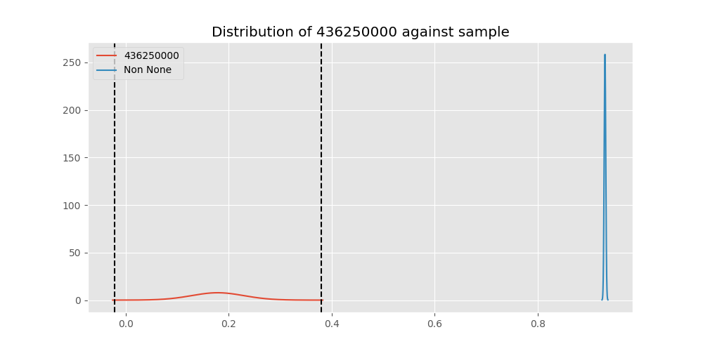
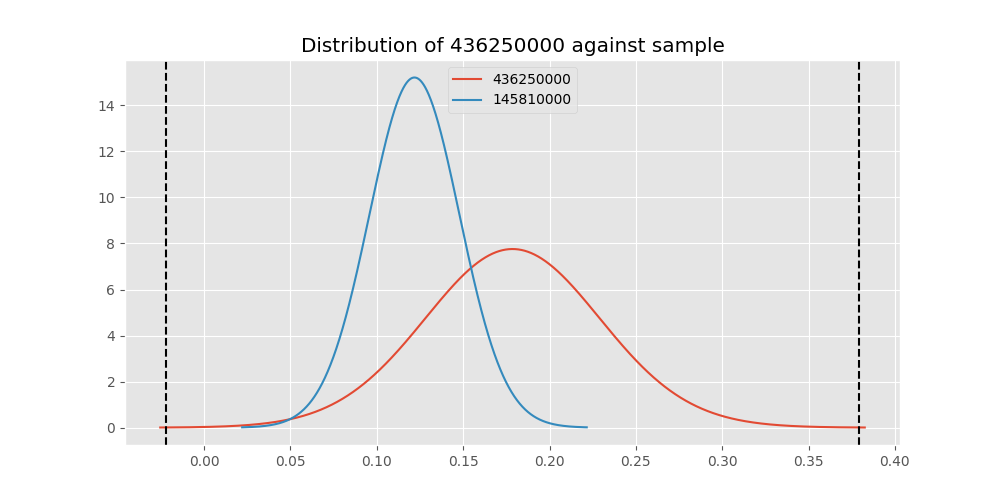

# Testing Results For 436250000 
$H_{0}$: There is not a difference in collection success against 436250000 
$H_{A}$: There is a difference in collection success against 436250000
An $\alpha$ of 0.00025 was used 
Out of 44 tests, there were 40 rejections from 44 independent-t test.
Out of 44 tests, there were 40 rejections from 44 Man Whitney u-tests.
## Testing Results for 436250000 against 436501000 
436250000 has a success rate of 0.17857142857142858
436501000 has a success rate of 0.9854014598540146
$H_{0}$: There is not a difference between 436250000 and 436501000
$H_{A}$: There is a difference between 436250000 and 436501000
An $/alpha$ of 0.00025 was used in this test.
__independent t-testing__: With a t-statistic of -15.322393652552416 and a p-value of 2.643823239972083e-22, _we **reject** the null hypothssis_
__Man-Whitney testing__: With a u-statistic of 741.0 and a p-value of 8.354659573397603e-32, _we **reject** the null hypothssis_
 
## Testing Results for 436250000 against 437375000 
436250000 has a success rate of 0.17857142857142858
437375000 has a success rate of 0.9982014388489209
$H_{0}$: There is not a difference between 436250000 and 437375000
$H_{A}$: There is a difference between 436250000 and 437375000
An $/alpha$ of 0.00025 was used in this test.
__independent t-testing__: With a t-statistic of -15.861530302583244 and a p-value of 3.344617015830817e-22, _we **reject** the null hypothssis_
__Man-Whitney testing__: With a u-statistic of 2808.0 and a p-value of 1.149435427037037e-106, _we **reject** the null hypothssis_
 
## Testing Results for 436250000 against 436500000 
436250000 has a success rate of 0.17857142857142858
436500000 has a success rate of 0.9056603773584906
$H_{0}$: There is not a difference between 436250000 and 436500000
$H_{A}$: There is a difference between 436250000 and 436500000
An $/alpha$ of 0.00025 was used in this test.
__independent t-testing__: With a t-statistic of -14.626166033096988 and a p-value of 5.312631053133097e-34, _we **reject** the null hypothssis_
__Man-Whitney testing__: With a u-statistic of 1215.0 and a p-value of 4.0271273189736356e-25, _we **reject** the null hypothssis_
 
## Testing Results for 436250000 against 436990000 
436250000 has a success rate of 0.17857142857142858
436990000 has a success rate of 0.9572649572649573
$H_{0}$: There is not a difference between 436250000 and 436990000
$H_{A}$: There is a difference between 436250000 and 436990000
An $/alpha$ of 0.00025 was used in this test.
__independent t-testing__: With a t-statistic of -21.06275568131043 and a p-value of 2.9733617969548054e-60, _we **reject** the null hypothssis_
__Man-Whitney testing__: With a u-statistic of 1450.0 and a p-value of 5.4012868499897655e-40, _we **reject** the null hypothssis_
 
## Testing Results for 436250000 against 145875000 
436250000 has a success rate of 0.17857142857142858
145875000 has a success rate of 0.9722222222222222
$H_{0}$: There is not a difference between 436250000 and 145875000
$H_{A}$: There is a difference between 436250000 and 145875000
An $/alpha$ of 0.00025 was used in this test.
__independent t-testing__: With a t-statistic of -14.377013387379929 and a p-value of 1.1265065146965464e-22, _we **reject** the null hypothssis_
__Man-Whitney testing__: With a u-statistic of 416.0 and a p-value of 5.0944845435392346e-20, _we **reject** the null hypothssis_
 
## Testing Results for 436250000 against 437800000 
436250000 has a success rate of 0.17857142857142858
437800000 has a success rate of 0.9533678756476683
$H_{0}$: There is not a difference between 436250000 and 437800000
$H_{A}$: There is a difference between 436250000 and 437800000
An $/alpha$ of 0.00025 was used in this test.
__independent t-testing__: With a t-statistic of -19.57601564092731 and a p-value of 3.739496718354651e-52, _we **reject** the null hypothssis_
__Man-Whitney testing__: With a u-statistic of 1217.0 and a p-value of 1.1789092235429195e-34, _we **reject** the null hypothssis_
 
## Testing Results for 436250000 against 145810000 
436250000 has a success rate of 0.17857142857142858
145810000 has a success rate of 0.12179487179487179
$H_{0}$: There is not a difference between 436250000 and 145810000
$H_{A}$: There is a difference between 436250000 and 145810000
An $/alpha$ of 0.00025 was used in this test.
__independent t-testing__: With a t-statistic of 1.0584389418987799 and a p-value of 0.29107133021945275, _we failed to reject the null hypothssis_
__Man-Whitney testing__: With a u-statistic of 4616.0 and a p-value of 0.2909663797957417, _we failed to reject the null hypothssis_
 
## Testing Results for 436250000 against 437095000 
436250000 has a success rate of 0.17857142857142858
437095000 has a success rate of 0.9361702127659575
$H_{0}$: There is not a difference between 436250000 and 437095000
$H_{A}$: There is a difference between 436250000 and 437095000
An $/alpha$ of 0.00025 was used in this test.
__independent t-testing__: With a t-statistic of -11.592534421689933 and a p-value of 2.88755880305918e-20, _we **reject** the null hypothssis_
__Man-Whitney testing__: With a u-statistic of 319.0 and a p-value of 2.397639481295369e-14, _we **reject** the null hypothssis_
 
## Testing Results for 436250000 against 437265000 
436250000 has a success rate of 0.17857142857142858
437265000 has a success rate of 0.9795454545454545
$H_{0}$: There is not a difference between 436250000 and 437265000
$H_{A}$: There is a difference between 436250000 and 437265000
An $/alpha$ of 0.00025 was used in this test.
__independent t-testing__: With a t-statistic of -15.378863670252816 and a p-value of 6.331229401960626e-22, _we **reject** the null hypothssis_
__Man-Whitney testing__: With a u-statistic of 2452.0 and a p-value of 3.9712002580244324e-72, _we **reject** the null hypothssis_
 
## Testing Results for 436250000 against 437350000 
436250000 has a success rate of 0.17857142857142858
437350000 has a success rate of 0.9488372093023256
$H_{0}$: There is not a difference between 436250000 and 437350000
$H_{A}$: There is a difference between 436250000 and 437350000
An $/alpha$ of 0.00025 was used in this test.
__independent t-testing__: With a t-statistic of -19.49793051629391 and a p-value of 2.1941121586594394e-53, _we **reject** the null hypothssis_
__Man-Whitney testing__: With a u-statistic of 1383.0 and a p-value of 2.966108539766087e-36, _we **reject** the null hypothssis_
 
## Testing Results for 436250000 against 437200000 
436250000 has a success rate of 0.17857142857142858
437200000 has a success rate of 0.8620689655172413
$H_{0}$: There is not a difference between 436250000 and 437200000
$H_{A}$: There is a difference between 436250000 and 437200000
An $/alpha$ of 0.00025 was used in this test.
__independent t-testing__: With a t-statistic of -12.762731837019137 and a p-value of 3.1872279071004156e-29, _we **reject** the null hypothssis_
__Man-Whitney testing__: With a u-statistic of 1799.0 and a p-value of 1.478162287366265e-23, _we **reject** the null hypothssis_
 
## Testing Results for 436250000 against 435600000 
436250000 has a success rate of 0.17857142857142858
435600000 has a success rate of 0.9819341126461212
$H_{0}$: There is not a difference between 436250000 and 435600000
$H_{A}$: There is a difference between 436250000 and 435600000
An $/alpha$ of 0.00025 was used in this test.
__independent t-testing__: With a t-statistic of -15.501401450874605 and a p-value of 7.1142207956954115e-22, _we **reject** the null hypothssis_
__Man-Whitney testing__: With a u-statistic of 5181.0 and a p-value of 3.3271666417793074e-127, _we **reject** the null hypothssis_
 
## Testing Results for 436250000 against 450000000 
436250000 has a success rate of 0.17857142857142858
450000000 has a success rate of 0.8235294117647058
$H_{0}$: There is not a difference between 436250000 and 450000000
$H_{A}$: There is a difference between 436250000 and 450000000
An $/alpha$ of 0.00025 was used in this test.
__independent t-testing__: With a t-statistic of -9.741927055234646 and a p-value of 2.0530039901471017e-17, _we **reject** the null hypothssis_
__Man-Whitney testing__: With a u-statistic of 845.0 and a p-value of 4.906605720521691e-14, _we **reject** the null hypothssis_
 
## Testing Results for 436250000 against 145978500 
436250000 has a success rate of 0.17857142857142858
145978500 has a success rate of 0.9963636363636363
$H_{0}$: There is not a difference between 436250000 and 145978500
$H_{A}$: There is a difference between 436250000 and 145978500
An $/alpha$ of 0.00025 was used in this test.
__independent t-testing__: With a t-statistic of -15.79644813739176 and a p-value of 3.3451153523868226e-22, _we **reject** the null hypothssis_
__Man-Whitney testing__: With a u-statistic of 1403.0 and a p-value of 2.597583727676454e-57, _we **reject** the null hypothssis_
 
## Testing Results for 436250000 against 437050000 
436250000 has a success rate of 0.17857142857142858
437050000 has a success rate of 0.5346534653465347
$H_{0}$: There is not a difference between 436250000 and 437050000
$H_{A}$: There is a difference between 436250000 and 437050000
An $/alpha$ of 0.00025 was used in this test.
__independent t-testing__: With a t-statistic of -4.608063569887682 and a p-value of 8.433941284694004e-06, _we **reject** the null hypothssis_
__Man-Whitney testing__: With a u-statistic of 1821.0 and a p-value of 1.4688302941091841e-05, _we **reject** the null hypothssis_
 
## Testing Results for 436250000 against 435300000 
436250000 has a success rate of 0.17857142857142858
435300000 has a success rate of 0.1232876712328767
$H_{0}$: There is not a difference between 436250000 and 435300000
$H_{A}$: There is a difference between 436250000 and 435300000
An $/alpha$ of 0.00025 was used in this test.
__independent t-testing__: With a t-statistic of 1.0154205663230913 and a p-value of 0.3111322049191721, _we failed to reject the null hypothssis_
__Man-Whitney testing__: With a u-statistic of 4314.0 and a p-value of 0.31101443265786033, _we failed to reject the null hypothssis_
 
## Testing Results for 436250000 against 437475000 
436250000 has a success rate of 0.17857142857142858
437475000 has a success rate of 0.5045045045045045
$H_{0}$: There is not a difference between 436250000 and 437475000
$H_{A}$: There is a difference between 436250000 and 437475000
An $/alpha$ of 0.00025 was used in this test.
__independent t-testing__: With a t-statistic of -4.732250405482333 and a p-value of 2.763284741471277e-06, _we **reject** the null hypothssis_
__Man-Whitney testing__: With a u-statistic of 10475.0 and a p-value of 3.304472284844704e-06, _we **reject** the null hypothssis_
 
## Testing Results for 436250000 against 435448000 
436250000 has a success rate of 0.17857142857142858
435448000 has a success rate of 0.975
$H_{0}$: There is not a difference between 436250000 and 435448000
$H_{A}$: There is a difference between 436250000 and 435448000
An $/alpha$ of 0.00025 was used in this test.
__independent t-testing__: With a t-statistic of -13.880928249710731 and a p-value of 9.517038616994907e-23, _we **reject** the null hypothssis_
__Man-Whitney testing__: With a u-statistic of 228.0 and a p-value of 1.9876853032474988e-14, _we **reject** the null hypothssis_
 
## Testing Results for 436250000 against 437644000 
436250000 has a success rate of 0.17857142857142858
437644000 has a success rate of 0.9743589743589743
$H_{0}$: There is not a difference between 436250000 and 437644000
$H_{A}$: There is a difference between 436250000 and 437644000
An $/alpha$ of 0.00025 was used in this test.
__independent t-testing__: With a t-statistic of -14.822575554622704 and a p-value of 2.237082474130092e-22, _we **reject** the null hypothssis_
__Man-Whitney testing__: With a u-statistic of 669.0 and a p-value of 2.332292937668991e-27, _we **reject** the null hypothssis_
 
## Testing Results for 436250000 against 145825000 
436250000 has a success rate of 0.17857142857142858
145825000 has a success rate of 0.8687448728465955
$H_{0}$: There is not a difference between 436250000 and 145825000
$H_{A}$: There is a difference between 436250000 and 145825000
An $/alpha$ of 0.00025 was used in this test.
__independent t-testing__: With a t-statistic of -15.067822479152309 and a p-value of 3.614559638462688e-49, _we **reject** the null hypothssis_
__Man-Whitney testing__: With a u-statistic of 21150.0 and a p-value of 3.4607874137757287e-47, _we **reject** the null hypothssis_
 
## Testing Results for 436250000 against 437345000 
436250000 has a success rate of 0.17857142857142858
437345000 has a success rate of 0.7603092783505154
$H_{0}$: There is not a difference between 436250000 and 437345000
$H_{A}$: There is a difference between 436250000 and 437345000
An $/alpha$ of 0.00025 was used in this test.
__independent t-testing__: With a t-statistic of -9.63063494444343 and a p-value of 4.6990800307268526e-20, _we **reject** the null hypothssis_
__Man-Whitney testing__: With a u-statistic of 4544.0 and a p-value of 1.8692861348196313e-18, _we **reject** the null hypothssis_
 
## Testing Results for 436250000 against 435275000 
436250000 has a success rate of 0.17857142857142858
435275000 has a success rate of 0.9152542372881356
$H_{0}$: There is not a difference between 436250000 and 435275000
$H_{A}$: There is a difference between 436250000 and 435275000
An $/alpha$ of 0.00025 was used in this test.
__independent t-testing__: With a t-statistic of -14.287126797347746 and a p-value of 4.9131644474042215e-31, _we **reject** the null hypothssis_
__Man-Whitney testing__: With a u-statistic of 870.0 and a p-value of 3.405706441434137e-22, _we **reject** the null hypothssis_
 
## Testing Results for 436250000 against 437322500 
436250000 has a success rate of 0.17857142857142858
437322500 has a success rate of 0.9961685823754789
$H_{0}$: There is not a difference between 436250000 and 437322500
$H_{A}$: There is a difference between 436250000 and 437322500
An $/alpha$ of 0.00025 was used in this test.
__independent t-testing__: With a t-statistic of -15.788390767617457 and a p-value of 3.332293808305548e-22, _we **reject** the null hypothssis_
__Man-Whitney testing__: With a u-statistic of 1333.0 and a p-value of 7.677161260005875e-55, _we **reject** the null hypothssis_
 
## Testing Results for 436250000 against 437450000 
436250000 has a success rate of 0.17857142857142858
437450000 has a success rate of 0.6947791164658634
$H_{0}$: There is not a difference between 436250000 and 437450000
$H_{A}$: There is a difference between 436250000 and 437450000
An $/alpha$ of 0.00025 was used in this test.
__independent t-testing__: With a t-statistic of -7.777899908455224 and a p-value of 1.164925819778564e-13, _we **reject** the null hypothssis_
__Man-Whitney testing__: With a u-statistic of 3373.0 and a p-value of 1.144085705349143e-12, _we **reject** the null hypothssis_
 
## Testing Results for 436250000 against 436703000 
436250000 has a success rate of 0.17857142857142858
436703000 has a success rate of 0.9859154929577465
$H_{0}$: There is not a difference between 436250000 and 436703000
$H_{A}$: There is a difference between 436250000 and 436703000
An $/alpha$ of 0.00025 was used in this test.
__independent t-testing__: With a t-statistic of -15.44473417621727 and a p-value of 3.65646046030464e-22, _we **reject** the null hypothssis_
__Man-Whitney testing__: With a u-statistic of 1149.0 and a p-value of 6.22020269576557e-44, _we **reject** the null hypothssis_
 
## Testing Results for 436250000 against 400500000 
436250000 has a success rate of 0.17857142857142858
400500000 has a success rate of 0.3508771929824561
$H_{0}$: There is not a difference between 436250000 and 400500000
$H_{A}$: There is a difference between 436250000 and 400500000
An $/alpha$ of 0.00025 was used in this test.
__independent t-testing__: With a t-statistic of -2.0956510071207926 and a p-value of 0.03838672633039036, _we failed to reject the null hypothssis_
__Man-Whitney testing__: With a u-statistic of 1321.0 and a p-value of 0.039315605437253834, _we failed to reject the null hypothssis_
 
## Testing Results for 436250000 against 437150000 
436250000 has a success rate of 0.17857142857142858
437150000 has a success rate of 0.9859550561797753
$H_{0}$: There is not a difference between 436250000 and 437150000
$H_{A}$: There is a difference between 436250000 and 437150000
An $/alpha$ of 0.00025 was used in this test.
__independent t-testing__: With a t-statistic of -15.520916809607897 and a p-value of 4.669450437650645e-22, _we **reject** the null hypothssis_
__Man-Whitney testing__: With a u-statistic of 1920.0 and a p-value of 4.791747479376951e-65, _we **reject** the null hypothssis_
 
## Testing Results for 436250000 against 435635000 
436250000 has a success rate of 0.17857142857142858
435635000 has a success rate of 0.9849624060150376
$H_{0}$: There is not a difference between 436250000 and 435635000
$H_{A}$: There is a difference between 436250000 and 435635000
An $/alpha$ of 0.00025 was used in this test.
__independent t-testing__: With a t-statistic of -15.296321869221288 and a p-value of 2.5696444289994737e-22, _we **reject** the null hypothssis_
__Man-Whitney testing__: With a u-statistic of 721.0 and a p-value of 4.272747193457987e-31, _we **reject** the null hypothssis_
 
## Testing Results for 436250000 against 437384000 
436250000 has a success rate of 0.17857142857142858
437384000 has a success rate of 0.968421052631579
$H_{0}$: There is not a difference between 436250000 and 437384000
$H_{A}$: There is a difference between 436250000 and 437384000
An $/alpha$ of 0.00025 was used in this test.
__independent t-testing__: With a t-statistic of -14.85061807777053 and a p-value of 4.649874504441782e-22, _we **reject** the null hypothssis_
__Man-Whitney testing__: With a u-statistic of 1118.0 and a p-value of 6.2763410662069585e-37, _we **reject** the null hypothssis_
 
## Testing Results for 436250000 against 437405000 
436250000 has a success rate of 0.17857142857142858
437405000 has a success rate of 0.9953917050691244
$H_{0}$: There is not a difference between 436250000 and 437405000
$H_{A}$: There is a difference between 436250000 and 437405000
An $/alpha$ of 0.00025 was used in this test.
__independent t-testing__: With a t-statistic of -15.75414110582153 and a p-value of 3.25856848657587e-22, _we **reject** the null hypothssis_
__Man-Whitney testing__: With a u-statistic of 1113.0 and a p-value of 4.643653373391513e-47, _we **reject** the null hypothssis_
 
## Testing Results for 436250000 against 435612500 
436250000 has a success rate of 0.17857142857142858
435612500 has a success rate of 0.9770114942528736
$H_{0}$: There is not a difference between 436250000 and 435612500
$H_{A}$: There is a difference between 436250000 and 435612500
An $/alpha$ of 0.00025 was used in this test.
__independent t-testing__: With a t-statistic of -14.755246592112746 and a p-value of 1.4515919940228458e-22, _we **reject** the null hypothssis_
__Man-Whitney testing__: With a u-statistic of 491.0 and a p-value of 8.189728329698995e-23, _we **reject** the null hypothssis_
 
## Testing Results for 436250000 against 435975000 
436250000 has a success rate of 0.17857142857142858
435975000 has a success rate of 0.92
$H_{0}$: There is not a difference between 436250000 and 435975000
$H_{A}$: There is a difference between 436250000 and 435975000
An $/alpha$ of 0.00025 was used in this test.
__independent t-testing__: With a t-statistic of -11.267897488133718 and a p-value of 1.0006856988836616e-19, _we **reject** the null hypothssis_
__Man-Whitney testing__: With a u-statistic of 362.0 and a p-value of 3.108438566398582e-14, _we **reject** the null hypothssis_
 
## Testing Results for 436250000 against 437425000 
436250000 has a success rate of 0.17857142857142858
437425000 has a success rate of 0.6987654320987654
$H_{0}$: There is not a difference between 436250000 and 437425000
$H_{A}$: There is a difference between 436250000 and 437425000
An $/alpha$ of 0.00025 was used in this test.
__independent t-testing__: With a t-statistic of -8.085769099756007 and a p-value of 5.5438283311822874e-15, _we **reject** the null hypothssis_
__Man-Whitney testing__: With a u-statistic of 5441.0 and a p-value of 3.6604841095436054e-14, _we **reject** the null hypothssis_
 
## Testing Results for 436250000 against 437275000 
436250000 has a success rate of 0.17857142857142858
437275000 has a success rate of 0.3643724696356275
$H_{0}$: There is not a difference between 436250000 and 437275000
$H_{A}$: There is a difference between 436250000 and 437275000
An $/alpha$ of 0.00025 was used in this test.
__independent t-testing__: With a t-statistic of -2.692742114537307 and a p-value of 0.007483721455279387, _we failed to reject the null hypothssis_
__Man-Whitney testing__: With a u-statistic of 5631.0 and a p-value of 0.007715725123681576, _we failed to reject the null hypothssis_
 
## Testing Results for 436250000 against 145840000 
436250000 has a success rate of 0.17857142857142858
145840000 has a success rate of 0.9649122807017544
$H_{0}$: There is not a difference between 436250000 and 145840000
$H_{A}$: There is a difference between 436250000 and 145840000
An $/alpha$ of 0.00025 was used in this test.
__independent t-testing__: With a t-statistic of -13.747811197382033 and a p-value of 1.2433754744911053e-22, _we **reject** the null hypothssis_
__Man-Whitney testing__: With a u-statistic of 341.0 and a p-value of 3.9636376357471576e-17, _we **reject** the null hypothssis_
 
## Testing Results for 436250000 against 435525000 
436250000 has a success rate of 0.17857142857142858
435525000 has a success rate of 0.6923076923076923
$H_{0}$: There is not a difference between 436250000 and 435525000
$H_{A}$: There is a difference between 436250000 and 435525000
An $/alpha$ of 0.00025 was used in this test.
__independent t-testing__: With a t-statistic of -7.35510778392421 and a p-value of 5.015346108277235e-12, _we **reject** the null hypothssis_
__Man-Whitney testing__: With a u-statistic of 1947.0 and a p-value of 6.589136954895015e-11, _we **reject** the null hypothssis_
 
## Testing Results for 436250000 against 435950000 
436250000 has a success rate of 0.17857142857142858
435950000 has a success rate of 0.9850187265917603
$H_{0}$: There is not a difference between 436250000 and 435950000
$H_{A}$: There is a difference between 436250000 and 435950000
An $/alpha$ of 0.00025 was used in this test.
__independent t-testing__: With a t-statistic of -15.53544944233881 and a p-value of 5.487737503538265e-22, _we **reject** the null hypothssis_
__Man-Whitney testing__: With a u-statistic of 2894.0 and a p-value of 4.6759893268394893e-88, _we **reject** the null hypothssis_
 
## Testing Results for 436250000 against 435800000 
436250000 has a success rate of 0.17857142857142858
435800000 has a success rate of 0.5390070921985816
$H_{0}$: There is not a difference between 436250000 and 435800000
$H_{A}$: There is a difference between 436250000 and 435800000
An $/alpha$ of 0.00025 was used in this test.
__independent t-testing__: With a t-statistic of -4.8453341674111465 and a p-value of 2.5721882598051226e-06, _we **reject** the null hypothssis_
__Man-Whitney testing__: With a u-statistic of 2525.0 and a p-value of 4.481331005918142e-06, _we **reject** the null hypothssis_
 
## Testing Results for 436250000 against 437485000 
436250000 has a success rate of 0.17857142857142858
437485000 has a success rate of 0.9375
$H_{0}$: There is not a difference between 436250000 and 437485000
$H_{A}$: There is a difference between 436250000 and 437485000
An $/alpha$ of 0.00025 was used in this test.
__independent t-testing__: With a t-statistic of -9.99879316933406 and a p-value of 4.579948639029252e-16, _we **reject** the null hypothssis_
__Man-Whitney testing__: With a u-statistic of 216.0 and a p-value of 8.27196954270139e-12, _we **reject** the null hypothssis_
 
## Testing Results for 436250000 against 136770000 
436250000 has a success rate of 0.17857142857142858
136770000 has a success rate of 0.9945945945945946
$H_{0}$: There is not a difference between 436250000 and 136770000
$H_{A}$: There is a difference between 436250000 and 136770000
An $/alpha$ of 0.00025 was used in this test.
__independent t-testing__: With a t-statistic of -15.715452701106667 and a p-value of 3.1484794485028416e-22, _we **reject** the null hypothssis_
__Man-Whitney testing__: With a u-statistic of 953.0 and a p-value of 2.2339037151299386e-41, _we **reject** the null hypothssis_
 
## Testing Results for 436250000 against 437250000 
436250000 has a success rate of 0.17857142857142858
437250000 has a success rate of 0.9937106918238994
$H_{0}$: There is not a difference between 436250000 and 437250000
$H_{A}$: There is a difference between 436250000 and 437250000
An $/alpha$ of 0.00025 was used in this test.
__independent t-testing__: With a t-statistic of -15.726168945212528 and a p-value of 3.6349860588950105e-22, _we **reject** the null hypothssis_
__Man-Whitney testing__: With a u-statistic of 1646.0 and a p-value of 2.735032485831161e-63, _we **reject** the null hypothssis_
 
## Testing Results for 436250000 against 437356000 
436250000 has a success rate of 0.17857142857142858
437356000 has a success rate of 0.9328358208955224
$H_{0}$: There is not a difference between 436250000 and 437356000
$H_{A}$: There is a difference between 436250000 and 437356000
An $/alpha$ of 0.00025 was used in this test.
__independent t-testing__: With a t-statistic of -15.947398077392492 and a p-value of 9.003954907931082e-37, _we **reject** the null hypothssis_
__Man-Whitney testing__: With a u-statistic of 922.0 and a p-value of 1.9553920978806849e-25, _we **reject** the null hypothssis_
 
## Testing Results for 436250000 against 437676000 
436250000 has a success rate of 0.17857142857142858
437676000 has a success rate of 0.9813432835820896
$H_{0}$: There is not a difference between 436250000 and 437676000
$H_{A}$: There is a difference between 436250000 and 437676000
An $/alpha$ of 0.00025 was used in this test.
__independent t-testing__: With a t-statistic of -15.348643587297707 and a p-value of 4.630513546583454e-22, _we **reject** the null hypothssis_
__Man-Whitney testing__: With a u-statistic of 1480.0 and a p-value of 1.023262638556568e-50, _we **reject** the null hypothssis_
 
## Testing Results for 436250000 against 145826800 
436250000 has a success rate of 0.17857142857142858
145826800 has a success rate of 0.966183574879227
$H_{0}$: There is not a difference between 436250000 and 145826800
$H_{A}$: There is a difference between 436250000 and 145826800
An $/alpha$ of 0.00025 was used in this test.
__independent t-testing__: With a t-statistic of -14.816937268544148 and a p-value of 5.453662270193237e-22, _we **reject** the null hypothssis_
__Man-Whitney testing__: With a u-statistic of 1231.0 and a p-value of 1.086208699890794e-38, _we **reject** the null hypothssis_
 
