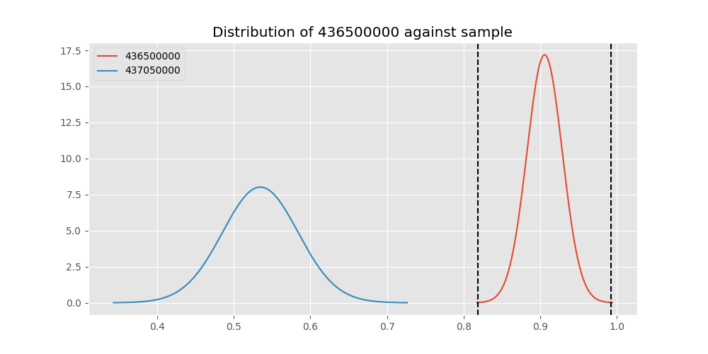
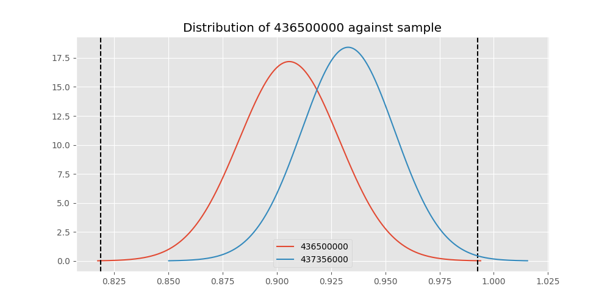
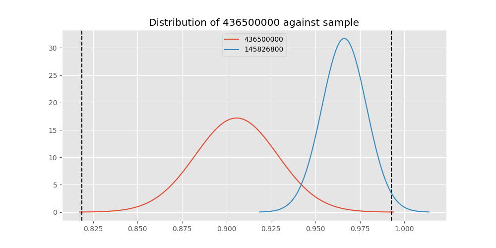

# Testing Results For 436500000 
$H_{0}$: There is not a difference in collection success against 436500000 
$H_{A}$: There is a difference in collection success against 436500000
An $\alpha$ of 0.00025 was used 
Out of 44 tests, there were 16 rejections from 44 independent-t test.
Out of 44 tests, there were 22 rejections from 44 Man Whitney u-tests.
## Testing Results for 436500000 against 436501000 
436500000 has a success rate of 0.9056603773584906
436501000 has a success rate of 0.9854014598540146
$H_{0}$: There is not a difference between 436500000 and 436501000
$H_{A}$: There is a difference between 436500000 and 436501000
An $/alpha$ of 0.00025 was used in this test.
__independent t-testing__: With a t-statistic of -3.1360786592467997 and a p-value of 0.0019502664511540614, _we failed to reject the null hypothssis_
__Man-Whitney testing__: With a u-statistic of 10023.0 and a p-value of 0.003352422188846585, _we failed to reject the null hypothssis_
 
## Testing Results for 436500000 against 437375000 
436500000 has a success rate of 0.9056603773584906
437375000 has a success rate of 0.9982014388489209
$H_{0}$: There is not a difference between 436500000 and 437375000
$H_{A}$: There is a difference between 436500000 and 437375000
An $/alpha$ of 0.00025 was used in this test.
__independent t-testing__: With a t-statistic of -3.967693895190843 and a p-value of 0.00010932153344426113, _we **reject** the null hypothssis_
__Man-Whitney testing__: With a u-statistic of 40111.5 and a p-value of 3.6185967626316692e-12, _we **reject** the null hypothssis_
 
## Testing Results for 436500000 against 436990000 
436500000 has a success rate of 0.9056603773584906
436990000 has a success rate of 0.9572649572649573
$H_{0}$: There is not a difference between 436500000 and 436990000
$H_{A}$: There is a difference between 436500000 and 436990000
An $/alpha$ of 0.00025 was used in this test.
__independent t-testing__: With a t-statistic of -2.0631959996297544 and a p-value of 0.03975366399178014, _we failed to reject the null hypothssis_
__Man-Whitney testing__: With a u-statistic of 17643.0 and a p-value of 0.04001362148839619, _we failed to reject the null hypothssis_
 
## Testing Results for 436500000 against 145875000 
436500000 has a success rate of 0.9056603773584906
145875000 has a success rate of 0.9722222222222222
$H_{0}$: There is not a difference between 436500000 and 145875000
$H_{A}$: There is a difference between 436500000 and 145875000
An $/alpha$ of 0.00025 was used in this test.
__independent t-testing__: With a t-statistic of -1.7993898717532002 and a p-value of 0.0732734559571099, _we failed to reject the null hypothssis_
__Man-Whitney testing__: With a u-statistic of 5343.0 and a p-value of 0.07371962546060323, _we failed to reject the null hypothssis_
 
## Testing Results for 436500000 against 437800000 
436500000 has a success rate of 0.9056603773584906
437800000 has a success rate of 0.9533678756476683
$H_{0}$: There is not a difference between 436500000 and 437800000
$H_{A}$: There is a difference between 436500000 and 437800000
An $/alpha$ of 0.00025 was used in this test.
__independent t-testing__: With a t-statistic of -1.7700704880880325 and a p-value of 0.0775859365825296, _we failed to reject the null hypothssis_
__Man-Whitney testing__: With a u-statistic of 14611.5 and a p-value of 0.07781437650640129, _we failed to reject the null hypothssis_
 
## Testing Results for 436500000 against 145810000 
436500000 has a success rate of 0.9056603773584906
145810000 has a success rate of 0.12179487179487179
$H_{0}$: There is not a difference between 436500000 and 145810000
$H_{A}$: There is a difference between 436500000 and 145810000
An $/alpha$ of 0.00025 was used in this test.
__independent t-testing__: With a t-statistic of 22.36697926582846 and a p-value of 7.218433814690903e-67, _we **reject** the null hypothssis_
__Man-Whitney testing__: With a u-statistic of 22123.5 and a p-value of 6.580930093158756e-44, _we **reject** the null hypothssis_
 
## Testing Results for 436500000 against 437095000 
436500000 has a success rate of 0.9056603773584906
437095000 has a success rate of 0.9361702127659575
$H_{0}$: There is not a difference between 436500000 and 437095000
$H_{A}$: There is a difference between 436500000 and 437095000
An $/alpha$ of 0.00025 was used in this test.
__independent t-testing__: With a t-statistic of -0.6482374173086755 and a p-value of 0.517560368479711, _we failed to reject the null hypothssis_
__Man-Whitney testing__: With a u-statistic of 3622.5 and a p-value of 0.5180793415798466, _we failed to reject the null hypothssis_
 
## Testing Results for 436500000 against 437265000 
436500000 has a success rate of 0.9056603773584906
437265000 has a success rate of 0.9795454545454545
$H_{0}$: There is not a difference between 436500000 and 437265000
$H_{A}$: There is a difference between 436500000 and 437265000
An $/alpha$ of 0.00025 was used in this test.
__independent t-testing__: With a t-statistic of -3.0511290216079425 and a p-value of 0.002614422311619254, _we failed to reject the null hypothssis_
__Man-Whitney testing__: With a u-statistic of 32395.5 and a p-value of 4.75563226424891e-05, _we **reject** the null hypothssis_
 
## Testing Results for 436500000 against 437350000 
436500000 has a success rate of 0.9056603773584906
437350000 has a success rate of 0.9488372093023256
$H_{0}$: There is not a difference between 436500000 and 437350000
$H_{A}$: There is a difference between 436500000 and 437350000
An $/alpha$ of 0.00025 was used in this test.
__independent t-testing__: With a t-statistic of -1.624421068868591 and a p-value of 0.105132925728578, _we failed to reject the null hypothssis_
__Man-Whitney testing__: With a u-statistic of 16354.5 and a p-value of 0.10528249673275926, _we failed to reject the null hypothssis_
 
## Testing Results for 436500000 against 437200000 
436500000 has a success rate of 0.9056603773584906
437200000 has a success rate of 0.8620689655172413
$H_{0}$: There is not a difference between 436500000 and 437200000
$H_{A}$: There is a difference between 436500000 and 437200000
An $/alpha$ of 0.00025 was used in this test.
__independent t-testing__: With a t-statistic of 1.2715759628831493 and a p-value of 0.20434470283986736, _we failed to reject the null hypothssis_
__Man-Whitney testing__: With a u-statistic of 16842.0 and a p-value of 0.204231465350036, _we failed to reject the null hypothssis_
 
## Testing Results for 436500000 against 435600000 
436500000 has a success rate of 0.9056603773584906
435600000 has a success rate of 0.9819341126461212
$H_{0}$: There is not a difference between 436500000 and 435600000
$H_{A}$: There is a difference between 436500000 and 435600000
An $/alpha$ of 0.00025 was used in this test.
__independent t-testing__: With a t-statistic of -3.2242213607676353 and a p-value of 0.0015159644576218671, _we failed to reject the null hypothssis_
__Man-Whitney testing__: With a u-statistic of 69103.5 and a p-value of 1.222113994394098e-07, _we **reject** the null hypothssis_
 
## Testing Results for 436500000 against 450000000 
436500000 has a success rate of 0.9056603773584906
450000000 has a success rate of 0.8235294117647058
$H_{0}$: There is not a difference between 436500000 and 450000000
$H_{A}$: There is a difference between 436500000 and 450000000
An $/alpha$ of 0.00025 was used in this test.
__independent t-testing__: With a t-statistic of 1.8670706969009412 and a p-value of 0.06310082870019557, _we failed to reject the null hypothssis_
__Man-Whitney testing__: With a u-statistic of 7312.5 and a p-value of 0.0634650275882648, _we failed to reject the null hypothssis_
 
## Testing Results for 436500000 against 145978500 
436500000 has a success rate of 0.9056603773584906
145978500 has a success rate of 0.9963636363636363
$H_{0}$: There is not a difference between 436500000 and 145978500
$H_{A}$: There is a difference between 436500000 and 145978500
An $/alpha$ of 0.00025 was used in this test.
__independent t-testing__: With a t-statistic of -3.8536801329978934 and a p-value of 0.00016609885277355223, _we **reject** the null hypothssis_
__Man-Whitney testing__: With a u-statistic of 19879.5 and a p-value of 1.4018458281115577e-06, _we **reject** the null hypothssis_
 
## Testing Results for 436500000 against 437050000 
436500000 has a success rate of 0.9056603773584906
437050000 has a success rate of 0.5346534653465347
$H_{0}$: There is not a difference between 436500000 and 437050000
$H_{A}$: There is a difference between 436500000 and 437050000
An $/alpha$ of 0.00025 was used in this test.
__independent t-testing__: With a t-statistic of 7.527184229756347 and a p-value of 8.676520451636138e-13, _we **reject** the null hypothssis_
__Man-Whitney testing__: With a u-statistic of 11008.5 and a p-value of 8.614168107521573e-12, _we **reject** the null hypothssis_
 
## Testing Results for 436500000 against 435300000 
436500000 has a success rate of 0.9056603773584906
435300000 has a success rate of 0.1232876712328767
$H_{0}$: There is not a difference between 436500000 and 435300000
$H_{A}$: There is a difference between 436500000 and 435300000
An $/alpha$ of 0.00025 was used in this test.
__independent t-testing__: With a t-statistic of 21.92500459586506 and a p-value of 1.739688767889645e-64, _we **reject** the null hypothssis_
__Man-Whitney testing__: With a u-statistic of 20688.0 and a p-value of 1.8976847318366176e-42, _we **reject** the null hypothssis_
 
## Testing Results for 436500000 against 437475000 
436500000 has a success rate of 0.9056603773584906
437475000 has a success rate of 0.5045045045045045
$H_{0}$: There is not a difference between 436500000 and 437475000
$H_{A}$: There is a difference between 436500000 and 437475000
An $/alpha$ of 0.00025 was used in this test.
__independent t-testing__: With a t-statistic of 9.641962505643008 and a p-value of 9.236960294700132e-21, _we **reject** the null hypothssis_
__Man-Whitney testing__: With a u-statistic of 61822.5 and a p-value of 1.145061727624848e-19, _we **reject** the null hypothssis_
 
## Testing Results for 436500000 against 435448000 
436500000 has a success rate of 0.9056603773584906
435448000 has a success rate of 0.975
$H_{0}$: There is not a difference between 436500000 and 435448000
$H_{A}$: There is a difference between 436500000 and 435448000
An $/alpha$ of 0.00025 was used in this test.
__independent t-testing__: With a t-statistic of -1.4419072517184877 and a p-value of 0.15091637303666253, _we failed to reject the null hypothssis_
__Man-Whitney testing__: With a u-statistic of 2959.5 and a p-value of 0.15136311187863655, _we failed to reject the null hypothssis_
 
## Testing Results for 436500000 against 437644000 
436500000 has a success rate of 0.9056603773584906
437644000 has a success rate of 0.9743589743589743
$H_{0}$: There is not a difference between 436500000 and 437644000
$H_{A}$: There is a difference between 436500000 and 437644000
An $/alpha$ of 0.00025 was used in this test.
__independent t-testing__: With a t-statistic of -2.2978046298425165 and a p-value of 0.022326498818167315, _we failed to reject the null hypothssis_
__Man-Whitney testing__: With a u-statistic of 8662.5 and a p-value of 0.022705981330801504, _we failed to reject the null hypothssis_
 
## Testing Results for 436500000 against 145825000 
436500000 has a success rate of 0.9056603773584906
145825000 has a success rate of 0.8687448728465955
$H_{0}$: There is not a difference between 436500000 and 145825000
$H_{A}$: There is a difference between 436500000 and 145825000
An $/alpha$ of 0.00025 was used in this test.
__independent t-testing__: With a t-statistic of 1.3454749916113586 and a p-value of 0.17858944314176908, _we failed to reject the null hypothssis_
__Man-Whitney testing__: With a u-statistic of 200976.0 and a p-value of 0.1785700038486685, _we failed to reject the null hypothssis_
 
## Testing Results for 436500000 against 437345000 
436500000 has a success rate of 0.9056603773584906
437345000 has a success rate of 0.7603092783505154
$H_{0}$: There is not a difference between 436500000 and 437345000
$H_{A}$: There is a difference between 436500000 and 437345000
An $/alpha$ of 0.00025 was used in this test.
__independent t-testing__: With a t-statistic of 3.9250017541814866 and a p-value of 9.783558053635216e-05, _we **reject** the null hypothssis_
__Man-Whitney testing__: With a u-statistic of 35329.5 and a p-value of 0.0001071541124568001, _we **reject** the null hypothssis_
 
## Testing Results for 436500000 against 435275000 
436500000 has a success rate of 0.9056603773584906
435275000 has a success rate of 0.9152542372881356
$H_{0}$: There is not a difference between 436500000 and 435275000
$H_{A}$: There is a difference between 436500000 and 435275000
An $/alpha$ of 0.00025 was used in this test.
__independent t-testing__: With a t-statistic of -0.27459241833506826 and a p-value of 0.783835560798326, _we failed to reject the null hypothssis_
__Man-Whitney testing__: With a u-statistic of 9291.0 and a p-value of 0.7844493364008812, _we failed to reject the null hypothssis_
 
## Testing Results for 436500000 against 437322500 
436500000 has a success rate of 0.9056603773584906
437322500 has a success rate of 0.9961685823754789
$H_{0}$: There is not a difference between 436500000 and 437322500
$H_{A}$: There is a difference between 436500000 and 437322500
An $/alpha$ of 0.00025 was used in this test.
__independent t-testing__: With a t-statistic of -3.840347401340788 and a p-value of 0.00017430148435296762, _we **reject** the null hypothssis_
__Man-Whitney testing__: With a u-statistic of 18871.5 and a p-value of 2.6927146974414426e-06, _we **reject** the null hypothssis_
 
## Testing Results for 436500000 against 437450000 
436500000 has a success rate of 0.9056603773584906
437450000 has a success rate of 0.6947791164658634
$H_{0}$: There is not a difference between 436500000 and 437450000
$H_{A}$: There is a difference between 436500000 and 437450000
An $/alpha$ of 0.00025 was used in this test.
__independent t-testing__: With a t-statistic of 5.13717050380187 and a p-value of 4.339905352123121e-07, _we **reject** the null hypothssis_
__Man-Whitney testing__: With a u-statistic of 23970.0 and a p-value of 6.245683968293149e-07, _we **reject** the null hypothssis_
 
## Testing Results for 436500000 against 436703000 
436500000 has a success rate of 0.9056603773584906
436703000 has a success rate of 0.9859154929577465
$H_{0}$: There is not a difference between 436500000 and 436703000
$H_{A}$: There is a difference between 436500000 and 436703000
An $/alpha$ of 0.00025 was used in this test.
__independent t-testing__: With a t-statistic of -3.2594475526615674 and a p-value of 0.0013156135605954479, _we failed to reject the null hypothssis_
__Man-Whitney testing__: With a u-statistic of 15574.5 and a p-value of 0.00036739189206893804, _we failed to reject the null hypothssis_
 
## Testing Results for 436500000 against 400500000 
436500000 has a success rate of 0.9056603773584906
400500000 has a success rate of 0.3508771929824561
$H_{0}$: There is not a difference between 436500000 and 400500000
$H_{A}$: There is a difference between 436500000 and 400500000
An $/alpha$ of 0.00025 was used in this test.
__independent t-testing__: With a t-statistic of 10.199175739117333 and a p-value of 3.6815516616669883e-20, _we **reject** the null hypothssis_
__Man-Whitney testing__: With a u-statistic of 7045.5 and a p-value of 5.1014100391563144e-17, _we **reject** the null hypothssis_
 
## Testing Results for 436500000 against 437150000 
436500000 has a success rate of 0.9056603773584906
437150000 has a success rate of 0.9859550561797753
$H_{0}$: There is not a difference between 436500000 and 437150000
$H_{A}$: There is a difference between 436500000 and 437150000
An $/alpha$ of 0.00025 was used in this test.
__independent t-testing__: With a t-statistic of -3.334731023061112 and a p-value of 0.0010355239340549749, _we failed to reject the null hypothssis_
__Man-Whitney testing__: With a u-statistic of 26029.5 and a p-value of 1.349639533692865e-05, _we **reject** the null hypothssis_
 
## Testing Results for 436500000 against 435635000 
436500000 has a success rate of 0.9056603773584906
435635000 has a success rate of 0.9849624060150376
$H_{0}$: There is not a difference between 436500000 and 435635000
$H_{A}$: There is a difference between 436500000 and 435635000
An $/alpha$ of 0.00025 was used in this test.
__independent t-testing__: With a t-statistic of -3.1034104187754354 and a p-value of 0.0021650616054804074, _we failed to reject the null hypothssis_
__Man-Whitney testing__: With a u-statistic of 9735.0 and a p-value of 0.004034562845659784, _we failed to reject the null hypothssis_
 
## Testing Results for 436500000 against 437384000 
436500000 has a success rate of 0.9056603773584906
437384000 has a success rate of 0.968421052631579
$H_{0}$: There is not a difference between 436500000 and 437384000
$H_{A}$: There is a difference between 436500000 and 437384000
An $/alpha$ of 0.00025 was used in this test.
__independent t-testing__: With a t-statistic of -2.469819788602815 and a p-value of 0.013998609155233155, _we failed to reject the null hypothssis_
__Man-Whitney testing__: With a u-statistic of 14157.0 and a p-value of 0.01426083374606946, _we failed to reject the null hypothssis_
 
## Testing Results for 436500000 against 437405000 
436500000 has a success rate of 0.9056603773584906
437405000 has a success rate of 0.9953917050691244
$H_{0}$: There is not a difference between 436500000 and 437405000
$H_{A}$: There is a difference between 436500000 and 437405000
An $/alpha$ of 0.00025 was used in this test.
__independent t-testing__: With a t-statistic of -3.7851087813661657 and a p-value of 0.0002125576061596414, _we **reject** the null hypothssis_
__Man-Whitney testing__: With a u-statistic of 15703.5 and a p-value of 2.123951965550717e-05, _we **reject** the null hypothssis_
 
## Testing Results for 436500000 against 435612500 
436500000 has a success rate of 0.9056603773584906
435612500 has a success rate of 0.9770114942528736
$H_{0}$: There is not a difference between 436500000 and 435612500
$H_{A}$: There is a difference between 436500000 and 435612500
An $/alpha$ of 0.00025 was used in this test.
__independent t-testing__: With a t-statistic of -2.1201949100310022 and a p-value of 0.03499916768339604, _we failed to reject the null hypothssis_
__Man-Whitney testing__: With a u-statistic of 6423.0 and a p-value of 0.035457179890953615, _we failed to reject the null hypothssis_
 
## Testing Results for 436500000 against 435975000 
436500000 has a success rate of 0.9056603773584906
435975000 has a success rate of 0.92
$H_{0}$: There is not a difference between 436500000 and 435975000
$H_{A}$: There is a difference between 436500000 and 435975000
An $/alpha$ of 0.00025 was used in this test.
__independent t-testing__: With a t-statistic of -0.30623245208264177 and a p-value of 0.7597354472012349, _we failed to reject the null hypothssis_
__Man-Whitney testing__: With a u-statistic of 3918.0 and a p-value of 0.7609681951401281, _we failed to reject the null hypothssis_
 
## Testing Results for 436500000 against 437425000 
436500000 has a success rate of 0.9056603773584906
437425000 has a success rate of 0.6987654320987654
$H_{0}$: There is not a difference between 436500000 and 437425000
$H_{A}$: There is a difference between 436500000 and 437425000
An $/alpha$ of 0.00025 was used in this test.
__independent t-testing__: With a t-statistic of 5.271700637183686 and a p-value of 1.9304609833740677e-07, _we **reject** the null hypothssis_
__Man-Whitney testing__: With a u-statistic of 38859.0 and a p-value of 2.602213818097293e-07, _we **reject** the null hypothssis_
 
## Testing Results for 436500000 against 437275000 
436500000 has a success rate of 0.9056603773584906
437275000 has a success rate of 0.3643724696356275
$H_{0}$: There is not a difference between 436500000 and 437275000
$H_{A}$: There is a difference between 436500000 and 437275000
An $/alpha$ of 0.00025 was used in this test.
__independent t-testing__: With a t-statistic of 12.717824570395544 and a p-value of 2.126646025982694e-31, _we **reject** the null hypothssis_
__Man-Whitney testing__: With a u-statistic of 30265.5 and a p-value of 5.319845120757369e-27, _we **reject** the null hypothssis_
 
## Testing Results for 436500000 against 145840000 
436500000 has a success rate of 0.9056603773584906
145840000 has a success rate of 0.9649122807017544
$H_{0}$: There is not a difference between 436500000 and 145840000
$H_{A}$: There is a difference between 436500000 and 145840000
An $/alpha$ of 0.00025 was used in this test.
__independent t-testing__: With a t-statistic of -1.4254309775565177 and a p-value of 0.1554895828018041, _we failed to reject the null hypothssis_
__Man-Whitney testing__: With a u-statistic of 4263.0 and a p-value of 0.15578983201398353, _we failed to reject the null hypothssis_
 
## Testing Results for 436500000 against 435525000 
436500000 has a success rate of 0.9056603773584906
435525000 has a success rate of 0.6923076923076923
$H_{0}$: There is not a difference between 436500000 and 435525000
$H_{A}$: There is a difference between 436500000 and 435525000
An $/alpha$ of 0.00025 was used in this test.
__independent t-testing__: With a t-statistic of 4.831326887878442 and a p-value of 2.1670132642201278e-06, _we **reject** the null hypothssis_
__Man-Whitney testing__: With a u-statistic of 13794.0 and a p-value of 3.1549560916255067e-06, _we **reject** the null hypothssis_
 
## Testing Results for 436500000 against 436250000 
436500000 has a success rate of 0.9056603773584906
436250000 has a success rate of 0.17857142857142858
$H_{0}$: There is not a difference between 436500000 and 436250000
$H_{A}$: There is a difference between 436500000 and 436250000
An $/alpha$ of 0.00025 was used in this test.
__independent t-testing__: With a t-statistic of 14.626166033096988 and a p-value of 5.312631053133097e-34, _we **reject** the null hypothssis_
__Man-Whitney testing__: With a u-statistic of 7689.0 and a p-value of 4.0271273189736356e-25, _we **reject** the null hypothssis_
 
## Testing Results for 436500000 against 435950000 
436500000 has a success rate of 0.9056603773584906
435950000 has a success rate of 0.9850187265917603
$H_{0}$: There is not a difference between 436500000 and 435950000
$H_{A}$: There is a difference between 436500000 and 435950000
An $/alpha$ of 0.00025 was used in this test.
__independent t-testing__: With a t-statistic of -3.328502569131097 and a p-value of 0.001065130591580895, _we failed to reject the null hypothssis_
__Man-Whitney testing__: With a u-statistic of 39084.0 and a p-value of 9.609562172430606e-07, _we **reject** the null hypothssis_
 
## Testing Results for 436500000 against 435800000 
436500000 has a success rate of 0.9056603773584906
435800000 has a success rate of 0.5390070921985816
$H_{0}$: There is not a difference between 436500000 and 435800000
$H_{A}$: There is a difference between 436500000 and 435800000
An $/alpha$ of 0.00025 was used in this test.
__independent t-testing__: With a t-statistic of 7.846971746920051 and a p-value of 7.700347174356877e-14, _we **reject** the null hypothssis_
__Man-Whitney testing__: With a u-statistic of 15319.5 and a p-value of 8.386925930368394e-13, _we **reject** the null hypothssis_
 
## Testing Results for 436500000 against 437485000 
436500000 has a success rate of 0.9056603773584906
437485000 has a success rate of 0.9375
$H_{0}$: There is not a difference between 436500000 and 437485000
$H_{A}$: There is a difference between 436500000 and 437485000
An $/alpha$ of 0.00025 was used in this test.
__independent t-testing__: With a t-statistic of -0.5745823245317819 and a p-value of 0.5662570845871041, _we failed to reject the null hypothssis_
__Man-Whitney testing__: With a u-statistic of 2463.0 and a p-value of 0.5672916257688762, _we failed to reject the null hypothssis_
 
## Testing Results for 436500000 against 136770000 
436500000 has a success rate of 0.9056603773584906
136770000 has a success rate of 0.9945945945945946
$H_{0}$: There is not a difference between 436500000 and 136770000
$H_{A}$: There is a difference between 436500000 and 136770000
An $/alpha$ of 0.00025 was used in this test.
__independent t-testing__: With a t-statistic of -3.7251237268676127 and a p-value of 0.00026311254490006525, _we failed to reject the null hypothssis_
__Man-Whitney testing__: With a u-statistic of 13399.5 and a p-value of 9.7006306952566e-05, _we **reject** the null hypothssis_
 
## Testing Results for 436500000 against 437250000 
436500000 has a success rate of 0.9056603773584906
437250000 has a success rate of 0.9937106918238994
$H_{0}$: There is not a difference between 436500000 and 437250000
$H_{A}$: There is a difference between 436500000 and 437250000
An $/alpha$ of 0.00025 was used in this test.
__independent t-testing__: With a t-statistic of -3.719235711603608 and a p-value of 0.0002713187989203013, _we failed to reject the null hypothssis_
__Man-Whitney testing__: With a u-statistic of 23055.0 and a p-value of 1.0413367723490325e-06, _we **reject** the null hypothssis_
 
## Testing Results for 436500000 against 437356000 
436500000 has a success rate of 0.9056603773584906
437356000 has a success rate of 0.9328358208955224
$H_{0}$: There is not a difference between 436500000 and 437356000
$H_{A}$: There is a difference between 436500000 and 437356000
An $/alpha$ of 0.00025 was used in this test.
__independent t-testing__: With a t-statistic of -0.843183722300144 and a p-value of 0.39981822966508007, _we failed to reject the null hypothssis_
__Man-Whitney testing__: With a u-statistic of 10363.5 and a p-value of 0.3997071562361284, _we failed to reject the null hypothssis_
 
## Testing Results for 436500000 against 437676000 
436500000 has a success rate of 0.9056603773584906
437676000 has a success rate of 0.9813432835820896
$H_{0}$: There is not a difference between 436500000 and 437676000
$H_{A}$: There is a difference between 436500000 and 437676000
An $/alpha$ of 0.00025 was used in this test.
__independent t-testing__: With a t-statistic of -3.0659979939628466 and a p-value of 0.0024712130953441257, _we failed to reject the null hypothssis_
__Man-Whitney testing__: With a u-statistic of 19693.5 and a p-value of 0.00035304062235540614, _we failed to reject the null hypothssis_
 
## Testing Results for 436500000 against 145826800 
436500000 has a success rate of 0.9056603773584906
145826800 has a success rate of 0.966183574879227
$H_{0}$: There is not a difference between 436500000 and 145826800
$H_{A}$: There is a difference between 436500000 and 145826800
An $/alpha$ of 0.00025 was used in this test.
__independent t-testing__: With a t-statistic of -2.42746428516806 and a p-value of 0.015689149390379138, _we failed to reject the null hypothssis_
__Man-Whitney testing__: With a u-statistic of 15460.5 and a p-value of 0.015946127175914163, _we failed to reject the null hypothssis_
 
