# Testing Results For 436501000 
$H_{0}$: There is not a difference in collection success against 436501000 
$H_{A}$: There is a difference in collection success against 436501000
An $\alpha$ of 0.00025 was used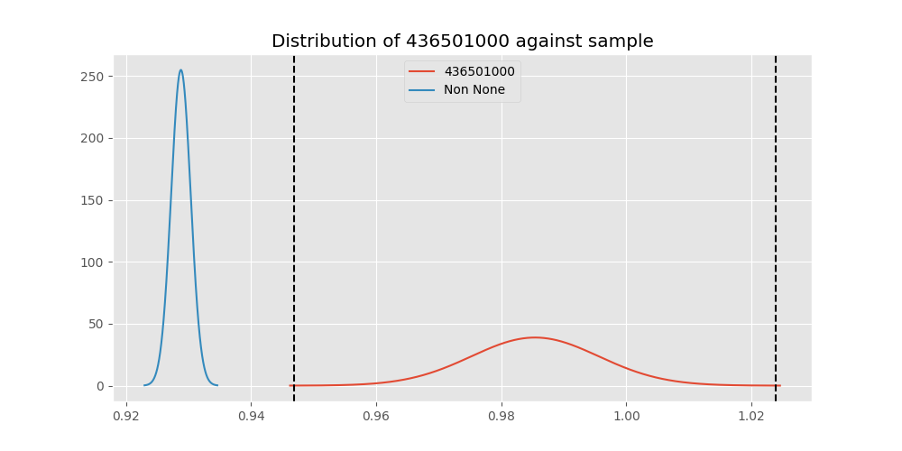 
Out of 44 tests, there were 15 rejections from 44 independent-t test.
Out of 44 tests, there were 15 rejections from 44 Man Whitney u-tests.
## Testing Results for 436501000 against 437375000 
436501000 has a success rate of 0.9854014598540146
437375000 has a success rate of 0.9982014388489209
$H_{0}$: There is not a difference between 436501000 and 437375000
$H_{A}$: There is a difference between 436501000 and 437375000
An $/alpha$ of 0.00025 was used in this test.
__independent t-testing__: With a t-statistic of -1.2259594559665719 and a p-value of 0.22220934089672045, _we failed to reject the null hypothssis_
__Man-Whitney testing__: With a u-statistic of 37598.5 and a p-value of 0.0413040325512965, _we failed to reject the null hypothssis_
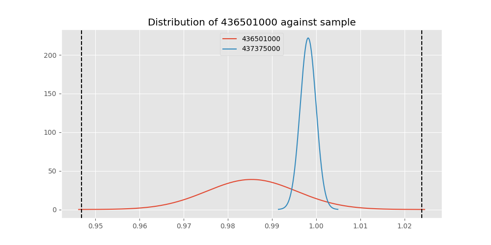 
## Testing Results for 436501000 against 436500000 
436501000 has a success rate of 0.9854014598540146
436500000 has a success rate of 0.9056603773584906
$H_{0}$: There is not a difference between 436501000 and 436500000
$H_{A}$: There is a difference between 436501000 and 436500000
An $/alpha$ of 0.00025 was used in this test.
__independent t-testing__: With a t-statistic of 2.9738830331800323 and a p-value of 0.003184197781683229, _we failed to reject the null hypothssis_
__Man-Whitney testing__: With a u-statistic of 11760.0 and a p-value of 0.003352422188846585, _we failed to reject the null hypothssis_
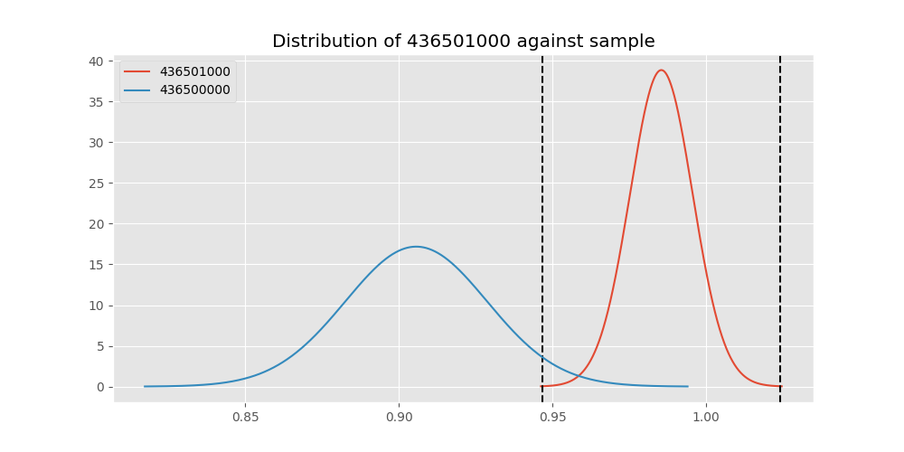 
## Testing Results for 436501000 against 436990000 
436501000 has a success rate of 0.9854014598540146
436990000 has a success rate of 0.9572649572649573
$H_{0}$: There is not a difference between 436501000 and 436990000
$H_{A}$: There is a difference between 436501000 and 436990000
An $/alpha$ of 0.00025 was used in this test.
__independent t-testing__: With a t-statistic of 1.4787565917658951 and a p-value of 0.14005849437730303, _we failed to reject the null hypothssis_
__Man-Whitney testing__: With a u-statistic of 16480.0 and a p-value of 0.14027868267064678, _we failed to reject the null hypothssis_
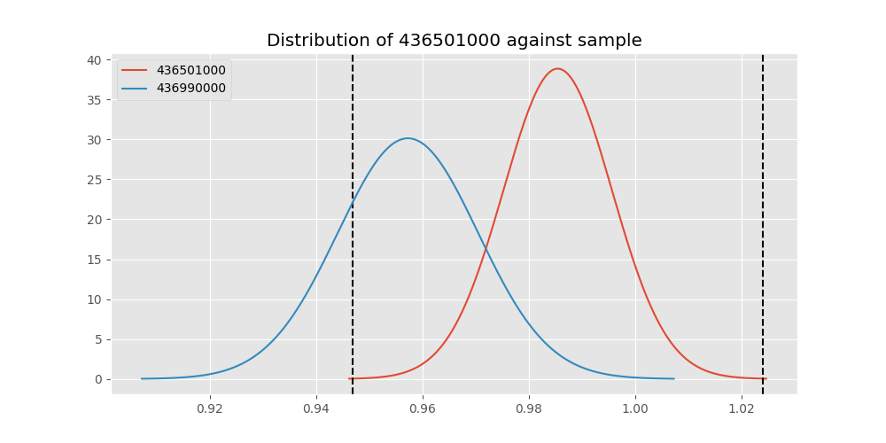 
## Testing Results for 436501000 against 145875000 
436501000 has a success rate of 0.9854014598540146
145875000 has a success rate of 0.9722222222222222
$H_{0}$: There is not a difference between 436501000 and 145875000
$H_{A}$: There is a difference between 436501000 and 145875000
An $/alpha$ of 0.00025 was used in this test.
__independent t-testing__: With a t-statistic of 0.6583384903613754 and a p-value of 0.5110521833110152, _we failed to reject the null hypothssis_
__Man-Whitney testing__: With a u-statistic of 4997.0 and a p-value of 0.5130049107558076, _we failed to reject the null hypothssis_
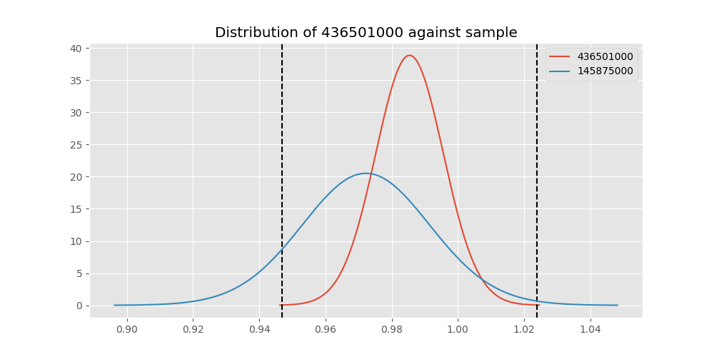 
## Testing Results for 436501000 against 437800000 
436501000 has a success rate of 0.9854014598540146
437800000 has a success rate of 0.9533678756476683
$H_{0}$: There is not a difference between 436501000 and 437800000
$H_{A}$: There is a difference between 436501000 and 437800000
An $/alpha$ of 0.00025 was used in this test.
__independent t-testing__: With a t-statistic of 1.598730537585604 and a p-value of 0.11084330275299382, _we failed to reject the null hypothssis_
__Man-Whitney testing__: With a u-statistic of 13644.0 and a p-value of 0.11114215948561354, _we failed to reject the null hypothssis_
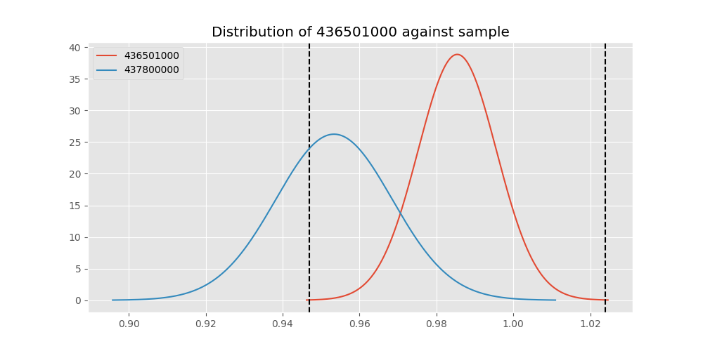 
## Testing Results for 436501000 against 145810000 
436501000 has a success rate of 0.9854014598540146
145810000 has a success rate of 0.12179487179487179
$H_{0}$: There is not a difference between 436501000 and 145810000
$H_{A}$: There is a difference between 436501000 and 145810000
An $/alpha$ of 0.00025 was used in this test.
__independent t-testing__: With a t-statistic of 29.129551340037423 and a p-value of 2.991795983223588e-88, _we **reject** the null hypothssis_
__Man-Whitney testing__: With a u-statistic of 19914.5 and a p-value of 3.323398954562209e-49, _we **reject** the null hypothssis_
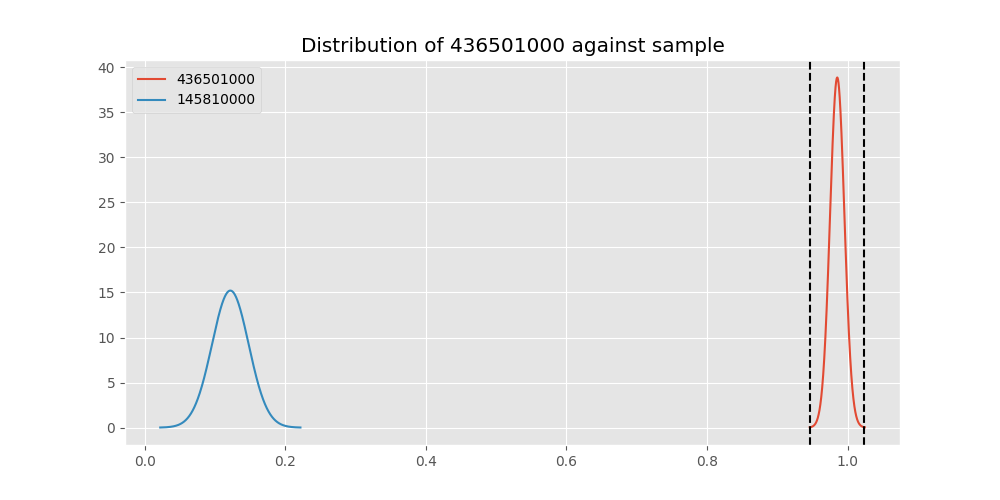 
## Testing Results for 436501000 against 437095000 
436501000 has a success rate of 0.9854014598540146
437095000 has a success rate of 0.9361702127659575
$H_{0}$: There is not a difference between 436501000 and 437095000
$H_{A}$: There is a difference between 436501000 and 437095000
An $/alpha$ of 0.00025 was used in this test.
__independent t-testing__: With a t-statistic of 1.7971903168718182 and a p-value of 0.07396334977352272, _we failed to reject the null hypothssis_
__Man-Whitney testing__: With a u-statistic of 3378.0 and a p-value of 0.07496071010167939, _we failed to reject the null hypothssis_
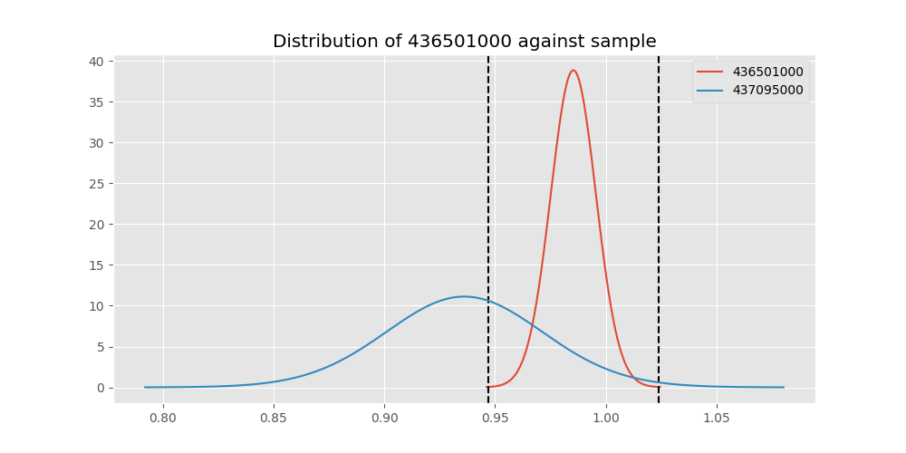 
## Testing Results for 436501000 against 437265000 
436501000 has a success rate of 0.9854014598540146
437265000 has a success rate of 0.9795454545454545
$H_{0}$: There is not a difference between 436501000 and 437265000
$H_{A}$: There is a difference between 436501000 and 437265000
An $/alpha$ of 0.00025 was used in this test.
__independent t-testing__: With a t-statistic of 0.43700817109616297 and a p-value of 0.6622694902299631, _we failed to reject the null hypothssis_
__Man-Whitney testing__: With a u-statistic of 30316.5 and a p-value of 0.6627811962079306, _we failed to reject the null hypothssis_
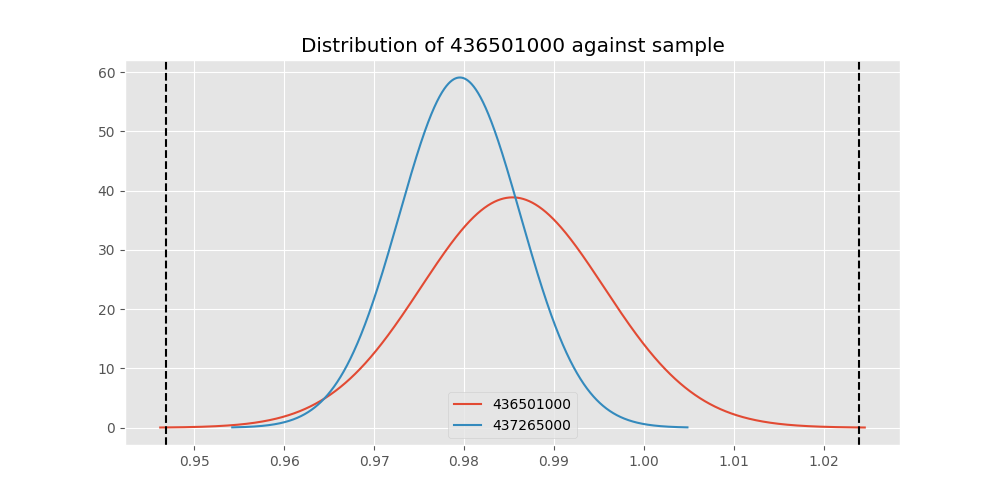 
## Testing Results for 436501000 against 437350000 
436501000 has a success rate of 0.9854014598540146
437350000 has a success rate of 0.9488372093023256
$H_{0}$: There is not a difference between 436501000 and 437350000
$H_{A}$: There is a difference between 436501000 and 437350000
An $/alpha$ of 0.00025 was used in this test.
__independent t-testing__: With a t-statistic of 1.776428670869589 and a p-value of 0.07653089315148083, _we failed to reject the null hypothssis_
__Man-Whitney testing__: With a u-statistic of 15266.0 and a p-value of 0.07683477727300946, _we failed to reject the null hypothssis_
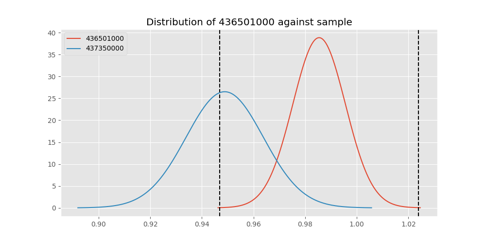 
## Testing Results for 436501000 against 437200000 
436501000 has a success rate of 0.9854014598540146
437200000 has a success rate of 0.8620689655172413
$H_{0}$: There is not a difference between 436501000 and 437200000
$H_{A}$: There is a difference between 436501000 and 437200000
An $/alpha$ of 0.00025 was used in this test.
__independent t-testing__: With a t-statistic of 4.013394052087486 and a p-value of 7.37493272213792e-05, _we **reject** the null hypothssis_
__Man-Whitney testing__: With a u-statistic of 15620.5 and a p-value of 8.647642209960529e-05, _we **reject** the null hypothssis_
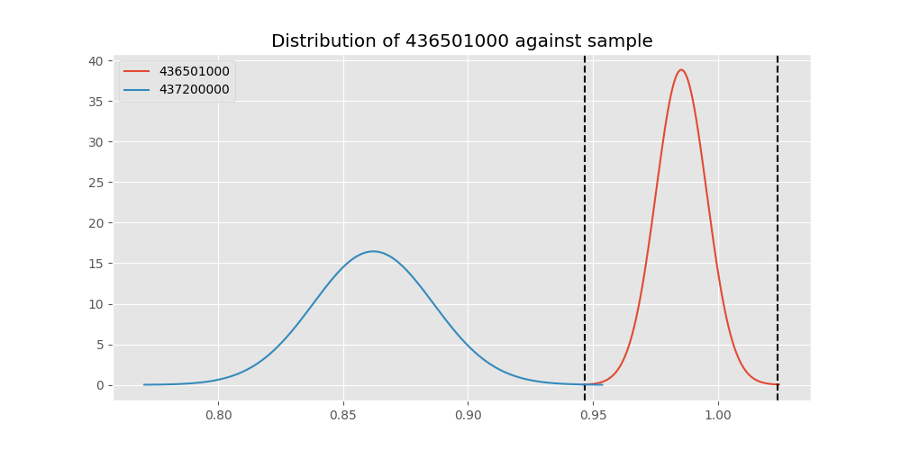 
## Testing Results for 436501000 against 435600000 
436501000 has a success rate of 0.9854014598540146
435600000 has a success rate of 0.9819341126461212
$H_{0}$: There is not a difference between 436501000 and 435600000
$H_{A}$: There is a difference between 436501000 and 435600000
An $/alpha$ of 0.00025 was used in this test.
__independent t-testing__: With a t-statistic of 0.28790586381200023 and a p-value of 0.7734742415598961, _we failed to reject the null hypothssis_
__Man-Whitney testing__: With a u-statistic of 64682.0 and a p-value of 0.7738181846047785, _we failed to reject the null hypothssis_
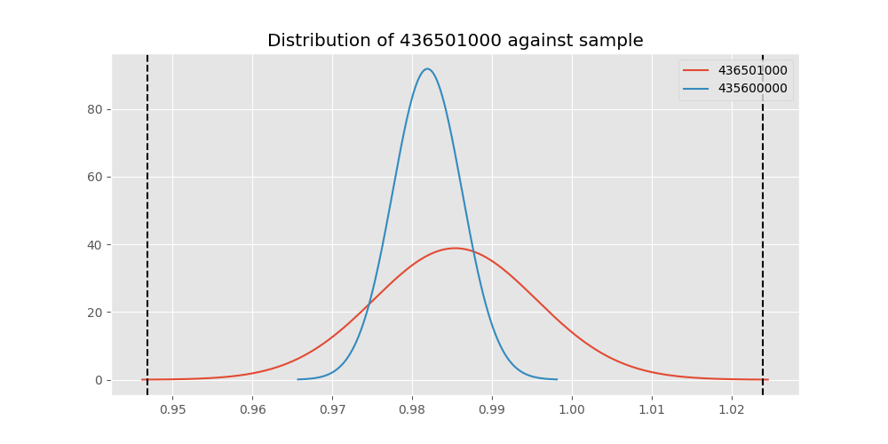 
## Testing Results for 436501000 against 450000000 
436501000 has a success rate of 0.9854014598540146
450000000 has a success rate of 0.8235294117647058
$H_{0}$: There is not a difference between 436501000 and 450000000
$H_{A}$: There is a difference between 436501000 and 450000000
An $/alpha$ of 0.00025 was used in this test.
__independent t-testing__: With a t-statistic of 4.594605039327086 and a p-value of 7.301383394116213e-06, _we **reject** the null hypothssis_
__Man-Whitney testing__: With a u-statistic of 6765.0 and a p-value of 1.100164116294985e-05, _we **reject** the null hypothssis_
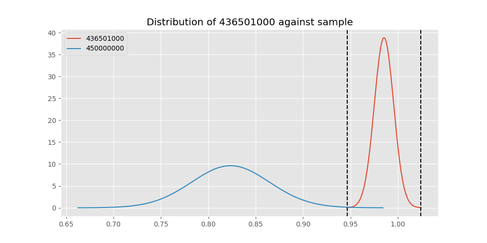 
## Testing Results for 436501000 against 145978500 
436501000 has a success rate of 0.9854014598540146
145978500 has a success rate of 0.9963636363636363
$H_{0}$: There is not a difference between 436501000 and 145978500
$H_{A}$: There is a difference between 436501000 and 145978500
An $/alpha$ of 0.00025 was used in this test.
__independent t-testing__: With a t-statistic of -1.232241351882817 and a p-value of 0.21856511971225046, _we failed to reject the null hypothssis_
__Man-Whitney testing__: With a u-statistic of 18631.0 and a p-value of 0.21926563916857833, _we failed to reject the null hypothssis_
 
## Testing Results for 436501000 against 437050000 
436501000 has a success rate of 0.9854014598540146
437050000 has a success rate of 0.5346534653465347
$H_{0}$: There is not a difference between 436501000 and 437050000
$H_{A}$: There is a difference between 436501000 and 437050000
An $/alpha$ of 0.00025 was used in this test.
__independent t-testing__: With a t-statistic of 10.142418603239548 and a p-value of 2.6897912608445212e-20, _we **reject** the null hypothssis_
__Man-Whitney testing__: With a u-statistic of 10037.0 and a p-value of 2.2389321006505938e-17, _we **reject** the null hypothssis_
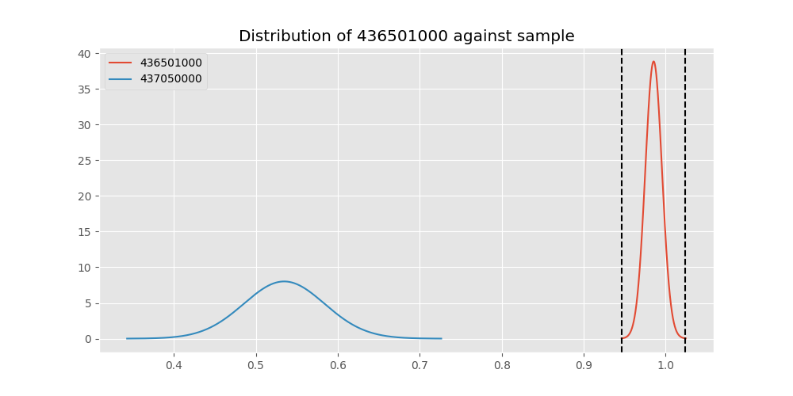 
## Testing Results for 436501000 against 435300000 
436501000 has a success rate of 0.9854014598540146
435300000 has a success rate of 0.1232876712328767
$H_{0}$: There is not a difference between 436501000 and 435300000
$H_{A}$: There is a difference between 436501000 and 435300000
An $/alpha$ of 0.00025 was used in this test.
__independent t-testing__: With a t-statistic of 28.836476243878405 and a p-value of 5.965698492399831e-86, _we **reject** the null hypothssis_
__Man-Whitney testing__: With a u-statistic of 18623.0 and a p-value of 9.426422484093478e-48, _we **reject** the null hypothssis_
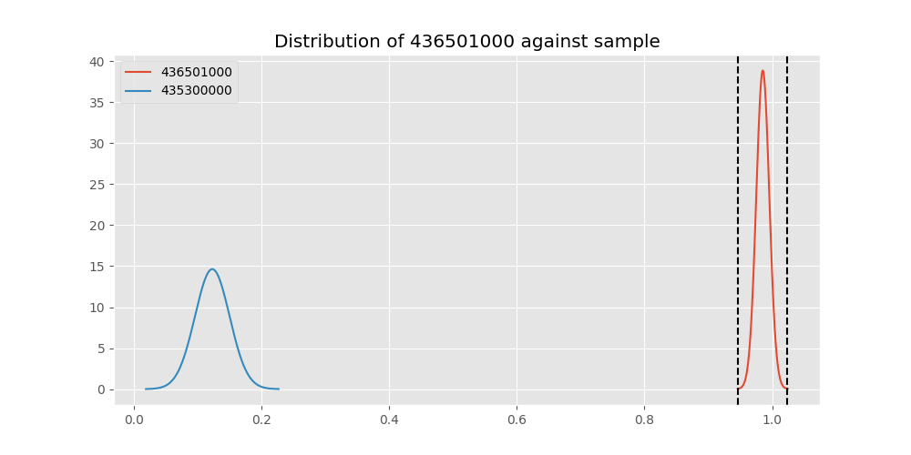 
## Testing Results for 436501000 against 437475000 
436501000 has a success rate of 0.9854014598540146
437475000 has a success rate of 0.5045045045045045
$H_{0}$: There is not a difference between 436501000 and 437475000
$H_{A}$: There is a difference between 436501000 and 437475000
An $/alpha$ of 0.00025 was used in this test.
__independent t-testing__: With a t-statistic of 11.162681324887805 and a p-value of 1.0298353803411391e-26, _we **reject** the null hypothssis_
__Man-Whitney testing__: With a u-statistic of 56300.0 and a p-value of 8.611414905432004e-25, _we **reject** the null hypothssis_
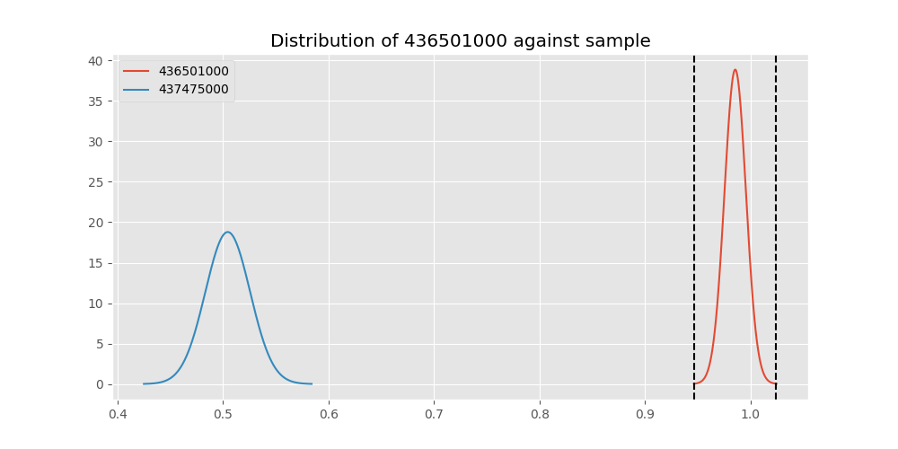 
## Testing Results for 436501000 against 435448000 
436501000 has a success rate of 0.9854014598540146
435448000 has a success rate of 0.975
$H_{0}$: There is not a difference between 436501000 and 435448000
$H_{A}$: There is a difference between 436501000 and 435448000
An $/alpha$ of 0.00025 was used in this test.
__independent t-testing__: With a t-statistic of 0.4460824357286487 and a p-value of 0.6560891344840865, _we failed to reject the null hypothssis_
__Man-Whitney testing__: With a u-statistic of 2768.5 and a p-value of 0.660475225800398, _we failed to reject the null hypothssis_
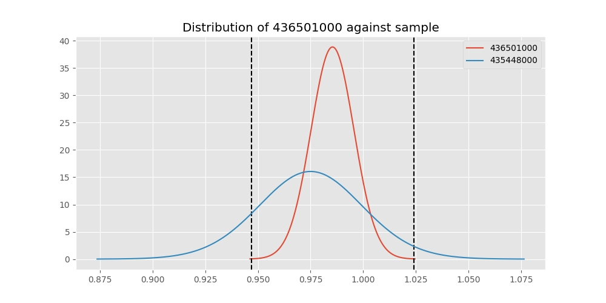 
## Testing Results for 436501000 against 437644000 
436501000 has a success rate of 0.9854014598540146
437644000 has a success rate of 0.9743589743589743
$H_{0}$: There is not a difference between 436501000 and 437644000
$H_{A}$: There is a difference between 436501000 and 437644000
An $/alpha$ of 0.00025 was used in this test.
__independent t-testing__: With a t-statistic of 0.6294725743007592 and a p-value of 0.5296099739335424, _we failed to reject the null hypothssis_
__Man-Whitney testing__: With a u-statistic of 8103.0 and a p-value of 0.5308792305862231, _we failed to reject the null hypothssis_
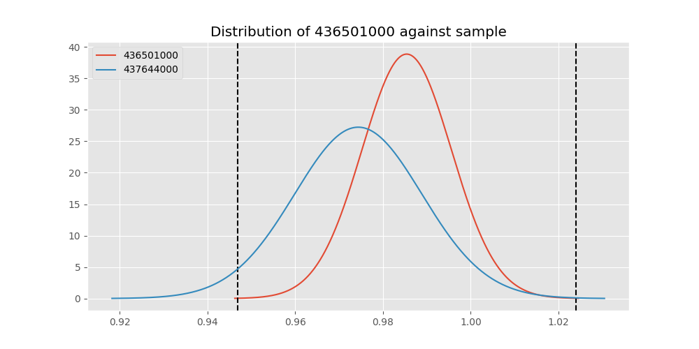 
## Testing Results for 436501000 against 145825000 
436501000 has a success rate of 0.9854014598540146
145825000 has a success rate of 0.8687448728465955
$H_{0}$: There is not a difference between 436501000 and 145825000
$H_{A}$: There is a difference between 436501000 and 145825000
An $/alpha$ of 0.00025 was used in this test.
__independent t-testing__: With a t-statistic of 4.027750664790327 and a p-value of 5.794348614945856e-05, _we **reject** the null hypothssis_
__Man-Whitney testing__: With a u-statistic of 186485.0 and a p-value of 5.924699508883269e-05, _we **reject** the null hypothssis_
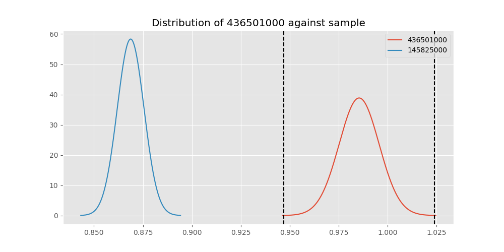 
## Testing Results for 436501000 against 437345000 
436501000 has a success rate of 0.9854014598540146
437345000 has a success rate of 0.7603092783505154
$H_{0}$: There is not a difference between 436501000 and 437345000
$H_{A}$: There is a difference between 436501000 and 437345000
An $/alpha$ of 0.00025 was used in this test.
__independent t-testing__: With a t-statistic of 6.075773666459386 and a p-value of 2.3778097342683677e-09, _we **reject** the null hypothssis_
__Man-Whitney testing__: With a u-statistic of 32560.5 and a p-value of 4.172843887657257e-09, _we **reject** the null hypothssis_
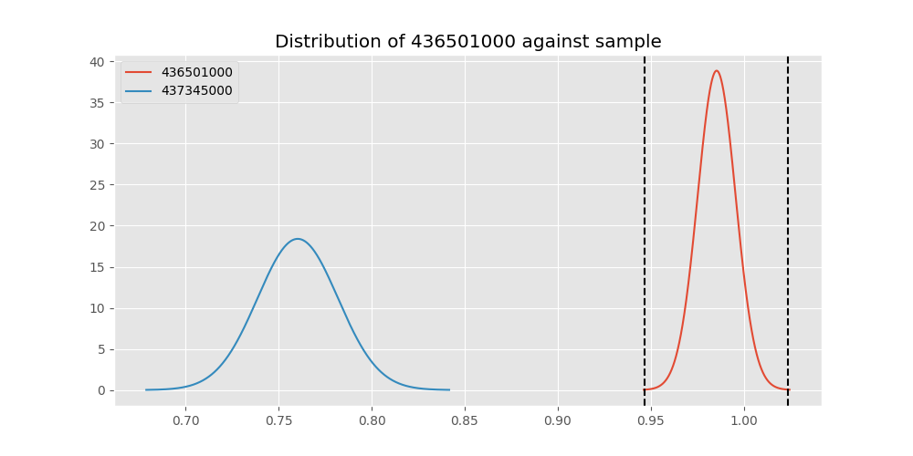 
## Testing Results for 436501000 against 435275000 
436501000 has a success rate of 0.9854014598540146
435275000 has a success rate of 0.9152542372881356
$H_{0}$: There is not a difference between 436501000 and 435275000
$H_{A}$: There is a difference between 436501000 and 435275000
An $/alpha$ of 0.00025 was used in this test.
__independent t-testing__: With a t-statistic of 2.6636933609454143 and a p-value of 0.00822503727044411, _we failed to reject the null hypothssis_
__Man-Whitney testing__: With a u-statistic of 8650.0 and a p-value of 0.008539099393167401, _we failed to reject the null hypothssis_
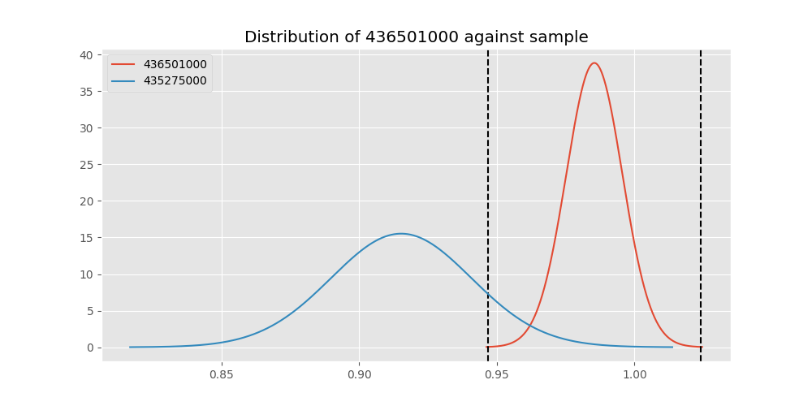 
## Testing Results for 436501000 against 437322500 
436501000 has a success rate of 0.9854014598540146
437322500 has a success rate of 0.9961685823754789
$H_{0}$: There is not a difference between 436501000 and 437322500
$H_{A}$: There is a difference between 436501000 and 437322500
An $/alpha$ of 0.00025 was used in this test.
__independent t-testing__: With a t-statistic of -1.1790427760642554 and a p-value of 0.2390890524519199, _we failed to reject the null hypothssis_
__Man-Whitney testing__: With a u-statistic of 17686.0 and a p-value of 0.23983355577756127, _we failed to reject the null hypothssis_
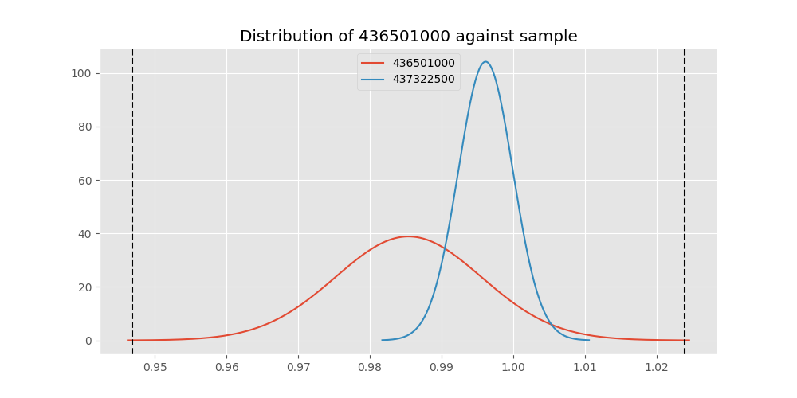 
## Testing Results for 436501000 against 437450000 
436501000 has a success rate of 0.9854014598540146
437450000 has a success rate of 0.6947791164658634
$H_{0}$: There is not a difference between 436501000 and 437450000
$H_{A}$: There is a difference between 436501000 and 437450000
An $/alpha$ of 0.00025 was used in this test.
__independent t-testing__: With a t-statistic of 7.233918741620452 and a p-value of 2.5663045696764016e-12, _we **reject** the null hypothssis_
__Man-Whitney testing__: With a u-statistic of 22013.5 and a p-value of 1.0874365736796291e-11, _we **reject** the null hypothssis_
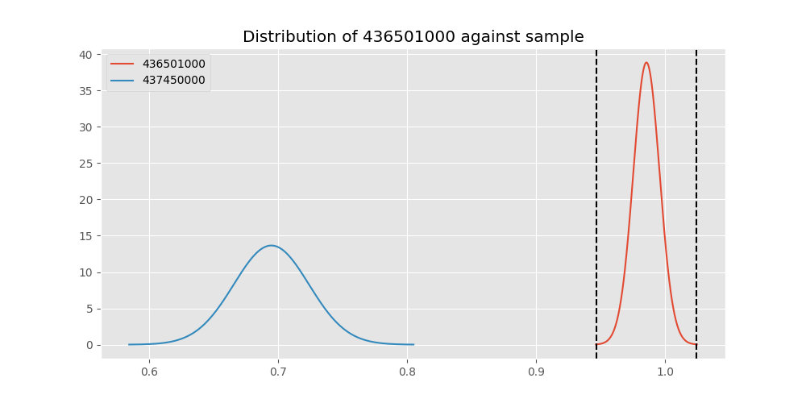 
## Testing Results for 436501000 against 436703000 
436501000 has a success rate of 0.9854014598540146
436703000 has a success rate of 0.9859154929577465
$H_{0}$: There is not a difference between 436501000 and 436703000
$H_{A}$: There is a difference between 436501000 and 436703000
An $/alpha$ of 0.00025 was used in this test.
__independent t-testing__: With a t-statistic of -0.03944002818648362 and a p-value of 0.9685621829873161, _we failed to reject the null hypothssis_
__Man-Whitney testing__: With a u-statistic of 14583.0 and a p-value of 0.9705938733741245, _we failed to reject the null hypothssis_
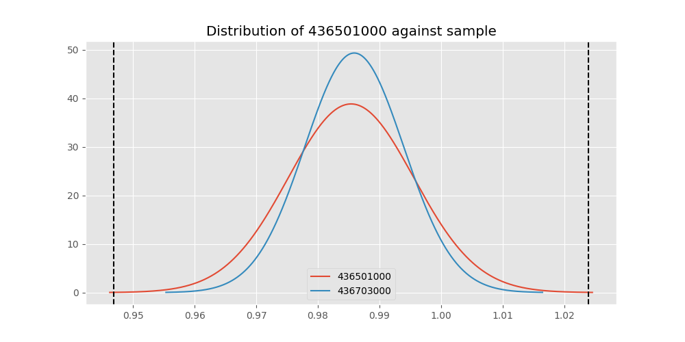 
## Testing Results for 436501000 against 400500000 
436501000 has a success rate of 0.9854014598540146
400500000 has a success rate of 0.3508771929824561
$H_{0}$: There is not a difference between 436501000 and 400500000
$H_{A}$: There is a difference between 436501000 and 400500000
An $/alpha$ of 0.00025 was used in this test.
__independent t-testing__: With a t-statistic of 14.425396798509048 and a p-value of 1.9462447539288212e-32, _we **reject** the null hypothssis_
__Man-Whitney testing__: With a u-statistic of 6382.0 and a p-value of 1.2830594108039925e-23, _we **reject** the null hypothssis_
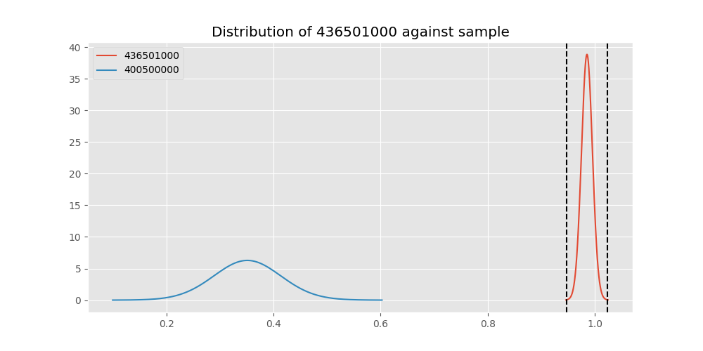 
## Testing Results for 436501000 against 437150000 
436501000 has a success rate of 0.9854014598540146
437150000 has a success rate of 0.9859550561797753
$H_{0}$: There is not a difference between 436501000 and 437150000
$H_{A}$: There is a difference between 436501000 and 437150000
An $/alpha$ of 0.00025 was used in this test.
__independent t-testing__: With a t-statistic of -0.046446503636715764 and a p-value of 0.9629732565516747, _we failed to reject the null hypothssis_
__Man-Whitney testing__: With a u-statistic of 24372.5 and a p-value of 0.964289292691276, _we failed to reject the null hypothssis_
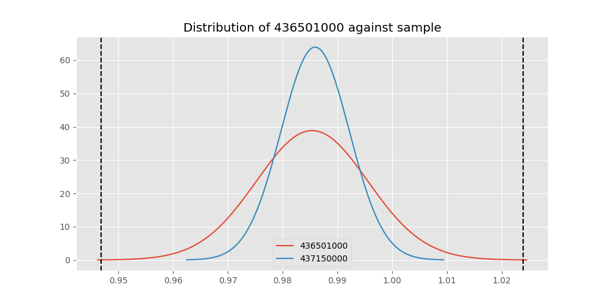 
## Testing Results for 436501000 against 435635000 
436501000 has a success rate of 0.9854014598540146
435635000 has a success rate of 0.9849624060150376
$H_{0}$: There is not a difference between 436501000 and 435635000
$H_{A}$: There is a difference between 436501000 and 435635000
An $/alpha$ of 0.00025 was used in this test.
__independent t-testing__: With a t-statistic of 0.029744123989421768 and a p-value of 0.9762932594337108, _we failed to reject the null hypothssis_
__Man-Whitney testing__: With a u-statistic of 9114.5 and a p-value of 0.9791978552487722, _we failed to reject the null hypothssis_
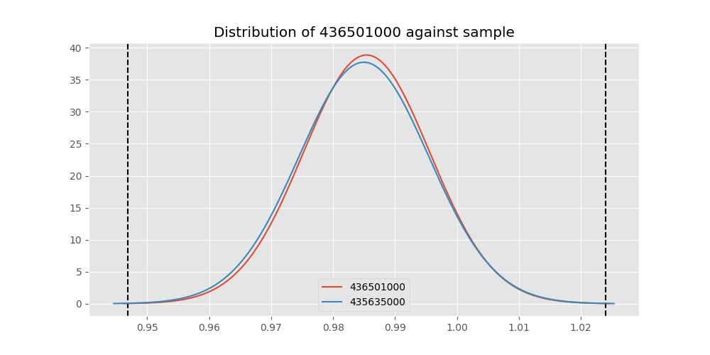 
## Testing Results for 436501000 against 437384000 
436501000 has a success rate of 0.9854014598540146
437384000 has a success rate of 0.968421052631579
$H_{0}$: There is not a difference between 436501000 and 437384000
$H_{A}$: There is a difference between 436501000 and 437384000
An $/alpha$ of 0.00025 was used in this test.
__independent t-testing__: With a t-statistic of 0.9790978432189518 and a p-value of 0.3282598893608528, _we failed to reject the null hypothssis_
__Man-Whitney testing__: With a u-statistic of 13236.0 and a p-value of 0.32859654243800995, _we failed to reject the null hypothssis_
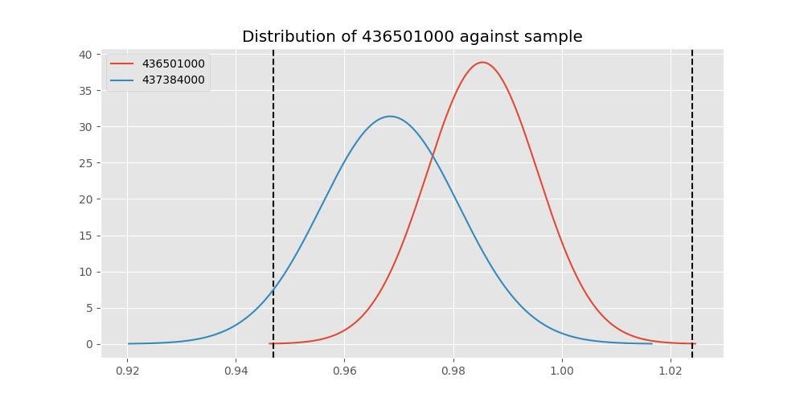 
## Testing Results for 436501000 against 437405000 
436501000 has a success rate of 0.9854014598540146
437405000 has a success rate of 0.9953917050691244
$H_{0}$: There is not a difference between 436501000 and 437405000
$H_{A}$: There is a difference between 436501000 and 437405000
An $/alpha$ of 0.00025 was used in this test.
__independent t-testing__: With a t-statistic of -0.9973237877255227 and a p-value of 0.319292459358593, _we failed to reject the null hypothssis_
__Man-Whitney testing__: With a u-statistic of 14716.0 and a p-value of 0.3202358562760629, _we failed to reject the null hypothssis_
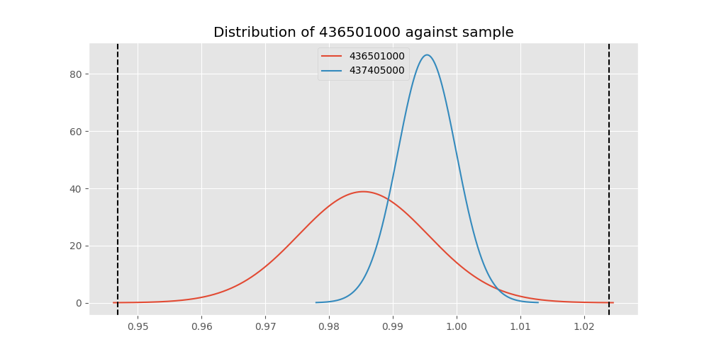 
## Testing Results for 436501000 against 435612500 
436501000 has a success rate of 0.9854014598540146
435612500 has a success rate of 0.9770114942528736
$H_{0}$: There is not a difference between 436501000 and 435612500
$H_{A}$: There is a difference between 436501000 and 435612500
An $/alpha$ of 0.00025 was used in this test.
__independent t-testing__: With a t-statistic of 0.4602802807499447 and a p-value of 0.6457655622223835, _we failed to reject the null hypothssis_
__Man-Whitney testing__: With a u-statistic of 6009.5 and a p-value of 0.6480413539479394, _we failed to reject the null hypothssis_
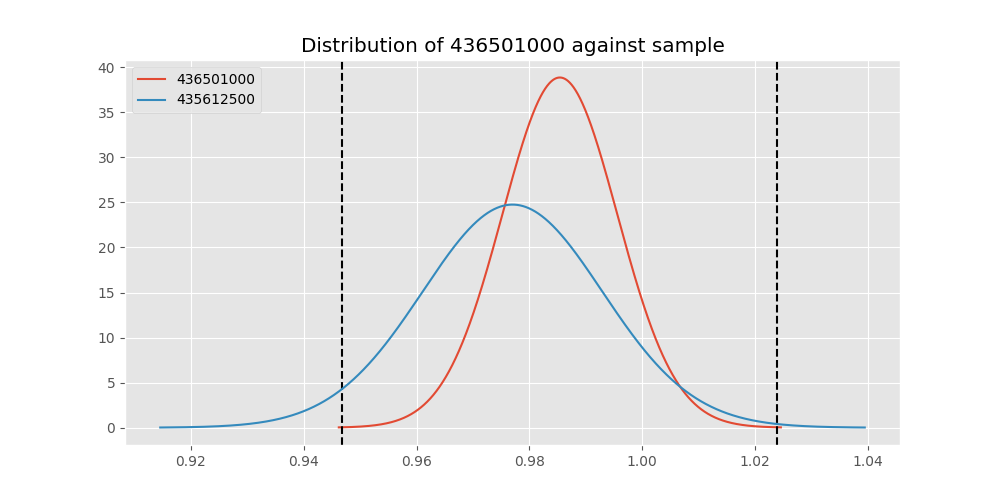 
## Testing Results for 436501000 against 435975000 
436501000 has a success rate of 0.9854014598540146
435975000 has a success rate of 0.92
$H_{0}$: There is not a difference between 436501000 and 435975000
$H_{A}$: There is a difference between 436501000 and 435975000
An $/alpha$ of 0.00025 was used in this test.
__independent t-testing__: With a t-statistic of 2.264867024828163 and a p-value of 0.02468045221774859, _we failed to reject the null hypothssis_
__Man-Whitney testing__: With a u-statistic of 3649.0 and a p-value of 0.02540847449524933, _we failed to reject the null hypothssis_
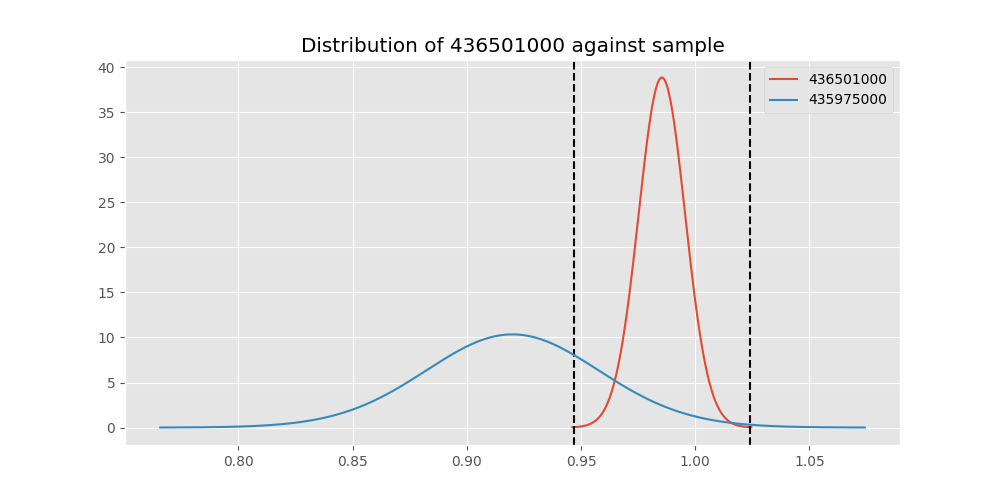 
## Testing Results for 436501000 against 437425000 
436501000 has a success rate of 0.9854014598540146
437425000 has a success rate of 0.6987654320987654
$H_{0}$: There is not a difference between 436501000 and 437425000
$H_{A}$: There is a difference between 436501000 and 437425000
An $/alpha$ of 0.00025 was used in this test.
__independent t-testing__: With a t-statistic of 7.216179127449925 and a p-value of 1.8214794204576198e-12, _we **reject** the null hypothssis_
__Man-Whitney testing__: With a u-statistic of 35694.5 and a p-value of 5.293035372768971e-12, _we **reject** the null hypothssis_
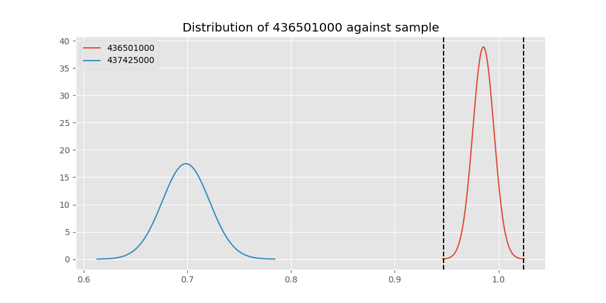 
## Testing Results for 436501000 against 437275000 
436501000 has a success rate of 0.9854014598540146
437275000 has a success rate of 0.3643724696356275
$H_{0}$: There is not a difference between 436501000 and 437275000
$H_{A}$: There is a difference between 436501000 and 437275000
An $/alpha$ of 0.00025 was used in this test.
__independent t-testing__: With a t-statistic of 14.811846451234361 and a p-value of 1.523364368876717e-39, _we **reject** the null hypothssis_
__Man-Whitney testing__: With a u-statistic of 27427.0 and a p-value of 3.0847730621642696e-32, _we **reject** the null hypothssis_
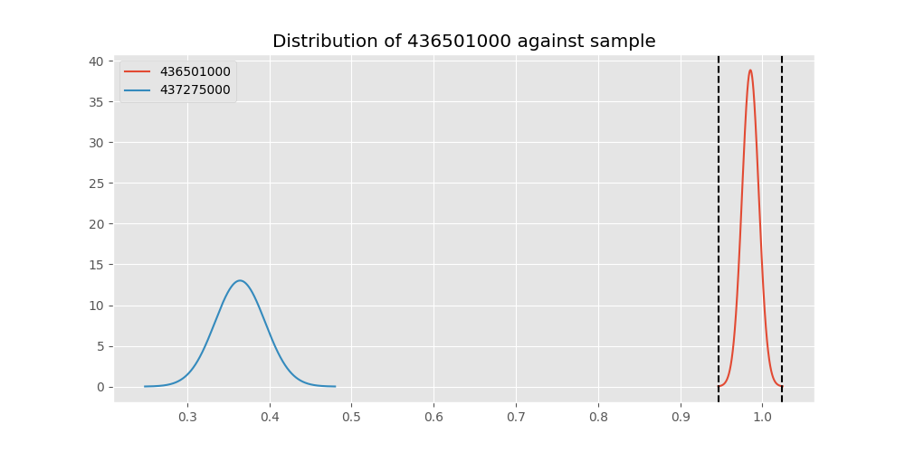 
## Testing Results for 436501000 against 145840000 
436501000 has a success rate of 0.9854014598540146
145840000 has a success rate of 0.9649122807017544
$H_{0}$: There is not a difference between 436501000 and 145840000
$H_{A}$: There is a difference between 436501000 and 145840000
An $/alpha$ of 0.00025 was used in this test.
__independent t-testing__: With a t-statistic of 0.9120208826672251 and a p-value of 0.3629014152995319, _we failed to reject the null hypothssis_
__Man-Whitney testing__: With a u-statistic of 3984.5 and a p-value of 0.3645570091279712, _we failed to reject the null hypothssis_
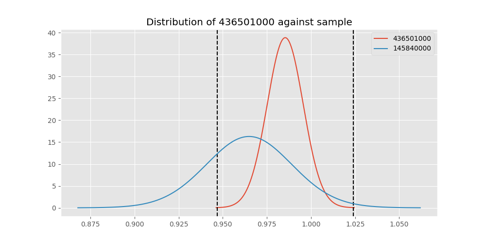 
## Testing Results for 436501000 against 435525000 
436501000 has a success rate of 0.9854014598540146
435525000 has a success rate of 0.6923076923076923
$H_{0}$: There is not a difference between 436501000 and 435525000
$H_{A}$: There is a difference between 436501000 and 435525000
An $/alpha$ of 0.00025 was used in this test.
__independent t-testing__: With a t-statistic of 7.177763038851933 and a p-value of 6.472678586330637e-12, _we **reject** the null hypothssis_
__Man-Whitney testing__: With a u-statistic of 12666.5 and a p-value of 4.015491322275257e-11, _we **reject** the null hypothssis_
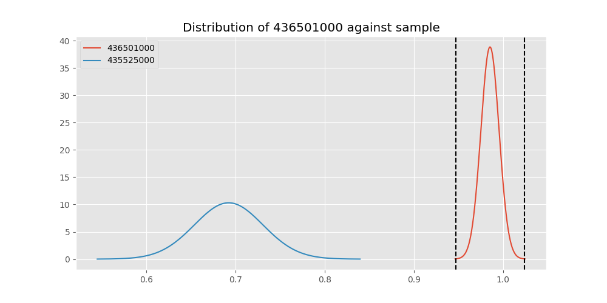 
## Testing Results for 436501000 against 436250000 
436501000 has a success rate of 0.9854014598540146
436250000 has a success rate of 0.17857142857142858
$H_{0}$: There is not a difference between 436501000 and 436250000
$H_{A}$: There is a difference between 436501000 and 436250000
An $/alpha$ of 0.00025 was used in this test.
__independent t-testing__: With a t-statistic of 22.028857556703752 and a p-value of 2.4786898043232126e-54, _we **reject** the null hypothssis_
__Man-Whitney testing__: With a u-statistic of 6931.0 and a p-value of 8.354659573397603e-32, _we **reject** the null hypothssis_
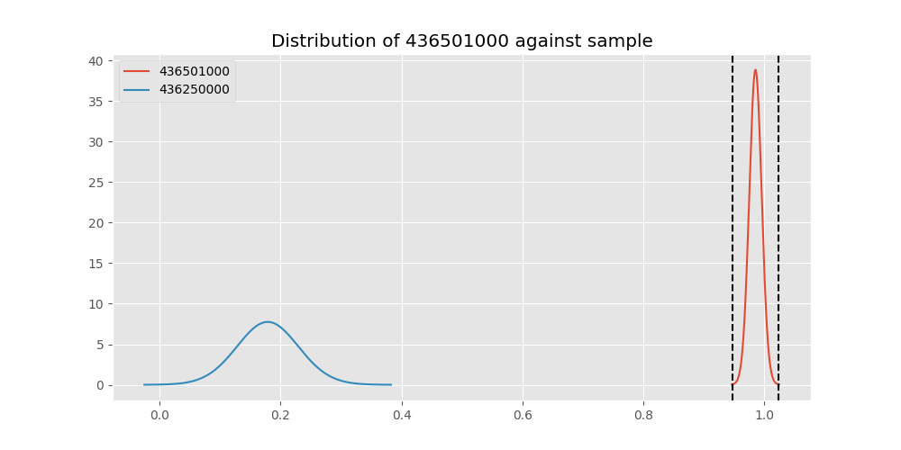 
## Testing Results for 436501000 against 435950000 
436501000 has a success rate of 0.9854014598540146
435950000 has a success rate of 0.9850187265917603
$H_{0}$: There is not a difference between 436501000 and 435950000
$H_{A}$: There is a difference between 436501000 and 435950000
An $/alpha$ of 0.00025 was used in this test.
__independent t-testing__: With a t-statistic of 0.032933645047152744 and a p-value of 0.973737325552364, _we failed to reject the null hypothssis_
__Man-Whitney testing__: With a u-statistic of 36593.0 and a p-value of 0.9746465840898016, _we failed to reject the null hypothssis_
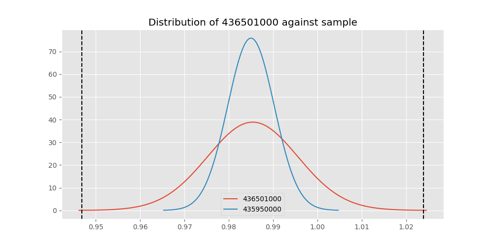 
## Testing Results for 436501000 against 435800000 
436501000 has a success rate of 0.9854014598540146
435800000 has a success rate of 0.5390070921985816
$H_{0}$: There is not a difference between 436501000 and 435800000
$H_{A}$: There is a difference between 436501000 and 435800000
An $/alpha$ of 0.00025 was used in this test.
__independent t-testing__: With a t-statistic of 10.16209073756755 and a p-value of 8.135152394247309e-21, _we **reject** the null hypothssis_
__Man-Whitney testing__: With a u-statistic of 13970.0 and a p-value of 3.834608594871388e-18, _we **reject** the null hypothssis_
 
## Testing Results for 436501000 against 437485000 
436501000 has a success rate of 0.9854014598540146
437485000 has a success rate of 0.9375
$H_{0}$: There is not a difference between 436501000 and 437485000
$H_{A}$: There is a difference between 436501000 and 437485000
An $/alpha$ of 0.00025 was used in this test.
__independent t-testing__: With a t-statistic of 1.607701410756741 and a p-value of 0.10978956604623279, _we failed to reject the null hypothssis_
__Man-Whitney testing__: With a u-statistic of 2297.0 and a p-value of 0.11126067567185811, _we failed to reject the null hypothssis_
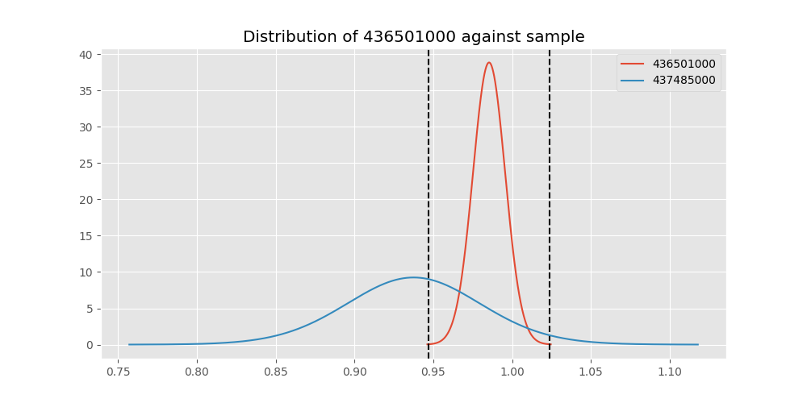 
## Testing Results for 436501000 against 136770000 
436501000 has a success rate of 0.9854014598540146
136770000 has a success rate of 0.9945945945945946
$H_{0}$: There is not a difference between 436501000 and 136770000
$H_{A}$: There is a difference between 436501000 and 136770000
An $/alpha$ of 0.00025 was used in this test.
__independent t-testing__: With a t-statistic of -0.8472573927529043 and a p-value of 0.3974848857328105, _we failed to reject the null hypothssis_
__Man-Whitney testing__: With a u-statistic of 12556.0 and a p-value of 0.39867381701156734, _we failed to reject the null hypothssis_
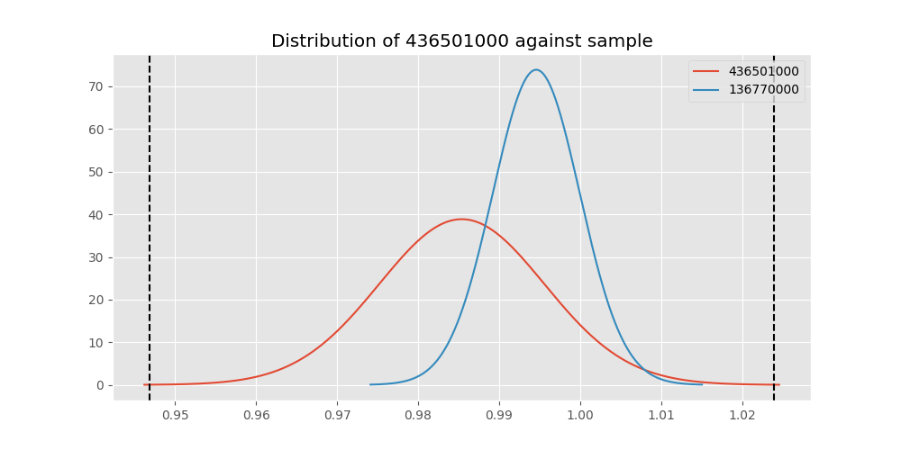 
## Testing Results for 436501000 against 437250000 
436501000 has a success rate of 0.9854014598540146
437250000 has a success rate of 0.9937106918238994
$H_{0}$: There is not a difference between 436501000 and 437250000
$H_{A}$: There is a difference between 436501000 and 437250000
An $/alpha$ of 0.00025 was used in this test.
__independent t-testing__: With a t-statistic of -0.8698170755396035 and a p-value of 0.3848610298601025, _we failed to reject the null hypothssis_
__Man-Whitney testing__: With a u-statistic of 21602.0 and a p-value of 0.38558766454455173, _we failed to reject the null hypothssis_
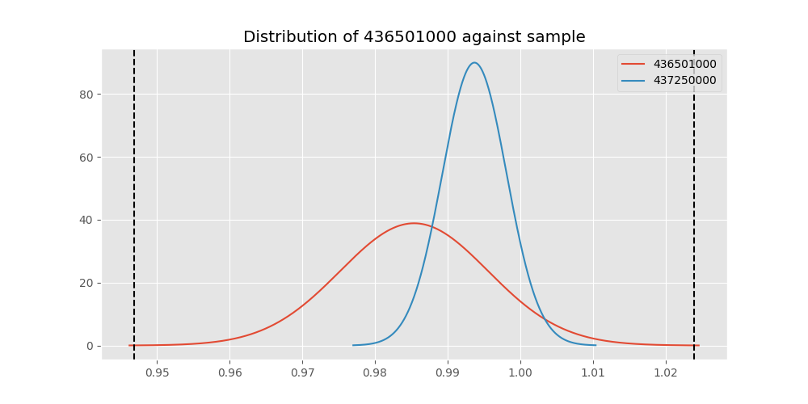 
## Testing Results for 436501000 against 437356000 
436501000 has a success rate of 0.9854014598540146
437356000 has a success rate of 0.9328358208955224
$H_{0}$: There is not a difference between 436501000 and 437356000
$H_{A}$: There is a difference between 436501000 and 437356000
An $/alpha$ of 0.00025 was used in this test.
__independent t-testing__: With a t-statistic of 2.203909253904926 and a p-value of 0.028377951047789368, _we failed to reject the null hypothssis_
__Man-Whitney testing__: With a u-statistic of 9661.5 and a p-value of 0.028810796561866713, _we failed to reject the null hypothssis_
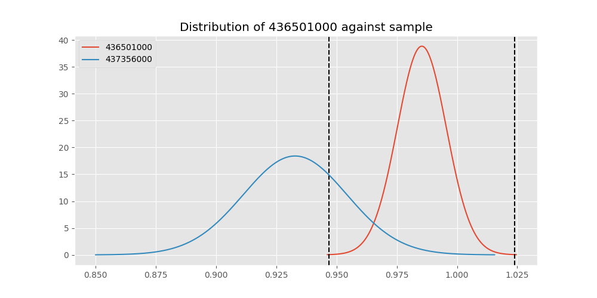 
## Testing Results for 436501000 against 437676000 
436501000 has a success rate of 0.9854014598540146
437676000 has a success rate of 0.9813432835820896
$H_{0}$: There is not a difference between 436501000 and 437676000
$H_{A}$: There is a difference between 436501000 and 437676000
An $/alpha$ of 0.00025 was used in this test.
__independent t-testing__: With a t-statistic of 0.29577924034098113 and a p-value of 0.7675510215161638, _we failed to reject the null hypothssis_
__Man-Whitney testing__: With a u-statistic of 18432.5 and a p-value of 0.7686612386972239, _we failed to reject the null hypothssis_
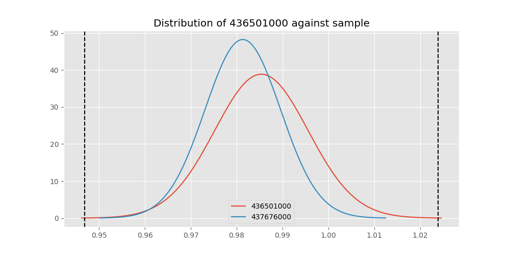 
## Testing Results for 436501000 against 145826800 
436501000 has a success rate of 0.9854014598540146
145826800 has a success rate of 0.966183574879227
$H_{0}$: There is not a difference between 436501000 and 145826800
$H_{A}$: There is a difference between 436501000 and 145826800
An $/alpha$ of 0.00025 was used in this test.
__independent t-testing__: With a t-statistic of 1.0918829827043037 and a p-value of 0.27565312565434014, _we failed to reject the null hypothssis_
__Man-Whitney testing__: With a u-statistic of 14452.0 and a p-value of 0.27590071540583305, _we failed to reject the null hypothssis_
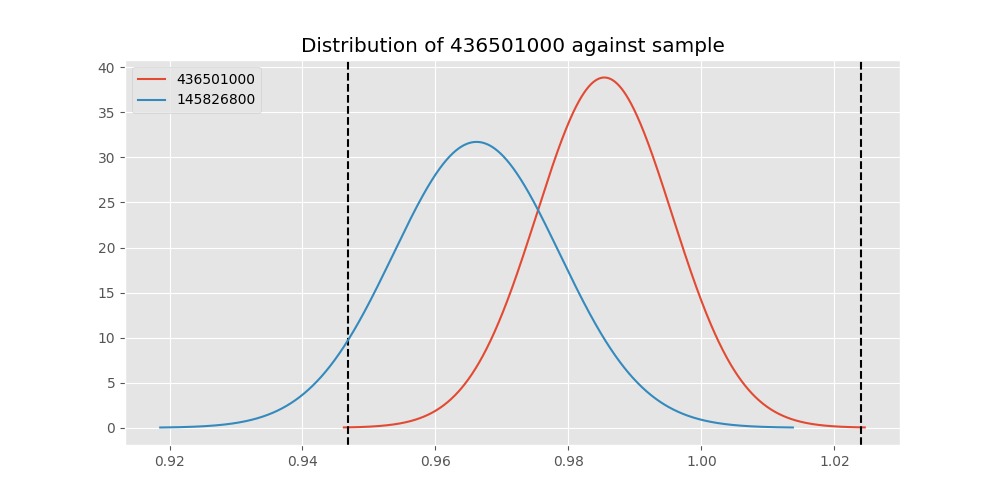 
