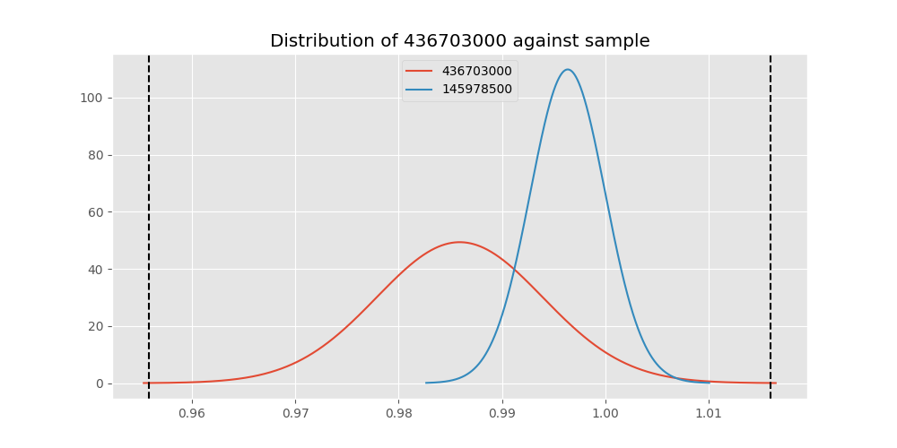

# Testing Results For 436703000 
$H_{0}$: There is not a difference in collection success against 436703000 
$H_{A}$: There is a difference in collection success against 436703000
An $\alpha$ of 0.00025 was used 
Out of 44 tests, there were 15 rejections from 44 independent-t test.
Out of 44 tests, there were 15 rejections from 44 Man Whitney u-tests.
## Testing Results for 436703000 against 436501000 
436703000 has a success rate of 0.9859154929577465
436501000 has a success rate of 0.9854014598540146
$H_{0}$: There is not a difference between 436703000 and 436501000
$H_{A}$: There is a difference between 436703000 and 436501000
An $/alpha$ of 0.00025 was used in this test.
__independent t-testing__: With a t-statistic of 0.03944002818648362 and a p-value of 0.9685621829873161, _we failed to reject the null hypothssis_
__Man-Whitney testing__: With a u-statistic of 14598.0 and a p-value of 0.9705938733741245, _we failed to reject the null hypothssis_
 
## Testing Results for 436703000 against 437375000 
436703000 has a success rate of 0.9859154929577465
437375000 has a success rate of 0.9982014388489209
$H_{0}$: There is not a difference between 436703000 and 437375000
$H_{A}$: There is a difference between 436703000 and 437375000
An $/alpha$ of 0.00025 was used in this test.
__independent t-testing__: With a t-statistic of -1.4818976148638299 and a p-value of 0.13971730093739074, _we failed to reject the null hypothssis_
__Man-Whitney testing__: With a u-statistic of 58486.5 and a p-value of 0.03428622911650739, _we failed to reject the null hypothssis_
 
## Testing Results for 436703000 against 436500000 
436703000 has a success rate of 0.9859154929577465
436500000 has a success rate of 0.9056603773584906
$H_{0}$: There is not a difference between 436703000 and 436500000
$H_{A}$: There is a difference between 436703000 and 436500000
An $/alpha$ of 0.00025 was used in this test.
__independent t-testing__: With a t-statistic of 3.6214951830779962 and a p-value of 0.0003337525875943665, _we failed to reject the null hypothssis_
__Man-Whitney testing__: With a u-statistic of 18292.5 and a p-value of 0.00036739189206893804, _we failed to reject the null hypothssis_
 
## Testing Results for 436703000 against 436990000 
436703000 has a success rate of 0.9859154929577465
436990000 has a success rate of 0.9572649572649573
$H_{0}$: There is not a difference between 436703000 and 436990000
$H_{A}$: There is a difference between 436703000 and 436990000
An $/alpha$ of 0.00025 was used in this test.
__independent t-testing__: With a t-statistic of 1.8029111387852208 and a p-value of 0.07207855126670586, _we failed to reject the null hypothssis_
__Man-Whitney testing__: With a u-statistic of 25635.0 and a p-value of 0.07231653599937853, _we failed to reject the null hypothssis_
 
## Testing Results for 436703000 against 145875000 
436703000 has a success rate of 0.9859154929577465
145875000 has a success rate of 0.9722222222222222
$H_{0}$: There is not a difference between 436703000 and 145875000
$H_{A}$: There is a difference between 436703000 and 145875000
An $/alpha$ of 0.00025 was used in this test.
__independent t-testing__: With a t-statistic of 0.7632009842948974 and a p-value of 0.44597927542343807, _we failed to reject the null hypothssis_
__Man-Whitney testing__: With a u-statistic of 7773.0 and a p-value of 0.4471794812348895, _we failed to reject the null hypothssis_
 
## Testing Results for 436703000 against 437800000 
436703000 has a success rate of 0.9859154929577465
437800000 has a success rate of 0.9533678756476683
$H_{0}$: There is not a difference between 436703000 and 437800000
$H_{A}$: There is a difference between 436703000 and 437800000
An $/alpha$ of 0.00025 was used in this test.
__independent t-testing__: With a t-statistic of 1.9379785958664617 and a p-value of 0.05332225596552745, _we failed to reject the null hypothssis_
__Man-Whitney testing__: With a u-statistic of 21223.5 and a p-value of 0.053609910497691385, _we failed to reject the null hypothssis_
 
## Testing Results for 436703000 against 145810000 
436703000 has a success rate of 0.9859154929577465
145810000 has a success rate of 0.12179487179487179
$H_{0}$: There is not a difference between 436703000 and 145810000
$H_{A}$: There is a difference between 436703000 and 145810000
An $/alpha$ of 0.00025 was used in this test.
__independent t-testing__: With a t-statistic of 35.443393191880304 and a p-value of 1.5342730864286918e-120, _we **reject** the null hypothssis_
__Man-Whitney testing__: With a u-statistic of 30970.5 and a p-value of 6.828712882568154e-64, _we **reject** the null hypothssis_
 
## Testing Results for 436703000 against 437095000 
436703000 has a success rate of 0.9859154929577465
437095000 has a success rate of 0.9361702127659575
$H_{0}$: There is not a difference between 436703000 and 437095000
$H_{A}$: There is a difference between 436703000 and 437095000
An $/alpha$ of 0.00025 was used in this test.
__independent t-testing__: With a t-statistic of 2.0647467407417337 and a p-value of 0.03994628135468433, _we failed to reject the null hypothssis_
__Man-Whitney testing__: With a u-statistic of 5254.5 and a p-value of 0.04058536997197709, _we failed to reject the null hypothssis_
 
## Testing Results for 436703000 against 437265000 
436703000 has a success rate of 0.9859154929577465
437265000 has a success rate of 0.9795454545454545
$H_{0}$: There is not a difference between 436703000 and 437265000
$H_{A}$: There is a difference between 436703000 and 437265000
An $/alpha$ of 0.00025 was used in this test.
__independent t-testing__: With a t-statistic of 0.5674615388855644 and a p-value of 0.5705962807737597, _we failed to reject the null hypothssis_
__Man-Whitney testing__: With a u-statistic of 47158.5 and a p-value of 0.5708461347196927, _we failed to reject the null hypothssis_
 
## Testing Results for 436703000 against 437350000 
436703000 has a success rate of 0.9859154929577465
437350000 has a success rate of 0.9488372093023256
$H_{0}$: There is not a difference between 436703000 and 437350000
$H_{A}$: There is a difference between 436703000 and 437350000
An $/alpha$ of 0.00025 was used in this test.
__independent t-testing__: With a t-statistic of 2.162922344072838 and a p-value of 0.031102808857997395, _we failed to reject the null hypothssis_
__Man-Whitney testing__: With a u-statistic of 23746.5 and a p-value of 0.03136602892629223, _we failed to reject the null hypothssis_
 
## Testing Results for 436703000 against 437200000 
436703000 has a success rate of 0.9859154929577465
437200000 has a success rate of 0.8620689655172413
$H_{0}$: There is not a difference between 436703000 and 437200000
$H_{A}$: There is a difference between 436703000 and 437200000
An $/alpha$ of 0.00025 was used in this test.
__independent t-testing__: With a t-statistic of 4.935431769684308 and a p-value of 1.1612444808558133e-06, _we **reject** the null hypothssis_
__Man-Whitney testing__: With a u-statistic of 24297.0 and a p-value of 1.576864316088934e-06, _we **reject** the null hypothssis_
 
## Testing Results for 436703000 against 435600000 
436703000 has a success rate of 0.9859154929577465
435600000 has a success rate of 0.9819341126461212
$H_{0}$: There is not a difference between 436703000 and 435600000
$H_{A}$: There is a difference between 436703000 and 435600000
An $/alpha$ of 0.00025 was used in this test.
__independent t-testing__: With a t-statistic of 0.4017477134794147 and a p-value of 0.6879442239795133, _we failed to reject the null hypothssis_
__Man-Whitney testing__: With a u-statistic of 100615.5 and a p-value of 0.688132814752676, _we failed to reject the null hypothssis_
 
## Testing Results for 436703000 against 450000000 
436703000 has a success rate of 0.9859154929577465
450000000 has a success rate of 0.8235294117647058
$H_{0}$: There is not a difference between 436703000 and 450000000
$H_{A}$: There is a difference between 436703000 and 450000000
An $/alpha$ of 0.00025 was used in this test.
__independent t-testing__: With a t-statistic of 5.565298216114678 and a p-value of 5.864554912960157e-08, _we **reject** the null hypothssis_
__Man-Whitney testing__: With a u-statistic of 10522.5 and a p-value of 1.143605063843592e-07, _we **reject** the null hypothssis_
 
## Testing Results for 436703000 against 145978500 
436703000 has a success rate of 0.9859154929577465
145978500 has a success rate of 0.9963636363636363
$H_{0}$: There is not a difference between 436703000 and 145978500
$H_{A}$: There is a difference between 436703000 and 145978500
An $/alpha$ of 0.00025 was used in this test.
__independent t-testing__: With a t-statistic of -1.269051121931576 and a p-value of 0.20503025760370394, _we failed to reject the null hypothssis_
__Man-Whitney testing__: With a u-statistic of 28981.5 and a p-value of 0.2054471680789075, _we failed to reject the null hypothssis_
 
## Testing Results for 436703000 against 437050000 
436703000 has a success rate of 0.9859154929577465
437050000 has a success rate of 0.5346534653465347
$H_{0}$: There is not a difference between 436703000 and 437050000
$H_{A}$: There is a difference between 436703000 and 437050000
An $/alpha$ of 0.00025 was used in this test.
__independent t-testing__: With a t-statistic of 12.449251906213258 and a p-value of 3.700871781295609e-29, _we **reject** the null hypothssis_
__Man-Whitney testing__: With a u-statistic of 15610.5 and a p-value of 2.173606680008469e-24, _we **reject** the null hypothssis_
 
## Testing Results for 436703000 against 435300000 
436703000 has a success rate of 0.9859154929577465
435300000 has a success rate of 0.1232876712328767
$H_{0}$: There is not a difference between 436703000 and 435300000
$H_{A}$: There is a difference between 436703000 and 435300000
An $/alpha$ of 0.00025 was used in this test.
__independent t-testing__: With a t-statistic of 35.043572224307404 and a p-value of 1.330073736289441e-117, _we **reject** the null hypothssis_
__Man-Whitney testing__: With a u-statistic of 28962.0 and a p-value of 2.842385169629123e-62, _we **reject** the null hypothssis_
 
## Testing Results for 436703000 against 437475000 
436703000 has a success rate of 0.9859154929577465
437475000 has a success rate of 0.5045045045045045
$H_{0}$: There is not a difference between 436703000 and 437475000
$H_{A}$: There is a difference between 436703000 and 437475000
An $/alpha$ of 0.00025 was used in this test.
__independent t-testing__: With a t-statistic of 13.886939014680488 and a p-value of 2.8533347075044703e-39, _we **reject** the null hypothssis_
__Man-Whitney testing__: With a u-statistic of 87562.5 and a p-value of 2.0353899998021983e-35, _we **reject** the null hypothssis_
 
## Testing Results for 436703000 against 435448000 
436703000 has a success rate of 0.9859154929577465
435448000 has a success rate of 0.975
$H_{0}$: There is not a difference between 436703000 and 435448000
$H_{A}$: There is a difference between 436703000 and 435448000
An $/alpha$ of 0.00025 was used in this test.
__independent t-testing__: With a t-statistic of 0.5060480735209859 and a p-value of 0.6132670614569353, _we failed to reject the null hypothssis_
__Man-Whitney testing__: With a u-statistic of 4306.5 and a p-value of 0.616126761984603, _we failed to reject the null hypothssis_
 
## Testing Results for 436703000 against 437644000 
436703000 has a success rate of 0.9859154929577465
437644000 has a success rate of 0.9743589743589743
$H_{0}$: There is not a difference between 436703000 and 437644000
$H_{A}$: There is a difference between 436703000 and 437644000
An $/alpha$ of 0.00025 was used in this test.
__independent t-testing__: With a t-statistic of 0.7500161897272318 and a p-value of 0.4537825897482599, _we failed to reject the null hypothssis_
__Man-Whitney testing__: With a u-statistic of 12604.5 and a p-value of 0.454514816449067, _we failed to reject the null hypothssis_
 
## Testing Results for 436703000 against 145825000 
436703000 has a success rate of 0.9859154929577465
145825000 has a success rate of 0.8687448728465955
$H_{0}$: There is not a difference between 436703000 and 145825000
$H_{A}$: There is a difference between 436703000 and 145825000
An $/alpha$ of 0.00025 was used in this test.
__independent t-testing__: With a t-statistic of 5.03549603888097 and a p-value of 5.086140874219214e-07, _we **reject** the null hypothssis_
__Man-Whitney testing__: With a u-statistic of 290070.0 and a p-value of 5.374657479431775e-07, _we **reject** the null hypothssis_
 
## Testing Results for 436703000 against 437345000 
436703000 has a success rate of 0.9859154929577465
437345000 has a success rate of 0.7603092783505154
$H_{0}$: There is not a difference between 436703000 and 437345000
$H_{A}$: There is a difference between 436703000 and 437345000
An $/alpha$ of 0.00025 was used in this test.
__independent t-testing__: With a t-statistic of 7.543933519826664 and a p-value of 1.701630577113452e-13, _we **reject** the null hypothssis_
__Man-Whitney testing__: With a u-statistic of 50644.5 and a p-value of 5.399054053979229e-13, _we **reject** the null hypothssis_
 
## Testing Results for 436703000 against 435275000 
436703000 has a success rate of 0.9859154929577465
435275000 has a success rate of 0.9152542372881356
$H_{0}$: There is not a difference between 436703000 and 435275000
$H_{A}$: There is a difference between 436703000 and 435275000
An $/alpha$ of 0.00025 was used in this test.
__independent t-testing__: With a t-statistic of 3.209363116403096 and a p-value of 0.0014613632553684547, _we failed to reject the null hypothssis_
__Man-Whitney testing__: With a u-statistic of 13455.0 and a p-value of 0.001559957689871106, _we failed to reject the null hypothssis_
 
## Testing Results for 436703000 against 437322500 
436703000 has a success rate of 0.9859154929577465
437322500 has a success rate of 0.9961685823754789
$H_{0}$: There is not a difference between 436703000 and 437322500
$H_{A}$: There is a difference between 436703000 and 437322500
An $/alpha$ of 0.00025 was used in this test.
__independent t-testing__: With a t-statistic of -1.2132015626395871 and a p-value of 0.225659554893366, _we failed to reject the null hypothssis_
__Man-Whitney testing__: With a u-statistic of 27511.5 and a p-value of 0.22609878130737093, _we failed to reject the null hypothssis_
 
## Testing Results for 436703000 against 437450000 
436703000 has a success rate of 0.9859154929577465
437450000 has a success rate of 0.6947791164658634
$H_{0}$: There is not a difference between 436703000 and 437450000
$H_{A}$: There is a difference between 436703000 and 437450000
An $/alpha$ of 0.00025 was used in this test.
__independent t-testing__: With a t-statistic of 8.959396510381215 and a p-value of 8.180538932092835e-18, _we **reject** the null hypothssis_
__Man-Whitney testing__: With a u-statistic of 34239.0 and a p-value of 1.278950370128905e-16, _we **reject** the null hypothssis_
 
## Testing Results for 436703000 against 400500000 
436703000 has a success rate of 0.9859154929577465
400500000 has a success rate of 0.3508771929824561
$H_{0}$: There is not a difference between 436703000 and 400500000
$H_{A}$: There is a difference between 436703000 and 400500000
An $/alpha$ of 0.00025 was used in this test.
__independent t-testing__: With a t-statistic of 17.460864602281056 and a p-value of 4.096202110187487e-46, _we **reject** the null hypothssis_
__Man-Whitney testing__: With a u-statistic of 9925.5 and a p-value of 5.528136046843954e-33, _we **reject** the null hypothssis_
 
## Testing Results for 436703000 against 437150000 
436703000 has a success rate of 0.9859154929577465
437150000 has a success rate of 0.9859550561797753
$H_{0}$: There is not a difference between 436703000 and 437150000
$H_{A}$: There is a difference between 436703000 and 437150000
An $/alpha$ of 0.00025 was used in this test.
__independent t-testing__: With a t-statistic of -0.003872322905122593 and a p-value of 0.9969117030571806, _we failed to reject the null hypothssis_
__Man-Whitney testing__: With a u-statistic of 37912.5 and a p-value of 0.9979384089652, _we failed to reject the null hypothssis_
 
## Testing Results for 436703000 against 435635000 
436703000 has a success rate of 0.9859154929577465
435635000 has a success rate of 0.9849624060150376
$H_{0}$: There is not a difference between 436703000 and 435635000
$H_{A}$: There is a difference between 436703000 and 435635000
An $/alpha$ of 0.00025 was used in this test.
__independent t-testing__: With a t-statistic of 0.07205571781920452 and a p-value of 0.9425994414326604, _we failed to reject the null hypothssis_
__Man-Whitney testing__: With a u-statistic of 14178.0 and a p-value of 0.9446017866132109, _we failed to reject the null hypothssis_
 
## Testing Results for 436703000 against 437384000 
436703000 has a success rate of 0.9859154929577465
437384000 has a success rate of 0.968421052631579
$H_{0}$: There is not a difference between 436703000 and 437384000
$H_{A}$: There is a difference between 436703000 and 437384000
An $/alpha$ of 0.00025 was used in this test.
__independent t-testing__: With a t-statistic of 1.185575708197859 and a p-value of 0.23649196165338682, _we failed to reject the null hypothssis_
__Man-Whitney testing__: With a u-statistic of 20589.0 and a p-value of 0.23668853707068827, _we failed to reject the null hypothssis_
 
## Testing Results for 436703000 against 437405000 
436703000 has a success rate of 0.9859154929577465
437405000 has a success rate of 0.9953917050691244
$H_{0}$: There is not a difference between 436703000 and 437405000
$H_{A}$: There is a difference between 436703000 and 437405000
An $/alpha$ of 0.00025 was used in this test.
__independent t-testing__: With a t-statistic of -1.022282910560666 and a p-value of 0.30722448208017206, _we failed to reject the null hypothssis_
__Man-Whitney testing__: With a u-statistic of 22891.5 and a p-value of 0.3077780867688864, _we failed to reject the null hypothssis_
 
## Testing Results for 436703000 against 435612500 
436703000 has a success rate of 0.9859154929577465
435612500 has a success rate of 0.9770114942528736
$H_{0}$: There is not a difference between 436703000 and 435612500
$H_{A}$: There is a difference between 436703000 and 435612500
An $/alpha$ of 0.00025 was used in this test.
__independent t-testing__: With a t-statistic of 0.5450834967759355 and a p-value of 0.5861038029714412, _we failed to reject the null hypothssis_
__Man-Whitney testing__: With a u-statistic of 9348.0 and a p-value of 0.5875306589742859, _we failed to reject the null hypothssis_
 
## Testing Results for 436703000 against 435975000 
436703000 has a success rate of 0.9859154929577465
435975000 has a success rate of 0.92
$H_{0}$: There is not a difference between 436703000 and 435975000
$H_{A}$: There is a difference between 436703000 and 435975000
An $/alpha$ of 0.00025 was used in this test.
__independent t-testing__: With a t-statistic of 2.630233816745356 and a p-value of 0.009039569358362917, _we failed to reject the null hypothssis_
__Man-Whitney testing__: With a u-statistic of 5676.0 and a p-value of 0.009395533509222216, _we failed to reject the null hypothssis_
 
## Testing Results for 436703000 against 437425000 
436703000 has a success rate of 0.9859154929577465
437425000 has a success rate of 0.6987654320987654
$H_{0}$: There is not a difference between 436703000 and 437425000
$H_{A}$: There is a difference between 436703000 and 437425000
An $/alpha$ of 0.00025 was used in this test.
__independent t-testing__: With a t-statistic of 8.965417131862068 and a p-value of 3.673229608969813e-18, _we **reject** the null hypothssis_
__Man-Whitney testing__: With a u-statistic of 55518.0 and a p-value of 3.2103261858051236e-17, _we **reject** the null hypothssis_
 
## Testing Results for 436703000 against 437275000 
436703000 has a success rate of 0.9859154929577465
437275000 has a success rate of 0.3643724696356275
$H_{0}$: There is not a difference between 436703000 and 437275000
$H_{A}$: There is a difference between 436703000 and 437275000
An $/alpha$ of 0.00025 was used in this test.
__independent t-testing__: With a t-statistic of 18.339780645253988 and a p-value of 9.826090550442949e-57, _we **reject** the null hypothssis_
__Man-Whitney testing__: With a u-statistic of 42655.5 and a p-value of 3.58837432161239e-44, _we **reject** the null hypothssis_
 
## Testing Results for 436703000 against 145840000 
436703000 has a success rate of 0.9859154929577465
145840000 has a success rate of 0.9649122807017544
$H_{0}$: There is not a difference between 436703000 and 145840000
$H_{A}$: There is a difference between 436703000 and 145840000
An $/alpha$ of 0.00025 was used in this test.
__independent t-testing__: With a t-statistic of 1.0429222294910863 and a p-value of 0.2979241621222165, _we failed to reject the null hypothssis_
__Man-Whitney testing__: With a u-statistic of 6198.0 and a p-value of 0.2989614649237654, _we failed to reject the null hypothssis_
 
## Testing Results for 436703000 against 435525000 
436703000 has a success rate of 0.9859154929577465
435525000 has a success rate of 0.6923076923076923
$H_{0}$: There is not a difference between 436703000 and 435525000
$H_{A}$: There is a difference between 436703000 and 435525000
An $/alpha$ of 0.00025 was used in this test.
__independent t-testing__: With a t-statistic of 8.839006753292233 and a p-value of 4.6062313492132654e-17, _we **reject** the null hypothssis_
__Man-Whitney testing__: With a u-statistic of 19701.0 and a p-value of 1.1418771405191782e-15, _we **reject** the null hypothssis_
 
## Testing Results for 436703000 against 436250000 
436703000 has a success rate of 0.9859154929577465
436250000 has a success rate of 0.17857142857142858
$H_{0}$: There is not a difference between 436703000 and 436250000
$H_{A}$: There is a difference between 436703000 and 436250000
An $/alpha$ of 0.00025 was used in this test.
__independent t-testing__: With a t-statistic of 26.281846432401064 and a p-value of 5.0302951931457076e-76, _we **reject** the null hypothssis_
__Man-Whitney testing__: With a u-statistic of 10779.0 and a p-value of 6.22020269576557e-44, _we **reject** the null hypothssis_
 
## Testing Results for 436703000 against 435950000 
436703000 has a success rate of 0.9859154929577465
435950000 has a success rate of 0.9850187265917603
$H_{0}$: There is not a difference between 436703000 and 435950000
$H_{A}$: There is a difference between 436703000 and 435950000
An $/alpha$ of 0.00025 was used in this test.
__independent t-testing__: With a t-statistic of 0.09174556542152018 and a p-value of 0.9269248571743182, _we failed to reject the null hypothssis_
__Man-Whitney testing__: With a u-statistic of 56922.0 and a p-value of 0.9275668570088886, _we failed to reject the null hypothssis_
 
## Testing Results for 436703000 against 435800000 
436703000 has a success rate of 0.9859154929577465
435800000 has a success rate of 0.5390070921985816
$H_{0}$: There is not a difference between 436703000 and 435800000
$H_{A}$: There is a difference between 436703000 and 435800000
An $/alpha$ of 0.00025 was used in this test.
__independent t-testing__: With a t-statistic of 12.52952472726371 and a p-value of 4.9193028948595024e-30, _we **reject** the null hypothssis_
__Man-Whitney testing__: With a u-statistic of 21727.5 and a p-value of 1.7410852707633198e-25, _we **reject** the null hypothssis_
 
## Testing Results for 436703000 against 437485000 
436703000 has a success rate of 0.9859154929577465
437485000 has a success rate of 0.9375
$H_{0}$: There is not a difference between 436703000 and 437485000
$H_{A}$: There is a difference between 436703000 and 437485000
An $/alpha$ of 0.00025 was used in this test.
__independent t-testing__: With a t-statistic of 1.8108073019081012 and a p-value of 0.07140562816992684, _we failed to reject the null hypothssis_
__Man-Whitney testing__: With a u-statistic of 3573.0 and a p-value of 0.0723439492751128, _we failed to reject the null hypothssis_
 
## Testing Results for 436703000 against 136770000 
436703000 has a success rate of 0.9859154929577465
136770000 has a success rate of 0.9945945945945946
$H_{0}$: There is not a difference between 436703000 and 136770000
$H_{A}$: There is a difference between 436703000 and 136770000
An $/alpha$ of 0.00025 was used in this test.
__independent t-testing__: With a t-statistic of -0.8644289223697799 and a p-value of 0.3878756211100619, _we failed to reject the null hypothssis_
__Man-Whitney testing__: With a u-statistic of 19531.5 and a p-value of 0.3885907504478271, _we failed to reject the null hypothssis_
 
## Testing Results for 436703000 against 437250000 
436703000 has a success rate of 0.9859154929577465
437250000 has a success rate of 0.9937106918238994
$H_{0}$: There is not a difference between 436703000 and 437250000
$H_{A}$: There is a difference between 436703000 and 437250000
An $/alpha$ of 0.00025 was used in this test.
__independent t-testing__: With a t-statistic of -0.9105852626476219 and a p-value of 0.3629286586968913, _we failed to reject the null hypothssis_
__Man-Whitney testing__: With a u-statistic of 33603.0 and a p-value of 0.36334633532134797, _we failed to reject the null hypothssis_
 
## Testing Results for 436703000 against 437356000 
436703000 has a success rate of 0.9859154929577465
437356000 has a success rate of 0.9328358208955224
$H_{0}$: There is not a difference between 436703000 and 437356000
$H_{A}$: There is a difference between 436703000 and 437356000
An $/alpha$ of 0.00025 was used in this test.
__independent t-testing__: With a t-statistic of 2.6537180634806883 and a p-value of 0.008329474282365237, _we failed to reject the null hypothssis_
__Man-Whitney testing__: With a u-statistic of 15028.5 and a p-value of 0.008560875567536345, _we failed to reject the null hypothssis_
 
## Testing Results for 436703000 against 437676000 
436703000 has a success rate of 0.9859154929577465
437676000 has a success rate of 0.9813432835820896
$H_{0}$: There is not a difference between 436703000 and 437676000
$H_{A}$: There is a difference between 436703000 and 437676000
An $/alpha$ of 0.00025 was used in this test.
__independent t-testing__: With a t-statistic of 0.3887263613813365 and a p-value of 0.6976513078421887, _we failed to reject the null hypothssis_
__Man-Whitney testing__: With a u-statistic of 28672.5 and a p-value of 0.6983269738307231, _we failed to reject the null hypothssis_
 
## Testing Results for 436703000 against 145826800 
436703000 has a success rate of 0.9859154929577465
145826800 has a success rate of 0.966183574879227
$H_{0}$: There is not a difference between 436703000 and 145826800
$H_{A}$: There is a difference between 436703000 and 145826800
An $/alpha$ of 0.00025 was used in this test.
__independent t-testing__: With a t-statistic of 1.325719360247869 and a p-value of 0.18565671407964157, _we failed to reject the null hypothssis_
__Man-Whitney testing__: With a u-statistic of 22480.5 and a p-value of 0.18583533635990113, _we failed to reject the null hypothssis_
 
