# Testing Results For 436990000 
$H_{0}$: There is not a difference in collection success against 436990000 
$H_{A}$: There is a difference in collection success against 436990000
An $\alpha$ of 0.00025 was used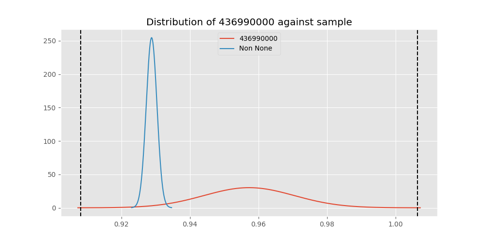 
Out of 44 tests, there were 14 rejections from 44 independent-t test.
Out of 44 tests, there were 15 rejections from 44 Man Whitney u-tests.
## Testing Results for 436990000 against 436501000 
436990000 has a success rate of 0.9572649572649573
436501000 has a success rate of 0.9854014598540146
$H_{0}$: There is not a difference between 436990000 and 436501000
$H_{A}$: There is a difference between 436990000 and 436501000
An $/alpha$ of 0.00025 was used in this test.
__independent t-testing__: With a t-statistic of -1.4787565917658951 and a p-value of 0.14005849437730303, _we failed to reject the null hypothssis_
__Man-Whitney testing__: With a u-statistic of 15578.0 and a p-value of 0.14027868267064678, _we failed to reject the null hypothssis_
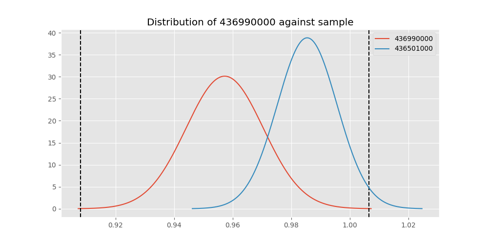 
## Testing Results for 436990000 against 437375000 
436990000 has a success rate of 0.9572649572649573
437375000 has a success rate of 0.9982014388489209
$H_{0}$: There is not a difference between 436990000 and 437375000
$H_{A}$: There is a difference between 436990000 and 437375000
An $/alpha$ of 0.00025 was used in this test.
__independent t-testing__: With a t-statistic of -3.0613709302462206 and a p-value of 0.002452282094155714, _we failed to reject the null hypothssis_
__Man-Whitney testing__: With a u-statistic of 62389.0 and a p-value of 7.475240430989694e-06, _we **reject** the null hypothssis_
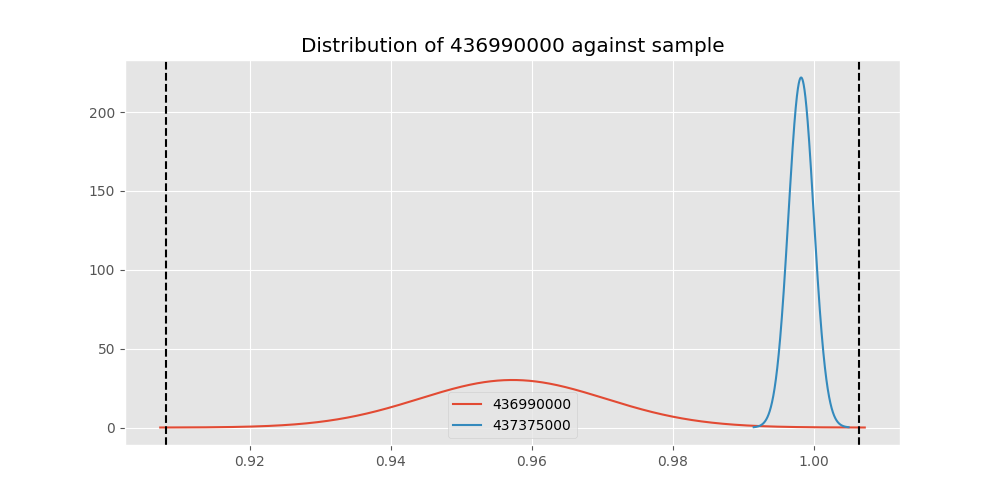 
## Testing Results for 436990000 against 436500000 
436990000 has a success rate of 0.9572649572649573
436500000 has a success rate of 0.9056603773584906
$H_{0}$: There is not a difference between 436990000 and 436500000
$H_{A}$: There is a difference between 436990000 and 436500000
An $/alpha$ of 0.00025 was used in this test.
__independent t-testing__: With a t-statistic of 2.0631959996297544 and a p-value of 0.03975366399178014, _we failed to reject the null hypothssis_
__Man-Whitney testing__: With a u-statistic of 19563.0 and a p-value of 0.04001362148839619, _we failed to reject the null hypothssis_
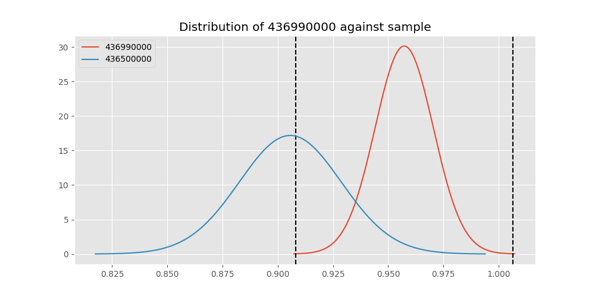 
## Testing Results for 436990000 against 145875000 
436990000 has a success rate of 0.9572649572649573
145875000 has a success rate of 0.9722222222222222
$H_{0}$: There is not a difference between 436990000 and 145875000
$H_{A}$: There is a difference between 436990000 and 145875000
An $/alpha$ of 0.00025 was used in this test.
__independent t-testing__: With a t-statistic of -0.5702049542397628 and a p-value of 0.5689598671012438, _we failed to reject the null hypothssis_
__Man-Whitney testing__: With a u-statistic of 8298.0 and a p-value of 0.5696468910509103, _we failed to reject the null hypothssis_
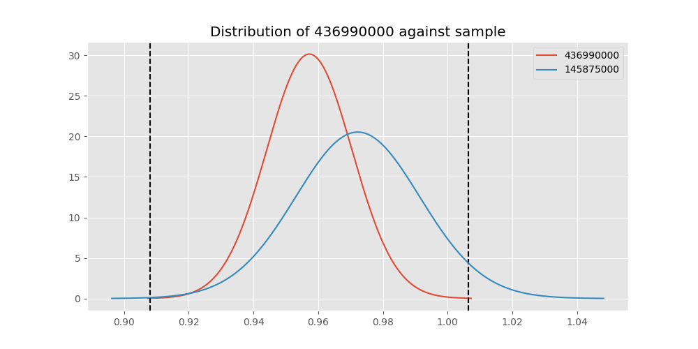 
## Testing Results for 436990000 against 437800000 
436990000 has a success rate of 0.9572649572649573
437800000 has a success rate of 0.9533678756476683
$H_{0}$: There is not a difference between 436990000 and 437800000
$H_{A}$: There is a difference between 436990000 and 437800000
An $/alpha$ of 0.00025 was used in this test.
__independent t-testing__: With a t-statistic of 0.1939245897448882 and a p-value of 0.8463275822429899, _we failed to reject the null hypothssis_
__Man-Whitney testing__: With a u-statistic of 22669.0 and a p-value of 0.8469269197243706, _we failed to reject the null hypothssis_
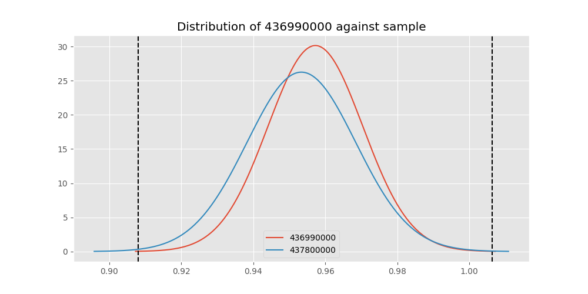 
## Testing Results for 436990000 against 145810000 
436990000 has a success rate of 0.9572649572649573
145810000 has a success rate of 0.12179487179487179
$H_{0}$: There is not a difference between 436990000 and 145810000
$H_{A}$: There is a difference between 436990000 and 145810000
An $/alpha$ of 0.00025 was used in this test.
__independent t-testing__: With a t-statistic of 31.07057896479013 and a p-value of 2.6183424571554848e-107, _we **reject** the null hypothssis_
__Man-Whitney testing__: With a u-statistic of 33501.0 and a p-value of 2.6865768361764555e-62, _we **reject** the null hypothssis_
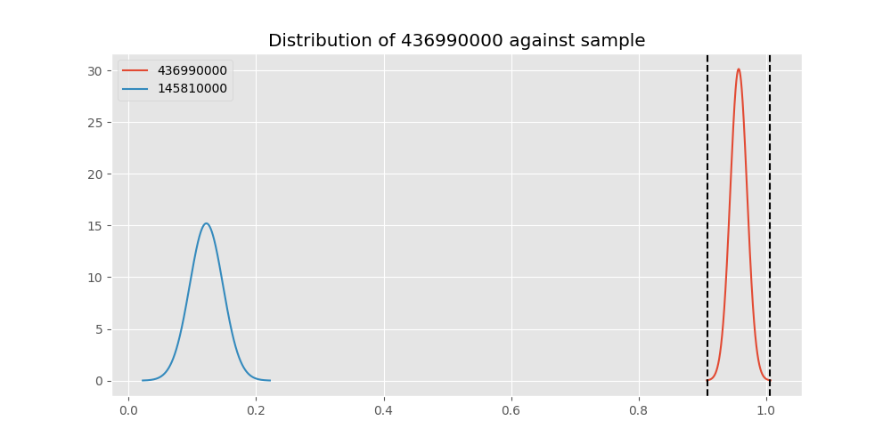 
## Testing Results for 436990000 against 437095000 
436990000 has a success rate of 0.9572649572649573
437095000 has a success rate of 0.9361702127659575
$H_{0}$: There is not a difference between 436990000 and 437095000
$H_{A}$: There is a difference between 436990000 and 437095000
An $/alpha$ of 0.00025 was used in this test.
__independent t-testing__: With a t-statistic of 0.6264687286020856 and a p-value of 0.5315197696533183, _we failed to reject the null hypothssis_
__Man-Whitney testing__: With a u-statistic of 5615.0 and a p-value of 0.5323345565602917, _we failed to reject the null hypothssis_
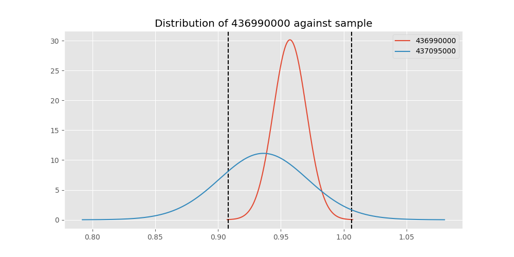 
## Testing Results for 436990000 against 437265000 
436990000 has a success rate of 0.9572649572649573
437265000 has a success rate of 0.9795454545454545
$H_{0}$: There is not a difference between 436990000 and 437265000
$H_{A}$: There is a difference between 436990000 and 437265000
An $/alpha$ of 0.00025 was used in this test.
__independent t-testing__: With a t-statistic of -1.664715372940474 and a p-value of 0.09643569332491488, _we failed to reject the null hypothssis_
__Man-Whitney testing__: With a u-statistic of 50333.0 and a p-value of 0.09655202668515676, _we failed to reject the null hypothssis_
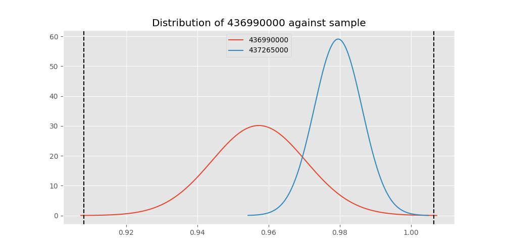 
## Testing Results for 436990000 against 437350000 
436990000 has a success rate of 0.9572649572649573
437350000 has a success rate of 0.9488372093023256
$H_{0}$: There is not a difference between 436990000 and 437350000
$H_{A}$: There is a difference between 436990000 and 437350000
An $/alpha$ of 0.00025 was used in this test.
__independent t-testing__: With a t-statistic of 0.42164531210595874 and a p-value of 0.6734866204829508, _we failed to reject the null hypothssis_
__Man-Whitney testing__: With a u-statistic of 25367.0 and a p-value of 0.6737277657665467, _we failed to reject the null hypothssis_
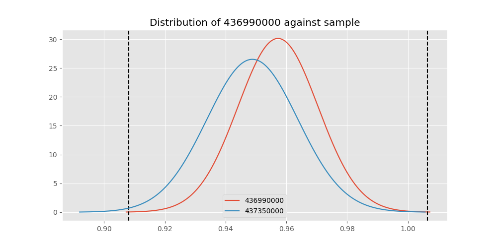 
## Testing Results for 436990000 against 437200000 
436990000 has a success rate of 0.9572649572649573
437200000 has a success rate of 0.8620689655172413
$H_{0}$: There is not a difference between 436990000 and 437200000
$H_{A}$: There is a difference between 436990000 and 437200000
An $/alpha$ of 0.00025 was used in this test.
__independent t-testing__: With a t-statistic of 3.565294457723377 and a p-value of 0.00040374422862664533, _we failed to reject the null hypothssis_
__Man-Whitney testing__: With a u-statistic of 26012.0 and a p-value of 0.0004355067106796431, _we failed to reject the null hypothssis_
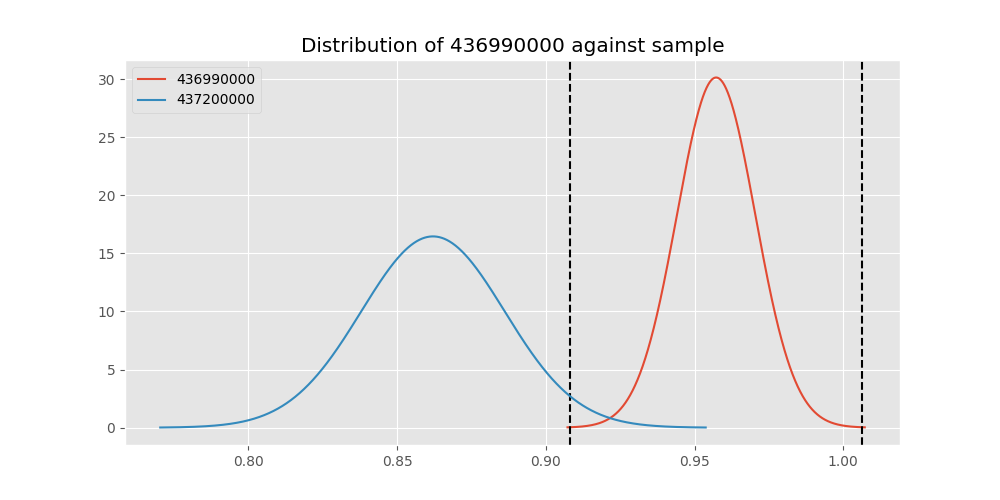 
## Testing Results for 436990000 against 435600000 
436990000 has a success rate of 0.9572649572649573
435600000 has a success rate of 0.9819341126461212
$H_{0}$: There is not a difference between 436990000 and 435600000
$H_{A}$: There is a difference between 436990000 and 435600000
An $/alpha$ of 0.00025 was used in this test.
__independent t-testing__: With a t-statistic of -2.2568048866062385 and a p-value of 0.024203678913684946, _we failed to reject the null hypothssis_
__Man-Whitney testing__: With a u-statistic of 107381.0 and a p-value of 0.024292825721962005, _we failed to reject the null hypothssis_
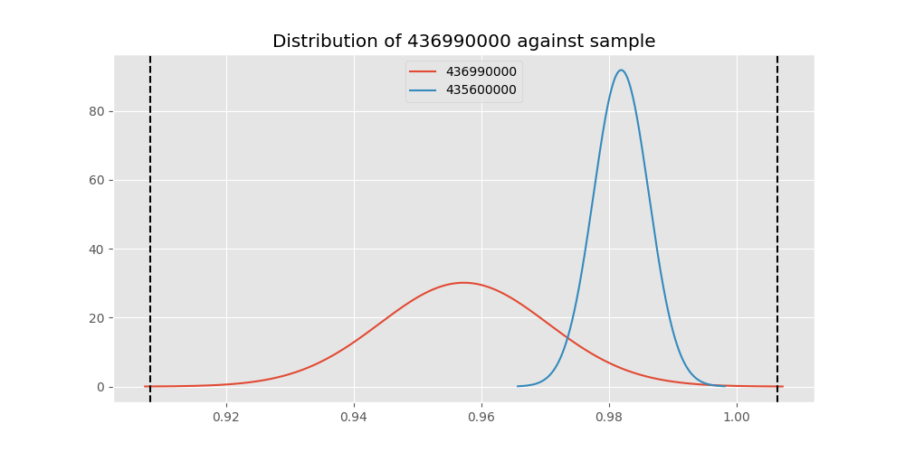 
## Testing Results for 436990000 against 450000000 
436990000 has a success rate of 0.9572649572649573
450000000 has a success rate of 0.8235294117647058
$H_{0}$: There is not a difference between 436990000 and 450000000
$H_{A}$: There is a difference between 436990000 and 450000000
An $/alpha$ of 0.00025 was used in this test.
__independent t-testing__: With a t-statistic of 4.015345156311479 and a p-value of 7.415790137104238e-05, _we **reject** the null hypothssis_
__Man-Whitney testing__: With a u-statistic of 11275.0 and a p-value of 8.793806448208296e-05, _we **reject** the null hypothssis_
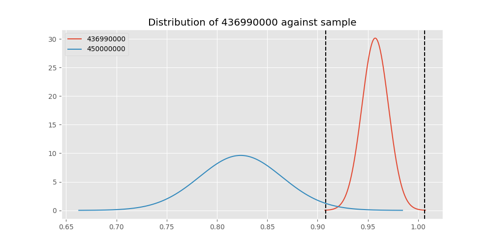 
## Testing Results for 436990000 against 145978500 
436990000 has a success rate of 0.9572649572649573
145978500 has a success rate of 0.9963636363636363
$H_{0}$: There is not a difference between 436990000 and 145978500
$H_{A}$: There is a difference between 436990000 and 145978500
An $/alpha$ of 0.00025 was used in this test.
__independent t-testing__: With a t-statistic of -2.845537387700439 and a p-value of 0.004775896321857233, _we failed to reject the null hypothssis_
__Man-Whitney testing__: With a u-statistic of 30917.0 and a p-value of 0.002534857765643439, _we failed to reject the null hypothssis_
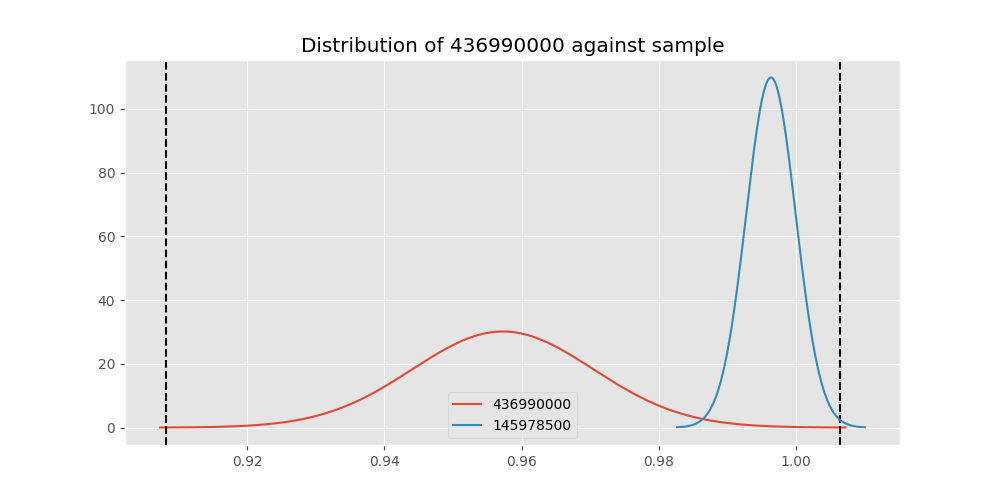 
## Testing Results for 436990000 against 437050000 
436990000 has a success rate of 0.9572649572649573
437050000 has a success rate of 0.5346534653465347
$H_{0}$: There is not a difference between 436990000 and 437050000
$H_{A}$: There is a difference between 436990000 and 437050000
An $/alpha$ of 0.00025 was used in this test.
__independent t-testing__: With a t-statistic of 10.996041446496541 and a p-value of 3.3510165817827104e-24, _we **reject** the null hypothssis_
__Man-Whitney testing__: With a u-statistic of 16811.0 and a p-value of 4.043433312129088e-21, _we **reject** the null hypothssis_
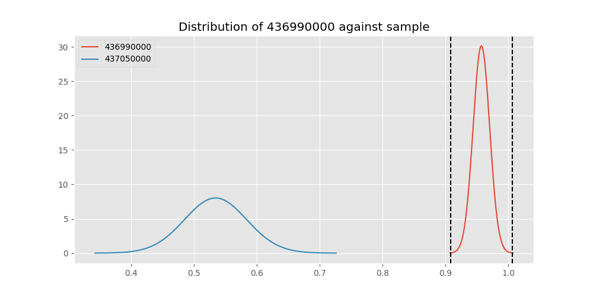 
## Testing Results for 436990000 against 435300000 
436990000 has a success rate of 0.9572649572649573
435300000 has a success rate of 0.1232876712328767
$H_{0}$: There is not a difference between 436990000 and 435300000
$H_{A}$: There is a difference between 436990000 and 435300000
An $/alpha$ of 0.00025 was used in this test.
__independent t-testing__: With a t-statistic of 30.53331542431501 and a p-value of 4.469680672004177e-104, _we **reject** the null hypothssis_
__Man-Whitney testing__: With a u-statistic of 31328.0 and a p-value of 1.3564618400566322e-60, _we **reject** the null hypothssis_
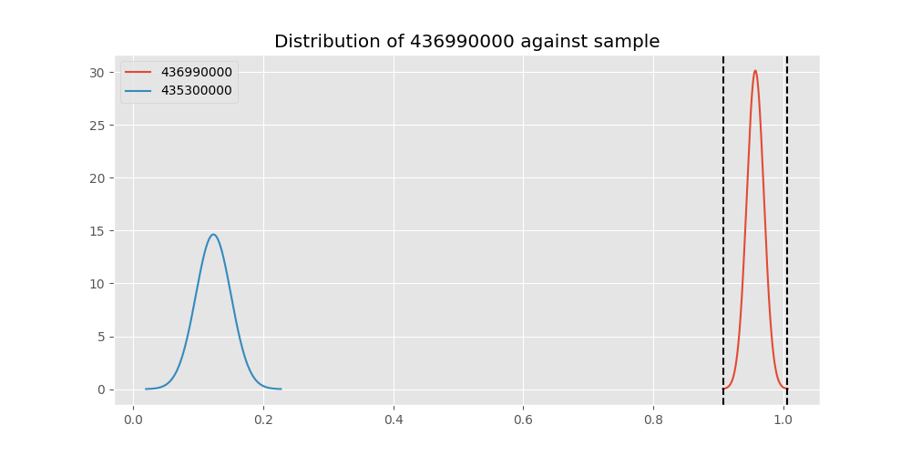 
## Testing Results for 436990000 against 437475000 
436990000 has a success rate of 0.9572649572649573
437475000 has a success rate of 0.5045045045045045
$H_{0}$: There is not a difference between 436990000 and 437475000
$H_{A}$: There is a difference between 436990000 and 437475000
An $/alpha$ of 0.00025 was used in this test.
__independent t-testing__: With a t-statistic of 13.380875202752053 and a p-value of 6.117034358181499e-37, _we **reject** the null hypothssis_
__Man-Whitney testing__: With a u-statistic of 94335.0 and a p-value of 1.2701608714755905e-33, _we **reject** the null hypothssis_
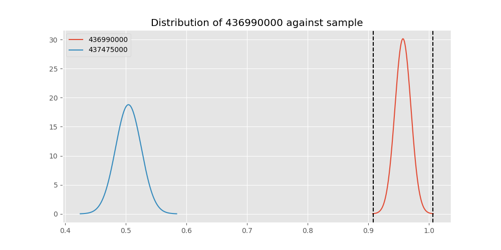 
## Testing Results for 436990000 against 435448000 
436990000 has a success rate of 0.9572649572649573
435448000 has a success rate of 0.975
$H_{0}$: There is not a difference between 436990000 and 435448000
$H_{A}$: There is a difference between 436990000 and 435448000
An $/alpha$ of 0.00025 was used in this test.
__independent t-testing__: With a t-statistic of -0.5263825552122189 and a p-value of 0.5990513866558963, _we failed to reject the null hypothssis_
__Man-Whitney testing__: With a u-statistic of 4597.0 and a p-value of 0.6003441275441136, _we failed to reject the null hypothssis_
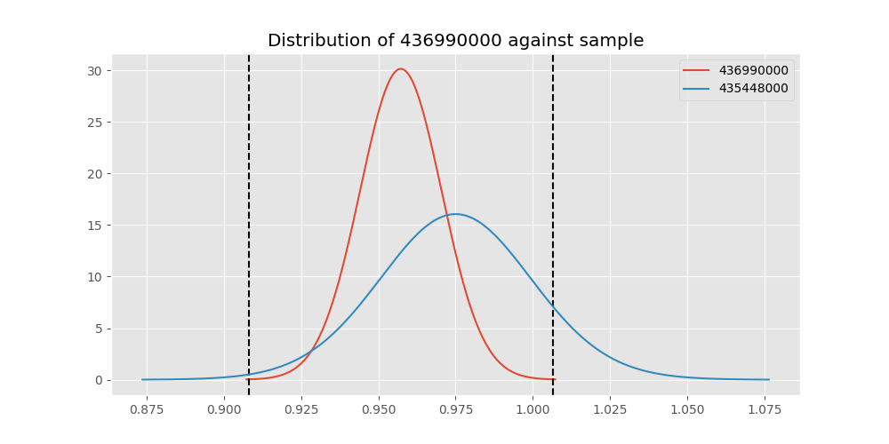 
## Testing Results for 436990000 against 437644000 
436990000 has a success rate of 0.9572649572649573
437644000 has a success rate of 0.9743589743589743
$H_{0}$: There is not a difference between 436990000 and 437644000
$H_{A}$: There is a difference between 436990000 and 437644000
An $/alpha$ of 0.00025 was used in this test.
__independent t-testing__: With a t-statistic of -0.7978539386584089 and a p-value of 0.42549778322818044, _we failed to reject the null hypothssis_
__Man-Whitney testing__: With a u-statistic of 13455.0 and a p-value of 0.42570499346528656, _we failed to reject the null hypothssis_
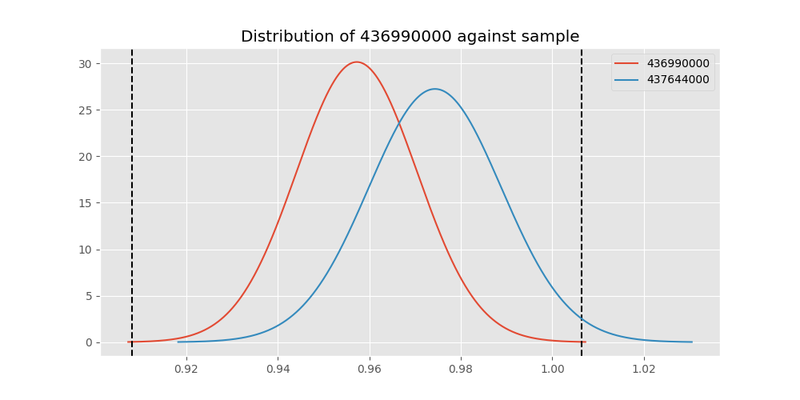 
## Testing Results for 436990000 against 145825000 
436990000 has a success rate of 0.9572649572649573
145825000 has a success rate of 0.8687448728465955
$H_{0}$: There is not a difference between 436990000 and 145825000
$H_{A}$: There is a difference between 436990000 and 145825000
An $/alpha$ of 0.00025 was used in this test.
__independent t-testing__: With a t-statistic of 3.9412270244503116 and a p-value of 8.314665629714569e-05, _we **reject** the null hypothssis_
__Man-Whitney testing__: With a u-statistic of 310496.0 and a p-value of 8.477983877152188e-05, _we **reject** the null hypothssis_
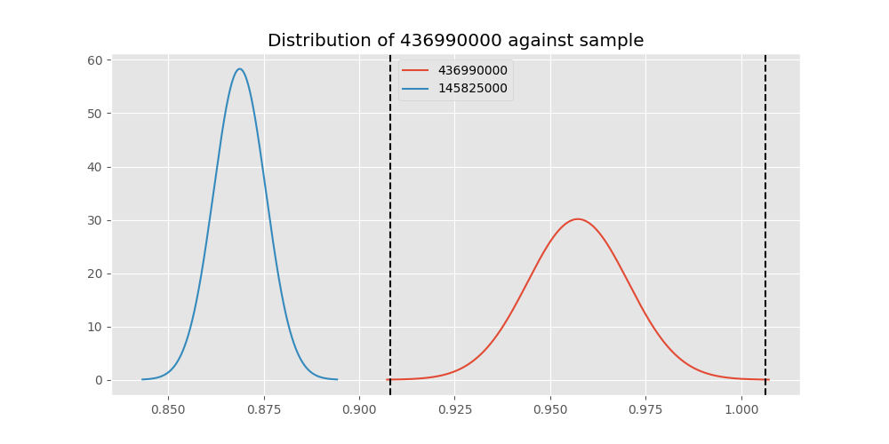 
## Testing Results for 436990000 against 437345000 
436990000 has a success rate of 0.9572649572649573
437345000 has a success rate of 0.7603092783505154
$H_{0}$: There is not a difference between 436990000 and 437345000
$H_{A}$: There is a difference between 436990000 and 437345000
An $/alpha$ of 0.00025 was used in this test.
__independent t-testing__: With a t-statistic of 6.612800930501889 and a p-value of 8.147743757316118e-11, _we **reject** the null hypothssis_
__Man-Whitney testing__: With a u-statistic of 54337.0 and a p-value of 1.594528773181981e-10, _we **reject** the null hypothssis_
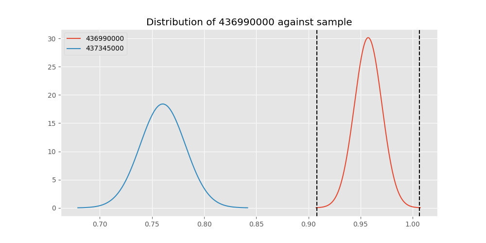 
## Testing Results for 436990000 against 435275000 
436990000 has a success rate of 0.9572649572649573
435275000 has a success rate of 0.9152542372881356
$H_{0}$: There is not a difference between 436990000 and 435275000
$H_{A}$: There is a difference between 436990000 and 435275000
An $/alpha$ of 0.00025 was used in this test.
__independent t-testing__: With a t-statistic of 1.6086390542046214 and a p-value of 0.10859689307533135, _we failed to reject the null hypothssis_
__Man-Whitney testing__: With a u-statistic of 14386.0 and a p-value of 0.10879575616021224, _we failed to reject the null hypothssis_
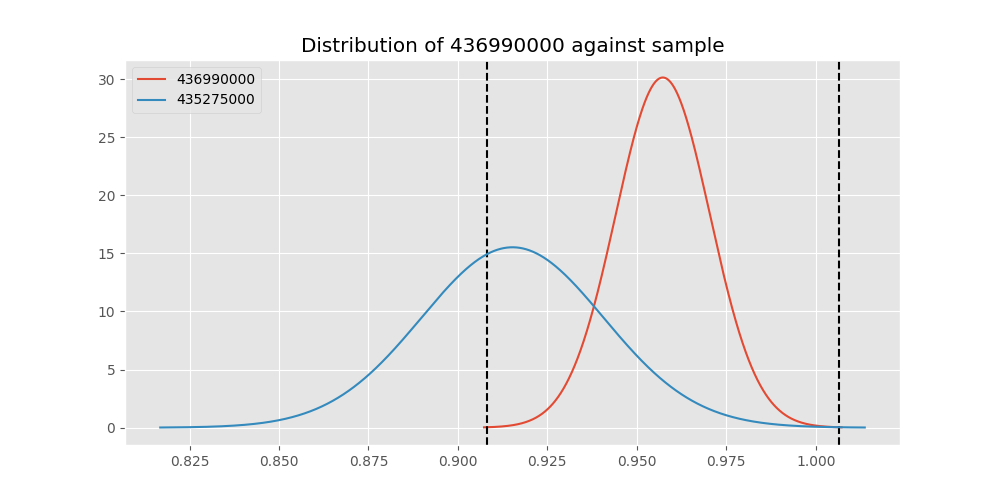 
## Testing Results for 436990000 against 437322500 
436990000 has a success rate of 0.9572649572649573
437322500 has a success rate of 0.9961685823754789
$H_{0}$: There is not a difference between 436990000 and 437322500
$H_{A}$: There is a difference between 436990000 and 437322500
An $/alpha$ of 0.00025 was used in this test.
__independent t-testing__: With a t-statistic of -2.8204822020668883 and a p-value of 0.005148310995374424, _we failed to reject the null hypothssis_
__Man-Whitney testing__: With a u-statistic of 29349.0 and a p-value of 0.0034182515564768028, _we failed to reject the null hypothssis_
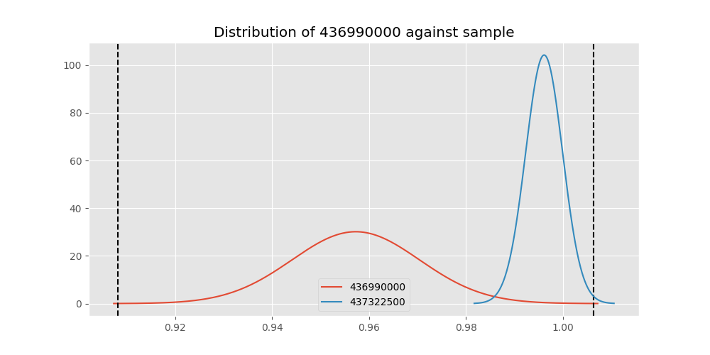 
## Testing Results for 436990000 against 437450000 
436990000 has a success rate of 0.9572649572649573
437450000 has a success rate of 0.6947791164658634
$H_{0}$: There is not a difference between 436990000 and 437450000
$H_{A}$: There is a difference between 436990000 and 437450000
An $/alpha$ of 0.00025 was used in this test.
__independent t-testing__: With a t-statistic of 8.005789646252373 and a p-value of 8.989628890187959e-15, _we **reject** the null hypothssis_
__Man-Whitney testing__: With a u-statistic of 36780.0 and a p-value of 5.1629377391395094e-14, _we **reject** the null hypothssis_
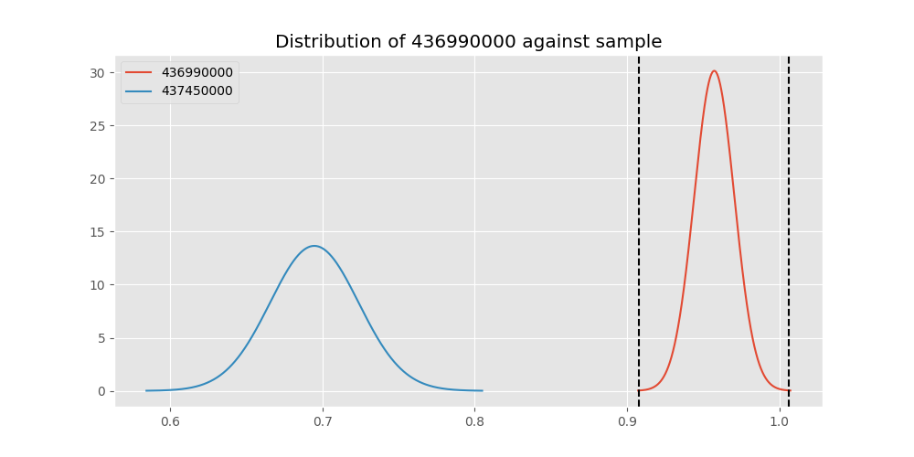 
## Testing Results for 436990000 against 436703000 
436990000 has a success rate of 0.9572649572649573
436703000 has a success rate of 0.9859154929577465
$H_{0}$: There is not a difference between 436990000 and 436703000
$H_{A}$: There is a difference between 436990000 and 436703000
An $/alpha$ of 0.00025 was used in this test.
__independent t-testing__: With a t-statistic of -1.8029111387852208 and a p-value of 0.07207855126670586, _we failed to reject the null hypothssis_
__Man-Whitney testing__: With a u-statistic of 24207.0 and a p-value of 0.07231653599937853, _we failed to reject the null hypothssis_
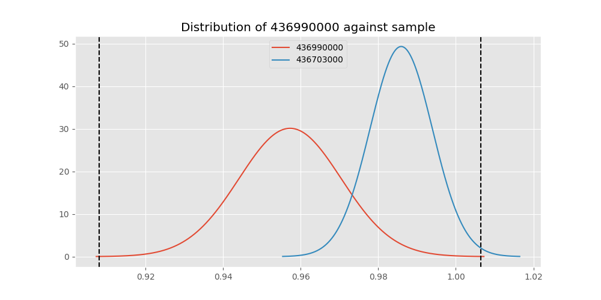 
## Testing Results for 436990000 against 400500000 
436990000 has a success rate of 0.9572649572649573
400500000 has a success rate of 0.3508771929824561
$H_{0}$: There is not a difference between 436990000 and 400500000
$H_{A}$: There is a difference between 436990000 and 400500000
An $/alpha$ of 0.00025 was used in this test.
__independent t-testing__: With a t-statistic of 14.695209417435022 and a p-value of 6.823989012202463e-37, _we **reject** the null hypothssis_
__Man-Whitney testing__: With a u-statistic of 10713.0 and a p-value of 8.457393863562127e-29, _we **reject** the null hypothssis_
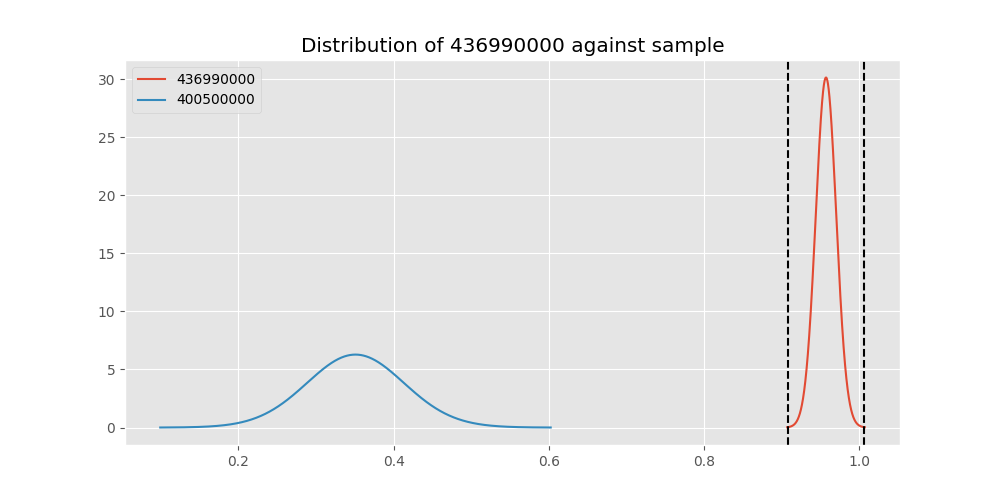 
## Testing Results for 436990000 against 437150000 
436990000 has a success rate of 0.9572649572649573
437150000 has a success rate of 0.9859550561797753
$H_{0}$: There is not a difference between 436990000 and 437150000
$H_{A}$: There is a difference between 436990000 and 437150000
An $/alpha$ of 0.00025 was used in this test.
__independent t-testing__: With a t-statistic of -2.1707375486124794 and a p-value of 0.0303504029555764, _we failed to reject the null hypothssis_
__Man-Whitney testing__: With a u-statistic of 40457.0 and a p-value of 0.030539341647897334, _we failed to reject the null hypothssis_
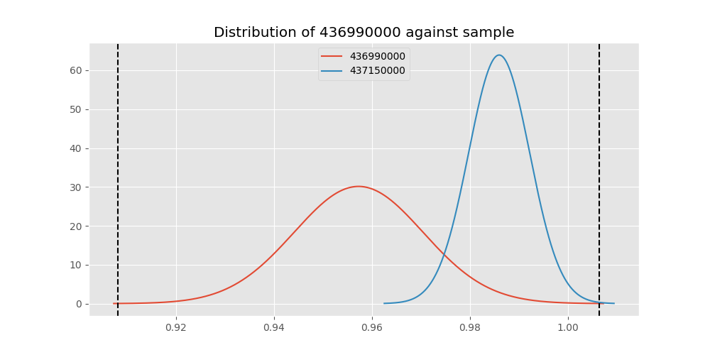 
## Testing Results for 436990000 against 435635000 
436990000 has a success rate of 0.9572649572649573
435635000 has a success rate of 0.9849624060150376
$H_{0}$: There is not a difference between 436990000 and 435635000
$H_{A}$: There is a difference between 436990000 and 435635000
An $/alpha$ of 0.00025 was used in this test.
__independent t-testing__: With a t-statistic of -1.4342853937690612 and a p-value of 0.15234700765302092, _we failed to reject the null hypothssis_
__Man-Whitney testing__: With a u-statistic of 15130.0 and a p-value of 0.15255723885287809, _we failed to reject the null hypothssis_
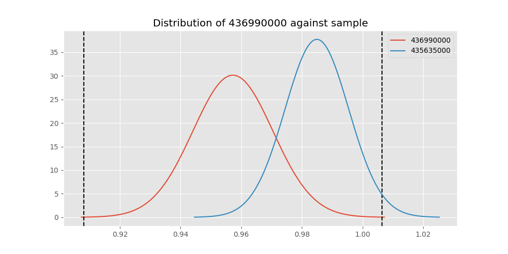 
## Testing Results for 436990000 against 437384000 
436990000 has a success rate of 0.9572649572649573
437384000 has a success rate of 0.968421052631579
$H_{0}$: There is not a difference between 436990000 and 437384000
$H_{A}$: There is a difference between 436990000 and 437384000
An $/alpha$ of 0.00025 was used in this test.
__independent t-testing__: With a t-statistic of -0.5983389040622181 and a p-value of 0.5499348201821724, _we failed to reject the null hypothssis_
__Man-Whitney testing__: With a u-statistic of 21982.0 and a p-value of 0.5501160554292341, _we failed to reject the null hypothssis_
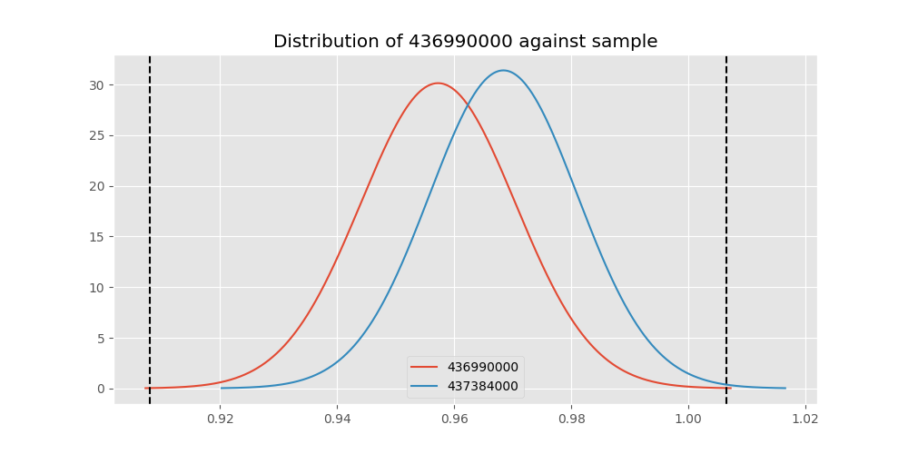 
## Testing Results for 436990000 against 437405000 
436990000 has a success rate of 0.9572649572649573
437405000 has a success rate of 0.9953917050691244
$H_{0}$: There is not a difference between 436990000 and 437405000
$H_{A}$: There is a difference between 436990000 and 437405000
An $/alpha$ of 0.00025 was used in this test.
__independent t-testing__: With a t-statistic of -2.7177260647055954 and a p-value of 0.006971216402284613, _we failed to reject the null hypothssis_
__Man-Whitney testing__: With a u-statistic of 24421.0 and a p-value of 0.008835760996189674, _we failed to reject the null hypothssis_
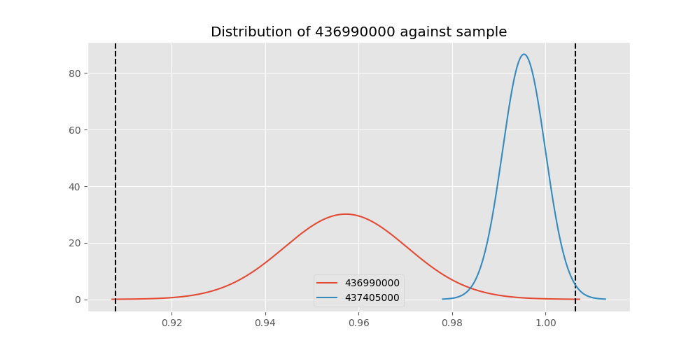 
## Testing Results for 436990000 against 435612500 
436990000 has a success rate of 0.9572649572649573
435612500 has a success rate of 0.9770114942528736
$H_{0}$: There is not a difference between 436990000 and 435612500
$H_{A}$: There is a difference between 436990000 and 435612500
An $/alpha$ of 0.00025 was used in this test.
__independent t-testing__: With a t-statistic of -0.8272739427301712 and a p-value of 0.40870021436304116, _we failed to reject the null hypothssis_
__Man-Whitney testing__: With a u-statistic of 9978.0 and a p-value of 0.40901781007522275, _we failed to reject the null hypothssis_
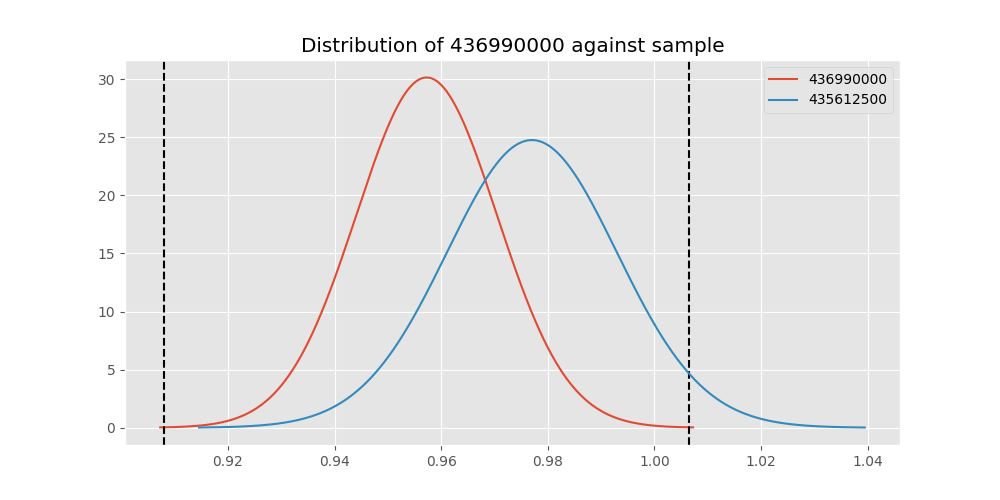 
## Testing Results for 436990000 against 435975000 
436990000 has a success rate of 0.9572649572649573
435975000 has a success rate of 0.92
$H_{0}$: There is not a difference between 436990000 and 435975000
$H_{A}$: There is a difference between 436990000 and 435975000
An $/alpha$ of 0.00025 was used in this test.
__independent t-testing__: With a t-statistic of 1.103335483212933 and a p-value of 0.27082213912661124, _we failed to reject the null hypothssis_
__Man-Whitney testing__: With a u-statistic of 6068.0 and a p-value of 0.271165534265848, _we failed to reject the null hypothssis_
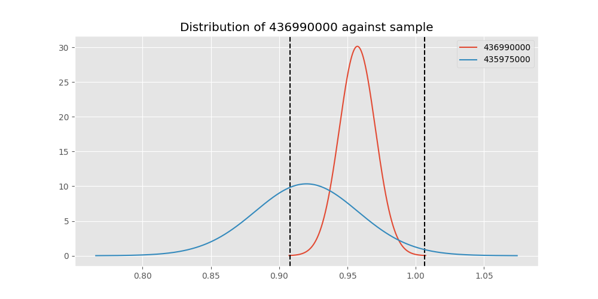 
## Testing Results for 436990000 against 437425000 
436990000 has a success rate of 0.9572649572649573
437425000 has a success rate of 0.6987654320987654
$H_{0}$: There is not a difference between 436990000 and 437425000
$H_{A}$: There is a difference between 436990000 and 437425000
An $/alpha$ of 0.00025 was used in this test.
__independent t-testing__: With a t-statistic of 8.15943049882105 and a p-value of 1.7997386035876106e-15, _we **reject** the null hypothssis_
__Man-Whitney testing__: With a u-statistic of 59634.0 and a p-value of 7.87544341758319e-15, _we **reject** the null hypothssis_
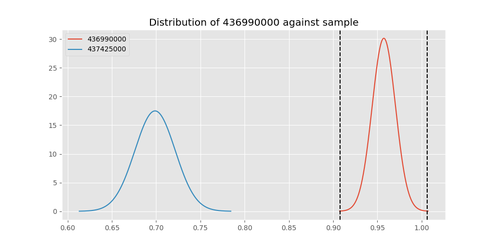 
## Testing Results for 436990000 against 437275000 
436990000 has a success rate of 0.9572649572649573
437275000 has a success rate of 0.3643724696356275
$H_{0}$: There is not a difference between 436990000 and 437275000
$H_{A}$: There is a difference between 436990000 and 437275000
An $/alpha$ of 0.00025 was used in this test.
__independent t-testing__: With a t-statistic of 17.406329555486778 and a p-value of 6.109106110224684e-53, _we **reject** the null hypothssis_
__Man-Whitney testing__: With a u-statistic of 46033.0 and a p-value of 2.4145048733285718e-42, _we **reject** the null hypothssis_
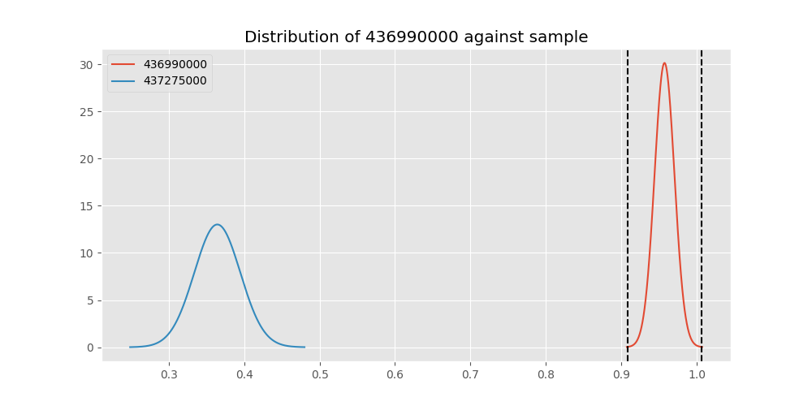 
## Testing Results for 436990000 against 145840000 
436990000 has a success rate of 0.9572649572649573
145840000 has a success rate of 0.9649122807017544
$H_{0}$: There is not a difference between 436990000 and 145840000
$H_{A}$: There is a difference between 436990000 and 145840000
An $/alpha$ of 0.00025 was used in this test.
__independent t-testing__: With a t-statistic of -0.25951448864608395 and a p-value of 0.7954230726468364, _we failed to reject the null hypothssis_
__Man-Whitney testing__: With a u-statistic of 6618.0 and a p-value of 0.7968820120136357, _we failed to reject the null hypothssis_
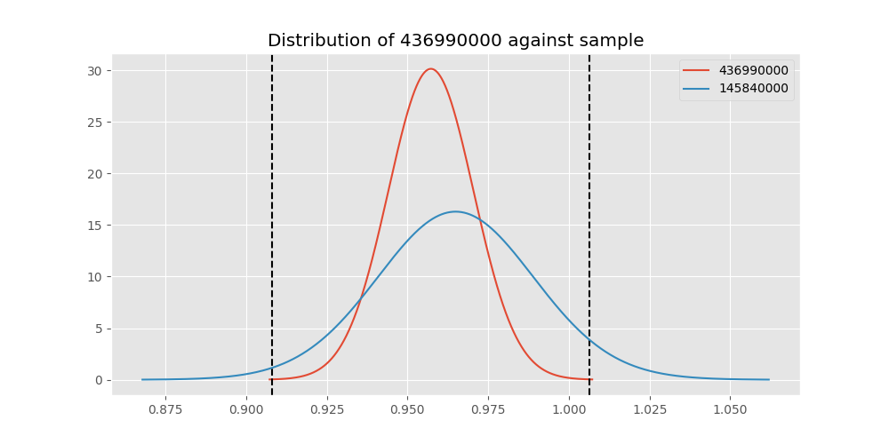 
## Testing Results for 436990000 against 435525000 
436990000 has a success rate of 0.9572649572649573
435525000 has a success rate of 0.6923076923076923
$H_{0}$: There is not a difference between 436990000 and 435525000
$H_{A}$: There is a difference between 436990000 and 435525000
An $/alpha$ of 0.00025 was used in this test.
__independent t-testing__: With a t-statistic of 7.639786569030721 and a p-value of 1.8339491819429924e-13, _we **reject** the null hypothssis_
__Man-Whitney testing__: With a u-statistic of 21164.0 and a p-value of 1.115986128548094e-12, _we **reject** the null hypothssis_
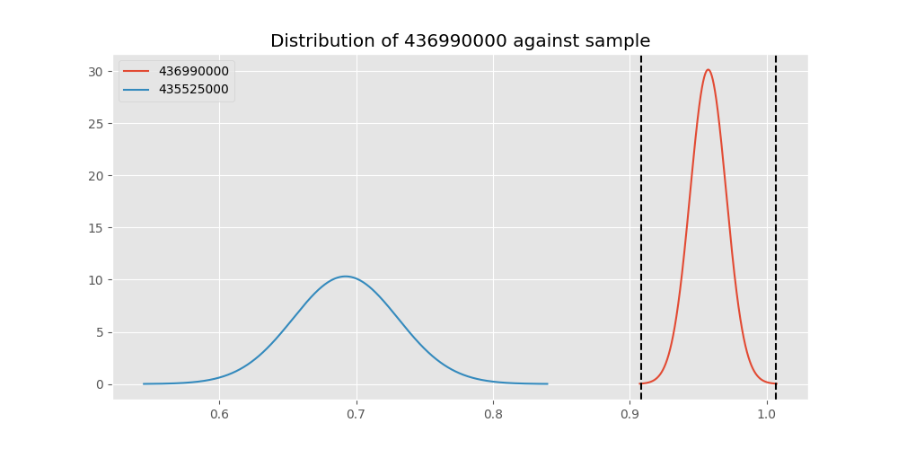 
## Testing Results for 436990000 against 436250000 
436990000 has a success rate of 0.9572649572649573
436250000 has a success rate of 0.17857142857142858
$H_{0}$: There is not a difference between 436990000 and 436250000
$H_{A}$: There is a difference between 436990000 and 436250000
An $/alpha$ of 0.00025 was used in this test.
__independent t-testing__: With a t-statistic of 21.06275568131043 and a p-value of 2.9733617969548054e-60, _we **reject** the null hypothssis_
__Man-Whitney testing__: With a u-statistic of 11654.0 and a p-value of 5.4012868499897655e-40, _we **reject** the null hypothssis_
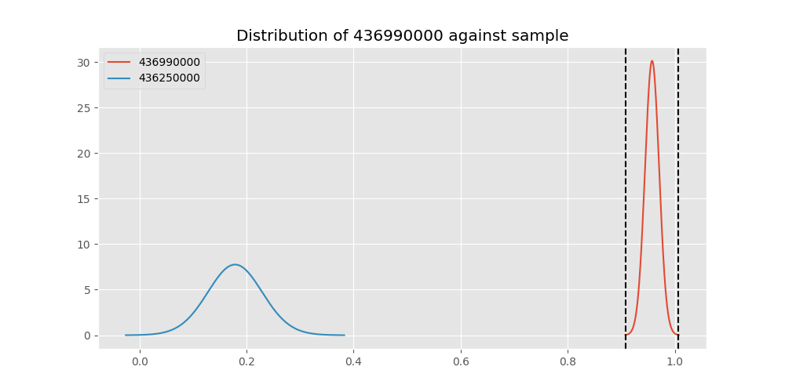 
## Testing Results for 436990000 against 435950000 
436990000 has a success rate of 0.9572649572649573
435950000 has a success rate of 0.9850187265917603
$H_{0}$: There is not a difference between 436990000 and 435950000
$H_{A}$: There is a difference between 436990000 and 435950000
An $/alpha$ of 0.00025 was used in this test.
__independent t-testing__: With a t-statistic of -2.3453181152749663 and a p-value of 0.019265129569416763, _we failed to reject the null hypothssis_
__Man-Whitney testing__: With a u-statistic of 60744.0 and a p-value of 0.019397981024993464, _we failed to reject the null hypothssis_
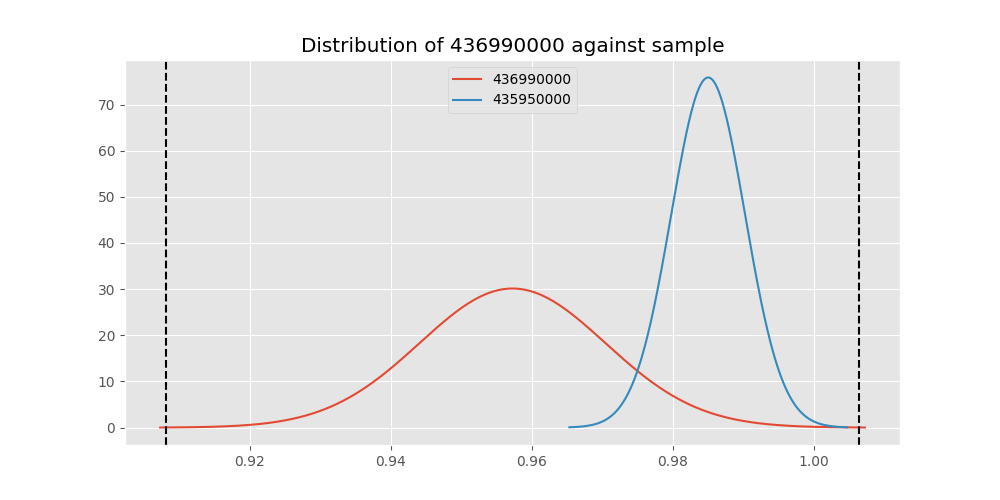 
## Testing Results for 436990000 against 435800000 
436990000 has a success rate of 0.9572649572649573
435800000 has a success rate of 0.5390070921985816
$H_{0}$: There is not a difference between 436990000 and 435800000
$H_{A}$: There is a difference between 436990000 and 435800000
An $/alpha$ of 0.00025 was used in this test.
__independent t-testing__: With a t-statistic of 11.344711840805708 and a p-value of 7.914086034504054e-26, _we **reject** the null hypothssis_
__Man-Whitney testing__: With a u-statistic of 23397.0 and a p-value of 1.1908589258428207e-22, _we **reject** the null hypothssis_
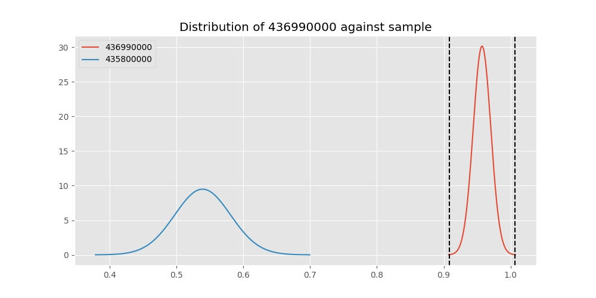 
## Testing Results for 436990000 against 437485000 
436990000 has a success rate of 0.9572649572649573
437485000 has a success rate of 0.9375
$H_{0}$: There is not a difference between 436990000 and 437485000
$H_{A}$: There is a difference between 436990000 and 437485000
An $/alpha$ of 0.00025 was used in this test.
__independent t-testing__: With a t-statistic of 0.5035954288257259 and a p-value of 0.6149656513159231, _we failed to reject the null hypothssis_
__Man-Whitney testing__: With a u-statistic of 3818.0 and a p-value of 0.6164424434755883, _we failed to reject the null hypothssis_
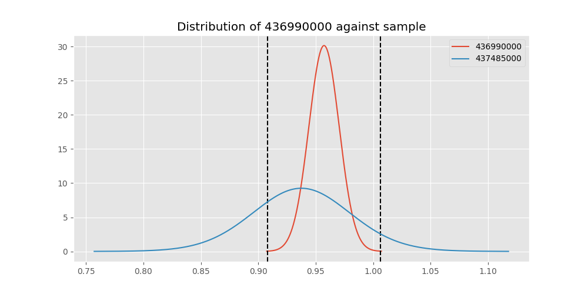 
## Testing Results for 436990000 against 136770000 
436990000 has a success rate of 0.9572649572649573
136770000 has a success rate of 0.9945945945945946
$H_{0}$: There is not a difference between 436990000 and 136770000
$H_{A}$: There is a difference between 436990000 and 136770000
An $/alpha$ of 0.00025 was used in this test.
__independent t-testing__: With a t-statistic of -2.608535599503894 and a p-value of 0.009539049587088259, _we failed to reject the null hypothssis_
__Man-Whitney testing__: With a u-statistic of 20837.0 and a p-value of 0.01784272827348384, _we failed to reject the null hypothssis_
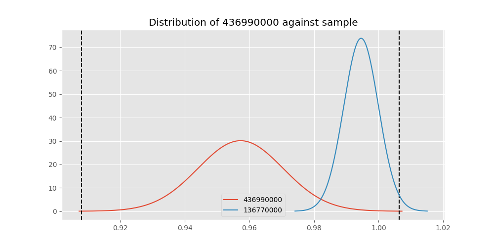 
## Testing Results for 436990000 against 437250000 
436990000 has a success rate of 0.9572649572649573
437250000 has a success rate of 0.9937106918238994
$H_{0}$: There is not a difference between 436990000 and 437250000
$H_{A}$: There is a difference between 436990000 and 437250000
An $/alpha$ of 0.00025 was used in this test.
__independent t-testing__: With a t-statistic of -2.607998838213972 and a p-value of 0.009586294538381281, _we failed to reject the null hypothssis_
__Man-Whitney testing__: With a u-statistic of 35850.0 and a p-value of 0.0037556701622446687, _we failed to reject the null hypothssis_
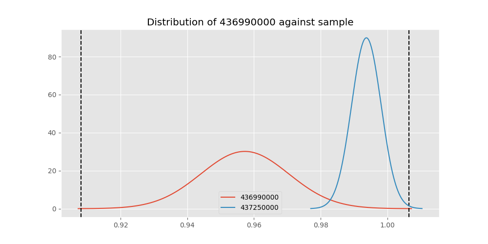 
## Testing Results for 436990000 against 437356000 
436990000 has a success rate of 0.9572649572649573
437356000 has a success rate of 0.9328358208955224
$H_{0}$: There is not a difference between 436990000 and 437356000
$H_{A}$: There is a difference between 436990000 and 437356000
An $/alpha$ of 0.00025 was used in this test.
__independent t-testing__: With a t-statistic of 1.0177312910091012 and a p-value of 0.3094779458744012, _we failed to reject the null hypothssis_
__Man-Whitney testing__: With a u-statistic of 16061.0 and a p-value of 0.3094612604905481, _we failed to reject the null hypothssis_
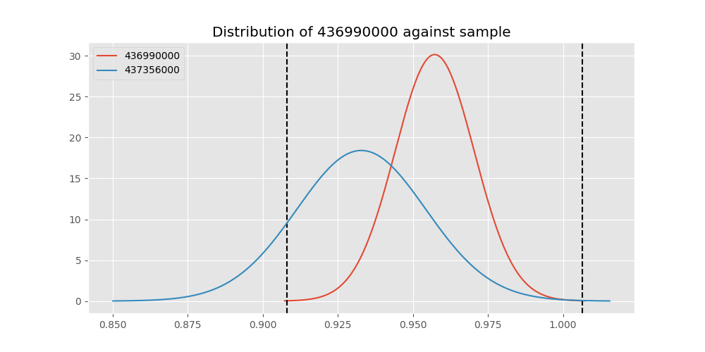 
## Testing Results for 436990000 against 437676000 
436990000 has a success rate of 0.9572649572649573
437676000 has a success rate of 0.9813432835820896
$H_{0}$: There is not a difference between 436990000 and 437676000
$H_{A}$: There is a difference between 436990000 and 437676000
An $/alpha$ of 0.00025 was used in this test.
__independent t-testing__: With a t-statistic of -1.5814664837332415 and a p-value of 0.11440374867686007, _we failed to reject the null hypothssis_
__Man-Whitney testing__: With a u-statistic of 30601.0 and a p-value of 0.11455253156538142, _we failed to reject the null hypothssis_
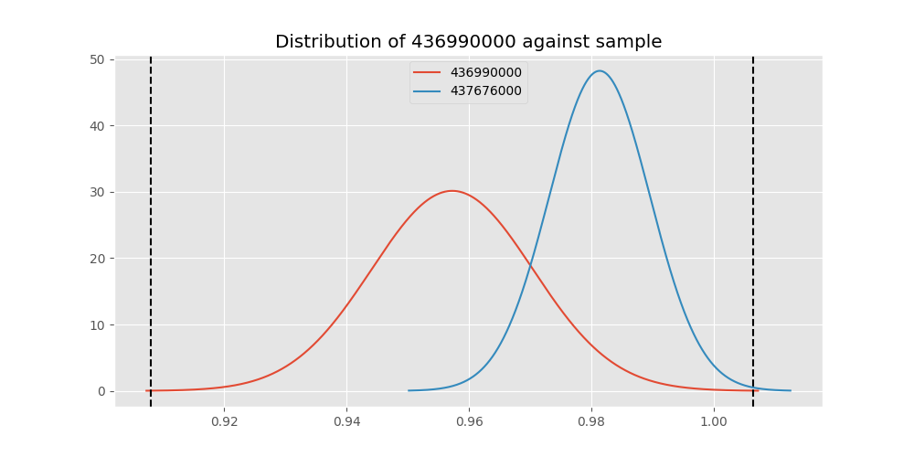 
## Testing Results for 436990000 against 145826800 
436990000 has a success rate of 0.9572649572649573
145826800 has a success rate of 0.966183574879227
$H_{0}$: There is not a difference between 436990000 and 145826800
$H_{A}$: There is a difference between 436990000 and 145826800
An $/alpha$ of 0.00025 was used in this test.
__independent t-testing__: With a t-statistic of -0.48454221220683624 and a p-value of 0.6282427735796527, _we failed to reject the null hypothssis_
__Man-Whitney testing__: With a u-statistic of 24003.0 and a p-value of 0.6284983585008501, _we failed to reject the null hypothssis_
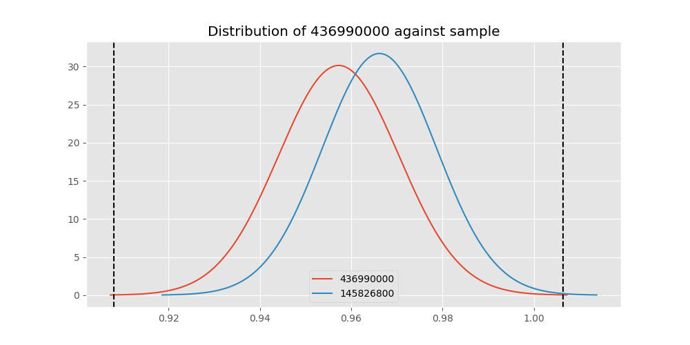 
