# Testing Results For 437050000 
$H_{0}$: There is not a difference in collection success against 437050000 
$H_{A}$: There is a difference in collection success against 437050000
An $\alpha$ of 0.00025 was used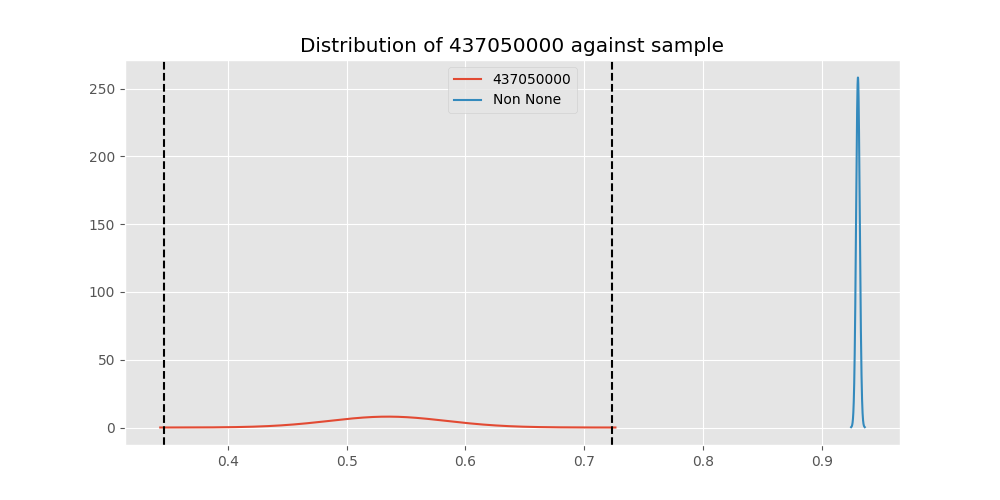 
Out of 44 tests, there were 37 rejections from 44 independent-t test.
Out of 44 tests, there were 37 rejections from 44 Man Whitney u-tests.
## Testing Results for 437050000 against 436501000 
437050000 has a success rate of 0.5346534653465347
436501000 has a success rate of 0.9854014598540146
$H_{0}$: There is not a difference between 437050000 and 436501000
$H_{A}$: There is a difference between 437050000 and 436501000
An $/alpha$ of 0.00025 was used in this test.
__independent t-testing__: With a t-statistic of -8.8505113079916 and a p-value of 1.8259564653577115e-14, _we **reject** the null hypothssis_
__Man-Whitney testing__: With a u-statistic of 3800.0 and a p-value of 2.2389321006505938e-17, _we **reject** the null hypothssis_
 
## Testing Results for 437050000 against 437375000 
437050000 has a success rate of 0.5346534653465347
437375000 has a success rate of 0.9982014388489209
$H_{0}$: There is not a difference between 437050000 and 437375000
$H_{A}$: There is a difference between 437050000 and 437375000
An $/alpha$ of 0.00025 was used in this test.
__independent t-testing__: With a t-statistic of -9.287270733157262 and a p-value of 3.5382238190064698e-15, _we **reject** the null hypothssis_
__Man-Whitney testing__: With a u-statistic of 15062.5 and a p-value of 7.718064758088659e-61, _we **reject** the null hypothssis_
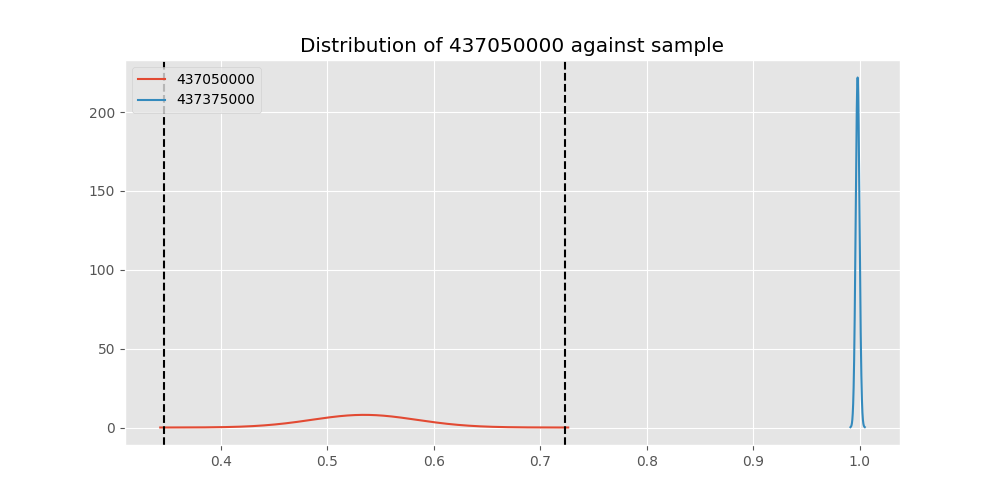 
## Testing Results for 437050000 against 436500000 
437050000 has a success rate of 0.5346534653465347
436500000 has a success rate of 0.9056603773584906
$H_{0}$: There is not a difference between 437050000 and 436500000
$H_{A}$: There is a difference between 437050000 and 436500000
An $/alpha$ of 0.00025 was used in this test.
__independent t-testing__: With a t-statistic of -7.527184229756347 and a p-value of 8.676520451636138e-13, _we **reject** the null hypothssis_
__Man-Whitney testing__: With a u-statistic of 5050.5 and a p-value of 8.614168107521573e-12, _we **reject** the null hypothssis_
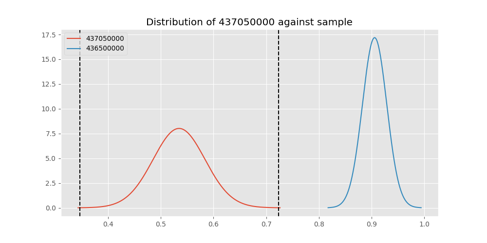 
## Testing Results for 437050000 against 436990000 
437050000 has a success rate of 0.5346534653465347
436990000 has a success rate of 0.9572649572649573
$H_{0}$: There is not a difference between 437050000 and 436990000
$H_{A}$: There is a difference between 437050000 and 436990000
An $/alpha$ of 0.00025 was used in this test.
__independent t-testing__: With a t-statistic of -8.188599233603032 and a p-value of 4.198667748932356e-13, _we **reject** the null hypothssis_
__Man-Whitney testing__: With a u-statistic of 6823.0 and a p-value of 4.043433312129088e-21, _we **reject** the null hypothssis_
 
## Testing Results for 437050000 against 145875000 
437050000 has a success rate of 0.5346534653465347
145875000 has a success rate of 0.9722222222222222
$H_{0}$: There is not a difference between 437050000 and 145875000
$H_{A}$: There is a difference between 437050000 and 145875000
An $/alpha$ of 0.00025 was used in this test.
__independent t-testing__: With a t-statistic of -8.170139576350293 and a p-value of 2.493765437697232e-13, _we **reject** the null hypothssis_
__Man-Whitney testing__: With a u-statistic of 2045.0 and a p-value of 3.470993501781522e-10, _we **reject** the null hypothssis_
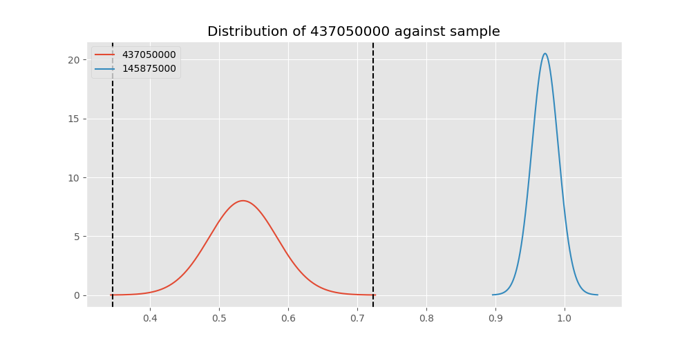 
## Testing Results for 437050000 against 437800000 
437050000 has a success rate of 0.5346534653465347
437800000 has a success rate of 0.9533678756476683
$H_{0}$: There is not a difference between 437050000 and 437800000
$H_{A}$: There is a difference between 437050000 and 437800000
An $/alpha$ of 0.00025 was used in this test.
__independent t-testing__: With a t-statistic of -8.0291594992104 and a p-value of 7.912338834401296e-13, _we **reject** the null hypothssis_
__Man-Whitney testing__: With a u-statistic of 5665.5 and a p-value of 4.447010313932033e-18, _we **reject** the null hypothssis_
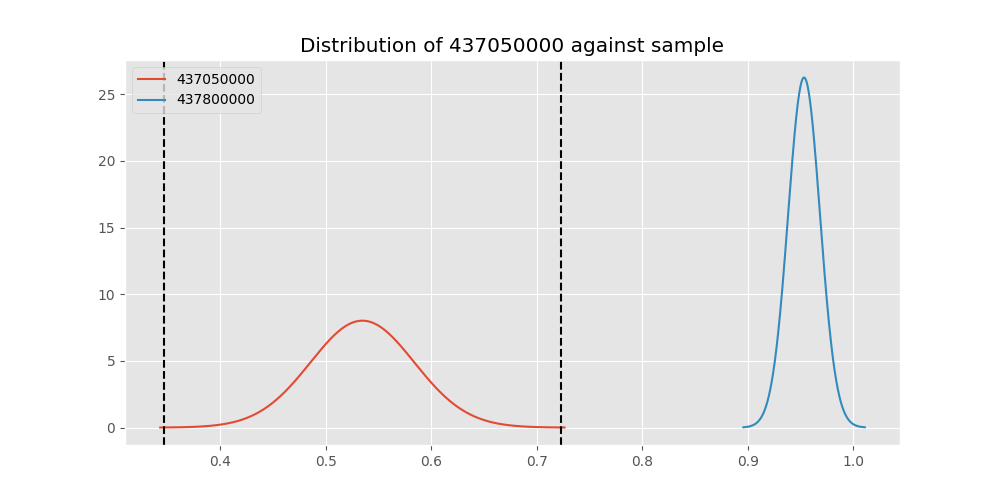 
## Testing Results for 437050000 against 145810000 
437050000 has a success rate of 0.5346534653465347
145810000 has a success rate of 0.12179487179487179
$H_{0}$: There is not a difference between 437050000 and 145810000
$H_{A}$: There is a difference between 437050000 and 145810000
An $/alpha$ of 0.00025 was used in this test.
__independent t-testing__: With a t-statistic of 7.982957488237555 and a p-value of 4.8880352154190054e-14, _we **reject** the null hypothssis_
__Man-Whitney testing__: With a u-statistic of 11130.5 and a p-value of 8.470856861444484e-13, _we **reject** the null hypothssis_
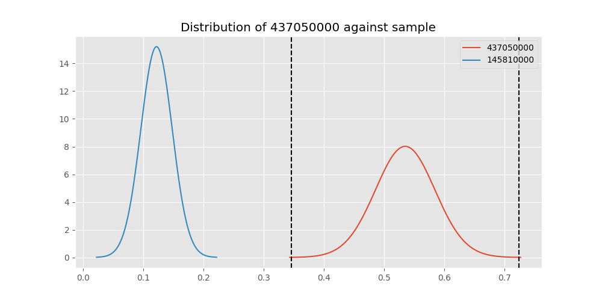 
## Testing Results for 437050000 against 437095000 
437050000 has a success rate of 0.5346534653465347
437095000 has a success rate of 0.9361702127659575
$H_{0}$: There is not a difference between 437050000 and 437095000
$H_{A}$: There is a difference between 437050000 and 437095000
An $/alpha$ of 0.00025 was used in this test.
__independent t-testing__: With a t-statistic of -6.524610342174854 and a p-value of 1.0579245074791586e-09, _we **reject** the null hypothssis_
__Man-Whitney testing__: With a u-statistic of 1420.5 and a p-value of 1.6760384938810315e-06, _we **reject** the null hypothssis_
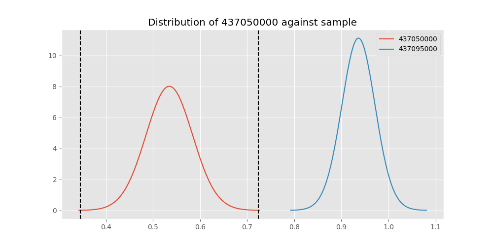 
## Testing Results for 437050000 against 437265000 
437050000 has a success rate of 0.5346534653465347
437265000 has a success rate of 0.9795454545454545
$H_{0}$: There is not a difference between 437050000 and 437265000
$H_{A}$: There is a difference between 437050000 and 437265000
An $/alpha$ of 0.00025 was used in this test.
__independent t-testing__: With a t-statistic of -8.838586840464577 and a p-value of 2.6726338645123102e-14, _we **reject** the null hypothssis_
__Man-Whitney testing__: With a u-statistic of 12334.5 and a p-value of 6.406973829013827e-40, _we **reject** the null hypothssis_
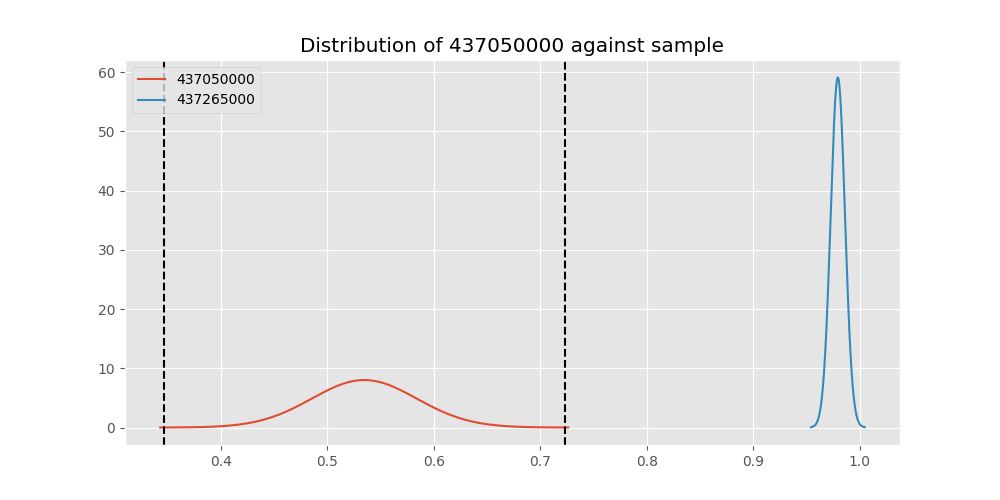 
## Testing Results for 437050000 against 437350000 
437050000 has a success rate of 0.5346534653465347
437350000 has a success rate of 0.9488372093023256
$H_{0}$: There is not a difference between 437050000 and 437350000
$H_{A}$: There is a difference between 437050000 and 437350000
An $/alpha$ of 0.00025 was used in this test.
__independent t-testing__: With a t-statistic of -7.949157405079316 and a p-value of 1.2236859700595015e-12, _we **reject** the null hypothssis_
__Man-Whitney testing__: With a u-statistic of 6360.5 and a p-value of 8.418182038231784e-19, _we **reject** the null hypothssis_
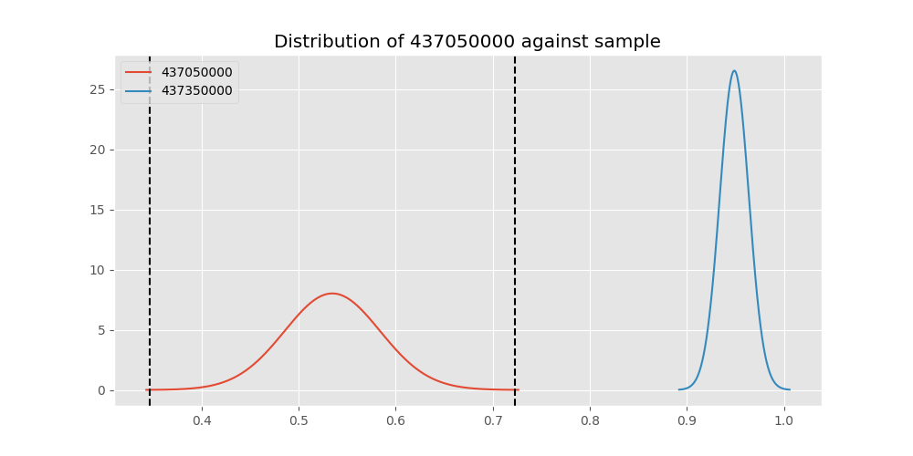 
## Testing Results for 437050000 against 437200000 
437050000 has a success rate of 0.5346534653465347
437200000 has a success rate of 0.8620689655172413
$H_{0}$: There is not a difference between 437050000 and 437200000
$H_{A}$: There is a difference between 437050000 and 437200000
An $/alpha$ of 0.00025 was used in this test.
__independent t-testing__: With a t-statistic of -6.65730005397491 and a p-value of 1.314543997085822e-10, _we **reject** the null hypothssis_
__Man-Whitney testing__: With a u-statistic of 6895.0 and a p-value of 4.781849113231541e-10, _we **reject** the null hypothssis_
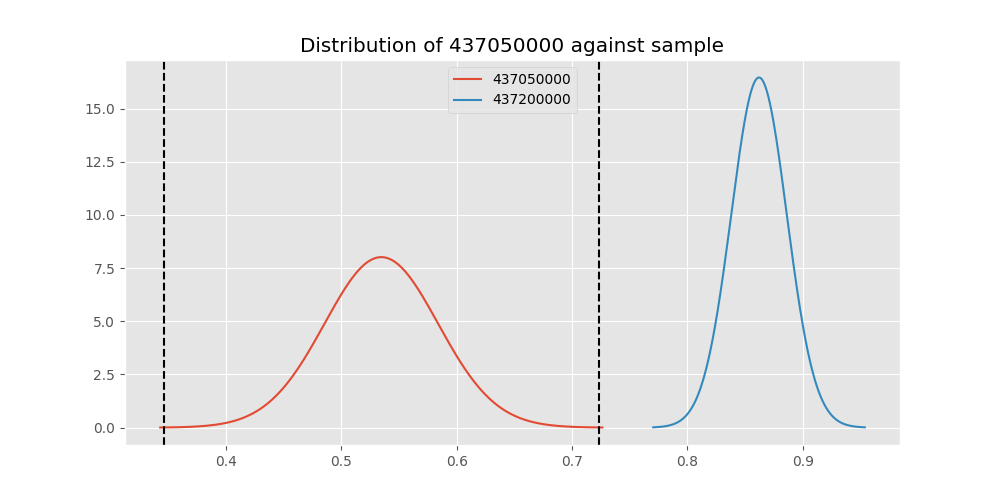 
## Testing Results for 437050000 against 435600000 
437050000 has a success rate of 0.5346534653465347
435600000 has a success rate of 0.9819341126461212
$H_{0}$: There is not a difference between 437050000 and 435600000
$H_{A}$: There is a difference between 437050000 and 435600000
An $/alpha$ of 0.00025 was used in this test.
__independent t-testing__: With a t-statistic of -8.93335907558673 and a p-value of 1.922272257069466e-14, _we **reject** the null hypothssis_
__Man-Whitney testing__: With a u-statistic of 26265.5 and a p-value of 9.668018493627955e-71, _we **reject** the null hypothssis_
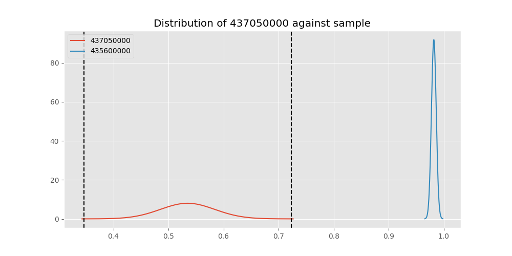 
## Testing Results for 437050000 against 450000000 
437050000 has a success rate of 0.5346534653465347
450000000 has a success rate of 0.8235294117647058
$H_{0}$: There is not a difference between 437050000 and 450000000
$H_{A}$: There is a difference between 437050000 and 450000000
An $/alpha$ of 0.00025 was used in this test.
__independent t-testing__: With a t-statistic of -4.34835103362469 and a p-value of 2.267830840593728e-05, _we **reject** the null hypothssis_
__Man-Whitney testing__: With a u-statistic of 3052.5 and a p-value of 3.3195573728133405e-05, _we **reject** the null hypothssis_
 
## Testing Results for 437050000 against 145978500 
437050000 has a success rate of 0.5346534653465347
145978500 has a success rate of 0.9963636363636363
$H_{0}$: There is not a difference between 437050000 and 145978500
$H_{A}$: There is a difference between 437050000 and 145978500
An $/alpha$ of 0.00025 was used in this test.
__independent t-testing__: With a t-statistic of -9.231961223598109 and a p-value of 4.387008394091593e-15, _we **reject** the null hypothssis_
__Man-Whitney testing__: With a u-statistic of 7475.5 and a p-value of 1.6030965458046248e-32, _we **reject** the null hypothssis_
 
## Testing Results for 437050000 against 435300000 
437050000 has a success rate of 0.5346534653465347
435300000 has a success rate of 0.1232876712328767
$H_{0}$: There is not a difference between 437050000 and 435300000
$H_{A}$: There is a difference between 437050000 and 435300000
An $/alpha$ of 0.00025 was used in this test.
__independent t-testing__: With a t-statistic of 7.7783518850290445 and a p-value of 2.0425536150161885e-13, _we **reject** the null hypothssis_
__Man-Whitney testing__: With a u-statistic of 10406.0 and a p-value of 2.9787474913408053e-12, _we **reject** the null hypothssis_
 
## Testing Results for 437050000 against 437475000 
437050000 has a success rate of 0.5346534653465347
437475000 has a success rate of 0.5045045045045045
$H_{0}$: There is not a difference between 437050000 and 437475000
$H_{A}$: There is a difference between 437050000 and 437475000
An $/alpha$ of 0.00025 was used in this test.
__independent t-testing__: With a t-statistic of 0.5567626980261964 and a p-value of 0.5778800391558115, _we failed to reject the null hypothssis_
__Man-Whitney testing__: With a u-statistic of 28872.5 and a p-value of 0.5777142576793235, _we failed to reject the null hypothssis_
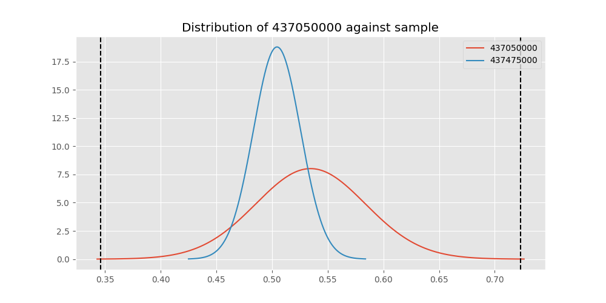 
## Testing Results for 437050000 against 435448000 
437050000 has a success rate of 0.5346534653465347
435448000 has a success rate of 0.975
$H_{0}$: There is not a difference between 437050000 and 435448000
$H_{A}$: There is a difference between 437050000 and 435448000
An $/alpha$ of 0.00025 was used in this test.
__independent t-testing__: With a t-statistic of -7.892337057873065 and a p-value of 9.149329684420749e-13, _we **reject** the null hypothssis_
__Man-Whitney testing__: With a u-statistic of 1130.5 and a p-value of 7.275867692461915e-07, _we **reject** the null hypothssis_
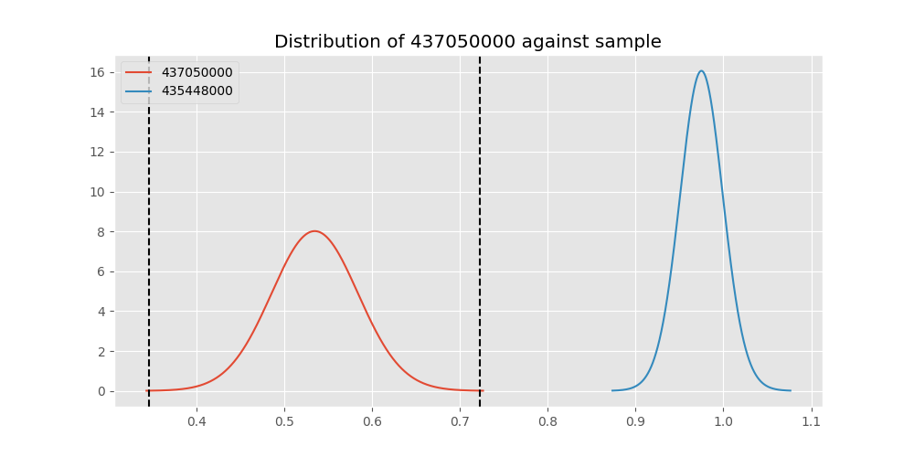 
## Testing Results for 437050000 against 437644000 
437050000 has a success rate of 0.5346534653465347
437644000 has a success rate of 0.9743589743589743
$H_{0}$: There is not a difference between 437050000 and 437644000
$H_{A}$: There is a difference between 437050000 and 437644000
An $/alpha$ of 0.00025 was used in this test.
__independent t-testing__: With a t-statistic of -8.456865221912167 and a p-value of 8.822652531490092e-14, _we **reject** the null hypothssis_
__Man-Whitney testing__: With a u-statistic of 3310.5 and a p-value of 1.5775576164389596e-14, _we **reject** the null hypothssis_
 
## Testing Results for 437050000 against 145825000 
437050000 has a success rate of 0.5346534653465347
145825000 has a success rate of 0.8687448728465955
$H_{0}$: There is not a difference between 437050000 and 145825000
$H_{A}$: There is a difference between 437050000 and 145825000
An $/alpha$ of 0.00025 was used in this test.
__independent t-testing__: With a t-statistic of -9.518299465025532 and a p-value of 3.9473595660506886e-21, _we **reject** the null hypothssis_
__Man-Whitney testing__: With a u-statistic of 81986.0 and a p-value of 8.399859360685264e-21, _we **reject** the null hypothssis_
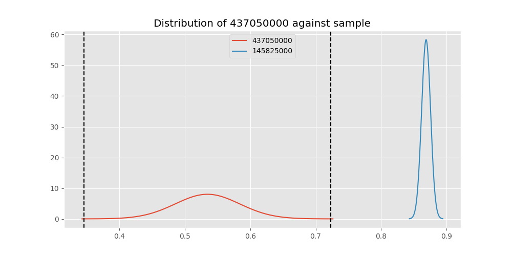 
## Testing Results for 437050000 against 437345000 
437050000 has a success rate of 0.5346534653465347
437345000 has a success rate of 0.7603092783505154
$H_{0}$: There is not a difference between 437050000 and 437345000
$H_{A}$: There is a difference between 437050000 and 437345000
An $/alpha$ of 0.00025 was used in this test.
__independent t-testing__: With a t-statistic of -4.553710773434671 and a p-value of 6.668017452988204e-06, _we **reject** the null hypothssis_
__Man-Whitney testing__: With a u-statistic of 15172.5 and a p-value of 8.050940400256768e-06, _we **reject** the null hypothssis_
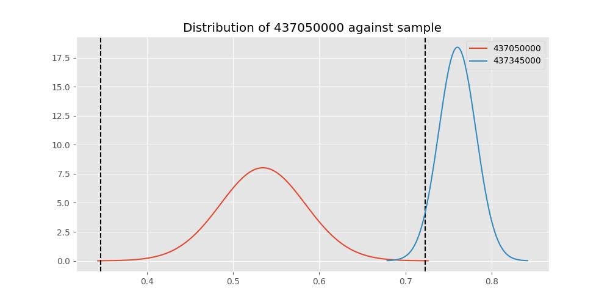 
## Testing Results for 437050000 against 435275000 
437050000 has a success rate of 0.5346534653465347
435275000 has a success rate of 0.9152542372881356
$H_{0}$: There is not a difference between 437050000 and 435275000
$H_{A}$: There is a difference between 437050000 and 435275000
An $/alpha$ of 0.00025 was used in this test.
__independent t-testing__: With a t-statistic of -7.064001893782956 and a p-value of 2.1683851609450235e-11, _we **reject** the null hypothssis_
__Man-Whitney testing__: With a u-statistic of 3691.0 and a p-value of 1.73917734993613e-10, _we **reject** the null hypothssis_
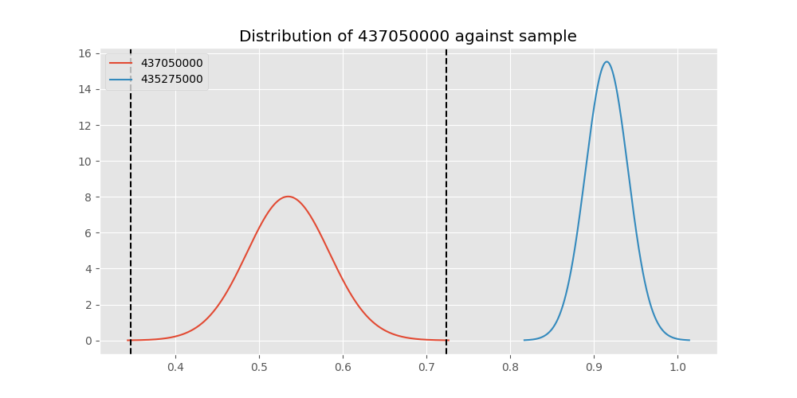 
## Testing Results for 437050000 against 437322500 
437050000 has a success rate of 0.5346534653465347
437322500 has a success rate of 0.9961685823754789
$H_{0}$: There is not a difference between 437050000 and 437322500
$H_{A}$: There is a difference between 437050000 and 437322500
An $/alpha$ of 0.00025 was used in this test.
__independent t-testing__: With a t-statistic of -9.225375212897504 and a p-value of 4.4938905881206975e-15, _we **reject** the null hypothssis_
__Man-Whitney testing__: With a u-statistic of 7097.5 and a p-value of 4.3298946965774805e-31, _we **reject** the null hypothssis_
 
## Testing Results for 437050000 against 437450000 
437050000 has a success rate of 0.5346534653465347
437450000 has a success rate of 0.6947791164658634
$H_{0}$: There is not a difference between 437050000 and 437450000
$H_{A}$: There is a difference between 437050000 and 437450000
An $/alpha$ of 0.00025 was used in this test.
__independent t-testing__: With a t-statistic of -2.8682642836547068 and a p-value of 0.00437904437764052, _we failed to reject the null hypothssis_
__Man-Whitney testing__: With a u-statistic of 10561.0 and a p-value of 0.004535235748123809, _we failed to reject the null hypothssis_
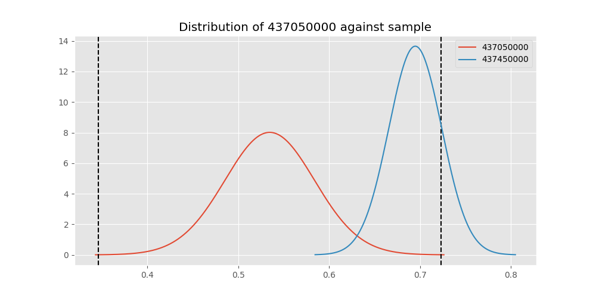 
## Testing Results for 437050000 against 436703000 
437050000 has a success rate of 0.5346534653465347
436703000 has a success rate of 0.9859154929577465
$H_{0}$: There is not a difference between 437050000 and 436703000
$H_{A}$: There is a difference between 437050000 and 436703000
An $/alpha$ of 0.00025 was used in this test.
__independent t-testing__: With a t-statistic of -8.930207276886781 and a p-value of 1.4980738633849178e-14, _we **reject** the null hypothssis_
__Man-Whitney testing__: With a u-statistic of 5902.5 and a p-value of 2.173606680008469e-24, _we **reject** the null hypothssis_
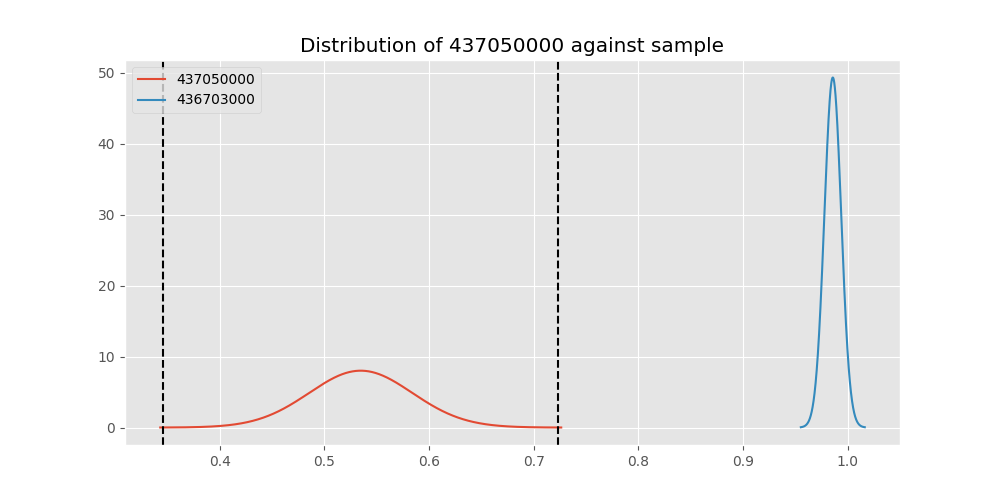 
## Testing Results for 437050000 against 400500000 
437050000 has a success rate of 0.5346534653465347
400500000 has a success rate of 0.3508771929824561
$H_{0}$: There is not a difference between 437050000 and 400500000
$H_{A}$: There is a difference between 437050000 and 400500000
An $/alpha$ of 0.00025 was used in this test.
__independent t-testing__: With a t-statistic of 2.2443737131907184 and a p-value of 0.026215099291396766, _we failed to reject the null hypothssis_
__Man-Whitney testing__: With a u-statistic of 3407.5 and a p-value of 0.026831030650733407, _we failed to reject the null hypothssis_
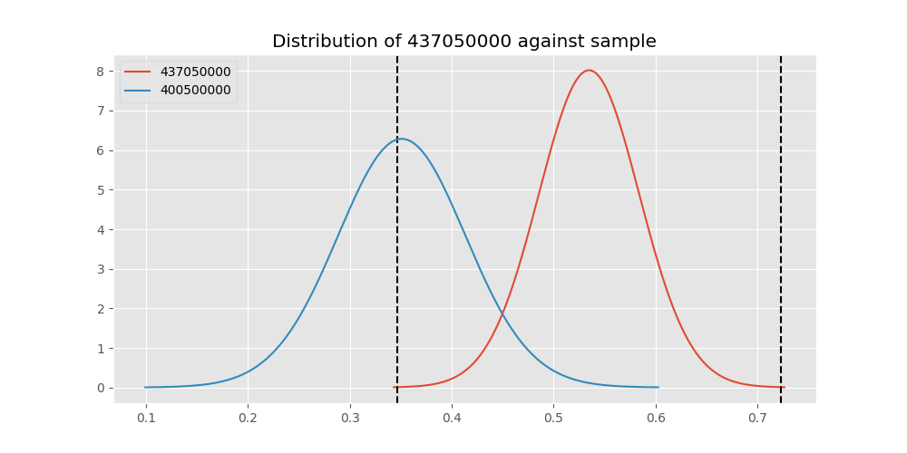 
## Testing Results for 437050000 against 437150000 
437050000 has a success rate of 0.5346534653465347
437150000 has a success rate of 0.9859550561797753
$H_{0}$: There is not a difference between 437050000 and 437150000
$H_{A}$: There is a difference between 437050000 and 437150000
An $/alpha$ of 0.00025 was used in this test.
__independent t-testing__: With a t-statistic of -8.977684420355157 and a p-value of 1.3650914789098766e-14, _we **reject** the null hypothssis_
__Man-Whitney testing__: With a u-statistic of 9864.5 and a p-value of 2.3502748110133904e-36, _we **reject** the null hypothssis_
 
## Testing Results for 437050000 against 435635000 
437050000 has a success rate of 0.5346534653465347
435635000 has a success rate of 0.9849624060150376
$H_{0}$: There is not a difference between 437050000 and 435635000
$H_{A}$: There is a difference between 437050000 and 435635000
An $/alpha$ of 0.00025 was used in this test.
__independent t-testing__: With a t-statistic of -8.830946212462067 and a p-value of 1.956581847337365e-14, _we **reject** the null hypothssis_
__Man-Whitney testing__: With a u-statistic of 3692.0 and a p-value of 5.95928696936252e-17, _we **reject** the null hypothssis_
 
## Testing Results for 437050000 against 437384000 
437050000 has a success rate of 0.5346534653465347
437384000 has a success rate of 0.968421052631579
$H_{0}$: There is not a difference between 437050000 and 437384000
$H_{A}$: There is a difference between 437050000 and 437384000
An $/alpha$ of 0.00025 was used in this test.
__independent t-testing__: With a t-statistic of -8.426565441604378 and a p-value of 1.2798221117178926e-13, _we **reject** the null hypothssis_
__Man-Whitney testing__: With a u-statistic of 5433.0 and a p-value of 8.243589109069305e-20, _we **reject** the null hypothssis_
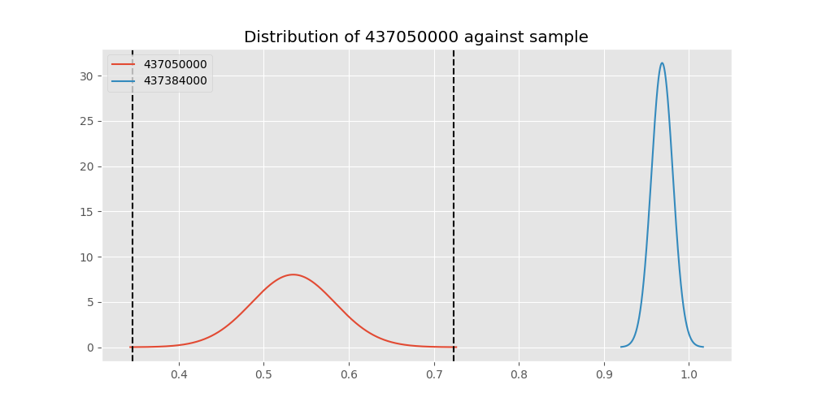 
## Testing Results for 437050000 against 437405000 
437050000 has a success rate of 0.5346534653465347
437405000 has a success rate of 0.9953917050691244
$H_{0}$: There is not a difference between 437050000 and 437405000
$H_{A}$: There is a difference between 437050000 and 437405000
An $/alpha$ of 0.00025 was used in this test.
__independent t-testing__: With a t-statistic of -9.197805409732357 and a p-value of 4.958557193500768e-15, _we **reject** the null hypothssis_
__Man-Whitney testing__: With a u-statistic of 5909.5 and a p-value of 1.4575390862294345e-26, _we **reject** the null hypothssis_
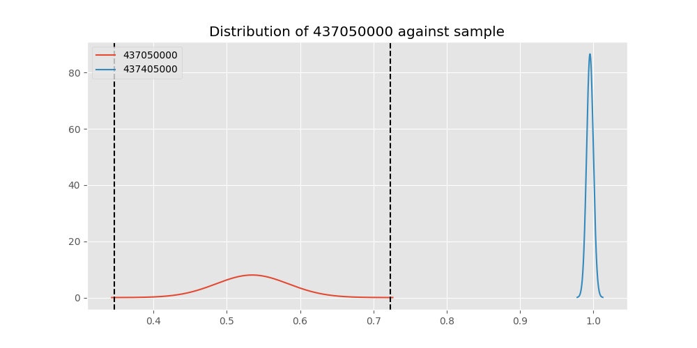 
## Testing Results for 437050000 against 435612500 
437050000 has a success rate of 0.5346534653465347
435612500 has a success rate of 0.9770114942528736
$H_{0}$: There is not a difference between 437050000 and 435612500
$H_{A}$: There is a difference between 437050000 and 435612500
An $/alpha$ of 0.00025 was used in this test.
__independent t-testing__: With a t-statistic of -8.436733590592707 and a p-value of 8.379282139040834e-14, _we **reject** the null hypothssis_
__Man-Whitney testing__: With a u-statistic of 2450.0 and a p-value of 6.462248046064212e-12, _we **reject** the null hypothssis_
 
## Testing Results for 437050000 against 435975000 
437050000 has a success rate of 0.5346534653465347
435975000 has a success rate of 0.92
$H_{0}$: There is not a difference between 437050000 and 435975000
$H_{A}$: There is a difference between 437050000 and 435975000
An $/alpha$ of 0.00025 was used in this test.
__independent t-testing__: With a t-statistic of -5.068038202204379 and a p-value of 1.1746222465963361e-06, _we **reject** the null hypothssis_
__Man-Whitney testing__: With a u-statistic of 1552.0 and a p-value of 2.6803624427466745e-06, _we **reject** the null hypothssis_
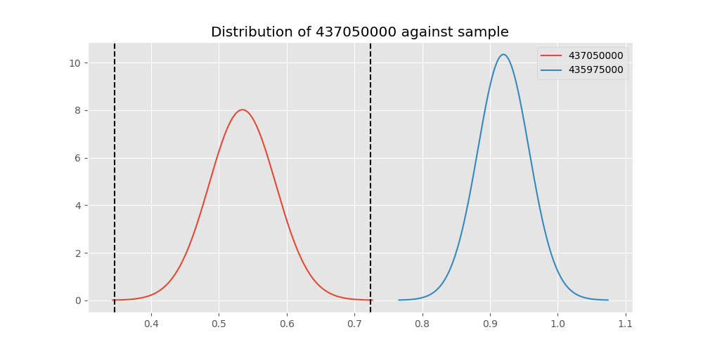 
## Testing Results for 437050000 against 437425000 
437050000 has a success rate of 0.5346534653465347
437425000 has a success rate of 0.6987654320987654
$H_{0}$: There is not a difference between 437050000 and 437425000
$H_{A}$: There is a difference between 437050000 and 437425000
An $/alpha$ of 0.00025 was used in this test.
__independent t-testing__: With a t-statistic of -3.1530220662933823 and a p-value of 0.0017122015256960765, _we failed to reject the null hypothssis_
__Man-Whitney testing__: With a u-statistic of 17096.0 and a p-value of 0.0017780021484756472, _we failed to reject the null hypothssis_
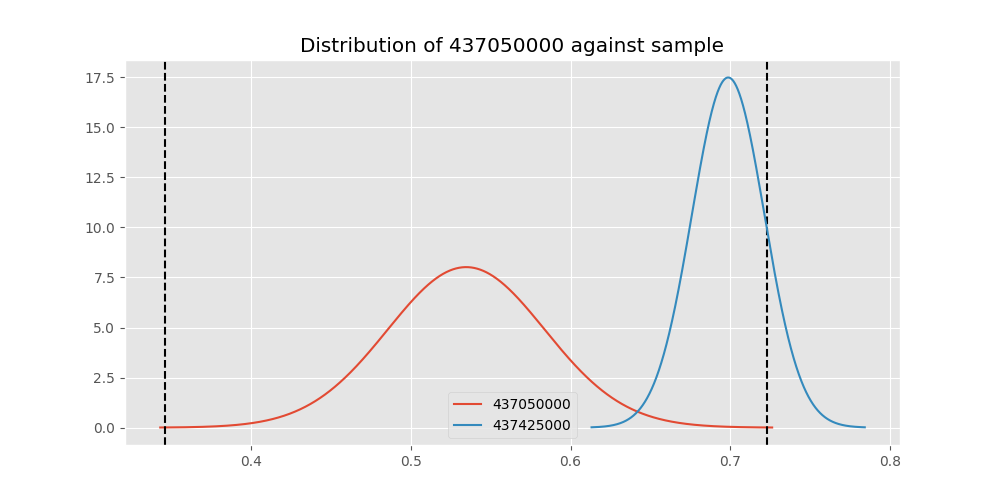 
## Testing Results for 437050000 against 437275000 
437050000 has a success rate of 0.5346534653465347
437275000 has a success rate of 0.3643724696356275
$H_{0}$: There is not a difference between 437050000 and 437275000
$H_{A}$: There is a difference between 437050000 and 437275000
An $/alpha$ of 0.00025 was used in this test.
__independent t-testing__: With a t-statistic of 2.95550041294729 and a p-value of 0.003335682382662994, _we failed to reject the null hypothssis_
__Man-Whitney testing__: With a u-statistic of 14597.5 and a p-value of 0.003473312860301618, _we failed to reject the null hypothssis_
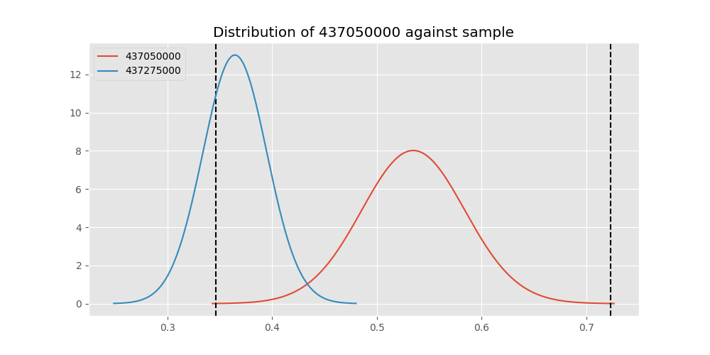 
## Testing Results for 437050000 against 145840000 
437050000 has a success rate of 0.5346534653465347
145840000 has a success rate of 0.9649122807017544
$H_{0}$: There is not a difference between 437050000 and 145840000
$H_{A}$: There is a difference between 437050000 and 145840000
An $/alpha$ of 0.00025 was used in this test.
__independent t-testing__: With a t-statistic of -7.736950119843611 and a p-value of 1.8368177086802816e-12, _we **reject** the null hypothssis_
__Man-Whitney testing__: With a u-statistic of 1640.0 and a p-value of 2.2076971540654758e-08, _we **reject** the null hypothssis_
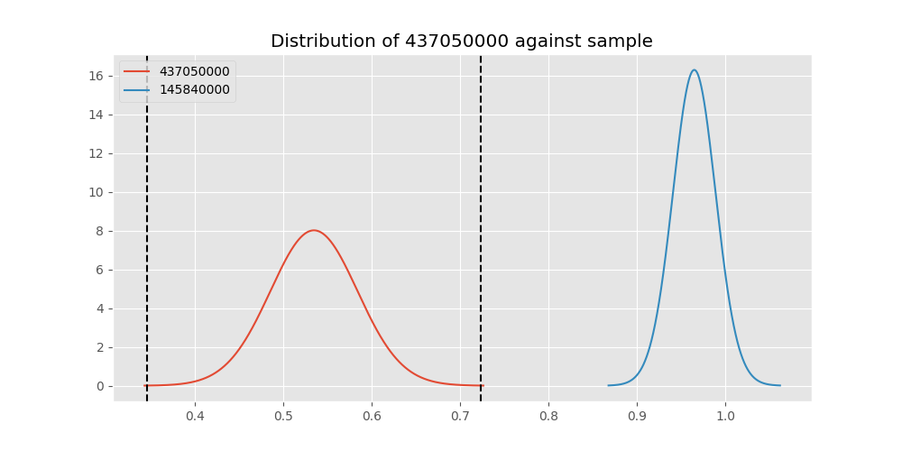 
## Testing Results for 437050000 against 435525000 
437050000 has a success rate of 0.5346534653465347
435525000 has a success rate of 0.6923076923076923
$H_{0}$: There is not a difference between 437050000 and 435525000
$H_{A}$: There is a difference between 437050000 and 435525000
An $/alpha$ of 0.00025 was used in this test.
__independent t-testing__: With a t-statistic of -2.5307414369099046 and a p-value of 0.012017072236844223, _we failed to reject the null hypothssis_
__Man-Whitney testing__: With a u-statistic of 6083.0 and a p-value of 0.012350804870275877, _we failed to reject the null hypothssis_
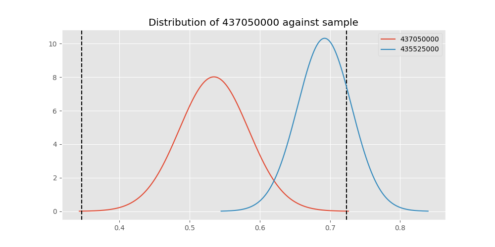 
## Testing Results for 437050000 against 436250000 
437050000 has a success rate of 0.5346534653465347
436250000 has a success rate of 0.17857142857142858
$H_{0}$: There is not a difference between 437050000 and 436250000
$H_{A}$: There is a difference between 437050000 and 436250000
An $/alpha$ of 0.00025 was used in this test.
__independent t-testing__: With a t-statistic of 4.608063569887682 and a p-value of 8.433941284694004e-06, _we **reject** the null hypothssis_
__Man-Whitney testing__: With a u-statistic of 3835.0 and a p-value of 1.4688302941091841e-05, _we **reject** the null hypothssis_
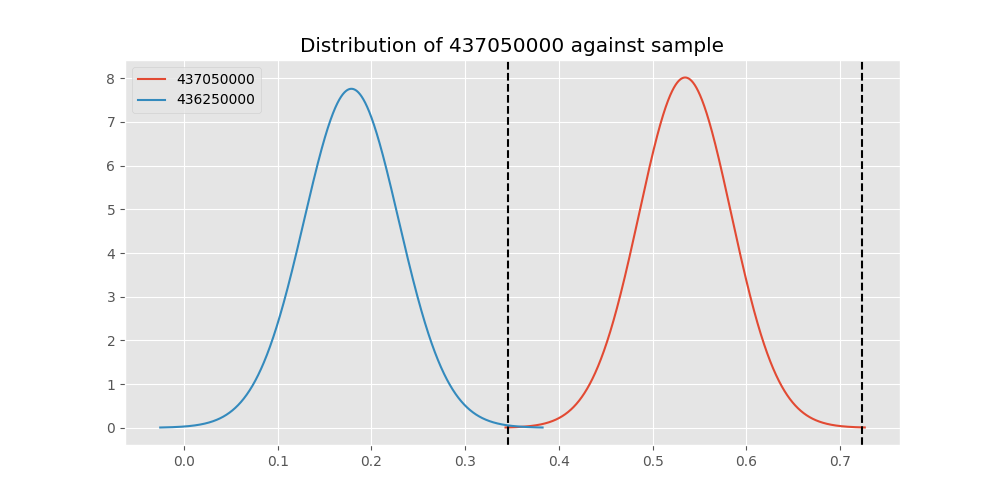 
## Testing Results for 437050000 against 435950000 
437050000 has a success rate of 0.5346534653465347
435950000 has a success rate of 0.9850187265917603
$H_{0}$: There is not a difference between 437050000 and 435950000
$H_{A}$: There is a difference between 437050000 and 435950000
An $/alpha$ of 0.00025 was used in this test.
__independent t-testing__: With a t-statistic of -8.979194526913819 and a p-value of 1.4470664943295975e-14, _we **reject** the null hypothssis_
__Man-Whitney testing__: With a u-statistic of 14822.0 and a p-value of 3.3419294447185654e-49, _we **reject** the null hypothssis_
 
## Testing Results for 437050000 against 435800000 
437050000 has a success rate of 0.5346534653465347
435800000 has a success rate of 0.5390070921985816
$H_{0}$: There is not a difference between 437050000 and 435800000
$H_{A}$: There is a difference between 437050000 and 435800000
An $/alpha$ of 0.00025 was used in this test.
__independent t-testing__: With a t-statistic of -0.06670377384437205 and a p-value of 0.94687306315281, _we failed to reject the null hypothssis_
__Man-Whitney testing__: With a u-statistic of 7089.5 and a p-value of 0.9475658138560821, _we failed to reject the null hypothssis_
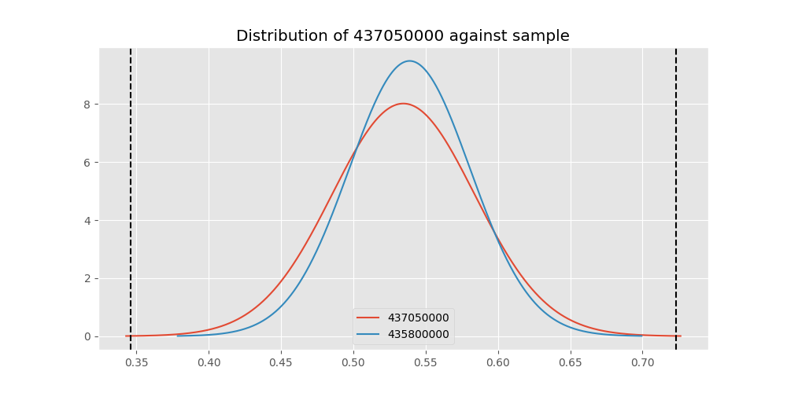 
## Testing Results for 437050000 against 437485000 
437050000 has a success rate of 0.5346534653465347
437485000 has a success rate of 0.9375
$H_{0}$: There is not a difference between 437050000 and 437485000
$H_{A}$: There is a difference between 437050000 and 437485000
An $/alpha$ of 0.00025 was used in this test.
__independent t-testing__: With a t-statistic of -6.088301926530879 and a p-value of 1.769806102050396e-08, _we **reject** the null hypothssis_
__Man-Whitney testing__: With a u-statistic of 965.0 and a p-value of 4.164135599655902e-05, _we **reject** the null hypothssis_
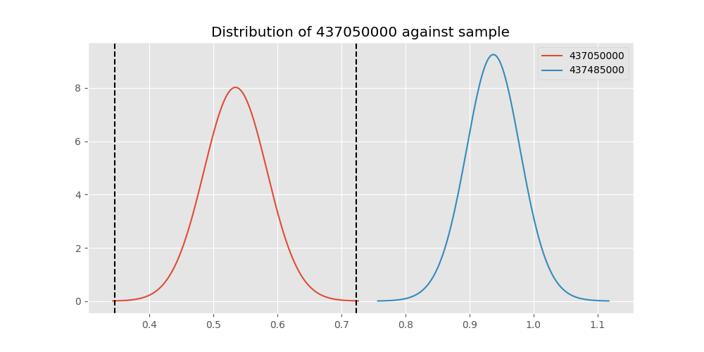 
## Testing Results for 437050000 against 136770000 
437050000 has a success rate of 0.5346534653465347
136770000 has a success rate of 0.9945945945945946
$H_{0}$: There is not a difference between 437050000 and 136770000
$H_{A}$: There is a difference between 437050000 and 136770000
An $/alpha$ of 0.00025 was used in this test.
__independent t-testing__: With a t-statistic of -9.167323176947596 and a p-value of 5.509361152956903e-15, _we **reject** the null hypothssis_
__Man-Whitney testing__: With a u-statistic of 5045.5 and a p-value of 3.1092845496451546e-23, _we **reject** the null hypothssis_
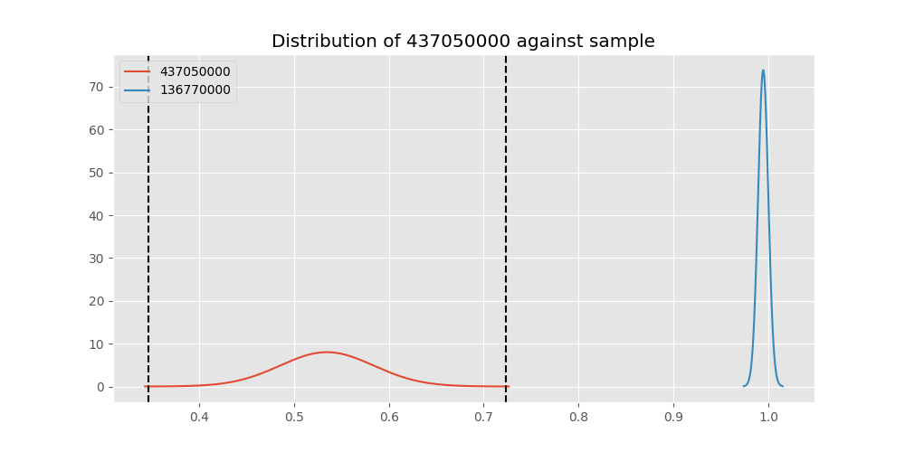 
## Testing Results for 437050000 against 437250000 
437050000 has a success rate of 0.5346534653465347
437250000 has a success rate of 0.9937106918238994
$H_{0}$: There is not a difference between 437050000 and 437250000
$H_{A}$: There is a difference between 437050000 and 437250000
An $/alpha$ of 0.00025 was used in this test.
__independent t-testing__: With a t-statistic of -9.167025931465119 and a p-value of 5.852137089707865e-15, _we **reject** the null hypothssis_
__Man-Whitney testing__: With a u-statistic of 8687.0 and a p-value of 8.348602605818352e-36, _we **reject** the null hypothssis_
 
## Testing Results for 437050000 against 437356000 
437050000 has a success rate of 0.5346534653465347
437356000 has a success rate of 0.9328358208955224
$H_{0}$: There is not a difference between 437050000 and 437356000
$H_{A}$: There is a difference between 437050000 and 437356000
An $/alpha$ of 0.00025 was used in this test.
__independent t-testing__: With a t-statistic of -7.966355574830107 and a p-value of 7.217936704476125e-14, _we **reject** the null hypothssis_
__Man-Whitney testing__: With a u-statistic of 4072.5 and a p-value of 1.4812962877829178e-12, _we **reject** the null hypothssis_
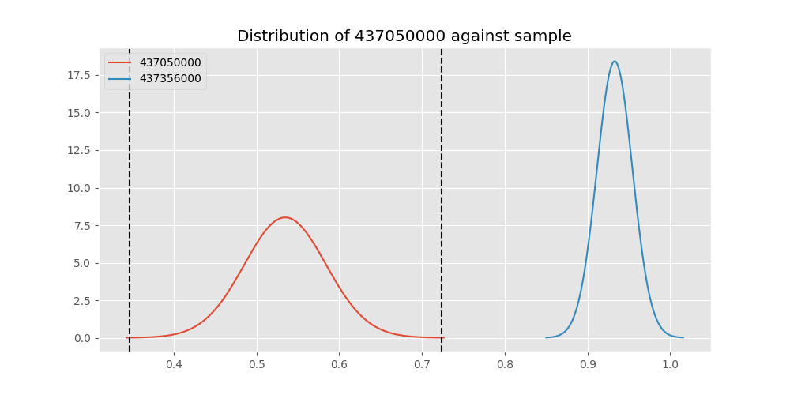 
## Testing Results for 437050000 against 437676000 
437050000 has a success rate of 0.5346534653465347
437676000 has a success rate of 0.9813432835820896
$H_{0}$: There is not a difference between 437050000 and 437676000
$H_{A}$: There is a difference between 437050000 and 437676000
An $/alpha$ of 0.00025 was used in this test.
__independent t-testing__: With a t-statistic of -8.834415022559332 and a p-value of 2.4094447087963026e-14, _we **reject** the null hypothssis_
__Man-Whitney testing__: With a u-statistic of 7488.5 and a p-value of 4.784634490126647e-28, _we **reject** the null hypothssis_
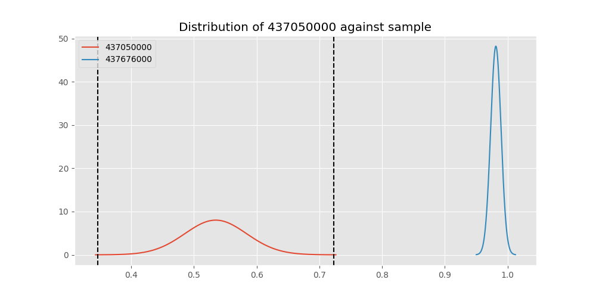 
## Testing Results for 437050000 against 145826800 
437050000 has a success rate of 0.5346534653465347
145826800 has a success rate of 0.966183574879227
$H_{0}$: There is not a difference between 437050000 and 145826800
$H_{A}$: There is a difference between 437050000 and 145826800
An $/alpha$ of 0.00025 was used in this test.
__independent t-testing__: With a t-statistic of -8.388168571450729 and a p-value of 1.5852470811855597e-13, _we **reject** the null hypothssis_
__Man-Whitney testing__: With a u-statistic of 5942.5 and a p-value of 1.0202195500263296e-20, _we **reject** the null hypothssis_
 
