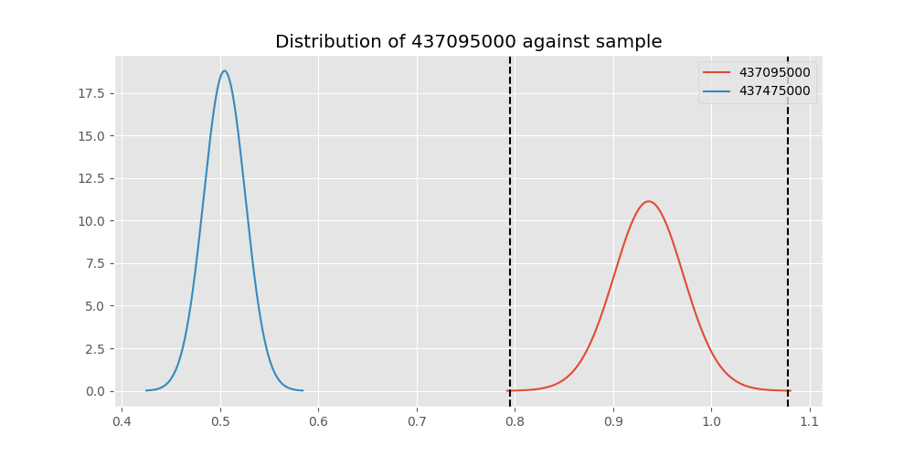

# Testing Results For 437095000 
$H_{0}$: There is not a difference in collection success against 437095000 
$H_{A}$: There is a difference in collection success against 437095000
An $\alpha$ of 0.00025 was used 
Out of 44 tests, there were 8 rejections from 44 independent-t test.
Out of 44 tests, there were 9 rejections from 44 Man Whitney u-tests.
## Testing Results for 437095000 against 436501000 
437095000 has a success rate of 0.9361702127659575
436501000 has a success rate of 0.9854014598540146
$H_{0}$: There is not a difference between 437095000 and 436501000
$H_{A}$: There is a difference between 437095000 and 436501000
An $/alpha$ of 0.00025 was used in this test.
__independent t-testing__: With a t-statistic of -1.313506520263206 and a p-value of 0.19459936394095861, _we failed to reject the null hypothssis_
__Man-Whitney testing__: With a u-statistic of 3061.0 and a p-value of 0.07496071010167939, _we failed to reject the null hypothssis_
 
## Testing Results for 437095000 against 437375000 
437095000 has a success rate of 0.9361702127659575
437375000 has a success rate of 0.9982014388489209
$H_{0}$: There is not a difference between 437095000 and 437375000
$H_{A}$: There is a difference between 437095000 and 437375000
An $/alpha$ of 0.00025 was used in this test.
__independent t-testing__: With a t-statistic of -1.7189375975469334 and a p-value of 0.09231629359372616, _we failed to reject the null hypothssis_
__Man-Whitney testing__: With a u-statistic of 12255.5 and a p-value of 5.080821345899899e-07, _we **reject** the null hypothssis_
 
## Testing Results for 437095000 against 436500000 
437095000 has a success rate of 0.9361702127659575
436500000 has a success rate of 0.9056603773584906
$H_{0}$: There is not a difference between 437095000 and 436500000
$H_{A}$: There is a difference between 437095000 and 436500000
An $/alpha$ of 0.00025 was used in this test.
__independent t-testing__: With a t-statistic of 0.6482374173086755 and a p-value of 0.517560368479711, _we failed to reject the null hypothssis_
__Man-Whitney testing__: With a u-statistic of 3850.5 and a p-value of 0.5180793415798466, _we failed to reject the null hypothssis_
 
## Testing Results for 437095000 against 436990000 
437095000 has a success rate of 0.9361702127659575
436990000 has a success rate of 0.9572649572649573
$H_{0}$: There is not a difference between 437095000 and 436990000
$H_{A}$: There is a difference between 437095000 and 436990000
An $/alpha$ of 0.00025 was used in this test.
__independent t-testing__: With a t-statistic of -0.6264687286020856 and a p-value of 0.5315197696533183, _we failed to reject the null hypothssis_
__Man-Whitney testing__: With a u-statistic of 5383.0 and a p-value of 0.5323345565602917, _we failed to reject the null hypothssis_
 
## Testing Results for 437095000 against 145875000 
437095000 has a success rate of 0.9361702127659575
145875000 has a success rate of 0.9722222222222222
$H_{0}$: There is not a difference between 437095000 and 145875000
$H_{A}$: There is a difference between 437095000 and 145875000
An $/alpha$ of 0.00025 was used in this test.
__independent t-testing__: With a t-statistic of -0.9538547541608735 and a p-value of 0.34212371470316916, _we failed to reject the null hypothssis_
__Man-Whitney testing__: With a u-statistic of 1631.0 and a p-value of 0.3439456749905787, _we failed to reject the null hypothssis_
 
## Testing Results for 437095000 against 437800000 
437095000 has a success rate of 0.9361702127659575
437800000 has a success rate of 0.9533678756476683
$H_{0}$: There is not a difference between 437095000 and 437800000
$H_{A}$: There is a difference between 437095000 and 437800000
An $/alpha$ of 0.00025 was used in this test.
__independent t-testing__: With a t-statistic of -0.48332635715669214 and a p-value of 0.6293083666338393, _we failed to reject the null hypothssis_
__Man-Whitney testing__: With a u-statistic of 4457.5 and a p-value of 0.6305165441610572, _we failed to reject the null hypothssis_
 
## Testing Results for 437095000 against 145810000 
437095000 has a success rate of 0.9361702127659575
145810000 has a success rate of 0.12179487179487179
$H_{0}$: There is not a difference between 437095000 and 145810000
$H_{A}$: There is a difference between 437095000 and 145810000
An $/alpha$ of 0.00025 was used in this test.
__independent t-testing__: With a t-statistic of 15.71559493113911 and a p-value of 7.890335309368709e-37, _we **reject** the null hypothssis_
__Man-Whitney testing__: With a u-statistic of 6651.5 and a p-value of 5.011818779526691e-26, _we **reject** the null hypothssis_
 
## Testing Results for 437095000 against 437265000 
437095000 has a success rate of 0.9361702127659575
437265000 has a success rate of 0.9795454545454545
$H_{0}$: There is not a difference between 437095000 and 437265000
$H_{A}$: There is a difference between 437095000 and 437265000
An $/alpha$ of 0.00025 was used in this test.
__independent t-testing__: With a t-statistic of -1.8257357645490198 and a p-value of 0.0685048150263093, _we failed to reject the null hypothssis_
__Man-Whitney testing__: With a u-statistic of 9891.5 and a p-value of 0.06885984187439365, _we failed to reject the null hypothssis_
 
## Testing Results for 437095000 against 437350000 
437095000 has a success rate of 0.9361702127659575
437350000 has a success rate of 0.9488372093023256
$H_{0}$: There is not a difference between 437095000 and 437350000
$H_{A}$: There is a difference between 437095000 and 437350000
An $/alpha$ of 0.00025 was used in this test.
__independent t-testing__: With a t-statistic of -0.3485299105849248 and a p-value of 0.7277243055505505, _we failed to reject the null hypothssis_
__Man-Whitney testing__: With a u-statistic of 4988.5 and a p-value of 0.7290492727616558, _we failed to reject the null hypothssis_
 
## Testing Results for 437095000 against 437200000 
437095000 has a success rate of 0.9361702127659575
437200000 has a success rate of 0.8620689655172413
$H_{0}$: There is not a difference between 437095000 and 437200000
$H_{A}$: There is a difference between 437095000 and 437200000
An $/alpha$ of 0.00025 was used in this test.
__independent t-testing__: With a t-statistic of 1.3887612497316684 and a p-value of 0.1661512919934267, _we failed to reject the null hypothssis_
__Man-Whitney testing__: With a u-statistic of 5124.0 and a p-value of 0.16629168416073992, _we failed to reject the null hypothssis_
 
## Testing Results for 437095000 against 435600000 
437095000 has a success rate of 0.9361702127659575
435600000 has a success rate of 0.9819341126461212
$H_{0}$: There is not a difference between 437095000 and 435600000
$H_{A}$: There is a difference between 437095000 and 435600000
An $/alpha$ of 0.00025 was used in this test.
__independent t-testing__: With a t-statistic of -2.177178127704237 and a p-value of 0.029703843292978992, _we failed to reject the null hypothssis_
__Man-Whitney testing__: With a u-statistic of 21101.5 and a p-value of 0.029856334004650733, _we failed to reject the null hypothssis_
 
## Testing Results for 437095000 against 450000000 
437095000 has a success rate of 0.9361702127659575
450000000 has a success rate of 0.8235294117647058
$H_{0}$: There is not a difference between 437095000 and 450000000
$H_{A}$: There is a difference between 437095000 and 450000000
An $/alpha$ of 0.00025 was used in this test.
__independent t-testing__: With a t-statistic of 1.8145479016912403 and a p-value of 0.07189913362050339, _we failed to reject the null hypothssis_
__Man-Whitney testing__: With a u-statistic of 2222.5 and a p-value of 0.07267315010313655, _we failed to reject the null hypothssis_
 
## Testing Results for 437095000 against 145978500 
437095000 has a success rate of 0.9361702127659575
145978500 has a success rate of 0.9963636363636363
$H_{0}$: There is not a difference between 437095000 and 145978500
$H_{A}$: There is a difference between 437095000 and 145978500
An $/alpha$ of 0.00025 was used in this test.
__independent t-testing__: With a t-statistic of -1.661650335131499 and a p-value of 0.10324818453893814, _we failed to reject the null hypothssis_
__Man-Whitney testing__: With a u-statistic of 6073.5 and a p-value of 0.0005962306448499548, _we failed to reject the null hypothssis_
 
## Testing Results for 437095000 against 437050000 
437095000 has a success rate of 0.9361702127659575
437050000 has a success rate of 0.5346534653465347
$H_{0}$: There is not a difference between 437095000 and 437050000
$H_{A}$: There is a difference between 437095000 and 437050000
An $/alpha$ of 0.00025 was used in this test.
__independent t-testing__: With a t-statistic of 5.198370500150415 and a p-value of 6.664097011124605e-07, _we **reject** the null hypothssis_
__Man-Whitney testing__: With a u-statistic of 3326.5 and a p-value of 1.6760384938810315e-06, _we **reject** the null hypothssis_
 
## Testing Results for 437095000 against 435300000 
437095000 has a success rate of 0.9361702127659575
435300000 has a success rate of 0.1232876712328767
$H_{0}$: There is not a difference between 437095000 and 435300000
$H_{A}$: There is a difference between 437095000 and 435300000
An $/alpha$ of 0.00025 was used in this test.
__independent t-testing__: With a t-statistic of 15.536718022888902 and a p-value of 9.960266930775825e-36, _we **reject** the null hypothssis_
__Man-Whitney testing__: With a u-statistic of 6220.0 and a p-value of 4.128914764539418e-25, _we **reject** the null hypothssis_
 
## Testing Results for 437095000 against 437475000 
437095000 has a success rate of 0.9361702127659575
437475000 has a success rate of 0.5045045045045045
$H_{0}$: There is not a difference between 437095000 and 437475000
$H_{A}$: There is a difference between 437095000 and 437475000
An $/alpha$ of 0.00025 was used in this test.
__independent t-testing__: With a t-statistic of 5.850185436667833 and a p-value of 8.07665845663256e-09, _we **reject** the null hypothssis_
__Man-Whitney testing__: With a u-statistic of 18672.5 and a p-value of 1.2381831201955345e-08, _we **reject** the null hypothssis_
 
## Testing Results for 437095000 against 435448000 
437095000 has a success rate of 0.9361702127659575
435448000 has a success rate of 0.975
$H_{0}$: There is not a difference between 437095000 and 435448000
$H_{A}$: There is a difference between 437095000 and 435448000
An $/alpha$ of 0.00025 was used in this test.
__independent t-testing__: With a t-statistic of -0.8555517664590369 and a p-value of 0.39465101836393335, _we failed to reject the null hypothssis_
__Man-Whitney testing__: With a u-statistic of 903.5 and a p-value of 0.39802713845656934, _we failed to reject the null hypothssis_
 
## Testing Results for 437095000 against 437644000 
437095000 has a success rate of 0.9361702127659575
437644000 has a success rate of 0.9743589743589743
$H_{0}$: There is not a difference between 437095000 and 437644000
$H_{A}$: There is a difference between 437095000 and 437644000
An $/alpha$ of 0.00025 was used in this test.
__independent t-testing__: With a t-statistic of -1.175643243792905 and a p-value of 0.24146234688819887, _we failed to reject the null hypothssis_
__Man-Whitney testing__: With a u-statistic of 2644.5 and a p-value of 0.24253426622944707, _we failed to reject the null hypothssis_
 
## Testing Results for 437095000 against 145825000 
437095000 has a success rate of 0.9361702127659575
145825000 has a success rate of 0.8687448728465955
$H_{0}$: There is not a difference between 437095000 and 145825000
$H_{A}$: There is a difference between 437095000 and 145825000
An $/alpha$ of 0.00025 was used in this test.
__independent t-testing__: With a t-statistic of 1.3614767307559221 and a p-value of 0.17348660789164216, _we failed to reject the null hypothssis_
__Man-Whitney testing__: With a u-statistic of 61156.0 and a p-value of 0.17349262217602968, _we failed to reject the null hypothssis_
 
## Testing Results for 437095000 against 437345000 
437095000 has a success rate of 0.9361702127659575
437345000 has a success rate of 0.7603092783505154
$H_{0}$: There is not a difference between 437095000 and 437345000
$H_{A}$: There is a difference between 437095000 and 437345000
An $/alpha$ of 0.00025 was used in this test.
__independent t-testing__: With a t-statistic of 2.7633684299027634 and a p-value of 0.0059647243008889754, _we failed to reject the null hypothssis_
__Man-Whitney testing__: With a u-statistic of 10721.5 and a p-value of 0.006113600736456012, _we failed to reject the null hypothssis_
 
## Testing Results for 437095000 against 435275000 
437095000 has a success rate of 0.9361702127659575
435275000 has a success rate of 0.9152542372881356
$H_{0}$: There is not a difference between 437095000 and 435275000
$H_{A}$: There is a difference between 437095000 and 435275000
An $/alpha$ of 0.00025 was used in this test.
__independent t-testing__: With a t-statistic of 0.44764648544366786 and a p-value of 0.6550026947827486, _we failed to reject the null hypothssis_
__Man-Whitney testing__: With a u-statistic of 2831.0 and a p-value of 0.6564113039323517, _we failed to reject the null hypothssis_
 
## Testing Results for 437095000 against 437322500 
437095000 has a success rate of 0.9361702127659575
437322500 has a success rate of 0.9961685823754789
$H_{0}$: There is not a difference between 437095000 and 437322500
$H_{A}$: There is a difference between 437095000 and 437322500
An $/alpha$ of 0.00025 was used in this test.
__independent t-testing__: With a t-statistic of -1.6553473617650296 and a p-value of 0.10451097420786899, _we failed to reject the null hypothssis_
__Man-Whitney testing__: With a u-statistic of 5765.5 and a p-value of 0.0008547688384124147, _we failed to reject the null hypothssis_
 
## Testing Results for 437095000 against 437450000 
437095000 has a success rate of 0.9361702127659575
437450000 has a success rate of 0.6947791164658634
$H_{0}$: There is not a difference between 437095000 and 437450000
$H_{A}$: There is a difference between 437095000 and 437450000
An $/alpha$ of 0.00025 was used in this test.
__independent t-testing__: With a t-statistic of 3.489912046845453 and a p-value of 0.0005572095618233982, _we failed to reject the null hypothssis_
__Man-Whitney testing__: With a u-statistic of 7264.0 and a p-value of 0.0006161729215611689, _we failed to reject the null hypothssis_
 
## Testing Results for 437095000 against 436703000 
437095000 has a success rate of 0.9361702127659575
436703000 has a success rate of 0.9859154929577465
$H_{0}$: There is not a difference between 437095000 and 436703000
$H_{A}$: There is a difference between 437095000 and 436703000
An $/alpha$ of 0.00025 was used in this test.
__independent t-testing__: With a t-statistic of -1.3466652834952737 and a p-value of 0.18407420392222115, _we failed to reject the null hypothssis_
__Man-Whitney testing__: With a u-statistic of 4756.5 and a p-value of 0.04058536997197709, _we failed to reject the null hypothssis_
 
## Testing Results for 437095000 against 400500000 
437095000 has a success rate of 0.9361702127659575
400500000 has a success rate of 0.3508771929824561
$H_{0}$: There is not a difference between 437095000 and 400500000
$H_{A}$: There is a difference between 437095000 and 400500000
An $/alpha$ of 0.00025 was used in this test.
__independent t-testing__: With a t-statistic of 7.549857556363423 and a p-value of 1.9030980353881477e-11, _we **reject** the null hypothssis_
__Man-Whitney testing__: With a u-statistic of 2123.5 and a p-value of 1.2578340702279039e-09, _we **reject** the null hypothssis_
 
## Testing Results for 437095000 against 437150000 
437095000 has a success rate of 0.9361702127659575
437150000 has a success rate of 0.9859550561797753
$H_{0}$: There is not a difference between 437095000 and 437150000
$H_{A}$: There is a difference between 437095000 and 437150000
An $/alpha$ of 0.00025 was used in this test.
__independent t-testing__: With a t-statistic of -1.3610134262503226 and a p-value of 0.17976190881717563, _we failed to reject the null hypothssis_
__Man-Whitney testing__: With a u-statistic of 7949.5 and a p-value of 0.021782771927083448, _we failed to reject the null hypothssis_
 
## Testing Results for 437095000 against 435635000 
437095000 has a success rate of 0.9361702127659575
435635000 has a success rate of 0.9849624060150376
$H_{0}$: There is not a difference between 437095000 and 435635000
$H_{A}$: There is a difference between 437095000 and 435635000
An $/alpha$ of 0.00025 was used in this test.
__independent t-testing__: With a t-statistic of -1.2988220279454028 and a p-value of 0.199508796272422, _we failed to reject the null hypothssis_
__Man-Whitney testing__: With a u-statistic of 2973.0 and a p-value of 0.08201945078028351, _we failed to reject the null hypothssis_
 
## Testing Results for 437095000 against 437384000 
437095000 has a success rate of 0.9361702127659575
437384000 has a success rate of 0.968421052631579
$H_{0}$: There is not a difference between 437095000 and 437384000
$H_{A}$: There is a difference between 437095000 and 437384000
An $/alpha$ of 0.00025 was used in this test.
__independent t-testing__: With a t-statistic of -1.0337062570335747 and a p-value of 0.3023361083312782, _we failed to reject the null hypothssis_
__Man-Whitney testing__: With a u-statistic of 4321.0 and a p-value of 0.3030252961468697, _we failed to reject the null hypothssis_
 
## Testing Results for 437095000 against 437405000 
437095000 has a success rate of 0.9361702127659575
437405000 has a success rate of 0.9953917050691244
$H_{0}$: There is not a difference between 437095000 and 437405000
$H_{A}$: There is a difference between 437095000 and 437405000
An $/alpha$ of 0.00025 was used in this test.
__independent t-testing__: With a t-statistic of -1.6298512601582662 and a p-value of 0.10974560816692393, _we failed to reject the null hypothssis_
__Man-Whitney testing__: With a u-statistic of 4797.5 and a p-value of 0.002676703886376687, _we failed to reject the null hypothssis_
 
## Testing Results for 437095000 against 435612500 
437095000 has a success rate of 0.9361702127659575
435612500 has a success rate of 0.9770114942528736
$H_{0}$: There is not a difference between 437095000 and 435612500
$H_{A}$: There is a difference between 437095000 and 435612500
An $/alpha$ of 0.00025 was used in this test.
__independent t-testing__: With a t-statistic of -1.1877456669536595 and a p-value of 0.23706645096329715, _we failed to reject the null hypothssis_
__Man-Whitney testing__: With a u-statistic of 1961.0 and a p-value of 0.23847202035654091, _we failed to reject the null hypothssis_
 
## Testing Results for 437095000 against 435975000 
437095000 has a success rate of 0.9361702127659575
435975000 has a success rate of 0.92
$H_{0}$: There is not a difference between 437095000 and 435975000
$H_{A}$: There is a difference between 437095000 and 435975000
An $/alpha$ of 0.00025 was used in this test.
__independent t-testing__: With a t-statistic of 0.3045461337707011 and a p-value of 0.7613779955489441, _we failed to reject the null hypothssis_
__Man-Whitney testing__: With a u-statistic of 1194.0 and a p-value of 0.7657466952597706, _we failed to reject the null hypothssis_
 
## Testing Results for 437095000 against 437425000 
437095000 has a success rate of 0.9361702127659575
437425000 has a success rate of 0.6987654320987654
$H_{0}$: There is not a difference between 437095000 and 437425000
$H_{A}$: There is a difference between 437095000 and 437425000
An $/alpha$ of 0.00025 was used in this test.
__independent t-testing__: With a t-statistic of 3.482721881317058 and a p-value of 0.0005448626684982519, _we failed to reject the null hypothssis_
__Man-Whitney testing__: With a u-statistic of 11777.0 and a p-value of 0.0005822126565306054, _we failed to reject the null hypothssis_
 
## Testing Results for 437095000 against 437275000 
437095000 has a success rate of 0.9361702127659575
437275000 has a success rate of 0.3643724696356275
$H_{0}$: There is not a difference between 437095000 and 437275000
$H_{A}$: There is a difference between 437095000 and 437275000
An $/alpha$ of 0.00025 was used in this test.
__independent t-testing__: With a t-statistic of 7.925519518268581 and a p-value of 4.831090964701203e-14, _we **reject** the null hypothssis_
__Man-Whitney testing__: With a u-statistic of 9123.5 and a p-value of 5.975059169885936e-13, _we **reject** the null hypothssis_
 
## Testing Results for 437095000 against 145840000 
437095000 has a success rate of 0.9361702127659575
145840000 has a success rate of 0.9649122807017544
$H_{0}$: There is not a difference between 437095000 and 145840000
$H_{A}$: There is a difference between 437095000 and 145840000
An $/alpha$ of 0.00025 was used in this test.
__independent t-testing__: With a t-statistic of -0.67682266619635 and a p-value of 0.500050528096051, _we failed to reject the null hypothssis_
__Man-Whitney testing__: With a u-statistic of 1301.0 and a p-value of 0.5029871567642792, _we failed to reject the null hypothssis_
 
## Testing Results for 437095000 against 435525000 
437095000 has a success rate of 0.9361702127659575
435525000 has a success rate of 0.6923076923076923
$H_{0}$: There is not a difference between 437095000 and 435525000
$H_{A}$: There is a difference between 437095000 and 435525000
An $/alpha$ of 0.00025 was used in this test.
__independent t-testing__: With a t-statistic of 3.447763035302205 and a p-value of 0.0006974860581619776, _we failed to reject the null hypothssis_
__Man-Whitney testing__: With a u-statistic of 4180.0 and a p-value of 0.0008066292915244, _we failed to reject the null hypothssis_
 
## Testing Results for 437095000 against 436250000 
437095000 has a success rate of 0.9361702127659575
436250000 has a success rate of 0.17857142857142858
$H_{0}$: There is not a difference between 437095000 and 436250000
$H_{A}$: There is a difference between 437095000 and 436250000
An $/alpha$ of 0.00025 was used in this test.
__independent t-testing__: With a t-statistic of 11.592534421689933 and a p-value of 2.88755880305918e-20, _we **reject** the null hypothssis_
__Man-Whitney testing__: With a u-statistic of 2313.0 and a p-value of 2.397639481295369e-14, _we **reject** the null hypothssis_
 
## Testing Results for 437095000 against 435950000 
437095000 has a success rate of 0.9361702127659575
435950000 has a success rate of 0.9850187265917603
$H_{0}$: There is not a difference between 437095000 and 435950000
$H_{A}$: There is a difference between 437095000 and 435950000
An $/alpha$ of 0.00025 was used in this test.
__independent t-testing__: With a t-statistic of -1.341101729458178 and a p-value of 0.18620184148882282, _we failed to reject the null hypothssis_
__Man-Whitney testing__: With a u-statistic of 11936.0 and a p-value of 0.018683804119115223, _we failed to reject the null hypothssis_
 
## Testing Results for 437095000 against 435800000 
437095000 has a success rate of 0.9361702127659575
435800000 has a success rate of 0.5390070921985816
$H_{0}$: There is not a difference between 437095000 and 435800000
$H_{A}$: There is a difference between 437095000 and 435800000
An $/alpha$ of 0.00025 was used in this test.
__independent t-testing__: With a t-statistic of 5.2276510817081085 and a p-value of 4.5866001525577283e-07, _we **reject** the null hypothssis_
__Man-Whitney testing__: With a u-statistic of 4629.5 and a p-value of 9.95217804675033e-07, _we **reject** the null hypothssis_
 
## Testing Results for 437095000 against 437485000 
437095000 has a success rate of 0.9361702127659575
437485000 has a success rate of 0.9375
$H_{0}$: There is not a difference between 437095000 and 437485000
$H_{A}$: There is a difference between 437095000 and 437485000
An $/alpha$ of 0.00025 was used in this test.
__independent t-testing__: With a t-statistic of -0.02352621919015408 and a p-value of 0.9812913861161758, _we failed to reject the null hypothssis_
__Man-Whitney testing__: With a u-statistic of 751.0 and a p-value of 0.9905539022123722, _we failed to reject the null hypothssis_
 
## Testing Results for 437095000 against 136770000 
437095000 has a success rate of 0.9361702127659575
136770000 has a success rate of 0.9945945945945946
$H_{0}$: There is not a difference between 437095000 and 136770000
$H_{A}$: There is a difference between 437095000 and 136770000
An $/alpha$ of 0.00025 was used in this test.
__independent t-testing__: With a t-statistic of -1.6030751641933745 and a p-value of 0.11546723421928423, _we failed to reject the null hypothssis_
__Man-Whitney testing__: With a u-statistic of 4093.5 and a p-value of 0.006211290729429337, _we failed to reject the null hypothssis_
 
## Testing Results for 437095000 against 437250000 
437095000 has a success rate of 0.9361702127659575
437250000 has a success rate of 0.9937106918238994
$H_{0}$: There is not a difference between 437095000 and 437250000
$H_{A}$: There is a difference between 437095000 and 437250000
An $/alpha$ of 0.00025 was used in this test.
__independent t-testing__: With a t-statistic of -1.5845006333183742 and a p-value of 0.11972902856862724, _we failed to reject the null hypothssis_
__Man-Whitney testing__: With a u-statistic of 7043.0 and a p-value of 0.001579345668989073, _we failed to reject the null hypothssis_
 
## Testing Results for 437095000 against 437356000 
437095000 has a success rate of 0.9361702127659575
437356000 has a success rate of 0.9328358208955224
$H_{0}$: There is not a difference between 437095000 and 437356000
$H_{A}$: There is a difference between 437095000 and 437356000
An $/alpha$ of 0.00025 was used in this test.
__independent t-testing__: With a t-statistic of 0.07861727827047274 and a p-value of 0.9374248596979564, _we failed to reject the null hypothssis_
__Man-Whitney testing__: With a u-statistic of 3159.5 and a p-value of 0.9401501416529334, _we failed to reject the null hypothssis_
 
## Testing Results for 437095000 against 437676000 
437095000 has a success rate of 0.9361702127659575
437676000 has a success rate of 0.9813432835820896
$H_{0}$: There is not a difference between 437095000 and 437676000
$H_{A}$: There is a difference between 437095000 and 437676000
An $/alpha$ of 0.00025 was used in this test.
__independent t-testing__: With a t-statistic of -1.8194430921491158 and a p-value of 0.06979910348559953, _we failed to reject the null hypothssis_
__Man-Whitney testing__: With a u-statistic of 6013.5 and a p-value of 0.07035779794208866, _we failed to reject the null hypothssis_
 
## Testing Results for 437095000 against 145826800 
437095000 has a success rate of 0.9361702127659575
145826800 has a success rate of 0.966183574879227
$H_{0}$: There is not a difference between 437095000 and 145826800
$H_{A}$: There is a difference between 437095000 and 145826800
An $/alpha$ of 0.00025 was used in this test.
__independent t-testing__: With a t-statistic of -0.9530933787121523 and a p-value of 0.3414560547230301, _we failed to reject the null hypothssis_
__Man-Whitney testing__: With a u-statistic of 4718.5 and a p-value of 0.342111553026232, _we failed to reject the null hypothssis_
 
