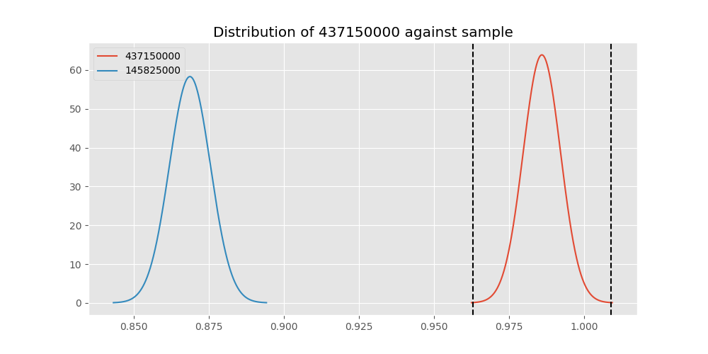
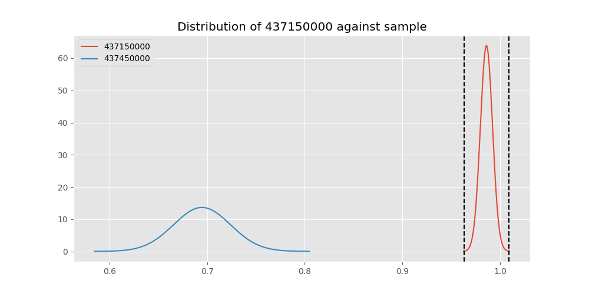
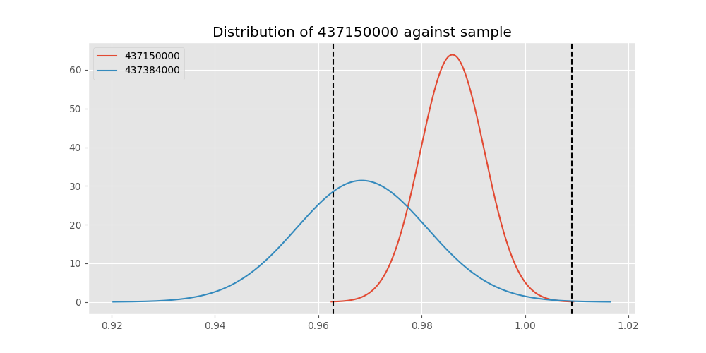
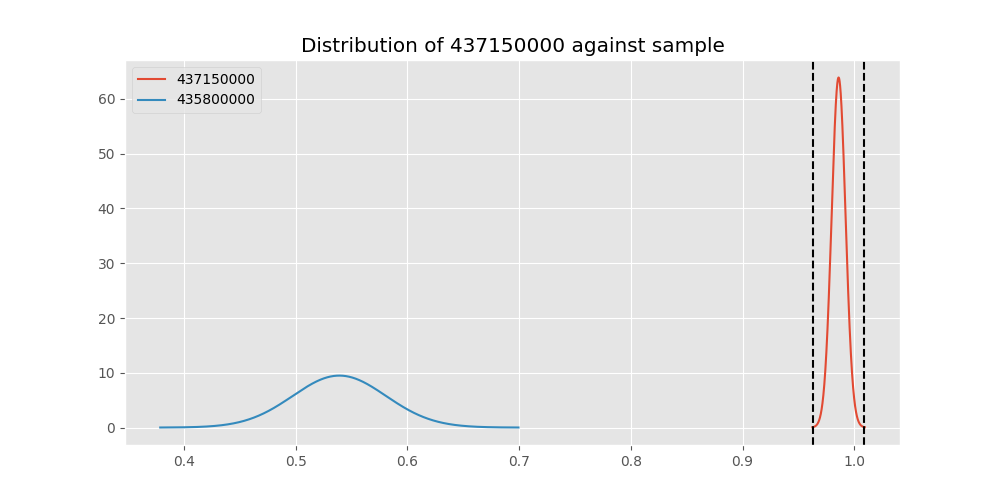

# Testing Results For 437150000 
$H_{0}$: There is not a difference in collection success against 437150000 
$H_{A}$: There is a difference in collection success against 437150000
An $\alpha$ of 0.00025 was used 
Out of 44 tests, there were 17 rejections from 44 independent-t test.
Out of 44 tests, there were 17 rejections from 44 Man Whitney u-tests.
## Testing Results for 437150000 against 436501000 
437150000 has a success rate of 0.9859550561797753
436501000 has a success rate of 0.9854014598540146
$H_{0}$: There is not a difference between 437150000 and 436501000
$H_{A}$: There is a difference between 437150000 and 436501000
An $/alpha$ of 0.00025 was used in this test.
__independent t-testing__: With a t-statistic of 0.046446503636715764 and a p-value of 0.9629732565516747, _we failed to reject the null hypothssis_
__Man-Whitney testing__: With a u-statistic of 24399.5 and a p-value of 0.964289292691276, _we failed to reject the null hypothssis_
 
## Testing Results for 437150000 against 437375000 
437150000 has a success rate of 0.9859550561797753
437375000 has a success rate of 0.9982014388489209
$H_{0}$: There is not a difference between 437150000 and 437375000
$H_{A}$: There is a difference between 437150000 and 437375000
An $/alpha$ of 0.00025 was used in this test.
__independent t-testing__: With a t-statistic of -1.8842287723328357 and a p-value of 0.060233608147233234, _we failed to reject the null hypothssis_
__Man-Whitney testing__: With a u-statistic of 97756.0 and a p-value of 0.02577962932107109, _we failed to reject the null hypothssis_
 
## Testing Results for 437150000 against 436500000 
437150000 has a success rate of 0.9859550561797753
436500000 has a success rate of 0.9056603773584906
$H_{0}$: There is not a difference between 437150000 and 436500000
$H_{A}$: There is a difference between 437150000 and 436500000
An $/alpha$ of 0.00025 was used in this test.
__independent t-testing__: With a t-statistic of 4.431056403558012 and a p-value of 1.147223928594267e-05, _we **reject** the null hypothssis_
__Man-Whitney testing__: With a u-statistic of 30574.5 and a p-value of 1.349639533692865e-05, _we **reject** the null hypothssis_
 
## Testing Results for 437150000 against 436990000 
437150000 has a success rate of 0.9859550561797753
436990000 has a success rate of 0.9572649572649573
$H_{0}$: There is not a difference between 437150000 and 436990000
$H_{A}$: There is a difference between 437150000 and 436990000
An $/alpha$ of 0.00025 was used in this test.
__independent t-testing__: With a t-statistic of 2.1707375486124794 and a p-value of 0.0303504029555764, _we failed to reject the null hypothssis_
__Man-Whitney testing__: With a u-statistic of 42847.0 and a p-value of 0.030539341647897334, _we failed to reject the null hypothssis_
 
## Testing Results for 437150000 against 145875000 
437150000 has a success rate of 0.9859550561797753
145875000 has a success rate of 0.9722222222222222
$H_{0}$: There is not a difference between 437150000 and 145875000
$H_{A}$: There is a difference between 437150000 and 145875000
An $/alpha$ of 0.00025 was used in this test.
__independent t-testing__: With a t-statistic of 0.8366091814624972 and a p-value of 0.4032813264253796, _we failed to reject the null hypothssis_
__Man-Whitney testing__: With a u-statistic of 12992.0 and a p-value of 0.40398478630425305, _we failed to reject the null hypothssis_
 
## Testing Results for 437150000 against 437800000 
437150000 has a success rate of 0.9859550561797753
437800000 has a success rate of 0.9533678756476683
$H_{0}$: There is not a difference between 437150000 and 437800000
$H_{A}$: There is a difference between 437150000 and 437800000
An $/alpha$ of 0.00025 was used in this test.
__independent t-testing__: With a t-statistic of 2.3196842386559466 and a p-value of 0.02072521426532442, _we failed to reject the null hypothssis_
__Man-Whitney testing__: With a u-statistic of 35473.5 and a p-value of 0.02091943828407168, _we failed to reject the null hypothssis_
 
## Testing Results for 437150000 against 145810000 
437150000 has a success rate of 0.9859550561797753
145810000 has a success rate of 0.12179487179487179
$H_{0}$: There is not a difference between 437150000 and 145810000
$H_{A}$: There is a difference between 437150000 and 145810000
An $/alpha$ of 0.00025 was used in this test.
__independent t-testing__: With a t-statistic of 43.71669083401528 and a p-value of 1.2705299208755704e-174, _we **reject** the null hypothssis_
__Man-Whitney testing__: With a u-statistic of 51764.0 and a p-value of 1.0302631374522189e-89, _we **reject** the null hypothssis_
 
## Testing Results for 437150000 against 437095000 
437150000 has a success rate of 0.9859550561797753
437095000 has a success rate of 0.9361702127659575
$H_{0}$: There is not a difference between 437150000 and 437095000
$H_{A}$: There is a difference between 437150000 and 437095000
An $/alpha$ of 0.00025 was used in this test.
__independent t-testing__: With a t-statistic of 2.3092361659506433 and a p-value of 0.021437972198552032, _we failed to reject the null hypothssis_
__Man-Whitney testing__: With a u-statistic of 8782.5 and a p-value of 0.021782771927083448, _we failed to reject the null hypothssis_
 
## Testing Results for 437150000 against 437265000 
437150000 has a success rate of 0.9859550561797753
437265000 has a success rate of 0.9795454545454545
$H_{0}$: There is not a difference between 437150000 and 437265000
$H_{A}$: There is a difference between 437150000 and 437265000
An $/alpha$ of 0.00025 was used in this test.
__independent t-testing__: With a t-statistic of 0.6833652792979992 and a p-value of 0.49457541126718796, _we failed to reject the null hypothssis_
__Man-Whitney testing__: With a u-statistic of 78822.0 and a p-value of 0.4946614355804996, _we failed to reject the null hypothssis_
 
## Testing Results for 437150000 against 437350000 
437150000 has a success rate of 0.9859550561797753
437350000 has a success rate of 0.9488372093023256
$H_{0}$: There is not a difference between 437150000 and 437350000
$H_{A}$: There is a difference between 437150000 and 437350000
An $/alpha$ of 0.00025 was used in this test.
__independent t-testing__: With a t-statistic of 2.6149943572697296 and a p-value of 0.009159462108564258, _we failed to reject the null hypothssis_
__Man-Whitney testing__: With a u-statistic of 39690.5 and a p-value of 0.009300974419457658, _we failed to reject the null hypothssis_
 
## Testing Results for 437150000 against 437200000 
437150000 has a success rate of 0.9859550561797753
437200000 has a success rate of 0.8620689655172413
$H_{0}$: There is not a difference between 437150000 and 437200000
$H_{A}$: There is a difference between 437150000 and 437200000
An $/alpha$ of 0.00025 was used in this test.
__independent t-testing__: With a t-statistic of 6.166118665443646 and a p-value of 1.3451663610579364e-09, _we **reject** the null hypothssis_
__Man-Whitney testing__: With a u-statistic of 40610.5 and a p-value of 2.364556328796892e-09, _we **reject** the null hypothssis_
 
## Testing Results for 437150000 against 435600000 
437150000 has a success rate of 0.9859550561797753
435600000 has a success rate of 0.9819341126461212
$H_{0}$: There is not a difference between 437150000 and 435600000
$H_{A}$: There is a difference between 437150000 and 435600000
An $/alpha$ of 0.00025 was used in this test.
__independent t-testing__: With a t-statistic of 0.5001015144611975 and a p-value of 0.6170885673501931, _we failed to reject the null hypothssis_
__Man-Whitney testing__: With a u-statistic of 168171.5 and a p-value of 0.6171631775706394, _we failed to reject the null hypothssis_
 
## Testing Results for 437150000 against 450000000 
437150000 has a success rate of 0.9859550561797753
450000000 has a success rate of 0.8235294117647058
$H_{0}$: There is not a difference between 437150000 and 450000000
$H_{A}$: There is a difference between 437150000 and 450000000
An $/alpha$ of 0.00025 was used in this test.
__independent t-testing__: With a t-statistic of 6.781035582136806 and a p-value of 3.865327894226606e-11, _we **reject** the null hypothssis_
__Man-Whitney testing__: With a u-statistic of 17587.5 and a p-value of 1.0637810441395334e-10, _we **reject** the null hypothssis_
 
## Testing Results for 437150000 against 145978500 
437150000 has a success rate of 0.9859550561797753
145978500 has a success rate of 0.9963636363636363
$H_{0}$: There is not a difference between 437150000 and 145978500
$H_{A}$: There is a difference between 437150000 and 145978500
An $/alpha$ of 0.00025 was used in this test.
__independent t-testing__: With a t-statistic of -1.3356958214110597 and a p-value of 0.1821318112130448, _we failed to reject the null hypothssis_
__Man-Whitney testing__: With a u-statistic of 48440.5 and a p-value of 0.1823495971897544, _we failed to reject the null hypothssis_
 
## Testing Results for 437150000 against 437050000 
437150000 has a success rate of 0.9859550561797753
437050000 has a success rate of 0.5346534653465347
$H_{0}$: There is not a difference between 437150000 and 437050000
$H_{A}$: There is a difference between 437150000 and 437050000
An $/alpha$ of 0.00025 was used in this test.
__independent t-testing__: With a t-statistic of 15.57458854020951 and a p-value of 3.819332725294729e-44, _we **reject** the null hypothssis_
__Man-Whitney testing__: With a u-statistic of 26091.5 and a p-value of 2.3502748110133904e-36, _we **reject** the null hypothssis_
 
## Testing Results for 437150000 against 435300000 
437150000 has a success rate of 0.9859550561797753
435300000 has a success rate of 0.1232876712328767
$H_{0}$: There is not a difference between 437150000 and 435300000
$H_{A}$: There is a difference between 437150000 and 435300000
An $/alpha$ of 0.00025 was used in this test.
__independent t-testing__: With a t-statistic of 43.13021651156951 and a p-value of 1.2831662357001527e-170, _we **reject** the null hypothssis_
__Man-Whitney testing__: With a u-statistic of 48407.0 and a p-value of 7.285764792171833e-88, _we **reject** the null hypothssis_
 
## Testing Results for 437150000 against 437475000 
437150000 has a success rate of 0.9859550561797753
437475000 has a success rate of 0.5045045045045045
$H_{0}$: There is not a difference between 437150000 and 437475000
$H_{A}$: There is a difference between 437150000 and 437475000
An $/alpha$ of 0.00025 was used in this test.
__independent t-testing__: With a t-statistic of 17.83467224089656 and a p-value of 3.087718776259909e-61, _we **reject** the null hypothssis_
__Man-Whitney testing__: With a u-statistic of 146352.5 and a p-value of 3.112205221732449e-53, _we **reject** the null hypothssis_
 
## Testing Results for 437150000 against 435448000 
437150000 has a success rate of 0.9859550561797753
435448000 has a success rate of 0.975
$H_{0}$: There is not a difference between 437150000 and 435448000
$H_{A}$: There is a difference between 437150000 and 435448000
An $/alpha$ of 0.00025 was used in this test.
__independent t-testing__: With a t-statistic of 0.5366219517797912 and a p-value of 0.5918316423157335, _we failed to reject the null hypothssis_
__Man-Whitney testing__: With a u-statistic of 7198.0 and a p-value of 0.5935745173835463, _we failed to reject the null hypothssis_
 
## Testing Results for 437150000 against 437644000 
437150000 has a success rate of 0.9859550561797753
437644000 has a success rate of 0.9743589743589743
$H_{0}$: There is not a difference between 437150000 and 437644000
$H_{A}$: There is a difference between 437150000 and 437644000
An $/alpha$ of 0.00025 was used in this test.
__independent t-testing__: With a t-statistic of 0.8427434236372751 and a p-value of 0.3997996974398804, _we failed to reject the null hypothssis_
__Man-Whitney testing__: With a u-statistic of 21067.5 and a p-value of 0.40020403204278054, _we failed to reject the null hypothssis_
 
## Testing Results for 437150000 against 145825000 
437150000 has a success rate of 0.9859550561797753
145825000 has a success rate of 0.8687448728465955
$H_{0}$: There is not a difference between 437150000 and 145825000
$H_{A}$: There is a difference between 437150000 and 145825000
An $/alpha$ of 0.00025 was used in this test.
__independent t-testing__: With a t-statistic of 6.489535804076462 and a p-value of 1.015108434529174e-10, _we **reject** the null hypothssis_
__Man-Whitney testing__: With a u-statistic of 484829.0 and a p-value of 1.1773134901542962e-10, _we **reject** the null hypothssis_
 
## Testing Results for 437150000 against 437345000 
437150000 has a success rate of 0.9859550561797753
437345000 has a success rate of 0.7603092783505154
$H_{0}$: There is not a difference between 437150000 and 437345000
$H_{A}$: There is a difference between 437150000 and 437345000
An $/alpha$ of 0.00025 was used in this test.
__independent t-testing__: With a t-statistic of 9.629683090115627 and a p-value of 9.232559824319479e-21, _we **reject** the null hypothssis_
__Man-Whitney testing__: With a u-statistic of 84648.0 and a p-value of 1.038120565484802e-19, _we **reject** the null hypothssis_
 
## Testing Results for 437150000 against 435275000 
437150000 has a success rate of 0.9859550561797753
435275000 has a success rate of 0.9152542372881356
$H_{0}$: There is not a difference between 437150000 and 435275000
$H_{A}$: There is a difference between 437150000 and 435275000
An $/alpha$ of 0.00025 was used in this test.
__independent t-testing__: With a t-statistic of 3.8533211563142324 and a p-value of 0.0001326406992469193, _we **reject** the null hypothssis_
__Man-Whitney testing__: With a u-statistic of 22489.0 and a p-value of 0.0001465497451462084, _we **reject** the null hypothssis_
 
## Testing Results for 437150000 against 437322500 
437150000 has a success rate of 0.9859550561797753
437322500 has a success rate of 0.9961685823754789
$H_{0}$: There is not a difference between 437150000 and 437322500
$H_{A}$: There is a difference between 437150000 and 437322500
An $/alpha$ of 0.00025 was used in this test.
__independent t-testing__: With a t-statistic of -1.2768420274363526 and a p-value of 0.20213990951317293, _we failed to reject the null hypothssis_
__Man-Whitney testing__: With a u-statistic of 45983.5 and a p-value of 0.20236429079624318, _we failed to reject the null hypothssis_
 
## Testing Results for 437150000 against 437450000 
437150000 has a success rate of 0.9859550561797753
437450000 has a success rate of 0.6947791164658634
$H_{0}$: There is not a difference between 437150000 and 437450000
$H_{A}$: There is a difference between 437150000 and 437450000
An $/alpha$ of 0.00025 was used in this test.
__independent t-testing__: With a t-statistic of 11.39066577361996 and a p-value of 2.3239718828653245e-27, _we **reject** the null hypothssis_
__Man-Whitney testing__: With a u-statistic of 57227.5 and a p-value of 4.584476011237949e-25, _we **reject** the null hypothssis_
 
## Testing Results for 437150000 against 436703000 
437150000 has a success rate of 0.9859550561797753
436703000 has a success rate of 0.9859154929577465
$H_{0}$: There is not a difference between 437150000 and 436703000
$H_{A}$: There is a difference between 437150000 and 436703000
An $/alpha$ of 0.00025 was used in this test.
__independent t-testing__: With a t-statistic of 0.003872322905122593 and a p-value of 0.9969117030571806, _we failed to reject the null hypothssis_
__Man-Whitney testing__: With a u-statistic of 37915.5 and a p-value of 0.9979384089652, _we failed to reject the null hypothssis_
 
## Testing Results for 437150000 against 400500000 
437150000 has a success rate of 0.9859550561797753
400500000 has a success rate of 0.3508771929824561
$H_{0}$: There is not a difference between 437150000 and 400500000
$H_{A}$: There is a difference between 437150000 and 400500000
An $/alpha$ of 0.00025 was used in this test.
__independent t-testing__: With a t-statistic of 21.323595768935824 and a p-value of 1.7764844929785994e-68, _we **reject** the null hypothssis_
__Man-Whitney testing__: With a u-statistic of 16589.5 and a p-value of 5.616584580950748e-49, _we **reject** the null hypothssis_
 
## Testing Results for 437150000 against 435635000 
437150000 has a success rate of 0.9859550561797753
435635000 has a success rate of 0.9849624060150376
$H_{0}$: There is not a difference between 437150000 and 435635000
$H_{A}$: There is a difference between 437150000 and 435635000
An $/alpha$ of 0.00025 was used in this test.
__independent t-testing__: With a t-statistic of 0.08206197832733599 and a p-value of 0.9346311437969264, _we failed to reject the null hypothssis_
__Man-Whitney testing__: With a u-statistic of 23697.5 and a p-value of 0.9359208443181829, _we failed to reject the null hypothssis_
 
## Testing Results for 437150000 against 437384000 
437150000 has a success rate of 0.9859550561797753
437384000 has a success rate of 0.968421052631579
$H_{0}$: There is not a difference between 437150000 and 437384000
$H_{A}$: There is a difference between 437150000 and 437384000
An $/alpha$ of 0.00025 was used in this test.
__independent t-testing__: With a t-statistic of 1.3889217524408932 and a p-value of 0.16542487326160774, _we failed to reject the null hypothssis_
__Man-Whitney testing__: With a u-statistic of 34413.0 and a p-value of 0.16557314657300237, _we failed to reject the null hypothssis_
 
## Testing Results for 437150000 against 437405000 
437150000 has a success rate of 0.9859550561797753
437405000 has a success rate of 0.9953917050691244
$H_{0}$: There is not a difference between 437150000 and 437405000
$H_{A}$: There is a difference between 437150000 and 437405000
An $/alpha$ of 0.00025 was used in this test.
__independent t-testing__: With a t-statistic of -1.075630500055224 and a p-value of 0.28254681698757234, _we failed to reject the null hypothssis_
__Man-Whitney testing__: With a u-statistic of 38261.5 and a p-value of 0.2828192546882736, _we failed to reject the null hypothssis_
 
## Testing Results for 437150000 against 435612500 
437150000 has a success rate of 0.9859550561797753
435612500 has a success rate of 0.9770114942528736
$H_{0}$: There is not a difference between 437150000 and 435612500
$H_{A}$: There is a difference between 437150000 and 435612500
An $/alpha$ of 0.00025 was used in this test.
__independent t-testing__: With a t-statistic of 0.5985473439969728 and a p-value of 0.549782076539813, _we failed to reject the null hypothssis_
__Man-Whitney testing__: With a u-statistic of 15624.5 and a p-value of 0.5506276016055447, _we failed to reject the null hypothssis_
 
## Testing Results for 437150000 against 435975000 
437150000 has a success rate of 0.9859550561797753
435975000 has a success rate of 0.92
$H_{0}$: There is not a difference between 437150000 and 435975000
$H_{A}$: There is a difference between 437150000 and 435975000
An $/alpha$ of 0.00025 was used in this test.
__independent t-testing__: With a t-statistic of 2.9915058287038803 and a p-value of 0.002946180953500148, _we failed to reject the null hypothssis_
__Man-Whitney testing__: With a u-statistic of 9487.0 and a p-value of 0.0030758933879516405, _we failed to reject the null hypothssis_
 
## Testing Results for 437150000 against 437425000 
437150000 has a success rate of 0.9859550561797753
437425000 has a success rate of 0.6987654320987654
$H_{0}$: There is not a difference between 437150000 and 437425000
$H_{A}$: There is a difference between 437150000 and 437425000
An $/alpha$ of 0.00025 was used in this test.
__independent t-testing__: With a t-statistic of 11.468238793722808 and a p-value of 3.4328397955118525e-28, _we **reject** the null hypothssis_
__Man-Whitney testing__: With a u-statistic of 92793.5 and a p-value of 3.1679996697932134e-26, _we **reject** the null hypothssis_
 
## Testing Results for 437150000 against 437275000 
437150000 has a success rate of 0.9859550561797753
437275000 has a success rate of 0.3643724696356275
$H_{0}$: There is not a difference between 437150000 and 437275000
$H_{A}$: There is a difference between 437150000 and 437275000
An $/alpha$ of 0.00025 was used in this test.
__independent t-testing__: With a t-statistic of 23.344166095388026 and a p-value of 2.7888228904857403e-86, _we **reject** the null hypothssis_
__Man-Whitney testing__: With a u-statistic of 71294.5 and a p-value of 3.235284576124874e-64, _we **reject** the null hypothssis_
 
## Testing Results for 437150000 against 145840000 
437150000 has a success rate of 0.9859550561797753
145840000 has a success rate of 0.9649122807017544
$H_{0}$: There is not a difference between 437150000 and 145840000
$H_{A}$: There is a difference between 437150000 and 145840000
An $/alpha$ of 0.00025 was used in this test.
__independent t-testing__: With a t-statistic of 1.1417261348939198 and a p-value of 0.2542326164144855, _we failed to reject the null hypothssis_
__Man-Whitney testing__: With a u-statistic of 10359.5 and a p-value of 0.2548562835236535, _we failed to reject the null hypothssis_
 
## Testing Results for 437150000 against 435525000 
437150000 has a success rate of 0.9859550561797753
435525000 has a success rate of 0.6923076923076923
$H_{0}$: There is not a difference between 437150000 and 435525000
$H_{A}$: There is a difference between 437150000 and 435525000
An $/alpha$ of 0.00025 was used in this test.
__independent t-testing__: With a t-statistic of 11.114724533570731 and a p-value of 8.757312082713968e-26, _we **reject** the null hypothssis_
__Man-Whitney testing__: With a u-statistic of 32928.5 and a p-value of 2.3657385850444112e-23, _we **reject** the null hypothssis_
 
## Testing Results for 437150000 against 436250000 
437150000 has a success rate of 0.9859550561797753
436250000 has a success rate of 0.17857142857142858
$H_{0}$: There is not a difference between 437150000 and 436250000
$H_{A}$: There is a difference between 437150000 and 436250000
An $/alpha$ of 0.00025 was used in this test.
__independent t-testing__: With a t-statistic of 31.367325333675947 and a p-value of 5.285823817284473e-111, _we **reject** the null hypothssis_
__Man-Whitney testing__: With a u-statistic of 18016.0 and a p-value of 4.791747479376951e-65, _we **reject** the null hypothssis_
 
## Testing Results for 437150000 against 435950000 
437150000 has a success rate of 0.9859550561797753
435950000 has a success rate of 0.9850187265917603
$H_{0}$: There is not a difference between 437150000 and 435950000
$H_{A}$: There is a difference between 437150000 and 435950000
An $/alpha$ of 0.00025 was used in this test.
__independent t-testing__: With a t-statistic of 0.11393641735532893 and a p-value of 0.909313950997686, _we failed to reject the null hypothssis_
__Man-Whitney testing__: With a u-statistic of 95141.0 and a p-value of 0.9097457281020767, _we failed to reject the null hypothssis_
 
## Testing Results for 437150000 against 435800000 
437150000 has a success rate of 0.9859550561797753
435800000 has a success rate of 0.5390070921985816
$H_{0}$: There is not a difference between 437150000 and 435800000
$H_{A}$: There is a difference between 437150000 and 435800000
An $/alpha$ of 0.00025 was used in this test.
__independent t-testing__: With a t-statistic of 15.807920066831286 and a p-value of 7.274580328145246e-46, _we **reject** the null hypothssis_
__Man-Whitney testing__: With a u-statistic of 36315.5 and a p-value of 4.570316436977647e-38, _we **reject** the null hypothssis_
 
## Testing Results for 437150000 against 437485000 
437150000 has a success rate of 0.9859550561797753
437485000 has a success rate of 0.9375
$H_{0}$: There is not a difference between 437150000 and 437485000
$H_{A}$: There is a difference between 437150000 and 437485000
An $/alpha$ of 0.00025 was used in this test.
__independent t-testing__: With a t-statistic of 1.977470371845456 and a p-value of 0.048699468859412856, _we failed to reject the null hypothssis_
__Man-Whitney testing__: With a u-statistic of 5972.0 and a p-value of 0.049240028184649794, _we failed to reject the null hypothssis_
 
## Testing Results for 437150000 against 136770000 
437150000 has a success rate of 0.9859550561797753
136770000 has a success rate of 0.9945945945945946
$H_{0}$: There is not a difference between 437150000 and 136770000
$H_{A}$: There is a difference between 437150000 and 136770000
An $/alpha$ of 0.00025 was used in this test.
__independent t-testing__: With a t-statistic of -0.9092348444640649 and a p-value of 0.36363255388159055, _we failed to reject the null hypothssis_
__Man-Whitney testing__: With a u-statistic of 32645.5 and a p-value of 0.3639931129259598, _we failed to reject the null hypothssis_
 
## Testing Results for 437150000 against 437250000 
437150000 has a success rate of 0.9859550561797753
437250000 has a success rate of 0.9937106918238994
$H_{0}$: There is not a difference between 437150000 and 437250000
$H_{A}$: There is a difference between 437150000 and 437250000
An $/alpha$ of 0.00025 was used in this test.
__independent t-testing__: With a t-statistic of -0.9907078027753523 and a p-value of 0.3221848622274162, _we failed to reject the null hypothssis_
__Man-Whitney testing__: With a u-statistic of 56165.0 and a p-value of 0.3223730762059256, _we failed to reject the null hypothssis_
 
## Testing Results for 437150000 against 437356000 
437150000 has a success rate of 0.9859550561797753
437356000 has a success rate of 0.9328358208955224
$H_{0}$: There is not a difference between 437150000 and 437356000
$H_{A}$: There is a difference between 437150000 and 437356000
An $/alpha$ of 0.00025 was used in this test.
__independent t-testing__: With a t-statistic of 3.1717768405631634 and a p-value of 0.001610508410717789, _we failed to reject the null hypothssis_
__Man-Whitney testing__: With a u-statistic of 25119.0 and a p-value of 0.0016805299439707803, _we failed to reject the null hypothssis_
 
## Testing Results for 437150000 against 437676000 
437150000 has a success rate of 0.9859550561797753
437676000 has a success rate of 0.9813432835820896
$H_{0}$: There is not a difference between 437150000 and 437676000
$H_{A}$: There is a difference between 437150000 and 437676000
An $/alpha$ of 0.00025 was used in this test.
__independent t-testing__: With a t-statistic of 0.4534642594564077 and a p-value of 0.6503726316068625, _we failed to reject the null hypothssis_
__Man-Whitney testing__: With a u-statistic of 47924.0 and a p-value of 0.6507486636634501, _we failed to reject the null hypothssis_
 
## Testing Results for 437150000 against 145826800 
437150000 has a success rate of 0.9859550561797753
145826800 has a success rate of 0.966183574879227
$H_{0}$: There is not a difference between 437150000 and 145826800
$H_{A}$: There is a difference between 437150000 and 145826800
An $/alpha$ of 0.00025 was used in this test.
__independent t-testing__: With a t-statistic of 1.5667962322644677 and a p-value of 0.11772618993694114, _we failed to reject the null hypothssis_
__Man-Whitney testing__: With a u-statistic of 37574.5 and a p-value of 0.11788845868214606, _we failed to reject the null hypothssis_
 
