# Testing Results For 437200000 
$H_{0}$: There is not a difference in collection success against 437200000 
$H_{A}$: There is a difference in collection success against 437200000
An $\alpha$ of 0.00025 was used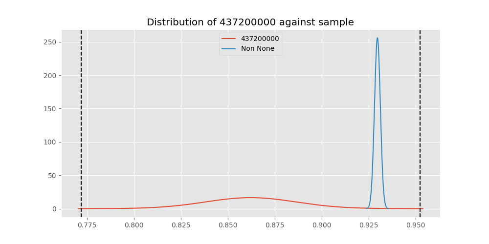 
Out of 44 tests, there were 29 rejections from 44 independent-t test.
Out of 44 tests, there were 27 rejections from 44 Man Whitney u-tests.
## Testing Results for 437200000 against 436501000 
437200000 has a success rate of 0.8620689655172413
436501000 has a success rate of 0.9854014598540146
$H_{0}$: There is not a difference between 437200000 and 436501000
$H_{A}$: There is a difference between 437200000 and 436501000
An $/alpha$ of 0.00025 was used in this test.
__independent t-testing__: With a t-statistic of -4.680224674516503 and a p-value of 4.551984041396157e-06, _we **reject** the null hypothssis_
__Man-Whitney testing__: With a u-statistic of 12190.5 and a p-value of 8.647642209960529e-05, _we **reject** the null hypothssis_
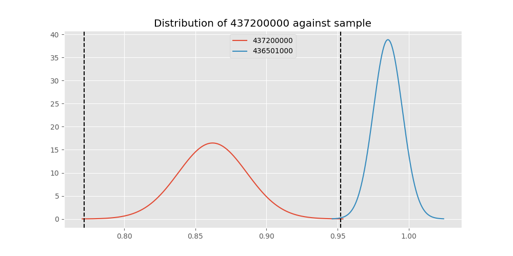 
## Testing Results for 437200000 against 437375000 
437200000 has a success rate of 0.8620689655172413
437375000 has a success rate of 0.9982014388489209
$H_{0}$: There is not a difference between 437200000 and 437375000
$H_{A}$: There is a difference between 437200000 and 437375000
An $/alpha$ of 0.00025 was used in this test.
__independent t-testing__: With a t-statistic of -5.5955834609108726 and a p-value of 7.016490377080048e-08, _we **reject** the null hypothssis_
__Man-Whitney testing__: With a u-statistic of 48751.5 and a p-value of 4.993265682026739e-18, _we **reject** the null hypothssis_
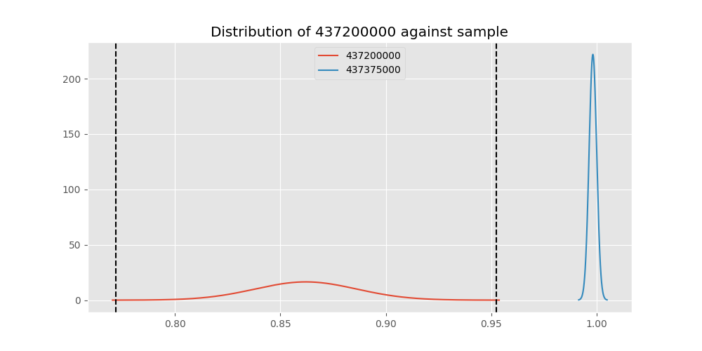 
## Testing Results for 437200000 against 436500000 
437200000 has a success rate of 0.8620689655172413
436500000 has a success rate of 0.9056603773584906
$H_{0}$: There is not a difference between 437200000 and 436500000
$H_{A}$: There is a difference between 437200000 and 436500000
An $/alpha$ of 0.00025 was used in this test.
__independent t-testing__: With a t-statistic of -1.2715759628831493 and a p-value of 0.20434470283986736, _we failed to reject the null hypothssis_
__Man-Whitney testing__: With a u-statistic of 15435.0 and a p-value of 0.204231465350036, _we failed to reject the null hypothssis_
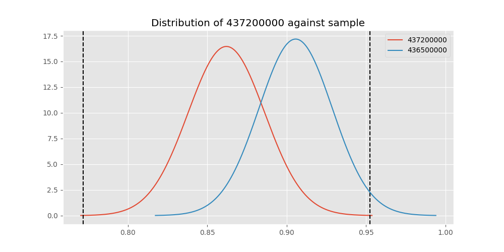 
## Testing Results for 437200000 against 436990000 
437200000 has a success rate of 0.8620689655172413
436990000 has a success rate of 0.9572649572649573
$H_{0}$: There is not a difference between 437200000 and 436990000
$H_{A}$: There is a difference between 437200000 and 436990000
An $/alpha$ of 0.00025 was used in this test.
__independent t-testing__: With a t-statistic of -3.565294457723377 and a p-value of 0.00040374422862664533, _we failed to reject the null hypothssis_
__Man-Whitney testing__: With a u-statistic of 21490.0 and a p-value of 0.0004355067106796431, _we failed to reject the null hypothssis_
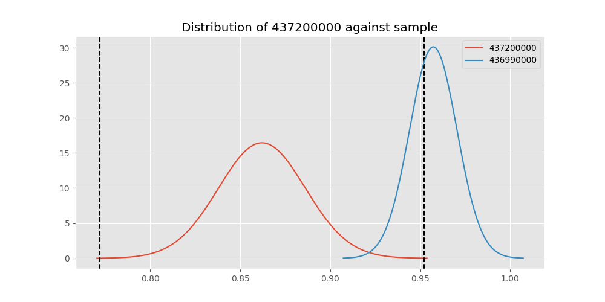 
## Testing Results for 437200000 against 145875000 
437200000 has a success rate of 0.8620689655172413
145875000 has a success rate of 0.9722222222222222
$H_{0}$: There is not a difference between 437200000 and 145875000
$H_{A}$: There is a difference between 437200000 and 145875000
An $/alpha$ of 0.00025 was used in this test.
__independent t-testing__: With a t-statistic of -3.5386095798896036 and a p-value of 0.0004793861317993226, _we failed to reject the null hypothssis_
__Man-Whitney testing__: With a u-statistic of 6503.0 and a p-value of 0.010180232659663528, _we failed to reject the null hypothssis_
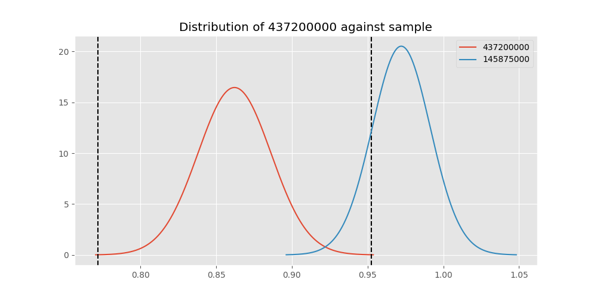 
## Testing Results for 437200000 against 437800000 
437200000 has a success rate of 0.8620689655172413
437800000 has a success rate of 0.9533678756476683
$H_{0}$: There is not a difference between 437200000 and 437800000
$H_{A}$: There is a difference between 437200000 and 437800000
An $/alpha$ of 0.00025 was used in this test.
__independent t-testing__: With a t-statistic of -3.151358452888868 and a p-value of 0.001749345367352633, _we failed to reject the null hypothssis_
__Man-Whitney testing__: With a u-statistic of 17801.0 and a p-value of 0.0018366219343093834, _we failed to reject the null hypothssis_
 
## Testing Results for 437200000 against 145810000 
437200000 has a success rate of 0.8620689655172413
145810000 has a success rate of 0.12179487179487179
$H_{0}$: There is not a difference between 437200000 and 145810000
$H_{A}$: There is a difference between 437200000 and 145810000
An $/alpha$ of 0.00025 was used in this test.
__independent t-testing__: With a t-statistic of 20.56046288747958 and a p-value of 1.571061578115103e-62, _we **reject** the null hypothssis_
__Man-Whitney testing__: With a u-statistic of 27555.5 and a p-value of 4.1043235872361885e-44, _we **reject** the null hypothssis_
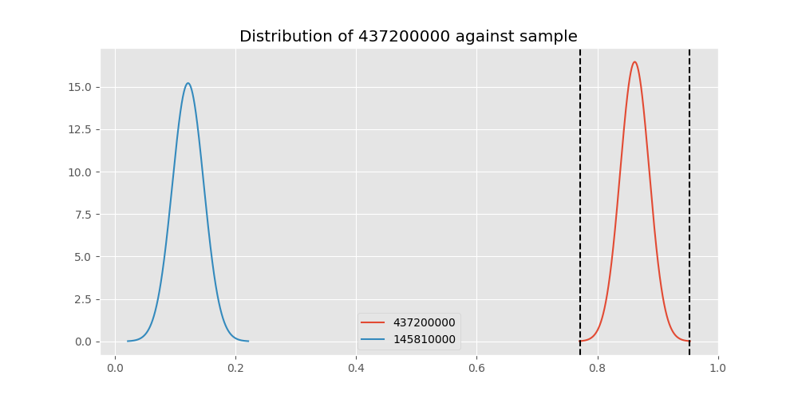 
## Testing Results for 437200000 against 437095000 
437200000 has a success rate of 0.8620689655172413
437095000 has a success rate of 0.9361702127659575
$H_{0}$: There is not a difference between 437200000 and 437095000
$H_{A}$: There is a difference between 437200000 and 437095000
An $/alpha$ of 0.00025 was used in this test.
__independent t-testing__: With a t-statistic of -1.3887612497316684 and a p-value of 0.1661512919934267, _we failed to reject the null hypothssis_
__Man-Whitney testing__: With a u-statistic of 4417.0 and a p-value of 0.16629168416073992, _we failed to reject the null hypothssis_
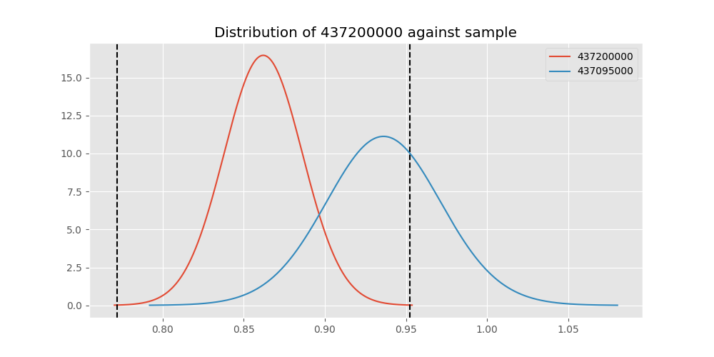 
## Testing Results for 437200000 against 437265000 
437200000 has a success rate of 0.8620689655172413
437265000 has a success rate of 0.9795454545454545
$H_{0}$: There is not a difference between 437200000 and 437265000
$H_{A}$: There is a difference between 437200000 and 437265000
An $/alpha$ of 0.00025 was used in this test.
__independent t-testing__: With a t-statistic of -4.664541560828048 and a p-value of 5.204512359949382e-06, _we **reject** the null hypothssis_
__Man-Whitney testing__: With a u-statistic of 39413.5 and a p-value of 2.843612604377922e-09, _we **reject** the null hypothssis_
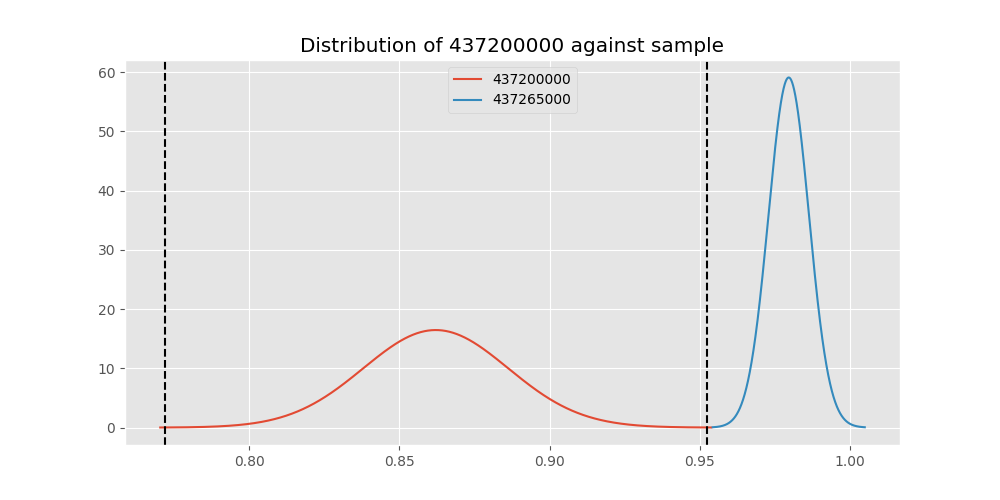 
## Testing Results for 437200000 against 437350000 
437200000 has a success rate of 0.8620689655172413
437350000 has a success rate of 0.9488372093023256
$H_{0}$: There is not a difference between 437200000 and 437350000
$H_{A}$: There is a difference between 437200000 and 437350000
An $/alpha$ of 0.00025 was used in this test.
__independent t-testing__: With a t-statistic of -3.075421207599882 and a p-value of 0.0022407298282017887, _we failed to reject the null hypothssis_
__Man-Whitney testing__: With a u-statistic of 19929.0 and a p-value of 0.002335376549475506, _we failed to reject the null hypothssis_
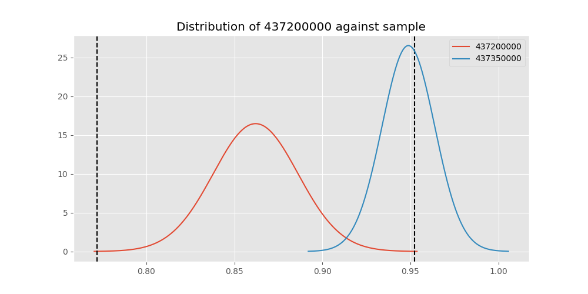 
## Testing Results for 437200000 against 435600000 
437200000 has a success rate of 0.8620689655172413
435600000 has a success rate of 0.9819341126461212
$H_{0}$: There is not a difference between 437200000 and 435600000
$H_{A}$: There is a difference between 437200000 and 435600000
An $/alpha$ of 0.00025 was used in this test.
__independent t-testing__: With a t-statistic of -4.863110849510374 and a p-value of 2.2296850217670203e-06, _we **reject** the null hypothssis_
__Man-Whitney testing__: With a u-statistic of 84063.0 and a p-value of 1.6647768792484853e-15, _we **reject** the null hypothssis_
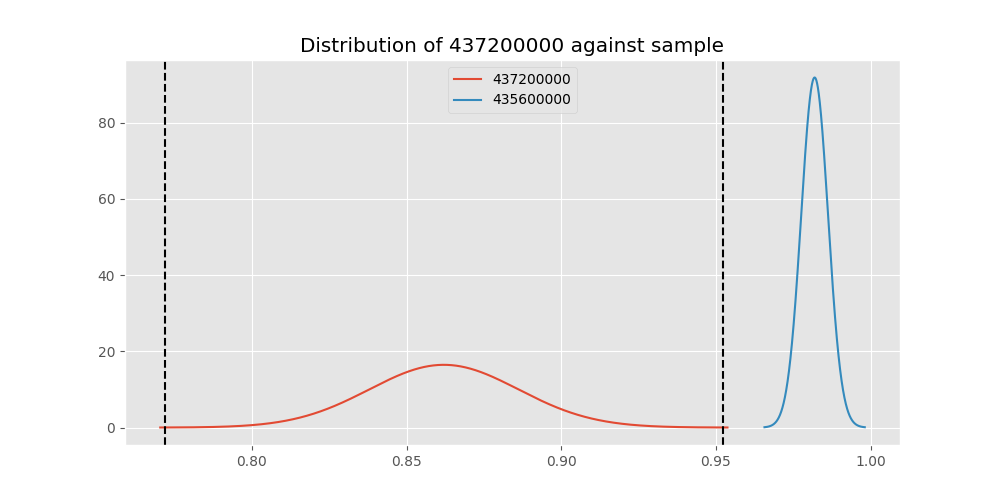 
## Testing Results for 437200000 against 450000000 
437200000 has a success rate of 0.8620689655172413
450000000 has a success rate of 0.8235294117647058
$H_{0}$: There is not a difference between 437200000 and 450000000
$H_{A}$: There is a difference between 437200000 and 450000000
An $/alpha$ of 0.00025 was used in this test.
__independent t-testing__: With a t-statistic of 0.835139094120445 and a p-value of 0.40433648831829705, _we failed to reject the null hypothssis_
__Man-Whitney testing__: With a u-statistic of 8960.0 and a p-value of 0.40409892966142136, _we failed to reject the null hypothssis_
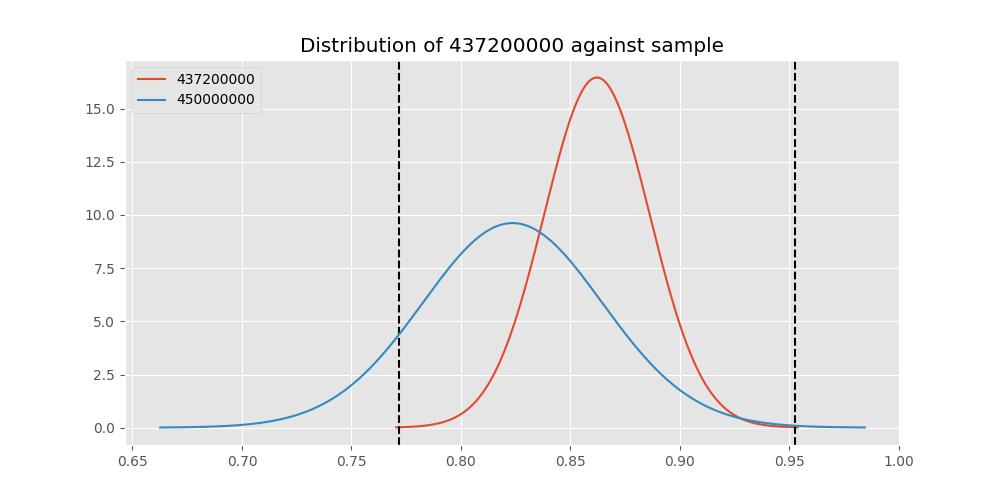 
## Testing Results for 437200000 against 145978500 
437200000 has a success rate of 0.8620689655172413
145978500 has a success rate of 0.9963636363636363
$H_{0}$: There is not a difference between 437200000 and 145978500
$H_{A}$: There is a difference between 437200000 and 145978500
An $/alpha$ of 0.00025 was used in this test.
__independent t-testing__: With a t-statistic of -5.4740467862040205 and a p-value of 1.2417714133742978e-07, _we **reject** the null hypothssis_
__Man-Whitney testing__: With a u-statistic of 24164.0 and a p-value of 1.2610193452534125e-09, _we **reject** the null hypothssis_
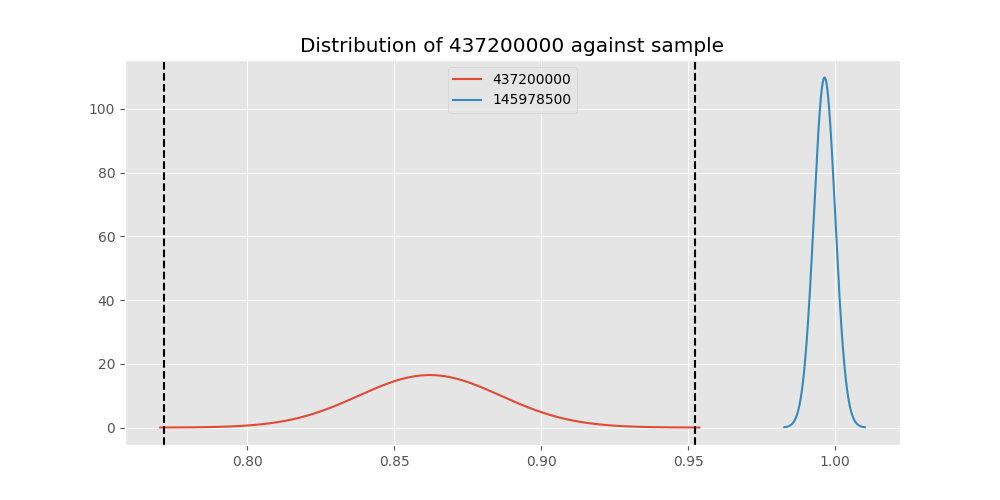 
## Testing Results for 437200000 against 437050000 
437200000 has a success rate of 0.8620689655172413
437050000 has a success rate of 0.5346534653465347
$H_{0}$: There is not a difference between 437200000 and 437050000
$H_{A}$: There is a difference between 437200000 and 437050000
An $/alpha$ of 0.00025 was used in this test.
__independent t-testing__: With a t-statistic of 6.65730005397491 and a p-value of 1.314543997085822e-10, _we **reject** the null hypothssis_
__Man-Whitney testing__: With a u-statistic of 13608.0 and a p-value of 4.781849113231541e-10, _we **reject** the null hypothssis_
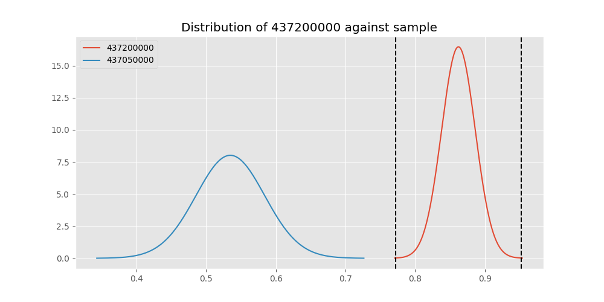 
## Testing Results for 437200000 against 435300000 
437200000 has a success rate of 0.8620689655172413
435300000 has a success rate of 0.1232876712328767
$H_{0}$: There is not a difference between 437200000 and 435300000
$H_{A}$: There is a difference between 437200000 and 435300000
An $/alpha$ of 0.00025 was used in this test.
__independent t-testing__: With a t-statistic of 20.072611482941205 and a p-value of 4.993464934766327e-60, _we **reject** the null hypothssis_
__Man-Whitney testing__: With a u-statistic of 25767.0 and a p-value of 1.468582048117903e-42, _we **reject** the null hypothssis_
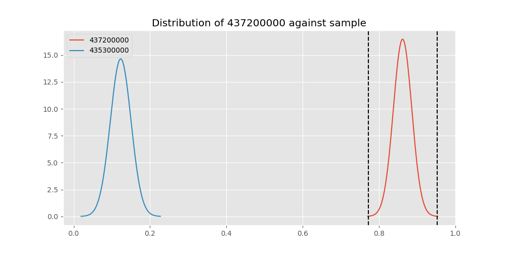 
## Testing Results for 437200000 against 437475000 
437200000 has a success rate of 0.8620689655172413
437475000 has a success rate of 0.5045045045045045
$H_{0}$: There is not a difference between 437200000 and 437475000
$H_{A}$: There is a difference between 437200000 and 437475000
An $/alpha$ of 0.00025 was used in this test.
__independent t-testing__: With a t-statistic of 9.391732447981731 and a p-value of 6.795626343972729e-20, _we **reject** the null hypothssis_
__Man-Whitney testing__: With a u-statistic of 76475.0 and a p-value of 5.936347179356929e-19, _we **reject** the null hypothssis_
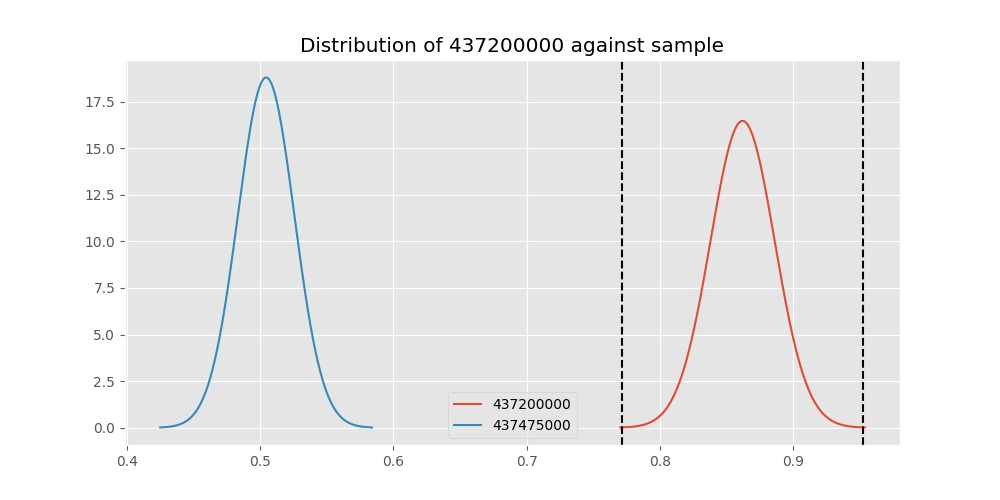 
## Testing Results for 437200000 against 435448000 
437200000 has a success rate of 0.8620689655172413
435448000 has a success rate of 0.975
$H_{0}$: There is not a difference between 437200000 and 435448000
$H_{A}$: There is a difference between 437200000 and 435448000
An $/alpha$ of 0.00025 was used in this test.
__independent t-testing__: With a t-statistic of -3.2416615584378934 and a p-value of 0.001521931881602099, _we failed to reject the null hypothssis_
__Man-Whitney testing__: With a u-statistic of 3601.5 and a p-value of 0.04471430020762128, _we failed to reject the null hypothssis_
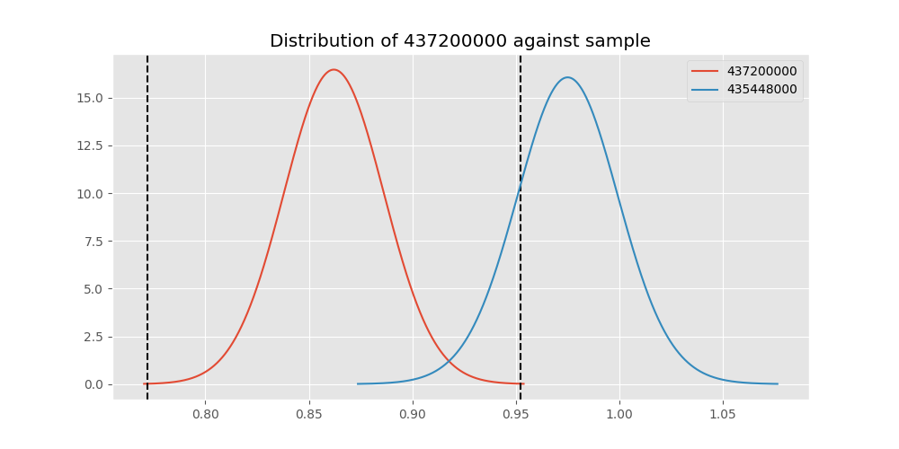 
## Testing Results for 437200000 against 437644000 
437200000 has a success rate of 0.8620689655172413
437644000 has a success rate of 0.9743589743589743
$H_{0}$: There is not a difference between 437200000 and 437644000
$H_{A}$: There is a difference between 437200000 and 437644000
An $/alpha$ of 0.00025 was used in this test.
__independent t-testing__: With a t-statistic of -3.9601154230135864 and a p-value of 9.325870141850837e-05, _we **reject** the null hypothssis_
__Man-Whitney testing__: With a u-statistic of 10542.0 and a p-value of 0.001097503272416158, _we failed to reject the null hypothssis_
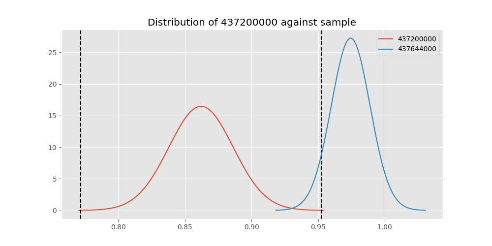 
## Testing Results for 437200000 against 145825000 
437200000 has a success rate of 0.8620689655172413
145825000 has a success rate of 0.8687448728465955
$H_{0}$: There is not a difference between 437200000 and 145825000
$H_{A}$: There is a difference between 437200000 and 145825000
An $/alpha$ of 0.00025 was used in this test.
__independent t-testing__: With a t-statistic of -0.27009044304043855 and a p-value of 0.7871117930006595, _we failed to reject the null hypothssis_
__Man-Whitney testing__: With a u-statistic of 245805.0 and a p-value of 0.7871170820255239, _we failed to reject the null hypothssis_
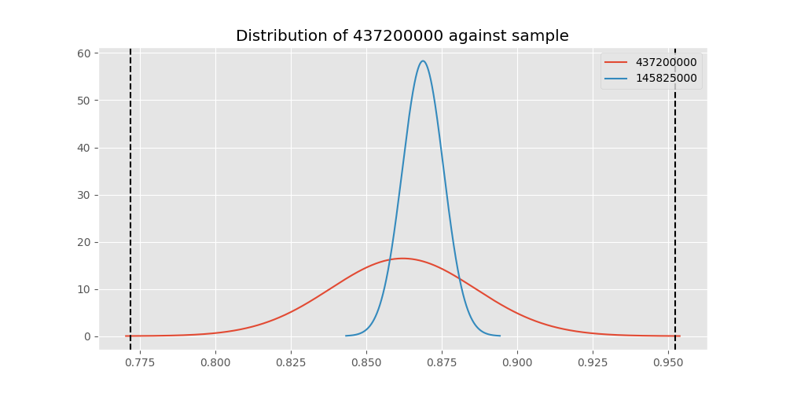 
## Testing Results for 437200000 against 437345000 
437200000 has a success rate of 0.8620689655172413
437345000 has a success rate of 0.7603092783505154
$H_{0}$: There is not a difference between 437200000 and 437345000
$H_{A}$: There is a difference between 437200000 and 437345000
An $/alpha$ of 0.00025 was used in this test.
__independent t-testing__: With a t-statistic of 2.9274700002769425 and a p-value of 0.0035492800874471217, _we failed to reject the null hypothssis_
__Man-Whitney testing__: With a u-statistic of 43389.5 and a p-value of 0.00363161110084039, _we failed to reject the null hypothssis_
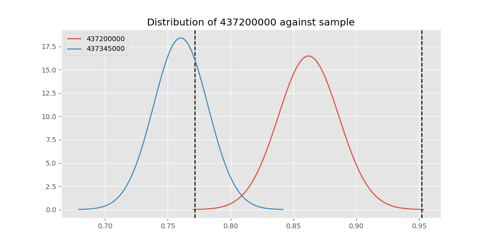 
## Testing Results for 437200000 against 435275000 
437200000 has a success rate of 0.8620689655172413
435275000 has a success rate of 0.9152542372881356
$H_{0}$: There is not a difference between 437200000 and 435275000
$H_{A}$: There is a difference between 437200000 and 435275000
An $/alpha$ of 0.00025 was used in this test.
__independent t-testing__: With a t-statistic of -1.4222084189393236 and a p-value of 0.1559427844245209, _we failed to reject the null hypothssis_
__Man-Whitney testing__: With a u-statistic of 11340.0 and a p-value of 0.15594954500068345, _we failed to reject the null hypothssis_
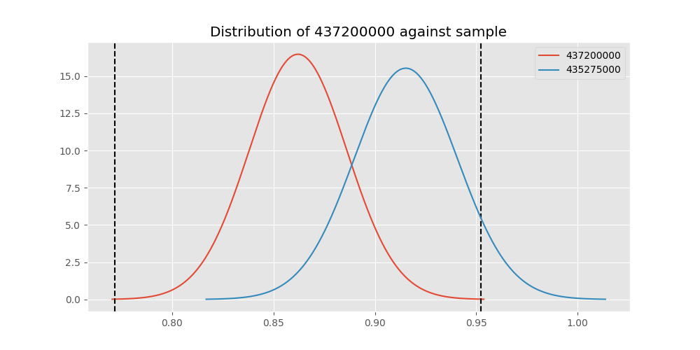 
## Testing Results for 437200000 against 437322500 
437200000 has a success rate of 0.8620689655172413
437322500 has a success rate of 0.9961685823754789
$H_{0}$: There is not a difference between 437200000 and 437322500
$H_{A}$: There is a difference between 437200000 and 437322500
An $/alpha$ of 0.00025 was used in this test.
__independent t-testing__: With a t-statistic of -5.4594936419330065 and a p-value of 1.328390572029961e-07, _we **reject** the null hypothssis_
__Man-Whitney testing__: With a u-statistic of 22939.0 and a p-value of 3.366643826701589e-09, _we **reject** the null hypothssis_
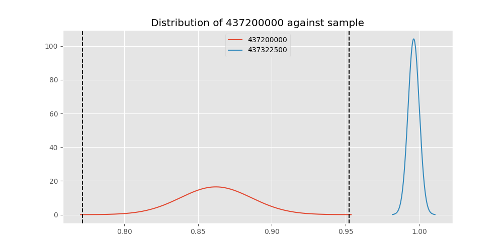 
## Testing Results for 437200000 against 437450000 
437200000 has a success rate of 0.8620689655172413
437450000 has a success rate of 0.6947791164658634
$H_{0}$: There is not a difference between 437200000 and 437450000
$H_{A}$: There is a difference between 437200000 and 437450000
An $/alpha$ of 0.00025 was used in this test.
__independent t-testing__: With a t-statistic of 4.278337112721424 and a p-value of 2.3016495330479325e-05, _we **reject** the null hypothssis_
__Man-Whitney testing__: With a u-statistic of 29501.5 and a p-value of 2.6921984419367734e-05, _we **reject** the null hypothssis_
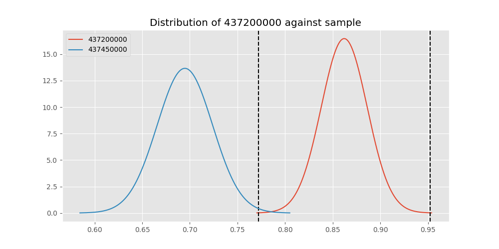 
## Testing Results for 437200000 against 436703000 
437200000 has a success rate of 0.8620689655172413
436703000 has a success rate of 0.9859154929577465
$H_{0}$: There is not a difference between 437200000 and 436703000
$H_{A}$: There is a difference between 437200000 and 436703000
An $/alpha$ of 0.00025 was used in this test.
__independent t-testing__: With a t-statistic of -4.842247486771703 and a p-value of 2.2681430347469937e-06, _we **reject** the null hypothssis_
__Man-Whitney testing__: With a u-statistic of 18942.0 and a p-value of 1.576864316088934e-06, _we **reject** the null hypothssis_
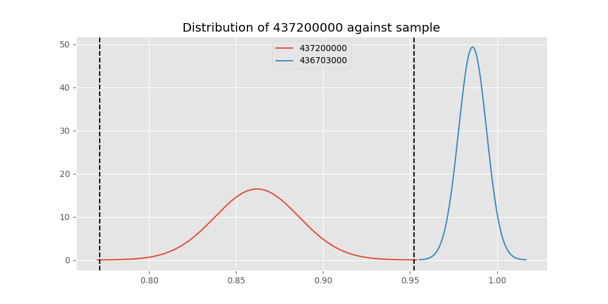 
## Testing Results for 437200000 against 400500000 
437200000 has a success rate of 0.8620689655172413
400500000 has a success rate of 0.3508771929824561
$H_{0}$: There is not a difference between 437200000 and 400500000
$H_{A}$: There is a difference between 437200000 and 400500000
An $/alpha$ of 0.00025 was used in this test.
__independent t-testing__: With a t-statistic of 8.990549416668555 and a p-value of 5.4078153997723033e-17, _we **reject** the null hypothssis_
__Man-Whitney testing__: With a u-statistic of 8743.0 and a p-value of 3.8696158753650256e-15, _we **reject** the null hypothssis_
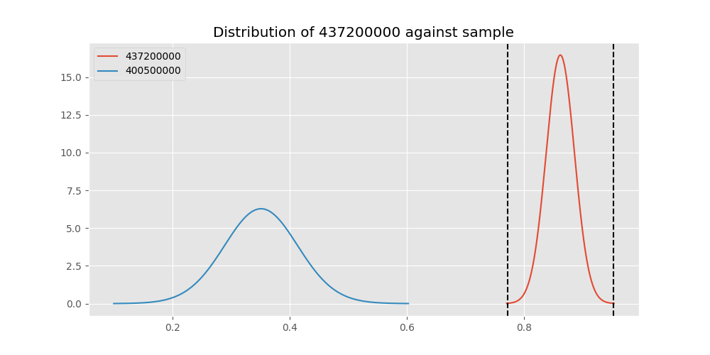 
## Testing Results for 437200000 against 437150000 
437200000 has a success rate of 0.8620689655172413
437150000 has a success rate of 0.9859550561797753
$H_{0}$: There is not a difference between 437200000 and 437150000
$H_{A}$: There is a difference between 437200000 and 437150000
An $/alpha$ of 0.00025 was used in this test.
__independent t-testing__: With a t-statistic of -4.9449656994556275 and a p-value of 1.472603168653039e-06, _we **reject** the null hypothssis_
__Man-Whitney testing__: With a u-statistic of 31657.5 and a p-value of 2.364556328796892e-09, _we **reject** the null hypothssis_
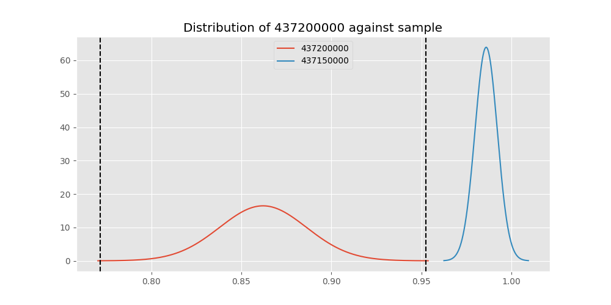 
## Testing Results for 437200000 against 435635000 
437200000 has a success rate of 0.8620689655172413
435635000 has a success rate of 0.9849624060150376
$H_{0}$: There is not a difference between 437200000 and 435635000
$H_{A}$: There is a difference between 437200000 and 435635000
An $/alpha$ of 0.00025 was used in this test.
__independent t-testing__: With a t-statistic of -4.642111420693607 and a p-value of 5.376872067208504e-06, _we **reject** the null hypothssis_
__Man-Whitney testing__: With a u-statistic of 11840.5 and a p-value of 0.00011510833123504666, _we **reject** the null hypothssis_
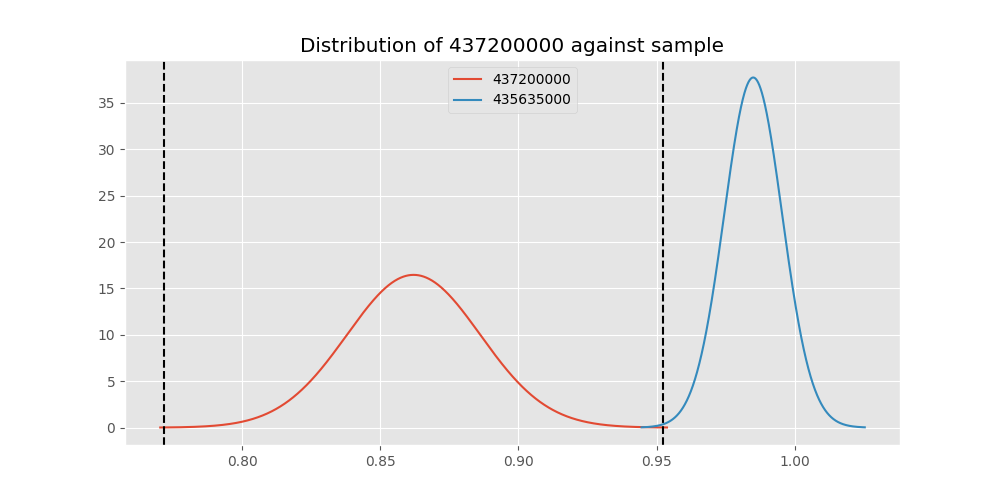 
## Testing Results for 437200000 against 437384000 
437200000 has a success rate of 0.8620689655172413
437384000 has a success rate of 0.968421052631579
$H_{0}$: There is not a difference between 437200000 and 437384000
$H_{A}$: There is a difference between 437200000 and 437384000
An $/alpha$ of 0.00025 was used in this test.
__independent t-testing__: With a t-statistic of -3.8069371919588297 and a p-value of 0.00016328191057354667, _we **reject** the null hypothssis_
__Man-Whitney testing__: With a u-statistic of 17234.0 and a p-value of 0.0001824518683098028, _we **reject** the null hypothssis_
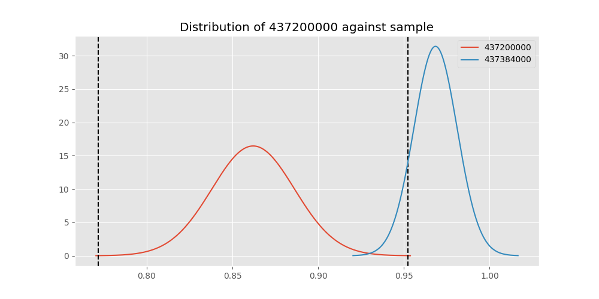 
## Testing Results for 437200000 against 437405000 
437200000 has a success rate of 0.8620689655172413
437405000 has a success rate of 0.9953917050691244
$H_{0}$: There is not a difference between 437200000 and 437405000
$H_{A}$: There is a difference between 437200000 and 437405000
An $/alpha$ of 0.00025 was used in this test.
__independent t-testing__: With a t-statistic of -5.398609805022009 and a p-value of 1.7589201736807296e-07, _we **reject** the null hypothssis_
__Man-Whitney testing__: With a u-statistic of 19089.0 and a p-value of 7.528158686796805e-08, _we **reject** the null hypothssis_
 
## Testing Results for 437200000 against 435612500 
437200000 has a success rate of 0.8620689655172413
435612500 has a success rate of 0.9770114942528736
$H_{0}$: There is not a difference between 437200000 and 435612500
$H_{A}$: There is a difference between 437200000 and 435612500
An $/alpha$ of 0.00025 was used in this test.
__independent t-testing__: With a t-statistic of -3.9429437078442984 and a p-value of 0.00010113508938972838, _we **reject** the null hypothssis_
__Man-Whitney testing__: With a u-statistic of 7815.5 and a p-value of 0.003294425242739426, _we failed to reject the null hypothssis_
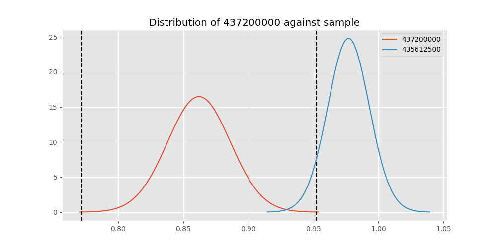 
## Testing Results for 437200000 against 435975000 
437200000 has a success rate of 0.8620689655172413
435975000 has a success rate of 0.92
$H_{0}$: There is not a difference between 437200000 and 435975000
$H_{A}$: There is a difference between 437200000 and 435975000
An $/alpha$ of 0.00025 was used in this test.
__independent t-testing__: With a t-statistic of -1.1021951408432547 and a p-value of 0.271432569920608, _we failed to reject the null hypothssis_
__Man-Whitney testing__: With a u-statistic of 4781.0 and a p-value of 0.271396638277964, _we failed to reject the null hypothssis_
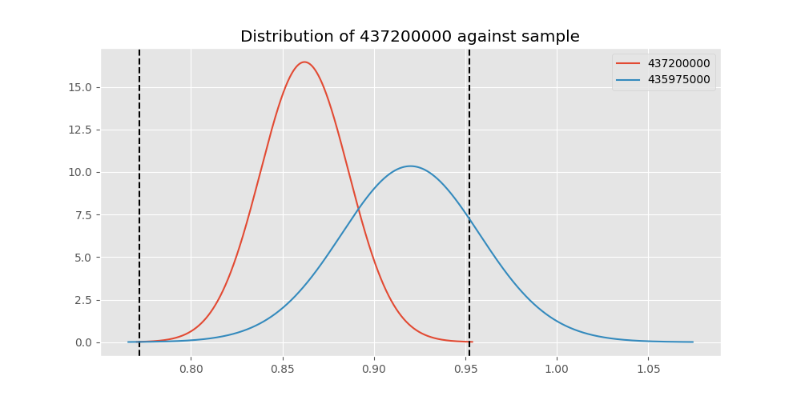 
## Testing Results for 437200000 against 437425000 
437200000 has a success rate of 0.8620689655172413
437425000 has a success rate of 0.6987654320987654
$H_{0}$: There is not a difference between 437200000 and 437425000
$H_{A}$: There is a difference between 437200000 and 437425000
An $/alpha$ of 0.00025 was used in this test.
__independent t-testing__: With a t-statistic of 4.46963599701566 and a p-value of 9.352820627494394e-06, _we **reject** the null hypothssis_
__Man-Whitney testing__: With a u-statistic of 47820.5 and a p-value of 1.0773615339423384e-05, _we **reject** the null hypothssis_
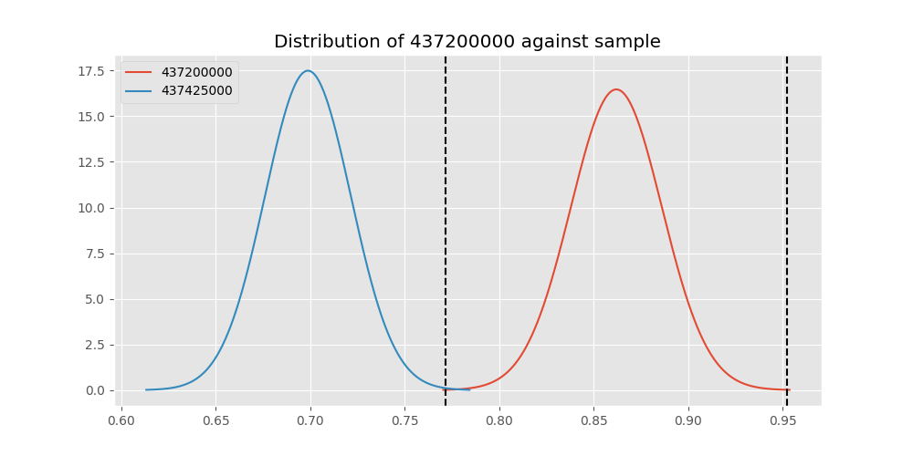 
## Testing Results for 437200000 against 437275000 
437200000 has a success rate of 0.8620689655172413
437275000 has a success rate of 0.3643724696356275
$H_{0}$: There is not a difference between 437200000 and 437275000
$H_{A}$: There is a difference between 437200000 and 437275000
An $/alpha$ of 0.00025 was used in this test.
__independent t-testing__: With a t-statistic of 12.329060259940663 and a p-value of 2.82405697308823e-30, _we **reject** the null hypothssis_
__Man-Whitney testing__: With a u-statistic of 37548.0 and a p-value of 1.485094559513041e-26, _we **reject** the null hypothssis_
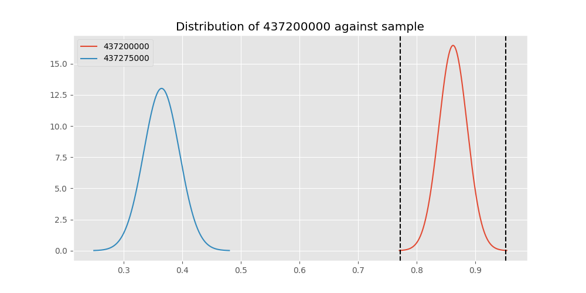 
## Testing Results for 437200000 against 145840000 
437200000 has a success rate of 0.8620689655172413
145840000 has a success rate of 0.9649122807017544
$H_{0}$: There is not a difference between 437200000 and 145840000
$H_{A}$: There is a difference between 437200000 and 145840000
An $/alpha$ of 0.00025 was used in this test.
__independent t-testing__: With a t-statistic of -2.1584046767283414 and a p-value of 0.0318189858611384, _we failed to reject the null hypothssis_
__Man-Whitney testing__: With a u-statistic of 5190.5 and a p-value of 0.0322322823868781, _we failed to reject the null hypothssis_
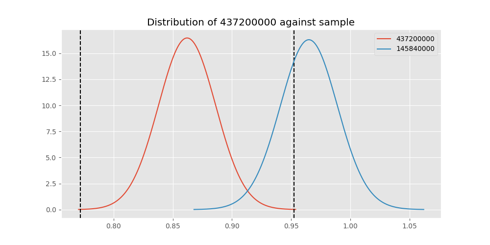 
## Testing Results for 437200000 against 435525000 
437200000 has a success rate of 0.8620689655172413
435525000 has a success rate of 0.6923076923076923
$H_{0}$: There is not a difference between 437200000 and 435525000
$H_{A}$: There is a difference between 437200000 and 435525000
An $/alpha$ of 0.00025 was used in this test.
__independent t-testing__: With a t-statistic of 3.9030275953421714 and a p-value of 0.00011430495287710721, _we **reject** the null hypothssis_
__Man-Whitney testing__: With a u-statistic of 16978.5 and a p-value of 0.00013122577531107774, _we **reject** the null hypothssis_
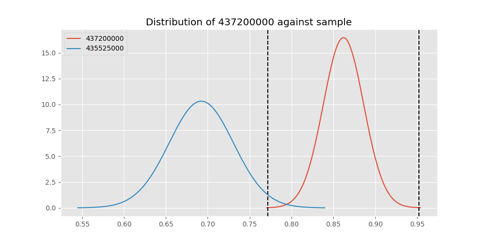 
## Testing Results for 437200000 against 436250000 
437200000 has a success rate of 0.8620689655172413
436250000 has a success rate of 0.17857142857142858
$H_{0}$: There is not a difference between 437200000 and 436250000
$H_{A}$: There is a difference between 437200000 and 436250000
An $/alpha$ of 0.00025 was used in this test.
__independent t-testing__: With a t-statistic of 12.762731837019137 and a p-value of 3.1872279071004156e-29, _we **reject** the null hypothssis_
__Man-Whitney testing__: With a u-statistic of 9569.0 and a p-value of 1.478162287366265e-23, _we **reject** the null hypothssis_
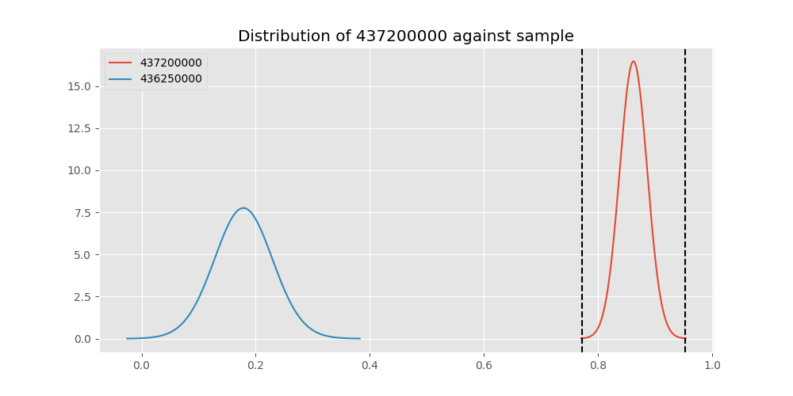 
## Testing Results for 437200000 against 435950000 
437200000 has a success rate of 0.8620689655172413
435950000 has a success rate of 0.9850187265917603
$H_{0}$: There is not a difference between 437200000 and 435950000
$H_{A}$: There is a difference between 437200000 and 435950000
An $/alpha$ of 0.00025 was used in this test.
__independent t-testing__: With a t-statistic of -4.95245965972693 and a p-value of 1.453755919829557e-06, _we **reject** the null hypothssis_
__Man-Whitney testing__: With a u-statistic of 47537.0 and a p-value of 4.7579846591046e-12, _we **reject** the null hypothssis_
 
## Testing Results for 437200000 against 435800000 
437200000 has a success rate of 0.8620689655172413
435800000 has a success rate of 0.5390070921985816
$H_{0}$: There is not a difference between 437200000 and 435800000
$H_{A}$: There is a difference between 437200000 and 435800000
An $/alpha$ of 0.00025 was used in this test.
__independent t-testing__: With a t-statistic of 7.0845762917052815 and a p-value of 8.001249931495964e-12, _we **reject** the null hypothssis_
__Man-Whitney testing__: With a u-statistic of 18935.0 and a p-value of 3.479964126663044e-11, _we **reject** the null hypothssis_
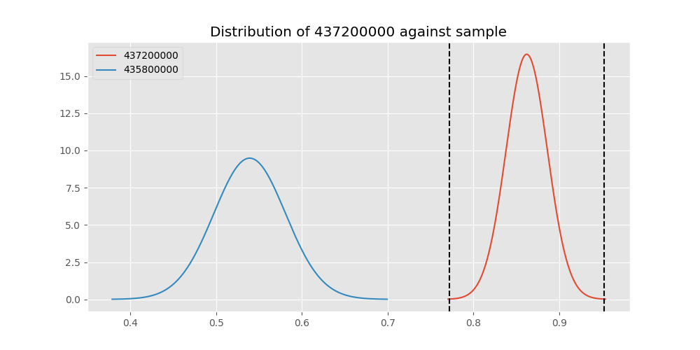 
## Testing Results for 437200000 against 437485000 
437200000 has a success rate of 0.8620689655172413
437485000 has a success rate of 0.9375
$H_{0}$: There is not a difference between 437200000 and 437485000
$H_{A}$: There is a difference between 437200000 and 437485000
An $/alpha$ of 0.00025 was used in this test.
__independent t-testing__: With a t-statistic of -1.186922756511447 and a p-value of 0.2364668194510912, _we failed to reject the null hypothssis_
__Man-Whitney testing__: With a u-statistic of 3003.0 and a p-value of 0.23662404273029347, _we failed to reject the null hypothssis_
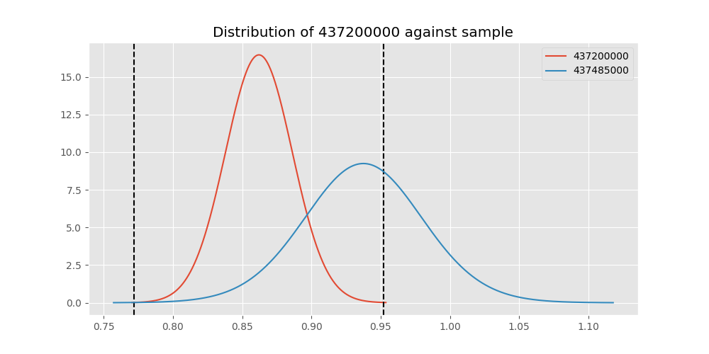 
## Testing Results for 437200000 against 136770000 
437200000 has a success rate of 0.8620689655172413
136770000 has a success rate of 0.9945945945945946
$H_{0}$: There is not a difference between 437200000 and 136770000
$H_{A}$: There is a difference between 437200000 and 136770000
An $/alpha$ of 0.00025 was used in this test.
__independent t-testing__: With a t-statistic of -5.331556668460122 and a p-value of 2.391589446794905e-07, _we **reject** the null hypothssis_
__Man-Whitney testing__: With a u-statistic of 16289.0 and a p-value of 7.399408588091401e-07, _we **reject** the null hypothssis_
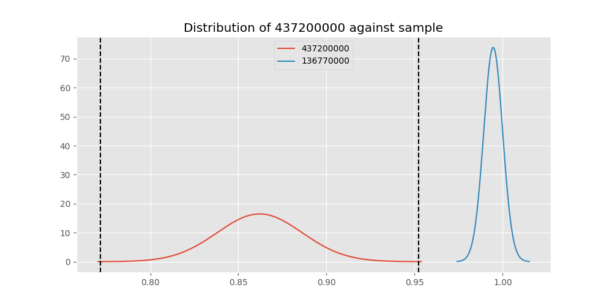 
## Testing Results for 437200000 against 437250000 
437200000 has a success rate of 0.8620689655172413
437250000 has a success rate of 0.9937106918238994
$H_{0}$: There is not a difference between 437200000 and 437250000
$H_{A}$: There is a difference between 437200000 and 437250000
An $/alpha$ of 0.00025 was used in this test.
__independent t-testing__: With a t-statistic of -5.337200673111924 and a p-value of 2.384235521350525e-07, _we **reject** the null hypothssis_
__Man-Whitney testing__: With a u-statistic of 28028.0 and a p-value of 3.3095043572670723e-10, _we **reject** the null hypothssis_
 
## Testing Results for 437200000 against 437356000 
437200000 has a success rate of 0.8620689655172413
437356000 has a success rate of 0.9328358208955224
$H_{0}$: There is not a difference between 437200000 and 437356000
$H_{A}$: There is a difference between 437200000 and 437356000
An $/alpha$ of 0.00025 was used in this test.
__independent t-testing__: With a t-statistic of -2.0401997300615804 and a p-value of 0.04211430189359251, _we failed to reject the null hypothssis_
__Man-Whitney testing__: With a u-statistic of 12638.5 and a p-value of 0.04239610023486222, _we failed to reject the null hypothssis_
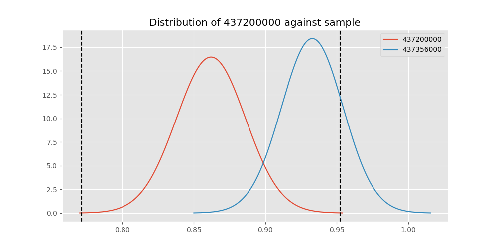 
## Testing Results for 437200000 against 437676000 
437200000 has a success rate of 0.8620689655172413
437676000 has a success rate of 0.9813432835820896
$H_{0}$: There is not a difference between 437200000 and 437676000
$H_{A}$: There is a difference between 437200000 and 437676000
An $/alpha$ of 0.00025 was used in this test.
__independent t-testing__: With a t-statistic of -4.652571082052744 and a p-value of 5.326233413027032e-06, _we **reject** the null hypothssis_
__Man-Whitney testing__: With a u-statistic of 23957.5 and a p-value of 5.278115186453163e-07, _we **reject** the null hypothssis_
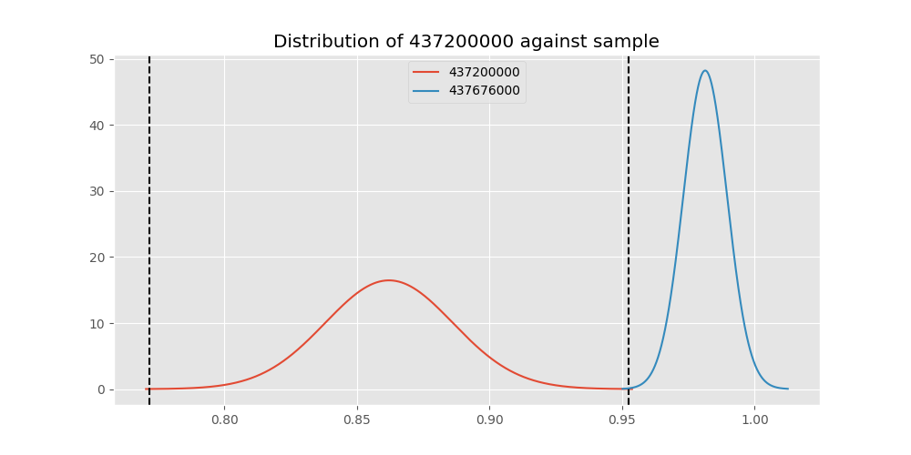 
## Testing Results for 437200000 against 145826800 
437200000 has a success rate of 0.8620689655172413
145826800 has a success rate of 0.966183574879227
$H_{0}$: There is not a difference between 437200000 and 145826800
$H_{A}$: There is a difference between 437200000 and 145826800
An $/alpha$ of 0.00025 was used in this test.
__independent t-testing__: With a t-statistic of -3.82996877762101 and a p-value of 0.00014831107355755304, _we **reject** the null hypothssis_
__Man-Whitney testing__: With a u-statistic of 18823.0 and a p-value of 0.00016543937746847268, _we **reject** the null hypothssis_
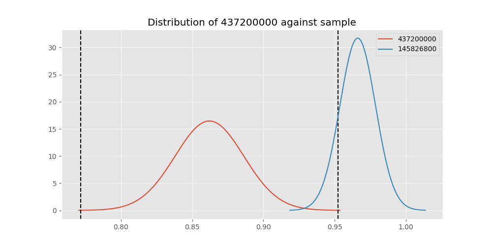 
