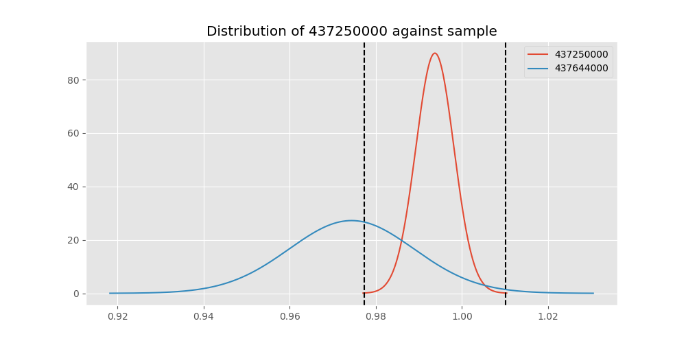

# Testing Results For 437250000 
$H_{0}$: There is not a difference in collection success against 437250000 
$H_{A}$: There is a difference in collection success against 437250000
An $\alpha$ of 0.00025 was used 
Out of 44 tests, there were 19 rejections from 44 independent-t test.
Out of 44 tests, there were 19 rejections from 44 Man Whitney u-tests.
## Testing Results for 437250000 against 436501000 
437250000 has a success rate of 0.9937106918238994
436501000 has a success rate of 0.9854014598540146
$H_{0}$: There is not a difference between 437250000 and 436501000
$H_{A}$: There is a difference between 437250000 and 436501000
An $/alpha$ of 0.00025 was used in this test.
__independent t-testing__: With a t-statistic of 0.8698170755396035 and a p-value of 0.3848610298601025, _we failed to reject the null hypothssis_
__Man-Whitney testing__: With a u-statistic of 21964.0 and a p-value of 0.38558766454455173, _we failed to reject the null hypothssis_
 
## Testing Results for 437250000 against 437375000 
437250000 has a success rate of 0.9937106918238994
437375000 has a success rate of 0.9982014388489209
$H_{0}$: There is not a difference between 437250000 and 437375000
$H_{A}$: There is a difference between 437250000 and 437375000
An $/alpha$ of 0.00025 was used in this test.
__independent t-testing__: With a t-statistic of -1.0915775668572505 and a p-value of 0.27532032760637704, _we failed to reject the null hypothssis_
__Man-Whitney testing__: With a u-statistic of 88007.0 and a p-value of 0.2756764937533479, _we failed to reject the null hypothssis_
 
## Testing Results for 437250000 against 436500000 
437250000 has a success rate of 0.9937106918238994
436500000 has a success rate of 0.9056603773584906
$H_{0}$: There is not a difference between 437250000 and 436500000
$H_{A}$: There is a difference between 437250000 and 436500000
An $/alpha$ of 0.00025 was used in this test.
__independent t-testing__: With a t-statistic of 5.006726762089257 and a p-value of 7.816039256503523e-07, _we **reject** the null hypothssis_
__Man-Whitney testing__: With a u-statistic of 27507.0 and a p-value of 1.0413367723490325e-06, _we **reject** the null hypothssis_
 
## Testing Results for 437250000 against 436990000 
437250000 has a success rate of 0.9937106918238994
436990000 has a success rate of 0.9572649572649573
$H_{0}$: There is not a difference between 437250000 and 436990000
$H_{A}$: There is a difference between 437250000 and 436990000
An $/alpha$ of 0.00025 was used in this test.
__independent t-testing__: With a t-statistic of 2.91876918463987 and a p-value of 0.003657997537087769, _we failed to reject the null hypothssis_
__Man-Whitney testing__: With a u-statistic of 38562.0 and a p-value of 0.0037556701622446687, _we failed to reject the null hypothssis_
 
## Testing Results for 437250000 against 145875000 
437250000 has a success rate of 0.9937106918238994
145875000 has a success rate of 0.9722222222222222
$H_{0}$: There is not a difference between 437250000 and 145875000
$H_{A}$: There is a difference between 437250000 and 145875000
An $/alpha$ of 0.00025 was used in this test.
__independent t-testing__: With a t-statistic of 1.6355714050859662 and a p-value of 0.10274024498797175, _we failed to reject the null hypothssis_
__Man-Whitney testing__: With a u-statistic of 11694.0 and a p-value of 0.10336721787194927, _we failed to reject the null hypothssis_
 
## Testing Results for 437250000 against 437800000 
437250000 has a success rate of 0.9937106918238994
437800000 has a success rate of 0.9533678756476683
$H_{0}$: There is not a difference between 437250000 and 437800000
$H_{A}$: There is a difference between 437250000 and 437800000
An $/alpha$ of 0.00025 was used in this test.
__independent t-testing__: With a t-statistic of 3.0684282044259605 and a p-value of 0.002266554172309119, _we failed to reject the null hypothssis_
__Man-Whitney testing__: With a u-statistic of 31925.0 and a p-value of 0.0023486142175666415, _we failed to reject the null hypothssis_
 
## Testing Results for 437250000 against 145810000 
437250000 has a success rate of 0.9937106918238994
145810000 has a success rate of 0.12179487179487179
$H_{0}$: There is not a difference between 437250000 and 145810000
$H_{A}$: There is a difference between 437250000 and 145810000
An $/alpha$ of 0.00025 was used in this test.
__independent t-testing__: With a t-statistic of 44.845770400426744 and a p-value of 2.755509093064073e-172, _we **reject** the null hypothssis_
__Man-Whitney testing__: With a u-statistic of 46431.0 and a p-value of 2.665540102532227e-85, _we **reject** the null hypothssis_
 
## Testing Results for 437250000 against 437095000 
437250000 has a success rate of 0.9937106918238994
437095000 has a success rate of 0.9361702127659575
$H_{0}$: There is not a difference between 437250000 and 437095000
$H_{A}$: There is a difference between 437250000 and 437095000
An $/alpha$ of 0.00025 was used in this test.
__independent t-testing__: With a t-statistic of 3.2033643143620694 and a p-value of 0.0014784488143761332, _we failed to reject the null hypothssis_
__Man-Whitney testing__: With a u-statistic of 7903.0 and a p-value of 0.001579345668989073, _we failed to reject the null hypothssis_
 
## Testing Results for 437250000 against 437265000 
437250000 has a success rate of 0.9937106918238994
437265000 has a success rate of 0.9795454545454545
$H_{0}$: There is not a difference between 437250000 and 437265000
$H_{A}$: There is a difference between 437250000 and 437265000
An $/alpha$ of 0.00025 was used in this test.
__independent t-testing__: With a t-statistic of 1.6099456543741493 and a p-value of 0.10782716236512957, _we failed to reject the null hypothssis_
__Man-Whitney testing__: With a u-statistic of 70951.0 and a p-value of 0.10795698701174036, _we failed to reject the null hypothssis_
 
## Testing Results for 437250000 against 437350000 
437250000 has a success rate of 0.9937106918238994
437350000 has a success rate of 0.9488372093023256
$H_{0}$: There is not a difference between 437250000 and 437350000
$H_{A}$: There is a difference between 437250000 and 437350000
An $/alpha$ of 0.00025 was used in this test.
__independent t-testing__: With a t-statistic of 3.322496079209746 and a p-value of 0.0009536113421360209, _we failed to reject the null hypothssis_
__Man-Whitney testing__: With a u-statistic of 35719.0 and a p-value of 0.0010000530287848268, _we failed to reject the null hypothssis_
 
## Testing Results for 437250000 against 437200000 
437250000 has a success rate of 0.9937106918238994
437200000 has a success rate of 0.8620689655172413
$H_{0}$: There is not a difference between 437250000 and 437200000
$H_{A}$: There is a difference between 437250000 and 437200000
An $/alpha$ of 0.00025 was used in this test.
__independent t-testing__: With a t-statistic of 6.531138390795523 and a p-value of 1.5584350765547474e-10, _we **reject** the null hypothssis_
__Man-Whitney testing__: With a u-statistic of 36526.0 and a p-value of 3.3095043572670723e-10, _we **reject** the null hypothssis_
 
## Testing Results for 437250000 against 435600000 
437250000 has a success rate of 0.9937106918238994
435600000 has a success rate of 0.9819341126461212
$H_{0}$: There is not a difference between 437250000 and 435600000
$H_{A}$: There is a difference between 437250000 and 435600000
An $/alpha$ of 0.00025 was used in this test.
__independent t-testing__: With a t-statistic of 1.4893280306214005 and a p-value of 0.13665185747271472, _we failed to reject the null hypothssis_
__Man-Whitney testing__: With a u-statistic of 151381.0 and a p-value of 0.1367020883065933, _we failed to reject the null hypothssis_
 
## Testing Results for 437250000 against 450000000 
437250000 has a success rate of 0.9937106918238994
450000000 has a success rate of 0.8235294117647058
$H_{0}$: There is not a difference between 437250000 and 450000000
$H_{A}$: There is a difference between 437250000 and 450000000
An $/alpha$ of 0.00025 was used in this test.
__independent t-testing__: With a t-statistic of 7.3701174074563225 and a p-value of 9.825688400956853e-13, _we **reject** the null hypothssis_
__Man-Whitney testing__: With a u-statistic of 15815.0 and a p-value of 4.4014296271285146e-12, _we **reject** the null hypothssis_
 
## Testing Results for 437250000 against 145978500 
437250000 has a success rate of 0.9937106918238994
145978500 has a success rate of 0.9963636363636363
$H_{0}$: There is not a difference between 437250000 and 145978500
$H_{A}$: There is a difference between 437250000 and 145978500
An $/alpha$ of 0.00025 was used in this test.
__independent t-testing__: With a t-statistic of -0.4534095957679015 and a p-value of 0.6504202569856419, _we failed to reject the null hypothssis_
__Man-Whitney testing__: With a u-statistic of 43609.0 and a p-value of 0.6514429991020876, _we failed to reject the null hypothssis_
 
## Testing Results for 437250000 against 437050000 
437250000 has a success rate of 0.9937106918238994
437050000 has a success rate of 0.5346534653465347
$H_{0}$: There is not a difference between 437250000 and 437050000
$H_{A}$: There is a difference between 437250000 and 437050000
An $/alpha$ of 0.00025 was used in this test.
__independent t-testing__: With a t-statistic of 15.761160935429768 and a p-value of 3.072694550739673e-44, _we **reject** the null hypothssis_
__Man-Whitney testing__: With a u-statistic of 23431.0 and a p-value of 8.348602605818352e-36, _we **reject** the null hypothssis_
 
## Testing Results for 437250000 against 435300000 
437250000 has a success rate of 0.9937106918238994
435300000 has a success rate of 0.1232876712328767
$H_{0}$: There is not a difference between 437250000 and 435300000
$H_{A}$: There is a difference between 437250000 and 435300000
An $/alpha$ of 0.00025 was used in this test.
__independent t-testing__: With a t-statistic of 44.397662731174954 and a p-value of 8.75129964312629e-169, _we **reject** the null hypothssis_
__Man-Whitney testing__: With a u-statistic of 43420.0 and a p-value of 1.4746271490529292e-83, _we **reject** the null hypothssis_
 
## Testing Results for 437250000 against 437475000 
437250000 has a success rate of 0.9937106918238994
437475000 has a success rate of 0.5045045045045045
$H_{0}$: There is not a difference between 437250000 and 437475000
$H_{A}$: There is a difference between 437250000 and 437475000
An $/alpha$ of 0.00025 was used in this test.
__independent t-testing__: With a t-statistic of 17.304797820961905 and a p-value of 6.849227407431976e-58, _we **reject** the null hypothssis_
__Man-Whitney testing__: With a u-statistic of 131415.0 and a p-value of 1.91389160134782e-50, _we **reject** the null hypothssis_
 
## Testing Results for 437250000 against 435448000 
437250000 has a success rate of 0.9937106918238994
435448000 has a success rate of 0.975
$H_{0}$: There is not a difference between 437250000 and 435448000
$H_{A}$: There is a difference between 437250000 and 435448000
An $/alpha$ of 0.00025 was used in this test.
__independent t-testing__: With a t-statistic of 1.2226255579446161 and a p-value of 0.22227995108724846, _we failed to reject the null hypothssis_
__Man-Whitney testing__: With a u-statistic of 6479.0 and a p-value of 0.2237390801371536, _we failed to reject the null hypothssis_
 
## Testing Results for 437250000 against 437644000 
437250000 has a success rate of 0.9937106918238994
437644000 has a success rate of 0.9743589743589743
$H_{0}$: There is not a difference between 437250000 and 437644000
$H_{A}$: There is a difference between 437250000 and 437644000
An $/alpha$ of 0.00025 was used in this test.
__independent t-testing__: With a t-statistic of 1.6805929696816861 and a p-value of 0.09356318997499019, _we failed to reject the null hypothssis_
__Man-Whitney testing__: With a u-statistic of 18963.0 and a p-value of 0.093984770398725, _we failed to reject the null hypothssis_
 
## Testing Results for 437250000 against 145825000 
437250000 has a success rate of 0.9937106918238994
145825000 has a success rate of 0.8687448728465955
$H_{0}$: There is not a difference between 437250000 and 145825000
$H_{A}$: There is a difference between 437250000 and 145825000
An $/alpha$ of 0.00025 was used in this test.
__independent t-testing__: With a t-statistic of 6.573490259759848 and a p-value of 5.857535173029684e-11, _we **reject** the null hypothssis_
__Man-Whitney testing__: With a u-statistic of 436084.0 and a p-value of 6.862295336466044e-11, _we **reject** the null hypothssis_
 
## Testing Results for 437250000 against 437345000 
437250000 has a success rate of 0.9937106918238994
437345000 has a success rate of 0.7603092783505154
$H_{0}$: There is not a difference between 437250000 and 437345000
$H_{A}$: There is a difference between 437250000 and 437345000
An $/alpha$ of 0.00025 was used in this test.
__independent t-testing__: With a t-statistic of 9.601986160573468 and a p-value of 1.3418400093247074e-20, _we **reject** the null hypothssis_
__Man-Whitney testing__: With a u-statistic of 76091.0 and a p-value of 1.6394574450491497e-19, _we **reject** the null hypothssis_
 
## Testing Results for 437250000 against 435275000 
437250000 has a success rate of 0.9937106918238994
435275000 has a success rate of 0.9152542372881356
$H_{0}$: There is not a difference between 437250000 and 435275000
$H_{A}$: There is a difference between 437250000 and 435275000
An $/alpha$ of 0.00025 was used in this test.
__independent t-testing__: With a t-statistic of 4.543002472773931 and a p-value of 7.197450567462287e-06, _we **reject** the null hypothssis_
__Man-Whitney testing__: With a u-statistic of 20234.0 and a p-value of 8.900704107677334e-06, _we **reject** the null hypothssis_
 
## Testing Results for 437250000 against 437322500 
437250000 has a success rate of 0.9937106918238994
437322500 has a success rate of 0.9961685823754789
$H_{0}$: There is not a difference between 437250000 and 437322500
$H_{A}$: There is a difference between 437250000 and 437322500
An $/alpha$ of 0.00025 was used in this test.
__independent t-testing__: With a t-statistic of -0.40923748735877813 and a p-value of 0.6825172493924505, _we failed to reject the null hypothssis_
__Man-Whitney testing__: With a u-statistic of 41397.0 and a p-value of 0.6836224237962096, _we failed to reject the null hypothssis_
 
## Testing Results for 437250000 against 437450000 
437250000 has a success rate of 0.9937106918238994
437450000 has a success rate of 0.6947791164658634
$H_{0}$: There is not a difference between 437250000 and 437450000
$H_{A}$: There is a difference between 437250000 and 437450000
An $/alpha$ of 0.00025 was used in this test.
__independent t-testing__: With a t-statistic of 11.343956566075388 and a p-value of 5.170275317744972e-27, _we **reject** the null hypothssis_
__Man-Whitney testing__: With a u-statistic of 51426.0 and a p-value of 1.2277796188056957e-24, _we **reject** the null hypothssis_
 
## Testing Results for 437250000 against 436703000 
437250000 has a success rate of 0.9937106918238994
436703000 has a success rate of 0.9859154929577465
$H_{0}$: There is not a difference between 437250000 and 436703000
$H_{A}$: There is a difference between 437250000 and 436703000
An $/alpha$ of 0.00025 was used in this test.
__independent t-testing__: With a t-statistic of 0.9105852626476219 and a p-value of 0.3629286586968913, _we failed to reject the null hypothssis_
__Man-Whitney testing__: With a u-statistic of 34131.0 and a p-value of 0.36334633532134797, _we failed to reject the null hypothssis_
 
## Testing Results for 437250000 against 400500000 
437250000 has a success rate of 0.9937106918238994
400500000 has a success rate of 0.3508771929824561
$H_{0}$: There is not a difference between 437250000 and 400500000
$H_{A}$: There is a difference between 437250000 and 400500000
An $/alpha$ of 0.00025 was used in this test.
__independent t-testing__: With a t-statistic of 22.308950845160368 and a p-value of 1.1901272639423076e-70, _we **reject** the null hypothssis_
__Man-Whitney testing__: With a u-statistic of 14889.0 and a p-value of 2.0953489476443876e-48, _we **reject** the null hypothssis_
 
## Testing Results for 437250000 against 437150000 
437250000 has a success rate of 0.9937106918238994
437150000 has a success rate of 0.9859550561797753
$H_{0}$: There is not a difference between 437250000 and 437150000
$H_{A}$: There is a difference between 437250000 and 437150000
An $/alpha$ of 0.00025 was used in this test.
__independent t-testing__: With a t-statistic of 0.9907078027753523 and a p-value of 0.3221848622274162, _we failed to reject the null hypothssis_
__Man-Whitney testing__: With a u-statistic of 57043.0 and a p-value of 0.3223730762059256, _we failed to reject the null hypothssis_
 
## Testing Results for 437250000 against 435635000 
437250000 has a success rate of 0.9937106918238994
435635000 has a success rate of 0.9849624060150376
$H_{0}$: There is not a difference between 437250000 and 435635000
$H_{A}$: There is a difference between 437250000 and 435635000
An $/alpha$ of 0.00025 was used in this test.
__independent t-testing__: With a t-statistic of 0.902391967314802 and a p-value of 0.36733251454923366, _we failed to reject the null hypothssis_
__Man-Whitney testing__: With a u-statistic of 21332.0 and a p-value of 0.36804638650625, _we failed to reject the null hypothssis_
 
## Testing Results for 437250000 against 437384000 
437250000 has a success rate of 0.9937106918238994
437384000 has a success rate of 0.968421052631579
$H_{0}$: There is not a difference between 437250000 and 437384000
$H_{A}$: There is a difference between 437250000 and 437384000
An $/alpha$ of 0.00025 was used in this test.
__independent t-testing__: With a t-statistic of 2.2217042050172586 and a p-value of 0.026744921610996994, _we failed to reject the null hypothssis_
__Man-Whitney testing__: With a u-statistic of 30974.0 and a p-value of 0.026988653116654587, _we failed to reject the null hypothssis_
 
## Testing Results for 437250000 against 437405000 
437250000 has a success rate of 0.9937106918238994
437405000 has a success rate of 0.9953917050691244
$H_{0}$: There is not a difference between 437250000 and 437405000
$H_{A}$: There is a difference between 437250000 and 437405000
An $/alpha$ of 0.00025 was used in this test.
__independent t-testing__: With a t-statistic of -0.2552044575462827 and a p-value of 0.7986636334083699, _we failed to reject the null hypothssis_
__Man-Whitney testing__: With a u-statistic of 34445.0 and a p-value of 0.8000934392390828, _we failed to reject the null hypothssis_
 
## Testing Results for 437250000 against 435612500 
437250000 has a success rate of 0.9937106918238994
435612500 has a success rate of 0.9770114942528736
$H_{0}$: There is not a difference between 437250000 and 435612500
$H_{A}$: There is a difference between 437250000 and 435612500
An $/alpha$ of 0.00025 was used in this test.
__independent t-testing__: With a t-statistic of 1.3956165148321376 and a p-value of 0.1635984684590736, _we failed to reject the null hypothssis_
__Man-Whitney testing__: With a u-statistic of 14064.0 and a p-value of 0.16423600404786198, _we failed to reject the null hypothssis_
 
## Testing Results for 437250000 against 435975000 
437250000 has a success rate of 0.9937106918238994
435975000 has a success rate of 0.92
$H_{0}$: There is not a difference between 437250000 and 435975000
$H_{A}$: There is a difference between 437250000 and 435975000
An $/alpha$ of 0.00025 was used in this test.
__independent t-testing__: With a t-statistic of 3.8936143213772314 and a p-value of 0.0001173716320907116, _we **reject** the null hypothssis_
__Man-Whitney testing__: With a u-statistic of 8536.0 and a p-value of 0.00013489527526141596, _we **reject** the null hypothssis_
 
## Testing Results for 437250000 against 437425000 
437250000 has a success rate of 0.9937106918238994
437425000 has a success rate of 0.6987654320987654
$H_{0}$: There is not a difference between 437250000 and 437425000
$H_{A}$: There is a difference between 437250000 and 437425000
An $/alpha$ of 0.00025 was used in this test.
__independent t-testing__: With a t-statistic of 11.316994440990925 and a p-value of 1.909735522808739e-27, _we **reject** the null hypothssis_
__Man-Whitney testing__: With a u-statistic of 83388.0 and a p-value of 1.7062015341795412e-25, _we **reject** the null hypothssis_
 
## Testing Results for 437250000 against 437275000 
437250000 has a success rate of 0.9937106918238994
437275000 has a success rate of 0.3643724696356275
$H_{0}$: There is not a difference between 437250000 and 437275000
$H_{A}$: There is a difference between 437250000 and 437275000
An $/alpha$ of 0.00025 was used in this test.
__independent t-testing__: With a t-statistic of 22.884300665014457 and a p-value of 1.942745636107389e-82, _we **reject** the null hypothssis_
__Man-Whitney testing__: With a u-statistic of 63989.0 and a p-value of 4.625665455989818e-61, _we **reject** the null hypothssis_
 
## Testing Results for 437250000 against 145840000 
437250000 has a success rate of 0.9937106918238994
145840000 has a success rate of 0.9649122807017544
$H_{0}$: There is not a difference between 437250000 and 145840000
$H_{A}$: There is a difference between 437250000 and 145840000
An $/alpha$ of 0.00025 was used in this test.
__independent t-testing__: With a t-statistic of 1.953744990070641 and a p-value of 0.05147847726554831, _we failed to reject the null hypothssis_
__Man-Whitney testing__: With a u-statistic of 9324.0 and a p-value of 0.05205249956761518, _we failed to reject the null hypothssis_
 
## Testing Results for 437250000 against 435525000 
437250000 has a success rate of 0.9937106918238994
435525000 has a success rate of 0.6923076923076923
$H_{0}$: There is not a difference between 437250000 and 435525000
$H_{A}$: There is a difference between 437250000 and 435525000
An $/alpha$ of 0.00025 was used in this test.
__independent t-testing__: With a t-statistic of 11.258606460436344 and a p-value of 3.9337311533937273e-26, _we **reject** the null hypothssis_
__Man-Whitney testing__: With a u-statistic of 29590.0 and a p-value of 1.93374852701727e-23, _we **reject** the null hypothssis_
 
## Testing Results for 437250000 against 436250000 
437250000 has a success rate of 0.9937106918238994
436250000 has a success rate of 0.17857142857142858
$H_{0}$: There is not a difference between 437250000 and 436250000
$H_{A}$: There is a difference between 437250000 and 436250000
An $/alpha$ of 0.00025 was used in this test.
__independent t-testing__: With a t-statistic of 33.96554829961196 and a p-value of 4.727347460424299e-116, _we **reject** the null hypothssis_
__Man-Whitney testing__: With a u-statistic of 16162.0 and a p-value of 2.735032485831161e-63, _we **reject** the null hypothssis_
 
## Testing Results for 437250000 against 435950000 
437250000 has a success rate of 0.9937106918238994
435950000 has a success rate of 0.9850187265917603
$H_{0}$: There is not a difference between 437250000 and 435950000
$H_{A}$: There is a difference between 437250000 and 435950000
An $/alpha$ of 0.00025 was used in this test.
__independent t-testing__: With a t-statistic of 1.1389029035553522 and a p-value of 0.25506452484235137, _we failed to reject the null hypothssis_
__Man-Whitney testing__: With a u-statistic of 85644.0 and a p-value of 0.2551485981969772, _we failed to reject the null hypothssis_
 
## Testing Results for 437250000 against 435800000 
437250000 has a success rate of 0.9937106918238994
435800000 has a success rate of 0.5390070921985816
$H_{0}$: There is not a difference between 437250000 and 435800000
$H_{A}$: There is a difference between 437250000 and 435800000
An $/alpha$ of 0.00025 was used in this test.
__independent t-testing__: With a t-statistic of 15.78949180673654 and a p-value of 3.906993082702871e-45, _we **reject** the null hypothssis_
__Man-Whitney testing__: With a u-statistic of 32613.0 and a p-value of 4.943374253583162e-37, _we **reject** the null hypothssis_
 
## Testing Results for 437250000 against 437485000 
437250000 has a success rate of 0.9937106918238994
437485000 has a success rate of 0.9375
$H_{0}$: There is not a difference between 437250000 and 437485000
$H_{A}$: There is a difference between 437250000 and 437485000
An $/alpha$ of 0.00025 was used in this test.
__independent t-testing__: With a t-statistic of 2.876956219676678 and a p-value of 0.0042629784133018395, _we failed to reject the null hypothssis_
__Man-Whitney testing__: With a u-statistic of 5374.0 and a p-value of 0.0044768810128645465, _we failed to reject the null hypothssis_
 
## Testing Results for 437250000 against 136770000 
437250000 has a success rate of 0.9937106918238994
136770000 has a success rate of 0.9945945945945946
$H_{0}$: There is not a difference between 437250000 and 136770000
$H_{A}$: There is a difference between 437250000 and 136770000
An $/alpha$ of 0.00025 was used in this test.
__independent t-testing__: With a t-statistic of -0.12390356629137242 and a p-value of 0.9014413226925659, _we failed to reject the null hypothssis_
__Man-Whitney testing__: With a u-statistic of 29389.0 and a p-value of 0.9031840069469202, _we failed to reject the null hypothssis_
 
## Testing Results for 437250000 against 437356000 
437250000 has a success rate of 0.9937106918238994
437356000 has a success rate of 0.9328358208955224
$H_{0}$: There is not a difference between 437250000 and 437356000
$H_{A}$: There is a difference between 437250000 and 437356000
An $/alpha$ of 0.00025 was used in this test.
__independent t-testing__: With a t-statistic of 3.8911753403113387 and a p-value of 0.00011483903256291592, _we **reject** the null hypothssis_
__Man-Whitney testing__: With a u-statistic of 22603.0 and a p-value of 0.00012809542622902871, _we **reject** the null hypothssis_
 
## Testing Results for 437250000 against 437676000 
437250000 has a success rate of 0.9937106918238994
437676000 has a success rate of 0.9813432835820896
$H_{0}$: There is not a difference between 437250000 and 437676000
$H_{A}$: There is a difference between 437250000 and 437676000
An $/alpha$ of 0.00025 was used in this test.
__independent t-testing__: With a t-statistic of 1.3727052334940688 and a p-value of 0.17037090147921508, _we failed to reject the null hypothssis_
__Man-Whitney testing__: With a u-statistic of 43139.0 and a p-value of 0.17057221675565293, _we failed to reject the null hypothssis_
 
## Testing Results for 437250000 against 145826800 
437250000 has a success rate of 0.9937106918238994
145826800 has a success rate of 0.966183574879227
$H_{0}$: There is not a difference between 437250000 and 145826800
$H_{A}$: There is a difference between 437250000 and 145826800
An $/alpha$ of 0.00025 was used in this test.
__independent t-testing__: With a t-statistic of 2.3829179940039604 and a p-value of 0.01753216818376769, _we failed to reject the null hypothssis_
__Man-Whitney testing__: With a u-statistic of 33819.0 and a p-value of 0.017738013068391515, _we failed to reject the null hypothssis_
 
