# Testing Results For 437275000 
$H_{0}$: There is not a difference in collection success against 437275000 
$H_{A}$: There is a difference in collection success against 437275000
An $\alpha$ of 0.00025 was used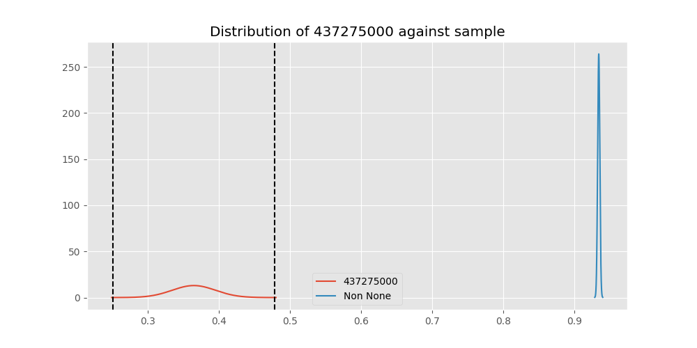 
Out of 44 tests, there were 40 rejections from 44 independent-t test.
Out of 44 tests, there were 40 rejections from 44 Man Whitney u-tests.
## Testing Results for 437275000 against 436501000 
437275000 has a success rate of 0.3643724696356275
436501000 has a success rate of 0.9854014598540146
$H_{0}$: There is not a difference between 437275000 and 436501000
$H_{A}$: There is a difference between 437275000 and 436501000
An $/alpha$ of 0.00025 was used in this test.
__independent t-testing__: With a t-statistic of -19.19042958408697 and a p-value of 5.609501947807957e-54, _we **reject** the null hypothssis_
__Man-Whitney testing__: With a u-statistic of 6412.0 and a p-value of 3.0847730621642696e-32, _we **reject** the null hypothssis_
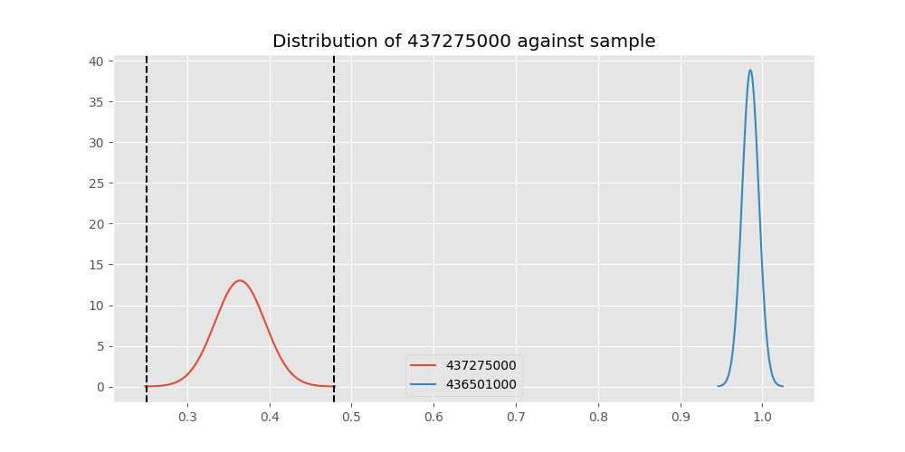 
## Testing Results for 437275000 against 437375000 
437275000 has a success rate of 0.3643724696356275
437375000 has a success rate of 0.9982014388489209
$H_{0}$: There is not a difference between 437275000 and 437375000
$H_{A}$: There is a difference between 437275000 and 437375000
An $/alpha$ of 0.00025 was used in this test.
__independent t-testing__: With a t-statistic of -20.621521193283012 and a p-value of 1.1120767399443208e-55, _we **reject** the null hypothssis_
__Man-Whitney testing__: With a u-statistic of 25143.5 and a p-value of 2.006757473948225e-96, _we **reject** the null hypothssis_
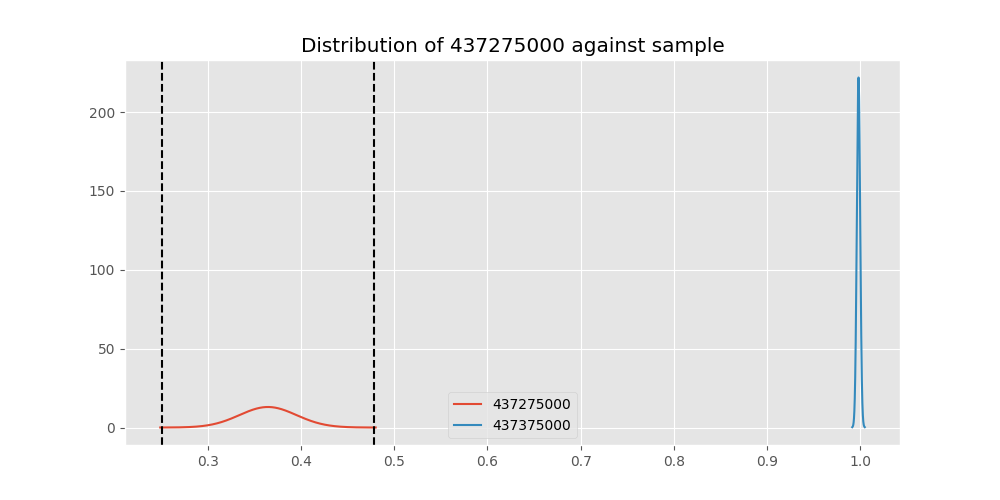 
## Testing Results for 437275000 against 436500000 
437275000 has a success rate of 0.3643724696356275
436500000 has a success rate of 0.9056603773584906
$H_{0}$: There is not a difference between 437275000 and 436500000
$H_{A}$: There is a difference between 437275000 and 436500000
An $/alpha$ of 0.00025 was used in this test.
__independent t-testing__: With a t-statistic of -12.717824570395544 and a p-value of 2.126646025982694e-31, _we **reject** the null hypothssis_
__Man-Whitney testing__: With a u-statistic of 9007.5 and a p-value of 5.319845120757369e-27, _we **reject** the null hypothssis_
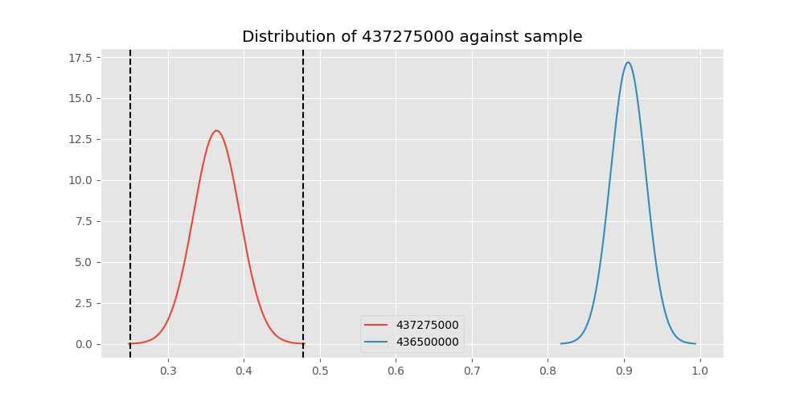 
## Testing Results for 437275000 against 436990000 
437275000 has a success rate of 0.3643724696356275
436990000 has a success rate of 0.9572649572649573
$H_{0}$: There is not a difference between 437275000 and 436990000
$H_{A}$: There is a difference between 437275000 and 436990000
An $/alpha$ of 0.00025 was used in this test.
__independent t-testing__: With a t-statistic of -17.73936157040965 and a p-value of 4.4653393099787575e-50, _we **reject** the null hypothssis_
__Man-Whitney testing__: With a u-statistic of 11765.0 and a p-value of 2.4145048733285718e-42, _we **reject** the null hypothssis_
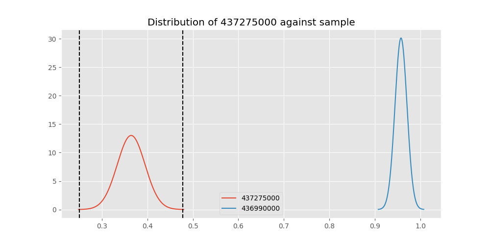 
## Testing Results for 437275000 against 145875000 
437275000 has a success rate of 0.3643724696356275
145875000 has a success rate of 0.9722222222222222
$H_{0}$: There is not a difference between 437275000 and 145875000
$H_{A}$: There is a difference between 437275000 and 145875000
An $/alpha$ of 0.00025 was used in this test.
__independent t-testing__: With a t-statistic of -16.718782636684708 and a p-value of 3.628178692803106e-45, _we **reject** the null hypothssis_
__Man-Whitney testing__: With a u-statistic of 3487.0 and a p-value of 1.280375486817926e-19, _we **reject** the null hypothssis_
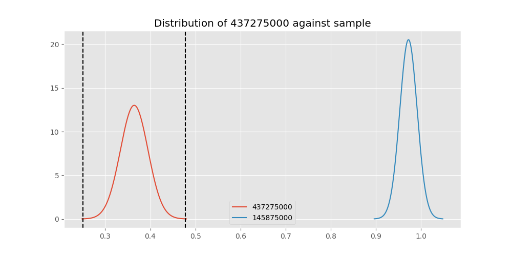 
## Testing Results for 437275000 against 437800000 
437275000 has a success rate of 0.3643724696356275
437800000 has a success rate of 0.9533678756476683
$H_{0}$: There is not a difference between 437275000 and 437800000
$H_{A}$: There is a difference between 437275000 and 437800000
An $/alpha$ of 0.00025 was used in this test.
__independent t-testing__: With a t-statistic of -17.19715299066344 and a p-value of 1.2623353665187083e-48, _we **reject** the null hypothssis_
__Man-Whitney testing__: With a u-statistic of 9796.5 and a p-value of 1.3785683454529459e-36, _we **reject** the null hypothssis_
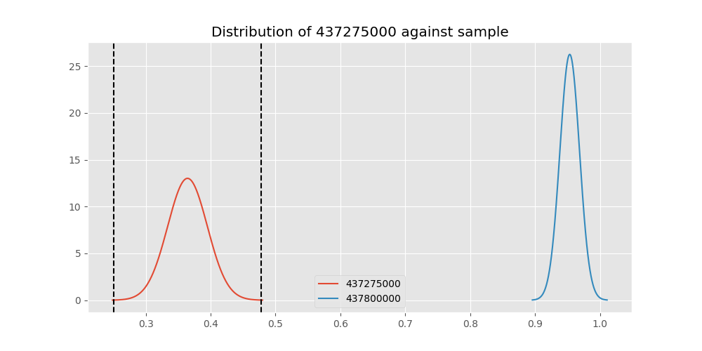 
## Testing Results for 437275000 against 145810000 
437275000 has a success rate of 0.3643724696356275
145810000 has a success rate of 0.12179487179487179
$H_{0}$: There is not a difference between 437275000 and 145810000
$H_{A}$: There is a difference between 437275000 and 145810000
An $/alpha$ of 0.00025 was used in this test.
__independent t-testing__: With a t-statistic of 5.525623841141036 and a p-value of 5.919705491592138e-08, _we **reject** the null hypothssis_
__Man-Whitney testing__: With a u-statistic of 23939.5 and a p-value of 9.680263740677365e-08, _we **reject** the null hypothssis_
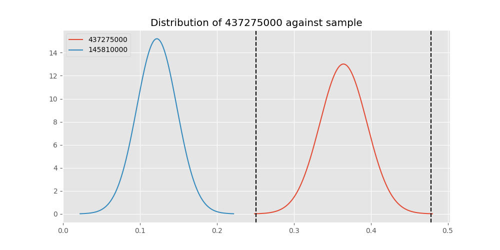 
## Testing Results for 437275000 against 437095000 
437275000 has a success rate of 0.3643724696356275
437095000 has a success rate of 0.9361702127659575
$H_{0}$: There is not a difference between 437275000 and 437095000
$H_{A}$: There is a difference between 437275000 and 437095000
An $/alpha$ of 0.00025 was used in this test.
__independent t-testing__: With a t-statistic of -7.925519518268581 and a p-value of 4.831090964701203e-14, _we **reject** the null hypothssis_
__Man-Whitney testing__: With a u-statistic of 2485.5 and a p-value of 5.975059169885936e-13, _we **reject** the null hypothssis_
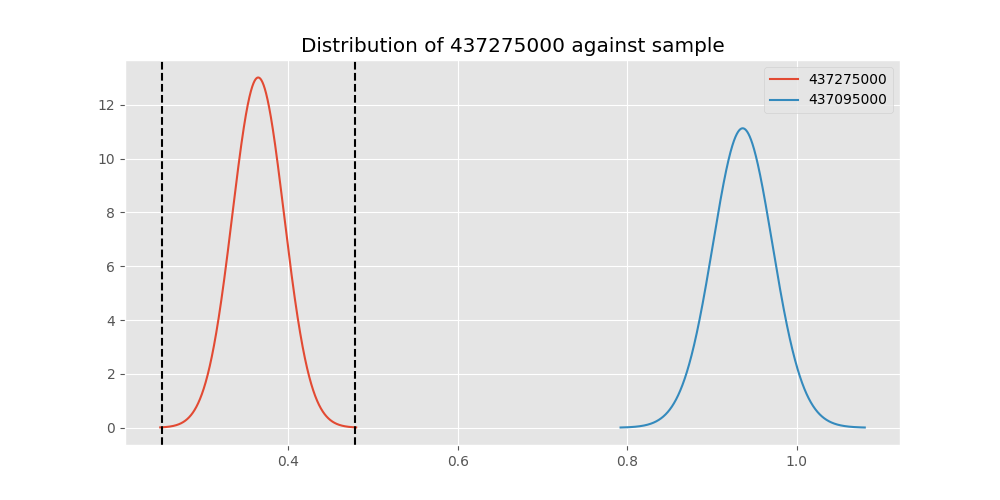 
## Testing Results for 437275000 against 437265000 
437275000 has a success rate of 0.3643724696356275
437265000 has a success rate of 0.9795454545454545
$H_{0}$: There is not a difference between 437275000 and 437265000
$H_{A}$: There is a difference between 437275000 and 437265000
An $/alpha$ of 0.00025 was used in this test.
__independent t-testing__: With a t-statistic of -19.57993310042741 and a p-value of 9.616852365339887e-54, _we **reject** the null hypothssis_
__Man-Whitney testing__: With a u-statistic of 20911.5 and a p-value of 6.401408369290695e-73, _we **reject** the null hypothssis_
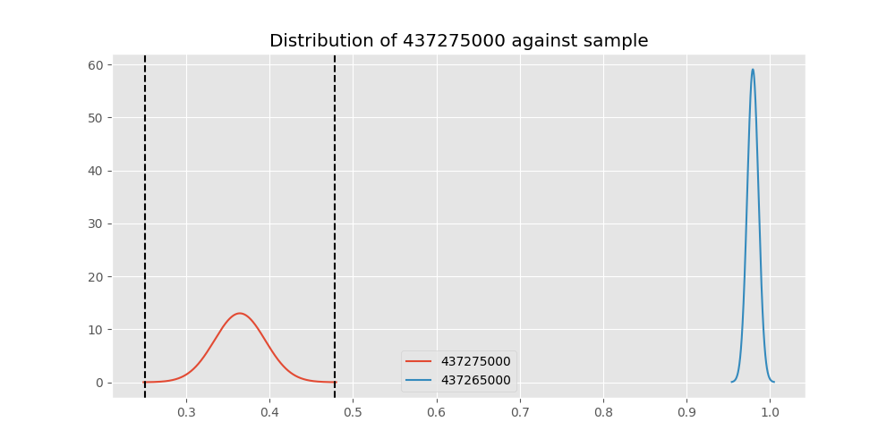 
## Testing Results for 437275000 against 437350000 
437275000 has a success rate of 0.3643724696356275
437350000 has a success rate of 0.9488372093023256
$H_{0}$: There is not a difference between 437275000 and 437350000
$H_{A}$: There is a difference between 437275000 and 437350000
An $/alpha$ of 0.00025 was used in this test.
__independent t-testing__: With a t-statistic of -17.099183329942857 and a p-value of 3.006258205447165e-48, _we **reject** the null hypothssis_
__Man-Whitney testing__: With a u-statistic of 11033.5 and a p-value of 1.0497439726273661e-38, _we **reject** the null hypothssis_
 
## Testing Results for 437275000 against 437200000 
437275000 has a success rate of 0.3643724696356275
437200000 has a success rate of 0.8620689655172413
$H_{0}$: There is not a difference between 437275000 and 437200000
$H_{A}$: There is a difference between 437275000 and 437200000
An $/alpha$ of 0.00025 was used in this test.
__independent t-testing__: With a t-statistic of -12.329060259940663 and a p-value of 2.82405697308823e-30, _we **reject** the null hypothssis_
__Man-Whitney testing__: With a u-statistic of 12593.0 and a p-value of 1.485094559513041e-26, _we **reject** the null hypothssis_
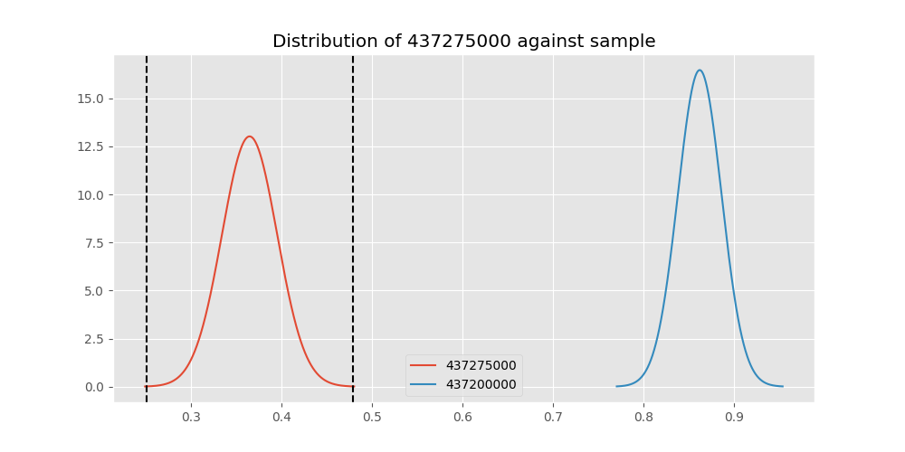 
## Testing Results for 437275000 against 435600000 
437275000 has a success rate of 0.3643724696356275
435600000 has a success rate of 0.9819341126461212
$H_{0}$: There is not a difference between 437275000 and 435600000
$H_{A}$: There is a difference between 437275000 and 435600000
An $/alpha$ of 0.00025 was used in this test.
__independent t-testing__: With a t-statistic of -19.928018944204265 and a p-value of 5.548904774504588e-54, _we **reject** the null hypothssis_
__Man-Whitney testing__: With a u-statistic of 44444.5 and a p-value of 1.0391494848296879e-131, _we **reject** the null hypothssis_
 
## Testing Results for 437275000 against 450000000 
437275000 has a success rate of 0.3643724696356275
450000000 has a success rate of 0.8235294117647058
$H_{0}$: There is not a difference between 437275000 and 450000000
$H_{A}$: There is a difference between 437275000 and 450000000
An $/alpha$ of 0.00025 was used in this test.
__independent t-testing__: With a t-statistic of -7.952964609386232 and a p-value of 2.9316082674322656e-14, _we **reject** the null hypothssis_
__Man-Whitney testing__: With a u-statistic of 5677.5 and a p-value of 2.972268684932035e-13, _we **reject** the null hypothssis_
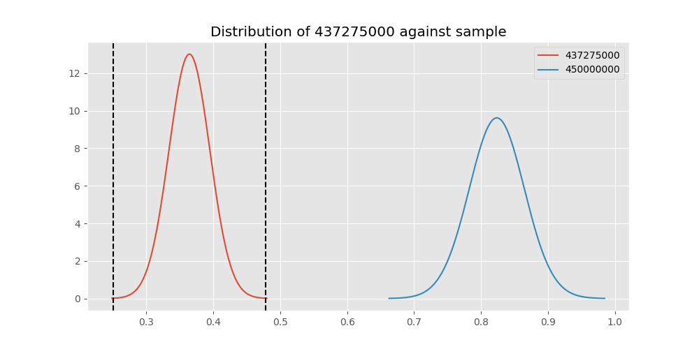 
## Testing Results for 437275000 against 145978500 
437275000 has a success rate of 0.3643724696356275
145978500 has a success rate of 0.9963636363636363
$H_{0}$: There is not a difference between 437275000 and 145978500
$H_{A}$: There is a difference between 437275000 and 145978500
An $/alpha$ of 0.00025 was used in this test.
__independent t-testing__: With a t-statistic of -20.45388557566003 and a p-value of 1.5596834990524376e-55, _we **reject** the null hypothssis_
__Man-Whitney testing__: With a u-statistic of 12498.5 and a p-value of 2.182190488544957e-55, _we **reject** the null hypothssis_
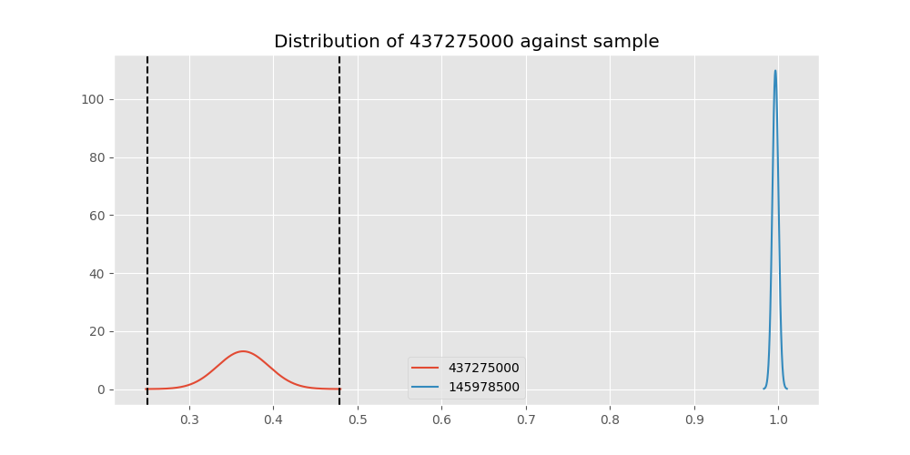 
## Testing Results for 437275000 against 437050000 
437275000 has a success rate of 0.3643724696356275
437050000 has a success rate of 0.5346534653465347
$H_{0}$: There is not a difference between 437275000 and 437050000
$H_{A}$: There is a difference between 437275000 and 437050000
An $/alpha$ of 0.00025 was used in this test.
__independent t-testing__: With a t-statistic of -2.95550041294729 and a p-value of 0.003335682382662994, _we failed to reject the null hypothssis_
__Man-Whitney testing__: With a u-statistic of 10349.5 and a p-value of 0.003473312860301618, _we failed to reject the null hypothssis_
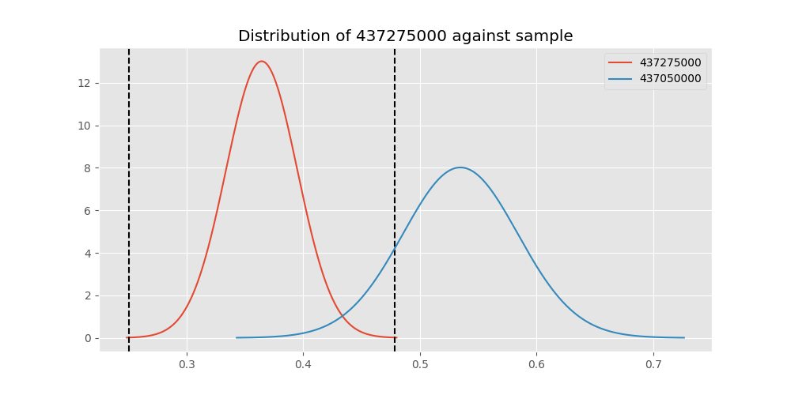 
## Testing Results for 437275000 against 435300000 
437275000 has a success rate of 0.3643724696356275
435300000 has a success rate of 0.1232876712328767
$H_{0}$: There is not a difference between 437275000 and 435300000
$H_{A}$: There is a difference between 437275000 and 435300000
An $/alpha$ of 0.00025 was used in this test.
__independent t-testing__: With a t-statistic of 5.345190486632667 and a p-value of 1.538488565836094e-07, _we **reject** the null hypothssis_
__Man-Whitney testing__: With a u-statistic of 22378.0 and a p-value of 2.391704955381239e-07, _we **reject** the null hypothssis_
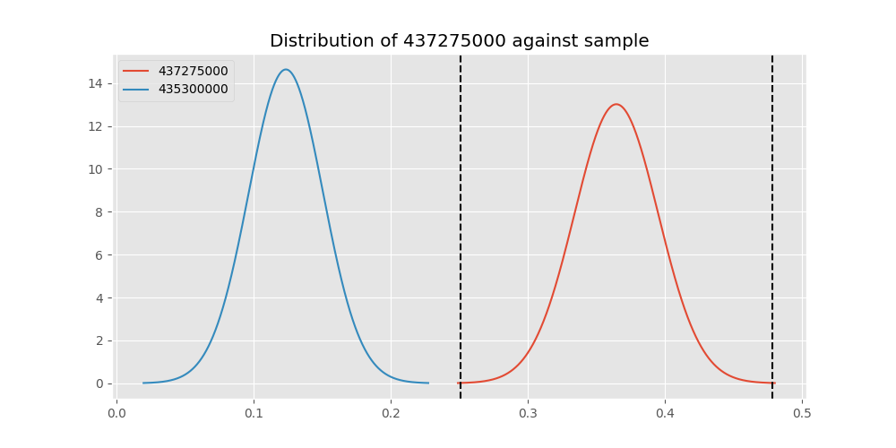 
## Testing Results for 437275000 against 437475000 
437275000 has a success rate of 0.3643724696356275
437475000 has a success rate of 0.5045045045045045
$H_{0}$: There is not a difference between 437275000 and 437475000
$H_{A}$: There is a difference between 437275000 and 437475000
An $/alpha$ of 0.00025 was used in this test.
__independent t-testing__: With a t-statistic of -3.7018845739706676 and a p-value of 0.00022867874179369942, _we **reject** the null hypothssis_
__Man-Whitney testing__: With a u-statistic of 58937.5 and a p-value of 0.00024001821576782984, _we **reject** the null hypothssis_
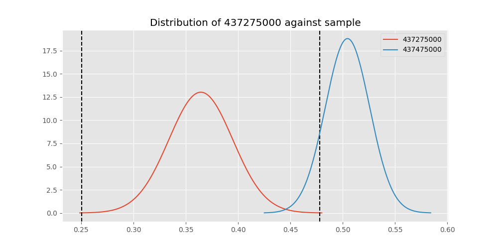 
## Testing Results for 437275000 against 435448000 
437275000 has a success rate of 0.3643724696356275
435448000 has a success rate of 0.975
$H_{0}$: There is not a difference between 437275000 and 435448000
$H_{A}$: There is a difference between 437275000 and 435448000
An $/alpha$ of 0.00025 was used in this test.
__independent t-testing__: With a t-statistic of -15.428131704057266 and a p-value of 8.906546219575249e-35, _we **reject** the null hypothssis_
__Man-Whitney testing__: With a u-statistic of 1923.5 and a p-value of 6.54736365861145e-13, _we **reject** the null hypothssis_
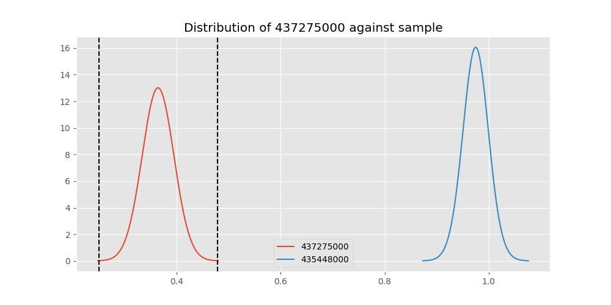 
## Testing Results for 437275000 against 437644000 
437275000 has a success rate of 0.3643724696356275
437644000 has a success rate of 0.9743589743589743
$H_{0}$: There is not a difference between 437275000 and 437644000
$H_{A}$: There is a difference between 437275000 and 437644000
An $/alpha$ of 0.00025 was used in this test.
__independent t-testing__: With a t-statistic of -17.93410987558948 and a p-value of 7.303179998525812e-51, _we **reject** the null hypothssis_
__Man-Whitney testing__: With a u-statistic of 5635.5 and a p-value of 7.848334826450535e-28, _we **reject** the null hypothssis_
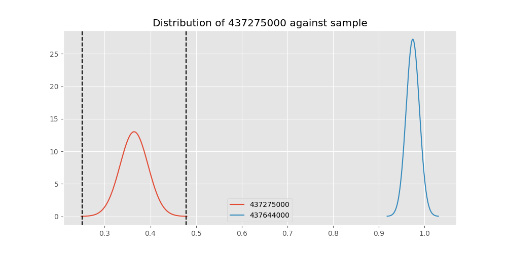 
## Testing Results for 437275000 against 145825000 
437275000 has a success rate of 0.3643724696356275
145825000 has a success rate of 0.8687448728465955
$H_{0}$: There is not a difference between 437275000 and 145825000
$H_{A}$: There is a difference between 437275000 and 145825000
An $/alpha$ of 0.00025 was used in this test.
__independent t-testing__: With a t-statistic of -21.369762534303973 and a p-value of 1.0730775946464846e-93, _we **reject** the null hypothssis_
__Man-Whitney testing__: With a u-statistic of 149230.0 and a p-value of 6.8170891192819145e-87, _we **reject** the null hypothssis_
 
## Testing Results for 437275000 against 437345000 
437275000 has a success rate of 0.3643724696356275
437345000 has a success rate of 0.7603092783505154
$H_{0}$: There is not a difference between 437275000 and 437345000
$H_{A}$: There is a difference between 437275000 and 437345000
An $/alpha$ of 0.00025 was used in this test.
__independent t-testing__: With a t-statistic of -10.820418644290074 and a p-value of 3.742918575104905e-25, _we **reject** the null hypothssis_
__Man-Whitney testing__: With a u-statistic of 28945.5 and a p-value of 2.580578557733349e-23, _we **reject** the null hypothssis_
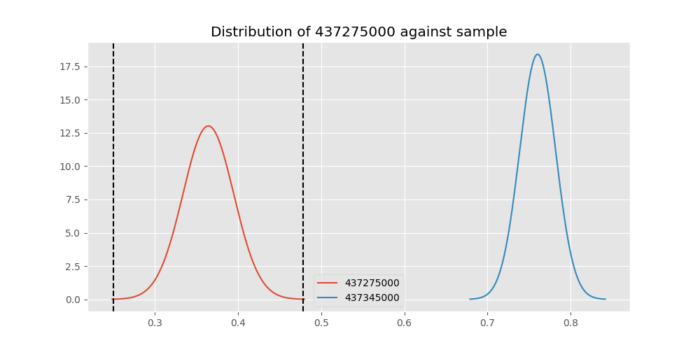 
## Testing Results for 437275000 against 435275000 
437275000 has a success rate of 0.3643724696356275
435275000 has a success rate of 0.9152542372881356
$H_{0}$: There is not a difference between 437275000 and 435275000
$H_{A}$: There is a difference between 437275000 and 435275000
An $/alpha$ of 0.00025 was used in this test.
__independent t-testing__: With a t-statistic of -11.513431390318496 and a p-value of 2.3337686803197413e-26, _we **reject** the null hypothssis_
__Man-Whitney testing__: With a u-statistic of 6545.0 and a p-value of 5.792767106116725e-23, _we **reject** the null hypothssis_
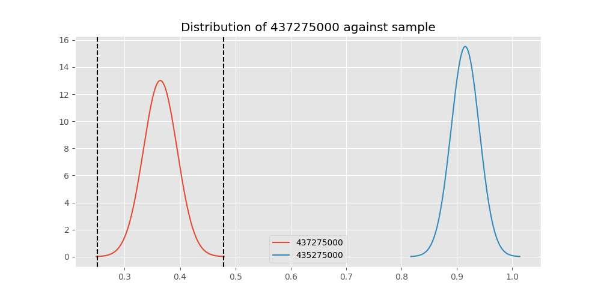 
## Testing Results for 437275000 against 437322500 
437275000 has a success rate of 0.3643724696356275
437322500 has a success rate of 0.9961685823754789
$H_{0}$: There is not a difference between 437275000 and 437322500
$H_{A}$: There is a difference between 437275000 and 437322500
An $/alpha$ of 0.00025 was used in this test.
__independent t-testing__: With a t-statistic of -20.43199195817697 and a p-value of 1.6149751622867136e-55, _we **reject** the null hypothssis_
__Man-Whitney testing__: With a u-statistic of 11868.5 and a p-value of 3.0603295086070734e-53, _we **reject** the null hypothssis_
 
## Testing Results for 437275000 against 437450000 
437275000 has a success rate of 0.3643724696356275
437450000 has a success rate of 0.6947791164658634
$H_{0}$: There is not a difference between 437275000 and 437450000
$H_{A}$: There is a difference between 437275000 and 437450000
An $/alpha$ of 0.00025 was used in this test.
__independent t-testing__: With a t-statistic of -7.796579116603088 and a p-value of 3.7984272676514396e-14, _we **reject** the null hypothssis_
__Man-Whitney testing__: With a u-statistic of 20591.0 and a p-value of 1.7828612061485158e-13, _we **reject** the null hypothssis_
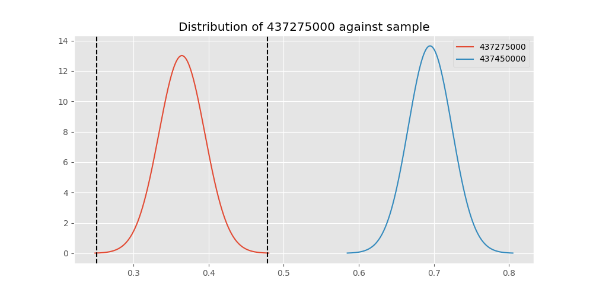 
## Testing Results for 437275000 against 436703000 
437275000 has a success rate of 0.3643724696356275
436703000 has a success rate of 0.9859154929577465
$H_{0}$: There is not a difference between 437275000 and 436703000
$H_{A}$: There is a difference between 437275000 and 436703000
An $/alpha$ of 0.00025 was used in this test.
__independent t-testing__: With a t-statistic of -19.586628194796514 and a p-value of 2.1739828945351104e-54, _we **reject** the null hypothssis_
__Man-Whitney testing__: With a u-statistic of 9955.5 and a p-value of 3.58837432161239e-44, _we **reject** the null hypothssis_
 
## Testing Results for 437275000 against 400500000 
437275000 has a success rate of 0.3643724696356275
400500000 has a success rate of 0.3508771929824561
$H_{0}$: There is not a difference between 437275000 and 400500000
$H_{A}$: There is a difference between 437275000 and 400500000
An $/alpha$ of 0.00025 was used in this test.
__independent t-testing__: With a t-statistic of 0.19050222535654313 and a p-value of 0.8490435934133276, _we failed to reject the null hypothssis_
__Man-Whitney testing__: With a u-statistic of 7134.5 and a p-value of 0.8494645550578228, _we failed to reject the null hypothssis_
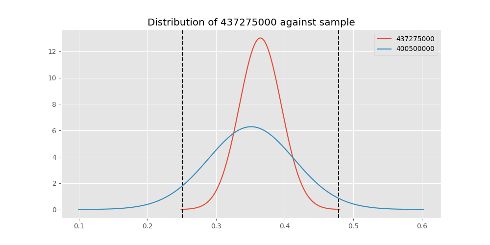 
## Testing Results for 437275000 against 437150000 
437275000 has a success rate of 0.3643724696356275
437150000 has a success rate of 0.9859550561797753
$H_{0}$: There is not a difference between 437275000 and 437150000
$H_{A}$: There is a difference between 437275000 and 437150000
An $/alpha$ of 0.00025 was used in this test.
__independent t-testing__: With a t-statistic of -19.85074505147267 and a p-value of 1.8706992734933126e-54, _we **reject** the null hypothssis_
__Man-Whitney testing__: With a u-statistic of 16637.5 and a p-value of 3.235284576124874e-64, _we **reject** the null hypothssis_
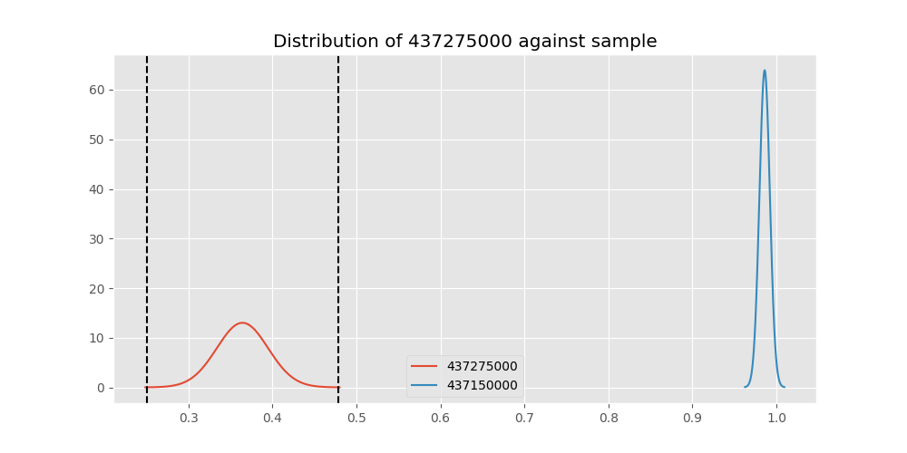 
## Testing Results for 437275000 against 435635000 
437275000 has a success rate of 0.3643724696356275
435635000 has a success rate of 0.9849624060150376
$H_{0}$: There is not a difference between 437275000 and 435635000
$H_{A}$: There is a difference between 437275000 and 435635000
An $/alpha$ of 0.00025 was used in this test.
__independent t-testing__: With a t-statistic of -19.118234415155985 and a p-value of 7.5377553466209e-54, _we **reject** the null hypothssis_
__Man-Whitney testing__: With a u-statistic of 6232.0 and a p-value of 1.5927767777276635e-31, _we **reject** the null hypothssis_
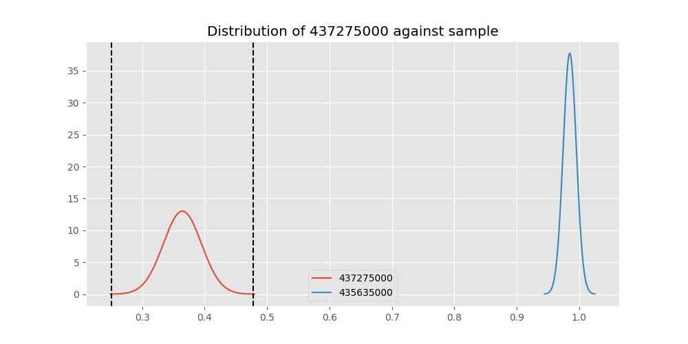 
## Testing Results for 437275000 against 437384000 
437275000 has a success rate of 0.3643724696356275
437384000 has a success rate of 0.968421052631579
$H_{0}$: There is not a difference between 437275000 and 437384000
$H_{A}$: There is a difference between 437275000 and 437384000
An $/alpha$ of 0.00025 was used in this test.
__independent t-testing__: With a t-statistic of -18.185554276582955 and a p-value of 1.7547792132985114e-51, _we **reject** the null hypothssis_
__Man-Whitney testing__: With a u-statistic of 9291.0 and a p-value of 3.0988086618583653e-38, _we **reject** the null hypothssis_
 
## Testing Results for 437275000 against 437405000 
437275000 has a success rate of 0.3643724696356275
437405000 has a success rate of 0.9953917050691244
$H_{0}$: There is not a difference between 437275000 and 437405000
$H_{A}$: There is a difference between 437275000 and 437405000
An $/alpha$ of 0.00025 was used in this test.
__independent t-testing__: With a t-statistic of -20.337258782793093 and a p-value of 1.8639116613647944e-55, _we **reject** the null hypothssis_
__Man-Whitney testing__: With a u-statistic of 9888.5 and a p-value of 2.323232383134493e-46, _we **reject** the null hypothssis_
 
## Testing Results for 437275000 against 435612500 
437275000 has a success rate of 0.3643724696356275
435612500 has a success rate of 0.9770114942528736
$H_{0}$: There is not a difference between 437275000 and 435612500
$H_{A}$: There is a difference between 437275000 and 435612500
An $/alpha$ of 0.00025 was used in this test.
__independent t-testing__: With a t-statistic of -17.665887364086387 and a p-value of 1.3787144595492794e-49, _we **reject** the null hypothssis_
__Man-Whitney testing__: With a u-statistic of 4162.0 and a p-value of 8.883124006577399e-23, _we **reject** the null hypothssis_
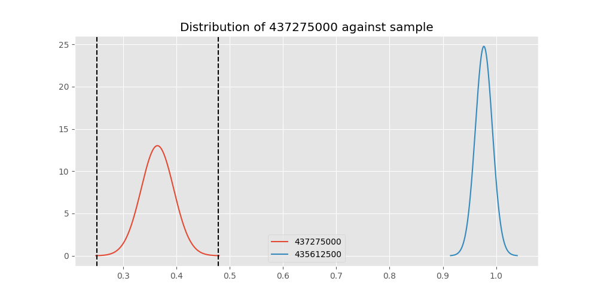 
## Testing Results for 437275000 against 435975000 
437275000 has a success rate of 0.3643724696356275
435975000 has a success rate of 0.92
$H_{0}$: There is not a difference between 437275000 and 435975000
$H_{A}$: There is a difference between 437275000 and 435975000
An $/alpha$ of 0.00025 was used in this test.
__independent t-testing__: With a t-statistic of -7.886595974865514 and a p-value of 6.083342965283064e-14, _we **reject** the null hypothssis_
__Man-Whitney testing__: With a u-statistic of 2744.0 and a p-value of 7.061939492069317e-13, _we **reject** the null hypothssis_
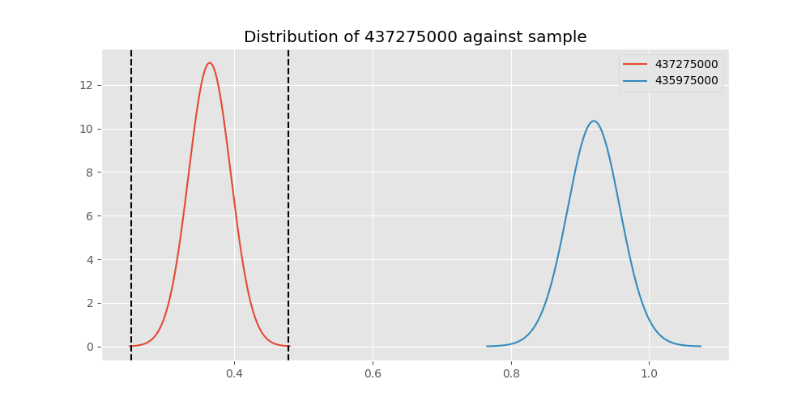 
## Testing Results for 437275000 against 437425000 
437275000 has a success rate of 0.3643724696356275
437425000 has a success rate of 0.6987654320987654
$H_{0}$: There is not a difference between 437275000 and 437425000
$H_{A}$: There is a difference between 437275000 and 437425000
An $/alpha$ of 0.00025 was used in this test.
__independent t-testing__: With a t-statistic of -8.847607281964239 and a p-value of 8.396735961648609e-18, _we **reject** the null hypothssis_
__Man-Whitney testing__: With a u-statistic of 33292.0 and a p-value of 6.023125657572566e-17, _we **reject** the null hypothssis_
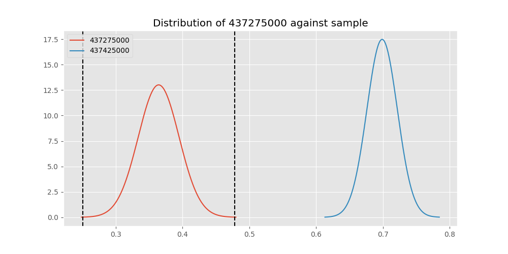 
## Testing Results for 437275000 against 145840000 
437275000 has a success rate of 0.3643724696356275
145840000 has a success rate of 0.9649122807017544
$H_{0}$: There is not a difference between 437275000 and 145840000
$H_{A}$: There is a difference between 437275000 and 145840000
An $/alpha$ of 0.00025 was used in this test.
__independent t-testing__: With a t-statistic of -15.273120492980352 and a p-value of 4.392619673988109e-37, _we **reject** the null hypothssis_
__Man-Whitney testing__: With a u-statistic of 2812.0 and a p-value of 3.1357515006573247e-16, _we **reject** the null hypothssis_
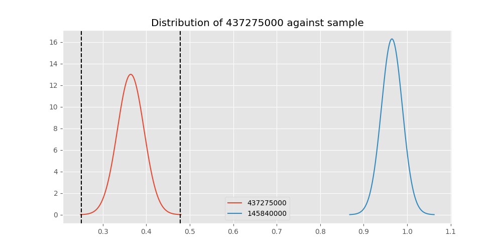 
## Testing Results for 437275000 against 435525000 
437275000 has a success rate of 0.3643724696356275
435525000 has a success rate of 0.6923076923076923
$H_{0}$: There is not a difference between 437275000 and 435525000
$H_{A}$: There is a difference between 437275000 and 435525000
An $/alpha$ of 0.00025 was used in this test.
__independent t-testing__: With a t-statistic of -6.565495842725658 and a p-value of 1.6667157052209486e-10, _we **reject** the null hypothssis_
__Man-Whitney testing__: With a u-statistic of 11869.0 and a p-value of 4.486199680072779e-10, _we **reject** the null hypothssis_
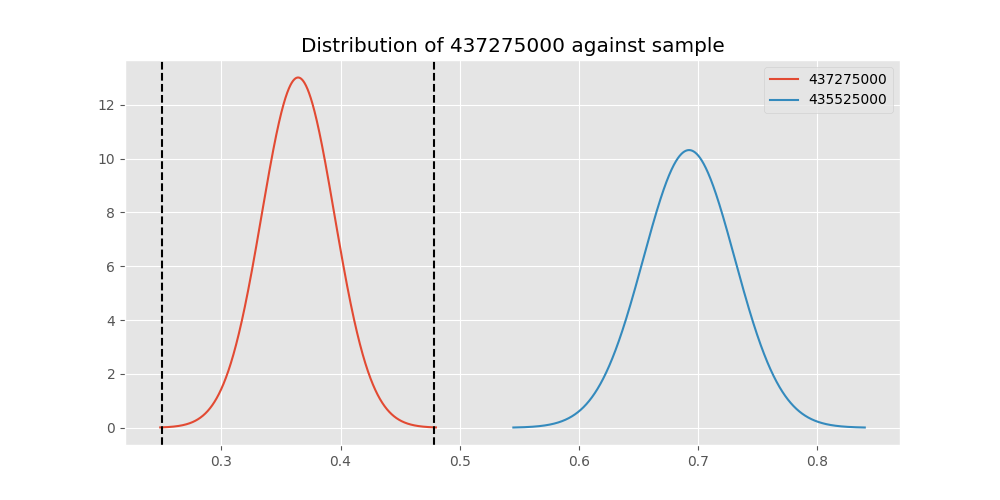 
## Testing Results for 437275000 against 436250000 
437275000 has a success rate of 0.3643724696356275
436250000 has a success rate of 0.17857142857142858
$H_{0}$: There is not a difference between 437275000 and 436250000
$H_{A}$: There is a difference between 437275000 and 436250000
An $/alpha$ of 0.00025 was used in this test.
__independent t-testing__: With a t-statistic of 2.692742114537307 and a p-value of 0.007483721455279387, _we failed to reject the null hypothssis_
__Man-Whitney testing__: With a u-statistic of 8201.0 and a p-value of 0.007715725123681576, _we failed to reject the null hypothssis_
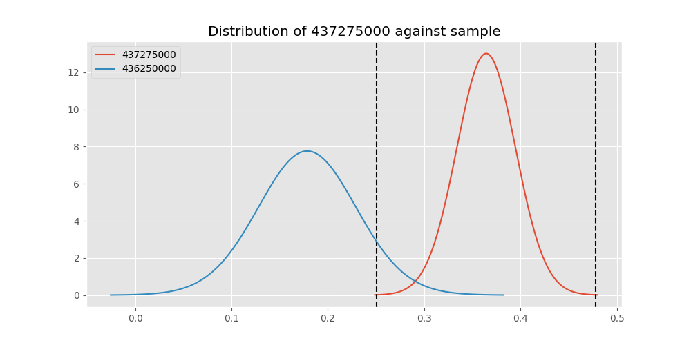 
## Testing Results for 437275000 against 435950000 
437275000 has a success rate of 0.3643724696356275
435950000 has a success rate of 0.9850187265917603
$H_{0}$: There is not a difference between 437275000 and 435950000
$H_{A}$: There is a difference between 437275000 and 435950000
An $/alpha$ of 0.00025 was used in this test.
__independent t-testing__: With a t-statistic of -19.936273240603093 and a p-value of 2.4292179739689382e-54, _we **reject** the null hypothssis_
__Man-Whitney testing__: With a u-statistic of 25018.0 and a p-value of 8.73162832228198e-87, _we **reject** the null hypothssis_
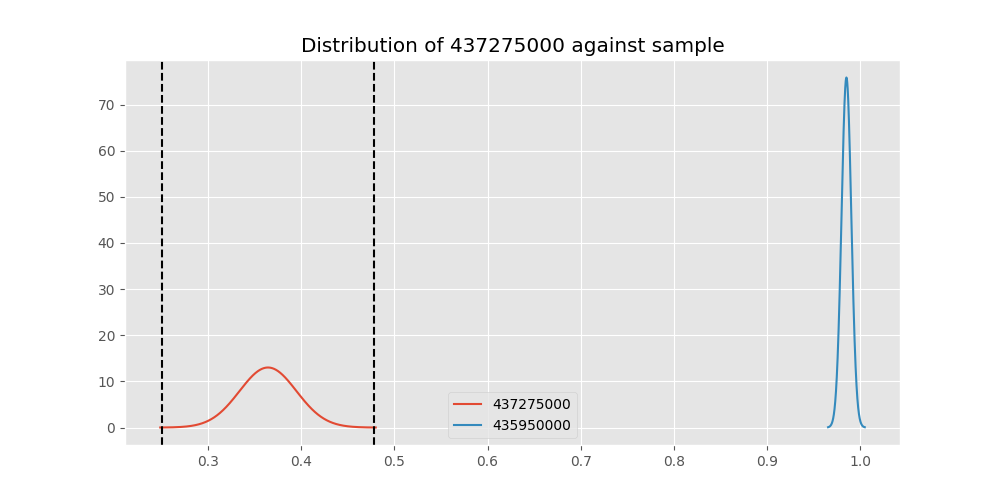 
## Testing Results for 437275000 against 435800000 
437275000 has a success rate of 0.3643724696356275
435800000 has a success rate of 0.5390070921985816
$H_{0}$: There is not a difference between 437275000 and 435800000
$H_{A}$: There is a difference between 437275000 and 435800000
An $/alpha$ of 0.00025 was used in this test.
__independent t-testing__: With a t-statistic of -3.3845580029781797 and a p-value of 0.0007860153095809917, _we failed to reject the null hypothssis_
__Man-Whitney testing__: With a u-statistic of 14372.5 and a p-value of 0.0008402123478592319, _we failed to reject the null hypothssis_
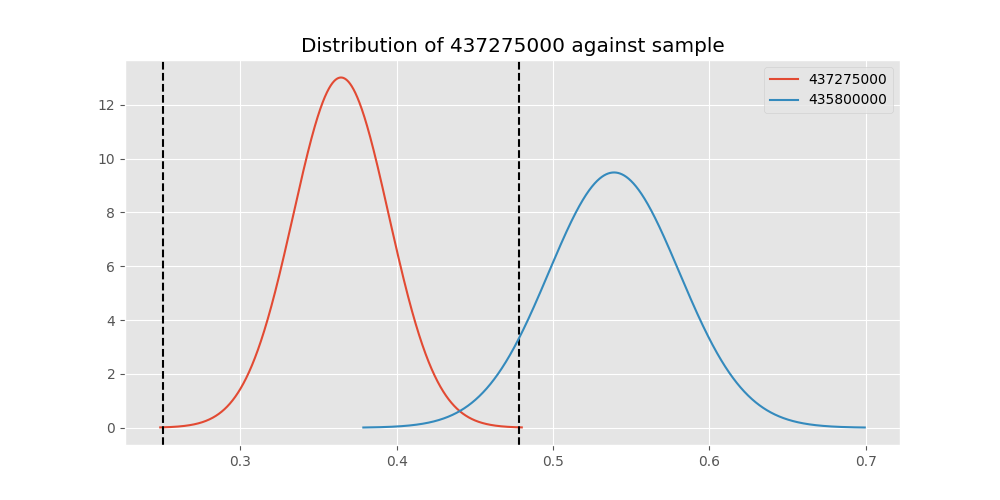 
## Testing Results for 437275000 against 437485000 
437275000 has a success rate of 0.3643724696356275
437485000 has a success rate of 0.9375
$H_{0}$: There is not a difference between 437275000 and 437485000
$H_{A}$: There is a difference between 437275000 and 437485000
An $/alpha$ of 0.00025 was used in this test.
__independent t-testing__: With a t-statistic of -6.605213266310657 and a p-value of 2.0236410655002066e-10, _we **reject** the null hypothssis_
__Man-Whitney testing__: With a u-statistic of 1687.0 and a p-value of 7.792028028095227e-10, _we **reject** the null hypothssis_
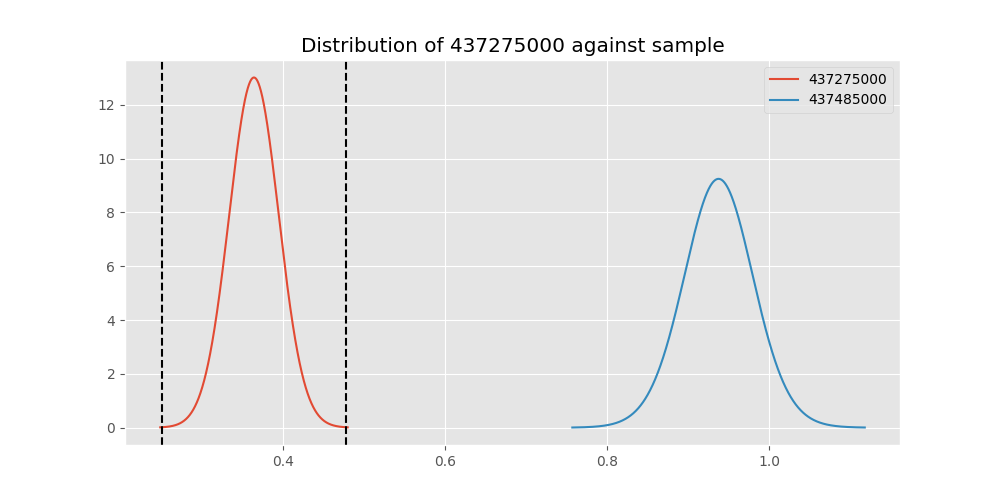 
## Testing Results for 437275000 against 136770000 
437275000 has a success rate of 0.3643724696356275
136770000 has a success rate of 0.9945945945945946
$H_{0}$: There is not a difference between 437275000 and 136770000
$H_{A}$: There is a difference between 437275000 and 136770000
An $/alpha$ of 0.00025 was used in this test.
__independent t-testing__: With a t-statistic of -20.22788580492713 and a p-value of 2.196061366969122e-55, _we **reject** the null hypothssis_
__Man-Whitney testing__: With a u-statistic of 8448.5 and a p-value of 3.4536711485415287e-41, _we **reject** the null hypothssis_
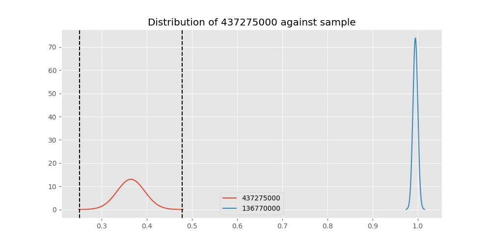 
## Testing Results for 437275000 against 437250000 
437275000 has a success rate of 0.3643724696356275
437250000 has a success rate of 0.9937106918238994
$H_{0}$: There is not a difference between 437275000 and 437250000
$H_{A}$: There is a difference between 437275000 and 437250000
An $/alpha$ of 0.00025 was used in this test.
__independent t-testing__: With a t-statistic of -20.299123415503495 and a p-value of 2.856833836478509e-55, _we **reject** the null hypothssis_
__Man-Whitney testing__: With a u-statistic of 14557.0 and a p-value of 4.625665455989818e-61, _we **reject** the null hypothssis_
 
## Testing Results for 437275000 against 437356000 
437275000 has a success rate of 0.3643724696356275
437356000 has a success rate of 0.9328358208955224
$H_{0}$: There is not a difference between 437275000 and 437356000
$H_{A}$: There is a difference between 437275000 and 437356000
An $/alpha$ of 0.00025 was used in this test.
__independent t-testing__: With a t-statistic of -12.735087218726697 and a p-value of 3.588214654282694e-31, _we **reject** the null hypothssis_
__Man-Whitney testing__: With a u-statistic of 7141.5 and a p-value of 1.393541364355462e-26, _we **reject** the null hypothssis_
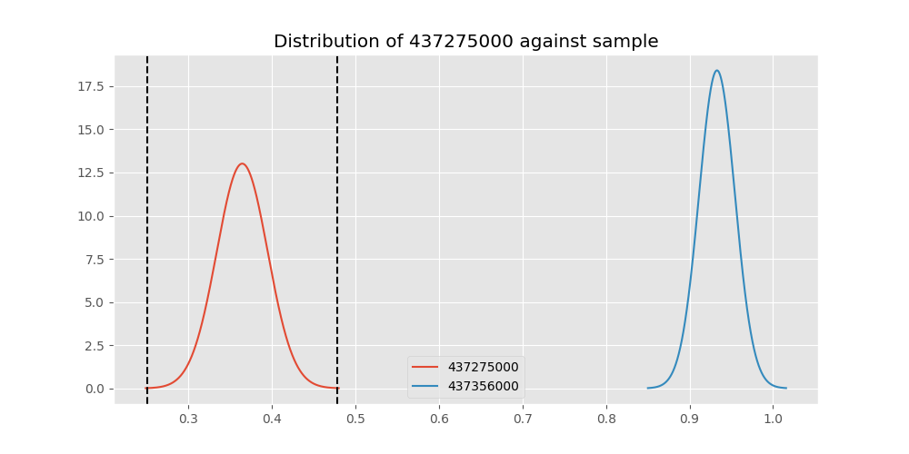 
## Testing Results for 437275000 against 437676000 
437275000 has a success rate of 0.3643724696356275
437676000 has a success rate of 0.9813432835820896
$H_{0}$: There is not a difference between 437275000 and 437676000
$H_{A}$: There is a difference between 437275000 and 437676000
An $/alpha$ of 0.00025 was used in this test.
__independent t-testing__: With a t-statistic of -19.412964632024053 and a p-value of 7.014592677501306e-54, _we **reject** the null hypothssis_
__Man-Whitney testing__: With a u-statistic of 12677.5 and a p-value of 3.5069113000176256e-51, _we **reject** the null hypothssis_
 
## Testing Results for 437275000 against 145826800 
437275000 has a success rate of 0.3643724696356275
145826800 has a success rate of 0.966183574879227
$H_{0}$: There is not a difference between 437275000 and 145826800
$H_{A}$: There is a difference between 437275000 and 145826800
An $/alpha$ of 0.00025 was used in this test.
__independent t-testing__: With a t-statistic of -18.14454009458803 and a p-value of 2.6614852768335368e-51, _we **reject** the null hypothssis_
__Man-Whitney testing__: With a u-statistic of 10179.5 and a p-value of 3.0118204701903224e-40, _we **reject** the null hypothssis_
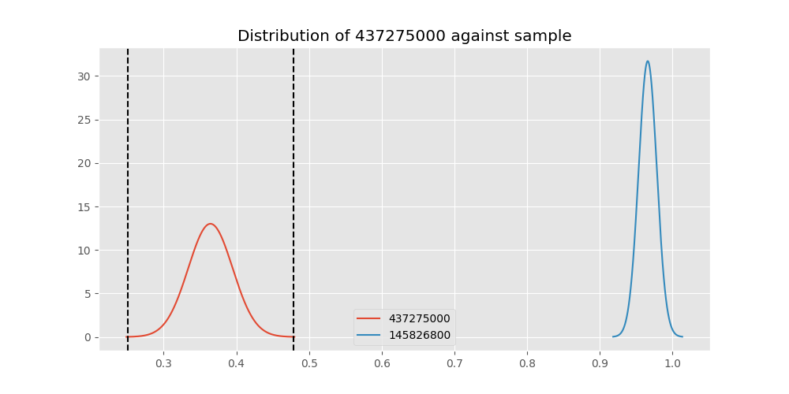 
