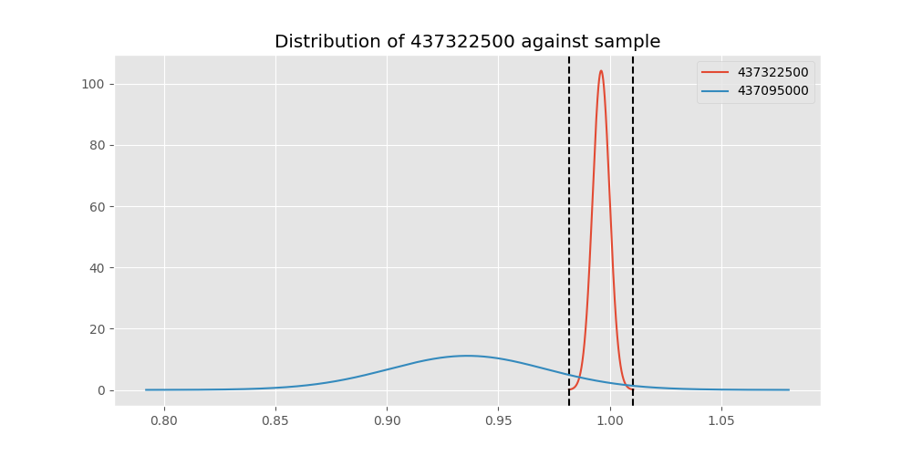
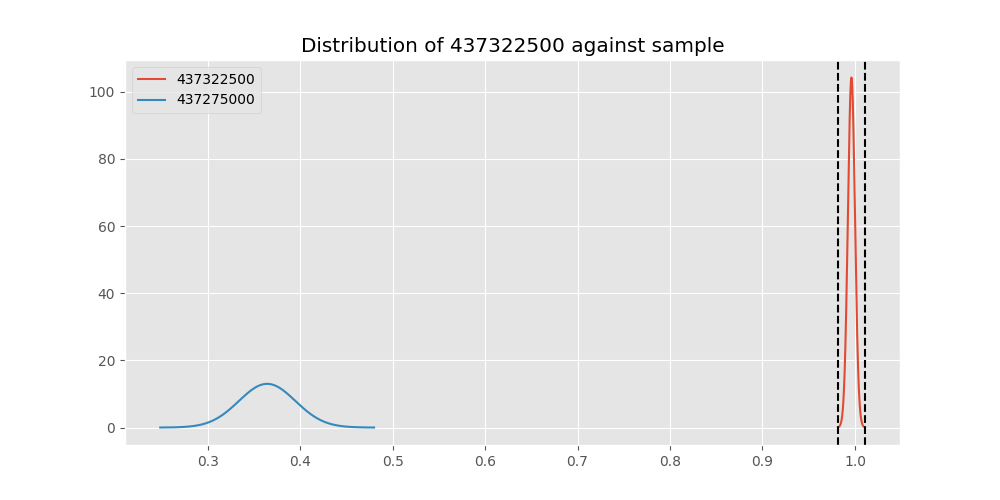
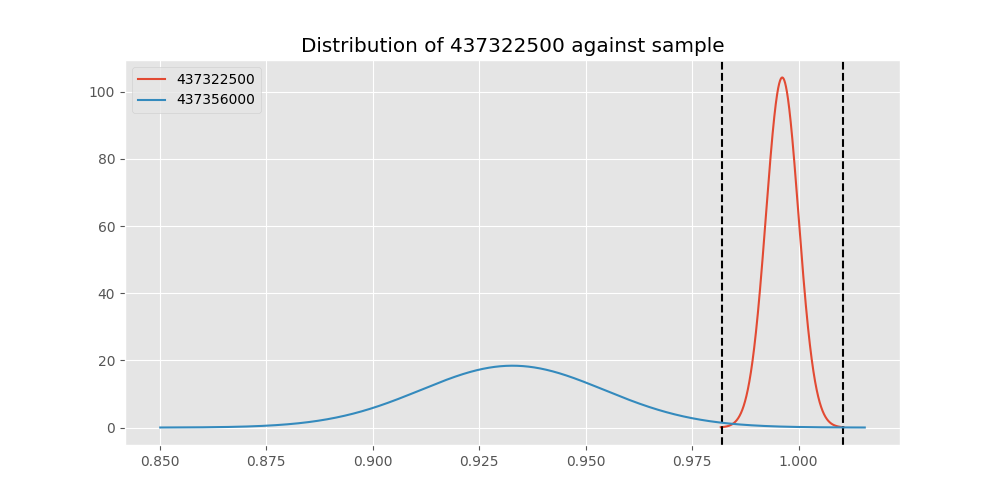

# Testing Results For 437322500 
$H_{0}$: There is not a difference in collection success against 437322500 
$H_{A}$: There is a difference in collection success against 437322500
An $\alpha$ of 0.00025 was used 
Out of 44 tests, there were 19 rejections from 44 independent-t test.
Out of 44 tests, there were 19 rejections from 44 Man Whitney u-tests.
## Testing Results for 437322500 against 436501000 
437322500 has a success rate of 0.9961685823754789
436501000 has a success rate of 0.9854014598540146
$H_{0}$: There is not a difference between 437322500 and 436501000
$H_{A}$: There is a difference between 437322500 and 436501000
An $/alpha$ of 0.00025 was used in this test.
__independent t-testing__: With a t-statistic of 1.1790427760642554 and a p-value of 0.2390890524519199, _we failed to reject the null hypothssis_
__Man-Whitney testing__: With a u-statistic of 18071.0 and a p-value of 0.23983355577756127, _we failed to reject the null hypothssis_
 
## Testing Results for 437322500 against 437375000 
437322500 has a success rate of 0.9961685823754789
437375000 has a success rate of 0.9982014388489209
$H_{0}$: There is not a difference between 437322500 and 437375000
$H_{A}$: There is a difference between 437322500 and 437375000
An $/alpha$ of 0.00025 was used in this test.
__independent t-testing__: With a t-statistic of -0.5476830166980674 and a p-value of 0.5840595300501823, _we failed to reject the null hypothssis_
__Man-Whitney testing__: With a u-statistic of 72410.5 and a p-value of 0.5850241814808672, _we failed to reject the null hypothssis_
 
## Testing Results for 437322500 against 436500000 
437322500 has a success rate of 0.9961685823754789
436500000 has a success rate of 0.9056603773584906
$H_{0}$: There is not a difference between 437322500 and 436500000
$H_{A}$: There is a difference between 437322500 and 436500000
An $/alpha$ of 0.00025 was used in this test.
__independent t-testing__: With a t-statistic of 4.816987316848636 and a p-value of 2.0417400741148265e-06, _we **reject** the null hypothssis_
__Man-Whitney testing__: With a u-statistic of 22627.5 and a p-value of 2.6927146974414426e-06, _we **reject** the null hypothssis_
 
## Testing Results for 437322500 against 436990000 
437322500 has a success rate of 0.9961685823754789
436990000 has a success rate of 0.9572649572649573
$H_{0}$: There is not a difference between 437322500 and 436990000
$H_{A}$: There is a difference between 437322500 and 436990000
An $/alpha$ of 0.00025 was used in this test.
__independent t-testing__: With a t-statistic of 2.9513852419881985 and a p-value of 0.00331420977513074, _we failed to reject the null hypothssis_
__Man-Whitney testing__: With a u-statistic of 31725.0 and a p-value of 0.0034182515564768028, _we failed to reject the null hypothssis_
 
## Testing Results for 437322500 against 145875000 
437322500 has a success rate of 0.9961685823754789
145875000 has a success rate of 0.9722222222222222
$H_{0}$: There is not a difference between 437322500 and 145875000
$H_{A}$: There is a difference between 437322500 and 145875000
An $/alpha$ of 0.00025 was used in this test.
__independent t-testing__: With a t-statistic of 1.9085298358534526 and a p-value of 0.0571875485002211, _we failed to reject the null hypothssis_
__Man-Whitney testing__: With a u-statistic of 9621.0 and a p-value of 0.057860254415371876, _we failed to reject the null hypothssis_
 
## Testing Results for 437322500 against 437800000 
437322500 has a success rate of 0.9961685823754789
437800000 has a success rate of 0.9533678756476683
$H_{0}$: There is not a difference between 437322500 and 437800000
$H_{A}$: There is a difference between 437322500 and 437800000
An $/alpha$ of 0.00025 was used in this test.
__independent t-testing__: With a t-statistic of 3.0973351311527755 and a p-value of 0.0020742782921857597, _we failed to reject the null hypothssis_
__Man-Whitney testing__: With a u-statistic of 26264.5 and a p-value of 0.0021625867279894437, _we failed to reject the null hypothssis_
 
## Testing Results for 437322500 against 145810000 
437322500 has a success rate of 0.9961685823754789
145810000 has a success rate of 0.12179487179487179
$H_{0}$: There is not a difference between 437322500 and 145810000
$H_{A}$: There is a difference between 437322500 and 145810000
An $/alpha$ of 0.00025 was used in this test.
__independent t-testing__: With a t-statistic of 41.85710246466708 and a p-value of 4.921731847496325e-151, _we **reject** the null hypothssis_
__Man-Whitney testing__: With a u-statistic of 38158.5 and a p-value of 4.051642168008007e-75, _we **reject** the null hypothssis_
 
## Testing Results for 437322500 against 437095000 
437322500 has a success rate of 0.9961685823754789
437095000 has a success rate of 0.9361702127659575
$H_{0}$: There is not a difference between 437322500 and 437095000
$H_{A}$: There is a difference between 437322500 and 437095000
An $/alpha$ of 0.00025 was used in this test.
__independent t-testing__: With a t-statistic of 3.3957441676144393 and a p-value of 0.0007747790108694619, _we failed to reject the null hypothssis_
__Man-Whitney testing__: With a u-statistic of 6501.5 and a p-value of 0.0008547688384124147, _we failed to reject the null hypothssis_
 
## Testing Results for 437322500 against 437265000 
437322500 has a success rate of 0.9961685823754789
437265000 has a success rate of 0.9795454545454545
$H_{0}$: There is not a difference between 437322500 and 437265000
$H_{A}$: There is a difference between 437322500 and 437265000
An $/alpha$ of 0.00025 was used in this test.
__independent t-testing__: With a t-statistic of 1.7958018996786496 and a p-value of 0.07295779769524516, _we failed to reject the null hypothssis_
__Man-Whitney testing__: With a u-statistic of 58374.5 and a p-value of 0.07313047457042104, _we failed to reject the null hypothssis_
 
## Testing Results for 437322500 against 437350000 
437322500 has a success rate of 0.9961685823754789
437350000 has a success rate of 0.9488372093023256
$H_{0}$: There is not a difference between 437322500 and 437350000
$H_{A}$: There is a difference between 437322500 and 437350000
An $/alpha$ of 0.00025 was used in this test.
__independent t-testing__: With a t-statistic of 3.3089256032818293 and a p-value of 0.0010078677770016368, _we failed to reject the null hypothssis_
__Man-Whitney testing__: With a u-statistic of 29385.5 and a p-value of 0.0010619637996993063, _we failed to reject the null hypothssis_
 
## Testing Results for 437322500 against 437200000 
437322500 has a success rate of 0.9961685823754789
437200000 has a success rate of 0.8620689655172413
$H_{0}$: There is not a difference between 437322500 and 437200000
$H_{A}$: There is a difference between 437322500 and 437200000
An $/alpha$ of 0.00025 was used in this test.
__independent t-testing__: With a t-statistic of 6.143645400816653 and a p-value of 1.7420958525364403e-09, _we **reject** the null hypothssis_
__Man-Whitney testing__: With a u-statistic of 30044.0 and a p-value of 3.366643826701589e-09, _we **reject** the null hypothssis_
 
## Testing Results for 437322500 against 435600000 
437322500 has a success rate of 0.9961685823754789
435600000 has a success rate of 0.9819341126461212
$H_{0}$: There is not a difference between 437322500 and 435600000
$H_{A}$: There is a difference between 437322500 and 435600000
An $/alpha$ of 0.00025 was used in this test.
__independent t-testing__: With a t-statistic of 1.6758784307871426 and a p-value of 0.09402250701596968, _we failed to reject the null hypothssis_
__Man-Whitney testing__: With a u-statistic of 124548.5 and a p-value of 0.09410328380275414, _we failed to reject the null hypothssis_
 
## Testing Results for 437322500 against 450000000 
437322500 has a success rate of 0.9961685823754789
450000000 has a success rate of 0.8235294117647058
$H_{0}$: There is not a difference between 437322500 and 450000000
$H_{A}$: There is a difference between 437322500 and 450000000
An $/alpha$ of 0.00025 was used in this test.
__independent t-testing__: With a t-statistic of 7.0175267593649835 and a p-value of 1.2077505234991628e-11, _we **reject** the null hypothssis_
__Man-Whitney testing__: With a u-statistic of 13007.5 and a p-value of 4.989335641314706e-11, _we **reject** the null hypothssis_
 
## Testing Results for 437322500 against 145978500 
437322500 has a success rate of 0.9961685823754789
145978500 has a success rate of 0.9963636363636363
$H_{0}$: There is not a difference between 437322500 and 145978500
$H_{A}$: There is a difference between 437322500 and 145978500
An $/alpha$ of 0.00025 was used in this test.
__independent t-testing__: With a t-statistic of -0.03695106775492171 and a p-value of 0.9705378302701377, _we failed to reject the null hypothssis_
__Man-Whitney testing__: With a u-statistic of 35880.5 and a p-value of 0.9726030189139698, _we failed to reject the null hypothssis_
 
## Testing Results for 437322500 against 437050000 
437322500 has a success rate of 0.9961685823754789
437050000 has a success rate of 0.5346534653465347
$H_{0}$: There is not a difference between 437322500 and 437050000
$H_{A}$: There is a difference between 437322500 and 437050000
An $/alpha$ of 0.00025 was used in this test.
__independent t-testing__: With a t-statistic of 14.619639796604236 and a p-value of 2.5262152111475624e-38, _we **reject** the null hypothssis_
__Man-Whitney testing__: With a u-statistic of 19263.5 and a p-value of 4.3298946965774805e-31, _we **reject** the null hypothssis_
 
## Testing Results for 437322500 against 435300000 
437322500 has a success rate of 0.9961685823754789
435300000 has a success rate of 0.1232876712328767
$H_{0}$: There is not a difference between 437322500 and 435300000
$H_{A}$: There is a difference between 437322500 and 435300000
An $/alpha$ of 0.00025 was used in this test.
__independent t-testing__: With a t-statistic of 41.49778873291113 and a p-value of 5.991515347856148e-148, _we **reject** the null hypothssis_
__Man-Whitney testing__: With a u-statistic of 35684.0 and a p-value of 1.866509391966893e-73, _we **reject** the null hypothssis_
 
## Testing Results for 437322500 against 437475000 
437322500 has a success rate of 0.9961685823754789
437475000 has a success rate of 0.5045045045045045
$H_{0}$: There is not a difference between 437322500 and 437475000
$H_{A}$: There is a difference between 437322500 and 437475000
An $/alpha$ of 0.00025 was used in this test.
__independent t-testing__: With a t-statistic of 15.810656070820844 and a p-value of 2.6425994115634785e-49, _we **reject** the null hypothssis_
__Man-Whitney testing__: With a u-statistic of 108037.5 and a p-value of 1.514559150813788e-43, _we **reject** the null hypothssis_
 
## Testing Results for 437322500 against 435448000 
437322500 has a success rate of 0.9961685823754789
435448000 has a success rate of 0.975
$H_{0}$: There is not a difference between 437322500 and 435448000
$H_{A}$: There is a difference between 437322500 and 435448000
An $/alpha$ of 0.00025 was used in this test.
__independent t-testing__: With a t-statistic of 1.5354387136885927 and a p-value of 0.12573356540518252, _we failed to reject the null hypothssis_
__Man-Whitney testing__: With a u-statistic of 5330.5 and a p-value of 0.12724804204905535, _we failed to reject the null hypothssis_
 
## Testing Results for 437322500 against 437644000 
437322500 has a success rate of 0.9961685823754789
437644000 has a success rate of 0.9743589743589743
$H_{0}$: There is not a difference between 437322500 and 437644000
$H_{A}$: There is a difference between 437322500 and 437644000
An $/alpha$ of 0.00025 was used in this test.
__independent t-testing__: With a t-statistic of 1.920029196196142 and a p-value of 0.05561048040654819, _we failed to reject the null hypothssis_
__Man-Whitney testing__: With a u-statistic of 15601.5 and a p-value of 0.05608793966840251, _we failed to reject the null hypothssis_
 
## Testing Results for 437322500 against 145825000 
437322500 has a success rate of 0.9961685823754789
145825000 has a success rate of 0.8687448728465955
$H_{0}$: There is not a difference between 437322500 and 145825000
$H_{A}$: There is a difference between 437322500 and 145825000
An $/alpha$ of 0.00025 was used in this test.
__independent t-testing__: With a t-statistic of 6.083150155391407 and a p-value of 1.3454271241575102e-09, _we **reject** the null hypothssis_
__Man-Whitney testing__: With a u-statistic of 358700.0 and a p-value of 1.513800254385338e-09, _we **reject** the null hypothssis_
 
## Testing Results for 437322500 against 437345000 
437322500 has a success rate of 0.9961685823754789
437345000 has a success rate of 0.7603092783505154
$H_{0}$: There is not a difference between 437322500 and 437345000
$H_{A}$: There is a difference between 437322500 and 437345000
An $/alpha$ of 0.00025 was used in this test.
__independent t-testing__: With a t-statistic of 8.850023187093424 and a p-value of 8.315858985408732e-18, _we **reject** the null hypothssis_
__Man-Whitney testing__: With a u-statistic of 62576.5 and a p-value of 6.029110571256466e-17, _we **reject** the null hypothssis_
 
## Testing Results for 437322500 against 435275000 
437322500 has a success rate of 0.9961685823754789
435275000 has a success rate of 0.9152542372881356
$H_{0}$: There is not a difference between 437322500 and 435275000
$H_{A}$: There is a difference between 437322500 and 435275000
An $/alpha$ of 0.00025 was used in this test.
__independent t-testing__: With a t-statistic of 4.44562073095735 and a p-value of 1.1542308988313484e-05, _we **reject** the null hypothssis_
__Man-Whitney testing__: With a u-statistic of 16645.0 and a p-value of 1.4412150063628208e-05, _we **reject** the null hypothssis_
 
## Testing Results for 437322500 against 437450000 
437322500 has a success rate of 0.9961685823754789
437450000 has a success rate of 0.6947791164658634
$H_{0}$: There is not a difference between 437322500 and 437450000
$H_{A}$: There is a difference between 437322500 and 437450000
An $/alpha$ of 0.00025 was used in this test.
__independent t-testing__: With a t-statistic of 10.454568752861329 and a p-value of 2.657960048926673e-23, _we **reject** the null hypothssis_
__Man-Whitney testing__: With a u-statistic of 42288.0 and a p-value of 2.24859644297428e-21, _we **reject** the null hypothssis_
 
## Testing Results for 437322500 against 436703000 
437322500 has a success rate of 0.9961685823754789
436703000 has a success rate of 0.9859154929577465
$H_{0}$: There is not a difference between 437322500 and 436703000
$H_{A}$: There is a difference between 437322500 and 436703000
An $/alpha$ of 0.00025 was used in this test.
__independent t-testing__: With a t-statistic of 1.2132015626395871 and a p-value of 0.225659554893366, _we failed to reject the null hypothssis_
__Man-Whitney testing__: With a u-statistic of 28081.5 and a p-value of 0.22609878130737093, _we failed to reject the null hypothssis_
 
## Testing Results for 437322500 against 400500000 
437322500 has a success rate of 0.9961685823754789
400500000 has a success rate of 0.3508771929824561
$H_{0}$: There is not a difference between 437322500 and 400500000
$H_{A}$: There is a difference between 437322500 and 400500000
An $/alpha$ of 0.00025 was used in this test.
__independent t-testing__: With a t-statistic of 20.98511289592952 and a p-value of 7.556589004767952e-62, _we **reject** the null hypothssis_
__Man-Whitney testing__: With a u-statistic of 12238.5 and a p-value of 4.984071850942692e-42, _we **reject** the null hypothssis_
 
## Testing Results for 437322500 against 437150000 
437322500 has a success rate of 0.9961685823754789
437150000 has a success rate of 0.9859550561797753
$H_{0}$: There is not a difference between 437322500 and 437150000
$H_{A}$: There is a difference between 437322500 and 437150000
An $/alpha$ of 0.00025 was used in this test.
__independent t-testing__: With a t-statistic of 1.2768420274363526 and a p-value of 0.20213990951317293, _we failed to reject the null hypothssis_
__Man-Whitney testing__: With a u-statistic of 46932.5 and a p-value of 0.20236429079624318, _we failed to reject the null hypothssis_
 
## Testing Results for 437322500 against 435635000 
437322500 has a success rate of 0.9961685823754789
435635000 has a success rate of 0.9849624060150376
$H_{0}$: There is not a difference between 437322500 and 435635000
$H_{A}$: There is a difference between 437322500 and 435635000
An $/alpha$ of 0.00025 was used in this test.
__independent t-testing__: With a t-statistic of 1.2092219972302665 and a p-value of 0.22730637447517205, _we failed to reject the null hypothssis_
__Man-Whitney testing__: With a u-statistic of 17551.0 and a p-value of 0.22804706505018024, _we failed to reject the null hypothssis_
 
## Testing Results for 437322500 against 437384000 
437322500 has a success rate of 0.9961685823754789
437384000 has a success rate of 0.968421052631579
$H_{0}$: There is not a difference between 437322500 and 437384000
$H_{A}$: There is a difference between 437322500 and 437384000
An $/alpha$ of 0.00025 was used in this test.
__independent t-testing__: With a t-statistic of 2.363132848816555 and a p-value of 0.018546439339747756, _we failed to reject the null hypothssis_
__Man-Whitney testing__: With a u-statistic of 25483.0 and a p-value of 0.01879975146474089, _we failed to reject the null hypothssis_
 
## Testing Results for 437322500 against 437405000 
437322500 has a success rate of 0.9961685823754789
437405000 has a success rate of 0.9953917050691244
$H_{0}$: There is not a difference between 437322500 and 437405000
$H_{A}$: There is a difference between 437322500 and 437405000
An $/alpha$ of 0.00025 was used in this test.
__independent t-testing__: With a t-statistic of 0.13073604875352202 and a p-value of 0.8960393476564106, _we failed to reject the null hypothssis_
__Man-Whitney testing__: With a u-statistic of 28340.5 and a p-value of 0.8982307898811654, _we failed to reject the null hypothssis_
 
## Testing Results for 437322500 against 435612500 
437322500 has a success rate of 0.9961685823754789
435612500 has a success rate of 0.9770114942528736
$H_{0}$: There is not a difference between 437322500 and 435612500
$H_{A}$: There is a difference between 437322500 and 435612500
An $/alpha$ of 0.00025 was used in this test.
__independent t-testing__: With a t-statistic of 1.6758405528097058 and a p-value of 0.09467278094473479, _we failed to reject the null hypothssis_
__Man-Whitney testing__: With a u-statistic of 11571.0 and a p-value of 0.09538560456145335, _we failed to reject the null hypothssis_
 
## Testing Results for 437322500 against 435975000 
437322500 has a success rate of 0.9961685823754789
435975000 has a success rate of 0.92
$H_{0}$: There is not a difference between 437322500 and 435975000
$H_{A}$: There is a difference between 437322500 and 435975000
An $/alpha$ of 0.00025 was used in this test.
__independent t-testing__: With a t-statistic of 4.010837750421347 and a p-value of 7.593850234051912e-05, _we **reject** the null hypothssis_
__Man-Whitney testing__: With a u-statistic of 7022.0 and a p-value of 9.126112568354643e-05, _we **reject** the null hypothssis_
 
## Testing Results for 437322500 against 437425000 
437322500 has a success rate of 0.9961685823754789
437425000 has a success rate of 0.6987654320987654
$H_{0}$: There is not a difference between 437322500 and 437425000
$H_{A}$: There is a difference between 437322500 and 437425000
An $/alpha$ of 0.00025 was used in this test.
__independent t-testing__: With a t-statistic of 10.396134835964707 and a p-value of 1.4781636397931395e-23, _we **reject** the null hypothssis_
__Man-Whitney testing__: With a u-statistic of 68571.0 and a p-value of 5.01175143295221e-22, _we **reject** the null hypothssis_
 
## Testing Results for 437322500 against 437275000 
437322500 has a success rate of 0.9961685823754789
437275000 has a success rate of 0.3643724696356275
$H_{0}$: There is not a difference between 437322500 and 437275000
$H_{A}$: There is a difference between 437322500 and 437275000
An $/alpha$ of 0.00025 was used in this test.
__independent t-testing__: With a t-statistic of 20.985422457858107 and a p-value of 8.30543350790266e-71, _we **reject** the null hypothssis_
__Man-Whitney testing__: With a u-statistic of 52598.5 and a p-value of 3.0603295086070734e-53, _we **reject** the null hypothssis_
 
## Testing Results for 437322500 against 145840000 
437322500 has a success rate of 0.9961685823754789
145840000 has a success rate of 0.9649122807017544
$H_{0}$: There is not a difference between 437322500 and 145840000
$H_{A}$: There is a difference between 437322500 and 145840000
An $/alpha$ of 0.00025 was used in this test.
__independent t-testing__: With a t-statistic of 2.221716296488333 and a p-value of 0.02701056904366978, _we failed to reject the null hypothssis_
__Man-Whitney testing__: With a u-statistic of 7671.0 and a p-value of 0.027573471103002543, _we failed to reject the null hypothssis_
 
## Testing Results for 437322500 against 435525000 
437322500 has a success rate of 0.9961685823754789
435525000 has a success rate of 0.6923076923076923
$H_{0}$: There is not a difference between 437322500 and 435525000
$H_{A}$: There is a difference between 437322500 and 435525000
An $/alpha$ of 0.00025 was used in this test.
__independent t-testing__: With a t-statistic of 10.440514243383046 and a p-value of 9.710996683962977e-23, _we **reject** the null hypothssis_
__Man-Whitney testing__: With a u-statistic of 24332.0 and a p-value of 1.8451057155844808e-20, _we **reject** the null hypothssis_
 
## Testing Results for 437322500 against 436250000 
437322500 has a success rate of 0.9961685823754789
436250000 has a success rate of 0.17857142857142858
$H_{0}$: There is not a difference between 437322500 and 436250000
$H_{A}$: There is a difference between 437322500 and 436250000
An $/alpha$ of 0.00025 was used in this test.
__independent t-testing__: With a t-statistic of 32.466745595537695 and a p-value of 1.6021486693604099e-102, _we **reject** the null hypothssis_
__Man-Whitney testing__: With a u-statistic of 13283.0 and a p-value of 7.677161260005875e-55, _we **reject** the null hypothssis_
 
## Testing Results for 437322500 against 435950000 
437322500 has a success rate of 0.9961685823754789
435950000 has a success rate of 0.9850187265917603
$H_{0}$: There is not a difference between 437322500 and 435950000
$H_{A}$: There is a difference between 437322500 and 435950000
An $/alpha$ of 0.00025 was used in this test.
__independent t-testing__: With a t-statistic of 1.3953935962564472 and a p-value of 0.16328780339785814, _we failed to reject the null hypothssis_
__Man-Whitney testing__: With a u-statistic of 70464.0 and a p-value of 0.16341888356686074, _we failed to reject the null hypothssis_
 
## Testing Results for 437322500 against 435800000 
437322500 has a success rate of 0.9961685823754789
435800000 has a success rate of 0.5390070921985816
$H_{0}$: There is not a difference between 437322500 and 435800000
$H_{A}$: There is a difference between 437322500 and 435800000
An $/alpha$ of 0.00025 was used in this test.
__independent t-testing__: With a t-statistic of 14.573855754766763 and a p-value of 6.822102534197762e-39, _we **reject** the null hypothssis_
__Man-Whitney testing__: With a u-statistic of 26812.5 and a p-value of 4.2691394300716523e-32, _we **reject** the null hypothssis_
 
## Testing Results for 437322500 against 437485000 
437322500 has a success rate of 0.9961685823754789
437485000 has a success rate of 0.9375
$H_{0}$: There is not a difference between 437322500 and 437485000
$H_{A}$: There is a difference between 437322500 and 437485000
An $/alpha$ of 0.00025 was used in this test.
__independent t-testing__: With a t-statistic of 3.153437115956812 and a p-value of 0.001782245514961356, _we failed to reject the null hypothssis_
__Man-Whitney testing__: With a u-statistic of 4421.0 and a p-value of 0.001935965715091473, _we failed to reject the null hypothssis_
 
## Testing Results for 437322500 against 136770000 
437322500 has a success rate of 0.9961685823754789
136770000 has a success rate of 0.9945945945945946
$H_{0}$: There is not a difference between 437322500 and 136770000
$H_{A}$: There is a difference between 437322500 and 136770000
An $/alpha$ of 0.00025 was used in this test.
__independent t-testing__: With a t-statistic of 0.24458044486618913 and a p-value of 0.8068942951641471, _we failed to reject the null hypothssis_
__Man-Whitney testing__: With a u-statistic of 24180.5 and a p-value of 0.8090764393000262, _we failed to reject the null hypothssis_
 
## Testing Results for 437322500 against 437250000 
437322500 has a success rate of 0.9961685823754789
437250000 has a success rate of 0.9937106918238994
$H_{0}$: There is not a difference between 437322500 and 437250000
$H_{A}$: There is a difference between 437322500 and 437250000
An $/alpha$ of 0.00025 was used in this test.
__independent t-testing__: With a t-statistic of 0.40923748735877813 and a p-value of 0.6825172493924505, _we failed to reject the null hypothssis_
__Man-Whitney testing__: With a u-statistic of 41601.0 and a p-value of 0.6836224237962096, _we failed to reject the null hypothssis_
 
## Testing Results for 437322500 against 437356000 
437322500 has a success rate of 0.9961685823754789
437356000 has a success rate of 0.9328358208955224
$H_{0}$: There is not a difference between 437322500 and 437356000
$H_{A}$: There is a difference between 437322500 and 437356000
An $/alpha$ of 0.00025 was used in this test.
__independent t-testing__: With a t-statistic of 3.855022419909813 and a p-value of 0.00013514714533499473, _we **reject** the null hypothssis_
__Man-Whitney testing__: With a u-statistic of 18594.5 and a p-value of 0.0001523305774285896, _we **reject** the null hypothssis_
 
## Testing Results for 437322500 against 437676000 
437322500 has a success rate of 0.9961685823754789
437676000 has a success rate of 0.9813432835820896
$H_{0}$: There is not a difference between 437322500 and 437676000
$H_{A}$: There is a difference between 437322500 and 437676000
An $/alpha$ of 0.00025 was used in this test.
__independent t-testing__: With a t-statistic of 1.6107806953385366 and a p-value of 0.10782627541460461, _we failed to reject the null hypothssis_
__Man-Whitney testing__: With a u-statistic of 35492.5 and a p-value of 0.10809762044188759, _we failed to reject the null hypothssis_
 
## Testing Results for 437322500 against 145826800 
437322500 has a success rate of 0.9961685823754789
145826800 has a success rate of 0.966183574879227
$H_{0}$: There is not a difference between 437322500 and 145826800
$H_{A}$: There is a difference between 437322500 and 145826800
An $/alpha$ of 0.00025 was used in this test.
__independent t-testing__: With a t-statistic of 2.4966867101921877 and a p-value of 0.012880211664406895, _we failed to reject the null hypothssis_
__Man-Whitney testing__: With a u-statistic of 27823.5 and a p-value of 0.01309111196910395, _we failed to reject the null hypothssis_
 
