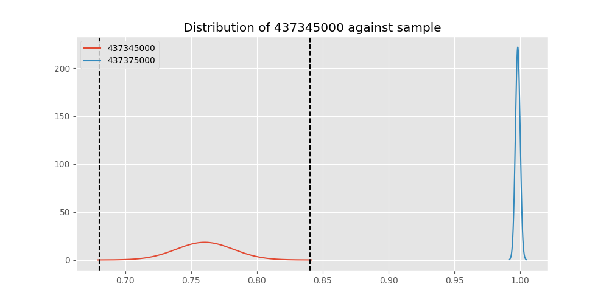
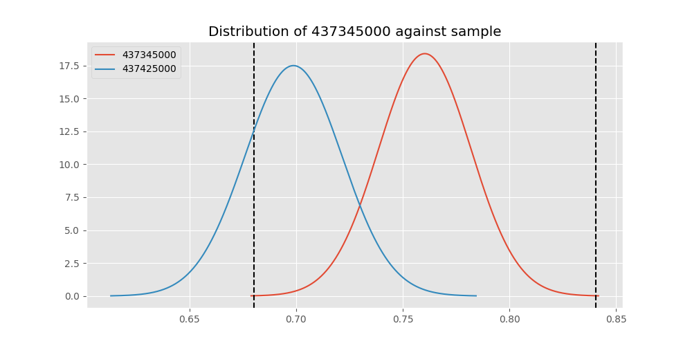

# Testing Results For 437345000 
$H_{0}$: There is not a difference in collection success against 437345000 
$H_{A}$: There is a difference in collection success against 437345000
An $\alpha$ of 0.00025 was used 
Out of 44 tests, there were 36 rejections from 44 independent-t test.
Out of 44 tests, there were 33 rejections from 44 Man Whitney u-tests.
## Testing Results for 437345000 against 436501000 
437345000 has a success rate of 0.7603092783505154
436501000 has a success rate of 0.9854014598540146
$H_{0}$: There is not a difference between 437345000 and 436501000
$H_{A}$: There is a difference between 437345000 and 436501000
An $/alpha$ of 0.00025 was used in this test.
__independent t-testing__: With a t-statistic of -9.373332574075318 and a p-value of 2.311229929317671e-19, _we **reject** the null hypothssis_
__Man-Whitney testing__: With a u-statistic of 20595.5 and a p-value of 4.172843887657257e-09, _we **reject** the null hypothssis_
 
## Testing Results for 437345000 against 437375000 
437345000 has a success rate of 0.7603092783505154
437375000 has a success rate of 0.9982014388489209
$H_{0}$: There is not a difference between 437345000 and 437375000
$H_{A}$: There is a difference between 437345000 and 437375000
An $/alpha$ of 0.00025 was used in this test.
__independent t-testing__: With a t-statistic of -10.925171964487376 and a p-value of 1.9445909321447333e-24, _we **reject** the null hypothssis_
__Man-Whitney testing__: With a u-statistic of 82204.0 and a p-value of 3.4064134205330684e-33, _we **reject** the null hypothssis_
 
## Testing Results for 437345000 against 436500000 
437345000 has a success rate of 0.7603092783505154
436500000 has a success rate of 0.9056603773584906
$H_{0}$: There is not a difference between 437345000 and 436500000
$H_{A}$: There is a difference between 437345000 and 436500000
An $/alpha$ of 0.00025 was used in this test.
__independent t-testing__: With a t-statistic of -3.9250017541814866 and a p-value of 9.783558053635216e-05, _we **reject** the null hypothssis_
__Man-Whitney testing__: With a u-statistic of 26362.5 and a p-value of 0.0001071541124568001, _we **reject** the null hypothssis_
 
## Testing Results for 437345000 against 436990000 
437345000 has a success rate of 0.7603092783505154
436990000 has a success rate of 0.9572649572649573
$H_{0}$: There is not a difference between 437345000 and 436990000
$H_{A}$: There is a difference between 437345000 and 436990000
An $/alpha$ of 0.00025 was used in this test.
__independent t-testing__: With a t-statistic of -7.74626366104949 and a p-value of 4.1224245055785706e-14, _we **reject** the null hypothssis_
__Man-Whitney testing__: With a u-statistic of 36455.0 and a p-value of 1.594528773181981e-10, _we **reject** the null hypothssis_
 
## Testing Results for 437345000 against 145875000 
437345000 has a success rate of 0.7603092783505154
145875000 has a success rate of 0.9722222222222222
$H_{0}$: There is not a difference between 437345000 and 145875000
$H_{A}$: There is a difference between 437345000 and 145875000
An $/alpha$ of 0.00025 was used in this test.
__independent t-testing__: With a t-statistic of -7.26312729336376 and a p-value of 3.827522501706433e-12, _we **reject** the null hypothssis_
__Man-Whitney testing__: With a u-statistic of 11008.0 and a p-value of 4.61318779453991e-05, _we **reject** the null hypothssis_
 
## Testing Results for 437345000 against 437800000 
437345000 has a success rate of 0.7603092783505154
437800000 has a success rate of 0.9533678756476683
$H_{0}$: There is not a difference between 437345000 and 437800000
$H_{A}$: There is a difference between 437345000 and 437800000
An $/alpha$ of 0.00025 was used in this test.
__independent t-testing__: With a t-statistic of -7.284183279049017 and a p-value of 1.0633146415223474e-12, _we **reject** the null hypothssis_
__Man-Whitney testing__: With a u-statistic of 30213.5 and a p-value of 8.627248520543909e-09, _we **reject** the null hypothssis_
 
## Testing Results for 437345000 against 145810000 
437345000 has a success rate of 0.7603092783505154
145810000 has a success rate of 0.12179487179487179
$H_{0}$: There is not a difference between 437345000 and 145810000
$H_{A}$: There is a difference between 437345000 and 145810000
An $/alpha$ of 0.00025 was used in this test.
__independent t-testing__: With a t-statistic of 16.772840092576576 and a p-value of 3.630165604041787e-51, _we **reject** the null hypothssis_
__Man-Whitney testing__: With a u-statistic of 49588.0 and a p-value of 3.0045083237265394e-42, _we **reject** the null hypothssis_
 
## Testing Results for 437345000 against 437095000 
437345000 has a success rate of 0.7603092783505154
437095000 has a success rate of 0.9361702127659575
$H_{0}$: There is not a difference between 437345000 and 437095000
$H_{A}$: There is a difference between 437345000 and 437095000
An $/alpha$ of 0.00025 was used in this test.
__independent t-testing__: With a t-statistic of -2.7633684299027634 and a p-value of 0.0059647243008889754, _we failed to reject the null hypothssis_
__Man-Whitney testing__: With a u-statistic of 7514.5 and a p-value of 0.006113600736456012, _we failed to reject the null hypothssis_
 
## Testing Results for 437345000 against 437265000 
437345000 has a success rate of 0.7603092783505154
437265000 has a success rate of 0.9795454545454545
$H_{0}$: There is not a difference between 437345000 and 437265000
$H_{A}$: There is a difference between 437345000 and 437265000
An $/alpha$ of 0.00025 was used in this test.
__independent t-testing__: With a t-statistic of -9.646265344300087 and a p-value of 3.505645599856746e-20, _we **reject** the null hypothssis_
__Man-Whitney testing__: With a u-statistic of 66646.0 and a p-value of 1.043112484131742e-21, _we **reject** the null hypothssis_
 
## Testing Results for 437345000 against 437350000 
437345000 has a success rate of 0.7603092783505154
437350000 has a success rate of 0.9488372093023256
$H_{0}$: There is not a difference between 437345000 and 437350000
$H_{A}$: There is a difference between 437345000 and 437350000
An $/alpha$ of 0.00025 was used in this test.
__independent t-testing__: With a t-statistic of -6.034702848014654 and a p-value of 2.786471437305804e-09, _we **reject** the null hypothssis_
__Man-Whitney testing__: With a u-statistic of 33846.5 and a p-value of 4.5109368040848945e-09, _we **reject** the null hypothssis_
 
## Testing Results for 437345000 against 437200000 
437345000 has a success rate of 0.7603092783505154
437200000 has a success rate of 0.8620689655172413
$H_{0}$: There is not a difference between 437345000 and 437200000
$H_{A}$: There is a difference between 437345000 and 437200000
An $/alpha$ of 0.00025 was used in this test.
__independent t-testing__: With a t-statistic of -2.9274700002769425 and a p-value of 0.0035492800874471217, _we failed to reject the null hypothssis_
__Man-Whitney testing__: With a u-statistic of 35374.5 and a p-value of 0.00363161110084039, _we failed to reject the null hypothssis_
 
## Testing Results for 437345000 against 435600000 
437345000 has a success rate of 0.7603092783505154
435600000 has a success rate of 0.9819341126461212
$H_{0}$: There is not a difference between 437345000 and 435600000
$H_{A}$: There is a difference between 437345000 and 435600000
An $/alpha$ of 0.00025 was used in this test.
__independent t-testing__: With a t-statistic of -10.014300838904804 and a p-value of 2.646027741682281e-21, _we **reject** the null hypothssis_
__Man-Whitney testing__: With a u-statistic of 142095.5 and a p-value of 1.617723992758405e-40, _we **reject** the null hypothssis_
 
## Testing Results for 437345000 against 450000000 
437345000 has a success rate of 0.7603092783505154
450000000 has a success rate of 0.8235294117647058
$H_{0}$: There is not a difference between 437345000 and 450000000
$H_{A}$: There is a difference between 437345000 and 450000000
An $/alpha$ of 0.00025 was used in this test.
__independent t-testing__: With a t-statistic of -1.2570721316324718 and a p-value of 0.20935051837462113, _we failed to reject the null hypothssis_
__Man-Whitney testing__: With a u-statistic of 15447.5 and a p-value of 0.20922561488832336, _we failed to reject the null hypothssis_
 
## Testing Results for 437345000 against 145978500 
437345000 has a success rate of 0.7603092783505154
145978500 has a success rate of 0.9963636363636363
$H_{0}$: There is not a difference between 437345000 and 145978500
$H_{A}$: There is a difference between 437345000 and 145978500
An $/alpha$ of 0.00025 was used in this test.
__independent t-testing__: With a t-statistic of -10.728356541465601 and a p-value of 7.971487973188129e-24, _we **reject** the null hypothssis_
__Man-Whitney testing__: With a u-statistic of 40756.5 and a p-value of 9.653890237297466e-18, _we **reject** the null hypothssis_
 
## Testing Results for 437345000 against 437050000 
437345000 has a success rate of 0.7603092783505154
437050000 has a success rate of 0.5346534653465347
$H_{0}$: There is not a difference between 437345000 and 437050000
$H_{A}$: There is a difference between 437345000 and 437050000
An $/alpha$ of 0.00025 was used in this test.
__independent t-testing__: With a t-statistic of 4.553710773434671 and a p-value of 6.668017452988204e-06, _we **reject** the null hypothssis_
__Man-Whitney testing__: With a u-statistic of 24015.5 and a p-value of 8.050940400256768e-06, _we **reject** the null hypothssis_
 
## Testing Results for 437345000 against 435300000 
437345000 has a success rate of 0.7603092783505154
435300000 has a success rate of 0.1232876712328767
$H_{0}$: There is not a difference between 437345000 and 435300000
$H_{A}$: There is a difference between 437345000 and 435300000
An $/alpha$ of 0.00025 was used in this test.
__independent t-testing__: With a t-statistic of 16.272329719386605 and a p-value of 1.2929831693423397e-48, _we **reject** the null hypothssis_
__Man-Whitney testing__: With a u-statistic of 46367.0 and a p-value of 2.0653612413188144e-40, _we **reject** the null hypothssis_
 
## Testing Results for 437345000 against 437475000 
437345000 has a success rate of 0.7603092783505154
437475000 has a success rate of 0.5045045045045045
$H_{0}$: There is not a difference between 437345000 and 437475000
$H_{A}$: There is a difference between 437345000 and 437475000
An $/alpha$ of 0.00025 was used in this test.
__independent t-testing__: With a t-statistic of 8.193554987022148 and a p-value of 8.233620521196554e-16, _we **reject** the null hypothssis_
__Man-Whitney testing__: With a u-statistic of 135212.5 and a p-value of 2.3731720471987667e-15, _we **reject** the null hypothssis_
 
## Testing Results for 437345000 against 435448000 
437345000 has a success rate of 0.7603092783505154
435448000 has a success rate of 0.975
$H_{0}$: There is not a difference between 437345000 and 435448000
$H_{A}$: There is a difference between 437345000 and 435448000
An $/alpha$ of 0.00025 was used in this test.
__independent t-testing__: With a t-statistic of -6.4852603159127025 and a p-value of 2.397382167862387e-09, _we **reject** the null hypothssis_
__Man-Whitney testing__: With a u-statistic of 6094.0 and a p-value of 0.001819522579233822, _we failed to reject the null hypothssis_
 
## Testing Results for 437345000 against 437644000 
437345000 has a success rate of 0.7603092783505154
437644000 has a success rate of 0.9743589743589743
$H_{0}$: There is not a difference between 437345000 and 437644000
$H_{A}$: There is a difference between 437345000 and 437644000
An $/alpha$ of 0.00025 was used in this test.
__independent t-testing__: With a t-statistic of -8.170802548593628 and a p-value of 2.693768766321403e-15, _we **reject** the null hypothssis_
__Man-Whitney testing__: With a u-statistic of 17839.5 and a p-value of 2.385140080538959e-07, _we **reject** the null hypothssis_
 
## Testing Results for 437345000 against 145825000 
437345000 has a success rate of 0.7603092783505154
145825000 has a success rate of 0.8687448728465955
$H_{0}$: There is not a difference between 437345000 and 145825000
$H_{A}$: There is a difference between 437345000 and 145825000
An $/alpha$ of 0.00025 was used in this test.
__independent t-testing__: With a t-statistic of -5.645734317251672 and a p-value of 1.808351620346337e-08, _we **reject** the null hypothssis_
__Man-Whitney testing__: With a u-statistic of 421685.0 and a p-value of 1.964722731839446e-08, _we **reject** the null hypothssis_
 
## Testing Results for 437345000 against 435275000 
437345000 has a success rate of 0.7603092783505154
435275000 has a success rate of 0.9152542372881356
$H_{0}$: There is not a difference between 437345000 and 435275000
$H_{A}$: There is a difference between 437345000 and 435275000
An $/alpha$ of 0.00025 was used in this test.
__independent t-testing__: With a t-statistic of -3.702594276467244 and a p-value of 0.0002369562357395499, _we **reject** the null hypothssis_
__Man-Whitney testing__: With a u-statistic of 19345.0 and a p-value of 0.00025583295865836536, _we failed to reject the null hypothssis_
 
## Testing Results for 437345000 against 437322500 
437345000 has a success rate of 0.7603092783505154
437322500 has a success rate of 0.9961685823754789
$H_{0}$: There is not a difference between 437345000 and 437322500
$H_{A}$: There is a difference between 437345000 and 437322500
An $/alpha$ of 0.00025 was used in this test.
__independent t-testing__: With a t-statistic of -10.703401661927119 and a p-value of 9.517874534106518e-24, _we **reject** the null hypothssis_
__Man-Whitney testing__: With a u-statistic of 38691.5 and a p-value of 6.029110571256466e-17, _we **reject** the null hypothssis_
 
## Testing Results for 437345000 against 437450000 
437345000 has a success rate of 0.7603092783505154
437450000 has a success rate of 0.6947791164658634
$H_{0}$: There is not a difference between 437345000 and 437450000
$H_{A}$: There is a difference between 437345000 and 437450000
An $/alpha$ of 0.00025 was used in this test.
__independent t-testing__: With a t-statistic of 1.8298664274186078 and a p-value of 0.06773856777065418, _we failed to reject the null hypothssis_
__Man-Whitney testing__: With a u-statistic of 51471.5 and a p-value of 0.0678188027258189, _we failed to reject the null hypothssis_
 
## Testing Results for 437345000 against 436703000 
437345000 has a success rate of 0.7603092783505154
436703000 has a success rate of 0.9859154929577465
$H_{0}$: There is not a difference between 437345000 and 436703000
$H_{A}$: There is a difference between 437345000 and 436703000
An $/alpha$ of 0.00025 was used in this test.
__independent t-testing__: With a t-statistic of -9.74104620280378 and a p-value of 1.3453436212347171e-20, _we **reject** the null hypothssis_
__Man-Whitney testing__: With a u-statistic of 31999.5 and a p-value of 5.399054053979229e-13, _we **reject** the null hypothssis_
 
## Testing Results for 437345000 against 400500000 
437345000 has a success rate of 0.7603092783505154
400500000 has a success rate of 0.3508771929824561
$H_{0}$: There is not a difference between 437345000 and 400500000
$H_{A}$: There is a difference between 437345000 and 400500000
An $/alpha$ of 0.00025 was used in this test.
__independent t-testing__: With a t-statistic of 6.640749141027078 and a p-value of 9.159620916862264e-11, _we **reject** the null hypothssis_
__Man-Whitney testing__: With a u-statistic of 15585.5 and a p-value of 2.30583539009799e-10, _we **reject** the null hypothssis_
 
## Testing Results for 437345000 against 437150000 
437345000 has a success rate of 0.7603092783505154
437150000 has a success rate of 0.9859550561797753
$H_{0}$: There is not a difference between 437345000 and 437150000
$H_{A}$: There is a difference between 437345000 and 437150000
An $/alpha$ of 0.00025 was used in this test.
__independent t-testing__: With a t-statistic of -9.992648909281694 and a p-value of 2.2748902366569352e-21, _we **reject** the null hypothssis_
__Man-Whitney testing__: With a u-statistic of 53480.0 and a p-value of 1.038120565484802e-19, _we **reject** the null hypothssis_
 
## Testing Results for 437345000 against 435635000 
437345000 has a success rate of 0.7603092783505154
435635000 has a success rate of 0.9849624060150376
$H_{0}$: There is not a difference between 437345000 and 435635000
$H_{A}$: There is a difference between 437345000 and 435635000
An $/alpha$ of 0.00025 was used in this test.
__independent t-testing__: With a t-statistic of -9.303303616269803 and a p-value of 4.0343382406083887e-19, _we **reject** the null hypothssis_
__Man-Whitney testing__: With a u-statistic of 20005.5 and a p-value of 7.280941865604109e-09, _we **reject** the null hypothssis_
 
## Testing Results for 437345000 against 437384000 
437345000 has a success rate of 0.7603092783505154
437384000 has a success rate of 0.968421052631579
$H_{0}$: There is not a difference between 437345000 and 437384000
$H_{A}$: There is a difference between 437345000 and 437384000
An $/alpha$ of 0.00025 was used in this test.
__independent t-testing__: With a t-statistic of -8.273595566722362 and a p-value of 9.454141280783677e-16, _we **reject** the null hypothssis_
__Man-Whitney testing__: With a u-statistic of 29189.0 and a p-value of 4.5899603234308293e-10, _we **reject** the null hypothssis_
 
## Testing Results for 437345000 against 437405000 
437345000 has a success rate of 0.7603092783505154
437405000 has a success rate of 0.9953917050691244
$H_{0}$: There is not a difference between 437345000 and 437405000
$H_{A}$: There is a difference between 437345000 and 437405000
An $/alpha$ of 0.00025 was used in this test.
__independent t-testing__: With a t-statistic of -10.596843981240932 and a p-value of 2.033396757540744e-23, _we **reject** the null hypothssis_
__Man-Whitney testing__: With a u-statistic of 32201.5 and a p-value of 2.030096485524855e-14, _we **reject** the null hypothssis_
 
## Testing Results for 437345000 against 435612500 
437345000 has a success rate of 0.7603092783505154
435612500 has a success rate of 0.9770114942528736
$H_{0}$: There is not a difference between 437345000 and 435612500
$H_{A}$: There is a difference between 437345000 and 435612500
An $/alpha$ of 0.00025 was used in this test.
__independent t-testing__: With a t-statistic of -8.009187662315647 and a p-value of 1.3281852057474407e-14, _we **reject** the null hypothssis_
__Man-Whitney testing__: With a u-statistic of 13220.5 and a p-value of 5.077078309815796e-06, _we **reject** the null hypothssis_
 
## Testing Results for 437345000 against 435975000 
437345000 has a success rate of 0.7603092783505154
435975000 has a success rate of 0.92
$H_{0}$: There is not a difference between 437345000 and 435975000
$H_{A}$: There is a difference between 437345000 and 435975000
An $/alpha$ of 0.00025 was used in this test.
__independent t-testing__: With a t-statistic of -2.5729602079803553 and a p-value of 0.010412964057441859, _we failed to reject the null hypothssis_
__Man-Whitney testing__: With a u-statistic of 8151.0 and a p-value of 0.010595987366305522, _we failed to reject the null hypothssis_
 
## Testing Results for 437345000 against 437425000 
437345000 has a success rate of 0.7603092783505154
437425000 has a success rate of 0.6987654320987654
$H_{0}$: There is not a difference between 437345000 and 437425000
$H_{A}$: There is a difference between 437345000 and 437425000
An $/alpha$ of 0.00025 was used in this test.
__independent t-testing__: With a t-statistic of 1.9510824643890938 and a p-value of 0.05139993879612831, _we failed to reject the null hypothssis_
__Man-Whitney testing__: With a u-statistic of 83405.5 and a p-value of 0.05148283622085857, _we failed to reject the null hypothssis_
 
## Testing Results for 437345000 against 437275000 
437345000 has a success rate of 0.7603092783505154
437275000 has a success rate of 0.3643724696356275
$H_{0}$: There is not a difference between 437345000 and 437275000
$H_{A}$: There is a difference between 437345000 and 437275000
An $/alpha$ of 0.00025 was used in this test.
__independent t-testing__: With a t-statistic of 10.820418644290074 and a p-value of 3.742918575104905e-25, _we **reject** the null hypothssis_
__Man-Whitney testing__: With a u-statistic of 66890.5 and a p-value of 2.580578557733349e-23, _we **reject** the null hypothssis_
 
## Testing Results for 437345000 against 145840000 
437345000 has a success rate of 0.7603092783505154
145840000 has a success rate of 0.9649122807017544
$H_{0}$: There is not a difference between 437345000 and 145840000
$H_{A}$: There is a difference between 437345000 and 145840000
An $/alpha$ of 0.00025 was used in this test.
__independent t-testing__: With a t-statistic of -6.238929775092624 and a p-value of 3.657129864951401e-09, _we **reject** the null hypothssis_
__Man-Whitney testing__: With a u-statistic of 8795.5 and a p-value of 0.00043922304472726733, _we failed to reject the null hypothssis_
 
## Testing Results for 437345000 against 435525000 
437345000 has a success rate of 0.7603092783505154
435525000 has a success rate of 0.6923076923076923
$H_{0}$: There is not a difference between 437345000 and 435525000
$H_{A}$: There is a difference between 437345000 and 435525000
An $/alpha$ of 0.00025 was used in this test.
__independent t-testing__: With a t-statistic of 1.5894869892642773 and a p-value of 0.11254792245420644, _we failed to reject the null hypothssis_
__Man-Whitney testing__: With a u-statistic of 29628.5 and a p-value of 0.11256196275489871, _we failed to reject the null hypothssis_
 
## Testing Results for 437345000 against 436250000 
437345000 has a success rate of 0.7603092783505154
436250000 has a success rate of 0.17857142857142858
$H_{0}$: There is not a difference between 437345000 and 436250000
$H_{A}$: There is a difference between 437345000 and 436250000
An $/alpha$ of 0.00025 was used in this test.
__independent t-testing__: With a t-statistic of 9.63063494444343 and a p-value of 4.6990800307268526e-20, _we **reject** the null hypothssis_
__Man-Whitney testing__: With a u-statistic of 17184.0 and a p-value of 1.8692861348196313e-18, _we **reject** the null hypothssis_
 
## Testing Results for 437345000 against 435950000 
437345000 has a success rate of 0.7603092783505154
435950000 has a success rate of 0.9850187265917603
$H_{0}$: There is not a difference between 437345000 and 435950000
$H_{A}$: There is a difference between 437345000 and 435950000
An $/alpha$ of 0.00025 was used in this test.
__independent t-testing__: With a t-statistic of -10.063527908708709 and a p-value of 1.5139925041306219e-21, _we **reject** the null hypothssis_
__Man-Whitney testing__: With a u-statistic of 80317.0 and a p-value of 4.305163785596945e-27, _we **reject** the null hypothssis_
 
## Testing Results for 437345000 against 435800000 
437345000 has a success rate of 0.7603092783505154
435800000 has a success rate of 0.5390070921985816
$H_{0}$: There is not a difference between 437345000 and 435800000
$H_{A}$: There is a difference between 437345000 and 435800000
An $/alpha$ of 0.00025 was used in this test.
__independent t-testing__: With a t-statistic of 5.024123053975842 and a p-value of 6.936641608777574e-07, _we **reject** the null hypothssis_
__Man-Whitney testing__: With a u-statistic of 33407.5 and a p-value of 9.005662182198052e-07, _we **reject** the null hypothssis_
 
## Testing Results for 437345000 against 437485000 
437345000 has a success rate of 0.7603092783505154
437485000 has a success rate of 0.9375
$H_{0}$: There is not a difference between 437345000 and 437485000
$H_{A}$: There is a difference between 437345000 and 437485000
An $/alpha$ of 0.00025 was used in this test.
__independent t-testing__: With a t-statistic of -2.311934814980235 and a p-value of 0.021266562903742278, _we failed to reject the null hypothssis_
__Man-Whitney testing__: With a u-statistic of 5108.0 and a p-value of 0.021505259604094627, _we failed to reject the null hypothssis_
 
## Testing Results for 437345000 against 136770000 
437345000 has a success rate of 0.7603092783505154
136770000 has a success rate of 0.9945945945945946
$H_{0}$: There is not a difference between 437345000 and 136770000
$H_{A}$: There is a difference between 437345000 and 136770000
An $/alpha$ of 0.00025 was used in this test.
__independent t-testing__: With a t-statistic of -10.476296363598893 and a p-value of 4.840864826259686e-23, _we **reject** the null hypothssis_
__Man-Whitney testing__: With a u-statistic of 27481.5 and a p-value of 1.5013747730853394e-12, _we **reject** the null hypothssis_
 
## Testing Results for 437345000 against 437250000 
437345000 has a success rate of 0.7603092783505154
437250000 has a success rate of 0.9937106918238994
$H_{0}$: There is not a difference between 437345000 and 437250000
$H_{A}$: There is a difference between 437345000 and 437250000
An $/alpha$ of 0.00025 was used in this test.
__independent t-testing__: With a t-statistic of -10.53736545884641 and a p-value of 3.443343447587519e-23, _we **reject** the null hypothssis_
__Man-Whitney testing__: With a u-statistic of 47293.0 and a p-value of 1.6394574450491497e-19, _we **reject** the null hypothssis_
 
## Testing Results for 437345000 against 437356000 
437345000 has a success rate of 0.7603092783505154
437356000 has a success rate of 0.9328358208955224
$H_{0}$: There is not a difference between 437345000 and 437356000
$H_{A}$: There is a difference between 437345000 and 437356000
An $/alpha$ of 0.00025 was used in this test.
__independent t-testing__: With a t-statistic of -4.414592243690732 and a p-value of 1.2314019770446372e-05, _we **reject** the null hypothssis_
__Man-Whitney testing__: With a u-statistic of 21511.0 and a p-value of 1.4391361427195801e-05, _we **reject** the null hypothssis_
 
## Testing Results for 437345000 against 437676000 
437345000 has a success rate of 0.7603092783505154
437676000 has a success rate of 0.9813432835820896
$H_{0}$: There is not a difference between 437345000 and 437676000
$H_{A}$: There is a difference between 437345000 and 437676000
An $/alpha$ of 0.00025 was used in this test.
__independent t-testing__: With a t-statistic of -9.516427641685496 and a p-value of 7.98271995203676e-20, _we **reject** the null hypothssis_
__Man-Whitney testing__: With a u-statistic of 40500.0 and a p-value of 6.173676329091501e-15, _we **reject** the null hypothssis_
 
## Testing Results for 437345000 against 145826800 
437345000 has a success rate of 0.7603092783505154
145826800 has a success rate of 0.966183574879227
$H_{0}$: There is not a difference between 437345000 and 145826800
$H_{A}$: There is a difference between 437345000 and 145826800
An $/alpha$ of 0.00025 was used in this test.
__independent t-testing__: With a t-statistic of -8.205431643747355 and a p-value of 1.535390909216441e-15, _we **reject** the null hypothssis_
__Man-Whitney testing__: With a u-statistic of 31890.5 and a p-value of 1.6482495341317658e-10, _we **reject** the null hypothssis_
 
