# Testing Results For 437350000 
$H_{0}$: There is not a difference in collection success against 437350000 
$H_{A}$: There is a difference in collection success against 437350000
An $\alpha$ of 0.00025 was used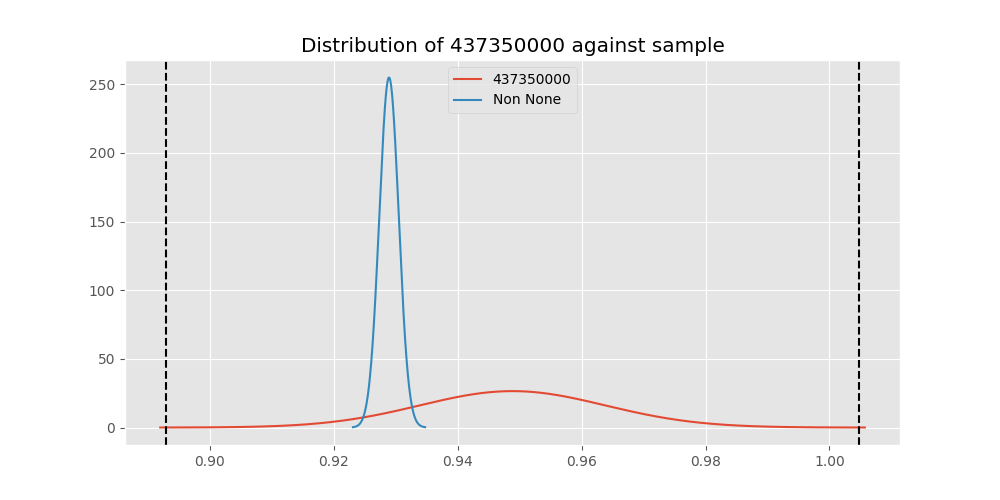 
Out of 44 tests, there were 12 rejections from 44 independent-t test.
Out of 44 tests, there were 13 rejections from 44 Man Whitney u-tests.
## Testing Results for 437350000 against 436501000 
437350000 has a success rate of 0.9488372093023256
436501000 has a success rate of 0.9854014598540146
$H_{0}$: There is not a difference between 437350000 and 436501000
$H_{A}$: There is a difference between 437350000 and 436501000
An $/alpha$ of 0.00025 was used in this test.
__independent t-testing__: With a t-statistic of -1.776428670869589 and a p-value of 0.07653089315148083, _we failed to reject the null hypothssis_
__Man-Whitney testing__: With a u-statistic of 14189.0 and a p-value of 0.07683477727300946, _we failed to reject the null hypothssis_
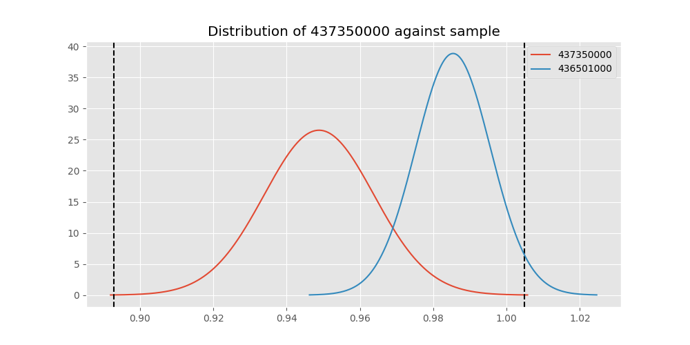 
## Testing Results for 437350000 against 437375000 
437350000 has a success rate of 0.9488372093023256
437375000 has a success rate of 0.9982014388489209
$H_{0}$: There is not a difference between 437350000 and 437375000
$H_{A}$: There is a difference between 437350000 and 437375000
An $/alpha$ of 0.00025 was used in this test.
__independent t-testing__: With a t-statistic of -3.2544053351737023 and a p-value of 0.0013153371038780806, _we failed to reject the null hypothssis_
__Man-Whitney testing__: With a u-statistic of 56819.5 and a p-value of 6.988406515914729e-07, _we **reject** the null hypothssis_
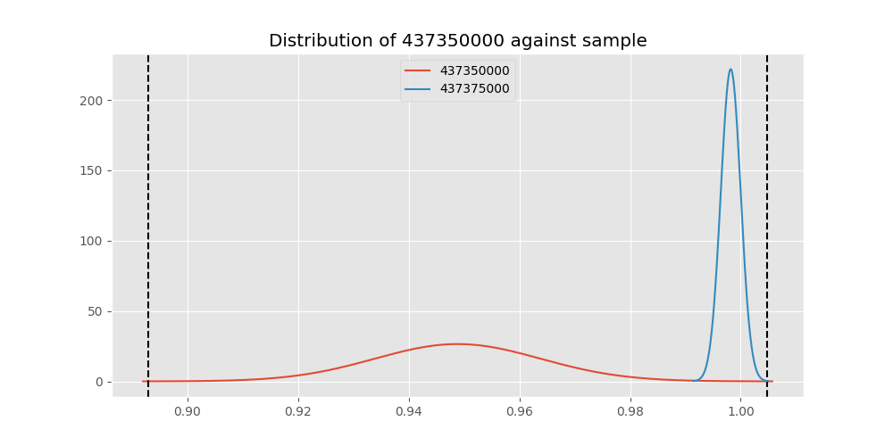 
## Testing Results for 437350000 against 436500000 
437350000 has a success rate of 0.9488372093023256
436500000 has a success rate of 0.9056603773584906
$H_{0}$: There is not a difference between 437350000 and 436500000
$H_{A}$: There is a difference between 437350000 and 436500000
An $/alpha$ of 0.00025 was used in this test.
__independent t-testing__: With a t-statistic of 1.624421068868591 and a p-value of 0.105132925728578, _we failed to reject the null hypothssis_
__Man-Whitney testing__: With a u-statistic of 17830.5 and a p-value of 0.10528249673275926, _we failed to reject the null hypothssis_
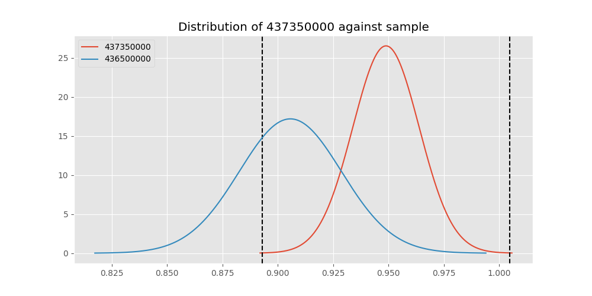 
## Testing Results for 437350000 against 436990000 
437350000 has a success rate of 0.9488372093023256
436990000 has a success rate of 0.9572649572649573
$H_{0}$: There is not a difference between 437350000 and 436990000
$H_{A}$: There is a difference between 437350000 and 436990000
An $/alpha$ of 0.00025 was used in this test.
__independent t-testing__: With a t-statistic of -0.42164531210595874 and a p-value of 0.6734866204829508, _we failed to reject the null hypothssis_
__Man-Whitney testing__: With a u-statistic of 24943.0 and a p-value of 0.6737277657665467, _we failed to reject the null hypothssis_
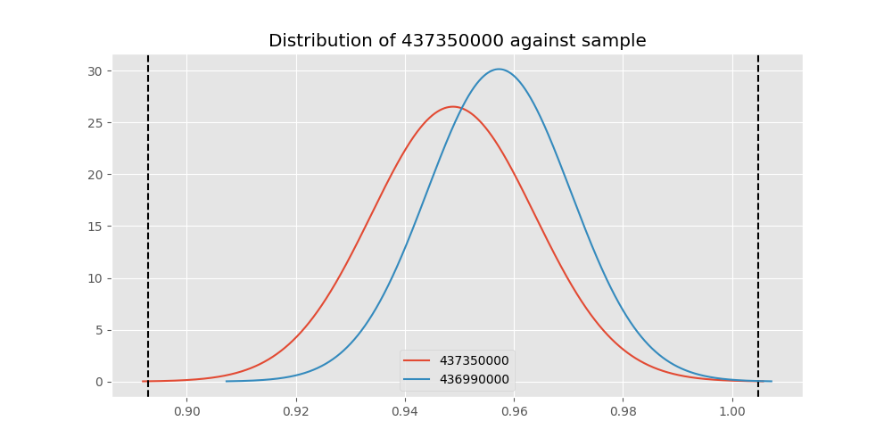 
## Testing Results for 437350000 against 145875000 
437350000 has a success rate of 0.9488372093023256
145875000 has a success rate of 0.9722222222222222
$H_{0}$: There is not a difference between 437350000 and 145875000
$H_{A}$: There is a difference between 437350000 and 145875000
An $/alpha$ of 0.00025 was used in this test.
__independent t-testing__: With a t-statistic of -0.8239772985758755 and a p-value of 0.4106414690065989, _we failed to reject the null hypothssis_
__Man-Whitney testing__: With a u-statistic of 7559.0 and a p-value of 0.41098429045641494, _we failed to reject the null hypothssis_
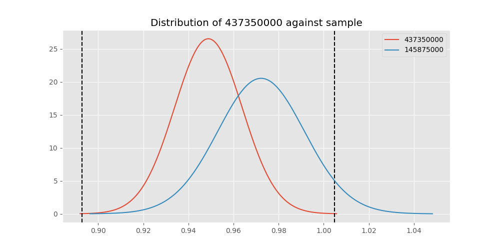 
## Testing Results for 437350000 against 437800000 
437350000 has a success rate of 0.9488372093023256
437800000 has a success rate of 0.9533678756476683
$H_{0}$: There is not a difference between 437350000 and 437800000
$H_{A}$: There is a difference between 437350000 and 437800000
An $/alpha$ of 0.00025 was used in this test.
__independent t-testing__: With a t-statistic of -0.2111134763045253 and a p-value of 0.832904647713378, _we failed to reject the null hypothssis_
__Man-Whitney testing__: With a u-statistic of 20653.5 and a p-value of 0.833482357167252, _we failed to reject the null hypothssis_
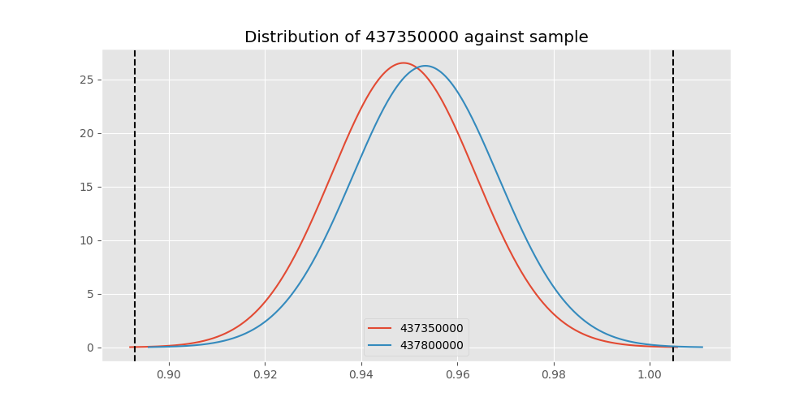 
## Testing Results for 437350000 against 145810000 
437350000 has a success rate of 0.9488372093023256
145810000 has a success rate of 0.12179487179487179
$H_{0}$: There is not a difference between 437350000 and 145810000
$H_{A}$: There is a difference between 437350000 and 145810000
An $/alpha$ of 0.00025 was used in this test.
__independent t-testing__: With a t-statistic of 29.004526712585694 and a p-value of 3.3240894356187624e-97, _we **reject** the null hypothssis_
__Man-Whitney testing__: With a u-statistic of 30639.5 and a p-value of 7.097969080792088e-58, _we **reject** the null hypothssis_
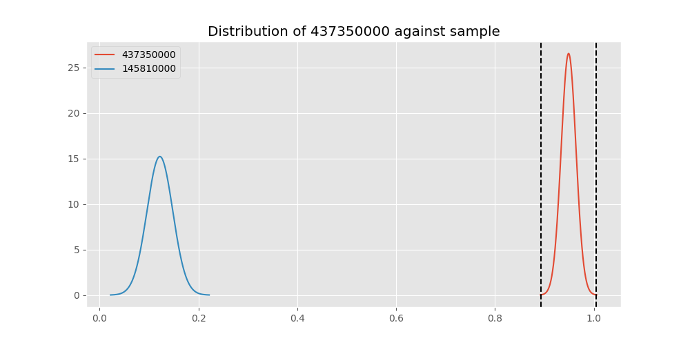 
## Testing Results for 437350000 against 437095000 
437350000 has a success rate of 0.9488372093023256
437095000 has a success rate of 0.9361702127659575
$H_{0}$: There is not a difference between 437350000 and 437095000
$H_{A}$: There is a difference between 437350000 and 437095000
An $/alpha$ of 0.00025 was used in this test.
__independent t-testing__: With a t-statistic of 0.3485299105849248 and a p-value of 0.7277243055505505, _we failed to reject the null hypothssis_
__Man-Whitney testing__: With a u-statistic of 5116.5 and a p-value of 0.7290492727616558, _we failed to reject the null hypothssis_
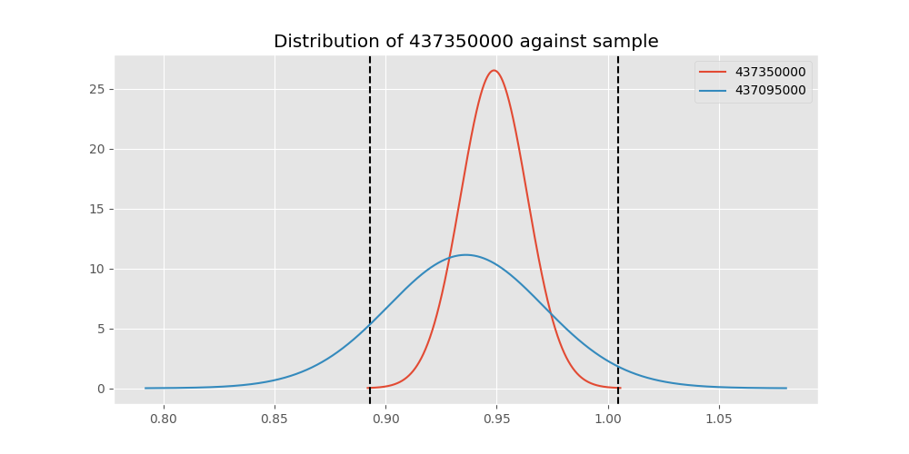 
## Testing Results for 437350000 against 437265000 
437350000 has a success rate of 0.9488372093023256
437265000 has a success rate of 0.9795454545454545
$H_{0}$: There is not a difference between 437350000 and 437265000
$H_{A}$: There is a difference between 437350000 and 437265000
An $/alpha$ of 0.00025 was used in this test.
__independent t-testing__: With a t-statistic of -2.149245214657794 and a p-value of 0.03198179523564946, _we failed to reject the null hypothssis_
__Man-Whitney testing__: With a u-statistic of 45847.5 and a p-value of 0.03214643772678945, _we failed to reject the null hypothssis_
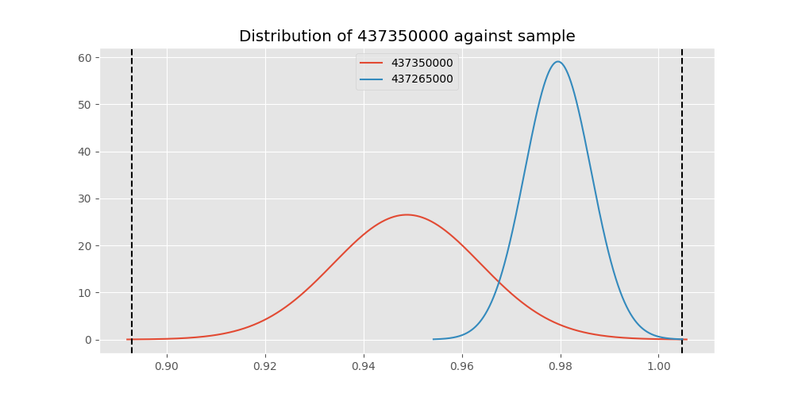 
## Testing Results for 437350000 against 437200000 
437350000 has a success rate of 0.9488372093023256
437200000 has a success rate of 0.8620689655172413
$H_{0}$: There is not a difference between 437350000 and 437200000
$H_{A}$: There is a difference between 437350000 and 437200000
An $/alpha$ of 0.00025 was used in this test.
__independent t-testing__: With a t-statistic of 3.075421207599882 and a p-value of 0.0022407298282017887, _we failed to reject the null hypothssis_
__Man-Whitney testing__: With a u-statistic of 23716.0 and a p-value of 0.002335376549475506, _we failed to reject the null hypothssis_
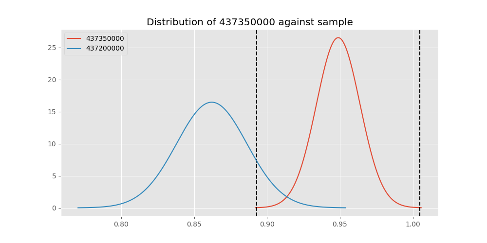 
## Testing Results for 437350000 against 435600000 
437350000 has a success rate of 0.9488372093023256
435600000 has a success rate of 0.9819341126461212
$H_{0}$: There is not a difference between 437350000 and 435600000
$H_{A}$: There is a difference between 437350000 and 435600000
An $/alpha$ of 0.00025 was used in this test.
__independent t-testing__: With a t-statistic of -2.8556158229124473 and a p-value of 0.004372290680740214, _we failed to reject the null hypothssis_
__Man-Whitney testing__: With a u-statistic of 97809.5 and a p-value of 0.004421840247414322, _we failed to reject the null hypothssis_
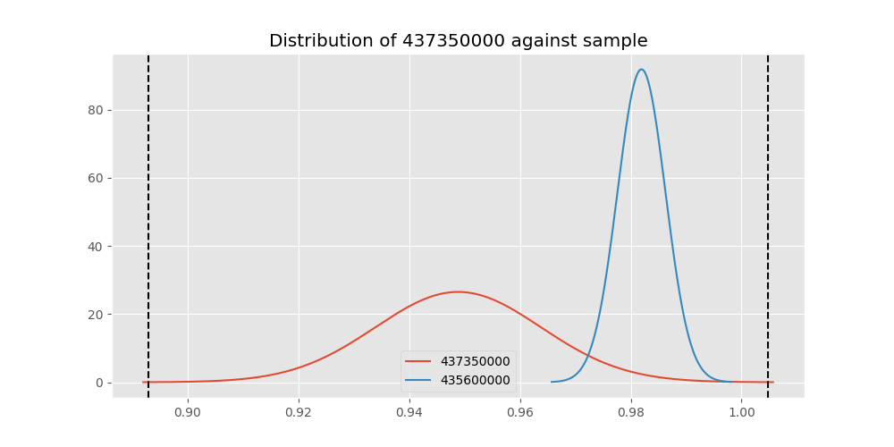 
## Testing Results for 437350000 against 450000000 
437350000 has a success rate of 0.9488372093023256
450000000 has a success rate of 0.8235294117647058
$H_{0}$: There is not a difference between 437350000 and 450000000
$H_{A}$: There is a difference between 437350000 and 450000000
An $/alpha$ of 0.00025 was used in this test.
__independent t-testing__: With a t-statistic of 3.536557290457308 and a p-value of 0.0004699140860145712, _we failed to reject the null hypothssis_
__Man-Whitney testing__: With a u-statistic of 10282.5 and a p-value of 0.0005226101189041816, _we failed to reject the null hypothssis_
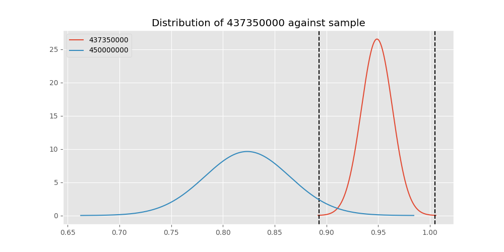 
## Testing Results for 437350000 against 145978500 
437350000 has a success rate of 0.9488372093023256
145978500 has a success rate of 0.9963636363636363
$H_{0}$: There is not a difference between 437350000 and 145978500
$H_{A}$: There is a difference between 437350000 and 145978500
An $/alpha$ of 0.00025 was used in this test.
__independent t-testing__: With a t-statistic of -3.067372424563531 and a p-value of 0.0024081424103935367, _we failed to reject the null hypothssis_
__Man-Whitney testing__: With a u-statistic of 28157.5 and a p-value of 0.0007435462509196483, _we failed to reject the null hypothssis_
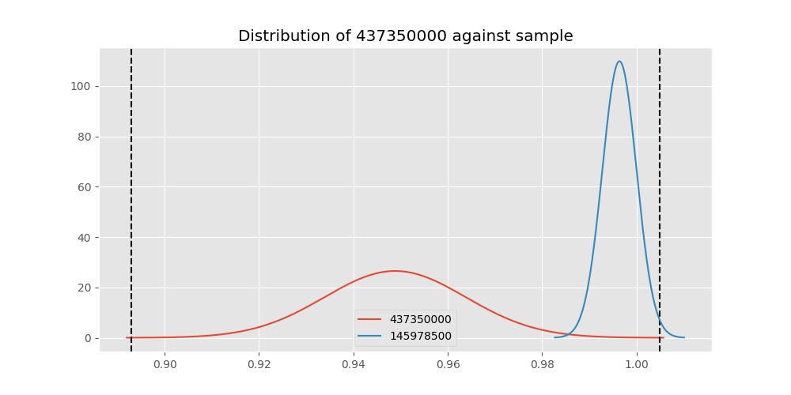 
## Testing Results for 437350000 against 437050000 
437350000 has a success rate of 0.9488372093023256
437050000 has a success rate of 0.5346534653465347
$H_{0}$: There is not a difference between 437350000 and 437050000
$H_{A}$: There is a difference between 437350000 and 437050000
An $/alpha$ of 0.00025 was used in this test.
__independent t-testing__: With a t-statistic of 10.201809560622806 and a p-value of 2.7024683082004086e-21, _we **reject** the null hypothssis_
__Man-Whitney testing__: With a u-statistic of 15354.5 and a p-value of 8.418182038231784e-19, _we **reject** the null hypothssis_
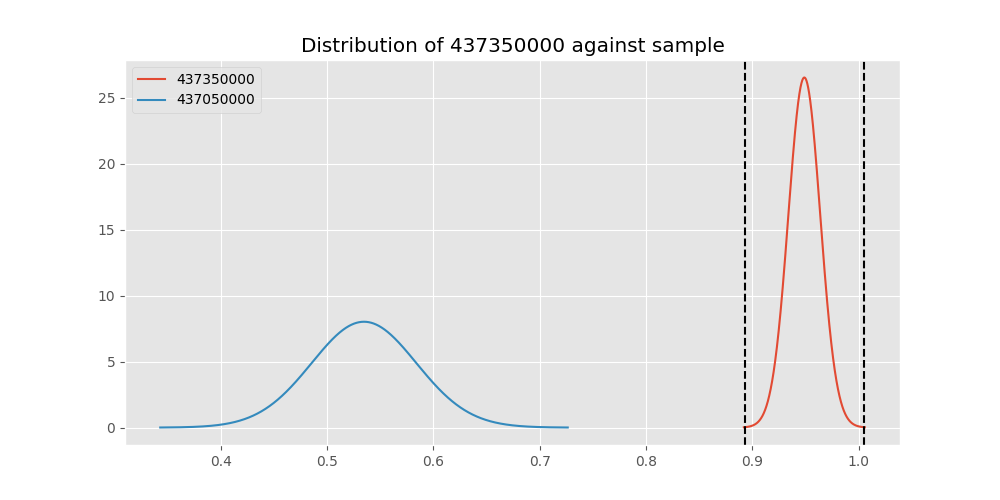 
## Testing Results for 437350000 against 435300000 
437350000 has a success rate of 0.9488372093023256
435300000 has a success rate of 0.1232876712328767
$H_{0}$: There is not a difference between 437350000 and 435300000
$H_{A}$: There is a difference between 437350000 and 435300000
An $/alpha$ of 0.00025 was used in this test.
__independent t-testing__: With a t-statistic of 28.486059807945974 and a p-value of 3.739777299197268e-94, _we **reject** the null hypothssis_
__Man-Whitney testing__: With a u-statistic of 28652.0 and a p-value of 3.2350797051730267e-56, _we **reject** the null hypothssis_
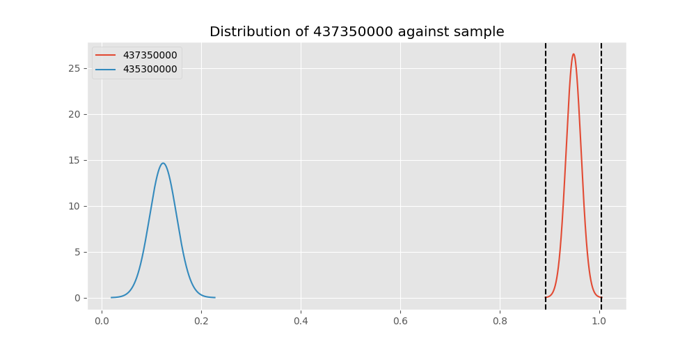 
## Testing Results for 437350000 against 437475000 
437350000 has a success rate of 0.9488372093023256
437475000 has a success rate of 0.5045045045045045
$H_{0}$: There is not a difference between 437350000 and 437475000
$H_{A}$: There is a difference between 437350000 and 437475000
An $/alpha$ of 0.00025 was used in this test.
__independent t-testing__: With a t-statistic of 12.55046584168424 and a p-value of 5.352374032451705e-33, _we **reject** the null hypothssis_
__Man-Whitney testing__: With a u-statistic of 86172.5 and a p-value of 2.6410525337490347e-30, _we **reject** the null hypothssis_
 
## Testing Results for 437350000 against 435448000 
437350000 has a success rate of 0.9488372093023256
435448000 has a success rate of 0.975
$H_{0}$: There is not a difference between 437350000 and 435448000
$H_{A}$: There is a difference between 437350000 and 435448000
An $/alpha$ of 0.00025 was used in this test.
__independent t-testing__: With a t-statistic of -0.7153829723664595 and a p-value of 0.47503209572956595, _we failed to reject the null hypothssis_
__Man-Whitney testing__: With a u-statistic of 4187.5 and a p-value of 0.47591446914946967, _we failed to reject the null hypothssis_
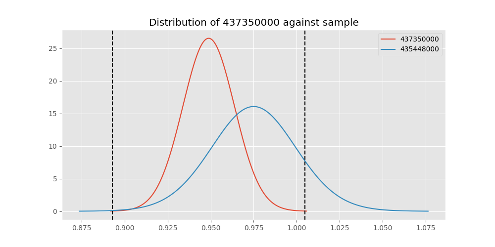 
## Testing Results for 437350000 against 437644000 
437350000 has a success rate of 0.9488372093023256
437644000 has a success rate of 0.9743589743589743
$H_{0}$: There is not a difference between 437350000 and 437644000
$H_{A}$: There is a difference between 437350000 and 437644000
An $/alpha$ of 0.00025 was used in this test.
__independent t-testing__: With a t-statistic of -1.1040860283303322 and a p-value of 0.27036022864613035, _we failed to reject the null hypothssis_
__Man-Whitney testing__: With a u-statistic of 12256.5 and a p-value of 0.27046090687954316, _we failed to reject the null hypothssis_
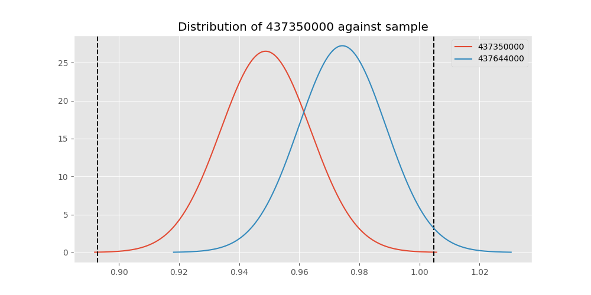 
## Testing Results for 437350000 against 145825000 
437350000 has a success rate of 0.9488372093023256
145825000 has a success rate of 0.8687448728465955
$H_{0}$: There is not a difference between 437350000 and 145825000
$H_{A}$: There is a difference between 437350000 and 145825000
An $/alpha$ of 0.00025 was used in this test.
__independent t-testing__: With a t-statistic of 3.413020330343414 and a p-value of 0.0006521138009697137, _we failed to reject the null hypothssis_
__Man-Whitney testing__: With a u-statistic of 283076.0 and a p-value of 0.0006589622008545149, _we failed to reject the null hypothssis_
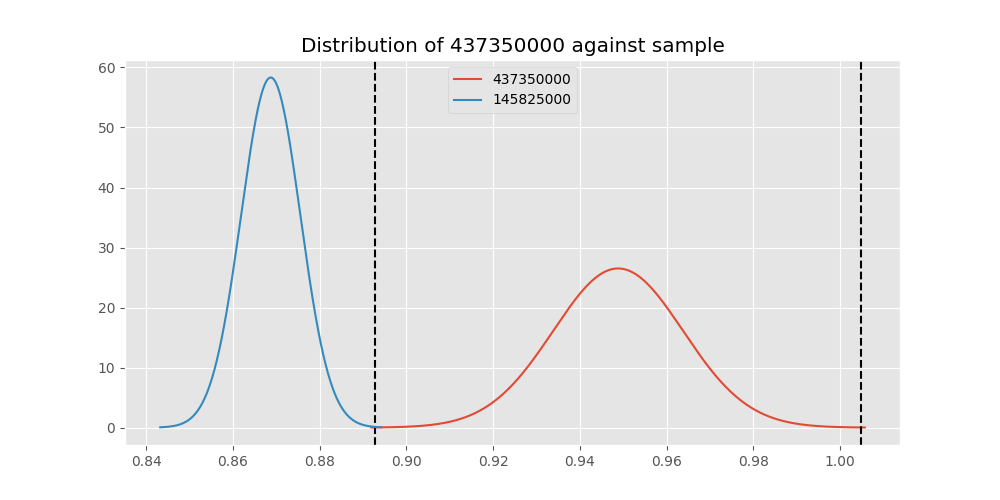 
## Testing Results for 437350000 against 437345000 
437350000 has a success rate of 0.9488372093023256
437345000 has a success rate of 0.7603092783505154
$H_{0}$: There is not a difference between 437350000 and 437345000
$H_{A}$: There is a difference between 437350000 and 437345000
An $/alpha$ of 0.00025 was used in this test.
__independent t-testing__: With a t-statistic of 6.034702848014654 and a p-value of 2.786471437305804e-09, _we **reject** the null hypothssis_
__Man-Whitney testing__: With a u-statistic of 49573.5 and a p-value of 4.5109368040848945e-09, _we **reject** the null hypothssis_
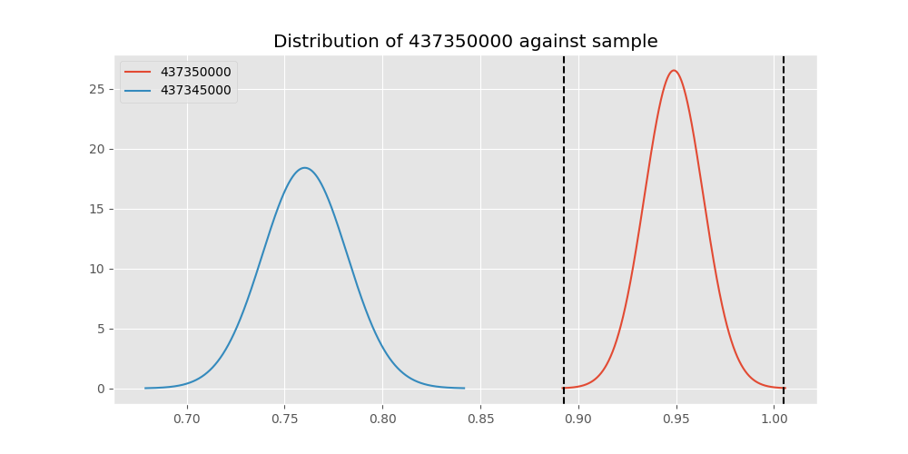 
## Testing Results for 437350000 against 435275000 
437350000 has a success rate of 0.9488372093023256
435275000 has a success rate of 0.9152542372881356
$H_{0}$: There is not a difference between 437350000 and 435275000
$H_{A}$: There is a difference between 437350000 and 435275000
An $/alpha$ of 0.00025 was used in this test.
__independent t-testing__: With a t-statistic of 1.2049160124992335 and a p-value of 0.22909649286484762, _we failed to reject the null hypothssis_
__Man-Whitney testing__: With a u-statistic of 13111.0 and a p-value of 0.22909874508418626, _we failed to reject the null hypothssis_
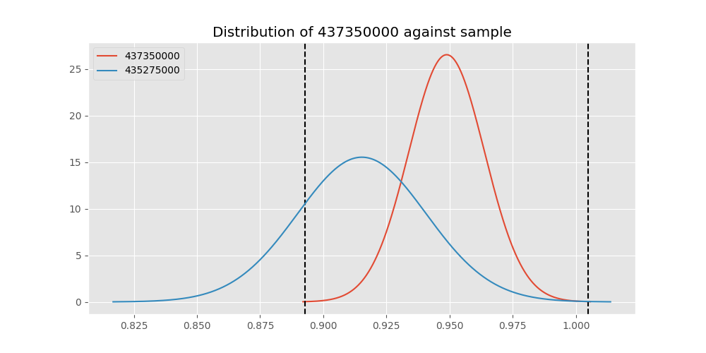 
## Testing Results for 437350000 against 437322500 
437350000 has a success rate of 0.9488372093023256
437322500 has a success rate of 0.9961685823754789
$H_{0}$: There is not a difference between 437350000 and 437322500
$H_{A}$: There is a difference between 437350000 and 437322500
An $/alpha$ of 0.00025 was used in this test.
__independent t-testing__: With a t-statistic of -3.04555809634949 and a p-value of 0.0025797241283390827, _we failed to reject the null hypothssis_
__Man-Whitney testing__: With a u-statistic of 26729.5 and a p-value of 0.0010619637996993063, _we failed to reject the null hypothssis_
 
## Testing Results for 437350000 against 437450000 
437350000 has a success rate of 0.9488372093023256
437450000 has a success rate of 0.6947791164658634
$H_{0}$: There is not a difference between 437350000 and 437450000
$H_{A}$: There is a difference between 437350000 and 437450000
An $/alpha$ of 0.00025 was used in this test.
__independent t-testing__: With a t-statistic of 7.3759260592099665 and a p-value of 7.622387911536548e-13, _we **reject** the null hypothssis_
__Man-Whitney testing__: With a u-statistic of 33568.0 and a p-value of 2.8768272216331895e-12, _we **reject** the null hypothssis_
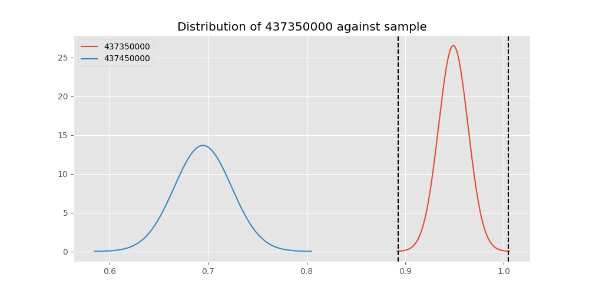 
## Testing Results for 437350000 against 436703000 
437350000 has a success rate of 0.9488372093023256
436703000 has a success rate of 0.9859154929577465
$H_{0}$: There is not a difference between 437350000 and 436703000
$H_{A}$: There is a difference between 437350000 and 436703000
An $/alpha$ of 0.00025 was used in this test.
__independent t-testing__: With a t-statistic of -2.162922344072838 and a p-value of 0.031102808857997395, _we failed to reject the null hypothssis_
__Man-Whitney testing__: With a u-statistic of 22048.5 and a p-value of 0.03136602892629223, _we failed to reject the null hypothssis_
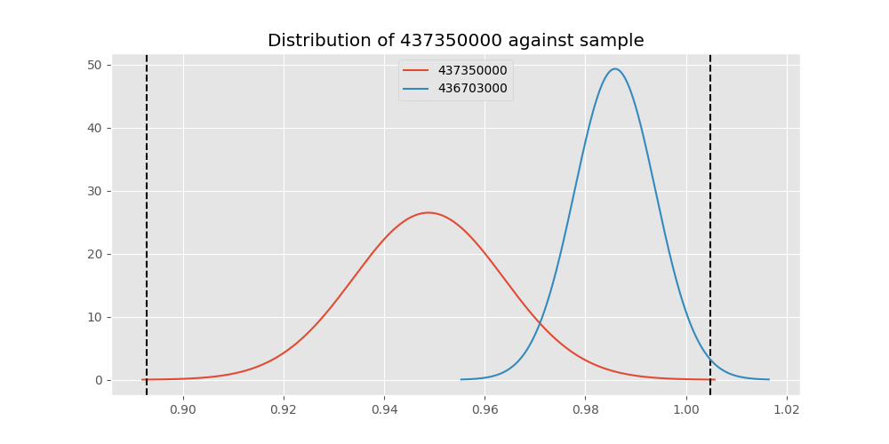 
## Testing Results for 437350000 against 400500000 
437350000 has a success rate of 0.9488372093023256
400500000 has a success rate of 0.3508771929824561
$H_{0}$: There is not a difference between 437350000 and 400500000
$H_{A}$: There is a difference between 437350000 and 400500000
An $/alpha$ of 0.00025 was used in this test.
__independent t-testing__: With a t-statistic of 13.628118134115507 and a p-value of 1.5403730690480315e-32, _we **reject** the null hypothssis_
__Man-Whitney testing__: With a u-statistic of 9791.5 and a p-value of 7.957291735704314e-26, _we **reject** the null hypothssis_
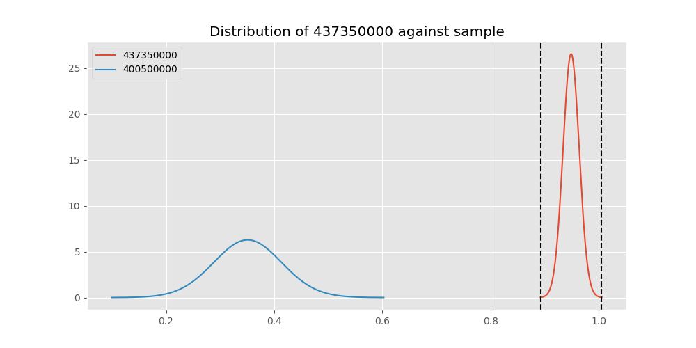 
## Testing Results for 437350000 against 437150000 
437350000 has a success rate of 0.9488372093023256
437150000 has a success rate of 0.9859550561797753
$H_{0}$: There is not a difference between 437350000 and 437150000
$H_{A}$: There is a difference between 437350000 and 437150000
An $/alpha$ of 0.00025 was used in this test.
__independent t-testing__: With a t-statistic of -2.6149943572697296 and a p-value of 0.009159462108564258, _we failed to reject the null hypothssis_
__Man-Whitney testing__: With a u-statistic of 36849.5 and a p-value of 0.009300974419457658, _we failed to reject the null hypothssis_
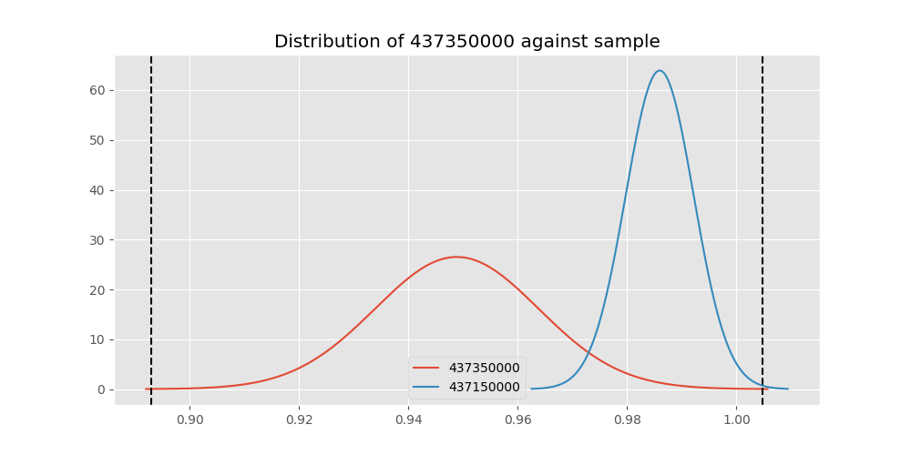 
## Testing Results for 437350000 against 435635000 
437350000 has a success rate of 0.9488372093023256
435635000 has a success rate of 0.9849624060150376
$H_{0}$: There is not a difference between 437350000 and 435635000
$H_{A}$: There is a difference between 437350000 and 435635000
An $/alpha$ of 0.00025 was used in this test.
__independent t-testing__: With a t-statistic of -1.7292905178414708 and a p-value of 0.08464902040227054, _we failed to reject the null hypothssis_
__Man-Whitney testing__: With a u-statistic of 13781.0 and a p-value of 0.08494591172138202, _we failed to reject the null hypothssis_
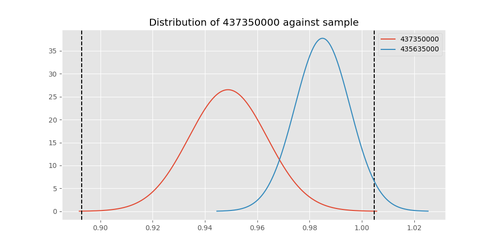 
## Testing Results for 437350000 against 437384000 
437350000 has a success rate of 0.9488372093023256
437384000 has a success rate of 0.968421052631579
$H_{0}$: There is not a difference between 437350000 and 437384000
$H_{A}$: There is a difference between 437350000 and 437384000
An $/alpha$ of 0.00025 was used in this test.
__independent t-testing__: With a t-statistic of -0.979540836497322 and a p-value of 0.327900478896185, _we failed to reject the null hypothssis_
__Man-Whitney testing__: With a u-statistic of 20025.0 and a p-value of 0.32789360940898127, _we failed to reject the null hypothssis_
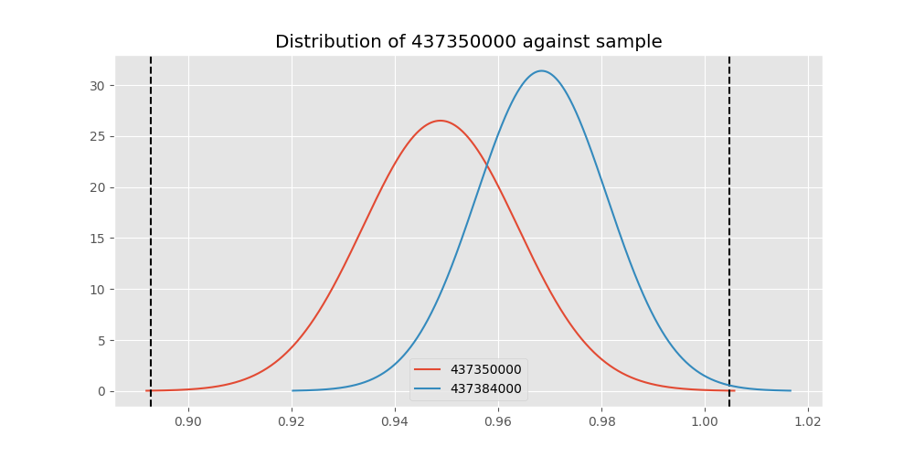 
## Testing Results for 437350000 against 437405000 
437350000 has a success rate of 0.9488372093023256
437405000 has a success rate of 0.9953917050691244
$H_{0}$: There is not a difference between 437350000 and 437405000
$H_{A}$: There is a difference between 437350000 and 437405000
An $/alpha$ of 0.00025 was used in this test.
__independent t-testing__: With a t-statistic of -2.9557193366417605 and a p-value of 0.0034129959821535536, _we failed to reject the null hypothssis_
__Man-Whitney testing__: With a u-statistic of 22241.5 and a p-value of 0.0032902505906465974, _we failed to reject the null hypothssis_
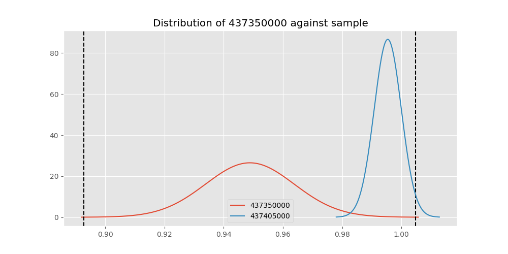 
## Testing Results for 437350000 against 435612500 
437350000 has a success rate of 0.9488372093023256
435612500 has a success rate of 0.9770114942528736
$H_{0}$: There is not a difference between 437350000 and 435612500
$H_{A}$: There is a difference between 437350000 and 435612500
An $/alpha$ of 0.00025 was used in this test.
__independent t-testing__: With a t-statistic of -1.0910173714130043 and a p-value of 0.2761407118480974, _we failed to reject the null hypothssis_
__Man-Whitney testing__: With a u-statistic of 9089.0 and a p-value of 0.2763289807445418, _we failed to reject the null hypothssis_
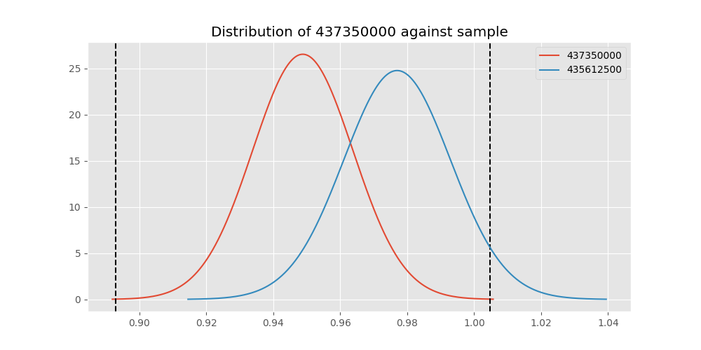 
## Testing Results for 437350000 against 435975000 
437350000 has a success rate of 0.9488372093023256
435975000 has a success rate of 0.92
$H_{0}$: There is not a difference between 437350000 and 435975000
$H_{A}$: There is a difference between 437350000 and 435975000
An $/alpha$ of 0.00025 was used in this test.
__independent t-testing__: With a t-statistic of 0.7927531423357863 and a p-value of 0.4286361997917729, _we failed to reject the null hypothssis_
__Man-Whitney testing__: With a u-statistic of 5530.0 and a p-value of 0.42908842983886153, _we failed to reject the null hypothssis_
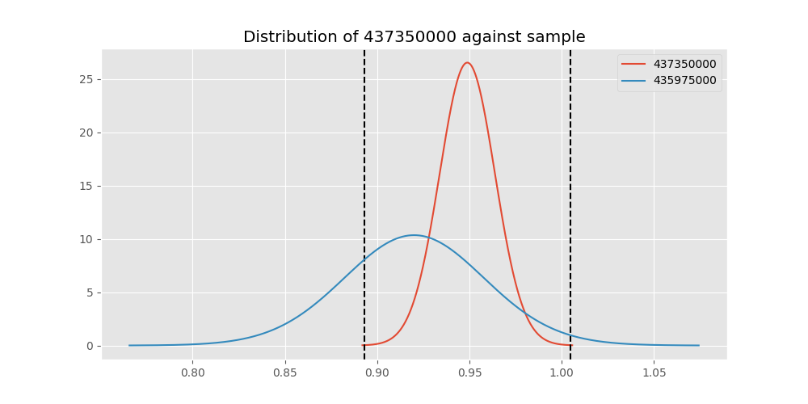 
## Testing Results for 437350000 against 437425000 
437350000 has a success rate of 0.9488372093023256
437425000 has a success rate of 0.6987654320987654
$H_{0}$: There is not a difference between 437350000 and 437425000
$H_{A}$: There is a difference between 437350000 and 437425000
An $/alpha$ of 0.00025 was used in this test.
__independent t-testing__: With a t-statistic of 7.531548401197596 and a p-value of 1.7866424398402021e-13, _we **reject** the null hypothssis_
__Man-Whitney testing__: With a u-statistic of 54425.0 and a p-value of 5.452863415565741e-13, _we **reject** the null hypothssis_
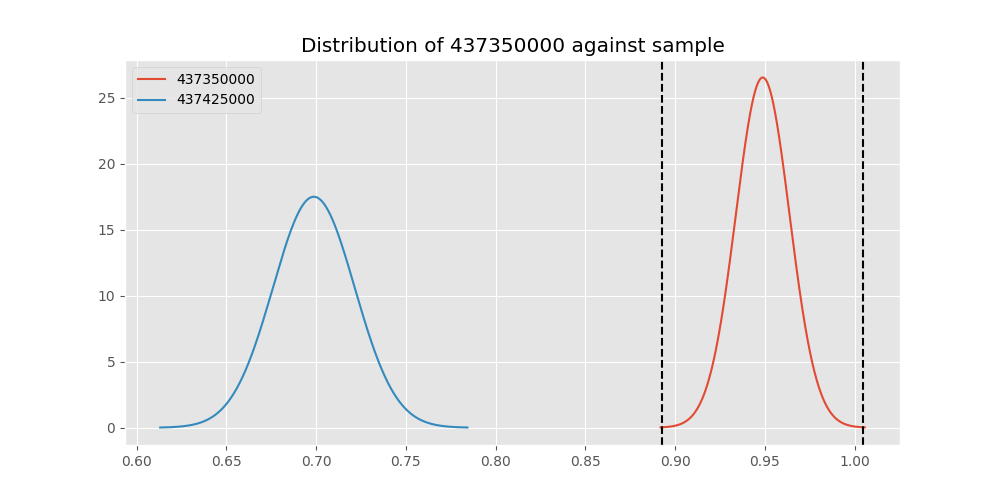 
## Testing Results for 437350000 against 437275000 
437350000 has a success rate of 0.9488372093023256
437275000 has a success rate of 0.3643724696356275
$H_{0}$: There is not a difference between 437350000 and 437275000
$H_{A}$: There is a difference between 437350000 and 437275000
An $/alpha$ of 0.00025 was used in this test.
__independent t-testing__: With a t-statistic of 16.34068711973955 and a p-value of 1.1617930417942578e-47, _we **reject** the null hypothssis_
__Man-Whitney testing__: With a u-statistic of 42071.5 and a p-value of 1.0497439726273661e-38, _we **reject** the null hypothssis_
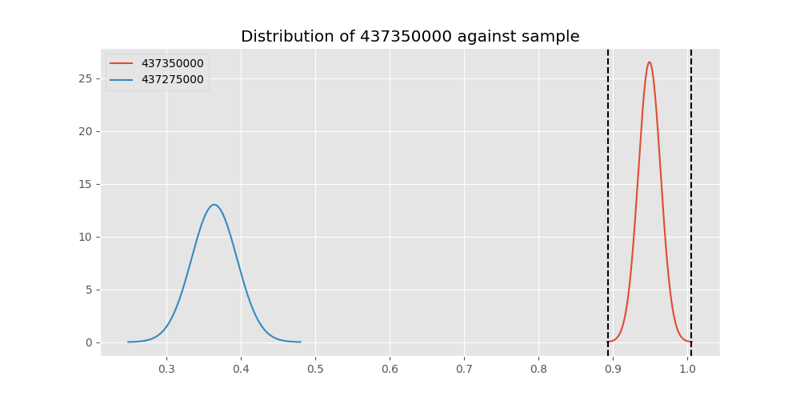 
## Testing Results for 437350000 against 145840000 
437350000 has a success rate of 0.9488372093023256
145840000 has a success rate of 0.9649122807017544
$H_{0}$: There is not a difference between 437350000 and 145840000
$H_{A}$: There is a difference between 437350000 and 145840000
An $/alpha$ of 0.00025 was used in this test.
__independent t-testing__: With a t-statistic of -0.5041667767558411 and a p-value of 0.6145553401223525, _we failed to reject the null hypothssis_
__Man-Whitney testing__: With a u-statistic of 6029.0 and a p-value of 0.6154570602255192, _we failed to reject the null hypothssis_
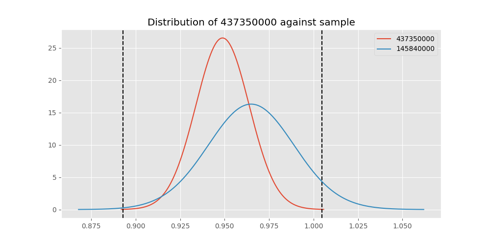 
## Testing Results for 437350000 against 435525000 
437350000 has a success rate of 0.9488372093023256
435525000 has a success rate of 0.6923076923076923
$H_{0}$: There is not a difference between 437350000 and 435525000
$H_{A}$: There is a difference between 437350000 and 435525000
An $/alpha$ of 0.00025 was used in this test.
__independent t-testing__: With a t-statistic of 7.013795067465501 and a p-value of 1.1738855875933346e-11, _we **reject** the null hypothssis_
__Man-Whitney testing__: With a u-statistic of 19316.0 and a p-value of 4.6212632570660546e-11, _we **reject** the null hypothssis_
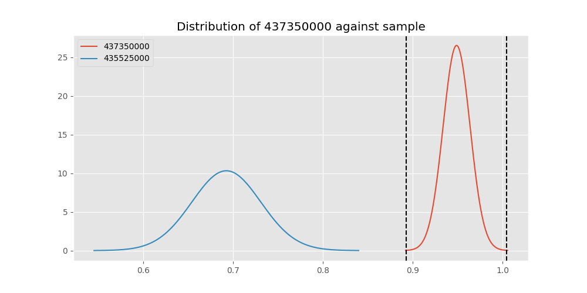 
## Testing Results for 437350000 against 436250000 
437350000 has a success rate of 0.9488372093023256
436250000 has a success rate of 0.17857142857142858
$H_{0}$: There is not a difference between 437350000 and 436250000
$H_{A}$: There is a difference between 437350000 and 436250000
An $/alpha$ of 0.00025 was used in this test.
__independent t-testing__: With a t-statistic of 19.49793051629391 and a p-value of 2.1941121586594394e-53, _we **reject** the null hypothssis_
__Man-Whitney testing__: With a u-statistic of 10657.0 and a p-value of 2.966108539766087e-36, _we **reject** the null hypothssis_
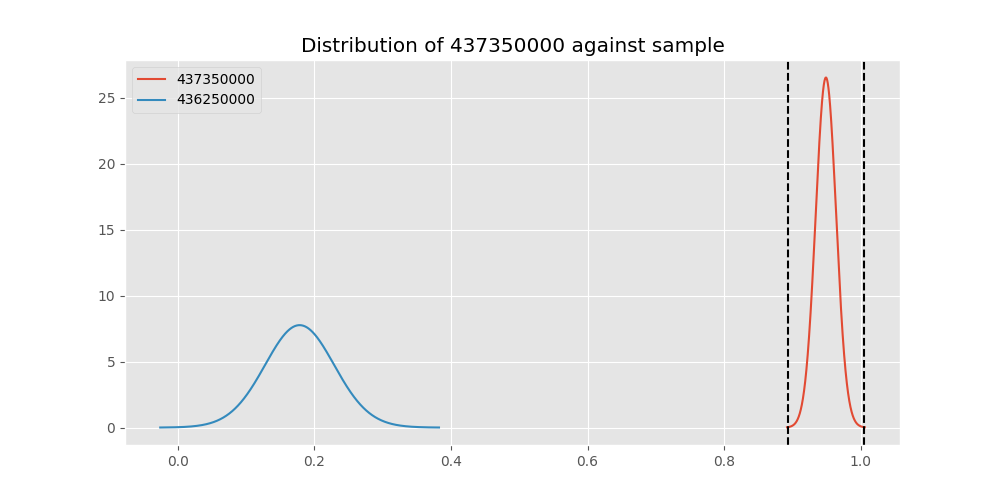 
## Testing Results for 437350000 against 435950000 
437350000 has a success rate of 0.9488372093023256
435950000 has a success rate of 0.9850187265917603
$H_{0}$: There is not a difference between 437350000 and 435950000
$H_{A}$: There is a difference between 437350000 and 435950000
An $/alpha$ of 0.00025 was used in this test.
__independent t-testing__: With a t-statistic of -2.860649147783916 and a p-value of 0.004345781061257176, _we failed to reject the null hypothssis_
__Man-Whitney testing__: With a u-statistic of 55328.0 and a p-value of 0.004422689104142137, _we failed to reject the null hypothssis_
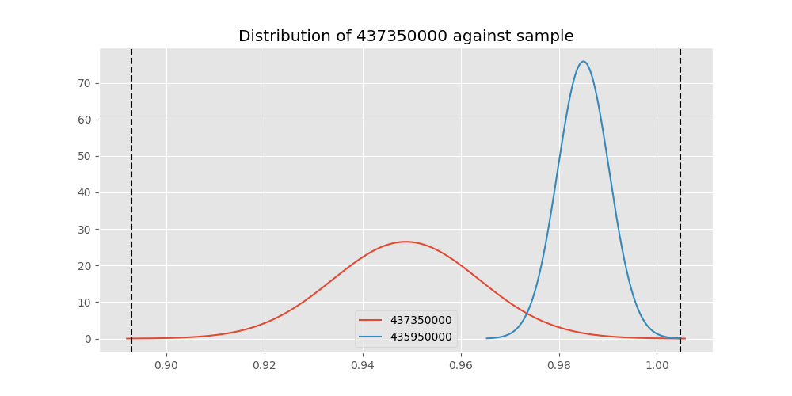 
## Testing Results for 437350000 against 435800000 
437350000 has a success rate of 0.9488372093023256
435800000 has a success rate of 0.5390070921985816
$H_{0}$: There is not a difference between 437350000 and 435800000
$H_{A}$: There is a difference between 437350000 and 435800000
An $/alpha$ of 0.00025 was used in this test.
__independent t-testing__: With a t-statistic of 10.551982430735368 and a p-value of 8.154402738131269e-23, _we **reject** the null hypothssis_
__Man-Whitney testing__: With a u-statistic of 21369.5 and a p-value of 3.093924096127474e-20, _we **reject** the null hypothssis_
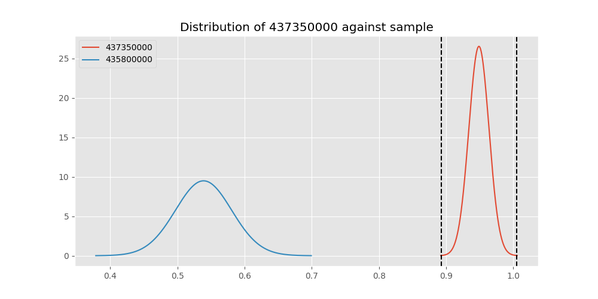 
## Testing Results for 437350000 against 437485000 
437350000 has a success rate of 0.9488372093023256
437485000 has a success rate of 0.9375
$H_{0}$: There is not a difference between 437350000 and 437485000
$H_{A}$: There is a difference between 437350000 and 437485000
An $/alpha$ of 0.00025 was used in this test.
__independent t-testing__: With a t-statistic of 0.26691129614842424 and a p-value of 0.7897619834136106, _we failed to reject the null hypothssis_
__Man-Whitney testing__: With a u-statistic of 3479.0 and a p-value of 0.791789039481295, _we failed to reject the null hypothssis_
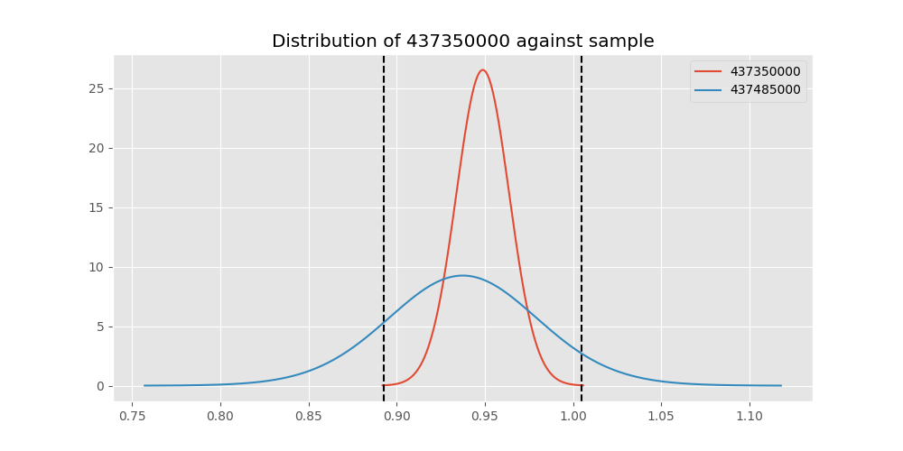 
## Testing Results for 437350000 against 136770000 
437350000 has a success rate of 0.9488372093023256
136770000 has a success rate of 0.9945945945945946
$H_{0}$: There is not a difference between 437350000 and 136770000
$H_{A}$: There is a difference between 437350000 and 136770000
An $/alpha$ of 0.00025 was used in this test.
__independent t-testing__: With a t-statistic of -2.859473877665708 and a p-value of 0.004577776424866014, _we failed to reject the null hypothssis_
__Man-Whitney testing__: With a u-statistic of 18977.5 and a p-value of 0.0075856377997757275, _we failed to reject the null hypothssis_
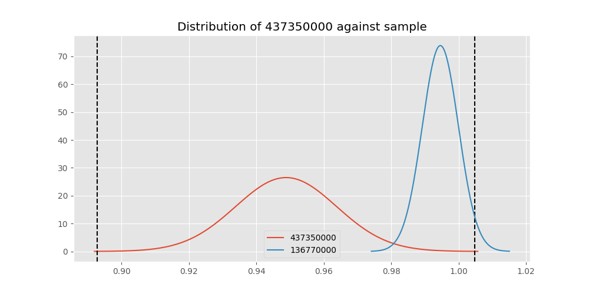 
## Testing Results for 437350000 against 437250000 
437350000 has a success rate of 0.9488372093023256
437250000 has a success rate of 0.9937106918238994
$H_{0}$: There is not a difference between 437350000 and 437250000
$H_{A}$: There is a difference between 437350000 and 437250000
An $/alpha$ of 0.00025 was used in this test.
__independent t-testing__: With a t-statistic of -2.857767130895241 and a p-value of 0.004623459274084857, _we failed to reject the null hypothssis_
__Man-Whitney testing__: With a u-statistic of 32651.0 and a p-value of 0.0010000530287848268, _we failed to reject the null hypothssis_
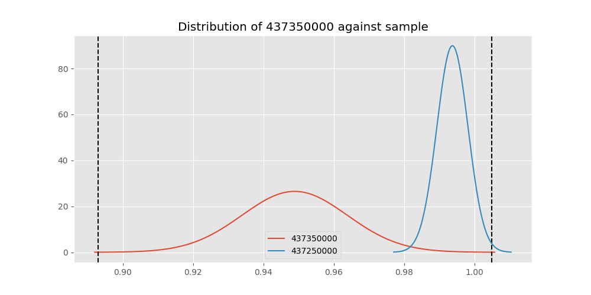 
## Testing Results for 437350000 against 437356000 
437350000 has a success rate of 0.9488372093023256
437356000 has a success rate of 0.9328358208955224
$H_{0}$: There is not a difference between 437350000 and 437356000
$H_{A}$: There is a difference between 437350000 and 437356000
An $/alpha$ of 0.00025 was used in this test.
__independent t-testing__: With a t-statistic of 0.6240575771249796 and a p-value of 0.5329998171925927, _we failed to reject the null hypothssis_
__Man-Whitney testing__: With a u-statistic of 14635.5 and a p-value of 0.533119692432916, _we failed to reject the null hypothssis_
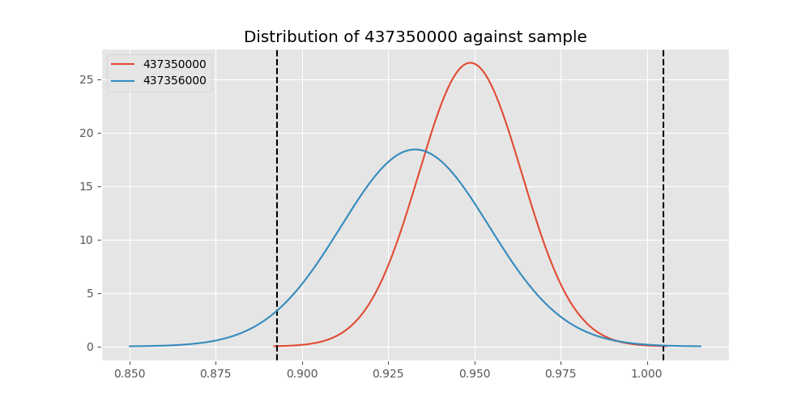 
## Testing Results for 437350000 against 437676000 
437350000 has a success rate of 0.9488372093023256
437676000 has a success rate of 0.9813432835820896
$H_{0}$: There is not a difference between 437350000 and 437676000
$H_{A}$: There is a difference between 437350000 and 437676000
An $/alpha$ of 0.00025 was used in this test.
__independent t-testing__: With a t-statistic of -1.9878420786278588 and a p-value of 0.04739565058647723, _we failed to reject the null hypothssis_
__Man-Whitney testing__: With a u-statistic of 27873.5 and a p-value of 0.04762205924074561, _we failed to reject the null hypothssis_
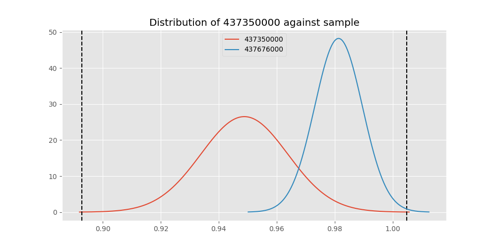 
## Testing Results for 437350000 against 145826800 
437350000 has a success rate of 0.9488372093023256
145826800 has a success rate of 0.966183574879227
$H_{0}$: There is not a difference between 437350000 and 145826800
$H_{A}$: There is a difference between 437350000 and 145826800
An $/alpha$ of 0.00025 was used in this test.
__independent t-testing__: With a t-statistic of -0.8802597683969831 and a p-value of 0.37922200009848617, _we failed to reject the null hypothssis_
__Man-Whitney testing__: With a u-statistic of 21866.5 and a p-value of 0.37920898692498173, _we failed to reject the null hypothssis_
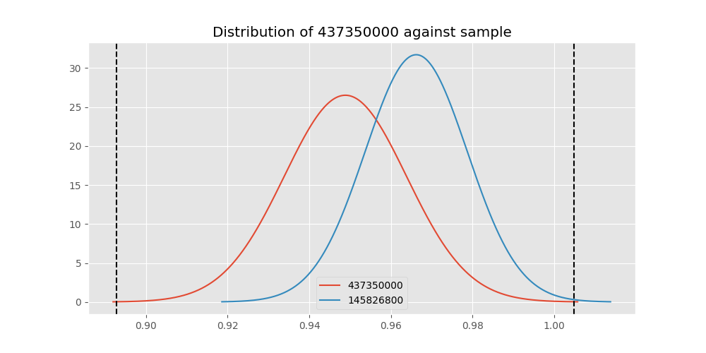 
