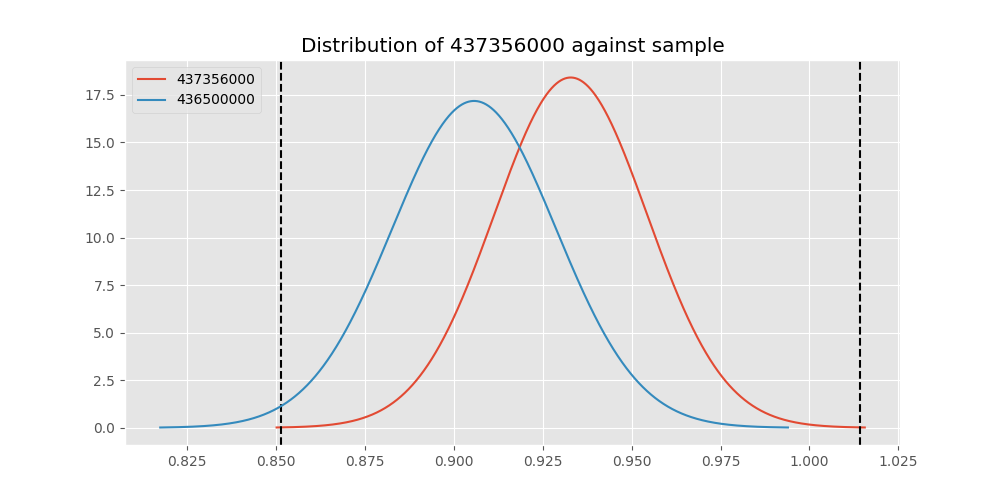
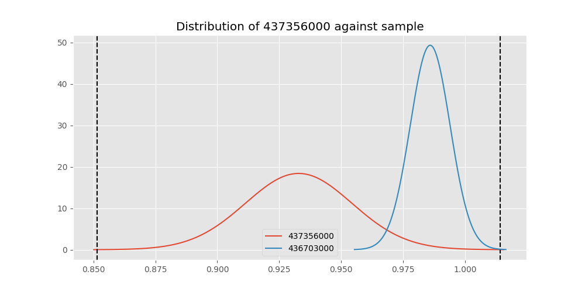

# Testing Results For 437356000 
$H_{0}$: There is not a difference in collection success against 437356000 
$H_{A}$: There is a difference in collection success against 437356000
An $\alpha$ of 0.00025 was used 
Out of 44 tests, there were 12 rejections from 44 independent-t test.
Out of 44 tests, there were 16 rejections from 44 Man Whitney u-tests.
## Testing Results for 437356000 against 436501000 
437356000 has a success rate of 0.9328358208955224
436501000 has a success rate of 0.9854014598540146
$H_{0}$: There is not a difference between 437356000 and 436501000
$H_{A}$: There is a difference between 437356000 and 436501000
An $/alpha$ of 0.00025 was used in this test.
__independent t-testing__: With a t-statistic of -2.188617839829024 and a p-value of 0.0298435842091625, _we failed to reject the null hypothssis_
__Man-Whitney testing__: With a u-statistic of 8696.5 and a p-value of 0.028810796561866713, _we failed to reject the null hypothssis_
 
## Testing Results for 437356000 against 437375000 
437356000 has a success rate of 0.9328358208955224
437375000 has a success rate of 0.9982014388489209
$H_{0}$: There is not a difference between 437356000 and 437375000
$H_{A}$: There is a difference between 437356000 and 437375000
An $/alpha$ of 0.00025 was used in this test.
__independent t-testing__: With a t-statistic of -3.001357318947037 and a p-value of 0.0032033129299090858, _we failed to reject the null hypothssis_
__Man-Whitney testing__: With a u-statistic of 34817.0 and a p-value of 1.3617726164242817e-08, _we **reject** the null hypothssis_
 
## Testing Results for 437356000 against 436500000 
437356000 has a success rate of 0.9328358208955224
436500000 has a success rate of 0.9056603773584906
$H_{0}$: There is not a difference between 437356000 and 436500000
$H_{A}$: There is a difference between 437356000 and 436500000
An $/alpha$ of 0.00025 was used in this test.
__independent t-testing__: With a t-statistic of 0.843183722300144 and a p-value of 0.39981822966508007, _we failed to reject the null hypothssis_
__Man-Whitney testing__: With a u-statistic of 10942.5 and a p-value of 0.3997071562361284, _we failed to reject the null hypothssis_
 
## Testing Results for 437356000 against 436990000 
437356000 has a success rate of 0.9328358208955224
436990000 has a success rate of 0.9572649572649573
$H_{0}$: There is not a difference between 437356000 and 436990000
$H_{A}$: There is a difference between 437356000 and 436990000
An $/alpha$ of 0.00025 was used in this test.
__independent t-testing__: With a t-statistic of -1.0177312910091012 and a p-value of 0.3094779458744012, _we failed to reject the null hypothssis_
__Man-Whitney testing__: With a u-statistic of 15295.0 and a p-value of 0.3094612604905481, _we failed to reject the null hypothssis_
 
## Testing Results for 437356000 against 145875000 
437356000 has a success rate of 0.9328358208955224
145875000 has a success rate of 0.9722222222222222
$H_{0}$: There is not a difference between 437356000 and 145875000
$H_{A}$: There is a difference between 437356000 and 145875000
An $/alpha$ of 0.00025 was used in this test.
__independent t-testing__: With a t-statistic of -1.1972555251182146 and a p-value of 0.23259634115821765, _we failed to reject the null hypothssis_
__Man-Whitney testing__: With a u-statistic of 4634.0 and a p-value of 0.23293026516284943, _we failed to reject the null hypothssis_
 
## Testing Results for 437356000 against 437800000 
437356000 has a success rate of 0.9328358208955224
437800000 has a success rate of 0.9533678756476683
$H_{0}$: There is not a difference between 437356000 and 437800000
$H_{A}$: There is a difference between 437356000 and 437800000
An $/alpha$ of 0.00025 was used in this test.
__independent t-testing__: With a t-statistic of -0.7989428620563218 and a p-value of 0.424907015941029, _we failed to reject the null hypothssis_
__Man-Whitney testing__: With a u-statistic of 12665.5 and a p-value of 0.4249395498450389, _we failed to reject the null hypothssis_
 
## Testing Results for 437356000 against 145810000 
437356000 has a success rate of 0.9328358208955224
145810000 has a success rate of 0.12179487179487179
$H_{0}$: There is not a difference between 437356000 and 145810000
$H_{A}$: There is a difference between 437356000 and 145810000
An $/alpha$ of 0.00025 was used in this test.
__independent t-testing__: With a t-statistic of 23.33343440849271 and a p-value of 2.4226180073361335e-68, _we **reject** the null hypothssis_
__Man-Whitney testing__: With a u-statistic of 18929.0 and a p-value of 5.273422607403288e-43, _we **reject** the null hypothssis_
 
## Testing Results for 437356000 against 437095000 
437356000 has a success rate of 0.9328358208955224
437095000 has a success rate of 0.9361702127659575
$H_{0}$: There is not a difference between 437356000 and 437095000
$H_{A}$: There is a difference between 437356000 and 437095000
An $/alpha$ of 0.00025 was used in this test.
__independent t-testing__: With a t-statistic of -0.07861727827047274 and a p-value of 0.9374248596979564, _we failed to reject the null hypothssis_
__Man-Whitney testing__: With a u-statistic of 3138.5 and a p-value of 0.9401501416529334, _we failed to reject the null hypothssis_
 
## Testing Results for 437356000 against 437265000 
437356000 has a success rate of 0.9328358208955224
437265000 has a success rate of 0.9795454545454545
$H_{0}$: There is not a difference between 437356000 and 437265000
$H_{A}$: There is a difference between 437356000 and 437265000
An $/alpha$ of 0.00025 was used in this test.
__independent t-testing__: With a t-statistic of -2.7290957341733058 and a p-value of 0.006546246105768155, _we failed to reject the null hypothssis_
__Man-Whitney testing__: With a u-statistic of 28103.0 and a p-value of 0.006670056108516032, _we failed to reject the null hypothssis_
 
## Testing Results for 437356000 against 437350000 
437356000 has a success rate of 0.9328358208955224
437350000 has a success rate of 0.9488372093023256
$H_{0}$: There is not a difference between 437356000 and 437350000
$H_{A}$: There is a difference between 437356000 and 437350000
An $/alpha$ of 0.00025 was used in this test.
__independent t-testing__: With a t-statistic of -0.6240575771249796 and a p-value of 0.5329998171925927, _we failed to reject the null hypothssis_
__Man-Whitney testing__: With a u-statistic of 14174.5 and a p-value of 0.533119692432916, _we failed to reject the null hypothssis_
 
## Testing Results for 437356000 against 437200000 
437356000 has a success rate of 0.9328358208955224
437200000 has a success rate of 0.8620689655172413
$H_{0}$: There is not a difference between 437356000 and 437200000
$H_{A}$: There is a difference between 437356000 and 437200000
An $/alpha$ of 0.00025 was used in this test.
__independent t-testing__: With a t-statistic of 2.0401997300615804 and a p-value of 0.04211430189359251, _we failed to reject the null hypothssis_
__Man-Whitney testing__: With a u-statistic of 14563.5 and a p-value of 0.04239610023486222, _we failed to reject the null hypothssis_
 
## Testing Results for 437356000 against 435600000 
437356000 has a success rate of 0.9328358208955224
435600000 has a success rate of 0.9819341126461212
$H_{0}$: There is not a difference between 437356000 and 435600000
$H_{A}$: There is a difference between 437356000 and 435600000
An $/alpha$ of 0.00025 was used in this test.
__independent t-testing__: With a t-statistic of -3.477544686552618 and a p-value of 0.0005263049041680764, _we failed to reject the null hypothssis_
__Man-Whitney testing__: With a u-statistic of 59951.5 and a p-value of 0.0005418547359339271, _we failed to reject the null hypothssis_
 
## Testing Results for 437356000 against 450000000 
437356000 has a success rate of 0.9328358208955224
450000000 has a success rate of 0.8235294117647058
$H_{0}$: There is not a difference between 437356000 and 450000000
$H_{A}$: There is a difference between 437356000 and 450000000
An $/alpha$ of 0.00025 was used in this test.
__independent t-testing__: With a t-statistic of 2.5493081104382513 and a p-value of 0.01148393094893076, _we failed to reject the null hypothssis_
__Man-Whitney testing__: With a u-statistic of 6317.5 and a p-value of 0.011878651473058765, _we failed to reject the null hypothssis_
 
## Testing Results for 437356000 against 145978500 
437356000 has a success rate of 0.9328358208955224
145978500 has a success rate of 0.9963636363636363
$H_{0}$: There is not a difference between 437356000 and 145978500
$H_{A}$: There is a difference between 437356000 and 145978500
An $/alpha$ of 0.00025 was used in this test.
__independent t-testing__: With a t-statistic of -2.886735037883827 and a p-value of 0.0045081658605045935, _we failed to reject the null hypothssis_
__Man-Whitney testing__: With a u-statistic of 17254.5 and a p-value of 9.699433314975554e-05, _we **reject** the null hypothssis_
 
## Testing Results for 437356000 against 437050000 
437356000 has a success rate of 0.9328358208955224
437050000 has a success rate of 0.5346534653465347
$H_{0}$: There is not a difference between 437356000 and 437050000
$H_{A}$: There is a difference between 437356000 and 437050000
An $/alpha$ of 0.00025 was used in this test.
__independent t-testing__: With a t-statistic of 7.966355574830107 and a p-value of 7.217936704476125e-14, _we **reject** the null hypothssis_
__Man-Whitney testing__: With a u-statistic of 9461.5 and a p-value of 1.4812962877829178e-12, _we **reject** the null hypothssis_
 
## Testing Results for 437356000 against 435300000 
437356000 has a success rate of 0.9328358208955224
435300000 has a success rate of 0.1232876712328767
$H_{0}$: There is not a difference between 437356000 and 435300000
$H_{A}$: There is a difference between 437356000 and 435300000
An $/alpha$ of 0.00025 was used in this test.
__independent t-testing__: With a t-statistic of 22.946665129059717 and a p-value of 4.179891010625155e-66, _we **reject** the null hypothssis_
__Man-Whitney testing__: With a u-statistic of 17701.0 and a p-value of 1.3296047998072206e-41, _we **reject** the null hypothssis_
 
## Testing Results for 437356000 against 437475000 
437356000 has a success rate of 0.9328358208955224
437475000 has a success rate of 0.5045045045045045
$H_{0}$: There is not a difference between 437356000 and 437475000
$H_{A}$: There is a difference between 437356000 and 437475000
An $/alpha$ of 0.00025 was used in this test.
__independent t-testing__: With a t-statistic of 9.615913985704871 and a p-value of 1.2705599497881885e-20, _we **reject** the null hypothssis_
__Man-Whitney testing__: With a u-statistic of 53112.5 and a p-value of 1.6574380243971143e-19, _we **reject** the null hypothssis_
 
## Testing Results for 437356000 against 435448000 
437356000 has a success rate of 0.9328358208955224
435448000 has a success rate of 0.975
$H_{0}$: There is not a difference between 437356000 and 435448000
$H_{A}$: There is a difference between 437356000 and 435448000
An $/alpha$ of 0.00025 was used in this test.
__independent t-testing__: With a t-statistic of -1.002613948549382 and a p-value of 0.3174555865306647, _we failed to reject the null hypothssis_
__Man-Whitney testing__: With a u-statistic of 2567.0 and a p-value of 0.3182005661603432, _we failed to reject the null hypothssis_
 
## Testing Results for 437356000 against 437644000 
437356000 has a success rate of 0.9328358208955224
437644000 has a success rate of 0.9743589743589743
$H_{0}$: There is not a difference between 437356000 and 437644000
$H_{A}$: There is a difference between 437356000 and 437644000
An $/alpha$ of 0.00025 was used in this test.
__independent t-testing__: With a t-statistic of -1.5392250705313582 and a p-value of 0.12501915610622824, _we failed to reject the null hypothssis_
__Man-Whitney testing__: With a u-statistic of 7513.5 and a p-value of 0.12535735788698102, _we failed to reject the null hypothssis_
 
## Testing Results for 437356000 against 145825000 
437356000 has a success rate of 0.9328358208955224
145825000 has a success rate of 0.8687448728465955
$H_{0}$: There is not a difference between 437356000 and 145825000
$H_{A}$: There is a difference between 437356000 and 145825000
An $/alpha$ of 0.00025 was used in this test.
__independent t-testing__: With a t-statistic of 2.163790238774204 and a p-value of 0.030572314512847767, _we failed to reject the null hypothssis_
__Man-Whitney testing__: With a u-statistic of 173815.0 and a p-value of 0.030607446340977784, _we failed to reject the null hypothssis_
 
## Testing Results for 437356000 against 437345000 
437356000 has a success rate of 0.9328358208955224
437345000 has a success rate of 0.7603092783505154
$H_{0}$: There is not a difference between 437356000 and 437345000
$H_{A}$: There is a difference between 437356000 and 437345000
An $/alpha$ of 0.00025 was used in this test.
__independent t-testing__: With a t-statistic of 4.414592243690732 and a p-value of 1.2314019770446372e-05, _we **reject** the null hypothssis_
__Man-Whitney testing__: With a u-statistic of 30481.0 and a p-value of 1.4391361427195801e-05, _we **reject** the null hypothssis_
 
## Testing Results for 437356000 against 435275000 
437356000 has a success rate of 0.9328358208955224
435275000 has a success rate of 0.9152542372881356
$H_{0}$: There is not a difference between 437356000 and 435275000
$H_{A}$: There is a difference between 437356000 and 435275000
An $/alpha$ of 0.00025 was used in this test.
__independent t-testing__: With a t-statistic of 0.5256619148954252 and a p-value of 0.5995890676097236, _we failed to reject the null hypothssis_
__Man-Whitney testing__: With a u-statistic of 8045.0 and a p-value of 0.5999115268659668, _we failed to reject the null hypothssis_
 
## Testing Results for 437356000 against 437322500 
437356000 has a success rate of 0.9328358208955224
437322500 has a success rate of 0.9961685823754789
$H_{0}$: There is not a difference between 437356000 and 437322500
$H_{A}$: There is a difference between 437356000 and 437322500
An $/alpha$ of 0.00025 was used in this test.
__independent t-testing__: With a t-statistic of -2.873553560880644 and a p-value of 0.004685703611760687, _we failed to reject the null hypothssis_
__Man-Whitney testing__: With a u-statistic of 16379.5 and a p-value of 0.0001523305774285896, _we **reject** the null hypothssis_
 
## Testing Results for 437356000 against 437450000 
437356000 has a success rate of 0.9328358208955224
437450000 has a success rate of 0.6947791164658634
$H_{0}$: There is not a difference between 437356000 and 437450000
$H_{A}$: There is a difference between 437356000 and 437450000
An $/alpha$ of 0.00025 was used in this test.
__independent t-testing__: With a t-statistic of 5.5440146243666035 and a p-value of 5.5322807051303005e-08, _we **reject** the null hypothssis_
__Man-Whitney testing__: With a u-statistic of 20654.5 and a p-value of 9.325823474807248e-08, _we **reject** the null hypothssis_
 
## Testing Results for 437356000 against 436703000 
437356000 has a success rate of 0.9328358208955224
436703000 has a success rate of 0.9859154929577465
$H_{0}$: There is not a difference between 437356000 and 436703000
$H_{A}$: There is a difference between 437356000 and 436703000
An $/alpha$ of 0.00025 was used in this test.
__independent t-testing__: With a t-statistic of -2.2914596787035655 and a p-value of 0.02316023898714329, _we failed to reject the null hypothssis_
__Man-Whitney testing__: With a u-statistic of 13513.5 and a p-value of 0.008560875567536345, _we failed to reject the null hypothssis_
 
## Testing Results for 437356000 against 400500000 
437356000 has a success rate of 0.9328358208955224
400500000 has a success rate of 0.3508771929824561
$H_{0}$: There is not a difference between 437356000 and 400500000
$H_{A}$: There is a difference between 437356000 and 400500000
An $/alpha$ of 0.00025 was used in this test.
__independent t-testing__: With a t-statistic of 10.942406351664335 and a p-value of 6.681994073103493e-22, _we **reject** the null hypothssis_
__Man-Whitney testing__: With a u-statistic of 6041.5 and a p-value of 9.308401598103758e-18, _we **reject** the null hypothssis_
 
## Testing Results for 437356000 against 437150000 
437356000 has a success rate of 0.9328358208955224
437150000 has a success rate of 0.9859550561797753
$H_{0}$: There is not a difference between 437356000 and 437150000
$H_{A}$: There is a difference between 437356000 and 437150000
An $/alpha$ of 0.00025 was used in this test.
__independent t-testing__: With a t-statistic of -2.351965842373928 and a p-value of 0.019927299374586527, _we failed to reject the null hypothssis_
__Man-Whitney testing__: With a u-statistic of 22585.0 and a p-value of 0.0016805299439707803, _we failed to reject the null hypothssis_
 
## Testing Results for 437356000 against 435635000 
437356000 has a success rate of 0.9328358208955224
435635000 has a success rate of 0.9849624060150376
$H_{0}$: There is not a difference between 437356000 and 435635000
$H_{A}$: There is a difference between 437356000 and 435635000
An $/alpha$ of 0.00025 was used in this test.
__independent t-testing__: With a t-statistic of -2.1583361989374112 and a p-value of 0.03213731789459146, _we failed to reject the null hypothssis_
__Man-Whitney testing__: With a u-statistic of 8446.5 and a p-value of 0.032642144898483015, _we failed to reject the null hypothssis_
 
## Testing Results for 437356000 against 437384000 
437356000 has a success rate of 0.9328358208955224
437384000 has a success rate of 0.968421052631579
$H_{0}$: There is not a difference between 437356000 and 437384000
$H_{A}$: There is a difference between 437356000 and 437384000
An $/alpha$ of 0.00025 was used in this test.
__independent t-testing__: With a t-statistic of -1.5018196387087237 and a p-value of 0.1341236799964936, _we failed to reject the null hypothssis_
__Man-Whitney testing__: With a u-statistic of 12277.0 and a p-value of 0.1343269196593703, _we failed to reject the null hypothssis_
 
## Testing Results for 437356000 against 437405000 
437356000 has a success rate of 0.9328358208955224
437405000 has a success rate of 0.9953917050691244
$H_{0}$: There is not a difference between 437356000 and 437405000
$H_{A}$: There is a difference between 437356000 and 437405000
An $/alpha$ of 0.00025 was used in this test.
__independent t-testing__: With a t-statistic of -2.8193412202288424 and a p-value of 0.005485273707757751, _we failed to reject the null hypothssis_
__Man-Whitney testing__: With a u-statistic of 13629.5 and a p-value of 0.0006363900948325396, _we failed to reject the null hypothssis_
 
## Testing Results for 437356000 against 435612500 
437356000 has a success rate of 0.9328358208955224
435612500 has a success rate of 0.9770114942528736
$H_{0}$: There is not a difference between 437356000 and 435612500
$H_{A}$: There is a difference between 437356000 and 435612500
An $/alpha$ of 0.00025 was used in this test.
__independent t-testing__: With a t-statistic of -1.4759120809052222 and a p-value of 0.1414038385933043, _we failed to reject the null hypothssis_
__Man-Whitney testing__: With a u-statistic of 5571.5 and a p-value of 0.1418010027306433, _we failed to reject the null hypothssis_
 
## Testing Results for 437356000 against 435975000 
437356000 has a success rate of 0.9328358208955224
435975000 has a success rate of 0.92
$H_{0}$: There is not a difference between 437356000 and 435975000
$H_{A}$: There is a difference between 437356000 and 435975000
An $/alpha$ of 0.00025 was used in this test.
__independent t-testing__: With a t-statistic of 0.3007009974261244 and a p-value of 0.7639857350152035, _we failed to reject the null hypothssis_
__Man-Whitney testing__: With a u-statistic of 3393.0 and a p-value of 0.7657444944115523, _we failed to reject the null hypothssis_
 
## Testing Results for 437356000 against 437425000 
437356000 has a success rate of 0.9328358208955224
437425000 has a success rate of 0.6987654320987654
$H_{0}$: There is not a difference between 437356000 and 437425000
$H_{A}$: There is a difference between 437356000 and 437425000
An $/alpha$ of 0.00025 was used in this test.
__independent t-testing__: With a t-statistic of 5.624411280580131 and a p-value of 2.9979901524660585e-08, _we **reject** the null hypothssis_
__Man-Whitney testing__: With a u-statistic of 33486.5 and a p-value of 4.4906815568530364e-08, _we **reject** the null hypothssis_
 
## Testing Results for 437356000 against 437275000 
437356000 has a success rate of 0.9328358208955224
437275000 has a success rate of 0.3643724696356275
$H_{0}$: There is not a difference between 437356000 and 437275000
$H_{A}$: There is a difference between 437356000 and 437275000
An $/alpha$ of 0.00025 was used in this test.
__independent t-testing__: With a t-statistic of 12.735087218726697 and a p-value of 3.588214654282694e-31, _we **reject** the null hypothssis_
__Man-Whitney testing__: With a u-statistic of 25956.5 and a p-value of 1.393541364355462e-26, _we **reject** the null hypothssis_
 
## Testing Results for 437356000 against 145840000 
437356000 has a success rate of 0.9328358208955224
145840000 has a success rate of 0.9649122807017544
$H_{0}$: There is not a difference between 437356000 and 145840000
$H_{A}$: There is a difference between 437356000 and 145840000
An $/alpha$ of 0.00025 was used in this test.
__independent t-testing__: With a t-statistic of -0.8678369735874186 and a p-value of 0.38658414500987426, _we failed to reject the null hypothssis_
__Man-Whitney testing__: With a u-statistic of 3696.5 and a p-value of 0.38711739078864205, _we failed to reject the null hypothssis_
 
## Testing Results for 437356000 against 435525000 
437356000 has a success rate of 0.9328358208955224
435525000 has a success rate of 0.6923076923076923
$H_{0}$: There is not a difference between 437356000 and 435525000
$H_{A}$: There is a difference between 437356000 and 435525000
An $/alpha$ of 0.00025 was used in this test.
__independent t-testing__: With a t-statistic of 5.322035643810586 and a p-value of 2.1316869484675578e-07, _we **reject** the null hypothssis_
__Man-Whitney testing__: With a u-statistic of 11885.5 and a p-value of 3.863401813494167e-07, _we **reject** the null hypothssis_
 
## Testing Results for 437356000 against 436250000 
437356000 has a success rate of 0.9328358208955224
436250000 has a success rate of 0.17857142857142858
$H_{0}$: There is not a difference between 437356000 and 436250000
$H_{A}$: There is a difference between 437356000 and 436250000
An $/alpha$ of 0.00025 was used in this test.
__independent t-testing__: With a t-statistic of 15.947398077392492 and a p-value of 9.003954907931082e-37, _we **reject** the null hypothssis_
__Man-Whitney testing__: With a u-statistic of 6582.0 and a p-value of 1.9553920978806849e-25, _we **reject** the null hypothssis_
 
## Testing Results for 437356000 against 435950000 
437356000 has a success rate of 0.9328358208955224
435950000 has a success rate of 0.9850187265917603
$H_{0}$: There is not a difference between 437356000 and 435950000
$H_{A}$: There is a difference between 437356000 and 435950000
An $/alpha$ of 0.00025 was used in this test.
__independent t-testing__: With a t-statistic of -2.336583330315591 and a p-value of 0.020793242977949378, _we failed to reject the null hypothssis_
__Man-Whitney testing__: With a u-statistic of 33911.0 and a p-value of 0.0006126192759504028, _we failed to reject the null hypothssis_
 
## Testing Results for 437356000 against 435800000 
437356000 has a success rate of 0.9328358208955224
435800000 has a success rate of 0.5390070921985816
$H_{0}$: There is not a difference between 437356000 and 435800000
$H_{A}$: There is a difference between 437356000 and 435800000
An $/alpha$ of 0.00025 was used in this test.
__independent t-testing__: With a t-statistic of 8.184355665949784 and a p-value of 1.0523621426210117e-14, _we **reject** the null hypothssis_
__Man-Whitney testing__: With a u-statistic of 13167.5 and a p-value of 2.0367306145731534e-13, _we **reject** the null hypothssis_
 
## Testing Results for 437356000 against 437485000 
437356000 has a success rate of 0.9328358208955224
437485000 has a success rate of 0.9375
$H_{0}$: There is not a difference between 437356000 and 437485000
$H_{A}$: There is a difference between 437356000 and 437485000
An $/alpha$ of 0.00025 was used in this test.
__independent t-testing__: With a t-statistic of -0.09472709533515165 and a p-value of 0.9246472351994915, _we failed to reject the null hypothssis_
__Man-Whitney testing__: With a u-statistic of 2134.0 and a p-value of 0.928078844563565, _we failed to reject the null hypothssis_
 
## Testing Results for 437356000 against 136770000 
437356000 has a success rate of 0.9328358208955224
136770000 has a success rate of 0.9945945945945946
$H_{0}$: There is not a difference between 437356000 and 136770000
$H_{A}$: There is a difference between 437356000 and 136770000
An $/alpha$ of 0.00025 was used in this test.
__independent t-testing__: With a t-statistic of -2.761122631818621 and a p-value of 0.006481977024242768, _we failed to reject the null hypothssis_
__Man-Whitney testing__: With a u-statistic of 11629.5 and a p-value of 0.0018247624174729288, _we failed to reject the null hypothssis_
 
## Testing Results for 437356000 against 437250000 
437356000 has a success rate of 0.9328358208955224
437250000 has a success rate of 0.9937106918238994
$H_{0}$: There is not a difference between 437356000 and 437250000
$H_{A}$: There is a difference between 437356000 and 437250000
An $/alpha$ of 0.00025 was used in this test.
__independent t-testing__: With a t-statistic of -2.7478275593926975 and a p-value of 0.006765337059943468, _we failed to reject the null hypothssis_
__Man-Whitney testing__: With a u-statistic of 20009.0 and a p-value of 0.00012809542622902871, _we **reject** the null hypothssis_
 
## Testing Results for 437356000 against 437676000 
437356000 has a success rate of 0.9328358208955224
437676000 has a success rate of 0.9813432835820896
$H_{0}$: There is not a difference between 437356000 and 437676000
$H_{A}$: There is a difference between 437356000 and 437676000
An $/alpha$ of 0.00025 was used in this test.
__independent t-testing__: With a t-statistic of -2.514102347247564 and a p-value of 0.01232527455664886, _we failed to reject the null hypothssis_
__Man-Whitney testing__: With a u-statistic of 17085.0 and a p-value of 0.012554827597632878, _we failed to reject the null hypothssis_
 
## Testing Results for 437356000 against 145826800 
437356000 has a success rate of 0.9328358208955224
145826800 has a success rate of 0.966183574879227
$H_{0}$: There is not a difference between 437356000 and 145826800
$H_{A}$: There is a difference between 437356000 and 145826800
An $/alpha$ of 0.00025 was used in this test.
__independent t-testing__: With a t-statistic of -1.4223101284747717 and a p-value of 0.15585568765380642, _we failed to reject the null hypothssis_
__Man-Whitney testing__: With a u-statistic of 13406.5 and a p-value of 0.15600401226265032, _we failed to reject the null hypothssis_
 
