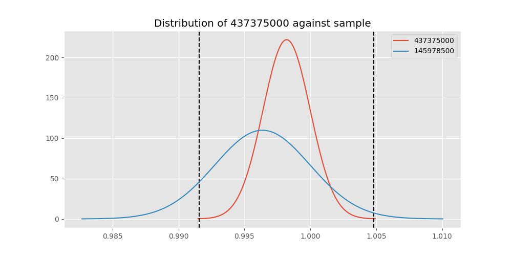

# Testing Results For 437375000 
$H_{0}$: There is not a difference in collection success against 437375000 
$H_{A}$: There is a difference in collection success against 437375000
An $\alpha$ of 0.00025 was used 
Out of 44 tests, there were 26 rejections from 44 independent-t test.
Out of 44 tests, there were 26 rejections from 44 Man Whitney u-tests.
## Testing Results for 437375000 against 436501000 
437375000 has a success rate of 0.9982014388489209
436501000 has a success rate of 0.9854014598540146
$H_{0}$: There is not a difference between 437375000 and 436501000
$H_{A}$: There is a difference between 437375000 and 436501000
An $/alpha$ of 0.00025 was used in this test.
__independent t-testing__: With a t-statistic of 2.047264355731753 and a p-value of 0.04100979054205369, _we failed to reject the null hypothssis_
__Man-Whitney testing__: With a u-statistic of 38573.5 and a p-value of 0.0413040325512965, _we failed to reject the null hypothssis_
 
## Testing Results for 437375000 against 436500000 
437375000 has a success rate of 0.9982014388489209
436500000 has a success rate of 0.9056603773584906
$H_{0}$: There is not a difference between 437375000 and 436500000
$H_{A}$: There is a difference between 437375000 and 436500000
An $/alpha$ of 0.00025 was used in this test.
__independent t-testing__: With a t-statistic of 7.195105165690797 and a p-value of 1.5839404427492119e-12, _we **reject** the null hypothssis_
__Man-Whitney testing__: With a u-statistic of 48292.5 and a p-value of 3.6185967626316692e-12, _we **reject** the null hypothssis_
 
## Testing Results for 437375000 against 436990000 
437375000 has a success rate of 0.9982014388489209
436990000 has a success rate of 0.9572649572649573
$H_{0}$: There is not a difference between 437375000 and 436990000
$H_{A}$: There is a difference between 437375000 and 436990000
An $/alpha$ of 0.00025 was used in this test.
__independent t-testing__: With a t-statistic of 4.535763739694499 and a p-value of 6.632802916244813e-06, _we **reject** the null hypothssis_
__Man-Whitney testing__: With a u-statistic of 67715.0 and a p-value of 7.475240430989694e-06, _we **reject** the null hypothssis_
 
## Testing Results for 437375000 against 145875000 
437375000 has a success rate of 0.9982014388489209
145875000 has a success rate of 0.9722222222222222
$H_{0}$: There is not a difference between 437375000 and 145875000
$H_{A}$: There is a difference between 437375000 and 145875000
An $/alpha$ of 0.00025 was used in this test.
__independent t-testing__: With a t-statistic of 3.0252971538971356 and a p-value of 0.0025857329217626223, _we failed to reject the null hypothssis_
__Man-Whitney testing__: With a u-statistic of 20536.0 and a p-value of 0.002673949647966999, _we failed to reject the null hypothssis_
 
## Testing Results for 437375000 against 437800000 
437375000 has a success rate of 0.9982014388489209
437800000 has a success rate of 0.9533678756476683
$H_{0}$: There is not a difference between 437375000 and 437800000
$H_{A}$: There is a difference between 437375000 and 437800000
An $/alpha$ of 0.00025 was used in this test.
__independent t-testing__: With a t-statistic of 4.739032287356893 and a p-value of 2.5710706606055685e-06, _we **reject** the null hypothssis_
__Man-Whitney testing__: With a u-statistic of 56059.5 and a p-value of 2.9898848212778703e-06, _we **reject** the null hypothssis_
 
## Testing Results for 437375000 against 145810000 
437375000 has a success rate of 0.9982014388489209
145810000 has a success rate of 0.12179487179487179
$H_{0}$: There is not a difference between 437375000 and 145810000
$H_{A}$: There is a difference between 437375000 and 145810000
An $/alpha$ of 0.00025 was used in this test.
__independent t-testing__: With a t-statistic of 61.29189210773812 and a p-value of 9.229431092374599e-286, _we **reject** the null hypothssis_
__Man-Whitney testing__: With a u-statistic of 81376.0 and a p-value of 4.632441450904681e-132, _we **reject** the null hypothssis_
 
## Testing Results for 437375000 against 437095000 
437375000 has a success rate of 0.9982014388489209
437095000 has a success rate of 0.9361702127659575
$H_{0}$: There is not a difference between 437375000 and 437095000
$H_{A}$: There is a difference between 437375000 and 437095000
An $/alpha$ of 0.00025 was used in this test.
__independent t-testing__: With a t-statistic of 5.130979211058145 and a p-value of 3.8958009759646436e-07, _we **reject** the null hypothssis_
__Man-Whitney testing__: With a u-statistic of 13876.5 and a p-value of 5.080821345899899e-07, _we **reject** the null hypothssis_
 
## Testing Results for 437375000 against 437265000 
437375000 has a success rate of 0.9982014388489209
437265000 has a success rate of 0.9795454545454545
$H_{0}$: There is not a difference between 437375000 and 437265000
$H_{A}$: There is a difference between 437375000 and 437265000
An $/alpha$ of 0.00025 was used in this test.
__independent t-testing__: With a t-statistic of 2.942523583506144 and a p-value of 0.0033310944478160617, _we failed to reject the null hypothssis_
__Man-Whitney testing__: With a u-statistic of 124602.0 and a p-value of 0.0033828404318700426, _we failed to reject the null hypothssis_
 
## Testing Results for 437375000 against 437350000 
437375000 has a success rate of 0.9982014388489209
437350000 has a success rate of 0.9488372093023256
$H_{0}$: There is not a difference between 437375000 and 437350000
$H_{A}$: There is a difference between 437375000 and 437350000
An $/alpha$ of 0.00025 was used in this test.
__independent t-testing__: With a t-statistic of 5.0405634456190604 and a p-value of 5.791675384098457e-07, _we **reject** the null hypothssis_
__Man-Whitney testing__: With a u-statistic of 62720.5 and a p-value of 6.988406515914729e-07, _we **reject** the null hypothssis_
 
## Testing Results for 437375000 against 437200000 
437375000 has a success rate of 0.9982014388489209
437200000 has a success rate of 0.8620689655172413
$H_{0}$: There is not a difference between 437375000 and 437200000
$H_{A}$: There is a difference between 437375000 and 437200000
An $/alpha$ of 0.00025 was used in this test.
__independent t-testing__: With a t-statistic of 9.110138370893452 and a p-value of 7.226432873742133e-19, _we **reject** the null hypothssis_
__Man-Whitney testing__: With a u-statistic of 64116.5 and a p-value of 4.993265682026739e-18, _we **reject** the null hypothssis_
 
## Testing Results for 437375000 against 435600000 
437375000 has a success rate of 0.9982014388489209
435600000 has a success rate of 0.9819341126461212
$H_{0}$: There is not a difference between 437375000 and 435600000
$H_{A}$: There is a difference between 437375000 and 435600000
An $/alpha$ of 0.00025 was used in this test.
__independent t-testing__: With a t-statistic of 2.795637705916991 and a p-value of 0.005245988386869217, _we failed to reject the null hypothssis_
__Man-Whitney testing__: With a u-statistic of 265853.5 and a p-value of 0.005287704576450585, _we failed to reject the null hypothssis_
 
## Testing Results for 437375000 against 450000000 
437375000 has a success rate of 0.9982014388489209
450000000 has a success rate of 0.8235294117647058
$H_{0}$: There is not a difference between 437375000 and 450000000
$H_{A}$: There is a difference between 437375000 and 450000000
An $/alpha$ of 0.00025 was used in this test.
__independent t-testing__: With a t-statistic of 10.376058598884413 and a p-value of 2.041255852402164e-23, _we **reject** the null hypothssis_
__Man-Whitney testing__: With a u-statistic of 27757.5 and a p-value of 7.59909553736549e-22, _we **reject** the null hypothssis_
 
## Testing Results for 437375000 against 145978500 
437375000 has a success rate of 0.9982014388489209
145978500 has a success rate of 0.9963636363636363
$H_{0}$: There is not a difference between 437375000 and 145978500
$H_{A}$: There is a difference between 437375000 and 145978500
An $/alpha$ of 0.00025 was used in this test.
__independent t-testing__: With a t-statistic of 0.5082240648713673 and a p-value of 0.6114314211505691, _we failed to reject the null hypothssis_
__Man-Whitney testing__: With a u-statistic of 76590.5 and a p-value of 0.6124061296162413, _we failed to reject the null hypothssis_
 
## Testing Results for 437375000 against 437050000 
437375000 has a success rate of 0.9982014388489209
437050000 has a success rate of 0.5346534653465347
$H_{0}$: There is not a difference between 437375000 and 437050000
$H_{A}$: There is a difference between 437375000 and 437050000
An $/alpha$ of 0.00025 was used in this test.
__independent t-testing__: With a t-statistic of 21.45787318277148 and a p-value of 9.230056638145336e-78, _we **reject** the null hypothssis_
__Man-Whitney testing__: With a u-statistic of 41093.5 and a p-value of 7.718064758088659e-61, _we **reject** the null hypothssis_
 
## Testing Results for 437375000 against 435300000 
437375000 has a success rate of 0.9982014388489209
435300000 has a success rate of 0.1232876712328767
$H_{0}$: There is not a difference between 437375000 and 435300000
$H_{A}$: There is a difference between 437375000 and 435300000
An $/alpha$ of 0.00025 was used in this test.
__independent t-testing__: With a t-statistic of 60.76817573034139 and a p-value of 2.2010114153796636e-281, _we **reject** the null hypothssis_
__Man-Whitney testing__: With a u-statistic of 76099.0 and a p-value of 3.598637603529853e-130, _we **reject** the null hypothssis_
 
## Testing Results for 437375000 against 437475000 
437375000 has a success rate of 0.9982014388489209
437475000 has a success rate of 0.5045045045045045
$H_{0}$: There is not a difference between 437375000 and 437475000
$H_{A}$: There is a difference between 437375000 and 437475000
An $/alpha$ of 0.00025 was used in this test.
__independent t-testing__: With a t-statistic of 23.179146840603515 and a p-value of 3.0620503518489445e-97, _we **reject** the null hypothssis_
__Man-Whitney testing__: With a u-statistic of 230462.5 and a p-value of 9.105439539996319e-81, _we **reject** the null hypothssis_
 
## Testing Results for 437375000 against 435448000 
437375000 has a success rate of 0.9982014388489209
435448000 has a success rate of 0.975
$H_{0}$: There is not a difference between 437375000 and 435448000
$H_{A}$: There is a difference between 437375000 and 435448000
An $/alpha$ of 0.00025 was used in this test.
__independent t-testing__: With a t-statistic of 2.4590462159314375 and a p-value of 0.014214720305045931, _we failed to reject the null hypothssis_
__Man-Whitney testing__: With a u-statistic of 11378.0 and a p-value of 0.01452794197874957, _we failed to reject the null hypothssis_
 
## Testing Results for 437375000 against 437644000 
437375000 has a success rate of 0.9982014388489209
437644000 has a success rate of 0.9743589743589743
$H_{0}$: There is not a difference between 437375000 and 437644000
$H_{A}$: There is a difference between 437375000 and 437644000
An $/alpha$ of 0.00025 was used in this test.
__independent t-testing__: With a t-statistic of 3.0663474440223966 and a p-value of 0.0022539892389046474, _we failed to reject the null hypothssis_
__Man-Whitney testing__: With a u-statistic of 33301.5 and a p-value of 0.002323785689867259, _we failed to reject the null hypothssis_
 
## Testing Results for 437375000 against 145825000 
437375000 has a success rate of 0.9982014388489209
145825000 has a success rate of 0.8687448728465955
$H_{0}$: There is not a difference between 437375000 and 145825000
$H_{A}$: There is a difference between 437375000 and 145825000
An $/alpha$ of 0.00025 was used in this test.
__independent t-testing__: With a t-statistic of 9.02056625747937 and a p-value of 3.2652213780215134e-19, _we **reject** the null hypothssis_
__Man-Whitney testing__: With a u-statistic of 765505.0 and a p-value of 5.495446199417163e-19, _we **reject** the null hypothssis_
 
## Testing Results for 437375000 against 437345000 
437375000 has a success rate of 0.9982014388489209
437345000 has a success rate of 0.7603092783505154
$H_{0}$: There is not a difference between 437375000 and 437345000
$H_{A}$: There is a difference between 437375000 and 437345000
An $/alpha$ of 0.00025 was used in this test.
__independent t-testing__: With a t-statistic of 13.034433921142059 and a p-value of 7.977943881236533e-36, _we **reject** the null hypothssis_
__Man-Whitney testing__: With a u-statistic of 133524.0 and a p-value of 3.4064134205330684e-33, _we **reject** the null hypothssis_
 
## Testing Results for 437375000 against 435275000 
437375000 has a success rate of 0.9982014388489209
435275000 has a success rate of 0.9152542372881356
$H_{0}$: There is not a difference between 437375000 and 435275000
$H_{A}$: There is a difference between 437375000 and 435275000
An $/alpha$ of 0.00025 was used in this test.
__independent t-testing__: With a t-statistic of 6.658645479540772 and a p-value of 5.747994159305501e-11, _we **reject** the null hypothssis_
__Man-Whitney testing__: With a u-statistic of 35525.0 and a p-value of 1.0973174141098883e-10, _we **reject** the null hypothssis_
 
## Testing Results for 437375000 against 437322500 
437375000 has a success rate of 0.9982014388489209
437322500 has a success rate of 0.9961685823754789
$H_{0}$: There is not a difference between 437375000 and 437322500
$H_{A}$: There is a difference between 437375000 and 437322500
An $/alpha$ of 0.00025 was used in this test.
__independent t-testing__: With a t-statistic of 0.5476830166980674 and a p-value of 0.5840595300501823, _we failed to reject the null hypothssis_
__Man-Whitney testing__: With a u-statistic of 72705.5 and a p-value of 0.5850241814808672, _we failed to reject the null hypothssis_
 
## Testing Results for 437375000 against 437450000 
437375000 has a success rate of 0.9982014388489209
437450000 has a success rate of 0.6947791164658634
$H_{0}$: There is not a difference between 437375000 and 437450000
$H_{A}$: There is a difference between 437375000 and 437450000
An $/alpha$ of 0.00025 was used in this test.
__independent t-testing__: With a t-statistic of 15.372609094918388 and a p-value of 6.140414370373836e-47, _we **reject** the null hypothssis_
__Man-Whitney testing__: With a u-statistic of 90225.5 and a p-value of 1.1844479194951486e-41, _we **reject** the null hypothssis_
 
## Testing Results for 437375000 against 436703000 
437375000 has a success rate of 0.9982014388489209
436703000 has a success rate of 0.9859154929577465
$H_{0}$: There is not a difference between 437375000 and 436703000
$H_{A}$: There is a difference between 437375000 and 436703000
An $/alpha$ of 0.00025 was used in this test.
__independent t-testing__: With a t-statistic of 2.1229757102436473 and a p-value of 0.034075566727511476, _we failed to reject the null hypothssis_
__Man-Whitney testing__: With a u-statistic of 59941.5 and a p-value of 0.03428622911650739, _we failed to reject the null hypothssis_
 
## Testing Results for 437375000 against 400500000 
437375000 has a success rate of 0.9982014388489209
400500000 has a success rate of 0.3508771929824561
$H_{0}$: There is not a difference between 437375000 and 400500000
$H_{A}$: There is a difference between 437375000 and 400500000
An $/alpha$ of 0.00025 was used in this test.
__independent t-testing__: With a t-statistic of 30.769700292378097 and a p-value of 2.766023532799949e-126, _we **reject** the null hypothssis_
__Man-Whitney testing__: With a u-statistic of 26103.5 and a p-value of 7.142878696480838e-83, _we **reject** the null hypothssis_
 
## Testing Results for 437375000 against 437150000 
437375000 has a success rate of 0.9982014388489209
437150000 has a success rate of 0.9859550561797753
$H_{0}$: There is not a difference between 437375000 and 437150000
$H_{A}$: There is a difference between 437375000 and 437150000
An $/alpha$ of 0.00025 was used in this test.
__independent t-testing__: With a t-statistic of 2.2353228263329408 and a p-value of 0.0256380664506243, _we failed to reject the null hypothssis_
__Man-Whitney testing__: With a u-statistic of 100180.0 and a p-value of 0.02577962932107109, _we failed to reject the null hypothssis_
 
## Testing Results for 437375000 against 435635000 
437375000 has a success rate of 0.9982014388489209
435635000 has a success rate of 0.9849624060150376
$H_{0}$: There is not a difference between 437375000 and 435635000
$H_{A}$: There is a difference between 437375000 and 435635000
An $/alpha$ of 0.00025 was used in this test.
__independent t-testing__: With a t-statistic of 2.0866376926153523 and a p-value of 0.03728904602157123, _we failed to reject the null hypothssis_
__Man-Whitney testing__: With a u-statistic of 37463.5 and a p-value of 0.03757658484536289, _we failed to reject the null hypothssis_
 
## Testing Results for 437375000 against 437384000 
437375000 has a success rate of 0.9982014388489209
437384000 has a success rate of 0.968421052631579
$H_{0}$: There is not a difference between 437375000 and 437384000
$H_{A}$: There is a difference between 437375000 and 437384000
An $/alpha$ of 0.00025 was used in this test.
__independent t-testing__: With a t-statistic of 3.704491404028482 and a p-value of 0.00022750198407048492, _we **reject** the null hypothssis_
__Man-Whitney testing__: With a u-statistic of 54393.0 and a p-value of 0.00024057465386258933, _we **reject** the null hypothssis_
 
## Testing Results for 437375000 against 437405000 
437375000 has a success rate of 0.9982014388489209
437405000 has a success rate of 0.9953917050691244
$H_{0}$: There is not a difference between 437375000 and 437405000
$H_{A}$: There is a difference between 437375000 and 437405000
An $/alpha$ of 0.00025 was used in this test.
__independent t-testing__: With a t-statistic of 0.6903218372721329 and a p-value of 0.4901995665975464, _we failed to reject the null hypothssis_
__Man-Whitney testing__: With a u-statistic of 60495.5 and a p-value of 0.49112603799065646, _we failed to reject the null hypothssis_
 
## Testing Results for 437375000 against 435612500 
437375000 has a success rate of 0.9982014388489209
435612500 has a success rate of 0.9770114942528736
$H_{0}$: There is not a difference between 437375000 and 435612500
$H_{A}$: There is a difference between 437375000 and 435612500
An $/alpha$ of 0.00025 was used in this test.
__independent t-testing__: With a t-statistic of 2.708168528752132 and a p-value of 0.00694609568458843, _we failed to reject the null hypothssis_
__Man-Whitney testing__: With a u-statistic of 24698.5 and a p-value of 0.007096585370649722, _we failed to reject the null hypothssis_
 
## Testing Results for 437375000 against 435975000 
437375000 has a success rate of 0.9982014388489209
435975000 has a success rate of 0.92
$H_{0}$: There is not a difference between 437375000 and 435975000
$H_{A}$: There is a difference between 437375000 and 435975000
An $/alpha$ of 0.00025 was used in this test.
__independent t-testing__: With a t-statistic of 6.018383247491737 and a p-value of 3.0565825432139296e-09, _we **reject** the null hypothssis_
__Man-Whitney testing__: With a u-statistic of 14987.0 and a p-value of 4.981061963932269e-09, _we **reject** the null hypothssis_
 
## Testing Results for 437375000 against 437425000 
437375000 has a success rate of 0.9982014388489209
437425000 has a success rate of 0.6987654320987654
$H_{0}$: There is not a difference between 437375000 and 437425000
$H_{A}$: There is a difference between 437375000 and 437425000
An $/alpha$ of 0.00025 was used in this test.
__independent t-testing__: With a t-statistic of 15.284212601750072 and a p-value of 2.3152672670747477e-47, _we **reject** the null hypothssis_
__Man-Whitney testing__: With a u-statistic of 146303.5 and a p-value of 8.520536479308549e-43, _we **reject** the null hypothssis_
 
## Testing Results for 437375000 against 437275000 
437375000 has a success rate of 0.9982014388489209
437275000 has a success rate of 0.3643724696356275
$H_{0}$: There is not a difference between 437375000 and 437275000
$H_{A}$: There is a difference between 437375000 and 437275000
An $/alpha$ of 0.00025 was used in this test.
__independent t-testing__: With a t-statistic of 30.74945995294427 and a p-value of 9.912139634246115e-138, _we **reject** the null hypothssis_
__Man-Whitney testing__: With a u-statistic of 112188.5 and a p-value of 2.006757473948225e-96, _we **reject** the null hypothssis_
 
## Testing Results for 437375000 against 145840000 
437375000 has a success rate of 0.9982014388489209
145840000 has a success rate of 0.9649122807017544
$H_{0}$: There is not a difference between 437375000 and 145840000
$H_{A}$: There is a difference between 437375000 and 145840000
An $/alpha$ of 0.00025 was used in this test.
__independent t-testing__: With a t-statistic of 3.457646096170124 and a p-value of 0.0005827813329833693, _we failed to reject the null hypothssis_
__Man-Whitney testing__: With a u-statistic of 16373.5 and a p-value of 0.0006173849825041961, _we failed to reject the null hypothssis_
 
## Testing Results for 437375000 against 435525000 
437375000 has a success rate of 0.9982014388489209
435525000 has a success rate of 0.6923076923076923
$H_{0}$: There is not a difference between 437375000 and 435525000
$H_{A}$: There is a difference between 437375000 and 435525000
An $/alpha$ of 0.00025 was used in this test.
__independent t-testing__: With a t-statistic of 15.355934484410225 and a p-value of 4.693760173097336e-46, _we **reject** the null hypothssis_
__Man-Whitney testing__: With a u-statistic of 51914.5 and a p-value of 2.9116333398858255e-40, _we **reject** the null hypothssis_
 
## Testing Results for 437375000 against 436250000 
437375000 has a success rate of 0.9982014388489209
436250000 has a success rate of 0.17857142857142858
$H_{0}$: There is not a difference between 437375000 and 436250000
$H_{A}$: There is a difference between 437375000 and 436250000
An $/alpha$ of 0.00025 was used in this test.
__independent t-testing__: With a t-statistic of 47.57184767103623 and a p-value of 1.950938264132536e-207, _we **reject** the null hypothssis_
__Man-Whitney testing__: With a u-statistic of 28328.0 and a p-value of 1.149435427037037e-106, _we **reject** the null hypothssis_
 
## Testing Results for 437375000 against 435950000 
437375000 has a success rate of 0.9982014388489209
435950000 has a success rate of 0.9850187265917603
$H_{0}$: There is not a difference between 437375000 and 435950000
$H_{A}$: There is a difference between 437375000 and 435950000
An $/alpha$ of 0.00025 was used in this test.
__independent t-testing__: With a t-statistic of 2.408506564157941 and a p-value of 0.01618339739784962, _we failed to reject the null hypothssis_
__Man-Whitney testing__: With a u-statistic of 150409.0 and a p-value of 0.016278936447719952, _we failed to reject the null hypothssis_
 
## Testing Results for 437375000 against 435800000 
437375000 has a success rate of 0.9982014388489209
435800000 has a success rate of 0.5390070921985816
$H_{0}$: There is not a difference between 437375000 and 435800000
$H_{A}$: There is a difference between 437375000 and 435800000
An $/alpha$ of 0.00025 was used in this test.
__independent t-testing__: With a t-statistic of 21.387759658515733 and a p-value of 2.2820987542924325e-78, _we **reject** the null hypothssis_
__Man-Whitney testing__: With a u-statistic of 57197.5 and a p-value of 4.935041050728076e-62, _we **reject** the null hypothssis_
 
## Testing Results for 437375000 against 437485000 
437375000 has a success rate of 0.9982014388489209
437485000 has a success rate of 0.9375
$H_{0}$: There is not a difference between 437375000 and 437485000
$H_{A}$: There is a difference between 437375000 and 437485000
An $/alpha$ of 0.00025 was used in this test.
__independent t-testing__: With a t-statistic of 4.768573465960098 and a p-value of 2.343965314742861e-06, _we **reject** the null hypothssis_
__Man-Whitney testing__: With a u-statistic of 9436.0 and a p-value of 2.8924060607802846e-06, _we **reject** the null hypothssis_
 
## Testing Results for 437375000 against 136770000 
437375000 has a success rate of 0.9982014388489209
136770000 has a success rate of 0.9945945945945946
$H_{0}$: There is not a difference between 437375000 and 136770000
$H_{A}$: There is a difference between 437375000 and 136770000
An $/alpha$ of 0.00025 was used in this test.
__independent t-testing__: With a t-statistic of 0.8183372866544613 and a p-value of 0.41342840922316304, _we failed to reject the null hypothssis_
__Man-Whitney testing__: With a u-statistic of 51615.5 and a p-value of 0.41432071746042065, _we failed to reject the null hypothssis_
 
## Testing Results for 437375000 against 437250000 
437375000 has a success rate of 0.9982014388489209
437250000 has a success rate of 0.9937106918238994
$H_{0}$: There is not a difference between 437375000 and 437250000
$H_{A}$: There is a difference between 437375000 and 437250000
An $/alpha$ of 0.00025 was used in this test.
__independent t-testing__: With a t-statistic of 1.0915775668572505 and a p-value of 0.27532032760637704, _we failed to reject the null hypothssis_
__Man-Whitney testing__: With a u-statistic of 88801.0 and a p-value of 0.2756764937533479, _we failed to reject the null hypothssis_
 
## Testing Results for 437375000 against 437356000 
437375000 has a success rate of 0.9982014388489209
437356000 has a success rate of 0.9328358208955224
$H_{0}$: There is not a difference between 437375000 and 437356000
$H_{A}$: There is a difference between 437375000 and 437356000
An $/alpha$ of 0.00025 was used in this test.
__independent t-testing__: With a t-statistic of 5.8128611074768575 and a p-value of 9.398021031185944e-09, _we **reject** the null hypothssis_
__Man-Whitney testing__: With a u-statistic of 39687.0 and a p-value of 1.3617726164242817e-08, _we **reject** the null hypothssis_
 
## Testing Results for 437375000 against 437676000 
437375000 has a success rate of 0.9982014388489209
437676000 has a success rate of 0.9813432835820896
$H_{0}$: There is not a difference between 437375000 and 437676000
$H_{A}$: There is a difference between 437375000 and 437676000
An $/alpha$ of 0.00025 was used in this test.
__independent t-testing__: With a t-statistic of 2.6747316388806492 and a p-value of 0.007627517151962771, _we failed to reject the null hypothssis_
__Man-Whitney testing__: With a u-statistic of 75760.0 and a p-value of 0.0077280466016083965, _we failed to reject the null hypothssis_
 
## Testing Results for 437375000 against 145826800 
437375000 has a success rate of 0.9982014388489209
145826800 has a success rate of 0.966183574879227
$H_{0}$: There is not a difference between 437375000 and 145826800
$H_{A}$: There is a difference between 437375000 and 145826800
An $/alpha$ of 0.00025 was used in this test.
__independent t-testing__: With a t-statistic of 3.8937900490585986 and a p-value of 0.00010735752149846324, _we **reject** the null hypothssis_
__Man-Whitney testing__: With a u-statistic of 59388.5 and a p-value of 0.00011476035675950058, _we **reject** the null hypothssis_
 
