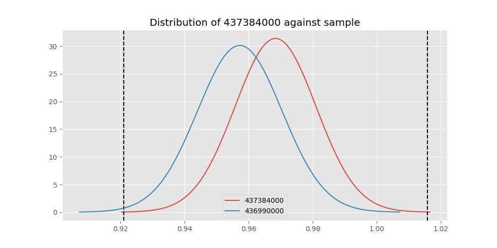
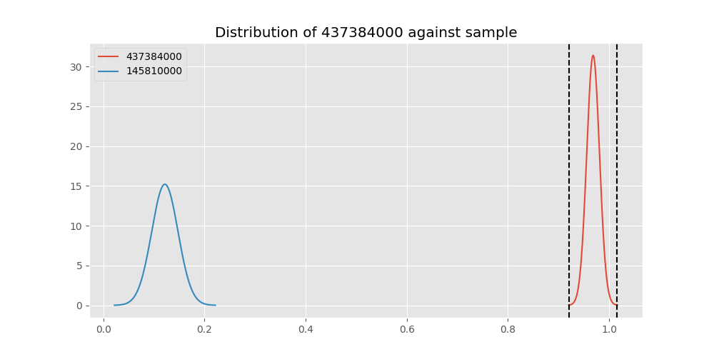
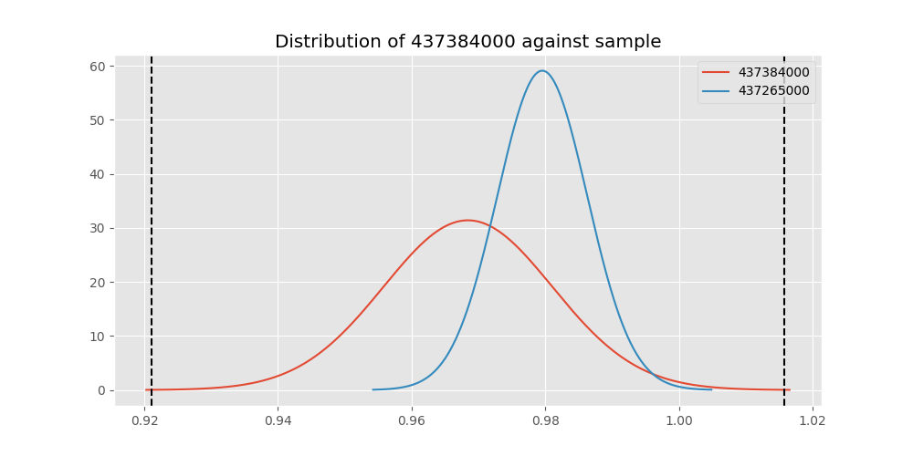
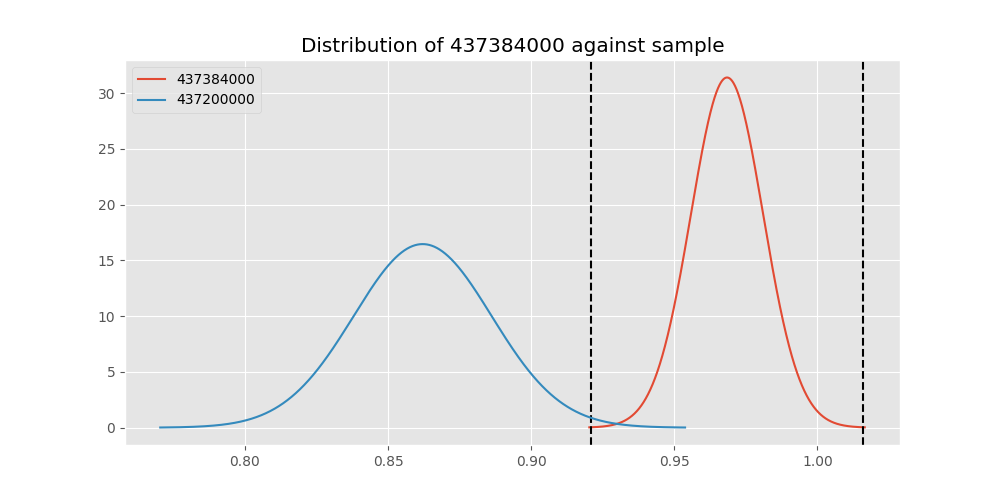
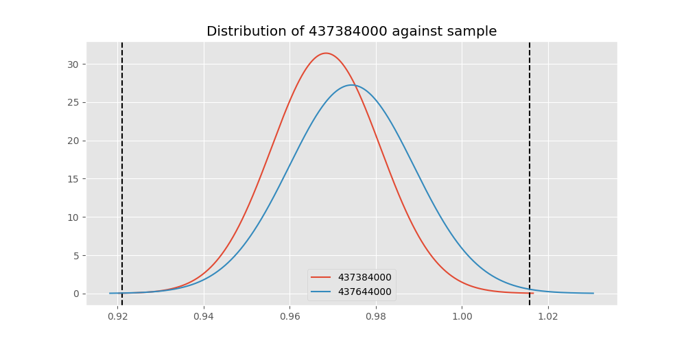

# Testing Results For 437384000 
$H_{0}$: There is not a difference in collection success against 437384000 
$H_{A}$: There is a difference in collection success against 437384000
An $\alpha$ of 0.00025 was used 
Out of 44 tests, there were 15 rejections from 44 independent-t test.
Out of 44 tests, there were 16 rejections from 44 Man Whitney u-tests.
## Testing Results for 437384000 against 436501000 
437384000 has a success rate of 0.968421052631579
436501000 has a success rate of 0.9854014598540146
$H_{0}$: There is not a difference between 437384000 and 436501000
$H_{A}$: There is a difference between 437384000 and 436501000
An $/alpha$ of 0.00025 was used in this test.
__independent t-testing__: With a t-statistic of -0.9790978432189518 and a p-value of 0.3282598893608528, _we failed to reject the null hypothssis_
__Man-Whitney testing__: With a u-statistic of 12794.0 and a p-value of 0.32859654243800995, _we failed to reject the null hypothssis_
 
## Testing Results for 437384000 against 437375000 
437384000 has a success rate of 0.968421052631579
437375000 has a success rate of 0.9982014388489209
$H_{0}$: There is not a difference between 437384000 and 437375000
$H_{A}$: There is a difference between 437384000 and 437375000
An $/alpha$ of 0.00025 was used in this test.
__independent t-testing__: With a t-statistic of -2.318098933165387 and a p-value of 0.021472569582576085, _we failed to reject the null hypothssis_
__Man-Whitney testing__: With a u-statistic of 51247.0 and a p-value of 0.00024057465386258933, _we **reject** the null hypothssis_
 
## Testing Results for 437384000 against 436500000 
437384000 has a success rate of 0.968421052631579
436500000 has a success rate of 0.9056603773584906
$H_{0}$: There is not a difference between 437384000 and 436500000
$H_{A}$: There is a difference between 437384000 and 436500000
An $/alpha$ of 0.00025 was used in this test.
__independent t-testing__: With a t-statistic of 2.469819788602815 and a p-value of 0.013998609155233155, _we failed to reject the null hypothssis_
__Man-Whitney testing__: With a u-statistic of 16053.0 and a p-value of 0.01426083374606946, _we failed to reject the null hypothssis_
 
## Testing Results for 437384000 against 436990000 
437384000 has a success rate of 0.968421052631579
436990000 has a success rate of 0.9572649572649573
$H_{0}$: There is not a difference between 437384000 and 436990000
$H_{A}$: There is a difference between 437384000 and 436990000
An $/alpha$ of 0.00025 was used in this test.
__independent t-testing__: With a t-statistic of 0.5983389040622181 and a p-value of 0.5499348201821724, _we failed to reject the null hypothssis_
__Man-Whitney testing__: With a u-statistic of 22478.0 and a p-value of 0.5501160554292341, _we failed to reject the null hypothssis_
 
## Testing Results for 437384000 against 145875000 
437384000 has a success rate of 0.968421052631579
145875000 has a success rate of 0.9722222222222222
$H_{0}$: There is not a difference between 437384000 and 145875000
$H_{A}$: There is a difference between 437384000 and 145875000
An $/alpha$ of 0.00025 was used in this test.
__independent t-testing__: With a t-statistic of -0.15903995381539376 and a p-value of 0.8737608640557359, _we failed to reject the null hypothssis_
__Man-Whitney testing__: With a u-statistic of 6814.0 and a p-value of 0.8758173896584835, _we failed to reject the null hypothssis_
 
## Testing Results for 437384000 against 437800000 
437384000 has a success rate of 0.968421052631579
437800000 has a success rate of 0.9533678756476683
$H_{0}$: There is not a difference between 437384000 and 437800000
$H_{A}$: There is a difference between 437384000 and 437800000
An $/alpha$ of 0.00025 was used in this test.
__independent t-testing__: With a t-statistic of 0.7578856665412891 and a p-value of 0.44898793646599233, _we failed to reject the null hypothssis_
__Man-Whitney testing__: With a u-statistic of 18611.0 and a p-value of 0.4490891192676185, _we failed to reject the null hypothssis_
 
## Testing Results for 437384000 against 145810000 
437384000 has a success rate of 0.968421052631579
145810000 has a success rate of 0.12179487179487179
$H_{0}$: There is not a difference between 437384000 and 145810000
$H_{A}$: There is a difference between 437384000 and 145810000
An $/alpha$ of 0.00025 was used in this test.
__independent t-testing__: With a t-statistic of 30.641867050011374 and a p-value of 2.3887079984110884e-100, _we **reject** the null hypothssis_
__Man-Whitney testing__: With a u-statistic of 27367.0 and a p-value of 7.506435973118875e-57, _we **reject** the null hypothssis_
 
## Testing Results for 437384000 against 437095000 
437384000 has a success rate of 0.968421052631579
437095000 has a success rate of 0.9361702127659575
$H_{0}$: There is not a difference between 437384000 and 437095000
$H_{A}$: There is a difference between 437384000 and 437095000
An $/alpha$ of 0.00025 was used in this test.
__independent t-testing__: With a t-statistic of 1.0337062570335747 and a p-value of 0.3023361083312782, _we failed to reject the null hypothssis_
__Man-Whitney testing__: With a u-statistic of 4609.0 and a p-value of 0.3030252961468697, _we failed to reject the null hypothssis_
 
## Testing Results for 437384000 against 437265000 
437384000 has a success rate of 0.968421052631579
437265000 has a success rate of 0.9795454545454545
$H_{0}$: There is not a difference between 437384000 and 437265000
$H_{A}$: There is a difference between 437384000 and 437265000
An $/alpha$ of 0.00025 was used in this test.
__independent t-testing__: With a t-statistic of -0.8396921791215567 and a p-value of 0.4014005420878497, _we failed to reject the null hypothssis_
__Man-Whitney testing__: With a u-statistic of 41335.0 and a p-value of 0.4014771694666345, _we failed to reject the null hypothssis_
 
## Testing Results for 437384000 against 437350000 
437384000 has a success rate of 0.968421052631579
437350000 has a success rate of 0.9488372093023256
$H_{0}$: There is not a difference between 437384000 and 437350000
$H_{A}$: There is a difference between 437384000 and 437350000
An $/alpha$ of 0.00025 was used in this test.
__independent t-testing__: With a t-statistic of 0.979540836497322 and a p-value of 0.327900478896185, _we failed to reject the null hypothssis_
__Man-Whitney testing__: With a u-statistic of 20825.0 and a p-value of 0.32789360940898127, _we failed to reject the null hypothssis_
 
## Testing Results for 437384000 against 437200000 
437384000 has a success rate of 0.968421052631579
437200000 has a success rate of 0.8620689655172413
$H_{0}$: There is not a difference between 437384000 and 437200000
$H_{A}$: There is a difference between 437384000 and 437200000
An $/alpha$ of 0.00025 was used in this test.
__independent t-testing__: With a t-statistic of 3.8069371919588297 and a p-value of 0.00016328191057354667, _we **reject** the null hypothssis_
__Man-Whitney testing__: With a u-statistic of 21336.0 and a p-value of 0.0001824518683098028, _we **reject** the null hypothssis_
 
## Testing Results for 437384000 against 435600000 
437384000 has a success rate of 0.968421052631579
435600000 has a success rate of 0.9819341126461212
$H_{0}$: There is not a difference between 437384000 and 435600000
$H_{A}$: There is a difference between 437384000 and 435600000
An $/alpha$ of 0.00025 was used in this test.
__independent t-testing__: With a t-statistic of -1.2034189783706244 and a p-value of 0.22906650167457135, _we failed to reject the null hypothssis_
__Man-Whitney testing__: With a u-statistic of 88187.0 and a p-value of 0.229099257004568, _we failed to reject the null hypothssis_
 
## Testing Results for 437384000 against 450000000 
437384000 has a success rate of 0.968421052631579
450000000 has a success rate of 0.8235294117647058
$H_{0}$: There is not a difference between 437384000 and 450000000
$H_{A}$: There is a difference between 437384000 and 450000000
An $/alpha$ of 0.00025 was used in this test.
__independent t-testing__: With a t-statistic of 4.304722796332022 and a p-value of 2.332880331273193e-05, _we **reject** the null hypothssis_
__Man-Whitney testing__: With a u-statistic of 9245.0 and a p-value of 3.0259485307946447e-05, _we **reject** the null hypothssis_
 
## Testing Results for 437384000 against 145978500 
437384000 has a success rate of 0.968421052631579
145978500 has a success rate of 0.9963636363636363
$H_{0}$: There is not a difference between 437384000 and 145978500
$H_{A}$: There is a difference between 437384000 and 145978500
An $/alpha$ of 0.00025 was used in this test.
__independent t-testing__: With a t-statistic of -2.1120727041579466 and a p-value of 0.03580740696376684, _we failed to reject the null hypothssis_
__Man-Whitney testing__: With a u-statistic of 25395.0 and a p-value of 0.015172821772120534, _we failed to reject the null hypothssis_
 
## Testing Results for 437384000 against 437050000 
437384000 has a success rate of 0.968421052631579
437050000 has a success rate of 0.5346534653465347
$H_{0}$: There is not a difference between 437384000 and 437050000
$H_{A}$: There is a difference between 437384000 and 437050000
An $/alpha$ of 0.00025 was used in this test.
__independent t-testing__: With a t-statistic of 10.76569808140956 and a p-value of 5.984761377428967e-23, _we **reject** the null hypothssis_
__Man-Whitney testing__: With a u-statistic of 13757.0 and a p-value of 8.243589109069305e-20, _we **reject** the null hypothssis_
 
## Testing Results for 437384000 against 435300000 
437384000 has a success rate of 0.968421052631579
435300000 has a success rate of 0.1232876712328767
$H_{0}$: There is not a difference between 437384000 and 435300000
$H_{A}$: There is a difference between 437384000 and 435300000
An $/alpha$ of 0.00025 was used in this test.
__independent t-testing__: With a t-statistic of 30.202451673084102 and a p-value of 1.6226277734936848e-97, _we **reject** the null hypothssis_
__Man-Whitney testing__: With a u-statistic of 25592.0 and a p-value of 2.8999379537858655e-55, _we **reject** the null hypothssis_
 
## Testing Results for 437384000 against 437475000 
437384000 has a success rate of 0.968421052631579
437475000 has a success rate of 0.5045045045045045
$H_{0}$: There is not a difference between 437384000 and 437475000
$H_{A}$: There is a difference between 437384000 and 437475000
An $/alpha$ of 0.00025 was used in this test.
__independent t-testing__: With a t-statistic of 12.513289229993138 and a p-value of 9.757870011407481e-33, _we **reject** the null hypothssis_
__Man-Whitney testing__: With a u-statistic of 77185.0 and a p-value of 5.281614996531742e-30, _we **reject** the null hypothssis_
 
## Testing Results for 437384000 against 435448000 
437384000 has a success rate of 0.968421052631579
435448000 has a success rate of 0.975
$H_{0}$: There is not a difference between 437384000 and 435448000
$H_{A}$: There is a difference between 437384000 and 435448000
An $/alpha$ of 0.00025 was used in this test.
__independent t-testing__: With a t-statistic of -0.21921736041326173 and a p-value of 0.826676852572505, _we failed to reject the null hypothssis_
__Man-Whitney testing__: With a u-statistic of 3775.0 and a p-value of 0.8295482918313858, _we failed to reject the null hypothssis_
 
## Testing Results for 437384000 against 437644000 
437384000 has a success rate of 0.968421052631579
437644000 has a success rate of 0.9743589743589743
$H_{0}$: There is not a difference between 437384000 and 437644000
$H_{A}$: There is a difference between 437384000 and 437644000
An $/alpha$ of 0.00025 was used in this test.
__independent t-testing__: With a t-statistic of -0.2985988993853761 and a p-value of 0.765449438457137, _we failed to reject the null hypothssis_
__Man-Whitney testing__: With a u-statistic of 11049.0 and a p-value of 0.7666353832961499, _we failed to reject the null hypothssis_
 
## Testing Results for 437384000 against 145825000 
437384000 has a success rate of 0.968421052631579
145825000 has a success rate of 0.8687448728465955
$H_{0}$: There is not a difference between 437384000 and 145825000
$H_{A}$: There is a difference between 437384000 and 145825000
An $/alpha$ of 0.00025 was used in this test.
__independent t-testing__: With a t-statistic of 4.025378494748276 and a p-value of 5.849352952756932e-05, _we **reject** the null hypothssis_
__Man-Whitney testing__: With a u-statistic of 254696.0 and a p-value of 5.97759532653351e-05, _we **reject** the null hypothssis_
 
## Testing Results for 437384000 against 437345000 
437384000 has a success rate of 0.968421052631579
437345000 has a success rate of 0.7603092783505154
$H_{0}$: There is not a difference between 437384000 and 437345000
$H_{A}$: There is a difference between 437384000 and 437345000
An $/alpha$ of 0.00025 was used in this test.
__independent t-testing__: With a t-statistic of 6.4483881921955435 and a p-value of 2.394788059775097e-10, _we **reject** the null hypothssis_
__Man-Whitney testing__: With a u-statistic of 44531.0 and a p-value of 4.5899603234308293e-10, _we **reject** the null hypothssis_
 
## Testing Results for 437384000 against 435275000 
437384000 has a success rate of 0.968421052631579
435275000 has a success rate of 0.9152542372881356
$H_{0}$: There is not a difference between 437384000 and 435275000
$H_{A}$: There is a difference between 437384000 and 435275000
An $/alpha$ of 0.00025 was used in this test.
__independent t-testing__: With a t-statistic of 2.0513202698492683 and a p-value of 0.041086840172361125, _we failed to reject the null hypothssis_
__Man-Whitney testing__: With a u-statistic of 11806.0 and a p-value of 0.04145260370445639, _we failed to reject the null hypothssis_
 
## Testing Results for 437384000 against 437322500 
437384000 has a success rate of 0.968421052631579
437322500 has a success rate of 0.9961685823754789
$H_{0}$: There is not a difference between 437384000 and 437322500
$H_{A}$: There is a difference between 437384000 and 437322500
An $/alpha$ of 0.00025 was used in this test.
__independent t-testing__: With a t-statistic of -2.0886563628376127 and a p-value of 0.03787071399545177, _we failed to reject the null hypothssis_
__Man-Whitney testing__: With a u-statistic of 24107.0 and a p-value of 0.01879975146474089, _we failed to reject the null hypothssis_
 
## Testing Results for 437384000 against 437450000 
437384000 has a success rate of 0.968421052631579
437450000 has a success rate of 0.6947791164658634
$H_{0}$: There is not a difference between 437384000 and 437450000
$H_{A}$: There is a difference between 437384000 and 437450000
An $/alpha$ of 0.00025 was used in this test.
__independent t-testing__: With a t-statistic of 7.756537086557388 and a p-value of 6.211005227522257e-14, _we **reject** the null hypothssis_
__Man-Whitney testing__: With a u-statistic of 30128.0 and a p-value of 3.3422597969632674e-13, _we **reject** the null hypothssis_
 
## Testing Results for 437384000 against 436703000 
437384000 has a success rate of 0.968421052631579
436703000 has a success rate of 0.9859154929577465
$H_{0}$: There is not a difference between 437384000 and 436703000
$H_{A}$: There is a difference between 437384000 and 436703000
An $/alpha$ of 0.00025 was used in this test.
__independent t-testing__: With a t-statistic of -1.185575708197859 and a p-value of 0.23649196165338682, _we failed to reject the null hypothssis_
__Man-Whitney testing__: With a u-statistic of 19881.0 and a p-value of 0.23668853707068827, _we failed to reject the null hypothssis_
 
## Testing Results for 437384000 against 400500000 
437384000 has a success rate of 0.968421052631579
400500000 has a success rate of 0.3508771929824561
$H_{0}$: There is not a difference between 437384000 and 400500000
$H_{A}$: There is a difference between 437384000 and 400500000
An $/alpha$ of 0.00025 was used in this test.
__independent t-testing__: With a t-statistic of 14.764500113671138 and a p-value of 1.0204612547941795e-35, _we **reject** the null hypothssis_
__Man-Whitney testing__: With a u-statistic of 8759.0 and a p-value of 5.284144864958601e-27, _we **reject** the null hypothssis_
 
## Testing Results for 437384000 against 437150000 
437384000 has a success rate of 0.968421052631579
437150000 has a success rate of 0.9859550561797753
$H_{0}$: There is not a difference between 437384000 and 437150000
$H_{A}$: There is a difference between 437384000 and 437150000
An $/alpha$ of 0.00025 was used in this test.
__independent t-testing__: With a t-statistic of -1.3889217524408932 and a p-value of 0.16542487326160774, _we failed to reject the null hypothssis_
__Man-Whitney testing__: With a u-statistic of 33227.0 and a p-value of 0.16557314657300237, _we failed to reject the null hypothssis_
 
## Testing Results for 437384000 against 435635000 
437384000 has a success rate of 0.968421052631579
435635000 has a success rate of 0.9849624060150376
$H_{0}$: There is not a difference between 437384000 and 435635000
$H_{A}$: There is a difference between 437384000 and 435635000
An $/alpha$ of 0.00025 was used in this test.
__independent t-testing__: With a t-statistic of -0.9397720541051331 and a p-value of 0.34804111529213677, _we failed to reject the null hypothssis_
__Man-Whitney testing__: With a u-statistic of 12426.0 and a p-value of 0.348401729928398, _we failed to reject the null hypothssis_
 
## Testing Results for 437384000 against 437405000 
437384000 has a success rate of 0.968421052631579
437405000 has a success rate of 0.9953917050691244
$H_{0}$: There is not a difference between 437384000 and 437405000
$H_{A}$: There is a difference between 437384000 and 437405000
An $/alpha$ of 0.00025 was used in this test.
__independent t-testing__: With a t-statistic of -1.9934861192777182 and a p-value of 0.04734850196755386, _we failed to reject the null hypothssis_
__Man-Whitney testing__: With a u-statistic of 20059.0 and a p-value of 0.037206594363388634, _we failed to reject the null hypothssis_
 
## Testing Results for 437384000 against 435612500 
437384000 has a success rate of 0.968421052631579
435612500 has a success rate of 0.9770114942528736
$H_{0}$: There is not a difference between 437384000 and 435612500
$H_{A}$: There is a difference between 437384000 and 435612500
An $/alpha$ of 0.00025 was used in this test.
__independent t-testing__: With a t-statistic of -0.3949301170664488 and a p-value of 0.6932006030844247, _we failed to reject the null hypothssis_
__Man-Whitney testing__: With a u-statistic of 8194.0 and a p-value of 0.6945042043072818, _we failed to reject the null hypothssis_
 
## Testing Results for 437384000 against 435975000 
437384000 has a success rate of 0.968421052631579
435975000 has a success rate of 0.92
$H_{0}$: There is not a difference between 437384000 and 435975000
$H_{A}$: There is a difference between 437384000 and 435975000
An $/alpha$ of 0.00025 was used in this test.
__independent t-testing__: With a t-statistic of 1.5255756134590475 and a p-value of 0.12844334019001433, _we failed to reject the null hypothssis_
__Man-Whitney testing__: With a u-statistic of 4980.0 and a p-value of 0.12900193611927416, _we failed to reject the null hypothssis_
 
## Testing Results for 437384000 against 437425000 
437384000 has a success rate of 0.968421052631579
437425000 has a success rate of 0.6987654320987654
$H_{0}$: There is not a difference between 437384000 and 437425000
$H_{A}$: There is a difference between 437384000 and 437425000
An $/alpha$ of 0.00025 was used in this test.
__independent t-testing__: With a t-statistic of 7.8256252492693195 and a p-value of 2.330048603209034e-14, _we **reject** the null hypothssis_
__Man-Whitney testing__: With a u-statistic of 48850.0 and a p-value of 8.89943182393596e-14, _we **reject** the null hypothssis_
 
## Testing Results for 437384000 against 437275000 
437384000 has a success rate of 0.968421052631579
437275000 has a success rate of 0.3643724696356275
$H_{0}$: There is not a difference between 437384000 and 437275000
$H_{A}$: There is a difference between 437384000 and 437275000
An $/alpha$ of 0.00025 was used in this test.
__independent t-testing__: With a t-statistic of 16.44645044945241 and a p-value of 1.3009366178879504e-47, _we **reject** the null hypothssis_
__Man-Whitney testing__: With a u-statistic of 37639.0 and a p-value of 3.0988086618583653e-38, _we **reject** the null hypothssis_
 
## Testing Results for 437384000 against 145840000 
437384000 has a success rate of 0.968421052631579
145840000 has a success rate of 0.9649122807017544
$H_{0}$: There is not a difference between 437384000 and 145840000
$H_{A}$: There is a difference between 437384000 and 145840000
An $/alpha$ of 0.00025 was used in this test.
__independent t-testing__: With a t-statistic of 0.13071445298642848 and a p-value of 0.8961084640457384, _we failed to reject the null hypothssis_
__Man-Whitney testing__: With a u-statistic of 5434.0 and a p-value of 0.8985212219723205, _we failed to reject the null hypothssis_
 
## Testing Results for 437384000 against 435525000 
437384000 has a success rate of 0.968421052631579
435525000 has a success rate of 0.6923076923076923
$H_{0}$: There is not a difference between 437384000 and 435525000
$H_{A}$: There is a difference between 437384000 and 435525000
An $/alpha$ of 0.00025 was used in this test.
__independent t-testing__: With a t-statistic of 7.5342145189361664 and a p-value of 4.73354412928223e-13, _we **reject** the null hypothssis_
__Man-Whitney testing__: With a u-statistic of 17336.0 and a p-value of 3.157719661120464e-12, _we **reject** the null hypothssis_
 
## Testing Results for 437384000 against 436250000 
437384000 has a success rate of 0.968421052631579
436250000 has a success rate of 0.17857142857142858
$H_{0}$: There is not a difference between 437384000 and 436250000
$H_{A}$: There is a difference between 437384000 and 436250000
An $/alpha$ of 0.00025 was used in this test.
__independent t-testing__: With a t-statistic of 21.66676459059227 and a p-value of 8.89362351848119e-59, _we **reject** the null hypothssis_
__Man-Whitney testing__: With a u-statistic of 9522.0 and a p-value of 6.2763410662069585e-37, _we **reject** the null hypothssis_
 
## Testing Results for 437384000 against 435950000 
437384000 has a success rate of 0.968421052631579
435950000 has a success rate of 0.9850187265917603
$H_{0}$: There is not a difference between 437384000 and 435950000
$H_{A}$: There is a difference between 437384000 and 435950000
An $/alpha$ of 0.00025 was used in this test.
__independent t-testing__: With a t-statistic of -1.426860532851709 and a p-value of 0.1540523937151724, _we failed to reject the null hypothssis_
__Man-Whitney testing__: With a u-statistic of 49888.0 and a p-value of 0.1541593075885901, _we failed to reject the null hypothssis_
 
## Testing Results for 437384000 against 435800000 
437384000 has a success rate of 0.968421052631579
435800000 has a success rate of 0.5390070921985816
$H_{0}$: There is not a difference between 437384000 and 435800000
$H_{A}$: There is a difference between 437384000 and 435800000
An $/alpha$ of 0.00025 was used in this test.
__independent t-testing__: With a t-statistic of 10.964069234075971 and a p-value of 4.746923478768404e-24, _we **reject** the null hypothssis_
__Man-Whitney testing__: With a u-statistic of 19147.0 and a p-value of 5.641096759716007e-21, _we **reject** the null hypothssis_
 
## Testing Results for 437384000 against 437485000 
437384000 has a success rate of 0.968421052631579
437485000 has a success rate of 0.9375
$H_{0}$: There is not a difference between 437384000 and 437485000
$H_{A}$: There is a difference between 437384000 and 437485000
An $/alpha$ of 0.00025 was used in this test.
__independent t-testing__: With a t-statistic of 0.8657731356680448 and a p-value of 0.38755773667934423, _we failed to reject the null hypothssis_
__Man-Whitney testing__: With a u-statistic of 3134.0 and a p-value of 0.38887667345457577, _we failed to reject the null hypothssis_
 
## Testing Results for 437384000 against 136770000 
437384000 has a success rate of 0.968421052631579
136770000 has a success rate of 0.9945945945945946
$H_{0}$: There is not a difference between 437384000 and 136770000
$H_{A}$: There is a difference between 437384000 and 136770000
An $/alpha$ of 0.00025 was used in this test.
__independent t-testing__: With a t-statistic of -1.8937199784942635 and a p-value of 0.05939457147915209, _we failed to reject the null hypothssis_
__Man-Whitney testing__: With a u-statistic of 17115.0 and a p-value of 0.06179874091569562, _we failed to reject the null hypothssis_
 
## Testing Results for 437384000 against 437250000 
437384000 has a success rate of 0.968421052631579
437250000 has a success rate of 0.9937106918238994
$H_{0}$: There is not a difference between 437384000 and 437250000
$H_{A}$: There is a difference between 437384000 and 437250000
An $/alpha$ of 0.00025 was used in this test.
__independent t-testing__: With a t-statistic of -1.8770524129098987 and a p-value of 0.06174579883467485, _we failed to reject the null hypothssis_
__Man-Whitney testing__: With a u-statistic of 29446.0 and a p-value of 0.026988653116654587, _we failed to reject the null hypothssis_
 
## Testing Results for 437384000 against 437356000 
437384000 has a success rate of 0.968421052631579
437356000 has a success rate of 0.9328358208955224
$H_{0}$: There is not a difference between 437384000 and 437356000
$H_{A}$: There is a difference between 437384000 and 437356000
An $/alpha$ of 0.00025 was used in this test.
__independent t-testing__: With a t-statistic of 1.5018196387087237 and a p-value of 0.1341236799964936, _we failed to reject the null hypothssis_
__Man-Whitney testing__: With a u-statistic of 13183.0 and a p-value of 0.1343269196593703, _we failed to reject the null hypothssis_
 
## Testing Results for 437384000 against 437676000 
437384000 has a success rate of 0.968421052631579
437676000 has a success rate of 0.9813432835820896
$H_{0}$: There is not a difference between 437384000 and 437676000
$H_{A}$: There is a difference between 437384000 and 437676000
An $/alpha$ of 0.00025 was used in this test.
__independent t-testing__: With a t-statistic of -0.8887709375200059 and a p-value of 0.37459478610949537, _we failed to reject the null hypothssis_
__Man-Whitney testing__: With a u-statistic of 25131.0 and a p-value of 0.37474289466426525, _we failed to reject the null hypothssis_
 
## Testing Results for 437384000 against 145826800 
437384000 has a success rate of 0.968421052631579
145826800 has a success rate of 0.966183574879227
$H_{0}$: There is not a difference between 437384000 and 145826800
$H_{A}$: There is a difference between 437384000 and 145826800
An $/alpha$ of 0.00025 was used in this test.
__independent t-testing__: With a t-statistic of 0.12482182368529869 and a p-value of 0.9007281084665371, _we failed to reject the null hypothssis_
__Man-Whitney testing__: With a u-statistic of 19709.0 and a p-value of 0.9016659889379544, _we failed to reject the null hypothssis_
 
