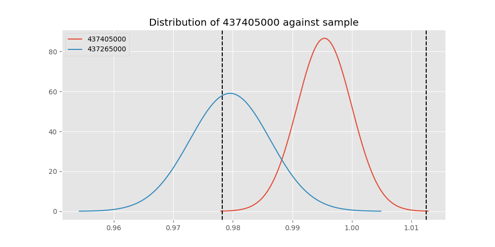
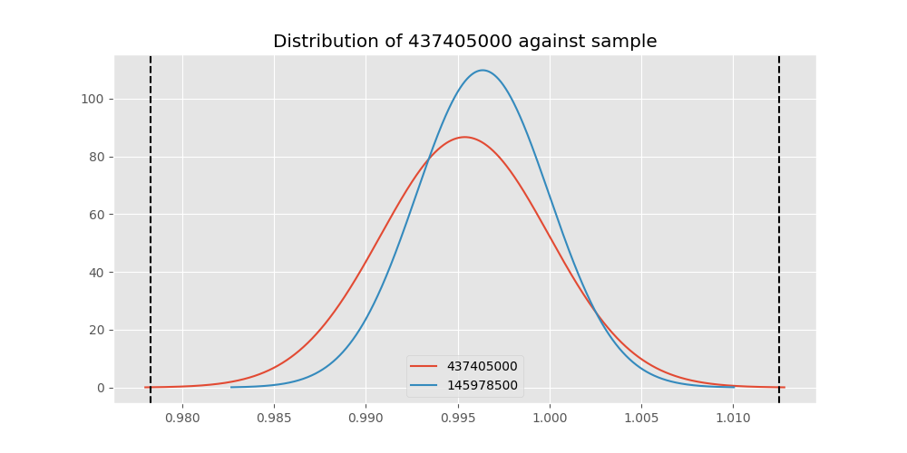
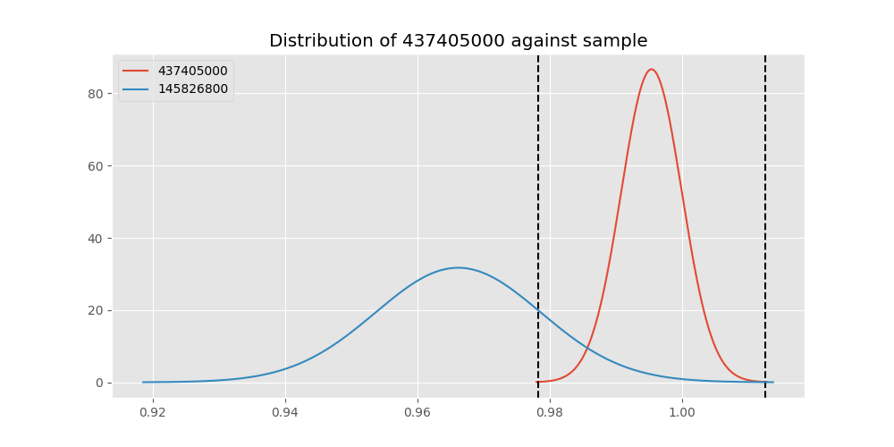

# Testing Results For 437405000 
$H_{0}$: There is not a difference in collection success against 437405000 
$H_{A}$: There is a difference in collection success against 437405000
An $\alpha$ of 0.00025 was used 
Out of 44 tests, there were 17 rejections from 44 independent-t test.
Out of 44 tests, there were 17 rejections from 44 Man Whitney u-tests.
## Testing Results for 437405000 against 436501000 
437405000 has a success rate of 0.9953917050691244
436501000 has a success rate of 0.9854014598540146
$H_{0}$: There is not a difference between 437405000 and 436501000
$H_{A}$: There is a difference between 437405000 and 436501000
An $/alpha$ of 0.00025 was used in this test.
__independent t-testing__: With a t-statistic of 0.9973237877255227 and a p-value of 0.319292459358593, _we failed to reject the null hypothssis_
__Man-Whitney testing__: With a u-statistic of 15013.0 and a p-value of 0.3202358562760629, _we failed to reject the null hypothssis_
 
## Testing Results for 437405000 against 437375000 
437405000 has a success rate of 0.9953917050691244
437375000 has a success rate of 0.9982014388489209
$H_{0}$: There is not a difference between 437405000 and 437375000
$H_{A}$: There is a difference between 437405000 and 437375000
An $/alpha$ of 0.00025 was used in this test.
__independent t-testing__: With a t-statistic of -0.6903218372721329 and a p-value of 0.4901995665975464, _we failed to reject the null hypothssis_
__Man-Whitney testing__: With a u-statistic of 60156.5 and a p-value of 0.49112603799065646, _we failed to reject the null hypothssis_
 
## Testing Results for 437405000 against 436500000 
437405000 has a success rate of 0.9953917050691244
436500000 has a success rate of 0.9056603773584906
$H_{0}$: There is not a difference between 437405000 and 436500000
$H_{A}$: There is a difference between 437405000 and 436500000
An $/alpha$ of 0.00025 was used in this test.
__independent t-testing__: With a t-statistic of 4.353426442366712 and a p-value of 1.7322116982982062e-05, _we **reject** the null hypothssis_
__Man-Whitney testing__: With a u-statistic of 18799.5 and a p-value of 2.123951965550717e-05, _we **reject** the null hypothssis_
 
## Testing Results for 437405000 against 436990000 
437405000 has a success rate of 0.9953917050691244
436990000 has a success rate of 0.9572649572649573
$H_{0}$: There is not a difference between 437405000 and 436990000
$H_{A}$: There is a difference between 437405000 and 436990000
An $/alpha$ of 0.00025 was used in this test.
__independent t-testing__: With a t-statistic of 2.6369701060086963 and a p-value of 0.008655105841866389, _we failed to reject the null hypothssis_
__Man-Whitney testing__: With a u-statistic of 26357.0 and a p-value of 0.008835760996189674, _we failed to reject the null hypothssis_
 
## Testing Results for 437405000 against 145875000 
437405000 has a success rate of 0.9953917050691244
145875000 has a success rate of 0.9722222222222222
$H_{0}$: There is not a difference between 437405000 and 145875000
$H_{A}$: There is a difference between 437405000 and 145875000
An $/alpha$ of 0.00025 was used in this test.
__independent t-testing__: With a t-statistic of 1.6832278936156924 and a p-value of 0.09341838022267458, _we failed to reject the null hypothssis_
__Man-Whitney testing__: With a u-statistic of 7993.0 and a p-value of 0.09427592798024104, _we failed to reject the null hypothssis_
 
## Testing Results for 437405000 against 437800000 
437405000 has a success rate of 0.9953917050691244
437800000 has a success rate of 0.9533678756476683
$H_{0}$: There is not a difference between 437405000 and 437800000
$H_{A}$: There is a difference between 437405000 and 437800000
An $/alpha$ of 0.00025 was used in this test.
__independent t-testing__: With a t-statistic of 2.7724069264472733 and a p-value of 0.005819293359929074, _we failed to reject the null hypothssis_
__Man-Whitney testing__: With a u-statistic of 21820.5 and a p-value of 0.005987645392832727, _we failed to reject the null hypothssis_
 
## Testing Results for 437405000 against 145810000 
437405000 has a success rate of 0.9953917050691244
145810000 has a success rate of 0.12179487179487179
$H_{0}$: There is not a difference between 437405000 and 145810000
$H_{A}$: There is a difference between 437405000 and 145810000
An $/alpha$ of 0.00025 was used in this test.
__independent t-testing__: With a t-statistic of 38.12227351774157 and a p-value of 2.2448980277336233e-130, _we **reject** the null hypothssis_
__Man-Whitney testing__: With a u-statistic of 31712.5 and a p-value of 2.0784449874696256e-66, _we **reject** the null hypothssis_
 
## Testing Results for 437405000 against 437095000 
437405000 has a success rate of 0.9953917050691244
437095000 has a success rate of 0.9361702127659575
$H_{0}$: There is not a difference between 437405000 and 437095000
$H_{A}$: There is a difference between 437405000 and 437095000
An $/alpha$ of 0.00025 was used in this test.
__independent t-testing__: With a t-statistic of 3.0548658635830575 and a p-value of 0.002483899920340633, _we failed to reject the null hypothssis_
__Man-Whitney testing__: With a u-statistic of 5401.5 and a p-value of 0.002676703886376687, _we failed to reject the null hypothssis_
 
## Testing Results for 437405000 against 437265000 
437405000 has a success rate of 0.9953917050691244
437265000 has a success rate of 0.9795454545454545
$H_{0}$: There is not a difference between 437405000 and 437265000
$H_{A}$: There is a difference between 437405000 and 437265000
An $/alpha$ of 0.00025 was used in this test.
__independent t-testing__: With a t-statistic of 1.5608364293846342 and a p-value of 0.11904535499924278, _we failed to reject the null hypothssis_
__Man-Whitney testing__: With a u-statistic of 48496.5 and a p-value of 0.11920951258531738, _we failed to reject the null hypothssis_
 
## Testing Results for 437405000 against 437350000 
437405000 has a success rate of 0.9953917050691244
437350000 has a success rate of 0.9488372093023256
$H_{0}$: There is not a difference between 437405000 and 437350000
$H_{A}$: There is a difference between 437405000 and 437350000
An $/alpha$ of 0.00025 was used in this test.
__independent t-testing__: With a t-statistic of 2.967088872838343 and a p-value of 0.003174085887964128, _we failed to reject the null hypothssis_
__Man-Whitney testing__: With a u-statistic of 24413.5 and a p-value of 0.0032902505906465974, _we failed to reject the null hypothssis_
 
## Testing Results for 437405000 against 437200000 
437405000 has a success rate of 0.9953917050691244
437200000 has a success rate of 0.8620689655172413
$H_{0}$: There is not a difference between 437405000 and 437200000
$H_{A}$: There is a difference between 437405000 and 437200000
An $/alpha$ of 0.00025 was used in this test.
__independent t-testing__: With a t-statistic of 5.568274756407531 and a p-value of 4.610358355836474e-08, _we **reject** the null hypothssis_
__Man-Whitney testing__: With a u-statistic of 24962.0 and a p-value of 7.528158686796805e-08, _we **reject** the null hypothssis_
 
## Testing Results for 437405000 against 435600000 
437405000 has a success rate of 0.9953917050691244
435600000 has a success rate of 0.9819341126461212
$H_{0}$: There is not a difference between 437405000 and 435600000
$H_{A}$: There is a difference between 437405000 and 435600000
An $/alpha$ of 0.00025 was used in this test.
__independent t-testing__: With a t-statistic of 1.444687741727503 and a p-value of 0.14881660426779952, _we failed to reject the null hypothssis_
__Man-Whitney testing__: With a u-statistic of 103472.5 and a p-value of 0.14888416932828502, _we failed to reject the null hypothssis_
 
## Testing Results for 437405000 against 450000000 
437405000 has a success rate of 0.9953917050691244
450000000 has a success rate of 0.8235294117647058
$H_{0}$: There is not a difference between 437405000 and 450000000
$H_{A}$: There is a difference between 437405000 and 450000000
An $/alpha$ of 0.00025 was used in this test.
__independent t-testing__: With a t-statistic of 6.367421126231516 and a p-value of 7.19902590222844e-10, _we **reject** the null hypothssis_
__Man-Whitney testing__: With a u-statistic of 10807.5 and a p-value of 2.1714237152966527e-09, _we **reject** the null hypothssis_
 
## Testing Results for 437405000 against 145978500 
437405000 has a success rate of 0.9953917050691244
145978500 has a success rate of 0.9963636363636363
$H_{0}$: There is not a difference between 437405000 and 145978500
$H_{A}$: There is a difference between 437405000 and 145978500
An $/alpha$ of 0.00025 was used in this test.
__independent t-testing__: With a t-statistic of -0.1678917179694293 and a p-value of 0.8667377367500679, _we failed to reject the null hypothssis_
__Man-Whitney testing__: With a u-statistic of 29808.5 and a p-value of 0.8688176064550162, _we failed to reject the null hypothssis_
 
## Testing Results for 437405000 against 437050000 
437405000 has a success rate of 0.9953917050691244
437050000 has a success rate of 0.5346534653465347
$H_{0}$: There is not a difference between 437405000 and 437050000
$H_{A}$: There is a difference between 437405000 and 437050000
An $/alpha$ of 0.00025 was used in this test.
__independent t-testing__: With a t-statistic of 13.303137718363116 and a p-value of 2.271136264086879e-32, _we **reject** the null hypothssis_
__Man-Whitney testing__: With a u-statistic of 16007.5 and a p-value of 1.4575390862294345e-26, _we **reject** the null hypothssis_
 
## Testing Results for 437405000 against 435300000 
437405000 has a success rate of 0.9953917050691244
435300000 has a success rate of 0.1232876712328767
$H_{0}$: There is not a difference between 437405000 and 435300000
$H_{A}$: There is a difference between 437405000 and 435300000
An $/alpha$ of 0.00025 was used in this test.
__independent t-testing__: With a t-statistic of 37.79443912274619 and a p-value of 1.5381916667232786e-127, _we **reject** the null hypothssis_
__Man-Whitney testing__: With a u-statistic of 29656.0 and a p-value of 8.426094317944527e-65, _we **reject** the null hypothssis_
 
## Testing Results for 437405000 against 437475000 
437405000 has a success rate of 0.9953917050691244
437475000 has a success rate of 0.5045045045045045
$H_{0}$: There is not a difference between 437405000 and 437475000
$H_{A}$: There is a difference between 437405000 and 437475000
An $/alpha$ of 0.00025 was used in this test.
__independent t-testing__: With a t-statistic of 14.392741686719182 and a p-value of 9.057414767745571e-42, _we **reject** the null hypothssis_
__Man-Whitney testing__: With a u-statistic of 89777.5 and a p-value of 2.002380559271878e-37, _we **reject** the null hypothssis_
 
## Testing Results for 437405000 against 435448000 
437405000 has a success rate of 0.9953917050691244
435448000 has a success rate of 0.975
$H_{0}$: There is not a difference between 437405000 and 435448000
$H_{A}$: There is a difference between 437405000 and 435448000
An $/alpha$ of 0.00025 was used in this test.
__independent t-testing__: With a t-statistic of 1.348157546414496 and a p-value of 0.17880402578514074, _we failed to reject the null hypothssis_
__Man-Whitney testing__: With a u-statistic of 4428.5 and a p-value of 0.18076429982916364, _we failed to reject the null hypothssis_
 
## Testing Results for 437405000 against 437644000 
437405000 has a success rate of 0.9953917050691244
437644000 has a success rate of 0.9743589743589743
$H_{0}$: There is not a difference between 437405000 and 437644000
$H_{A}$: There is a difference between 437405000 and 437644000
An $/alpha$ of 0.00025 was used in this test.
__independent t-testing__: With a t-statistic of 1.687936407302947 and a p-value of 0.09236253652371597, _we failed to reject the null hypothssis_
__Man-Whitney testing__: With a u-statistic of 12961.5 and a p-value of 0.09293452667274821, _we failed to reject the null hypothssis_
 
## Testing Results for 437405000 against 145825000 
437405000 has a success rate of 0.9953917050691244
145825000 has a success rate of 0.8687448728465955
$H_{0}$: There is not a difference between 437405000 and 145825000
$H_{A}$: There is a difference between 437405000 and 145825000
An $/alpha$ of 0.00025 was used in this test.
__independent t-testing__: With a t-statistic of 5.512900742730835 and a p-value of 3.8698199625664864e-08, _we **reject** the null hypothssis_
__Man-Whitney testing__: With a u-statistic of 298024.0 and a p-value of 4.192539213212757e-08, _we **reject** the null hypothssis_
 
## Testing Results for 437405000 against 437345000 
437405000 has a success rate of 0.9953917050691244
437345000 has a success rate of 0.7603092783505154
$H_{0}$: There is not a difference between 437405000 and 437345000
$H_{A}$: There is a difference between 437405000 and 437345000
An $/alpha$ of 0.00025 was used in this test.
__independent t-testing__: With a t-statistic of 8.042196935716555 and a p-value of 4.687757170004654e-15, _we **reject** the null hypothssis_
__Man-Whitney testing__: With a u-statistic of 51994.5 and a p-value of 2.030096485524855e-14, _we **reject** the null hypothssis_
 
## Testing Results for 437405000 against 435275000 
437405000 has a success rate of 0.9953917050691244
435275000 has a success rate of 0.9152542372881356
$H_{0}$: There is not a difference between 437405000 and 435275000
$H_{A}$: There is a difference between 437405000 and 435275000
An $/alpha$ of 0.00025 was used in this test.
__independent t-testing__: With a t-statistic of 4.013445597173265 and a p-value of 7.395848549638842e-05, _we **reject** the null hypothssis_
__Man-Whitney testing__: With a u-statistic of 13829.0 and a p-value of 8.718824943296055e-05, _we **reject** the null hypothssis_
 
## Testing Results for 437405000 against 437322500 
437405000 has a success rate of 0.9953917050691244
437322500 has a success rate of 0.9961685823754789
$H_{0}$: There is not a difference between 437405000 and 437322500
$H_{A}$: There is a difference between 437405000 and 437322500
An $/alpha$ of 0.00025 was used in this test.
__independent t-testing__: With a t-statistic of -0.13073604875352202 and a p-value of 0.8960393476564106, _we failed to reject the null hypothssis_
__Man-Whitney testing__: With a u-statistic of 28296.5 and a p-value of 0.8982307898811654, _we failed to reject the null hypothssis_
 
## Testing Results for 437405000 against 437450000 
437405000 has a success rate of 0.9953917050691244
437450000 has a success rate of 0.6947791164658634
$H_{0}$: There is not a difference between 437405000 and 437450000
$H_{A}$: There is a difference between 437405000 and 437450000
An $/alpha$ of 0.00025 was used in this test.
__independent t-testing__: With a t-statistic of 9.506425088979455 and a p-value of 1.0664035154986113e-19, _we **reject** the null hypothssis_
__Man-Whitney testing__: With a u-statistic of 35138.0 and a p-value of 3.1491952447112494e-18, _we **reject** the null hypothssis_
 
## Testing Results for 437405000 against 436703000 
437405000 has a success rate of 0.9953917050691244
436703000 has a success rate of 0.9859154929577465
$H_{0}$: There is not a difference between 437405000 and 436703000
$H_{A}$: There is a difference between 437405000 and 436703000
An $/alpha$ of 0.00025 was used in this test.
__independent t-testing__: With a t-statistic of 1.022282910560666 and a p-value of 0.30722448208017206, _we failed to reject the null hypothssis_
__Man-Whitney testing__: With a u-statistic of 23329.5 and a p-value of 0.3077780867688864, _we failed to reject the null hypothssis_
 
## Testing Results for 437405000 against 400500000 
437405000 has a success rate of 0.9953917050691244
400500000 has a success rate of 0.3508771929824561
$H_{0}$: There is not a difference between 437405000 and 400500000
$H_{A}$: There is a difference between 437405000 and 400500000
An $/alpha$ of 0.00025 was used in this test.
__independent t-testing__: With a t-statistic of 19.102447357528803 and a p-value of 3.559488677770069e-52, _we **reject** the null hypothssis_
__Man-Whitney testing__: With a u-statistic of 10170.5 and a p-value of 7.021823575976178e-36, _we **reject** the null hypothssis_
 
## Testing Results for 437405000 against 437150000 
437405000 has a success rate of 0.9953917050691244
437150000 has a success rate of 0.9859550561797753
$H_{0}$: There is not a difference between 437405000 and 437150000
$H_{A}$: There is a difference between 437405000 and 437150000
An $/alpha$ of 0.00025 was used in this test.
__independent t-testing__: With a t-statistic of 1.075630500055224 and a p-value of 0.28254681698757234, _we failed to reject the null hypothssis_
__Man-Whitney testing__: With a u-statistic of 38990.5 and a p-value of 0.2828192546882736, _we failed to reject the null hypothssis_
 
## Testing Results for 437405000 against 435635000 
437405000 has a success rate of 0.9953917050691244
435635000 has a success rate of 0.9849624060150376
$H_{0}$: There is not a difference between 437405000 and 435635000
$H_{A}$: There is a difference between 437405000 and 435635000
An $/alpha$ of 0.00025 was used in this test.
__independent t-testing__: With a t-statistic of 1.025961064884017 and a p-value of 0.3056225429079574, _we failed to reject the null hypothssis_
__Man-Whitney testing__: With a u-statistic of 14581.0 and a p-value of 0.30655589644087966, _we failed to reject the null hypothssis_
 
## Testing Results for 437405000 against 437384000 
437405000 has a success rate of 0.9953917050691244
437384000 has a success rate of 0.968421052631579
$H_{0}$: There is not a difference between 437405000 and 437384000
$H_{A}$: There is a difference between 437405000 and 437384000
An $/alpha$ of 0.00025 was used in this test.
__independent t-testing__: With a t-statistic of 2.094040466741268 and a p-value of 0.03687749185992983, _we failed to reject the null hypothssis_
__Man-Whitney testing__: With a u-statistic of 21171.0 and a p-value of 0.037206594363388634, _we failed to reject the null hypothssis_
 
## Testing Results for 437405000 against 435612500 
437405000 has a success rate of 0.9953917050691244
435612500 has a success rate of 0.9770114942528736
$H_{0}$: There is not a difference between 437405000 and 435612500
$H_{A}$: There is a difference between 437405000 and 435612500
An $/alpha$ of 0.00025 was used in this test.
__independent t-testing__: With a t-statistic of 1.465678581777368 and a p-value of 0.1437762381667725, _we failed to reject the null hypothssis_
__Man-Whitney testing__: With a u-statistic of 9613.0 and a p-value of 0.14464948876538986, _we failed to reject the null hypothssis_
 
## Testing Results for 437405000 against 435975000 
437405000 has a success rate of 0.9953917050691244
435975000 has a success rate of 0.92
$H_{0}$: There is not a difference between 437405000 and 435975000
$H_{A}$: There is a difference between 437405000 and 435975000
An $/alpha$ of 0.00025 was used in this test.
__independent t-testing__: With a t-statistic of 3.6182347461060616 and a p-value of 0.00035514906586103865, _we failed to reject the null hypothssis_
__Man-Whitney testing__: With a u-statistic of 5834.0 and a p-value of 0.00040874409985986495, _we failed to reject the null hypothssis_
 
## Testing Results for 437405000 against 437425000 
437405000 has a success rate of 0.9953917050691244
437425000 has a success rate of 0.6987654320987654
$H_{0}$: There is not a difference between 437405000 and 437425000
$H_{A}$: There is a difference between 437405000 and 437425000
An $/alpha$ of 0.00025 was used in this test.
__independent t-testing__: With a t-statistic of 9.453687683325075 and a p-value of 6.623987963095779e-20, _we **reject** the null hypothssis_
__Man-Whitney testing__: With a u-statistic of 56977.0 and a p-value of 9.160399506071397e-19, _we **reject** the null hypothssis_
 
## Testing Results for 437405000 against 437275000 
437405000 has a success rate of 0.9953917050691244
437275000 has a success rate of 0.3643724696356275
$H_{0}$: There is not a difference between 437405000 and 437275000
$H_{A}$: There is a difference between 437405000 and 437275000
An $/alpha$ of 0.00025 was used in this test.
__independent t-testing__: With a t-statistic of 19.107966533359733 and a p-value of 2.0913402887032044e-60, _we **reject** the null hypothssis_
__Man-Whitney testing__: With a u-statistic of 43710.5 and a p-value of 2.323232383134493e-46, _we **reject** the null hypothssis_
 
## Testing Results for 437405000 against 145840000 
437405000 has a success rate of 0.9953917050691244
145840000 has a success rate of 0.9649122807017544
$H_{0}$: There is not a difference between 437405000 and 145840000
$H_{A}$: There is a difference between 437405000 and 145840000
An $/alpha$ of 0.00025 was used in this test.
__independent t-testing__: With a t-statistic of 1.9747141409370566 and a p-value of 0.04931184347577105, _we failed to reject the null hypothssis_
__Man-Whitney testing__: With a u-statistic of 6373.0 and a p-value of 0.05010107878808514, _we failed to reject the null hypothssis_
 
## Testing Results for 437405000 against 435525000 
437405000 has a success rate of 0.9953917050691244
435525000 has a success rate of 0.6923076923076923
$H_{0}$: There is not a difference between 437405000 and 435525000
$H_{A}$: There is a difference between 437405000 and 435525000
An $/alpha$ of 0.00025 was used in this test.
__independent t-testing__: With a t-statistic of 9.492771083290517 and a p-value of 3.273942701972799e-19, _we **reject** the null hypothssis_
__Man-Whitney testing__: With a u-statistic of 20218.0 and a p-value of 1.967019053266541e-17, _we **reject** the null hypothssis_
 
## Testing Results for 437405000 against 436250000 
437405000 has a success rate of 0.9953917050691244
436250000 has a success rate of 0.17857142857142858
$H_{0}$: There is not a difference between 437405000 and 436250000
$H_{A}$: There is a difference between 437405000 and 436250000
An $/alpha$ of 0.00025 was used in this test.
__independent t-testing__: With a t-statistic of 29.561842782654832 and a p-value of 8.859715086365441e-87, _we **reject** the null hypothssis_
__Man-Whitney testing__: With a u-statistic of 11039.0 and a p-value of 4.643653373391513e-47, _we **reject** the null hypothssis_
 
## Testing Results for 437405000 against 435950000 
437405000 has a success rate of 0.9953917050691244
435950000 has a success rate of 0.9850187265917603
$H_{0}$: There is not a difference between 437405000 and 435950000
$H_{A}$: There is a difference between 437405000 and 435950000
An $/alpha$ of 0.00025 was used in this test.
__independent t-testing__: With a t-statistic of 1.1836613930092987 and a p-value of 0.2369226504597337, _we failed to reject the null hypothssis_
__Man-Whitney testing__: With a u-statistic of 58540.0 and a p-value of 0.23706266358084482, _we failed to reject the null hypothssis_
 
## Testing Results for 437405000 against 435800000 
437405000 has a success rate of 0.9953917050691244
435800000 has a success rate of 0.5390070921985816
$H_{0}$: There is not a difference between 437405000 and 435800000
$H_{A}$: There is a difference between 437405000 and 435800000
An $/alpha$ of 0.00025 was used in this test.
__independent t-testing__: With a t-statistic of 13.262232354107411 and a p-value of 6.699772373702955e-33, _we **reject** the null hypothssis_
__Man-Whitney testing__: With a u-statistic of 22280.5 and a p-value of 1.701393761952699e-27, _we **reject** the null hypothssis_
 
## Testing Results for 437405000 against 437485000 
437405000 has a success rate of 0.9953917050691244
437485000 has a success rate of 0.9375
$H_{0}$: There is not a difference between 437405000 and 437485000
$H_{A}$: There is a difference between 437405000 and 437485000
An $/alpha$ of 0.00025 was used in this test.
__independent t-testing__: With a t-statistic of 2.835955532804858 and a p-value of 0.004947534933910039, _we failed to reject the null hypothssis_
__Man-Whitney testing__: With a u-statistic of 3673.0 and a p-value of 0.005277817784643441, _we failed to reject the null hypothssis_
 
## Testing Results for 437405000 against 136770000 
437405000 has a success rate of 0.9953917050691244
136770000 has a success rate of 0.9945945945945946
$H_{0}$: There is not a difference between 437405000 and 136770000
$H_{A}$: There is a difference between 437405000 and 136770000
An $/alpha$ of 0.00025 was used in this test.
__independent t-testing__: With a t-statistic of 0.11293438029188343 and a p-value of 0.9101392348253106, _we failed to reject the null hypothssis_
__Man-Whitney testing__: With a u-statistic of 20088.5 and a p-value of 0.9127741134172462, _we failed to reject the null hypothssis_
 
## Testing Results for 437405000 against 437250000 
437405000 has a success rate of 0.9953917050691244
437250000 has a success rate of 0.9937106918238994
$H_{0}$: There is not a difference between 437405000 and 437250000
$H_{A}$: There is a difference between 437405000 and 437250000
An $/alpha$ of 0.00025 was used in this test.
__independent t-testing__: With a t-statistic of 0.2552044575462827 and a p-value of 0.7986636334083699, _we failed to reject the null hypothssis_
__Man-Whitney testing__: With a u-statistic of 34561.0 and a p-value of 0.8000934392390828, _we failed to reject the null hypothssis_
 
## Testing Results for 437405000 against 437356000 
437405000 has a success rate of 0.9953917050691244
437356000 has a success rate of 0.9328358208955224
$H_{0}$: There is not a difference between 437405000 and 437356000
$H_{A}$: There is a difference between 437405000 and 437356000
An $/alpha$ of 0.00025 was used in this test.
__independent t-testing__: With a t-statistic of 3.4710083174438178 and a p-value of 0.0005835600504135606, _we failed to reject the null hypothssis_
__Man-Whitney testing__: With a u-statistic of 15448.5 and a p-value of 0.0006363900948325396, _we failed to reject the null hypothssis_
 
## Testing Results for 437405000 against 437676000 
437405000 has a success rate of 0.9953917050691244
437676000 has a success rate of 0.9813432835820896
$H_{0}$: There is not a difference between 437405000 and 437676000
$H_{A}$: There is a difference between 437405000 and 437676000
An $/alpha$ of 0.00025 was used in this test.
__independent t-testing__: With a t-statistic of 1.39163040242308 and a p-value of 0.16467489732914006, _we failed to reject the null hypothssis_
__Man-Whitney testing__: With a u-statistic of 29486.5 and a p-value of 0.16495924951740537, _we failed to reject the null hypothssis_
 
## Testing Results for 437405000 against 145826800 
437405000 has a success rate of 0.9953917050691244
145826800 has a success rate of 0.966183574879227
$H_{0}$: There is not a difference between 437405000 and 145826800
$H_{A}$: There is a difference between 437405000 and 145826800
An $/alpha$ of 0.00025 was used in this test.
__independent t-testing__: With a t-statistic of 2.2171662753249084 and a p-value of 0.027143926765841094, _we failed to reject the null hypothssis_
__Man-Whitney testing__: With a u-statistic of 23115.5 and a p-value of 0.027433584188045677, _we failed to reject the null hypothssis_
 
