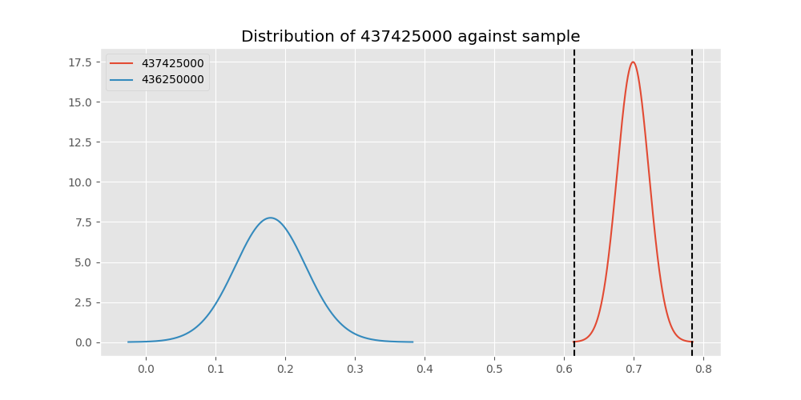

# Testing Results For 437425000 
$H_{0}$: There is not a difference in collection success against 437425000 
$H_{A}$: There is a difference in collection success against 437425000
An $\alpha$ of 0.00025 was used 
Out of 44 tests, there were 35 rejections from 44 independent-t test.
Out of 44 tests, there were 35 rejections from 44 Man Whitney u-tests.
## Testing Results for 437425000 against 436501000 
437425000 has a success rate of 0.6987654320987654
436501000 has a success rate of 0.9854014598540146
$H_{0}$: There is not a difference between 437425000 and 436501000
$H_{A}$: There is a difference between 437425000 and 436501000
An $/alpha$ of 0.00025 was used in this test.
__independent t-testing__: With a t-statistic of -11.449005545884692 and a p-value of 3.1609115120925122e-27, _we **reject** the null hypothssis_
__Man-Whitney testing__: With a u-statistic of 19790.5 and a p-value of 5.293035372768971e-12, _we **reject** the null hypothssis_
 
## Testing Results for 437425000 against 437375000 
437425000 has a success rate of 0.6987654320987654
437375000 has a success rate of 0.9982014388489209
$H_{0}$: There is not a difference between 437425000 and 437375000
$H_{A}$: There is a difference between 437425000 and 437375000
An $/alpha$ of 0.00025 was used in this test.
__independent t-testing__: With a t-statistic of -13.077736326225677 and a p-value of 6.768526361327744e-33, _we **reject** the null hypothssis_
__Man-Whitney testing__: With a u-statistic of 78876.5 and a p-value of 8.520536479308549e-43, _we **reject** the null hypothssis_
 
## Testing Results for 437425000 against 436500000 
437425000 has a success rate of 0.6987654320987654
436500000 has a success rate of 0.9056603773584906
$H_{0}$: There is not a difference between 437425000 and 436500000
$H_{A}$: There is a difference between 437425000 and 436500000
An $/alpha$ of 0.00025 was used in this test.
__independent t-testing__: With a t-statistic of -5.271700637183686 and a p-value of 1.9304609833740677e-07, _we **reject** the null hypothssis_
__Man-Whitney testing__: With a u-statistic of 25536.0 and a p-value of 2.602213818097293e-07, _we **reject** the null hypothssis_
 
## Testing Results for 437425000 against 436990000 
437425000 has a success rate of 0.6987654320987654
436990000 has a success rate of 0.9572649572649573
$H_{0}$: There is not a difference between 437425000 and 436990000
$H_{A}$: There is a difference between 437425000 and 436990000
An $/alpha$ of 0.00025 was used in this test.
__independent t-testing__: With a t-statistic of -9.794216286575242 and a p-value of 4.0472361750659255e-21, _we **reject** the null hypothssis_
__Man-Whitney testing__: With a u-statistic of 35136.0 and a p-value of 7.87544341758319e-15, _we **reject** the null hypothssis_
 
## Testing Results for 437425000 against 145875000 
437425000 has a success rate of 0.6987654320987654
145875000 has a success rate of 0.9722222222222222
$H_{0}$: There is not a difference between 437425000 and 145875000
$H_{A}$: There is a difference between 437425000 and 145875000
An $/alpha$ of 0.00025 was used in this test.
__independent t-testing__: With a t-statistic of -9.108199625180136 and a p-value of 1.2198770596568762e-17, _we **reject** the null hypothssis_
__Man-Whitney testing__: With a u-statistic of 10593.0 and a p-value of 1.1220570446363378e-06, _we **reject** the null hypothssis_
 
## Testing Results for 437425000 against 437800000 
437425000 has a success rate of 0.6987654320987654
437800000 has a success rate of 0.9533678756476683
$H_{0}$: There is not a difference between 437425000 and 437800000
$H_{A}$: There is a difference between 437425000 and 437800000
An $/alpha$ of 0.00025 was used in this test.
__independent t-testing__: With a t-statistic of -9.280876709046002 and a p-value of 3.088788985800181e-19, _we **reject** the null hypothssis_
__Man-Whitney testing__: With a u-statistic of 29132.0 and a p-value of 2.0451450769233763e-12, _we **reject** the null hypothssis_
 
## Testing Results for 437425000 against 145810000 
437425000 has a success rate of 0.6987654320987654
145810000 has a success rate of 0.12179487179487179
$H_{0}$: There is not a difference between 437425000 and 145810000
$H_{A}$: There is a difference between 437425000 and 145810000
An $/alpha$ of 0.00025 was used in this test.
__independent t-testing__: With a t-statistic of 14.338564612765714 and a p-value of 6.2196859383993286e-40, _we **reject** the null hypothssis_
__Man-Whitney testing__: With a u-statistic of 49816.5 and a p-value of 1.2999310864090854e-34, _we **reject** the null hypothssis_
 
## Testing Results for 437425000 against 437095000 
437425000 has a success rate of 0.6987654320987654
437095000 has a success rate of 0.9361702127659575
$H_{0}$: There is not a difference between 437425000 and 437095000
$H_{A}$: There is a difference between 437425000 and 437095000
An $/alpha$ of 0.00025 was used in this test.
__independent t-testing__: With a t-statistic of -3.482721881317058 and a p-value of 0.0005448626684982519, _we failed to reject the null hypothssis_
__Man-Whitney testing__: With a u-statistic of 7258.0 and a p-value of 0.0005822126565306054, _we failed to reject the null hypothssis_
 
## Testing Results for 437425000 against 437265000 
437425000 has a success rate of 0.6987654320987654
437265000 has a success rate of 0.9795454545454545
$H_{0}$: There is not a difference between 437425000 and 437265000
$H_{A}$: There is a difference between 437425000 and 437265000
An $/alpha$ of 0.00025 was used in this test.
__independent t-testing__: With a t-statistic of -11.795179170569899 and a p-value of 2.4514879847654015e-28, _we **reject** the null hypothssis_
__Man-Whitney testing__: With a u-statistic of 64082.5 and a p-value of 2.092396938908229e-29, _we **reject** the null hypothssis_
 
## Testing Results for 437425000 against 437350000 
437425000 has a success rate of 0.6987654320987654
437350000 has a success rate of 0.9488372093023256
$H_{0}$: There is not a difference between 437425000 and 437350000
$H_{A}$: There is a difference between 437425000 and 437350000
An $/alpha$ of 0.00025 was used in this test.
__independent t-testing__: With a t-statistic of -9.144342176549845 and a p-value of 8.748071647036264e-19, _we **reject** the null hypothssis_
__Man-Whitney testing__: With a u-statistic of 32650.0 and a p-value of 5.452863415565741e-13, _we **reject** the null hypothssis_
 
## Testing Results for 437425000 against 437200000 
437425000 has a success rate of 0.6987654320987654
437200000 has a success rate of 0.8620689655172413
$H_{0}$: There is not a difference between 437425000 and 437200000
$H_{A}$: There is a difference between 437425000 and 437200000
An $/alpha$ of 0.00025 was used in this test.
__independent t-testing__: With a t-statistic of -4.46963599701566 and a p-value of 9.352820627494394e-06, _we **reject** the null hypothssis_
__Man-Whitney testing__: With a u-statistic of 34394.5 and a p-value of 1.0773615339423384e-05, _we **reject** the null hypothssis_
 
## Testing Results for 437425000 against 435600000 
437425000 has a success rate of 0.6987654320987654
435600000 has a success rate of 0.9819341126461212
$H_{0}$: There is not a difference between 437425000 and 435600000
$H_{A}$: There is a difference between 437425000 and 435600000
An $/alpha$ of 0.00025 was used in this test.
__independent t-testing__: With a t-statistic of -12.18685436661325 and a p-value of 1.392022795093851e-29, _we **reject** the null hypothssis_
__Man-Whitney testing__: With a u-statistic of 136594.0 and a p-value of 3.230760820665773e-55, _we **reject** the null hypothssis_
 
## Testing Results for 437425000 against 450000000 
437425000 has a success rate of 0.6987654320987654
450000000 has a success rate of 0.8235294117647058
$H_{0}$: There is not a difference between 437425000 and 450000000
$H_{A}$: There is a difference between 437425000 and 450000000
An $/alpha$ of 0.00025 was used in this test.
__independent t-testing__: With a t-statistic of -2.3383417591888724 and a p-value of 0.0197724558115128, _we failed to reject the null hypothssis_
__Man-Whitney testing__: With a u-statistic of 15065.0 and a p-value of 0.01995515021966044, _we failed to reject the null hypothssis_
 
## Testing Results for 437425000 against 145978500 
437425000 has a success rate of 0.6987654320987654
145978500 has a success rate of 0.9963636363636363
$H_{0}$: There is not a difference between 437425000 and 145978500
$H_{A}$: There is a difference between 437425000 and 145978500
An $/alpha$ of 0.00025 was used in this test.
__independent t-testing__: With a t-statistic of -12.875396278276112 and a p-value of 2.9718373516528154e-32, _we **reject** the null hypothssis_
__Man-Whitney testing__: With a u-statistic of 39115.0 and a p-value of 4.7388437024409304e-23, _we **reject** the null hypothssis_
 
## Testing Results for 437425000 against 437050000 
437425000 has a success rate of 0.6987654320987654
437050000 has a success rate of 0.5346534653465347
$H_{0}$: There is not a difference between 437425000 and 437050000
$H_{A}$: There is a difference between 437425000 and 437050000
An $/alpha$ of 0.00025 was used in this test.
__independent t-testing__: With a t-statistic of 3.1530220662933823 and a p-value of 0.0017122015256960765, _we failed to reject the null hypothssis_
__Man-Whitney testing__: With a u-statistic of 23809.0 and a p-value of 0.0017780021484756472, _we failed to reject the null hypothssis_
 
## Testing Results for 437425000 against 435300000 
437425000 has a success rate of 0.6987654320987654
435300000 has a success rate of 0.1232876712328767
$H_{0}$: There is not a difference between 437425000 and 435300000
$H_{A}$: There is a difference between 437425000 and 435300000
An $/alpha$ of 0.00025 was used in this test.
__independent t-testing__: With a t-statistic of 13.896877879333308 and a p-value of 7.744727751260719e-38, _we **reject** the null hypothssis_
__Man-Whitney testing__: With a u-statistic of 46579.0 and a p-value of 5.537734711071198e-33, _we **reject** the null hypothssis_
 
## Testing Results for 437425000 against 437475000 
437425000 has a success rate of 0.6987654320987654
437475000 has a success rate of 0.5045045045045045
$H_{0}$: There is not a difference between 437425000 and 437475000
$H_{A}$: There is a difference between 437425000 and 437475000
An $/alpha$ of 0.00025 was used in this test.
__independent t-testing__: With a t-statistic of 6.147437267867412 and a p-value of 1.1541275010888622e-09, _we **reject** the null hypothssis_
__Man-Whitney testing__: With a u-statistic of 134220.0 and a p-value of 1.6127532918766243e-09, _we **reject** the null hypothssis_
 
## Testing Results for 437425000 against 435448000 
437425000 has a success rate of 0.6987654320987654
435448000 has a success rate of 0.975
$H_{0}$: There is not a difference between 437425000 and 435448000
$H_{A}$: There is a difference between 437425000 and 435448000
An $/alpha$ of 0.00025 was used in this test.
__independent t-testing__: With a t-statistic of -8.159843362978307 and a p-value of 3.3401812429185873e-13, _we **reject** the null hypothssis_
__Man-Whitney testing__: With a u-statistic of 5862.5 and a p-value of 0.00019783161584870592, _we **reject** the null hypothssis_
 
## Testing Results for 437425000 against 437644000 
437425000 has a success rate of 0.6987654320987654
437644000 has a success rate of 0.9743589743589743
$H_{0}$: There is not a difference between 437425000 and 437644000
$H_{A}$: There is a difference between 437425000 and 437644000
An $/alpha$ of 0.00025 was used in this test.
__independent t-testing__: With a t-statistic of -10.15578030300285 and a p-value of 3.532474297183741e-22, _we **reject** the null hypothssis_
__Man-Whitney testing__: With a u-statistic of 17163.0 and a p-value of 7.923295969359546e-10, _we **reject** the null hypothssis_
 
## Testing Results for 437425000 against 145825000 
437425000 has a success rate of 0.6987654320987654
145825000 has a success rate of 0.8687448728465955
$H_{0}$: There is not a difference between 437425000 and 145825000
$H_{A}$: There is a difference between 437425000 and 145825000
An $/alpha$ of 0.00025 was used in this test.
__independent t-testing__: With a t-statistic of -8.859036348750452 and a p-value of 1.3930077923537975e-18, _we **reject** the null hypothssis_
__Man-Whitney testing__: With a u-statistic of 409777.0 and a p-value of 2.3180347439571755e-18, _we **reject** the null hypothssis_
 
## Testing Results for 437425000 against 437345000 
437425000 has a success rate of 0.6987654320987654
437345000 has a success rate of 0.7603092783505154
$H_{0}$: There is not a difference between 437425000 and 437345000
$H_{A}$: There is a difference between 437425000 and 437345000
An $/alpha$ of 0.00025 was used in this test.
__independent t-testing__: With a t-statistic of -1.9510824643890938 and a p-value of 0.05139993879612831, _we failed to reject the null hypothssis_
__Man-Whitney testing__: With a u-statistic of 73734.5 and a p-value of 0.05148283622085857, _we failed to reject the null hypothssis_
 
## Testing Results for 437425000 against 435275000 
437425000 has a success rate of 0.6987654320987654
435275000 has a success rate of 0.9152542372881356
$H_{0}$: There is not a difference between 437425000 and 435275000
$H_{A}$: There is a difference between 437425000 and 435275000
An $/alpha$ of 0.00025 was used in this test.
__independent t-testing__: With a t-statistic of -4.8616260527288775 and a p-value of 1.5436097636228126e-06, _we **reject** the null hypothssis_
__Man-Whitney testing__: With a u-statistic of 18722.0 and a p-value of 1.9448915648158563e-06, _we **reject** the null hypothssis_
 
## Testing Results for 437425000 against 437322500 
437425000 has a success rate of 0.6987654320987654
437322500 has a success rate of 0.9961685823754789
$H_{0}$: There is not a difference between 437425000 and 437322500
$H_{A}$: There is a difference between 437425000 and 437322500
An $/alpha$ of 0.00025 was used in this test.
__independent t-testing__: With a t-statistic of -12.849452238921373 and a p-value of 3.5855250730146323e-32, _we **reject** the null hypothssis_
__Man-Whitney testing__: With a u-statistic of 37134.0 and a p-value of 5.01175143295221e-22, _we **reject** the null hypothssis_
 
## Testing Results for 437425000 against 437450000 
437425000 has a success rate of 0.6987654320987654
437450000 has a success rate of 0.6947791164658634
$H_{0}$: There is not a difference between 437425000 and 437450000
$H_{A}$: There is a difference between 437425000 and 437450000
An $/alpha$ of 0.00025 was used in this test.
__independent t-testing__: With a t-statistic of 0.10757503683390959 and a p-value of 0.9143658933699317, _we failed to reject the null hypothssis_
__Man-Whitney testing__: With a u-statistic of 50623.5 and a p-value of 0.9144805841157831, _we failed to reject the null hypothssis_
 
## Testing Results for 437425000 against 436703000 
437425000 has a success rate of 0.6987654320987654
436703000 has a success rate of 0.9859154929577465
$H_{0}$: There is not a difference between 437425000 and 436703000
$H_{A}$: There is a difference between 437425000 and 436703000
An $/alpha$ of 0.00025 was used in this test.
__independent t-testing__: With a t-statistic of -11.856788194584956 and a p-value of 9.907520547281642e-29, _we **reject** the null hypothssis_
__Man-Whitney testing__: With a u-statistic of 30747.0 and a p-value of 3.2103261858051236e-17, _we **reject** the null hypothssis_
 
## Testing Results for 437425000 against 400500000 
437425000 has a success rate of 0.6987654320987654
400500000 has a success rate of 0.3508771929824561
$H_{0}$: There is not a difference between 437425000 and 400500000
$H_{A}$: There is a difference between 437425000 and 400500000
An $/alpha$ of 0.00025 was used in this test.
__independent t-testing__: With a t-statistic of 5.321529543510512 and a p-value of 1.6108475490194164e-07, _we **reject** the null hypothssis_
__Man-Whitney testing__: With a u-statistic of 15558.0 and a p-value of 2.3423347624803103e-07, _we **reject** the null hypothssis_
 
## Testing Results for 437425000 against 437150000 
437425000 has a success rate of 0.6987654320987654
437150000 has a success rate of 0.9859550561797753
$H_{0}$: There is not a difference between 437425000 and 437150000
$H_{A}$: There is a difference between 437425000 and 437150000
An $/alpha$ of 0.00025 was used in this test.
__independent t-testing__: With a t-statistic of -12.135672046920023 and a p-value of 1.2632832467821993e-29, _we **reject** the null hypothssis_
__Man-Whitney testing__: With a u-statistic of 51386.5 and a p-value of 3.1679996697932134e-26, _we **reject** the null hypothssis_
 
## Testing Results for 437425000 against 435635000 
437425000 has a success rate of 0.6987654320987654
435635000 has a success rate of 0.9849624060150376
$H_{0}$: There is not a difference between 437425000 and 435635000
$H_{A}$: There is a difference between 437425000 and 435635000
An $/alpha$ of 0.00025 was used in this test.
__independent t-testing__: With a t-statistic of -11.37325483662285 and a p-value of 6.2237128273571516e-27, _we **reject** the null hypothssis_
__Man-Whitney testing__: With a u-statistic of 19224.5 and a p-value of 1.097692628270351e-11, _we **reject** the null hypothssis_
 
## Testing Results for 437425000 against 437384000 
437425000 has a success rate of 0.6987654320987654
437384000 has a success rate of 0.968421052631579
$H_{0}$: There is not a difference between 437425000 and 437384000
$H_{A}$: There is a difference between 437425000 and 437384000
An $/alpha$ of 0.00025 was used in this test.
__independent t-testing__: With a t-statistic of -10.319380624164284 and a p-value of 5.071157802117629e-23, _we **reject** the null hypothssis_
__Man-Whitney testing__: With a u-statistic of 28100.0 and a p-value of 8.89943182393596e-14, _we **reject** the null hypothssis_
 
## Testing Results for 437425000 against 437405000 
437425000 has a success rate of 0.6987654320987654
437405000 has a success rate of 0.9953917050691244
$H_{0}$: There is not a difference between 437425000 and 437405000
$H_{A}$: There is a difference between 437425000 and 437405000
An $/alpha$ of 0.00025 was used in this test.
__independent t-testing__: With a t-statistic of -12.738170507230139 and a p-value of 8.055117821501501e-32, _we **reject** the null hypothssis_
__Man-Whitney testing__: With a u-statistic of 30908.0 and a p-value of 9.160399506071397e-19, _we **reject** the null hypothssis_
 
## Testing Results for 437425000 against 435612500 
437425000 has a success rate of 0.6987654320987654
435612500 has a success rate of 0.9770114942528736
$H_{0}$: There is not a difference between 437425000 and 435612500
$H_{A}$: There is a difference between 437425000 and 435612500
An $/alpha$ of 0.00025 was used in this test.
__independent t-testing__: With a t-statistic of -9.948890120083092 and a p-value of 4.543348313294989e-21, _we **reject** the null hypothssis_
__Man-Whitney testing__: With a u-statistic of 12715.5 and a p-value of 6.052699073535433e-08, _we **reject** the null hypothssis_
 
## Testing Results for 437425000 against 435975000 
437425000 has a success rate of 0.6987654320987654
435975000 has a success rate of 0.92
$H_{0}$: There is not a difference between 437425000 and 435975000
$H_{A}$: There is a difference between 437425000 and 435975000
An $/alpha$ of 0.00025 was used in this test.
__independent t-testing__: With a t-statistic of -3.331089212434767 and a p-value of 0.000935850944064212, _we failed to reject the null hypothssis_
__Man-Whitney testing__: With a u-statistic of 7885.0 and a p-value of 0.0009880006371658613, _we failed to reject the null hypothssis_
 
## Testing Results for 437425000 against 437275000 
437425000 has a success rate of 0.6987654320987654
437275000 has a success rate of 0.3643724696356275
$H_{0}$: There is not a difference between 437425000 and 437275000
$H_{A}$: There is a difference between 437425000 and 437275000
An $/alpha$ of 0.00025 was used in this test.
__independent t-testing__: With a t-statistic of 8.847607281964239 and a p-value of 8.396735961648609e-18, _we **reject** the null hypothssis_
__Man-Whitney testing__: With a u-statistic of 66743.0 and a p-value of 6.023125657572566e-17, _we **reject** the null hypothssis_
 
## Testing Results for 437425000 against 145840000 
437425000 has a success rate of 0.6987654320987654
145840000 has a success rate of 0.9649122807017544
$H_{0}$: There is not a difference between 437425000 and 145840000
$H_{A}$: There is a difference between 437425000 and 145840000
An $/alpha$ of 0.00025 was used in this test.
__independent t-testing__: With a t-statistic of -7.932843107526542 and a p-value of 2.3936605305944075e-13, _we **reject** the null hypothssis_
__Man-Whitney testing__: With a u-statistic of 8470.5 and a p-value of 2.2321870553893637e-05, _we **reject** the null hypothssis_
 
## Testing Results for 437425000 against 435525000 
437425000 has a success rate of 0.6987654320987654
435525000 has a success rate of 0.6923076923076923
$H_{0}$: There is not a difference between 437425000 and 435525000
$H_{A}$: There is a difference between 437425000 and 435525000
An $/alpha$ of 0.00025 was used in this test.
__independent t-testing__: With a t-statistic of 0.14420985442948378 and a p-value of 0.8853879709575785, _we failed to reject the null hypothssis_
__Man-Whitney testing__: With a u-statistic of 29144.5 and a p-value of 0.8855374476688884, _we failed to reject the null hypothssis_
 
## Testing Results for 437425000 against 436250000 
437425000 has a success rate of 0.6987654320987654
436250000 has a success rate of 0.17857142857142858
$H_{0}$: There is not a difference between 437425000 and 436250000
$H_{A}$: There is a difference between 437425000 and 436250000
An $/alpha$ of 0.00025 was used in this test.
__independent t-testing__: With a t-statistic of 8.085769099756007 and a p-value of 5.5438283311822874e-15, _we **reject** the null hypothssis_
__Man-Whitney testing__: With a u-statistic of 17239.0 and a p-value of 3.6604841095436054e-14, _we **reject** the null hypothssis_
 
## Testing Results for 437425000 against 435950000 
437425000 has a success rate of 0.6987654320987654
435950000 has a success rate of 0.9850187265917603
$H_{0}$: There is not a difference between 437425000 and 435950000
$H_{A}$: There is a difference between 437425000 and 435950000
An $/alpha$ of 0.00025 was used in this test.
__independent t-testing__: With a t-statistic of -12.220255170858321 and a p-value of 7.853603507451391e-30, _we **reject** the null hypothssis_
__Man-Whitney testing__: With a u-statistic of 77181.0 and a p-value of 3.018140516582175e-36, _we **reject** the null hypothssis_
 
## Testing Results for 437425000 against 435800000 
437425000 has a success rate of 0.6987654320987654
435800000 has a success rate of 0.5390070921985816
$H_{0}$: There is not a difference between 437425000 and 435800000
$H_{A}$: There is a difference between 437425000 and 435800000
An $/alpha$ of 0.00025 was used in this test.
__independent t-testing__: With a t-statistic of 3.474547724645566 and a p-value of 0.0005525125894281338, _we failed to reject the null hypothssis_
__Man-Whitney testing__: With a u-statistic of 33114.0 and a p-value of 0.0005829959732076736, _we failed to reject the null hypothssis_
 
## Testing Results for 437425000 against 437485000 
437425000 has a success rate of 0.6987654320987654
437485000 has a success rate of 0.9375
$H_{0}$: There is not a difference between 437425000 and 437485000
$H_{A}$: There is a difference between 437425000 and 437485000
An $/alpha$ of 0.00025 was used in this test.
__independent t-testing__: With a t-statistic of -2.905038293566851 and a p-value of 0.0038593331729423236, _we failed to reject the null hypothssis_
__Man-Whitney testing__: With a u-statistic of 4933.0 and a p-value of 0.0039813405393705125, _we failed to reject the null hypothssis_
 
## Testing Results for 437425000 against 136770000 
437425000 has a success rate of 0.6987654320987654
136770000 has a success rate of 0.9945945945945946
$H_{0}$: There is not a difference between 437425000 and 136770000
$H_{A}$: There is a difference between 437425000 and 136770000
An $/alpha$ of 0.00025 was used in this test.
__independent t-testing__: With a t-statistic of -12.611458507500254 and a p-value of 2.0562583085237806e-31, _we **reject** the null hypothssis_
__Man-Whitney testing__: With a u-statistic of 26380.0 and a p-value of 2.416147015020128e-16, _we **reject** the null hypothssis_
 
## Testing Results for 437425000 against 437250000 
437425000 has a success rate of 0.6987654320987654
437250000 has a success rate of 0.9937106918238994
$H_{0}$: There is not a difference between 437425000 and 437250000
$H_{A}$: There is a difference between 437425000 and 437250000
An $/alpha$ of 0.00025 was used in this test.
__independent t-testing__: With a t-statistic of -12.68378391690532 and a p-value of 1.3965658037383872e-31, _we **reject** the null hypothssis_
__Man-Whitney testing__: With a u-statistic of 45402.0 and a p-value of 1.7062015341795412e-25, _we **reject** the null hypothssis_
 
## Testing Results for 437425000 against 437356000 
437425000 has a success rate of 0.6987654320987654
437356000 has a success rate of 0.9328358208955224
$H_{0}$: There is not a difference between 437425000 and 437356000
$H_{A}$: There is a difference between 437425000 and 437356000
An $/alpha$ of 0.00025 was used in this test.
__independent t-testing__: With a t-statistic of -5.624411280580131 and a p-value of 2.9979901524660585e-08, _we **reject** the null hypothssis_
__Man-Whitney testing__: With a u-statistic of 20783.5 and a p-value of 4.4906815568530364e-08, _we **reject** the null hypothssis_
 
## Testing Results for 437425000 against 437676000 
437425000 has a success rate of 0.6987654320987654
437676000 has a success rate of 0.9813432835820896
$H_{0}$: There is not a difference between 437425000 and 437676000
$H_{A}$: There is a difference between 437425000 and 437676000
An $/alpha$ of 0.00025 was used in this test.
__independent t-testing__: With a t-statistic of -11.637568107606716 and a p-value of 6.8520746780864525e-28, _we **reject** the null hypothssis_
__Man-Whitney testing__: With a u-statistic of 38934.5 and a p-value of 4.9810834837111866e-20, _we **reject** the null hypothssis_
 
## Testing Results for 437425000 against 145826800 
437425000 has a success rate of 0.6987654320987654
145826800 has a success rate of 0.966183574879227
$H_{0}$: There is not a difference between 437425000 and 145826800
$H_{A}$: There is a difference between 437425000 and 145826800
An $/alpha$ of 0.00025 was used in this test.
__independent t-testing__: With a t-statistic of -10.257833361895107 and a p-value of 8.332943601388986e-23, _we **reject** the null hypothssis_
__Man-Whitney testing__: With a u-statistic of 30708.0 and a p-value of 1.7580188840003588e-14, _we **reject** the null hypothssis_
 
