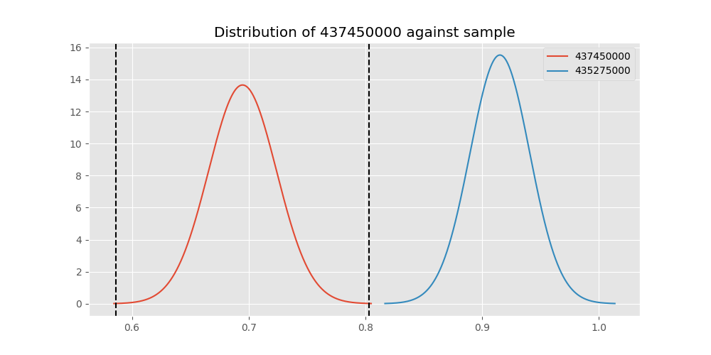
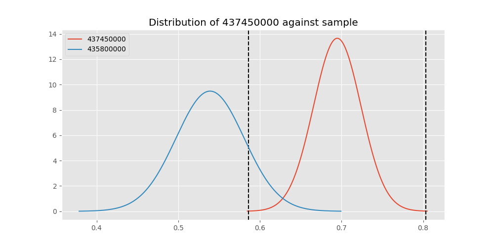

# Testing Results For 437450000 
$H_{0}$: There is not a difference in collection success against 437450000 
$H_{A}$: There is a difference in collection success against 437450000
An $\alpha$ of 0.00025 was used 
Out of 44 tests, there were 35 rejections from 44 independent-t test.
Out of 44 tests, there were 35 rejections from 44 Man Whitney u-tests.
## Testing Results for 437450000 against 436501000 
437450000 has a success rate of 0.6947791164658634
436501000 has a success rate of 0.9854014598540146
$H_{0}$: There is not a difference between 437450000 and 436501000
$H_{A}$: There is a difference between 437450000 and 436501000
An $/alpha$ of 0.00025 was used in this test.
__independent t-testing__: With a t-statistic of -9.375596126144114 and a p-value of 1.6199948787302093e-18, _we **reject** the null hypothssis_
__Man-Whitney testing__: With a u-statistic of 12099.5 and a p-value of 1.0874365736796291e-11, _we **reject** the null hypothssis_
 
## Testing Results for 437450000 against 437375000 
437450000 has a success rate of 0.6947791164658634
437375000 has a success rate of 0.9982014388489209
$H_{0}$: There is not a difference between 437450000 and 437375000
$H_{A}$: There is a difference between 437450000 and 437375000
An $/alpha$ of 0.00025 was used in this test.
__independent t-testing__: With a t-statistic of -10.356736832182879 and a p-value of 3.806780767845569e-21, _we **reject** the null hypothssis_
__Man-Whitney testing__: With a u-statistic of 48218.5 and a p-value of 1.1844479194951486e-41, _we **reject** the null hypothssis_
 
## Testing Results for 437450000 against 436500000 
437450000 has a success rate of 0.6947791164658634
436500000 has a success rate of 0.9056603773584906
$H_{0}$: There is not a difference between 437450000 and 436500000
$H_{A}$: There is a difference between 437450000 and 436500000
An $/alpha$ of 0.00025 was used in this test.
__independent t-testing__: With a t-statistic of -5.13717050380187 and a p-value of 4.339905352123121e-07, _we **reject** the null hypothssis_
__Man-Whitney testing__: With a u-statistic of 15621.0 and a p-value of 6.245683968293149e-07, _we **reject** the null hypothssis_
 
## Testing Results for 437450000 against 436990000 
437450000 has a success rate of 0.6947791164658634
436990000 has a success rate of 0.9572649572649573
$H_{0}$: There is not a difference between 437450000 and 436990000
$H_{A}$: There is a difference between 437450000 and 436990000
An $/alpha$ of 0.00025 was used in this test.
__independent t-testing__: With a t-statistic of -8.17614062913123 and a p-value of 5.666510633408016e-15, _we **reject** the null hypothssis_
__Man-Whitney testing__: With a u-statistic of 21486.0 and a p-value of 5.1629377391395094e-14, _we **reject** the null hypothssis_
 
## Testing Results for 437450000 against 145875000 
437450000 has a success rate of 0.6947791164658634
145875000 has a success rate of 0.9722222222222222
$H_{0}$: There is not a difference between 437450000 and 145875000
$H_{A}$: There is a difference between 437450000 and 145875000
An $/alpha$ of 0.00025 was used in this test.
__independent t-testing__: With a t-statistic of -7.893338017609392 and a p-value of 5.2856094718118754e-14, _we **reject** the null hypothssis_
__Man-Whitney testing__: With a u-statistic of 6477.0 and a p-value of 1.393819908254478e-06, _we **reject** the null hypothssis_
 
## Testing Results for 437450000 against 437800000 
437450000 has a success rate of 0.6947791164658634
437800000 has a success rate of 0.9533678756476683
$H_{0}$: There is not a difference between 437450000 and 437800000
$H_{A}$: There is a difference between 437450000 and 437800000
An $/alpha$ of 0.00025 was used in this test.
__independent t-testing__: With a t-statistic of -7.844546049324782 and a p-value of 4.8231226050050694e-14, _we **reject** the null hypothssis_
__Man-Whitney testing__: With a u-statistic of 17815.0 and a p-value of 8.299903236846223e-12, _we **reject** the null hypothssis_
 
## Testing Results for 437450000 against 145810000 
437450000 has a success rate of 0.6947791164658634
145810000 has a success rate of 0.12179487179487179
$H_{0}$: There is not a difference between 437450000 and 145810000
$H_{A}$: There is a difference between 437450000 and 145810000
An $/alpha$ of 0.00025 was used in this test.
__independent t-testing__: With a t-statistic of 13.51360713211299 and a p-value of 1.3945803940869063e-34, _we **reject** the null hypothssis_
__Man-Whitney testing__: With a u-statistic of 30550.5 and a p-value of 3.1199886783360546e-29, _we **reject** the null hypothssis_
 
## Testing Results for 437450000 against 437095000 
437450000 has a success rate of 0.6947791164658634
437095000 has a success rate of 0.9361702127659575
$H_{0}$: There is not a difference between 437450000 and 437095000
$H_{A}$: There is a difference between 437450000 and 437095000
An $/alpha$ of 0.00025 was used in this test.
__independent t-testing__: With a t-statistic of -3.489912046845453 and a p-value of 0.0005572095618233982, _we failed to reject the null hypothssis_
__Man-Whitney testing__: With a u-statistic of 4439.0 and a p-value of 0.0006161729215611689, _we failed to reject the null hypothssis_
 
## Testing Results for 437450000 against 437265000 
437450000 has a success rate of 0.6947791164658634
437265000 has a success rate of 0.9795454545454545
$H_{0}$: There is not a difference between 437450000 and 437265000
$H_{A}$: There is a difference between 437450000 and 437265000
An $/alpha$ of 0.00025 was used in this test.
__independent t-testing__: With a t-statistic of -9.488387626678527 and a p-value of 1.178867178636325e-18, _we **reject** the null hypothssis_
__Man-Whitney testing__: With a u-statistic of 39180.5 and a p-value of 1.0205689978759377e-27, _we **reject** the null hypothssis_
 
## Testing Results for 437450000 against 437350000 
437450000 has a success rate of 0.6947791164658634
437350000 has a success rate of 0.9488372093023256
$H_{0}$: There is not a difference between 437450000 and 437350000
$H_{A}$: There is a difference between 437450000 and 437350000
An $/alpha$ of 0.00025 was used in this test.
__independent t-testing__: With a t-statistic of -7.723837535267652 and a p-value of 1.0862841106916824e-13, _we **reject** the null hypothssis_
__Man-Whitney testing__: With a u-statistic of 19967.0 and a p-value of 2.8768272216331895e-12, _we **reject** the null hypothssis_
 
## Testing Results for 437450000 against 437200000 
437450000 has a success rate of 0.6947791164658634
437200000 has a success rate of 0.8620689655172413
$H_{0}$: There is not a difference between 437450000 and 437200000
$H_{A}$: There is a difference between 437450000 and 437200000
An $/alpha$ of 0.00025 was used in this test.
__independent t-testing__: With a t-statistic of -4.278337112721424 and a p-value of 2.3016495330479325e-05, _we **reject** the null hypothssis_
__Man-Whitney testing__: With a u-statistic of 21045.5 and a p-value of 2.6921984419367734e-05, _we **reject** the null hypothssis_
 
## Testing Results for 437450000 against 435600000 
437450000 has a success rate of 0.6947791164658634
435600000 has a success rate of 0.9819341126461212
$H_{0}$: There is not a difference between 437450000 and 435600000
$H_{A}$: There is a difference between 437450000 and 435600000
An $/alpha$ of 0.00025 was used in this test.
__independent t-testing__: With a t-statistic of -9.713402229992047 and a p-value of 3.210303093223551e-19, _we **reject** the null hypothssis_
__Man-Whitney testing__: With a u-statistic of 83513.0 and a p-value of 6.757711130906588e-51, _we **reject** the null hypothssis_
 
## Testing Results for 437450000 against 450000000 
437450000 has a success rate of 0.6947791164658634
450000000 has a success rate of 0.8235294117647058
$H_{0}$: There is not a difference between 437450000 and 450000000
$H_{A}$: There is a difference between 437450000 and 450000000
An $/alpha$ of 0.00025 was used in this test.
__independent t-testing__: With a t-statistic of -2.313531718268866 and a p-value of 0.02130386379655415, _we failed to reject the null hypothssis_
__Man-Whitney testing__: With a u-statistic of 9220.0 and a p-value of 0.021577987782217995, _we failed to reject the null hypothssis_
 
## Testing Results for 437450000 against 145978500 
437450000 has a success rate of 0.6947791164658634
145978500 has a success rate of 0.9963636363636363
$H_{0}$: There is not a difference between 437450000 and 145978500
$H_{A}$: There is a difference between 437450000 and 145978500
An $/alpha$ of 0.00025 was used in this test.
__independent t-testing__: With a t-statistic of -10.234628745694767 and a p-value of 7.913742737366685e-21, _we **reject** the null hypothssis_
__Man-Whitney testing__: With a u-statistic of 23912.0 and a p-value of 2.2995166904369195e-22, _we **reject** the null hypothssis_
 
## Testing Results for 437450000 against 437050000 
437450000 has a success rate of 0.6947791164658634
437050000 has a success rate of 0.5346534653465347
$H_{0}$: There is not a difference between 437450000 and 437050000
$H_{A}$: There is a difference between 437450000 and 437050000
An $/alpha$ of 0.00025 was used in this test.
__independent t-testing__: With a t-statistic of 2.8682642836547068 and a p-value of 0.00437904437764052, _we failed to reject the null hypothssis_
__Man-Whitney testing__: With a u-statistic of 14588.0 and a p-value of 0.004535235748123809, _we failed to reject the null hypothssis_
 
## Testing Results for 437450000 against 435300000 
437450000 has a success rate of 0.6947791164658634
435300000 has a success rate of 0.1232876712328767
$H_{0}$: There is not a difference between 437450000 and 435300000
$H_{A}$: There is a difference between 437450000 and 435300000
An $/alpha$ of 0.00025 was used in this test.
__independent t-testing__: With a t-statistic of 13.124176039614305 and a p-value of 6.979272481018097e-33, _we **reject** the null hypothssis_
__Man-Whitney testing__: With a u-statistic of 28565.0 and a p-value of 6.168281915586986e-28, _we **reject** the null hypothssis_
 
## Testing Results for 437450000 against 437475000 
437450000 has a success rate of 0.6947791164658634
437475000 has a success rate of 0.5045045045045045
$H_{0}$: There is not a difference between 437450000 and 437475000
$H_{A}$: There is a difference between 437450000 and 437475000
An $/alpha$ of 0.00025 was used in this test.
__independent t-testing__: With a t-statistic of 5.104511843180752 and a p-value of 4.1446341425113147e-07, _we **reject** the null hypothssis_
__Man-Whitney testing__: With a u-statistic of 82245.0 and a p-value of 4.995148945817374e-07, _we **reject** the null hypothssis_
 
## Testing Results for 437450000 against 435448000 
437450000 has a success rate of 0.6947791164658634
435448000 has a success rate of 0.975
$H_{0}$: There is not a difference between 437450000 and 435448000
$H_{A}$: There is a difference between 437450000 and 435448000
An $/alpha$ of 0.00025 was used in this test.
__independent t-testing__: With a t-statistic of -7.283785706391681 and a p-value of 1.1787346030091133e-11, _we **reject** the null hypothssis_
__Man-Whitney testing__: With a u-statistic of 3584.5 and a p-value of 0.0002045917949434687, _we **reject** the null hypothssis_
 
## Testing Results for 437450000 against 437644000 
437450000 has a success rate of 0.6947791164658634
437644000 has a success rate of 0.9743589743589743
$H_{0}$: There is not a difference between 437450000 and 437644000
$H_{A}$: There is a difference between 437450000 and 437644000
An $/alpha$ of 0.00025 was used in this test.
__independent t-testing__: With a t-statistic of -8.545166596432567 and a p-value of 4.3045061686665574e-16, _we **reject** the null hypothssis_
__Man-Whitney testing__: With a u-statistic of 10494.0 and a p-value of 1.413576798260587e-09, _we **reject** the null hypothssis_
 
## Testing Results for 437450000 against 145825000 
437450000 has a success rate of 0.6947791164658634
145825000 has a success rate of 0.8687448728465955
$H_{0}$: There is not a difference between 437450000 and 145825000
$H_{A}$: There is a difference between 437450000 and 145825000
An $/alpha$ of 0.00025 was used in this test.
__independent t-testing__: With a t-statistic of -7.449632058111423 and a p-value of 1.254701104140648e-13, _we **reject** the null hypothssis_
__Man-Whitney testing__: With a u-statistic of 250727.0 and a p-value of 1.6419798757566175e-13, _we **reject** the null hypothssis_
 
## Testing Results for 437450000 against 437345000 
437450000 has a success rate of 0.6947791164658634
437345000 has a success rate of 0.7603092783505154
$H_{0}$: There is not a difference between 437450000 and 437345000
$H_{A}$: There is a difference between 437450000 and 437345000
An $/alpha$ of 0.00025 was used in this test.
__independent t-testing__: With a t-statistic of -1.8298664274186078 and a p-value of 0.06773856777065418, _we failed to reject the null hypothssis_
__Man-Whitney testing__: With a u-statistic of 45140.5 and a p-value of 0.0678188027258189, _we failed to reject the null hypothssis_
 
## Testing Results for 437450000 against 435275000 
437450000 has a success rate of 0.6947791164658634
435275000 has a success rate of 0.9152542372881356
$H_{0}$: There is not a difference between 437450000 and 435275000
$H_{A}$: There is a difference between 437450000 and 435275000
An $/alpha$ of 0.00025 was used in this test.
__independent t-testing__: With a t-statistic of -4.788206136910763 and a p-value of 2.449870767190124e-06, _we **reject** the null hypothssis_
__Man-Whitney testing__: With a u-statistic of 11452.0 and a p-value of 3.3161767889959093e-06, _we **reject** the null hypothssis_
 
## Testing Results for 437450000 against 437322500 
437450000 has a success rate of 0.6947791164658634
437322500 has a success rate of 0.9961685823754789
$H_{0}$: There is not a difference between 437450000 and 437322500
$H_{A}$: There is a difference between 437450000 and 437322500
An $/alpha$ of 0.00025 was used in this test.
__independent t-testing__: With a t-statistic of -10.219441195404258 and a p-value of 8.648136406581764e-21, _we **reject** the null hypothssis_
__Man-Whitney testing__: With a u-statistic of 22701.0 and a p-value of 2.24859644297428e-21, _we **reject** the null hypothssis_
 
## Testing Results for 437450000 against 436703000 
437450000 has a success rate of 0.6947791164658634
436703000 has a success rate of 0.9859154929577465
$H_{0}$: There is not a difference between 437450000 and 436703000
$H_{A}$: There is a difference between 437450000 and 436703000
An $/alpha$ of 0.00025 was used in this test.
__independent t-testing__: With a t-statistic of -9.595428232342467 and a p-value of 4.43325134458726e-19, _we **reject** the null hypothssis_
__Man-Whitney testing__: With a u-statistic of 18798.0 and a p-value of 1.278950370128905e-16, _we **reject** the null hypothssis_
 
## Testing Results for 437450000 against 400500000 
437450000 has a success rate of 0.6947791164658634
400500000 has a success rate of 0.3508771929824561
$H_{0}$: There is not a difference between 437450000 and 400500000
$H_{A}$: There is a difference between 437450000 and 400500000
An $/alpha$ of 0.00025 was used in this test.
__independent t-testing__: With a t-statistic of 5.034798997888973 and a p-value of 8.210230434874575e-07, _we **reject** the null hypothssis_
__Man-Whitney testing__: With a u-statistic of 9537.0 and a p-value of 1.2717497948115838e-06, _we **reject** the null hypothssis_
 
## Testing Results for 437450000 against 437150000 
437450000 has a success rate of 0.6947791164658634
437150000 has a success rate of 0.9859550561797753
$H_{0}$: There is not a difference between 437450000 and 437150000
$H_{A}$: There is a difference between 437450000 and 437150000
An $/alpha$ of 0.00025 was used in this test.
__independent t-testing__: With a t-statistic of -9.737875776671462 and a p-value of 2.0877089164256928e-19, _we **reject** the null hypothssis_
__Man-Whitney testing__: With a u-statistic of 31416.5 and a p-value of 4.584476011237949e-25, _we **reject** the null hypothssis_
 
## Testing Results for 437450000 against 435635000 
437450000 has a success rate of 0.6947791164658634
435635000 has a success rate of 0.9849624060150376
$H_{0}$: There is not a difference between 437450000 and 435635000
$H_{A}$: There is a difference between 437450000 and 435635000
An $/alpha$ of 0.00025 was used in this test.
__independent t-testing__: With a t-statistic of -9.33025144648897 and a p-value of 2.1699472576131332e-18, _we **reject** the null hypothssis_
__Man-Whitney testing__: With a u-statistic of 11753.5 and a p-value of 2.1840471124813844e-11, _we **reject** the null hypothssis_
 
## Testing Results for 437450000 against 437384000 
437450000 has a success rate of 0.6947791164658634
437384000 has a success rate of 0.968421052631579
$H_{0}$: There is not a difference between 437450000 and 437384000
$H_{A}$: There is a difference between 437450000 and 437384000
An $/alpha$ of 0.00025 was used in this test.
__independent t-testing__: With a t-statistic of -8.58114036569559 and a p-value of 3.561816208669178e-16, _we **reject** the null hypothssis_
__Man-Whitney testing__: With a u-statistic of 17182.0 and a p-value of 3.3422597969632674e-13, _we **reject** the null hypothssis_
 
## Testing Results for 437450000 against 437405000 
437450000 has a success rate of 0.6947791164658634
437405000 has a success rate of 0.9953917050691244
$H_{0}$: There is not a difference between 437450000 and 437405000
$H_{A}$: There is a difference between 437450000 and 437405000
An $/alpha$ of 0.00025 was used in this test.
__independent t-testing__: With a t-statistic of -10.154895142046648 and a p-value of 1.2584495450976924e-20, _we **reject** the null hypothssis_
__Man-Whitney testing__: With a u-statistic of 18895.0 and a p-value of 3.1491952447112494e-18, _we **reject** the null hypothssis_
 
## Testing Results for 437450000 against 435612500 
437450000 has a success rate of 0.6947791164658634
435612500 has a success rate of 0.9770114942528736
$H_{0}$: There is not a difference between 437450000 and 435612500
$H_{A}$: There is a difference between 437450000 and 435612500
An $/alpha$ of 0.00025 was used in this test.
__independent t-testing__: With a t-statistic of -8.447465726790865 and a p-value of 9.357749135527368e-16, _we **reject** the null hypothssis_
__Man-Whitney testing__: With a u-statistic of 7774.5 and a p-value of 8.381775353857493e-08, _we **reject** the null hypothssis_
 
## Testing Results for 437450000 against 435975000 
437450000 has a success rate of 0.6947791164658634
435975000 has a success rate of 0.92
$H_{0}$: There is not a difference between 437450000 and 435975000
$H_{A}$: There is a difference between 437450000 and 435975000
An $/alpha$ of 0.00025 was used in this test.
__independent t-testing__: With a t-statistic of -3.332546884200418 and a p-value of 0.0009694741244539209, _we failed to reject the null hypothssis_
__Man-Whitney testing__: With a u-statistic of 4823.0 and a p-value of 0.0010518846022213191, _we failed to reject the null hypothssis_
 
## Testing Results for 437450000 against 437425000 
437450000 has a success rate of 0.6947791164658634
437425000 has a success rate of 0.6987654320987654
$H_{0}$: There is not a difference between 437450000 and 437425000
$H_{A}$: There is a difference between 437450000 and 437425000
An $/alpha$ of 0.00025 was used in this test.
__independent t-testing__: With a t-statistic of -0.10757503683390959 and a p-value of 0.9143658933699317, _we failed to reject the null hypothssis_
__Man-Whitney testing__: With a u-statistic of 50221.5 and a p-value of 0.9144805841157831, _we failed to reject the null hypothssis_
 
## Testing Results for 437450000 against 437275000 
437450000 has a success rate of 0.6947791164658634
437275000 has a success rate of 0.3643724696356275
$H_{0}$: There is not a difference between 437450000 and 437275000
$H_{A}$: There is a difference between 437450000 and 437275000
An $/alpha$ of 0.00025 was used in this test.
__independent t-testing__: With a t-statistic of 7.796579116603088 and a p-value of 3.7984272676514396e-14, _we **reject** the null hypothssis_
__Man-Whitney testing__: With a u-statistic of 40912.0 and a p-value of 1.7828612061485158e-13, _we **reject** the null hypothssis_
 
## Testing Results for 437450000 against 145840000 
437450000 has a success rate of 0.6947791164658634
145840000 has a success rate of 0.9649122807017544
$H_{0}$: There is not a difference between 437450000 and 145840000
$H_{A}$: There is a difference between 437450000 and 145840000
An $/alpha$ of 0.00025 was used in this test.
__independent t-testing__: With a t-statistic of -7.070515140609871 and a p-value of 1.9272901365268838e-11, _we **reject** the null hypothssis_
__Man-Whitney testing__: With a u-statistic of 5179.5 and a p-value of 2.5150935436987427e-05, _we **reject** the null hypothssis_
 
## Testing Results for 437450000 against 435525000 
437450000 has a success rate of 0.6947791164658634
435525000 has a success rate of 0.6923076923076923
$H_{0}$: There is not a difference between 437450000 and 435525000
$H_{A}$: There is a difference between 437450000 and 435525000
An $/alpha$ of 0.00025 was used in this test.
__independent t-testing__: With a t-statistic of 0.05097692741383586 and a p-value of 0.9593700041841787, _we failed to reject the null hypothssis_
__Man-Whitney testing__: With a u-statistic of 17847.5 and a p-value of 0.959754192936897, _we failed to reject the null hypothssis_
 
## Testing Results for 437450000 against 436250000 
437450000 has a success rate of 0.6947791164658634
436250000 has a success rate of 0.17857142857142858
$H_{0}$: There is not a difference between 437450000 and 436250000
$H_{A}$: There is a difference between 437450000 and 436250000
An $/alpha$ of 0.00025 was used in this test.
__independent t-testing__: With a t-statistic of 7.777899908455224 and a p-value of 1.164925819778564e-13, _we **reject** the null hypothssis_
__Man-Whitney testing__: With a u-statistic of 10571.0 and a p-value of 1.144085705349143e-12, _we **reject** the null hypothssis_
 
## Testing Results for 437450000 against 435950000 
437450000 has a success rate of 0.6947791164658634
435950000 has a success rate of 0.9850187265917603
$H_{0}$: There is not a difference between 437450000 and 435950000
$H_{A}$: There is a difference between 437450000 and 435950000
An $/alpha$ of 0.00025 was used in this test.
__independent t-testing__: With a t-statistic of -9.768604947804093 and a p-value of 1.9221641007734806e-19, _we **reject** the null hypothssis_
__Man-Whitney testing__: With a u-statistic of 47187.0 and a p-value of 2.6324584832791578e-34, _we **reject** the null hypothssis_
 
## Testing Results for 437450000 against 435800000 
437450000 has a success rate of 0.6947791164658634
435800000 has a success rate of 0.5390070921985816
$H_{0}$: There is not a difference between 437450000 and 435800000
$H_{A}$: There is a difference between 437450000 and 435800000
An $/alpha$ of 0.00025 was used in this test.
__independent t-testing__: With a t-statistic of 3.1062711821783595 and a p-value of 0.0020339437823236506, _we failed to reject the null hypothssis_
__Man-Whitney testing__: With a u-statistic of 20289.0 and a p-value of 0.0021281301997696732, _we failed to reject the null hypothssis_
 
## Testing Results for 437450000 against 437485000 
437450000 has a success rate of 0.6947791164658634
437485000 has a success rate of 0.9375
$H_{0}$: There is not a difference between 437450000 and 437485000
$H_{A}$: There is a difference between 437450000 and 437485000
An $/alpha$ of 0.00025 was used in this test.
__independent t-testing__: With a t-statistic of -2.9196016006832415 and a p-value of 0.0037906873312560426, _we failed to reject the null hypothssis_
__Man-Whitney testing__: With a u-statistic of 3017.0 and a p-value of 0.003981069773635072, _we failed to reject the null hypothssis_
 
## Testing Results for 437450000 against 136770000 
437450000 has a success rate of 0.6947791164658634
136770000 has a success rate of 0.9945945945945946
$H_{0}$: There is not a difference between 437450000 and 136770000
$H_{A}$: There is a difference between 437450000 and 136770000
An $/alpha$ of 0.00025 was used in this test.
__independent t-testing__: With a t-statistic of -10.082155348208182 and a p-value of 1.9185467453012064e-20, _we **reject** the null hypothssis_
__Man-Whitney testing__: With a u-statistic of 16127.0 and a p-value of 6.7167975359052e-16, _we **reject** the null hypothssis_
 
## Testing Results for 437450000 against 437250000 
437450000 has a success rate of 0.6947791164658634
437250000 has a success rate of 0.9937106918238994
$H_{0}$: There is not a difference between 437450000 and 437250000
$H_{A}$: There is a difference between 437450000 and 437250000
An $/alpha$ of 0.00025 was used in this test.
__independent t-testing__: With a t-statistic of -10.106884700667278 and a p-value of 1.827375988560674e-20, _we **reject** the null hypothssis_
__Man-Whitney testing__: With a u-statistic of 27756.0 and a p-value of 1.2277796188056957e-24, _we **reject** the null hypothssis_
 
## Testing Results for 437450000 against 437356000 
437450000 has a success rate of 0.6947791164658634
437356000 has a success rate of 0.9328358208955224
$H_{0}$: There is not a difference between 437450000 and 437356000
$H_{A}$: There is a difference between 437450000 and 437356000
An $/alpha$ of 0.00025 was used in this test.
__independent t-testing__: With a t-statistic of -5.5440146243666035 and a p-value of 5.5322807051303005e-08, _we **reject** the null hypothssis_
__Man-Whitney testing__: With a u-statistic of 12711.5 and a p-value of 9.325823474807248e-08, _we **reject** the null hypothssis_
 
## Testing Results for 437450000 against 437676000 
437450000 has a success rate of 0.6947791164658634
437676000 has a success rate of 0.9813432835820896
$H_{0}$: There is not a difference between 437450000 and 437676000
$H_{A}$: There is a difference between 437450000 and 437676000
An $/alpha$ of 0.00025 was used in this test.
__independent t-testing__: With a t-statistic of -9.429020435803945 and a p-value of 1.4396228871545824e-18, _we **reject** the null hypothssis_
__Man-Whitney testing__: With a u-statistic of 23804.5 and a p-value of 3.6337756202407825e-19, _we **reject** the null hypothssis_
 
## Testing Results for 437450000 against 145826800 
437450000 has a success rate of 0.6947791164658634
145826800 has a success rate of 0.966183574879227
$H_{0}$: There is not a difference between 437450000 and 145826800
$H_{A}$: There is a difference between 437450000 and 145826800
An $/alpha$ of 0.00025 was used in this test.
__independent t-testing__: With a t-statistic of -8.52440604941675 and a p-value of 5.348719254519203e-16, _we **reject** the null hypothssis_
__Man-Whitney testing__: With a u-statistic of 18777.0 and a p-value of 8.058977527372711e-14, _we **reject** the null hypothssis_
 
