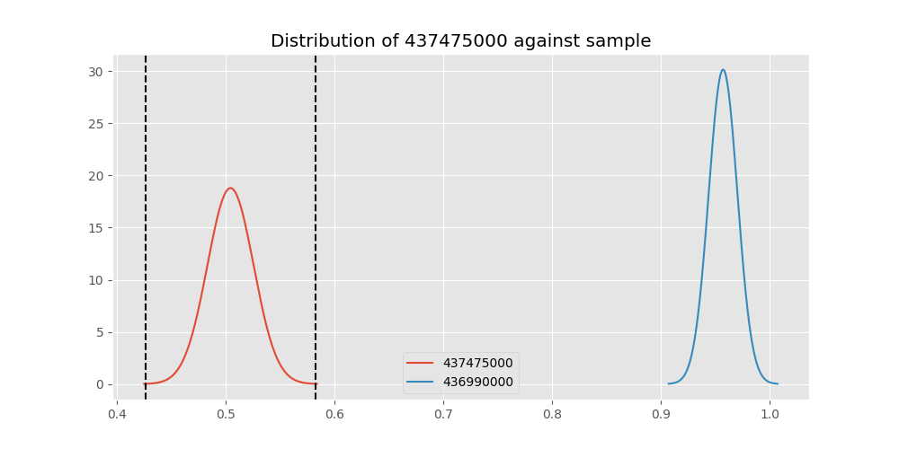
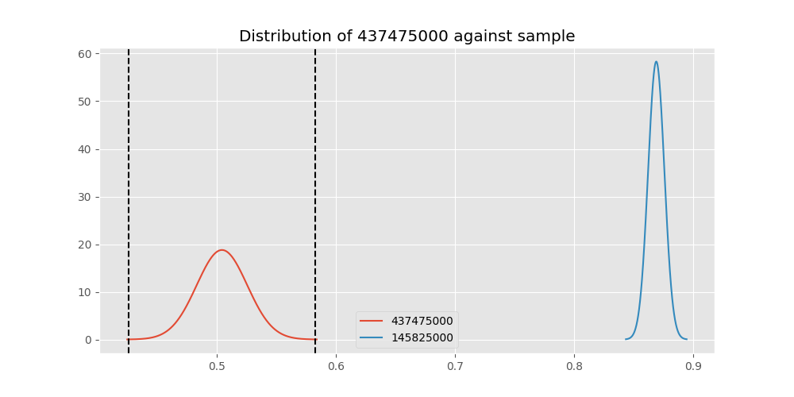
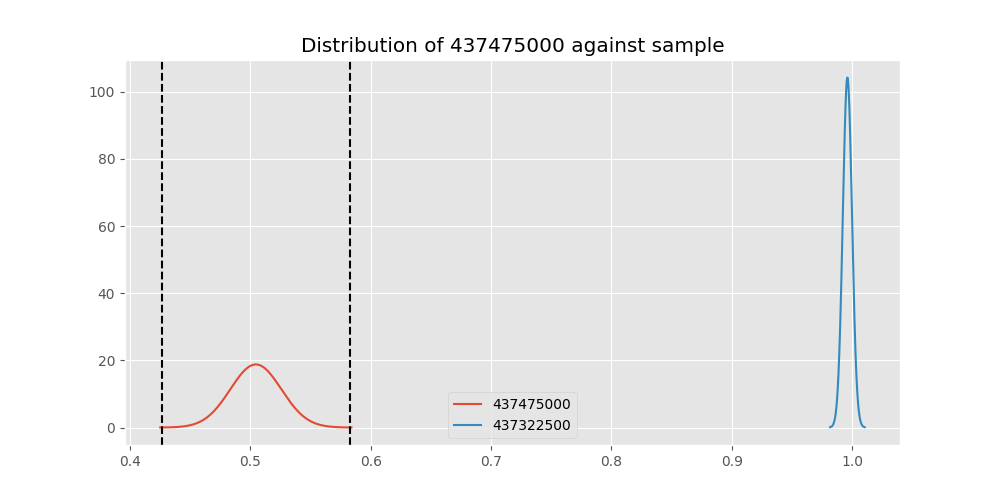
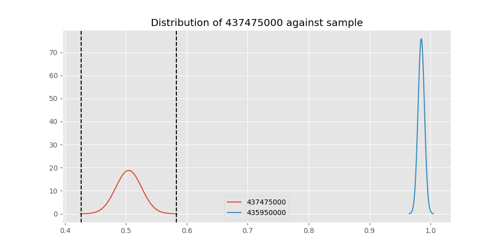

# Testing Results For 437475000 
$H_{0}$: There is not a difference in collection success against 437475000 
$H_{A}$: There is a difference in collection success against 437475000
An $\alpha$ of 0.00025 was used 
Out of 44 tests, there were 41 rejections from 44 independent-t test.
Out of 44 tests, there were 41 rejections from 44 Man Whitney u-tests.
## Testing Results for 437475000 against 436501000 
437475000 has a success rate of 0.5045045045045045
436501000 has a success rate of 0.9854014598540146
$H_{0}$: There is not a difference between 437475000 and 436501000
$H_{A}$: There is a difference between 437475000 and 436501000
An $/alpha$ of 0.00025 was used in this test.
__independent t-testing__: With a t-statistic of -20.376219909665302 and a p-value of 1.3054793265502057e-72, _we **reject** the null hypothssis_
__Man-Whitney testing__: With a u-statistic of 19735.0 and a p-value of 8.611414905432004e-25, _we **reject** the null hypothssis_
 
## Testing Results for 437475000 against 437375000 
437475000 has a success rate of 0.5045045045045045
437375000 has a success rate of 0.9982014388489209
$H_{0}$: There is not a difference between 437475000 and 437375000
$H_{A}$: There is a difference between 437475000 and 437375000
An $/alpha$ of 0.00025 was used in this test.
__independent t-testing__: With a t-statistic of -23.158571631295292 and a p-value of 8.225132751501036e-84, _we **reject** the null hypothssis_
__Man-Whitney testing__: With a u-statistic of 78117.5 and a p-value of 9.105439539996319e-81, _we **reject** the null hypothssis_
 
## Testing Results for 437475000 against 436500000 
437475000 has a success rate of 0.5045045045045045
436500000 has a success rate of 0.9056603773584906
$H_{0}$: There is not a difference between 437475000 and 436500000
$H_{A}$: There is a difference between 437475000 and 436500000
An $/alpha$ of 0.00025 was used in this test.
__independent t-testing__: With a t-statistic of -9.641962505643008 and a p-value of 9.236960294700132e-21, _we **reject** the null hypothssis_
__Man-Whitney testing__: With a u-statistic of 26422.5 and a p-value of 1.145061727624848e-19, _we **reject** the null hypothssis_
 
## Testing Results for 437475000 against 436990000 
437475000 has a success rate of 0.5045045045045045
436990000 has a success rate of 0.9572649572649573
$H_{0}$: There is not a difference between 437475000 and 436990000
$H_{A}$: There is a difference between 437475000 and 436990000
An $/alpha$ of 0.00025 was used in this test.
__independent t-testing__: With a t-statistic of -18.084381098970127 and a p-value of 2.1869283210956504e-61, _we **reject** the null hypothssis_
__Man-Whitney testing__: With a u-statistic of 35535.0 and a p-value of 1.2701608714755905e-33, _we **reject** the null hypothssis_
 
## Testing Results for 437475000 against 145875000 
437475000 has a success rate of 0.5045045045045045
145875000 has a success rate of 0.9722222222222222
$H_{0}$: There is not a difference between 437475000 and 145875000
$H_{A}$: There is a difference between 437475000 and 145875000
An $/alpha$ of 0.00025 was used in this test.
__independent t-testing__: With a t-statistic of -16.219137106587564 and a p-value of 1.85739660862688e-42, _we **reject** the null hypothssis_
__Man-Whitney testing__: With a u-statistic of 10635.0 and a p-value of 5.799264897318107e-14, _we **reject** the null hypothssis_
 
## Testing Results for 437475000 against 437800000 
437475000 has a success rate of 0.5045045045045045
437800000 has a success rate of 0.9533678756476683
$H_{0}$: There is not a difference between 437475000 and 437800000
$H_{A}$: There is a difference between 437475000 and 437800000
An $/alpha$ of 0.00025 was used in this test.
__independent t-testing__: With a t-statistic of -17.1780872403806 and a p-value of 1.0699679544250665e-55, _we **reject** the null hypothssis_
__Man-Whitney testing__: With a u-statistic of 29517.5 and a p-value of 1.9513697784284398e-28, _we **reject** the null hypothssis_
 
## Testing Results for 437475000 against 145810000 
437475000 has a success rate of 0.5045045045045045
145810000 has a success rate of 0.12179487179487179
$H_{0}$: There is not a difference between 437475000 and 145810000
$H_{A}$: There is a difference between 437475000 and 145810000
An $/alpha$ of 0.00025 was used in this test.
__independent t-testing__: With a t-statistic of 9.020000709503384 and a p-value of 1.7380599765297594e-18, _we **reject** the null hypothssis_
__Man-Whitney testing__: With a u-statistic of 59857.5 and a p-value of 1.2427109866741356e-17, _we **reject** the null hypothssis_
 
## Testing Results for 437475000 against 437095000 
437475000 has a success rate of 0.5045045045045045
437095000 has a success rate of 0.9361702127659575
$H_{0}$: There is not a difference between 437475000 and 437095000
$H_{A}$: There is a difference between 437475000 and 437095000
An $/alpha$ of 0.00025 was used in this test.
__independent t-testing__: With a t-statistic of -10.318016127323299 and a p-value of 1.6064963846946748e-16, _we **reject** the null hypothssis_
__Man-Whitney testing__: With a u-statistic of 7412.5 and a p-value of 1.2381831201955345e-08, _we **reject** the null hypothssis_
 
## Testing Results for 437475000 against 437265000 
437475000 has a success rate of 0.5045045045045045
437265000 has a success rate of 0.9795454545454545
$H_{0}$: There is not a difference between 437475000 and 437265000
$H_{A}$: There is a difference between 437475000 and 437265000
An $/alpha$ of 0.00025 was used in this test.
__independent t-testing__: With a t-statistic of -21.311342765582364 and a p-value of 3.6377817869240984e-77, _we **reject** the null hypothssis_
__Man-Whitney testing__: With a u-statistic of 64097.5 and a p-value of 6.005323496024258e-61, _we **reject** the null hypothssis_
 
## Testing Results for 437475000 against 437350000 
437475000 has a success rate of 0.5045045045045045
437350000 has a success rate of 0.9488372093023256
$H_{0}$: There is not a difference between 437475000 and 437350000
$H_{A}$: There is a difference between 437475000 and 437350000
An $/alpha$ of 0.00025 was used in this test.
__independent t-testing__: With a t-statistic of -17.06357044307957 and a p-value of 1.786122702522268e-55, _we **reject** the null hypothssis_
__Man-Whitney testing__: With a u-statistic of 33152.5 and a p-value of 2.6410525337490347e-30, _we **reject** the null hypothssis_
 
## Testing Results for 437475000 against 437200000 
437475000 has a success rate of 0.5045045045045045
437200000 has a success rate of 0.8620689655172413
$H_{0}$: There is not a difference between 437475000 and 437200000
$H_{A}$: There is a difference between 437475000 and 437200000
An $/alpha$ of 0.00025 was used in this test.
__independent t-testing__: With a t-statistic of -9.391732447981731 and a p-value of 6.795626343972729e-20, _we **reject** the null hypothssis_
__Man-Whitney testing__: With a u-statistic of 36190.0 and a p-value of 5.936347179356929e-19, _we **reject** the null hypothssis_
 
## Testing Results for 437475000 against 435600000 
437475000 has a success rate of 0.5045045045045045
435600000 has a success rate of 0.9819341126461212
$H_{0}$: There is not a difference between 437475000 and 435600000
$H_{A}$: There is a difference between 437475000 and 435600000
An $/alpha$ of 0.00025 was used in this test.
__independent t-testing__: With a t-statistic of -22.019872927802062 and a p-value of 3.135338290569143e-79, _we **reject** the null hypothssis_
__Man-Whitney testing__: With a u-statistic of 136457.5 and a p-value of 4.237223128360202e-112, _we **reject** the null hypothssis_
 
## Testing Results for 437475000 against 450000000 
437475000 has a success rate of 0.5045045045045045
450000000 has a success rate of 0.8235294117647058
$H_{0}$: There is not a difference between 437475000 and 450000000
$H_{A}$: There is a difference between 437475000 and 450000000
An $/alpha$ of 0.00025 was used in this test.
__independent t-testing__: With a t-statistic of -5.628343865193934 and a p-value of 2.7268413740503283e-08, _we **reject** the null hypothssis_
__Man-Whitney testing__: With a u-statistic of 16062.5 and a p-value of 3.8510668999152124e-08, _we **reject** the null hypothssis_
 
## Testing Results for 437475000 against 145978500 
437475000 has a success rate of 0.5045045045045045
145978500 has a success rate of 0.9963636363636363
$H_{0}$: There is not a difference between 437475000 and 145978500
$H_{A}$: There is a difference between 437475000 and 145978500
An $/alpha$ of 0.00025 was used in this test.
__independent t-testing__: With a t-statistic of -22.822921190312766 and a p-value of 5.6903129537712515e-83, _we **reject** the null hypothssis_
__Man-Whitney testing__: With a u-statistic of 38777.5 and a p-value of 1.9032131685921105e-45, _we **reject** the null hypothssis_
 
## Testing Results for 437475000 against 437050000 
437475000 has a success rate of 0.5045045045045045
437050000 has a success rate of 0.5346534653465347
$H_{0}$: There is not a difference between 437475000 and 437050000
$H_{A}$: There is a difference between 437475000 and 437050000
An $/alpha$ of 0.00025 was used in this test.
__independent t-testing__: With a t-statistic of -0.5567626980261964 and a p-value of 0.5778800391558115, _we failed to reject the null hypothssis_
__Man-Whitney testing__: With a u-statistic of 27182.5 and a p-value of 0.5777142576793235, _we failed to reject the null hypothssis_
 
## Testing Results for 437475000 against 435300000 
437475000 has a success rate of 0.5045045045045045
435300000 has a success rate of 0.1232876712328767
$H_{0}$: There is not a difference between 437475000 and 435300000
$H_{A}$: There is a difference between 437475000 and 435300000
An $/alpha$ of 0.00025 was used in this test.
__independent t-testing__: With a t-statistic of 8.717316925352742 and a p-value of 2.0594851239582214e-17, _we **reject** the null hypothssis_
__Man-Whitney testing__: With a u-statistic of 55960.0 and a p-value of 1.1854945499915493e-16, _we **reject** the null hypothssis_
 
## Testing Results for 437475000 against 435448000 
437475000 has a success rate of 0.5045045045045045
435448000 has a success rate of 0.975
$H_{0}$: There is not a difference between 437475000 and 435448000
$H_{A}$: There is a difference between 437475000 and 435448000
An $/alpha$ of 0.00025 was used in this test.
__independent t-testing__: With a t-statistic of -14.341796171054437 and a p-value of 4.491197375230837e-27, _we **reject** the null hypothssis_
__Man-Whitney testing__: With a u-statistic of 5877.5 and a p-value of 8.53703160093022e-09, _we **reject** the null hypothssis_
 
## Testing Results for 437475000 against 437644000 
437475000 has a success rate of 0.5045045045045045
437644000 has a success rate of 0.9743589743589743
$H_{0}$: There is not a difference between 437475000 and 437644000
$H_{A}$: There is a difference between 437475000 and 437644000
An $/alpha$ of 0.00025 was used in this test.
__independent t-testing__: With a t-statistic of -18.198261737020786 and a p-value of 7.351757023177282e-59, _we **reject** the null hypothssis_
__Man-Whitney testing__: With a u-statistic of 17212.5 and a p-value of 7.194608316851256e-21, _we **reject** the null hypothssis_
 
## Testing Results for 437475000 against 145825000 
437475000 has a success rate of 0.5045045045045045
145825000 has a success rate of 0.8687448728465955
$H_{0}$: There is not a difference between 437475000 and 145825000
$H_{A}$: There is a difference between 437475000 and 145825000
An $/alpha$ of 0.00025 was used in this test.
__independent t-testing__: With a t-statistic of -20.7479496398508 and a p-value of 1.905530023455512e-89, _we **reject** the null hypothssis_
__Man-Whitney testing__: With a u-statistic of 430120.0 and a p-value of 7.411330794548732e-84, _we **reject** the null hypothssis_
 
## Testing Results for 437475000 against 437345000 
437475000 has a success rate of 0.5045045045045045
437345000 has a success rate of 0.7603092783505154
$H_{0}$: There is not a difference between 437475000 and 437345000
$H_{A}$: There is a difference between 437475000 and 437345000
An $/alpha$ of 0.00025 was used in this test.
__independent t-testing__: With a t-statistic of -8.193554987022148 and a p-value of 8.233620521196554e-16, _we **reject** the null hypothssis_
__Man-Whitney testing__: With a u-statistic of 80127.5 and a p-value of 2.3731720471987667e-15, _we **reject** the null hypothssis_
 
## Testing Results for 437475000 against 435275000 
437475000 has a success rate of 0.5045045045045045
435275000 has a success rate of 0.9152542372881356
$H_{0}$: There is not a difference between 437475000 and 435275000
$H_{A}$: There is a difference between 437475000 and 435275000
An $/alpha$ of 0.00025 was used in this test.
__independent t-testing__: With a t-statistic of -8.630723972434822 and a p-value of 4.40810457141373e-17, _we **reject** the null hypothssis_
__Man-Whitney testing__: With a u-statistic of 19295.0 and a p-value of 2.5272375289730906e-16, _we **reject** the null hypothssis_
 
## Testing Results for 437475000 against 437322500 
437475000 has a success rate of 0.5045045045045045
437322500 has a success rate of 0.9961685823754789
$H_{0}$: There is not a difference between 437475000 and 437322500
$H_{A}$: There is a difference between 437475000 and 437322500
An $/alpha$ of 0.00025 was used in this test.
__independent t-testing__: With a t-statistic of -22.77817962208715 and a p-value of 7.40611213200273e-83, _we **reject** the null hypothssis_
__Man-Whitney testing__: With a u-statistic of 36817.5 and a p-value of 1.514559150813788e-43, _we **reject** the null hypothssis_
 
## Testing Results for 437475000 against 437450000 
437475000 has a success rate of 0.5045045045045045
437450000 has a success rate of 0.6947791164658634
$H_{0}$: There is not a difference between 437475000 and 437450000
$H_{A}$: There is a difference between 437475000 and 437450000
An $/alpha$ of 0.00025 was used in this test.
__independent t-testing__: With a t-statistic of -5.104511843180752 and a p-value of 4.1446341425113147e-07, _we **reject** the null hypothssis_
__Man-Whitney testing__: With a u-statistic of 55950.0 and a p-value of 4.995148945817374e-07, _we **reject** the null hypothssis_
 
## Testing Results for 437475000 against 436703000 
437475000 has a success rate of 0.5045045045045045
436703000 has a success rate of 0.9859154929577465
$H_{0}$: There is not a difference between 437475000 and 436703000
$H_{A}$: There is a difference between 437475000 and 436703000
An $/alpha$ of 0.00025 was used in this test.
__independent t-testing__: With a t-statistic of -21.178012163810727 and a p-value of 4.824592803730897e-77, _we **reject** the null hypothssis_
__Man-Whitney testing__: With a u-statistic of 30652.5 and a p-value of 2.0353899998021983e-35, _we **reject** the null hypothssis_
 
## Testing Results for 437475000 against 400500000 
437475000 has a success rate of 0.5045045045045045
400500000 has a success rate of 0.3508771929824561
$H_{0}$: There is not a difference between 437475000 and 400500000
$H_{A}$: There is a difference between 437475000 and 400500000
An $/alpha$ of 0.00025 was used in this test.
__independent t-testing__: With a t-statistic of 2.214717968190752 and a p-value of 0.02714821499328681, _we failed to reject the null hypothssis_
__Man-Whitney testing__: With a u-statistic of 18247.5 and a p-value of 0.027298679779584258, _we failed to reject the null hypothssis_
 
## Testing Results for 437475000 against 437150000 
437475000 has a success rate of 0.5045045045045045
437150000 has a success rate of 0.9859550561797753
$H_{0}$: There is not a difference between 437475000 and 437150000
$H_{A}$: There is a difference between 437475000 and 437150000
An $/alpha$ of 0.00025 was used in this test.
__independent t-testing__: With a t-statistic of -21.744517025049195 and a p-value of 4.238027010643318e-79, _we **reject** the null hypothssis_
__Man-Whitney testing__: With a u-statistic of 51227.5 and a p-value of 3.112205221732449e-53, _we **reject** the null hypothssis_
 
## Testing Results for 437475000 against 435635000 
437475000 has a success rate of 0.5045045045045045
435635000 has a success rate of 0.9849624060150376
$H_{0}$: There is not a difference between 437475000 and 435635000
$H_{A}$: There is a difference between 437475000 and 435635000
An $/alpha$ of 0.00025 was used in this test.
__independent t-testing__: With a t-statistic of -20.24106863967069 and a p-value of 8.812858482143238e-72, _we **reject** the null hypothssis_
__Man-Whitney testing__: With a u-statistic of 19175.0 and a p-value of 3.675364071347768e-24, _we **reject** the null hypothssis_
 
## Testing Results for 437475000 against 437384000 
437475000 has a success rate of 0.5045045045045045
437384000 has a success rate of 0.968421052631579
$H_{0}$: There is not a difference between 437475000 and 437384000
$H_{A}$: There is a difference between 437475000 and 437384000
An $/alpha$ of 0.00025 was used in this test.
__independent t-testing__: With a t-statistic of -18.736878902220152 and a p-value of 1.923427249639304e-64, _we **reject** the null hypothssis_
__Man-Whitney testing__: With a u-statistic of 28265.0 and a p-value of 5.281614996531742e-30, _we **reject** the null hypothssis_
 
## Testing Results for 437475000 against 437405000 
437475000 has a success rate of 0.5045045045045045
437405000 has a success rate of 0.9953917050691244
$H_{0}$: There is not a difference between 437475000 and 437405000
$H_{A}$: There is a difference between 437475000 and 437405000
An $/alpha$ of 0.00025 was used in this test.
__independent t-testing__: With a t-statistic of -22.583833922189704 and a p-value of 2.4679103780973656e-82, _we **reject** the null hypothssis_
__Man-Whitney testing__: With a u-statistic of 30657.5 and a p-value of 2.002380559271878e-37, _we **reject** the null hypothssis_
 
## Testing Results for 437475000 against 435612500 
437475000 has a success rate of 0.5045045045045045
435612500 has a success rate of 0.9770114942528736
$H_{0}$: There is not a difference between 437475000 and 435612500
$H_{A}$: There is a difference between 437475000 and 435612500
An $/alpha$ of 0.00025 was used in this test.
__independent t-testing__: With a t-statistic of -17.703099033529956 and a p-value of 2.859015573685471e-53, _we **reject** the null hypothssis_
__Man-Whitney testing__: With a u-statistic of 12735.0 and a p-value of 1.3758963538830093e-16, _we **reject** the null hypothssis_
 
## Testing Results for 437475000 against 435975000 
437475000 has a success rate of 0.5045045045045045
435975000 has a success rate of 0.92
$H_{0}$: There is not a difference between 437475000 and 435975000
$H_{A}$: There is a difference between 437475000 and 435975000
An $/alpha$ of 0.00025 was used in this test.
__independent t-testing__: With a t-statistic of -5.790221993699122 and a p-value of 1.1316352576202131e-08, _we **reject** the null hypothssis_
__Man-Whitney testing__: With a u-statistic of 8110.0 and a p-value of 1.7019631506904016e-08, _we **reject** the null hypothssis_
 
## Testing Results for 437475000 against 437425000 
437475000 has a success rate of 0.5045045045045045
437425000 has a success rate of 0.6987654320987654
$H_{0}$: There is not a difference between 437475000 and 437425000
$H_{A}$: There is a difference between 437475000 and 437425000
An $/alpha$ of 0.00025 was used in this test.
__independent t-testing__: With a t-statistic of -6.147437267867412 and a p-value of 1.1541275010888622e-09, _we **reject** the null hypothssis_
__Man-Whitney testing__: With a u-statistic of 90555.0 and a p-value of 1.6127532918766243e-09, _we **reject** the null hypothssis_
 
## Testing Results for 437475000 against 437275000 
437475000 has a success rate of 0.5045045045045045
437275000 has a success rate of 0.3643724696356275
$H_{0}$: There is not a difference between 437475000 and 437275000
$H_{A}$: There is a difference between 437475000 and 437275000
An $/alpha$ of 0.00025 was used in this test.
__independent t-testing__: With a t-statistic of 3.7018845739706676 and a p-value of 0.00022867874179369942, _we **reject** the null hypothssis_
__Man-Whitney testing__: With a u-statistic of 78147.5 and a p-value of 0.00024001821576782984, _we **reject** the null hypothssis_
 
## Testing Results for 437475000 against 145840000 
437475000 has a success rate of 0.5045045045045045
145840000 has a success rate of 0.9649122807017544
$H_{0}$: There is not a difference between 437475000 and 145840000
$H_{A}$: There is a difference between 437475000 and 145840000
An $/alpha$ of 0.00025 was used in this test.
__independent t-testing__: With a t-statistic of -14.1693544537002 and a p-value of 3.81203544211608e-30, _we **reject** the null hypothssis_
__Man-Whitney testing__: With a u-statistic of 8535.0 and a p-value of 3.0447691401159495e-11, _we **reject** the null hypothssis_
 
## Testing Results for 437475000 against 435525000 
437475000 has a success rate of 0.5045045045045045
435525000 has a success rate of 0.6923076923076923
$H_{0}$: There is not a difference between 437475000 and 435525000
$H_{A}$: There is a difference between 437475000 and 435525000
An $/alpha$ of 0.00025 was used in this test.
__independent t-testing__: With a t-statistic of -4.061569073100417 and a p-value of 5.428701773475658e-05, _we **reject** the null hypothssis_
__Man-Whitney testing__: With a u-statistic of 32230.0 and a p-value of 5.897161479627467e-05, _we **reject** the null hypothssis_
 
## Testing Results for 437475000 against 436250000 
437475000 has a success rate of 0.5045045045045045
436250000 has a success rate of 0.17857142857142858
$H_{0}$: There is not a difference between 437475000 and 436250000
$H_{A}$: There is a difference between 437475000 and 436250000
An $/alpha$ of 0.00025 was used in this test.
__independent t-testing__: With a t-statistic of 4.732250405482333 and a p-value of 2.763284741471277e-06, _we **reject** the null hypothssis_
__Man-Whitney testing__: With a u-statistic of 20605.0 and a p-value of 3.304472284844704e-06, _we **reject** the null hypothssis_
 
## Testing Results for 437475000 against 435950000 
437475000 has a success rate of 0.5045045045045045
435950000 has a success rate of 0.9850187265917603
$H_{0}$: There is not a difference between 437475000 and 435950000
$H_{A}$: There is a difference between 437475000 and 435950000
An $/alpha$ of 0.00025 was used in this test.
__independent t-testing__: With a t-statistic of -21.9572428646163 and a p-value of 1.5326522040657102e-79, _we **reject** the null hypothssis_
__Man-Whitney testing__: With a u-statistic of 76980.0 and a p-value of 5.850979117842329e-73, _we **reject** the null hypothssis_
 
## Testing Results for 437475000 against 435800000 
437475000 has a success rate of 0.5045045045045045
435800000 has a success rate of 0.5390070921985816
$H_{0}$: There is not a difference between 437475000 and 435800000
$H_{A}$: There is a difference between 437475000 and 435800000
An $/alpha$ of 0.00025 was used in this test.
__independent t-testing__: With a t-statistic of -0.7311225568376606 and a p-value of 0.4649510675785429, _we failed to reject the null hypothssis_
__Man-Whitney testing__: With a u-statistic of 37777.5 and a p-value of 0.46472013318387007, _we failed to reject the null hypothssis_
 
## Testing Results for 437475000 against 437485000 
437475000 has a success rate of 0.5045045045045045
437485000 has a success rate of 0.9375
$H_{0}$: There is not a difference between 437475000 and 437485000
$H_{A}$: There is a difference between 437475000 and 437485000
An $/alpha$ of 0.00025 was used in this test.
__independent t-testing__: With a t-statistic of -8.948503352430526 and a p-value of 9.410615603821296e-12, _we **reject** the null hypothssis_
__Man-Whitney testing__: With a u-statistic of 5035.0 and a p-value of 1.8769004980029067e-06, _we **reject** the null hypothssis_
 
## Testing Results for 437475000 against 136770000 
437475000 has a success rate of 0.5045045045045045
136770000 has a success rate of 0.9945945945945946
$H_{0}$: There is not a difference between 437475000 and 136770000
$H_{A}$: There is a difference between 437475000 and 136770000
An $/alpha$ of 0.00025 was used in this test.
__independent t-testing__: With a t-statistic of -22.359080383445875 and a p-value of 1.16069639944088e-81, _we **reject** the null hypothssis_
__Man-Whitney testing__: With a u-statistic of 26177.5 and a p-value of 8.345301476155568e-33, _we **reject** the null hypothssis_
 
## Testing Results for 437475000 against 437250000 
437475000 has a success rate of 0.5045045045045045
437250000 has a success rate of 0.9937106918238994
$H_{0}$: There is not a difference between 437475000 and 437250000
$H_{A}$: There is a difference between 437475000 and 437250000
An $/alpha$ of 0.00025 was used in this test.
__independent t-testing__: With a t-statistic of -22.542813989062637 and a p-value of 4.945638700495547e-82, _we **reject** the null hypothssis_
__Man-Whitney testing__: With a u-statistic of 45075.0 and a p-value of 1.91389160134782e-50, _we **reject** the null hypothssis_
 
## Testing Results for 437475000 against 437356000 
437475000 has a success rate of 0.5045045045045045
437356000 has a success rate of 0.9328358208955224
$H_{0}$: There is not a difference between 437475000 and 437356000
$H_{A}$: There is a difference between 437475000 and 437356000
An $/alpha$ of 0.00025 was used in this test.
__independent t-testing__: With a t-statistic of -9.615913985704871 and a p-value of 1.2705599497881885e-20, _we **reject** the null hypothssis_
__Man-Whitney testing__: With a u-statistic of 21257.5 and a p-value of 1.6574380243971143e-19, _we **reject** the null hypothssis_
 
## Testing Results for 437475000 against 437676000 
437475000 has a success rate of 0.5045045045045045
437676000 has a success rate of 0.9813432835820896
$H_{0}$: There is not a difference between 437475000 and 437676000
$H_{A}$: There is a difference between 437475000 and 437676000
An $/alpha$ of 0.00025 was used in this test.
__independent t-testing__: With a t-statistic of -20.9148141748732 and a p-value of 7.282574486445578e-76, _we **reject** the null hypothssis_
__Man-Whitney testing__: With a u-statistic of 38907.5 and a p-value of 1.1620632449721487e-41, _we **reject** the null hypothssis_
 
## Testing Results for 437475000 against 145826800 
437475000 has a success rate of 0.5045045045045045
145826800 has a success rate of 0.966183574879227
$H_{0}$: There is not a difference between 437475000 and 145826800
$H_{A}$: There is a difference between 437475000 and 145826800
An $/alpha$ of 0.00025 was used in this test.
__independent t-testing__: With a t-statistic of -18.69539694370875 and a p-value of 1.885960693350932e-64, _we **reject** the null hypothssis_
__Man-Whitney testing__: With a u-statistic of 30922.5 and a p-value of 8.629504226409816e-32, _we **reject** the null hypothssis_
 
