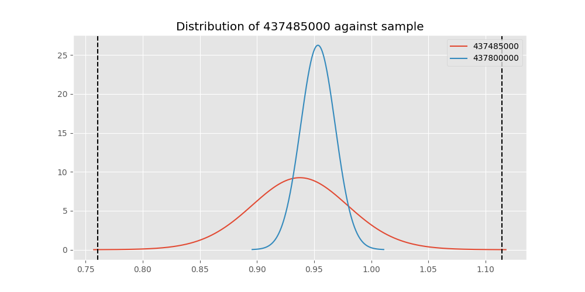

# Testing Results For 437485000 
$H_{0}$: There is not a difference in collection success against 437485000 
$H_{A}$: There is a difference in collection success against 437485000
An $\alpha$ of 0.00025 was used 
Out of 44 tests, there were 8 rejections from 44 independent-t test.
Out of 44 tests, there were 9 rejections from 44 Man Whitney u-tests.
## Testing Results for 437485000 against 436501000 
437485000 has a success rate of 0.9375
436501000 has a success rate of 0.9854014598540146
$H_{0}$: There is not a difference between 437485000 and 436501000
$H_{A}$: There is a difference between 437485000 and 436501000
An $/alpha$ of 0.00025 was used in this test.
__independent t-testing__: With a t-statistic of -1.072209820478289 and a p-value of 0.2910600397999697, _we failed to reject the null hypothssis_
__Man-Whitney testing__: With a u-statistic of 2087.0 and a p-value of 0.11126067567185811, _we failed to reject the null hypothssis_
 
## Testing Results for 437485000 against 437375000 
437485000 has a success rate of 0.9375
437375000 has a success rate of 0.9982014388489209
$H_{0}$: There is not a difference between 437485000 and 437375000
$H_{A}$: There is a difference between 437485000 and 437375000
An $/alpha$ of 0.00025 was used in this test.
__independent t-testing__: With a t-statistic of -1.3950278233323843 and a p-value of 0.17288932329007692, _we failed to reject the null hypothssis_
__Man-Whitney testing__: With a u-statistic of 8356.0 and a p-value of 2.8924060607802846e-06, _we **reject** the null hypothssis_
 
## Testing Results for 437485000 against 436500000 
437485000 has a success rate of 0.9375
436500000 has a success rate of 0.9056603773584906
$H_{0}$: There is not a difference between 437485000 and 436500000
$H_{A}$: There is a difference between 437485000 and 436500000
An $/alpha$ of 0.00025 was used in this test.
__independent t-testing__: With a t-statistic of 0.5745823245317819 and a p-value of 0.5662570845871041, _we failed to reject the null hypothssis_
__Man-Whitney testing__: With a u-statistic of 2625.0 and a p-value of 0.5672916257688762, _we failed to reject the null hypothssis_
 
## Testing Results for 437485000 against 436990000 
437485000 has a success rate of 0.9375
436990000 has a success rate of 0.9572649572649573
$H_{0}$: There is not a difference between 437485000 and 436990000
$H_{A}$: There is a difference between 437485000 and 436990000
An $/alpha$ of 0.00025 was used in this test.
__independent t-testing__: With a t-statistic of -0.5035954288257259 and a p-value of 0.6149656513159231, _we failed to reject the null hypothssis_
__Man-Whitney testing__: With a u-statistic of 3670.0 and a p-value of 0.6164424434755883, _we failed to reject the null hypothssis_
 
## Testing Results for 437485000 against 145875000 
437485000 has a success rate of 0.9375
145875000 has a success rate of 0.9722222222222222
$H_{0}$: There is not a difference between 437485000 and 145875000
$H_{A}$: There is a difference between 437485000 and 145875000
An $/alpha$ of 0.00025 was used in this test.
__independent t-testing__: With a t-statistic of -0.844563030973244 and a p-value of 0.4003314346470126, _we failed to reject the null hypothssis_
__Man-Whitney testing__: With a u-statistic of 1112.0 and a p-value of 0.4036224477093635, _we failed to reject the null hypothssis_
 
## Testing Results for 437485000 against 437800000 
437485000 has a success rate of 0.9375
437800000 has a success rate of 0.9533678756476683
$H_{0}$: There is not a difference between 437485000 and 437800000
$H_{A}$: There is a difference between 437485000 and 437800000
An $/alpha$ of 0.00025 was used in this test.
__independent t-testing__: With a t-statistic of -0.3839415635076174 and a p-value of 0.7013875849764846, _we failed to reject the null hypothssis_
__Man-Whitney testing__: With a u-statistic of 3039.0 and a p-value of 0.7033894413081874, _we failed to reject the null hypothssis_
 
## Testing Results for 437485000 against 145810000 
437485000 has a success rate of 0.9375
145810000 has a success rate of 0.12179487179487179
$H_{0}$: There is not a difference between 437485000 and 145810000
$H_{A}$: There is a difference between 437485000 and 145810000
An $/alpha$ of 0.00025 was used in this test.
__independent t-testing__: With a t-statistic of 13.306031370522094 and a p-value of 8.08933819383389e-29, _we **reject** the null hypothssis_
__Man-Whitney testing__: With a u-statistic of 4532.0 and a p-value of 1.331596856183778e-21, _we **reject** the null hypothssis_
 
## Testing Results for 437485000 against 437095000 
437485000 has a success rate of 0.9375
437095000 has a success rate of 0.9361702127659575
$H_{0}$: There is not a difference between 437485000 and 437095000
$H_{A}$: There is a difference between 437485000 and 437095000
An $/alpha$ of 0.00025 was used in this test.
__independent t-testing__: With a t-statistic of 0.02352621919015408 and a p-value of 0.9812913861161758, _we failed to reject the null hypothssis_
__Man-Whitney testing__: With a u-statistic of 753.0 and a p-value of 0.9905539022123722, _we failed to reject the null hypothssis_
 
## Testing Results for 437485000 against 437265000 
437485000 has a success rate of 0.9375
437265000 has a success rate of 0.9795454545454545
$H_{0}$: There is not a difference between 437485000 and 437265000
$H_{A}$: There is a difference between 437485000 and 437265000
An $/alpha$ of 0.00025 was used in this test.
__independent t-testing__: With a t-statistic of -1.5226181089440327 and a p-value of 0.1285267856243595, _we failed to reject the null hypothssis_
__Man-Whitney testing__: With a u-statistic of 6744.0 and a p-value of 0.12903375798816552, _we failed to reject the null hypothssis_
 
## Testing Results for 437485000 against 437350000 
437485000 has a success rate of 0.9375
437350000 has a success rate of 0.9488372093023256
$H_{0}$: There is not a difference between 437485000 and 437350000
$H_{A}$: There is a difference between 437485000 and 437350000
An $/alpha$ of 0.00025 was used in this test.
__independent t-testing__: With a t-statistic of -0.26691129614842424 and a p-value of 0.7897619834136106, _we failed to reject the null hypothssis_
__Man-Whitney testing__: With a u-statistic of 3401.0 and a p-value of 0.791789039481295, _we failed to reject the null hypothssis_
 
## Testing Results for 437485000 against 437200000 
437485000 has a success rate of 0.9375
437200000 has a success rate of 0.8620689655172413
$H_{0}$: There is not a difference between 437485000 and 437200000
$H_{A}$: There is a difference between 437485000 and 437200000
An $/alpha$ of 0.00025 was used in this test.
__independent t-testing__: With a t-statistic of 1.186922756511447 and a p-value of 0.2364668194510912, _we failed to reject the null hypothssis_
__Man-Whitney testing__: With a u-statistic of 3493.0 and a p-value of 0.23662404273029347, _we failed to reject the null hypothssis_
 
## Testing Results for 437485000 against 435600000 
437485000 has a success rate of 0.9375
435600000 has a success rate of 0.9819341126461212
$H_{0}$: There is not a difference between 437485000 and 435600000
$H_{A}$: There is a difference between 437485000 and 435600000
An $/alpha$ of 0.00025 was used in this test.
__independent t-testing__: With a t-statistic of -1.787550615819994 and a p-value of 0.07416032746216518, _we failed to reject the null hypothssis_
__Man-Whitney testing__: With a u-statistic of 14387.0 and a p-value of 0.07439102818819883, _we failed to reject the null hypothssis_
 
## Testing Results for 437485000 against 450000000 
437485000 has a success rate of 0.9375
450000000 has a success rate of 0.8235294117647058
$H_{0}$: There is not a difference between 437485000 and 450000000
$H_{A}$: There is a difference between 437485000 and 450000000
An $/alpha$ of 0.00025 was used in this test.
__independent t-testing__: With a t-statistic of 1.5622919702943248 and a p-value of 0.12096698031952693, _we failed to reject the null hypothssis_
__Man-Whitney testing__: With a u-statistic of 1515.0 and a p-value of 0.12170159938699665, _we failed to reject the null hypothssis_
 
## Testing Results for 437485000 against 145978500 
437485000 has a success rate of 0.9375
145978500 has a success rate of 0.9963636363636363
$H_{0}$: There is not a difference between 437485000 and 145978500
$H_{A}$: There is a difference between 437485000 and 145978500
An $/alpha$ of 0.00025 was used in this test.
__independent t-testing__: With a t-statistic of -1.3492375879561036 and a p-value of 0.18689929362978625, _we failed to reject the null hypothssis_
__Man-Whitney testing__: With a u-statistic of 4141.0 and a p-value of 0.0014111303329273279, _we failed to reject the null hypothssis_
 
## Testing Results for 437485000 against 437050000 
437485000 has a success rate of 0.9375
437050000 has a success rate of 0.5346534653465347
$H_{0}$: There is not a difference between 437485000 and 437050000
$H_{A}$: There is a difference between 437485000 and 437050000
An $/alpha$ of 0.00025 was used in this test.
__independent t-testing__: With a t-statistic of 4.37394577599968 and a p-value of 2.4669847214731398e-05, _we **reject** the null hypothssis_
__Man-Whitney testing__: With a u-statistic of 2267.0 and a p-value of 4.164135599655902e-05, _we **reject** the null hypothssis_
 
## Testing Results for 437485000 against 435300000 
437485000 has a success rate of 0.9375
435300000 has a success rate of 0.1232876712328767
$H_{0}$: There is not a difference between 437485000 and 435300000
$H_{A}$: There is a difference between 437485000 and 435300000
An $/alpha$ of 0.00025 was used in this test.
__independent t-testing__: With a t-statistic of 13.170172221057411 and a p-value of 5.18899511125146e-28, _we **reject** the null hypothssis_
__Man-Whitney testing__: With a u-statistic of 4238.0 and a p-value of 7.209413435604265e-21, _we **reject** the null hypothssis_
 
## Testing Results for 437485000 against 437475000 
437485000 has a success rate of 0.9375
437475000 has a success rate of 0.5045045045045045
$H_{0}$: There is not a difference between 437485000 and 437475000
$H_{A}$: There is a difference between 437485000 and 437475000
An $/alpha$ of 0.00025 was used in this test.
__independent t-testing__: With a t-statistic of 4.8579144635787515 and a p-value of 1.5251219201355061e-06, _we **reject** the null hypothssis_
__Man-Whitney testing__: With a u-statistic of 12725.0 and a p-value of 1.8769004980029067e-06, _we **reject** the null hypothssis_
 
## Testing Results for 437485000 against 435448000 
437485000 has a success rate of 0.9375
435448000 has a success rate of 0.975
$H_{0}$: There is not a difference between 437485000 and 435448000
$H_{A}$: There is a difference between 437485000 and 435448000
An $/alpha$ of 0.00025 was used in this test.
__independent t-testing__: With a t-statistic of -0.7836039099693783 and a p-value of 0.43591595950529194, _we failed to reject the null hypothssis_
__Man-Whitney testing__: With a u-statistic of 616.0 and a p-value of 0.4416719822773002, _we failed to reject the null hypothssis_
 
## Testing Results for 437485000 against 437644000 
437485000 has a success rate of 0.9375
437644000 has a success rate of 0.9743589743589743
$H_{0}$: There is not a difference between 437485000 and 437644000
$H_{A}$: There is a difference between 437485000 and 437644000
An $/alpha$ of 0.00025 was used in this test.
__independent t-testing__: With a t-statistic of -1.022687850028204 and a p-value of 0.30813551944346407, _we failed to reject the null hypothssis_
__Man-Whitney testing__: With a u-statistic of 1803.0 and a p-value of 0.3100487713873873, _we failed to reject the null hypothssis_
 
## Testing Results for 437485000 against 145825000 
437485000 has a success rate of 0.9375
145825000 has a success rate of 0.8687448728465955
$H_{0}$: There is not a difference between 437485000 and 145825000
$H_{A}$: There is a difference between 437485000 and 145825000
An $/alpha$ of 0.00025 was used in this test.
__independent t-testing__: With a t-statistic of 1.147467120453324 and a p-value of 0.2512998339522166, _we failed to reject the null hypothssis_
__Man-Whitney testing__: With a u-statistic of 41690.0 and a p-value of 0.25130738750036796, _we failed to reject the null hypothssis_
 
## Testing Results for 437485000 against 437345000 
437485000 has a success rate of 0.9375
437345000 has a success rate of 0.7603092783505154
$H_{0}$: There is not a difference between 437485000 and 437345000
$H_{A}$: There is a difference between 437485000 and 437345000
An $/alpha$ of 0.00025 was used in this test.
__independent t-testing__: With a t-statistic of 2.311934814980235 and a p-value of 0.021266562903742278, _we failed to reject the null hypothssis_
__Man-Whitney testing__: With a u-statistic of 7308.0 and a p-value of 0.021505259604094627, _we failed to reject the null hypothssis_
 
## Testing Results for 437485000 against 435275000 
437485000 has a success rate of 0.9375
435275000 has a success rate of 0.9152542372881356
$H_{0}$: There is not a difference between 437485000 and 435275000
$H_{A}$: There is a difference between 437485000 and 435275000
An $/alpha$ of 0.00025 was used in this test.
__independent t-testing__: With a t-statistic of 0.4088925085807846 and a p-value of 0.6832096196851323, _we failed to reject the null hypothssis_
__Man-Whitney testing__: With a u-statistic of 1930.0 and a p-value of 0.6853609303074215, _we failed to reject the null hypothssis_
 
## Testing Results for 437485000 against 437322500 
437485000 has a success rate of 0.9375
437322500 has a success rate of 0.9961685823754789
$H_{0}$: There is not a difference between 437485000 and 437322500
$H_{A}$: There is a difference between 437485000 and 437322500
An $/alpha$ of 0.00025 was used in this test.
__independent t-testing__: With a t-statistic of -1.3442523986495445 and a p-value of 0.1884735841614744, _we failed to reject the null hypothssis_
__Man-Whitney testing__: With a u-statistic of 3931.0 and a p-value of 0.001935965715091473, _we failed to reject the null hypothssis_
 
## Testing Results for 437485000 against 437450000 
437485000 has a success rate of 0.9375
437450000 has a success rate of 0.6947791164658634
$H_{0}$: There is not a difference between 437485000 and 437450000
$H_{A}$: There is a difference between 437485000 and 437450000
An $/alpha$ of 0.00025 was used in this test.
__independent t-testing__: With a t-statistic of 2.9196016006832415 and a p-value of 0.0037906873312560426, _we failed to reject the null hypothssis_
__Man-Whitney testing__: With a u-statistic of 4951.0 and a p-value of 0.003981069773635072, _we failed to reject the null hypothssis_
 
## Testing Results for 437485000 against 436703000 
437485000 has a success rate of 0.9375
436703000 has a success rate of 0.9859154929577465
$H_{0}$: There is not a difference between 437485000 and 436703000
$H_{A}$: There is a difference between 437485000 and 436703000
An $/alpha$ of 0.00025 was used in this test.
__independent t-testing__: With a t-statistic of -1.0948180416093607 and a p-value of 0.28148042361510484, _we failed to reject the null hypothssis_
__Man-Whitney testing__: With a u-statistic of 3243.0 and a p-value of 0.0723439492751128, _we failed to reject the null hypothssis_
 
## Testing Results for 437485000 against 400500000 
437485000 has a success rate of 0.9375
400500000 has a success rate of 0.3508771929824561
$H_{0}$: There is not a difference between 437485000 and 400500000
$H_{A}$: There is a difference between 437485000 and 400500000
An $/alpha$ of 0.00025 was used in this test.
__independent t-testing__: With a t-statistic of 6.426340829874393 and a p-value of 6.743374570271405e-09, _we **reject** the null hypothssis_
__Man-Whitney testing__: With a u-statistic of 1447.0 and a p-value of 1.0533141796260334e-07, _we **reject** the null hypothssis_
 
## Testing Results for 437485000 against 437150000 
437485000 has a success rate of 0.9375
437150000 has a success rate of 0.9859550561797753
$H_{0}$: There is not a difference between 437485000 and 437150000
$H_{A}$: There is a difference between 437485000 and 437150000
An $/alpha$ of 0.00025 was used in this test.
__independent t-testing__: With a t-statistic of -1.1032108384141388 and a p-value of 0.2780895900937827, _we failed to reject the null hypothssis_
__Man-Whitney testing__: With a u-statistic of 5420.0 and a p-value of 0.049240028184649794, _we failed to reject the null hypothssis_
 
## Testing Results for 437485000 against 435635000 
437485000 has a success rate of 0.9375
435635000 has a success rate of 0.9849624060150376
$H_{0}$: There is not a difference between 437485000 and 435635000
$H_{A}$: There is a difference between 437485000 and 435635000
An $/alpha$ of 0.00025 was used in this test.
__independent t-testing__: With a t-statistic of -1.569489679048675 and a p-value of 0.11847308280570149, _we failed to reject the null hypothssis_
__Man-Whitney testing__: With a u-statistic of 2027.0 and a p-value of 0.1199939597639613, _we failed to reject the null hypothssis_
 
## Testing Results for 437485000 against 437384000 
437485000 has a success rate of 0.9375
437384000 has a success rate of 0.968421052631579
$H_{0}$: There is not a difference between 437485000 and 437384000
$H_{A}$: There is a difference between 437485000 and 437384000
An $/alpha$ of 0.00025 was used in this test.
__independent t-testing__: With a t-statistic of -0.8657731356680448 and a p-value of 0.38755773667934423, _we failed to reject the null hypothssis_
__Man-Whitney testing__: With a u-statistic of 2946.0 and a p-value of 0.38887667345457577, _we failed to reject the null hypothssis_
 
## Testing Results for 437485000 against 437405000 
437485000 has a success rate of 0.9375
437405000 has a success rate of 0.9953917050691244
$H_{0}$: There is not a difference between 437485000 and 437405000
$H_{A}$: There is a difference between 437485000 and 437405000
An $/alpha$ of 0.00025 was used in this test.
__independent t-testing__: With a t-statistic of -1.3241750340699416 and a p-value of 0.19491389826186592, _we failed to reject the null hypothssis_
__Man-Whitney testing__: With a u-statistic of 3271.0 and a p-value of 0.005277817784643441, _we failed to reject the null hypothssis_
 
## Testing Results for 437485000 against 435612500 
437485000 has a success rate of 0.9375
435612500 has a success rate of 0.9770114942528736
$H_{0}$: There is not a difference between 437485000 and 435612500
$H_{A}$: There is a difference between 437485000 and 435612500
An $/alpha$ of 0.00025 was used in this test.
__independent t-testing__: With a t-statistic of -1.0564125039780539 and a p-value of 0.2929562287275426, _we failed to reject the null hypothssis_
__Man-Whitney testing__: With a u-statistic of 1337.0 and a p-value of 0.29542505294742416, _we failed to reject the null hypothssis_
 
## Testing Results for 437485000 against 435975000 
437485000 has a success rate of 0.9375
435975000 has a success rate of 0.92
$H_{0}$: There is not a difference between 437485000 and 435975000
$H_{A}$: There is a difference between 437485000 and 435975000
An $/alpha$ of 0.00025 was used in this test.
__independent t-testing__: With a t-statistic of 0.2933553923595527 and a p-value of 0.7700101696571722, _we failed to reject the null hypothssis_
__Man-Whitney testing__: With a u-statistic of 814.0 and a p-value of 0.7760364746843038, _we failed to reject the null hypothssis_
 
## Testing Results for 437485000 against 437425000 
437485000 has a success rate of 0.9375
437425000 has a success rate of 0.6987654320987654
$H_{0}$: There is not a difference between 437485000 and 437425000
$H_{A}$: There is a difference between 437485000 and 437425000
An $/alpha$ of 0.00025 was used in this test.
__independent t-testing__: With a t-statistic of 2.905038293566851 and a p-value of 0.0038593331729423236, _we failed to reject the null hypothssis_
__Man-Whitney testing__: With a u-statistic of 8027.0 and a p-value of 0.0039813405393705125, _we failed to reject the null hypothssis_
 
## Testing Results for 437485000 against 437275000 
437485000 has a success rate of 0.9375
437275000 has a success rate of 0.3643724696356275
$H_{0}$: There is not a difference between 437485000 and 437275000
$H_{A}$: There is a difference between 437485000 and 437275000
An $/alpha$ of 0.00025 was used in this test.
__independent t-testing__: With a t-statistic of 6.605213266310657 and a p-value of 2.0236410655002066e-10, _we **reject** the null hypothssis_
__Man-Whitney testing__: With a u-statistic of 6217.0 and a p-value of 7.792028028095227e-10, _we **reject** the null hypothssis_
 
## Testing Results for 437485000 against 145840000 
437485000 has a success rate of 0.9375
145840000 has a success rate of 0.9649122807017544
$H_{0}$: There is not a difference between 437485000 and 145840000
$H_{A}$: There is a difference between 437485000 and 145840000
An $/alpha$ of 0.00025 was used in this test.
__independent t-testing__: With a t-statistic of -0.5934100429434549 and a p-value of 0.5544464037542287, _we failed to reject the null hypothssis_
__Man-Whitney testing__: With a u-statistic of 887.0 and a p-value of 0.5594259229841968, _we failed to reject the null hypothssis_
 
## Testing Results for 437485000 against 435525000 
437485000 has a success rate of 0.9375
435525000 has a success rate of 0.6923076923076923
$H_{0}$: There is not a difference between 437485000 and 435525000
$H_{A}$: There is a difference between 437485000 and 435525000
An $/alpha$ of 0.00025 was used in this test.
__independent t-testing__: With a t-statistic of 2.900060861628069 and a p-value of 0.004215198477039225, _we failed to reject the null hypothssis_
__Man-Whitney testing__: With a u-statistic of 2849.0 and a p-value of 0.004544268019582329, _we failed to reject the null hypothssis_
 
## Testing Results for 437485000 against 436250000 
437485000 has a success rate of 0.9375
436250000 has a success rate of 0.17857142857142858
$H_{0}$: There is not a difference between 437485000 and 436250000
$H_{A}$: There is a difference between 437485000 and 436250000
An $/alpha$ of 0.00025 was used in this test.
__independent t-testing__: With a t-statistic of 9.99879316933406 and a p-value of 4.579948639029252e-16, _we **reject** the null hypothssis_
__Man-Whitney testing__: With a u-statistic of 1576.0 and a p-value of 8.27196954270139e-12, _we **reject** the null hypothssis_
 
## Testing Results for 437485000 against 435950000 
437485000 has a success rate of 0.9375
435950000 has a success rate of 0.9850187265917603
$H_{0}$: There is not a difference between 437485000 and 435950000
$H_{A}$: There is a difference between 437485000 and 435950000
An $/alpha$ of 0.00025 was used in this test.
__independent t-testing__: With a t-statistic of -1.9852937541829678 and a p-value of 0.047595691752563625, _we failed to reject the null hypothssis_
__Man-Whitney testing__: With a u-statistic of 8138.0 and a p-value of 0.047961711554696564, _we failed to reject the null hypothssis_
 
## Testing Results for 437485000 against 435800000 
437485000 has a success rate of 0.9375
435800000 has a success rate of 0.5390070921985816
$H_{0}$: There is not a difference between 437485000 and 435800000
$H_{A}$: There is a difference between 437485000 and 435800000
An $/alpha$ of 0.00025 was used in this test.
__independent t-testing__: With a t-statistic of 4.380315685644139 and a p-value of 2.0606617062294117e-05, _we **reject** the null hypothssis_
__Man-Whitney testing__: With a u-statistic of 3155.0 and a p-value of 3.136845512084048e-05, _we **reject** the null hypothssis_
 
## Testing Results for 437485000 against 136770000 
437485000 has a success rate of 0.9375
136770000 has a success rate of 0.9945945945945946
$H_{0}$: There is not a difference between 437485000 and 136770000
$H_{A}$: There is a difference between 437485000 and 136770000
An $/alpha$ of 0.00025 was used in this test.
__independent t-testing__: With a t-statistic of -1.3032241133932223 and a p-value of 0.20180799771396155, _we failed to reject the null hypothssis_
__Man-Whitney testing__: With a u-statistic of 2791.0 and a p-value of 0.01106770406396699, _we failed to reject the null hypothssis_
 
## Testing Results for 437485000 against 437250000 
437485000 has a success rate of 0.9375
437250000 has a success rate of 0.9937106918238994
$H_{0}$: There is not a difference between 437485000 and 437250000
$H_{A}$: There is a difference between 437485000 and 437250000
An $/alpha$ of 0.00025 was used in this test.
__independent t-testing__: With a t-statistic of -1.28623659421689 and a p-value of 0.20769063139913693, _we failed to reject the null hypothssis_
__Man-Whitney testing__: With a u-statistic of 4802.0 and a p-value of 0.0044768810128645465, _we failed to reject the null hypothssis_
 
## Testing Results for 437485000 against 437356000 
437485000 has a success rate of 0.9375
437356000 has a success rate of 0.9328358208955224
$H_{0}$: There is not a difference between 437485000 and 437356000
$H_{A}$: There is a difference between 437485000 and 437356000
An $/alpha$ of 0.00025 was used in this test.
__independent t-testing__: With a t-statistic of 0.09472709533515165 and a p-value of 0.9246472351994915, _we failed to reject the null hypothssis_
__Man-Whitney testing__: With a u-statistic of 2154.0 and a p-value of 0.928078844563565, _we failed to reject the null hypothssis_
 
## Testing Results for 437485000 against 437676000 
437485000 has a success rate of 0.9375
437676000 has a success rate of 0.9813432835820896
$H_{0}$: There is not a difference between 437485000 and 437676000
$H_{A}$: There is a difference between 437485000 and 437676000
An $/alpha$ of 0.00025 was used in this test.
__independent t-testing__: With a t-statistic of -1.553900300524669 and a p-value of 0.12126954963294727, _we failed to reject the null hypothssis_
__Man-Whitney testing__: With a u-statistic of 4100.0 and a p-value of 0.12207692406046301, _we failed to reject the null hypothssis_
 
## Testing Results for 437485000 against 145826800 
437485000 has a success rate of 0.9375
145826800 has a success rate of 0.966183574879227
$H_{0}$: There is not a difference between 437485000 and 145826800
$H_{A}$: There is a difference between 437485000 and 145826800
An $/alpha$ of 0.00025 was used in this test.
__independent t-testing__: With a t-statistic of -0.7909606840648236 and a p-value of 0.42975774264972955, _we failed to reject the null hypothssis_
__Man-Whitney testing__: With a u-statistic of 3217.0 and a p-value of 0.4310376271737184, _we failed to reject the null hypothssis_
 
