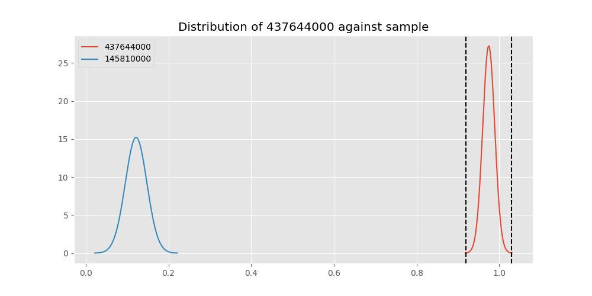
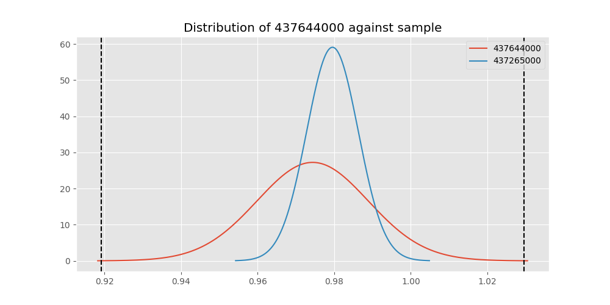
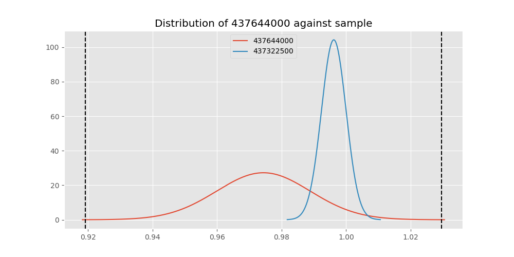
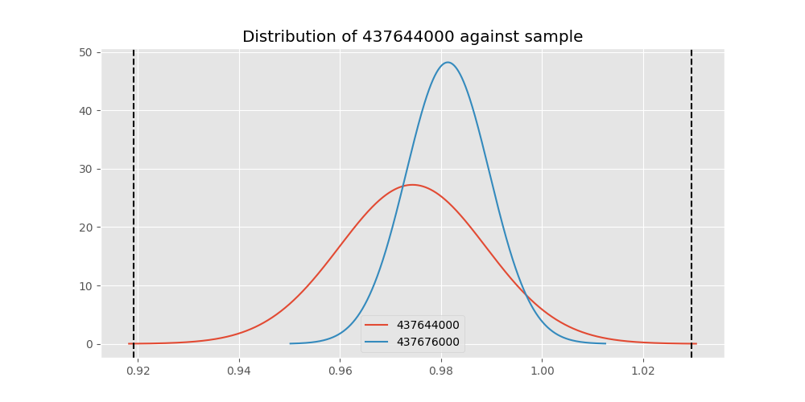
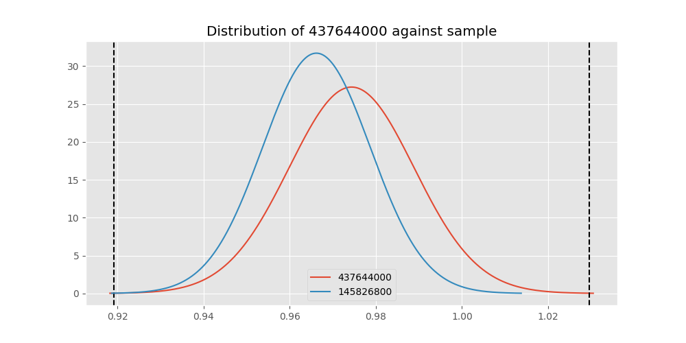

# Testing Results For 437644000 
$H_{0}$: There is not a difference in collection success against 437644000 
$H_{A}$: There is a difference in collection success against 437644000
An $\alpha$ of 0.00025 was used 
Out of 44 tests, there were 13 rejections from 44 independent-t test.
Out of 44 tests, there were 13 rejections from 44 Man Whitney u-tests.
## Testing Results for 437644000 against 436501000 
437644000 has a success rate of 0.9743589743589743
436501000 has a success rate of 0.9854014598540146
$H_{0}$: There is not a difference between 437644000 and 436501000
$H_{A}$: There is a difference between 437644000 and 436501000
An $/alpha$ of 0.00025 was used in this test.
__independent t-testing__: With a t-statistic of -0.6294725743007592 and a p-value of 0.5296099739335424, _we failed to reject the null hypothssis_
__Man-Whitney testing__: With a u-statistic of 7926.0 and a p-value of 0.5308792305862231, _we failed to reject the null hypothssis_
 
## Testing Results for 437644000 against 437375000 
437644000 has a success rate of 0.9743589743589743
437375000 has a success rate of 0.9982014388489209
$H_{0}$: There is not a difference between 437644000 and 437375000
$H_{A}$: There is a difference between 437644000 and 437375000
An $/alpha$ of 0.00025 was used in this test.
__independent t-testing__: With a t-statistic of -1.6125595651175975 and a p-value of 0.10947801665126954, _we failed to reject the null hypothssis_
__Man-Whitney testing__: With a u-statistic of 31750.5 and a p-value of 0.002323785689867259, _we failed to reject the null hypothssis_
 
## Testing Results for 437644000 against 436500000 
437644000 has a success rate of 0.9743589743589743
436500000 has a success rate of 0.9056603773584906
$H_{0}$: There is not a difference between 437644000 and 436500000
$H_{A}$: There is a difference between 437644000 and 436500000
An $/alpha$ of 0.00025 was used in this test.
__independent t-testing__: With a t-statistic of 2.2978046298425165 and a p-value of 0.022326498818167315, _we failed to reject the null hypothssis_
__Man-Whitney testing__: With a u-statistic of 9940.5 and a p-value of 0.022705981330801504, _we failed to reject the null hypothssis_
 
## Testing Results for 437644000 against 436990000 
437644000 has a success rate of 0.9743589743589743
436990000 has a success rate of 0.9572649572649573
$H_{0}$: There is not a difference between 437644000 and 436990000
$H_{A}$: There is a difference between 437644000 and 436990000
An $/alpha$ of 0.00025 was used in this test.
__independent t-testing__: With a t-statistic of 0.7978539386584089 and a p-value of 0.42549778322818044, _we failed to reject the null hypothssis_
__Man-Whitney testing__: With a u-statistic of 13923.0 and a p-value of 0.42570499346528656, _we failed to reject the null hypothssis_
 
## Testing Results for 437644000 against 145875000 
437644000 has a success rate of 0.9743589743589743
145875000 has a success rate of 0.9722222222222222
$H_{0}$: There is not a difference between 437644000 and 145875000
$H_{A}$: There is a difference between 437644000 and 145875000
An $/alpha$ of 0.00025 was used in this test.
__independent t-testing__: With a t-statistic of 0.0884197522851763 and a p-value of 0.9296376817258634, _we failed to reject the null hypothssis_
__Man-Whitney testing__: With a u-statistic of 4221.0 and a p-value of 0.9332720758794938, _we failed to reject the null hypothssis_
 
## Testing Results for 437644000 against 437800000 
437644000 has a success rate of 0.9743589743589743
437800000 has a success rate of 0.9533678756476683
$H_{0}$: There is not a difference between 437644000 and 437800000
$H_{A}$: There is a difference between 437644000 and 437800000
An $/alpha$ of 0.00025 was used in this test.
__independent t-testing__: With a t-statistic of 0.9270184699103811 and a p-value of 0.35464278234492397, _we failed to reject the null hypothssis_
__Man-Whitney testing__: With a u-statistic of 11527.5 and a p-value of 0.3548237526890373, _we failed to reject the null hypothssis_
 
## Testing Results for 437644000 against 145810000 
437644000 has a success rate of 0.9743589743589743
145810000 has a success rate of 0.12179487179487179
$H_{0}$: There is not a difference between 437644000 and 145810000
$H_{A}$: There is a difference between 437644000 and 145810000
An $/alpha$ of 0.00025 was used in this test.
__independent t-testing__: With a t-statistic of 25.915414248129895 and a p-value of 2.5319277502765456e-75, _we **reject** the null hypothssis_
__Man-Whitney testing__: With a u-statistic of 16906.5 and a p-value of 4.768166215108753e-44, _we **reject** the null hypothssis_
 
## Testing Results for 437644000 against 437095000 
437644000 has a success rate of 0.9743589743589743
437095000 has a success rate of 0.9361702127659575
$H_{0}$: There is not a difference between 437644000 and 437095000
$H_{A}$: There is a difference between 437644000 and 437095000
An $/alpha$ of 0.00025 was used in this test.
__independent t-testing__: With a t-statistic of 1.175643243792905 and a p-value of 0.24146234688819887, _we failed to reject the null hypothssis_
__Man-Whitney testing__: With a u-statistic of 2854.5 and a p-value of 0.24253426622944707, _we failed to reject the null hypothssis_
 
## Testing Results for 437644000 against 437265000 
437644000 has a success rate of 0.9743589743589743
437265000 has a success rate of 0.9795454545454545
$H_{0}$: There is not a difference between 437644000 and 437265000
$H_{A}$: There is a difference between 437644000 and 437265000
An $/alpha$ of 0.00025 was used in this test.
__independent t-testing__: With a t-statistic of -0.3428432423099926 and a p-value of 0.731846204671715, _we failed to reject the null hypothssis_
__Man-Whitney testing__: With a u-statistic of 25606.5 and a p-value of 0.7324784082994602, _we failed to reject the null hypothssis_
 
## Testing Results for 437644000 against 437350000 
437644000 has a success rate of 0.9743589743589743
437350000 has a success rate of 0.9488372093023256
$H_{0}$: There is not a difference between 437644000 and 437350000
$H_{A}$: There is a difference between 437644000 and 437350000
An $/alpha$ of 0.00025 was used in this test.
__independent t-testing__: With a t-statistic of 1.1040860283303322 and a p-value of 0.27036022864613035, _we failed to reject the null hypothssis_
__Man-Whitney testing__: With a u-statistic of 12898.5 and a p-value of 0.27046090687954316, _we failed to reject the null hypothssis_
 
## Testing Results for 437644000 against 437200000 
437644000 has a success rate of 0.9743589743589743
437200000 has a success rate of 0.8620689655172413
$H_{0}$: There is not a difference between 437644000 and 437200000
$H_{A}$: There is a difference between 437644000 and 437200000
An $/alpha$ of 0.00025 was used in this test.
__independent t-testing__: With a t-statistic of 3.3162606079320165 and a p-value of 0.0010178823598144615, _we failed to reject the null hypothssis_
__Man-Whitney testing__: With a u-statistic of 13209.0 and a p-value of 0.001097503272416158, _we failed to reject the null hypothssis_
 
## Testing Results for 437644000 against 435600000 
437644000 has a success rate of 0.9743589743589743
435600000 has a success rate of 0.9819341126461212
$H_{0}$: There is not a difference between 437644000 and 435600000
$H_{A}$: There is a difference between 437644000 and 435600000
An $/alpha$ of 0.00025 was used in this test.
__independent t-testing__: With a t-statistic of -0.5669734007497423 and a p-value of 0.5708527461397854, _we failed to reject the null hypothssis_
__Man-Whitney testing__: With a u-statistic of 54631.5 and a p-value of 0.5710706306864171, _we failed to reject the null hypothssis_
 
## Testing Results for 437644000 against 450000000 
437644000 has a success rate of 0.9743589743589743
450000000 has a success rate of 0.8235294117647058
$H_{0}$: There is not a difference between 437644000 and 450000000
$H_{A}$: There is a difference between 437644000 and 450000000
An $/alpha$ of 0.00025 was used in this test.
__independent t-testing__: With a t-statistic of 3.829332664283281 and a p-value of 0.00017187486298237862, _we **reject** the null hypothssis_
__Man-Whitney testing__: With a u-statistic of 5722.5 and a p-value of 0.00021307640370144264, _we **reject** the null hypothssis_
 
## Testing Results for 437644000 against 145978500 
437644000 has a success rate of 0.9743589743589743
145978500 has a success rate of 0.9963636363636363
$H_{0}$: There is not a difference between 437644000 and 145978500
$H_{A}$: There is a difference between 437644000 and 145978500
An $/alpha$ of 0.00025 was used in this test.
__independent t-testing__: With a t-statistic of -1.4553848034948837 and a p-value of 0.14796461929448587, _we failed to reject the null hypothssis_
__Man-Whitney testing__: With a u-statistic of 15733.5 and a p-value of 0.04788947806666095, _we failed to reject the null hypothssis_
 
## Testing Results for 437644000 against 437050000 
437644000 has a success rate of 0.9743589743589743
437050000 has a success rate of 0.5346534653465347
$H_{0}$: There is not a difference between 437644000 and 437050000
$H_{A}$: There is a difference between 437644000 and 437050000
An $/alpha$ of 0.00025 was used in this test.
__independent t-testing__: With a t-statistic of 8.9832578477984 and a p-value of 1.3262823399244086e-16, _we **reject** the null hypothssis_
__Man-Whitney testing__: With a u-statistic of 8506.5 and a p-value of 1.5775576164389596e-14, _we **reject** the null hypothssis_
 
## Testing Results for 437644000 against 435300000 
437644000 has a success rate of 0.9743589743589743
435300000 has a success rate of 0.1232876712328767
$H_{0}$: There is not a difference between 437644000 and 435300000
$H_{A}$: There is a difference between 437644000 and 435300000
An $/alpha$ of 0.00025 was used in this test.
__independent t-testing__: With a t-statistic of 25.621916569342325 and a p-value of 3.294617795399999e-73, _we **reject** the null hypothssis_
__Man-Whitney testing__: With a u-statistic of 15810.0 and a p-value of 1.1500187214452838e-42, _we **reject** the null hypothssis_
 
## Testing Results for 437644000 against 437475000 
437644000 has a success rate of 0.9743589743589743
437475000 has a success rate of 0.5045045045045045
$H_{0}$: There is not a difference between 437644000 and 437475000
$H_{A}$: There is a difference between 437644000 and 437475000
An $/alpha$ of 0.00025 was used in this test.
__independent t-testing__: With a t-statistic of 10.044519081635777 and a p-value of 3.29816421255653e-22, _we **reject** the null hypothssis_
__Man-Whitney testing__: With a u-statistic of 47722.5 and a p-value of 7.194608316851256e-21, _we **reject** the null hypothssis_
 
## Testing Results for 437644000 against 435448000 
437644000 has a success rate of 0.9743589743589743
435448000 has a success rate of 0.975
$H_{0}$: There is not a difference between 437644000 and 435448000
$H_{A}$: There is a difference between 437644000 and 435448000
An $/alpha$ of 0.00025 was used in this test.
__independent t-testing__: With a t-statistic of -0.022069329993064504 and a p-value of 0.9824210367016513, _we failed to reject the null hypothssis_
__Man-Whitney testing__: With a u-statistic of 2338.5 and a p-value of 0.9882234535511243, _we failed to reject the null hypothssis_
 
## Testing Results for 437644000 against 145825000 
437644000 has a success rate of 0.9743589743589743
145825000 has a success rate of 0.8687448728465955
$H_{0}$: There is not a difference between 437644000 and 145825000
$H_{A}$: There is a difference between 437644000 and 145825000
An $/alpha$ of 0.00025 was used in this test.
__independent t-testing__: With a t-statistic of 3.364102388569189 and a p-value of 0.0007792718026219901, _we failed to reject the null hypothssis_
__Man-Whitney testing__: With a u-statistic of 157686.0 and a p-value of 0.0007873140371429864, _we failed to reject the null hypothssis_
 
## Testing Results for 437644000 against 437345000 
437644000 has a success rate of 0.9743589743589743
437345000 has a success rate of 0.7603092783505154
$H_{0}$: There is not a difference between 437644000 and 437345000
$H_{A}$: There is a difference between 437644000 and 437345000
An $/alpha$ of 0.00025 was used in this test.
__independent t-testing__: With a t-statistic of 5.304309863473563 and a p-value of 1.6977362956594083e-07, _we **reject** the null hypothssis_
__Man-Whitney testing__: With a u-statistic of 27556.5 and a p-value of 2.385140080538959e-07, _we **reject** the null hypothssis_
 
## Testing Results for 437644000 against 435275000 
437644000 has a success rate of 0.9743589743589743
435275000 has a success rate of 0.9152542372881356
$H_{0}$: There is not a difference between 437644000 and 435275000
$H_{A}$: There is a difference between 437644000 and 435275000
An $/alpha$ of 0.00025 was used in this test.
__independent t-testing__: With a t-statistic of 1.989965500604441 and a p-value of 0.04776364394390163, _we failed to reject the null hypothssis_
__Man-Whitney testing__: With a u-statistic of 7311.0 and a p-value of 0.04825971602061249, _we failed to reject the null hypothssis_
 
## Testing Results for 437644000 against 437322500 
437644000 has a success rate of 0.9743589743589743
437322500 has a success rate of 0.9961685823754789
$H_{0}$: There is not a difference between 437644000 and 437322500
$H_{A}$: There is a difference between 437644000 and 437322500
An $/alpha$ of 0.00025 was used in this test.
__independent t-testing__: With a t-statistic of -1.437910089578853 and a p-value of 0.15282470183818014, _we failed to reject the null hypothssis_
__Man-Whitney testing__: With a u-statistic of 14935.5 and a p-value of 0.05608793966840251, _we failed to reject the null hypothssis_
 
## Testing Results for 437644000 against 437450000 
437644000 has a success rate of 0.9743589743589743
437450000 has a success rate of 0.6947791164658634
$H_{0}$: There is not a difference between 437644000 and 437450000
$H_{A}$: There is a difference between 437644000 and 437450000
An $/alpha$ of 0.00025 was used in this test.
__independent t-testing__: With a t-statistic of 6.3749762168470445 and a p-value of 5.545800325760343e-10, _we **reject** the null hypothssis_
__Man-Whitney testing__: With a u-statistic of 18639.0 and a p-value of 1.413576798260587e-09, _we **reject** the null hypothssis_
 
## Testing Results for 437644000 against 436703000 
437644000 has a success rate of 0.9743589743589743
436703000 has a success rate of 0.9859154929577465
$H_{0}$: There is not a difference between 437644000 and 436703000
$H_{A}$: There is a difference between 437644000 and 436703000
An $/alpha$ of 0.00025 was used in this test.
__independent t-testing__: With a t-statistic of -0.7500161897272318 and a p-value of 0.4537825897482599, _we failed to reject the null hypothssis_
__Man-Whitney testing__: With a u-statistic of 12316.5 and a p-value of 0.454514816449067, _we failed to reject the null hypothssis_
 
## Testing Results for 437644000 against 400500000 
437644000 has a success rate of 0.9743589743589743
400500000 has a success rate of 0.3508771929824561
$H_{0}$: There is not a difference between 437644000 and 400500000
$H_{A}$: There is a difference between 437644000 and 400500000
An $/alpha$ of 0.00025 was used in this test.
__independent t-testing__: With a t-statistic of 12.693155813171359 and a p-value of 1.7817985450464446e-26, _we **reject** the null hypothssis_
__Man-Whitney testing__: With a u-statistic of 5413.5 and a p-value of 5.955309241059873e-20, _we **reject** the null hypothssis_
 
## Testing Results for 437644000 against 437150000 
437644000 has a success rate of 0.9743589743589743
437150000 has a success rate of 0.9859550561797753
$H_{0}$: There is not a difference between 437644000 and 437150000
$H_{A}$: There is a difference between 437644000 and 437150000
An $/alpha$ of 0.00025 was used in this test.
__independent t-testing__: With a t-statistic of -0.8427434236372751 and a p-value of 0.3997996974398804, _we failed to reject the null hypothssis_
__Man-Whitney testing__: With a u-statistic of 20584.5 and a p-value of 0.40020403204278054, _we failed to reject the null hypothssis_
 
## Testing Results for 437644000 against 435635000 
437644000 has a success rate of 0.9743589743589743
435635000 has a success rate of 0.9849624060150376
$H_{0}$: There is not a difference between 437644000 and 435635000
$H_{A}$: There is a difference between 437644000 and 435635000
An $/alpha$ of 0.00025 was used in this test.
__independent t-testing__: With a t-statistic of -0.5955707277274209 and a p-value of 0.5520051431562649, _we failed to reject the null hypothssis_
__Man-Whitney testing__: With a u-statistic of 7698.0 and a p-value of 0.5533620280671107, _we failed to reject the null hypothssis_
 
## Testing Results for 437644000 against 437384000 
437644000 has a success rate of 0.9743589743589743
437384000 has a success rate of 0.968421052631579
$H_{0}$: There is not a difference between 437644000 and 437384000
$H_{A}$: There is a difference between 437644000 and 437384000
An $/alpha$ of 0.00025 was used in this test.
__independent t-testing__: With a t-statistic of 0.2985988993853761 and a p-value of 0.765449438457137, _we failed to reject the null hypothssis_
__Man-Whitney testing__: With a u-statistic of 11181.0 and a p-value of 0.7666353832961499, _we failed to reject the null hypothssis_
 
## Testing Results for 437644000 against 437405000 
437644000 has a success rate of 0.9743589743589743
437405000 has a success rate of 0.9953917050691244
$H_{0}$: There is not a difference between 437644000 and 437405000
$H_{A}$: There is a difference between 437644000 and 437405000
An $/alpha$ of 0.00025 was used in this test.
__independent t-testing__: With a t-statistic of -1.3673425957327738 and a p-value of 0.17372056958618587, _we failed to reject the null hypothssis_
__Man-Whitney testing__: With a u-statistic of 12427.5 and a p-value of 0.09293452667274821, _we failed to reject the null hypothssis_
 
## Testing Results for 437644000 against 435612500 
437644000 has a success rate of 0.9743589743589743
435612500 has a success rate of 0.9770114942528736
$H_{0}$: There is not a difference between 437644000 and 435612500
$H_{A}$: There is a difference between 437644000 and 435612500
An $/alpha$ of 0.00025 was used in this test.
__independent t-testing__: With a t-statistic of -0.12058435971853096 and a p-value of 0.9041401132164576, _we failed to reject the null hypothssis_
__Man-Whitney testing__: With a u-statistic of 5076.0 and a p-value of 0.9073346243687793, _we failed to reject the null hypothssis_
 
## Testing Results for 437644000 against 435975000 
437644000 has a success rate of 0.9743589743589743
435975000 has a success rate of 0.92
$H_{0}$: There is not a difference between 437644000 and 435975000
$H_{A}$: There is a difference between 437644000 and 435975000
An $/alpha$ of 0.00025 was used in this test.
__independent t-testing__: With a t-statistic of 1.6082729043284114 and a p-value of 0.10968718532410676, _we failed to reject the null hypothssis_
__Man-Whitney testing__: With a u-statistic of 3084.0 and a p-value of 0.1105762116216315, _we failed to reject the null hypothssis_
 
## Testing Results for 437644000 against 437425000 
437644000 has a success rate of 0.9743589743589743
437425000 has a success rate of 0.6987654320987654
$H_{0}$: There is not a difference between 437644000 and 437425000
$H_{A}$: There is a difference between 437644000 and 437425000
An $/alpha$ of 0.00025 was used in this test.
__independent t-testing__: With a t-statistic of 6.376603625331827 and a p-value of 4.001259078616999e-10, _we **reject** the null hypothssis_
__Man-Whitney testing__: With a u-statistic of 30222.0 and a p-value of 7.923295969359546e-10, _we **reject** the null hypothssis_
 
## Testing Results for 437644000 against 437275000 
437644000 has a success rate of 0.9743589743589743
437275000 has a success rate of 0.3643724696356275
$H_{0}$: There is not a difference between 437644000 and 437275000
$H_{A}$: There is a difference between 437644000 and 437275000
An $/alpha$ of 0.00025 was used in this test.
__independent t-testing__: With a t-statistic of 13.33586634141711 and a p-value of 2.7957771344827318e-33, _we **reject** the null hypothssis_
__Man-Whitney testing__: With a u-statistic of 23263.5 and a p-value of 7.848334826450535e-28, _we **reject** the null hypothssis_
 
## Testing Results for 437644000 against 145840000 
437644000 has a success rate of 0.9743589743589743
145840000 has a success rate of 0.9649122807017544
$H_{0}$: There is not a difference between 437644000 and 145840000
$H_{A}$: There is a difference between 437644000 and 145840000
An $/alpha$ of 0.00025 was used in this test.
__independent t-testing__: With a t-statistic of 0.34817617710162235 and a p-value of 0.7281336430684846, _we failed to reject the null hypothssis_
__Man-Whitney testing__: With a u-statistic of 3366.0 and a p-value of 0.731204917104963, _we failed to reject the null hypothssis_
 
## Testing Results for 437644000 against 435525000 
437644000 has a success rate of 0.9743589743589743
435525000 has a success rate of 0.6923076923076923
$H_{0}$: There is not a difference between 437644000 and 435525000
$H_{A}$: There is a difference between 437644000 and 435525000
An $/alpha$ of 0.00025 was used in this test.
__independent t-testing__: With a t-statistic of 6.289831600831638 and a p-value of 1.3521482279711722e-09, _we **reject** the null hypothssis_
__Man-Whitney testing__: With a u-statistic of 10725.0 and a p-value of 4.440380795410864e-09, _we **reject** the null hypothssis_
 
## Testing Results for 437644000 against 436250000 
437644000 has a success rate of 0.9743589743589743
436250000 has a success rate of 0.17857142857142858
$H_{0}$: There is not a difference between 437644000 and 436250000
$H_{A}$: There is a difference between 437644000 and 436250000
An $/alpha$ of 0.00025 was used in this test.
__independent t-testing__: With a t-statistic of 19.189687647338562 and a p-value of 1.6595429508434157e-44, _we **reject** the null hypothssis_
__Man-Whitney testing__: With a u-statistic of 5883.0 and a p-value of 2.332292937668991e-27, _we **reject** the null hypothssis_
 
## Testing Results for 437644000 against 435950000 
437644000 has a success rate of 0.9743589743589743
435950000 has a success rate of 0.9850187265917603
$H_{0}$: There is not a difference between 437644000 and 435950000
$H_{A}$: There is a difference between 437644000 and 435950000
An $/alpha$ of 0.00025 was used in this test.
__independent t-testing__: With a t-statistic of -0.8094048052431779 and a p-value of 0.4185789804365364, _we failed to reject the null hypothssis_
__Man-Whitney testing__: With a u-statistic of 30906.0 and a p-value of 0.4188580704800636, _we failed to reject the null hypothssis_
 
## Testing Results for 437644000 against 435800000 
437644000 has a success rate of 0.9743589743589743
435800000 has a success rate of 0.5390070921985816
$H_{0}$: There is not a difference between 437644000 and 435800000
$H_{A}$: There is a difference between 437644000 and 435800000
An $/alpha$ of 0.00025 was used in this test.
__independent t-testing__: With a t-statistic of 9.04062187659189 and a p-value of 3.960001690208031e-17, _we **reject** the null hypothssis_
__Man-Whitney testing__: With a u-statistic of 11839.5 and a p-value of 3.1380250967049157e-15, _we **reject** the null hypothssis_
 
## Testing Results for 437644000 against 437485000 
437644000 has a success rate of 0.9743589743589743
437485000 has a success rate of 0.9375
$H_{0}$: There is not a difference between 437644000 and 437485000
$H_{A}$: There is a difference between 437644000 and 437485000
An $/alpha$ of 0.00025 was used in this test.
__independent t-testing__: With a t-statistic of 1.022687850028204 and a p-value of 0.30813551944346407, _we failed to reject the null hypothssis_
__Man-Whitney testing__: With a u-statistic of 1941.0 and a p-value of 0.3100487713873873, _we failed to reject the null hypothssis_
 
## Testing Results for 437644000 against 136770000 
437644000 has a success rate of 0.9743589743589743
136770000 has a success rate of 0.9945945945945946
$H_{0}$: There is not a difference between 437644000 and 136770000
$H_{A}$: There is a difference between 437644000 and 136770000
An $/alpha$ of 0.00025 was used in this test.
__independent t-testing__: With a t-statistic of -1.2938789905003076 and a p-value of 0.19772420391089637, _we failed to reject the null hypothssis_
__Man-Whitney testing__: With a u-statistic of 10603.5 and a p-value of 0.13553803039418272, _we failed to reject the null hypothssis_
 
## Testing Results for 437644000 against 437250000 
437644000 has a success rate of 0.9743589743589743
437250000 has a success rate of 0.9937106918238994
$H_{0}$: There is not a difference between 437644000 and 437250000
$H_{A}$: There is a difference between 437644000 and 437250000
An $/alpha$ of 0.00025 was used in this test.
__independent t-testing__: With a t-statistic of -1.6805929696816861 and a p-value of 0.09356318997499019, _we failed to reject the null hypothssis_
__Man-Whitney testing__: With a u-statistic of 18243.0 and a p-value of 0.093984770398725, _we failed to reject the null hypothssis_
 
## Testing Results for 437644000 against 437356000 
437644000 has a success rate of 0.9743589743589743
437356000 has a success rate of 0.9328358208955224
$H_{0}$: There is not a difference between 437644000 and 437356000
$H_{A}$: There is a difference between 437644000 and 437356000
An $/alpha$ of 0.00025 was used in this test.
__independent t-testing__: With a t-statistic of 1.5392250705313582 and a p-value of 0.12501915610622824, _we failed to reject the null hypothssis_
__Man-Whitney testing__: With a u-statistic of 8164.5 and a p-value of 0.12535735788698102, _we failed to reject the null hypothssis_
 
## Testing Results for 437644000 against 437676000 
437644000 has a success rate of 0.9743589743589743
437676000 has a success rate of 0.9813432835820896
$H_{0}$: There is not a difference between 437644000 and 437676000
$H_{A}$: There is a difference between 437644000 and 437676000
An $/alpha$ of 0.00025 was used in this test.
__independent t-testing__: With a t-statistic of -0.44083661548884806 and a p-value of 0.6595800083244843, _we failed to reject the null hypothssis_
__Man-Whitney testing__: With a u-statistic of 15568.5 and a p-value of 0.6604552355486468, _we failed to reject the null hypothssis_
 
## Testing Results for 437644000 against 145826800 
437644000 has a success rate of 0.9743589743589743
145826800 has a success rate of 0.966183574879227
$H_{0}$: There is not a difference between 437644000 and 145826800
$H_{A}$: There is a difference between 437644000 and 145826800
An $/alpha$ of 0.00025 was used in this test.
__independent t-testing__: With a t-statistic of 0.4075324269446534 and a p-value of 0.6838877882514636, _we failed to reject the null hypothssis_
__Man-Whitney testing__: With a u-statistic of 12208.5 and a p-value of 0.6847436128131736, _we failed to reject the null hypothssis_
 
