# Testing Results For 437676000 
$H_{0}$: There is not a difference in collection success against 437676000 
$H_{A}$: There is a difference in collection success against 437676000
An $\alpha$ of 0.00025 was used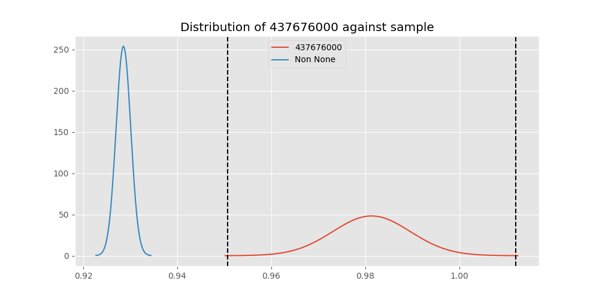 
Out of 44 tests, there were 15 rejections from 44 independent-t test.
Out of 44 tests, there were 15 rejections from 44 Man Whitney u-tests.
## Testing Results for 437676000 against 436501000 
437676000 has a success rate of 0.9813432835820896
436501000 has a success rate of 0.9854014598540146
$H_{0}$: There is not a difference between 437676000 and 436501000
$H_{A}$: There is a difference between 437676000 and 436501000
An $/alpha$ of 0.00025 was used in this test.
__independent t-testing__: With a t-statistic of -0.29577924034098113 and a p-value of 0.7675510215161638, _we failed to reject the null hypothssis_
__Man-Whitney testing__: With a u-statistic of 18283.5 and a p-value of 0.7686612386972239, _we failed to reject the null hypothssis_
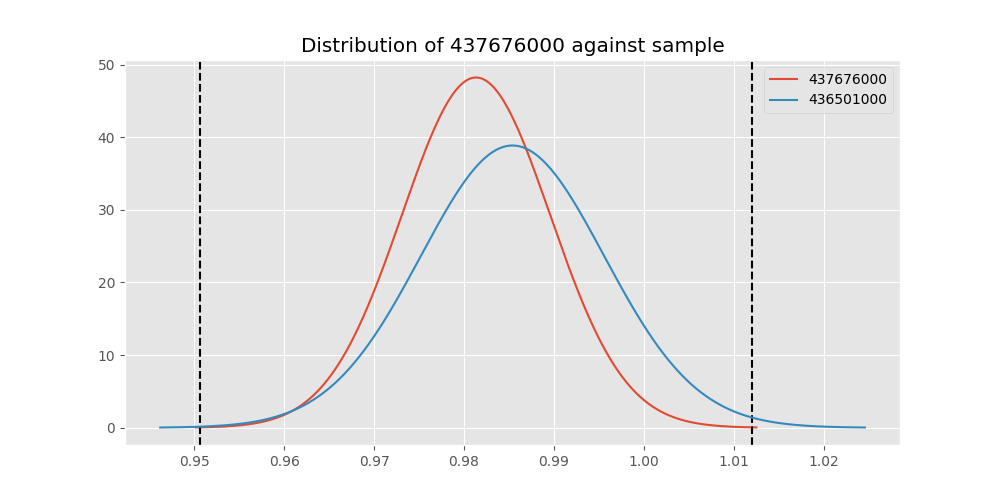 
## Testing Results for 437676000 against 437375000 
437676000 has a success rate of 0.9813432835820896
437375000 has a success rate of 0.9982014388489209
$H_{0}$: There is not a difference between 437676000 and 437375000
$H_{A}$: There is a difference between 437676000 and 437375000
An $/alpha$ of 0.00025 was used in this test.
__independent t-testing__: With a t-statistic of -1.9894274641000813 and a p-value of 0.04758524274564419, _we failed to reject the null hypothssis_
__Man-Whitney testing__: With a u-statistic of 73248.0 and a p-value of 0.0077280466016083965, _we failed to reject the null hypothssis_
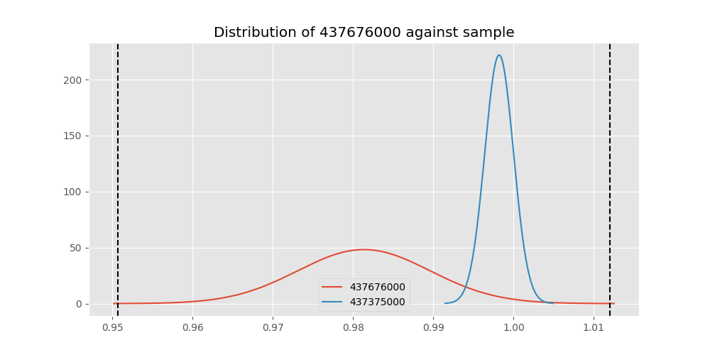 
## Testing Results for 437676000 against 436500000 
437676000 has a success rate of 0.9813432835820896
436500000 has a success rate of 0.9056603773584906
$H_{0}$: There is not a difference between 437676000 and 436500000
$H_{A}$: There is a difference between 437676000 and 436500000
An $/alpha$ of 0.00025 was used in this test.
__independent t-testing__: With a t-statistic of 3.624572430970232 and a p-value of 0.00032450191400137485, _we failed to reject the null hypothssis_
__Man-Whitney testing__: With a u-statistic of 22918.5 and a p-value of 0.00035304062235540614, _we failed to reject the null hypothssis_
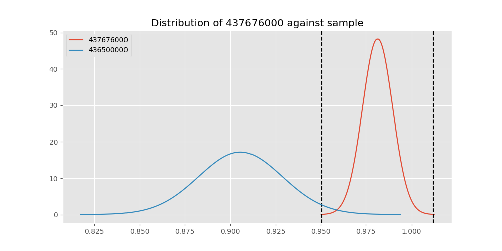 
## Testing Results for 437676000 against 436990000 
437676000 has a success rate of 0.9813432835820896
436990000 has a success rate of 0.9572649572649573
$H_{0}$: There is not a difference between 437676000 and 436990000
$H_{A}$: There is a difference between 437676000 and 436990000
An $/alpha$ of 0.00025 was used in this test.
__independent t-testing__: With a t-statistic of 1.5814664837332415 and a p-value of 0.11440374867686007, _we failed to reject the null hypothssis_
__Man-Whitney testing__: With a u-statistic of 32111.0 and a p-value of 0.11455253156538142, _we failed to reject the null hypothssis_
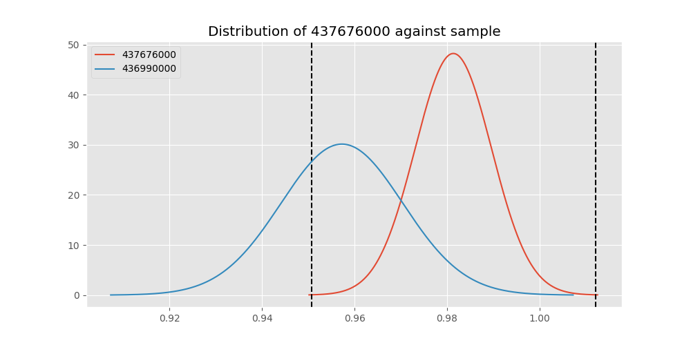 
## Testing Results for 437676000 against 145875000 
437676000 has a success rate of 0.9813432835820896
145875000 has a success rate of 0.9722222222222222
$H_{0}$: There is not a difference between 437676000 and 145875000
$H_{A}$: There is a difference between 437676000 and 145875000
An $/alpha$ of 0.00025 was used in this test.
__independent t-testing__: With a t-statistic of 0.4826316868989201 and a p-value of 0.6296696981205456, _we failed to reject the null hypothssis_
__Man-Whitney testing__: With a u-statistic of 9736.0 and a p-value of 0.6309193095674537, _we failed to reject the null hypothssis_
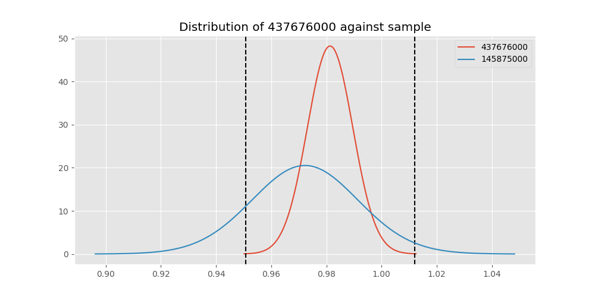 
## Testing Results for 437676000 against 437800000 
437676000 has a success rate of 0.9813432835820896
437800000 has a success rate of 0.9533678756476683
$H_{0}$: There is not a difference between 437676000 and 437800000
$H_{A}$: There is a difference between 437676000 and 437800000
An $/alpha$ of 0.00025 was used in this test.
__independent t-testing__: With a t-statistic of 1.7287024257198387 and a p-value of 0.08453481247491243, _we failed to reject the null hypothssis_
__Man-Whitney testing__: With a u-statistic of 26585.5 and a p-value of 0.0847464623411252, _we failed to reject the null hypothssis_
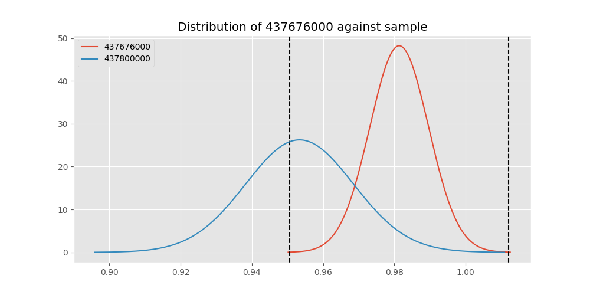 
## Testing Results for 437676000 against 145810000 
437676000 has a success rate of 0.9813432835820896
145810000 has a success rate of 0.12179487179487179
$H_{0}$: There is not a difference between 437676000 and 145810000
$H_{A}$: There is a difference between 437676000 and 145810000
An $/alpha$ of 0.00025 was used in this test.
__independent t-testing__: With a t-statistic of 37.73294707651884 and a p-value of 2.6441521538153124e-137, _we **reject** the null hypothssis_
__Man-Whitney testing__: With a u-statistic of 38872.0 and a p-value of 6.236280103601562e-73, _we **reject** the null hypothssis_
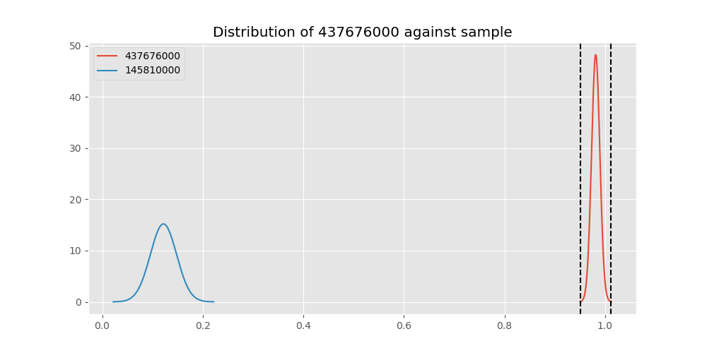 
## Testing Results for 437676000 against 437095000 
437676000 has a success rate of 0.9813432835820896
437095000 has a success rate of 0.9361702127659575
$H_{0}$: There is not a difference between 437676000 and 437095000
$H_{A}$: There is a difference between 437676000 and 437095000
An $/alpha$ of 0.00025 was used in this test.
__independent t-testing__: With a t-statistic of 1.8194430921491158 and a p-value of 0.06979910348559953, _we failed to reject the null hypothssis_
__Man-Whitney testing__: With a u-statistic of 6582.5 and a p-value of 0.07035779794208866, _we failed to reject the null hypothssis_
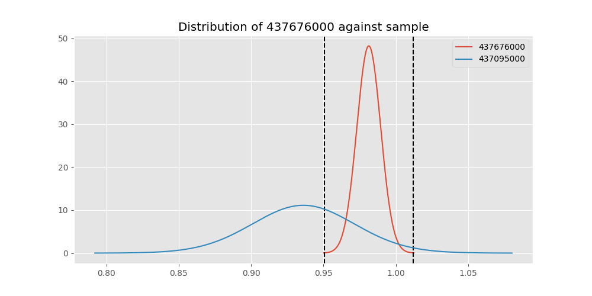 
## Testing Results for 437676000 against 437265000 
437676000 has a success rate of 0.9813432835820896
437265000 has a success rate of 0.9795454545454545
$H_{0}$: There is not a difference between 437676000 and 437265000
$H_{A}$: There is a difference between 437676000 and 437265000
An $/alpha$ of 0.00025 was used in this test.
__independent t-testing__: With a t-statistic of 0.1664214269855167 and a p-value of 0.8678729620935225, _we failed to reject the null hypothssis_
__Man-Whitney testing__: With a u-statistic of 59066.0 and a p-value of 0.8683533544764901, _we failed to reject the null hypothssis_
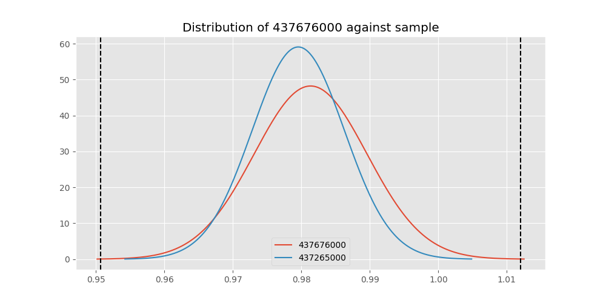 
## Testing Results for 437676000 against 437350000 
437676000 has a success rate of 0.9813432835820896
437350000 has a success rate of 0.9488372093023256
$H_{0}$: There is not a difference between 437676000 and 437350000
$H_{A}$: There is a difference between 437676000 and 437350000
An $/alpha$ of 0.00025 was used in this test.
__independent t-testing__: With a t-statistic of 1.9878420786278588 and a p-value of 0.04739565058647723, _we failed to reject the null hypothssis_
__Man-Whitney testing__: With a u-statistic of 29746.5 and a p-value of 0.04762205924074561, _we failed to reject the null hypothssis_
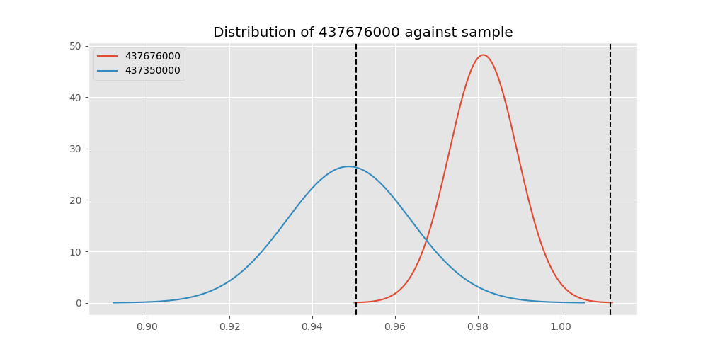 
## Testing Results for 437676000 against 437200000 
437676000 has a success rate of 0.9813432835820896
437200000 has a success rate of 0.8620689655172413
$H_{0}$: There is not a difference between 437676000 and 437200000
$H_{A}$: There is a difference between 437676000 and 437200000
An $/alpha$ of 0.00025 was used in this test.
__independent t-testing__: With a t-statistic of 5.151162747285482 and a p-value of 3.8191062784862e-07, _we **reject** the null hypothssis_
__Man-Whitney testing__: With a u-statistic of 30446.5 and a p-value of 5.278115186453163e-07, _we **reject** the null hypothssis_
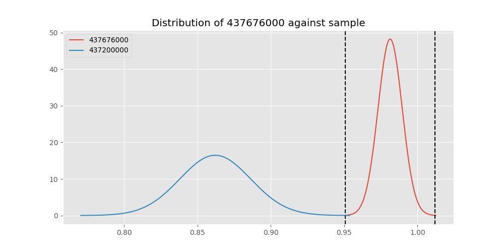 
## Testing Results for 437676000 against 435600000 
437676000 has a success rate of 0.9813432835820896
435600000 has a success rate of 0.9819341126461212
$H_{0}$: There is not a difference between 437676000 and 435600000
$H_{A}$: There is a difference between 437676000 and 435600000
An $/alpha$ of 0.00025 was used in this test.
__independent t-testing__: With a t-statistic of -0.0637884026389977 and a p-value of 0.9491492748835104, _we failed to reject the null hypothssis_
__Man-Whitney testing__: With a u-statistic of 126019.5 and a p-value of 0.9494587949684973, _we failed to reject the null hypothssis_
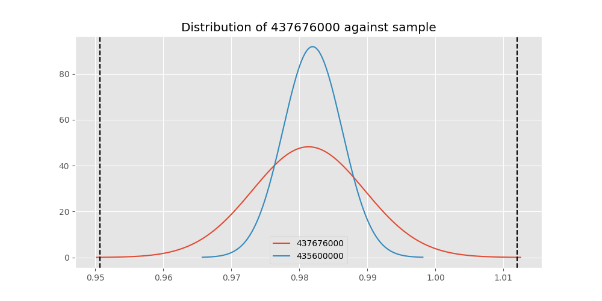 
## Testing Results for 437676000 against 450000000 
437676000 has a success rate of 0.9813432835820896
450000000 has a success rate of 0.8235294117647058
$H_{0}$: There is not a difference between 437676000 and 450000000
$H_{A}$: There is a difference between 437676000 and 450000000
An $/alpha$ of 0.00025 was used in this test.
__independent t-testing__: With a t-statistic of 5.717052133332788 and a p-value of 2.3191867250724367e-08, _we **reject** the null hypothssis_
__Man-Whitney testing__: With a u-statistic of 13187.5 and a p-value of 4.390307301354182e-08, _we **reject** the null hypothssis_
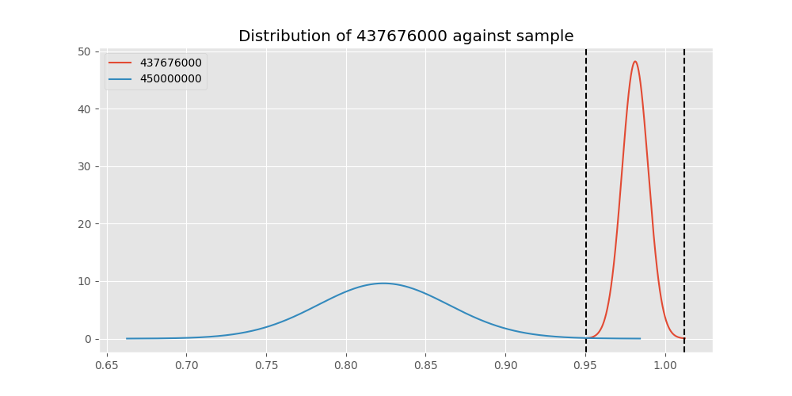 
## Testing Results for 437676000 against 145978500 
437676000 has a success rate of 0.9813432835820896
145978500 has a success rate of 0.9963636363636363
$H_{0}$: There is not a difference between 437676000 and 145978500
$H_{A}$: There is a difference between 437676000 and 145978500
An $/alpha$ of 0.00025 was used in this test.
__independent t-testing__: With a t-statistic of -1.66079941640846 and a p-value of 0.09760866119825559, _we failed to reject the null hypothssis_
__Man-Whitney testing__: With a u-statistic of 36296.5 and a p-value of 0.09473550368533654, _we failed to reject the null hypothssis_
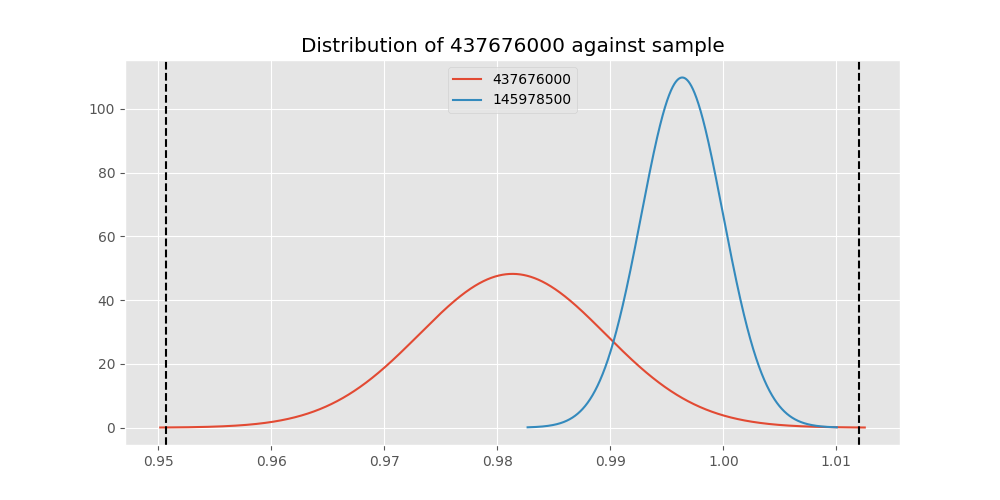 
## Testing Results for 437676000 against 437050000 
437676000 has a success rate of 0.9813432835820896
437050000 has a success rate of 0.5346534653465347
$H_{0}$: There is not a difference between 437676000 and 437050000
$H_{A}$: There is a difference between 437676000 and 437050000
An $/alpha$ of 0.00025 was used in this test.
__independent t-testing__: With a t-statistic of 13.373253113596457 and a p-value of 1.6725764529174507e-33, _we **reject** the null hypothssis_
__Man-Whitney testing__: With a u-statistic of 19579.5 and a p-value of 4.784634490126647e-28, _we **reject** the null hypothssis_
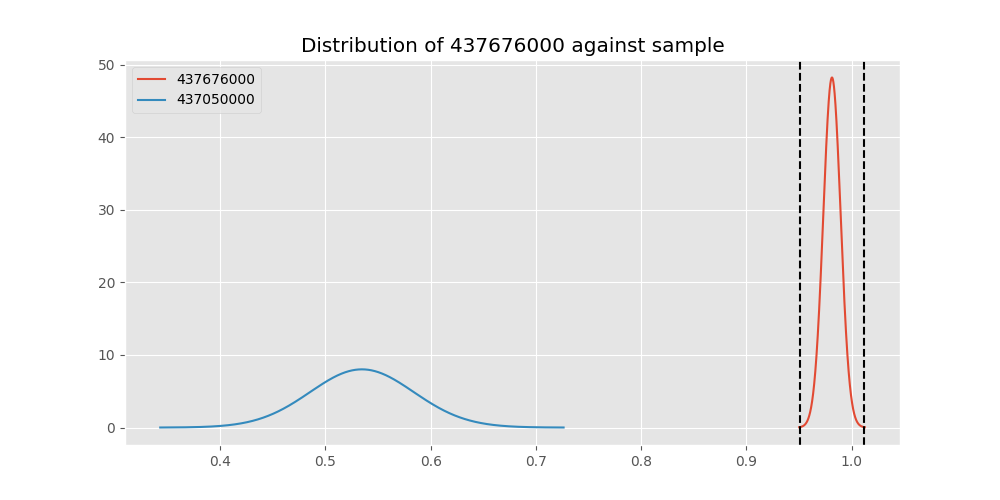 
## Testing Results for 437676000 against 435300000 
437676000 has a success rate of 0.9813432835820896
435300000 has a success rate of 0.1232876712328767
$H_{0}$: There is not a difference between 437676000 and 435300000
$H_{A}$: There is a difference between 437676000 and 435300000
An $/alpha$ of 0.00025 was used in this test.
__independent t-testing__: With a t-statistic of 37.22659296084646 and a p-value of 6.943568691502769e-134, _we **reject** the null hypothssis_
__Man-Whitney testing__: With a u-statistic of 36351.0 and a p-value of 3.3382673927793336e-71, _we **reject** the null hypothssis_
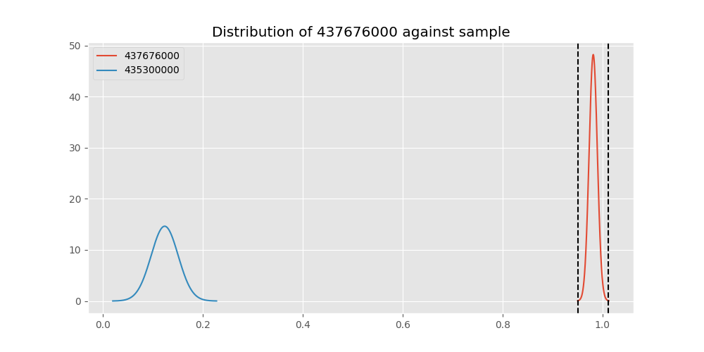 
## Testing Results for 437676000 against 437475000 
437676000 has a success rate of 0.9813432835820896
437475000 has a success rate of 0.5045045045045045
$H_{0}$: There is not a difference between 437676000 and 437475000
$H_{A}$: There is a difference between 437676000 and 437475000
An $/alpha$ of 0.00025 was used in this test.
__independent t-testing__: With a t-statistic of 15.325377180581162 and a p-value of 8.231053514398939e-47, _we **reject** the null hypothssis_
__Man-Whitney testing__: With a u-statistic of 109832.5 and a p-value of 1.1620632449721487e-41, _we **reject** the null hypothssis_
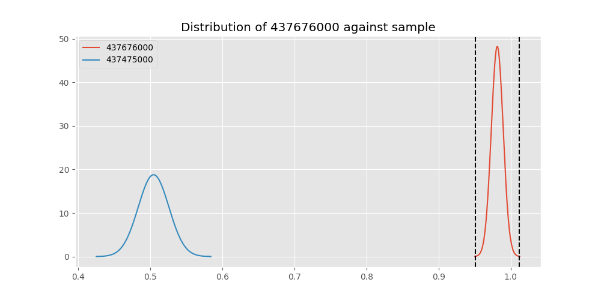 
## Testing Results for 437676000 against 435448000 
437676000 has a success rate of 0.9813432835820896
435448000 has a success rate of 0.975
$H_{0}$: There is not a difference between 437676000 and 435448000
$H_{A}$: There is a difference between 437676000 and 435448000
An $/alpha$ of 0.00025 was used in this test.
__independent t-testing__: With a t-statistic of 0.2699260716424988 and a p-value of 0.7873990728411352, _we failed to reject the null hypothssis_
__Man-Whitney testing__: With a u-statistic of 5394.0 and a p-value of 0.7899626790026407, _we failed to reject the null hypothssis_
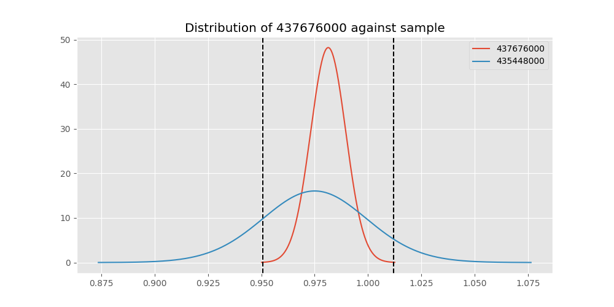 
## Testing Results for 437676000 against 437644000 
437676000 has a success rate of 0.9813432835820896
437644000 has a success rate of 0.9743589743589743
$H_{0}$: There is not a difference between 437676000 and 437644000
$H_{A}$: There is a difference between 437676000 and 437644000
An $/alpha$ of 0.00025 was used in this test.
__independent t-testing__: With a t-statistic of 0.44083661548884806 and a p-value of 0.6595800083244843, _we failed to reject the null hypothssis_
__Man-Whitney testing__: With a u-statistic of 15787.5 and a p-value of 0.6604552355486468, _we failed to reject the null hypothssis_
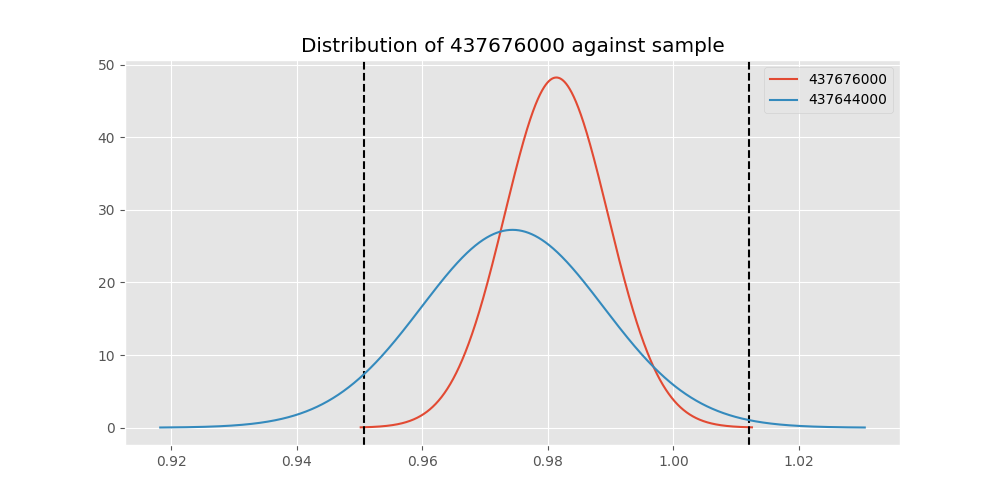 
## Testing Results for 437676000 against 145825000 
437676000 has a success rate of 0.9813432835820896
145825000 has a success rate of 0.8687448728465955
$H_{0}$: There is not a difference between 437676000 and 145825000
$H_{A}$: There is a difference between 437676000 and 145825000
An $/alpha$ of 0.00025 was used in this test.
__independent t-testing__: With a t-statistic of 5.4092317211958285 and a p-value of 6.883513580064308e-08, _we **reject** the null hypothssis_
__Man-Whitney testing__: With a u-statistic of 363477.0 and a p-value of 7.402288501926053e-08, _we **reject** the null hypothssis_
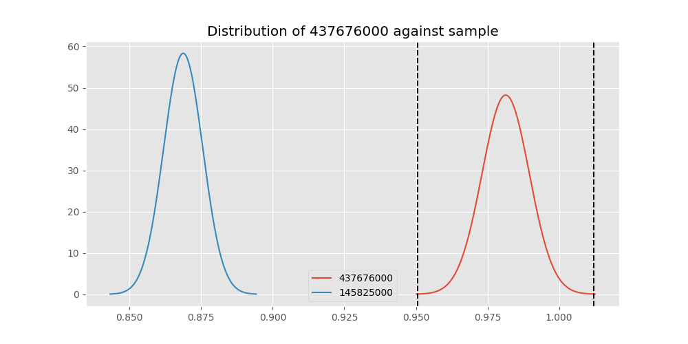 
## Testing Results for 437676000 against 437345000 
437676000 has a success rate of 0.9813432835820896
437345000 has a success rate of 0.7603092783505154
$H_{0}$: There is not a difference between 437676000 and 437345000
$H_{A}$: There is a difference between 437676000 and 437345000
An $/alpha$ of 0.00025 was used in this test.
__independent t-testing__: With a t-statistic of 8.184157017548921 and a p-value of 1.4344329849799426e-15, _we **reject** the null hypothssis_
__Man-Whitney testing__: With a u-statistic of 63484.0 and a p-value of 6.173676329091501e-15, _we **reject** the null hypothssis_
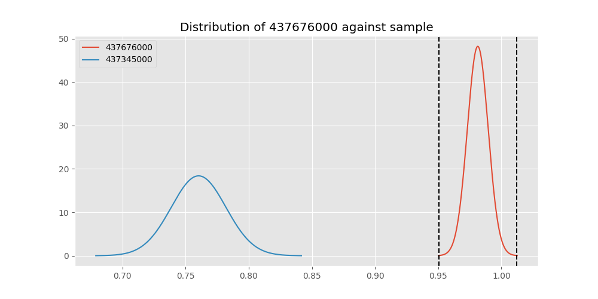 
## Testing Results for 437676000 against 435275000 
437676000 has a success rate of 0.9813432835820896
435275000 has a success rate of 0.9152542372881356
$H_{0}$: There is not a difference between 437676000 and 435275000
$H_{A}$: There is a difference between 437676000 and 435275000
An $/alpha$ of 0.00025 was used in this test.
__independent t-testing__: With a t-statistic of 3.1262854741260684 and a p-value of 0.001905077133705418, _we failed to reject the null hypothssis_
__Man-Whitney testing__: With a u-statistic of 16857.0 and a p-value of 0.002003035468374977, _we failed to reject the null hypothssis_
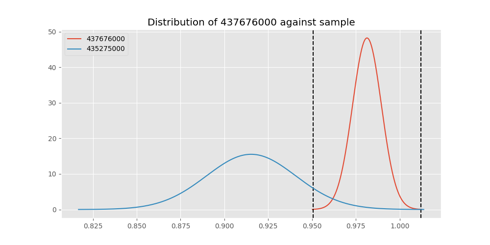 
## Testing Results for 437676000 against 437322500 
437676000 has a success rate of 0.9813432835820896
437322500 has a success rate of 0.9961685823754789
$H_{0}$: There is not a difference between 437676000 and 437322500
$H_{A}$: There is a difference between 437676000 and 437322500
An $/alpha$ of 0.00025 was used in this test.
__independent t-testing__: With a t-statistic of -1.6248285012687975 and a p-value of 0.10503731272585913, _we failed to reject the null hypothssis_
__Man-Whitney testing__: With a u-statistic of 34455.5 and a p-value of 0.10809762044188759, _we failed to reject the null hypothssis_
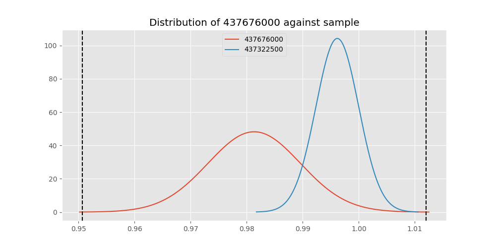 
## Testing Results for 437676000 against 437450000 
437676000 has a success rate of 0.9813432835820896
437450000 has a success rate of 0.6947791164658634
$H_{0}$: There is not a difference between 437676000 and 437450000
$H_{A}$: There is a difference between 437676000 and 437450000
An $/alpha$ of 0.00025 was used in this test.
__independent t-testing__: With a t-statistic of 9.725725916637892 and a p-value of 1.227803901240795e-20, _we **reject** the null hypothssis_
__Man-Whitney testing__: With a u-statistic of 42927.5 and a p-value of 3.6337756202407825e-19, _we **reject** the null hypothssis_
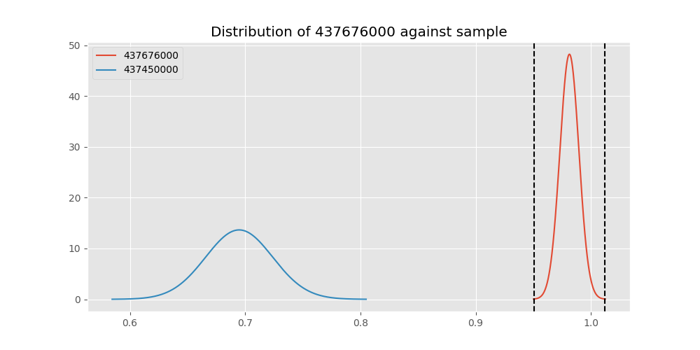 
## Testing Results for 437676000 against 436703000 
437676000 has a success rate of 0.9813432835820896
436703000 has a success rate of 0.9859154929577465
$H_{0}$: There is not a difference between 437676000 and 436703000
$H_{A}$: There is a difference between 437676000 and 436703000
An $/alpha$ of 0.00025 was used in this test.
__independent t-testing__: With a t-statistic of -0.3887263613813365 and a p-value of 0.6976513078421887, _we failed to reject the null hypothssis_
__Man-Whitney testing__: With a u-statistic of 28411.5 and a p-value of 0.6983269738307231, _we failed to reject the null hypothssis_
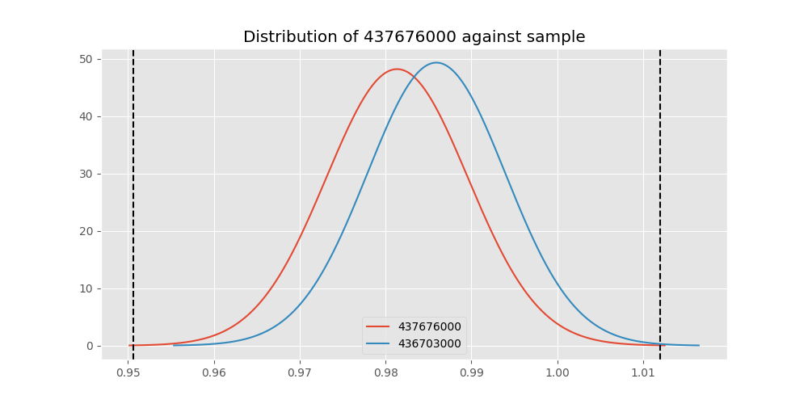 
## Testing Results for 437676000 against 400500000 
437676000 has a success rate of 0.9813432835820896
400500000 has a success rate of 0.3508771929824561
$H_{0}$: There is not a difference between 437676000 and 400500000
$H_{A}$: There is a difference between 437676000 and 400500000
An $/alpha$ of 0.00025 was used in this test.
__independent t-testing__: With a t-statistic of 18.36669491343793 and a p-value of 4.323173347410325e-52, _we **reject** the null hypothssis_
__Man-Whitney testing__: With a u-statistic of 12453.5 and a p-value of 7.176266270160042e-38, _we **reject** the null hypothssis_
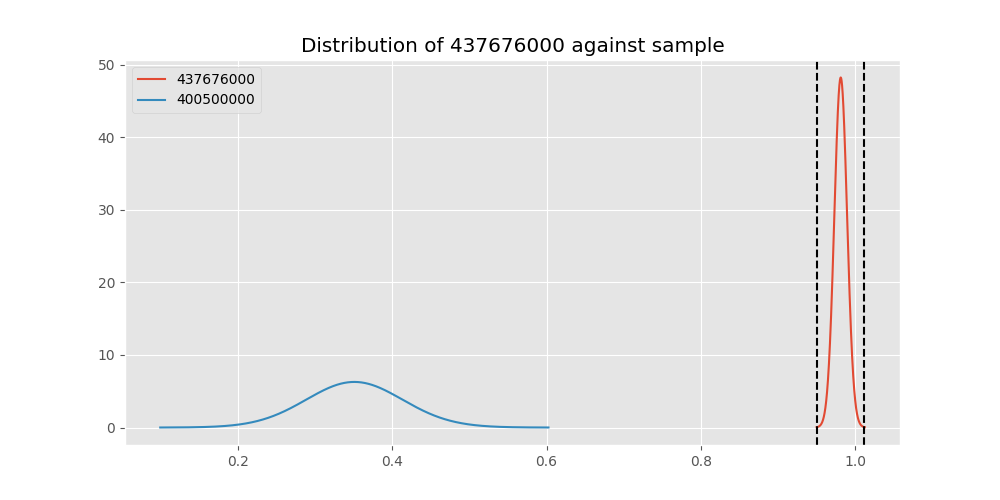 
## Testing Results for 437676000 against 437150000 
437676000 has a success rate of 0.9813432835820896
437150000 has a success rate of 0.9859550561797753
$H_{0}$: There is not a difference between 437676000 and 437150000
$H_{A}$: There is a difference between 437676000 and 437150000
An $/alpha$ of 0.00025 was used in this test.
__independent t-testing__: With a t-statistic of -0.4534642594564077 and a p-value of 0.6503726316068625, _we failed to reject the null hypothssis_
__Man-Whitney testing__: With a u-statistic of 47484.0 and a p-value of 0.6507486636634501, _we failed to reject the null hypothssis_
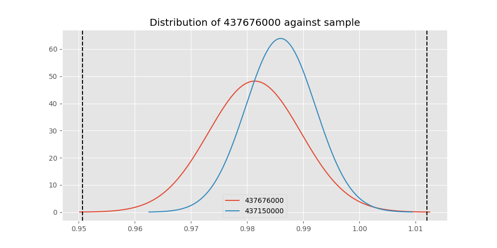 
## Testing Results for 437676000 against 435635000 
437676000 has a success rate of 0.9813432835820896
435635000 has a success rate of 0.9849624060150376
$H_{0}$: There is not a difference between 437676000 and 435635000
$H_{A}$: There is a difference between 437676000 and 435635000
An $/alpha$ of 0.00025 was used in this test.
__independent t-testing__: With a t-statistic of -0.25990974965899344 and a p-value of 0.7950674528398175, _we failed to reject the null hypothssis_
__Man-Whitney testing__: With a u-statistic of 17757.5 and a p-value of 0.7962555957195271, _we failed to reject the null hypothssis_
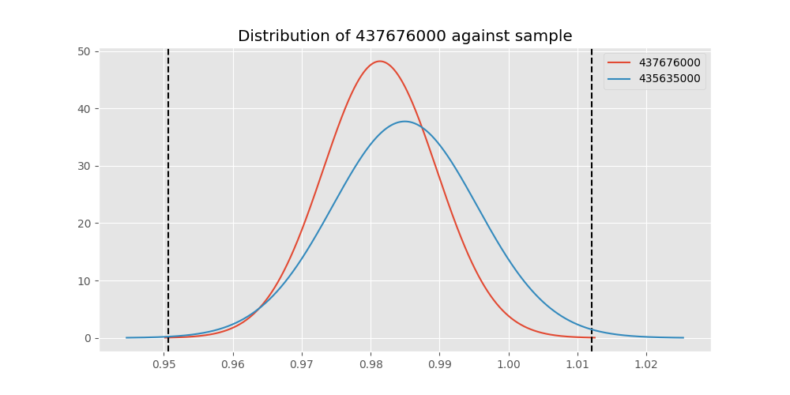 
## Testing Results for 437676000 against 437384000 
437676000 has a success rate of 0.9813432835820896
437384000 has a success rate of 0.968421052631579
$H_{0}$: There is not a difference between 437676000 and 437384000
$H_{A}$: There is a difference between 437676000 and 437384000
An $/alpha$ of 0.00025 was used in this test.
__independent t-testing__: With a t-statistic of 0.8887709375200059 and a p-value of 0.37459478610949537, _we failed to reject the null hypothssis_
__Man-Whitney testing__: With a u-statistic of 25789.0 and a p-value of 0.37474289466426525, _we failed to reject the null hypothssis_
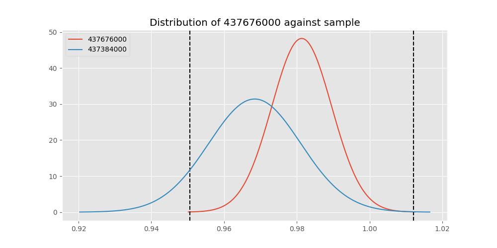 
## Testing Results for 437676000 against 437405000 
437676000 has a success rate of 0.9813432835820896
437405000 has a success rate of 0.9953917050691244
$H_{0}$: There is not a difference between 437676000 and 437405000
$H_{A}$: There is a difference between 437676000 and 437405000
An $/alpha$ of 0.00025 was used in this test.
__independent t-testing__: With a t-statistic of -1.39163040242308 and a p-value of 0.16467489732914006, _we failed to reject the null hypothssis_
__Man-Whitney testing__: With a u-statistic of 28669.5 and a p-value of 0.16495924951740537, _we failed to reject the null hypothssis_
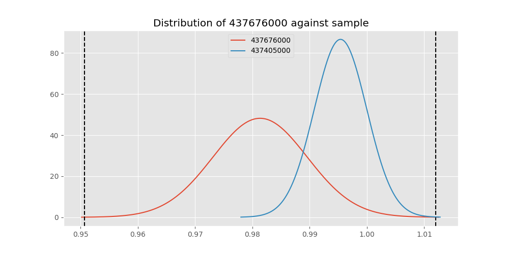 
## Testing Results for 437676000 against 435612500 
437676000 has a success rate of 0.9813432835820896
435612500 has a success rate of 0.9770114942528736
$H_{0}$: There is not a difference between 437676000 and 435612500
$H_{A}$: There is a difference between 437676000 and 435612500
An $/alpha$ of 0.00025 was used in this test.
__independent t-testing__: With a t-statistic of 0.25181527157881123 and a p-value of 0.8013303929756416, _we failed to reject the null hypothssis_
__Man-Whitney testing__: With a u-statistic of 11708.5 and a p-value of 0.8028560740563389, _we failed to reject the null hypothssis_
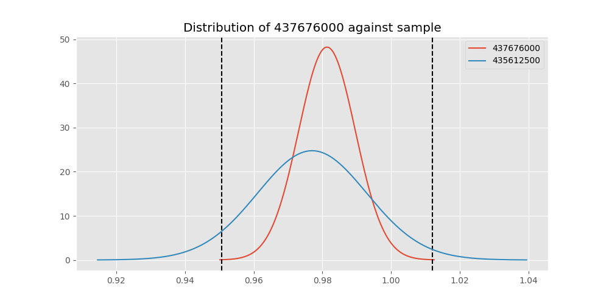 
## Testing Results for 437676000 against 435975000 
437676000 has a success rate of 0.9813432835820896
435975000 has a success rate of 0.92
$H_{0}$: There is not a difference between 437676000 and 435975000
$H_{A}$: There is a difference between 437676000 and 435975000
An $/alpha$ of 0.00025 was used in this test.
__independent t-testing__: With a t-statistic of 2.415660175174479 and a p-value of 0.016273667763699075, _we failed to reject the null hypothssis_
__Man-Whitney testing__: With a u-statistic of 7111.0 and a p-value of 0.016641779043538665, _we failed to reject the null hypothssis_
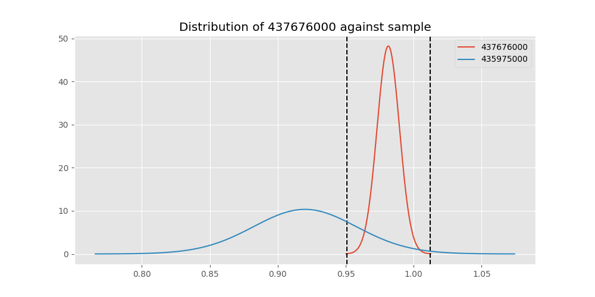 
## Testing Results for 437676000 against 437425000 
437676000 has a success rate of 0.9813432835820896
437425000 has a success rate of 0.6987654320987654
$H_{0}$: There is not a difference between 437676000 and 437425000
$H_{A}$: There is a difference between 437676000 and 437425000
An $/alpha$ of 0.00025 was used in this test.
__independent t-testing__: With a t-statistic of 9.79014669115266 and a p-value of 3.0283791644321327e-21, _we **reject** the null hypothssis_
__Man-Whitney testing__: With a u-statistic of 69605.5 and a p-value of 4.9810834837111866e-20, _we **reject** the null hypothssis_
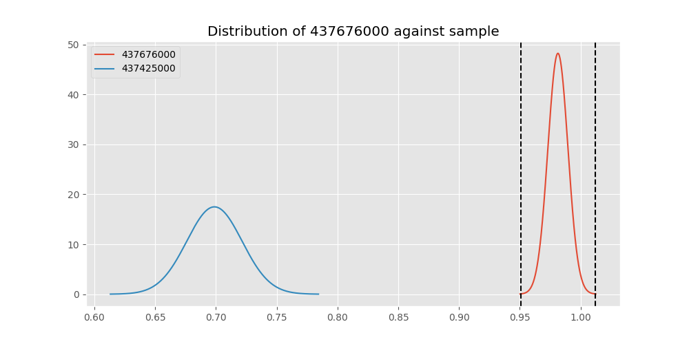 
## Testing Results for 437676000 against 437275000 
437676000 has a success rate of 0.9813432835820896
437275000 has a success rate of 0.3643724696356275
$H_{0}$: There is not a difference between 437676000 and 437275000
$H_{A}$: There is a difference between 437676000 and 437275000
An $/alpha$ of 0.00025 was used in this test.
__independent t-testing__: With a t-statistic of 20.102201876862747 and a p-value of 1.0208737933073206e-66, _we **reject** the null hypothssis_
__Man-Whitney testing__: With a u-statistic of 53518.5 and a p-value of 3.5069113000176256e-51, _we **reject** the null hypothssis_
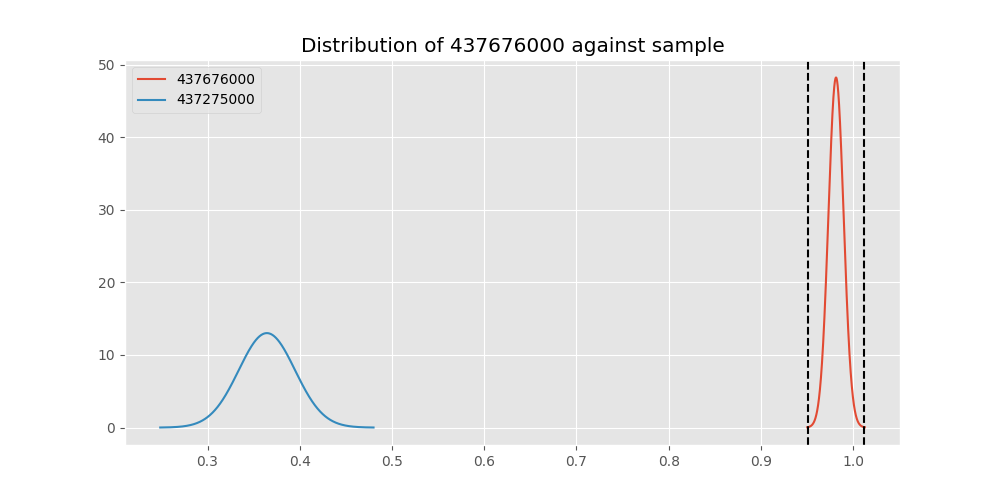 
## Testing Results for 437676000 against 145840000 
437676000 has a success rate of 0.9813432835820896
145840000 has a success rate of 0.9649122807017544
$H_{0}$: There is not a difference between 437676000 and 145840000
$H_{A}$: There is a difference between 437676000 and 145840000
An $/alpha$ of 0.00025 was used in this test.
__independent t-testing__: With a t-statistic of 0.774301796008737 and a p-value of 0.4393187358510573, _we failed to reject the null hypothssis_
__Man-Whitney testing__: With a u-statistic of 7763.5 and a p-value of 0.44029570063747836, _we failed to reject the null hypothssis_
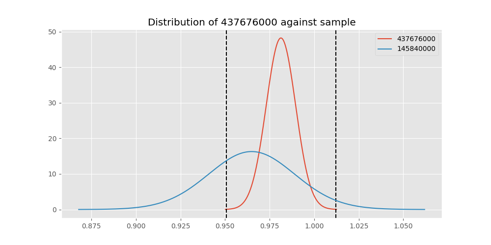 
## Testing Results for 437676000 against 435525000 
437676000 has a success rate of 0.9813432835820896
435525000 has a success rate of 0.6923076923076923
$H_{0}$: There is not a difference between 437676000 and 435525000
$H_{A}$: There is a difference between 437676000 and 435525000
An $/alpha$ of 0.00025 was used in this test.
__independent t-testing__: With a t-statistic of 9.491189995189314 and a p-value of 1.9232921394972103e-19, _we **reject** the null hypothssis_
__Man-Whitney testing__: With a u-statistic of 24700.5 and a p-value of 7.850535103348588e-18, _we **reject** the null hypothssis_
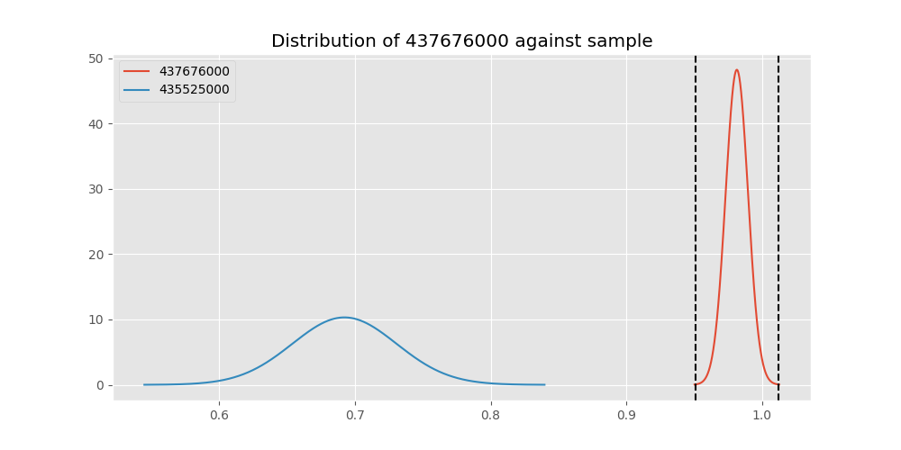 
## Testing Results for 437676000 against 436250000 
437676000 has a success rate of 0.9813432835820896
436250000 has a success rate of 0.17857142857142858
$H_{0}$: There is not a difference between 437676000 and 436250000
$H_{A}$: There is a difference between 437676000 and 436250000
An $/alpha$ of 0.00025 was used in this test.
__independent t-testing__: With a t-statistic of 27.06608716146578 and a p-value of 5.965552807045163e-85, _we **reject** the null hypothssis_
__Man-Whitney testing__: With a u-statistic of 13528.0 and a p-value of 1.023262638556568e-50, _we **reject** the null hypothssis_
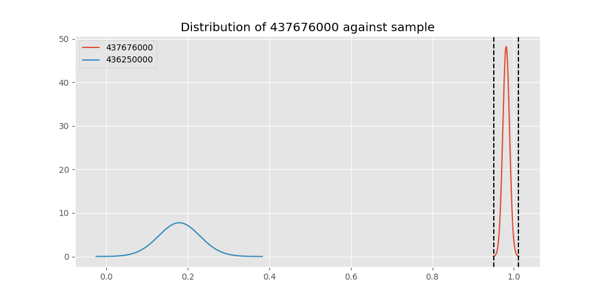 
## Testing Results for 437676000 against 435950000 
437676000 has a success rate of 0.9813432835820896
435950000 has a success rate of 0.9850187265917603
$H_{0}$: There is not a difference between 437676000 and 435950000
$H_{A}$: There is a difference between 437676000 and 435950000
An $/alpha$ of 0.00025 was used in this test.
__independent t-testing__: With a t-statistic of -0.3883501408973127 and a p-value of 0.6978602582524045, _we failed to reject the null hypothssis_
__Man-Whitney testing__: With a u-statistic of 71293.0 and a p-value of 0.6981511232756401, _we failed to reject the null hypothssis_
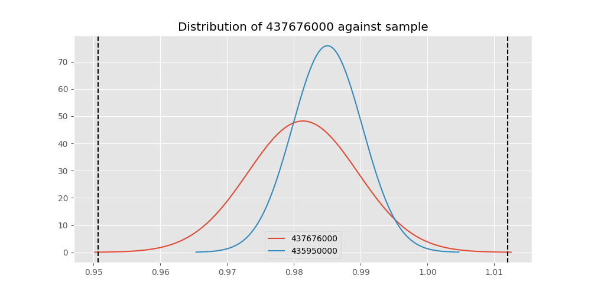 
## Testing Results for 437676000 against 435800000 
437676000 has a success rate of 0.9813432835820896
435800000 has a success rate of 0.5390070921985816
$H_{0}$: There is not a difference between 437676000 and 435800000
$H_{A}$: There is a difference between 437676000 and 435800000
An $/alpha$ of 0.00025 was used in this test.
__independent t-testing__: With a t-statistic of 13.572164349958534 and a p-value of 7.107909242667719e-35, _we **reject** the null hypothssis_
__Man-Whitney testing__: With a u-statistic of 27251.5 and a p-value of 1.7602682186216295e-29, _we **reject** the null hypothssis_
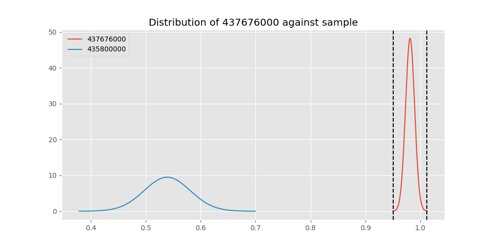 
## Testing Results for 437676000 against 437485000 
437676000 has a success rate of 0.9813432835820896
437485000 has a success rate of 0.9375
$H_{0}$: There is not a difference between 437676000 and 437485000
$H_{A}$: There is a difference between 437676000 and 437485000
An $/alpha$ of 0.00025 was used in this test.
__independent t-testing__: With a t-statistic of 1.553900300524669 and a p-value of 0.12126954963294727, _we failed to reject the null hypothssis_
__Man-Whitney testing__: With a u-statistic of 4476.0 and a p-value of 0.12207692406046301, _we failed to reject the null hypothssis_
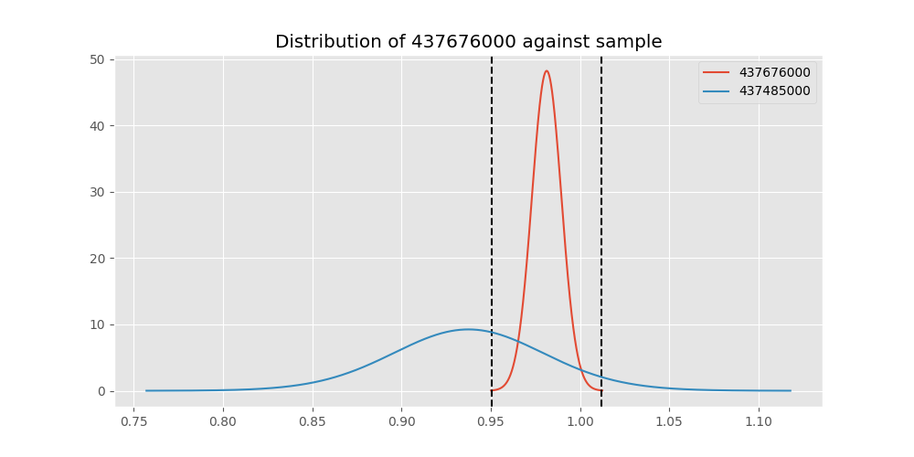 
## Testing Results for 437676000 against 136770000 
437676000 has a success rate of 0.9813432835820896
136770000 has a success rate of 0.9945945945945946
$H_{0}$: There is not a difference between 437676000 and 136770000
$H_{A}$: There is a difference between 437676000 and 136770000
An $/alpha$ of 0.00025 was used in this test.
__independent t-testing__: With a t-statistic of -1.2119285779557696 and a p-value of 0.22617426688106818, _we failed to reject the null hypothssis_
__Man-Whitney testing__: With a u-statistic of 24461.5 and a p-value of 0.22648734673815607, _we failed to reject the null hypothssis_
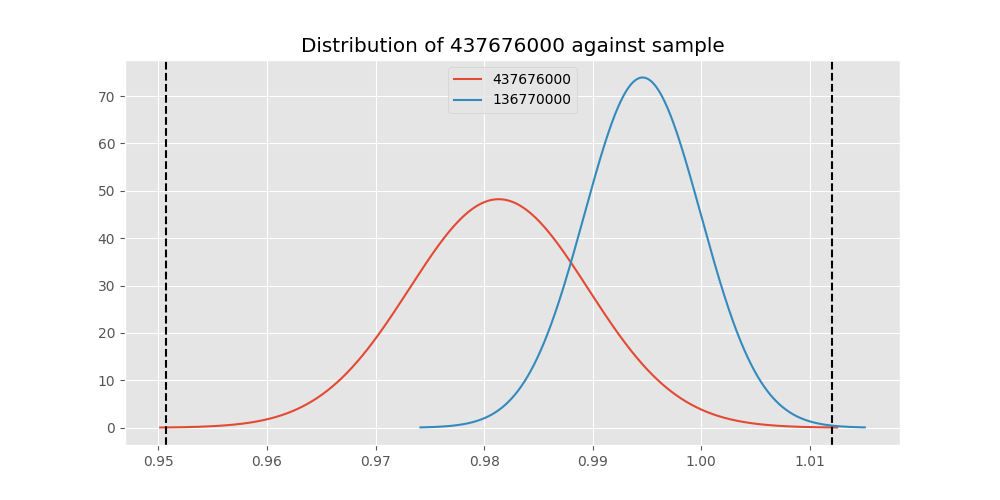 
## Testing Results for 437676000 against 437250000 
437676000 has a success rate of 0.9813432835820896
437250000 has a success rate of 0.9937106918238994
$H_{0}$: There is not a difference between 437676000 and 437250000
$H_{A}$: There is a difference between 437676000 and 437250000
An $/alpha$ of 0.00025 was used in this test.
__independent t-testing__: With a t-statistic of -1.3727052334940688 and a p-value of 0.17037090147921508, _we failed to reject the null hypothssis_
__Man-Whitney testing__: With a u-statistic of 42085.0 and a p-value of 0.17057221675565293, _we failed to reject the null hypothssis_
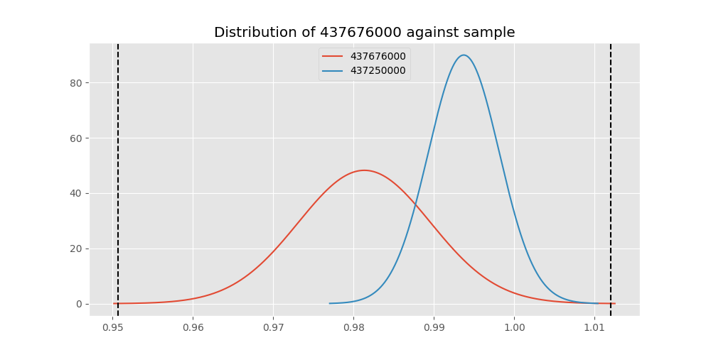 
## Testing Results for 437676000 against 437356000 
437676000 has a success rate of 0.9813432835820896
437356000 has a success rate of 0.9328358208955224
$H_{0}$: There is not a difference between 437676000 and 437356000
$H_{A}$: There is a difference between 437676000 and 437356000
An $/alpha$ of 0.00025 was used in this test.
__independent t-testing__: With a t-statistic of 2.514102347247564 and a p-value of 0.01232527455664886, _we failed to reject the null hypothssis_
__Man-Whitney testing__: With a u-statistic of 18827.0 and a p-value of 0.012554827597632878, _we failed to reject the null hypothssis_
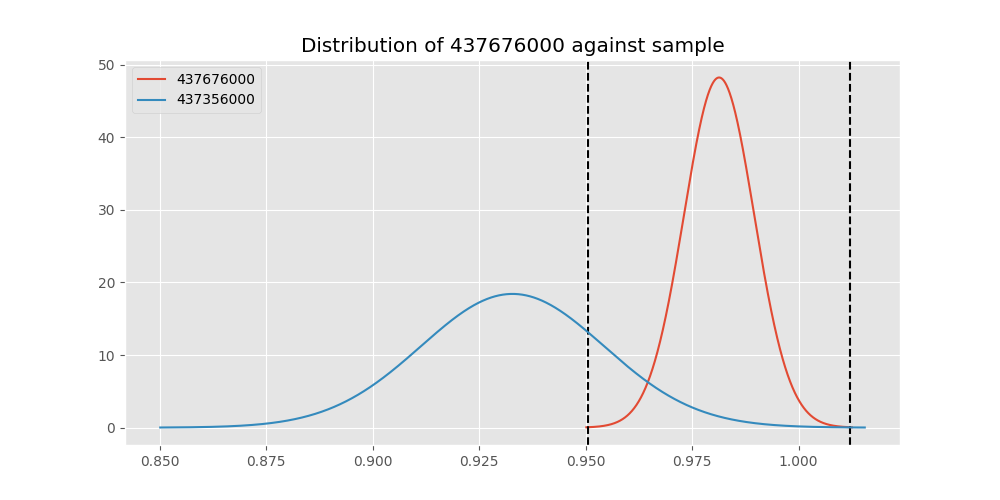 
## Testing Results for 437676000 against 145826800 
437676000 has a success rate of 0.9813432835820896
145826800 has a success rate of 0.966183574879227
$H_{0}$: There is not a difference between 437676000 and 145826800
$H_{A}$: There is a difference between 437676000 and 145826800
An $/alpha$ of 0.00025 was used in this test.
__independent t-testing__: With a t-statistic of 1.043017840000557 and a p-value of 0.29747281314990137, _we failed to reject the null hypothssis_
__Man-Whitney testing__: With a u-statistic of 28158.5 and a p-value of 0.297559572060782, _we failed to reject the null hypothssis_
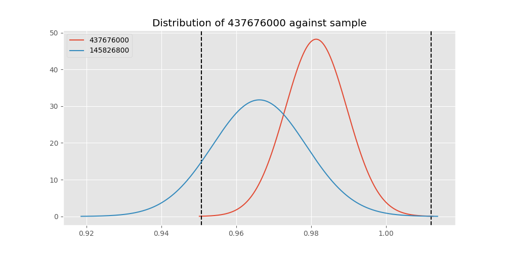 
