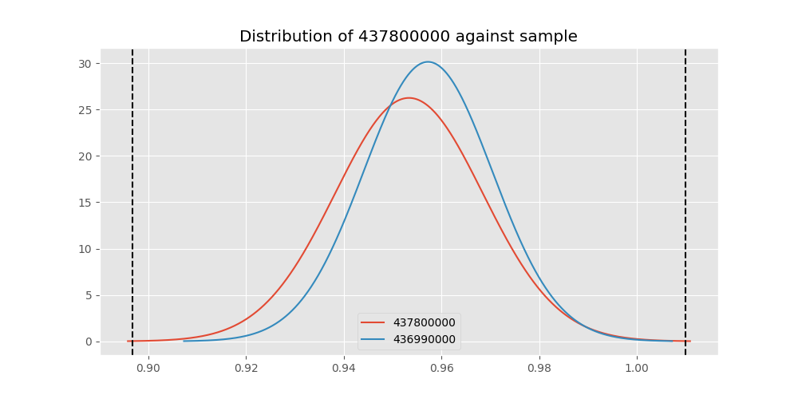
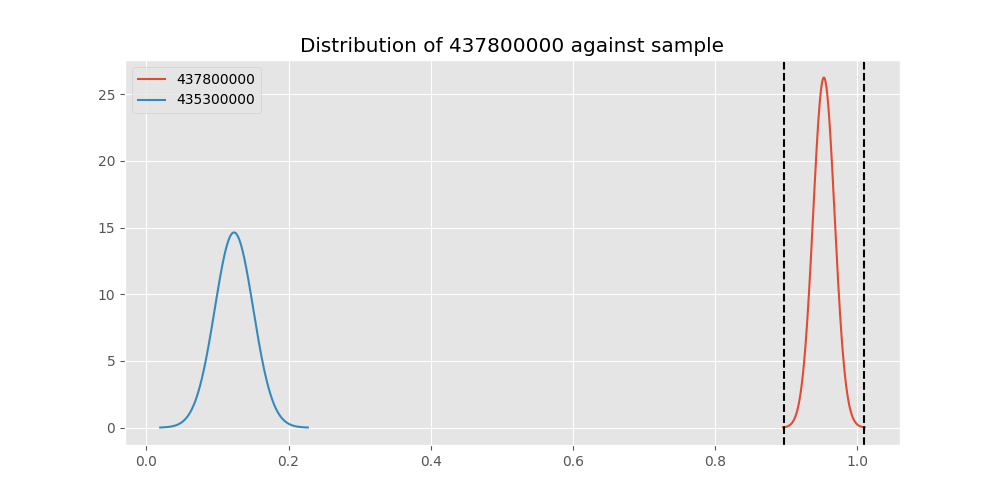
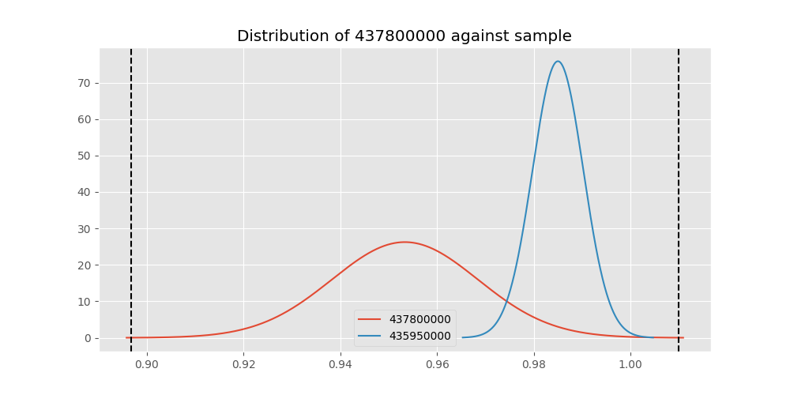

# Testing Results For 437800000 
$H_{0}$: There is not a difference in collection success against 437800000 
$H_{A}$: There is a difference in collection success against 437800000
An $\alpha$ of 0.00025 was used 
Out of 44 tests, there were 12 rejections from 44 independent-t test.
Out of 44 tests, there were 13 rejections from 44 Man Whitney u-tests.
## Testing Results for 437800000 against 436501000 
437800000 has a success rate of 0.9533678756476683
436501000 has a success rate of 0.9854014598540146
$H_{0}$: There is not a difference between 437800000 and 436501000
$H_{A}$: There is a difference between 437800000 and 436501000
An $/alpha$ of 0.00025 was used in this test.
__independent t-testing__: With a t-statistic of -1.598730537585604 and a p-value of 0.11084330275299382, _we failed to reject the null hypothssis_
__Man-Whitney testing__: With a u-statistic of 12797.0 and a p-value of 0.11114215948561354, _we failed to reject the null hypothssis_
 
## Testing Results for 437800000 against 437375000 
437800000 has a success rate of 0.9533678756476683
437375000 has a success rate of 0.9982014388489209
$H_{0}$: There is not a difference between 437800000 and 437375000
$H_{A}$: There is a difference between 437800000 and 437375000
An $/alpha$ of 0.00025 was used in this test.
__independent t-testing__: With a t-statistic of -2.925960068680122 and a p-value of 0.00383643682712692, _we failed to reject the null hypothssis_
__Man-Whitney testing__: With a u-statistic of 51248.5 and a p-value of 2.9898848212778703e-06, _we **reject** the null hypothssis_
 
## Testing Results for 437800000 against 436500000 
437800000 has a success rate of 0.9533678756476683
436500000 has a success rate of 0.9056603773584906
$H_{0}$: There is not a difference between 437800000 and 436500000
$H_{A}$: There is a difference between 437800000 and 436500000
An $/alpha$ of 0.00025 was used in this test.
__independent t-testing__: With a t-statistic of 1.7700704880880325 and a p-value of 0.0775859365825296, _we failed to reject the null hypothssis_
__Man-Whitney testing__: With a u-statistic of 16075.5 and a p-value of 0.07781437650640129, _we failed to reject the null hypothssis_
 
## Testing Results for 437800000 against 436990000 
437800000 has a success rate of 0.9533678756476683
436990000 has a success rate of 0.9572649572649573
$H_{0}$: There is not a difference between 437800000 and 436990000
$H_{A}$: There is a difference between 437800000 and 436990000
An $/alpha$ of 0.00025 was used in this test.
__independent t-testing__: With a t-statistic of -0.1939245897448882 and a p-value of 0.8463275822429899, _we failed to reject the null hypothssis_
__Man-Whitney testing__: With a u-statistic of 22493.0 and a p-value of 0.8469269197243706, _we failed to reject the null hypothssis_
 
## Testing Results for 437800000 against 145875000 
437800000 has a success rate of 0.9533678756476683
145875000 has a success rate of 0.9722222222222222
$H_{0}$: There is not a difference between 437800000 and 145875000
$H_{A}$: There is a difference between 437800000 and 145875000
An $/alpha$ of 0.00025 was used in this test.
__independent t-testing__: With a t-statistic of -0.6825041896570153 and a p-value of 0.4955208841476869, _we failed to reject the null hypothssis_
__Man-Whitney testing__: With a u-statistic of 6817.0 and a p-value of 0.49613214300366404, _we failed to reject the null hypothssis_
 
## Testing Results for 437800000 against 145810000 
437800000 has a success rate of 0.9533678756476683
145810000 has a success rate of 0.12179487179487179
$H_{0}$: There is not a difference between 437800000 and 145810000
$H_{A}$: There is a difference between 437800000 and 145810000
An $/alpha$ of 0.00025 was used in this test.
__independent t-testing__: With a t-statistic of 28.623538644948944 and a p-value of 2.305426006447346e-93, _we **reject** the null hypothssis_
__Man-Whitney testing__: With a u-statistic of 27572.5 and a p-value of 4.225524167952947e-55, _we **reject** the null hypothssis_
 
## Testing Results for 437800000 against 437095000 
437800000 has a success rate of 0.9533678756476683
437095000 has a success rate of 0.9361702127659575
$H_{0}$: There is not a difference between 437800000 and 437095000
$H_{A}$: There is a difference between 437800000 and 437095000
An $/alpha$ of 0.00025 was used in this test.
__independent t-testing__: With a t-statistic of 0.48332635715669214 and a p-value of 0.6293083666338393, _we failed to reject the null hypothssis_
__Man-Whitney testing__: With a u-statistic of 4613.5 and a p-value of 0.6305165441610572, _we failed to reject the null hypothssis_
 
## Testing Results for 437800000 against 437265000 
437800000 has a success rate of 0.9533678756476683
437265000 has a success rate of 0.9795454545454545
$H_{0}$: There is not a difference between 437800000 and 437265000
$H_{A}$: There is a difference between 437800000 and 437265000
An $/alpha$ of 0.00025 was used in this test.
__independent t-testing__: With a t-statistic of -1.8260802074844127 and a p-value of 0.06831058536237908, _we failed to reject the null hypothssis_
__Man-Whitney testing__: With a u-statistic of 41348.5 and a p-value of 0.06847063480912391, _we failed to reject the null hypothssis_
 
## Testing Results for 437800000 against 437350000 
437800000 has a success rate of 0.9533678756476683
437350000 has a success rate of 0.9488372093023256
$H_{0}$: There is not a difference between 437800000 and 437350000
$H_{A}$: There is a difference between 437800000 and 437350000
An $/alpha$ of 0.00025 was used in this test.
__independent t-testing__: With a t-statistic of 0.2111134763045253 and a p-value of 0.832904647713378, _we failed to reject the null hypothssis_
__Man-Whitney testing__: With a u-statistic of 20841.5 and a p-value of 0.833482357167252, _we failed to reject the null hypothssis_
 
## Testing Results for 437800000 against 437200000 
437800000 has a success rate of 0.9533678756476683
437200000 has a success rate of 0.8620689655172413
$H_{0}$: There is not a difference between 437800000 and 437200000
$H_{A}$: There is a difference between 437800000 and 437200000
An $/alpha$ of 0.00025 was used in this test.
__independent t-testing__: With a t-statistic of 3.151358452888868 and a p-value of 0.001749345367352633, _we failed to reject the null hypothssis_
__Man-Whitney testing__: With a u-statistic of 21378.0 and a p-value of 0.0018366219343093834, _we failed to reject the null hypothssis_
 
## Testing Results for 437800000 against 435600000 
437800000 has a success rate of 0.9533678756476683
435600000 has a success rate of 0.9819341126461212
$H_{0}$: There is not a difference between 437800000 and 435600000
$H_{A}$: There is a difference between 437800000 and 435600000
An $/alpha$ of 0.00025 was used in this test.
__independent t-testing__: With a t-statistic of -2.4194304897189287 and a p-value of 0.015701626377131815, _we failed to reject the null hypothssis_
__Man-Whitney testing__: With a u-statistic of 88212.5 and a p-value of 0.015787149616796562, _we failed to reject the null hypothssis_
 
## Testing Results for 437800000 against 450000000 
437800000 has a success rate of 0.9533678756476683
450000000 has a success rate of 0.8235294117647058
$H_{0}$: There is not a difference between 437800000 and 450000000
$H_{A}$: There is a difference between 437800000 and 450000000
An $/alpha$ of 0.00025 was used in this test.
__independent t-testing__: With a t-statistic of 3.6216399963991277 and a p-value of 0.0003482820801226721, _we failed to reject the null hypothssis_
__Man-Whitney testing__: With a u-statistic of 9267.5 and a p-value of 0.0003951892792964149, _we failed to reject the null hypothssis_
 
## Testing Results for 437800000 against 145978500 
437800000 has a success rate of 0.9533678756476683
145978500 has a success rate of 0.9963636363636363
$H_{0}$: There is not a difference between 437800000 and 145978500
$H_{A}$: There is a difference between 437800000 and 145978500
An $/alpha$ of 0.00025 was used in this test.
__independent t-testing__: With a t-statistic of -2.748171927280308 and a p-value of 0.006504258279153796, _we failed to reject the null hypothssis_
__Man-Whitney testing__: With a u-statistic of 25396.5 and a p-value of 0.0015690861163121543, _we failed to reject the null hypothssis_
 
## Testing Results for 437800000 against 437050000 
437800000 has a success rate of 0.9533678756476683
437050000 has a success rate of 0.5346534653465347
$H_{0}$: There is not a difference between 437800000 and 437050000
$H_{A}$: There is a difference between 437800000 and 437050000
An $/alpha$ of 0.00025 was used in this test.
__independent t-testing__: With a t-statistic of 10.034642900734266 and a p-value of 1.493422129139906e-20, _we **reject** the null hypothssis_
__Man-Whitney testing__: With a u-statistic of 13827.5 and a p-value of 4.447010313932033e-18, _we **reject** the null hypothssis_
 
## Testing Results for 437800000 against 435300000 
437800000 has a success rate of 0.9533678756476683
435300000 has a success rate of 0.1232876712328767
$H_{0}$: There is not a difference between 437800000 and 435300000
$H_{A}$: There is a difference between 437800000 and 435300000
An $/alpha$ of 0.00025 was used in this test.
__independent t-testing__: With a t-statistic of 28.147608451924608 and a p-value of 1.6682979337795189e-90, _we **reject** the null hypothssis_
__Man-Whitney testing__: With a u-statistic of 25784.0 and a p-value of 1.674608970569168e-53, _we **reject** the null hypothssis_
 
## Testing Results for 437800000 against 437475000 
437800000 has a success rate of 0.9533678756476683
437475000 has a success rate of 0.5045045045045045
$H_{0}$: There is not a difference between 437800000 and 437475000
$H_{A}$: There is a difference between 437800000 and 437475000
An $/alpha$ of 0.00025 was used in this test.
__independent t-testing__: With a t-statistic of 12.08727696357418 and a p-value of 7.626222412405378e-31, _we **reject** the null hypothssis_
__Man-Whitney testing__: With a u-statistic of 77597.5 and a p-value of 1.9513697784284398e-28, _we **reject** the null hypothssis_
 
## Testing Results for 437800000 against 435448000 
437800000 has a success rate of 0.9533678756476683
435448000 has a success rate of 0.975
$H_{0}$: There is not a difference between 437800000 and 435448000
$H_{A}$: There is a difference between 437800000 and 435448000
An $/alpha$ of 0.00025 was used in this test.
__independent t-testing__: With a t-statistic of -0.6122283548886781 and a p-value of 0.5409888423563309, _we failed to reject the null hypothssis_
__Man-Whitney testing__: With a u-statistic of 3776.5 and a p-value of 0.5422699857031441, _we failed to reject the null hypothssis_
 
## Testing Results for 437800000 against 437644000 
437800000 has a success rate of 0.9533678756476683
437644000 has a success rate of 0.9743589743589743
$H_{0}$: There is not a difference between 437800000 and 437644000
$H_{A}$: There is a difference between 437800000 and 437644000
An $/alpha$ of 0.00025 was used in this test.
__independent t-testing__: With a t-statistic of -0.9270184699103811 and a p-value of 0.35464278234492397, _we failed to reject the null hypothssis_
__Man-Whitney testing__: With a u-statistic of 11053.5 and a p-value of 0.3548237526890373, _we failed to reject the null hypothssis_
 
## Testing Results for 437800000 against 145825000 
437800000 has a success rate of 0.9533678756476683
145825000 has a success rate of 0.8687448728465955
$H_{0}$: There is not a difference between 437800000 and 145825000
$H_{A}$: There is a difference between 437800000 and 145825000
An $/alpha$ of 0.00025 was used in this test.
__independent t-testing__: With a t-statistic of 3.427653198116196 and a p-value of 0.0006181854330810669, _we failed to reject the null hypothssis_
__Man-Whitney testing__: With a u-statistic of 255176.0 and a p-value of 0.0006248677049287, _we failed to reject the null hypothssis_
 
## Testing Results for 437800000 against 437345000 
437800000 has a success rate of 0.9533678756476683
437345000 has a success rate of 0.7603092783505154
$H_{0}$: There is not a difference between 437800000 and 437345000
$H_{A}$: There is a difference between 437800000 and 437345000
An $/alpha$ of 0.00025 was used in this test.
__independent t-testing__: With a t-statistic of 5.922815538693704 and a p-value of 5.4300442664562915e-09, _we **reject** the null hypothssis_
__Man-Whitney testing__: With a u-statistic of 44670.5 and a p-value of 8.627248520543909e-09, _we **reject** the null hypothssis_
 
## Testing Results for 437800000 against 435275000 
437800000 has a success rate of 0.9533678756476683
435275000 has a success rate of 0.9152542372881356
$H_{0}$: There is not a difference between 437800000 and 435275000
$H_{A}$: There is a difference between 437800000 and 435275000
An $/alpha$ of 0.00025 was used in this test.
__independent t-testing__: With a t-statistic of 1.3614754110224763 and a p-value of 0.17435539391309715, _we failed to reject the null hypothssis_
__Man-Whitney testing__: With a u-statistic of 11821.0 and a p-value of 0.1744514900408004, _we failed to reject the null hypothssis_
 
## Testing Results for 437800000 against 437322500 
437800000 has a success rate of 0.9533678756476683
437322500 has a success rate of 0.9961685823754789
$H_{0}$: There is not a difference between 437800000 and 437322500
$H_{A}$: There is a difference between 437800000 and 437322500
An $/alpha$ of 0.00025 was used in this test.
__independent t-testing__: With a t-statistic of -2.7276008006438865 and a p-value of 0.006903188914472885, _we failed to reject the null hypothssis_
__Man-Whitney testing__: With a u-statistic of 24108.5 and a p-value of 0.0021625867279894437, _we failed to reject the null hypothssis_
 
## Testing Results for 437800000 against 437450000 
437800000 has a success rate of 0.9533678756476683
437450000 has a success rate of 0.6947791164658634
$H_{0}$: There is not a difference between 437800000 and 437450000
$H_{A}$: There is a difference between 437800000 and 437450000
An $/alpha$ of 0.00025 was used in this test.
__independent t-testing__: With a t-statistic of 7.219003727688742 and a p-value of 2.3158781689582613e-12, _we **reject** the null hypothssis_
__Man-Whitney testing__: With a u-statistic of 30242.0 and a p-value of 8.299903236846223e-12, _we **reject** the null hypothssis_
 
## Testing Results for 437800000 against 436703000 
437800000 has a success rate of 0.9533678756476683
436703000 has a success rate of 0.9859154929577465
$H_{0}$: There is not a difference between 437800000 and 436703000
$H_{A}$: There is a difference between 437800000 and 436703000
An $/alpha$ of 0.00025 was used in this test.
__independent t-testing__: With a t-statistic of -1.9379785958664617 and a p-value of 0.05332225596552745, _we failed to reject the null hypothssis_
__Man-Whitney testing__: With a u-statistic of 19885.5 and a p-value of 0.053609910497691385, _we failed to reject the null hypothssis_
 
## Testing Results for 437800000 against 400500000 
437800000 has a success rate of 0.9533678756476683
400500000 has a success rate of 0.3508771929824561
$H_{0}$: There is not a difference between 437800000 and 400500000
$H_{A}$: There is a difference between 437800000 and 400500000
An $/alpha$ of 0.00025 was used in this test.
__independent t-testing__: With a t-statistic of 13.554078863653285 and a p-value of 1.0846647088151524e-31, _we **reject** the null hypothssis_
__Man-Whitney testing__: With a u-statistic of 8814.5 and a p-value of 7.644140231454996e-25, _we **reject** the null hypothssis_
 
## Testing Results for 437800000 against 437150000 
437800000 has a success rate of 0.9533678756476683
437150000 has a success rate of 0.9859550561797753
$H_{0}$: There is not a difference between 437800000 and 437150000
$H_{A}$: There is a difference between 437800000 and 437150000
An $/alpha$ of 0.00025 was used in this test.
__independent t-testing__: With a t-statistic of -2.3196842386559466 and a p-value of 0.02072521426532442, _we failed to reject the null hypothssis_
__Man-Whitney testing__: With a u-statistic of 33234.5 and a p-value of 0.02091943828407168, _we failed to reject the null hypothssis_
 
## Testing Results for 437800000 against 435635000 
437800000 has a success rate of 0.9533678756476683
435635000 has a success rate of 0.9849624060150376
$H_{0}$: There is not a difference between 437800000 and 435635000
$H_{A}$: There is a difference between 437800000 and 435635000
An $/alpha$ of 0.00025 was used in this test.
__independent t-testing__: With a t-statistic of -1.5536350249024022 and a p-value of 0.12124772303332707, _we failed to reject the null hypothssis_
__Man-Whitney testing__: With a u-statistic of 12429.0 and a p-value of 0.12153679430048642, _we failed to reject the null hypothssis_
 
## Testing Results for 437800000 against 437384000 
437800000 has a success rate of 0.9533678756476683
437384000 has a success rate of 0.968421052631579
$H_{0}$: There is not a difference between 437800000 and 437384000
$H_{A}$: There is a difference between 437800000 and 437384000
An $/alpha$ of 0.00025 was used in this test.
__independent t-testing__: With a t-statistic of -0.7578856665412891 and a p-value of 0.44898793646599233, _we failed to reject the null hypothssis_
__Man-Whitney testing__: With a u-statistic of 18059.0 and a p-value of 0.4490891192676185, _we failed to reject the null hypothssis_
 
## Testing Results for 437800000 against 437405000 
437800000 has a success rate of 0.9533678756476683
437405000 has a success rate of 0.9953917050691244
$H_{0}$: There is not a difference between 437800000 and 437405000
$H_{A}$: There is a difference between 437800000 and 437405000
An $/alpha$ of 0.00025 was used in this test.
__independent t-testing__: With a t-statistic of -2.643132440045666 and a p-value of 0.008786230833915316, _we failed to reject the null hypothssis_
__Man-Whitney testing__: With a u-statistic of 20060.5 and a p-value of 0.005987645392832727, _we failed to reject the null hypothssis_
 
## Testing Results for 437800000 against 435612500 
437800000 has a success rate of 0.9533678756476683
435612500 has a success rate of 0.9770114942528736
$H_{0}$: There is not a difference between 437800000 and 435612500
$H_{A}$: There is a difference between 437800000 and 435612500
An $/alpha$ of 0.00025 was used in this test.
__independent t-testing__: With a t-statistic of -0.9405720496726161 and a p-value of 0.3477407646713968, _we failed to reject the null hypothssis_
__Man-Whitney testing__: With a u-statistic of 8197.0 and a p-value of 0.34804052314037637, _we failed to reject the null hypothssis_
 
## Testing Results for 437800000 against 435975000 
437800000 has a success rate of 0.9533678756476683
435975000 has a success rate of 0.92
$H_{0}$: There is not a difference between 437800000 and 435975000
$H_{A}$: There is a difference between 437800000 and 435975000
An $/alpha$ of 0.00025 was used in this test.
__independent t-testing__: With a t-statistic of 0.9322810534098369 and a p-value of 0.3521243177907466, _we failed to reject the null hypothssis_
__Man-Whitney testing__: With a u-statistic of 4986.0 and a p-value of 0.3525589924902711, _we failed to reject the null hypothssis_
 
## Testing Results for 437800000 against 437425000 
437800000 has a success rate of 0.9533678756476683
437425000 has a success rate of 0.6987654320987654
$H_{0}$: There is not a difference between 437800000 and 437425000
$H_{A}$: There is a difference between 437800000 and 437425000
An $/alpha$ of 0.00025 was used in this test.
__independent t-testing__: With a t-statistic of 7.3361993211835 and a p-value of 7.218448217339174e-13, _we **reject** the null hypothssis_
__Man-Whitney testing__: With a u-statistic of 49033.0 and a p-value of 2.0451450769233763e-12, _we **reject** the null hypothssis_
 
## Testing Results for 437800000 against 437275000 
437800000 has a success rate of 0.9533678756476683
437275000 has a success rate of 0.3643724696356275
$H_{0}$: There is not a difference between 437800000 and 437275000
$H_{A}$: There is a difference between 437800000 and 437275000
An $/alpha$ of 0.00025 was used in this test.
__independent t-testing__: With a t-statistic of 15.819050489093211 and a p-value of 6.552372629805284e-45, _we **reject** the null hypothssis_
__Man-Whitney testing__: With a u-statistic of 37874.5 and a p-value of 1.3785683454529459e-36, _we **reject** the null hypothssis_
 
## Testing Results for 437800000 against 145840000 
437800000 has a success rate of 0.9533678756476683
145840000 has a success rate of 0.9649122807017544
$H_{0}$: There is not a difference between 437800000 and 145840000
$H_{A}$: There is a difference between 437800000 and 145840000
An $/alpha$ of 0.00025 was used in this test.
__independent t-testing__: With a t-statistic of -0.3719968979245999 and a p-value of 0.7102128175938434, _we failed to reject the null hypothssis_
__Man-Whitney testing__: With a u-statistic of 5437.0 and a p-value of 0.7116000735205827, _we failed to reject the null hypothssis_
 
## Testing Results for 437800000 against 435525000 
437800000 has a success rate of 0.9533678756476683
435525000 has a success rate of 0.6923076923076923
$H_{0}$: There is not a difference between 437800000 and 435525000
$H_{A}$: There is a difference between 437800000 and 435525000
An $/alpha$ of 0.00025 was used in this test.
__independent t-testing__: With a t-statistic of 6.920312654683008 and a p-value of 2.3111198482690556e-11, _we **reject** the null hypothssis_
__Man-Whitney testing__: With a u-statistic of 17402.0 and a p-value of 9.133088403819401e-11, _we **reject** the null hypothssis_
 
## Testing Results for 437800000 against 436250000 
437800000 has a success rate of 0.9533678756476683
436250000 has a success rate of 0.17857142857142858
$H_{0}$: There is not a difference between 437800000 and 436250000
$H_{A}$: There is a difference between 437800000 and 436250000
An $/alpha$ of 0.00025 was used in this test.
__independent t-testing__: With a t-statistic of 19.57601564092731 and a p-value of 3.739496718354651e-52, _we **reject** the null hypothssis_
__Man-Whitney testing__: With a u-statistic of 9591.0 and a p-value of 1.1789092235429195e-34, _we **reject** the null hypothssis_
 
## Testing Results for 437800000 against 435950000 
437800000 has a success rate of 0.9533678756476683
435950000 has a success rate of 0.9850187265917603
$H_{0}$: There is not a difference between 437800000 and 435950000
$H_{A}$: There is a difference between 437800000 and 435950000
An $/alpha$ of 0.00025 was used in this test.
__independent t-testing__: With a t-statistic of -2.5010102897559743 and a p-value of 0.012603485894618337, _we failed to reject the null hypothssis_
__Man-Whitney testing__: With a u-statistic of 49900.0 and a p-value of 0.012729681883990249, _we failed to reject the null hypothssis_
 
## Testing Results for 437800000 against 435800000 
437800000 has a success rate of 0.9533678756476683
435800000 has a success rate of 0.5390070921985816
$H_{0}$: There is not a difference between 437800000 and 435800000
$H_{A}$: There is a difference between 437800000 and 435800000
An $/alpha$ of 0.00025 was used in this test.
__independent t-testing__: With a t-statistic of 10.319077721408965 and a p-value of 7.746742976843639e-22, _we **reject** the null hypothssis_
__Man-Whitney testing__: With a u-statistic of 19244.5 and a p-value of 2.431551536827379e-19, _we **reject** the null hypothssis_
 
## Testing Results for 437800000 against 437485000 
437800000 has a success rate of 0.9533678756476683
437485000 has a success rate of 0.9375
$H_{0}$: There is not a difference between 437800000 and 437485000
$H_{A}$: There is a difference between 437800000 and 437485000
An $/alpha$ of 0.00025 was used in this test.
__independent t-testing__: With a t-statistic of 0.3839415635076174 and a p-value of 0.7013875849764846, _we failed to reject the null hypothssis_
__Man-Whitney testing__: With a u-statistic of 3137.0 and a p-value of 0.7033894413081874, _we failed to reject the null hypothssis_
 
## Testing Results for 437800000 against 136770000 
437800000 has a success rate of 0.9533678756476683
136770000 has a success rate of 0.9945945945945946
$H_{0}$: There is not a difference between 437800000 and 136770000
$H_{A}$: There is a difference between 437800000 and 136770000
An $/alpha$ of 0.00025 was used in this test.
__independent t-testing__: With a t-statistic of -2.5530035466501433 and a p-value of 0.011301084813948686, _we failed to reject the null hypothssis_
__Man-Whitney testing__: With a u-statistic of 17116.5 and a p-value of 0.012713507776454901, _we failed to reject the null hypothssis_
 
## Testing Results for 437800000 against 437250000 
437800000 has a success rate of 0.9533678756476683
437250000 has a success rate of 0.9937106918238994
$H_{0}$: There is not a difference between 437800000 and 437250000
$H_{A}$: There is a difference between 437800000 and 437250000
An $/alpha$ of 0.00025 was used in this test.
__independent t-testing__: With a t-statistic of -2.5450720642874867 and a p-value of 0.01159472269159054, _we failed to reject the null hypothssis_
__Man-Whitney testing__: With a u-statistic of 29449.0 and a p-value of 0.0023486142175666415, _we failed to reject the null hypothssis_
 
## Testing Results for 437800000 against 437356000 
437800000 has a success rate of 0.9533678756476683
437356000 has a success rate of 0.9328358208955224
$H_{0}$: There is not a difference between 437800000 and 437356000
$H_{A}$: There is a difference between 437800000 and 437356000
An $/alpha$ of 0.00025 was used in this test.
__independent t-testing__: With a t-statistic of 0.7989428620563218 and a p-value of 0.424907015941029, _we failed to reject the null hypothssis_
__Man-Whitney testing__: With a u-statistic of 13196.5 and a p-value of 0.4249395498450389, _we failed to reject the null hypothssis_
 
## Testing Results for 437800000 against 437676000 
437800000 has a success rate of 0.9533678756476683
437676000 has a success rate of 0.9813432835820896
$H_{0}$: There is not a difference between 437800000 and 437676000
$H_{A}$: There is a difference between 437800000 and 437676000
An $/alpha$ of 0.00025 was used in this test.
__independent t-testing__: With a t-statistic of -1.7287024257198387 and a p-value of 0.08453481247491243, _we failed to reject the null hypothssis_
__Man-Whitney testing__: With a u-statistic of 25138.5 and a p-value of 0.0847464623411252, _we failed to reject the null hypothssis_
 
## Testing Results for 437800000 against 145826800 
437800000 has a success rate of 0.9533678756476683
145826800 has a success rate of 0.966183574879227
$H_{0}$: There is not a difference between 437800000 and 145826800
$H_{A}$: There is a difference between 437800000 and 145826800
An $/alpha$ of 0.00025 was used in this test.
__independent t-testing__: With a t-statistic of -0.652310092578945 and a p-value of 0.5145777034669898, _we failed to reject the null hypothssis_
__Man-Whitney testing__: With a u-statistic of 19719.5 and a p-value of 0.5147203916020225, _we failed to reject the null hypothssis_
 
