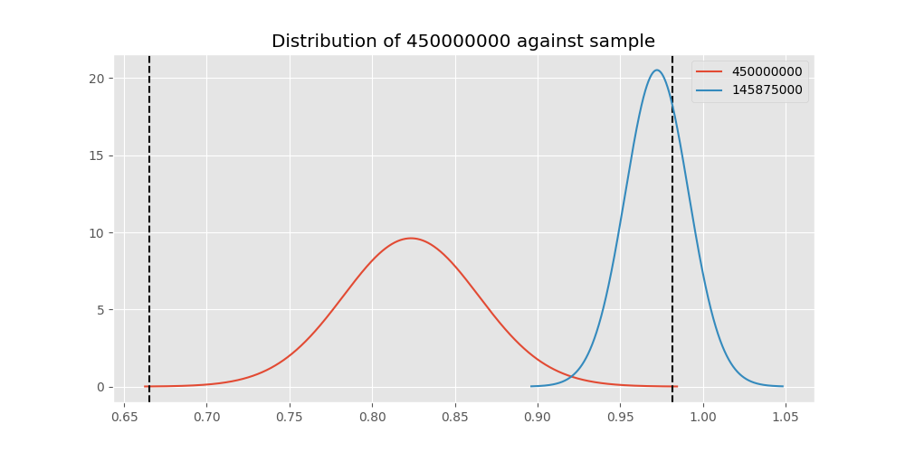
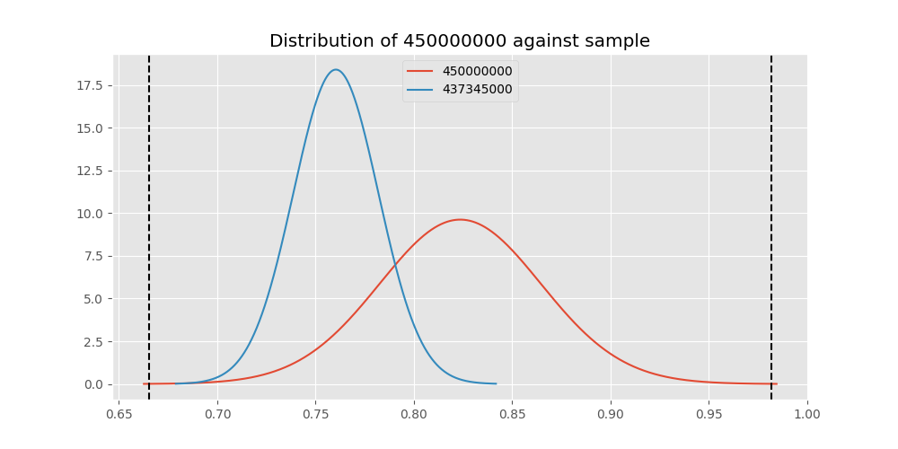

# Testing Results For 450000000 
$H_{0}$: There is not a difference in collection success against 450000000 
$H_{A}$: There is a difference in collection success against 450000000
An $\alpha$ of 0.00025 was used 
Out of 44 tests, there were 18 rejections from 44 independent-t test.
Out of 44 tests, there were 26 rejections from 44 Man Whitney u-tests.
## Testing Results for 450000000 against 436501000 
450000000 has a success rate of 0.8235294117647058
436501000 has a success rate of 0.9854014598540146
$H_{0}$: There is not a difference between 450000000 and 436501000
$H_{A}$: There is a difference between 450000000 and 436501000
An $/alpha$ of 0.00025 was used in this test.
__independent t-testing__: With a t-statistic of -3.7778946035960033 and a p-value of 0.00027674498355536513, _we failed to reject the null hypothssis_
__Man-Whitney testing__: With a u-statistic of 4880.0 and a p-value of 1.100164116294985e-05, _we **reject** the null hypothssis_
 
## Testing Results for 450000000 against 437375000 
450000000 has a success rate of 0.8235294117647058
437375000 has a success rate of 0.9982014388489209
$H_{0}$: There is not a difference between 450000000 and 437375000
$H_{A}$: There is a difference between 450000000 and 437375000
An $/alpha$ of 0.00025 was used in this test.
__independent t-testing__: With a t-statistic of -4.1954799744386015 and a p-value of 6.702441915794066e-05, _we **reject** the null hypothssis_
__Man-Whitney testing__: With a u-statistic of 19502.5 and a p-value of 7.59909553736549e-22, _we **reject** the null hypothssis_
 
## Testing Results for 450000000 against 436500000 
450000000 has a success rate of 0.8235294117647058
436500000 has a success rate of 0.9056603773584906
$H_{0}$: There is not a difference between 450000000 and 436500000
$H_{A}$: There is a difference between 450000000 and 436500000
An $/alpha$ of 0.00025 was used in this test.
__independent t-testing__: With a t-statistic of -1.8670706969009412 and a p-value of 0.06310082870019557, _we failed to reject the null hypothssis_
__Man-Whitney testing__: With a u-statistic of 6202.5 and a p-value of 0.0634650275882648, _we failed to reject the null hypothssis_
 
## Testing Results for 450000000 against 436990000 
450000000 has a success rate of 0.8235294117647058
436990000 has a success rate of 0.9572649572649573
$H_{0}$: There is not a difference between 450000000 and 436990000
$H_{A}$: There is a difference between 450000000 and 436990000
An $/alpha$ of 0.00025 was used in this test.
__independent t-testing__: With a t-statistic of -4.015345156311479 and a p-value of 7.415790137104238e-05, _we **reject** the null hypothssis_
__Man-Whitney testing__: With a u-statistic of 8615.0 and a p-value of 8.793806448208296e-05, _we **reject** the null hypothssis_
 
## Testing Results for 450000000 against 145875000 
450000000 has a success rate of 0.8235294117647058
145875000 has a success rate of 0.9722222222222222
$H_{0}$: There is not a difference between 450000000 and 145875000
$H_{A}$: There is a difference between 450000000 and 145875000
An $/alpha$ of 0.00025 was used in this test.
__independent t-testing__: With a t-statistic of -3.23668270946974 and a p-value of 0.0015691011214920179, _we failed to reject the null hypothssis_
__Man-Whitney testing__: With a u-statistic of 2605.0 and a p-value of 0.002931520023415427, _we failed to reject the null hypothssis_
 
## Testing Results for 450000000 against 437800000 
450000000 has a success rate of 0.8235294117647058
437800000 has a success rate of 0.9533678756476683
$H_{0}$: There is not a difference between 450000000 and 437800000
$H_{A}$: There is a difference between 450000000 and 437800000
An $/alpha$ of 0.00025 was used in this test.
__independent t-testing__: With a t-statistic of -3.6216399963991277 and a p-value of 0.0003482820801226721, _we failed to reject the null hypothssis_
__Man-Whitney testing__: With a u-statistic of 7137.5 and a p-value of 0.0003951892792964149, _we failed to reject the null hypothssis_
 
## Testing Results for 450000000 against 145810000 
450000000 has a success rate of 0.8235294117647058
145810000 has a success rate of 0.12179487179487179
$H_{0}$: There is not a difference between 450000000 and 145810000
$H_{A}$: There is a difference between 450000000 and 145810000
An $/alpha$ of 0.00025 was used in this test.
__independent t-testing__: With a t-statistic of 14.932943540178105 and a p-value of 4.604579768899793e-36, _we **reject** the null hypothssis_
__Man-Whitney testing__: With a u-statistic of 11282.5 and a p-value of 5.211572557890151e-27, _we **reject** the null hypothssis_
 
## Testing Results for 450000000 against 437095000 
450000000 has a success rate of 0.8235294117647058
437095000 has a success rate of 0.9361702127659575
$H_{0}$: There is not a difference between 450000000 and 437095000
$H_{A}$: There is a difference between 450000000 and 437095000
An $/alpha$ of 0.00025 was used in this test.
__independent t-testing__: With a t-statistic of -1.8145479016912403 and a p-value of 0.07189913362050339, _we failed to reject the null hypothssis_
__Man-Whitney testing__: With a u-statistic of 1772.5 and a p-value of 0.07267315010313655, _we failed to reject the null hypothssis_
 
## Testing Results for 450000000 against 437265000 
450000000 has a success rate of 0.8235294117647058
437265000 has a success rate of 0.9795454545454545
$H_{0}$: There is not a difference between 450000000 and 437265000
$H_{A}$: There is a difference between 450000000 and 437265000
An $/alpha$ of 0.00025 was used in this test.
__independent t-testing__: With a t-statistic of -3.7023634425494145 and a p-value of 0.00037096254744507383, _we failed to reject the null hypothssis_
__Man-Whitney testing__: With a u-statistic of 15782.5 and a p-value of 3.0238233946796195e-10, _we **reject** the null hypothssis_
 
## Testing Results for 450000000 against 437350000 
450000000 has a success rate of 0.8235294117647058
437350000 has a success rate of 0.9488372093023256
$H_{0}$: There is not a difference between 450000000 and 437350000
$H_{A}$: There is a difference between 450000000 and 437350000
An $/alpha$ of 0.00025 was used in this test.
__independent t-testing__: With a t-statistic of -3.536557290457308 and a p-value of 0.0004699140860145712, _we failed to reject the null hypothssis_
__Man-Whitney testing__: With a u-statistic of 7992.5 and a p-value of 0.0005226101189041816, _we failed to reject the null hypothssis_
 
## Testing Results for 450000000 against 437200000 
450000000 has a success rate of 0.8235294117647058
437200000 has a success rate of 0.8620689655172413
$H_{0}$: There is not a difference between 450000000 and 437200000
$H_{A}$: There is a difference between 450000000 and 437200000
An $/alpha$ of 0.00025 was used in this test.
__independent t-testing__: With a t-statistic of -0.835139094120445 and a p-value of 0.40433648831829705, _we failed to reject the null hypothssis_
__Man-Whitney testing__: With a u-statistic of 8295.0 and a p-value of 0.40409892966142136, _we failed to reject the null hypothssis_
 
## Testing Results for 450000000 against 435600000 
450000000 has a success rate of 0.8235294117647058
435600000 has a success rate of 0.9819341126461212
$H_{0}$: There is not a difference between 450000000 and 435600000
$H_{A}$: There is a difference between 450000000 and 435600000
An $/alpha$ of 0.00025 was used in this test.
__independent t-testing__: With a t-statistic of -3.787705347758633 and a p-value of 0.00028136018332969954, _we failed to reject the null hypothssis_
__Man-Whitney testing__: With a u-statistic of 33657.5 and a p-value of 8.881583472716339e-16, _we **reject** the null hypothssis_
 
## Testing Results for 450000000 against 145978500 
450000000 has a success rate of 0.8235294117647058
145978500 has a success rate of 0.9963636363636363
$H_{0}$: There is not a difference between 450000000 and 145978500
$H_{A}$: There is a difference between 450000000 and 145978500
An $/alpha$ of 0.00025 was used in this test.
__independent t-testing__: With a t-statistic of -4.139427914195304 and a p-value of 8.145056019788283e-05, _we **reject** the null hypothssis_
__Man-Whitney testing__: With a u-statistic of 9667.5 and a p-value of 1.510084928950984e-11, _we **reject** the null hypothssis_
 
## Testing Results for 450000000 against 437050000 
450000000 has a success rate of 0.8235294117647058
437050000 has a success rate of 0.5346534653465347
$H_{0}$: There is not a difference between 450000000 and 437050000
$H_{A}$: There is a difference between 450000000 and 437050000
An $/alpha$ of 0.00025 was used in this test.
__independent t-testing__: With a t-statistic of 4.34835103362469 and a p-value of 2.267830840593728e-05, _we **reject** the null hypothssis_
__Man-Whitney testing__: With a u-statistic of 5532.5 and a p-value of 3.3195573728133405e-05, _we **reject** the null hypothssis_
 
## Testing Results for 450000000 against 435300000 
450000000 has a success rate of 0.8235294117647058
435300000 has a success rate of 0.1232876712328767
$H_{0}$: There is not a difference between 450000000 and 435300000
$H_{A}$: There is a difference between 450000000 and 435300000
An $/alpha$ of 0.00025 was used in this test.
__independent t-testing__: With a t-statistic of 14.643056020757042 and a p-value of 1.0429266461404638e-34, _we **reject** the null hypothssis_
__Man-Whitney testing__: With a u-statistic of 10550.0 and a p-value of 5.368526065070789e-26, _we **reject** the null hypothssis_
 
## Testing Results for 450000000 against 437475000 
450000000 has a success rate of 0.8235294117647058
437475000 has a success rate of 0.5045045045045045
$H_{0}$: There is not a difference between 450000000 and 437475000
$H_{A}$: There is a difference between 450000000 and 437475000
An $/alpha$ of 0.00025 was used in this test.
__independent t-testing__: With a t-statistic of 5.628343865193934 and a p-value of 2.7268413740503283e-08, _we **reject** the null hypothssis_
__Man-Whitney testing__: With a u-statistic of 31112.5 and a p-value of 3.8510668999152124e-08, _we **reject** the null hypothssis_
 
## Testing Results for 450000000 against 435448000 
450000000 has a success rate of 0.8235294117647058
435448000 has a success rate of 0.975
$H_{0}$: There is not a difference between 450000000 and 435448000
$H_{A}$: There is a difference between 450000000 and 435448000
An $/alpha$ of 0.00025 was used in this test.
__independent t-testing__: With a t-statistic of -3.121212121212121 and a p-value of 0.0022507976243158435, _we failed to reject the null hypothssis_
__Man-Whitney testing__: With a u-statistic of 1442.5 and a p-value of 0.018747933037299516, _we failed to reject the null hypothssis_
 
## Testing Results for 450000000 against 437644000 
450000000 has a success rate of 0.8235294117647058
437644000 has a success rate of 0.9743589743589743
$H_{0}$: There is not a difference between 450000000 and 437644000
$H_{A}$: There is a difference between 450000000 and 437644000
An $/alpha$ of 0.00025 was used in this test.
__independent t-testing__: With a t-statistic of -3.4195830721151914 and a p-value of 0.0008940498700894618, _we failed to reject the null hypothssis_
__Man-Whitney testing__: With a u-statistic of 4222.5 and a p-value of 0.00021307640370144264, _we **reject** the null hypothssis_
 
## Testing Results for 450000000 against 145825000 
450000000 has a success rate of 0.8235294117647058
145825000 has a success rate of 0.8687448728465955
$H_{0}$: There is not a difference between 450000000 and 145825000
$H_{A}$: There is a difference between 450000000 and 145825000
An $/alpha$ of 0.00025 was used in this test.
__independent t-testing__: With a t-statistic of -1.20747789000171 and a p-value of 0.2273614265400124, _we failed to reject the null hypothssis_
__Man-Whitney testing__: With a u-statistic of 98930.0 and a p-value of 0.22733995736431212, _we failed to reject the null hypothssis_
 
## Testing Results for 450000000 against 437345000 
450000000 has a success rate of 0.8235294117647058
437345000 has a success rate of 0.7603092783505154
$H_{0}$: There is not a difference between 450000000 and 437345000
$H_{A}$: There is a difference between 450000000 and 437345000
An $/alpha$ of 0.00025 was used in this test.
__independent t-testing__: With a t-statistic of 1.2570721316324718 and a p-value of 0.20935051837462113, _we failed to reject the null hypothssis_
__Man-Whitney testing__: With a u-statistic of 17532.5 and a p-value of 0.20922561488832336, _we failed to reject the null hypothssis_
 
## Testing Results for 450000000 against 435275000 
450000000 has a success rate of 0.8235294117647058
435275000 has a success rate of 0.9152542372881356
$H_{0}$: There is not a difference between 450000000 and 435275000
$H_{A}$: There is a difference between 450000000 and 435275000
An $/alpha$ of 0.00025 was used in this test.
__independent t-testing__: With a t-statistic of -1.9711186384398633 and a p-value of 0.050082670563870585, _we failed to reject the null hypothssis_
__Man-Whitney testing__: With a u-statistic of 4555.0 and a p-value of 0.050575652045782106, _we failed to reject the null hypothssis_
 
## Testing Results for 450000000 against 437322500 
450000000 has a success rate of 0.8235294117647058
437322500 has a success rate of 0.9961685823754789
$H_{0}$: There is not a difference between 450000000 and 437322500
$H_{A}$: There is a difference between 450000000 and 437322500
An $/alpha$ of 0.00025 was used in this test.
__independent t-testing__: With a t-statistic of -4.133030019985471 and a p-value of 8.325732695628853e-05, _we **reject** the null hypothssis_
__Man-Whitney testing__: With a u-statistic of 9177.5 and a p-value of 4.989335641314706e-11, _we **reject** the null hypothssis_
 
## Testing Results for 450000000 against 437450000 
450000000 has a success rate of 0.8235294117647058
437450000 has a success rate of 0.6947791164658634
$H_{0}$: There is not a difference between 450000000 and 437450000
$H_{A}$: There is a difference between 450000000 and 437450000
An $/alpha$ of 0.00025 was used in this test.
__independent t-testing__: With a t-statistic of 2.313531718268866 and a p-value of 0.02130386379655415, _we failed to reject the null hypothssis_
__Man-Whitney testing__: With a u-statistic of 11945.0 and a p-value of 0.021577987782217995, _we failed to reject the null hypothssis_
 
## Testing Results for 450000000 against 436703000 
450000000 has a success rate of 0.8235294117647058
436703000 has a success rate of 0.9859154929577465
$H_{0}$: There is not a difference between 450000000 and 436703000
$H_{A}$: There is a difference between 450000000 and 436703000
An $/alpha$ of 0.00025 was used in this test.
__independent t-testing__: With a t-statistic of -3.8321585256855997 and a p-value of 0.00023426890829790324, _we **reject** the null hypothssis_
__Man-Whitney testing__: With a u-statistic of 7582.5 and a p-value of 1.143605063843592e-07, _we **reject** the null hypothssis_
 
## Testing Results for 450000000 against 400500000 
450000000 has a success rate of 0.8235294117647058
400500000 has a success rate of 0.3508771929824561
$H_{0}$: There is not a difference between 450000000 and 400500000
$H_{A}$: There is a difference between 450000000 and 400500000
An $/alpha$ of 0.00025 was used in this test.
__independent t-testing__: With a t-statistic of 6.489998218546677 and a p-value of 1.3813768928644099e-09, _we **reject** the null hypothssis_
__Man-Whitney testing__: With a u-statistic of 3567.5 and a p-value of 1.1429758976373617e-08, _we **reject** the null hypothssis_
 
## Testing Results for 450000000 against 437150000 
450000000 has a success rate of 0.8235294117647058
437150000 has a success rate of 0.9859550561797753
$H_{0}$: There is not a difference between 450000000 and 437150000
$H_{A}$: There is a difference between 450000000 and 437150000
An $/alpha$ of 0.00025 was used in this test.
__independent t-testing__: With a t-statistic of -3.861686485119671 and a p-value of 0.00021484809433520215, _we **reject** the null hypothssis_
__Man-Whitney testing__: With a u-statistic of 12672.5 and a p-value of 1.0637810441395334e-10, _we **reject** the null hypothssis_
 
## Testing Results for 450000000 against 435635000 
450000000 has a success rate of 0.8235294117647058
435635000 has a success rate of 0.9849624060150376
$H_{0}$: There is not a difference between 450000000 and 435635000
$H_{A}$: There is a difference between 450000000 and 435635000
An $/alpha$ of 0.00025 was used in this test.
__independent t-testing__: With a t-statistic of -3.761064026316942 and a p-value of 0.00029245746097886753, _we failed to reject the null hypothssis_
__Man-Whitney testing__: With a u-statistic of 4740.0 and a p-value of 1.538405195852003e-05, _we **reject** the null hypothssis_
 
## Testing Results for 450000000 against 437384000 
450000000 has a success rate of 0.8235294117647058
437384000 has a success rate of 0.968421052631579
$H_{0}$: There is not a difference between 450000000 and 437384000
$H_{A}$: There is a difference between 450000000 and 437384000
An $/alpha$ of 0.00025 was used in this test.
__independent t-testing__: With a t-statistic of -3.3311399869105887 and a p-value of 0.0012124914197383873, _we failed to reject the null hypothssis_
__Man-Whitney testing__: With a u-statistic of 6905.0 and a p-value of 3.0259485307946447e-05, _we **reject** the null hypothssis_
 
## Testing Results for 450000000 against 437405000 
450000000 has a success rate of 0.8235294117647058
437405000 has a success rate of 0.9953917050691244
$H_{0}$: There is not a difference between 450000000 and 437405000
$H_{A}$: There is a difference between 450000000 and 437405000
An $/alpha$ of 0.00025 was used in this test.
__independent t-testing__: With a t-statistic of -4.106722388358329 and a p-value of 9.10704713126392e-05, _we **reject** the null hypothssis_
__Man-Whitney testing__: With a u-statistic of 7637.5 and a p-value of 2.1714237152966527e-09, _we **reject** the null hypothssis_
 
## Testing Results for 450000000 against 435612500 
450000000 has a success rate of 0.8235294117647058
435612500 has a success rate of 0.9770114942528736
$H_{0}$: There is not a difference between 450000000 and 435612500
$H_{A}$: There is a difference between 450000000 and 435612500
An $/alpha$ of 0.00025 was used in this test.
__independent t-testing__: With a t-statistic of -3.439481163338915 and a p-value of 0.000827174908288308, _we failed to reject the null hypothssis_
__Man-Whitney testing__: With a u-statistic of 3130.0 and a p-value of 0.0007813380047444576, _we failed to reject the null hypothssis_
 
## Testing Results for 450000000 against 435975000 
450000000 has a success rate of 0.8235294117647058
435975000 has a success rate of 0.92
$H_{0}$: There is not a difference between 450000000 and 435975000
$H_{A}$: There is a difference between 450000000 and 435975000
An $/alpha$ of 0.00025 was used in this test.
__independent t-testing__: With a t-statistic of -1.5589842524753876 and a p-value of 0.12137649934850697, _we failed to reject the null hypothssis_
__Man-Whitney testing__: With a u-statistic of 1920.0 and a p-value of 0.12187601562344615, _we failed to reject the null hypothssis_
 
## Testing Results for 450000000 against 437425000 
450000000 has a success rate of 0.8235294117647058
437425000 has a success rate of 0.6987654320987654
$H_{0}$: There is not a difference between 450000000 and 437425000
$H_{A}$: There is a difference between 450000000 and 437425000
An $/alpha$ of 0.00025 was used in this test.
__independent t-testing__: With a t-statistic of 2.3383417591888724 and a p-value of 0.0197724558115128, _we failed to reject the null hypothssis_
__Man-Whitney testing__: With a u-statistic of 19360.0 and a p-value of 0.01995515021966044, _we failed to reject the null hypothssis_
 
## Testing Results for 450000000 against 437275000 
450000000 has a success rate of 0.8235294117647058
437275000 has a success rate of 0.3643724696356275
$H_{0}$: There is not a difference between 450000000 and 437275000
$H_{A}$: There is a difference between 450000000 and 437275000
An $/alpha$ of 0.00025 was used in this test.
__independent t-testing__: With a t-statistic of 7.952964609386232 and a p-value of 2.9316082674322656e-14, _we **reject** the null hypothssis_
__Man-Whitney testing__: With a u-statistic of 15317.5 and a p-value of 2.972268684932035e-13, _we **reject** the null hypothssis_
 
## Testing Results for 450000000 against 145840000 
450000000 has a success rate of 0.8235294117647058
145840000 has a success rate of 0.9649122807017544
$H_{0}$: There is not a difference between 450000000 and 145840000
$H_{A}$: There is a difference between 450000000 and 145840000
An $/alpha$ of 0.00025 was used in this test.
__independent t-testing__: With a t-statistic of -2.9260557944403653 and a p-value of 0.004056390812949871, _we failed to reject the null hypothssis_
__Man-Whitney testing__: With a u-statistic of 2080.0 and a p-value of 0.01136487621862277, _we failed to reject the null hypothssis_
 
## Testing Results for 450000000 against 435525000 
450000000 has a success rate of 0.8235294117647058
435525000 has a success rate of 0.6923076923076923
$H_{0}$: There is not a difference between 450000000 and 435525000
$H_{A}$: There is a difference between 450000000 and 435525000
An $/alpha$ of 0.00025 was used in this test.
__independent t-testing__: With a t-statistic of 2.201276852855508 and a p-value of 0.0287282074967874, _we failed to reject the null hypothssis_
__Man-Whitney testing__: With a u-statistic of 6875.0 and a p-value of 0.029146755583976454, _we failed to reject the null hypothssis_
 
## Testing Results for 450000000 against 436250000 
450000000 has a success rate of 0.8235294117647058
436250000 has a success rate of 0.17857142857142858
$H_{0}$: There is not a difference between 450000000 and 436250000
$H_{A}$: There is a difference between 450000000 and 436250000
An $/alpha$ of 0.00025 was used in this test.
__independent t-testing__: With a t-statistic of 9.741927055234646 and a p-value of 2.0530039901471017e-17, _we **reject** the null hypothssis_
__Man-Whitney testing__: With a u-statistic of 3915.0 and a p-value of 4.906605720521691e-14, _we **reject** the null hypothssis_
 
## Testing Results for 450000000 against 435950000 
450000000 has a success rate of 0.8235294117647058
435950000 has a success rate of 0.9850187265917603
$H_{0}$: There is not a difference between 450000000 and 435950000
$H_{A}$: There is a difference between 450000000 and 435950000
An $/alpha$ of 0.00025 was used in this test.
__independent t-testing__: With a t-statistic of -3.8517693720460775 and a p-value of 0.0002240785432116999, _we **reject** the null hypothssis_
__Man-Whitney testing__: With a u-statistic of 19030.0 and a p-value of 2.7895041642745504e-13, _we **reject** the null hypothssis_
 
## Testing Results for 450000000 against 435800000 
450000000 has a success rate of 0.8235294117647058
435800000 has a success rate of 0.5390070921985816
$H_{0}$: There is not a difference between 450000000 and 435800000
$H_{A}$: There is a difference between 450000000 and 435800000
An $/alpha$ of 0.00025 was used in this test.
__independent t-testing__: With a t-statistic of 4.504733639292913 and a p-value of 1.0698590428794646e-05, _we **reject** the null hypothssis_
__Man-Whitney testing__: With a u-statistic of 7697.5 and a p-value of 1.5466962814918332e-05, _we **reject** the null hypothssis_
 
## Testing Results for 450000000 against 437485000 
450000000 has a success rate of 0.8235294117647058
437485000 has a success rate of 0.9375
$H_{0}$: There is not a difference between 450000000 and 437485000
$H_{A}$: There is a difference between 450000000 and 437485000
An $/alpha$ of 0.00025 was used in this test.
__independent t-testing__: With a t-statistic of -1.5622919702943248 and a p-value of 0.12096698031952693, _we failed to reject the null hypothssis_
__Man-Whitney testing__: With a u-statistic of 1205.0 and a p-value of 0.12170159938699665, _we failed to reject the null hypothssis_
 
## Testing Results for 450000000 against 136770000 
450000000 has a success rate of 0.8235294117647058
136770000 has a success rate of 0.9945945945945946
$H_{0}$: There is not a difference between 450000000 and 136770000
$H_{A}$: There is a difference between 450000000 and 136770000
An $/alpha$ of 0.00025 was used in this test.
__independent t-testing__: With a t-statistic of -4.078391685497911 and a p-value of 0.00010022673595709328, _we **reject** the null hypothssis_
__Man-Whitney testing__: With a u-statistic of 6517.5 and a p-value of 3.4504026519345696e-08, _we **reject** the null hypothssis_
 
## Testing Results for 450000000 against 437250000 
450000000 has a success rate of 0.8235294117647058
437250000 has a success rate of 0.9937106918238994
$H_{0}$: There is not a difference between 450000000 and 437250000
$H_{A}$: There is a difference between 450000000 and 437250000
An $/alpha$ of 0.00025 was used in this test.
__independent t-testing__: With a t-statistic of -4.068320956443758 and a p-value of 0.00010471999135869568, _we **reject** the null hypothssis_
__Man-Whitney testing__: With a u-statistic of 11215.0 and a p-value of 4.4014296271285146e-12, _we **reject** the null hypothssis_
 
## Testing Results for 450000000 against 437356000 
450000000 has a success rate of 0.8235294117647058
437356000 has a success rate of 0.9328358208955224
$H_{0}$: There is not a difference between 450000000 and 437356000
$H_{A}$: There is a difference between 450000000 and 437356000
An $/alpha$ of 0.00025 was used in this test.
__independent t-testing__: With a t-statistic of -2.5493081104382513 and a p-value of 0.01148393094893076, _we failed to reject the null hypothssis_
__Man-Whitney testing__: With a u-statistic of 5072.5 and a p-value of 0.011878651473058765, _we failed to reject the null hypothssis_
 
## Testing Results for 450000000 against 437676000 
450000000 has a success rate of 0.8235294117647058
437676000 has a success rate of 0.9813432835820896
$H_{0}$: There is not a difference between 450000000 and 437676000
$H_{A}$: There is a difference between 450000000 and 437676000
An $/alpha$ of 0.00025 was used in this test.
__independent t-testing__: With a t-statistic of -3.7210779251275756 and a p-value of 0.00034356302490691823, _we failed to reject the null hypothssis_
__Man-Whitney testing__: With a u-statistic of 9592.5 and a p-value of 4.390307301354182e-08, _we **reject** the null hypothssis_
 
## Testing Results for 450000000 against 145826800 
450000000 has a success rate of 0.8235294117647058
145826800 has a success rate of 0.966183574879227
$H_{0}$: There is not a difference between 450000000 and 145826800
$H_{A}$: There is a difference between 450000000 and 145826800
An $/alpha$ of 0.00025 was used in this test.
__independent t-testing__: With a t-statistic of -3.2824779032509723 and a p-value of 0.0014190397747534179, _we failed to reject the null hypothssis_
__Man-Whitney testing__: With a u-statistic of 7542.5 and a p-value of 2.8319031088263228e-05, _we **reject** the null hypothssis_
 
