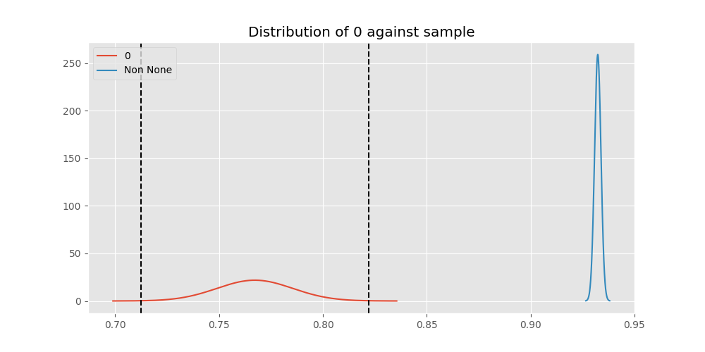
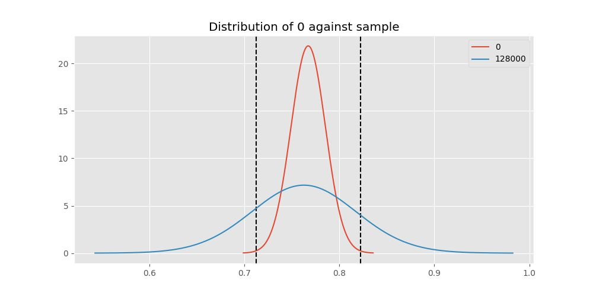
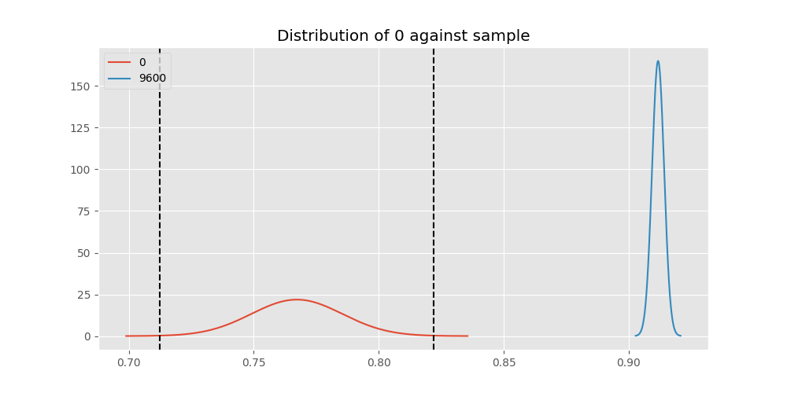
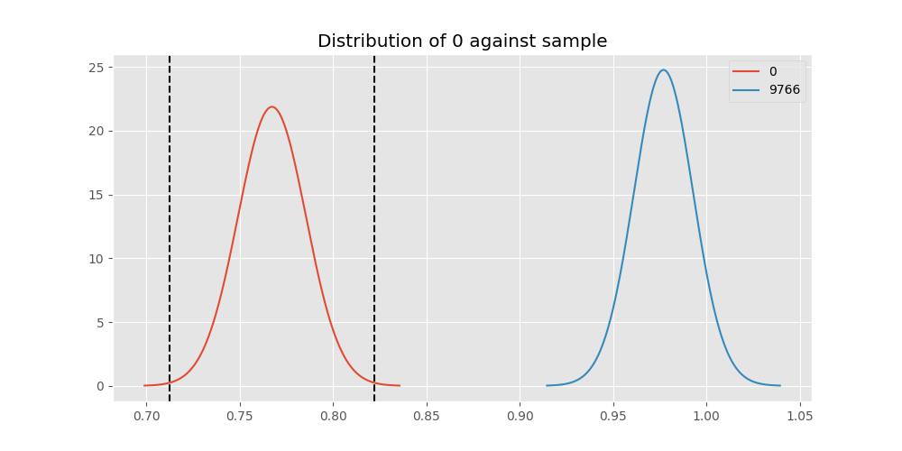
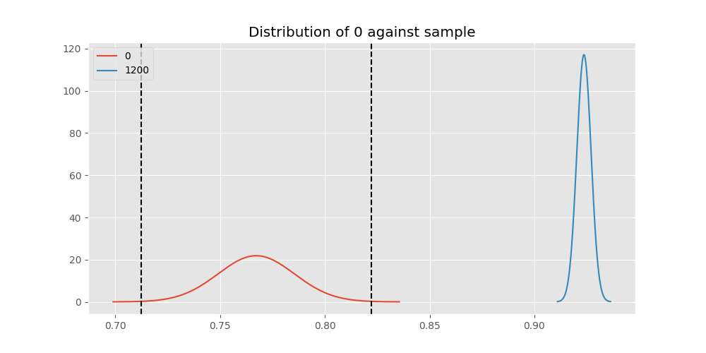
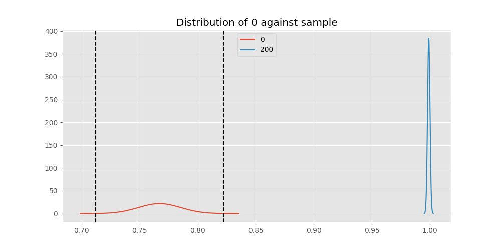
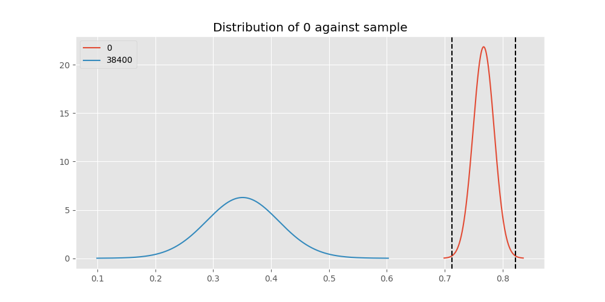
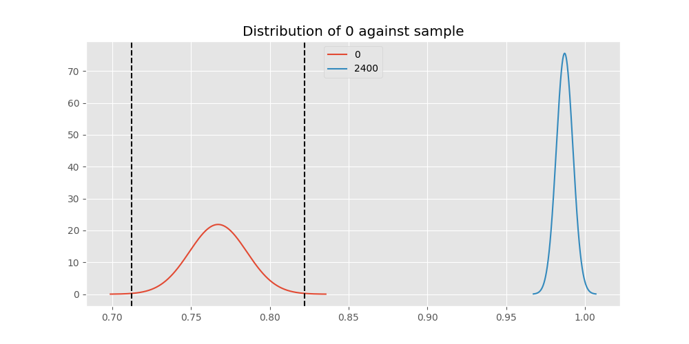
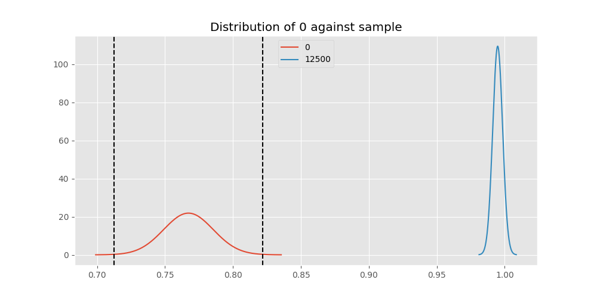
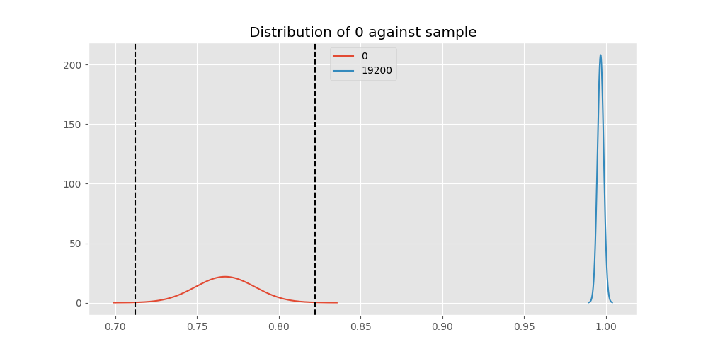

# Testing Results For 0 
$H_{0}$: There is not a difference in collection success against 0 
$H_{A}$: There is a difference in collection success against 0
An $\alpha$ of 0.002777777777777778 was used 
Out of 10 tests, there were 9 rejections from 10 independent-t test.
Out of 10 tests, there were 9 rejections from 10 Man Whitney u-tests.
## Testing Results for 0 against 128000 
0 has a success rate of 0.7672253258845437
128000 has a success rate of 0.7627118644067796
$H_{0}$: There is not a difference between 0 and 128000
$H_{A}$: There is a difference between 0 and 128000
An $/alpha$ of 0.002777777777777778 was used in this test.
__independent t-testing__: With a t-statistic of 0.07768779899684217 and a p-value of 0.9381025609323895, _we failed to reject the null hypothssis_
__Man-Whitney testing__: With a u-statistic of 15913.0 and a p-value of 0.9384572465807447, _we failed to reject the null hypothssis_
 
## Testing Results for 0 against 9600 
0 has a success rate of 0.7672253258845437
9600 has a success rate of 0.911736952892502
$H_{0}$: There is not a difference between 0 and 9600
$H_{A}$: There is a difference between 0 and 9600
An $/alpha$ of 0.002777777777777778 was used in this test.
__independent t-testing__: With a t-statistic of -11.324523650927388 and a p-value of 1.3259976730946525e-29, _we **reject** the null hypothssis_
__Man-Whitney testing__: With a u-statistic of 3164558.0 and a p-value of 1.753564103693323e-29, _we **reject** the null hypothssis_
 
## Testing Results for 0 against 9766 
0 has a success rate of 0.7672253258845437
9766 has a success rate of 0.9770114942528736
$H_{0}$: There is not a difference between 0 and 9766
$H_{A}$: There is a difference between 0 and 9766
An $/alpha$ of 0.002777777777777778 was used in this test.
__independent t-testing__: With a t-statistic of -8.605062254242863 and a p-value of 2.5418634260695767e-16, _we **reject** the null hypothssis_
__Man-Whitney testing__: With a u-statistic of 18459.0 and a p-value of 6.654017373638392e-06, _we **reject** the null hypothssis_
 
## Testing Results for 0 against 1200 
0 has a success rate of 0.7672253258845437
1200 has a success rate of 0.9236590983876275
$H_{0}$: There is not a difference between 0 and 1200
$H_{A}$: There is a difference between 0 and 1200
An $/alpha$ of 0.002777777777777778 was used in this test.
__independent t-testing__: With a t-statistic of -12.338645074999013 and a p-value of 1.344687073822695e-34, _we **reject** the null hypothssis_
__Man-Whitney testing__: With a u-statistic of 1376652.0 and a p-value of 3.111230149377629e-34, _we **reject** the null hypothssis_
 
## Testing Results for 0 against 4800 
0 has a success rate of 0.7672253258845437
4800 has a success rate of 0.9839944328462074
$H_{0}$: There is not a difference between 0 and 4800
$H_{A}$: There is a difference between 0 and 4800
An $/alpha$ of 0.002777777777777778 was used in this test.
__independent t-testing__: With a t-statistic of -11.778958496071532 and a p-value of 9.793373525799629e-29, _we **reject** the null hypothssis_
__Man-Whitney testing__: With a u-statistic of 604395.0 and a p-value of 4.513236216865601e-99, _we **reject** the null hypothssis_
 
## Testing Results for 0 against 200 
0 has a success rate of 0.7672253258845437
200 has a success rate of 0.998960498960499
$H_{0}$: There is not a difference between 0 and 200
$H_{A}$: There is a difference between 0 and 200
An $/alpha$ of 0.002777777777777778 was used in this test.
__independent t-testing__: With a t-statistic of -12.674824040683104 and a p-value of 2.0753395343178192e-32, _we **reject** the null hypothssis_
__Man-Whitney testing__: With a u-statistic of 198440.5 and a p-value of 3.5337291298344174e-54, _we **reject** the null hypothssis_
 
## Testing Results for 0 against 38400 
0 has a success rate of 0.7672253258845437
38400 has a success rate of 0.3508771929824561
$H_{0}$: There is not a difference between 0 and 38400
$H_{A}$: There is a difference between 0 and 38400
An $/alpha$ of 0.002777777777777778 was used in this test.
__independent t-testing__: With a t-statistic of 6.968889126694881 and a p-value of 8.543776187854162e-12, _we **reject** the null hypothssis_
__Man-Whitney testing__: With a u-statistic of 21676.5 and a p-value of 2.0191172537909124e-11, _we **reject** the null hypothssis_
 
## Testing Results for 0 against 2400 
0 has a success rate of 0.7672253258845437
2400 has a success rate of 0.9869848156182213
$H_{0}$: There is not a difference between 0 and 2400
$H_{A}$: There is a difference between 0 and 2400
An $/alpha$ of 0.002777777777777778 was used in this test.
__independent t-testing__: With a t-statistic of -11.564413568596311 and a p-value of 3.6621735248562655e-28, _we **reject** the null hypothssis_
__Man-Whitney testing__: With a u-statistic of 96577.0 and a p-value of 1.2561123971756823e-24, _we **reject** the null hypothssis_
 
## Testing Results for 0 against 12500 
0 has a success rate of 0.7672253258845437
12500 has a success rate of 0.9948320413436692
$H_{0}$: There is not a difference between 0 and 12500
$H_{A}$: There is a difference between 0 and 12500
An $/alpha$ of 0.002777777777777778 was used in this test.
__independent t-testing__: With a t-statistic of -12.227191223624455 and a p-value of 9.680820394902087e-31, _we **reject** the null hypothssis_
__Man-Whitney testing__: With a u-statistic of 80259.0 and a p-value of 3.8405522713884295e-23, _we **reject** the null hypothssis_
 
## Testing Results for 0 against 19200 
0 has a success rate of 0.7672253258845437
19200 has a success rate of 0.9966777408637874
$H_{0}$: There is not a difference between 0 and 19200
$H_{A}$: There is a difference between 0 and 19200
An $/alpha$ of 0.002777777777777778 was used in this test.
__independent t-testing__: With a t-statistic of -12.501621221911147 and a p-value of 9.987247943338113e-32, _we **reject** the null hypothssis_
__Man-Whitney testing__: With a u-statistic of 186823.5 and a p-value of 1.6909021522913896e-49, _we **reject** the null hypothssis_
 
