# Testing Results For 1200 
$H_{0}$: There is not a difference in collection success against 1200 
$H_{A}$: There is a difference in collection success against 1200
An $\alpha$ of 0.002777777777777778 was used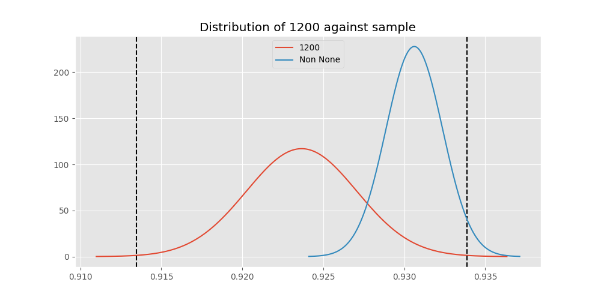 
Out of 10 tests, there were 8 rejections from 10 independent-t test.
Out of 10 tests, there were 8 rejections from 10 Man Whitney u-tests.
## Testing Results for 1200 against 128000 
1200 has a success rate of 0.9236590983876275
128000 has a success rate of 0.7627118644067796
$H_{0}$: There is not a difference between 1200 and 128000
$H_{A}$: There is a difference between 1200 and 128000
An $/alpha$ of 0.002777777777777778 was used in this test.
__independent t-testing__: With a t-statistic of 4.597908735434052 and a p-value of 4.353134301321277e-06, _we **reject** the null hypothssis_
__Man-Whitney testing__: With a u-statistic of 208159.0 and a p-value of 4.426058756436071e-06, _we **reject** the null hypothssis_
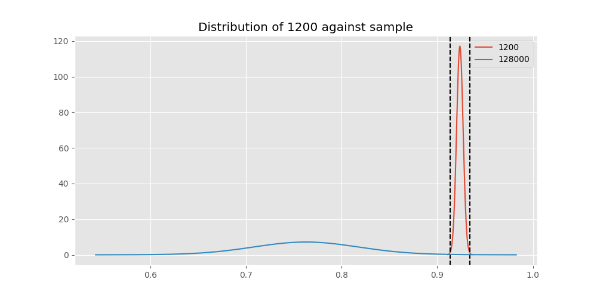 
## Testing Results for 1200 against 9600 
1200 has a success rate of 0.9236590983876275
9600 has a success rate of 0.911736952892502
$H_{0}$: There is not a difference between 1200 and 9600
$H_{A}$: There is a difference between 1200 and 9600
An $/alpha$ of 0.002777777777777778 was used in this test.
__independent t-testing__: With a t-statistic of 2.782389818920597 and a p-value of 0.005401112608021061, _we failed to reject the null hypothssis_
__Man-Whitney testing__: With a u-statistic of 42367463.0 and a p-value of 0.005403923234506852, _we failed to reject the null hypothssis_
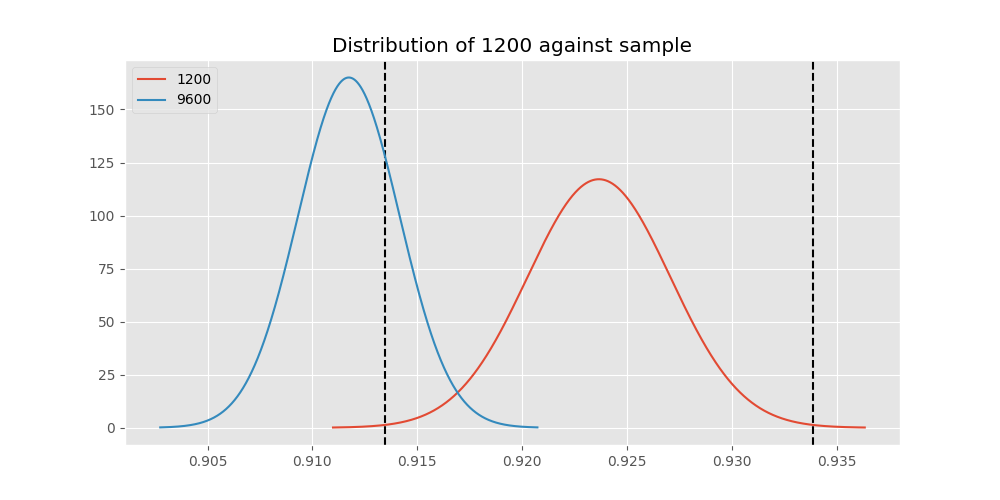 
## Testing Results for 1200 against 9766 
1200 has a success rate of 0.9236590983876275
9766 has a success rate of 0.9770114942528736
$H_{0}$: There is not a difference between 1200 and 9766
$H_{A}$: There is a difference between 1200 and 9766
An $/alpha$ of 0.002777777777777778 was used in this test.
__independent t-testing__: With a t-statistic of -1.8694799184963997 and a p-value of 0.06160345861056654, _we failed to reject the null hypothssis_
__Man-Whitney testing__: With a u-statistic of 250287.0 and a p-value of 0.06161788476978813, _we failed to reject the null hypothssis_
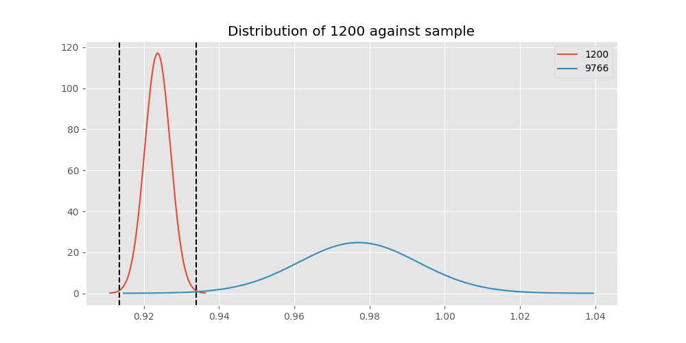 
## Testing Results for 1200 against 4800 
1200 has a success rate of 0.9236590983876275
4800 has a success rate of 0.9839944328462074
$H_{0}$: There is not a difference between 1200 and 4800
$H_{A}$: There is a difference between 1200 and 4800
An $/alpha$ of 0.002777777777777778 was used in this test.
__independent t-testing__: With a t-statistic of -14.596971968853673 and a p-value of 1.0351687949868588e-47, _we **reject** the null hypothssis_
__Man-Whitney testing__: With a u-statistic of 8207112.0 and a p-value of 1.349762752223752e-30, _we **reject** the null hypothssis_
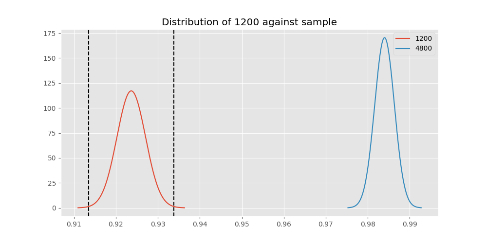 
## Testing Results for 1200 against 200 
1200 has a success rate of 0.9236590983876275
200 has a success rate of 0.998960498960499
$H_{0}$: There is not a difference between 1200 and 200
$H_{A}$: There is a difference between 1200 and 200
An $/alpha$ of 0.002777777777777778 was used in this test.
__independent t-testing__: With a t-statistic of -21.14355928380839 and a p-value of 3.43289708798429e-96, _we **reject** the null hypothssis_
__Man-Whitney testing__: With a u-statistic of 2703373.0 and a p-value of 2.3986264043579845e-18, _we **reject** the null hypothssis_
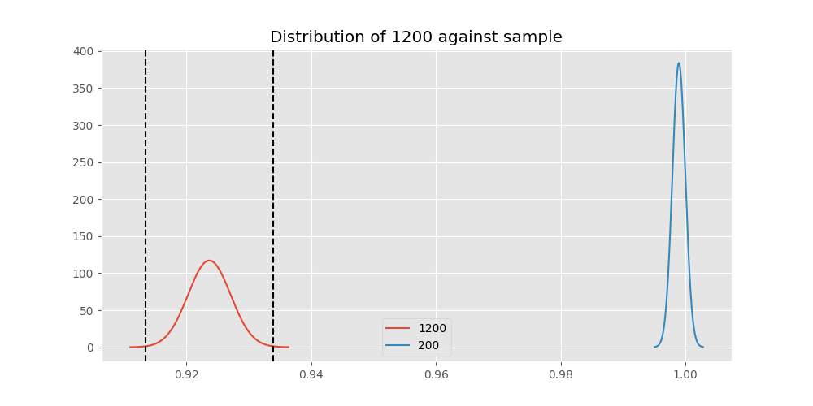 
## Testing Results for 1200 against 38400 
1200 has a success rate of 0.9236590983876275
38400 has a success rate of 0.3508771929824561
$H_{0}$: There is not a difference between 1200 and 38400
$H_{A}$: There is a difference between 1200 and 38400
An $/alpha$ of 0.002777777777777778 was used in this test.
__independent t-testing__: With a t-statistic of 16.041362956890854 and a p-value of 9.266144581959505e-57, _we **reject** the null hypothssis_
__Man-Whitney testing__: With a u-statistic of 272442.0 and a p-value of 1.1701290907708633e-55, _we **reject** the null hypothssis_
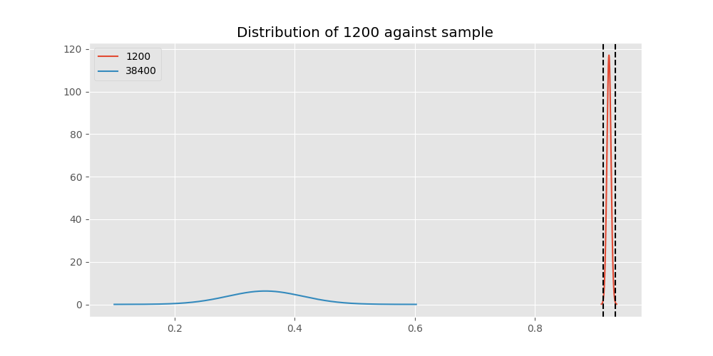 
## Testing Results for 1200 against 2400 
1200 has a success rate of 0.9236590983876275
2400 has a success rate of 0.9869848156182213
$H_{0}$: There is not a difference between 1200 and 2400
$H_{A}$: There is a difference between 1200 and 2400
An $/alpha$ of 0.002777777777777778 was used in this test.
__independent t-testing__: With a t-statistic of -10.072165461757722 and a p-value of 1.076809011154562e-22, _we **reject** the null hypothssis_
__Man-Whitney testing__: With a u-statistic of 1312261.0 and a p-value of 3.8779630380773803e-07, _we **reject** the null hypothssis_
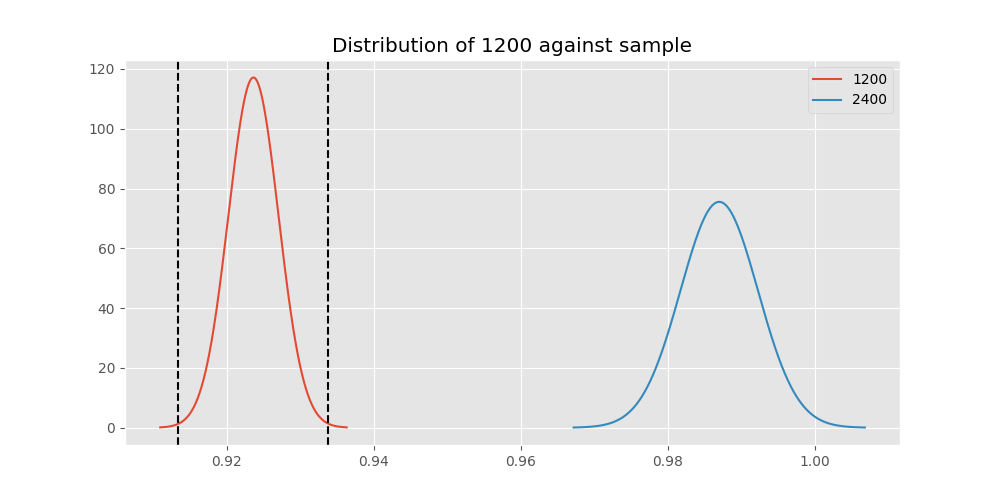 
## Testing Results for 1200 against 12500 
1200 has a success rate of 0.9236590983876275
12500 has a success rate of 0.9948320413436692
$H_{0}$: There is not a difference between 1200 and 12500
$H_{A}$: There is a difference between 1200 and 12500
An $/alpha$ of 0.002777777777777778 was used in this test.
__independent t-testing__: With a t-statistic of -14.256687696045969 and a p-value of 6.213029672715101e-43, _we **reject** the null hypothssis_
__Man-Whitney testing__: With a u-statistic of 1092387.0 and a p-value of 1.5302871199433986e-07, _we **reject** the null hypothssis_
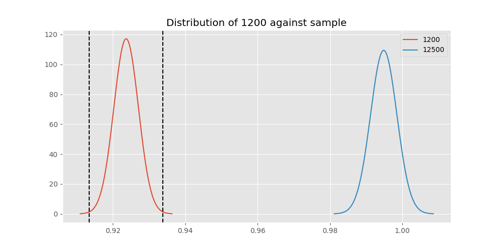 
## Testing Results for 1200 against 19200 
1200 has a success rate of 0.9236590983876275
19200 has a success rate of 0.9966777408637874
$H_{0}$: There is not a difference between 1200 and 19200
$H_{A}$: There is a difference between 1200 and 19200
An $/alpha$ of 0.002777777777777778 was used in this test.
__independent t-testing__: With a t-statistic of -18.683321379119832 and a p-value of 7.428316406585156e-76, _we **reject** the null hypothssis_
__Man-Whitney testing__: With a u-statistic of 2543838.0 and a p-value of 2.524343955037696e-16, _we **reject** the null hypothssis_
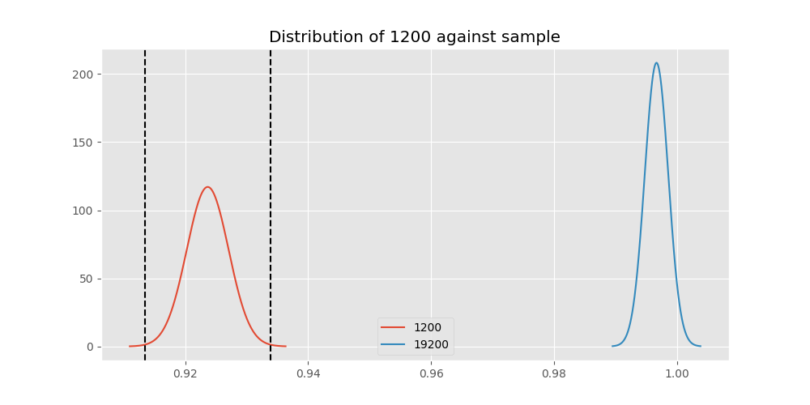 
## Testing Results for 1200 against 0 
1200 has a success rate of 0.9236590983876275
0 has a success rate of 0.7672253258845437
$H_{0}$: There is not a difference between 1200 and 0
$H_{A}$: There is a difference between 1200 and 0
An $/alpha$ of 0.002777777777777778 was used in this test.
__independent t-testing__: With a t-statistic of 12.338645074999013 and a p-value of 1.344687073822695e-34, _we **reject** the null hypothssis_
__Man-Whitney testing__: With a u-statistic of 1887234.0 and a p-value of 3.111230149377629e-34, _we **reject** the null hypothssis_
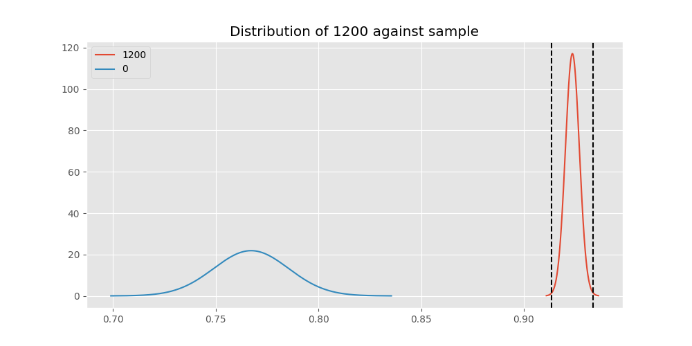 
