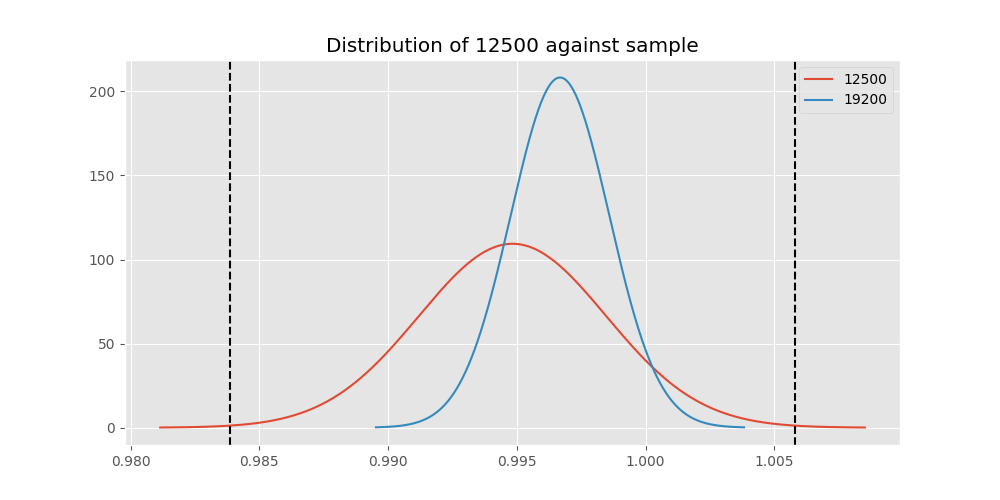

# Testing Results For 12500 
$H_{0}$: There is not a difference in collection success against 12500 
$H_{A}$: There is a difference in collection success against 12500
An $\alpha$ of 0.002777777777777778 was used 
Out of 10 tests, there were 5 rejections from 10 independent-t test.
Out of 10 tests, there were 5 rejections from 10 Man Whitney u-tests.
## Testing Results for 12500 against 128000 
12500 has a success rate of 0.9948320413436692
128000 has a success rate of 0.7627118644067796
$H_{0}$: There is not a difference between 12500 and 128000
$H_{A}$: There is a difference between 12500 and 128000
An $/alpha$ of 0.002777777777777778 was used in this test.
__independent t-testing__: With a t-statistic of 9.832653813734224 and a p-value of 8.985039222277322e-21, _we **reject** the null hypothssis_
__Man-Whitney testing__: With a u-statistic of 14066.5 and a p-value of 4.720855765423271e-19, _we **reject** the null hypothssis_
 
## Testing Results for 12500 against 9600 
12500 has a success rate of 0.9948320413436692
9600 has a success rate of 0.911736952892502
$H_{0}$: There is not a difference between 12500 and 9600
$H_{A}$: There is a difference between 12500 and 9600
An $/alpha$ of 0.002777777777777778 was used in this test.
__independent t-testing__: With a t-statistic of 5.756872152846068 and a p-value of 8.746265269633647e-09, _we **reject** the null hypothssis_
__Man-Whitney testing__: With a u-statistic of 2887368.5 and a p-value of 8.906524380552604e-09, _we **reject** the null hypothssis_
 
## Testing Results for 12500 against 9766 
12500 has a success rate of 0.9948320413436692
9766 has a success rate of 0.9770114942528736
$H_{0}$: There is not a difference between 12500 and 9766
$H_{A}$: There is a difference between 12500 and 9766
An $/alpha$ of 0.002777777777777778 was used in this test.
__independent t-testing__: With a t-statistic of 1.6431104083306876 and a p-value of 0.10102603779884425, _we failed to reject the null hypothssis_
__Man-Whitney testing__: With a u-statistic of 17134.5 and a p-value of 0.10154016890477036, _we failed to reject the null hypothssis_
 
## Testing Results for 12500 against 1200 
12500 has a success rate of 0.9948320413436692
1200 has a success rate of 0.9236590983876275
$H_{0}$: There is not a difference between 12500 and 1200
$H_{A}$: There is a difference between 12500 and 1200
An $/alpha$ of 0.002777777777777778 was used in this test.
__independent t-testing__: With a t-statistic of 5.259723960584587 and a p-value of 1.4890747858660757e-07, _we **reject** the null hypothssis_
__Man-Whitney testing__: With a u-statistic of 1259799.0 and a p-value of 1.5302871199433986e-07, _we **reject** the null hypothssis_
 
## Testing Results for 12500 against 4800 
12500 has a success rate of 0.9948320413436692
4800 has a success rate of 0.9839944328462074
$H_{0}$: There is not a difference between 12500 and 4800
$H_{A}$: There is a difference between 12500 and 4800
An $/alpha$ of 0.002777777777777778 was used in this test.
__independent t-testing__: With a t-statistic of 1.6621971584750204 and a p-value of 0.09656941847011857, _we failed to reject the null hypothssis_
__Man-Whitney testing__: With a u-statistic of 562146.0 and a p-value of 0.09659098663665654, _we failed to reject the null hypothssis_
 
## Testing Results for 12500 against 200 
12500 has a success rate of 0.9948320413436692
200 has a success rate of 0.998960498960499
$H_{0}$: There is not a difference between 12500 and 200
$H_{A}$: There is a difference between 12500 and 200
An $/alpha$ of 0.002777777777777778 was used in this test.
__independent t-testing__: With a t-statistic of -1.087949201588608 and a p-value of 0.2771999020492886, _we failed to reject the null hypothssis_
__Man-Whitney testing__: With a u-statistic of 185378.5 and a p-value of 0.14581120331065603, _we failed to reject the null hypothssis_
 
## Testing Results for 12500 against 38400 
12500 has a success rate of 0.9948320413436692
38400 has a success rate of 0.3508771929824561
$H_{0}$: There is not a difference between 12500 and 38400
$H_{A}$: There is a difference between 12500 and 38400
An $/alpha$ of 0.002777777777777778 was used in this test.
__independent t-testing__: With a t-statistic of 24.661888190055446 and a p-value of 4.29828776410171e-85, _we **reject** the null hypothssis_
__Man-Whitney testing__: With a u-statistic of 18132.0 and a p-value of 9.846957612520742e-58, _we **reject** the null hypothssis_
 
## Testing Results for 12500 against 2400 
12500 has a success rate of 0.9948320413436692
2400 has a success rate of 0.9869848156182213
$H_{0}$: There is not a difference between 12500 and 2400
$H_{A}$: There is a difference between 12500 and 2400
An $/alpha$ of 0.002777777777777778 was used in this test.
__independent t-testing__: With a t-statistic of 1.177003967210446 and a p-value of 0.2395249603321808, _we failed to reject the null hypothssis_
__Man-Whitney testing__: With a u-statistic of 89903.5 and a p-value of 0.2396365187813544, _we failed to reject the null hypothssis_
 
## Testing Results for 12500 against 19200 
12500 has a success rate of 0.9948320413436692
19200 has a success rate of 0.9966777408637874
$H_{0}$: There is not a difference between 12500 and 19200
$H_{A}$: There is a difference between 12500 and 19200
An $/alpha$ of 0.002777777777777778 was used in this test.
__independent t-testing__: With a t-statistic of -0.4885645605997094 and a p-value of 0.6252331782784586, _we failed to reject the null hypothssis_
__Man-Whitney testing__: With a u-statistic of 174408.0 and a p-value of 0.6255843978204252, _we failed to reject the null hypothssis_
 
## Testing Results for 12500 against 0 
12500 has a success rate of 0.9948320413436692
0 has a success rate of 0.7672253258845437
$H_{0}$: There is not a difference between 12500 and 0
$H_{A}$: There is a difference between 12500 and 0
An $/alpha$ of 0.002777777777777778 was used in this test.
__independent t-testing__: With a t-statistic of 10.475668104084034 and a p-value of 2.439671021501251e-24, _we **reject** the null hypothssis_
__Man-Whitney testing__: With a u-statistic of 127560.0 and a p-value of 3.8405522713884295e-23, _we **reject** the null hypothssis_
 
